Decision Engineering

Mark Sh. Levin

# Modular System Design and Evaluation

DECISION ENGINEERING (Logo)
Springer

# Decision Engineering

**Series editor**

Rajkumar Roy, Cranfield, Bedfordshire, UK

More information about this series at http://www.springer.com/series/5112

Mark Sh. Levin

# Modular System Design and Evaluation

Springer

Mark Sh. Levin
Institute for Information Transmission
Problems (Kharkevich Institute)
Russian Academy of Sciences
Moscow
Russia

<table>
  <tbody>
    <tr>
        <td>ISSN 1619-5736</td>
        <td>ISSN 2197-6589 (electronic)</td>
    </tr>
    <tr>
        <td>ISBN 978-3-319-09875-3</td>
        <td>ISBN 978-3-319-09876-0 (eBook)</td>
    </tr>
    <tr>
        <td>DOI 10.1007/978-3-319-09876-0</td>
        <td></td>
    </tr>
  </tbody>
</table>

Library of Congress Control Number: 2014947140

Springer Cham Heidelberg New York Dordrecht London

© Springer International Publishing Switzerland 2015
This work is subject to copyright. All rights are reserved by the Publisher, whether the whole or part of the material is concerned, specifically the rights of translation, reprinting, reuse of illustrations, recitation, broadcasting, reproduction on microfilms or in any other physical way, and transmission or information storage and retrieval, electronic adaptation, computer software, or by similar or dissimilar methodology now known or hereafter developed. Exempted from this legal reservation are brief excerpts in connection with reviews or scholarly analysis or material supplied specifically for the purpose of being entered and executed on a computer system, for exclusive use by the purchaser of the work. Duplication of this publication or parts thereof is permitted only under the provisions of the Copyright Law of the Publisher's location, in its current version, and permission for use must always be obtained from Springer. Permissions for use may be obtained through RightsLink at the Copyright Clearance Center. Violations are liable to prosecution under the respective Copyright Law.
The use of general descriptive names, registered names, trademarks, service marks, etc. in this publication does not imply, even in the absence of a specific statement, that such names are exempt from the relevant protective laws and regulations and therefore free for general use.
While the advice and information in this book are believed to be true and accurate at the date of publication, neither the authors nor the editors nor the publisher can accept any legal responsibility for any errors or omissions that may be made. The publisher makes no warranty, express or implied, with respect to the material contained herein.

Printed on acid-free paper

Springer is part of Springer Science+Business Media (www.springer.com)

*The book is dedicated to my lecturers and advisors:*
*(a) Moscow Technical University of Communications and Informatics (BS and MS program, 1965–1970, Radio Engineering);*
*(b) Lomonosov Moscow State University (MS program, 1971–1975, Mathematics);*
*(c) Lomonosov Moscow State University (Ph.D. program, 1977–1981, Mathematics and Computers in Management)*

# Preface

The frame approach for representing knowledge (i.e., collection of frames are linked together into frame-system) has been suggested by Marvin Minsky. In this approach, the frame corresponds to a data structure. In general, it is possible to consider the following three-component system: initial data/information, problem (s) (and corresponding models), and algorithm (or interactive procedure). For many complex applied problems, it is reasonable to examine special composite frameworks (i.e., composite solving schemes) consisting of problems (and corresponding models), which are interconnected/linked (e.g., by preference relation). For example, a basic simplified framework for data processing can be described as follows:

(a) analysis of input data/information and preliminary processing;
(b) processing; and
(c) analysis of results.

Another example of a framework is well-known in decision-making. Herbert A. Simon has suggested his framework for rational decision-making (choice problem): (i) the identification and listing of all the alternatives, (ii) determination of all the consequences resulting from each of the alternatives, and (iii) the comparison of the accuracy and efficiency of each of theses sets of consequences. A modified version of this decision-making framework is the following:

*Stage 1.* Analysis of the examined system/process, extraction of the problem.
*Stage 2.* Structuring of the decision-making problem:
- 2.1 generation of an alternatives set,
- 2.2 generation of criteria for evaluation of the alternatives and generation of a scale for each criterion.

*Stage 3.* Obtaining the initial information (estimates of the alternatives, preferences over the alternatives).
*Stage 4.* Solving process to obtain the decision(s).
*Stage 5.* Analysis of the obtained decision(s).

vii

viii Preface

Now there exists a trend to design, to describe, and to use a set of basic typical engineering (technological) frameworks (i.e., typical composite combinatorial solving schemes), which can be considered as basic standard blocks in systems research/design and in systems education (engineering, computer science, applied mathematics).

In recent decades, modular approaches have been used in all engineering domains. Thus, many systems can be designed (composed) from basic modules (e.g., software engineering, computer engineering, information engineering, method engineering, protocol engineering, industrial engineering). Evidently, special combinatorial methods have to be studied and applied for system analysis/design at all stages of the system life cycles. The methods can have the following structure types: series, parallel, series-parallel, cascade-like. Here, the following basic problems are very important: (1) partitioning the initial problem (or partitioning the examined system), (2) solving the local problems, and (3) aggregation of solutions for the local problems above into the global system solution.

The material of this book enhances the materials of the previous author’s books: “Composite Systems Decisions”, Springer, 2006; “Combinatorial Engineering of Decomposable Systems”, Springer, 1998. The book contains an author’s attempt to examine a new

“Decision Support Technology Platform for Modular Systems”

as a set of typical combinatorial engineering frameworks for hierarchical modular systems (with hierarchical structures). This approach is based on the following five-layer architecture:

*Layer 1.* Basic combinatorial optimization problems (e.g., knapsack problem, multiple choice problem, multicriteria ranking/selection, clustering, minimum spanning tree problem, minimum Steiner tree problem, clique problem).

*Layer 2.* Complex (e.g., multicriteria) combinatorial optimization problems (e.g., multicriteria knapsack-like problems, multicriteria multiple choice problem, multicriteria Steiner tree, morphological clique problem, design of multilayer network topology).

*Layer 3.* Basic support frameworks (e.g., hierarchical design, aggregation of structures, restructuring of knapsack problem, restructuring of multiple choice problem).

*Layer 4.* Combinatorial engineering frameworks (consisting of a set of linked combinatorial problems) (e.g., hierarchical system modeling, design, evaluation, detection of bottlenecks, improvement, design of trajectory, combinatorial evolution, and forecasting).

*Layer 5.* Applied combinatorial engineering frameworks (e.g., modeling, design and improvement of system components for information-communication systems).

Note, engineering system design/synthesis can be considered/implemented on the basis of various methods, for example: design principles and systematic invention, general design theory as theory of knowledge, theory of technical systems, knowledge operations (reasoning, etc.), prototype-based design, morphological analysis, design catalogues based methods, system configuration design

Preface
ix

based on AI methods, TRIZ (the Altshullerian approach to solving innovation problems), synthesis based on function-means trees, and synthesis of system topology using genetic programming. In this book, basic standard combinatorial engineering (technological) frameworks for modular systems are systematically described while taking into account the system life cycles (i.e., layer 4 above):

*Framework 1.* Design of system hierarchical model.
*Framework 2.* Combinatorial synthesis (“bottom-up” process for system design).
*Framework 3.* System evaluation (for system parts/components, for whole system).
*Framework 4.* Detection of system bottlenecks (e.g., by system elements, by compatibility of system elements, by system structure).
*Framework 5.* System improvement (redesign, upgrade, extension).
*Framework 6.* Multistage design (design of system trajectory).
*Framework 7.* Combinatorial modeling of system evolution/development and system forecasting.

The material extends previous author’s publications by the following ways:

(a) description of hierarchical structures and their design,
(b) description of system bottlenecks and approaches to their detection,
(c) description and usage of new interval multiset estimates,
(d) special description of system configuration based on combinatorial optimization,
(e) description of combinatorial synthesis based on interval multiset estimates for system components,
(f) description of special procedures for aggregation of modular solutions,
(g) brief description of a new restructuring approach in combinatorial optimization, and
(h) a set of various new applied examples for some parts of information technology (e.g., electronic shopping, Web-based system, integrated security system, telemetry system, wireless sensor, communication protocol, and standard for multimedia information).

The applied examples are based on the usage of the suggested combinatorial engineering frameworks including new methods above (e.g., interval multiset estimates, aggregation of structured solutions, system design, and system improvement). Generally, the suggested material corresponds to modular systems engineering in the field of information technology, but suggested approaches (frameworks) can be successfully applied in many domains (engineering, computer science, applied mathematics, management, social engineering).

The book consists of two parts:

The first part of the book (*Basic Combinatorial Engineering Frameworks*) involves the following: description of basic hierarchical system structures and basic standard combinatorial engineering frameworks (i.e., hierarchical system modeling, combinatorial synthesis, system evaluation, detection of system bottlenecks, system improvement, design of system trajectory, combinatorial system evolution, and

x Preface

forecasting). Here, our version of morphological design approach plays a central role. In addition, a special attention is targeted to system configuration problems.

The second part of the book (*Applications in Information-Communication Systems*) contains the following real-world applied examples: description of applications (composite solving strategy for multicriteria ranking, electronic shopping of composite product, Web-based system, integrated security system, connection of end-users and access points in communication network, telemetry system, MPEG-like standard for multimedia information processing, wireless sensor, ZigBee communication protocol, management system for smart homes). In each applied example above, several combinatorial engineering frameworks are used, for example: (a) hierarchical system modeling, system design, system improvement, (b) hierarchical system modeling, system design, combinatorial system evolution and forecasting. The applications described can be used as a set of basic analogues (prototypes) for various applied domains.

In general, the book can be considered as an information and operation environment for hierarchical modular systems: combinatorial modeling, processing (design, evaluation, improvement, forecasting, etc.). In fact, this material corresponds to a "combinatorial ABC-book" for modular systems and/or for decision-making based on composite decisions (composite alternatives).

A preliminary version of this book was published as an electronic book in Russian:

Mark Sh. Levin, Decision Support Technology for Modular Systems. Electronic book, 2013 (in Russian); http://www.mslevin.iitp.ru/Levin-bk-Nov2013-071.pdf

This may be of interest to Russian-language readers.

The suggested book is oriented to applied researchers, students, and practitioners in many domains. Concurrently, the material will be of interest to various scientists (e.g., computer scientists, mathematicians, economists, social engineers). In addition, the book can be used as a useful text for some educational courses (e.g., systems engineering, system design, life cycle engineering, engineering design, combinatorial synthesis) at various levels: senior undergraduate level (a compressed version), graduate/Ph.D. levels, and for continuing education. The material of the book will be useful for modular curriculum design including the design of individual student educational programs.

Moscow, June 2014 Mark Sh. Levin

# Acknowledgments

First, I am grateful IEEE for the permission to use some materials from my published conference papers:

Levin MS (2009) Towards morphological system design. In: Proc. of 7th IEEE Int. Conf. on Industrial Informatics INDIN-2009, Cardiff, UK, pp. 95–100
Levin MS (2010) Towards communication network development. In: Proc. of IEEE Region 8 Int. Conf. SIBIRCON-2010, Irkutsk, Russia, vol. 1, pp. 204–208
Levin MS, Andrushevich A, Kistler R, Klapproth A (2010) Combinatorial evolution of ZigBee protocol. In: Proc. of IEEE Region 8 Int. Conf. SIBIRCON-2010, Irkutsk, Russia, vol. 1, pp. 314–319

Second, I thank my students in Moscow Institute of Physics and Technology (State University) for our successful joint research projects (2004–2012): Alexander V. Safonov (improvement of communication networks), Rustem I. Nuriakhmetov (multicriteria Steiner problem), Maxim V. Petukhov (connection of end-users and access points), Andrey V. Leus (integrated security system), Alexander V. Fimin (wireless sensor), Igor A. Khodakovsky (telemetry system), Roman O. Vishnitsky (GSM network), Alexey O. Merzlyakov (testing of microprocessor systems), and Anton A. Zamkovoy (multicriteria Steiner problem with cost of Steiner nodes).

Third, I thank colleagues from Lucerne University of Applied Science (Switzerland, CEESAR-iHomeLab) for our successful research collaboration in the fields of management systems for smart homes and ZigBee communication protocol for sensor networks (2009–2011): Aliaksei Andruchevich, Alexander Klapproth, Rolf Kistler.

Four, I would like to acknowledge the Institute for Information Transmission Problems (Kharkevich Institute) of Russian Academy of Sciences where I am working (recent 10 years).

xi

# Contents

**1 Modular Systems, Combinatorial Engineering Frameworks** . . . . . 1
      1.1 Preliminaries . . . . . . . . . . . . . . . . . . . . . . . . . . . . . . . . . . . . . . . . . . . . . . . . 1
      1.2 Basic Types of Hierarchies. . . . . . . . . . . . . . . . . . . . . . . . . . . . . . . . . . . . 4
      1.3 Combinatorial Engineering Frameworks. . . . . . . . . . . . . . . . . . . . . . . . 7
      1.4 Summary . . . . . . . . . . . . . . . . . . . . . . . . . . . . . . . . . . . . . . . . . . . . . . . . . . . 9

**2 Methods of Morphological Design (Synthesis)**. . . . . . . . . . . . . . . . . . . . 11
      2.1 Introduction . . . . . . . . . . . . . . . . . . . . . . . . . . . . . . . . . . . . . . . . . . . . . . . . 11
      2.2 Morphological Design Approaches . . . . . . . . . . . . . . . . . . . . . . . . . . . . 14
            2.2.1 Morphological Analysis . . . . . . . . . . . . . . . . . . . . . . . . . . . . . . . . 14
            2.2.2 Method of Closeness to Ideal Point. . . . . . . . . . . . . . . . . . . . . . 15
            2.2.3 Pareto-Based Morphological Approach . . . . . . . . . . . . . . . . . . 16
            2.2.4 Linear Programming . . . . . . . . . . . . . . . . . . . . . . . . . . . . . . . . . . 16
            2.2.5 Multiple Choice Problem . . . . . . . . . . . . . . . . . . . . . . . . . . . . . . 17
            2.2.6 Assignment/Allocation Problems. . . . . . . . . . . . . . . . . . . . . . . . 18
            2.2.7 Hierarchical Morphological Multicriteria<br/>Design (HMMD) . . . . . . . . . . . . . . . . . . . . . . . . . . . . . . . . . . . . 19
      2.3 Design Examples for GSM Network . . . . . . . . . . . . . . . . . . . . . . . . . . . 21
            2.3.1 Initial Example . . . . . . . . . . . . . . . . . . . . . . . . . . . . . . . . . . . . . . . 22
            2.3.2 Morphological Analysis . . . . . . . . . . . . . . . . . . . . . . . . . . . . . . . . 23
            2.3.3 Method of Closeness to Ideal Point. . . . . . . . . . . . . . . . . . . . . . 25
            2.3.4 Pareto-Based Morphological Analysis . . . . . . . . . . . . . . . . . . . 28
            2.3.5 Multiple Choice Problem . . . . . . . . . . . . . . . . . . . . . . . . . . . . . . 29
            2.3.6 Hierarchical Morphological Design . . . . . . . . . . . . . . . . . . . . . 30
            2.3.7 Comparison of Methods and Discussion . . . . . . . . . . . . . . . . . 32
      2.4 Towards Other Approaches . . . . . . . . . . . . . . . . . . . . . . . . . . . . . . . . . . . 34
      2.5 Summary . . . . . . . . . . . . . . . . . . . . . . . . . . . . . . . . . . . . . . . . . . . . . . . . . . . 36

**3 Multiset Estimates and Combinatorial Synthesis** . . . . . . . . . . . . . . . . . . 37
      3.1 Introduction . . . . . . . . . . . . . . . . . . . . . . . . . . . . . . . . . . . . . . . . . . . . . . . . 37
      3.2 Basic Assessment Problems . . . . . . . . . . . . . . . . . . . . . . . . . . . . . . . . . . . 39

xiii

xiv Contents

*   3.3 Operations Over Multiset Estimates ........................ 40
    *   3.3.1 Integrated Estimates ............................ 41
    *   3.3.2 Vector-Like Proximity ........................... 43
    *   3.3.3 Comparison of Estimates ......................... 45
    *   3.3.4 Aggregation of Estimates ........................ 46
    *   3.3.5 Alignment of Estimates .......................... 47
*   3.4 Combinatorial Synthesis (Morphological Approach) ................ 48
    *   3.4.1 Example: Basic HMMD, Three-Component System ................................... 49
    *   3.4.2 Example: Basic HMMD, Four-Component System ... 49
    *   3.4.3 Modified Version of HMMD Method ............... 50
    *   3.4.4 Example: Three-Component System, Three-Element Assessment ................................. 53
    *   3.4.5 Example: Four-Component System, Four Elements Assessment ................................. 54
    *   3.4.6 Example: Three-Layer Hierarchical System ........ 57
*   3.5 Multiset Estimates in Knapsack-Like Problems ................ 60
*   3.6 Multiset Estimates and Multi-attribute Alternatives ........... 64
*   3.7 Summary .......................................... 66

# 4 Design of Hierarchical Structure ........................ 67
*   4.1 Introduction ....................................... 67
*   4.2 Expert Based 'Top-Down' Procedure .................... 68
*   4.3 Hierarchical Clustering .............................. 69
*   4.4 Towards Ontology ................................... 71
*   4.5 Spanning Trees ..................................... 72
*   4.6 Towards Optimal Organizational Hierarchies ............. 76
*   4.7 Multi-layer Structures ............................... 77
    *   4.7.1 Multi-layer Approach .......................... 77
    *   4.7.2 Typical Hierarchical Layers in Communication Network ................................... 78
    *   4.7.3 Layered K-Connected Network ................... 79
    *   4.7.4 Towards Hierarchical Network Design Problems ..... 82
    *   4.7.5 Connection in Two-Layer Network (Access Points—Users) ........................ 83
*   4.8 Morphological Hierarchy ............................. 85
*   4.9 General Design Framework for Multi-layer Structure ......... 86
*   4.10 Summary .......................................... 87

# 5 System Configuration and Combinatorial Optimization ..... 89
*   5.1 Introduction ....................................... 89
*   5.2 Underlaying Combinatorial Problems and Schemes .......... 92
    *   5.2.1 Problem of Representatives ..................... 92
    *   5.2.2 Shortest Path Problem .......................... 93

Contents
xv

*   5.2.3 Multipartite Graph Clustering and Weighted Clique in Multipartite Graph ..... 94
*   5.2.4 Extended Assignment/Allocation Problem ..... 95
*   5.2.5 Graph Coloring Problems ..... 100
*   5.2.6 Some Related Problems ..... 103
*   5.3 Applied Versions of System Configuration Problem ..... 105
*   5.4 Towards Dynamic System Reconfiguration ..... 108
*   5.5 Summary ..... 108

# 6 System Evaluation ..... 111
*   6.1 Introduction ..... 111
*   6.2 Considered Types of Assessment Scales ..... 114
*   6.3 Transformation of Scales ..... 119
*   6.4 Integration of Scales and System Quality ..... 122
*   6.5 Numerical Examples ..... 126
*   6.6 Summary ..... 129

# 7 Detection of System Bottlenecks ..... 131
*   7.1 Introduction ..... 131
*   7.2 Traditional Quality Management Methods ..... 132
*   7.3 Detection of Bottlenecks in Morphological Design ..... 137
*   7.4 Critical Elements in Multi-layer Structures/Networks ..... 140
*   7.5 Predictive Detection of System Bottlenecks ..... 142
    *   7.5.1 Predictive Detection of System Components ..... 143
    *   7.5.2 Predictive Detection of Interconnected System Components ..... 143
*   7.6 Clique-Based Fusion on Graph Streams ..... 145
    *   7.6.1 Preliminaries ..... 145
    *   7.6.2 Notations ..... 147
    *   7.6.3 Basic Problem ..... 148
    *   7.6.4 Problems over Graph Streams ..... 150
    *   7.6.5 Example ..... 151
    *   7.6.6 Discussion ..... 153
*   7.7 Summary ..... 154

# 8 System Improvement/Extension ..... 155
*   8.1 Introduction ..... 155
*   8.2 Four System Improvement Situations ..... 157
    *   8.2.1 Basic System Improvement Situation ..... 157
    *   8.2.2 Basic Improvement Situation, Combinatorial Problems ..... 159
    *   8.2.3 Additional System Improvement Situations ..... 159

xvi Contents

8.3 Approaches to System Evaluation and Improvement . . . . . . . . . . . . . . . . 160
* 8.3.1 System Quality and Improvement . . . . . . . . . . . . . . . . . . . . . . . . . . 160
* 8.3.2 Towards Reoptimization . . . . . . . . . . . . . . . . . . . . . . . . . . . . . . . . . 164
8.4 Improvement by System Components . . . . . . . . . . . . . . . . . . . . . . . . . . . . 166
* 8.4.1 Basic Framework . . . . . . . . . . . . . . . . . . . . . . . . . . . . . . . . . . . . . . . 166
* 8.4.2 Graph Vertex Recoloring Problem . . . . . . . . . . . . . . . . . . . . . . . . . 168
8.5 Modification of System Structure . . . . . . . . . . . . . . . . . . . . . . . . . . . . . . . . 170
* 8.5.1 Modification of Tree via Condensing of Weighted Edges . . . . . . . . . . . . . . . . . . . . . . . . . . . . . . . . . . . . . . . 170
* 8.5.2 Hotlink Assignment Problems . . . . . . . . . . . . . . . . . . . . . . . . . . . . . 176
* 8.5.3 Transformation of Tree into Steiner Tree . . . . . . . . . . . . . . . . . . . . 178
* 8.5.4 Augmentation Problem . . . . . . . . . . . . . . . . . . . . . . . . . . . . . . . . . . 181
* 8.5.5 Transformation of Morphological Structure . . . . . . . . . . . . . . . . . . 181
* 8.5.6 Transformation of Layered Structure . . . . . . . . . . . . . . . . . . . . . . . 182
8.6 Examples for Network Improvement/Extension . . . . . . . . . . . . . . . . . . . . 182
* 8.6.1 Network Hierarchy . . . . . . . . . . . . . . . . . . . . . . . . . . . . . . . . . . . . . . 182
* 8.6.2 Requirements/Criteria . . . . . . . . . . . . . . . . . . . . . . . . . . . . . . . . . . . 183
* 8.6.3 Network Design/Development: Basic Problems . . . . . . . . . . . . . . 183
* 8.6.4 Network Improvement . . . . . . . . . . . . . . . . . . . . . . . . . . . . . . . . . . . 184
* 8.6.5 Network Extension . . . . . . . . . . . . . . . . . . . . . . . . . . . . . . . . . . . . . . 186
8.7 Summary . . . . . . . . . . . . . . . . . . . . . . . . . . . . . . . . . . . . . . . . . . . . . . . . . . . . 190

# 9 Aggregation of Structured Solutions . . . . . . . . . . . . . . . . . . . . . . . . . . . . . 191
9.1 Introduction . . . . . . . . . . . . . . . . . . . . . . . . . . . . . . . . . . . . . . . . . . . . . . . . . 191
9.2 Auxiliary Problems and Aggregation Strategies . . . . . . . . . . . . . . . . . . . . 194
* 9.2.1 Basic Auxiliary Problems . . . . . . . . . . . . . . . . . . . . . . . . . . . . . . . . . 194
* 9.2.2 Building of "System Kernel" . . . . . . . . . . . . . . . . . . . . . . . . . . . . . . 196
* 9.2.3 Aggregation Strategies . . . . . . . . . . . . . . . . . . . . . . . . . . . . . . . . . . . 196
9.3 Examined Structures, Substructure, Superstructure . . . . . . . . . . . . . . . . . 199
* 9.3.1 Sets . . . . . . . . . . . . . . . . . . . . . . . . . . . . . . . . . . . . . . . . . . . . . . . . . . . 199
* 9.3.2 Rankings (Layered Sets) . . . . . . . . . . . . . . . . . . . . . . . . . . . . . . . . . 199
* 9.3.3 Morphological Sets . . . . . . . . . . . . . . . . . . . . . . . . . . . . . . . . . . . . . . 200
* 9.3.4 Trees and Morphological Structures . . . . . . . . . . . . . . . . . . . . . . . . 201
9.4 Preliminary Illustrative Example for Notebook . . . . . . . . . . . . . . . . . . . . 203
9.5 Metrics and Proximities . . . . . . . . . . . . . . . . . . . . . . . . . . . . . . . . . . . . . . . . 207
* 9.5.1 Metric/Proximity for Sets . . . . . . . . . . . . . . . . . . . . . . . . . . . . . . . . . 207
* 9.5.2 Proximity for Strings/Sequences . . . . . . . . . . . . . . . . . . . . . . . . . . . 208
* 9.5.3 Proximity for Rankings . . . . . . . . . . . . . . . . . . . . . . . . . . . . . . . . . . 209
* 9.5.4 Proximity for Trees . . . . . . . . . . . . . . . . . . . . . . . . . . . . . . . . . . . . . . 212
* 9.5.5 Proximity for Morphological Structures . . . . . . . . . . . . . . . . . . . . . 215
9.6 Median/Consensus Problems, Aggregation Problems . . . . . . . . . . . . . . . 217
* 9.6.1 Sets . . . . . . . . . . . . . . . . . . . . . . . . . . . . . . . . . . . . . . . . . . . . . . . . . . . 217
* 9.6.2 Rankings . . . . . . . . . . . . . . . . . . . . . . . . . . . . . . . . . . . . . . . . . . . . . . 218

Contents                                                                                             xvii

             9.6.3      Trees. . . . . . . . . . . . . . . . . . . . . . . . . . . . . . . . . . .    221
             9.6.4      Morphological Structures . . . . . . . . . . . . . . . . . . . . .            221
    9.7      Illustrative Applied Numerical Examples . . . . . . . . . . . . . . . . .                  222
             9.7.1      Continuation of Example for Notebook . . . . . . . . . . .                    222
             9.7.2      Common Educational Course . . . . . . . . . . . . . . . . . .                 225
             9.7.3      Plan of Students Art Activity . . . . . . . . . . . . . . . . . .             229
             9.7.4      Combinatorial Investment . . . . . . . . . . . . . . . . . . . .              230
             9.7.5      Modular Educational Course on Design . . . . . . . . . . .                    231
    9.8      Summary . . . . . . . . . . . . . . . . . . . . . . . . . . . . . . . . . . . . . .      245

10  Multistage Design . . . . . . . . . . . . . . . . . . . . . . . . . . . . . . . . . . . .         247
    10.1     Introduction . . . . . . . . . . . . . . . . . . . . . . . . . . . . . . . . . . . .     247
    10.2     General Schemes . . . . . . . . . . . . . . . . . . . . . . . . . . . . . . . .          249
    10.3     Applied Illustrative Examples . . . . . . . . . . . . . . . . . . . . . . . .            252
             10.3.1     Four-Stage Trajectory for Start-Up Team . . . . . . . . . .                   252
             10.3.2     Tree-Like Trajectory for Medical Treatment . . . . . . . .                    256
             10.3.3     Simplified Example Over Directed Graph . . . . . . . . .                      260
             10.3.4     On Multiple Domain Problems . . . . . . . . . . . . . . . . .                 262
    10.4     Summary . . . . . . . . . . . . . . . . . . . . . . . . . . . . . . . . . . . . . .      263

11  Combinatorial Evolution and Forecasting . . . . . . . . . . . . . . . . . .                       265
    11.1     Introduction . . . . . . . . . . . . . . . . . . . . . . . . . . . . . . . . . . . .     265
    11.2     General Scheme . . . . . . . . . . . . . . . . . . . . . . . . . . . . . . . . .         267
    11.3     Typical Change Items . . . . . . . . . . . . . . . . . . . . . . . . . . . . .           269
    11.4     Example for Modular Educational Course . . . . . . . . . . . . . . .                     269
             11.4.1     Hierarchical Morphological Model . . . . . . . . . . . . . .                  269
             11.4.2     Problem Formulation, Design . . . . . . . . . . . . . . . . . .               271
             11.4.3     Aggregation of Solutions . . . . . . . . . . . . . . . . . . . . .            275
    11.5     Summary . . . . . . . . . . . . . . . . . . . . . . . . . . . . . . . . . . . . . .      276

12  Composite Strategy for Multicriteria Ranking . . . . . . . . . . . . . . .                        279
    12.1     Introduction . . . . . . . . . . . . . . . . . . . . . . . . . . . . . . . . . . . .     279
    12.2     Methodological Issues . . . . . . . . . . . . . . . . . . . . . . . . . . . . .          281
             12.2.1     Decision Making Framework, Solving Scheme,
                        Problems . . . . . . . . . . . . . . . . . . . . . . . . . . . . . . . .      281
             12.2.2     Multicriteria Ranking (Sorting) . . . . . . . . . . . . . . . . .             281
             12.2.3     Towards Reconfigurable Problem Solving
                        Framework. . . . . . . . . . . . . . . . . . . . . . . . . . . . . . .        286
    12.3     DSS COMBI for Multicriteria Ranking . . . . . . . . . . . . . . . . .                    290
             12.3.1     History of DSS COMBI . . . . . . . . . . . . . . . . . . . . .                290
             12.3.2     Main Components of DSS . . . . . . . . . . . . . . . . . . . .                292
             12.3.3     Example of Composite Strategy . . . . . . . . . . . . . . . .                 296
    12.4     Summary . . . . . . . . . . . . . . . . . . . . . . . . . . . . . . . . . . . . . .      298

xviii Contents

# 13 Electronic Shopping of Composite Product . . . . . . . . . . . . . . . . . 299
## 13.1 Introduction . . . . . . . . . . . . . . . . . . . . . . . . . . . . . . . . . . . . 299
## 13.2 Structured Model of Product . . . . . . . . . . . . . . . . . . . . . . . . . . 301
## 13.3 Basic Frameworks. . . . . . . . . . . . . . . . . . . . . . . . . . . . . . . . . 303
## 13.4 Examples . . . . . . . . . . . . . . . . . . . . . . . . . . . . . . . . . . . . . . 304
### 13.4.1 Multicriteria Ranking/Selection . . . . . . . . . . . . . . . . . . . . . 304
### 13.4.2 Synthesis of Composite Product . . . . . . . . . . . . . . . . . . . . 305
### 13.4.3 Synthesis of Extended Composite Product . . . . . . . . . . . . . . 305
### 13.4.4 Synthesis of Product Repair Plan . . . . . . . . . . . . . . . . . . . 306
### 13.4.5 Synthesis of Product Trajectory . . . . . . . . . . . . . . . . . . . . 309
### 13.4.6 Aggregation of Modular Products . . . . . . . . . . . . . . . . . . . 311
## 13.5 Summary . . . . . . . . . . . . . . . . . . . . . . . . . . . . . . . . . . . . . . 314

# 14 Web-based Applied System . . . . . . . . . . . . . . . . . . . . . . . . . . . . . 315
## 14.1 Introduction . . . . . . . . . . . . . . . . . . . . . . . . . . . . . . . . . . . . 315
## 14.2 General Hierarchical Model and Components . . . . . . . . . . . . . . . . 317
## 14.3 Communication Service Provider . . . . . . . . . . . . . . . . . . . . . . . . 319
## 14.4 Corporate Application . . . . . . . . . . . . . . . . . . . . . . . . . . . . . . 321
## 14.5 Academic Application . . . . . . . . . . . . . . . . . . . . . . . . . . . . . . 322
## 14.6 Towards Analysis of Solutions . . . . . . . . . . . . . . . . . . . . . . . . . 323
## 14.7 Usage of Multiple Choice Problem . . . . . . . . . . . . . . . . . . . . . . . 323
## 14.8 Design of System Trajectory . . . . . . . . . . . . . . . . . . . . . . . . . . 324
## 14.9 Aggregation of Configurations . . . . . . . . . . . . . . . . . . . . . . . . . 326
## 14.10 Summary . . . . . . . . . . . . . . . . . . . . . . . . . . . . . . . . . . . . . . 329

# 15 Integrated Security System . . . . . . . . . . . . . . . . . . . . . . . . . . . . . 331
## 15.1 Introduction . . . . . . . . . . . . . . . . . . . . . . . . . . . . . . . . . . . . 331
## 15.2 Example . . . . . . . . . . . . . . . . . . . . . . . . . . . . . . . . . . . . . . 332
### 15.2.1 System Hierarchical Model and Components . . . . . . . . . . . . 332
### 15.2.2 Composite Decisions . . . . . . . . . . . . . . . . . . . . . . . . . . 334
### 15.2.3 Improvement of Solutions . . . . . . . . . . . . . . . . . . . . . . . 336
### 15.2.4 Illustration of Multistage Design . . . . . . . . . . . . . . . . . . . 336
## 15.3 Aggregation of Solutions . . . . . . . . . . . . . . . . . . . . . . . . . . . . 337
## 15.4 Summary . . . . . . . . . . . . . . . . . . . . . . . . . . . . . . . . . . . . . . 338

# 16 Connection of Users and Access Points . . . . . . . . . . . . . . . . . . . . . 339
## 16.1 Introduction . . . . . . . . . . . . . . . . . . . . . . . . . . . . . . . . . . . . 339
## 16.2 Problem Statement . . . . . . . . . . . . . . . . . . . . . . . . . . . . . . . . 340
## 16.3 Solving Scheme . . . . . . . . . . . . . . . . . . . . . . . . . . . . . . . . . . 343
## 16.4 Numerical Example. . . . . . . . . . . . . . . . . . . . . . . . . . . . . . . . 344
## 16.5 Summary . . . . . . . . . . . . . . . . . . . . . . . . . . . . . . . . . . . . . . 349

Contents
xix

**17 Telemetry System** . . . . . . . . . . . . . . . . . . . . . . . . . . . . . . . . . . . . 351
17.1 Introduction . . . . . . . . . . . . . . . . . . . . . . . . . . . . . . . . . . . . . . . . . . 351
17.2 Example for On-Board Telemetry Subsystem . . . . . . . . . . . . . . . . . . 352
17.2.1 Composite Solutions . . . . . . . . . . . . . . . . . . . . . . . . . . . . . . 355
17.2.2 Analysis and Improvement of Solutions . . . . . . . . . . . . . . . . 356
17.2.3 Aggregation of Solutions . . . . . . . . . . . . . . . . . . . . . . . . . . . 357
17.3 Summary . . . . . . . . . . . . . . . . . . . . . . . . . . . . . . . . . . . . . . . . . . . . 359

**18 Standard for Multimedia Information Processing** . . . . . . . . . . . . . . . 361
18.1 Introduction . . . . . . . . . . . . . . . . . . . . . . . . . . . . . . . . . . . . . . . . . . 361
18.2 Changes in Standard . . . . . . . . . . . . . . . . . . . . . . . . . . . . . . . . . . . . 364
18.3 Illustrative Numerical Examples . . . . . . . . . . . . . . . . . . . . . . . . . . . 372
18.4 Generalized Example of Combinatorial Synthesis . . . . . . . . . . . . . . 377
18.5 Summary . . . . . . . . . . . . . . . . . . . . . . . . . . . . . . . . . . . . . . . . . . . . 379

**19 Wireless Sensor** . . . . . . . . . . . . . . . . . . . . . . . . . . . . . . . . . . . . . . . 381
19.1 Introduction . . . . . . . . . . . . . . . . . . . . . . . . . . . . . . . . . . . . . . . . . . 381
19.2 Structure of Sensor and Estimates . . . . . . . . . . . . . . . . . . . . . . . . . . 381
19.3 Combinatorial Synthesis . . . . . . . . . . . . . . . . . . . . . . . . . . . . . . . . . 384
19.4 Aggregation of Solutions . . . . . . . . . . . . . . . . . . . . . . . . . . . . . . . . . 385
19.5 Summary . . . . . . . . . . . . . . . . . . . . . . . . . . . . . . . . . . . . . . . . . . . . 387

**20 Management System for Smart Home** . . . . . . . . . . . . . . . . . . . . . . . 389
20.1 Introduction . . . . . . . . . . . . . . . . . . . . . . . . . . . . . . . . . . . . . . . . . . 389
20.2 Management System for Smart Home . . . . . . . . . . . . . . . . . . . . . . . 391
20.2.1 Hierarchical Model and Components . . . . . . . . . . . . . . . . . . 391
20.2.2 Composite Decisions . . . . . . . . . . . . . . . . . . . . . . . . . . . . . . 394
20.2.3 Improvement of Solutions . . . . . . . . . . . . . . . . . . . . . . . . . . 395
20.3 Building Automation System . . . . . . . . . . . . . . . . . . . . . . . . . . . . . . 396
20.3.1 System Morphology and Design . . . . . . . . . . . . . . . . . . . . . 396
20.3.2 System Extension by Additional Part . . . . . . . . . . . . . . . . . . 396
20.3.3 System Improvement by Systems Parts . . . . . . . . . . . . . . . . 398
20.4 Summary . . . . . . . . . . . . . . . . . . . . . . . . . . . . . . . . . . . . . . . . . . . . 399

**21 ZigBee Communication Protocol** . . . . . . . . . . . . . . . . . . . . . . . . . . . 401
21.1 Introduction . . . . . . . . . . . . . . . . . . . . . . . . . . . . . . . . . . . . . . . . . . 401
21.2 Description of Protocol Generations . . . . . . . . . . . . . . . . . . . . . . . . 402
21.3 Change Operations . . . . . . . . . . . . . . . . . . . . . . . . . . . . . . . . . . . . . 406
21.4 Computation of Preliminary Forecasts . . . . . . . . . . . . . . . . . . . . . . . 408
21.5 Aggregation of Preliminary Forecasts . . . . . . . . . . . . . . . . . . . . . . . 411
21.6 Summary . . . . . . . . . . . . . . . . . . . . . . . . . . . . . . . . . . . . . . . . . . . . 413

xx Contents

**Conclusion** ................................................................................................................. 415

**References**.................................................................................................................. 417

**Index** .......................................................................................................................... 461

# About the Author

**Dr. Mark Sh. Levin** received the M.S. degree in Radio Engineering from Moscow Technical University of Communications and Informatics (1970), the M.S. degree in Mathematics from Lomonosov Moscow State University (1975), the Ph.D. degree in Systems Analysis from Russian Academy of Sciences (1982).

From 1970 to 1983, he was with Moscow R&D organizations as an Engineer, a Senior Engineer, and a Head of Laboratory (algorithms for air-traffic control, software, and information engineering for government and industry, management information systems, and decision support systems). From 1983, he conducted his research projects in Russia, Japan, Canada, and Israel (research institutes, universities). Now, Dr. Levin is with Institute for Information Transmission Problems of Russian Academy of Sciences (Moscow) as a Leading Research Scientist.

Application domains of Levin’s methodological approaches involved information technology, control engineering, management, geology, civil engineering, machine building, standardization, marketing, biomedicine. Dr. Levin has multi-year experience in the following: (i) advanced development and leadership roles for advanced multidisciplinary systems development projects, (ii) multidisciplinary education in systems engineering, applied mathematics, and information technology. In recent decade, Levin’s researches are targeted to combinatorial systems approaches in systems engineering and system design for information-communication systems.

Dr. Levin authored many research articles and several books. He is a member of IEEE, ACM (SM’2006), SIAM, INCOSE, Int. Society on MCDM, and ORSIS.

xxi

# Chapter 1
# Modular Systems, Combinatorial Engineering Frameworks

**Abstract** This chapter (Partially based on: Levin MS (2013) Note on combinatorial engineering frameworks for hierarchical modular systems. Electronic preprint, p 11, Accessed 29 Mar 2013, http://arxiv.org/abs/1304.0030 [math.OC]) addresses the following: (i) basic system design approaches, (ii) description of combinatorial engineering framework as a $k$-problem/$k$-model framework for modular systems, (iii) basic types of hierarchical structures (e.g., types of trees, multi-layer structures, morphological hierarchy), (iv) basic systems combinatorial engineering frameworks (system design, evaluation, detection of bottlenecks, improvement, etc.), and (v) correspondence between basic typical combinatorial engineering frameworks and modular systems with hierarchical structure.

## 1.1 Preliminaries

In general, systems design can be considered as a basic stage of system life cycle. Systems design methods are applied at each stage of the system life cycle, for example, design of a product, design/planning of system manufacturing processes, design/planning of system testing processes, design/planning of maintenance processes, etc. Many approaches and issues have been used and studied for engineering systems design, synthesis, maintenance, etc. (Table 1.1).

In recent decades, the significance of modular (multi-component) systems has been increased (e.g., [55, 155, 164, 179, 208, 216, 247, 316, 354, 371, 386, 398, 411, 477, 487, 519, 522, 583, 628, 636, 653, 662, 803, 818, 826, 923, 934, 943, 966, 1038, 1060]).

System modularity is a fundamental for rapid system development, variety of designed systems, reuse of long-lasting system modules, efficient system improvement/reconfiguration, easy recycling, etc. (e.g., [316, 371, 416, 432, 477, 522, 628, 636, 758, 922, 923, 1030, 1031, 1038, 1039]).

As a result, standardization based on system modularity became to be a real basis for extensive examination of modular systems in all domains of engineering and information technology including stages of system life cycle (e.g., system design, system maintenance, system testing, etc.). On the other hand, hierarchical approaches are power tools for modeling, analysis, and design of various systems.

© Springer International Publishing Switzerland 2015
M.S. Levin, Modular System Design and Evaluation,
Decision Engineering, DOI 10.1007/978-3-319-09876-0_1
1

2 1 Modular Systems, Combinatorial Engineering Frameworks

**Table 1.1** Basic systems design approaches/research directions

<table>
  <thead>
    <tr>
        <th></th>
        <th></th>
        <th>Approach/research direction</th>
        <th>Some source</th>
    </tr>
  </thead>
  <tbody>
    <tr>
        <td>1</td>
        <td>General engineering design<br/>methodology</td>
        <td>[116, 155, 179, 272, 299]<br/>[479, 531, 594, 826, 1038]</td>
        <td></td>
    </tr>
    <tr>
        <td>2</td>
        <td>Design morphology, engineering<br/>operations</td>
        <td>[43]</td>
        <td></td>
    </tr>
    <tr>
        <td>3</td>
        <td>Axiom based design</td>
        <td>[954, 997]</td>
        <td></td>
    </tr>
    <tr>
        <td>4</td>
        <td>Formal methods in system design</td>
        <td>[30]</td>
        <td></td>
    </tr>
    <tr>
        <td>5</td>
        <td>Object oriented design approach</td>
        <td>[128]</td>
        <td></td>
    </tr>
    <tr>
        <td>6</td>
        <td>Design principles, systematic invention</td>
        <td>[299, 348, 479, 829, 996]</td>
        <td></td>
    </tr>
    <tr>
        <td>7</td>
        <td>Basic system design concepts (e.g.,<br/>operations, objectives, requirements,<br/>functions, architecture, interfaces)</td>
        <td>[155]</td>
        <td></td>
    </tr>
    <tr>
        <td>8</td>
        <td>Theory of technical systems</td>
        <td>[479, 826]</td>
        <td></td>
    </tr>
    <tr>
        <td>9</td>
        <td>Decision making based design</td>
        <td>[2, 155, 272, 453, 700, 771]</td>
        <td></td>
    </tr>
    <tr>
        <td>10</td>
        <td>TRIZ (The Altshullerian approach<br/>to solving innovation problems)</td>
        <td>[26, 954]</td>
        <td></td>
    </tr>
    <tr>
        <td>11</td>
        <td>The design structure matrix methods</td>
        <td>[150, 315, 531, 532, 989]</td>
        <td></td>
    </tr>
    <tr>
        <td>12</td>
        <td>Engineering optimization</td>
        <td>[2, 21, 236, 880]</td>
        <td></td>
    </tr>
    <tr>
        <td>13</td>
        <td>Evolutionary design methods</td>
        <td>[259, 819]</td>
        <td></td>
    </tr>
    <tr>
        <td>14</td>
        <td>“Parameter space investigation” (PSI)</td>
        <td>[976]</td>
        <td></td>
    </tr>
    <tr>
        <td>15</td>
        <td>Reverse engineering (reinvention)</td>
        <td>[207, 820, 821, 1074]</td>
        <td></td>
    </tr>
    <tr>
        <td>16</td>
        <td>Design theory as theory of knowledge</td>
        <td>[885]</td>
        <td></td>
    </tr>
    <tr>
        <td>17</td>
        <td>Knowledge operations (reasoning, etc.)</td>
        <td>[902]</td>
        <td></td>
    </tr>
    <tr>
        <td>18</td>
        <td>Discrete mathematics based methods</td>
        <td>[155, 531, 628, 636, 947]</td>
        <td></td>
    </tr>
    <tr>
        <td>19</td>
        <td>System architecture-centric design,<br/>hierarchical design</td>
        <td>[73, 74, 162, 615, 619, 620, 621]<br/>[625, 628, 636]</td>
        <td></td>
    </tr>
    <tr>
        <td>20</td>
        <td>Prototype based design</td>
        <td>[385]</td>
        <td></td>
    </tr>
    <tr>
        <td>21</td>
        <td>Simulation based design</td>
        <td>[134, 834, 951]</td>
        <td></td>
    </tr>
    <tr>
        <td>22</td>
        <td>Morphological analysis based methods</td>
        <td>[48, 516, 895, 1146]</td>
        <td></td>
    </tr>
    <tr>
        <td>23</td>
        <td>Hierarchical morphological design<br/>(combinatorial synthesis)</td>
        <td>[615, 619, 625, 628, 636, 642, 643]<br/>[653, 655]</td>
        <td></td>
    </tr>
    <tr>
        <td>24</td>
        <td>Design catalogue based design methods</td>
        <td>[479, 826]</td>
        <td></td>
    </tr>
    <tr>
        <td>25</td>
        <td>Product platform and/or product family<br/>design</td>
        <td>[6, 227, 288, 289, 316, 398, 507]<br/>[744, 757, 798, 964, 965, 966, 967]</td>
        <td></td>
    </tr>
    <tr>
        <td>26</td>
        <td>Cognitive systems engineering in design</td>
        <td>[761]</td>
        <td></td>
    </tr>
    <tr>
        <td>27</td>
        <td>Product/system development processes</td>
        <td>[151]</td>
        <td></td>
    </tr>
    <tr>
        <td>28</td>
        <td>System configuration based on AI</td>
        <td>[40, 251, 987, 1085]</td>
        <td></td>
    </tr>
    <tr>
        <td>29</td>
        <td>Graph grammar design</td>
        <td>[289, 935, 937]</td>
        <td></td>
    </tr>
    <tr>
        <td>30</td>
        <td>Synthesis from component libraries</td>
        <td>[727]</td>
        <td></td>
    </tr>
    <tr>
        <td>31</td>
        <td>Changeable, reconfigurable systems</td>
        <td>[252, 308, 751]</td>
        <td></td>
    </tr>
  </tbody>
</table>

(continued)

1.1 Preliminaries 3

**Table 1.1** (continued)
<table>
  <thead>
    <tr>
        <th></th>
        <th>Approach/research direction</th>
        <th>Some source</th>
    </tr>
  </thead>
  <tbody>
    <tr>
        <td>32</td>
        <td>Linguistic geometry method</td>
        <td>[990]</td>
    </tr>
    <tr>
        <td>33</td>
        <td>Synthesis based on function-means trees</td>
        <td>[179]</td>
    </tr>
    <tr>
        <td>34</td>
        <td>Topology optimization</td>
        <td>[2, 91, 591]</td>
    </tr>
    <tr>
        <td>35</td>
        <td>Cultural factors in systems design</td>
        <td>[863]</td>
    </tr>
  </tbody>
</table>

```mermaid
graph TD
    UN[User(s) needs] --> REQ["Requirements (i.e.,<br/>criteria for system,<br/>for system components)"]
    REQ --> SDE(("System design<br/>and evaluation"))
    CEF([Combinatorial<br/>engineering<br/>frameworks]) --- SDE
    SDE --- MPS([Modular<br/>product/system])
    SDE --- PP([Product platform])
    SDE --- PF([Product family])
    SSS[System/subsystem<br/>structures] --> SDE
    DA["Design alternatives<br/>for system components"] --> SDE
    TSS[[Typical system structures, modules, components]] --> SSS
    TSS --> DA
```

**Fig. 1.1** Simplified scheme for modular system design domain

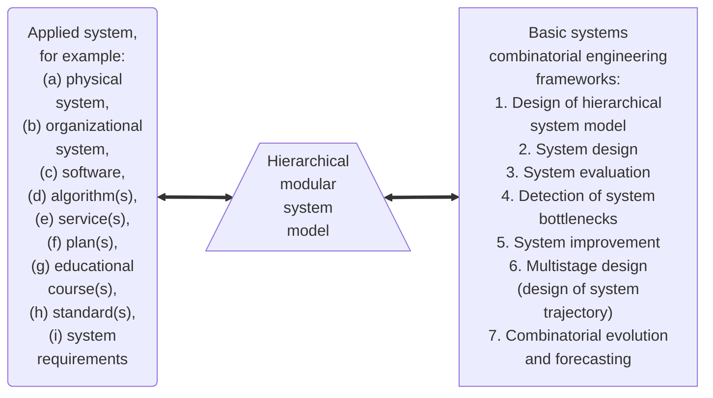

**Fig. 1.2** System—hierarchical model—combinatorial engineering frameworks

Figure 1.1 depicts a simplified scheme for modular system design domain. Here, sets of typical basic modules for system components and typical hierarchical system structures play crucial auxiliary roles.

This book describes a basic set of combinatorial engineering frameworks for design and evaluation of modular systems when system models can be represented as hierarchical structures (Fig. 1.2).

4 1 Modular Systems, Combinatorial Engineering Frameworks

```mermaid
graph TD
    subgraph " "
    direction TB
    A[k-problem/<br/>k-model<br/>framework]
    B[Problem/<br/>model]
    B --> A
    end

    subgraph " "
    direction LR
    C[Algorithm/<br/>procedure] --> D[Solving framework<br/>(interconnected<br/>algorithm(s)/<br/>procedure(s))]
    end

    E((Problem/<br/>model / Algo-<br/>rithm))
    
    F((k-problem/<br/>k-model / Solving<br/>framework / frame-<br/>work))
```

**Fig. 1.3** Domain "Problem/model—Algorithm/procedure"

Figure 1.3 depicts a "two-dimensional" domain for relation between problem(s)/model(s) and algorithm(s)/solving frameworks. This representation illustrates two system directions as an extension of traditional pair "problem/model—algorithm/procedure."

Note, the suggested combinatorial engineering frameworks can be considered as an integration/extension of two approaches:
(1) the frame approach of Marvin Minsky (e.g., [762]) (as a data structure) for representing knowledge (i.e., collection of frames are linked together into frame-system);
(2) frameworks for information processing, for example, a well-known framework for decision making (choice problem), that was suggested by Simon (e.g., [961]).

Our approach is based on typical combinatorial engineering frameworks as $k$-problem/$k$-model frameworks for modular systems. Thus, hierarchical modular system model and the above-mentioned combinatorial engineering frameworks are a fundamental for typical methods for problem structuring and solving in real-world applications for modular systems.

## 1.2 Basic Types of Hierarchies

Hierarchies play a central role in system science, in engineering, and in computer science (e.g., [370, 434, 448, 545, 561, 786]). Generally, it is reasonable to point out some basic types of hierarchies (e.g., [370, 434, 561, 658]):
(1) various kinds of trees (e.g., Figs. 1.4, 1.5, and 1.6) (e.g., [356, 370, 561]);
(2) organic hierarchy (i.e., with organic interconnection among children-vertices, Fig. 1.7) [221];
(3) "basic" hierarchy as a tree with additional edges (Fig. 1.8) (e.g., [618]);

1.2 Basic Types of Hierarchies 5

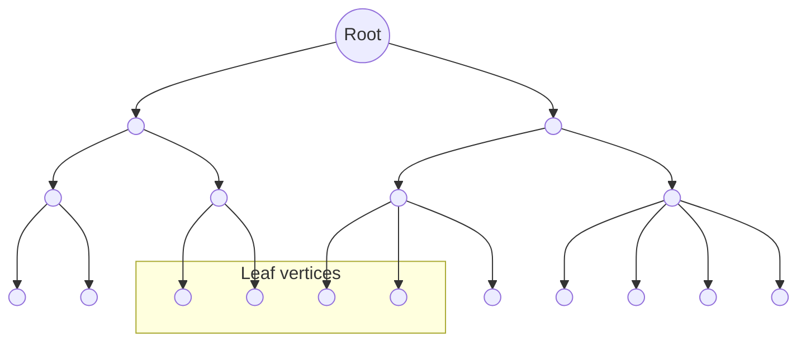
**Fig. 1.4** Tree

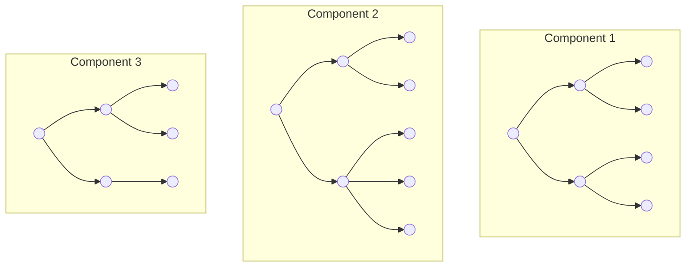
**Fig. 1.5** Forest

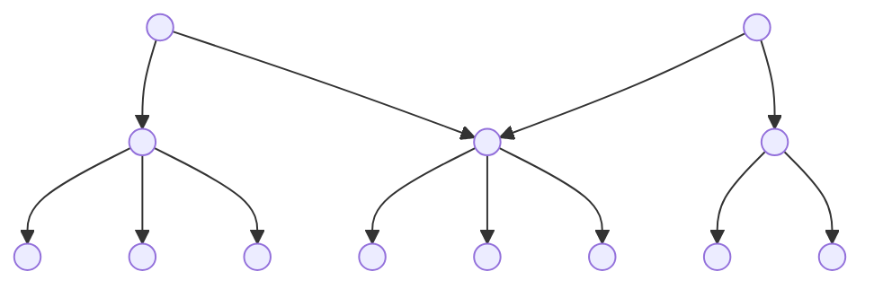
**Fig. 1.6** Polytree

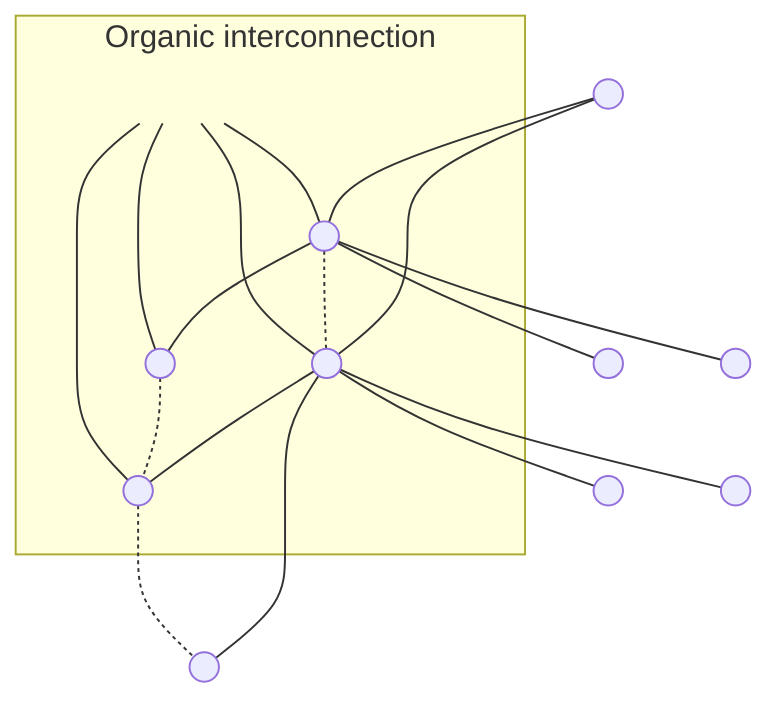
**Fig. 1.7** Organic hierarchy

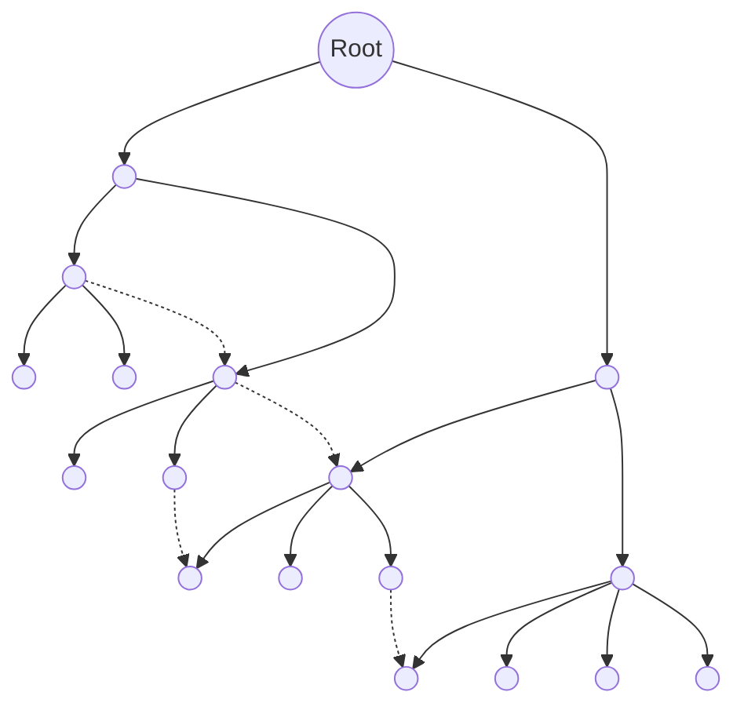
**Fig. 1.8** Hierarchy (tree with additional edges)

6 1 Modular Systems, Combinatorial Engineering Frameworks

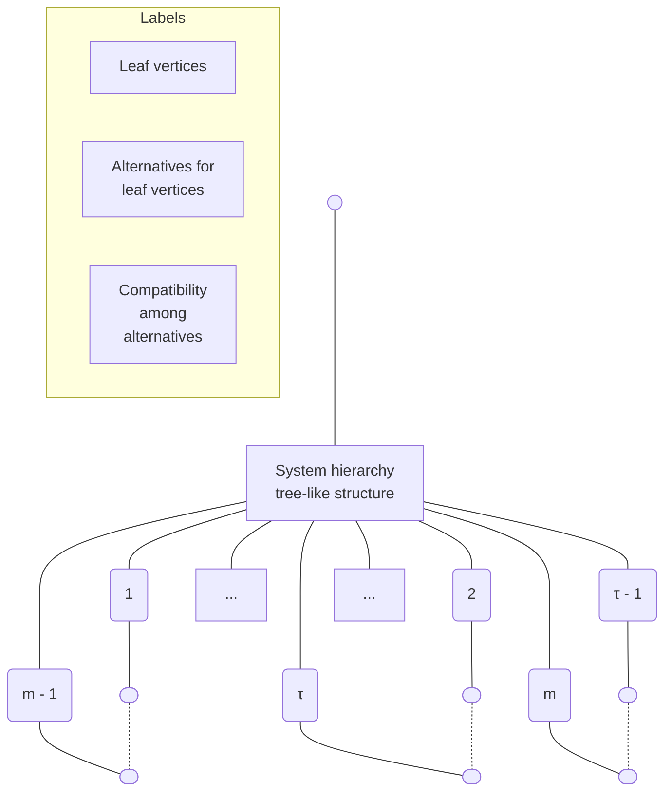

**Fig. 1.9** "Morphological" system hierarchy [652, 649]

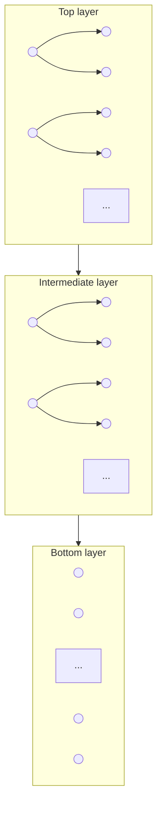

**Fig. 1.10** Multilayer structure

```mermaid
graph TD
    subgraph TopLevelNetwork [Top-level network G = H,V nodes: H = {μ₀, μ₁, ..., μₙ}, arcs: V]
    m0((μ₀)) --> m1((μ₁))
    m0 --> m2((μ₂))
    m1 --> m3((μ₃))
    m2 --> m3
    m2 --> mn((μₙ))
    m3 -.-> mn
    end

    subgraph MorphologicalStructures [Set of morphological structures]
    L0[/Λ<sup>μ₀</sup>\]
    L1[/Λ<sup>μ₁</sup>\]
    L2[/Λ<sup>μ₂</sup>\]
    L3[/Λ<sup>μ₃</sup>\]
    Ldots[...]
    Ln[/Λ<sup>μₙ</sup>\]
    end

    m0 --- L0
    m1 --- L1
    m2 --- L2
    m3 --- L3
    mn --- Ln
```

**Fig. 1.11** Two-level model: network-morphological structures

(4) "morphological hierarchy" (e.g., [628, 636, 652, 653]) (Fig. 1.9);
(5) multi-layer structures (e.g., multi-layer networks, hierarchical networks, multi-layer domain frameworks) (Fig. 1.10) (e.g., [1, 87, 466, 649, 810]);
(6) special two-level model: network-morphological structures/hierarchies (Fig. 1.11) and combinations of the models.

Here, it is reasonable to point out some important research directions in modeling of various multi-layer graphs/networks, for example: (a) hypergraphs (e.g., [93, 94]) and hypernetworks (e.g., [429, 512]); (b) multi-layer social networks (e.g., [538, 731]); (c) multi-stratum networks (e.g., [732]); (d) multi-layer computer systems

1.2 Basic Types of Hierarchies 7

[1010]; (e) multi-layer communications [1009]; and (f) multi-layer (hierarchical) information-communication networks (e.g., [1, 87, 596, 649, 658, 742, 794, 810]).

In applied domains, many special types of tree-like structures or hierarchies are widely used, for example: (1) hierarchical schemes for data, for information systems (e.g., [135, 561, 610, 618, 882]); (2) thesauri and concept spaces (e.g., [195, 196]); (3) organizational hierarchies (e.g., [56, 294, 417, 769, 1058]); (4) multi-level complex systems (e.g., [756]); (5) phylogenetic trees (e.g., [767, 897, 920]) and evolutionary trees (e.g., [27, 767]); (6) ontologies (e.g., [228, 467, 806, 1040]); (7) statecharts (e.g., [124, 448]); (8) decision trees (e.g., [13, 374, 375, 399, 400, 871, 872]); (9) hierarchy of criteria in decision making (e.g., Analytic Hierarchy Process—AHP) (e.g., [912]); and (10) hierarchical access networks (e.g., [394]).

## 1.3 Combinatorial Engineering Frameworks

The suggested combinatorial engineering frameworks (as basic "design frameworks") can be used as support tools at various stages of system life cycle (Fig. 1.12). The extended list of the examined combinatorial engineering frameworks for modular systems is the following (e.g., [636, 638]):

1. Design of a hierarchical system model ($T_1$).
2. Hierarchical modular system design ($T_2$):
    - 2.1. basic hierarchical modular system design to obtain a system version ($T_{21}$),
    - 2.2. hierarchical modular system design to obtain a family of system versions ($T_{22}$).
3. Evaluation of system and system parts/components ($T_3$).
4. Detection of system bottlenecks ($T_4$).
5. Redesign (improvement, upgrade, adaptation, extension) ($T_5$):
    - 5.1. basic system improvement ("1—1") ($T_{51}$),
    - 5.2. system improvement to obtain a family of system versions ("1—m") ($T_{52}$),
    - 5.3. basic aggregation of system versions into a resultant (aggregated) system ("n—1") ($T_{53}$),
    - 5.4. aggregation of system versions into a resultant (aggregated) system ("n—m") ($T_{54}$).
6. Multistage design (i.e., design of a system trajectory) ($T_6$).
7. Modeling of system development/evolution process (flow of system generations) and forecasting ($T_7$).

The frameworks above can be applied to systems, systems requirements, standards, plans, etc. (e.g., [628, 636, 652]). A generalized scheme of our research domain is presented in Fig. 1.13.

8 1 Modular Systems, Combinatorial Engineering Frameworks

SYSTEM LIFE CYCLES:

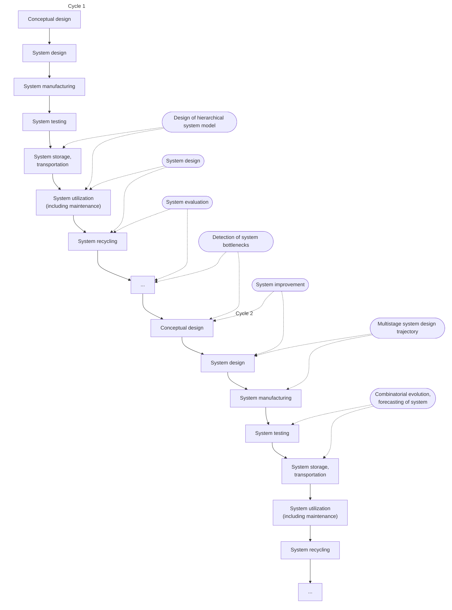

**SUPPORT SYSTEM COMBINATORIAL ENGINEERING FRAMEWORKS:**

**Fig. 1.12** Life cycles and combinatorial engineering frameworks

Finally, the following five-layer architecture can be examined (e.g., [649]):

1. Basic combinatorial optimization problems (e.g., knapsack problem, multiple choice problem, clustering, ranking/sorting problem, assignment/allocation, spanning trees, covering problem, graph coloring, shortest path problem, clique problem).
2. Complex (composite) combinatorial optimization problems (e.g., multicriteria versions of basic combinatorial optimization problems,
3. Basic support frameworks (e.g., hierarchical design, aggregation of structures, restructuring of knapsack problem, restructuring of multiple choice problem).
4. Combinatorial engineering frameworks above (design of hierarchical system model, system design, system evaluation, detection of system bottlenecks, etc.).

1.3 Combinatorial Engineering Frameworks 9

```mermaid
graph LR
    subgraph System_applications [System applications]
        A1[Management system<br/>for smart homes]
        A2[ZigBee communica-<br/>tion protocol]
        A3[Web-based applied<br/>system]
        A4[Wireless sensor]
        A5[Strategy for multi-<br/>criteria ranking]
        A6[Integrated security<br/>system]
        A7[Standard for multi-<br/>media information]
        A8[Electronic shopping]
        A9[Telemetry system]
        A10[...]
    end

    HMS([Hierarchical<br/>modular<br/>system])

    subgraph Support_system [Support system<br/>combinatorial<br/>engineering<br/>frameworks:]
        S1([Design of<br/>hierarchical<br/>system model])
        S2([System design])
        S3([System<br/>evaluation])
        S4([Detection<br/>of system<br/>bottlenecks])
        S5([System<br/>improvement])
        S6([Multistage<br/>system design<br/>(trajectory)])
        S7([Combinatorial<br/>evolution,<br/>forecasting of<br/>system])
    end

    subgraph Combinatorial_optimization [Combinatorial<br/>optimization<br/>problems:]
        P1[Knapsack]
        P2[Multiple choice]
        P3[Clique]
        P4[Ranking/sorting]
        P5[Clustering]
        P6[Assignment]
        P7[Spanning trees]
        P8[...]
    end

    A1 <--> HMS
    A2 <--> HMS
    A3 <--> HMS
    A4 <--> HMS
    A5 <--> HMS
    A6 <--> HMS
    A7 <--> HMS
    A8 <--> HMS
    A9 <--> HMS

    HMS <--> S1
    HMS <--> S2
    HMS <--> S3
    HMS <--> S4
    HMS <--> S5
    HMS <--> S6
    HMS <--> S7

    S1 --- P1
    S1 --- P2
    S2 --- P3
    S3 --- P4
    S4 --- P5
    S5 --- P6
    S6 --- P7
```

**Hierarchical morphological system model**

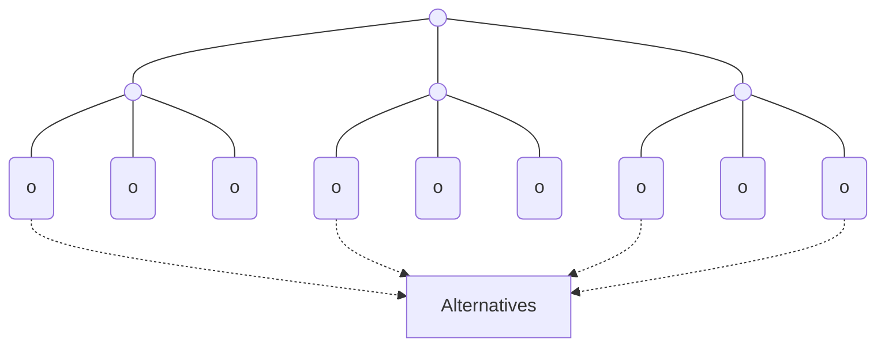

**Fig. 1.13** Generalized scheme of examined domain

### 5. Systems applications.

Mainly, several combinatorial engineering frameworks are often used together in applications, for example:
(i) design of system hierarchical model, system design, detection of system bottlenecks, system improvement;
(ii) design of system hierarchical model, detection of system bottlenecks, combinatorial evolution of the system, design of system forecasts, aggregation of the forecasts.

## 1.4 Summary

In the first part of the book, combinatorial engineering frameworks are described. Evidently, used combinatorial problems, frameworks, and corresponding algorithms/procedures are interconnected. Table 1.2 contains a list of combinatorial engineering

10 1 Modular Systems, Combinatorial Engineering Frameworks

**Table 1.2** Combinatorial engineering frameworks and their description

<table>
  <thead>
    <tr>
        <th></th>
        <th>Combinatorial framework</th>
        <th>Description</th>
        <th></th>
    </tr>
    <tr>
        <th></th>
        <th></th>
        <th>General framework</th>
        <th>Algorithms/procedures</th>
    </tr>
  </thead>
  <tbody>
    <tr>
        <td>1</td>
        <td>Design of system hierarchical model ($T_1$)</td>
        <td>Chap. 4</td>
        <td>Chap. 4</td>
    </tr>
    <tr>
        <td>2</td>
        <td>System design ($T_2$):</td>
        <td></td>
        <td></td>
    </tr>
    <tr>
        <td>2.1</td>
        <td>Basic system design (one resultant version) ($T_{21}$)</td>
        <td>Chaps. 2, 3, and 5</td>
        <td>Chaps. 2, 3, 5, and 9</td>
    </tr>
    <tr>
        <td>2.2</td>
        <td>System family design (several resultant versions) ($T_{22}$)</td>
        <td>–</td>
        <td>–</td>
    </tr>
    <tr>
        <td>3</td>
        <td>System evaluation ($T_3$)</td>
        <td>Chap. 6</td>
        <td>Chap. 6</td>
    </tr>
    <tr>
        <td>4</td>
        <td>Detection of bottlenecks ($T_4$)</td>
        <td>Chap. 7</td>
        <td>Chaps. 2, 3, and 7</td>
    </tr>
    <tr>
        <td>5</td>
        <td>System improvement ($T_5$):</td>
        <td></td>
        <td></td>
    </tr>
    <tr>
        <td>5.1</td>
        <td>Basic system improvement, result: one version (“1−1”) ($T_{51}$)</td>
        <td>Chap. 8</td>
        <td>Chaps. 2, 3, 5, and 9</td>
    </tr>
    <tr>
        <td>5.2</td>
        <td>System improvement, result: several system versions (“1−m”) ($T_{52}$)</td>
        <td>Chap. 8</td>
        <td>–</td>
    </tr>
    <tr>
        <td>5.3</td>
        <td>Aggregation of system versions: one resultant (aggregated) system (“n−1”) ($T_{53}$)</td>
        <td>Chap. 9</td>
        <td>Chaps. 2, 3, 5, and 9</td>
    </tr>
    <tr>
        <td>5.4</td>
        <td>Aggregation of system versions: several resultant (aggregated) systems (“n−m”) ($T_{54}$)</td>
        <td>Chap. 8</td>
        <td>–</td>
    </tr>
    <tr>
        <td>6</td>
        <td>Multistage system design of system trajectory ($T_6$)</td>
        <td>Chap. 10</td>
        <td>Chaps. 2, 3, 5, 9, and 10</td>
    </tr>
    <tr>
        <td>7</td>
        <td>System evolution, forecasting ($T_7$)</td>
        <td>Chap. 11</td>
        <td>Chaps. 2, 3, 5, 8, and 9</td>
    </tr>
  </tbody>
</table>

frameworks and corresponding chapters. Finally, it is necessary to note, combinatorial engineering frameworks for design of system families are not considered in this book (only frameworks $T_{52}$ and $T_{54}$ are briefly described in Chap. 8).

# Chapter 2
# Methods of Morphological Design (Synthesis)

**Abstract** This chapter (Partially based on: (i) Levin MS (2009) Towards morphological system design. In: Proc. of IEEE 7th Int. Conf. on Industrial Informatics INDIN-2009, Cardiff, UK, pp 95–100 (ii) Levin MS (2012) Morphological methods for design of modular systems (a survey). Electronic preprint, p 20, Jan. 9, 2012. http://arxiv.org/abs/1201.1712 [cs.SE]) addresses combinatorial morphological approaches to design of a modular system including the following: basic morphological analysis, multicriteria version of morphological analysis with the usage of closeness of a composite solution to ideal point, multicriteria version of morphological analysis with selection of Pareto-efficient composite solutions, hierarchical morphological multicriteria design, etc. A numerical example for a GSM communication system illustrates the application of the approaches.

## 2.1 Introduction

Morphological analysis (MA) was firstly suggested by F. Zwicky in 1943 for design of aerospace systems. Morphological analysis is a well-known general powerful method to synthesis of modular systems (i.e., composition) in various domains (e.g., [48, 516, 628, 636, 894, 895, 1146]). MA is based on *divide and conquer* technique. A hierarchical structure of the designed system is a basis for usage of the method. The following basic partitioning techniques can be used to obtain the required hierarchical system model: (a) partitioning by system component/parts, (b) partitioning by system functions, (c) partitioning by system properties/attributes, and (d) integrated techniques. In this chapter, system hierarchy of system components (parts, subsystems) is considered as a basic one. Many years the usage of morphological analysis in system design was very limited by the reason that the method leads to a very large combinatorial domain of possible solutions. On the other hand, contemporary computer systems can solve very complex computational problems and hierarchical system models can be used as a basis for partitioning/decomposition solving frameworks.

Recent trends in the study, usage, and modification/extension of morphological analysis may be considered as the following:

© Springer International Publishing Switzerland 2015
M.S. Levin, Modular System Design and Evaluation,
Decision Engineering, DOI 10.1007/978-3-319-09876-0_2
11

12
2 Methods of Morphological Design (Synthesis)

**Fig. 2.1** System configuration problem (selection) [642]

> System parts: { $P(1), \dots, P(i), \dots, P(m)$ }
> System configuration example:
> $S_1 = X_2^1 \star \dots \star X_3^i \star \dots \star X_1^m$

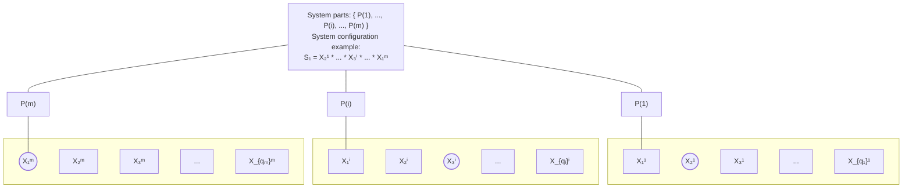

(1) hierarchical systems modeling,
(2) optimization models,
(3) multicriteria decision making, and
(4) taking into account uncertainty (i.e., probabilistic and/or fuzzy estimates).

Generally, morphological system design approaches are targeted to design of system configuration as a selection of alternatives for systems parts (e.g., [642]). Figure 2.1 illustrates this problem. Here, a composite (modular) system consists of $m$ system parts: $\{P(1), \dots, P(i), \dots, P(m)\}$. For each system part (i.e., $\forall i, i = \overline{1, m}$) there are corresponding alternatives (i.e., design alternatives DAs) $\{X_1^i, X_2^i, \dots, X_{q_i}^i\}$, where $q_i$ is the number of alternatives for part $i$. Thus, the problem is:

*Select an alternative for each system part while taking into account some local and/or global objectives/preferences and constraints.*

Evidently, the objective/preferences and constraints are based on (correspond to) quality of the selected alternatives and quality of compatibility among the selected alternatives. In [642] (Chap. 5), some other system configuration problems are described as well (e.g., reconfiguration, selection and allocation).

Our basic list of morphological design approaches consists of the following:

(1) the basic version of morphological analysis (by F. Zwicky) (MA) (e.g., [85, 129, 516, 894, 1146]);
(2) the modification of morphological analysis as searching for an admissible (by compatibility) element combination (one representative from each morphological class, i.e., a set of alternatives for system part/component) that is the closest to a combination consisting of the best elements (at each morphological class) (e.g., [48, 290, 599]);
(3) modification of morphological analysis via reducing to linear programming (MA and linear programming) [568];
(4) modification of morphological analysis via reducing to multiple choice problem (MCP) [370, 541, 743] or multicriteria multiple choice problem (e.g., [691, 983]);

2.1 Introduction
13

**Table 2.1** Description of approaches

<table>
  <tbody>
    <tr>
        <td>Method</td>
        <td>Scale for DAs</td>
        <td>Scale for IC</td>
        <td>Quality of decision</td>
        <td>Some sources</td>
    </tr>
    <tr>
        <td>1. Morphological analysis (MA)</td>
        <td>None</td>
        <td>{0, 1}</td>
        <td>Admissibility</td>
        <td>[516, 894, 1146]</td>
    </tr>
    <tr>
        <td>2. Closeness to ideal point</td>
        <td>None</td>
        <td>{0, 1}</td>
        <td>“Distance” to ideal point</td>
        <td>[48, 290, 599]</td>
    </tr>
    <tr>
        <td>3. MA &amp; linear programming</td>
        <td>Quantitative</td>
        <td>{0, 1}</td>
        <td>Additive function</td>
        <td>[568]</td>
    </tr>
    <tr>
        <td>4. Multiple choice problem or its multicriteria version</td>
        <td>Quantitative</td>
        <td>None</td>
        <td>Additive function or multicriteria description</td>
        <td>[370, 691, 983]</td>
    </tr>
    <tr>
        <td>5. Quadratic assignment problem (QAP)</td>
        <td>Quantitative</td>
        <td>Quantitative</td>
        <td>Additive function</td>
        <td>[160, 177, 642]</td>
    </tr>
    <tr>
        <td>6. Pareto-based MA</td>
        <td>None</td>
        <td>{0, 1}</td>
        <td>Multicriteria description</td>
        <td>[310, 361]</td>
    </tr>
    <tr>
        <td>7. HMMD</td>
        <td>Quantitative and ordinal, mapping to ordinal</td>
        <td>Ordinal</td>
        <td>Point at poset based on multiset</td>
        <td>[626, 628, 636]</td>
    </tr>
    <tr>
        <td>8. HMMD &amp; interval multiset estimates</td>
        <td>Poset based on interval multiset</td>
        <td>Ordinal</td>
        <td>Point at poset based on interval multiset</td>
        <td>[655, 661, 668]</td>
    </tr>
  </tbody>
</table>

(5) modification of morphological analysis via reducing to quadratic assignment problem (QAP) (e.g., [160, 177, 628, 642]);
(6) the multicriteria modification of morphological analysis as follows (Pareto-based MA): (a) searching for all admissible (by compatibility) elements combinations (one representative from each morphological class), (b) evaluation of the found combinations upon a set of criteria, and (c) selection of the Pareto-efficient solutions (e.g., [310, 361]);
(7) hierarchical morphological multicriteria design (HMMD) approach [626, 628, 636]; and
(8) a new version of hierarchical morphological multicriteria design approach based on the usage of interval multiset estimates for DAs [655, 661, 668] (Chap. 3).

Table 2.1 contains some properties of the approaches above.

In addition, it is reasonable to point out that MA-based methods are successfully used in digital image processing: structural analysis of images, object detection and identification in images (e.g., [867, 868, 1054, 1055, 1056, 1057]).

14
2 Methods of Morphological Design (Synthesis)

## 2.2 Morphological Design Approaches

### 2.2.1 Morphological Analysis

The MA approach consists of the following stages:
*Stage 1.* Building a system structure as a set of system parts/components.
*Stage 2.* Generation of design alternatives (DAs) for each system part (i.e., a morphological class).
*Stage 3.* Binary assessment of compatibility for each DAs pair (one DA from one morphological class, other DA from another morphological class). Value of compatibility 1 corresponds to compatibility of two corresponding DAs, value 0 corresponds to incompatibility.
*Stage 4.* Generation of all admissible compositions (one DA for each system part) while taking into account compatibility for each two DAs in each obtained composition.

The method above is an enumerative one. Figure 2.2 illustrates MA (binary compatibility estimates are depicted in Table 2.2).

Here, the following morphological classes are examined: (a) morphological class 1: {$X^1_1, X^1_2, X^1_3, X^1_4, X^1_5$}, (b) morphological class $i$: {$X^i_1, X^i_2, X^i_3, X^i_4, X^i_5$},

**Fig. 2.2** Illustration for MA [643]

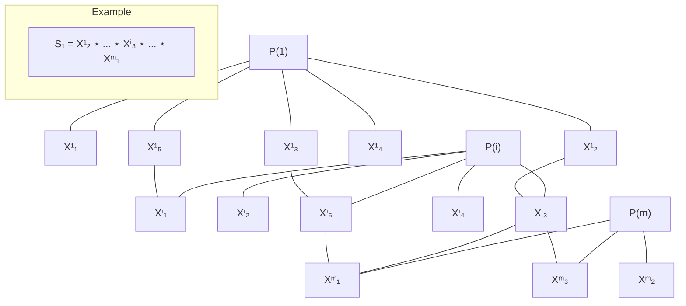

**Table 2.2** Binary compatibility [643]
<table>
  <thead>
    <tr>
        <th></th>
        <th>Xⁱ₁</th>
        <th>Xⁱ₂</th>
        <th>Xⁱ₃</th>
        <th>Xⁱ₄</th>
        <th>Xⁱ₅</th>
        <th>Xᵐ₁</th>
        <th>Xᵐ₂</th>
        <th>Xᵐ₃</th>
    </tr>
  </thead>
  <tbody>
    <tr>
        <td>X¹₁</td>
        <td>0</td>
        <td>0</td>
        <td>0</td>
        <td>0</td>
        <td>0</td>
        <td>0</td>
        <td>0</td>
        <td>0</td>
    </tr>
    <tr>
        <td>X¹₂</td>
        <td>0</td>
        <td>0</td>
        <td>1</td>
        <td>0</td>
        <td>0</td>
        <td>1</td>
        <td>0</td>
        <td>0</td>
    </tr>
    <tr>
        <td>X¹₃</td>
        <td>0</td>
        <td>0</td>
        <td>0</td>
        <td>0</td>
        <td>1</td>
        <td>0</td>
        <td>0</td>
        <td>0</td>
    </tr>
    <tr>
        <td>X¹₄</td>
        <td>0</td>
        <td>0</td>
        <td>0</td>
        <td>0</td>
        <td>0</td>
        <td>0</td>
        <td>0</td>
        <td>0</td>
    </tr>
    <tr>
        <td>X¹₅</td>
        <td>1</td>
        <td>0</td>
        <td>0</td>
        <td>0</td>
        <td>0</td>
        <td>0</td>
        <td>0</td>
        <td>0</td>
    </tr>
    <tr>
        <td>Xⁱ₁</td>
        <td colspan="5"></td>
        <td>0</td>
        <td>0</td>
        <td>0</td>
    </tr>
    <tr>
        <td>Xⁱ₂</td>
        <td colspan="5"></td>
        <td>0</td>
        <td>0</td>
        <td>0</td>
    </tr>
    <tr>
        <td>Xⁱ₃</td>
        <td colspan="5"></td>
        <td>1</td>
        <td>0</td>
        <td>1</td>
    </tr>
    <tr>
        <td>Xⁱ₄</td>
        <td colspan="5"></td>
        <td>0</td>
        <td>0</td>
        <td>0</td>
    </tr>
    <tr>
        <td>Xⁱ₅</td>
        <td colspan="5"></td>
        <td>1</td>
        <td>0</td>
        <td>0</td>
    </tr>
  </tbody>
</table>

2.2 Morphological Design Approaches 15

and (c) morphological class $m$: {$X^m_1, X^m_2, X^m_3$}. Further, a simplified case is considered for three system parts (and corresponding morphological classes). The resultant (admissible) solution (composition or composite design alternative) is: $S_1 = X^1_2 \star \dots \star X^i_3 \star \dots \star X^m_1$.

### 2.2.2 Method of Closeness to Ideal Point

First, modification of MA as method of closeness to ideal point was suggested (e.g., [48, 290]). Illustration for method of closeness to ideal point is shown in Fig. 2.3 (binary compatibility estimates are contained in Table 2.3).

Here, for each system part (from the corresponding morphological class) the best design alternatives (as an ideal) is selected (e.g., by expert judgment). In the illustrative example (Fig. 2.3), the ideal design alternatives are: $X^1_1$, $X^i_3$, and $X^m_3$. Thus, the ideal point (i.e., solution) is: $S_o = X^1_1 \star \dots \star X^i_3 \star \dots \star X^m_3$. Unfortunately, this solution $S_o$ is inadmissible (by compatibility). Admissible solutions are the following: $S_1 = X^1_2 \star \dots \star X^i_3 \star \dots \star X^m_1$ and $S_2 = X^1_5 \star \dots \star X^i_3 \star \dots \star X^m_3$.

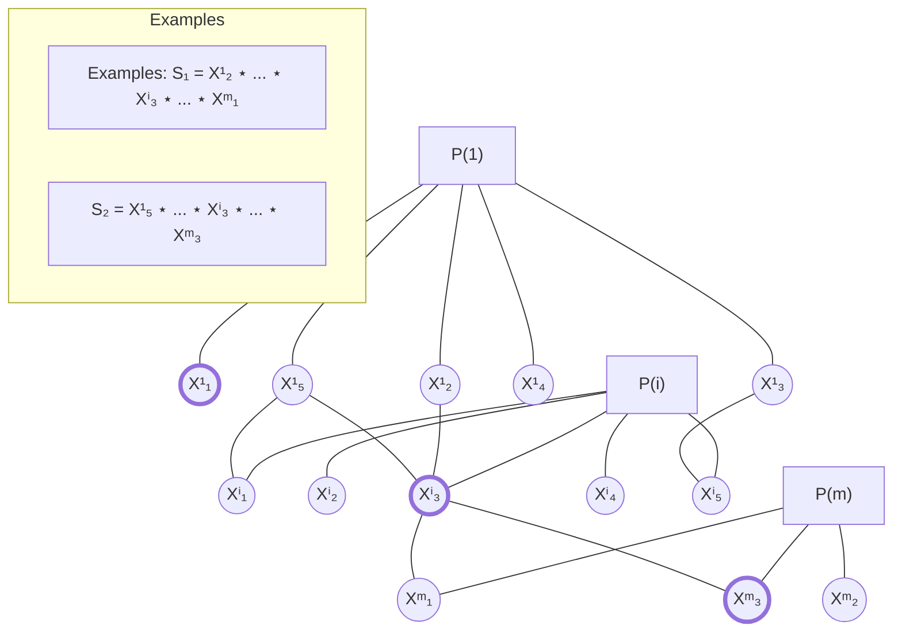

**Fig. 2.3** Illustration for MA with ideal point [643]

**Table 2.3** Binary compatibility [643]

<table>
  <thead>
    <tr>
        <th></th>
        <th>$X^i_1$</th>
        <th>$X^i_2$</th>
        <th>$X^i_3$</th>
        <th>$X^i_4$</th>
        <th>$X^i_5$</th>
        <th>$X^m_1$</th>
        <th>$X^m_2$</th>
        <th>$X^m_3$</th>
    </tr>
  </thead>
  <tbody>
    <tr>
        <td>$X^1_1$</td>
        <td>0</td>
        <td>0</td>
        <td>0</td>
        <td>0</td>
        <td>0</td>
        <td>0</td>
        <td>0</td>
        <td>0</td>
    </tr>
    <tr>
        <td>$X^1_2$</td>
        <td>0</td>
        <td>0</td>
        <td>1</td>
        <td>0</td>
        <td>0</td>
        <td>1</td>
        <td>0</td>
        <td>0</td>
    </tr>
    <tr>
        <td>$X^1_3$</td>
        <td>0</td>
        <td>0</td>
        <td>0</td>
        <td>0</td>
        <td>1</td>
        <td>0</td>
        <td>0</td>
        <td>0</td>
    </tr>
    <tr>
        <td>$X^1_4$</td>
        <td>0</td>
        <td>0</td>
        <td>0</td>
        <td>0</td>
        <td>0</td>
        <td>0</td>
        <td>0</td>
        <td>0</td>
    </tr>
    <tr>
        <td>$X^1_5$</td>
        <td>1</td>
        <td>0</td>
        <td>1</td>
        <td>0</td>
        <td>0</td>
        <td>0</td>
        <td>0</td>
        <td>1</td>
    </tr>
    <tr>
        <td>$X^i_1$</td>
        <td colspan="5"></td>
        <td>0</td>
        <td>0</td>
        <td>0</td>
    </tr>
    <tr>
        <td>$X^i_2$</td>
        <td colspan="5"></td>
        <td>0</td>
        <td>0</td>
        <td>0</td>
    </tr>
    <tr>
        <td>$X^i_3$</td>
        <td colspan="5"></td>
        <td>1</td>
        <td>0</td>
        <td>1</td>
    </tr>
    <tr>
        <td>$X^i_4$</td>
        <td colspan="5"></td>
        <td>0</td>
        <td>0</td>
        <td>0</td>
    </tr>
    <tr>
        <td>$X^i_5$</td>
        <td colspan="5"></td>
        <td>1</td>
        <td>0</td>
        <td>0</td>
    </tr>
  </tbody>
</table>

16 2 Methods of Morphological Design (Synthesis)

Let $\rho(S', S'')$ be a proximity (e.g., by elements) for two composite design alternatives $S', S'' \in \{S\}$. Then it is reasonable to search for the following solution $S^* \in \{S^a\} \subseteq \{S\}$ ($\{S^a\}$ is a set of admissible solutions): $S^* = Arg \min_{S \in \{S^a\}} \rho(S, S_o)$. Clearly, in the illustrative example solution $S_2 = X_5^1 \star \dots \star X_3^i \star \dots \star X_3^m$ is more close to ideal solution $S_o$ (i.e., $\rho(S_2, S_o) \preceq \rho(S_1, S_o)$). Generally, various versions of proximity (as real functions, vectors, etc.) can by examined (e.g., [48, 290]).

### 2.2.3 Pareto-Based Morphological Approach

An integrated method (MA and multicriteria decision making, an enumerative method) was suggested as follows (e.g., [310, 361]):
*Stage 1.* Usage of basic MA to get a set of admissible compositions.
*Stage 2.* Generation of criteria for evaluation of the admissible compositions.
*Stage 3.* Evaluation of admissible compositions upon criteria and selection of Pareto-efficient solutions.

Figure 2.4 illustrates Pareto-based MA. Concurrently, binary compatibility estimates are depicted in Table 2.4. Here, admissible solutions are the following: $S_1 = X_2^1 \star \dots \star X_3^i \star \dots \star X_1^m$, $S_2 = X_5^1 \star \dots \star X_3^i \star \dots \star X_3^m$, and $S_3 = X_5^1 \star \dots \star X_5^i \star \dots \star X_3^m$. Further, the solutions have to be evaluated upon criteria and Pareto-efficient solution(s) will be selected.

### 2.2.4 Linear Programming

In [568], morphological analysis is reduced to linear programming. Here, constraints imposed on the solution are reduced to a set of inequalities of Boolean variables and quality criterion for the solution as an additive function is used. A solving process may be based on a heuristic or on a enumerative method.

**Fig. 2.4** Illustration for Pareto-based MA [643]

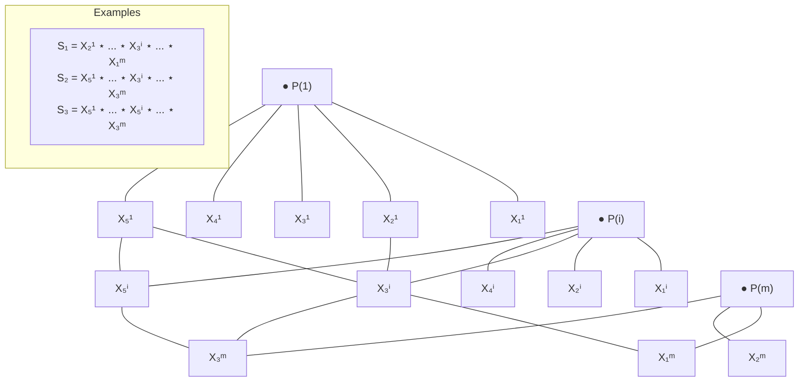

2.2 Morphological Design Approaches 17

**Table 2.4** Binary compatibility [643]

<table>
  <thead>
    <tr>
        <th></th>
        <th>$X^i_1$</th>
        <th>$X^i_2$</th>
        <th>$X^i_3$</th>
        <th>$X^i_4$</th>
        <th>$X^i_5$</th>
        <th>$X^m_1$</th>
        <th>$X^m_2$</th>
        <th>$X^m_3$</th>
    </tr>
  </thead>
  <tbody>
    <tr>
        <td>$X^1_1$</td>
        <td>0</td>
        <td>0</td>
        <td>0</td>
        <td>0</td>
        <td>0</td>
        <td>0</td>
        <td>0</td>
        <td>0</td>
    </tr>
    <tr>
        <td>$X^1_2$</td>
        <td>0</td>
        <td>0</td>
        <td>1</td>
        <td>0</td>
        <td>0</td>
        <td>1</td>
        <td>0</td>
        <td>0</td>
    </tr>
    <tr>
        <td>$X^1_3$</td>
        <td>0</td>
        <td>0</td>
        <td>0</td>
        <td>0</td>
        <td>1</td>
        <td>0</td>
        <td>0</td>
        <td>0</td>
    </tr>
    <tr>
        <td>$X^1_4$</td>
        <td>0</td>
        <td>0</td>
        <td>0</td>
        <td>0</td>
        <td>0</td>
        <td>0</td>
        <td>0</td>
        <td>0</td>
    </tr>
    <tr>
        <td>$X^1_5$</td>
        <td>1</td>
        <td>0</td>
        <td>1</td>
        <td>0</td>
        <td>1</td>
        <td>0</td>
        <td>0</td>
        <td>1</td>
    </tr>
    <tr>
        <td>$X^i_1$</td>
        <td colspan="5"></td>
        <td>0</td>
        <td>0</td>
        <td>0</td>
    </tr>
    <tr>
        <td>$X^i_2$</td>
        <td colspan="5"></td>
        <td>0</td>
        <td>0</td>
        <td>0</td>
    </tr>
    <tr>
        <td>$X^i_3$</td>
        <td colspan="5"></td>
        <td>1</td>
        <td>0</td>
        <td>1</td>
    </tr>
    <tr>
        <td>$X^i_4$</td>
        <td colspan="5"></td>
        <td>0</td>
        <td>0</td>
        <td>0</td>
    </tr>
    <tr>
        <td>$X^i_5$</td>
        <td colspan="5"></td>
        <td>1</td>
        <td>0</td>
        <td>1</td>
    </tr>
  </tbody>
</table>

### 2.2.5 Multiple Choice Problem

The basic knapsack problem is (e.g., [370, 541, 743]):

$$\max \sum_{i=1}^{m} c_i x_i \quad s.t. \sum_{i=1}^{m} a_i x_i \leq b, \ x_i \in \{0, 1\}, \quad i = \overline{1, m},$$

where $x_i = 1$ if item $i$ is selected, $c_i$ is a value (utility) for item $i$, and $a_i$ is a weight of item $i$ (or resource required). Often nonnegative coefficients are assumed. The problem is NP-hard [370, 743] and can be solved by enumerative methods (e.g., Branch-and-Bound, dynamic programming), approximation schemes with a limited relative error (FPTAS) (e.g., [541, 743]). In the case of multiple choice problem (e.g., [541, 743]), the items are divided into groups and we select element(s) from each group while taking into account a total resource constraint (or constraints). Here, each element has two indices: $(i, j)$, where $i$ corresponds to number of group and $j$ corresponds to number of item in the group. In the case of multicriteria description of items (i.e., vector estimate), each element (i.e., $(i, j)$) has vector profit $\overline{c}_{i,j} = (c^1_{i,j}, \dots, c^\xi_{i,j}, \dots, c^r_{i,j})$ and multicriteria multiple choice problem is:

$$\max \sum_{i=1}^{m} \sum_{j=1}^{q_i} c^\xi_{ij} x_{ij}, \quad \forall \xi = \overline{1, r}$$

$$s.t. \sum_{i=1}^{m} \sum_{j=1}^{q_i} a_{ij} x_{ij} \leq b, \quad \sum_{j=1}^{q_i} x_{ij} = 1 \quad \forall i = \overline{1, m}, \quad x_{ij} \in \{0, 1\}.$$

For this problem formulation it is reasonable to search for Pareto-efficient solutions. This design approach was used for design and redesign/improvement of applied

18
2 Methods of Morphological Design (Synthesis)

systems (software, hardware, communication) [647, 691, 983]. Here, the following solving schemes can be used: (i) enumerative algorithms (e.g., Branch-and-Bound, dynamic programming), (ii) heuristic based on preliminary multicriteria ranking of elements to get their priorities and step-by-step packing the knapsack (i.e., greedy approach), (iii) multicriteria ranking of elements to get their ordinal priorities and usage of approximation solving scheme (as for knapsack problem) based on discrete space of system excellence (as later in HMMD).

### 2.2.6 Assignment/Allocation Problems

Assignment/allocation problems are widely used in many domains (e.g., [177, 370, 832]). Simple assignment problem involves nonnegative correspondence matrix $\Upsilon = ||c_{i,j}||$ ($i = \overline{1, n}$, $j = \overline{1, n}$) where $c_{i,j}$ is a profit ('utility') to assign element $i$ to position $j$. The problem is (e.g., [370]):

> *Find assignment $\pi = (\pi(1), \dots, \pi(i), \dots, \pi(n))$ of elements $i$ ($i = \overline{1, n}$) to positions $\pi(i)$, which corresponds to a total effectiveness: $\sum_{i=1}^{n} c_{i,\pi(i)} \to \max$.*

A more complicated well-known model as quadratic assignment problem (QAP) includes interconnection between elements of different groups (each group corresponds to a certain position) (e.g., [177, 832]). Let a nonnegative value $d(l, j_1, k, j_2)$ be a profit of compatibility between item $j_1$ in group $J_l$ and item $j_2$ in group $J_k$. Also, this value of compatibility is added to the objective function. QAP may be considered as a version of MA. Thus, QAP can be formulated as follows:

$$\max \sum_{i=1}^{m} \sum_{j=1}^{q_i} c_{i,j} x_{i,j} + \sum_{l<k} \sum_{j_1=1}^{q_l} \sum_{j_2=1}^{q_k} d(l, j_1, k, j_2) x_{l,j_1} x_{k,j_2}, \quad l = \overline{1, m}, \quad k = \overline{1, m};$$

$$s.t. \quad \sum_{i=1}^{m} \sum_{j=1}^{q_i} a_{i,j} \ x_{i,j} \le b, \quad \sum_{j=1}^{q_i} x_{i,j} \le 1 \ \forall i = \overline{1, m}, \quad x_{i,j} \in \{0, 1\}.$$

QAP is NP-hard. Enumerative methods (e.g., Branch-and-Bound) or heuristics (e.g., greedy algorithms, tabu search, genetic algorithms) are usually used for the problem. In the case of multicriteria assignment problem the objective function is transformed into a vector function, i.e., $c_{i,j} \Rightarrow \overline{c}_{i,j} = (c_{i,j}^1, \dots, c_{i,j}^\xi, \dots, c_{i,j}^r)$ and the vector objective function is, for example:

$$(\sum_{i=1}^{m} \sum_{j=1}^{n} c_{i,j}^1 x_{i,j}, \dots, \sum_{i=1}^{m} \sum_{j=1}^{n} c_{i,j}^\xi x_{i,j}, \dots, \sum_{i=1}^{m} \sum_{j=1}^{n} c_{i,j}^r x_{i,j}).$$

2.2 Morphological Design Approaches
19

Here, Pareto-efficient solutions are searched for. Analogically, QAP can be transformed into a multicriteria QAP.

### 2.2.7 Hierarchical Morphological Multicriteria Design (HMMD)

Hierarchical Morphological Multicriteria Design (HMMD) method was suggested by Mark Sh. Levin (e.g., [621, 626, 628, 636, 642]). The assumptions of HMMD are the following: (a) a tree-like structure of the system; (b) a composite estimate for system quality that integrates components (subsystems, parts) qualities and qualities of interconnections IC (compatibility) across subsystems; (c) monotonic criteria for the system and its components; and (d) quality of system components and IC are evaluated on the basis of coordinated ordinal scales. The designations are: (1) design alternatives (DAs) for leaf nodes of the model; (2) priorities of DAs ($\iota = \overline{1, l}$; 1 corresponds to the best one); (3) ordinal compatibility for each pair of DAs ($w = \overline{1, \nu}$; $\nu$ corresponds to the best level). The basic phases of HMMD are:

*Phase 1.* Design of the tree-like system model (a preliminary phase).
*Phase 2.* Generating DAs for leaf nodes of the system model.
*Phase 3.* Hierarchical selection and composing of DAs into composite DAs for the corresponding higher level of the system hierarchy (morphological clique problem).
*Phase 4.* Analysis and improvement of the resultant composite DAs (decisions).

Further, morphological clique problem is described. System $S$ consists of $m$ parts (components): $\{P(1), \dots, P(i), \dots, P(m)\}$ (Fig. 2.1). For each system part, a set of DAs is generated. The problem is:

> *Find composite design alternative $S = S(1) \star \dots \star S(i) \star \dots \star S(m)$ of DAs (one representative design alternative $S(i)$ for each system component/part $P(i)$, $i = \overline{1, m}$) with non-zero compatibility estimates between the selected design alternatives.*

A discrete space of the system quality (a poset) is based on the following vector (Fig. 2.5): $N(S) = (w(S); e(S))$, where $w(S)$ is the minimum of pairwise compatibility between DAs, which correspond to different system components (i.e., $\forall P_{j_1}$ and $P_{j_2}$, $1 \le j_1 \neq j_2 \le m$) in $S$, $e(S) = (\eta_1, \dots, \eta_\iota, \dots, \eta_l)$, where $\eta_\iota$ is the number of DAs of the $\iota$th quality in $S$ ($\sum_{\iota=1}^l \eta_\iota = m$). Here, composite solutions (composite DAs) are searched for, which are nondominated by $N(S)$ (i.e., Pareto-efficient solutions) (Fig. 2.5). Thus, the basic version of HMMD corresponds to the following problem (two objectives, one constraint):

$$\max e(S), \quad \max w(S), \quad s.t. \ w(S) \ge 1.$$

"Maximization" of $e(S)$ is based on the corresponding poset.

This problem is NP-hard (because a more simple its subproblem is NP hard [562]). Generally, the following layers of system excellence can be considered

20 2 Methods of Morphological Design (Synthesis)

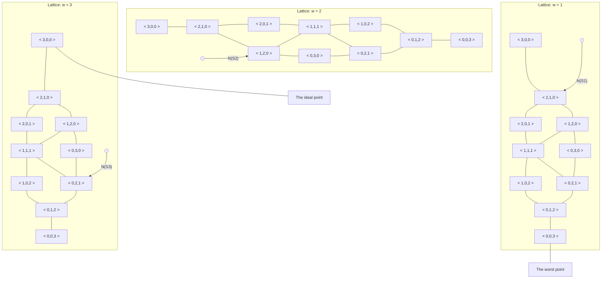

**Fig. 2.5** Poset of quality (3 system parts, 3 levels of element quality)

**Fig. 2.6** Example of composition

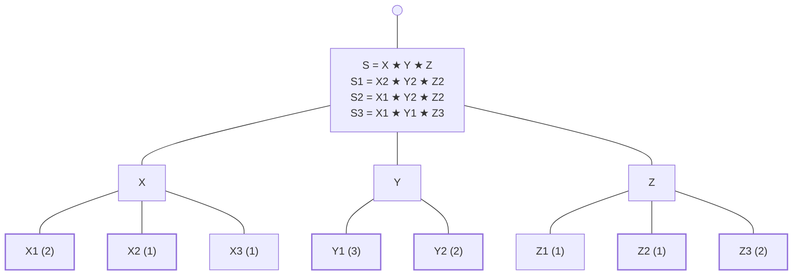

(e.g., [628]): (i) ideal point; (ii) Pareto-efficient points; (iii) a neighborhood of Pareto-efficient DAs (e.g., a composite decision of this set can be transformed into a Pareto-efficient point on the basis of an improvement action(s)). Clearly, the compatibility component of vector $N(S)$ can be considered on the basis of a poset-like scale too (as $e(S)$). In this case, the discrete space of system excellence will be an analogical lattice [631, 636].

Figures 2.6 and 2.7 illustrate HMMD (by a numerical example for three part system $S = X \star Y \star Z$). Priorities of DAs are shown in Fig. 2.6 in parentheses and are depicted in Fig. 2.7. Table 2.5 contains compatibility estimates (they are pointed out in Fig. 2.7 too). In the example, composite decisions are (Pareto-efficient solutions) (Figs. 2.5, 2.6, 2.7 and 2.8): $S_1 = X_2 \star Y_2 \star Z_2$, $N(S_1) = (1; 2, 1, 0)$; $S_2 = X_1 \star Y_2 \star Z_2$, $N(S_2) = (2; 1, 2, 0)$; $S_3 = X_1 \star Y_1 \star Z_3$, $N(S_3) = (3; 0, 2, 1)$.

2.3 Design Examples for GSM Network
21

**Fig. 2.7** Concentric presentation

```mermaid
graph TD
    subgraph X_Group [X]
        X1[X<sub>1</sub>]
        X2[X<sub>2</sub>]
        X3[X<sub>3</sub>]
    end

    subgraph Z_Group [Z]
        Z3[Z<sub>3</sub>]
        Z2[Z<sub>2</sub>]
        Z1[Z<sub>1</sub>]
    end

    subgraph Y_Group [Y]
        Y2[Y<sub>2</sub>]
        Y1[Y<sub>1</sub>]
    end

    %% Connections from X to Z
    X1 ---|3| Z3
    X1 ---|2| Z2
    X2 ---|1| Z2
    
    %% Connections from X to Y
    X1 ---|2| Y2
    X1 ---|3| Y1
    X2 ---|3| Y2

    %% Connections from Z to Y
    Z3 ---|3| Y1
    Z2 ---|2| Y2
```

**Table 2.5** Compatibility

<table>
  <thead>
    <tr>
        <th></th>
        <th>Y<sub>1</sub></th>
        <th>Y<sub>2</sub></th>
        <th>Z<sub>1</sub></th>
        <th>Z<sub>2</sub></th>
        <th>Z<sub>3</sub></th>
    </tr>
  </thead>
  <tbody>
    <tr>
        <td>X<sub>1</sub></td>
        <td>3</td>
        <td>2</td>
        <td>0</td>
        <td>2</td>
        <td>3</td>
    </tr>
    <tr>
        <td>X<sub>2</sub></td>
        <td>0</td>
        <td>3</td>
        <td>0</td>
        <td>1</td>
        <td>0</td>
    </tr>
    <tr>
        <td>X<sub>3</sub></td>
        <td>0</td>
        <td>0</td>
        <td>0</td>
        <td>0</td>
        <td>1</td>
    </tr>
    <tr>
        <td>Y<sub>1</sub></td>
        <td></td>
        <td>|</td>
        <td>0</td>
        <td>0</td>
        <td>3</td>
    </tr>
    <tr>
        <td>Y<sub>2</sub></td>
        <td></td>
        <td>|</td>
        <td>0</td>
        <td>2</td>
        <td>0</td>
    </tr>
  </tbody>
</table>

**Fig. 2.8** Illustration for space of quality

The image shows three triangular plots representing spaces of quality for different weights $w$.

*   **$w = 1$**: A triangle with a point labeled $N(S_1)$ on the left edge. The bottom vertex is labeled "The worst point".
*   **$w = 2$**: A triangle with a point labeled $N(S_2)$ on the left edge.
*   **$w = 3$**: A triangle with a point labeled $N(S_3)$ on the right edge. The top vertex is labeled "The ideal point".

# 2.3 Design Examples for GSM Network

In recent two decades, the significance of GSM network has been increased (e.g., [200, 391, 435, 713, 752, 873, 1026]). Thus, there exists a need of the design and maintenance of this kind of communication systems. Here, a numerical example for design of GSM network (a modification of an example from [682]) is used to illustrate and to compare several MA-based methods: basic MA, method of closeness to ideal point, Pareto-based MA, multiple choice problem, and HMMD.

22 2 Methods of Morphological Design (Synthesis)

```mermaid
graph TD
    GSM["GSM network S = A ⋆ B = (M ⋆ L) ⋆ (V ⋆ U ⋆ T)"]
    SSS["SSS A = M ⋆ L"]
    BSS["BSS B = V ⋆ U ⋆ T"]
    
    M["MSC/VLR M:<br/>M₁, M₂, M₃,<br/>M₄, M₅"]
    L["HLR/AC L:<br/>L₁, L₂, L₃,<br/>L₄"]
    V["BSS V:<br/>V₁, V₂, V₃,<br/>V₄, V₅, V₆"]
    U["BTS U:<br/>U₁, U₂, U₃,<br/>U₄, U₅"]
    T["TRx T:<br/>T₁, T₂, T₃,<br/>T₄, T₅"]

    GSM --- SSS
    GSM --- BSS
    SSS --- M
    SSS --- L
    BSS --- V
    BSS --- U
    BSS --- T
```

**Fig. 2.9** General simplified structure of GSM network

### 2.3.1 Initial Example

A simplified tree-like model of GSM network is the following (Fig. 2.9):
0. GSM network $S = A \star B$.
1. Switching SubSystem SSS ($A = M \star L$).
    1.1. Mobile Switching Center/Visitors Location Register MSC/VLR $M : M_1$ (Motorola), $M_2$ (Alcatel), $M_3$ (Huawei), $M_4$ (Siemens), and $M_5$ (Ericsson).
    1.2. Home Location Register/Authentication Center HLR/AC $L : L_1$ (Motorola), $L_2$ (Ericsson), $L_3$ (Alcatel), and $L_4$ (Huawei).
2. Base Station SubSystem BSS ($B = V \star U \star T$).
    2.1. Base Station Controller BSC $V : V_1$ (Motorola), $V_2$ (Ericsson), $V_3$ (Alcatel), $V_4$ (Huawei), $V_5$ (Nokia), and $V_6$ (Siemens).
    2.2. Base Transceiver Station BTS $U : U_1$ (Motorola), $U_2$ (Ericsson), $U_3$ (Alcatel), $U_4$ (Huawei), and $U_5$ (Nokia).
    2.3. Transceivers TRx $T : T_1$ (Alcatel), $T_2$ (Ericsson), $T_3$ (Motorola), $T_4$ (Huawei), and $T_5$ (Siemens).

Note, an initial set of possible composite decisions contained 3,000 combinations ($5 \times 4 \times 6 \times 5 \times 5$).

The following criteria for system components are considered (weights of criteria are pointed out in parentheses):

1. $M$: maximal number of data pathes (1,000 pathes) ($C_{m1}, 0.2$); maximal capacity VLR (100,000 subscribers) ($C_{m2}, 0.2$); price index (100,000/price (USD)) ($C_{m3}, 0.2$); power consumption (1/power consumption (kWt)) ($C_{m4}, 0.2$); and number of communication and signaling interfaces ($C_{m5}, 0.2$).
2. $L$: maximal number of subscribers (100,000 subscribers) ($C_{l1}, 0.25$); volume of service provided ($C_{l2}, 0.25$); reliability (scale $[1, \dots, 10]$) ($C_{l3}, 0.25$); and integratability (scale $[1, \dots, 10]$) ($C_{l4}, 0.25$).
3. $V$: price index (100,000/cost (USD)) ($C_{v1}, 0.25$); maximal number of BTS ($C_{v2}, 0.25$); handover quality ($C_{v3}, 0.25$); and throughput ($C_{v4}, 0.25$).

2.3 Design Examples for GSM Network 23

**Table 2.6** Estimates for $M$
<table>
  <tbody>
    <tr>
        <td>DAs</td>
        <td>$C_{m1}$</td>
        <td>$C_{m2}$</td>
        <td>$C_{m3}$</td>
        <td>$C_{m4}$</td>
        <td>$C_{m5}$</td>
        <td>Priority $r$</td>
    </tr>
    <tr>
        <td>$M_1$</td>
        <td>3.7</td>
        <td>8.6</td>
        <td>6</td>
        <td>5.1</td>
        <td>4</td>
        <td>2</td>
    </tr>
    <tr>
        <td>$M_2$</td>
        <td>4.0</td>
        <td>11</td>
        <td>8</td>
        <td>7</td>
        <td>5</td>
        <td>3</td>
    </tr>
    <tr>
        <td>$M_3$</td>
        <td>4.1</td>
        <td>10</td>
        <td>9</td>
        <td>7</td>
        <td>4</td>
        <td>3</td>
    </tr>
    <tr>
        <td>$M_4$</td>
        <td>3.2</td>
        <td>7</td>
        <td>5</td>
        <td>6</td>
        <td>3</td>
        <td>1</td>
    </tr>
    <tr>
        <td>$M_5$</td>
        <td>3.5</td>
        <td>8.7</td>
        <td>6.2</td>
        <td>5</td>
        <td>4</td>
        <td>2</td>
    </tr>
  </tbody>
</table>

**Table 2.7** Estimates for $V, L$
<table>
  <tbody>
    <tr>
        <td>DAs</td>
        <td>$C_{v1}$</td>
        <td>$C_{v2}$</td>
        <td>$C_{v3}$</td>
        <td>$C_{v4}$</td>
        <td>Priority $r$</td>
    </tr>
    <tr>
        <td>$V_1$</td>
        <td>6</td>
        <td>4</td>
        <td>3</td>
        <td>4</td>
        <td>1</td>
    </tr>
    <tr>
        <td>$V_2$</td>
        <td>7</td>
        <td>5</td>
        <td>7</td>
        <td>7</td>
        <td>2</td>
    </tr>
    <tr>
        <td>$V_3$</td>
        <td>9</td>
        <td>7</td>
        <td>10</td>
        <td>7</td>
        <td>3</td>
    </tr>
    <tr>
        <td>$V_4$</td>
        <td>7</td>
        <td>5</td>
        <td>8</td>
        <td>6</td>
        <td>2</td>
    </tr>
    <tr>
        <td>$V_5$</td>
        <td>6</td>
        <td>3</td>
        <td>4</td>
        <td>4</td>
        <td>1</td>
    </tr>
    <tr>
        <td>$V_6$</td>
        <td>10</td>
        <td>6</td>
        <td>9</td>
        <td>7</td>
        <td>3</td>
    </tr>
    <tr>
        <td>DAs</td>
        <td>$C_{l1}$</td>
        <td>$C_{l2}$</td>
        <td>$C_{l3}$</td>
        <td>$C_{l4}$</td>
        <td>Priority $r$</td>
    </tr>
    <tr>
        <td>$L_1$</td>
        <td>9</td>
        <td>7</td>
        <td>7</td>
        <td>8</td>
        <td>1</td>
    </tr>
    <tr>
        <td>$L_2$</td>
        <td>10</td>
        <td>4</td>
        <td>9</td>
        <td>8</td>
        <td>1</td>
    </tr>
    <tr>
        <td>$L_3$</td>
        <td>12</td>
        <td>8</td>
        <td>10</td>
        <td>10</td>
        <td>2</td>
    </tr>
    <tr>
        <td>$L_4$</td>
        <td>9</td>
        <td>5</td>
        <td>8</td>
        <td>8</td>
        <td>1</td>
    </tr>
  </tbody>
</table>

4. $U$: maximal number of TRx ($C_{u1}$, 0.25); capacity ($C_{u2}$, 0.25); price index (100,000/cost (USD)) ($C_{u3}$, 0.25); and reliability (scale [1, . . . , 10]) ($C_{u4}$, 0.25).
5. $T$: maximum power-carrying capacity ($C_{t1}$, 0.3); throughput ($C_{t2}$, 0.2); price index (100,000/cost(USD)) ($C_{t3}$, 0.25); and reliability (scale [1, . . . , 10]) ($C_{t4}$, 0.25).

Tables 2.6, 2.7 and 2.8, contain estimates of DAs upon criteria above (data from catalogues, expert judgment) and their resultant priorities (the priorities are based on multicriteria ranking by an Electre-like technique [674, 910]). Compatibility estimates are contained in Table 2.9 (expert judgment).

### 2.3.2 Morphological Analysis

In the case of basic MA, binary compatibility estimates are used. To decrease the dimension of the considered numerical example, the following version of MA is examined. Let us consider more strong requirements to compatibility (Table 2.10): (i) new compatibility estimate equals 1 if the old estimate was equal 3, (ii) new compatibility estimate equals 1 if the old estimate was equal 0 or 1 or 2. Clearly, here we can get some negative results, for example: (a) admissible solutions are absent, (b)

24
2 Methods of Morphological Design (Synthesis)

**Table 2.8** Estimates for $U, T$

<table>
<thead>
<tr>
<th>DAs</th>
<th>C<sub>u1</sub></th>
<th>C<sub>u2</sub></th>
<th>C<sub>u3</sub></th>
<th>C<sub>u4</sub></th>
<th>Priority r</th>
</tr>
</thead>
<tbody>
<tr>
<td>U<sub>1</sub></td>
<td>2</td>
<td>7</td>
<td>5</td>
<td>8</td>
<td>1</td>
</tr>
<tr>
<td>U<sub>2</sub></td>
<td>4</td>
<td>10</td>
<td>6</td>
<td>10</td>
<td>3</td>
</tr>
<tr>
<td>U<sub>3</sub></td>
<td>3</td>
<td>9</td>
<td>6</td>
<td>10</td>
<td>2</td>
</tr>
<tr>
<td>U<sub>4</sub></td>
<td>3</td>
<td>6</td>
<td>3</td>
<td>7</td>
<td>1</td>
</tr><tr>
<td>U<sub>5</sub></td>
<td>3</td>
<td>10</td>
<td>6</td>
<td>9</td>
<td>2</td>
</tr><tr>
<td>DAs</td>
<td>C<sub>t1</sub></td>
<td>C<sub>t2</sub></td>
<td>C<sub>t3</sub></td>
<td>C<sub>t4</sub></td>
<td>Priority r</td>
</tr><tr>
<td>T<sub>1</sub></td>
<td>9</td>
<td>7</td>
<td>10</td>
<td>7</td>
<td>3</td>
</tr><tr>
<td>T<sub>2</sub></td>
<td>6</td>
<td>4</td>
<td>3</td>
<td>4</td>
<td>1</td>
</tr>
<tr>
<td>T<sub>3</sub></td>
<td>7</td>
<td>5</td>
<td>7</td>
<td>7</td>
<td>2</td>
</tr>
<tr>
<td>T<sub>4</sub></td>
<td>7</td>
<td>5</td>
<td>8</td>
<td>6</td>
<td>2</td>
</tr>
<tr>
<td>T<sub>5</sub></td>
<td>6</td>
<td>3</td>
<td>4</td>
<td>4</td>
<td>1</td>
</tr>
</tbody>
</table>

**Table 2.9** Compatibility

<table>
<thead>
<tr>
<th></th>
<th>U<sub>1</sub></th>
<th>U<sub>2</sub></th>
<th>U<sub>3</sub></th>
<th>U<sub>4</sub></th>
<th>U<sub>5</sub></th>
<th>T<sub>1</sub></th>
<th>T<sub>2</sub></th>
<th>T<sub>3</sub></th>
<th>T<sub>4</sub></th>
<th>T<sub>5</sub></th>
</tr>
</thead>
<tbody>
<tr>
<td>V<sub>1</sub></td>
<td>2</td>
<td>2</td>
<td>2</td>
<td>2</td>
<td>3</td>
<td>3</td>
<td>2</td>
<td>2</td>
<td>2</td>
<td>2</td>
</tr>
<tr>
<td>V<sub>2</sub></td>
<td>3</td>
<td>3</td>
<td>3</td>
<td>2</td>
<td>0</td>
<td>0</td>
<td>3</td>
<td>0</td>
<td>3</td>
<td>2</td>
</tr>
<tr>
<td>V<sub>3</sub></td>
<td>3</td>
<td>3</td>
<td>3</td>
<td>2</td>
<td>0</td>
<td>0</td>
<td>3</td>
<td>0</td>
<td>3</td>
<td>2</td>
</tr>
<tr>
<td>V<sub>4</sub></td>
<td>3</td>
<td>2</td>
<td>0</td>
<td>2</td>
<td>3</td>
<td>0</td>
<td>2</td>
<td>0</td>
<td>2</td>
<td>2</td>
</tr>
<tr>
<td>V<sub>5</sub></td>
<td>3</td>
<td>0</td>
<td>0</td>
<td>2</td>
<td>0</td>
<td>2</td>
<td>2</td>
<td>0</td>
<td>2</td>
<td>2</td>
</tr>
<tr>
<td>V<sub>6</sub></td>
<td>0</td>
<td>3</td>
<td>2</td>
<td>3</td>
<td>2</td>
<td>3</td>
<td>0</td>
<td>2</td>
<td>2</td>
<td>0</td>
</tr>
<tr>
<td>U<sub>1</sub></td>
<td colspan="5"></td>
<td>2</td>
<td>0</td>
<td>0</td>
<td>2</td>
<td>3</td>
</tr>
<tr>
<td>U<sub>2</sub></td>
<td colspan="5"></td>
<td>0</td>
<td>2</td>
<td>0</td>
<td>3</td>
<td>0</td>
</tr>
<tr>
<td>U<sub>3</sub></td>
<td colspan="5"></td>
<td>0</td>
<td>2</td>
<td>0</td>
<td>3</td>
<td>0</td>
</tr>
<tr>
<td>U<sub>4</sub></td>
<td colspan="5"></td>
<td>0</td>
<td>3</td>
<td>3</td>
<td>0</td>
<td>0</td>
</tr>
<tr>
<td>U<sub>5</sub></td>
<td colspan="5"></td>
<td>3</td>
<td>0</td>
<td>2</td>
<td>2</td>
<td>0</td>
</tr>
<tr>
<td></td>
<td>L<sub>1</sub></td>
<td>L<sub>2</sub></td>
<td>L<sub>3</sub></td>
<td>L<sub>4</sub></td>
<td colspan="6"></td>
</tr>
<tr>
<td>M<sub>1</sub></td>
<td>3</td>
<td>2</td>
<td>0</td>
<td>3</td>
<td colspan="6"></td>
</tr>
<tr>
<td>M<sub>2</sub></td>
<td>2</td>
<td>3</td>
<td>2</td>
<td>0</td>
<td colspan="6"></td>
</tr>
<tr>
<td>M<sub>3</sub></td>
<td>0</td>
<td>2</td>
<td>3</td>
<td>2</td>
<td colspan="6"></td>
</tr>
<tr>
<td>M<sub>4</sub></td>
<td>2</td>
<td>3</td>
<td>3</td>
<td>3</td>
<td colspan="6"></td>
</tr>
<tr>
<td>M<sub>5</sub></td>
<td>3</td>
<td>3</td>
<td>0</td>
<td>3</td>
<td colspan="6"></td>
</tr>
</tbody>
</table>

some sufficiently good solutions (e.g., solutions with one/two compatibility estimate at the only admissible/good levels as 1 or 2) will be lost.

As a result, the following admissible DAs can be analyzed:

(1) nine DAs for $A$: $A_1 = M_1 \star L_1$, $A_2 = M_1 \star L_4$, $A_3 = M_2 \star L_2$, $A_4 = M_3 \star L_3$, $A_5 = M_4 \star L_2$, $A_6 = M_4 \star L_3$, $A_7 = M_5 \star L_1$, $A_8 = M_5 \star L_2$, and $A_9 = M_5 \star L_4$;

2.3 Design Examples for GSM Network | 25

## Table 2.10 Compatibility

<table>
<thead>
<tr>
<th></th>
<th>U<sub>1</sub></th>
<th>U<sub>2</sub></th>
<th>U<sub>3</sub></th>
<th>U<sub>4</sub></th>
<th>U<sub>5</sub></th>
<th>T<sub>1</sub></th>
<th>T<sub>2</sub></th>
<th>T<sub>3</sub></th>
<th>T<sub>4</sub></th>
<th>T<sub>5</sub></th>
</tr>
</thead>
<tbody>
<tr>
<td>V<sub>1</sub></td>
<td>0</td>
<td>0</td>
<td>0</td>
<td>0</td>
<td>1</td>
<td>1</td>
<td>0</td>
<td>0</td>
<td>0</td>
<td>0</td>
</tr>
<tr>
<td>V<sub>2</sub></td>
<td>1</td>
<td>1</td>
<td>1</td>
<td>0</td>
<td>0</td>
<td>0</td>
<td>1</td>
<td>0</td>
<td>1</td>
<td>0</td>
</tr>
<tr>
<td>V<sub>3</sub></td>
<td>1</td>
<td>1</td>
<td>1</td>
<td>0</td>
<td>0</td>
<td>0</td>
<td>1</td>
<td>0</td>
<td>1</td>
<td>0</td>
</tr>
<tr>
<td>V<sub>4</sub></td>
<td>1</td>
<td>0</td>
<td>0</td>
<td>0</td>
<td>1</td>
<td>0</td>
<td>0</td>
<td>0</td>
<td>0</td>
<td>0</td>
</tr>
<tr>
<td>V<sub>5</sub></td>
<td>1</td>
<td>0</td>
<td>0</td>
<td>0</td>
<td>0</td>
<td>0</td>
<td>0</td>
<td>0</td>
<td>0</td>
<td>0</td>
</tr>
<tr>
<td>V<sub>6</sub></td>
<td>0</td>
<td>1</td>
<td>0</td>
<td>1</td>
<td>0</td>
<td>1</td>
<td>0</td>
<td>0</td>
<td>0</td>
<td>0</td>
</tr>
<tr>
<td>U<sub>1</sub></td>
<td></td>
<td></td>
<td></td>
<td></td>
<td></td>
<td></td>
<td>0</td>
<td>0</td>
<td>0</td>
<td>0</td>
<td>1</td>
</tr>
<tr>
<td>U<sub>2</sub></td>
<td></td>
<td></td>
<td></td>
<td></td>
<td></td>
<td></td>
<td>0</td>
<td>0</td>
<td>0</td>
<td>1</td>
<td>0</td>
</tr>
<tr>
<td>U<sub>3</sub></td>
<td></td>
<td></td>
<td></td>
<td></td>
<td></td>
<td></td>
<td>0</td>
<td>0</td>
<td>0</td>
<td>1</td>
<td>0</td>
</tr>
<tr>
<td>U<sub>4</sub></td>
<td></td>
<td></td>
<td></td>
<td></td>
<td></td>
<td></td>
<td>0</td>
<td>1</td>
<td>1</td>
<td>0</td>
<td>0</td>
</tr>
<tr>
<td>U<sub>5</sub></td>
<td></td>
<td></td>
<td></td>
<td></td>
<td></td>
<td></td>
<td>1</td>
<td>0</td>
<td>0</td>
<td>0</td>
<td>0</td>
</tr>
</tbody>
</table>
<table>
<thead>
<tr>
<th></th>
<th>L<sub>1</sub></th>
<th>L<sub>2</sub></th>
<th>L<sub>3</sub></th>
<th>L<sub>4</sub></th>
</tr>
</thead>
<tbody>
<tr>
<td>M<sub>1</sub></td>
<td>1</td>
<td>0</td>
<td>0</td>
<td>1</td>
</tr>
<tr>
<td>M<sub>2</sub></td>
<td>0</td>
<td>1</td>
<td>0</td>
<td>0</td>
</tr>
<tr>
<td>M<sub>3</sub></td>
<td>0</td>
<td>0</td>
<td>1</td>
<td>0</td>
</tr>
<tr>
<td>M<sub>4</sub></td>
<td>0</td>
<td>1</td>
<td>1</td>
<td>1</td>
</tr>
<tr>
<td>M<sub>5</sub></td>
<td>1</td>
<td>1</td>
<td>0</td>
<td>1</td>
</tr>
</tbody>
</table>

(2) five DAs for B: $$B_1 = V_1 \star U_5 \star T_1, B_2 = V_2 \star U_2 \star T_4, B_3 = V_2 \star U_3 \star T_4, B_4 = V_3 \star U_2 \star T_4,$$ and $$B_5 = V_3 \star U_3 \star T_4;$$

and the resultant composite DAs are: $$S_1 = A_1 \star B_1, S_2 = A_2 \star B_1, S_3 = A_3 \star B_1, S_4 = A_4 \star B_1, S_5 = A_5 \star B_1, S_6 = A_6 \star B_1, S_7 = A_7 \star B_1, S_8 = A_8 \star B_1, S_9 = A_9 \star B_1; S_{10} = A_1 \star B_2, S_{11} = A_2 \star B_2, S_{12} = A_3 \star B_2, S_{13} = A_4 \star B_2, S_{14} = A_5 \star B_2, S_{15} = A_6 \star B_2, S_{16} = A_7 \star B_2, S_{17} = A_8 \star B_2, S_{18} = A_9 \star B_2; S_{19} = A_1 \star B_3, S_{20} = A_2 \star B_3, S_{21} = A_3 \star B_3, S_{22} = A_4 \star B_3, S_{23} = A_5 \star B_3, S_{24} = A_6 \star B_3, S_{25} = A_7 \star B_3, S_{26} = A_8 \star B_3, S_{27} = A_9 \star B_3; S_{28} = A_1 \star B_4, S_{29} = A_2 \star B_4, S_{30} = A_3 \star B_4, S_{31} = A_4 \star B_4, S_{32} = A_5 \star B_4, S_{33} = A_6 \star B_4, S_{34} = A_7 \star B_4, S_{35} = A_8 \star B_4, S_{36} = A_9 \star B_4; S_{37} = A_1 \star B_5, S_{38} = A_2 \star B_5, S_{39} = A_3 \star B_5, S_{40} = A_4 \star B_5, S_{41} = A_5 \star B_5, S_{42} = A_6 \star B_5, S_{43} = A_7 \star B_5, S_{44} = A_8 \star B_5,$$ and $$S_{45} = A_9 \star B_5.$$

Finally, the next step has to consist in selection of the best solution.

## 2.3.3 Method of Closeness to Ideal Point

Here, the initial set of admissible solutions corresponds to the solution set, which was obtained in previous case (i.e., basic MA). Evidently, this approach depends on the kind of the proximity between the ideal point (S<sup>I</sup>) and examined solutions.

26 2 Methods of Morphological Design (Synthesis)

First of all, let us consider estimate vector for each admissible solution (basic estimates are contained in Tables 2.6, 2.7 and 2.8):

$$ \bar{z} = (z_M \cup z_L \cup z_V \cup z_U \cup z_T) $$
$$ = (z_{m1}, z_{m2}, z_{m3}, z_{m4}, z_{m5}, z_{l1}, z_{l2}, z_{l3}, z_{l4}, z_{v1}, z_{v2}, z_{v3}, z_{v4}, z_{u1}, z_{u2}, z_{u3}, z_{u4}, z_{t1}, z_{t2}, z_{t3}, z_{t4}). $$

On the other hand, it may be reasonable to consider a simplified version of the estimate vector as follows: $\widehat{z} = (r_M, r_L, r_V, r_U, r_T)$, where $r_M, r_L, r_V, r_U, r_T$ are the priorities of DAs, which are obtained for local DAs (for $M$, for $L$, for $V$, for $U$, and for $T$; Tables 2.6, 2.7 and 2.8). To simplify the considered example, the second case of the estimate vector is used. Thus, the resultant vector estimates (i.e., $\{\widehat{z}\}$) for examined 45 admissible solutions are contained in Table 2.11.

Evidently, it is reasonable to consider the estimate vector for the ideal solution as follows: $\widehat{z_I} = (1, 1, 1, 1, 1)$. Now, let us use a simplified proximity function between ideal solution $I$ and design alternative as follows (i.e., metric like $l^2$):

$$ \rho(I, DA) = \sqrt{\sum_{k \in \{M, L, V, U, T\}} (z_k(I) - z_k(DA))^2}. $$

**Table 2.11** Estimates of admissible solutions
<table>
  <thead>
    <tr>
        <th>DAs</th>
        <th>$\widehat{z}$</th>
        <th>Proximity to ideal point</th>
        <th>Membership of Pareto-set</th>
    </tr>
  </thead>
  <tbody>
    <tr>
        <td>$S_1$</td>
        <td>(2, 1, 1, 2, 3)</td>
        <td>2.4495</td>
        <td>No</td>
    </tr>
    <tr>
        <td>$S_2$</td>
        <td>(2, 1, 1, 2, 3)</td>
        <td>2.4495</td>
        <td>No</td>
    </tr>
    <tr>
        <td>$S_3$</td>
        <td>(3, 1, 1, 2, 3)</td>
        <td>3.0</td>
        <td>No</td>
    </tr>
    <tr>
        <td>$S_4$</td>
        <td>(3, 2, 1, 2, 3)</td>
        <td>3.1623</td>
        <td>No</td>
    </tr>
    <tr>
        <td>$S_5$</td>
        <td>(1, 1, 1, 2, 3)</td>
        <td>2.2361</td>
        <td>Yes</td>
    </tr>
    <tr>
        <td>$S_6$</td>
        <td>(1, 2, 1, 2, 3)</td>
        <td>2.4495</td>
        <td>No</td>
    </tr>
    <tr>
        <td>$S_7$</td>
        <td>(2, 1, 1, 2, 3)</td>
        <td>2.4495</td>
        <td>No</td>
    </tr>
    <tr>
        <td>$S_8$</td>
        <td>(2, 1, 1, 2, 3)</td>
        <td>2.4495</td>
        <td>No</td>
    </tr>
    <tr>
        <td>$S_9$</td>
        <td>(2, 1, 1, 2, 3)</td>
        <td>2.4495</td>
        <td>No</td>
    </tr>
    <tr>
        <td>$S_{10}$</td>
        <td>(2, 1, 2, 3, 2)</td>
        <td>2.6458</td>
        <td>No</td>
    </tr>
    <tr>
        <td>$S_{11}$</td>
        <td>(2, 1, 2, 3, 2)</td>
        <td>2.6458</td>
        <td>No</td>
    </tr>
    <tr>
        <td>$S_{12}$</td>
        <td>(3, 1, 2, 3, 2)</td>
        <td>3.1623</td>
        <td>No</td>
    </tr>
    <tr>
        <td>$S_{13}$</td>
        <td>(3, 2, 2, 3, 2)</td>
        <td>3.3166</td>
        <td>No</td>
    </tr>
    <tr>
        <td>$S_{14}$</td>
        <td>(1, 1, 2, 3, 2)</td>
        <td>2.4495</td>
        <td>No</td>
    </tr>
    <tr>
        <td>$S_{15}$</td>
        <td>(1, 2, 2, 3, 2)</td>
        <td>2.6458</td>
        <td>No</td>
    </tr>
  </tbody>
</table>
(continued)

2.3 Design Examples for GSM Network 27

**Table 2.11** (continued)
<table>
  <thead>
    <tr>
        <th>DAs</th>
        <th>$\hat{z}$</th>
        <th>Proximity to ideal point</th>
        <th>Membership of Pareto-set</th>
    </tr>
  </thead>
  <tbody>
    <tr>
        <td>$S_{16}$</td>
        <td>(2, 1, 2, 3, 2)</td>
        <td>2.6458</td>
        <td>No</td>
    </tr>
    <tr>
        <td>$S_{17}$</td>
        <td>(2, 1, 2, 3, 2)</td>
        <td>2.6458</td>
        <td>No</td>
    </tr>
    <tr>
        <td>$S_{18}$</td>
        <td>(2, 1, 2, 3, 2)</td>
        <td>2.6458</td>
        <td>No</td>
    </tr>
    <tr>
        <td>$S_{19}$</td>
        <td>(2, 1, 2, 2, 2)</td>
        <td>2.0</td>
        <td>No</td>
    </tr>
    <tr>
        <td>$S_{20}$</td>
        <td>(2, 1, 2, 2, 2)</td>
        <td>2.0</td>
        <td>No</td>
    </tr>
    <tr>
        <td>$S_{21}$</td>
        <td>(3, 1, 2, 2, 2)</td>
        <td>2.6458</td>
        <td>No</td>
    </tr>
    <tr>
        <td>$S_{22}$</td>
        <td>(3, 2, 2, 2, 2)</td>
        <td>2.8284</td>
        <td>No</td>
    </tr>
    <tr>
        <td>$S_{23}$</td>
        <td>(1, 1, 2, 2, 2)</td>
        <td>1.7321</td>
        <td>Yes</td>
    </tr>
    <tr>
        <td>$S_{24}$</td>
        <td>(1, 2, 2, 2, 2)</td>
        <td>2.0</td>
        <td>No</td>
    </tr>
    <tr>
        <td>$S_{25}$</td>
        <td>(2, 1, 2, 2, 2)</td>
        <td>2.0</td>
        <td>No</td>
    </tr>
    <tr>
        <td>$S_{26}$</td>
        <td>(2, 1, 2, 2, 2)</td>
        <td>2.0</td>
        <td>No</td>
    </tr>
    <tr>
        <td>$S_{27}$</td>
        <td>(2, 1, 2, 2, 2)</td>
        <td>2.0</td>
        <td>No</td>
    </tr>
    <tr>
        <td>$S_{28}$</td>
        <td>(2, 1, 3, 3, 2)</td>
        <td>3.1623</td>
        <td>No</td>
    </tr>
    <tr>
        <td>$S_{29}$</td>
        <td>(2, 1, 3, 3, 2)</td>
        <td>3.1623</td>
        <td>No</td>
    </tr>
    <tr>
        <td>$S_{30}$</td>
        <td>(3, 1, 3, 3, 2)</td>
        <td>3.6056</td>
        <td>No</td>
    </tr>
    <tr>
        <td>$S_{31}$</td>
        <td>(3, 2, 3, 3, 2)</td>
        <td>3.7417</td>
        <td>No</td>
    </tr>
    <tr>
        <td>$S_{32}$</td>
        <td>(1, 1, 3, 3, 2)</td>
        <td>3.0</td>
        <td>No</td>
    </tr>
    <tr>
        <td>$S_{33}$</td>
        <td>(1, 2, 3, 3, 2)</td>
        <td>3.1623</td>
        <td>No</td>
    </tr>
    <tr>
        <td>$S_{34}$</td>
        <td>(2, 1, 3, 3, 2)</td>
        <td>3.1623</td>
        <td>No</td>
    </tr>
    <tr>
        <td>$S_{35}$</td>
        <td>(2, 1, 3, 3, 2)</td>
        <td>3.1623</td>
        <td>No</td>
    </tr>
    <tr>
        <td>$S_{36}$</td>
        <td>(2, 1, 3, 3, 2)</td>
        <td>3.1623</td>
        <td>No</td>
    </tr>
    <tr>
        <td>$S_{37}$</td>
        <td>(2, 1, 3, 2, 2)</td>
        <td>2.6458</td>
        <td>No</td>
    </tr>
    <tr>
        <td>$S_{38}$</td>
        <td>(2, 1, 3, 2, 2)</td>
        <td>2.6458</td>
        <td>No</td>
    </tr>
    <tr>
        <td>$S_{39}$</td>
        <td>(3, 1, 3, 2, 2)</td>
        <td>3.1623</td>
        <td>No</td>
    </tr>
    <tr>
        <td>$S_{40}$</td>
        <td>(3, 2, 3, 2, 2)</td>
        <td>3.3166</td>
        <td>No</td>
    </tr>
    <tr>
        <td>$S_{41}$</td>
        <td>(1, 1, 3, 2, 2)</td>
        <td>2.4495</td>
        <td>No</td>
    </tr>
    <tr>
        <td>$S_{42}$</td>
        <td>(1, 2, 3, 2, 2)</td>
        <td>2.6458</td>
        <td>No</td>
    </tr>
    <tr>
        <td>$S_{43}$</td>
        <td>(2, 1, 3, 2, 2)</td>
        <td>2.658</td>
        <td>No</td>
    </tr>
    <tr>
        <td>$S_{44}$</td>
        <td>(2, 1, 3, 2, 2)</td>
        <td>2.6458</td>
        <td>No</td>
    </tr>
    <tr>
        <td>$S_{45}$</td>
        <td>(2, 1, 3, 2, 2)</td>
        <td>2.6458</td>
        <td>No</td>
    </tr>
  </tbody>
</table>

The resultant proximity is presented in Table 2.11. Finally, the best composite DA (by the minimal proximity) is: $S_0^I = S_{23} = A_5 \star B_3 = M_3 \star L_1 \star V_1 \star U_2 \star T_3$ ($\rho = 1.7321$). Several composite DAs are very close to the best one, for example:

$S_1^I = S_{19} = A_1 \star B_3 = M_1 \star L_1 \star V_2 \star U_3 \star T_4$ ($\rho = 2.0$), $S_2^I = S_{20} = A_2 \star B_3 = M_1 \star L_4 \star V_2 \star U_3 \star T_4$ ($\rho = 2.0$), $S_3^I = S_{24} = A_6 \star B_3 = M_4 \star L_3 \star V_2 \star U_3 \star T_4$ ($\rho = 2.0$), $S_4^I = S_{25} = A_7 \star B_3 = M_5 \star L_1 \star V_2 \star U_3 \star T_4$ ($\rho = 2.0$), $S_5^I = S_{26} = A_8 \star B_3 = M_5 \star L_2 \star V_3 \star U_2 \star T_4$ ($\rho = 2.0$), and $S_6^I = S_{27} = A_9 \star B_3 = M_5 \star L_4 \star V_2 \star U_3 \star T_4$ ($\rho = 2.0$).

28 2 Methods of Morphological Design (Synthesis)

It may be reasonable to point out several prospective directions for the improvement of this method:

(1) consideration of special types of proximity between solutions and the ideal point (e.g., ordinal proximity, vector-like proximity [628], etc.);
(2) usage of special interactive procedures (expert judgment) for the assessment of the proximity;
(3) consideration of a set of ideal points (the set can be generated by domain expert(s)); and
(4) design of special support visualization tools, which will aid domain expert(s) in his/her (their) activity (i.e., generation of the ideal point and assessment of proximity).

In addition, let us list the basic approaches to generation of the ideal point(s):

1. consideration of design alternative with the estimate vector, in which each component equals the best value of the design alternatives estimates (by the corresponding criterion, i.e., minimum or maximum);
2. consideration of design alternative with the estimate vector, in which each component equals the best value of the corresponding criterion scale (i.e., minimum or maximum);
3. expert judgment based generation of the best design alternative(s);
4. projection of expert judgment based design alternatives into convex shell of the set of Pareto-efficient points; etc.

### 2.3.4 Pareto-Based Morphological Analysis

Here, the initial set of admissible solutions corresponds to the previous design case (basic MA). Two approaches can be used for mulricriteria assessment of admissible solutions:

1. Basic method: selection of Pareto-efficient solutions over the set of admissible composite solutions on the basis of of usage of the initial set of criteria for assessment of each admissible composite DAs;
2. Two-stage method:
    (i) assessment of initial components by the corresponding criteria and ranking of the alternative components the get an ordinal priority for each components,
    (ii) selection of Pareto-efficient solutions over the set of admissible composite solutions on the basis of of usage of the vector estimates, which integrate priorities of solution components above. The results of the Pareto-based MA are presented in Table 2.11, i.e., the resultant (Pareto-efficient) DAs are: (i) $S^P_1 = S_5 = A_5 \star B_1 = M_4 \star L_2 \star V_1 \star U_5 \star T_1$ and (ii) $S^P_2 = S_{23} = A_5 \star B_3 = M_4 \star L_2 \star V_2 \star U_3 \star T_4$.

2.3 Design Examples for GSM Network 29

```mermaid
graph TD
    S["● S = M ⋆ L ⋆ V ⋆ U ⋆ T"] --> M["M<br/>MSC/<br/>VLR"]
    S --> L["L<br/>HLR/<br/>AC"]
    S --> V["V<br/>BSC"]
    S --> U["U<br/>BTS"]
    S --> T["T<br/>TRx"]

    M --- M1["M<sub>1</sub>(2)"]
    M --- M2["M<sub>2</sub>(3)"]
    M --- M3["M<sub>3</sub>(3)"]
    M --- M4["M<sub>4</sub>(1)"]
    M --- M5["M<sub>5</sub>(2)"]

    L --- L1["L<sub>1</sub>(1)"]
    L --- L2["L<sub>2</sub>(1)"]
    L --- L3["L<sub>3</sub>(2)"]
    L --- L4["L<sub>4</sub>(1)"]

    V --- V1["V<sub>1</sub>(1)"]
    V --- V2["V<sub>2</sub>(2)"]
    V --- V3["V<sub>3</sub>(3)"]
    V --- V4["V<sub>4</sub>(2)"]
    V --- V5["V<sub>5</sub>(1)"]
    V --- V6["V<sub>6</sub>(3)"]

    U --- U1["U<sub>1</sub>(1)"]
    U --- U2["U<sub>2</sub>(3)"]
    U --- U3["U<sub>2</sub>(2)"]
    U --- U4["U<sub>4</sub>(1)"]
    U --- U5["U<sub>5</sub>(2)"]

    T --- T1["T<sub>1</sub>(3)"]
    T --- T2["T<sub>2</sub>(1)"]
    T --- T3["T<sub>3</sub>(2)"]
    T --- T4["T<sub>4</sub>(2)"]
    T --- T5["T<sub>5</sub>(1)"]
```

**Fig. 2.10** Structure of designed GSM network

It is important to note, the estimate vector for each DA can contain estimates of compatibility as well.

### 2.3.5 Multiple Choice Problem

Multiple choice problem with 5 groups of elements (i.e., for $M, L, V, U, T$) is studied (Fig. 2.10, priorities of DAs are shown in parentheses). Here, it is reasonable to examine multicriteria multiple choice problem. In the example, a simplified problem solving approach is considered (Table 2.12):

(i) a simple greedy algorithm based on element priorities is used;
(ii) for each element (i.e., $i, j$) 'profit' is computed as follows: $c_{i,j} = 4 - r_{i,j}$;
(iii) for each element (i.e., $i, j$) a required resource is computed as follows: $a_{i,j} = 11 - z_{i,j}$ where $z_{i,j}$ equals: (a) for $M$: the estimate upon criterion $C_{m3}$ (Table 2.6), (b) for $L$: 1.0, (c) for $V$: the estimate upon criterion $C_{v1}$ (Table 2.7), (d) for $U$: the estimate upon criterion $C_{u3}$ (Table 2.8), and (e) for $T$: the estimate upon criterion $C_{mt3}$ (Table 2.8).

Thus, the following simplified one-objective problem is considered:

$$\max \sum_{i=1}^{5} \sum_{j=1}^{q_i} c_{ij}x_{ij} \quad s.t. \sum_{i=1}^{5} \sum_{j=1}^{q_i} a_{ij}x_{ij} \le b, \quad \sum_{j=1}^{q_i} x_{ij} = 1 \ \forall i = \overline{1, 5}, \ x_{ij} \in \{0, 1\},$$

where $q_1 = 5, q_2 = 4, q_3 = 6, q_4 = 5, q_5 = 5$. After the usage of the greedy algorithm, the following composite DAs are obtained (Table 2.12):
(1) resource constraint $b = 14$: $S^C_1 = M_4 \star L_1 \star V_6 \star U_3 \star T_1$,
(2) resource constraint $b = 15$: $S^C_2 = M_4 \star L_1 \star V_6 \star U_1 \star T_1$.

30 2 Methods of Morphological Design (Synthesis)

**Table 2.12** Example for multiple choice problem

<table>
<tbody>
<tr>
<td>No.<br/>(i, j)</td>
<td>DAs</td>
<td>Priority<br/>r</td>
<td>Resource<br/>requirement a<sub>i,j</sub></td>
<td>c<sub>i,j</sub> / a<sub>i,j</sub></td>
<td>Selection<br/>(constraint: ≤14)</td>
<td>Selection<br/>(constraint: ≤15)</td>
</tr>
<tr>
<td>(1, 1)</td>
<td>M<sub>1</sub></td>
<td>2</td>
<td>5.0</td>
<td>0.4</td>
<td>No</td>
<td>No</td>
</tr>
<tr>
<td>(1, 2)</td>
<td>M<sub>2</sub></td>
<td>3</td>
<td>3.0</td>
<td>0.33</td>
<td>No</td>
<td>No</td>
</tr>
<tr>
<td>(1, 3)</td>
<td>M<sub>3</sub></td>
<td>3</td>
<td>2.0</td>
<td>0.5</td>
<td>No</td>
<td>No</td>
</tr><tr>
<td>(1, 4)</td>
<td>M<sub>4</sub></td>
<td>1</td>
<td>6.0</td>
<td>0.5</td>
<td>Yes</td>
<td>Yes</td>
</tr><tr>
<td>(1, 5)</td>
<td>M<sub>5</sub></td>
<td>2</td>
<td>4.8</td>
<td>0.38</td>
<td>No</td>
<td>No</td>
</tr><tr>
<td>(2, 1)</td>
<td>L<sub>1</sub></td>
<td>1</td>
<td>1.0</td>
<td>3.0</td>
<td>Yes</td>
<td>Yes</td>
</tr><tr>
<td>(2, 2)</td>
<td>L<sub>2</sub></td>
<td>1</td>
<td>1.0</td>
<td>3.0</td>
<td>No</td>
<td>No</td>
</tr><tr>
<td>(2, 3)</td>
<td>L<sub>3</sub></td>
<td>2</td>
<td>1.0</td>
<td>2.0</td>
<td>No</td>
<td>No</td>
</tr><tr>
<td>(2, 4)</td>
<td>L<sub>4</sub></td>
<td>1</td>
<td>1.0</td>
<td>3.0</td>
<td>No</td>
<td>No</td>
</tr><tr>
<td>(3, 1)</td>
<td>V<sub>1</sub></td>
<td>1</td>
<td>5.0</td>
<td>0.6</td>
<td>No</td>
<td>No</td>
</tr><tr>
<td>(3, 2)</td>
<td>V<sub>2</sub></td>
<td>2</td>
<td>4.0</td>
<td>0.5</td>
<td>No</td>
<td>No</td>
</tr><tr>
<td>(3, 3)</td>
<td>V<sub>3</sub></td>
<td>3</td>
<td>2.0</td>
<td>0.5</td>
<td>No</td>
<td>No</td>
</tr><tr>
<td>(3, 4)</td>
<td>V<sub>4</sub></td>
<td>2</td>
<td>4.0</td>
<td>0.5</td>
<td>No</td>
<td>No</td>
</tr><tr>
<td>(3, 5)</td>
<td>V<sub>5</sub></td>
<td>1</td>
<td>5.0</td>
<td>0.6</td>
<td>No</td>
<td>No</td>
</tr><tr>
<td>(3, 6)</td>
<td>V<sub>6</sub></td>
<td>3</td>
<td>1.0</td>
<td>1.0</td>
<td>Yes</td>
<td>Yes</td>
</tr><tr>
<td>(4, 1)</td>
<td>U<sub>1</sub></td>
<td>1</td>
<td>6.0</td>
<td>0.5</td>
<td>No</td>
<td>Yes</td>
</tr><tr>
<td>(4, 2)</td>
<td>U<sub>2</sub></td>
<td>3</td>
<td>5.0</td>
<td>0.2</td>
<td>No</td>
<td>No</td>
</tr><tr>
<td>(4, 3)</td>
<td>U<sub>3</sub></td>
<td>2</td>
<td>5.0</td>
<td>0.4</td>
<td>Yes</td>
<td>No</td>
</tr><tr>
<td>(4, 4)</td>
<td>U<sub>4</sub></td>
<td>3</td>
<td>8.0</td>
<td>0.39</td>
<td>No</td>
<td>No</td>
</tr><tr>
<td>(4, 5)</td>
<td>U<sub>5</sub></td>
<td>2</td>
<td>5.0</td>
<td>0.4</td>
<td>No</td>
<td>No</td>
</tr><tr>
<td>(5, 1)</td>
<td>T<sub>1</sub></td>
<td>3</td>
<td>1.0</td>
<td>1.0</td>
<td>Yes</td>
<td>Yes</td>
</tr><tr>
<td>(5, 2)</td>
<td>T<sub>2</sub></td>
<td>1</td>
<td>8.0</td>
<td>0.39</td>
<td>No</td>
<td>No</td>
</tr>
<tr>
<td>(5, 3)</td>
<td>T<sub>3</sub></td>
<td>2</td>
<td>4.0</td>
<td>0.5</td>
<td>No</td>
<td>No</td>
</tr>
<tr>
<td>(5, 4)</td>
<td>T<sub>4</sub></td>
<td>2</td>
<td>3.0</td>
<td>0.66</td>
<td>No</td>
<td>No</td>
</tr>
<tr>
<td>(5, 5)</td>
<td>T<sub>5</sub></td>
<td>1</td>
<td>7.0</td>
<td>0.42</td>
<td>No</td>
<td>No</td>
</tr>
</tbody>
</table>

## 2.3.6 Hierarchical Morphological Design

A preliminary example for HMMD was presented in [682] (Fig. 2.11, priorities of DAs are shown in parentheses). For system part *A*, the following Pareto-efficient composite DAs are obtained: (1) $A_1 = M_4 \star L_2$, $N(A_1) = (3; 2, 0, 0)$; (2) $A_2 = M_4 \star L_4$, $N(A_2) = (3; 2, 0, 0)$. For system part *B*, the following Pareto-efficient composite DAs are obtained: (1) $B_1 = V_5 \star U_1 \star T_5$, $N(B_1) = (2; 3, 0, 0)$; (2) $B_2 = V_5 \star U_4 \star T_2$, $N(B_2) = (2; 3, 0, 0)$; (3) $B_3 = V_1 \star U_5 \star T_1$, $N(B_3) = (3; 1, 1, 1)$, and (4) $B_4 = V_2 \star U_3 \star T_4$, $N(B_4) = (3; 0, 3, 0)$. Figure 2.12 illustrates system quality for *B*. Now, it is possible to combine the resultant composite DAs as follows (Fig. 2.11):

2.3 Design Examples for GSM Network 31

```mermaid
graph TD
    Root(( )) --- S["S = A ⋆ B = (M ⋆ L) ⋆ (V ⋆ U ⋆ T)"]
    S --- S1["S₁ = A₁ ⋆ B₁ = (M₄ ⋆ L₂) ⋆ (V₅ ⋆ U₁ ⋆ T₅)"]
    S --- S2["S₂ = A₁ ⋆ B₂ = (M₄ ⋆ L₂) ⋆ (V₅ ⋆ U₄ ⋆ T₂)"]
    S --- S3["S₃ = A₁ ⋆ B₃ = (M₄ ⋆ L₂) ⋆ (V₁ ⋆ U₅ ⋆ T₁)"]
    S --- S4["S₄ = A₂ ⋆ B₁ = (M₄ ⋆ L₄) ⋆ (V₅ ⋆ U₁ ⋆ T₅)"]
    S --- S5["S₅ = A₂ ⋆ B₂ = (M₄ ⋆ L₄) ⋆ (V₅ ⋆ U₄ ⋆ T₂)"]
    S --- S6["S₆ = A₂ ⋆ B₃ = (M₄ ⋆ L₄) ⋆ (V₁ ⋆ U₅ ⋆ T₁)"]
    S --- S7["S₇ = A₁ ⋆ B₄ = (M₄ ⋆ L₂) ⋆ (V₂ ⋆ U₃ ⋆ T₄)"]
    S --- S8["S₈ = A₂ ⋆ B₄ = (M₄ ⋆ L₄) ⋆ (V₂ ⋆ U₃ ⋆ T₄)"]

    Root --- A_Node(( ))
    A_Node --- A_Label["SSS A = M ⋆ L"]
    A_Label --- A1["A₁ = M₄ ⋆ L₂"]
    A_Label --- A2["A₂ = M₄ ⋆ L₄"]

    Root --- B_Node(( ))
    B_Node --- B_Label["BSS B = V ⋆ U ⋆ T"]
    B_Label --- B1["B₁ = V₅ ⋆ U₁ ⋆ T₅"]
    B_Label --- B2["B₂ = V₅ ⋆ U₄ ⋆ T₂"]
    B_Label --- B3["B₃ = V₁ ⋆ U₅ ⋆ T₁"]
    B_Label --- B4["B₄ = V₂ ⋆ U₃ ⋆ T₄"]

    A1 --- M_Node[M]
    A1 --- L_Node[L]
    B1 --- V_Node[V]
    B1 --- U_Node[U]
    B1 --- T_Node[T]

    M_Node --- MSC["MSC/<br/>VLR<br/>M₁(2)<br/>M₂(3)<br/>M₃(3)<br/>M₄(1)<br/>M₅(2)"]
    L_Node --- HLR["HLR/<br/>AC<br/>L₁(1)<br/>L₂(1)<br/>L₃(2)<br/>L₄(1)"]
    V_Node --- BSC["BSC<br/>V₁(1)<br/>V₂(2)<br/>V₃(3)<br/>V₄(2)<br/>V₅(1)<br/>V₆(3)"]
    U_Node --- BTS["BTS<br/>U₁(1)<br/>U₂(3)<br/>U₃(2)<br/>U₄(1)<br/>U₅(2)"]
    T_Node --- TRx["TRx<br/>T₁(3)<br/>T₂(1)<br/>T₃(2)<br/>T₄(2)<br/>T₅(1)"]
```

**Fig. 2.11** Designed GSM network

(1) $S_1^H = A_1 \star B_1 = (M_4 \star L_2) \star (V_5 \star U_1 \star T_5);$

(2) $S_2^H = A_1 \star B_2 = (M_4 \star L_2) \star (V_5 \star U_4 \star T_2);$

(3) $S_3^H = A_1 \star B_3 = (M_4 \star L_2) \star (V_1 \star U_5 \star T_1);$

(4) $S_4^H = A_2 \star B_1 = (M_4 \star L_4) \star (V_5 \star U_1 \star T_5);$

(5) $S_5^H = A_2 \star B_2 = (M_4 \star L_4) \star (V_5 \star U_4 \star T_2);$

(6) $S_6^H = A_2 \star B_3 = (M_4 \star L_4) \star (V_1 \star U_5 \star T_1);$

(7) $S_7^H = A_1 \star B_4 = (M_4 \star L_2) \star (V_2 \star U_3 \star T_4);$ and (8) $S_8^H = A_2 \star B_4 = (M_4 \star L_4) \star (V_2 \star U_3 \star T_4).$

Finally, it is reasonable to integrate quality vectors for components $A$ and $B$ to obtain the following quality vectors: $N(S_1^H) = (2; 5, 0, 0)$, $N(S_2^H) = (2; 5, 0, 0)$, $N(S_3^H) = (3; 3, 1, 1)$, $N(S_4^H) = (2; 5, 0, 0)$, $N(S_5^H) = (3; 3, 1, 1)$, and $N(S_6^H) = (3; 3, 1, 1)$. $N(S_7^H) = (3; 2, 3, 0)$, and $N(S_8^H) = (3; 2, 3, 0)$. Further, the obtained eight resultant composite decisions can be analyzed to select the best decision (e.g., additional multicriteria analysis, expert judgment).

32 2 Methods of Morphological Design (Synthesis)

![The image shows a diagram representing the space of system quality for B. It consists of three nested or overlapping triangles labeled w=1, w=2, and w=3. Points are marked on the vertices and edges: N(B₁), N(B₂) at the top vertex of the w=2 triangle; "The ideal point" at the top vertex of the w=3 triangle; N(B₃) on the right edge of the w=2 triangle; and N(B₄) on the right edge of the w=3 triangle.]

**Fig. 2.12** Space of system quality for *B*

### 2.3.7 Comparison of Methods and Discussion

Note, 45 resultant solutions were obtained by basic MA. Table 2.13 integrates resultant composite solutions for four methods: (1) closeness to ideal point method (the best solution and six close solutions), (2) Pareto-based morphological analysis (two solutions), (3) multiple choice problem (two solutions), (4) HMMD (eight solutions).

Now, let us consider a comparison of solution sets above via the following notes:

1. In the case of the first three methods (i.e., MA, closeness to ideal point method, and Pareto-based morphological analysis), compatibility estimates in examples are considered at levels 0 (incompatible) and 1 (compatible). Generally, this situation corresponds of a simplified case.
2. In the case of MA, a sufficiently large and rich set of admissible solutions was obtained: 45. Note, this solution set covers solutions sets for other methods (i.e., closeness to ideal-point method, Pareto-based morphological analysis, HMMD). At the same time, the problem is: *to analyze this large solution set*.
3. In the case of closeness to ideal point method, only solution $S^I_0$ belongs to the set of Pareto-efficient solutions. Considered solutions {$S^I_1, S^I_2, S^I_3, S^I_4, S^I_5, S^I_6$}, which are close to the above-mentioned solution, are not sufficiently good by elements. At the same time, some good solutions are lost, for example: $S^H_3, S^H_5, S^H_6, S^H_8$.
4. In the case of Pareto-based morphological analysis, many good solutions are lost, for example: $S^H_5, S^H_6, S^H_8$, etc.
5. In the case of multiple choice problem, compatibility estimates are not examined. As a result, all obtained solutions are inadmissible. It can be reasonable to extend this kind of optimization models by additional logical constraints, which will formalize the compatibility requirements. But it may lead to complicated models.
6. In the case of HMMD, the set of solutions is sufficiently rich and not very large at the same time (eight solutions).

2.3 Design Examples for GSM Network 33

**Table 2.13** Integration of composite solutions

<table>
  <thead>
    <tr>
        <th></th>
        <th>Method</th>
        <th>Resultant composite DAs</th>
        <th>Quality vector (HMMD)</th>
    </tr>
  </thead>
  <tbody>
    <tr>
        <td>1.</td>
        <td>Closeness to<br/>ideal point</td>
        <td rowspan="7">$S^I_0 = M_4 \star L_2 \star V_2 \star U_3 \star T_4$<br/>$S^I_1 = M_1 \star L_1 \star V_2 \star U_3 \star T_4$<br/>$S^I_2 = M_1 \star L_4 \star V_2 \star U_3 \star T_4$<br/>$S^I_3 = M_4 \star L_3 \star V_2 \star U_3 \star T_4$<br/>$S^I_4 = M_5 \star L_1 \star V_2 \star U_3 \star T_4$<br/>$S^I_5 = M_5 \star L_2 \star V_3 \star U_2 \star T_4$<br/>$S^I_6 = M_5 \star L_4 \star V_2 \star U_3 \star T_4$</td>
        <td>(3; 2, 3, 0)<br/>(3; 1, 3, 1)<br/>(3; 1, 4, 0)<br/>(3; 1, 4, 0)<br/>(3; 1, 4, 0)<br/>(3; 1, 2, 2)<br/>(3; 1, 4, 0)</td>
    </tr>
    <tr>
        <td>2.</td>
        <td>Pareto-based<br/>MA</td>
        <td rowspan="2">$S^P_1 = M_4 \star L_2 \star V_1 \star U_5 \star T_1$<br/>$S^P_2 = M_4 \star L_2 \star V_2 \star U_3 \star T_4$</td>
        <td>(3; 3, 1, 1)<br/>(3; 2, 3, 0)</td>
    </tr>
    <tr>
        <td>3.</td>
        <td>Multiple choice<br/>problem</td>
        <td rowspan="2">$S^C_1 = M_4 \star L_1 \star V_6 \star U_3 \star T_1$<br/>$S^C_2 = M_4 \star L_1 \star V_6 \star U_1 \star T_1$</td>
        <td>(0; 2, 1, 2)<br/>(0; 3, 0, 2)</td>
    </tr>
    <tr>
        <td>4.</td>
        <td>HMMD</td>
        <td rowspan="8">$S^H_1 = M_4 \star L_2 \star V_5 \star U_1 \star T_5$<br/>$S^H_2 = M_4 \star L_2 \star V_5 \star U_4 \star T_2$<br/>$S^H_3 = M_4 \star L_2 \star V_1 \star U_5 \star T_1$<br/>$S^H_4 = M_4 \star L_4 \star V_5 \star U_1 \star T_5$<br/>$S^H_5 = M_4 \star L_4 \star V_5 \star U_4 \star T_2$<br/>$S^H_6 = M_4 \star L_4 \star V_1 \star U_5 \star T_1$<br/>$S^H_7 = M_4 \star L_2 \star V_2 \star U_3 \star T_4$<br/>$S^H_8 = M_4 \star L_4 \star V_2 \star U_3 \star T_4$</td>
        <td>(2; 5, 0, 0)<br/>(2; 5, 0, 0)<br/>(3; 3, 1, 1)<br/>(2; 5, 0, 0)<br/>(3; 3, 1, 0)<br/>(3; 3, 1, 1)<br/>(3; 2, 3, 0)<br/>(3; 2, 3, 0)</td>
    </tr>
  </tbody>
</table>

Table 2.14 contains an additional qualitative author’s comparison of used methods. Here, computational complexity is depended on enumerative computing and analysis of all admissible combinatorial solutions (i.e., admissible combinations). In the case of HMMD, the usage of hierarchical system structure decreases complexity of the computing process. In the case of Pareto-based MA, an analysis of

**Table 2.14** Qualitative comparison of used methods

<table>
  <thead>
    <tr>
        <th></th>
        <th>Method</th>
        <th>Computational complexity</th>
        <th>Taking into account compatibility</th>
        <th>Usefulness for selection of the best solutions</th>
        <th>Usefulness for expert(s)</th>
    </tr>
  </thead>
  <tbody>
    <tr>
        <td>1.</td>
        <td>MA</td>
        <td>High</td>
        <td>Yes, binary</td>
        <td>Hard</td>
        <td>Hard</td>
    </tr>
    <tr>
        <td>2.</td>
        <td>Closeness to Ideal-point(s)</td>
        <td>High</td>
        <td>Yes, binary</td>
        <td>Easy</td>
        <td>Good</td>
    </tr>
    <tr>
        <td>3.</td>
        <td>Pareto-based MA</td>
        <td>High</td>
        <td>Yes, binary</td>
        <td>Medium, analysis of pareto-efficient solutions</td>
        <td>Good</td>
    </tr>
    <tr>
        <td>4.</td>
        <td>Multiple choice Problem</td>
        <td>Low/medium</td>
        <td>None</td>
        <td>Easy</td>
        <td>Medium</td>
    </tr>
    <tr>
        <td>5.</td>
        <td>HMMD</td>
        <td>Low/medium</td>
        <td>Yes, ordinal</td>
        <td>Easy</td>
        <td>Good</td>
    </tr>
  </tbody>
</table>

34 2 Methods of Morphological Design (Synthesis)

Pareto-efficient solutions will required additional enumerative computing. Finally, column "Usefulness for expert(s)" (Table 2.14) corresponds to the following: (i) possibility to include the domain(s) expert(s) or/and decision maker(s) into the solving process (i.e., to include cognitive man-machine procedures into the design framework), (ii) understandability of the used design method to domain(s) expert(s) and/or decision maker(s).

Generally, the selection of the certain kind of morphological methods for a designed system has to be based on the following: (a) a type of the examined system class (structure, complexity of component interaction, etc.); (b) structure and complexity of the examined representative of the system class; (c) existence of an experienced design team; (d) possibility to implement some assessment procedures (for assessment of DAs and/or compatibility); (e) possibility to use computational recourses (e.g., computing environment, power software, computing personnel), and (f) possibility to use qualified domain(s) experts and/or decision makers.

## 2.4 Towards Other Approaches

Generally, hierarchical design approaches are often based on a hierarchical model of the designed system and 'Bottom-Up' design framework (Fig. 2.13). The list of some hierarchical design approaches, which are close to MA-based approaches and based on the framework above, is the following: (1) hierarchical design frameworks (e.g., [582, 957]); (2) structural synthesis of technical systems based on MA, cluster analysis, and parametric optimization [875]; (3) HTN planning (e.g., [317]); (4) hierarchical decision making in design and manufacturing (e.g., [73, 74, 92, 449, 593]); and (5) linguistic geometry approach (e.g., [990]).

```mermaid
graph BT
    subgraph Level3 [" "]
        L3[1. Composition/combination<br/>of the best DAs<br/>2. Analysis of resultant<br/>composite DAs]
    end

    subgraph Level2_Left [" "]
        L2L[Composition/combination<br/>of the best DAs]
        L2L_S1[Selection<br/>of the best<br/>DAs]
        L2L_S2[Selection<br/>of the best<br/>DAs]
        L2L_G1[Generation/<br/>definition<br/>of DAs]
        L2L_G2[Generation/<br/>definition<br/>of DAs]
        
        L2L_G1 --> L2L_S1
        L2L_G2 --> L2L_S2
        L2L_S1 --> L2L
        L2L_S2 --> L2L
    end

    subgraph Level2_Right [" "]
        L2R[Composition/combination<br/>of the best DAs]
        L2R_S1[Selection<br/>of the best<br/>DAs]
        L2R_S2[Selection<br/>of the best<br/>DAs]
        L2R_G1[Generation/<br/>definition<br/>of DAs]
        L2R_G2[Generation/<br/>definition<br/>of DAs]
        
        L2R_G1 --> L2R_S1
        L2R_G2 --> L2R_S2
        L2R_S1 --> L2R
        L2R_S2 --> L2R
    end

    L2L --> L3
    L2R --> L3
    
    style Level3 fill:none,stroke:none
    style Level2_Left fill:none,stroke:none
    style Level2_Right fill:none,stroke:none
```
**Fig. 2.13** 'Bottom-Up' design scheme

2.4 Towards Other Approaches 35

Here, it is reasonable to point out some nonlinear programming models, which are targeted to modular system design as well. First, modular design of series and series-parallel information processing from the viewpoint of reliable software design while taking into account a total budget (i.e., multi-version software design) was investigated in [41, 42, 96]. The authors suggested several generalizations of knapsack problem with non-linear objective function. Thus, the following kind of the optimization model for reliable modular software design can be examined (a basic case) [96]:

$$\max \prod_{i=1}^{m} (1 - \prod_{j=1}^{q_i} (1 - p_{ij}x_{ij}))$$

$$s.t. \sum_{i=1}^{m} \sum_{j=1}^{q_i} d_{ij}x_{ij} \le b, \quad \sum_{j=1}^{q_i} x_{ij} \ge 1 \quad \forall i = \overline{1, m}, \quad x_{ij} \in \{0, 1\},$$

where $p_{ij}$ is a reliability estimate of software module version $(i, j)$ (i.e., version $j$ for module $i$), $d_{ij}$ is a cost of software module version $(i, j)$. Figure 2.14 illustrates the design problems above. Evidently, the obtained models are complicated ones and heuristics or enumerative techniques are used for the solving process [41, 42, 96].

In [1104], the problems above are considered regarding the usage of multi-objective genetic algorithms. Second, design problems in chemical engineering systems require often examination of integer and continuous variables at the same time and, as a result, nonlinear mixed-integer optimization models are formulated and used (e.g., [343, 413]).

Further, it is reasonable to point out constraint-based approaches (e.g., [341, 734, 993]) including composite constraint satisfaction problems and AI-based solving methods (e.g., [914, 987]).

Table 2.15 contains some other research directions, which are close to morphological design (models or/and applications).

**(a)**
```mermaid
graph LR
    A(( )) --> B(( ))
    B --> C(( ))
    
    A1[/ \] --- A2[...] --- A3[/ \]
    B1[/ \] --- B2[...] --- B3[/ \]
    C1[/ \] --- C2[...] --- C3[/ \]
    
    A1 -.-> A
    A3 -.-> A
    B1 -.-> B
    B3 -.-> B
    C1 -.-> C
    C3 -.-> C
```

**(b)**
```mermaid
graph LR
    D(( )) --> E1(( ))
    D --> E2(( ))
    E1 --> F(( ))
    E2 --> F(( ))

    D1[/ \] --- D2[...] --- D3[/ \]
    E1_1[/ \] --- E1_2[...] --- E1_3[/ \]
    F1[/ \] --- F2[...] --- F3[/ \]

    D1 -.-> D
    D3 -.-> D
    E1_1 -.-> E1
    E1_1 -.-> E2
    E1_3 -.-> E1
    E1_3 -.-> E2
    F1 -.-> F
    F3 -.-> F
```

**Fig. 2.14** Modular design of series or series-parallel system. **a** Series scheme. **b** Series-parallel scheme

36 2 Methods of Morphological Design (Synthesis)

**Table 2.15** Research directions closed to morphological design

<table>
  <thead>
    <tr>
        <th></th>
        <th>Research directions/models</th>
        <th>Some sources</th>
    </tr>
  </thead>
  <tbody>
    <tr>
        <td>1.</td>
        <td>Problems of representatives</td>
        <td>[437, 562]</td>
    </tr>
    <tr>
        <td>2.</td>
        <td>Design structure matrix</td>
        <td>[150, 595]</td>
    </tr>
    <tr>
        <td>3.</td>
        <td>Morphological tables</td>
        <td>[475, 969]</td>
    </tr>
    <tr>
        <td>4.</td>
        <td>Clustering in multipartite graph</td>
        <td>[187, 1047]</td>
    </tr>
    <tr>
        <td>5.</td>
        <td>Maximal clique in multipartite graph</td>
        <td>[254]</td>
    </tr>
    <tr>
        <td>6.</td>
        <td>Method engineering, method service</td>
        <td>[144, 264]</td>
    </tr>
    <tr>
        <td>7.</td>
        <td>OLAP systems</td>
        <td>[1024, 1093]</td>
    </tr>
    <tr>
        <td>8.</td>
        <td>Coresets problems</td>
        <td>[330, 444, 1125]</td>
    </tr>
    <tr>
        <td>9.</td>
        <td>Mining of association rules</td>
        <td>[10, 984]</td>
    </tr>
  </tbody>
</table>

## 2.5 Summary

In the chapter, several MA-based system design approaches were described. It can be very useful and prospective to extend studies of the MA-based approaches, for example:

1. design of interactive MA-based methods (e.g., participation of experts),
2. integration of MA-based methods and special expert based systems;
3. integration of MA-based methods and TOPSIS methods; and
4. special research projects as generation of benchmarks for evaluation of MA-based methods.

# Chapter 3
# Multiset Estimates and Combinatorial Synthesis

**Abstract** This chapter (Partially based on: Levin MS (2012) Multiset estimates and combinatorial synthesis. Electronic preprint, p 30, 9 May 2012, http://arxiv.org/abs/1205.2046 [cs.SY]) addresses new interval multiset estimates and their usage in combinatorial synthesis methods (hierarchical morphological design, multiple choice problem, knapsack problem). The definition of interval multiset estimates, operations over the estimates (integration, comparison, aggregation, alignment), and usage in combinatorial synthesis are described including many numerical examples for various types of the estimates, for the operations over the estimates, for synthesis of three-component and four components systems, for hierarchical synthesis of three-layer hierarchical system.

## 3.1 Introduction

The combinatorial approach to ordinal assessment of alternatives consists in assignment of elements $(1, 2, 3, \dots)$ into an ordinal scale $[1, 2, \dots, l]$. As a result, a multiset based estimate is obtained, where a basis set involves all levels of the ordinal scale: $\Omega = \{1, 2, \dots, l\}$ (the levels are linear ordered: $1 \succ 2 \succ 3 \succ \dots$) and the assessment problem (for each alternative) consists in selection of a multiset over set $A$ while taking into account two conditions:

1. cardinality of the selected multiset equals a specified number of elements $\eta = 1, 2, 3, \dots$ (i.e., multisets of cardinality $\eta$ are considered);
2. "configuration" of the multiset is the following: the selected elements of $\Omega$ cover an interval over scale $[1, l]$ (i.e., "interval multiset estimate").

Note, fundamentals of multisets can be found in [22, 561, 1002, 1102]. Evidently, the assessment case $\eta = 1$ corresponds to traditional ordinal assessment. Thus, an estimate $e$ for an alternative $A$ is (scale $[1, l]$, position-based form or position form): $e(A) = (\eta_1, \dots, \eta_\iota, \dots, \eta_l)$, where $\eta_\iota$ corresponds to the number of elements at the level $\iota$ ($\iota = \overline{1, l}$). Here, the conditions above are:
*Condition 1:* $\sum_{\iota=1}^l \eta_\iota = \eta$ (or $|e(A)| = \eta$).
*Condition 2:* if $\eta_\iota > 0$ and $\eta_{\iota+2} > 0$ then $\eta_{\iota+1} > 0$ ($\iota = \overline{1, l - 2}$).

© Springer International Publishing Switzerland 2015
M.S. Levin, Modular System Design and Evaluation,
Decision Engineering, DOI 10.1007/978-3-319-09876-0_3
37

38 3 Multiset Estimates and Combinatorial Synthesis

On the other hand, the multiset estimate is:

$$e(A) = \{\overbrace{1, \dots, 1}^{\eta_1}, \overbrace{2, \dots 2}^{\eta_2}, \overbrace{3, \dots, 3}^{\eta_3}, \dots, \overbrace{l, \dots, l}^{\eta_l}\}.$$

The number of multisets of cardinality $\eta$, with elements taken from a finite set of cardinality $l$, is called the "multiset coefficient" or "multiset number" [561, 1002, 1102]:

$$\mu^{l,\eta} = \frac{l(l + 1)(l + 2) \dots (l + \eta - 1)}{\eta!}.$$

This number corresponds to possible estimates (without taking into account interval condition 2). In the case of condition 2, the number of estimates is decreased.

*Example 3.1* The ordinal assessment is the following: (a) the basic ordinal scale (basic set) is: $\Omega = \{1, 2, 3, \dots, l\}$, (b) the number of elements or cardinality of multiset (estimate) is: $\eta = 1$. Estimates are:
$\widehat{e}_1^o = \{1\}$ and position-based form $\widehat{e}_1^o = (1, 0, 0, \dots, 0)$,
$\widehat{e}_2^o = \{2\}$ and position-based form $\widehat{e}_2^o = (0, 1, 0, \dots, 0)$,
$\widehat{e}_3^o = \{3\}$ and position-based form $\widehat{e}_3^o = (0, 0, 1, \dots, 0)$,
$\dots$,
$\widehat{e}_l^o = \{l\}$ and position-based form $\widehat{e}_l^o = (0, 0, 0, \dots, 1)$.

*Example 3.2* The basic ordinal scale (basic set) is: $\Omega = \{1, 2, 3, 4\}$, the number of elements or cardinality of multiset (estimate) is: $\eta = 3$.
*Case 1.* Estimates corresponding to basic ordinal assessment are: $e_1^o = \{1, 1, 1\}$ or in position-based form $e_1^o = (3, 0, 0, 0)$; $e_2^o = \{2, 2, 2\}$ or in position-based form $e_2^o = (0, 3, 0, 0)$; $e_3^o = \{3, 3, 3\}$ or in position-based form $e_3^o = (0, 0, 3, 0)$; $e_4^o = \{4, 4, 4\}$ or in position-based form $e_4^o = (0, 0, 0, 3)$.
*Case 2.* Examples of correct estimates are: $e'_1 = \{1, 2, 3\}$ or in position-based form $e'_1 = (1, 1, 1, 0)$; $e'_2 = \{2, 2, 3\}$ or in position-based form $e'_2 = (0, 2, 1, 0)$; $e'_3 = \{4, 4, 4\}$ or in position-based form $e'_3 = (0, 0, 0, 3)$.
*Case 3.* Examples of incorrect estimates are: $e''_1 = \{1, 1, 3\}$ or in position-based form $e''_1 = (2, 0, 1, 0)$; $e''_2 = \{1, 3, 4\}$ or in position-based form $e''_2 = (1, 0, 1, 1)$; $e''_3 = \{2, 4, 4\}$ or in position-based form $e''_3 = (0, 1, 0, 2)$.

Basic versions of the assessment problems are formulated as $P^{l,\eta}$: (i) traditional assessment based on ordinal scale $[1, 2, 3]$: $P^{3,1}$; (ii) traditional assessment based on ordinal scale $[1, 2, 3, 4]$: $P^{4,1}$; (iii) assessment over ordinal scale $[1, 2, 3]$ based on assignment of two elements: $P^{3,2}$; (iv) assessment over ordinal scale $[1, 2, 3]$ based on assignment of three elements: $P^{3,2}$; and (v) assessment over ordinal scale $[1, 2, 3]$ based on assignment of four elements: $P^{3,4}$. In the chapter, the obtained scale-posets are presented and corresponding alternative evaluation and composition problems are described. In the case $\eta \ge 2$, the suggested assessment approach can be considered as a very simplified discrete version of fuzzy set based assessment (e.g., [1123, 1139]). Figure 3.1 depicts a framework of our assessment approach.

3.1 Introduction
39

```mermaid
graph TD
    A[Number of assigned elements &eta; = 1, 2, 3, ...<br/>(cardinality of multiset estimate)] --> X((X))
    B[Evaluation (expert,<br/>computer system)] --> X
    C(Alternative A) --> X
    D{{Multiset estimate<br/>e(A) (e.g., (3, 0, 0, 0),<br/>(0, 1, 2, 0), (0, 0, 2, 1))}} --- X
    E[Basic ordinal scale (e.g., [1, 2, ..., l])<br/>(basic set &Omega; = {1, 2, ..., l})] --> X
```

**Fig. 3.1** Framework of assessment approach

Further, operations over multiset estimates are examined:
(a) integration of multiset estimates,
(b) proximity for multiset estimates,
(c) comparison of multiset estimates,
(d) aggregation of multiset estimates (e.g., searching for a median estimate),
(e) alignment of multiset estimates (and corresponding assessment problems).

Combinatorial synthesis based on morphological approach is examined including the suggested modified version of the approach with multiset estimates of design alternatives. In addition, some knapsack-like problems with multiset estimates are briefly described as well. The assessment approach, multiset estimates and the problems above are illustrated by numerical examples.

## 3.2 Basic Assessment Problems

In this section, several basic assessment problems are considered ($P^{3,1}$, $P^{4,1}$, $P^{3,2}$, $P^{3,3}$, $P^{3,4}$) (Table 3.1): assessment scale, order over the scale components.

Figure 3.2 illustrates the scale and estimates for problem $P^{3,1}$ (ordinal assessment, scale [1, 3]). In the case of scale [1, 2, 3], the following semantic levels are often considered: excellent (1), good (2), and sufficient (3).

Analogically, Fig. 3.3 illustrates the scale and estimates for problem $P^{4,1}$ (ordinal assessment, scale [1, 4]).

Figure 3.4 illustrates the scale-poset and estimates for problem $P^{3,2}$ (assessment over scale [1, 3] with two elements; estimate (1, 0, 1) is not used). Figure 3.5 illustrates the scale-poset and estimates for problem $P^{3,3}$ (assessment over scale [1, 3] with three elements; estimates (2, 0, 1) and (1, 0, 2) are not used).

Figure 3.6 illustrates the scale-poset and estimates for problem $P^{3,4}$ (assessment over scale [1, 3] with four elements; estimates (2, 0, 2), (3, 0, 1), and (1, 0, 3) are not used).

40 3 Multiset Estimates and Combinatorial Synthesis

**Table 3.1** Basic assessment problems

<table>
  <thead>
    <tr>
        <th></th>
        <th>Assessment problem</th>
        <th>Number of elements (cardinality of multiset) $\eta$</th>
        <th>Number of levels of basic ordinal scale $l$</th>
        <th>Type of scale</th>
        <th>Type of estimate</th>
        <th>Multiset coefficient (or $l$)</th>
        <th>Number of multiset estimates (under condition 2)</th>
    </tr>
  </thead>
  <tbody>
    <tr>
        <td>1</td>
        <td>$P^{3,1}$</td>
        <td>1</td>
        <td>3</td>
        <td>Linear</td>
        <td>Ordinal</td>
        <td>3</td>
        <td>3</td>
    </tr>
    <tr>
        <td></td>
        <td colspan="3"></td>
        <td>Order</td>
        <td colspan="3"></td>
    </tr>
    <tr>
        <td>2</td>
        <td>$P^{4,1}$</td>
        <td>1</td>
        <td>4</td>
        <td>Linear</td>
        <td>Ordinal</td>
        <td>4</td>
        <td>4</td>
    </tr>
    <tr>
        <td></td>
        <td colspan="3"></td>
        <td>Order</td>
        <td colspan="3"></td>
    </tr>
    <tr>
        <td>3</td>
        <td>$P^{3,2}$</td>
        <td>2</td>
        <td>3</td>
        <td>Linear</td>
        <td>Multiset</td>
        <td>6</td>
        <td>5</td>
    </tr>
    <tr>
        <td></td>
        <td colspan="3"></td>
        <td>Order</td>
        <td colspan="3"></td>
    </tr>
    <tr>
        <td>4</td>
        <td>$P^{3,3}$</td>
        <td>3</td>
        <td>3</td>
        <td>Poset</td>
        <td>Multiset</td>
        <td>10</td>
        <td>8</td>
    </tr>
    <tr>
        <td>5</td>
        <td>$P^{3,4}$</td>
        <td>4</td>
        <td>3</td>
        <td>Poset</td>
        <td>Multiset</td>
        <td>15</td>
        <td>12</td>
    </tr>
  </tbody>
</table>

**Fig. 3.2** Scale, estimates ($P^{3,1}$)

```mermaid
graph TD
    subgraph Scale1 [ ]
    direction LR
    S1[1 2 3] --- E1(e<sub>1</sub><sup>3,1</sup>) --- V1["{1} or (1, 0, 0)"]
    end
    
    subgraph Scale2 [ ]
    direction LR
    S2[1 2 3] --- E2(e<sub>2</sub><sup>3,1</sup>) --- V2["{2} or (0, 1, 0)"]
    end
    
    subgraph Scale3 [ ]
    direction LR
    S3[1 2 3] --- E3(e<sub>3</sub><sup>3,1</sup>) --- V3["{3} or (0, 0, 1)"]
    end

    E1 --- E2
    E2 --- E3
    
    style Scale1 fill:none,stroke:none
    style Scale2 fill:none,stroke:none
    style Scale3 fill:none,stroke:none
```

**Fig. 3.3** Scale, estimates ($P^{4,1}$)

```mermaid
graph TD
    subgraph Scale1 [ ]
    direction LR
    S1[1 2 3 4] --- E1(e<sub>1</sub><sup>4,1</sup>) --- V1["{1} or (1, 0, 0, 0)"]
    end
    
    subgraph Scale2 [ ]
    direction LR
    S2[1 2 3 4] --- E2(e<sub>2</sub><sup>4,1</sup>) --- V2["{2} or (0, 1, 0, 0)"]
    end
    
    subgraph Scale3 [ ]
    direction LR
    S3[1 2 3 4] --- E3(e<sub>3</sub><sup>4,1</sup>) --- V3["{3} or (0, 0, 1, 0)"]
    end

    subgraph Scale4 [ ]
    direction LR
    S4[1 2 3 4] --- E4(e<sub>4</sub><sup>4,1</sup>) --- V4["{4} or (0, 0, 0, 1)"]
    end

    E1 --- E2
    E2 --- E3
    E3 --- E4
    
    style Scale1 fill:none,stroke:none
    style Scale2 fill:none,stroke:none
    style Scale3 fill:none,stroke:none
    style Scale4 fill:none,stroke:none
```

## 3.3 Operations Over Multiset Estimates

The following operations are considered for the multiset estimates (or corresponding alternatives):
(a) integration of several estimates (e.g., for composite systems),
(b) proximity between estimates and comparison of the estimates,
(c) comparison, ordering, selection of Pareto-efficient estimates (alternatives), and
(d) aggregation (e.g., searching for a median estimate for the specified set of initial estimates).

3.3 Operations Over Multiset Estimates
41

**Fig. 3.4** Scale, estimates ($P^{3,2}$)

```mermaid
graph TD
    subgraph Scale_P32
    direction TB
    A[1 2 3] --- B(e<sub>1</sub><sup>3,2</sup>) --- C["{1,1} or (2,0,0)"]
    D[1 2 3] --- E(e<sub>2</sub><sup>3,2</sup>) --- F["{1,2} or (1,1,0)"]
    G[1 2 3] --- H(e<sub>3</sub><sup>3,2</sup>) --- I["{2,2} or (0,2,0)"]
    J[1 2 3] --- K(e<sub>4</sub><sup>3,2</sup>) --- L["{2,3} or (0,1,1)"]
    M[1 2 3] --- N(e<sub>5</sub><sup>3,2</sup>) --- O["{3,3} or (0,0,2)"]
    end
    
    style A fill:none,stroke:none
    style D fill:none,stroke:none
    style G fill:none,stroke:none
    style J fill:none,stroke:none
    style M fill:none,stroke:none
    style C fill:none,stroke:none
    style F fill:none,stroke:none
    style I fill:none,stroke:none
    style L fill:none,stroke:none
    style O fill:none,stroke:none
```

```mermaid
graph TD
    subgraph Scale_P33
    direction TB
    A1[1 2 3] --- B1(e<sub>1</sub><sup>3,3</sup>) --- C1["{1,1,1} or (3,0,0)"]
    A2[1 2 3] --- B2(e<sub>2</sub><sup>3,3</sup>) --- C2["{1,1,2} or (2,1,0)"]
    A3[1 2 3] --- B3(e<sub>3</sub><sup>3,3</sup>) --- C3["{1,2,2} or (1,2,0)"]
    A4[1 2 3] --- B4(e<sub>4</sub><sup>3,3</sup>)
    A5[1 2 3] --- B5(e<sub>5</sub><sup>3,3</sup>)
    A6[1 2 3] --- B6(e<sub>6</sub><sup>3,3</sup>)
    A7[1 2 3] --- B7(e<sub>7</sub><sup>3,3</sup>) --- C7["{2,3,3} or (0,1,2)"]
    A8[1 2 3] --- B8(e<sub>8</sub><sup>3,3</sup>) --- C8["{3,3,3} or (0,0,3)"]
    
    B4 --- C4["{2,2,2} or (0,3,0)"]
    B5 --- C5["{1,2,3} or (1,1,1)"]
    B6 --- C6["{2,2,3} or (0,2,1)"]
    
    B3 --- B5
    B4 --- B5
    B4 --- B6
    end

    style A1 fill:none,stroke:none
    style A2 fill:none,stroke:none
    style A3 fill:none,stroke:none
    style A4 fill:none,stroke:none
    style A5 fill:none,stroke:none
    style A6 fill:none,stroke:none
    style A7 fill:none,stroke:none
    style A8 fill:none,stroke:none
    style C1 fill:none,stroke:none
    style C2 fill:none,stroke:none
    style C3 fill:none,stroke:none
    style C4 fill:none,stroke:none
    style C5 fill:none,stroke:none
    style C6 fill:none,stroke:none
    style C7 fill:none,stroke:none
    style C8 fill:none,stroke:none
```

**Fig. 3.5** Scale, estimates ($P^{3,3}$)

### 3.3.1 Integrated Estimates

Integration of estimates (mainly, for composite systems) is based on summarization of the estimates by components (i.e., positions). Let us consider $n$ estimates (position form): estimate $e^1 = (\eta_1^1, \dots, \eta_\iota^1, \dots, \eta_l^1), \dots,$ estimate $e^\kappa = (\eta_1^\kappa, \dots, \eta_\iota^\kappa, \dots, \eta_l^\kappa), \dots,$ estimate $e^n = (\eta_1^n, \dots, \eta_\iota^n, \dots, \eta_l^n)$. Then, the integrated estimate is: estimate $e^I = (\eta_1^I, \dots, \eta_\iota^I, \dots, \eta_l^I)$, where $\eta_\iota^I = \sum_{\kappa=1}^n \eta_\iota^\kappa \quad \forall \iota = \overline{1, l}$. In fact, the operation $\uplus$ is used for multiset estimates: $e^I = e^1 \uplus \dots \uplus e^\kappa \uplus \dots \uplus e^n$.

Further, some examples for integration of multiset estimates are presented.

42 3 Multiset Estimates and Combinatorial Synthesis

```mermaid
graph TD
    e1["e<sup>3,4</sup><sub>1</sub>"] --- e2["e<sup>3,4</sup><sub>2</sub>"]
    e2 --- e3["e<sup>3,4</sup><sub>3</sub>"]
    e3 --- e4["e<sup>3,4</sup><sub>4</sub>"]
    e3 --- e9["e<sup>3,4</sup><sub>9</sub>"]
    e4 --- e5["e<sup>3,4</sup><sub>5</sub>"]
    e4 --- e10["e<sup>3,4</sup><sub>10</sub>"]
    e9 --- e10
    e5 --- e6["e<sup>3,4</sup><sub>6</sub>"]
    e10 --- e6
    e10 --- e11["e<sup>3,4</sup><sub>11</sub>"]
    e6 --- e7["e<sup>3,4</sup><sub>7</sub>"]
    e11 --- e7
    e7 --- e8["e<sup>3,4</sup><sub>8</sub>"]
    e8 --- e12["e<sup>3,4</sup><sub>12</sub>"]

    subgraph Labels
    direction LR
    L1["{1,1,1,1} or (4,0,0)"]
    L2["{1,1,1,2} or (3,1,0)"]
    L3["{1,1,2,2} or (2,2,0)"]
    L4["{1,2,2,2} or (1,3,0)"]
    L9["{1,1,2,3} or (2,1,1)"]
    L5["{2,2,2,2} or (0,4,0)"]
    L10["{1,2,2,3} or (1,2,1)"]
    L6["{2,2,2,3} or (0,3,1)"]
    L11["{1,2,3,3} or (1,1,2)"]
    L7["{2,2,3,3} or (0,2,2)"]
    L8["{2,3,3,3} or (0,1,3)"]
    L12["{3,3,3,3} or (0,0,4)"]
    end
```

**Fig. 3.6** Scale, estimates ($P^{3,4}$)

*Example 3.3* $S = X \star Y \star Z$. Assessment problem $P^{3,1}$. Estimates of system parts are: (a) $X^i : e(X^i) = \{1\}$ or $e(X^i) = (1, 0, 0)$, (b) $Y^i : e(Y^i) = \{2\}$ or $e(Y^i) = (0, 1, 0)$, (c) $Z^i : e(Z^i) = \{1\}$ or $e(Z^i) = (1, 1, 0)$. As a result, the integrated estimate of composite system is (summarization by components):
$S^i = X^i \star Y^i \star Z^i : e(S^i) = \{1, 1, 2\}$ or $e(S^i) = (2, 1, 0)$.

*Example 3.4* $S = X \star Y \star Z \star V$. Assessment problem $P^{3,1}$. Estimates of system parts are: (a) $X^{ii} : e(X^{ii}) = \{1\}$ or $e(X^{ii}) = (1, 0, 0)$, (b) $Y^{ii} : e(Y^{ii}) = \{2\}$ or $e(Y^{ii}) = (0, 1, 0)$, (c) $Z^{ii} : e(Z^{ii}) = \{1\}$ or $e(Z^{ii}) = (0, 1, 0)$, (d) $V^{ii} : e(V^{ii}) = \{3\}$ or $e(V^{ii}) = (0, 0, 1)$. As a result, the integrated estimate of composite system is (summarization by components):
$S^{ii} = X^{ii} \star Y^{ii} \star Z^{ii} \star V^{ii} : e(S^{ii}) = \{1, 2, 2, 3\}$ or $e(S^{ii}) = (1, 2, 1)$.

*Example 3.5* $S = X \star Y \star Z$. Assessment problem $P^{3,2}$. Estimates of system parts are: (a) $X^{iii} : e(X^{iii}) = \{1\}$ or $e(X^{iii}) = (1, 1, 0)$, (b) $Y^{iii} : e(Y^{iii}) = \{2\}$ or $e(Y^{iii}) =$

3.3 Operations Over Multiset Estimates 43

$(0, 1, 0)$, (c) $Z^{iii}: e(Z^{iii}) = \{1\}$ or $e(Z^{iii}) = (0, 2, 0)$. As a result, the integrated estimate of composite system is (component-based summarization):
$S^{iii} = X^{iii} \star Y^{iii} \star Z^{iii}: e(S^{iii}) = \{1, 2, 2, 2, 2\}$ or $e(S^{iii}) = (1, 4, 0)$.

*Example 3.6* $S = X \star Y \star Z$. Assessment problem $P^{3,3}$. Estimates of system parts are: (a) $X^{iv}: \{1\}$ or $(1, 1, 1)$, (b) $Y^{iv}: \{2\}$ or $(1, 2, 0)$, (c) $Z^{iv}: \{1\}$ or $(0, 2, 1)$. As a result, the integrated estimate of composite system is (component-based summarization: $S^{iv} = X^{iv} \star Y^{iv} \star Z^{iv}: \{1, 1, 2, 2, 2, 2, 3, 3\}$ or $(2, 5, 2)$.

*Example 3.7* $S = X \star Y \star Z$. Assessment problem $P^{3,4}$. Estimates of system parts are: (a) $X^v: e(X^v) = \{1\}$ or $e(X^v) = (1, 2, 1)$, (b) $Y^v: e(Y^v) = \{2\}$ or $e(Y^v) = (2, 2, 0)$, (c) $Z^v: e(Z^v) = \{1\}$ or $e(Z^v) = (1, 1, 2)$. As a result, the integrated estimate of composite system is (component-based summarization):
$S^v = X^v \star Y^v \star Z^v: e(S^v) = \{1, 1, 1, 1, 2, 2, 2, 2, 2, 3, 3, 3\}$ or $e(S^v) = (4, 5, 3)$.

Generally, the integrated multiset estimate for multi-part system is based on assessment problem $P^{l, \eta \times m}$ (case of complete poset, i.e., without condition 2 on "interval"), where $P^{l, \eta}$ is assessment problem for system parts, $m$ is the number of subsystems (parts).

*Example 3.8* $S = X \star Y \star Z$. Assessment problem $P^{3,4}$.
The integrated estimate for $S$ is based on the assessment problem $P^{3,12}$ (case of complete poset).

*Example 3.9* $S = X \star Y \star Z$. Assessment problem $P^{4,3}$.
The integrated estimate for $S$ is based on the assessment problem $P^{4,9}$ (case of complete poset). Estimates of system parts are: (a) $X^{vii}: e(X^{vii}) = \{1\}$ or $e(X^{vii}) = (3, 0, 0, 0)$, (b) $Y^{vii}: e(Y^{vii}) = \{2\}$ or $e(Y^{vii}) = (0, 3, 0, 0)$, (c) $Z^{vii}: e(Z^{vii}) = \{1\}$ or $e(Z^{vii}) = (0, 0, 0, 3)$. As a result, the integrated estimate of composite system is (component-based summarization):
$S^{vii} = X^{vii} \star Y^{vii} \star Z^{vii}: e(S^{vii}) = \{1, 1, 1, 2, 2, 2, 4, 4, 4\}$ or $e(S^v) = (3, 3, 0, 3)$.
This example is the reason to use the complete poset for the integrated multiset estimate.

### 3.3.2 Vector-Like Proximity

Consider estimates of two alternatives $e(A_1), e(A_2)$ and the following vector-like proximity: $\delta(e(A_1), e(A_2)) = (\delta^-(A_1, A_2), \delta^+(A_1, A_2))$, where vector components are: (i) $\delta^-$ is the number of one-step changes: element of quality $\iota + 1$ into element of quality $\iota$ ($\iota = \overline{1, l - 1}$) (this corresponds to "improvement"); (ii) $\delta^+$ is the number of one-step changes: element of quality $\iota$ into element of quality $\iota + 1$ ($\iota = \overline{1, l - 1}$) (this corresponds to "degradation").

This definition corresponds to change (edition) of $A_1$ into $A_2$. Vector-like proximity $\delta(e(A_1), e(A_2))$ is similar to vector-like proximity for rankings that was suggested in [628, 629, 652]). Evidently, the following axioms are satisfied:

44 3 Multiset Estimates and Combinatorial Synthesis

**Fig. 3.7** Discrete domain of proximity

```mermaid
graph LR
    subgraph Plot
    direction BT
    Origin((0,0)) --- X1(1)
    X1 --- X2(2)
    X2 --- Xdots(...)
    Xdots --- Xmax("η × (l - 1)")
    
    Origin --- Y1(1)
    Y1 --- Y2(2)
    Y2 --- Ydots(...)
    Ydots --- Ymax("η × (l - 1)")
    
    Ymax --- Xmax
    end
```
*(Note: The figure represents a 2D coordinate system with axes $\delta^-$ and $\delta^+$. The domain is a triangular region bounded by the axes and the line $\delta^- + \delta^+ = \eta \times (l - 1)$. Discrete points are marked within and on the boundary of this triangle.)*

1. $\forall A_1, A_2: \delta(e(A_1), e(A_2)) \succeq (0, 0)$ (nonnegativity).
2. $\delta(e(A_1), e(A_1)) = (0, 0)$ (identity).
3. $\forall A_1, A_2: \delta(e(A_1), e(A_2)) = (\delta^-(e(A_1), e(A_2)), \delta^+(e(A_1), e(A_2)))$,<br/>$\delta(e(A_2), e(A_1)) = (\delta^-(e(A_2), e(A_1)), \delta^+(e(A_2), e(A_1))) =$<br/>$(\delta^+(e(A_1), e(A_2)), \delta^-(e(A_1), e(A_2)))$.
4. $\forall A_1, A_2, A_3: \delta(e(A_1), e(A_2)) + \delta(e(A_2), e(A_3)) \succeq \delta(e(A_1), e(A_3))$, here operation '+' corresponds to summarization by components (triangle inequality).

In addition, the following is defined: $|\delta(e_1, e_2)| = |\delta^-(e_1, e_2)| + |\delta^+(e_1, e_2)|$. Evidently, $|\delta(e_1, e_2)| \le \eta \times (l - 1)$. Figure 3.7 depicts the domain of the proximity.

Now, let us consider numerical examples of the proximity.

*Example 3.10* Assessment problem $P^{3,1}$.
Case 1. $e_1 = (0, 0, 1), e_2 = (0, 1, 0), \delta(e_1, e_2) = (1, 0), \delta(e_2, e_1) = (0, 1)$.
Case 2. $e_1 = (0, 0, 1), e_2 = (1, 0, 0), \delta(e_1, e_2) = (2, 0), \delta(e_2, e_1) = (0, 2)$.

*Example 3.11* Assessment problem $P^{4,1}$.
Case 1. $e_1 = (0, 0, 0, 1), e_2 = (0, 1, 0, 0), \delta(e_1, e_2) = (2, 0), \delta(e_2, e_1) = (0, 2)$.
Case 2. $e_1 = (0, 0, 0, 1), e_2 = (1, 0, 0, 0), \delta(e_1, e_2) = (3, 0), \delta(e_2, e_1) = (0, 3)$.

*Example 3.12* Assessment problem $P^{3,2}$.
Case 1. $e_1 = (0, 0, 2), e_2 = (0, 1, 1), \delta(e_1, e_2) = (1, 0), \delta(e_2, e_1) = (0, 1)$.
Case 2. $e_1 = (0, 0, 2), e_2 = (0, 2, 0), \delta(e_1, e_2) = (2, 0), \delta(e_2, e_1) = (0, 2)$.
Case 3. $e_1 = (0, 0, 2), e_2 = (2, 0, 0), \delta(e_1, e_2) = (4, 0), \delta(e_2, e_1) = (0, 4)$.

*Example 3.13* Assessment problem $P^{3,3}$.
Case 1. $e_1 = (0, 0, 3), e_2 = (0, 1, 2), \delta(e_1, e_2) = (1, 0), \delta(e_2, e_1) = (0, 1)$.
Case 2. $e_1 = (0, 0, 3), e_2 = (0, 2, 1), \delta(e_1, e_2) = (2, 0), \delta(e_2, e_1) = (0, 2)$.
Case 3. $e_1 = (0, 0, 3), e_2 = (3, 0, 0), \delta(e_1, e_2) = (6, 0), \delta(e_2, e_1) = (0, 6)$.
Case 4. $e_1 = (0, 3, 0), e_2 = (1, 1, 1), \delta(e_1, e_2) = (1, 1), \delta(e_2, e_1) = (1, 1)$.

*Example 3.14* Assessment problem $P^{3,4}$.
Case 1. $e_1 = (0, 0, 4), e_2 = (0, 1, 3), \delta(e_1, e_2) = (1, 0), \delta(e_2, e_1) = (0, 1)$.
Case 2. $e_1 = (0, 0, 4), e_2 = (0, 3, 1), \delta(e_1, e_2) = (3, 0), \delta(e_2, e_1) = (0, 3)$.

3.3 Operations Over Multiset Estimates 45

*Case 3.* $e_1 = (0, 0, 4), e_2 = (4, 0, 0), \delta(e_1, e_2) = (8, 0), \delta(e_2, e_1) = (0, 8)$.
*Case 4.* $e_1 = (0, 4, 0), e_2 = (1, 2, 1), \delta(e_1, e_2) = (1, 1), \delta(e_2, e_1) = (1, 1)$.
*Case 5.* $e_1 = (1, 1, 2), e_2 = (0, 4, 0), \delta(e_1, e_2) = (2, 1), \delta(e_2, e_1) = (1, 2)$.

Further, for two alternative $A_1$ and $A_2$ their proximity is:
$\delta(e_1(A_1), e_2(A_2)) = (\delta^-, \delta^+)$.
Generally, the following is satisfied:

1. $\delta^- = 0$ and $\delta^+ > 0 \iff A_1 \succ A_2$.
2. $\delta^- > 0$ and $\delta^+ = 0 \iff A_1 \prec A_2$.
3. $\delta^- > 0$ and $\delta^+ > 0 \iff A_1$ and $A_2$ are incomparable.

### 3.3.3 Comparison of Estimates

In our study, the following comparison problems over estimates are considered:

1. Comparison of two estimates. This operation is based on estimate proximity.
2. Ordering of estimates from a specified set of estimates. This operation corresponds to a well-known linear ordering algorithm while taking into account incomparable estimates (as "equivalent" ones). The computing complexity of the operation is $O(n \lg n)$ ($n$ is the number of estimates).
3. Selection of Pareto-efficient estimates for a specified set of estimates. Here, the simple algorithm is the following. The proximity matrix can be computed and a Pareto-efficient estimate (alternative) has its line without matrix element $\prec$ (or $\succ$). The computing complexity of the algorithm is $O(n^2)$ ($n$ is the number of estimates). The basic linear ordering algorithm leads to the same result (complexity: $O(n \lg n)$), but the described algorithm is more friendly for interactive procedure.

Evidently, in special cases the similar algorithms can be used to search for the "maximal" or the "minimal" estimate.

*Example 3.15* Assessment problem $P^{3,3}$.
The set of estimates is (Fig. 3.5): $e_4^{3,3} = (0, 3, 0), e_5^{3,3} = (1, 1, 1), e_6^{3,3} = (0, 2, 1), e_7^{3,3} = (0, 1, 2), e_8^{3,3} = (0, 0, 4)$. Proximities for the estimates are presented as proximity matrix in Table 3.2. Pareto-efficient estimates are: $e_4^{3,3}, e_5^{3,3}$. Here, the "minimal" estimate exists: $e_8^{3,3}$.

*Example 3.16* Assessment problem $P^{3,4}$.
The set of estimates is (Fig. 3.6): $e_9^{3,4} = (2, 1, 1), e_5^{3,4} = (0, 4, 0), e_{10}^{3,4} = (1, 2, 1), e_6^{3,4} = (0, 2, 2), e_7^{3,4} = (0, 1, 3), e_8^{3,4} = (0, 0, 4)$. Proximities for the estimates are presented as proximity matrix in Table 3.3. Pareto-efficient estimates are: $e_9^{3,4}, e_5^{3,4}$. Here, the "minimal" estimate exists: $e_8^{3,4}$.

46 3 Multiset Estimates and Combinatorial Synthesis

**Table 3.2** Proximities $\delta(e_{\kappa}^{3,3}, e_{j}^{3,3})$

<table>
  <thead>
    <tr>
        <th>e_κ</th>
        <th colspan="5">e_j</th>
    </tr>
    <tr>
        <th></th>
        <th>e_4^{3,3}</th>
        <th>e_5^{3,3}</th>
        <th>e_6^{3,3}</th>
        <th>e_7^{3,3}</th>
        <th>e_8^{3,3}</th>
    </tr>
  </thead>
  <tbody>
    <tr>
        <td>e_4^{3,3} = (0, 3, 0)</td>
        <td>(0, 0)</td>
        <td>(1, 1)</td>
        <td>(0, 1)</td>
        <td>(0, 2)</td>
        <td>(0, 3)</td>
    </tr>
    <tr>
        <td>e_5^{3,3} = (1, 1, 1)</td>
        <td>(1, 1)</td>
        <td>(0, 0)</td>
        <td>(0, 1)</td>
        <td>(0, 2)</td>
        <td>(0, 3)</td>
    </tr>
    <tr>
        <td>e_6^{3,3} = (0, 2, 1)</td>
        <td>(1, 0)</td>
        <td>(1, 0)</td>
        <td>(0, 0)</td>
        <td>(0, 1)</td>
        <td>(0, 2)</td>
    </tr>
    <tr>
        <td>e_7^{3,3} = (0, 1, 2)</td>
        <td>(2, 0)</td>
        <td>(2, 0)</td>
        <td>(1, 0)</td>
        <td>(0, 0)</td>
        <td>(0, 1)</td>
    </tr>
    <tr>
        <td>e_8^{3,3} = (0, 0, 3)</td>
        <td>(3, 0)</td>
        <td>(3, 0)</td>
        <td>(2, 0)</td>
        <td>(1, 0)</td>
        <td>(0, 0)</td>
    </tr>
  </tbody>
</table>

**Table 3.3** Proximities $\delta(e_{\kappa}^{3,4}, e_{j}^{3,4})$

<table>
  <thead>
    <tr>
        <th>e_κ</th>
        <th colspan="6">e_j</th>
    </tr>
    <tr>
        <th></th>
        <th>e_9^{3,4}</th>
        <th>e_5^{3,4}</th>
        <th>e_{10}^{3,4}</th>
        <th>e_6^{3,4}</th>
        <th>e_7^{3,4}</th>
        <th>e_8^{3,4}</th>
    </tr>
  </thead>
  <tbody>
    <tr>
        <td>e_9^{3,4} = (2, 1, 1)</td>
        <td>(0, 0)</td>
        <td>(1, 2)</td>
        <td>(0, 1)</td>
        <td>(0, 2)</td>
        <td>(0, 3)</td>
        <td>(0, 4)</td>
    </tr>
    <tr>
        <td>e_5^{3,4} = (0, 4, 0)</td>
        <td>(2, 1)</td>
        <td>(0, 0)</td>
        <td>(1, 1)</td>
        <td>(0, 1)</td>
        <td>(0, 2)</td>
        <td>(0, 3)</td>
    </tr>
    <tr>
        <td>e_{10}^{3,4} = (1, 2, 1)</td>
        <td>(1, 0)</td>
        <td>(1, 1)</td>
        <td>(0, 0)</td>
        <td>(0, 1)</td>
        <td>(0, 2)</td>
        <td>(0, 3)</td>
    </tr>
    <tr>
        <td>e_6^{3,4} = (0, 3, 1)</td>
        <td>(2, 0)</td>
        <td>(1, 0)</td>
        <td>(1, 0)</td>
        <td>(0, 0)</td>
        <td>(0, 1)</td>
        <td>(0, 2)</td>
    </tr>
    <tr>
        <td>e_7^{3,4} = (0, 2, 2)</td>
        <td>(3, 0)</td>
        <td>(2, 0)</td>
        <td>(2, 0)</td>
        <td>(1, 0)</td>
        <td>(0, 0)</td>
        <td>(0, 1)</td>
    </tr>
    <tr>
        <td>e_8^{3,4} = (0, 1, 3)</td>
        <td>(4, 0)</td>
        <td>(3, 0)</td>
        <td>(3, 0)</td>
        <td>(2, 0)</td>
        <td>(1, 0)</td>
        <td>(0, 0)</td>
    </tr>
  </tbody>
</table>

### 3.3.4 Aggregation of Estimates

Here, searching for a median estimate for the specified set of initial estimates is considered. Let $E = \{e_1, \dots, e_{\kappa}, \dots, e_n\}$ be the set of specified estimates (or a corresponding set of specified alternatives), let $D$ be the set of all possible estimates (or a corresponding set of possible alternatives) ($E \subseteq D$). Thus, the median estimate is (e.g., [652, 980]):

(a) "generalized median":
$$M^g = arg \min_{M \in D} | \biguplus_{\kappa=1}^n \delta(M, e_{\kappa}) |;$$

(b) simplified case of the median (approximation) as "set median" over set $E$:
$$M^s = arg \min_{M \in E} | \biguplus_{\kappa=1}^n \delta(M, e_{\kappa}) |.$$

The problem of searching for the "generalized median" is usually NP-hard, complexity of searching for "set median" is a polynomial problem ($O(n^2)$). In our study, simple problems are considered where the set of all multiset estimates is very limited

3.3 Operations Over Multiset Estimates 47

**Table 3.4** Proximities $\delta(e_{\kappa}^{3,4}, e_{j}^{3,4})$

<table>
  <thead>
    <tr>
        <th>e_κ</th>
        <th colspan="8">e_j</th>
        <th>Υ_κ</th>
    </tr>
    <tr>
        <th></th>
        <th>e_2^{3,4}</th>
        <th>e_4^{3,4}</th>
        <th>e_5^{3,4}</th>
        <th>e_9^{3,4}</th>
        <th>e_{10}^{3,4}</th>
        <th>e_7^{3,4}</th>
        <th>e_8^{3,4}</th>
        <th>e_{12}^{3,4}</th>
        <th></th>
    </tr>
  </thead>
  <tbody>
    <tr>
        <td>e_2^{3,4} = (3, 1, 0)</td>
        <td>(0, 0)</td>
        <td>(0, 2)</td>
        <td>(0, 3)</td>
        <td>(0, 2)</td>
        <td>(0, 3)</td>
        <td>(0, 5)</td>
        <td>(0, 6)</td>
        <td>(0, 7)</td>
        <td>(0, 28)</td>
    </tr>
    <tr>
        <td>e_4^{3,4} = (1, 3, 0)</td>
        <td>(2, 0)</td>
        <td>(0, 0)</td>
        <td>(0, 1)</td>
        <td>(1, 1)</td>
        <td>(0, 1)</td>
        <td>(0, 3)</td>
        <td>(0, 4)</td>
        <td>(0, 5)</td>
        <td>(3, 15)</td>
    </tr>
    <tr>
        <td>e_5^{3,4} = (0, 4, 0)</td>
        <td>(3, 0)</td>
        <td>(1, 0)</td>
        <td>(0, 0)</td>
        <td>(2, 1)</td>
        <td>(1, 1)</td>
        <td>(0, 2)</td>
        <td>(0, 3)</td>
        <td>(0, 4)</td>
        <td>(7, 11)</td>
    </tr>
    <tr>
        <td>e_9^{3,4} = (2, 1, 1)</td>
        <td>(2, 0)</td>
        <td>(1, 1)</td>
        <td>(1, 2)</td>
        <td>(0, 0)</td>
        <td>(0, 1)</td>
        <td>(0, 3)</td>
        <td>(0, 4)</td>
        <td>(0, 5)</td>
        <td>(4, 16)</td>
    </tr>
    <tr>
        <td>e_{10}^{3,4} = (1, 2, 1)</td>
        <td>(3, 0)</td>
        <td>(1, 0)</td>
        <td>(1, 1)</td>
        <td>(1, 0)</td>
        <td>(0, 0)</td>
        <td>(0, 2)</td>
        <td>(0, 3)</td>
        <td>(0, 4)</td>
        <td>(6, 10)</td>
    </tr>
    <tr>
        <td>e_7^{3,4} = (0, 2, 2)</td>
        <td>(5, 0)</td>
        <td>(3, 0)</td>
        <td>(2, 0)</td>
        <td>(3, 0)</td>
        <td>(2, 0)</td>
        <td>(0, 0)</td>
        <td>(0, 1)</td>
        <td>(0, 2)</td>
        <td>(15, 3)</td>
    </tr>
    <tr>
        <td>e_8^{3,4} = (0, 1, 3)</td>
        <td>(6, 0)</td>
        <td>(4, 0)</td>
        <td>(3, 0)</td>
        <td>(4, 0)</td>
        <td>(3, 0)</td>
        <td>(1, 0)</td>
        <td>(0, 0)</td>
        <td>(0, 1)</td>
        <td>(21, 1)</td>
    </tr>
    <tr>
        <td>e_{12}^{3,4} = (0, 0, 4)</td>
        <td>(7, 0)</td>
        <td>(5, 0)</td>
        <td>(4, 0)</td>
        <td>(5, 0)</td>
        <td>(4, 0)</td>
        <td>(2, 0)</td>
        <td>(1, 0)</td>
        <td>(0, 0)</td>
        <td>(28, 0)</td>
    </tr>
  </tbody>
</table>

(i.e., "multiset number") and simple enumerative solving schemes can be used for "generalized median".

*Example 3.17* Assessment problem $P^{3,4}$.
The initial set of estimates $E$ is (Fig. 3.6): $e_2^{3,4} = (3, 1, 0)$, $e_4^{3,4} = (1, 3, 0)$, $e_5^{3,4} = (0, 4, 0)$, $e_9^{3,4} = (2, 1, 1)$, $e_{10}^{3,4} = (1, 2, 1)$, $e_7^{3,4} = (0, 2, 2)$, $e_8^{3,4} = (0, 1, 3)$, $e_{12}^{3,4} = (0, 0, 4)$.
Table 3.4 contains proximities and the integrated estimate: $\Upsilon_{\kappa} = \biguplus_{j \in E} \delta(e_{\kappa}, e_j)$.
The median estimates are: (a) "generalized median" $M^g = e_6^{3,4} = (0, 3, 1)$ ($e_6^{3,4} \notin E$); (b) "set median" $M^s = e_{10}^{3,4} = (1, 2, 1)$ ($e_{10}^{3,4} \in E$).

Now, let us define the deviation of the median estimate ($M^g$ or $M^s$):
$\Delta(M) = (\Delta^-(M), \Delta^+(M))$, $|\Delta(M)| = \max\{|\Delta^-(M)|, |\Delta^+(M)|\}$.
$\Delta^-(M) = \delta(M, \inf\{e_{\kappa} \in E\})$, $\Delta^+(M) = \delta(\sup\{e_{\kappa} \in E\}, M)$.

*Example 3.18* (Assessment problem $P^{3,4}$, from the previous section). The initial set of estimates $E$ is (Fig. 3.6): $e_2^{3,4}, e_4^{3,4}, e_5^{3,4}, e_9^{3,4}, e_{10}^{3,4}, e_7^{3,4}, e_8^{3,4}, e_{12}^{3,4}$. The median estimates are: (a) "generalized median" $M^g = e_6^{3,4} = (0, 3, 1)$; (b) "set median" $M^s = e_{10}^{3,4} = (1, 2, 1)$. The deviations are:
$\Delta^-(M^g) = \delta((0, 3, 1), (0, 0, 4)) = (0, 3)$, $\Delta^+(M^g) = \delta((3, 1, 0), (0, 3, 1)) = (0, 4)$; $|\Delta(M^g)| = 4$.
$\Delta^-(M^s) = \delta((1, 2, 1), (0, 0, 4)) = (0, 4)$, $\Delta^+(M^s) = \delta((3, 1, 0), (1, 2, 1)) = (0, 3)$; $|\Delta(M^s)| = 4$.

### 3.3.5 Alignment of Estimates

Let $\{e_1^{l_1, \eta_1}, \dots, e_i^{l_i, \eta_i}, \dots, e_n^{l_n, \eta_n}\}$ be $n$ multiset estimates. Alignment problem is:

$\{e_1^{l_1, \eta_1}, \dots, e_i^{l_i, \eta_i}, \dots, e_n^{l_n, \eta_n}\} \implies e^{l, \eta}$; $\{P^{l_1, \eta_1}, \dots, P^{l_i, \eta_i}, \dots, P^{l_n, \eta_n}\} \implies P^{l, \eta}$.

48
3 Multiset Estimates and Combinatorial Synthesis

(a)
$$ \begin{matrix} \eta'_1 & ... & \eta'_{l'} \\ \hline 1 & ... & l' \end{matrix} \implies \begin{matrix} \overbrace{\eta'_1 + (\eta'' - \eta')}^{\eta'' =} & ... & \eta'_{l'} \\ \hline 1 & ... & l' \end{matrix} $$

(b)
$$ \begin{matrix} \eta'_1 & ... & \eta'_{l'} \\ \hline 1 & ... & l' \end{matrix} \implies \begin{matrix} \eta'_1 & ... & \eta'_{l'} & \overbrace{0, ..., 0}^{(l'' - l')} \\ \hline 1 & ... & l' & ... & l'' \end{matrix} $$

**Fig. 3.8** Alignment of multiset estimates **a** $P^{l', \eta'} \implies P^{l', \eta''}, \eta' < \eta''$ **b** $P^{l', \eta'} \implies P^{l'', \eta'}, l' < l''$

$e_1^{3,2}: (1, 1, 0)$ [The image shows a histogram-like diagram with 3 bins: bin 1 has 1 block, bin 2 has 1 block, bin 3 is empty] $\implies e_1^{4,4}: (3, 1, 0, 0)$ [The image shows a histogram-like diagram with 4 bins: bin 1 has 3 blocks, bin 2 has 1 block, bins 3 and 4 are empty]

$e_2^{3,3}: (1, 1, 1)$ [The image shows a histogram-like diagram with 3 bins: bin 1 has 1 block, bin 2 has 1 block, bin 3 has 1 block] $\implies e_2^{4,4}: (2, 1, 1, 0)$ [The image shows a histogram-like diagram with 4 bins: bin 1 has 2 blocks, bin 2 has 1 block, bin 3 has 1 block, bin 4 is empty]

$e_3^{2,3}: (2, 1)$ [The image shows a histogram-like diagram with 2 bins: bin 1 has 2 blocks, bin 2 has 1 block] $\implies e_3^{4,4}: (3, 1, 0, 0)$ [The image shows a histogram-like diagram with 4 bins: bin 1 has 3 blocks, bin 2 has 1 block, bins 3 and 4 are empty]

$e_4^{4,4}: (0, 1, 2, 1)$ [The image shows a histogram-like diagram with 4 bins: bin 1 is empty, bin 2 has 1 block, bin 3 has 2 blocks, bin 4 has 1 block] $\implies e_4^{4,4}: (0, 1, 2, 1)$ [The image shows the same diagram]

$e_5^{3,4}: (1, 2, 1)$ [The image shows a histogram-like diagram with 3 bins: bin 1 has 1 block, bin 2 has 2 blocks, bin 3 has 1 block] $\implies e_5^{4,4}: (1, 2, 1, 0)$ [The image shows a histogram-like diagram with 4 bins: bin 1 has 1 block, bin 2 has 2 blocks, bin 3 has 1 block, bin 4 is empty]

**Fig. 3.9** Example of estimate alignment

Generally, solving approach to this problem has to be based on special applied analysis by the domain expert(s). A simplified approach to alignment of multiset alternatives is the following (Fig. 3.8):

$$ P^{l_i, \eta_i} \implies P^{l, \eta}, \quad \forall i = \overline{1, n}, \quad l = \max_{i=1,n} \{l_i\}, \quad \eta = \max_{i=1,n} \{\eta_i\}. $$

*Example 3.19* Initial multiset estimates are: $e_1^{3,2} = (1, 1, 0)$, $e_2^{3,3} = (1, 1, 1)$, $e_3^{2,3} = (2, 1)$, $e_4^{4,4} = (0, 2, 1, 1)$, $e_5^{3,4} = (1, 2, 1)$, Fig. 3.9 depicts alignment.

## 3.4 Combinatorial Synthesis (Morphological Approach)

Here, system composition as combinatorial synthesis of design alternatives (for system components), which are evaluated via the suggested assessment approach, is examined. An additional problem consists in integration of design alternatives estimates into the total estimate for the composed system. This estimate integration is based on summarization of component estimates by estimate elements (i.e., position). As a result, system estimates are based on some analogical poset-like scales. This case corresponds to combinatorial synthesis in Hierarchical Morphological Multicriteria Design (HMMD) method. The description of basic HMMD was presented in previous chapter (Chap. 2). In basic HMMD method, ordinal assessment for

3.4 Combinatorial Synthesis (Morphological Approach) 49

**Table 3.5** Problem of combinatorial synthesis
<table>
  <thead>
    <tr>
        <th></th>
        <th>Number of system layers</th>
        <th>Number of system parts</th>
        <th>Assessment problem</th>
        <th>Type of estimate for DAs</th>
        <th>Version of HMMD</th>
    </tr>
  </thead>
  <tbody>
    <tr>
        <td>1</td>
        <td>2</td>
        <td>3</td>
        <td>$P^{3,1}$</td>
        <td>Ordinal</td>
        <td>Basic</td>
    </tr>
    <tr>
        <td>2</td>
        <td>2</td>
        <td>4</td>
        <td>$P^{3,1}$</td>
        <td>Ordinal</td>
        <td>Basic</td>
    </tr>
    <tr>
        <td>3</td>
        <td>2</td>
        <td>3</td>
        <td>$P^{3,3}$</td>
        <td>Multiset</td>
        <td>Modified</td>
    </tr>
    <tr>
        <td>4</td>
        <td>2</td>
        <td>4</td>
        <td>$P^{3,4}$</td>
        <td>Multiset</td>
        <td>Modified</td>
    </tr>
    <tr>
        <td>5</td>
        <td>3</td>
        <td>3</td>
        <td>$P^{3,3}$</td>
        <td>Multiset</td>
        <td>Modified</td>
    </tr>
  </tbody>
</table>

**Fig. 3.10** Example of composition

```mermaid
graph TD
    Root(( )) --- S["S = X ⋆ Y ⋆ Z<br/>S₁ = X₁ ⋆ Y₁ ⋆ Z₂<br/>S₂ = X₂ ⋆ Y₁ ⋆ Z₂<br/>S₃ = X₃ ⋆ Y₂ ⋆ Z₁"]
    S --- X[X]
    S --- Y[Y]
    S --- Z[Z]
    X --- X1["X₁(2)"]
    X --- X2["X₂(1)"]
    X --- X3["X₃(1)"]
    Y --- Y1["Y₁(3)"]
    Y --- Y2["Y₂(1)"]
    Y --- Y3["Y₃(3)"]
    Y --- Y4["Y₄(3)"]
    Z --- Z1["Z₁(1)"]
    Z --- Z2["Z₂(1)"]
    Z --- Z3["Z₃(3)"]
```

design alternatives is used (e.g., problem $P^{3,1}$). This section contains the following: (1) two numerical examples for basic HMMD method (three-component system and four-component system); (2) modified version of HMMD method that is based on the interval multiset estimates for evaluation of design alternatives; (3) three numerical examples for the modified version of HMMD: (i) three-component system and assessment problem $P^{3,3}$, (ii) four-component system and assessment problem $P^{3,4}$, and (iii) three-layer hierarchical system.
Table 3.5 contains a list of the described combinatorial synthesis problems.

### 3.4.1 Example: Basic HMMD, Three-Component System

Here, three component system and assessment problem $P^{3,1}$ are examined. Figure 3.10 illustrate the composition problem by a numerical example, Table 3.6 contains compatibility estimates. In the example, Pareto-efficient composite DAs are: (a) $S_1 = X_1 \star Y_1 \star Z_2$, $N(S_1) = (3; 1, 1, 1)$; (b) $S_2 = X_2 \star Y_1 \star Z_2$, $N(S_2) = (2; 2, 0, 1)$; and (c) $S_3 = X_3 \star Y_2 \star Z_1$, $N(S_3) = (1; 3, 0, 0)$. Figure 3.11 depicts the poset for integrated system estimate by components, Fig. 3.12 depicts the general poset of system quality.

### 3.4.2 Example: Basic HMMD, Four-Component System

Here, the following composition problem is considered: (i) the system consists of 4 components, (ii) assessment problem $P^{3,1}$ is used for the evaluation of DAs for components (Fig. 3.2), and (iii) integrated system quality is based on poset (Fig. 3.13).

50 3 Multiset Estimates and Combinatorial Synthesis

**Table 3.6** Compatibility
<table>
  <thead>
    <tr>
        <th></th>
        <th>Y<sub>1</sub></th>
        <th>Y<sub>2</sub></th>
        <th>Y<sub>3</sub></th>
        <th>Y<sub>4</sub></th>
        <th>Z<sub>1</sub></th>
        <th>Z<sub>2</sub></th>
        <th>Z<sub>3</sub></th>
    </tr>
  </thead>
  <tbody>
    <tr>
        <td>X<sub>1</sub></td>
        <td>3</td>
        <td>0</td>
        <td>0</td>
        <td>0</td>
        <td>0</td>
        <td>3</td>
        <td>0</td>
    </tr>
    <tr>
        <td>X<sub>2</sub></td>
        <td>2</td>
        <td>0</td>
        <td>1</td>
        <td>1</td>
        <td>0</td>
        <td>2</td>
        <td>2</td>
    </tr>
    <tr>
        <td>X<sub>3</sub></td>
        <td>0</td>
        <td>1</td>
        <td>0</td>
        <td>0</td>
        <td>1</td>
        <td>0</td>
        <td>0</td>
    </tr>
    <tr>
        <td>Y<sub>1</sub></td>
        <td colspan="4"></td>
        <td>0</td>
        <td>3</td>
        <td>2</td>
    </tr>
    <tr>
        <td>Y<sub>2</sub></td>
        <td colspan="4"></td>
        <td>1</td>
        <td>0</td>
        <td>0</td>
    </tr>
    <tr>
        <td>Y<sub>3</sub></td>
        <td colspan="4"></td>
        <td>1</td>
        <td>1</td>
        <td>2</td>
    </tr>
    <tr>
        <td>Y<sub>4</sub></td>
        <td colspan="4"></td>
        <td>0</td>
        <td>2</td>
        <td>3</td>
    </tr>
  </tbody>
</table>

**Fig. 3.11** Poset $e(S) = (\eta_1, \eta_2, \eta_3)$

```mermaid
graph TD
    P1("< 3,0,0 >") --> P2("< 2,1,0 >")
    P2 --> P3("< 2,0,1 >")
    P2 --> P4("< 1,2,0 >")
    P3 --> P5("< 1,1,1 >")
    P4 --> P5
    P4 --> P6("< 0,3,0 >")
    P5 --> P7("< 1,0,2 >")
    P5 --> P8("< 0,2,1 >")
    P6 --> P8
    P7 --> P9("< 0,1,2 >")
    P8 --> P9
    P9 --> P10("< 0,0,3 >")

    subgraph Labels
    direction LR
    L1[The ideal point] --- P1
    L2["e(S<sub>3</sub>)"] --- P1
    L3["e(S<sub>2</sub>)"] --- P2
    L4["e(S<sub>1</sub>)"] --- P5
    L5[The worst point] --- P10
    end

    style Labels fill:none,stroke:none
    style L1 fill:none,stroke:none
    style L2 fill:none,stroke:none
    style L3 fill:none,stroke:none
    style L4 fill:none,stroke:none
    style L5 fill:none,stroke:none
```

The system structure and DAs are presented in Fig. 3.14 (ordinal estimates of DAs are shown in parentheses) (Fig. 3.15).

In addition, estimates of compatibility between DAs (scale [0, 1, 2, 3, 4, 5]) are presented in Table 3.7. The resultant Pareto-efficient composite DAs are: (a) $S_1 = X_3 \star Y_5 \star Z_3 \star V_4, N(S_1)(4; 1, 3, 0)$; (b) $S_2 = X_3 \star Y_5 \star Z_2 \star V_5, N(S_2) = (3; 2, 2, 0)$; and (c) $S_3 = X_3 \star Y_3 \star Z_2 \star V_4, N(S_3) = (2; 3, 1, 0)$. Figure 3.13 illustrates the poset of quality for obtained composite DAs by components (i.e., $e(S) = (\eta_1, \eta_2, \eta_3)$). The general poset of quality (by $N(S)$) is depicted in Fig. 3.15.

### 3.4.3 Modified Version of HMMD Method

Here, combinatorial synthesis is based on usage of multiset estimates of design alternatives for system parts. For the resultant system $S = S(1) \star \dots \star S(i) \star \dots \star S(m)$ the same multiset estimate is examined as an aggregated estimate ("generalized

3.4 Combinatorial Synthesis (Morphological Approach) 51

**Fig. 3.12** Poset of system quality

```mermaid
graph BT
    subgraph w1 [w = 1]
    direction BT
    W1_Worst(( )) --o W1_N3(N(S3))
    W1_Worst --o W1_Ideal(( ))
    W1_N3 --o W1_Ideal
    end

    subgraph w2 [w = 2]
    direction BT
    W2_Worst(( )) --o W2_N2(N(S2))
    W2_Worst --o W2_Ideal(( ))
    W2_N2 --o W2_Ideal
    end

    subgraph w3 [w = 3]
    direction BT
    W3_Worst(( )) --o W3_N1(N(S1))
    W3_Worst --o W3_Ideal(( ))
    W3_N1 --o W3_Ideal
    end

    style W1_Worst fill:none
    style W1_Ideal fill:none,stroke-dasharray: 5 5
    style W2_Worst fill:none
    style W2_Ideal fill:none,stroke-dasharray: 5 5
    style W3_Worst fill:none
    style W3_Ideal fill:none,stroke-dasharray: 5 5
    
    classDef point fill:#000,stroke:#000;
    class W1_N3,W2_N2,W3_N1 point;
```
*(Note: The diagram above represents the hierarchical structure of system quality posets for different compatibility levels $w$. The "The ideal point" is at the top and "The worst point" is at the bottom of each triangle.)*

**Fig. 3.13** Poset $e(S) = (\eta_1, \eta_2, \eta_3)$

```mermaid
graph TD
    Ideal["The ideal point"] --- V400(["< 4,0,0 >"])
    V400 --- V310(["< 3,1,0 >"])
    V310 --- V301(["< 3,0,1 >"])
    V310 --- V220(["< 2,2,0 >"])
    V301 --- V211(["< 2,1,1 >"])
    V220 --- V211
    V220 --- V130(["< 1,3,0 >"])
    V211 --- V202(["< 2,0,2 >"])
    V211 --- V121(["< 1,2,1 >"])
    V130 --- V121
    V130 --- V040(["< 0,4,0 >"])
    V202 --- V112(["< 1,1,2 >"])
    V121 --- V112
    V121 --- V031(["< 0,3,1 >"])
    V040 --- V031
    V112 --- V103(["< 1,0,3 >"])
    V112 --- V022(["< 0,2,2 >"])
    V031 --- V022
    V103 --- V013(["< 0,1,3 >"])
    V022 --- V013
    V013 --- V004(["< 0,0,4 >"])
    V004 --- Worst["The worst point"]

    subgraph Labels
    direction LR
    eS3["e(S3)"] -.-> V310
    eS2["e(S2)"] -.-> V220
    eS1["e(S1)"] -.-> V130
    end
```

median”) of corresponding multiset estimates of its components (i.e., selected DAs). In addition, a condition quality for the selected DAs is used. Thus, $N(S) = (w(S); e(S))$, where $e(S)$ is the “generalized median” of estimates of the solution components. Evidently, the constraint for the resultant compatibility estimate in the obtained solution is used as well. Finally, the modified problem is (two objectives, two constraints):

$$\max e(S) = M^g = \arg \min_{M \in D} | \biguplus_{i=1}^m \delta(M, e(S_i)) |, \quad \max w(S),$$

52
3 Multiset Estimates and Combinatorial Synthesis

**Fig. 3.14** Example of composition

```mermaid
graph TD
    S["S = X ⋆ Y ⋆ Z ⋆ V<br/>S₁ = X₃ ⋆ Y₅ ⋆ Z₃ ⋆ V₄<br/>S₂ = X₃ ⋆ Y₅ ⋆ Z₂ ⋆ V₅<br/>S₃ = X₃ ⋆ Y₃ ⋆ Z₂ ⋆ V₄"]
    
    S --- X
    S --- Y
    S --- Z
    S --- V

    X --- X1["X₁(2)"]
    X --- X2["X₂(3)"]
    X --- X3["X₃(2)"]

    Y --- Y1["Y₁(3)"]
    Y --- Y2["Y₂(2)"]
    Y --- Y3["Y₃(1)"]
    Y --- Y4["Y₄(3)"]
    Y --- Y5["Y₅(2)"]

    Z --- Z1["Z₁(2)"]
    Z --- Z2["Z₂(1)"]
    Z --- Z3["Z₃(2)"]

    V --- V1["V₁(3)"]
    V --- V2["V₂(2)"]
    V --- V3["V₃(2)"]
    V --- V4["V₄(1)"]
    V --- V5["V₅(2)"]
```

**Fig. 3.15** Poset of quality $N(S)$

[The image shows a poset diagram with four triangular regions representing quality levels $w=1, w=2, w=3, w=4$. Points $N(S_3)$, $N(S_2)$, and $N(S_1)$ are plotted within these regions, with $N(S_1)$ being closest to "The ideal point" at the top right.]

$$s.t. \quad e(S_i) \succeq e_o, \ \forall i = \overline{1, m}; \quad w(S) \geq 1.$$

Note, the usage of the aggregated multiset estimate for composite system $S$ provides the opportunity to use the same type of multiset estimate (e.g., $P^{3,2}, P^{3,3}, P^{3,4}$) computing of the system quality (i.e., $N(S)$) at various hierarchical layers of a multi-layer hierarchical system (during the 'Bottom-Up' system design framework). The constraint $e(S_i) \succeq e_o, \ \forall i = \overline{1, m}$ provides selection of only "good" DAs (level $e_o$ can be changed, e.g., $e_6^{3,3} = (0, 2, 1)$). Here, estimate $e_o$ is used as a "reference point". Evidently, it is possible to use several similar constraints based on several "reference points" (e.g., $e_4^{3,3} = (0, 3, 0), e_5^{3,3} = (1, 1, 1)$).

It is necessary to point out the basic modified version of HMMD method has been described. It is possible to consider two other versions:

*Version 1:* Integrated estimate for the composed system (objective 1):

$$\max \ e(S) = \biguplus_{i=1}^{m} e(S_i).$$

This case leads to changing the assessment problem for system: $P^{l,\eta} \Rightarrow P^{l,\eta \times m}$.

3.4 Combinatorial Synthesis (Morphological Approach) 53

**Table 3.7** Compatibility
<table>
  <thead>
    <tr>
        <th></th>
        <th>Y₃</th>
        <th>Y₂</th>
        <th>Y₅</th>
        <th>Y₁</th>
        <th>Y₄</th>
        <th>Z₂</th>
        <th>Z₁</th>
        <th>Z₃</th>
        <th>V₄</th>
        <th>V₅</th>
        <th>V₂</th>
        <th>V₃</th>
        <th>V₁</th>
    </tr>
  </thead>
  <tbody>
    <tr>
        <td>X₃</td>
        <td>5</td>
        <td>0</td>
        <td>5</td>
        <td>0</td>
        <td>5</td>
        <td>3</td>
        <td>1</td>
        <td>4</td>
        <td>4</td>
        <td>4</td>
        <td>3</td>
        <td>3</td>
        <td>0</td>
    </tr>
    <tr>
        <td>X₁</td>
        <td>0</td>
        <td>5</td>
        <td>1</td>
        <td>3</td>
        <td>0</td>
        <td>2</td>
        <td>5</td>
        <td>3</td>
        <td>1</td>
        <td>1</td>
        <td>1</td>
        <td>1</td>
        <td>3</td>
    </tr>
    <tr>
        <td>X₂</td>
        <td>0</td>
        <td>3</td>
        <td>1</td>
        <td>5</td>
        <td>0</td>
        <td>2</td>
        <td>4</td>
        <td>3</td>
        <td>1</td>
        <td>1</td>
        <td>1</td>
        <td>1</td>
        <td>3</td>
    </tr>
    <tr>
        <td>Y₃</td>
        <td colspan="5"></td>
        <td>2</td>
        <td>5</td>
        <td>1</td>
        <td>4</td>
        <td>2</td>
        <td>1</td>
        <td>1</td>
        <td>5</td>
    </tr>
    <tr>
        <td>Y₂</td>
        <td colspan="5"></td>
        <td>2</td>
        <td>3</td>
        <td>2</td>
        <td>1</td>
        <td>1</td>
        <td>1</td>
        <td>1</td>
        <td>5</td>
    </tr>
    <tr>
        <td>Y₅</td>
        <td colspan="5"></td>
        <td>5</td>
        <td>1</td>
        <td>5</td>
        <td>5</td>
        <td>5</td>
        <td>5</td>
        <td>5</td>
        <td>1</td>
    </tr>
    <tr>
        <td>Y₁</td>
        <td colspan="5"></td>
        <td>2</td>
        <td>3</td>
        <td>2</td>
        <td>1</td>
        <td>1</td>
        <td>1</td>
        <td>1</td>
        <td>5</td>
    </tr>
    <tr>
        <td>Y₄</td>
        <td colspan="5"></td>
        <td>5</td>
        <td>3</td>
        <td>5</td>
        <td>1</td>
        <td>1</td>
        <td>1</td>
        <td>1</td>
        <td>5</td>
    </tr>
    <tr>
        <td>Z₂</td>
        <td colspan="8"></td>
        <td>5</td>
        <td>5</td>
        <td>5</td>
        <td>5</td>
        <td>5</td>
    </tr>
    <tr>
        <td>Z₁</td>
        <td colspan="8"></td>
        <td>5</td>
        <td>5</td>
        <td>5</td>
        <td>5</td>
        <td>5</td>
    </tr>
    <tr>
        <td>Z₃</td>
        <td colspan="8"></td>
        <td>5</td>
        <td>5</td>
        <td>5</td>
        <td>5</td>
        <td>5</td>
    </tr>
  </tbody>
</table>

*Version 2*: Aggregated estimate for the composed system (objective 1) as the "set median":

$$\max e(S) = M^s = arg \min_{M \in \{e(S_1), \dots, e(S_m)\}} | \biguplus_{i=1}^m \delta(M, e(S_i)) |.$$

Evidently, here an approximation is used and the computational complexity is decreased (to polynomial case, i.e., selection of a system component estimate).

### 3.4.4 Example: Three-Component System, Three-Element Assessment

Here, three component system with assessment problem $P^{3,3}$ is considered. Thus, priorities of DAs are evaluated by assessment problem $P^{3,3}$ (see Fig. 3.5). The illustrative example is presented in Fig. 3.16 (3-position priorities are shown in parentheses), compatibility estimates from Table 3.6 are used.

**Fig. 3.16** Example of composition

```mermaid
graph TD
    Root(( )) --- S
    subgraph S_Group [ ]
    S["S = X ⋆ Y ⋆ Z<br/>S¹₁ = X₁ ⋆ Y₁ ⋆ Z₂(3; 2, 5, 2)<br/>S¹₂ = X₂ ⋆ Y₁ ⋆ Z₂(2; 4, 3, 2)<br/>S¹₃ = X₃ ⋆ Y₂ ⋆ Z₁(1; 8, 1, 0)"]
    end
    
    S --- X_Node[X]
    S --- Y_Node[Y]
    S --- Z_Node[Z]

    X_Node --- X1["X₁(0, 3, 0)"]
    X_Node --- X2["X₂(2, 1, 0)"]
    X_Node --- X3["X₃(3, 0, 0)"]

    Y_Node --- Y1["Y₁(0, 1, 2)"]
    Y_Node --- Y2["Y₂(2, 1, 0)"]
    Y_Node --- Y3["Y₃(0, 0, 3)"]
    Y_Node --- Y4["Y₄(0, 1, 2)"]

    Z_Node --- Z1["Z₁(3, 0, 0)"]
    Z_Node --- Z2["Z₂(2, 1, 0)"]
    Z_Node --- Z3["Z₃(0, 1, 2)"]

    style Root fill:#000
    style S_Group fill:none,stroke:none
```

54 3 Multiset Estimates and Combinatorial Synthesis

This example is close to example from Fig. 3.10. The poset for integrated estimates of quality for 3-component system and assessment problem $P^{3,3}$ is presented in Fig. 3.17. Note, the following points of the basic lattice are impossible: $\langle 8, 0, 1 \rangle$, $\langle 7, 0, 2 \rangle$, $\langle 5, 0, 4 \rangle$, $\langle 4, 0, 5 \rangle$, $\langle 2, 0, 7 \rangle$, $\langle 1, 0, 8 \rangle$.

Now, three modified versions of HMMD is considered: (i) integrated estimate for system quality (version 1), (ii) aggregated estimate for system quality (version 2, "set median"), and (ii) aggregated estimate for system quality (basic version, "generalized median"). The illustration is targeted to system estimates. The considered solutions correspond to the solutions in Fig. 3.10.

In the case 1 (integrated system estimate), the following solutions and their estimates are examined: (a) $S^1_1 = X_1 \star Y_1 \star Z_2$, $N(S^1_1) = (3; 2, 5, 2)$, (b) $S^1_2 = X_2 \star Y_1 \star Z_2$, $N(S^1_2) = (2; 4, 3, 2)$, (c) $S^1_3 = X_3 \star Y_2 \star Z_1$, $N(S^1_3) = (1; 8, 1, 0)$.

Figure 3.18 illustrates the general poset of system quality (each local poset for $w = 1, 2, 3$ corresponds to the poset from Fig. 3.17).

In the case 2 (aggregated system estimate as "set median"), the following solutions and their estimates are considered (the poset from Fig. 3.11 is used):
(a) $S^2_1 = X_1 \star Y_1 \star Z_2$, $N(S^2_1) = (3; 0, 3, 0)$, (b) $S^2_2 = X_2 \star Y_1 \star Z_2$, $N(S^2_2) = (2; 2, 1, 0)$, (c) $S^2_3 = X_3 \star Y_2 \star Z_1$, $N(S^2_3) = (1; 3, 0, 0)$.

In the case 3 (aggregated system estimate as "generalized median"), the following solutions and their estimates are considered (the poset from Fig. 3.11 is used): (a) $S^3_1 = X_1 \star Y_1 \star Z_2$, $N(S^3_1) = (3; 0, 3, 0)$, (b) $S^3_2 = X_2 \star Y_1 \star Z_2$, $N(S^3_2) = (2; 2, 0, 1)$ or $N(S^3_2) = (2; 1, 2, 0)$ (incomparable estimates, i.e., two "generalized medians"), (c) $S^3_3 = X_3 \star Y_2 \star Z_1$, $N(S^3_3) = (1; 3, 0, 0)$.

Note the cases 2 and 3 are more easy from the viewpoint of the future usage in multi-layer systems at the higher hierarchical layer (i.e., assessment problem for composite system and the corresponding multiset system estimate are more easy).

### 3.4.5 Example: Four-Component System, Four Elements Assessment

Here, three component system with assessment problem $P^{3,4}$ is considered. Thus, priorities of DAs are evaluated by assessment problem $P^{3,4}$ (see Fig. 3.6). The illustrative example is presented in Fig. 3.19 (4-position priorities are shown in parentheses), compatibility estimates from Table 3.7 are used.

Three modified versions of HMMD are considered: (i) integrated estimate for system quality (version 1), (ii) aggregated estimate for system quality (version 2, "set median"), and (ii) aggregated estimate for system quality (basic version, "generalized median"). The illustration is targeted to system estimates. The considered solutions correspond to the solutions in Fig. 3.14.

In the case 1 (integrated system estimate), the following solutions and their estimates are examined (Fig. 3.20 depicts the general poset of system quality):

(a) $S^1_1 = X_3 \star Y_5 \star Z_3 \star V_4$, $N(S^1_1) = (4; 6, 9, 1)$,
(b) $S^1_2 = X_3 \star Y_3 \star Z_2 \star V_4$, $N(S^1_4) = (2; 12, 4, 0)$.

3.4 Combinatorial Synthesis (Morphological Approach) 55

The ideal point
```mermaid
graph BT
    009("< 0,0,9 >")
    018("< 0,1,8 >")
    027("< 0,2,7 >")
    036("< 0,3,6 >")
    045("< 0,4,5 >")
    054("< 0,5,4 >")
    063("< 0,6,3 >")
    072("< 0,7,2 >")
    081("< 0,8,1 >")
    090("< 0,9,0 >")
    117("< 1,1,7 >")
    126("< 1,2,6 >")
    135("< 1,3,5 >")
    144("< 1,4,4 >")
    153("< 1,5,3 >")
    162("< 1,6,2 >")
    171("< 1,7,1 >")
    180("< 1,8,0 >")
    216("< 2,1,6 >")
    225("< 2,2,5 >")
    234("< 2,3,4 >")
    243("< 2,4,3 >")
    252("< 2,5,2 >")
    261("< 2,6,1 >")
    270("< 2,7,0 >")
    306("< 3,0,6 >")
    315("< 3,1,5 >")
    324("< 3,2,4 >")
    333("< 3,3,3 >")
    342("< 3,4,2 >")
    351("< 3,5,1 >")
    360("< 3,6,0 >")
    414("< 4,1,4 >")
    423("< 4,2,3 >")
    432("< 4,3,2 >")
    441("< 4,4,1 >")
    450("< 4,5,0 >")
    513("< 5,1,3 >")
    522("< 5,2,2 >")
    531("< 5,3,1 >")
    540("< 5,4,0 >")
    603("< 6,0,3 >")
    612("< 6,1,2 >")
    621("< 6,2,1 >")
    630("< 6,3,0 >")
    711("< 7,1,1 >")
    720("< 7,2,0 >")
    810("< 8,1,0 >")
    900("< 9,0,0 >")

    009 --- 018
    018 --- 117
    018 --- 027
    027 --- 126
    027 --- 036
    036 --- 135
    036 --- 045
    045 --- 144
    045 --- 054
    054 --- 153
    054 --- 063
    063 --- 162
    063 --- 072
    072 --- 171
    072 --- 081
    081 --- 180
    081 --- 090
    117 --- 216
    117 --- 126
    126 --- 225
    126 --- 135
    135 --- 234
    135 --- 144
    144 --- 243
    144 --- 153
    153 --- 252
    153 --- 162
    162 --- 261
    162 --- 171
    171 --- 270
    171 --- 180
    216 --- 315
    216 --- 225
    225 --- 324
    225 --- 234
    234 --- 333
    234 --- 243
    243 --- 342
    243 --- 252
    252 --- 351
    252 --- 261
    261 --- 360
    261 --- 270
    306 --- 315
    315 --- 414
    315 --- 324
    324 --- 423
    324 --- 333
    333 --- 432
    333 --- 342
    342 --- 441
    342 --- 351
    351 --- 450
    351 --- 360
    414 --- 513
    414 --- 423
    423 --- 522
    423 --- 432
    432 --- 531
    432 --- 441
    441 --- 540
    441 --- 450
    513 --- 612
    513 --- 522
    522 --- 621
    522 --- 531
    531 --- 630
    531 --- 540
    603 --- 612
    612 --- 711
    612 --- 621
    621 --- 720
    621 --- 630
    630 --- 720
    711 --- 810
    720 --- 810
    810 --- 900
```
The worst point

**Fig. 3.17** Poset $e(S) = (\eta_1, \eta_2, \eta_3)$ (assessment problem $P^{3,9}$)

56
3 Multiset Estimates and Combinatorial Synthesis

```mermaid
graph BT
    subgraph w1 [w = 1]
    P1[ ] --- T1[ ]
    P1 --- B1[ ]
    T1 --- B1
    end
    subgraph w2 [w = 2]
    P2[ ] --- T2[ ]
    P2 --- B2[ ]
    T2 --- B2
    end
    subgraph w3 [w = 3]
    P3[ ] --- T3[ ]
    P3 --- B3[ ]
    T3 --- B3
    end
    
    Ideal((The ideal point))
    
    NS3((N(S<sup>1</sup><sub>3</sub>))) --- P1
    NS2((N(S<sup>1</sup><sub>2</sub>))) --- P2
    NS1((N(S<sup>1</sup><sub>1</sub>))) --- P3
    
    Ideal --- T3
    
    style w1 fill:none,stroke:none
    style w2 fill:none,stroke:none
    style w3 fill:none,stroke:none
    style P1 fill:black,stroke:black
    style P2 fill:black,stroke:black
    style P3 fill:black,stroke:black
    style Ideal fill:none,stroke:black
    style T1 visibility:hidden
    style B1 visibility:hidden
    style T2 visibility:hidden
    style B2 visibility:hidden
    style T3 visibility:hidden
    style B3 visibility:hidden
```
**Fig. 3.18** Poset of quality $N(S)$

$S = X \star Y \star Z \star V$
$S^1_1 = X_3 \star Y_5 \star Z_3 \star V_4 (4; 6, 9, 1)$
$S^1_2 = X_3 \star Y_3 \star Z_2 \star V_4 (2; 12, 4, 0)$

```mermaid
graph TD
    Root(( )) --- X((X))
    Root --- Y((Y))
    Root --- Z((Z))
    Root --- V((V))
    
    X --- X1(X<sub>1</sub> 0, 4, 0)
    X --- X2(X<sub>2</sub> 0, 1, 3)
    X --- X3(X<sub>3</sub> 1, 3, 0)
    
    Y --- Y1(Y<sub>1</sub> 0, 0, 4)
    Y --- Y2(Y<sub>2</sub> 1, 2, 1)
    Y --- Y3(Y<sub>3</sub> 3, 1, 0)
    Y --- Y4(Y<sub>4</sub> 0, 1, 3)
    Y --- Y5(Y<sub>5</sub> 1, 3, 0)
    
    Z --- Z1(Z<sub>1</sub> 1, 3, 0)
    Z --- Z2(Z<sub>2</sub> 4, 0, 0)
    Z --- Z3(Z<sub>3</sub> 0, 3, 1)
    
    V --- V1(V<sub>1</sub> 0, 1, 3)
    V --- V2(V<sub>2</sub> 1, 3, 0)
    V --- V3(V<sub>3</sub> 1, 2, 1)
    V --- V4(V<sub>4</sub> 4, 0, 0)
    V --- V5(V<sub>5</sub> 0, 3, 1)
```
**Fig. 3.19** Example of composition

```mermaid
graph BT
    subgraph w1 [w = 1]
    P1[ ] --- T1[ ]
    P1 --- B1[ ]
    T1 --- B1
    end
    subgraph w2 [w = 2]
    P2[ ] --- T2[ ]
    P2 --- B2[ ]
    T2 --- B2
    end
    subgraph w3 [w = 3]
    P3[ ] --- T3[ ]
    P3 --- B3[ ]
    T3 --- B3
    end
    subgraph w4 [w = 4]
    P4[ ] --- T4[ ]
    P4 --- B4[ ]
    T4 --- B4
    end
    
    Worst((The worst point)) --- B1
    Ideal((The ideal point)) --- T4
    
    NS2((N(S<sup>1</sup><sub>2</sub>))) --- P2
    NS1((N(S<sup>1</sup><sub>1</sub>))) --- P4
    
    style w1 fill:none,stroke:none
    style w2 fill:none,stroke:none
    style w3 fill:none,stroke:none
    style w4 fill:none,stroke:none
    style P2 fill:black,stroke:black
    style P4 fill:black,stroke:black
    style Ideal fill:none,stroke:black
    style Worst fill:none,stroke:black
```
**Fig. 3.20** Poset of system quality $N(S)$

In the case 2 (aggregated system estimate as "set median"), the following solutions and their estimates are considered:
(a) $S^2_1 = X_3 \star Y_5 \star Z_3 \star V_4, N(S^2_1) = (4; 1, 3, 0)$,
(b) $S^2_2 = X_3 \star Y_3 \star Z_2 \star V_4$, here two "set medians" exist: $(3, 1, 0)$ or $(4, 0, 0)$, the best "set median" is selected: $N(S^2_2) = (2; 4, 0, 0)$.

3.4 Combinatorial Synthesis (Morphological Approach) 57

In the case 3 (aggregated system estimate as "generalized median"), the following solutions and their estimates are considered (the poset from Fig. 3.11 is used):

(a) $S_1^3 = X_3 \star Y_5 \star Z_3 \star V_4, N(S_1^3) = (4; 1, 3, 0)$,
(b) $S_2^3 = X_3 \star Y_3 \star Z_2 \star V_4$, here two "generalized medians" exist: $(3, 1, 0)$ or $(4, 0, 0)$, the best "generalized median" is selected: $N(S_2^3) = (2; 4, 0, 0)$.

### 3.4.6 Example: Three-Layer Hierarchical System

Here, three-layer hierarchical system with assessment problem $P^{3,3}$ (and problem $P^{3,4}$ for $B$) is examined (Fig. 3.21).

```mermaid
graph TD
    S["S = A ⋆ B ⋆ C"] --- B_node["B = T ⋆ Q ⋆ G ⋆ V<br/>B₁ = T₃ ⋆ Q₅ ⋆ G₃ ⋆ V₄ (4; 1, 3, 0)<br/>B₂ = T₃ ⋆ Q₃ ⋆ G₂ ⋆ V₄ (2; 4, 0, 0)"]
    S --- A_node["A = X ⋆ Y ⋆ Z<br/>A₁ = X₁ ⋆ Y₁ ⋆ Z₂ (3; 0, 3, 0)<br/>A₂ = X₂ ⋆ Y₁ ⋆ Z₂ (2; 1, 2, 0)<br/>A₃ = X₃ ⋆ Y₂ ⋆ Z₁ (1; 3, 0, 0)"]
    S --- C_node["C = H ⋆ J ⋆ U<br/>C₁ = H₁ ⋆ J₁ ⋆ U₂ (3; 0, 1, 2)<br/>C₂ = H₂ ⋆ J₃ ⋆ U₂ (2; 1, 2, 0)<br/>C₃ = H₃ ⋆ J₃ ⋆ U₁ (1; 3, 0, 0)"]

    B_node --- T[T]
    B_node --- Q[Q]
    B_node --- G[G]
    B_node --- V[V]

    T --- T1["T₁(0, 4, 0)"]
    T --- T2["T₂(0, 1, 3)"]
    T --- T3["T₃(1, 3, 0)"]

    Q --- Q1["Q₁(0, 0, 4)"]
    Q --- Q2["Q₂(1, 2, 1)"]
    Q --- Q3["Q₃(3, 1, 0)"]
    Q --- Q4["Q₄(0, 1, 3)"]
    Q --- Q5["Q₅(1, 3, 0)"]

    G --- G1["G₁(1, 3, 0)"]
    G --- G2["G₂(4, 0, 0)"]
    G --- G3["G₃(0, 3, 1)"]

    V --- V1["V₁(0, 1, 3)"]
    V --- V2["V₂(1, 3, 0)"]
    V --- V3["V₃(1, 2, 1)"]
    V --- V4["V₄(4, 0, 0)"]
    V --- V5["V₅(0, 3, 1)"]

    A_node --- X[X]
    A_node --- Y[Y]
    A_node --- Z[Z]

    X --- X1["X₁(0, 3, 0)"]
    X --- X2["X₂(2, 1, 0)"]
    X --- X3["X₃(3, 0, 0)"]

    Y --- Y1["Y₁(0, 1, 2)"]
    Y --- Y2["Y₂(2, 1, 0)"]
    Y --- Y3["Y₃(0, 0, 3)"]
    Y --- Y4["Y₄(0, 1, 2)"]

    Z --- Z1["Z₁(3, 0, 0)"]
    Z --- Z2["Z₂(2, 1, 0)"]
    Z --- Z3["Z₃(0, 1, 2)"]

    C_node --- H[H]
    C_node --- J[J]
    C_node --- U[U]

    H --- H1["H₁(1, 2, 0)"]
    H --- H2["H₂(0, 2, 1)"]
    H --- H3["H₃(3, 0, 0)"]

    J --- J1["J₁(0, 1, 2)"]
    J --- J2["J₂(0, 2, 1)"]
    J --- J3["J₃(3, 0, 0)"]

    U --- U1["U₁(3, 0, 0)"]
    U --- U2["U₂(0, 3, 0)"]
    U --- U3["U₃(0, 2, 1)"]
```

**Fig. 3.21** Example of composition (three-layer system)

58
3 Multiset Estimates and Combinatorial Synthesis

**Table 3.8** Compatibility
<table>
  <thead>
    <tr>
        <th></th>
        <th>J<sub>1</sub></th>
        <th>J<sub>2</sub></th>
        <th>J<sub>3</sub></th>
        <th>U<sub>1</sub></th>
        <th>U<sub>2</sub></th>
        <th>U<sub>3</sub></th>
    </tr>
  </thead>
  <tbody>
    <tr>
        <td>H<sub>1</sub></td>
        <td>3</td>
        <td>1</td>
        <td>0</td>
        <td>1</td>
        <td>3</td>
        <td>1</td>
    </tr>
    <tr>
        <td>H<sub>2</sub></td>
        <td>2</td>
        <td>1</td>
        <td>2</td>
        <td>1</td>
        <td>2</td>
        <td>2</td>
    </tr>
    <tr>
        <td>H<sub>3</sub></td>
        <td>0</td>
        <td>1</td>
        <td>1</td>
        <td>1</td>
        <td>1</td>
        <td>1</td>
    </tr>
    <tr>
        <td>J<sub>1</sub></td>
        <td></td>
        <td></td>
        <td>2</td>
        <td>3</td>
        <td>2</td>
        <td></td>
    </tr>
    <tr>
        <td>J<sub>2</sub></td>
        <td></td>
        <td></td>
        <td>1</td>
        <td>1</td>
        <td>0</td>
        <td></td>
    </tr>
    <tr>
        <td>J<sub>3</sub></td>
        <td></td>
        <td></td>
        <td>3</td>
        <td>2</td>
        <td>1</td>
        <td></td>
    </tr>
  </tbody>
</table>

The composition problem for subsystem $A$ corresponds to the example from the previous sections (Fig. 3.16 and Table 3.6). Thus, the following composite solutions are examined (case of "generalized median"):

(a) $A_1 = X_1 \star Y_1 \star Z_2, N(A_1) = (3; 0, 3, 0)$,
(b) $A_2 = X_2 \star Y_1 \star Z_2, N(A_2) = (2; 1, 2, 0)$,
(c) $A_3 = X_1 \star Y_1 \star Z_2, N(A_3) = (1; 3, 0, 0)$.

The composition problem for subsystem $B$ corresponds to the example from the previous sections (Fig. 3.19 and Table 3.7). Thus, the following composite solutions are examined (case of "generalized median"):

(a) $B_1 = T_1 \star Q_1 \star V_2, N(B_1) = (4; 1, 3, 0)$,
(b) $B_2 = T_2 \star Q_1 \star V_2, N(B_2) = (2; 4, 0, 0)$.

The following composite solutions are examined for subsystem $C$ (compatibility estimates are presented in Table 3.8):

(a) $C_1 = H_1 \star J_1 \star U_2, N(B_1) = (3; 0, 2, 1)$,
(b) $C_2 = H_2 \star J_3 \star U_2, N(B_2) = (2; 1, 2, 0)$,
(c) $C_3 = H_3 \star J_3 \star U_1, N(B_3) = (1; 3, 0, 0)$.

The synthesis problem at the higher hierarchical layer is depicted in Fig. 3.22. Now, it is reasonable to consider several possible solving scheme for the composition:

```mermaid
graph TD
    S["S = A ⋆ B ⋆ C<br/>S₁ = A₁ ⋆ B₁ ⋆ C₁ (3; 1, 8, 1)<br/>S₁₇ = A₃ ⋆ B₂ ⋆ C₂ (2; 8, 2, 0)<br/>S₁₈ = A₃ ⋆ B₂ ⋆ C₃ (1; 10, 0, 0)"]
    
    S --- A[A]
    S --- B[B]
    S --- C[C]

    A --- A1["A₁(3; 0, 3, 0)"]
    A --- A2["A₂(2; 2, 1, 0)"]
    A --- A3["A₃(1; 3, 0, 0)"]

    B --- B1["B₁(4; 1, 3, 0)"]
    B --- B2["B₂(2; 4, 0, 0)"]

    C --- C1["C₁(3; 0, 2, 1)"]
    C --- C2["C₂(2; 1, 2, 0)"]
    C --- C3["C₃(3; 0, 2, 1)"]
```

**Fig. 3.22** Synthesis at higher hierarchical layer

3.4 Combinatorial Synthesis (Morphological Approach) 59

*Scheme 1* Combination of all possible composite solutions and an additional analysis of the solutions.

*Scheme 2* Combination of all possible composite solutions and the selection of the best solution(s) while taking into account their integrated multiset estimates.

*Scheme 3* Combination of all possible composite solutions and the selection of the best solution(s) while taking into account their aggregated multiset estimates.

The resultant composite solutions are (including their integrated estimates, assessment problem $P^{3,10}$, alignment of estimates is not used; compatibility estimates are considered concurrently: $w^I = \min\{w(A), w(B), w(C)\}$):

$S_1 = A_1 \star B_1 \star C_1, N(S_1) = (3; 1, 8, 1); S_2 = A_1 \star B_1 \star C_2, N(S_2) = (2; 2, 8, 0);$
$S_3 = A_1 \star B_1 \star C_3, N(S_3) = (1; 4, 6, 0); S_4 = A_1 \star B_2 \star C_1, N(S_4) = (2; 4, 5, 1);$
$S_5 = A_1 \star B_2 \star C_2, N(S_5) = (2; 5, 5, 0); S_6 = A_1 \star B_2 \star C_3, N(S_6) = (1; 7, 3, 0);$
$S_7 = A_2 \star B_1 \star C_1, N(S_7) = (2; 3, 6, 1); S_8 = A_2 \star B_1 \star C_2, N(S_8) = (2; 4, 6, 0);$
$S_9 = A_2 \star B_1 \star C_3, N(S_9) = (1; 6, 4, 0); S_{10} = A_2 \star B_2 \star C_1, N(S_{10}) = (2; 6, 3, 1);$
$S_{11} = A_2 \star B_2 \star C_2, N(S_{11}) = (2; 7, 3, 0); S_{12} = A_2 \star B_2 \star C_3, N(S_{12}) = (1; 9, 1, 0);$
$S_{13} = A_3 \star B_1 \star C_1, N(S_{13}) = (1; 7, 2, 1); S_{14} = A_3 \star B_1 \star C_2, N(S_{14}) = (1; 5, 5, 0);$
$S_{15} = A_3 \star B_1 \star C_3, N(S_{15}) = (1; 7, 3, 0); S_{16} = A_3 \star B_2 \star C_1, N(S_{16}) = (1; 7, 2, 1);$
$S_{17} = A_3 \star B_2 \star C_2, N(S_{17}) = (2; 8, 2, 0); S_{18} = A_3 \star B_2 \star C_3, N(S_{18}) = (1; 10, 0, 0).$

Evidently, three Pareto-efficient solutions are obtained (Fig. 3.22):

(a) $S_1 = A_1 \star B_1 \star C_1 = (X_1 \star Y_1 \star Z_2) \star (T_3 \star Q_5 \star G_3 \star V_4) \star (H_1 \star J_1 \star U_2);$
(b) $S_{17} = A_3 \star B_2 \star C_2 = (X_3 \star Y_2 \star Z_1) \star (T_3 \star Q_3 \star G_2 \star V_4) \star (H_2 \star J_3 \star U_2);$
(c) $S_{18} = A_3 \star B_2 \star C_3 = (X_3 \star Y_2 \star Z_1) \star (T_3 \star Q_3 \star G_2 \star V_4) \star (H_3 \star J_3 \star U_1).$

Figure 3.23 illustrates the general poset of system quality (each local poset for $w = 1, 2, 3$ corresponds to assessment problem $P^{3,10}$).

Note, the usage of aggregated multiset estimates does not increase the dimension of assessment problem at the higher hierarchical layer. On the other hand, it may be necessary to examine additional compatibility estimates at the higher hierarchical layer as well (i.e., compatibility between design alternatives for $A, B$, and $C$).

**Fig. 3.23** Poset of quality

The image shows a diagram representing a Poset of quality. It consists of three triangular structures representing different quality levels $w=1$, $w=2$, and $w=3$. Points on these structures are labeled with multiset estimates:
- $N(S_{18})$ is at the top of the $w=1$ triangle.
- $N(S_{17})$ is at the top of the $w=2$ triangle.
- $N(S_1)$ is at the top of the $w=3$ triangle.
- All three top points point towards a target circle labeled "The ideal point".

60 3 Multiset Estimates and Combinatorial Synthesis

## 3.5 Multiset Estimates in Knapsack-Like Problems

Consider modifications of basic knapsack-like problems in the case of multiset estimates. The basic knapsack problem is (e.g., [370, 541, 743]):

$$\max \sum_{i=1}^{m} c_i x_i \quad s.t. \quad \sum_{i=1}^{m} a_i x_i \leq b, \quad x_i \in \{0, 1\}, i = \overline{1, m}$$

where $x_i = 1$ if item $i$ is selected, for $i$th item $c_i$ is a value ('utility'), and $a_i$ is a weight (i.e., resource requirement). The basic multiple choice problem is (e.g., [370, 541, 743]):

$$\max \sum_{i=1}^{m} \sum_{j=1}^{q_i} c_{ij} x_{ij}$$

$$s.t. \quad \sum_{i=1}^{m} \sum_{j=1}^{q_i} a_{ij} x_{ij} \leq b; \quad \sum_{j=1}^{q_i} x_{ij} \leq 1, i = \overline{1, m}; \quad x_{ij} \in \{0, 1\}.$$

In the case of multiset estimates of item "utility" $e_i, i \in \{1, \dots, i, \dots, n\}$ (instead of $c_i$), the following aggregated multiset estimate can be used for the objective function ("maximization"):
(a) an aggregated multiset estimate as the "generalized median",
(b) an aggregated multiset estimate as the "set median", and
(c) an integrated multiset estimate.

First, let us consider a special case of multiple choice problem as follows:
(1) multiset estimates of item "utility" $e_{i,j}, i \in \{1, \dots, i, \dots, n\}, j = \overline{1, q_i}$ (instead of $c_{ij}$),
(2) an aggregated multiset estimate as the "generalized median" (or "set median") is used for the objective function ("maximization").

The initial item set is:
$$\{(1, 1), (1, 2), (1, q_1), \dots, (i, 1), (i, 2), (i, q_i), \dots, (n, 1), (n, 2), (n, q_n)\}.$$

Boolean variable $x_{i,j}$ corresponds to selection of the item $(i, j)$. The solution is a subset of the initial item set: $S = \{(i, j) | x_{i,j} = 1\}$. The problem is:

$$\max e(S) = \max M = arg \min_{M \in D} | \biguplus_{(i,j) \in S = \{(i,j) | x_{i,j} = 1\}} \delta(M, e_{i,j}) |,$$

$$s.t. \quad \sum_{i=1}^{m} \sum_{j=1}^{q_i} a_{ij} x_{i,j} \leq b; \quad \sum_{j=1}^{q_i} x_{ij} = 1; \quad x_{ij} \in \{0, 1\}.$$

3.5 Multiset Estimates in Knapsack-Like Problems
61

**Table 3.9** Multiple choice problem
<table>
  <thead>
    <tr>
        <th>Element (i, j)</th>
        <th>a<sub>ij</sub></th>
        <th>c<sub>ij</sub></th>
        <th>Assessment P<sup>3,3</sup>: e<sup>3,3</sup><sub>ij</sub></th>
    </tr>
  </thead>
  <tbody>
    <tr>
        <td>(1, 1)</td>
        <td>1.3</td>
        <td>3.4</td>
        <td>(1, 2, 0)</td>
    </tr>
    <tr>
        <td>(1, 2)</td>
        <td>3.1</td>
        <td>8.1</td>
        <td>(3, 0, 0)</td>
    </tr>
    <tr>
        <td>(1, 3)</td>
        <td>0.7</td>
        <td>1.3</td>
        <td>(0, 1, 2)</td>
    </tr>
    <tr>
        <td>(2, 1)</td>
        <td>2.0</td>
        <td>4.1</td>
        <td>(2, 1, 0)</td>
    </tr>
    <tr>
        <td>(2, 2)</td>
        <td>1.3</td>
        <td>2.3</td>
        <td>(0, 2, 1)</td>
    </tr>
    <tr>
        <td>(3, 1)</td>
        <td>3.0</td>
        <td>2.6</td>
        <td>(0, 3, 0)</td>
    </tr>
    <tr>
        <td>(3, 2)</td>
        <td>0.6</td>
        <td>1.3</td>
        <td>(0, 1, 2)</td>
    </tr>
    <tr>
        <td>(3, 3)</td>
        <td>1.6</td>
        <td>2.7</td>
        <td>(0, 3, 0)</td>
    </tr>
    <tr>
        <td>(4, 1)</td>
        <td>2.0</td>
        <td>2.7</td>
        <td>(0, 3, 0)</td>
    </tr>
    <tr>
        <td>(4, 2)</td>
        <td>1.3</td>
        <td>2.6</td>
        <td>(0, 3, 0)</td>
    </tr>
    <tr>
        <td>(4, 3)</td>
        <td>3.3</td>
        <td>4.2</td>
        <td>(2, 1, 0)</td>
    </tr>
    <tr>
        <td>(4, 4)</td>
        <td>2.3</td>
        <td>3.4</td>
        <td>(1, 2, 0)</td>
    </tr>
  </tbody>
</table>

Here, $\sum_{i=1}^{m} \sum_{j=1}^{q_i} = \sum_{(i,j) \in S}$. Evidently, this problem is similar to the above-mentioned combinatorial synthesis problem without compatibility of the selected items. Now, an illustrative numerical example is considered (Table 3.9, $a_{ij}$ and $c_{ij}$ correspond to parameters of basic multiple choice problem). Some solutions for basic multiple choice problem (constraint: $\sum_{j=1}^{q_i} x_{ij} = 1$) are:

(a) $S(b = 7) = \{(1, 2), (2, 1), (3, 2), (4, 2)\}, c(S(b = 7)) = 16.1$;
(b) $S(b = 8) = \{(1, 2), (2, 1), (3, 3), (4, 2)\}, c(S(b = 8)) = 17.1$.

Here, an estimate of computational complexity for a dynamic programming method is as follows:

$$O(q_1 \mu^{l,\eta}) + O(q_2 \mu^{l,2\eta}) + \dots + O(q_m \mu^{l,(m-1)\eta}) \le O(m \max_{i=1,m} \{q_i\} \mu^{l,(m-1)\eta}).$$

Some solutions for multiple choice problem with multiset estimates and integrated multiset estimate for the solution (constraint: $\sum_{j=1}^{q_i} x_{ij} = 1$) are:

(a) $S^I(b = 7) = \{(1, 2), (2, 1), (3, 2), (4, 2)\}, e^{3,12}(S^I(b = 7)) = (5, 5, 2)$;
(b) $S^I(b = 8) = \{(1, 2), (2, 1), (3, 3), (4, 2)\}, e^{3,12}(S^I(b = 8)) = (5, 7, 0)$; and
(c) $S^I(b = 11.4) = \{(1, 2), (2, 1), (3, 1), (4, 3)\}, e^{3,12}(S^I(b = 11.4)) = (7, 5, 0)$.

Some solutions for multiple choice problem with multiset estimates and "generalized median" estimate for the solution (constraint: $\sum_{j=1}^{q_i} x_{ij} = 1$) are:

(a) $S^g(b = 7) = \{(1, 2), (2, 1), (3, 2), (4, 2)\}, e^{3,3}(S^g(b = 7)) = (1, 2, 0)$ (two "generalized median" estimates exist: (1, 2, 0) and (0, 3, 0));
(b) $S^g(b = 8) = \{(1, 2), (2, 1), (3, 3), (4, 2)\}, e^{3,3}(S^g(b = 8)) = (2, 1, 0)$ (two "generalized median" estimates exist: (2, 1, 0) and (1, 2, 0)); and
(c) $S^g(b = 11.4) = \{(1, 2), (2, 1), (3, 1), (4, 3)\}, e^{3,3}(S^g(b = 11.4)) = (2, 1, 0)$.

62 3 Multiset Estimates and Combinatorial Synthesis

Some solutions for multiple choice problem with multiset estimates and "set median" estimate for the solution (constraint: $\sum_{j=1}^{q_i} x_{ij} = 1$) are:

(a) $S^s(b = 7) = \{(1, 2), (2, 1), (3, 2), (4, 2)\}$, $e^{3,3}(S^s(b = 7)) = (2, 1, 0)$ (two "set median" estimates exist: $(0, 3, 0)$ and $(2, 1, 0)$);
(b) $S^s(b = 8) = \{(1, 2), (2, 1), (3, 3), (4, 2)\}$, $e^{3,3}(S^s(b = 8)) = (2, 1, 0)$ (two "set median" estimates exist: $(0, 3, 0)$ and $(2, 1, 0)$); and
(c) $S^s(b = 11.4) = \{(1, 2), (2, 1), (3, 1), (4, 3)\}$, $e^{3,3}(S^s(b = 11.4)) = (2, 1, 0)$.

In other cases when the condition in knapsack-like problem is an inequality (e.g., $\sum_{j=1}^{q_i} x_{ij} \leq 1$), it is necessary to consider an integrated multiset estimate for the solution. Here, it is reasonable to describe a special approach to integration of different assessment multiset problems:

$$\{P^{l,\eta_1}, \dots, P^{l,\eta_i}, \dots, P^{l,\eta_m}\} \Longrightarrow P^{l,\eta}$$

where $\eta = \max_{i=\overline{1,n}}\{\eta_i\}$. First, poset for assessment problem $P^{l,\eta}$ is extended by addition of posets for problems $P^{l,\eta_i} \forall \eta_i < \eta$. Secondly, the preference rules of the following type are added (for comparison of multiset estimates from different posets above):

$$(\overbrace{0, \dots, 0}^{p_1}, 1, \overbrace{0, \dots 0}^{p_2}) \succ (\overbrace{0, \dots, 0}^{p_1+1}, \beta, \overbrace{\zeta_1, \dots, \zeta_{p_3}}^{p_3}),$$

where $p_1 + 1 + p_2 \leq l$, $p_1 + 2 + p_3 \leq l$, $\beta \geq 1$, $\zeta_\kappa \geq 0 \forall \kappa = \overline{1, p_3}$. The described approach is targeted to comparison of multiset estimates with different numbers of elements: $\eta_1 \neq \eta_2$. This is significant for basic knapsack problem and multiple choice problem because the number of elements in different solutions may be different.

*Example 3.20*
(a) $e_1^{3,2} = (1, 1, 0)$, $e_2^{3,3} = (0, 0, 3)$, $e_1^{3,2} \succ e_2^{3,3}$.
(b) $e_3^{3,1} = (1, 0, 0)$, $e_4^{3,3} = (0, 3, 0)$, $e_3^{3,1} \succ e_4^{3,3}$.
(c) $e_5^{3,1} = (0, 1, 0)$, $e_6^{3,5} = (0, 0, 5)$, $e_5^{3,1} \succ e_6^{3,5}$.
(d) $e_7^{3,1} = (1, 0, 0)$, $e_8^{3,5} = (0, 3, 2)$, $e_7^{3,1} \succ e_8^{3,5}$.
(e) $e_9^{3,2} = (0, 2, 0)$, $e_{10}^{3,5} = (0, 1, 5)$, $e_9^{3,1} \succ e_{10}^{3,3}$.

Further, basic multiple choice problem with multiset estimates is:

$$\max e(S) = \biguplus_{(i,j) \in S = \{(i,j) | x_{i,j} = 1\}} e_{i,j},$$

$$s.t. \sum_{i=1}^m \sum_{j=1}^{q_i} a_{ij}x_{i,j} \leq b; \quad \sum_{j=1}^{q_i} x_{ij} \leq 1; \quad x_{ij} \in \{0, 1\}.$$

3.5 Multiset Estimates in Knapsack-Like Problems 63

Solutions for multiple choice problem with multiset estimates and the integrated estimate for the solution (constraint: $\sum_{j=1}^{q_i} x_{ij} \leq 1$) are (Table 3.9):

(a) $S(b = 5.1) = \{(1, 2), (2, 1)\}, e^I(S(b = 5.1)) = (5, 1, 0)$;
(b) $S(b = 8.4) = \{(1, 2), (2, 1), (4, 3)\}, e^I(S(b = 8.4)) = (7, 2, 0)$.

Note, $e^I(S(b = 8.4)) \succ e^I(S(b = 5.1))$. Here, an estimate of computational complexity for a dynamic programming method is as follows:

$$O(q_1 \mu^{l,\eta}) + O(q_2 (\mu^{l,2\eta} + \mu^{l,\eta})) + \dots + O(q_m (\mu^{l,(m-1)\eta} + \mu^{l,(m-2)\eta} + \dots + \mu^{l,\eta}) \leq$$

$$O(m^2 \max_{i=1,m} \{q_i\} \mu^{l,(m-1)\eta}).$$

Knapsack problem with multiset estimates and the integrated estimate for the solution is (solution $S = \{i | x_i = 1\}$):

$$\max e(S) = \biguplus_{i \in S = \{i | x_i = 1\}} e_i$$

$$s.t. \sum_{i=1}^m a_i x_i \leq b; \quad x_i \in \{0, 1\}.$$

An illustrative numerical example for knapsack problem is presented in Table 3.10 ($a_i$ and $c_i$ correspond to basic knapsack problem).
Some solutions for basic knapsack problem (constraint: $\sum_{j=1}^{q_i} x_{ij} \leq 1$) are:

(a) $S(b = 5.1) = \{1, 2, 5\}, c(S(b = 5.1)) = 13.2$;
(b) $S(b = 5.7) = \{1, 2, 7\}, c(S(b = 5.7)) = 14.1$;
(c) $S(b = 7.7) = \{1, 2, 4, 7\}, c(S(b = 7.7)) = 18.2$; and
(d) $S(b = 8.4) = \{1, 2, 3, 4, 7\}, c(S(b = 8.4)) = 19.5$.

Here, $e^I(S(b = 8.4)) > e^I(S(b = 7.7)) > e^I(S(b = 5.7)) > e^I(S(b = 5.1))$.
Some solutions for knapsack problem with multiset estimates and the integrated estimate for the solution (constraint: $\sum_{j=1}^{q_i} x_{ij} \leq 1$) are:

**Table 3.10** Knapsack problem
<table>
  <thead>
    <tr>
        <th>Element i</th>
        <th>a_i</th>
        <th>c_i</th>
        <th>Assessment P^3,3: e_i^3,3</th>
    </tr>
  </thead>
  <tbody>
    <tr>
        <td>1</td>
        <td>1.3</td>
        <td>3.4</td>
        <td>(1, 1, 1)</td>
    </tr>
    <tr>
        <td>2</td>
        <td>3.1</td>
        <td>7.9</td>
        <td>(3, 0, 0)</td>
    </tr>
    <tr>
        <td>3</td>
        <td>0.7</td>
        <td>1.3</td>
        <td>(0, 1, 2)</td>
    </tr>
    <tr>
        <td>4</td>
        <td>2.0</td>
        <td>4.1</td>
        <td>(1, 2, 0)</td>
    </tr>
    <tr>
        <td>5</td>
        <td>1.3</td>
        <td>2.3</td>
        <td>(0, 2, 1)</td>
    </tr>
    <tr>
        <td>6</td>
        <td>3.0</td>
        <td>5.6</td>
        <td>(2, 1, 0)</td>
    </tr>
    <tr>
        <td>7</td>
        <td>1.3</td>
        <td>2.8</td>
        <td>(0, 3, 0)</td>
    </tr>
  </tbody>
</table>

64
3 Multiset Estimates and Combinatorial Synthesis

(a) $S(b = 5.1) = \{1, 2, 5\}, e^I(S(b = 5.1)) = (4, 3, 2)$;
(b) $S(b = 5.7) = \{1, 2, 7\}, e^I(S(b = 5.7)) = (4, 4, 1)$;
(c) $S(b = 7.7) = \{1, 2, 4, 7\}, e^I(S(b = 7.7)) = (5, 6, 1)$; and
(d) $S(b = 8.4) = \{1, 2, 3, 4, 7\}, e^I(S(b = 8.4)) = (5, 7, 3)$.

Note, $e^I(S(b = 8.4)) \succ e^I(S(b = 7.7)) \succ e^I(S(b = 5.7)) \succ e^I(S(b = 5.1))$.
Here, an estimate of computational complexity for a dynamic programming method is as follows:

$$O(\mu^{l,\eta}) + O((\mu^{l,2\eta} + \mu^{l,\eta})) + \dots + O((\mu^{l,(m-1)\eta} + \mu^{l,(m-2)\eta} + \dots + \mu^{l,\eta}) \le$$
$$O(m^2 \mu^{l,(m-1)\eta}).$$

Clearly, multiset estimates can be used for resource constraint(s) as well.

## 3.6 Multiset Estimates and Multi-attribute Alternatives

Let $\widehat{A} = \{A_1, \dots, A_i, \dots, A_n\}$ be the set of alternatives, $C = \{C_1, \dots, C_j, \dots, C_m\}$ be the set of attributes (criteria), $e_{i,j}^{l,\eta}$ be the multiset estimate of alternative $A_i$ upon criterion $C_j$ (i.e., assessment problem $P^{l,\eta}$ is used at all processing stages). Thus, the estimate vector for alternative $A_i$ is:

$$(e_{i,1}^{l,\eta}, \dots, e_{i,j}^{l,\eta}, \dots, e_{i,m}^{l,\eta}).$$

**Definition 3.1** The aggregated multiset estimate for alternative $A_i$ is ("median" $M$ is considered as "generalized median" or "set median"):

$$e_M^{l,\eta}(A_i) = M = arg \min_{M \in D} | \biguplus_{j=1}^m \delta(M, e_{i,j}^{l,\eta}) |.$$

**Definition 3.2** The vector estimate for median alternative $A_M$ is defined as follows ("median" $M$ is considered as "generalized median" or "set median"):

$$(e_{M,1}^{l,\eta}, \dots, e_{M,j}^{l,\eta}, \dots, e_{M,m}^{l,\eta}),$$

where

$$e_{M,j}^{l,\eta} = arg \min_{M \in D} | \biguplus_{i=1}^n \delta(M, e_{i,j}^{l,\eta}) |.$$

The aggregated multiset estimate for alternative $A_i$ ($e_M^{l,\eta}(A_i)$) and the median alternative $A_M$ can be used at preliminary stages in combinatorial synthesis.

3.6 Multiset Estimates and Multi-attribute Alternatives 65

Application of multiset estimates in real-world problems requires taking into account the following basic requirements:

1. correspondence to applied problem (and evaluation processes),
2. easy to use for domain experts,
3. limited computing complexity of the used computer procedures.

In many applications, the suggested multiset estimates can be used as a simple approximation of traditional fuzzy-set based estimates (or histogram-like estimates). Let us consider assessment problem $P^{6,4}$ as an example. Figure 3.24 illustrates several estimates for problem $P^{6,4}$ (assessment over scale $[1, 2, 3, 4, 5, 6]$ with four elements.

Here, "multiset coefficient" or "multiset number" is (i.e., the number of estimates):

$$\mu^{4,6} = \left(\binom{6}{4}\right) = \binom{6 + 4 - 1}{4} = 126.$$

Evidently, the number (126) is the parameter for computational complexity and corresponding processing procedures will be sufficiently simple ("effective").

<table>
    <tr>
        <th>Histogram Representation</th>
        <th>Multiset / Vector Notation</th>
    </tr>
    <tr>
        <td>[3 blocks at 3, 1 block at 4]</td>
        <td>$\{3,3,3,4\}$ or $(0, 0, 3, 1, 0, 0)$</td>
    </tr>
    <tr>
        <td>[4 blocks at 4]</td>
        <td>$\{4,4,4,4\}$ or $(0, 0, 0, 4, 0, 0)$</td>
    </tr>
    <tr>
        <td>[1 block at 2, 1 block at 3, 2 blocks at 4]</td>
        <td>$\{2,3,4,4\}$ or $(0, 1, 1, 2, 0, 0)$</td>
    </tr>
    <tr>
        <td>[2 blocks at 3, 2 blocks at 4]</td>
        <td>$\{3,3,4,4\}$ or $(0, 0, 2, 2, 0, 0)$</td>
    </tr>
    <tr>
        <td>[1 block at 2, 1 block at 3, 1 block at 4, 1 block at 5]</td>
        <td>$\{2,3,4,5\}$ or $(0, 1, 1, 1, 1, 0)$</td>
    </tr>
    <tr>
        <td>[1 block at 2, 2 blocks at 3, 1 block at 4]</td>
        <td>$\{2,3,3,4\}$ or $(0, 1, 2, 1, 0, 0)$</td>
    </tr>
    <tr>
        <td>[1 block at 2, 1 block at 3, 2 blocks at 4]</td>
        <td>$\{2,3,4,4\}$ or $(0, 1, 1, 2, 0, 0)$</td>
    </tr>
</table>**Fig. 3.24** Examples of estimates (assessment $P^{6,4}$)

66 3 Multiset Estimates and Combinatorial Synthesis

## 3.7 Summary

This chapter describes a new type of multiset estimates and their usage in combinatorial synthesis. In general, it is necessary to point out the following:

*Note 1.* The suggested assessment approach is based on expert judgment and/or computation procedures (including interactive mode and information visualization).

*Note 2.* The considered simplified versions of the assessment problem based on small numbers of elements and levels of used ordinal scale are very useful for data presentation/visualization and are often sufficient for many applications.

*Note 3.* The described assessment methods are very understandable and useful for domain experts. A similar assessment scale (or a subscale) is widely used in financial engineering for evaluation of financial institutions (a version of the scale): '$AAA$', '$AAB$', '$ABB$', '$BBB$', '$BBC$', '$BCD$', etc. This corresponds to assessment problem $P^{3,4}$ with scale $[A, B, C, D]$ ($A \succ B \succ C \succ D$).

*Note 4.* The suggested approach can be considered as an approximation of traditional fuzzy set based assessment procedures. As a result, combinatorial estimates processing procedures based on posets (or lattices) can be used (e.g., presentation, computation, support of human-computer interaction).

# Chapter 4
# Design of Hierarchical Structure

**Abstract** This chapter (Partially based on: Levin MS (2012) Towards design of hierarchy (research survey). Electronic preprint, p 36, Dec. 8, 2012. http://arxiv.org/abs/1212.1735 [math.OC]) addresses frameworks for design of hierarchical structures (e.g., trees, hierarchies, layered structures). The following methods are briefly described: expert based ‘top-down’ procedure, hierarchical clustering, ontology design, design of optimal organizational hierarchy, spanning trees (e.g., minimum spanning tree problem, minimum Steiner tree problem), design of morphological hierarchy, design of multi-layer hierarchy. Many numerical and applied examples illustrate the methods. Special numerical example describes connection in two-layer network on the basis of multicriteria assignment problem.

## 4.1 Introduction

Many years various methods have been used to design the hierarchical structures (e.g., [1, 13, 228, 312, 370, 374, 399, 400, 417, 433, 434, 466, 512, 561, 596, 730, 742, 767, 775, 810, 1058, 1069, 1111]) (Fig. 4.1).

Here, the following two kinds of design approaches are examined:

**I.** Design approaches to design the hierarchies (including expert based procedure, hierarchical clustering and spanning trees).
**II.** Schemes for transformation of hierarchies (e.g., hotlink assignment, transformation of tree into Steiner tree, restructuring).

It is reasonable to point out the main types of hierarchy design problems as the following:

**Problem 1** Expert-based design:
*Input:* description of a system.
*Output:* hierarchy as a result of system partitioning (tree, hierarchy, layered structure).

**Problem 2** Basic design:

© Springer International Publishing Switzerland 2015
M.S. Levin, Modular System Design and Evaluation,
Decision Engineering, DOI 10.1007/978-3-319-09876-0_4
67

68
4 Design of Hierarchical Structure

```mermaid
graph LR
    EX[Experts]
    INF([Initial information<br/>e.g., basic structure s ,<br/>analogues,<br/>description s ])
    PROC[Design process: algorithms,<br/>expert judgment,<br/>interactive procedures,<br/>composite frameworks]
    RES{{Resultant<br/>hierarchy<br/>e.g., tree,<br/>multi-layer<br/>structure,<br/>etc. }}

    EX --> INF
    EX --> PROC
    INF --> PROC
    PROC --> RES
```

**Fig. 4.1** Scheme for building of hierarchy

*Input:* set of elements, element attributes or element interconnection.
*Output:* set of clusters or spanning/covering structure over the initial element set (tree, hierarchy, layered structure).

**Problem 3** Spanning/covering:
*Input:* initial network/graph (i.e., set of elements and set of edges).
*Output:* spanning/covering hierarchical structure (tree, hierarchy, layered structure).

**Problem 4** Redesign (modification, transformation, improvement):
*Input:* initial hierarchical structure (tree, hierarchy, layered structure).
*Output:* new hierarchical structure with some required features (tree, hierarchy, layered structure).

**Problem 5** Restructuring (special case of modification):
*Input:* (i) initial hierarchical structure (tree, hierarchy, layered structure), (ii) goal hierarchical structure (tree, hierarchy, layered structure).
*Output:* new hierarchical structure (tree, hierarchy, layered structure) while taking into account the following: (a) "cheap" transformation of the initial structure, (b) "small" proximity between the new structure and the goal structure.

Mainly, the considered problems are briefly described via a typical framework: (i) engineering description, (ii) problem formulation(s), (iii) some problem versions, (iv) basic solving schemes, (v) new prospective problem versions (e.g., multicriteria problems, problems under uncertainty). Numerical examples illustrate the described problems and design approaches.
Note, decomposition methods for mathematical programming problems are not considered (e.g., [90, 250, 572]).

## 4.2 Expert Based 'Top-Down' Procedure

Mainly, expert-based procedures for building a system hierarchy are based on domain experts and some typical "technological" frames (e.g., product or system life cycle as

4.2 Expert Based ‘Top-Down’ Procedure <span style="float:right;">69</span>

```mermaid
graph TD
    S["Building S = A ⋆ B ⋆ C"] --> A["A<br/>Foundation"]
    S --> B["B = D ⋆ F<br/>Basic structure"]
    S --> C["C<br/>Floors"]
    B --> D["D = E ⋆ G ⋆ H<br/>Bearing<br/>structures"]
    B --> F["F = I ⋆ J<br/>Nonbearing<br/>structures"]
    D --> E["E<br/>Frame"]
    D --> G["G<br/>Rigidity<br/>core"]
    D --> H["H<br/>Stair-<br/>case"]
    F --> I["I<br/>Filler<br/>walls"]
    F --> J["J<br/>Partitioning<br/>walls"]
```

**Fig. 4.2** Hierarchy of building [636, 679]

```mermaid
graph TD
    S2["Medical plan S = X ⋆ Y ⋆ Z"] --> X["X = J ⋆ M<br/>Basic<br/>treatment"]
    S2 --> Y["Y = P ⋆ H ⋆ G<br/>Environment"]
    S2 --> Z["Z = O ⋆ K<br/>Mode, rest,<br/>relaxation"]
    X --> J["J<br/>Physical<br/>therapy"]
    X --> M["M<br/>Drug<br/>treatment"]
    Y --> P["P<br/>Psycho-<br/>logical<br/>climate"]
    Y --> H["H<br/>Home<br/>ecological<br/>environment"]
    Y --> G["G<br/>General<br/>ecological<br/>environment"]
    Z --> O["O<br/>Mode"]
    Z --> K["K<br/>Relaxation,<br/>rest"]
```

**Fig. 4.3** Hierarchy of medical plan (children asthma) [636, 677]

the following: design, manufacturing, testing, maintenance, utilization, recycling). This procedure consists of the following phases (it is the ‘divisive’ strategy of hierarchical clustering): 1. dividing a system into its subsystems; 2. dividing each subsystem into its parts; 3. dividing each subsystem part into its components; etc. It is reasonable to point out the basic algorithmic rules for dividing the system (subsystem, subsystem parts, etc.): (a) dividing (partitioning) by physical parts, (b) dividing by system functions, (c) dividing by time stages of data processing. Two applied illustrative examples are presented to illustrate the procedure above: (1) for a two-floor building (Fig. 4.2) [636, 679]; and (2) for medical treatment plan (children asthma) (Fig. 4.3) [636, 677].

## 4.3 Hierarchical Clustering

There is a set of ($n$) elements $\{A = A_1, \dots, A_i, \dots, A_n\}$ and a corresponding vector estimate of ($m$) attributes/parameters $(T_1, \dots, T_j, \dots, T_m)$ for each element $A_i : z_i = (z_{i,1}, \dots, z_{i,j}, \dots, z_{i,m})$. The basic algorithm for hierarchical clustering (agglomerative algorithm, polynomial, *algorithm 1*) is as follows (‘Bottom-Up’ element pair integration process) (e.g., [403, 975]):

70 4 Design of Hierarchical Structure

**Table 4.1** Attributes, estimates
<table>
  <thead>
    <tr>
        <th>Person</th>
        <th>K<sub>1</sub></th>
        <th>K<sub>2</sub></th>
        <th>K<sub>3</sub></th>
        <th>K<sub>4</sub></th>
    </tr>
  </thead>
  <tbody>
    <tr>
        <td>A<sub>1</sub></td>
        <td>0</td>
        <td>5</td>
        <td>2</td>
        <td>3</td>
    </tr>
    <tr>
        <td>A<sub>2</sub></td>
        <td>5</td>
        <td>2</td>
        <td>3</td>
        <td>3</td>
    </tr>
    <tr>
        <td>A<sub>3</sub></td>
        <td>4</td>
        <td>3</td>
        <td>1</td>
        <td>2</td>
    </tr>
    <tr>
        <td>A<sub>4</sub></td>
        <td>4</td>
        <td>3</td>
        <td>4</td>
        <td>2</td>
    </tr>
    <tr>
        <td>A<sub>5</sub></td>
        <td>3</td>
        <td>5</td>
        <td>3</td>
        <td>5</td>
    </tr>
    <tr>
        <td>A<sub>6</sub></td>
        <td>1</td>
        <td>5</td>
        <td>2</td>
        <td>5</td>
    </tr>
    <tr>
        <td>A<sub>7</sub></td>
        <td>3</td>
        <td>3</td>
        <td>5</td>
        <td>5</td>
    </tr>
    <tr>
        <td>A<sub>8</sub></td>
        <td>3</td>
        <td>3</td>
        <td>4</td>
        <td>4</td>
    </tr>
  </tbody>
</table>

*Stage 1.* Computing the matrix of element pair $\forall(A(i_1), A(i_2)), A(i_1) \in A, A(i_2) \in A, i_1 \neq i_2$ "distances" (a simple case, Euclidean distance):

$$d_{i_1 i_2} = \sqrt{\sum_{j=1}^{m} (z_{i_1,j} - z_{i_2,j})^2}.$$

*Stage 2.* Detection of the minimum pair "distance" and integration of the corresponding two elements into a resultant "integrated" element.

*Stage 3.* Stopping process or re-computing the matrix of pair "distances" and *Go To Stage 2*.

As result, a tree-like structure for the element pair integration process ('Bottom-Up') is obtained (one element pair integration at each integration step). A basic procedure for aggregation of items (aggregation as average values) is as follows $(J_{i_1,i_2} = A_{i_1} \& A_{i_2}) : \forall j \ z_{J_{i_1,i_2},j} = \frac{z_{i_1,j} + z_{i_2,j}}{2}$. The item pair aggregation process can be based on other functions (e.g., max, min). Integration of several items can be considered analogically. An illustrative example corresponds to an analysis of 8 persons by their inclination/interests (Table 4.1).

Here, four attributes are used (ordinal scale $[0, 5]$): (i) inclination for mathematics or logical thinking ($K_1$), (ii) interest to music ($K_2$), (iii) interest to sport ($K_3$), and (iv) interest to trips ($K_4$). The result of the basic hierarchical clustering (as a hierarchical structure for eight-person team) is depicted in Fig. 4.4.

Evidently, modifications of the agglomerative algorithms have been proposed (e.g., [333, 1003]). Our approach to modifications of the agglomerative algorithm above is the following [639].

First, computing the item "distance" based on metric $l_2$ is a very 'simplified' mathematical approach. It is possible to examine an ordinal sale for the item "proximity". As a result, it is possible to select the smallest ordinal item "proximity" and integrate corresponding item pairs.

Second, multicriteria approach for the item "proximity", (e.g., Pareto-rule based approach [835]) can be used.

4.3 Hierarchical Clustering
71

```mermaid
graph BT
    subgraph Step0 [Step 0]
        s0_1[1]
        s0_2[2]
        s0_3[3]
        s0_4[4]
        s0_5[5]
        s0_6[6]
        s0_7[7]
        s0_8[8]
    end

    subgraph Step1 [Step 1]
        s1_1[1]
        s1_2[2]
        s1_3[3]
        s1_4[4]
        s1_5[5]
        s1_6[6]
        s1_78[7,8]
    end

    subgraph Step2 [Step 2]
        s2_1[1]
        s2_24[2,4]
        s2_3[3]
        s2_5[5]
        s2_6[6]
        s2_78[7,8]
    end

    subgraph Step3 [Step 3]
        s3_178[1,7,8]
        s3_24[2,4]
        s3_3[3]
        s3_5[5]
        s3_6[6]
    end

    subgraph Step4 [Step 4]
        s4_178[1,7,8]
        s4_245[2,4,5]
        s4_3[3]
        s4_6[6]
    end

    System([1, 2, 3, 4, 5, 6, 7, 8])

    s0_1 --> s1_1
    s0_2 --> s1_2
    s0_3 --> s1_3
    s0_4 --> s1_4
    s0_5 --> s1_5
    s0_6 --> s1_6
    s0_7 --> s1_78
    s0_8 --> s1_78

    s1_1 --> s2_1
    s1_2 --> s2_24
    s1_3 --> s2_3
    s1_4 --> s2_24
    s1_5 --> s2_5
    s1_6 --> s2_6
    s1_78 --> s2_78

    s2_1 --> s3_178
    s2_24 --> s3_24
    s2_3 --> s3_3
    s2_5 --> s3_5
    s2_6 --> s3_6
    s2_78 --> s3_178

    s3_178 --> s4_178
    s3_24 --> s4_245
    s3_3 --> s4_3
    s3_5 --> s4_245
    s3_6 --> s4_6

    s4_178 --> System
    s4_245 --> System
    s4_3 --> System
    s4_6 --> System
```

**Fig. 4.4** Example of basic hierarchical clustering

Third, clustering can be organized as a series detection of cliques [370].
In addition, it is necessary to note clustering processes can be examined as optimization problems. The basic approach to goal functions in clustering is based on the following: (1) inter-cluster "distances" (i.e., proximity between elements in the same clusters), (2) intra-cluster "distances" (i.e., proximity between elements in different clusters). Some other objectives can be used as well (e.g., number of clusters or closeness to a required interval of cluster numbers, cluster's cardinalities). Some other objective functions can be used as well (e.g., [473, 517]). Thus multicriteria problem formulations based on criteria above may be examined as well. Generally, it may be very prospective to integrate hierarchical clustering and expert based interactive procedures (previous section) for the design of system hierarchies.

## 4.4 Towards Ontology

In recent two decades, ontology based approaches have been widely used for representation and processing of information in various domains, for example (e.g., [228, 368, 415, 467, 717, 796, 806, 1040]): knowledge-based systems, system design, systems engineering, library science, chemistry, biomedical informatics, conceptual modeling, semantic Web. Ontologies are artifacts as structures (logical, linguistic, "taxonomical") for description of a domain and/or a "space" of tasks (e.g., [806, 1040]). In fact, hierarchical (multi-layer) structures are used here. Basic problems over ontologies are the following (e.g., [228, 467, 806, 807, 808, 1040]): (a) design, (b) comparison, (c) integration/merging, (d) alignment. Ontology is often presented as the following activity over various patterns (e.g., logical, reasoning, architectural, naming, content): searching, selecting, composing. A framework for ontology design has been suggested in [806]. An approach to ontology extraction was presented in [360]:

72 4 Design of Hierarchical Structure

*Stage 1.* Preprocessing (a preliminary work on the available documents is carried out).

*Stage 2.* Creation of the first version of the ontology (as a structure).

*Stage 3.* Creation of concepts and relationship of the concepts. (The creation of the whole ontology extracting the concepts and their relations from the text documents is carried out).

*Stage 4.* Harmonization. The extracted ontology is "harmonized" through the analysis of other domain ontologies and concept description from other systems (e.g., Wikipedia).

*Stage 5.* Refinement and validation. The resultant ontology is refined and validated.

The following main resources for ontology design are usually pointed out: informal data structures, concept schemes (e.g., classifications, thesauri, nomenclatures), Web-based resources, natural language documents, lexical resources (e.g., dictionaries), modeling languages (e.g., UML, Petri nets). Evidently, modular approaches (based on modular architecture) may be widely used in the ontology design and ontology "life cycle" (i.e., creation, evaluation, testing, utilization, modification).

## 4.5 Spanning Trees

Evidently, spanning tree problems can be used for the design of hierarchical system models, in the case when a preliminary network system model over system elements exists). Many decades, spanning trees problems are used in applications (e.g., network design and maintenance, communication protocol design, VLSI design) and intensively studied in combinatorial optimization (e.g., [230, 287, 370, 395, 480, 561, 1089, 1094]). In this section, three basic spanning problems (and their modifications) are briefly described: (a) minimum spanning tree problem, (b) minimum Steiner tree problem, and (c) maximum leaf spanning tree problem.

Figure 4.5 illustrates two spanning tree problems. Table 4.2 contains a list of basic spanning tree problems and corresponding literature sources.

<table>
    <tr>
        <th>Initial graph</th>
        <th>Spanning tree</th>
        <th>Steiner tree (4 Steiner vertices)</th>
    </tr>
    <tr>
        <td>![A complex graph with multiple interconnected nodes and edges]</td>
        <td>![A tree structure connecting all original nodes with no cycles]</td>
        <td>![A tree structure connecting a subset of nodes using 4 additional Steiner vertices (indicated by open circles)]</td>
    </tr>
</table>**Fig. 4.5** Illustration for spanning trees [649]

4.5 Spanning Trees 73

**Table 4.2** Studies in spanning trees

<table>
  <thead>
    <tr>
        <th></th>
        <th>Spanning problem</th>
        <th>Sources</th>
    </tr>
  </thead>
  <tbody>
    <tr>
        <td>1</td>
        <td>Spanning tree</td>
        <td></td>
    </tr>
    <tr>
        <td>1.1</td>
        <td>Minimum spanning tree</td>
        <td>[230, 358, 370, 847]</td>
    </tr>
    <tr>
        <td>1.2</td>
        <td>Minimum diameter spanning tree</td>
        <td>[388]</td>
    </tr>
    <tr>
        <td>1.3</td>
        <td>Minimum spanning forest</td>
        <td>[370, 848]</td>
    </tr>
    <tr>
        <td>1.4</td>
        <td>Minimum spanning multi-tree</td>
        <td>[383, 489, 1015]</td>
    </tr>
    <tr>
        <td>1.5</td>
        <td>Multicriteria spanning tree</td>
        <td>[39, 194, 263, 439]</td>
    </tr>
    <tr>
        <td>2</td>
        <td>Steiner tree</td>
        <td></td>
    </tr>
    <tr>
        <td>2.1</td>
        <td>Steiner tree problem with unit weights</td>
        <td>[797]</td>
    </tr>
    <tr>
        <td>2.2</td>
        <td>Bottleneck Steiner tree problem</td>
        <td>[51, 286, 287]</td>
    </tr>
    <tr>
        <td>2.3</td>
        <td>Steiner tree problem with minimum number of Steiner points</td>
        <td>[192, 286, 287, 709]</td>
    </tr>
    <tr>
        <td>2.4</td>
        <td>Terminal Steiner tree problem</td>
        <td>[280, 350, 710]</td>
    </tr>
    <tr>
        <td>2.5</td>
        <td>Node weighted Steiner tree problem</td>
        <td>[419, 557, 939, 1145]</td>
    </tr>
    <tr>
        <td>2.6</td>
        <td>Prize-collecting Steiner tree problem</td>
        <td>[428, 480, 716, 1036]</td>
    </tr>
    <tr>
        <td>2.7</td>
        <td>Survivable Steiner network problem</td>
        <td>[287]</td>
    </tr>
    <tr>
        <td>2.8</td>
        <td>Steiner tree coloring problem</td>
        <td>[287]</td>
    </tr>
    <tr>
        <td>2.9</td>
        <td>Steiner tree scheduling problem</td>
        <td>[287]</td>
    </tr>
    <tr>
        <td>2.10</td>
        <td>Constrained Steiner tree problem</td>
        <td>[233, 904]</td>
    </tr>
    <tr>
        <td>2.11</td>
        <td>Steiner tree problem with hop constraints</td>
        <td>[233, 1062]</td>
    </tr>
    <tr>
        <td>2.12</td>
        <td>Steiner tree problem with profits</td>
        <td>[232]</td>
    </tr>
    <tr>
        <td>2.13</td>
        <td>Generalized Steiner problem</td>
        <td>[9, 47, 282, 283, 1081]</td>
    </tr>
    <tr>
        <td>2.14</td>
        <td>Generalized Steiner star problem</td>
        <td>[552]</td>
    </tr>
    <tr>
        <td>2.15</td>
        <td>Stochastic Steiner tree problem</td>
        <td>[422, 423]</td>
    </tr>
    <tr>
        <td>2.16</td>
        <td>Dynamic Steiner tree problem</td>
        <td>[482]</td>
    </tr>
    <tr>
        <td>2.17</td>
        <td>Online Steiner tree problem</td>
        <td>[23, 47, 1081]</td>
    </tr>
    <tr>
        <td>2.18</td>
        <td>Group Steiner tree problem</td>
        <td>[190, 292]</td>
    </tr>
    <tr>
        <td>2.19</td>
        <td>Steiner forest problem</td>
        <td>[331]</td>
    </tr>
    <tr>
        <td>2.20</td>
        <td>Multicriteria Steiner tree problem</td>
        <td>[693, 695, 1065]</td>
    </tr>
    <tr>
        <td>2.21</td>
        <td>Multicriteria Steiner tree problem with the cost of Steiner vertices</td>
        <td>[695]</td>
    </tr>
  </tbody>
</table>

The basic *spanning problem* is *the minimum spanning tree or the minimum weight spanning tree problem* (e.g., [230, 283, 358, 370, 847]). Let $G = (A, E)$ be a connected graph ($A$ is the set of vertices, $E$ is the set of edges/arcs) with nonnegative weights of edges/arcs.

A spanning tree of the graph $T = (A, E') (E' \subseteq E)$ is a subgraph, which is a tree and connects all the vertices together. The total weight (cost) of the spanning tree $c(T)$ is the sum of weights of all its edges/arcs (i.e., $E'$). A *minimum spanning tree* or *minimum weight spanning tree* $T^*$ is a spanning tree with the total eight less or equal to the weights of every other spanning tree $c(T^*) = \min_{\{T\}} c(T)$. The problem is polynomially solvable (e.g., [230, 358, 370, 847]). The basic well-known polynomial

74
4 Design of Hierarchical Structure

algorithms are the following (e.g., [230], [370]: (a) Prim’s algorithm, (b) Kruskal’s algorithm, (c) Boruvka’s algorithm.

In more general case, a spanning structure corresponds to *spanning forest*: any graph (not necessary connected) has a *minimum spanning forest*, which is a union of minimum spanning trees for its connected components. (e.g., [370, 848]).

In recent years, *multicriteria spanning tree problems* (or *multi-objective spanning tree problems*) are examined (e.g., [39, 194, 263, 439]). Here, a vector-weight corresponds to each graph edge/arc and the objective function is a vector-like one where each component of the vector above equals a sum of corresponding components of the edges/arcs weights: $\bar{c}(T)$. In this case, it is reasonable to search for Pareto-efficient (by $\bar{c}(T)$) solutions. This problem is NP-hard (even in bicriteria case) (e.g., [39, 194]). Here, the following algorithms are used (e.g., [39, 194]): (i) multicriteria Prim’s spanning tree algorithm, (ii) multicriteria Kruskal’s spanning tree algorithm, (iii) genetic algorithms, (iv) multiobjective evolutionary optimization algorithms, (v) heuristics (e.g., GRASP algorithm, simulated annealing algorithm), and (vi) knowledge-based approaches.

In the case of Steiner tree problem (e.g., [9, 47, 282, 283, 287, 370, 395, 480, 557, 939, 1081, 1089]), the spanning tree can include additional vertices (i.e., Steiner vertices). Thus, the total weight (cost) of the resultant spanning structure (Steiner tree $T_s$) can be less than in the case of the basic spanning tree problem. The minimum Steiner tree problem is NP-hard.

Descriptions of many Steiner tree problem formulations are presented in [395]. Mainly, the following solving approaches are used for the Steiner tree problems: (1) exact algorithms (enumerative algorithms, for example, branch-and-bound, branch-and-cut) (e.g., [212, 716]) and dynamic programming (e.g., [351]); (2) various heuristics (e.g., [233, 1061, 1063]) including the following: (a) fast (greedy) algorithms (e.g., [190, 233]); (b) approximation algorithms (e.g., [9, 287, 419, 423, 428, 557, 1145]); (c) genetic algorithms (e.g., [527]); (d) AI-based methods (e.g., [518]); (e) dual heuristics (e.g., [255]); (f) distributed primal-dual heuristic (e.g., [925]); and (g) local search techniques (e.g., [167]).

In multicriteria *Steiner tree problems* (e.g., [693, 695, 1065]) a vector weight for each edge/arc is under consideration, and the vector-like objective function (as a vector of corresponding sums) can be used (in a simplest case): $\bar{c}(T_s)$. Thus, Pareto-efficient solutions (by $\bar{c}(T_s)$) are searched for (e.g., [693, 695]). Here, the following algorithmic approaches can be pointed out: (i) basic heuristics (e.g., [1065]); (ii) special multi-layer macro-heuristics: (a) partition-synthesis heuristic (e.g., [628]), (b) spanning-tree based heuristic (e.g., [693]), (c) composite multistage solving scheme (e.g., [695]).

The “maximum leaf spanning tree” problem is the following (e.g., [24, 370, 558]) (Fig. 4.6):

*Find a spanning tree of an input graph so that the number of the tree leafs is maximal.*

Generally, the spanning tree of a graph contains the following types of nodes: (a) root, (b) internal nodes (the internal nodes may be considered as a virtual “bus” in networking), and (c) leaf nodes. Thus, the problem consists in maximizing the

4.5 Spanning Trees 75

**Fig. 4.6** Illustration for maximum leaf spanning tree

<table>
    <tr>
        <th>Initial graph</th>
        <th>Spanning tree</th>
    </tr>
    <tr>
        <td>(A complex undirected graph with 10 vertices and multiple interconnecting edges)</td>
        <td>(A tree structure derived from the initial graph with a designated **Root** (top-left circled node) and **Internal nodes** (other circled nodes), with leaf nodes at the extremities)</td>
    </tr>
</table>number of leaf nodes or minimizing the number of internal nodes. The problem is one of the basic NP-hard problems [370].

The problem is applied in networking (e.g., minimum-energy broadcast trees in wireless ad hoc networks), (e.g., [708, 1022]), in circuit layout [991]. The following main types of algorithms have been suggested: (1) exact algorithms (branch-and-bound) ([334, 353]), (2) local optimization [718], (3) greedy 3-approximation algorithm (linear time) [719], (4) 2-approximation algorithm [979], and (5) heuristics (e.g., Bee Colony algorithm) (e.g., [281, 968]). Some prospective generalizations of the "maximum leaf spanning tree" problem may be considered while taking into account the following: (a) multicriteria descriptions of leaf nodes, (b) uncertainty, (c) dynamics.

In sense of exact algorithms, this problem is equivalent to "connected dominating set" problem (e.g., [119, 173, 202, 370]):

> *Find a minimum set of vertices $D \subseteq A$ of input graph $G = (A, E)$ that the induced by $D$ subgraph $G' = (D, E') (E' \subseteq E)$ is connected dominated set and $D$ is a dominating set of $G$.*

A recent survey on the problem is presented in [119]. The "connected dominating set" problem plays the central role in wireless sensor networks, in mobile ad-hoc networks (MANETs), in network testing (e.g., [119, 248, 708, 1022]). This problem is used in communication protocolsS including the following [119]: (i) media access coordination, (ii) unicast, (iii) multicast/broadcast, (iv) location-based routing, (v) energy conservation, (vi) topology control, and (vii) resource discovery in MANET. Mainly, the following algorithms are used for the problem:

(a) approximation algorithms (e.g., [202, 418]),
(b) heuristics (e.g., [161, 924]).

Analogically, prospective generalizations of the problem may involve the following:

(a) multicriteria descriptions of the elements of the dominating set,
(b) uncertainty, and
(c) dynamics.

76
4 Design of Hierarchical Structure

## 4.6 Towards Optimal Organizational Hierarchies

Organizational hierarchies have been investigated many decades (e.g., [56, 258, 417, 740, 769, 1011, 1058, 1069]). The following basic approaches to organizational structures are used in firms (manufacturing, sales, etc.): bureaucratic structures, functional structures, division structure (or product structure), matrix structure (integration of functions and products). Generally, the following hierarchical layers are considered for organizations: (a) organization, (b) branches, (c) departments (divisions), (d) work groups, (e) individuals. Figure 4.7 depicts an example of hierarchical structure for universities.

In recent years, interests to design of 'optimal' organizational hierarchy have been increased (e.g., [417, 769, 1058]). Here, approaches can be based on spanning structures (see previous section) or direct design. Two basic kinds of direct design problems may be examined (e.g., [618, 642]):

1. to build a hierarchy that has the best value(s) of its property(ies);
2. to build a hierarchy that is the most 'close' to an ideal one (or a set of ideal structures). Let $\{H_i = (A_i, E_i), i = 1, n\}$ be a set of initial structures (hierarchies). Let $H^g(A_g, E_g) (H^g \in \{G_i\})$ be a goal (i.e., ideal) structure, let $(\rho(H_{i1}, H_{i2}))$ be a proximity (or 'distance') between two structures (hierarchies) $H_{i1}$ and $H_{i2}$ $(\forall H_{i1}, G_{i2} \in \{H_i\})$.

In addition, it is reasonable to consider properties of a structure (e.g., vertex degree, vertex connectivity)

```mermaid
graph TD
    U([University]) --> FS[Faculties/Schools]
    U --> RCI[Research Centers/Institutes]
    
    subgraph Layer1 [Layer: faculty, school, research center, institute]
        FS --> ES[Exact Sciences]
        FS --> EngS[Engin. Sciences]
        FS --> SS[Social Sciences]
        RCI --> D1[...]
        RCI --> CAI([Center of applied informatics])
        RCI --> D2[...]
    end
    
    subgraph Layer2 [Layer: department]
        ES -.-> D3[...]
        EngS --> ME[Mech. Engin.]
        EngS --> EE[Elect. Engin.]
        EngS --> IE[Industr. Engin.]
        EngS --> InfE[Inform. Engin.]
        SS -.-> D4[...]
        CAI --> D5[...]
        CAI --> D6[...]
        CAI --> D7[...]
    end
    
    subgraph Layer3 [Layer: laboratory, research group]
        ME -.-> D8[...]
        EE -.-> D9[...]
        InfE --> LDM[Laboratory on data mining]
        CAI --> LDM
    end
```

**Fig. 4.7** Example of hierarchical structure (university)

4.6 Towards Optimal Organizational Hierarchies 77

$$H_{i_1} \in \{H_i\} : \overline{\psi(H_{i_1})} = (\psi_1(H_{i_1}), \dots, \psi_\mu(H_{i_1}), \dots, \psi_m(H_{i_1})).$$

Here, hierarchy $H^* \in \{H_i\}$ is searched for. Thus, in the 1st kind of the problem the objective function is (a case of maximization for each property):

$$\max_{H^* \in \{H_i\}} \psi_\mu(H^*) \forall \mu = \overline{1, m}.$$

This problem is close to the well-known class of "graph augmentation" problems, i.e., modification of a graph to get some required properties of the modified graph (e.g., [320, 551]).

In the second kind of the problem, the objective function is: $\min_{H^* \in \{H_i\}} \rho(H^*, H^g)$.

In general, multicriteria problem formulations may be examined as well. Clearly, it is possible to consider integrated problem formulations, for example:

$$\min_{H^* \in \{H_i\}} \rho(H^*, H^g) \text{ s.t. } \psi_\mu(H^*) \geq d^\mu \forall \mu = \overline{1, m},$$

where $(d^1, \dots, d^\mu, \dots, d^m)$ is a vector constraint for properties. The optimization models above usually correspond to complicated integer (or mixed integer) optimization problems and, here, various solving approaches are used (e.g., enumerative methods, heuristics, AI-based methods).

In addition, it is necessary to point out that an attempt to build generalized approach for 'optimal' organization hierarchy is presented in [417, 769, 1058]. This approach is based on the usage of a functional $P$ of hierarchical structure $G \in \Omega$ ($\Omega$ is the set of hierarchical structures as direct acyclic 'layered' graphs; $P : \Omega \longrightarrow [0, +\infty)$ ) and problem is: $\arg \min_{G \in \Omega} P(G)$. Mainly, structure $G$ is considered as tree and functional $P$ is considered as convex [417, 769, 1058]. The set of applications involves technological process, supply chain network, etc.

## 4.7 Multi-layer Structures

### 4.7.1 Multi-layer Approach

Multi-layer (or multi-level) approach is a basic one for representation of complex systems (e.g., [649, 731, 756, 1009, 1010]). In fact, this approach is a basic methodological method for decreasing the system complexity (i.e., multi-layer partitioning a systems and corresponding partitioning the system problems set). Here, the following main methodological steps can be pointed out. First, levels for main properties of complex systems have to be considered, for example: (i) stability, (ii) controlability, (iii) adaptability, and (iv) self-organization [756]. Second, seven-layer structure for computer systems was suggested as follows (e.g., [1010]): (1) layer of hardware,

78
4 Design of Hierarchical Structure

(2) layer of microprogramming, (3) layer of operation system, (4) assembler-based layer, (5) layer of algorithmic languages, (6) layer of applied support systems (e.g., DBMS, DSS), and (7) layer of applications. Third, seven basic layers (OSI model) for data transmission in communication networks were suggested (e.g., [1009, 1138]): (1) physical layer (media, signals and binary transmission), (2) data link layer (physical addressing), (3) network layer (path determination and logical addressing), (4) transport layer (end-to-end connections, reliability and flow control), (5) session layer (interhost communication, managing sessions between applications), (6) presentation layer (data presentation, encryption and decryption, convert machine dependent data to machine independent data), and (7) application layer (network process to application).

Evidently, the multi-layer approach can be applied in many domains. For example, four-layer structure was suggested for representation of combinatorial "optimization problems domain" in [649]: (i) layer of basic combinatorial optimization problems, (ii) layer of multicriteria combinatorial problems, (iii) layer of typical composite problem frameworks, and (iv) layer of typical applications.

In general, a multi-layer system hierarchy consists of the following: (a) hierarchical layers; (b) set of elements for each hierarchical layer, description of the elements (i.e., attributes); (c) interconnections (some relations) over the set of elements for each hierarchical layer; (d) connections between elements of neighbor hierarchical layers. Thus, the following design framework for a multi-layer system hierarchy can be considered:

1. Generation of multi-layer structure (i.e., the layer), for example: (i) dividing the initial elements/nodes into parts corresponding to layers (levels), (ii) description of layer elements (nodes, arcs) (e.g., traffic), (iii) building a structure for each part, e.g., path, multiple paths, tree, ring, complete graph (i.e., clique) or their combinations.
2. Definition (searching for) connections between elements of neighbor hierarchical layers.

## 4.7.2 Typical Hierarchical Layers in Communication Network

First, it is reasonable to point out a typical hierarchy of communication networks (e.g., [229, 241, 372, 596, 794, 1140]). A traditional network hierarchy consists of the following basic layers: (a) international or global area (multi-country, continent) network GAN; (b) regional area network RAN; (c) wide area network WAN; (d) metropolitan area network MAN; (e) local area network LAN, (f) personal area network (PAN). *IBM Red Book* contains an interesting dimensional classes of networks by node numbers as follows: (i) large size communication network (>500 nodes ); (ii) medium size communication network (<500 nodes); and (iii) small size communication network (<80 nodes) [794]. From the "engineering" viewpoint, the following hierarchical layers can be considered:

4.7 Multi-layer Structures 79

```mermaid
graph TD
    subgraph Communication_Network [Communication network]
        RNC1([Regional<br/>network<br/>cluster])
        RNC2([Regional<br/>network<br/>cluster])
        RNC3([Regional<br/>network<br/>cluster])
        RNC4([Regional<br/>network<br/>cluster])
        GCC1(( ))
        GCC2(( ))
        
        RNC1 --- GCC1
        RNC2 --- GCC1
        RNC2 --- GCC2
        RNC3 --- GCC1
        RNC4 --- GCC2
        GCC1 --- GCC2
        
        GCC_Label[Global commu-<br/>nication centers] -.-> GCC1
        GCC_Label -.-> GCC2
    end

    IC1[( )] --- RNC1
    IC2[( )] --- RNC2
    IC_Dots[...] --- IC1
    IC_Dots --- IC2
    IC_Label[Information<br/>centers] -.-> IC1
    IC_Label -.-> IC2

    SCR1[ ] --- GCC2
    SCR2[ ] --- GCC2
    SCR_Dots[...] --- SCR1
    SCR_Dots --- SCR2
    SCR_Label[Special<br/>computing<br/>resources] -.-> SCR1
    SCR_Label -.-> SCR2

    AN([Access<br/>network]) --- RNC3
    AN_Dots[...] --- AN

    ANode1(( )) --- AN
    ANode2(( )) --- AN
    ANode_Label[Access<br/>node] -.-> ANode1

    %% Distribution structures
    ANode1 --- Bus[ ]
    Bus --- U1(( ))
    Bus --- U2(( ))
    Bus --- U3(( ))
    
    ANode2 --- Hex[ ]
    Hex --- U4(( ))
    Hex --- U5(( ))
    Hex --- U6(( ))
    Hex --- U7(( ))
    Hex --- U8(( ))
    Hex --- U9(( ))

    Users_Label[Users] -.-> U1
    Users_Label -.-> U2
    Users_Label -.-> U3
    Users_Label -.-> U4
```

**Fig. 4.8** Illustration for multi-layer communication network

1. Backbone network.
2. Global network as a set of interconnected network segments including the following: (a) additional centers, (b) cross-connections, and (c) bridges.
3. Access network/network segment (cluster): (e.g., bi-connected topology).
4. Distributed network: a simple hard topology (e.g., bus, star, tree, ring). Here, a simplified network hierarchy is examined as follows (Fig. 4.8):

1. TOP LAYER: nodes and links for connection of clusters: *1.1.* basic node clusters (network segments), *1.2.* communication centers, *1.3.* cross-connection links (center's connection), and *1.4.* links for connection of neighbor clusters.
2. MEDIUM LAYER: basic clusters (network segment/access networks, bi-connected topological modules).
3. BOTTOM LAYER: distribution networks (e.g., tree, ring, bus).

### 4.7.3 Layered K-Connected Network

A special version of (2)-connected network was suggested in [87]. The generalized $k$-connected network of this kind and its design scheme were briefly described in [649]. Let $G = (A, E)$ be an initial graph (network) where $A$ is a vertex (node) set, $E$ is an edge set and $|A| \ge k \times (k + 1) + k$.

80
4 Design of Hierarchical Structure

**Fig. 4.9** Three-layer model of network

```mermaid
graph TD
    L3["Layer 3: communication 'centers'"]
    L2["Layer 2: special access nodes"]
    L1["Layer 1: basic set of end users"]

    L3 <--> L2
    L2 <--> L1
```

Our kind of $k$-connected networks is: (a) $k$ "centers" where each "center" is $(k+1)$-vertex clique (the "centers" have not intersections), (b) node set $M \subseteq A (|M| \ge k)$ includes all nodes, which do not belong to the "centers"; there is a connection (i.e., edge) between $\forall \alpha \in M$ and each "center", i.e., $k$ edges (one edge for a connection to a "center"). As a result, the following three-layer network is obtained (Fig. 4.9): (i) layer of end nodes, (ii) layer of special "central" communication nodes: selected nodes and/or special additional nodes (the nodes are useful for location of key communication equipment); and (iii) communication "center" (the "center" can correspond to "communication providers"/"communication operators" or their branches).

Figure 4.10 depicts an example of 4-connected structure.

Proof of $k$-connectivity for the defined kind of networks is based on four special cases. Consider two nodes $a, b \in A$. The cases are as follows:

*Case 1* $a$ and $b$ belong to the same "center" (i.e., $(k+1)$-clique). Nodes $a$ and $b$ have connections as follows: (i) direct connection $(a,b)$, (ii) $(k-1)$ two-edge connection by other nodes of this "center". Thus, nodes $a$ and $b$ have $k$ connections (without intersection).

*Case 2* $a$ belongs to "center" $A$ and $b$ belongs to "center" $B$ (i.e., another one). Nodes $a$ and $b$ have connections as follows: two-edge connection by another node $\alpha \in M$ (i.e., $(k)$-connections of this kind). Thus, nodes $a$ and $b$ have $k$ connections (without intersection).

*Case 3* $a$ belongs to a "center" and $b \in B$. Nodes $a$ and $b$ have connections as follows: (i) direct connection $(a, b)$, (ii) $(k-1)$ three-edge connection: by a node

[The image shows a diagram of a 4-connected network with four "Centers" (1, 2, 3, and 4), each represented as a 5-node clique (a pentagon with all internal diagonals drawn). Below the centers is a layer of "End users" represented by dots. Each end user is connected to each of the four centers. The entire structure is enclosed in a rounded rectangular boundary.]

**Fig. 4.10** Illustration for 4-connected network

4.7 Multi-layer Structures 81

of each other "center" and by another node from $M$ ($(k - 1)$ different ways). Thus, nodes $a$ and $b$ have $k$ connections (without intersection).

*Case 4* $a, b \in M$. Nodes $a$ and $b$ have $k$ different connections as follows: node $a$, a "center", node $b$.

Further, a solving scheme ('Bottom-Up') to build $k$-connected structure is:

*Stage 1.* Selection of $k \times (k + 1)$ vertices for $k$ "centers" (here, multicriteria ranking problem can be used).

*Stage 2.* Clustering of the selected vertices to get $k$ clusters as "centers" (each cluster consists of $(k + 1)$ vertices, the clusters have not intersections).

*Stage 3.* Building of connections for end users: connection of each vertex (that does not belong to a "center") with each "center" (i.e., with the only one node of each "center"). Here, multiple choice problem or its modifications can be used.

An illustrative example of the examined type of bi-connected communication network is the following. Initial nodes are depicted in Fig. 4.11. Here, the following nodes are selected for "centers": {3, 5, 9, 10, 12, 14}. Other nodes correspond to users.

The corresponding version (*version 1*) of the resultant bi-connected network is presented in Fig. 4.12:

*Version 1.* "Centers" are locally-allocated (i.e., regional "centers"): "center" 1: nodes 3, 10, and 12; "center" 2: nodes 5, 9, and 14.

On the other hand, it may be reasonable to consider another situation with "simplification" of connections for end users (e.g., minimization of connection distances).

![Fig. 4.11 Initial network nodes. The image shows a set of numbered points distributed within a rectangular boundary: 1, 2, 3, 4, 5, 6, 7, 8, 9, 10, 11, 12, 13, 14, 15, 16.]

**Fig. 4.11** Initial network nodes

![Fig. 4.12 Bi-connected network: locally-allocated "centers". The image shows the same nodes from Fig. 4.11, but with connections. Nodes 3, 10, and 12 are grouped as "Center 1" and interconnected in a triangle. Nodes 5, 9, and 14 are grouped as "Center 2" and interconnected in a triangle. Other nodes (users) are connected to one node in Center 1 and one node in Center 2.]

**Fig. 4.12** Bi-connected network: locally-allocated "centers"

82
4 Design of Hierarchical Structure

![Fig. 4.13 Bi-connected network: distributed over network "centers"]
**Fig. 4.13** Bi-connected network: distributed over network "centers"

In this case, it is necessary to use the following algorithmic rule at *stage 2* of the above-mentioned solving scheme:
*Nodes of each "center" have to 'cover' the network (i.e., each node of end user has to be very close to a node of each "center").*
Thus, the second solving scheme to build $k$-connected structure is:
*Stage 1.* Clustering of the initial set of nodes to get $k$ clusters.
*Stage 2.* Building of $k$ "centers": selection of a vertex in each obtained cluster as an element for each "center" (a representative of the "center"), connection of the vertices in each "center".
*Stage 3.* Building of connections for end users: connection of each vertex (that does not belong to a "center") with each "center" (i.e., with the only one node of each "center").
Figure 4.13 depicts an example of this type of the resultant bi-connected network: *Version 2.* "Centers" are distributed over the network: "center" 1: nodes 3, 9, and 12; "center" 2: nodes 5, 10, and 14.

### 4.7.4 Towards Hierarchical Network Design Problems

The basic hierarchical two-level network design problem consists in finding a minimum cost two-level spanning network, consisting of two parts: (i) main path (or several paths, tree, ring) (ii) secondary trees (e.g., [241, 809, 810, 854]). Thus, the initial network is divided into two parts:

1. The higher level part (primary nodes, main path): a path (or several paths, tree, ring) composed of primary arcs, which visits some of the nodes of the network (i.e., primary nodes).
2. The lower level part (secondary nodes, secondary trees): the part is composed of one or more trees whose arcs, termed secondary, are less expensive to build than the primary arcs.

Here, each arc has a cost ($d_{ij}, \forall i, j \in A$, $A$ is the set of nodes). The total cost of the selected arcs in the spanning structure is used as the minimized objective function. The problem is formulated as combinatorial optimization model (e.g., [241]),

4.7 Multi-layer Structures
83

**(a)**
```mermaid
graph TD
    1((1)) --- 5((5))
    5 --- 6((6))
    5 --- 7((7))
    1 --- 2((2))
    2 --- 3((3))
    2 --- 4((4))
    1 --- L1[ ]
    1 --- L2[ ]
    6 --- L3[ ]
    6 --- L4[ ]
    7 --- L5[ ]
    7 --- L6[ ]
    4 --- L7[ ]
    4 --- L8[ ]
    3 --- L9[ ]
    3 --- L10[ ]
    style L1 fill:none,stroke:none
    style L2 fill:none,stroke:none
    style L3 fill:none,stroke:none
    style L4 fill:none,stroke:none
    style L5 fill:none,stroke:none
    style L6 fill:none,stroke:none
    style L7 fill:none,stroke:none
    style L8 fill:none,stroke:none
    style L9 fill:none,stroke:none
    style L10 fill:none,stroke:none
```

**(b)**
```mermaid
graph TD
    1((1)) --- 5((5))
    5 --- 6((6))
    6 --- 7((7))
    7 --- 2((2))
    2 --- 1
    2 --- 3((3))
    3 --- 4((4))
    4 --- 2
    1 --- L1[ ]
    1 --- L2[ ]
    6 --- L3[ ]
    6 --- L4[ ]
    7 --- L5[ ]
    7 --- L6[ ]
    4 --- L7[ ]
    4 --- L8[ ]
    3 --- L9[ ]
    3 --- L10[ ]
    style L1 fill:none,stroke:none
    style L2 fill:none,stroke:none
    style L3 fill:none,stroke:none
    style L4 fill:none,stroke:none
    style L5 fill:none,stroke:none
    style L6 fill:none,stroke:none
    style L7 fill:none,stroke:none
    style L8 fill:none,stroke:none
    style L9 fill:none,stroke:none
    style L10 fill:none,stroke:none
```

**Fig. 4.14** Examples of two-layer (two-level) network. **a** Higher layer: tree. **b** Higher layer: ring

it is NP-hard [53]. Various approaches have been suggested for the problem, for example: (a) exact (enumerative) methods (e.g., branch-and-cut approach, dynamic programming), (b) heuristics (e.g., Lagrangian relaxation), (c) evolutionary genetic algorithms. Often, a preliminary minimum spanning tree is used to construct the solution (leaf nodes/vertices of a spanning tree are used as the secondary nodes). Further, two illustrative examples are presented:

(i) higher part is tree over primary nodes {1, 2, 3, 4, 5, 6, 7} (Fig. 4.14a),
(ii) higher part is ring (cycle) over primary nodes {1, 2, 3, 4, 5, 6, 7} (two-connected case) (Fig. 4.14b).

Main applications of the problem involve communication networks, computer networks, transportation networks, power line distributed systems. Evidently, more general multi-layer networks are examined as well (e.g., [53, 213]).

### 4.7.5 Connection in Two-Layer Network (Access Points—Users)

This section<sup>1</sup> focuses on assignment design for two-layer network (access points - users) (Fig. 4.15). The design problem consists in connection (assignment) of each user to access point. The problem and initial data are partially based on [688]. The following parameters are used: set of users $\Psi = \{1, \dots, i, \dots, n\} (n = 25)$, set of access points $\Theta = \{1, \dots, j, \dots, m\} (m = 6)$. Each user is described by parameter vector $((x_i, y_i, z_i, f_i, p_i)$, where vector components are as follows (Table 4.3): coordinates of user $(x_i, y_i, z_i)$, required frequency bandwidth $f_i$ (scale: 1 Mbit/s, ..., 10 Mbit/s), priority $p_i$ (ordinal scale [1,2,3], all user requirements are satisfied in case $p_i = 1$), required reliability $r_i$ (ordinal scale [1,10], 10 corresponds to maximum reliability). Analogically, parameters of access points are considered (by index $j$, Table 4.4) including parameter $n_j$ (maximal possible number of users under service).

<sup>1</sup> Partially based on: Levin MS (2010) Towards communication network development (structural system issues, combinatorial problems). In: Proc. of IEEE Region 8 Int. Conf. SIBIRCON-2010, vol. 1, pp 204–208; with permission from IEEE.

84
4 Design of Hierarchical Structure

```mermaid
graph BT
    subgraph Layers
    direction BT
    U([Located end users Ψ = {1, ..., i, ..., n}])
    C[Connections under assignment]
    A{Located access points Θ = {1, ..., i, ..., m}}
    U --> C
    C --> A
    end
```

**Fig. 4.15** Layers: access points—users

**Table 4.3** Data on users [644]

<table>
<thead>
<tr>
<th>i</th>
<th>x<sub>i</sub></th>
<th>y<sub>i</sub></th>
<th>z<sub>i</sub></th>
<th>f<sub>i</sub></th>
<th>p<sub>i</sub></th>
<th>r<sub>i</sub></th>
</tr>
</thead>
<tbody>
<tr>
<td>1</td>
<td>30</td>
<td>165</td>
<td>5</td>
<td>10</td>
<td>2</td>
<td>5</td>
</tr>
<tr>
<td>2</td>
<td>58</td>
<td>174</td>
<td>5</td>
<td>5</td>
<td>1</td>
<td>9</td>
</tr>
<tr>
<td>3</td>
<td>95</td>
<td>156</td>
<td>0</td>
<td>6</td>
<td>1</td>
<td>6</td>
</tr>
<tr>
<td>4</td>
<td>52</td>
<td>134</td>
<td>5</td>
<td>6</td>
<td>1</td>
<td>8</td>
</tr>
<tr>
<td>5</td>
<td>85</td>
<td>134</td>
<td>3</td>
<td>6</td>
<td>1</td>
<td>7</td>
</tr>
<tr>
<td>6</td>
<td>27</td>
<td>109</td>
<td>7</td>
<td>8</td>
<td>3</td>
<td>5</td>
</tr>
<tr>
<td>7</td>
<td>55</td>
<td>105</td>
<td>2</td>
<td>7</td>
<td>2</td>
<td>10</td>
</tr>
<tr>
<td>8</td>
<td>98</td>
<td>89</td>
<td>3</td>
<td>10</td>
<td>1</td>
<td>10</td>
</tr>
<tr>
<td>9</td>
<td>25</td>
<td>65</td>
<td>2</td>
<td>7</td>
<td>3</td>
<td>5</td>
</tr>
<tr>
<td>10</td>
<td>52</td>
<td>81</td>
<td>1</td>
<td>10</td>
<td>1</td>
<td>8</td>
</tr>
<tr>
<td>11</td>
<td>65</td>
<td>25</td>
<td>7</td>
<td>6</td>
<td>2</td>
<td>9</td>
</tr>
<tr>
<td>12</td>
<td>93</td>
<td>39</td>
<td>1</td>
<td>10</td>
<td>1</td>
<td>10</td>
</tr><tr>
<td>13</td>
<td>172</td>
<td>26</td>
<td>2</td>
<td>10</td>
<td>2</td>
<td>7</td>
</tr><tr>
<td>14</td>
<td>110</td>
<td>169</td>
<td>5</td>
<td>7</td>
<td>2</td>
<td>5</td>
</tr><tr>
<td>15</td>
<td>145</td>
<td>181</td>
<td>3</td>
<td>5</td>
<td>2</td>
<td>4</td>
</tr><tr>
<td>16</td>
<td>170</td>
<td>161</td>
<td>5</td>
<td>7</td>
<td>2</td>
<td>4</td>
</tr><tr>
<td>17</td>
<td>120</td>
<td>140</td>
<td>6</td>
<td>4</td>
<td>2</td>
<td>6</td>
</tr><tr>
<td>18</td>
<td>150</td>
<td>136</td>
<td>3</td>
<td>6</td>
<td>2</td>
<td>7</td>
</tr><tr>
<td>19</td>
<td>175</td>
<td>125</td>
<td>1</td>
<td>8</td>
<td>3</td>
<td>5</td>
</tr><tr>
<td>20</td>
<td>183</td>
<td>91</td>
<td>4</td>
<td>4</td>
<td>3</td>
<td>5</td>
</tr><tr>
<td>21</td>
<td>135</td>
<td>59</td>
<td>4</td>
<td>13</td>
<td>3</td>
<td>4</td>
</tr><tr>
<td>22</td>
<td>147</td>
<td>79</td>
<td>5</td>
<td>7</td>
<td>3</td>
<td>16</td>
</tr>
<tr>
<td>23</td>
<td>172</td>
<td>26</td>
<td>2</td>
<td>10</td>
<td>2</td>
<td>7</td>
</tr>
<tr>
<td>24</td>
<td>165</td>
<td>50</td>
<td>3</td>
<td>7</td>
<td>3</td>
<td>3</td>
</tr>
<tr>
<td>25</td>
<td>127</td>
<td>95</td>
<td>5</td>
<td>7</td>
<td>2</td>
<td>5</td>
</tr>
</tbody>
</table>

Further, each pair “user-access point” (i.e., $(i, j), i \in \Psi, j \in \Theta$) can be described: (1) reliability $r_{ij} = min\{r_i, r_j\}$, (2) distance $l_{ij}$, (3) priority $p_{ij} = p_i$, and (4) required bandwidth $f_{ij} = f_i$.

4.7 Multi-layer Structures 85

**Table 4.4** Data on access points [644]

<table>
  <thead>
    <tr>
        <th>j</th>
        <th>x<sub>j</sub></th>
        <th>y<sub>j</sub></th>
        <th>z<sub>j</sub></th>
        <th>f<sub>j</sub></th>
        <th>n<sub>j</sub></th>
        <th>r<sub>j</sub></th>
    </tr>
  </thead>
  <tbody>
    <tr>
        <td>1</td>
        <td>50</td>
        <td>157</td>
        <td>10</td>
        <td>30</td>
        <td>4</td>
        <td>10</td>
    </tr>
    <tr>
        <td>2</td>
        <td>72</td>
        <td>102</td>
        <td>10</td>
        <td>42</td>
        <td>6</td>
        <td>10</td>
    </tr>
    <tr>
        <td>3</td>
        <td>45</td>
        <td>52</td>
        <td>10</td>
        <td>45</td>
        <td>10</td>
        <td>10</td>
    </tr>
    <tr>
        <td>4</td>
        <td>150</td>
        <td>165</td>
        <td>10</td>
        <td>30</td>
        <td>5</td>
        <td>15</td>
    </tr>
    <tr>
        <td>5</td>
        <td>140</td>
        <td>112</td>
        <td>10</td>
        <td>32</td>
        <td>5</td>
        <td>8</td>
    </tr>
    <tr>
        <td>6</td>
        <td>147</td>
        <td>47</td>
        <td>10</td>
        <td>30</td>
        <td>5</td>
        <td>15</td>
    </tr>
  </tbody>
</table>

In addition, a "connection" parameter is considered: $\beta_{ij}$ equals 1 if $l_{ij} \le l$ and 0 otherwise ($L$ corresponds to distance constraint). This parameter defines $\forall i \in \Psi$ a subset of possible access points $\Theta_i \subseteq \Theta$. The assignment of user $i$ to access point $j$ is defined by Boolean variable $x_{ij}$ ($x_{ij} = 1$ in the case of assignment $i$ to $j$ and $x_{ij} = 0$ otherwise). The assignment solution ($\Psi \Rightarrow \Theta$) is defined by Boolean matrix $X = ||x_{ij}||, i = \overline{1, n}, j = \overline{1, m}$. The problem formulation is:

$$\max \sum_{i=1}^n \sum_{j \in \Theta_i} r_{ij}x_{ij}, \max \sum_{i=1}^n \sum_{j \in \Theta_i} f_{ij}x_{ij}, \max \sum_{i=1}^n \sum_{j \in \Theta_i} p_{ij}x_{ij}$$

$$s.t. \sum_{i=1}^n f_{ij}x_{ij} \le f_j \forall j \in \Theta, \sum_{i=1}^n x_{ij} \le n_j \forall j \in \Theta, \sum_{j \in \Theta_i} x_{ij} \le 1 \forall i \in \Psi,$$

$$x_{ij} \in \{0, 1\}, \forall i = \overline{1, n}, \forall j = \overline{1, m}; x_{ij} = 0, \forall i = \overline{1, n}, j \in \{\Theta \setminus \Theta_i\}.$$

This multicriteria assignment problem is NP-hard (e.g., [370]). Here, a simplified two-stage heuristic is used:

(i) transformation of vector estimate for each pair $(i,j)$ into an ordinal estimate (by multicriteria ranking, Electre-like technique [657, 910],
(ii) solving the obtained one-criterion assignment problem (by greedy algorithm).

Figure 4.16 depicts the obtained solution: assignment of users to access points.

## 4.8 Morphological Hierarchy

Morphological hierarchy generalizes system model from morphological analysis [1146] by the following ways [628, 636, 652, 653, 655]: (i) hierarchical (tree-like) structure of the examined system; (ii) design alternative set for each leaf node (system component) of the system model; (iii) assessment of the design alternatives (DAs)

86
4 Design of Hierarchical Structure

**Fig. 4.16** Assignment: users—access points [644]

```mermaid
graph TD
    %% Access Point 1
    AP1((1)) --- U1((1))
    AP1 --- U2((2))
    AP1 --- U4((4))
    AP1 --- U6((6))

    %% Access Point 2
    AP2((2)) --- U5((5))
    AP2 --- U7((7))
    AP2 --- U8((8))

    %% Access Point 3
    AP3((3)) --- U9((9))
    AP3 --- U10((10))
    AP3 --- U11((11))
    AP3 --- U12((12))

    %% Access Point 4
    AP4((4)) --- U14((14))
    AP4 --- U15((15))
    AP4 --- U16((16))
    AP4 --- U3((3))

    %% Access Point 5
    AP5((5)) --- U17((17))
    AP5 --- U18((18))
    AP5 --- U19((19))
    AP5 --- U25((25))

    %% Access Point 6
    AP6((6)) --- U13((13))
    AP6 --- U21((21))
    AP6 --- U22((22))
    AP6 --- U20((20))
    AP6 --- U24((24))
    AP6 --- U23((23))

    %% Styling
    style AP1 shape:triangle
    style AP2 shape:triangle
    style AP3 shape:triangle
    style AP4 shape:triangle
    style AP5 shape:triangle
    style AP6 shape:triangle
```

on the basis of an ordinal scale (e.g., [628, 636, 642]) or a special interval multiset based scale [655]; and (iv) ordinal compatibility between the design alternatives for different system components (instead of binary compatibility that was used in morphological analysis). The morphological hierarchy is widely used in applications in the second part of the book.

The evident design scheme for morphological hierarchy is the following:
*Stage 1.* Design of system hierarchy (one of the methods above).
*Stage 2.* Generation of DAs for each leaf node of the system model (expert judgement and/or usage of information bases).
*Stage 3.* Generation of scales for assessment of DAs and assessment of DAs (usually multicriteria description of DAs is used at a preliminary phase).
*Stage 4.* Generation of an ordinal scale for compatibility among DAs and assessment of the compatibility.

## 4.9 General Design Framework for Multi-layer Structure

Finally, a general design framework for multi-layer network topology is:
*Stage 1.* Partitioning the initial set of nodes into layer subsets.
*Stage 2.* Design of a topology at each layer.
*Stage 3.* Connection between nodes of neighbor layers.
Figure 4.17 depicts an illustration for the design framework:

1. partitioning of the initial set of nodes into two layer sets;
2. design of topology for each layer: (2.1) design of topology (here, tree) for "central" part (top-layer), (2.2) clustering of nodes at bottom layer, (2.3) selec-

4.9 General Design Framework for Multi-layer Structure 87

```mermaid
graph LR
    subgraph Initial ["Initial set of nodes"]
        N1(( ))
        N2(( ))
        N3(( ))
        N4(( ))
        N5(( ))
        N6(( ))
        N7(( ))
        N8(( ))
        N9(( ))
        N10(( ))
        N11(( ))
        N12(( ))
        N13(( ))
        N14(( ))
        N15(( ))
    end

    subgraph Step1_Top ["“Central” part"]
        T1(( )) --- T2(( ))
        T2 --- T3(( ))
        T2 --- T4(( ))
    end

    subgraph Step1_Bottom [" "]
        B1(( )) --- B2(( ))
        B1 --- B3(( ))
        B4(( )) --- B5(( ))
        B6(( )) --- B7(( ))
        B6 --- B8(( ))
        B7 --- B8
    end

    subgraph Final_Top ["“Central” part"]
        FT1(( )) --- FT2(( ))
        FT2 --- FT3(( ))
        FT2 --- FT4(( ))
    end

    subgraph Final_Bottom [" "]
        FB1(( )) --- FB2(( ))
        FB1 --- FB3(( ))
        FB4(( )) --- FB5(( ))
        FB6(( )) --- FB7(( ))
        FB6 --- FB8(( ))
        FB7 --- FB8
    end

    Initial --> Step1_Top
    Initial --> Step1_Bottom
    Step1_Top --> Final_Top
    Step1_Bottom --> Final_Bottom

    FB1 -.-> FT2
    FB4 -.-> FT3
    FB6 -.-> FT4
```

**Fig. 4.17** Illustration of design framework for two-layer network

tion/assignment of cluster heads, (2.4) design of topology (e.g., tree, star, ring, clique) for each cluster at bottom layer;
3. connection of nodes at ‘bottom’ layer (i.e., cluster heads) to nodes at ‘up’ layer.

As a result, three layers are obtained: layer 1: nodes of “central” part with corresponding topology (here, tree), layer 2: cluster heads, layer 3: other nodes of clusters and topology for each cluster.

## 4.10 Summary

This chapter describes the generalized glance to design of system hierarchies. The problems of this kind are often crucial ones in system analysis, in systems design. Mainly, considered problems are described under a framework: engineering description, problem formulation, basic solving schemes, prospective versions. In the future, issues of uncertainty have to be examined.

# Chapter 5
# System Configuration and Combinatorial Optimization

**Abstract** This chapter (Partially based on: Levin MS (2009) Combinatorial optimization in system configuration design. Automation and Remote Control 70(3): 519–561) addresses a systematic glance to combinatorial optimization problems in design of system configuration (e.g., selection of system components, selection of system components while taking into account compatibility of the selected items, assignment, graph coloring). The list of the described combinatorial problems involves the following: problem of representations, shortest path problem, multipartite graph clustering, morphological clique problem, allocation problem, graph coloring. Examples illustrate the configuration and reconfiguration problems.

## 5.1 Introduction

In recent years, the significance of systems configuration issues for complex modular (multi-component) systems has been increased in many applied domains: (1) manufacturing and robotic systems (e.g., [103, 252, 308, 751, 793, 1114]); (2) products, families of products, product platforms (e.g., [85, 163, 165, 227, 474, 549, 914, 933, 958]); (3) organizations (e.g., [14, 56, 363, 763, 769, 1058]). (4) hardware, computer systems, computing systems (e.g., [127, 749, 983, 1052]); (5) software (e.g., [40, 114, 329, 460, 579, 584, 613, 635, 636, 704, 750, 759, 983, 866, 995, 1137]) including dynamic reconfiguration of component-based systems (e.g., [79, 112, 193, 382, 425, 461, 1095]); (6) algorithm systems and solving strategies (e.g., [628, 704, 102, 1068, 1136, 1137]); (7) model systems (model management, model engineering, model composition) (e.g., [33, 77, 108, 184, 185, 384, 412, 481, 497, 585, 657, 673, 788, 789, 834, 849, 955]); (8) information systems (information structures, information, knowledge bases, processes, etc.) (e.g., [115, 215, 545, 613, 618]); (9) information systems development methods (method engineering) (e.g., [1, 144, 573, 574, 657, 673]); (10) communication, telecommunication systems (e.g., [17, 30, 682, 681, 690, 691, 694, 750]); (11) security systems (e.g., [683]); (12) systems testing (e.g., [680]); (13) web-based services (e.g., [89, 112, 640, 729, 994, 1021, 1120, 1121]); (14) marketing channels (e.g., [791]); (15) machine learning (e.g., [770, 1134]); (16) bioinformatics (e.g., [723, 940]); (17) OLAP (online analytic processing

© Springer International Publishing Switzerland 2015
M.S. Levin, Modular System Design and Evaluation,
Decision Engineering, DOI 10.1007/978-3-319-09876-0_5
89

90 5 System Configuration and Combinatorial Optimization

in multidimensional information systems) (e.g., [1024, 1093]); (18) complex (composite) pattern recognition (e.g., [676]); (19) civil engineering and architecture (e.g., [387, 636, 679, 864]); (20) transportation networks (e.g., [271]); (21) material engineering (e.g., [176, 1097, 1098]) and combinatorial chemistry (e.g., [326, 1087]) including drug design (e.g., [500, 586, 592]); (22) personalized e-learning systems based on composition of learning objects (e.g., [528, 628, 637, 650, 661]); (23) modular planning (e.g., [636]); (24) resource distributing systems (e.g., electricity networks, heat supply networks) (e.g., [407]); and (25) supply chains systems (e.g., [117, 181, 555, 905, 973]). In systems engineering of complex systems, issues of system configurations are mainly targeted to the following topics: (i) system assembly and composition, (ii) configuration/reconfiguration management, (iii) evolution of complex systems, (iv) architectures and architecting, and (v) requirements for complex systems engineering.

Generally, the following kinds of systems under configuration (reconfiguration) can be examined: (a) initial data/infomation (or row materials); (b) processing systems (e.g., machines, computers, algorithms, workers, services); (c) resultant decisions (e.g., composite actions, plans, strategies, products); (d) applied support systems (e.g., network systems, supply chain networks, building or architectural environment, services); (e) communication protocols; (f) system requirements; and (g) system standards. On the other hand, detection/discovery of structures in data (e.g., knowledge discovery and data mining) may be often considered as information configuration (e.g., [115, 545]).

Informally, system configuration design can be defined as an assembly of the artifact (a designed system) from a fixed set of predefined components that can be connected in predefined ways (e.g., [48, 516, 773, 774, 913, 987, 1085, 1146]) (Fig. 5.1).

Thus, the following two kinds of problems in the system configuration design can be examined:

I. Selection and/or allocation (input: a set of system elements/components that is divided into subsets): 1.1. selection of representatives; 1.2. allocation of elements into positions; and 1.3. selection of representatives and their allocation into positions.
II. Design of system hierarchy (i.e., a structure over system elements as tree, forest, hierarchy; additional vertices can be used as well; input: a set of system elements/components, additional elements, properties of required structures).

```mermaid
graph LR
    subgraph Inputs
    A[Selection of system components<br/>for system parts/functions]
    B[Allocation of system components]
    C["Design of system 'topology'<br/>(i.e., connection of components)"]
    end
    
    D[[System configuration<br/>design problem]]
    
    A --> D
    B --> D
    C --> D
```

**Fig. 5.1** Illustration for system configuration design problem [642]

5.1 Introduction 91

```mermaid
graph LR
    subgraph "Basic items/ alternatives"
    A[Container with dots]
    end

    subgraph "Items sets for system parts"
    B1[Set 1]
    B2[...]
    B3[Set 2]
    B4[...]
    B5[Set 3]
    end

    subgraph "Representatives for system parts"
    C1((.))
    C2[...]
    C3((.))
    C4[...]
    C5((.))
    end

    subgraph "Positions"
    D[Container with positions]
    end

    A -->|⇒| B1
    A -->|⇒| B2
    A -->|⇒| B3
    A -->|⇒| B4
    A -->|⇒| B5

    B1 -->|⇒| C1
    B3 -->|⇒| C3
    B5 -->|⇒| C5

    C1 --> D
    C3 --> D
    C5 --> D
```

**Fig. 5.2** Illustration for selection and allocation [642]

An illustration for the first simplified problem above (i.e., Problem 1.1) is depicted in Fig. 2.1 (Chap. 2). Problem 1.3 is depicted in Fig. 5.2. Problem 2 (i.e., design of system ‘topology’ as design of hierarchical structures over the set of initial elements) is considered in Chap. 4.

In the main, the following combinatorial optimization approaches (models) are used in system configuration design: (1) the shortest path problem (e.g., [40, 1121]); (2) versions of basic multiple choice problem (e.g., [613]) and multicriteria multiple choice problem (e.g., [691, 694, 983, 1120, 1121]); (3) multicriteria decision making approaches (e.g., [130]); (4) traditional morphological analysis methodology and its modifications (e.g., [48, 85, 290, 361, 516, 864, 894, 1146]); (5) multipartite graph clustering (e.g., [187, 254, 722]); (6) hierarchical morphological design approach based on morphological clique problem (e.g., [628, 635, 636, 642, 653]); (7) parametric design (e.g., [1020, 1021]); (8) heuristics for component set identification problem (e.g., [114, 115]); (9) evolutionary approaches (genetic algorithms, etc.) (e.g., [271, 899]); (10) multi-agent approaches (e.g., [165, 166]); (11) approaches based on fuzzy sets (e.g., [973]); (12) constraint-based methods (e.g., [137, 149, 341, 734, 899, 993]) including composite constraint satisfaction problems (e.g., [913, 987]); (13) ontology-based approaches (e.g., [117, 215, 220]); (14) AI techniques (e.g., [66, 109, 381, 497, 585, 749, 955, 987, 995, 1085]); and (15) design grammars approaches (e.g., multidisciplinary grammar approach that includes production rules and optimization, graph grammar approach) (e.g., [30, 149, 387, 935–937]). On the other hand, assignment/allocation problems (e.g., [17, 253, 370, 832]) and design of ‘optimal’ organizational hierarchies (e.g., [417, 658, 769, 1058]) can be considered as system configuration design problems indexSystem configuration as well.

In addition, it is reasonable to point out a close research direction as *configuration management* for software (e.g., [223]) and for computer networks (e.g., [234, 235]). Here, special methods are applied (e.g., versioning paradigms [223], state machine models [235]), semantic system changes [896]).

In this chapter, a set of basic static applied design configuration problems is described (e.g., design of system configuration, reconfiguration) (Table 5.1). It is necessary to point out, additional important problems can be examined, for example: system reconfiguration (restructuring), trajectory of system configuration, forecasting of system configuration.

92
5 System Configuration and Combinatorial Optimization

**Table 5.1** Basic system configuration design problems, solving approaches

<table>
  <tbody>
    <tr>
        <td>Problem</td>
        <td>Basic combinatorial models and solving schemes</td>
    </tr>
    <tr>
        <th>1. Selection of system components<br/>(morpholo-gical methods:<br/>Chaps. 2 and 3)</th>
        <th>1. Problem of representatives (e.g., [437])<br/>2. Multiple choice problem (e.g., [370, 541, 613, 743, 1121])<br/>3. Shortest path problem (e.g., [40, 370, 1121])<br/>4. Multipartite graph clustering (e.g., [187]), multipartite clique (e.g., [254, 722])<br/>5. Morphological analysis (e.g., [516, 894, 1146])<br/>6. Modified morphological analysis (e.g., [48, 290, 361])<br/>7. Hierarchical morphological design (based on morphological clique) (e.g., [628, 636, 653])</th>
    </tr>
    <tr>
        <th>2. Allocation/assignment of system components (here)</th>
        <th>1. Assignment problem (e.g., [370]), multicriteria assignment problem (e.g., [242, 926])<br/>2. Quadratic assignment problem (QAP) (e.g., [177, 832])<br/>3. Generalized assignment problem, generalized quadratic assignment problem (e.g., [370, 814])<br/>4. Graph coloring problems (e.g., [313, 370, 511])<br/>5. Hierarchical morphological design (based on morphological clique) (e.g., [628, 636, 653])</th>
    </tr>
    <tr>
        <th>3. Design of system hierarchy (Chap. 4)</th>
        <th>1. Hierarchical clustering (e.g., [493])<br/>1.1. Agglomerative algorithm (e.g., [493, 496])<br/>1.2. Hierarchical method with intersection of clusters [639]<br/>2. Spanning tree problems:<br/>2.1. Minimum spanning trees (e.g., [230, 358, 370]),<br/>2.2. Steiner trees (e.g., [287, 370, 395, 480, 1089]),<br/>2.3. Maximum leaf tree problem (e.g., [24, 370, 558])<br/>3. Design of 'optimal' hierarchy (e.g., [417, 652, 769, 1058])<br/>4. Hierarchical network design problems (e.g., [53, 241, 854])<br/>5. Design of multi-layer structures (e.g., [658])</th>
    </tr>
  </tbody>
</table>

## 5.2 Underlaying Combinatorial Problems and Schemes

### 5.2.1 Problem of Representatives

Problem of representatives is described in combinatorics [437]. There is a set of elements $A$ and its subsets: $A = \bigcup_{i=1}^{m} A_i$, $A_i = \{a_{ij}, j = \overline{1, q_i}\}$. The problem is (Fig. 5.3):

> *Construct a set of representatives from each initial subset $A_i$.*

Evidently, it is possible to consider optimization and multicriteria formulations of problem of representatives (minimization of number of representatives, etc.). In [562], the problem of representatives is examined with binary compatibility of

5.2 Underlaying Combinatorial Problems and Schemes 93

**Fig. 5.3** Problem of representatives [642]

```mermaid
graph TD
    subgraph "Set of representatives"
    direction TB
    R1(( ))
    R2(( ))
    R3(( ))
    R4(( ))
    end

    subgraph A1 [A₁]
    R1
    end

    subgraph A2 [A₂]
    R2
    end

    subgraph A3 [A₃]
    R2
    R3
    end

    subgraph A4 [A₄]
    R2
    end

    subgraph A5 [A₅]
    R4
    end

    style R1 fill:#000
    style R2 fill:#000
    style R3 fill:#000
    style R4 fill:#000
```

elements (generally it is NP-hard). Let $X = \{x_{\theta}\} \subseteq A$ be the set of representatives $(\theta = \overline{1, k})$, $|X| = k \le m$. In a basic optimization case each element $a_{ij}$ has a profit (nonnegative number) $c_{ij} = c(a_{ij})$ and the selection of representatives can have the following objective additive function (*to maximize or to minimize*): $f(X) = \sum_{x_{\theta} \in X} c(x_{\theta})$. Note, the integration of individual profits can be based on other (non-additive) functions. In multicriteria case, each element $a_{ij}$ has the profit as $r$-dimensional vector $\overline{c_{ij}} = (c_{ij}^1, \dots, c_{ij}^{\xi}, \dots, c_{ij}^r)$ and the selection of representatives is targeted to search for Pareto-efficient solutions based on the following vector-like objective function: $f(X) = (\sum_{x_{\theta} \in X} c^1(x_{\theta}), \dots, \sum_{x_{\theta} \in X} c^{\xi}(x_{\theta}), \dots, \sum_{x_{\theta} \in X} c^r(x_{\theta}))$.

Note, the set of representatives is called a transversal. Generally, covering problems and transversal problems arising from logic, artificial intelligence, design of Web-based systems can be considered (e.g., [305, 528]). A transversal of minimum cardinality is called a minimum transversal (e.g., [304, 305, 921]). Many algorithms exist to compute the minimum transversal(s) (and for some generalized problems) (e.g., [291, 304, 454, 509, 537, 548]).

### 5.2.2 Shortest Path Problem

The shortest path problem was considered for the system configuration design in [40]. The basic *point-to-point shortest path problem* is the following. Given a directed connected weighted graph $G = (A, E)$ ($A$ is the set of vertices/nodes, $E$ is the set of arcs, there is a nonnegative weight $w(e) \forall e \in E$, two vertices are specified as source $a \in A$ and destination $b \in A$). The problem is:

*Find a shortest (minimal) path from a to b where the total length of path $\langle a, b \rangle$ corresponds to the sum of arc weights in the path.*

The standard algorithm for this problem is the one developed by Dijkstra (e.g., [268, 370]), which runs in $O(|E| + |A| \log |A|)$ [347]. The multi-objective (multicriteria) formulation of the shortest path problem was proposed by Vincke [1050], in which several parameters are associated with each arc. Here, Pareto-efficient (non-dominated) paths are searched for. First, an algorithm for the problem above was suggested by Martins [745]. The surveys on the multi-objective shortest path prob-

94 5 System Configuration and Combinatorial Optimization

![Shortest path on multipartite graph]
```mermaid
graph LR
    subgraph P1 [ ]
        n1_1(( ))
        n1_2(( ))
        n1_3(( ))
    end
    subgraph P2 [ ]
        n2_1(( ))
        n2_2(( ))
        n2_3(( ))
    end
    subgraph P3 [ ]
        n3_1(( ))
        n3_2(( ))
        n3_3(( ))
    end
    subgraph P4 [ ]
        n4_1(( ))
        n4_2(( ))
        n4_3(( ))
        n4_4(( ))
    end

    n1_3 -.-> n2_1
    n2_1 -.-> dots[...]
    dots -.-> n3_3
    n3_3 -.-> n4_2

    style n1_3 fill:#000,stroke:#000
    style n2_1 fill:#000,stroke:#000
    style n3_3 fill:#000,stroke:#000
    style n4_2 fill:#000,stroke:#000
```
**Fig. 5.4** Shortest path on multipartite graph [642]

lems and algorithms are contained in ([243, 1013]). The multicriteria shortest path problem is NP-hard (even in the bicriteria case) (e.g., [370]). Here, the following algorithms are mainly used: (i) multicriteria Dijkstra’s algorithm (label setting algorithm), (ii) multicriteria Ford-Bellman algorithm, (iii) dynamic programming, (iv) approximation algorithms, (v) genetic algorithms, and (vi) heuristics. In the case of system configuration design, the shortest path problem is used for a multipartite graph (e.g., [40, 615, 680]). Here, each graph part corresponds to a system part, the system parts (and graph parts) are often linear ordered, edges/arcs connect vertices (i.e., alternatives) for the neighbor graph parts, the resultant path has to involve one representative from each graph part (Fig. 5.4).

In this kind of the shortest path problem, the weight of an edge/arc is often a vector-like proximity or a more complicated function [680]). The considered design approach is useful for the design of series (series-parallel) solving strategies and corresponding software packages (e.g., [40, 628, 680]). On the other hand, this problem can be important for the design of system configuration trajectories.

### 5.2.3 *Multipartite Graph Clustering and Weighted Clique in Multipartite Graph*

The usage of morphological clique based approach (i.e., HMMD) for multiple source information retrieval and synthesis has been described in some author’s publications [624, 628, 640, 654]. On the other hand, close efforts in the field of multiple source information retrieval are conducting as multipartite graph clustering (e.g., [187]).

The description of the problem is the following. Let $G = (A, E)$ be a multipartite weighted graph, where $A$ is the set of vertices (documents), $E$ is the set of edges. The graph is examined as a union of pairwise disjoint partite sets ($m$ partite sets): $A = \bigcup_{i_1=1}^{m} A_{i_1}, \quad |A_{i_1} \cap A_{i_2}| = 0 \ \forall i_1 \neq i_2, i_1, i_2 = 1, \dots, m$. The weight of edge $(v, u) \in E \ (v \in A_{i_1}, u \in A_{i_2}, i_1 \neq i_2)$ corresponds to the level of similarity between the two corresponding documents (i.e., vertices). Here, weights of all edges connecting

5.2 Underlaying Combinatorial Problems and Schemes 95

vertices of the same partite set (e.g., $i_1 = i_2$) equal zero. A conceptual description of the problem is [1046]:

> Find the set of representatives (one or several) from partite sets ($A_{i_1}, i_1 = \overline{1, m}$) such that a ‘total’ similarity (as an additive function of pairwise similarity) in the selected representative set is maximized.

The corresponding polynomial algorithm has been suggested in [1046].
Concurrently a maximum clique problem in multipartite graph (i.e., multipartite clique) is under examination as well (e.g., [254, 838]). In [254], three versions for edge and node weighted problems (which differ in the structure of the multipartite clique) are considered. It is shown all the edge weighted problems are NP-complete in general. Generally, multipartite graph clustering/multipartite clique problems are very close and are examined from the following viewpoints: (a) algorithms design (e.g., [187, 254, 321, 722, 838, 1047]); (b) application in machine learning, in supervised learning problems (e.g., [770, 1134]); and (c) application in bioinformatics (e.g., [723, 940, 1047]).

## 5.2.4 Extended Assignment/Allocation Problem

Basic assignment problem and quadratic assignment problem are briefly described in Chap. 2. A more general case is examined in [628], where the allocation problem is extended: (a) by additional rule sets over items and positions (i.e., an additional AI-based problem part), (b) by additional binary relations over items and positions. This problem is solved by HMMD [628]. Further, a modified version of the example from [628] is described. The following main concepts are examined: (1) research projects; (2) personnel; (3) offices; and (4) relationships of the concepts above. Two research projects are considered: (a) large project $R_1$ (leader, manager, 3 specialists, and secretary); (b) project $R_2$ (leader, 2 specialists). Structures of projects, a draft of offices ($A, B, C, X, Y$) and their closeness (two levels: dot-and-dash lines correspond to weak closeness), and description of personnel are presented in Figs. 5.5, 5.6 and Table 5.2, respectively. Table 5.2 contains feasible assignment of 1 or 2 person(s) to offices (it is shown in brackets [...]).

In addition, the following rules are considered:
**Rule 1.** The leader of project has to be close to all members of the group (i.e., researchers, manager, secretary).
**Rule 2.** The leader of project has to be located in a large or small office (single).
**Rule 3.** The manager of project has to be close to the leader of the group and secretary.
**Rule 4.** The manager of project can be located in a small office (single) or in a large office (twin).
**Rule 5.** Members of the same project have to be located in the same office or in close offices.

96 5 System Configuration and Combinatorial Optimization

### (a)
```mermaid
graph TD
    L1["● Leader H<sub>1</sub>"] --- M["Manager"]
    L1 --- S["Secretary"]
    L1 --- R["Researchers"]
    M --- H3["● H<sub>3</sub>"]
    S --- H7["● H<sub>7</sub>"]
    R --- H4["● H<sub>4</sub>"]
    R --- H5["● H<sub>5</sub>"]
    subgraph Project R1
    end
```

### (b)
```mermaid
graph TD
    L2["● Leader H<sub>2</sub>"] --- R2["Researchers"]
    R2 --- H5["● H<sub>5</sub>"]
    R2 --- H6["● H<sub>6</sub>"]
    subgraph Project R2
    end
```

**Fig. 5.5** Structure of projects [642]

<table>
    <tr>
        <th>X</th>
        <th>Y</th>
    </tr>
    <tr>
        <td>**A**</td>
        <td>**B**</td>
        <td>**C**</td>
    </tr>
</table>```mermaid
graph TD
    X((X)) --- Y((Y))
    X --- A((A))
    X --- B((B))
    Y --- B((B))
    Y --- C((C))
    A((A)) --- B((B))
    B((B)) --- C((C))
```

**Fig. 5.6** Draft of offices, graph of their closeness [642]

**Table 5.2** Description of personnel [642]

<table>
  <thead>
    <tr>
        <th>Person</th>
        <th>Role</th>
        <th>Participation in project</th>
        <th>Smoking</th>
        <th>Corresponding offices</th>
        <th>Friendship</th>
    </tr>
  </thead>
  <tbody>
    <tr>
        <td>H<sub>1</sub></td>
        <td>Leader of large project</td>
        <td>R<sub>1</sub></td>
        <td>Yes</td>
        <td>A[1], B[1], C[1]</td>
        <td>H<sub>2</sub>, H<sub>3</sub></td>
    </tr>
    <tr>
        <td>H<sub>2</sub></td>
        <td>Leader of project</td>
        <td>R<sub>2</sub></td>
        <td>No</td>
        <td>A[1], B[1], C[1]</td>
        <td>H<sub>1</sub></td>
    </tr>
    <tr>
        <td>H<sub>3</sub></td>
        <td>Manager of large project</td>
        <td>R<sub>1</sub></td>
        <td>Yes</td>
        <td>A[2], B[2], C[2], X[1], Y[1]</td>
        <td>H<sub>1</sub>, H<sub>7</sub></td>
    </tr>
    <tr>
        <td>H<sub>4</sub></td>
        <td>Researcher</td>
        <td>R<sub>1</sub></td>
        <td>No</td>
        <td>A[2], B[2], C[2], X[1], Y[1]</td>
        <td></td>
    </tr>
    <tr>
        <td>H<sub>5</sub></td>
        <td>Researcher</td>
        <td>R<sub>1</sub>, R<sub>2</sub></td>
        <td>Yes</td>
        <td>A[2], B[2], C[2]</td>
        <td>H<sub>7</sub></td>
    </tr>
    <tr>
        <td>H<sub>6</sub></td>
        <td>Researcher</td>
        <td>R<sub>2</sub></td>
        <td>Yes</td>
        <td>A[2], B[2], C[2]</td>
        <td>H<sub>5</sub></td>
    </tr>
    <tr>
        <td>H<sub>7</sub></td>
        <td>Secretary</td>
        <td>R<sub>1</sub></td>
        <td>Yes</td>
        <td>A[2], B[2], C[2], X[2], Y[2]</td>
        <td>H<sub>3</sub>, H<sub>5</sub></td>
    </tr>
  </tbody>
</table>

**Rule 6.** Secretary can be located in a large office (twin) or in a small office (twin).
**Rule 7.** Smoking and non-smoking personnel can not be located in the same office.
**Rule 8.** Friends have to be located in the same office or in close offices.

In particular, these rules were used to define a correspondence of people to offices (Table 5.2).

Binary relation of complementarity for persons is considered as well, i.e., possibility to locate to a common (twin) office. Table 5.3 contains the following vector estimate and a resultant ordinal estimate:

5.2 Underlaying Combinatorial Problems and Schemes 97

**Table 5.3** Complementarity [642]

<table>
  <thead>
    <tr>
        <th></th>
        <th>H₄</th>
        <th>H₅</th>
        <th>H₆</th>
        <th>H₇</th>
    </tr>
  </thead>
  <tbody>
    <tr>
        <td>H₃</td>
        <td>(010)/0</td>
        <td>(110)/1</td>
        <td>(100)/0</td>
        <td>(111)/2</td>
    </tr>
    <tr>
        <td>H₄</td>
        <td></td>
        <td>(010)/0</td>
        <td>(000)/0</td>
        <td>(010)/0</td>
    </tr>
    <tr>
        <td>H₅</td>
        <td></td>
        <td></td>
        <td>(111)/2</td>
        <td>(100)/0</td>
    </tr>
    <tr>
        <td>H₆</td>
        <td></td>
        <td></td>
        <td></td>
        <td>(110)/1</td>
    </tr>
  </tbody>
</table>

```mermaid
graph TD
    Root["● S = A ⋆ B ⋆ C ⋆ X ⋆ Y<br/>S' = A₃ ⋆ B₁ ⋆ C₄ ⋆ X₂ ⋆ Y₄ =<br/>(H₃&H₇) ⋆ H₁ ⋆ (H₅&H₆) ⋆ H₄ ⋆ H₂"]
    
    Root --- L1[ ]
    style L1 width:0px,height:0px
    
    L1 --- A_Node["● A<br/>A₁ = H₁(1)<br/>A₂ = H₂(1)<br/>A₃ = H₃&H₇(2)<br/>A₄ = H₅&H₆(1)"]
    L1 --- B_Node["● B<br/>B₁ = H₁(1)<br/>B₂ = H₂(1)<br/>B₃ = H₃&H₇(3)<br/>B₄ = H₅&H₆(2)"]
    L1 --- C_Node["● C<br/>C₁ = H₁(1)<br/>C₂ = H₂(1)<br/>C₃ = H₃&H₇(3)<br/>C₄ = H₅&H₆(1)"]
    
    Root --- X_Node["● X<br/>X₁ = H₃(2)<br/>X₂ = H₄(1)<br/>X₃ = H₅(1)<br/>X₄ = H₁(2)<br/>X₅ = H₂(2)"]
    Root --- Y_Node["● Y<br/>Y₁ = H₃(1)<br/>Y₂ = H₄(2)<br/>Y₃ = H₁(2)<br/>Y₄ = H₂(2)"]
```

**Fig. 5.7** Structure of composite solution [642]

1. Vector estimate consists of the following binary elements: (1) smoking (1 corresponds to the same smoke/non-smoke, and 0 otherwise); (2) joint work (1 corresponds to a joint project, and 0 otherwise); and (3) friendship (1 corresponds to friendship, and 0 otherwise).
2. The following scale is used for the resultant complementarity estimate: [0, 1, 2], where 0 corresponds to incompatibility, 1 corresponds to compatibility, 2 corresponds to good compatibility.

As a results, the following good aggregate pair of DAs are obtained: $H_{37} = H_3 \& H_7$, $H_{56} = H_5 \& H_6$. Note, here the special model is used: profit clique with taking into account complementarity of selected elements [628]. Special estimates of two kinds are considered to describe relationship between personnel and offices: (1) correspondence of personnel to offices; (2) compatibility of local decisions. Local decisions consist in assignment of the person to an office. In each case above, the following stages are examined: (a) verbal description and rules; (b) multicriteria assessment; (c) resultant ordinal estimates. The resultant structure of composite solutions is presented in Fig. 5.7.

It is assumed ordinal estimates of the correspondence of personnel to offices is based on expert judgement (while taking into account the above-mentioned rules and personal preferences). Table 5.4 presents two relationships (i.e., binary relations) between persons, which are based on Fig. 5.5 and Table 5.2: joint project (p) and friendship (f).

98 5 System Configuration and Combinatorial Optimization

**Table 5.4** Two relationships [642]

<table>
  <thead>
    <tr>
        <th></th>
        <th>H₂</th>
        <th>H₃</th>
        <th>H₄</th>
        <th>H₅</th>
        <th>H₆</th>
        <th>H₇</th>
    </tr>
  </thead>
  <tbody>
    <tr>
        <td>H₁</td>
        <td>f</td>
        <td>p, f</td>
        <td>p</td>
        <td>p</td>
        <td>–</td>
        <td>p</td>
    </tr>
    <tr>
        <td>H₂</td>
        <td></td>
        <td>–</td>
        <td>–</td>
        <td>p</td>
        <td>p</td>
        <td>p</td>
    </tr>
    <tr>
        <td>H₃</td>
        <td></td>
        <td></td>
        <td>p</td>
        <td>p</td>
        <td>–</td>
        <td>p, f</td>
    </tr>
    <tr>
        <td>H₄</td>
        <td></td>
        <td></td>
        <td></td>
        <td>p</td>
        <td>–</td>
        <td>p</td>
    </tr>
    <tr>
        <td>H₅</td>
        <td></td>
        <td></td>
        <td></td>
        <td></td>
        <td>f</td>
        <td>p, f</td>
    </tr>
    <tr>
        <td>H₆</td>
        <td></td>
        <td></td>
        <td></td>
        <td></td>
        <td></td>
        <td>–</td>
    </tr>
  </tbody>
</table>

**Table 5.5** Compatibility [642]

<table>
  <thead>
    <tr>
        <th></th>
        <th>B₁</th>
        <th>B₂</th>
        <th>B₃</th>
        <th>B₄</th>
    </tr>
  </thead>
  <tbody>
    <tr>
        <td>A₁</td>
        <td>/△</td>
        <td>(0, 2)/2</td>
        <td>(4, 2)/4</td>
        <td>(2, 0)/2</td>
    </tr>
    <tr>
        <td>A₂</td>
        <td>(0, 2)/2</td>
        <td>/△</td>
        <td>/◇</td>
        <td>(4, 0)/3</td>
    </tr>
    <tr>
        <td>A₃</td>
        <td>(4, 2)/4</td>
        <td>/◇</td>
        <td>/△</td>
        <td>(4, 4)/5</td>
    </tr>
    <tr>
        <td>A₄</td>
        <td>(2, 0)/2</td>
        <td>(4, 0)/3</td>
        <td>(4, 4)/5</td>
        <td>/△</td>
    </tr>
  </tbody>
</table>

**Table 5.6** Compatibility [642]

<table>
  <thead>
    <tr>
        <th></th>
        <th>X₁</th>
        <th>X₂</th>
        <th>X₃</th>
        <th>X₄</th>
        <th>X₅</th>
    </tr>
  </thead>
  <tbody>
    <tr>
        <td>A₁</td>
        <td>(2, 2)/3</td>
        <td>(2, 0)/2</td>
        <td>(2, 0)/2</td>
        <td>/△</td>
        <td>/◇</td>
    </tr>
    <tr>
        <td>A₂</td>
        <td>(0, 2)/2</td>
        <td>/◇</td>
        <td>(2, 0)/2</td>
        <td>/◇</td>
        <td>/△</td>
    </tr>
    <tr>
        <td>A₃</td>
        <td>/△</td>
        <td>(4, 0)/3</td>
        <td>(4, 4)/5</td>
        <td>(2, 1)/2</td>
        <td>(0, 0)/0</td>
    </tr>
    <tr>
        <td>A₄</td>
        <td>(2, 2)/3</td>
        <td>(2, 0)/2</td>
        <td>/△</td>
        <td>(0, 0)/0</td>
        <td>(2, 0)/2</td>
    </tr>
    <tr>
        <td>B₁</td>
        <td>(2, 2)/3</td>
        <td>(2, 0)/2</td>
        <td>(2, 0)/2</td>
        <td>/△</td>
        <td>/◇</td>
    </tr>
    <tr>
        <td>B₂</td>
        <td>(0, 2)/2</td>
        <td>/◇</td>
        <td>(2, 0)/2</td>
        <td>/◇</td>
        <td>/△</td>
    </tr>
    <tr>
        <td>B₃</td>
        <td>/△</td>
        <td>(4, 0)/3</td>
        <td>(4, 4)/5</td>
        <td>(2, 1)/2</td>
        <td>(0, 0)/0</td>
    </tr>
    <tr>
        <td>B₄</td>
        <td>(2, 2)/3</td>
        <td>(2, 0)/2</td>
        <td>/△</td>
        <td>(0, 0)/0</td>
        <td>(2, 0)/2</td>
    </tr>
    <tr>
        <td>C₁</td>
        <td>(1, 1)/2</td>
        <td>(1, 0)/1</td>
        <td>(1, 0)/1</td>
        <td>/△</td>
        <td>/◇</td>
    </tr>
    <tr>
        <td>C₂</td>
        <td>(0, 1)/1</td>
        <td>/◇</td>
        <td>(1, 0)/1</td>
        <td>/◇</td>
        <td>/△</td>
    </tr>
    <tr>
        <td>C₃</td>
        <td>/△</td>
        <td>(2, 0)/2</td>
        <td>(2, 2)/4</td>
        <td>(1, 1)/2</td>
        <td>(0, 0)/0</td>
    </tr>
    <tr>
        <td>C₄</td>
        <td>(1, 1)/2</td>
        <td>(2, 0)/2</td>
        <td>/△</td>
        <td>(0, 0)/0</td>
        <td>(1, 0)/1</td>
    </tr>
  </tbody>
</table>

Tables 5.5, 5.6, 5.7, 5.8, and 5.9 contain compatibility estimates of local solutions. The following estimates are used:

1. Vector estimate consisting of two components: (1.1.) fulfillment of rules for joint projects: (i) the variable equals 2 if there exists the fulfillment of rules 1, 3, 5; (ii) the variable equals 1 if there exists the weak fulfillment of rules 1, 3, 5; and (iii) the variable is denoted by △ otherwise (incompatibility, *prohibition*); (1.2.) fulfillment of rules for friendship: (i) the variable equals 2 if there exists the

5.2 Underlaying Combinatorial Problems and Schemes 99

**Table 5.7** Compatibility [642]

<table>
  <thead>
    <tr>
        <th></th>
        <th>Y<sub>1</sub></th>
        <th>Y<sub>2</sub></th>
        <th>Y<sub>3</sub></th>
        <th>Y<sub>4</sub></th>
    </tr>
  </thead>
  <tbody>
    <tr>
        <td>A<sub>1</sub></td>
        <td>(2, 2)/3</td>
        <td>(2, 0)/2</td>
        <td>/$\Delta$</td>
        <td>/$\diamond$</td>
    </tr>
    <tr>
        <td>A<sub>2</sub></td>
        <td>(0, 2)/2</td>
        <td>/$\diamond$</td>
        <td>/$\diamond$</td>
        <td>/$\Delta$</td>
    </tr>
    <tr>
        <td>A<sub>3</sub></td>
        <td>/$\Delta$</td>
        <td>(4, 0)/3</td>
        <td>(2, 1)/2</td>
        <td>/$\diamond$</td>
    </tr>
    <tr>
        <td>A<sub>4</sub></td>
        <td>(2, 2)/3</td>
        <td>(2, 0)/2</td>
        <td>(0, 0)/0</td>
        <td>(2, 0)/2</td>
    </tr>
    <tr>
        <td>B<sub>1</sub></td>
        <td>(2, 2)/3</td>
        <td>(2, 0)/2</td>
        <td>/$\Delta$</td>
        <td>/$\diamond$</td>
    </tr>
    <tr>
        <td>B<sub>2</sub></td>
        <td>(0, 2)/2</td>
        <td>/$\diamond$</td>
        <td>/$\diamond$</td>
        <td>/$\Delta$</td>
    </tr>
    <tr>
        <td>B<sub>3</sub></td>
        <td>/$\Delta$</td>
        <td>(4, 0)/3</td>
        <td>(2, 1)/2</td>
        <td>/$\diamond$</td>
    </tr>
    <tr>
        <td>B<sub>4</sub></td>
        <td>(2, 2)/3</td>
        <td>(2, 0)/2</td>
        <td>(0, 0)/0</td>
        <td>(2, 0)/2</td>
    </tr>
    <tr>
        <td>C<sub>1</sub></td>
        <td>(2, 2)/3</td>
        <td>(2, 0)/2</td>
        <td>/$\Delta$</td>
        <td>/$\diamond$</td>
    </tr>
    <tr>
        <td>C<sub>2</sub></td>
        <td>(0, 2)/2</td>
        <td>/$\diamond$</td>
        <td>/$\diamond$</td>
        <td>/$\Delta$</td>
    </tr>
    <tr>
        <td>C<sub>3</sub></td>
        <td>/$\Delta$</td>
        <td>(4, 0)/3</td>
        <td>(2, 1)/2</td>
        <td>/$\diamond$</td>
    </tr>
    <tr>
        <td>C<sub>4</sub></td>
        <td>(2, 2)/3</td>
        <td>(2, 0)/2</td>
        <td>(0, 0)/0</td>
        <td>(2, 0)/2</td>
    </tr>
  </tbody>
</table>

**Table 5.8** Compatibility [642]

<table>
  <thead>
    <tr>
        <th></th>
        <th>C<sub>1</sub></th>
        <th>C<sub>2</sub></th>
        <th>C<sub>3</sub></th>
        <th>C<sub>4</sub></th>
    </tr>
  </thead>
  <tbody>
    <tr>
        <td>A<sub>1</sub></td>
        <td>/$\Delta$</td>
        <td>(0, 1)/1</td>
        <td>(2, 1)/2</td>
        <td>(1, 0)/1</td>
    </tr>
    <tr>
        <td>A<sub>2</sub></td>
        <td>(0, 1)/1</td>
        <td>/$\Delta$</td>
        <td>/$\diamond$</td>
        <td>(2, 0)/2</td>
    </tr>
    <tr>
        <td>A<sub>3</sub></td>
        <td>(2, 1)/2</td>
        <td>/$\diamond$</td>
        <td>/$\Delta$</td>
        <td>(2, 2)/3</td>
    </tr>
    <tr>
        <td>A<sub>4</sub></td>
        <td>(2, 0)/2</td>
        <td>(2, 0)/2</td>
        <td>(2, 2)/3</td>
        <td>/$\Delta$</td>
    </tr>
    <tr>
        <td>B<sub>1</sub></td>
        <td>/$\Delta$</td>
        <td>(0, 2)/2</td>
        <td>(4, 2)/4</td>
        <td>(2, 0)/2</td>
    </tr>
    <tr>
        <td>B<sub>2</sub></td>
        <td>(0, 2)/2</td>
        <td>/$\Delta$</td>
        <td>/$\diamond$</td>
        <td>(4, 0)/3</td>
    </tr>
    <tr>
        <td>B<sub>3</sub></td>
        <td>(4, 2)/4</td>
        <td>/$\diamond$</td>
        <td>/$\Delta$</td>
        <td>(4, 4)/5</td>
    </tr>
    <tr>
        <td>B<sub>4</sub></td>
        <td>(2, 0)/2</td>
        <td>(4, 0)/3</td>
        <td>(4, 4)/5</td>
        <td>/$\Delta$</td>
    </tr>
  </tbody>
</table>

fulfillment of rule 8; (ii) the variable equals 1 if there exists the weak fulfillment of rule 8; and (iii) 0 otherwise.

2. Resultant ordinal estimate: (i) the best compatibility: (a) 5 (vector estimate equals (4, 4) or (8, 0)) or (b) $\diamond$ (independence of DAs); (ii) quasi best compatibility 4 (vector estimate equals (4, 2)); (iii) good compatibility 3 (vector estimate equals (4, 0) or (2, 2)); (iv) satisfied compatibility 2 (vector estimate equals (1, 1), (2, 0), (0, 2), (2, 1)); (v) bad compatibility 1 (vector estimate equals (0, 1), (1, 0)); (vi) incompatibility or *prohibition*: (a) 0 (vector estimate equals (0, 0)), (b) $\Delta$ (if the following component of the vector estimate is denoted by $\Delta$).

As a results, the following composite solution is obtained (Fig. 5.8): $S' = A_3 \star B_1 \star C_4 \star X_2 \star Y_4 = (H_3 \& H_7) \star H_1 \star (H_5 * H_6) \star H_4 \star H_2; N(S') = (2; 3, 2, 0)$.

100 5 System Configuration and Combinatorial Optimization

**Table 5.9** Compatibility [642]

<table>
  <thead>
    <tr>
        <th></th>
        <th>Y₁</th>
        <th>Y₂</th>
        <th>Y₃</th>
        <th>Y₄</th>
    </tr>
  </thead>
  <tbody>
    <tr>
        <td>X₁</td>
        <td>/Δ</td>
        <td>(2, 0)/2</td>
        <td>(2, 3)/3</td>
        <td>(0, 0)/0</td>
    </tr>
    <tr>
        <td>X₂</td>
        <td>(2, 0)/2</td>
        <td>/Δ</td>
        <td>(2, 2)/3</td>
        <td>/♢</td>
    </tr>
    <tr>
        <td>X₃</td>
        <td>(2, 2)/3</td>
        <td>(2, 0)/2</td>
        <td>(2, 2)/3</td>
        <td>(0, 0)/0</td>
    </tr>
    <tr>
        <td>X₄</td>
        <td>(2, 2)/3</td>
        <td>(1, 2)/3</td>
        <td>/Δ</td>
        <td>(0, 1)/1</td>
    </tr>
    <tr>
        <td>X₅</td>
        <td>(0, 0)/0</td>
        <td>/♢</td>
        <td>(0, 1)/1</td>
        <td>/Δ</td>
    </tr>
  </tbody>
</table>

**Fig. 5.8** Composite solutions [642]

<table>
  <tbody>
    <tr>
        <td>X₂ :<br/>H₄</td>
        <td>Y₄ :<br/>H₂</td>
    </tr>
  </tbody>
</table>
<table>
  <tbody>
    <tr>
        <td>A₃ :<br/>H₃&amp;H₇</td>
        <td>B₁ :<br/>H₁</td>
        <td>C₄ :<br/>H₅&amp;H₆</td>
    </tr>
  </tbody>
</table>

### 5.2.5 Graph Coloring Problems

It is reasonable to point out many combinatorial problems are very close from the viewpoints of formulations, complexity, algorithms/solving schemes, applications, for example: clique problem, independent set problem, covering problem, transversal problem, graph coloring problem (e.g., [313, 370, 445, 446, 511, 533, 824, 840, 1080]). In fact, graph coloring (labeling) problems (vertex coloring, edge coloring) (i.e., assignment of colors) correspond to system configuration design as well. Significant applications of the graph coloring problems correspond to usage in the following domains: (i) register allocation in compilers (e.g., [142, 523]), (ii) communication systems (frequency/channel assignment, network protocol design, scheduling in sensor/communication networks, etc.) (e.g., [267, 322, 355, 436, 877, 878, 1044]), (iii) timetabling (e.g., [257, 370, 799, 927]). Here, colors correspond to system properties, functions, versions.

The vertex graph coloring problem can be described as the following (e.g., [118, 141, 146, 313, 370, 445, 446, 735, 840, 1044, 1080]). Let $G = (A, E)$ be undirected graph (a node/vertices set $A$ and an edge set $E$, $|A| = n$). There is a set of colors (labels, numbers) $X = \{x_1, \dots, x_l, \dots, x_k\}$. Let $C(G) = \{C(a_1), \dots, C(a_i), \dots, C(a_i)\} (C_{a_i} \in X)$ (or $\langle C(a_1) \star \dots \star C(a_i) \star \dots \star C(a_i) \rangle$) be a color configuration (i.e., assignment of a color for each vertex). The problem is:

5.2 Underlaying Combinatorial Problems and Schemes 101

**Fig. 5.9** Example of vertex coloring [642]

```mermaid
graph TD
    q((q)) --- p((p))
    q --- v((v))
    q --- w((w))
    p --- w
    w --- u((u))
    w --- v
    u --- v

    subgraph q_labels [ ]
    direction TB
    Q1[Q<sub>1</sub>]
    Q2[Q<sub>2</sub>]
    Q3(Q<sub>3</sub>)
    end
    q --- q_labels

    subgraph p_labels [ ]
    direction TB
    P1[P<sub>1</sub>]
    P2(P<sub>2</sub>)
    P3[P<sub>3</sub>]
    end
    p --- p_labels

    subgraph w_labels [ ]
    direction TB
    W1(W<sub>1</sub>)
    W2[W<sub>2</sub>]
    W3[W<sub>3</sub>]
    end
    w --- w_labels

    subgraph u_labels [ ]
    direction TB
    U1[U<sub>1</sub>]
    U2[U<sub>2</sub>]
    U3(U<sub>3</sub>)
    end
    u --- u_labels

    subgraph v_labels [ ]
    direction TB
    V1[V<sub>1</sub>]
    V2(V<sub>2</sub>)
    V3[V<sub>3</sub>]
    end
    v --- v_labels

    style Q3 rx:10,ry:10
    style P2 rx:10,ry:10
    style W1 rx:10,ry:10
    style U3 rx:10,ry:10
    style V2 rx:10,ry:10
    style q_labels fill:none,stroke:none
    style p_labels fill:none,stroke:none
    style w_labels fill:none,stroke:none
    style u_labels fill:none,stroke:none
    style v_labels fill:none,stroke:none
```

*Assign for each vertex $\forall a_i \in A$ a label or color (i.e., $C(a_i)$) such that no edge connects two identical colored vertices, i.e., $\forall a_i, a_j \in A$ if $(a_i, a_j) \in E$ (i.e., adjacent vertices) then $C(a_i) \neq C(a_j)$.*

Thus, *color configuration* (e.g., $C(G) = \{C(a_1), \dots, C(a_i), \dots, C(a_n)\}$) for a given graph $G = (A, E)$ is searched for. Clearly, $|C(G)|$ equals the number of used colors (labels). (The minimal number of required colors for a graph $G$ is called *chromatic number* of the graph $\chi(G)$). Note, other coloring problems can be transformed into the vertex version. Figure 5.9 illustrates the vertex coloring problem: $G = (A, E)$, $A = \{p, q, u, v, w\}$, $E = \{(p, q), (q, v), (u, v), (w, p), (w, q), (w, u), (w, v)\}$ and three colors $\{x_1, x_2, x_3\}$ (i.e., corresponding indices for colors of vertices).

The resultant *color configuration* (solution) is: $C(G) = \{P_2, Q_3, U_3, V_2, W_1\}$. The number of possible resultant *color configurations* (three colors) equals 6.

Modifications of the vertex coloring problem are examined as well, for example: (a) various special structures of the graph (e.g., strings, trees, hypergraphs, etc.) (e.g., [313, 370, 782, 783, 1080]); (b) labeling graphs with a condition at distance two (e.g., [182, 183, 410, 1109, 1110]); (c) assignment of several colors to the same vertex; (d) assessment of compatibility between colors for neighbor (i.e., adjacent) vertices (e.g., [628]); (e) labeling graphs with conditions at distance three, four, etc.; and (f) assessment of correspondence of each color to each vertex (e.g., [628]). An aggregated weight (e.g., additive function) of used colors (each color has its non-negative weight $w(x_l) \forall x_l \in X, l = \overline{1, k}$) can be examined. Thus, the minimization problem formulation is:

*Find coloring of vertices $C^*(G)$ for a given graph $G = (A, E)$ with the minimum number of used colors (labels):*

$$\min_{\{C(G)\}} |C^*(G = (A, E))| \quad s.t. \ C^*(a_i) \neq C^*(a_j) \ \forall(a_i, a_j) \in E, \ i \neq j.$$

This problem is NP-hard (e.g., [313, 370, 511, 1080]). Let $\overline{C^*(G)} = \{c^*_\theta\}$ be the set of used colors (i.e., $\overline{C^*(G)} \subseteq C^*(G)$). In the case of weighted colors (and additive aggregation function), the following model can be considered:

102 5 System Configuration and Combinatorial Optimization

$$\min \sum_{\forall c^*_\theta \in C^*(G)} w(c^*_\theta) \quad s.t. \ C^*(a_i) \neq C^*(a_j) \ \forall(a_i, a_j) \in E, \ i \neq j.$$

Clearly, if $w(x_l) = 1 \ \forall x_l \in X$ this problem formulation is equivalent to the previous one. In the case of vector-like color weight

$$(w^1(c_\theta), \dots, w^\mu(c_\theta), \dots, w^\lambda(c_\theta)) \ \forall c_\theta \in C$$

and additive aggregation functions, the objective vector function is:

$$(\sum_{\forall c^*_\theta \in C^*(G)} w^1(c^*_\theta), \dots, \sum_{\forall c^*_\theta \in C^*(G)} w^\mu(c^*_\theta), \dots, \sum_{\forall c^*_\theta \in C^*(G)} w^\lambda(c^*_\theta))$$

and Pareto-efficient solutions by the vector function are searched for.

Generally, it may be prospective to consider a set of objective functions (criteria) as follows: (i) number of used colors, (ii) an aggregated weight of used colors, (iii) correspondence of colors to vertices (e.g., the worst correspondence, average correspondence) (e.g., [628]); (iv) quality of compatibility of colors, which were assigned to the neighbor (i.e., adjacent) vertices (e.g., the worst case, average case) (e.g., [628]); and (v) conditions at a distance that equals three, four, etc.

Mainly, the following types of algorithms for well-known graph coloring problems are used: (1) exact enumerative methods (e.g., [168, 313, 521, 724, 915, 945]); (2) random algorithms (e.g., [313, 944]); (3) approximation algorithms (e.g., [118, 122, 529, 782, 792, 825, 1086]); (4) heuristics and metaheuristics (e.g., [699, 974]) including local search (e.g., [169, 170, 171, 366]), simulated annealing (e.g., [180, 510, 725]), tabu search (e.g., [274, 459]), scatter search (e.g., [441]), Ant colony optimization (e.g., [157, 231]), variable neighborhood search (e.g., [45]); (5) genetic algorithms/evolutionary optimization (e.g., [63, 302, 342, 365, 598, 735]); (6) column generation method (e.g., [753]); (7) neural networks (e.g., [267, 355]); (8) solvers based on learning automata (e.g., [156]).

The author’s version of graph (vertex) coloring problem (while taking into account color compatibility and correspondence of colors to vertices) is described in [628] (numerical example, Fig. 5.10). Here, the solving approach is based on morphological clique problem (i.e., HMMD). Six colors are used: $x_1, x_2, x_3, x_4, x_5,$ and $x_6$. Estimates of correspondence of colors to vertices are shown in parentheses in Fig. 5.10 (1 corresponds to the best level). Tables 5.10 and 5.11 contain estimates of compatibility for colors (4 corresponds to the best level).

If the edge between vertices is absent the corresponding compatibility estimates of colors equal to the best level (i.e., 4 for vertex pairs $(p, u), (p, v), (q, u)$). The resultant color combination (color composition) as Pareto-efficient solution and its quality vector are the following: $C^*(G) = \langle W_6 \star P_2 \star Q_3 \star U_2 \star V_3 \rangle, N(C^*(G)) = (4; 4, 0, 0)$.

5.2 Underlaying Combinatorial Problems and Schemes 103

**Fig. 5.10** Coloring with compatibility [642]

```mermaid
graph TD
    p((p)) --- q((q))
    p --- w((w))
    q --- w
    q --- v((v))
    w --- u((u))
    u --- v
    
    subgraph p_labels [ ]
    direction TB
    P1(1)
    P2(1)
    P3(1)
    P4(2)
    P5(2)
    P6(2)
    end
    p --- p_labels

    subgraph q_labels [ ]
    direction TB
    Q1(1)
    Q2(1)
    Q3(2)
    Q4(2)
    Q5(1)
    Q6(1)
    end
    q --- q_labels

    subgraph w_labels [ ]
    direction TB
    W1(1)
    W2(1)
    W3(1)
    W4(2)
    W5(2)
    W6(2)
    end
    w --- w_labels

    subgraph u_labels [ ]
    direction TB
    U1(1)
    U2(1)
    U3(2)
    U4(2)
    U5(1)
    U6(1)
    end
    u --- u_labels

    subgraph v_labels [ ]
    direction TB
    V1(1)
    V2(1)
    V3(2)
    V4(2)
    V5(2)
    V6(1)
    end
    v --- v_labels

    style P3(1) stroke-width:2px,stroke:#000
    style Q5(1) stroke-width:2px,stroke:#000
    style W4(2) stroke-width:2px,stroke:#000
    style U4(2) stroke-width:2px,stroke:#000
    style V2(1) stroke-width:2px,stroke:#000
```

**Table 5.10** Compatibility of colors [642]

<table>
  <thead>
    <tr>
        <th></th>
        <th>Q<sub>1</sub></th>
        <th>Q<sub>2</sub></th>
        <th>Q<sub>3</sub></th>
        <th>Q<sub>4</sub></th>
        <th>Q<sub>5</sub></th>
        <th>Q<sub>6</sub></th>
        <th>V<sub>1</sub></th>
        <th>V<sub>2</sub></th>
        <th>V<sub>3</sub></th>
        <th>V<sub>4</sub></th>
        <th>V<sub>5</sub></th>
        <th>V<sub>6</sub></th>
        <th>W<sub>1</sub></th>
        <th>W<sub>2</sub></th>
        <th>W<sub>3</sub></th>
        <th>W<sub>4</sub></th>
        <th>W<sub>5</sub></th>
        <th>W<sub>6</sub></th>
    </tr>
  </thead>
  <tbody>
    <tr>
        <td>P<sub>1</sub></td>
        <td>0</td>
        <td>1</td>
        <td>2</td>
        <td>3</td>
        <td>4</td>
        <td>3</td>
        <td>4</td>
        <td>4</td>
        <td>4</td>
        <td>4</td>
        <td>4</td>
        <td>4</td>
        <td>0</td>
        <td>1</td>
        <td>2</td>
        <td>3</td>
        <td>4</td>
        <td>3</td>
    </tr>
    <tr>
        <td>P<sub>2</sub></td>
        <td>1</td>
        <td>0</td>
        <td>4</td>
        <td>2</td>
        <td>3</td>
        <td>4</td>
        <td>4</td>
        <td>4</td>
        <td>4</td>
        <td>4</td>
        <td>4</td>
        <td>4</td>
        <td>1</td>
        <td>0</td>
        <td>1</td>
        <td>2</td>
        <td>3</td>
        <td>4</td>
    </tr>
    <tr>
        <td>P<sub>3</sub></td>
        <td>2</td>
        <td>4</td>
        <td>0</td>
        <td>1</td>
        <td>2</td>
        <td>4</td>
        <td>4</td>
        <td>4</td>
        <td>4</td>
        <td>4</td>
        <td>4</td>
        <td>4</td>
        <td>2</td>
        <td>1</td>
        <td>0</td>
        <td>1</td>
        <td>2</td>
        <td>4</td>
    </tr>
    <tr>
        <td>P<sub>4</sub></td>
        <td>3</td>
        <td>2</td>
        <td>1</td>
        <td>0</td>
        <td>3</td>
        <td>2</td>
        <td>4</td>
        <td>4</td>
        <td>4</td>
        <td>4</td>
        <td>4</td>
        <td>4</td>
        <td>3</td>
        <td>2</td>
        <td>1</td>
        <td>0</td>
        <td>3</td>
        <td>2</td>
    </tr>
    <tr>
        <td>P<sub>5</sub></td>
        <td>4</td>
        <td>3</td>
        <td>2</td>
        <td>3</td>
        <td>0</td>
        <td>2</td>
        <td>4</td>
        <td>4</td>
        <td>4</td>
        <td>4</td>
        <td>4</td>
        <td>4</td>
        <td>4</td>
        <td>3</td>
        <td>2</td>
        <td>3</td>
        <td>0</td>
        <td>2</td>
    </tr>
    <tr>
        <td>P<sub>6</sub></td>
        <td>3</td>
        <td>4</td>
        <td>4</td>
        <td>2</td>
        <td>2</td>
        <td>0</td>
        <td>4</td>
        <td>4</td>
        <td>4</td>
        <td>4</td>
        <td>4</td>
        <td>4</td>
        <td>3</td>
        <td>4</td>
        <td>4</td>
        <td>2</td>
        <td>2</td>
        <td>0</td>
    </tr>
    <tr>
        <td>Q<sub>1</sub></td>
        <td colspan="6"></td>
        <td>0</td>
        <td>1</td>
        <td>2</td>
        <td>3</td>
        <td>4</td>
        <td>3</td>
        <td>0</td>
        <td>1</td>
        <td>2</td>
        <td>3</td>
        <td>4</td>
        <td>3</td>
    </tr>
    <tr>
        <td>Q<sub>2</sub></td>
        <td colspan="6"></td>
        <td>1</td>
        <td>0</td>
        <td>4</td>
        <td>2</td>
        <td>3</td>
        <td>4</td>
        <td>1</td>
        <td>0</td>
        <td>1</td>
        <td>2</td>
        <td>3</td>
        <td>4</td>
    </tr>
    <tr>
        <td>Q<sub>3</sub></td>
        <td colspan="6"></td>
        <td>4</td>
        <td>1</td>
        <td>0</td>
        <td>1</td>
        <td>2</td>
        <td>4</td>
        <td>2</td>
        <td>1</td>
        <td>0</td>
        <td>1</td>
        <td>2</td>
        <td>4</td>
    </tr>
    <tr>
        <td>Q<sub>4</sub></td>
        <td colspan="6"></td>
        <td>3</td>
        <td>2</td>
        <td>1</td>
        <td>0</td>
        <td>3</td>
        <td>2</td>
        <td>3</td>
        <td>2</td>
        <td>1</td>
        <td>0</td>
        <td>3</td>
        <td>2</td>
    </tr>
    <tr>
        <td>Q<sub>5</sub></td>
        <td colspan="6"></td>
        <td>4</td>
        <td>3</td>
        <td>2</td>
        <td>3</td>
        <td>0</td>
        <td>2</td>
        <td>4</td>
        <td>3</td>
        <td>2</td>
        <td>3</td>
        <td>0</td>
        <td>2</td>
    </tr>
    <tr>
        <td>Q<sub>6</sub></td>
        <td colspan="6"></td>
        <td>3</td>
        <td>4</td>
        <td>4</td>
        <td>2</td>
        <td>2</td>
        <td>0</td>
        <td>3</td>
        <td>4</td>
        <td>4</td>
        <td>2</td>
        <td>2</td>
        <td>0</td>
    </tr>
    <tr>
        <td>V<sub>1</sub></td>
        <td colspan="12"></td>
        <td>0</td>
        <td>1</td>
        <td>2</td>
        <td>3</td>
        <td>4</td>
        <td>3</td>
    </tr>
    <tr>
        <td>V<sub>2</sub></td>
        <td colspan="12"></td>
        <td>1</td>
        <td>0</td>
        <td>1</td>
        <td>2</td>
        <td>3</td>
        <td>4</td>
    </tr>
    <tr>
        <td>V<sub>3</sub></td>
        <td colspan="12"></td>
        <td>2</td>
        <td>1</td>
        <td>0</td>
        <td>1</td>
        <td>2</td>
        <td>4</td>
    </tr>
    <tr>
        <td>V<sub>4</sub></td>
        <td colspan="12"></td>
        <td>3</td>
        <td>2</td>
        <td>1</td>
        <td>0</td>
        <td>3</td>
        <td>2</td>
    </tr>
    <tr>
        <td>V<sub>5</sub></td>
        <td colspan="12"></td>
        <td>4</td>
        <td>3</td>
        <td>2</td>
        <td>3</td>
        <td>0</td>
        <td>2</td>
    </tr>
    <tr>
        <td>V<sub>6</sub></td>
        <td colspan="12"></td>
        <td>3</td>
        <td>4</td>
        <td>4</td>
        <td>2</td>
        <td>2</td>
        <td>0</td>
    </tr>
  </tbody>
</table>

### 5.2.6 Some Related Problems

In several applied domains (e.g., sensor networks, radar systems, image processing) multidimensional assignment (and matching) formulations of data association problems arising from multitarget and multisensor tracking are examined (e.g., [60, 61, 64, 110, 191, 211, 260, 513, 612, 784, 832, 857, 858]). Multidimensional matching

104 5 System Configuration and Combinatorial Optimization

**Table 5.11** Compatibility of colors [642]

<table>
<thead>
<tr>
<th></th>
<th>U<sub>1</sub></th>
<th>U<sub>2</sub></th>
<th>U<sub>3</sub></th>
<th>U<sub>4</sub></th>
<th>U<sub>5</sub></th>
<th>U<sub>6</sub></th>
</tr>
</thead>
<tbody>
<tr>
<td>P<sub>1</sub></td>
<td>4</td>
<td>4</td>
<td>4</td>
<td>4</td>
<td>4</td>
<td>4</td>
</tr>
<tr>
<td>P<sub>2</sub></td>
<td>4</td>
<td>4</td>
<td>4</td>
<td>4</td>
<td>4</td>
<td>4</td>
</tr>
<tr>
<td>P<sub>3</sub></td>
<td>4</td>
<td>4</td>
<td>4</td>
<td>4</td>
<td>4</td>
<td>4</td>
</tr><tr>
<td>P<sub>4</sub></td>
<td>4</td>
<td>4</td>
<td>4</td>
<td>4</td>
<td>4</td>
<td>4</td>
</tr><tr>
<td>P<sub>5</sub></td>
<td>4</td>
<td>4</td>
<td>4</td>
<td>4</td>
<td>4</td>
<td>4</td>
</tr><tr>
<td>P<sub>6</sub></td>
<td>4</td>
<td>4</td>
<td>4</td>
<td>4</td>
<td>4</td>
<td>4</td>
</tr><tr>
<td>Q<sub>1</sub></td>
<td>4</td>
<td>4</td>
<td>4</td>
<td>4</td>
<td>4</td>
<td>4</td>
</tr><tr>
<td>Q<sub>2</sub></td>
<td>4</td>
<td>4</td>
<td>4</td>
<td>4</td>
<td>4</td>
<td>4</td>
</tr><tr>
<td>Q<sub>3</sub></td>
<td>4</td>
<td>4</td>
<td>4</td>
<td>4</td>
<td>4</td>
<td>4</td>
</tr><tr>
<td>Q<sub>4</sub></td>
<td>4</td>
<td>4</td>
<td>4</td>
<td>4</td>
<td>4</td>
<td>4</td>
</tr><tr>
<td>Q<sub>5</sub></td>
<td>4</td>
<td>4</td>
<td>4</td>
<td>4</td>
<td>4</td>
<td>4</td>
</tr><tr>
<td>Q<sub>6</sub></td>
<td>4</td>
<td>4</td>
<td>4</td>
<td>4</td>
<td>4</td>
<td>4</td>
</tr><tr>
<td>V<sub>1</sub></td>
<td>0</td>
<td>1</td>
<td>2</td>
<td>3</td>
<td>4</td>
<td>3</td>
</tr><tr>
<td>V<sub>2</sub></td>
<td>1</td>
<td>0</td>
<td>4</td>
<td>2</td>
<td>3</td>
<td>4</td>
</tr><tr>
<td>V<sub>3</sub></td>
<td>2</td>
<td>4</td>
<td>0</td>
<td>1</td>
<td>2</td>
<td>4</td>
</tr><tr>
<td>V<sub>4</sub></td>
<td>4</td>
<td>3</td>
<td>2</td>
<td>3</td>
<td>0</td>
<td>2</td>
</tr><tr>
<td>V<sub>5</sub></td>
<td>4</td>
<td>3</td>
<td>2</td>
<td>3</td>
<td>0</td>
<td>2</td>
</tr><tr>
<td>V<sub>6</sub></td>
<td>3</td>
<td>4</td>
<td>4</td>
<td>2</td>
<td>2</td>
<td>0</td>
</tr><tr>
<td>W<sub>1</sub></td>
<td>0</td>
<td>1</td>
<td>2</td>
<td>3</td>
<td>4</td>
<td>3</td>
</tr><tr>
<td>W<sub>2</sub></td>
<td>1</td>
<td>0</td>
<td>1</td>
<td>2</td>
<td>3</td>
<td>4</td>
</tr><tr>
<td>W<sub>3</sub></td>
<td>2</td>
<td>1</td>
<td>0</td>
<td>1</td>
<td>2</td>
<td>4</td>
</tr>
<tr>
<td>W<sub>4</sub></td>
<td>3</td>
<td>2</td>
<td>1</td>
<td>0</td>
<td>3</td>
<td>2</td>
</tr>
<tr>
<td>W<sub>5</sub></td>
<td>4</td>
<td>3</td>
<td>2</td>
<td>3</td>
<td>0</td>
<td>2</td>
</tr>
<tr>
<td>W<sub>6</sub></td>
<td>3</td>
<td>4</td>
<td>4</td>
<td>2</td>
<td>2</td>
<td>0</td>
</tr>
</tbody>
</table>

problems (e.g., matching problems in $n$-partite graph) are studying intensively (e.g., [58, 370, 427, 533]). Figure 5.11 illustrates dynamic matching problem for 3-partite graph.

In addition it is reasonable to point out combinatorial problems in the contemporary research directions for dynamical detection of some dense structures (including multi-source applications), for example: (i) detection of a dense core in a given set of interrelated objects (e.g., [768, 790]); (ii) mining the frequent patterns (or itemsets) and structures over data streams (e.g., [204, 217, 1100]); and (iii) summarization (or fusion) of graphs/structures (e.g., [680]).

5.3 Applied Versions of System Configuration Problem
105

![Example for dynamic (two-stage) 3-matching problem [642]](https://example.com/placeholder_image)
> The image above illustrates a dynamic (two-stage) 3-matching problem involving Sensor 1, Sensor 2, and Sensor 3. It shows two states of the sensors with arrows indicating transitions or matching between components across two stages.

**Fig. 5.11** Example for dynamic (two-stage) 3-matching problem [642]

## 5.3 Applied Versions of System Configuration Problem

Here, the basic system configuration problem is considered as searching for (selection of) a set of system components (Table 5.1). It is reasonable to point out the following cases for the set of basic alternative elements or design alternatives DAs: (a) basic case (set of elements), (b) set of compatible elements, (c) intersection of element sets corresponding to different system parts, and (d) hierarchical multi-layer system model. Our set of applied design problems consists of the following (Table 5.12):

1. **Basic system configuration design problem:** a system structure as a set of components (i.e., their realization) (**P**). The problem is: *searching for (selection of) a set (structure) of system components*. Here, the following basic models can be used: (i) problem of representatives (Fig. 5.3) [437], (ii) multiple choice problem (i.e., without element compatibility) (e.g., [370, 541, 694, 743]), and (iii) assignment/allocation problem (e.g., [242, 370, 926]).
2. **Design of system configuration with compatible components (G).** Here, the following basic models can be used: (i) problem of compatible representatives [562], (ii) the shortest path problem (e.g., [40, 370]), (iii) multipartite graph clustering (e.g., [187]), multipartite clique problem (e.g., [254]), and (iv) morphological clique problem (HMMD) [628, 635, 636, 653].
3. **Reconfiguration problem:** design of a new system configuration based on the previous configuration (**R**). Generally, a structure of system changes can be considered as follows (e.g., [628, 638]): 1. components/design alternatives: 1.1. improved old DAs, 1.2. new DAs; 2. improved compatibility; and 3. new system structure. In reconfiguration problem, mainly cases 1.1, 1.2, and 3 are examined. For changing of system components (cases 1.1, 1.2) multiple choice problem can be used (e.g., [691]). Figure 5.12 illustrates a system redesign (modification) process: from initial system $S_a$ to modified system (via changes of components): $S_a \Rightarrow S_b$. HMMD can be used for more complicated problems when compatibility among component changes exists (e.g., [628, 635, 636]):
4. **Multistage configuration problem for design of configuration trajectory (T):** design of a system configuration for several series stages, i.e., system configuration trajectory. The problem may be considered as a two stages process: (a) design

106 5 System Configuration and Combinatorial Optimization

**Table 5.12** System configuration problems (as selection/allocation) [642]

<table>
  <tbody>
    <tr>
        <td>Notation</td>
        <td>Title</td>
        <td>Initial data</td>
        <td>Results</td>
        <td>Models/solving schemes</td>
    </tr>
    <tr>
        <td>1. **P**</td>
        <td>Design of configuration (without compatibility)</td>
        <td>Set of element (alternative) sets</td>
        <td>Set of representatives</td>
        <td>1. Problem of representatives<br/>2. Multiple choice problem<br/>3. Assignment/allocation</td>
    </tr>
    <tr>
        <td>2. **G**</td>
        <td>Design of configuration with compatibility</td>
        <td>Set of element (alternative) sets (with compatibility)</td>
        <td>Set of compatible representatives</td>
        <td>1. Problem of compatible representatives<br/>2. Shortest path problem<br/>3. Assignment/allocation problem over binary relation(s)<br/>4. Morphological clique HMMD<br/>5. Multipartite graph clique/multipartite graph clustering</td>
    </tr>
    <tr>
        <td>3. **R**</td>
        <td>Reconfiguration (change of configuration)</td>
        <td>Set of elements (alternatives) (system configuration)</td>
        <td>New configuration</td>
        <td>1. Multiple choice problem<br/>2. Morphological clique (HMMD)</td>
    </tr>
    <tr>
        <td>4. **T**</td>
        <td>Multistage design of configuration trajectory</td>
        <td>Set of elements (alternatives) sets (configuration)</td>
        <td>System configuration trajectory</td>
        <td>1. Morphological clique at two levels<br/>2. Morphological clique/multiple choice problem &amp; morphological clique/shortest path problem</td>
    </tr>
    <tr>
        <td>5. **M**</td>
        <td>Design of multi-product system (e.g., product family)</td>
        <td>Several system configurations (products)</td>
        <td>Several system configurations (common elements)</td>
        <td>1. Morphological clique (HMMD)<br/>2. Other methods</td>
    </tr>
  </tbody>
</table>

of an initial system configuration, (b) design of several series system reconfigurations. Another macro-strategy consists in two-layer design process (i.e., multi-stage design): (i) design of a system configuration (or several configurations) at each stage (usage of multiple choice problem or HMMD), (ii) at each stage selection of the best configuration while taking into account compatibility between the selected configurations (usage of HMMD). Generally, this solving strategy corresponds to hierarchical

5.3 Applied Versions of System Configuration Problem
107

**(a)**
```mermaid
graph TD
    S["S<sup>a</sup> = A<sub>1</sub> * B<sub>1</sub> * C<sub>1</sub>"] --- A
    S --- B
    S --- C
    A --- A1((A<sub>1</sub>))
    B --- B1((B<sub>1</sub>))
    C --- C1((C<sub>1</sub>))
```
$\Rightarrow$
**(b)**
```mermaid
graph TD
    S["S = A * B * C"] --- A
    S --- B
    S --- C
    A --- A1([A<sub>1</sub>])
    A --- A2([A<sub>2</sub>])
    A --- A3([A<sub>3</sub>])
    B --- B1([B<sub>1</sub>])
    B --- B2([B<sub>2</sub>])
    B --- B3([B<sub>3</sub>])
    C --- C1([C<sub>1</sub>])
    C --- C2([C<sub>2</sub>])
    C --- C3([C<sub>3</sub>])
```
$\Rightarrow$
**(c)**
```mermaid
graph TD
    S["S<sup>b</sup> = A<sub>1</sub> * B<sub>3</sub> * C<sub>2</sub>"] --- A
    S --- B
    S --- C
    A --- A1((A<sub>1</sub>))
    B --- B3((B<sub>3</sub>))
    C --- C2((C<sub>2</sub>))
```

**Fig. 5.12** System reconfiguration [642]. **a** Initial system. **b** Alternatives. **c** Resultant system

**(a)**
```mermaid
graph TD
    S["S' = A<sub>1</sub> * B<sub>1</sub> * C<sub>1</sub>"] --- A
    S --- B
    S --- C
    A --- A1((A<sub>1</sub>))
    B --- B1((B<sub>1</sub>))
    C --- C1((C<sub>1</sub>))
```
$\Rightarrow$
**(b)**
```mermaid
graph TD
    S["S'' = A<sub>1</sub> * B<sub>3</sub> * C<sub>2</sub>"] --- A
    S --- B
    S --- C
    A --- A1((A<sub>1</sub>))
    B --- B3((B<sub>3</sub>))
    C --- C2((C<sub>2</sub>))
```
$\Rightarrow$
**(c)**
```mermaid
graph TD
    S["S''' = A<sub>2</sub> * B<sub>2</sub> * C<sub>3</sub>"] --- A
    S --- B
    S --- C
    A --- A2((A<sub>2</sub>))
    B --- B2((B<sub>2</sub>))
    C --- C3((C<sub>3</sub>))
```

**Fig. 5.13** Trajectory of configuration [642]. **a** Stage 1. **b** Stage 2. **c** Stage 3

```mermaid
graph TD
    Root["S = P'' * P * P' = U * V * X * Y * Z * B * C<br/>S<sub>1</sub> = P''<sub>2</sub> * P<sub>2</sub> * P'<sub>1</sub> = U<sub>2</sub> * V<sub>1</sub> * X<sub>1</sub> * Y<sub>1</sub> * Z<sub>2</sub> * B<sub>2</sub> * C<sub>3</sub>"]
    Root --- P2["P'' = U * V * Y<br/>P''<sub>1</sub> = U<sub>1</sub> * V<sub>3</sub> * Y<sub>4</sub><br/>P''<sub>2</sub> = U<sub>2</sub> * V<sub>1</sub> * Y<sub>1</sub>"]
    Root --- P["P = X * Y * Z<br/>P<sub>1</sub> = X<sub>1</sub> * Y<sub>4</sub> * Z<sub>3</sub><br/>P<sub>2</sub> = X<sub>1</sub> * Y<sub>1</sub> * Z<sub>2</sub>"]
    Root --- P1["P' = Y * B * C<br/>P'<sub>1</sub> = Y<sub>1</sub> * B<sub>2</sub> * C<sub>3</sub><br/>P'<sub>2</sub> = Y<sub>4</sub> * B<sub>1</sub> * C<sub>2</sub>"]
    
    P2 --- U
    P2 --- V
    P2 --- Y
    
    P --- X
    P --- Y
    P --- Z
    
    P1 --- Y
    P1 --- B
    P1 --- C

    U --- U1(["U<sub>1</sub> (2)"])
    U --- U2(["U<sub>2</sub> (1)"])
    
    V --- V1(["V<sub>1</sub> (2)"])
    V --- V2(["V<sub>2</sub> (1)"])
    V --- V3(["V<sub>3</sub> (3)"])
    
    X --- X1(["X<sub>1</sub> (3)"])
    X --- X2(["X<sub>2</sub> (1)"])
    X --- X3(["X<sub>3</sub> (1)"])
    
    Y --- Y1(["Y<sub>1</sub> (3)"])
    Y --- Y2(["Y<sub>2</sub> (1)"])
    Y --- Y3(["Y<sub>3</sub> (2)"])
    Y --- Y4(["Y<sub>4</sub> (3)"])
    
    Z --- Z1(["Z<sub>1</sub> (1)"])
    Z --- Z2(["Z<sub>2</sub> (1)"])
    Z --- Z3(["Z<sub>3</sub> (2)"])
    Z --- Z4(["Z<sub>4</sub> (3)"])
    
    B --- B1(["B<sub>1</sub> (3)"])
    B --- B2(["B<sub>2</sub> (1)"])
    
    C --- C1(["C<sub>1</sub> (1)"])
    C --- C2(["C<sub>2</sub> (1)"])
    C --- C3(["C<sub>3</sub> (2)"])
```

**Fig. 5.14** Three-product system with one common module [642]

morphological design [628, 635, 636, 653]. Figure 5.13 illustrates a 3-stage system configuration trajectory: $\alpha = \langle S', S'', S''' \rangle$.

5. Design of system configuration for multi-product systems (**M**). Note, the significance of product families is increasing. In [636] it is shown, HMMD can be used as a basis for the design process of the multi-product system. Figure 5.14 illustrates a three-product system with one common module.

108 5 System Configuration and Combinatorial Optimization

## 5.4 Towards Dynamic System Reconfiguration

Recently, the significance of dynamic reconfiguration of component-based systems is increased (e.g., [79, 193, 271, 382, 407, 425, 461, 601, 1052, 1095]). Mainly, network-like systems are examined. Usually the considered system consists of various kinds of components as nodes and edges/arcs (e.g., software, hardware, communication, information). The system components are often multidisciplinary ones. The basic *engineering online reconfiguration problem* is: (i) accumulation of requirements to system changes; (ii) selection of the system component for the reconfiguration activity; (iii) design of the reconfiguration actions; (iv) selection of the time interval for the designed reconfiguration actions; and (v) realization of the reconfiguration action. The *engineering online reconfiguration problem* above can be implemented as the following solving scheme or plan (based on combinatorial optimization models) (*scheme A* as one-component reconfiguration):

*Stage A.1* Accumulation of new requirements (requirements to system changes) based on integration of statistical data on system utilization.

*Stage A.2* Stopping the process of the data accumulation above and reconfiguration: *(A.2.1)* selection of the system component for reconfiguration (combinatorial problem: multicriteria selection/choice); *(A.2.2)* design of the reconfiguration composite action (plan) (the following combinatorial optimization models can be used: knapsack problem, multiple choice problem, morphological clique); *(A.2.3)* selection of the time for the component reconfiguration and its isolation (this stage may be based on multicriteria selection or a special optimization approach as continuous optimization); and *(A.2.4)* execution of the reconfiguration composite action.

Clearly, AI-based methods can be used at the stages of the plan above as well. For multi-component system reconfiguration *scheme B* can be considered:

*Stage B.1* Accumulation of new requirements (requirements to system changes).

*Stage B.2* Stopping the process of the accumulation above and reconfiguration: *(B.2.1)* selection of the system component set for reconfiguration (e.g., multicriteria selection, knapsack problem, multiple choice problem); *(B.2.2)* design of the reconfiguration composite action (plan) for each selected system component (knapsack problem, multiple choice problem, morphological clique); *(B.2.3)* selection of the time for the component reconfiguration and their isolation; and *(B.2.4)* execution of the reconfiguration composite action.

The both schemes above can be extended for the case of multistage system reconfiguration (i.e., for designing a trajectory of system configurations). This extension is crucial in the case of possible detection of a trend of requirements to system changes.

## 5.5 Summary

In this chapter, several basic design approaches for system configuration design are examined. A list of prospective future research directions includes the following:

5.5 Summary 109

1. advanced studies of the considered configuration design combinatorial models from the viewpoint of robust optimization and uncertainty (e.g., [99, 327, 494, 578, 776, 777, 1051, 1105]);
2. additional study of other combinatorial models (e.g., covering problems, minimum transversal problems, matching problems based on multipartite graphs); and
3. study of system configuration design problems for dynamical systems while taking into account system development/evolution scenarios (e.g., [1122]).

# Chapter 6
# System Evaluation

**Abstract** This chapter (Partially based on: Levin MS (2013) Note on evaluation of hierarchical modular systems. Electronic preprint. p 15, May 21, 2013. http://arxiv.org/abs/1305.4917 [cs.AI]) addresses frameworks for evaluation of hierarchical composite (modular) systems (i.e., system parts/components and systems). The following is considered: (i) description of basic types of scales (e.g., quantitative scale, ordinal scale, poset-like scale based on ordinal estimates, poset-like scale based on multiset estimates); (ii) basic problems for transformation of the scales; and (iii) comparison problems, (iv) basic problems for scale integration (including integrated scales for system quality), for example: multicriteria methods, method of integration tables, hierarchical morphological design methods. Numerical and applied examples illustrate the frameworks.

## 6.1 Introduction

The following issues are examined:
* (i) basic assessment scales (quantitative scale, ordinal scale, multicriteria description or vector estimate, indexmulticriteria description two kinds of poset-like scales),
* (ii) basic types of scale transformation problems (i.e., mapping 1: *initial scale* $\Rightarrow$ *resultant scale*),
* (iii) basic types of scale integration approaches. (i.e., mapping 2: *initial scales* $\Rightarrow$ *resultant integrated scale*).

It is assumed, the above-mentioned mappings are monotone (or anti-monotone). Here, *data envelopment analysis* is not considered (e.g., [1023] the obtain). Evaluation schemes for composite (modular) systems are based on assessment of system components (and their compatibility) and integration of the obtained local estimates into the total system estimate(s) (e.g., [628, 631, 636, 655]). Mainly, integration of component estimates is considered (estimates of system component compatibility can be examined as additional estimates of system components). Thus, the described system evaluation approach considered as a combination of the above-mentioned

© Springer International Publishing Switzerland 2015
M.S. Levin, Modular System Design and Evaluation,
Decision Engineering, DOI 10.1007/978-3-319-09876-0_6
111

112
6 System Evaluation

**Fig. 6.1** Composite (modular) system

```mermaid
graph TD
    S["S = S₁ ⋆ ... ⋆ Sᵢ ⋆ ... ⋆ Sₘ"] --- S1((S₁))
    S --- Si((Sᵢ))
    S --- Sm((Sₘ))
    
    S1 --- X11(X₁,₁)
    S1 --- X1dots[...]
    S1 --- X1q1(X₁,q₁)
    
    Si --- Xi1(Xᵢ,₁)
    Si --- Xidots[...]
    Si --- Xiqi(Xᵢ,qᵢ)
    
    Sm --- Xm1(Xₘ,₁)
    Sm --- Xmdots[...]
    Sm --- Xmqm(Xₘ,qₘ)
```

problems (i.e., transformation of scales and integration of scales). Now, it is reasonable to point out the following:

(a) composite (modular) system (e.g., two-layer hierarchy) $S = S_1 \star \dots \star S_i \star \dots \star S_m$ (where $S_1, \dots S_i, \dots S_m$ are the system components/parts) (Fig. 6.1) (e.g., [628, 636, 652, 653, 655]),
(b) local domains (e.g., scales, sets of estimates) to evaluate the quality (excellence, "utility") of the system components $\{S_1, \dots, S_i, \dots, S_m\}$ (and/or their design alternatives DAs: $\{X_{i,1}, \dots, X_{i,q_i} | i = \overline{1, m}\}$) and a total domain (scale, set of estimates) to evaluate the whole system $S$ (Fig. 6.2) (e.g., [628, 631, 636, 653, 655]).

First, it is reasonable to list assessment techniques which can be used as basic 'assessment modules': (1) expert judgment (e.g., domain experts); (2) measurement procedures: (a) technical measurement (i.e., physical system testing), (b) statistical measurement and data processing, (c) expert judgment, (c) assessment based on data bases, and (e) composite (hybrid) procedure; and (3) computer simulation.

Second, two general basic situations can be examined (e.g., [628, 631, 636]):

**Situation 1.** Evaluation of a whole system to direct obtaining the total system estimate (e.g., expert judgment procedures, system testing procedures, statistical data processing, collection and processing of data from databases, technical measurement procedures, hybrid procedures).

```mermaid
graph BT
    D1(Domain <br/> scale for <br/> evaluation <br/> of S₁, <br/> its DAs) --- dots1[...]
    dots1 --- Di(Domain <br/> scale for <br/> evaluation <br/> of Sᵢ, <br/> its DAs)
    Di --- dots2[...]
    dots2 --- Dm(Domain <br/> scale for <br/> evaluation <br/> of Sₘ, <br/> its DAs)

    D1 --> Integration[Integration of estimates for system components]
    Di --> Integration
    Dm --> Integration

    Integration --> Total(Total <br/> domain <br/> scale for <br/> evaluation <br/> of system <br/> S)
```

**Fig. 6.2** Evaluation framework for two-layer system

6.1 Introduction 113

```mermaid
graph TD
    S["● S = A ⋆ B ⋆ C<br/>S¹ = A¹ ⋆ B² ⋆ C¹<br/>S² = A² ⋆ B² ⋆ C²"]
    
    S --- A["■ A = A₁ ⋆ ... ⋆ A<sub>ma</sub><br/>A¹ = X<sub>1,1</sub> ⋆ ... ⋆ X<sub>ma,2</sub><br/>A² = X<sub>1,q1</sub> ⋆ ... ⋆ X<sub>ma,1</sub>"]
    S --- B["■ B = B₁ ⋆ ... ⋆ B<sub>mb</sub><br/>B¹ = Y<sub>1,1</sub> ⋆ ... ⋆ Y<sub>mb,1</sub><br/>B² = Y<sub>1,q1</sub> ⋆ ... ⋆ Y<sub>mb,3</sub>"]
    S --- C["■ C = C₁ ⋆ ... ⋆ C<sub>mc</sub><br/>C¹ = Z<sub>1,2</sub> ⋆ ... ⋆ Z<sub>mc,3</sub><br/>C² = Z<sub>1,q1</sub> ⋆ ... ⋆ Z<sub>mc,3</sub>"]

    A --- A1["● A₁"]
    A --- Ai["● A<sub>i</sub>"]
    A --- Ama["● A<sub>ma</sub>"]
    
    A1 --- X11["○ X<sub>1,1</sub>"]
    A1 --- X1q1["○ X<sub>1,q1</sub>"]
    Ai --- Xi1["○ X<sub>i,1</sub>"]
    Ai --- Xiqi["○ X<sub>i,qi</sub>"]
    Ama --- Xm1["○ X<sub>m,1</sub>"]
    Ama --- Xmqma["○ X<sub>ma,qma</sub>"]

    B --- B1["● B₁"]
    B --- Bi["● B<sub>i</sub>"]
    B --- Bmb["● B<sub>mb</sub>"]
    
    B1 --- Y11["○ Y<sub>1,1</sub>"]
    B1 --- Y1q1["○ Y<sub>1,q1</sub>"]
    Bi --- Yi1["○ Y<sub>i,1</sub>"]
    Bi --- Yiqi["○ Y<sub>i,qi</sub>"]
    Bmb --- Ym1["○ Y<sub>m,1</sub>"]
    Bmb --- Ymqmb["○ Y<sub>mb,qmb</sub>"]

    C --- C1["● C₁"]
    C --- Ci["● C<sub>i</sub>"]
    C --- Cmc["● C<sub>mc</sub>"]
    
    C1 --- Z11["○ Z<sub>1,1</sub>"]
    C1 --- Z1q1["○ Z<sub>1,q1</sub>"]
    Ci --- Zi1["○ Z<sub>i,1</sub>"]
    Ci --- Ziqi["○ Z<sub>i,qi</sub>"]
    Cmc --- Zm1["○ Z<sub>m,1</sub>"]
    Cmc --- Zmqmc["○ Z<sub>mc,qmc</sub>"]
```
**Fig. 6.3** Three-layer composite (modular) system

**Situation 2.** Two-stage framework:
2.1. Evaluation (assessment) of system components.
2.2. Integration of the components estimates into the total system estimate (this stage can be executed several times hierarchically).

An example of three-layer system structure is presented in Fig. 6.3. Here, the following evaluation problems are considered: (1) assessment of DAs for leaf nodes

```mermaid
graph TD
    TotalS(("Total<br/>domain<br/>(scale) for<br/>evaluation<br/>of system<br/>S"))
    
    IntegTotal["Integration of estimates for system parts"]
    
    DomA(("Domain<br/>(scale) for<br/>evaluation<br/>of A,<br/>its DAs"))
    Dots1["..."]
    DomB(("Domain<br/>(scale) for<br/>evaluation<br/>of B,<br/>its DAs"))
    Dots2["..."]
    DomC(("Domain<br/>(scale) for<br/>evaluation<br/>of C,<br/>its DAs"))
    
    IntegA["Integration"]
    IntegB["Integration"]
    IntegC["Integration"]
    
    DomA1(("Domain<br/>(scale) for<br/>evaluation<br/>of A₁,<br/>its DAs"))
    DotsA["..."]
    DomAma(("Domain<br/>(scale) for<br/>evaluation<br/>of A<sub>ma</sub>,<br/>its DAs"))
    
    DomB1(("Domain<br/>(scale) for<br/>evaluation<br/>of B₁,<br/>its DAs"))
    DotsB["..."]
    DomBmb(("Domain<br/>(scale) for<br/>evaluation<br/>of B<sub>mb</sub>,<br/>its DAs"))
    
    DomC1(("Domain<br/>(scale) for<br/>evaluation<br/>of C₁,<br/>its DAs"))
    DotsC["..."]
    DomCmc(("Domain<br/>(scale) for<br/>evaluation<br/>of C<sub>mc</sub>,<br/>its DAs"))

    IntegTotal --> TotalS
    DomA --> IntegTotal
    DomB --> IntegTotal
    DomC --> IntegTotal
    
    IntegA --> DomA
    IntegB --> DomB
    IntegC --> DomC
    
    DomA1 --> IntegA
    DomAma --> IntegA
    DomB1 --> IntegB
    DomBmb --> IntegB
    DomC1 --> IntegC
    DomCmc --> IntegC
```
**Fig. 6.4** Evaluation framework for three-layer system

114
6 System Evaluation

(vertices) of the system model (i.e., system components) (e.g., quantitative scale, ordinal scale, multicriteria description or vector estimate, poset-like scales); (2) integration of the obtained estimates for DAs to obtain integrated estimates for the composite system nodes (i.e., system parts, at the higher system hierarchy); (3) integration of the obtained estimates for system parts to obtain integrated (total) estimates for the final system (or its versions). An illustration of the evaluation procedure (scheme, framework) for three-layer system is presented in Fig. 6.4.

## 6.2 Considered Types of Assessment Scales

Table 6.1 contains the considered types of assessment scales (for system parts/ components, for final system): quantitative scale, ordinal scale, multicriteria description or vector estimate, poset-like scales (e.g., [339, 539, 628, 631, 636, 655, 764, 910, 992, 1143]).

Let us consider illustrations for the above-mentioned basic assessment scales.

First, Fig. 6.5 depicts illustrations for quantitative scale, ordinal scale, and multicriteria description:

(a) quantitative scale, e.g., interval $(\beta, \alpha)$, $\alpha$ corresponds to the best point, $\beta$ corresponds to the worst point (Fig. 6.5a);
(b) qualitative (ordinal) scale: $[1, 2, \dots, \kappa]$, 1 corresponds to the best point, i.e., point $i$ dominates point $i + 1$ (Fig. 6.5b); and
(c) multicriteria description (i.e., vector estimate) (Fig. 6.5c).

Note, domination binary relations for the points, which belong to the scales in cases (a) and (b), are evident. In the case (c), domination is illustrated in Fig. 6.5: $\alpha_2 \succ \beta_2$, $\alpha_2 \succ \beta_3$, $\alpha_2 \succ \beta_4$. In the case of domination by Pareto-rule (e.g., [631, 636]), the basic domination binary relation is extended by cases as $\alpha_2 \succ^P \beta_1$. Here, the following ordered layers of quality can be considered (as a special system ordinal scale $D$, by illustration in Fig. 6.5c):

(i) the ideal point (the best point) $\alpha^I$,
(ii) a layer of Pareto-efficient points (e.g., points: $\{\alpha_1, \alpha_2, \alpha_3, \alpha_4\}$),

**Table 6.1** Considered types of system assessment scales
<table>
  <thead>
    <tr>
        <th></th>
        <th>Types of scales (descriptions)</th>
        <th>Sources</th>
    </tr>
  </thead>
  <tbody>
    <tr>
        <td>1</td>
        <td>Quantitative scale</td>
        <td>[339, 539, 992]</td>
    </tr>
    <tr>
        <td>2</td>
        <td>Ordinal scale</td>
        <td>[138, 603, 628, 764, 910, 1143]</td>
    </tr>
    <tr>
        <td>3</td>
        <td>Multicriteria description (vector-like estimates based on quantitative and/or ordinal estimates)</td>
        <td>[539, 764, 835, 910, 992]</td>
    </tr>
    <tr>
        <td>4</td>
        <td>Poset-like scale based on ordinal estimates</td>
        <td>[628, 631, 636, 653], Chap. 2</td>
    </tr>
    <tr>
        <td>5</td>
        <td>Poset-like scale based on interval multiset estimates</td>
        <td>[655], Chap. 3</td>
    </tr>
  </tbody>
</table>

6.2 Considered Types of Assessment Scales
115

(a)
Best point $\alpha$
Worst point $\beta$
(0)

(b)
Best point 1
2
3
...
Worst point $\kappa$

(c)
Criterion 1
Ideal point $\alpha^I$
$\alpha_1$
$\alpha_2$
$\beta_1$
$\beta_2$
$\alpha_3$
$\gamma_1$
$\beta_3$
$\alpha_4$
Worst point (0,0)
$\gamma_2$
$\beta_4$
$\beta_5$
Criterion 2

**Fig. 6.5** **a** Quantitative scale, **b** ordinal scale, **c** multicriteria description

(iii) near Pareto-efficient points (the points are close to the Pareto-layer, e.g., points: $\{\beta_1, \beta_2, \beta_3, \beta_4, \beta_5\}$),
(iv) a next layer of quality (i.e., between near Pareto-efficient points and the worst point, e.g., points: $\{\gamma_1, \gamma_2\}$), and
(v) the worst point.

The description of poset-like scales (or lattices) for quality of composite (modular) systems (based on ordinal estimates of DAs and their compatibility) was suggested within framework of HMMD approach (e.g., [628, 631, 636, 653]) (Chap. 2). Here, two cases have to be examined:

(1) scale for system quality based on system components ordinal estimates ($\iota = \overline{1, l}$; 1 corresponds to the best one);
(2) scale for system quality while taking into account system components ordinal estimates and ordinal compatibility estimates between the system components ($w = \overline{1, \nu}$; $\nu$ corresponds to the best level).

For the system consisting of $m$ parts/components, a discrete space (poset, lattice) of the system quality (excellence) on the basis of the following vector is used: $N(S) = (w(S); n(S))$, where $w(S)$ is the minimum of pairwise compatibility between DAs which correspond to different system components (i.e., $\forall P_{j_1}$ and $P_{j_2}$, $1 \le j_1 \neq j_2 \le m$) in $S$, $n(S) = (\eta_1, \dots, \eta_r, \dots, \eta_k)$, where $\eta_r$ is the number of DAs of the $r$th quality in $S$ ($\sum_{r=1}^k \eta_r = m$).

An example of the three-component system $S = X \star Y \star Z$ is considered (Fig. 6.1). The following ordinal scales are used: (a) ordinal scale for elements (priorities) is $[1, 2, 3]$, (b) ordinal scale for compatibility is $[0, 1, 2, 3, 4]$. For this case, Fig. 6.6a depicts the poset of system quality by components and Fig. 6.6b depicts an integrated poset with compatibility (each triangle corresponds to the poset from Fig. 6.6a).

Generally, the following layers of system excellence can be considered (Fig. 6.6b, this corresponds to the resultant system scale $D$ in Fig. 6.5b):

1. The ideal point $N(S^I)$ ($S^I$ is the ideal system solution).
2. A layer of Pareto-efficient solutions: $\{S_1^p, S_2^p, S_3^p\}$; estimates are: $N(S_1^p) = (2; 3, 0, 0)$, $N(S_2^p) = (3; 1, 1, 1)$, and $N(S_3^p) = (4; 0, 2, 1)$.

116 6 System Evaluation

**(a)**
```mermaid
graph TD
    Ideal["&lt; 3,0,0 &gt; Ideal point"] --- nSb["&lt; 2,1,0 &gt; n(S<sup>b</sup>)"]
    nSb --- n201["&lt; 2,0,1 &gt;"]
    nSb --- n120["&lt; 1,2,0 &gt;"]
    n201 --- n111["&lt; 1,1,1 &gt;"]
    n120 --- n111
    n120 --- n030["&lt; 0,3,0 &gt;"]
    n111 --- n102["&lt; 1,0,2 &gt;"]
    n111 --- n021["&lt; 0,2,1 &gt;"]
    n030 --- n021
    n102 --- n012["&lt; 0,1,2 &gt; n(S<sup>a</sup>)"]
    n021 --- n012
    n012 --- Worst["&lt; 0,0,3 &gt; Worst point"]
```

**(b)**
```mermaid
graph TD
    subgraph w1 [w = 1]
    NS1_prime["● N(S'<sub>1</sub>)"]
    NS_double_prime["⊙ N(S'')"]
    NS0["● N(S<sub>0</sub>)"]
    NS1_prime --- NS_double_prime --- NS0
    end
    
    subgraph w2 [w = 2]
    NSp1["⊙ N(S<sup>p</sup><sub>1</sub>)"]
    NS2_prime["● N(S'<sub>2</sub>)"]
    NSp1 --- NS2_prime
    end
    
    subgraph w3 [w = 3]
    NSp2["⊙ N(S<sup>p</sup><sub>2</sub>)"]
    NS3_prime["● N(S'<sub>3</sub>)"]
    NSp2 --- NS3_prime
    end
    
    subgraph w4 [w = 4]
    Ideal_point["Ideal point ⊙ N(S<sup>I</sup>)"]
    NSp3["⊙ N(S<sup>p</sup><sub>3</sub>)"]
    Ideal_point --- NSp3
    end
```

**Fig. 6.6** Poset-like scale based on ordinal estimates. **a** Poset-like scale by elements $n(S)$. **b** Poset-like scale by elements and by compatibility $N(S)$

3. A next layer of quality (e.g., neighborhood of Pareto-efficient solutions layer): $\{S'_1, S'_2, S'_3\}$; estimates are: $N(S'_1) = (1; 3, 0, 0)$, $N(S'_2) = (2; 1, 1, 1)$, and $N(S'_3) = (3; 0, 2, 1)$; a composite solution of this set can be transformed into a Pareto-efficient solution on the basis of a simple improvement action(s) (e.g., as modification of the only one element).
4. A next layer of quality $S''$; estimate is: $N(S'') = (1; 0, 3, 0)$.
5. The worst point $S_0$; estimate is: $N(S_0) = (1; 0, 0, 3)$.

Note, the compatibility component of vector $N(S)$ can be considered on the basis of a poset-like scale too (as $n(S)$) ([631, 636]). In this case, the discrete space of system excellence will be an analogical lattice.

The poset-like scales based on interval multiset estimates have been suggested in [655] (Chap. 3). Analogically, two cases have to be considered:
(i) system estimate by components,
(ii) system estimate by components and by component compatibility.

Figure 6.7 depicts the scale-poset and estimates for assessment problem $P^{3,4}$ (assessment over scale [1, 3] with four elements; estimates (2, 0, 2), (3, 0, 1), and (1, 0, 3) are not used) [655]. Evidently, the above-mentioned resultant special system ordinal scale $D$ can used here as well.

An example of four-component system composition is presented in Fig. 6.8. It is assumed, interval multiset estimates (scale from Fig. 6.7) are used for assessment of DAs. For evaluation of the final system consisting of four components, it is necessary to take into account estimates of compatibility (e.g., [0, 1, 2, 3]). The corresponding

6.2 Considered Types of Assessment Scales
117

```mermaid
graph TD
    e1["e<sub>1</sub><sup>3,4</sup> {1,1,1,1} or (4,0,0)"] --- e2["e<sub>2</sub><sup>3,4</sup> {1,1,1,2} or (3,1,0)"]
    e2 --- e3["e<sub>3</sub><sup>3,4</sup> {1,1,2,2} or (2,2,0)"]
    e3 --- e4["e<sub>4</sub><sup>3,4</sup> {1,2,2,2} or (1,3,0)"]
    e4 --- e5["e<sub>5</sub><sup>3,4</sup> {2,2,2,2} or (0,4,0)"]
    e5 --- e6["e<sub>6</sub><sup>3,4</sup> {2,2,2,3} or (0,3,1)"]
    e6 --- e7["e<sub>7</sub><sup>3,4</sup> {2,2,3,3} or (0,2,2)"]
    e7 --- e8["e<sub>8</sub><sup>3,4</sup> {2,3,3,3} or (0,1,3)"]
    e8 --- e12["e<sub>12</sub><sup>3,4</sup> {3,3,3,3} or (0,0,4)"]

    e3 --- e9["e<sub>9</sub><sup>3,4</sup> {1,1,2,3} or (2,1,1)"]
    e9 --- e10["e<sub>10</sub><sup>3,4</sup> {1,2,2,3} or (1,2,1)"]
    e10 --- e11["e<sub>11</sub><sup>3,4</sup> {1,2,3,3} or (1,1,2)"]
    e11 --- e7

    e4 --- e10
    e6 --- e11

    %% Annotations
    T1((e(T<sub>1</sub>))) -.-> e2
    T34((e(T<sub>3</sub>), e(T<sub>4</sub>))) -.-> e4
    T2((e(T<sub>2</sub>))) -.-> e5
```

**Fig. 6.7** Poset-like scale ($P^{3,4}$)

***

```mermaid
graph TD
    Root["● S = X ⋆ Y ⋆ Z ⋆ V<br/>S<sub>1</sub> = X<sub>3</sub> ⋆ Y<sub>5</sub> ⋆ Z<sub>3</sub> ⋆ V<sub>2</sub><br/>S<sub>2</sub> = X<sub>3</sub> ⋆ Y<sub>5</sub> ⋆ Z<sub>3</sub> ⋆ V<sub>2</sub><br/>S<sub>3</sub> = X<sub>3</sub> ⋆ Y<sub>3</sub> ⋆ Z<sub>2</sub> ⋆ V<sub>2</sub><br/>. . ."]
    
    Root --- X[X]
    Root --- Y[Y]
    Root --- Z[Z]
    Root --- V[V]

    X --- X1["⊙ X<sub>1</sub>"]
    X --- X2["⊙ X<sub>2</sub>"]
    X --- X3["⊙ X<sub>3</sub>"]

    Y --- Y1["⊙ Y<sub>1</sub>"]
    Y --- Y2["⊙ Y<sub>2</sub>"]
    Y --- Y3["⊙ Y<sub>3</sub>"]

    Z --- Z1["⊙ Z<sub>1</sub>"]
    Z --- Z2["⊙ Z<sub>2</sub>"]
    Z --- Z3["⊙ Z<sub>3</sub>"]

    V --- V1["⊙ V<sub>1</sub>"]
    V --- V2["⊙ V<sub>2</sub>"]
    V --- V3["⊙ V<sub>3</sub>"]
```

**Fig. 6.8** Example of four-component system

118
6 System Evaluation

```mermaid
graph TD
    subgraph "compatibility w = 1"
        e1_1["e<sub>1</sub><sup>3,4</sup> (1; 4, 0, 0)"] --- e2_1["e<sub>2</sub><sup>3,4</sup> (1; 3, 1, 0) (S<sub>1</sub><sup>p</sup>)"]
        e2_1 --- e3_1["e<sub>3</sub><sup>3,4</sup> (1; 2, 2, 0)"]
        e3_1 --- e4_1["e<sub>4</sub><sup>3,4</sup> (1; 1, 3, 0) (S'<sub>1</sub>)"]
        e3_1 --- e9_1["e<sub>9</sub><sup>3,4</sup> (1; 2, 1, 1)"]
        e4_1 --- e5_1["e<sub>5</sub><sup>3,4</sup> (1; 0, 4, 0)"]
        e4_1 --- e10_1["e<sub>10</sub><sup>3,4</sup> (1; 1, 2, 1)"]
        e9_1 --- e10_1
        e5_1 --- e6_1["e<sub>5</sub><sup>3,4</sup> (1; 0, 3, 1)"]
        e10_1 --- e6_1
        e10_1 --- e11_1["e<sub>11</sub><sup>3,4</sup> (1; 1, 1, 2)"]
        e6_1 --- e7_1["e<sub>7</sub><sup>3,4</sup> (1; 0, 2, 2)"]
        e11_1 --- e7_1
        e7_1 --- e8_1["e<sub>8</sub><sup>3,4</sup> (1; 0, 1, 3) (S'')"]
        e8_1 --- e12_1["e<sub>12</sub><sup>3,4</sup> (1; 0, 0, 4) (S<sub>0</sub>)"]
    end

    subgraph "compatibility w = 2"
        e1_2["e<sub>1</sub><sup>3,4</sup> (2; 4, 0, 0)"] --- e2_2["e<sub>2</sub><sup>3,4</sup> (2; 3, 1, 0)"]
        e2_2 --- e3_2["e<sub>3</sub><sup>3,4</sup> (2; 2, 2, 0) (S<sub>2</sub><sup>p</sup>)"]
        e3_2 --- e4_2["e<sub>4</sub><sup>3,4</sup> (2; 1, 3, 0)"]
        e3_2 --- e9_2["e<sub>9</sub><sup>3,4</sup> (2; 2, 1, 1)"]
        e4_2 --- e5_2["e<sub>5</sub><sup>3,4</sup> (2; 0, 4, 0)"]
        e4_2 --- e10_2["e<sub>10</sub><sup>3,4</sup> (2; 1, 2, 1)"]
        e9_2 --- e10_2
        e5_2 --- e6_2["e<sub>6</sub><sup>3,4</sup> (2; 0, 3, 1)"]
        e10_2 --- e6_2
        e10_2 --- e11_2["e<sub>11</sub><sup>3,4</sup> (2; 1, 1, 2)"]
        e6_2 --- e7_2["e<sub>7</sub><sup>3,4</sup> (2; 0, 2, 2)"]
        e11_2 --- e7_2
        e7_2 --- e8_2["e<sub>8</sub><sup>3,4</sup> (2; 0, 1, 3) (S'<sub>2</sub>)"]
        e8_2 --- e12_2["e<sub>12</sub><sup>3,4</sup> (2; 0, 0, 4)"]
    end

    subgraph "compatibility w = 3"
        e1_3["e<sub>1</sub><sup>3,4</sup> (3; 4, 0, 0) (S<sup>I</sup>)"] --- e2_3["e<sub>2</sub><sup>3,4</sup> (3; 3, 1, 0)"]
        e2_3 --- e3_3["e<sub>3</sub><sup>3,4</sup> (3; 2, 2, 0)"]
        e3_3 --- e4_3["e<sub>4</sub><sup>3,4</sup> (1; 1, 3, 0)"]
        e3_3 --- e9_3["e<sub>9</sub><sup>3,4</sup> (3; 2, 1, 1)"]
        e4_3 --- e5_3["e<sub>5</sub><sup>3,4</sup> (1; 0, 4, 0)"]
        e4_3 --- e10_3["e<sub>10</sub><sup>3,4</sup> (3; 1, 2, 1)"]
        e9_3 --- e10_3
        e5_3 --- e6_3["e<sub>6</sub><sup>3,4</sup> (1; 0, 3, 1)"]
        e10_3 --- e6_3
        e10_3 --- e11_3["e<sub>11</sub><sup>3,4</sup> (3; 1, 1, 2)"]
        e6_3 --- e7_3["e<sub>7</sub><sup>3,4</sup> (3; 0, 2, 2) (S<sub>3</sub><sup>p</sup>)"]
        e11_3 --- e7_3
        e7_3 --- e8_3["e<sub>8</sub><sup>3,4</sup> (3; 0, 1, 3)"]
        e8_3 --- e12_3["e<sub>12</sub><sup>3,4</sup> (3; 0, 0, 4)"]
    end
```

**Fig. 6.9** Integrated poset (assessment problem $P^{3,4}$)

integrated poset-like scale is depicted in Fig. 6.9 (median-like integral system estimates are assumed [655]).

Further, an illustration of the resultant special system ordinal scale $D$ is the following (Fig. 6.9):

1. The ideal solution $S^I$, estimate is: $e(S^I) = (3; 4, 0, 0)$.
2. A layer of Pareto-efficient solutions: $\{S_1^p, S_2^p, S_3^p\}$; estimates (points) are: $e(S_1^p) = (1; 3, 1, 0)$, $e(S_2^p) = (2; 2, 2, 0)$, and $e(S_3^p) = (3; 0, 2, 2)$.
3. A next layer of quality (e.g., neighborhood of Pareto-efficient solutions layer): $\{S'_1, S'_2\}$; estimates (points) are: $e(S'_1) = (1; 1, 3, 0)$, and $e(S'_2) = (2; 0, 1, 3)$.
4. A next layer of quality $S''$; estimate is: $e(S'') = (1; 0, 1, 3)$.
5. The worst solution $S_0$; estimate is: $e(S_0) = (1; 0, 0, 3)$.

6.3 Transformation of Scales 119

# 6.3 Transformation of Scales

Generally, main transformation problems for basic assessment scales are shown in Table 6.2 (note, resultant ordinal scale corresponds often to final solutions).

Here, the following basic scale transformation problems are considered:

1. *Quantitative scale* $\Rightarrow$ *Quantitative scale*.
2. *Quantitative scale* $\Rightarrow$ *Ordinal scale*.
3. *Ordinal scale* $\Rightarrow$ *Ordinal scale*.
4. *Multicriteria description* $\Rightarrow$ *Ordinal scale*. This is multicriteria ranking or sorting problem (e.g., [628, 673, 764, 910, 1143]).
5. *Poset-like scale* $\Rightarrow$ *Ordinal scale* (e.g., [628, 636, 655]).
6. *Multicriteria description* $\Rightarrow$ *Quantitative scale*. This is decision making based on utility function analysis (e.g., [339, 539, 992]).
7. *Multicriteria description (ordinal scales)* $\Rightarrow$ *Poset-like scale, based on ordinal estimates*. Here, the same ordinal scales are assumed (i.e., for each system part/component) (e.g., [628, 636, 642, 653]).
8. *Multicriteria description (ordinal scales)* $\Rightarrow$ *Poset-like scale, based on interval multiset estimates*. Here, the same ordinal scales are assumed (i.e., for each system part/component) (e.g., [655]).
9. *Poset-like scale, based on interval multiset estimates* $\Rightarrow$ *Poset-like scale, based on interval multiset estimates* (e.g., [655]).

**Table 6.2** Considered types of system assessment scales
<table>
  <thead>
    <tr>
        <th>Initial scale</th>
        <th colspan="5">Results</th>
        <th></th>
    </tr>
    <tr>
        <th></th>
        <th>Quantitative scale</th>
        <th>Ordinal scale</th>
        <th>Multi-criteria description</th>
        <th>Poset-like scale based on ordinal estimates</th>
        <th>Poset-like scale based on interval multiset estimates</th>
        <th></th>
    </tr>
  </thead>
  <tbody>
    <tr>
        <td>1</td>
        <td>Quantitative scale</td>
        <td>$\star$</td>
        <td>$\star$</td>
        <td>—</td>
        <td>—</td>
        <td>—</td>
    </tr>
    <tr>
        <td>2</td>
        <td>Ordinal scale</td>
        <td>—</td>
        <td>$\star$</td>
        <td>—</td>
        <td>—</td>
        <td>—</td>
    </tr>
    <tr>
        <td>3</td>
        <td>Multicriteria description (based on ordinal and/or quantitative estimates)</td>
        <td>$\star$ [339, 539]<br/>[992]</td>
        <td>$\star$ [628, 673]<br/>[764, 910]<br/>[1143]</td>
        <td>$\star$ [131]</td>
        <td>$\star$ [628, 636]<br/>[642, 653]</td>
        <td>$\star$ [655]</td>
    </tr>
    <tr>
        <td>4</td>
        <td>Poset-like scale based on ordinal estimates</td>
        <td>—</td>
        <td>$\star$ [628, 636]</td>
        <td>—</td>
        <td>—</td>
        <td>—</td>
    </tr>
    <tr>
        <td>5</td>
        <td>Poset-like scale based on interval multiset estimates</td>
        <td>—</td>
        <td>$\star$ [655]</td>
        <td>—</td>
        <td>—</td>
        <td>$\star$ [655]</td>
    </tr>
  </tbody>
</table>

120 6 System Evaluation

10. *Multicriteria description* $\Rightarrow$ *Multicriteria description*. (Some simple mappings, multidimensional scaling, etc.) (e.g., [131]).

Note, the above-mentioned types 4, 6, 7, and 8 correspond to the scale integration problem.

The first type of transformation (i.e., *quantitative scale* $\Rightarrow$ *quantitative scale*) (Fig. 6.10) can be based on a linear function ($y = ax + b$).

The second type of transformation (i.e., *quantitative scale* $\Rightarrow$ *ordinal scale*) is illustrated in Fig. 6.11. Here, the quantitative scale (or considered value interval $(\beta, \alpha)$) is divided into a set of interval, and each interval corresponds to a level of the resultant ordinal scale. The dividing procedure (i.e., definition of the thresholds) may be based on various approaches (e.g., computing scheme, expert judgment, usage of reference points) (e.g., [20, 603, 673, 946]).

The third type is the following. Two typical cases for transformation (i.e., mapping) *ordinal scale* $\Rightarrow$ *ordinal scale* are depicted in Fig. 6.12. The mapping can be based on expert judgment (i.e., professional knowledge of domain experts).

For the fourth type of the above-mentioned transformation (i.e., *multicriteria description* $\Rightarrow$ *ordinal scale*), the following main approaches are used:

(1) two-stage method: vector-estimates $\Rightarrow$ utility function $\Rightarrow$ resultant ordinal estimate;
(2) series detection of Pareto-layers;

**Fig. 6.10** **a** Quantitative scale $\Rightarrow$ **b** quantitative scale

```mermaid
graph LR
    subgraph "(a)"
    A1[Best point α] --- A2[...]
    A2 --- A3[Worst point β]
    A3 --- A4["(0)"]
    end
    
    subgraph "(b)"
    B1[Best point α] --- B2[...]
    B2 --- B3[Worst point β]
    B3 --- B4["(0)"]
    end

    A1 --> B1
    A2 --> B2
    A3 --> B3
```

**Fig. 6.11** **a** Quantitative scale $\Rightarrow$ **b** ordinal scale

```mermaid
graph LR
    subgraph "(a)"
    C1[Best point α]
    C2[Thresholds]
    C3[...]
    C4[Worst point β]
    C5["(0)"]
    C1 --- C2
    C2 --- C3
    C3 --- C4
    C4 --- C5
    end
    
    subgraph "(b)"
    D1[Best point 1]
    D2[2]
    D3[3]
    D4[...]
    D5[Worst point κ]
    D1 --- D2
    D2 --- D3
    D3 --- D4
    D4 --- D5
    end

    C1 --> D1
    C2 --> D2
    C2 --> D3
    C4 --> D5
```

6.3 Transformation of Scales 121

**(a)**
```mermaid
graph TD
    1((1)) --> 2((2))
    2 --> 3((3))
    3 --> d1[...]
    d1 --> K1((κ'))
    K1 --> d2[...]
    d2 --> K2((κ''))
    
    1 -.-> R1((1))
    2 -.-> R1
    3 -.-> R2((2))
    K1 -.-> RK((κ'''))
    K2 -.-> RK
```

**(b)**
```mermaid
graph TD
    1b((1)) --> 2b((2))
    2b --> d1b[...]
    d1b --> K1b((κ'))
    K1b --> d2b[...]
    d2b --> K2b((κ''))
    
    1b -.-> R1b((1))
    2b -.-> R2b((2))
    K1b -.-> RKb((κ'))
```

**Fig. 6.12** Ordinal scale $\Rightarrow$ ordinal scale. **a** Mapping 1. **b** Mapping 2

**Fig. 6.13** Curves of equal quality

```mermaid
graph TD
    subgraph Plot
    direction BT
    Origin(0,0) -- Criterion 1 --> Y[ ]
    Origin -- Criterion 2 --> X[ ]
    end
    
    Ideal((α<sup>I</sup>))
    
    C1[Curves of equal quality]
    C1 --> L1
    C1 --> L2
    C1 --> L3
    
    subgraph Curves
    L1[Staircase Curve 1]
    L2[Staircase Curve 2]
    L3[Staircase Curve 3]
    end
    
    Worst[Worst point] --> Origin
    IdealLabel[Ideal point] --> Ideal
```

(3) series detection of maximal points;
(4) usage of dividing curves of equal quality, i.e., curves of equal quality or sub-domains of equal quality; here, expert judgment procedures or direct logical methods can be used (e.g., [673]) (Fig. 6.13);
(5) frameworks based on analysis and usage of reference solutions;
(6) outranking techniques (Electre, Promethee, etc.) (e.g., [138, 910]);
(7) special interactive procedures based on logical methods (e.g., [20, 673, 946]);
(8) usage of an special system ordinal scale $D$ (e.g., Figs. 6.5c, 6.6b): (i) the ideal solution, (ii) Pareto-efficient points, (iii) near Pareto-efficient points (the points are close to the Pareto-layer), (iv) some other points, (v) the worst point.

In the ~~fifth~~ third case (*poset-like scale* $\Rightarrow$ *ordinal scale*), analogical methods (as for the transformation type 2) can be used, for example: series detection of Pareto-layers, etc.

For the case eight, Fig. 6.14 depicts the layers of quality (an ordinal scale $D$ as in Fig. 6.6b):
(i) the ideal solution $e(S^I)$,
(ii) Pareto-efficient points (i.e., $\{e(S^p_1), e(S^p_2), e(S^p_3), e(S^p_4)\}$,
(iii) points of the next layer of quality, (i.e., $\{e(S'_1), e(S'_2), e(S'_3)\}$,
(iv) another point (the next layer of quality) (i.e., $e(S'')$, and
(v) the worst point.

122
6 System Evaluation

**Fig. 6.14** Layers at poset-like scale

[The image shows three triangular structures representing layers of quality in a poset-like scale. The rightmost triangle has the "Ideal point" at its top vertex, labeled $e(S^I)$. Points are distributed along the vertical axes of these triangles, labeled with system versions. The layers are indexed by $w$.]

*   **Layer $w = 3$ (Rightmost):**
    *   Top vertex: Ideal point $e(S^I)$
    *   Points on vertical axis: $e(S^p_3)$, $e(S^p_4)$, $e(S'_3)$
*   **Layer $w = 2$ (Middle):**
    *   Points on vertical axis: $e(S^p_2)$, $e(S'_2)$
*   **Layer $w = 1$ (Leftmost):**
    *   Points on vertical axis: $e(S^p_1)$, $e(S'_1)$, $e(S'')$
    *   Bottom vertex: Worst point

Here, $I, S^p_i (i = \overline{1, 4}), S'_j (j = \overline{1, 3}), S''$ correspond to system versions.
Analogically (case nine), the total ordinal scale for system quality is depicted for poset-like scale based on interval multiset estimates in Fig. 6.9: (i) the ideal solution, (ii) Pareto-efficient points; (iii) points of the next layer of quality; (iv) another point (the next layer of quality); and (v) the worst point.

## 6.4 Integration of Scales and System Quality

Approaches for integration of system component/compatibility estimates into a total system estimate (i.e., system evaluation) are the following (Table 6.3):

1.  *Quantitative estimates $\Rightarrow$ integrated quantitative estimate:* (1.1) utility function approaches (e.g., [339, 539]), (1.2) Analytic Hierarchy Process (AHP) and its modifications (e.g., [912]), (1.3) TOPSIS-like methods (TOPSIS: technique for order performance by similarity to ideal solution) (e.g., [599, 952, 705, 1116]), (1.4) frameworks based on analysis and usage of reference solutions, and (1.5) hybrid methods.
2.  *Quantitative estimates and ordinal estimates $\Rightarrow$ integrated ordinal estimates* (or sorting problems) (e.g., [628, 636, 1143]): (2.1) usage of special system ordinal scale $D$ (e.g., [628, 636]), (2.2) series detection of Pareto-efficient points (as Pareto-layers) (e.g., [764, 835]), (2.3) series detection of maximal points, (2.4) outranking techniques (e.g., [138, 910]), (2.5) frameworks based on analysis and usage of reference solutions, and (2.6) hybrid/composite methods (e.g., [657, 673]).
3.  *Ordinal estimates $\Rightarrow$ integrated ordinal estimates* (or sorting problems) (e.g., [628, 636, 1143]) (Chap. 12): (3.1) integration tables (e.g., [393, 636]), (3.2) man-machine interactive procedures (expert judgment) to design the class bounds at the total system quality domain (i.e., ordinal scale for system quality) (Fig. 6.15)

6.4 Integration of Scales and System Quality

**Table 6.3** Approaches to integration of component/compatibility estimates

<table>
  <thead>
    <tr>
        <th></th>
        <th>Methods</th>
        <th>Scales for system components</th>
        <th>Scale for total system</th>
        <th>Type of integration</th>
        <th>Some sources</th>
    </tr>
  </thead>
  <tbody>
    <tr>
        <td>1</td>
        <td>Utility analysis, TOPSIS, AHP</td>
        <td>Quantitative</td>
        <td>Quantitative</td>
        <td>Utility function, TOPSIS, AHP</td>
        <td>[339, 539, 599, 912, 952, 1116]</td>
    </tr>
    <tr>
        <td>2</td>
        <td>Integration tables</td>
        <td>Ordinal</td>
        <td>Ordinal</td>
        <td>Hierarchical integration tables</td>
        <td>[393, 636]</td>
    </tr>
    <tr>
        <td>3</td>
        <td>Pareto-approach</td>
        <td>Quantitative, ordinal</td>
        <td>Ordinal</td>
        <td>Detection of Pareto-layer</td>
        <td>[764, 835]</td>
    </tr>
    <tr>
        <td>4</td>
        <td>Outranking techniques (Electre, Promethee)</td>
        <td>Quantitative, ordinal</td>
        <td>Ordinal</td>
        <td>Detection of dominating points</td>
        <td>[138, 910]</td>
    </tr>
    <tr>
        <td>5</td>
        <td>Layer of maximal (minimal) elements</td>
        <td>Quantitative, ordinal</td>
        <td>Ordinal</td>
        <td>Detection of maximal (or/ and minimal) elements</td>
        <td></td>
    </tr>
    <tr>
        <td>6</td>
        <td>Man-machine procedure (expert judgment)</td>
        <td>Ordinal</td>
        <td>Ordinal</td>
        <td>Dividing class bounds for multicriteria domain</td>
        <td>[603]</td>
    </tr>
    <tr>
        <td>7</td>
        <td>Interactive procedure (expert and logical methods)</td>
        <td>Ordinal</td>
        <td>Ordinal</td>
        <td>Dividing class bounds for multicriteria domain</td>
        <td>[20, 673, 946]</td>
    </tr>
    <tr>
        <td>8</td>
        <td>Unification of measurement domains</td>
        <td>Multicriteria description</td>
        <td>Multicriteria description</td>
        <td>Integration of domains (unification, consensus)</td>
        <td>[628, 636, 655]</td>
    </tr>
    <tr>
        <td>9</td>
        <td>HMMD with ordinal estimates</td>
        <td>Ordinal estimates</td>
        <td>Poset based on ordinal estimates</td>
        <td>Detection of Pareto layer</td>
        <td>[628, 636, 642, 653] (Chap. 2)</td>
    </tr>
    <tr>
        <td>10</td>
        <td>HMMD with interval multiset estimates</td>
        <td>Interval multiset estimates</td>
        <td>Poset based on interval multiset estimates</td>
        <td>(a) Integrated or median-like estimate (b) Pareto layer</td>
        <td>[655] (Chaps. 2 and 3)</td>
    </tr>
  </tbody>
</table>

123

124
6 System Evaluation

**Fig. 6.15** Class bounds for ordinal system quality

```mermaid
graph TD
    BestPoint(( )) -->|"(1, 1, ..., 1)"| BestPoint
    BestPoint --- Bound1
    Bound1 --- Bound2
    Bound2 --- Dots[...]
    Dots --- BoundR1
    BoundR1 --- WorstPoint
    WorstPoint(( )) -->|"(k_1, k_2, ..., k_l)"| WorstPoint

    subgraph Classes
    SolutionClass1[Solution class 1]
    SolutionClass2[Solution class 2]
    SolutionClassR[Solution class r]
    end

    subgraph Scales
    LocalScales["Local scales:<br/>[1, 2, ..., k_1]<br/>[1, 2, ..., k_2]<br/>[1, 2, ..., k_l]"]
    end

    %% Connections to indicate regions
    BestPoint -.-> SolutionClass1
    Bound1 -.-> SolutionClass2
    BoundR1 -.-> SolutionClassR
```

(e.g., [603, 673]), (3.3) man-machine procedures (direct expert based procedure and direct logical methods) to design the class bounds at the total system quality domain (i.e., ordinal scale for system quality) (Fig. 6.15) (e.g., [20, 673, 946]), (3.4) frameworks based on analysis and usage of reference solutions, and (3.5) hybrid methods (e.g., [657, 673]) (Chap. 12).

4. *Ordinal estimates $\Rightarrow$ integrated poset-like estimate* (e.g., [628, 636, 653]) (Chap. 3): (4.1) computing the integrated poset-like estimates, (4.2) usage of expert judgment to get the integrated poset-like estimates.
5. *Poset-like estimates $\Rightarrow$ integrated poset-like estimate* (e.g., [655]) (Chap. 3): (5.1) integrated estimate, (5.2) median-like estimate, (5.3) usage of expert judgment.
6. *Vector estimates $\Rightarrow$ integrated vector estimate*: (6.1) unification of the initial multicriteria (i.e., multidimensional) domains, (6.2) simple integration of the initial multicriteria (i.e., multidimensional) domains (e.g., summarization by components), (6.3) special mappings.

From the engineering viewpoint (i.e., experience of domain experts), it may be reasonable to illustrate two methods:

(a) integration tables (Figs. 6.16 and 6.17; numerical examples of system, integration of tables, and system evaluation), and
(b) TOPSIS (Fig. 6.18; an illustration of an extended version for several ideal points).

In the basic versions of TOPSIS-like methods, transformation of multicriteria description of alternatives into a final ordinal scale is based on a simplification of the problem by consideration of proximity of the alternatives to the best solution. Generally, the alternatives are ordered by the vector $\rho = (\rho^-, \rho^+)$ where $\rho^+$ corresponds to proximity to the best point(s) (e.g., the ideal point(s)), $\rho^-$ corresponds to proximity to the worst point(s).

6.4 Integration of Scales and System Quality
125

```mermaid
graph TD
    S["S = A ⋆ B = (X ⋆ Y) ⋆ (E ⋆ H ⋆ G)<br/>(scale [1, 2, 3, 4, 5])"]
    A["A = X ⋆ Y<br/>(scale [1, 2, 3, 4])"]
    B["B = E ⋆ H ⋆ G<br/>(scale [1, 2, 3, 4])"]
    X["X<br/>(scale [1, 2, 3, 4])"]
    Y["Y<br/>(scale [1, 2, 3])"]
    E["E<br/>(scale [1, 2])"]
    H["H<br/>(scale [1, 2, 3])"]
    G["G<br/>(scale [1, 2])"]

    S --- A
    S --- B
    A --- X
    A --- Y
    B --- E
    B --- H
    B --- G
```

**Fig. 6.16** Example of system structure, scales for components

### Scale for S
<table>
  <thead>
    <tr>
        <th></th>
        <th>1</th>
        <th>2</th>
        <th>3</th>
        <th>4</th>
        <th>B</th>
    </tr>
  </thead>
  <tbody>
    <tr>
        <td>1</td>
        <td>1</td>
        <td>1</td>
        <td>2</td>
        <td>2</td>
        <td>1</td>
    </tr>
    <tr>
        <td>2</td>
        <td>1</td>
        <td>2</td>
        <td><mark>2</mark></td>
        <td>3</td>
        <td>2</td>
    </tr>
    <tr>
        <td>3</td>
        <td>2</td>
        <td>2</td>
        <td>3</td>
        <td>4</td>
        <td>3</td>
    </tr>
    <tr>
        <td>4</td>
        <td>3</td>
        <td>3</td>
        <td>4</td>
        <td>5</td>
        <td>4</td>
    </tr>
    <tr>
        <td>A</td>
        <td>1</td>
        <td>2</td>
        <td>3</td>
        <td>4</td>
        <td></td>
    </tr>
  </tbody>
</table>

### Scale for A
<table>
  <thead>
    <tr>
        <th></th>
        <th>1</th>
        <th>2</th>
        <th>3</th>
        <th>4</th>
        <th>Y</th>
    </tr>
  </thead>
  <tbody>
    <tr>
        <td>1</td>
        <td>1</td>
        <td>1</td>
        <td>2</td>
        <td>3</td>
        <td>1</td>
    </tr>
    <tr>
        <td>2</td>
        <td>2</td>
        <td><mark>2</mark></td>
        <td><mark>3</mark></td>
        <td>3</td>
        <td>2</td>
    </tr>
    <tr>
        <td>3</td>
        <td>3</td>
        <td>3</td>
        <td>4</td>
        <td>4</td>
        <td>3</td>
    </tr>
    <tr>
        <td>X</td>
        <td>1</td>
        <td>2</td>
        <td>3</td>
        <td>4</td>
        <td></td>
    </tr>
  </tbody>
</table>

### B E H G
<table>
  <thead>
    <tr>
        <th>B</th>
        <th>E</th>
        <th>H</th>
        <th>G</th>
    </tr>
  </thead>
  <tbody>
    <tr>
        <td>1</td>
        <td>1</td>
        <td>1</td>
        <td>1</td>
    </tr>
    <tr>
        <td>1</td>
        <td>1</td>
        <td>1</td>
        <td>2</td>
    </tr>
    <tr>
        <td>2</td>
        <td>1</td>
        <td>2</td>
        <td>1</td>
    </tr>
    <tr>
        <td>2</td>
        <td>1</td>
        <td>2</td>
        <td>2</td>
    </tr>
    <tr>
        <td>3</td>
        <td>1</td>
        <td>3</td>
        <td>1</td>
    </tr>
    <tr>
        <td>3</td>
        <td>1</td>
        <td>3</td>
        <td>2</td>
    </tr>
    <tr>
        <td>1</td>
        <td>2</td>
        <td>1</td>
        <td>1</td>
    </tr>
    <tr>
        <td><mark>2</mark></td>
        <td>2</td>
        <td>1</td>
        <td>2</td>
    </tr>
    <tr>
        <td>2</td>
        <td>2</td>
        <td>2</td>
        <td>1</td>
    </tr>
    <tr>
        <td>3</td>
        <td>2</td>
        <td>2</td>
        <td>2</td>
    </tr>
    <tr>
        <td>4</td>
        <td>2</td>
        <td>3</td>
        <td>1</td>
    </tr>
    <tr>
        <td>4</td>
        <td>2</td>
        <td>3</td>
        <td>2</td>
    </tr>
  </tbody>
</table>

### Component Scales
<table>
  <thead>
    <tr>
        <th>Scale for X</th>
        <th>Scale for Y</th>
        <th>Scale for E</th>
        <th>Scale for H</th>
        <th>Scale for G</th>
    </tr>
  </thead>
  <tbody>
    <tr>
        <td>1</td>
        <td>1</td>
        <td>1</td>
        <td>1</td>
        <td>1</td>
    </tr>
    <tr>
        <td>2</td>
        <td><mark>2</mark></td>
        <td><mark>2</mark></td>
        <td>2</td>
        <td><mark>2</mark></td>
    </tr>
    <tr>
        <td><mark>3</mark></td>
        <td>3</td>
        <td></td>
        <td>3</td>
        <td></td>
    </tr>
    <tr>
        <td>4</td>
        <td colspan="4"></td>
    </tr>
  </tbody>
</table>

**Fig. 6.17** Integration of scales by tables

**Fig. 6.18** Illustration for TOPSIS-like methods

The image shows a 2D coordinate system with "Criterion 1" on the vertical axis and "Criterion 2" on the horizontal axis. 
- There is a cluster of "Worst points" at the origin $(0,0)$.
- There is a cluster of "Best points" at the top right.
- Three points $\alpha_1$, $\beta$, and $\alpha_2$ are plotted in the space.
- For each point, there are vectors pointing towards the "Worst points" (labeled $\rho^-$) and towards the "Best points" (labeled $\rho^+$).
- Specifically:
    - For $\alpha_1$: $\rho^-(\alpha_1)$ and $\rho^+(\alpha_1)$
    - For $\beta$: $\rho^-(\beta)$ and $\rho^+(\beta)$
    - For $\alpha_2$: $\rho^-(\alpha_2)$ and $\rho^+(\alpha_2)$

126
6 System Evaluation

# 6.5 Numerical Examples

Here, simple numerical examples for four-component student team is described (Fig. 6.19) (system component compatibility is not examined). Table 6.4 contains initial estimates of team elements (i.e., alternatives for system components DAs) for four types of scales:

(i) quantitative estimates (scale (1, 3), 1 corresponds to the best level);
(ii) vector-like (two-element) ordinal estimates or multicriteria descriptions (scale $(x, y)$, (1, 1) corresponds to the best level, e.g., $x$ corresponds to "Mathematics", $y$ corresponds to "Physics");
(iii) ordinal estimates (scale [1, 2, 3], 1 corresponds to the best level); and
(iv) interval multiset estimates (assessment problem $P^{3,4}$, Fig. 6.7).

```mermaid
graph TD
    Root(( )) --- L_Node[L]
    Root --- Q_Node[Q]
    Root --- G_Node[G]
    Root --- H_Node[H]
    
    L_Node --- L1((L1))
    L_Node --- L2((L2))
    
    Q_Node --- Q1((Q1))
    Q_Node --- Q2((Q2))
    
    G_Node --- G1((G1))
    G_Node --- G2((G2))
    
    H_Node --- H1((H1))
    H_Node --- H2((H2))

    subgraph Equations
    direction TB
    E1["T = L * Q * G * H"]
    E2["T₁ = L₁ * Q₁ * G₁ * H₁"]
    E3["T₂ = L₂ * Q₁ * G₂ * H₂"]
    E4["T₃ = L₁ * Q₁ * G₂ * H₂"]
    E5["T₄ = L₁ * Q₂ * G₁ * H₂"]
    E6["..."]
    end
```
**Fig. 6.19** Example of four-component team

**Table 6.4** Initial data
<table>
  <thead>
    <tr>
        <th>DA</th>
        <th>Quantitative estimates<br/>(scale (1, 3))</th>
        <th>Vector-like<br/>estimates (x, y)</th>
        <th>Ordinal estimates<br/>(scale [1, 2, 3])</th>
        <th>Interval multiset<br/>estimates (assessment<br/>problem P<sup>3,4</sup>)</th>
    </tr>
  </thead>
  <tbody>
    <tr>
        <td>L<sub>1</sub></td>
        <td>1.5</td>
        <td>(2, 1)</td>
        <td>1</td>
        <td>(3, 1, 0)</td>
    </tr>
    <tr>
        <td>L<sub>2</sub></td>
        <td>1.8</td>
        <td>(2, 2)</td>
        <td>2</td>
        <td>(0, 4, 0)</td>
    </tr>
    <tr>
        <td>Q<sub>1</sub></td>
        <td>1.1</td>
        <td>(1, 1)</td>
        <td>1</td>
        <td>(4, 0, 0)</td>
    </tr>
    <tr>
        <td>Q<sub>2</sub></td>
        <td>2.7</td>
        <td>(2, 3)</td>
        <td>3</td>
        <td>(0, 3, 1)</td>
    </tr>
    <tr>
        <td>G<sub>1</sub></td>
        <td>1.2</td>
        <td>(1, 1)</td>
        <td>1</td>
        <td>(3, 1, 0)</td>
    </tr>
    <tr>
        <td>G<sub>2</sub></td>
        <td>2.4</td>
        <td>(3, 2)</td>
        <td>2</td>
        <td>(1, 2, 1)</td>
    </tr>
    <tr>
        <td>H<sub>1</sub></td>
        <td>1.4</td>
        <td>(1, 2)</td>
        <td>1</td>
        <td>(2, 2, 0)</td>
    </tr>
    <tr>
        <td>H<sub>2</sub></td>
        <td>3.1</td>
        <td>(3, 3)</td>
        <td>3</td>
        <td>(0, 2, 2)</td>
    </tr>
  </tbody>
</table>

6.5 Numerical Examples
127

```mermaid
graph LR
    Start(( )) --- Best[Best<br/>point]
    Best --- Alpha["&alpha; = 4"]
    Alpha --- T1["e(T<sub>1</sub>) = 5.2"]
    T1 --- T3["e(T<sub>3</sub>) = 8.1"]
    T3 --- T2["e(T<sub>2</sub>) = 8.4"]
    T2 --- T4["e(T<sub>4</sub>) = 8.5"]
    T4 --- Beta["&beta; = 12"]
    Beta --- Worst[Worst<br/>point]
    Worst --- End(( ))

    style Start fill:none,stroke:none
    style End fill:none,stroke:none
```
**Fig. 6.20** Resultant quantitative scale for modular solutions

The following numerical examples are presented:

*Example 6.1* Quantitative estimates of DAs are integrated by the simplest additive (i.e., utility) function (Fig. 6.20): $f(T_1) = 1.5 + 1.1 + 1.2 + 1.4 = 5.2$ (the best solution), $f(T_2) = 1.8 + 1.1 + 2.4 + 3.1 = 8.4$, $f(T_3) = 1.5 + 1.1 + 2.4 + 3.1 = 8.1$, and $f(T_4) = 1.5 + 2.7 + 1.2 + 3.1 = 8.5$; the corresponding preference relation is: $T_1 \succ T_3 \succ T_2 \succ T_4$.

*Example 6.2* Ordinal estimates of DAs are integrated into the resultant ordinal estimate for modular system (via method of integration tables, Fig. 6.21): $\{e(T_1) = 1\}$, $\{e(T_2) = 4\}$, $\{e(T_3) = 3\}$, and $\{e(T_4) = 3\}$.

*Example 6.3* Vector-like (two-element) estimates or multicriteria descriptions are integrated into a resultant ordinal estimate for modular system: (1) summarization (by vector-estimate components) for each modular solution (i.e., $T_1, T_2, T_3, T_4$), (2) selection of Pareto-efficient solutions (Fig. 6.22):
(a) vector-like estimates or multicriteria descriptions: $e(T_1) = (5, 5)$, $e(T_2) = (9, 8)$, $e(T_3) = (9, 7)$, and $e(T_4) = (8, 8)$;
(b) domination (preferences): $T_1 \succ T_2, T_1 \succ T_3, T_1 \succ T_4, T_3 \succ T_2$, and $T_4 \succ T_2$.
(c) the resultant special ordinal system scale (type D): the layer of Pareto-efficient solution (layer 1): $\{T_1\}$; the next layer (layer 2): $\{T_3, T_4\}$; the next layer (layer 3): $\{T_2\}$.

Thus, the resultant priorities are obtained: $r(T_1) = 1, r(T_2) = 3, r(T_3) = 2$, and $r(T_4) = 2$.

*Example 6.4* Ordinal estimates of DAs are transformed into poset-like estimate for modular solutions (Fig. 6.23), selection of Pareto-efficient solutions:
(a) poset-like estimates: $n(T_1) = (4, 0, 0)$, $n(T_2) = (1, 2, 1)$, $n(T_3) = (2, 1, 1)$, and $n(T_4) = (2, 1, 1)$;
(b) domination (preferences): $T_1 \succ T_2, T_1 \succ T_3, T_1 \succ T_4, T_3 \succ T_2, T_4 \succ T_2$;
(c) the resultant special system ordinal scale (type D): the layer of Pareto-efficient solutions (layer 1): $\{T_1\}$, the next layer (layer 2): $\{T_3, T_4\}$, the next layer (layer 3): $\{T_2\}$.

Thus, the resultant priorities are obtained: $r(T_1) = 1, r(T_2) = 3, r(T_3) = 2$, and $r(T_4) = 2$.

128
6 System Evaluation

<table>
  <thead>
    <tr>
        <th></th>
        <th>T</th>
        <th>L</th>
        <th>Q</th>
        <th>G</th>
        <th>H</th>
        <th></th>
        <th colspan="2"></th>
    </tr>
  </thead>
  <tbody>
    <tr>
        <td>1</td>
        <td>1</td>
        <td>1</td>
        <td>1</td>
        <td>1</td>
        <td>1</td>
        <td>← e(T<sub>1</sub>)</td>
        <td colspan="2"></td>
    </tr>
    <tr>
        <td>Final</td>
        <td>2</td>
        <td>←</td>
        <td>2</td>
        <td>1</td>
        <td>1</td>
        <td>1</td>
        <td>3</td>
        <td></td>
    </tr>
    <tr>
        <td>scale</td>
        <td>3</td>
        <td>1</td>
        <td>1</td>
        <td>1</td>
        <td>2</td>
        <td>1</td>
        <td></td>
        <td></td>
    </tr>
    <tr>
        <td>for T</td>
        <td>4</td>
        <td>3</td>
        <td>1</td>
        <td>1</td>
        <td>2</td>
        <td>3</td>
        <td>← e(T<sub>3</sub>)</td>
        <td></td>
    </tr>
    <tr>
        <td>5</td>
        <td>2</td>
        <td>1</td>
        <td>3</td>
        <td>1</td>
        <td>1</td>
        <td></td>
        <td colspan="2"></td>
    </tr>
    <tr>
        <td></td>
        <td>3</td>
        <td>1</td>
        <td>3</td>
        <td>1</td>
        <td>3</td>
        <td>← e(T<sub>4</sub>)</td>
        <td colspan="2"></td>
    </tr>
    <tr>
        <td></td>
        <td>3</td>
        <td>1</td>
        <td>3</td>
        <td>2</td>
        <td>1</td>
        <td></td>
        <td colspan="2"></td>
    </tr>
    <tr>
        <td></td>
        <td>4</td>
        <td>1</td>
        <td>3</td>
        <td>2</td>
        <td>3</td>
        <td></td>
        <td colspan="2"></td>
    </tr>
    <tr>
        <td></td>
        <td>1</td>
        <td>2</td>
        <td>1</td>
        <td>1</td>
        <td>1</td>
        <td></td>
        <td colspan="2"></td>
    </tr>
    <tr>
        <td></td>
        <td>3</td>
        <td>2</td>
        <td>1</td>
        <td>1</td>
        <td>3</td>
        <td></td>
        <td colspan="2"></td>
    </tr>
    <tr>
        <td></td>
        <td>2</td>
        <td>2</td>
        <td>1</td>
        <td>2</td>
        <td>1</td>
        <td></td>
        <td colspan="2"></td>
    </tr>
    <tr>
        <td></td>
        <td>4</td>
        <td>2</td>
        <td>1</td>
        <td>2</td>
        <td>3</td>
        <td>← e(T<sub>2</sub>)</td>
        <td colspan="2"></td>
    </tr>
    <tr>
        <td></td>
        <td>3</td>
        <td>2</td>
        <td>3</td>
        <td>1</td>
        <td>1</td>
        <td></td>
        <td colspan="2"></td>
    </tr>
    <tr>
        <td></td>
        <td>4</td>
        <td>2</td>
        <td>3</td>
        <td>1</td>
        <td>3</td>
        <td></td>
        <td colspan="2"></td>
    </tr>
    <tr>
        <td></td>
        <td>4</td>
        <td>2</td>
        <td>3</td>
        <td>2</td>
        <td>1</td>
        <td></td>
        <td colspan="2"></td>
    </tr>
    <tr>
        <td></td>
        <td>5</td>
        <td>2</td>
        <td>3</td>
        <td>2</td>
        <td>3</td>
        <td></td>
        <td colspan="2"></td>
    </tr>
    <tr>
        <td></td>
        <td>↑</td>
        <td>↑</td>
        <td>↑</td>
        <td>↑</td>
        <td></td>
        <td colspan="3"></td>
    </tr>
    <tr>
        <td></td>
        <td>1</td>
        <td>Scale</td>
        <td>1</td>
        <td>Scale</td>
        <td>1</td>
        <td>Scale</td>
        <td>1</td>
        <td>Scale</td>
    </tr>
    <tr>
        <td></td>
        <td>2</td>
        <td>for L</td>
        <td>3</td>
        <td>for Q</td>
        <td>2</td>
        <td>for G</td>
        <td>3</td>
        <td>for H</td>
    </tr>
  </tbody>
</table>

**Fig. 6.21** Integration of by tables for Example 6.2

**Fig. 6.22** Multicriteria description

<table>
  <thead>
    <tr>
        <th></th>
        <th>Criterion 2 ("Physics")</th>
        <th>Criterion 1 ("Mathematics")</th>
        <th>Label</th>
    </tr>
  </thead>
  <tbody>
    <tr>
        <td>0</td>
        <td>0</td>
        <td>Best point</td>
        <td></td>
    </tr>
    <tr>
        <td>4</td>
        <td>5</td>
        <td>T<sub>1</sub></td>
        <td></td>
    </tr>
    <tr>
        <td>7</td>
        <td>9</td>
        <td>T<sub>3</sub></td>
        <td></td>
    </tr>
    <tr>
        <td>8</td>
        <td>9</td>
        <td>T<sub>2</sub></td>
        <td></td>
    </tr>
    <tr>
        <td>8</td>
        <td>8</td>
        <td>T<sub>4</sub></td>
        <td></td>
    </tr>
    <tr>
        <td>12</td>
        <td>12</td>
        <td>Worst point</td>
        <td></td>
    </tr>
  </tbody>
</table>

**Criterion 1 ("Mathematics")**
<table>
    <tr>
        <th>Value</th>
        <th>Description</th>
    </tr>
    <tr>
        <td>12</td>
        <td>Worst point (12, 12)</td>
    </tr>
    <tr>
        <td>8</td>
        <td></td>
    </tr>
    <tr>
        <td>4</td>
        <td>Best point</td>
    </tr>
    <tr>
        <td>(0,0)</td>
        <td></td>
    </tr>
</table>**Criterion 2 ("Physics")**
<table>
    <tr>
        <th>Value</th>
        <th>Description</th>
    </tr>
    <tr>
        <td>4</td>
        <td></td>
    </tr>
    <tr>
        <td>8</td>
        <td></td>
    </tr>
    <tr>
        <td>12</td>
        <td></td>
    </tr>
</table>

6.5 Numerical Examples
129

**Fig. 6.23** Poset
$n(T) = (\eta_1, \eta_2, \eta_3)$

```mermaid
graph TD
    N400["&lt; 4,0,0 &gt;"] -- "The ideal point" --- N400
    N400 --> N310["&lt; 3,1,0 &gt;"]
    N310 --> N301["&lt; 3,0,1 &gt;"]
    N310 --> N220["&lt; 2,2,0 &gt;"]
    N301 --> N211["&lt; 2,1,1 &gt;"]
    N220 --> N211
    N220 --> N130["&lt; 1,3,0 &gt;"]
    N211 --> N202["&lt; 2,0,2 &gt;"]
    N211 --> N121["&lt; 1,2,1 &gt;"]
    N130 --> N121
    N130 --> N040["&lt; 0,4,0 &gt;"]
    N202 --> N112["&lt; 1,1,2 &gt;"]
    N121 --> N112
    N121 --> N031["&lt; 0,3,1 &gt;"]
    N040 --> N031
    N112 --> N103["&lt; 1,0,3 &gt;"]
    N112 --> N022["&lt; 0,2,2 &gt;"]
    N031 --> N022
    N103 --> N013["&lt; 0,1,3 &gt;"]
    N022 --> N013
    N013 --> N004["&lt; 0,0,4 &gt;"]
    N004 -- "The worst point" --- N004

    %% Annotations
    N400 -.-> nT1["n(T₁)"]
    N130 -.-> nT34["n(T₃), n(T₄)"]
    N040 -.-> nT2["n(T₂)"]
```

*Example 6.5* Interval multiset estimates of DAs (poset-like scale, Fig. 6.7) are transformed (searching for the median-like estimate) into interval multiset estimates for modular solutions (poset-like scale, Fig. 6.7), selection of Pareto-efficient solutions:
(a) interval multiset estimates: $n(T_1) = (3, 1, 0)$, $n(T_2) = (0, 4, 0)$, $n(T_3) = (1, 3, 0)$, and $n(T_4) = (1, 3, 0)$;
(b) domination (preferences): $T_1 \succ T_2$, $T_1 \succ T_3$, $T_1 \succ T_4$, $T_3 \succ T_2$, $T_4 \succ T_2$;
(c) the resultant special system ordinal scale (type *D*): the layer of Pareto-efficient solution (layer 1): $\{T_1\}$, the next layer (layer 2): $\{T_3, T_4\}$, the next layer (layer 3): $\{T_2\}$.

Thus, the resultant priorities are obtained: $r(T_1) = 1, r(T_2) = 3, r(T_3) = 2$, and $r(T_4) = 2$.

## 6.6 Summary

This chapter described approaches to evaluation of composite (modular) systems. Numerical examples illustrate the methods. In the future, it may be reasonable to consider the following research directions:

130 6 System Evaluation

1. study of other scale transformation problems (e.g., *poset* $\Gamma' \Rightarrow$ *poset* $\Gamma''$);
2. study of multi-stage scale transformation procedures (frameworks);
3. examination of various real-world applications;
4. analysis and usage of reference solutions;
5. taking into account uncertainty;
6. special analysis of the correspondence between considered system evaluation problems, scale transformation problems, and traditional decision making problems; and
7. additional attention to issues of system component compatibility assessment and integration of the corresponding estimates into the total system estimates.

# Chapter 7
# Detection of System Bottlenecks

**Abstract** This chapter (Partially based on: (i) Levin MS (2013) Towards detection of bottlenecks in modular systems. Electronic preprint. p 12, Accessed 1 June 2013 http://arxiv.org/abs/1306.0128 [cs.AI] (ii) Levin MS (2012) Towards clique-based fusion of graph streams in multi-function system testing. Informatica 23(3):391–404) addresses frameworks for detection of bottlenecks in composite (modular) systems: (i) traditional quality management methods (Pareto chart based method, multicriteria selection of system components); (ii) detection of bottlenecks based on morphological design; (iii) detection of critical system elements in multi-layer structures (i.e., components, component interrelation); (iv) clique based dynamical detection of system bottlenecks over graph streams. Numerical examples illustrate the frameworks.

## 7.1 Introduction

Here, the following is assumed (Fig. 7.1) [665]:

1. The considered hierarchical modular system can be represented as a morphological structure (e.g., [628, 636, 653, 658]) or as a network.
2. The following system elements are under examination as the bottlenecks: (i) system component (or a system component fault), (ii) interconnection between system components (compatibility), (iii) group of system components (or a group of system faults), (iv) group of interconnected system components (or a composite system faults). Thus, the system bottlenecks are considered as low quality system part(s)/component(s) or system fault(s) and their compositions.

The following detection problems and approaches are under examination (Table 7.1):

1. Basic quality management approaches: (1.1) Pareto chart based method [488], (1.2) multicriteria analysis as selection of Pareto-efficient points, and/or multicriteria ranking [617, 636]).
2. Detection of low quality system parts: (2.1) detection of critical system components/modules, (2.2) detection of critical component interconnection (component compatibility), and (2.3) analysis of the system structure and detecting the situation when the system structure has to be improved.

© Springer International Publishing Switzerland 2015 131
M.S. Levin, Modular System Design and Evaluation,
Decision Engineering, DOI 10.1007/978-3-319-09876-0_7

132 7 Detection of System Bottlenecks

```mermaid
graph TD
    HS((Hierarchical<br/>system)) --- SC[System<br/>component]
    HS --- GSC[Group of<br/>system<br/>components]
    HS --- GISC[Group of<br/>interconnected<br/>system<br/>components]

    subgraph " "
    SC --- SC_dot(⊙)
    GSC --- GSC_dots(⊙ ⊙<br/>⊙ ⊙)
    GISC --- GISC_graph(( ))
    end
```

**Fig. 7.1** Illustration for systems and system bottlenecks

3. Detection of interconnected system components as composite system faults (e.g., via hierarchical morphological design [628, 636, 653, 655], via clique-based fusion [659, 680]).
4. Detection of critical components in networks, detection of low quality node interconnection, detection of low quality network topology, e.g., definition of the internal network nodes via maximum leaf spanning tree problem (e.g., [24, 173, 370]), connected dominating sets problem (e.g., [119, 173, 370]), hierarchical network design problem (e.g., [53, 241, 854]).
5. Predictive detection of system bottlenecks: (5.1) predictive detection of system components based on forecasting of their parameters, (5.2) predictive detection of critical components in networks, low quality node interconnection, low quality network topology, (5.3) predictive detection of group of interconnected system components based on clique-based fusion of graph streams [659].
Note, a group of interconnected system components (or the composite bottleneck) can be considered as a community in network as well (e.g., [471, 714, 859]).

## 7.2 Traditional Quality Management Methods

Here, two methods for the analysis of system components are considered: (i) Pareto chart based method, (ii) multicriteria analysis (ranking). The first method is the main method to the detection of system bottlenecks in Japanese approach of quality management and consists in the analysis of system components/parts by their reliability (or the frequency of component fault/failure/trouble/anomaly) (e.g., [488]):
*Step 1* Definition of the initial set of system components/part for the analysis.
*Step 2* Assessment of reliability (i.e., frequency of the component fault).
*Step 3* Selection of the non-reliable system components (as system bottlenecks) by a threshold (at the Pareto chart).

Another method based on multicriteria description (i.e., vector estimate) and multicriteria analysis of the system components has been suggested in [617, 636]:
*Step 1* Definition of the initial set of system components/part for the analysis.
*Step 2* Assessment of the system components by many criteria.

7.2 Traditional Quality Management Methods
133

**Table 7.1** Basic approaches to detection of system bottlenecks

<table>
  <thead>
    <tr>
        <th></th>
        <th>Objects under examination</th>
        <th>Basic detection methods/models</th>
        <th>Predictive detection (forecasting/dynamics)</th>
    </tr>
  </thead>
  <tbody>
    <tr>
        <td>1</td>
        <td>System component (or system Component fault)</td>
        <td>(a) Pareto chart method [488]<br/>(b) Multicriteria analysis/ ranking (sorting) [617, 636]</td>
        <td>(a) Pareto chart method based on forecast of system Components Parameters<br/>(b) Multicriteria Analysis/ranking (sorting) based on forecast of system component parameters</td>
    </tr>
    <tr>
        <td>2</td>
        <td>Interconnection of system components</td>
        <td>(a) Pareto chart method [488]<br/>(b) Multicriteria analysis/ ranking (sorting) [617, 636]</td>
        <td>(a) Pareto chart method based on forecast of system Components parameters<br/>(b) Multicriteria Analysis/ranking (sorting) based on forecast of (system components parameters</td>
    </tr>
    <tr>
        <td>3</td>
        <td>Group of system components (or composite fault)</td>
        <td>Multicriteria analysis/ ranking (sorting) [617, 657, 910, 1143]</td>
        <td>Multicriteria analysis (sorting) based on forecast of network parameters [617, 657, 910, 1143]</td>
    </tr>
    <tr>
        <td>4</td>
        <td>Bottlenecks (e.g., critical nodes) in networks</td>
        <td>(a) Maximum leaf spanning tree [24, 173, 370]<br/>(b) Connected dominating set [119, 173, 370]<br/>(c) Hierarchical network design [53, 241, 854]<br/>(d) Low-quality node interconnection</td>
        <td>(a)Maximum leaf spanning tree based on forecast of network<br/>(b) Connected dominating set based on forecast of network<br/>(c) Hierarchical network design based on forecast of network<br/>(d) Low-quality node interconnection based on forecast of network</td>
    </tr>
    <tr>
        <td>5</td>
        <td>Group of interconnected system components</td>
        <td>(a) HMMD [628, 636, 653, 655]<br/>(b) Clique-based fusion [659,680]</td>
        <td>(a) HMMD based on system forecast [628, 636, 653, 655]<br/>(b) Clique-based fusion over graph streams [659]</td>
    </tr>
  </tbody>
</table>

*Step 3* Multicriteria ranking (e.g., selection of Pareto-efficient elements, outranking techniques, utility function analysis) of the system components to select the most important ones from the viewpoint of the total system safety (as system bottlenecks).

Now, an illustrative example of supercharger for gas-pump aggregate is considered [617]. The tree-like structure of the considered aggregate is the following (Fig. 7.2):

1. Body frame components: (1.1) external body, (1.2) body cover, (1.3) internal body with embedded elements, and (1.4) body seal.
2. Supporting block bearers.
3. Oil seals.
4. Rotor.

134 7 Detection of System Bottlenecks

```mermaid
graph TD
    System --- 8.
    8. --- 8.1.
    8. --- 8.2.
    8. --- 8.3.
    8. --- 8.4.
    System --- 7.
    7. --- 7.1.
    7. --- 7.2.
    7. --- 7.3.
    7. --- 7.4.
    7. --- 7.5.
    7. --- 7.6.
    7. --- 7.7.
    7. --- 7.8.
    7. --- 7.9.
    7. --- 7.10.
    7. --- 7.11.
    System --- 6.
    6. --- 6.1.
    6. --- 6.2.
    6. --- 6.3.
    6. --- 6.4.
    6. --- 6.5.
    6. --- 6.6.
    6. --- 6.7.
    6. --- 6.8.
    6. --- 6.9.
    System --- 1.
    1. --- 1.1.
    1. --- 1.2.
    1. --- 1.3.
    1. --- 1.4.
    System --- 2.
    System --- 3.
    System --- 4.
    System --- 5.
    5. --- 5.1.
    5. --- 5.2.
    5. --- 5.3.
```

**Fig. 7.2** Structure of the examined system

5. Connection units: (5.1) half-clutch, (5.2) gear hoop, and (5.3) torsion shaft.
6. system of lubrication: (6.1) oil boiler, (6.2) oil filters, (6.3) main oil pump, (6.4) start oil pump, (6.5) armature, (6.6) valve elements, (6.7) temperature regulator, (6.8) oil coolers, and (6.9) vents for oil coolers.
7. System of oil seals: (7.1) oil boiler, (7.2) oil filter, (7.3) main pump, (7.4) start pump, (7.5) pressure regulator, (7.6) hydro-accumulator, (7.7) stripping vessel, (7.8) oil deriving, (7.9) pipelines, (7.10) valve elements, and (7.11.) gum elastic seal rings.
8. Thrust blocks: (8.1) pad, (8.2) wrapper rings, (8.3) stop rings, and (8.4) distance rings.

The following six criteria (local, systemic) are examined: (1) $C_1$, frequency of faults (percent); (2) $C_2$, time of "out of work" in the case of the component fault; (3) $C_3$, cost of work to repair the apparatus; (4) $C_4$, level of influence of component fault to other system components, scale [0, 1, 2] (no influence: 0, influence exists: 1, strong influence: 2); (5) $C_5$, wideness of usage, scale [0, 1, 2] (the component is used in the only this apparatus: 0, the component is used in other apparatus: 1, the component is used in many various systems: 2); (6) $C_6$, level of influence of component fault to total system safety, scale [0, 1] (no influence: 0, the influence exists: 1).

Table 7.2 contains multicriteria description (i.e., estimates upon the considered six criteria) of the considered pump system (statistical data, processing, and expert judgment) [617].

The detection of system bottlenecks by Pareto chart based method is illustrated in Fig. 7.3 (estimates upon criterion $C_1$): (a) threshold 1 (6.8), system bottlenecks

7.2 Traditional Quality Management Methods 135

**Table 7.2** Estimates of system components


<table>
    <thead>
    <tr>
        <th>System part/component</th>
        <th>C<sub>1</sub></th>
        <th>C<sub>2</sub></th>
        <th>C<sub>3</sub></th>
        <th>C<sub>4</sub></th>
        <th>C<sub>5</sub></th>
        <th>C<sub>6</sub></th>
    </tr>
    </thead>
    <tr>
        <td>1.1</td>
        <td>0.25</td>
        <td>12.8</td>
        <td>18.0</td>
        <td>0</td>
        <td>0</td>
        <td>1</td>
    </tr>
    <tr>
        <td>1.2</td>
        <td>0.00</td>
        <td>12.8</td>
        <td>18.0</td>
        <td>0</td>
        <td>0</td>
        <td>1</td>
    </tr>
    <tr>
        <td>1.3</td>
        <td>0.87</td>
        <td>12.8</td>
        <td>18.0</td>
        <td>1</td>
        <td>0</td>
        <td>0</td>
    </tr>
    <tr>
        <td>1.4</td>
        <td>0.25</td>
        <td>12.8</td>
        <td>18.0</td>
        <td>0</td>
        <td>0</td>
        <td>1</td>
    </tr>
    <tr>
        <td>2</td>
        <td>1.53</td>
        <td>6.4</td>
        <td>5.5</td>
        <td>2</td>
        <td>0</td>
        <td>0</td>
    </tr>
    <tr>
        <td>3</td>
        <td>0.30</td>
        <td>9.6</td>
        <td>6.4</td>
        <td>1</td>
        <td>0</td>
        <td>0</td>
    </tr>
    <tr>
        <td>4</td>
        <td>6.80</td>
        <td>12.8</td>
        <td>18.0</td>
        <td>1</td>
        <td>0</td>
        <td>0</td>
    </tr>
    <tr>
        <td>5.1</td>
        <td>0.00</td>
        <td>4.8</td>
        <td>5.9</td>
        <td>1</td>
        <td>0</td>
        <td>0</td>
    </tr>
    <tr>
        <td>5.2</td>
        <td>0.16</td>
        <td>4.8</td>
        <td>5.9</td>
        <td>1</td>
        <td>0</td>
        <td>0</td>
    </tr>
    <tr>
        <td>5.3</td>
        <td>0.94</td>
        <td>3.2</td>
        <td>3.7</td>
        <td>1</td>
        <td>0</td>
        <td>0</td>
    </tr>
    <tr>
        <td>6.1</td>
        <td>0.10</td>
        <td>1.6</td>
        <td>1.2</td>
        <td>0</td>
        <td>0</td>
        <td>0</td>
    </tr>
    <tr>
        <td>6.2</td>
        <td>0.50</td>
        <td>1.6</td>
        <td>1.2</td>
        <td>1</td>
        <td>0</td>
        <td>0</td>
    </tr>
    <tr>
        <td>6.3</td>
        <td>5.60</td>
        <td>3.2</td>
        <td>4.0</td>
        <td>1</td>
        <td>0</td>
        <td>0</td>
    </tr>
    <tr>
        <td>6.4</td>
        <td>0.81</td>
        <td>3.2</td>
        <td>3.1</td>
        <td>1</td>
        <td>0</td>
        <td>0</td>
    </tr>
    <tr>
        <td>6.5</td>
        <td>0.35</td>
        <td>0.8</td>
        <td>1.4</td>
        <td>1</td>
        <td>1</td>
        <td>0</td>
    </tr>
    <tr>
        <td>6.6</td>
        <td>0.35</td>
        <td>0.8</td>
        <td>1.4</td>
        <td>1</td>
        <td>1</td>
        <td>0</td>
    </tr>
    <tr>
        <td>6.7</td>
        <td>0.20</td>
        <td>0.8</td>
        <td>1.4</td>
        <td>1</td>
        <td>1</td>
        <td>0</td>
    </tr>
    <tr>
        <td>6.8</td>
        <td>1.50</td>
        <td>28.8</td>
        <td>48.7</td>
        <td>1</td>
        <td>1</td>
        <td>0</td>
    </tr>
    <tr>
        <td>6.9</td>
        <td>0.70</td>
        <td>1.6</td>
        <td>2.5</td>
        <td>1</td>
        <td>1</td>
        <td>0</td>
    </tr>
    <tr>
        <td>7.1</td>
        <td>0.00</td>
        <td>1.6</td>
        <td>1.2</td>
        <td>0</td>
        <td>0</td>
        <td>0</td>
    </tr>
    <tr>
        <td>7.2</td>
        <td>0.35</td>
        <td>1.6</td>
        <td>1.2</td>
        <td>1</td>
        <td>0</td>
        <td>0</td>
    </tr>
    <tr>
        <td>7.3</td>
        <td>0.00</td>
        <td>0.8</td>
        <td>1.4</td>
        <td>1</td>
        <td>0</td>
        <td>0</td>
    </tr>
    <tr>
        <td>7.4</td>
        <td>0.20</td>
        <td>3.2</td>
        <td>3.1</td>
        <td>1</td>
        <td>0</td>
        <td>0</td>
    </tr>
    <tr>
        <td>7.5</td>
        <td>1.50</td>
        <td>2.4</td>
        <td>2.0</td>
        <td>1</td>
        <td>2</td>
        <td>0</td>
    </tr>
    <tr>
        <td>7.6</td>
        <td>0.00</td>
        <td>0.8</td>
        <td>1.9</td>
        <td>1</td>
        <td>0</td>
        <td>0</td>
    </tr>
    <tr>
        <td>7.7</td>
        <td>1.50</td>
        <td>1.6</td>
        <td>2.9</td>
        <td>0</td>
        <td>0</td>
        <td>0</td>
    </tr>
    <tr>
        <td>7.8</td>
        <td>1.40</td>
        <td>2.4</td>
        <td>2.0</td>
        <td>1</td>
        <td>0</td>
        <td>0</td>
    </tr>
    <tr>
        <td>7.9</td>
        <td>0.70</td>
        <td>0.8</td>
        <td>1.4</td>
        <td>0</td>
        <td>0</td>
        <td>0</td>
    </tr>
    <tr>
        <td>7.10</td>
        <td>0.20</td>
        <td>0.8</td>
        <td>1.4</td>
        <td>1</td>
        <td>0</td>
        <td>0</td>
    </tr>
    <tr>
        <td>7.11</td>
        <td>70.00</td>
        <td>0.8</td>
        <td>1.4</td>
        <td>2</td>
        <td>0</td>
        <td>0</td>
    </tr>
    <tr>
        <td>8.</td>
        <td>0.70</td>
        <td>3.2</td>
        <td>1.4</td>
        <td>2</td>
        <td>0</td>
        <td>0</td>
    </tr>
    <tr>
        <td>8.1</td>
        <td>0.20</td>
        <td>3.2</td>
        <td>1.4</td>
        <td>2</td>
        <td>0</td>
        <td>0</td>
    </tr>
    <tr>
        <td>8.2</td>
        <td>0.00</td>
        <td>3.2</td>
        <td>1.4</td>
        <td>2</td>
        <td>0</td>
        <td>0</td>
    </tr>
    <tr>
        <td>8.3</td>
        <td>0.00</td>
        <td>3.2</td>
        <td>1.4</td>
        <td>2</td>
        <td>0</td>
        <td>0</td>
    </tr>
    <tr>
        <td>8.4</td>
        <td>0.00</td>
        <td>3.2</td>
        <td>1.4</td>
        <td>2</td>
        <td>0</td>
        <td>0</td>
    </tr>
</table>


components are the following: 4, 7.11; (b) threshold 2 (1.5), system bottlenecks components are the following: 2, 4, 6.3, 6.8, 7.5, 7.7, 7.11.

136
7 Detection of System Bottlenecks

<table>
  <thead>
    <tr>
        <th>Component</th>
        <th>Value</th>
        <th>Threshold 2</th>
        <th>Threshold 1</th>
    </tr>
  </thead>
  <tbody>
    <tr>
        <td>1.1</td>
        <td>0.5</td>
        <td>1</td>
        <td>2</td>
    </tr>
    <tr>
        <td>1.2</td>
        <td>0.2</td>
        <td>1</td>
        <td>2</td>
    </tr>
    <tr>
        <td>1.3</td>
        <td>0.8</td>
        <td>1</td>
        <td>2</td>
    </tr>
    <tr>
        <td>1.4</td>
        <td>0.4</td>
        <td>1</td>
        <td>2</td>
    </tr>
    <tr>
        <td>2</td>
        <td>1.2</td>
        <td>1</td>
        <td>2</td>
    </tr>
    <tr>
        <td>3</td>
        <td>0.6</td>
        <td>1</td>
        <td>2</td>
    </tr>
    <tr>
        <td>4</td>
        <td>2.1</td>
        <td>1</td>
        <td>2</td>
    </tr>
    <tr>
        <td>5.1</td>
        <td>0.1</td>
        <td>1</td>
        <td>2</td>
    </tr>
    <tr>
        <td>5.2</td>
        <td>0.3</td>
        <td>1</td>
        <td>2</td>
    </tr>
    <tr>
        <td>5.3</td>
        <td>0.7</td>
        <td>1</td>
        <td>2</td>
    </tr>
    <tr>
        <td>6.1</td>
        <td>0.2</td>
        <td>1</td>
        <td>2</td>
    </tr>
    <tr>
        <td>6.2</td>
        <td>0.5</td>
        <td>1</td>
        <td>2</td>
    </tr>
    <tr>
        <td>6.3</td>
        <td>1.8</td>
        <td>1</td>
        <td>2</td>
    </tr>
    <tr>
        <td>6.4</td>
        <td>0.7</td>
        <td>1</td>
        <td>2</td>
    </tr>
    <tr>
        <td>6.5</td>
        <td>0.3</td>
        <td>1</td>
        <td>2</td>
    </tr>
    <tr>
        <td>6.6</td>
        <td>0.4</td>
        <td>1</td>
        <td>2</td>
    </tr>
    <tr>
        <td>6.7</td>
        <td>0.2</td>
        <td>1</td>
        <td>2</td>
    </tr>
    <tr>
        <td>6.8</td>
        <td>1.1</td>
        <td>1</td>
        <td>2</td>
    </tr>
    <tr>
        <td>6.9</td>
        <td>0.3</td>
        <td>1</td>
        <td>2</td>
    </tr>
    <tr>
        <td>7.1</td>
        <td>0.5</td>
        <td>1</td>
        <td>2</td>
    </tr>
    <tr>
        <td>7.2</td>
        <td>0.4</td>
        <td>1</td>
        <td>2</td>
    </tr>
    <tr>
        <td>7.3</td>
        <td>0.2</td>
        <td>1</td>
        <td>2</td>
    </tr>
    <tr>
        <td>7.4</td>
        <td>0.4</td>
        <td>1</td>
        <td>2</td>
    </tr>
    <tr>
        <td>7.5</td>
        <td>0.9</td>
        <td>1</td>
        <td>2</td>
    </tr>
    <tr>
        <td>7.6</td>
        <td>0.1</td>
        <td>1</td>
        <td>2</td>
    </tr>
    <tr>
        <td>7.7</td>
        <td>0.8</td>
        <td>1</td>
        <td>2</td>
    </tr>
    <tr>
        <td>7.8</td>
        <td>0.7</td>
        <td>1</td>
        <td>2</td>
    </tr>
    <tr>
        <td>7.9</td>
        <td>0.4</td>
        <td>1</td>
        <td>2</td>
    </tr>
    <tr>
        <td>7.10</td>
        <td>0.2</td>
        <td>1</td>
        <td>2</td>
    </tr>
    <tr>
        <td>7.11</td>
        <td>5.5</td>
        <td>1</td>
        <td>2</td>
    </tr>
    <tr>
        <td>8.</td>
        <td>0.6</td>
        <td>1</td>
        <td>2</td>
    </tr>
    <tr>
        <td>8.1</td>
        <td>0.2</td>
        <td>1</td>
        <td>2</td>
    </tr>
    <tr>
        <td>8.2</td>
        <td>0.1</td>
        <td>1</td>
        <td>2</td>
    </tr>
    <tr>
        <td>8.3</td>
        <td>0.1</td>
        <td>1</td>
        <td>2</td>
    </tr>
    <tr>
        <td>8.4</td>
        <td>0.1</td>
        <td>1</td>
        <td>2</td>
    </tr>
  </tbody>
</table>

**Fig. 7.3** Pareto chart based solving procedure

Multicriteria ranking (sorting) problem is targeted to select the most important system component(s) upon criteria as the bottleneck(s) (e.g., [617, 657, 673, 910, 1143]). Here, Electre-like technique is used (e.g., [657, 673, 910]) based on the following criteria weights: 1.0 ($C_1$), 0.3 ($C_2$), 0.4 ($C_3$), 0.5 ($C_4$), 0.2 ($C_5$), and 3.0 ($C_6$). Figure 7.4 depicts the results of ranking:
* *Layer 1* (system bottlenecks) 2, 4, 6.3, 6.8, 7.11.
* *Layer 2* 1.3, 5.3, 6.4, 7.5, 7.8.
* *Layer 3* 1.1, 1.4, 3, 5.1, 5.2, 6.5, 6.6, 6.9, 7.4, 7.7, 8.1, 8.
* *Layer 4* other components.

7.3 Detection of Bottlenecks in Morphological Design
137

```mermaid
graph TD
    L1("2, 4, 6.3, 6.8, 7.11")
    L2("1.3, 5.3, 6.4, 7.5, 7.8")
    L3("1.1, 1.4, 3, 5.1, 5.2, 6.5, 6.6, 6.9, 7.4, 7.7, 8, 8.1")
    L4("Other system components")

    subgraph Labels
    direction LR
    Label1[Layer 1 system bottlenecks]
    Label2[Layer 2]
    Label3[Layer 3]
    Label4[Layer 4]
    end

    Label1 --- L1
    Label2 --- L2
    Label3 --- L3
    Label4 --- L4

    L1 --> L2
    L2 --> L3
    L3 --> L4

    style Label1 fill:none,stroke:none
    style Label2 fill:none,stroke:none
    style Label3 fill:none,stroke:none
    style Label4 fill:none,stroke:none
```

**Fig. 7.4** Results of multicriteria ranking (sorting)

## 7.3 Detection of Bottlenecks in Morphological Design

In HMMD approach, the resultant solution is composed from design alternatives (DAs) for system parts/components while taking into account quality of their interconnection (IC) (Chaps. 2 and 3). In the basic version of HMMD, the following ordinal scales are used: (1) ordinal scale for quality of system components (or priority) ($\iota = \overline{1, l}$; 1 corresponds to the best one); (2) scale for system quality while taking into account system components ordinal estimates and ordinal compatibility estimates between the system components ($w = \overline{0, \nu}$; $\nu$ corresponds to the best level).

For the system, consisting of $m$ parts/components, a discrete space (poset, lattice) of the system quality (excellence) on the basis of the following vector is used: $N(S) = (w(S); n(S))$, where $w(S)$ is the minimum of pairwise compatibility between DAs which correspond to different system components, $n(S) = (\eta_1, \dots, \eta_r, \dots, \eta_k)$, where $\eta_r$ is the number of DAs of the $r$th quality in $S$ ($\sum_{r=1}^k \eta_r = m$). The optimization problem is:

$$\max N(S), \max w(S), w(S) \geq 0.$$

Now, a numerical example (Fig. 7.5) for the detection of system bottlenecks in this design approach is considered.

Here, the composite four-component system is: $S = X \star Y \star Z \star H$. For each system component, design alternatives (DAs) are depicted in Fig. 7.5 (ordinal estimates of DAs quality as priorities are presented in parentheses, scale $[1, 3]$, 1 corresponds to the best level of quality).

**Fig. 7.5** Four-component system

```mermaid
graph TD
    Root(( )) --- S["S = X * Y * Z * H<br/>S₁ = X₁ * Y₂ * Z₂ * H₁ (1; 2, 1, 1)<br/>S₂ = X₂ * Y₂ * Z₂ * H₂ (2, 0, 1, 3)"]
    S --- X[X]
    S --- Y[Y]
    S --- Z[Z]
    S --- H[H]
    
    X --- X1["X₁(1)"]
    X --- X2["X₂(3)"]
    
    Y --- Y1["Y₁(1)"]
    Y --- Y2["Y₂(2)"]
    
    Z --- Z1["Z₁(2)"]
    Z --- Z2["Z₂(3)"]
    
    H --- H1["H₁(1)"]
    H --- H2["H₂(3)"]
```

138
7 Detection of System Bottlenecks

**Table 7.3** Compatibility
<table>
  <thead>
    <tr>
        <th></th>
        <th>Y<sub>1</sub></th>
        <th>Y<sub>2</sub></th>
        <th>Z<sub>1</sub></th>
        <th>Z<sub>2</sub></th>
        <th>H<sub>1</sub></th>
        <th>H<sub>2</sub></th>
    </tr>
  </thead>
  <tbody>
    <tr>
        <td>X<sub>1</sub></td>
        <td>3</td>
        <td>2</td>
        <td>2</td>
        <td>2</td>
        <td>1</td>
        <td>3</td>
    </tr>
    <tr>
        <td>X<sub>2</sub></td>
        <td>0</td>
        <td>3</td>
        <td>2</td>
        <td>3</td>
        <td>1</td>
        <td>2</td>
    </tr>
    <tr>
        <td>Y<sub>1</sub></td>
        <td></td>
        <td>2</td>
        <td>2</td>
        <td>1</td>
        <td>2</td>
        <td></td>
    </tr>
    <tr>
        <td>Y<sub>2</sub></td>
        <td></td>
        <td>2</td>
        <td>3</td>
        <td>2</td>
        <td>3</td>
        <td></td>
    </tr>
    <tr>
        <td>Z<sub>1</sub></td>
        <td></td>
        <td></td>
        <td></td>
        <td>1</td>
        <td>2</td>
        <td></td>
    </tr>
    <tr>
        <td>Z<sub>2</sub></td>
        <td></td>
        <td></td>
        <td></td>
        <td>3</td>
        <td>3</td>
        <td></td>
    </tr>
  </tbody>
</table>

**Table 7.4** Bottlenecks, possible improvement actions for $S_1$
<table>
  <thead>
    <tr>
        <th rowspan="2"></th>
        <th rowspan="2">Composite DAs</th>
        <th colspan="3">Bottleneck</th>
    </tr>
    <tr>
        <th>DA</th>
        <th>IC</th>
        <th>Action $w/\iota$</th>
    </tr>
  </thead>
  <tbody>
    <tr>
        <td>1</td>
        <td>$S_1 = X_1 \star Y_2 \star Z_2 \star H_1$</td>
        <td>$Y_1$</td>
        <td></td>
        <td>$2 \Rightarrow 1$</td>
    </tr>
    <tr>
        <td>2</td>
        <td>$S_1 = X_1 \star Y_2 \star Z_2 \star H_1$</td>
        <td>$Z_2$</td>
        <td></td>
        <td>$2 \Rightarrow 1$</td>
    </tr>
    <tr>
        <td>3</td>
        <td>$S_1 = X_1 \star Y_2 \star Z_2 \star H_1$</td>
        <td></td>
        <td>$(X_1, Y_2)$</td>
        <td>$2 \Rightarrow 3$</td>
    </tr>
    <tr>
        <td>4</td>
        <td>$S_1 = X_1 \star Y_2 \star Z_2 \star H_1$</td>
        <td></td>
        <td>$(X_1, Z_2)$</td>
        <td>$2 \Rightarrow 3$</td>
    </tr>
    <tr>
        <td>5</td>
        <td>$S_1 = X_1 \star Y_2 \star Z_2 \star H_1$</td>
        <td></td>
        <td>$(X_1, H_1)$</td>
        <td>$1 \Rightarrow 3$</td>
    </tr>
    <tr>
        <td>6</td>
        <td>$S_1 = X_1 \star Y_2 \star Z_2 \star H_1$</td>
        <td></td>
        <td>$(Y_2, H_1)$</td>
        <td>$2 \Rightarrow 3$</td>
    </tr>
  </tbody>
</table>

Table 7.3 contains ordinal estimates of compatibility (IC) between DAs (scale [0, 3], 3 corresponds to the best compatibility). Poset-like scales are presented in Fig. 7.6.

Figure 7.6a depicts the poset of system quality by components and Fig. 7.6b depicts an integrated poset with compatibility (each triangle corresponds to the poset from Fig. 7.6a). Two resultant composite system Pareto-efficient solutions are under examination: (i) $S_1 = X_1 \star Y_2 \star Z_2 \star H_1, N(S_1) = (1; 2, 1, 1)$; (ii) $S_2 = X_2 \star Y_2 \star Z_2 \star H_2, N(S_2) = (2; 0, 1, 3)$.

The system component (DA) or compatibility between a pair of DAs can be considered as the system bottleneck(s).

The following solving schemes (frameworks) can be considered:
*Scheme 1* Multicriteria ranking of system components (DAs).
*Scheme 2* Milticriteria ranking of component interconnections.
*Scheme 3* Joint multicriteria ranking of DAs and their interconnections.
*Scheme 4* Detection of interconnected system component (as a composite fault): clique-based fusion.

Figure 7.7 depicts the system solution $S_1 = X_1 \star Y_2 \star Z_2 \star H_1$ (including estimates of DAs and their compatibility).

Table 7.4 contains six bottlenecks (components, their compatibility). Evidently, each bottleneck above has to be assessed by some criteria in the case of its improvement (e.g., possible profit for system quality, required cost). Further, it is reasonable to use multicriteria ranking of the bottlenecks while taking int account the above-mentioned criteria and to select the most 'prospective' bottleneck(s).

7.3 Detection of Bottlenecks in Morphological Design 139

**(a)**

```mermaid
graph TD
    P1("<4, 0, 0>") --- P2("<3, 1, 0>")
    P2 --- P3("<3, 0, 1>")
    P2 --- P4("<2, 2, 0>")
    P3 --- P5("<2, 1, 1>")
    P4 --- P5
    P4 --- P6("<1, 3, 0>")
    P5 --- P7("<2, 0, 2>")
    P5 --- P8("<1, 2, 1>")
    P6 --- P8
    P6 --- P9("<0, 4, 0>")
    P7 --- P10("<1, 1, 2>")
    P8 --- P10
    P8 --- P11("<0, 3, 1>")
    P9 --- P11
    P10 --- P12("<1, 0, 3>")
    P10 --- P13("<0, 2, 2>")
    P11 --- P13
    P12 --- P14("<0, 1, 3>")
    P13 --- P14
    P14 --- P15("<0, 0, 4>")

    style P1 stroke-width:2px
    style P15 stroke-width:2px
    
    subgraph Labels
    direction LR
    L1[The ideal point] --- P1
    L2[n(S1)] --- P4
    L3[n(S2)] --- P14
    L4[point] --- P15
    end
```
Poset-like scale by elements $n(S)$

**(b)**

[The image shows three triangular diagrams representing poset-like scales by elements and by compatibility $N(S)$ for different compatibility levels $w=1, w=2, w=3$.]

<table>
  <thead>
    <tr>
        <th>w = 1</th>
        <th>w = 2</th>
        <th>w = 3</th>
    </tr>
  </thead>
  <tbody>
    <tr>
        <td rowspan="2">Poset-like scale by elements and by compatibility N(S)</td>
        <td>N(S2)</td>
        <td>Ideal point</td>
    </tr>
    <tr>
        <td>N(S1)</td>
        <td>[empty]</td>
        <td>[empty]</td>
    </tr>
  </tbody>
</table>

**Fig. 7.6** Poset-like scale for quality of system $S$

**Fig. 7.7** Concentric presentation of solution $S_1$

```mermaid
graph TD
    X1((X1(1))) ---|2| Y2((Y2(2)))
    Y2 ---|3| Z2((Z2(3)))
    Z2 ---|3| H1((H1(1)))
    H1 ---|1| X1
    X1 ---|2| Z2
    Y2 ---|2| H1
```

The detection of the system bottleneck as a group of interconnected system components can be considered as detection of a set of low quality components which are connected at the high level compatibility. This situation corresponds to a new type of a composite system fault which was suggested in [659,680]. Here, some weak system faults are interconnected (at the high level) and this combination can lead to a significant composite system fault. In our case, the composite bottleneck (as the composite fault) corresponds to the combination of low quality components with high-level component compatibility. Thus, the following two-criteria optimization problem can be examined:
$min\ n(B), max\ w(B)$; $B$ is a subsolution of a system solution for $S$.

Figure 7.8 illustrates composite solution $S_2 = X_2 \star Y_2 \star Z_2 \star H_1, N(S_2) = (2; 0, 1, 3)$ (from Example in Fig. 7.5). For this four-component solution, it is possible to examine four three-component subsystems (subsolutions):

140
7 Detection of System Bottlenecks

```mermaid
graph LR
    X2((X2(3))) ---|2| Y2((Y2(2)))
    X2 ---|3| Z2((Z2(3)))
    X2 ---|2| H2((H2(3)))
    Y2 ---|3| Z2
    Y2 ---|3| H2
    Z2 ---|3| H2
```

**Fig. 7.8** Concentric presentation of solution $S_2$

**(a)**
```mermaid
graph TD
    300["< 3,0,0 >"] --- 210["< 2,1,0 >"]
    210 --- 201["< 2,0,1 >"]
    210 --- 120["< 1,2,0 >"]
    201 --- 111["< 1,1,1 >"]
    120 --- 111["< 1,1,1 >"]
    120 --- 030["< 0,3,0 >"]
    111 --- 102["< 1,0,2 >"]
    111 --- 021["< 0,2,1 >"]
    030 --- 021["< 0,2,1 >"]
    102 --- 012["< 0,1,2 >"]
    021 --- 012["< 0,1,2 >"]
    012 --- 003["< 0,0,3 >"]
    
    012 --- nB2["n(B2)"]
    003 --- nB4["n(B4)"]
```
Poset-like scale by elements $n(B)$

**(b)**
The image shows three triangular regions representing poset-like scales for different compatibility levels $w$:
- For $w = 1$: A simple triangle.
- For $w = 2$: A triangle with a point labeled $N(B_2)$.
- For $w = 3$: A triangle with a point labeled $N(B_4)$ and a 'Best' point.

Poset-like scale by elements and by compatibility $N(B)$

**Fig. 7.9** Poset-like scale for quality of subsystem $B$

$$B_1 = X_2 \star Y_2 \star Z_2, N(B_1) = (2; 0, 1, 2);$$
$$B_2 = X_2 \star Z_2 \star H_2, N(B_2) = (2; 0, 0, 3);$$
$$B_3 = X_2 \star Y_2 \star H_2, N(B_3) = (2; 0, 2, 1);$$
$$B_4 = Y_2 \star Z_2 \star H_2, N(B_4) = (3; 0, 2, 1).$$

Two Pareto-efficient subsystems as composite bottlenecks are (Fig. 7.9): $B_2$ and $B_4$.

## 7.4 Critical Elements in Multi-layer Structures/Networks

Generally, it is reasonable to examine multi-layer structures/networks (Fig. 7.10) (e.g., [658]).
Here, the following kinds of problems for detection of system bottlenecks can be examined:

7.4 Critical Elements in Multi-layer Structures/Networks 141

**Fig. 7.10** Multi-layer structure [658, 663]

```mermaid
graph TD
    subgraph Top_Layer [Top layer]
    L_t["Layer nodes L'<sub>t</sub> = {1, ..., m'<sub>t</sub>}"]
    end

    subgraph Intermediate_Layer [Intermediate layer]
    L_i["Layer nodes L'<sub>i</sub> = {1, ..., m'<sub>i</sub>}"]
    end

    subgraph Bottom_Layer [Bottom layer]
    L_b["Layer nodes L'<sub>b</sub> = {1, ..., m'<sub>b</sub>}"]
    end

    L_t -- "Connection for nodes of neighbor layers" --> L_i
    L_i -- "Connection for nodes of neighbor layers" --> L_b
```

**Fig. 7.11** Maximum leaf/minimum internal nodes

```mermaid
graph LR
    A([Initial network]) ==⇒ B
    subgraph Result [ ]
    direction LR
    B([Internal nodes]) --- C([Terminal leaf nodes])
    end
```

*Kind I* for structure/network layer:
(i) detection of critical nodes in networks (e.g., maximum leaf spanning tree problem, connected dominating set problem),
(ii) detection of group of critical network nodes,
(iii) detection of group of critical interconnected network nodes, and
(iv) detection of low quality layer topology.
*Kind II* for neighbor layers: detection of critical connection between nodes of neighbor layers.
*Kind III* for multi-layers: detection of wrong or low quality assignment of nodes into structure/network layers.

Let us consider some of the problems above for the structure layer.
First, detection of critical node(s) in the structure/network layer may be based on the methods which were describes in previous sections (e.g., Pareto chart based method, multicriteria analysis/ranking, detection of interconnected nodes as clique-based fusion). Second, three well-known combinatorial optimization problems can be considered (design of multi-layer networks is briefly described in Chap. 4). Figure 7.11 illustrates this type of combinatorial problems: (a) *spanning problem with maximum leaf/terminal nodes*, (b) *spanning problem with minimum internal nodes*, and (c) *hierarchical (two-level) network design problem*. Here, elements of the set of internal structure/network nodes can be considered as some crucial nodes (e.g., for improvement, for testing) or 'bottlenecks'.

The "maximum leaf spanning tree" problem is the following (e.g., [24, 173, 370]):

> *Find a spanning tree of an input graph such that the number of the tree leafs is maximal.*

Generally, the spanning tree of a graph contains the following types of nodes: (a) root, (b) internal nodes (the internal nodes may be considered as a virtual "bus" in networking), and (c) leaf nodes (vertex). Thus, the problem consists in maximizing

142 7 Detection of System Bottlenecks

the number of leaf nodes or minimizing the number of internal nodes. The problem is one of the basic NP-hard problems [370].

In sense of exact algorithms, this problem is equivalent to "connected dominating set" problem (NP-hard) (e.g., [119, 173, 370]):

> *Find a minimum set of vertices $D \subseteq A$ of input graph $G = (A, E)$ that the induced by $D$ subgraph $G' = (D, E')$ ($E' \subseteq E$) is connected dominated set and $D$ is a dominating set of $G$.*

The basic hierarchical two-level network design problem is (e.g., [53, 241, 854]):

> *Find a minimum cost two-level spanning network, consisting of two parts: (i) main (internal) path (or several paths, tree, ring), (ii) secondary trees.*

Thus, the initial network is divided into two parts:
(a) main part (i.e., the higher level part): a path (or several paths, tree, ring) composed of primary arcs, which visits some of the nodes of the network (i.e., primary nodes);
(b) secondary part (i.e., secondary nodes, secondary trees): the part is composed of one or more trees whose arcs, termed secondary, are less expensive to build than the primary arcs.

Here, each arc has a cost ($d_{ij}$, $\forall i, j \in A$, $A$ is the set of nodes). The total cost of the selected arcs in the spanning structure is used as the minimized objective function. The problem is formulated as combinatorial optimization model (e.g., [241]), it is NP-hard [53].

Evidently, similar problems can be considered for detection of critical arcs in networks.

In the above-mentioned problems kind II and kind III, the solution consists in assignment of elements into positions (i.e., assignment/allocation problems). Here, new advanced combinatorial problem statements are required for the detection of low quality assignment(s) in the existing solution(s). Note, usage of HMMD approach to an extended assignment problem has been suggested in [628, 642] (Chap. 5). Thus, detection of bottlenecks in hierarchical morphological design, described in previous section, can be used for the assignment/allocation problems as well.

Detection of low quality network topology requires special additional study. The augmentation problem (e.g., [320]) can be considered as a version of this approach.

## 7.5 Predictive Detection of System Bottlenecks

A predictive detection of system bottleneck(s) can be considered as the following (Fig. 7.12):

7.5 Predictive Detection of System Bottlenecks 143

```mermaid
graph LR
    subgraph Evolution ["System evolution"]
    S0(("S(τ₀)")) --> S1(("S(τ₁)"))
    S1 --> dots[...]
    dots --> Sk(("S(τₖ)"))
    end

    Sk -- "Forecasting" --> Sf((("S(τ_f)")))
    Sf --> Det[/"Detection<br/>of system<br/>bottleneck<br/>forecast(s)"/]

    %% Timeline
    T0---T1---Tk---Tf
    T0["t = τ₀"]
    T1["t = τ₁"]
    Tk["t = τₖ"]
    Tf["t = τ_f"]
```

**Fig. 7.12** Predictive detection of system bottleneck(s)

*Step 1* Study of existing changes and/or future changes of systems parameters and/or system structure (i.e., parameters for system components, parameters for system structure).
*Step 2* Analysis of system evolution (i.e., the corresponding trajectories for system, system parameters).
*Step 3* Forecasting of the system parameters to build the system forecast.
*Step 4* Detection of the system bottleneck(s) on the basis of the future system parameters (i.e., system forecast, system parameters forecasts).
Evidently, the same system objects can be under examination: system component(s), group of interconnected system components, system structure.
In the case of network-like system, the pointed out predictive detection problems can be complicated.

### 7.5.1 Predictive Detection of System Components

The predictive detection of system bottlenecks as system component(s) can be based on the same methods (i.e., Pareto chart based method, multicriteria ranking). In this case, system parameters forecasts are used as the initial information. In the considered example (Fig. 7.2, Table 7.2, Figs. 7.3 and 7.4), forecasts of the data from Table 7.2 have to be used.

### 7.5.2 Predictive Detection of Interconnected System Components

The predictive detection of bottlenecks in hierarchical morphological design can be considered analogically (i.e., analysis of the system evolution, computing a system forecast, detection of system bottleneck(s) via the methods above for the system forecast).
Let us consider a simplified example for detection of a composite bottleneck (as a subsystem) for four-component system $S = X \star Y \star Z \star H$ from Fig. 7.5.

144
7 Detection of System Bottlenecks

(a)
$S_2 = S_2^{\tau_0}$
$Y_2(2)$
$X_2(3)$ $Z_2(3)$
$H_2(3)$
$t = \tau_0$

$\implies$

(b)
$S_2^{\tau_1}$
$Y_2(2)$
$X_2(3)$ $Z_2(3)$
$H_2(2)$
$t = \tau_1$

Forecasting
$\implies$
$\implies$
$\implies$

(c)
$S_2^{\tau_f}$
$Y_2(3)$
$X_2(3)$ $Z_2(3)$
$H_2(1)$
$t = \tau_f$ (forecast)

**Fig. 7.13** Evolution of solution $S_2$ and forecast

Figure 7.13 depicts an illustrative numerical example for evolution and forecasting of solution $S_2 = X_2 \star Y_2 \star Z_2 \star H_2$ ($N(S_2) = 2; 0, 1, 3$). Here, the following time axe is considered: basic time point $t = \tau_0$, next time point (evolution) $t = \tau_1$, forecast time point $t = \tau_2$ (i.e., $t = \tau_f$).

Note, for the basic time point ($\tau_0$), two subsystems (as composite bottlenecks) were obtained (Fig. 7.9): $B_2 = X_2 \star Z_2 \star H_2$, $N(B_2) = (2; 0, 0, 3)$; $B_4 = Y_2 \star Z_2 \star H_2$, $N(B_4) = (3; 0, 2, 1)$. For next time points, the following poset-like estimates are obtained: (i) $t = \tau_1$: $N(B_1^{\tau_1}) = (3; 0, 1, 2)$, $N(B_2^{\tau_1}) = (2; 0, 1, 2)$, $N(B_3^{\tau_1}) = (2; 0, 2, 1)$, $N(B_4^{\tau_1}) = (2; 0, 2, 1)$; (ii) $t = \tau_f (\tau_2)$: $N(B_1^{\tau_2}) = (3; 0, 0, 3)$, $N(B_2^{\tau_2}) = (3; 1, 1, 1)$, $N(B_3^{\tau_2}) = (2; 1, 0, 2)$, $N(B_4^{\tau_2}) = (2; 1, 1, 1)$. As a result, the following subsystems are obtained as composite bottlenecks:

(a) $t = \tau_1$ (Fig. 7.14a): $B_1^{\tau_1} = X_2 \star Y_2 \star Z_2$, $N(B_1^{\tau_1}) = (3; 0, 1, 2)$;
(b) $t = \tau_f (\tau_2)$ (Fig. 7.14b): $B_1^{\tau_2} = X_2 \star Y_2 \star Z_2$, $N(B_1^{\tau_2}) = (3; 0, 0, 3)$.

Thus, the forecast of bottleneck is: $B_1^{\tau_2} = X_2 \star Y_2 \star Z_2$. Figure 7.15 depicts a trajectory of the bottleneck.

(a)
$w = 1$
$w = 2$
'Best' point
$w = 3$
$N(B_1^{\tau_1})$
$t = \tau_1$

(b)
$w = 1$
$w = 2$
'Best' point
$w = 3$
$N(B_1^{\tau_2})$
$t = \tau_f (\tau_2)$ (forecast)

**Fig. 7.14** Poset-like scale for subsystem $B$

7.6 Clique-Based Fusion on Graph Streams 145

**Fig. 7.15** Trajectory of composite bottlenecks

```mermaid
graph LR
    A(( "B<sub>2</sub><br/>B<sub>4</sub>" )) -- t = &tau;<sub>0</sub> --> B(( "B<sub>1</sub><sup>&tau;<sub>1</sub></sup>" ))
    B -- t = &tau;<sub>1</sub> --> C(( "B<sub>1</sub><sup>&tau;<sub>2</sub></sup>" ))
    
    subgraph Timeline
    direction LR
    T0[0] --- T1["t = &tau;<sub>0</sub>"] --- T2["t = &tau;<sub>1</sub>"] --- T3["t = &tau;<sub>2</sub>"] --- T4[t]
    end
```

Note, the considered problem is close to detection/discovery and tracking of element groups (communities) in networks (e.g., [145, 408, 714, 827, 859]).

## 7.6 Clique-Based Fusion on Graph Streams

This section<sup>1</sup> describes an approach ‘clique-based fusion on graph streams’ [659] for detection of the composite system bottlenecks.

### 7.6.1 Preliminaries

First, let us consider a simplified example for a modular system consisting of the following components: basic facility $s_1$, control subsystem $s_2$, safety subsystem $s_3$, utilization personnel $s_4$, maintenance/testing personnel $s_5$, and personnel for remote control $s_6$. Three functions are examined (Fig. 7.16): utilization function $f_1 : \{s_1, s_2, s_3, s_4\}$, maintenance/testing function $f_2 : \{s_1, s_2, s_3, s_5\}$, remote control function $f_3 : \{s_1, s_2, s_6\}$. In the case when a coordination between the above-mentioned concurrent functions is wrong, the following situation can be met: (i) basic facility $s_1$ is out of service (by utilization personnel $s_4$, i.e., via function $f_1$); (ii) safety subsystem $s_3$ is out of service (by an action of maintenance/testing personnel $s_5$, i.e., via function $f_2$); and (iii) control subsystem $s_2$ is under a wrong mode (by a wrong action of personnel for remote control $s_6$, i.e., via function $f_3$). Figure 7.16 depicts the examined situation (ordinal estimates of graph vertices are shown in circles; the following estimates for nodes are used: 1 corresponds to a wrong mode, 2 corresponds to about ‘OK’, 3 corresponds to ‘OK’).

As a result, a combination of interconnected system components (as clique) $\{s_1, s_2, s_3\}$ will lead to a combined system fault.

The described approach is based on a layered scheme (Fig. 7.17, adopted from [680]).

Generally, the system testing framework consists of several stages as follows:
*Stage 1* Unit/component testing (e.g., [524]).

<sup>1</sup> Based on: Levin MS, Towards clique-based fusion of graph streams in multi-function system testing. Informatica 23(3): 391–404

146 7 Detection of System Bottlenecks

**Fig. 7.16** Illustration for simplified example [659]

```mermaid
graph TD
    subgraph f1 ["Utilization function f<sub>1</sub>"]
        s3_1((3)) --- s1_1((1))
        s3_1 --- s4_1((3))
        s3_1 --- s2_1((3))
        s1_1 --- s4_1
        s1_1 --- s2_1
        s4_1 --- s2_1
        
        s3_1_label[s<sub>3</sub>] --- s3_1
        s1_1_label[s<sub>1</sub>] --- s1_1
        s4_1_label[s<sub>4</sub>] --- s4_1
        s2_1_label[s<sub>2</sub>] --- s2_1
        
        style s3_1_label fill:none,stroke:none
        style s1_1_label fill:none,stroke:none
        style s4_1_label fill:none,stroke:none
        style s2_1_label fill:none,stroke:none
    end

    subgraph f2 ["Maintenance function f<sub>2</sub>"]
        s3_2((1)) --- s1_2((3))
        s3_2 --- s5_2((2))
        s3_2 --- s2_2((3))
        s1_2 --- s5_2
        s1_2 --- s2_2
        s5_2 --- s2_2
        
        s3_2_label[s<sub>3</sub>] --- s3_2
        s1_2_label[s<sub>1</sub>] --- s1_2
        s5_2_label[s<sub>5</sub>] --- s5_2
        s2_2_label[s<sub>2</sub>] --- s2_2
        
        style s3_2_label fill:none,stroke:none
        style s1_2_label fill:none,stroke:none
        style s5_2_label fill:none,stroke:none
        style s2_2_label fill:none,stroke:none
    end

    subgraph f3 ["Remote control function f<sub>3</sub>"]
        s1_3((3)) --- s2_3((1))
        s1_3 --- s6_3((1))
        s2_3 --- s6_3
        
        s1_3_label[s<sub>1</sub>] --- s1_3
        s2_3_label[s<sub>2</sub>] --- s2_3
        s6_3_label[s<sub>6</sub>] --- s6_3
        
        style s1_3_label fill:none,stroke:none
        style s2_3_label fill:none,stroke:none
        style s6_3_label fill:none,stroke:none
    end
```

**Fig. 7.17** Layered system testing scheme [659]

```mermaid
graph TD
    A["Chains over system functions clusters<br/>(as scenarios) L', L'', ..."] --> B["System functions clusters {F<sub>1</sub>, ..., F<sub>r</sub>, ..., F<sub>r</sub>}"]
    B --> C["System functions {f<sub>1</sub>, ..., f<sub>ξ</sub>, ..., f<sub>λ</sub>}"]
    C --> D["System components Ω = {s<sub>1</sub>, ..., s<sub>i</sub>, ..., s<sub>n</sub>}"]
```

**Fig. 7.18** Detection of clique (quasi-clique) [659]

```mermaid
graph TD
    F1["System function f<sub>1</sub>"] --- G1(["Graph 1"])
    Fxi["System function f<sub>ξ</sub>"] --- Gxi(["Graph ξ"])
    Fla["System function f<sub>λ</sub>"] --- Gla(["Graph λ"])
    
    G1 ==⇒ IG(["Integrated graph Ĝ"])
    Gxi --- IG
    Gla ⇐== IG
    
    IG --> Q(((Detected clique Q)))
```

*Stage 2* Analysis of system functions, their interconnections, and design of function clusters (functions which are executed jointly/concurrently, i.e., at the same time moment) [680].

*Stage 3* Design of an integrated graph over system components for each function cluster.

*Stage 4* Detection of clique (or quasi-clique) in the integrated graph (e.g., [817, 838]).

A simplified framework of the testing process is depicted in Fig. 7.18 (an integrated graph corresponds to function cluster $F' = \{f_1, \dots, f_{\xi}, \dots, f_{\lambda}\}$). Detection of clique in the integrated graph is considered as a fusion problem or structure mining (e.g., [217, 483]). Thus, our framework is based on detection (mining) of cliques or quasi-cliques [80, 126, 370, 501, 680, 817, 833, 838].

7.6 Clique-Based Fusion on Graph Streams 147

### 7.6.2 Notations

Here, the basic sets are described [680]. Let $\Omega = \{s_1, \dots, s_i, \dots, s_n\}$ be a set of subsystems or main system components. Let $f = \{f_1, \dots, f_\xi, \dots, f_\lambda\}$ be a set of system functions. For each system function $f_\xi$ there is the following: (i) a subset of $\Omega(f_\xi) \subseteq \Omega$ that consists of components which are used for system function $f_\xi$ and (ii) a graph (usually a complete graph) over elements of $\Omega(f_\xi)$ as $G(f_\xi) = (\Omega(f_\xi), E(f_\xi))$.

There is a set of system function clusters $F = \{F_1, \dots, F_r, \dots, F_p\}$ where $F_r \subseteq f$; each system function cluster $F_r$ ($r = \overline{1, p}$) is a subset of system function set $F$ and, for each system function cluster, its elements (i.e., corresponding functions) are executed together at the same time moment. For each system function cluster $F_r$, it is reasonable to examine the corresponding integrated graph as follows: $G(F_r) = G(\Omega(F_r), E(F_r)) = \cup_{f_j \in F_r} G(f_j)$, where $\Omega(F_r) = \cup_{f_j \in F_r} \Omega(f_j)$ and $E(F_r) = \cup_{f_j \in F_r} E(f_j)$.

For each subsystem $s_i$, a system test procedure (as unit test) is used and the procedures lead to ordinal results (i.e., states, colors) for each system component, e.g., $[1, 2, 3, 4]$ (where 1 corresponds to "out of service", 2 corresponds to "major faults", 3 corresponds to "minor faults", 4 corresponds to "trouble free service"). As a result, the graphs with ordinal weights of vertices (or colored graphs) are obtained. Finally, for each function cluster $F_r$ we can examine the corresponding colored integrated graph $\widehat{G}(F_r) = \widehat{G}(S(F_r), E(F_r))$.

In more complicated situation, the unit test results can be different for different system functions. Then the integration process is based on the following rule: in the case of difference of colors for the same vertex of graphs for different system functions (e.g., $f_{j_1}$ and $f_{j_2}$) the 'worst' color is selected.

Let $Q_h$ be a clique over $h$ vertices (e.g., $Q_4$, here, the estimate of each clique vertex is: $\le l, l = 1, 2, 3, 4$), and "quasiness" or "approximation" (by number of vertices or by estimates of vertices) will be denoted by "widetilde" (e.g., $\widetilde{Q}_4$). Thus, in the integrated colored graph $\widehat{G}(F_r)$ the following kinds of substructures (subgraphs) are under examination (by a rule: in the structure each vertex color "$= 1$", "$\le 2$", etc.). Figure 7.19 illustrates 4-vertex structure (ordinal estimates of graph vertices are pointed out in circles):

1. Clique, dimension of the clique equals (or more than) the number of functions in $F_r$ (Fig. 7.19a): $Q_r$.
2. Quasi-clique by edges/interconnection (an edge is absent) (Fig. 7.19b): $\Phi_r$.
3. Quasi-clique by vertices (in the detected subgraph not all vertices have the estimate $\le l, l = 1, 2, \dots$) (Fig. 7.19c): $\Theta_r$.
4. Quasi-clique by vertices and by edges (Fig. 7.19d): $\widetilde{\Theta}_r$ or $\widetilde{\Phi}_r$.
5. Sub-clique or clique with less dimension (i.e., the number of vertices in the clique $v$ is less than the number of functions in $F_r$ (Fig. 7.19e): $Q_v, v < p$).
6. Quasi sub-clique (structural approximation): (i) by vertices, (ii) by edges, (iii) by vertices and edges ($\widetilde{Q}$, etc.).

148
7 Detection of System Bottlenecks

```mermaid
graph TD
    subgraph "(a)"
    s1_a((1)) --- s2_a((1))
    s1_a --- s3_a((1))
    s1_a --- s4_a((1))
    s2_a --- s3_a
    s2_a --- s4_a
    s3_a --- s4_a
    s1_a[s1]
    s2_a[s2]
    s3_a[s3]
    s4_a[s4]
    style s1_a stroke-width:2px
    style s2_a stroke-width:2px
    style s3_a stroke-width:2px
    style s4_a stroke-width:2px
    end
    
    subgraph "(b)"
    s1_b((1)) --- s2_b((1))
    s1_b --- s3_b((1))
    s2_b --- s4_b((1))
    s3_b --- s4_b
    s1_b --- s4_b
    s1_b[s1]
    s2_b[s2]
    s3_b[s3]
    s4_b[s4]
    end

    subgraph "(c)"
    s1_c((1)) --- s2_c((1))
    s1_c --- s3_c((1))
    s1_c --- s4_c((2))
    s2_c --- s3_c
    s2_c --- s4_c
    s3_c --- s4_c
    s1_c[s1]
    s2_c[s2]
    s3_c[s3]
    s4_c[s4]
    end

    subgraph "(d)"
    s1_d((1)) --- s2_d((1))
    s1_d --- s3_d((1))
    s2_d --- s4_d((2))
    s3_d --- s4_d
    s1_d --- s4_d
    s1_d[s1]
    s2_d[s2]
    s3_d[s3]
    s4_d[s4]
    end

    subgraph "(e)"
    s1_e((1)) --- s2_e((1))
    s1_e --- s3_e((1))
    s2_e --- s3_e
    s1_e[s1]
    s2_e[s2]
    s3_e[s3]
    end
```
**Fig. 7.19** Examples of clique and quasi-cliques [659]
(a) clique $Q_4$; (b) quasi-clique $\Phi_4$; (c) quasi-clique $\Theta_4$; (d) quasi-clique $\widetilde{\Phi}_4$ or $\widetilde{\Theta}_4$; (e) sub-clique $Q3$

It is reasonable to point out the following:

I. A situation when the estimate of system components equals 1 (i.e., "out of service") is crucial and can lead to a system fault. This kind of situation is a "traditional" one in system testing.
II. A situation when several interconnected (by time and/or system work) system components have estimates at a "medium level" (e.g., "major fault" or "minor faults") can lead to a system fault in complex systems (e.g., [219]). Thus, our main efforts in this section are targeted to this kind of a system situation (Fig. 7.20, estimates of vertices are: $\le 3$).

Clearly, estimates 1 and 2 can be used as basic ones as well.

### 7.6.3 Basic Problem

Here, a basic problem (*Problem 1*) is described. Structural fusion of quality estimates for system units/components upon ordinal scale is illustrated in Figs. 7.21, 7.22 and 7.23.

**Fig. 7.20** Examples of system faults [659]

```mermaid
graph TD
    subgraph "(a)"
    s1_fa((3)) --- s2_fa((2))
    s1_fa --- s3_fa((2))
    s1_fa --- s4_fa((3))
    s2_fa --- s3_fa
    s2_fa --- s4_fa
    s3_fa --- s4_fa
    s1_fa[s1]
    s2_fa[s2]
    s3_fa[s3]
    s4_fa[s4]
    end

    subgraph "(b)"
    s1_fb((2)) --- s2_fb((3))
    s1_fb --- s3_fb((3))
    s2_fb --- s4_fb((2))
    s3_fb --- s4_fb
    s1_fb --- s4_fb
    s1_fb[s1]
    s2_fb[s2]
    s3_fb[s3]
    s4_fb[s4]
    end
```
(a) clique $\widetilde{Q}_4$; (b) quasi-clique $\widetilde{\Phi}_4$

7.6 Clique-Based Fusion on Graph Streams 149

**Fig. 7.21** System structure and estimates [659]

```mermaid
graph TD
    System(System) --- s1((2))
    System --- s2((4))
    System --- s3((1))
    System --- s4((4))
    System --- s5((1))
    System --- s6((1))
    System --- s7((3))
    System --- s8((4))
    
    subgraph Labels
    s1_l[s1]
    s2_l[s2]
    s3_l[s3]
    s4_l[s4]
    s5_l[s5]
    s6_l[s6]
    s7_l[s7]
    s8_l[s8]
    end
```

**Fig. 7.22** Cluster of system functions [659]

```mermaid
graph TD
    subgraph Function_f1
    f1_s1((2)) --- f1_s3((1))
    f1_s1 --- f1_s5((1))
    f1_s1 --- f1_s8((4))
    f1_s3 --- f1_s5((1))
    f1_s3 --- f1_s8
    f1_s5 --- f1_s8
    end

    subgraph Function_f2
    f2_s3((1)) --- f2_s2((4))
    f2_s3 --- f2_s6((1))
    f2_s3 --- f2_s4((4))
    f2_s2 --- f2_s6
    f2_s2 --- f2_s4
    f2_s6 --- f2_s4
    end

    subgraph Function_f3
    f3_s5((1)) --- f3_s6((1))
    f3_s5 --- f3_s7((3))
    f3_s6 --- f3_s7
    end

    f1_s1_l[s1] --- f1_s1
    f1_s3_l[s3] --- f1_s3
    f1_s5_l[s5] --- f1_s5
    f1_s8_l[s8] --- f1_s8

    f2_s3_l[s3] --- f2_s3
    f2_s2_l[s2] --- f2_s2
    f2_s6_l[s6] --- f2_s6
    f2_s4_l[s4] --- f2_s4

    f3_s5_l[s5] --- f3_s5
    f3_s6_l[s6] --- f3_s6
    f3_s7_l[s7] --- f3_s7
```

The estimates for system components are depicted in Fig. 7.21 (components $s_3$, $s_5$, and $s_6$: 1; component $s_1$: 2; and component $s_7$: 3; other components: 4). The basic problem (*Problem 1*) is:

> *Find for multi-function situation (in the integrated graph for function cluster $F_r$) clique $Q_h$ (number of nodes equals the number of functions in cluster $F_r$ or more with the estimate level $\le l$ ($l = 1, 2, \dots$).*

Thus, the well-known clique problem is considered:
*Find the largest clique (complete subgraph) $Q$ in an undirected graph.*
The obtained set of system vertices/units has to be examined as "critical unit subset" or "system syndrome" (analogue of "syndrome" in medicine). In Figs. 7.21 and 7.22, $F_r = \{f_1, f_2, f_3\}$. Further, in Fig. 7.23 the clique vertices are the following: $\{s_3, s_5, s_6\}$. Here, estimates of the vertices above equal 1.

Clearly, the clique $Q_\lambda$ may be absent. In this case, it may be important to search for quasi-clique $\tilde{Q}_\lambda$ or cliques which contain less number of vertices.
Thus, another problem of structural fusion is (*Problem 1a*):
*Find quasi-clique $\tilde{Q}_\lambda$ for the multi-function situation, i.e., without some interconnection/edges or/and with the estimate level: $\le l, (1 < l \le 3)$.*

Examples of quasi-cliques (vertex sets) are the following (Fig. 7.23):
(a) $\{s_1, s_3, s_5, s_6\}$, estimates: $\le 2$;
(b) $\{s_1, s_3, s_5, s_6, s_7\}$, estimates: $\le 3$.

Note, it may be often possible (and reasonable) to detect several cliques (or quasi-cliques).

150
7 Detection of System Bottlenecks

**Fig. 7.23** Integrated graph for function cluster [659]

```mermaid
graph TD
    subgraph Function_f1
    s1((2)) --- s8((4))
    s1 --- s3((1))
    s8 --- s5((1))
    end
    
    subgraph Function_f2
    s2((4)) --- s3
    s2 --- s4((4))
    s4 --- s6((1))
    end
    
    subgraph Function_f3
    s5 --- s3
    s5 --- s7((3))
    s3 --- s6
    s6 --- s7
    end

    s1 --- s2
    s5 --- s6

    style s3 fill:#fff,stroke:#333,stroke-width:2px
    style s5 fill:#fff,stroke:#333,stroke-width:2px
    style s6 fill:#fff,stroke:#333,stroke-width:2px
```
Detected clique: $Q^1_3 : \{s_3, s_5, s_6\}$

**Fig. 7.24** Detection of clique over graph streams [659]

```mermaid
graph TD
    subgraph Stream_1 [Function f1 stream 1]
    G1_1(G_1^tau1)
    G1_0(G_1^tau0)
    end

    subgraph Stream_xi [Function f_xi stream xi]
    Gxi_1(G_xi^tau1)
    Gxi_0(G_xi^tau0)
    end

    subgraph Stream_lambda [Function f_lambda stream lambda]
    Glambda_0(G_lambda^tau0)
    Glambda_1(G_lambda^tau1)
    end

    G1_0 ==> IG((Integrated graph G))
    Gxi_0 ==> IG
    Glambda_0 ==> IG

    IG ==> Qtau1([Q^tau1])
    IG ==> Qtau0([Q^tau0])

    subgraph Detected_Cliques [Detected cliques stream of cliques]
    Qtau1
    Qtau0
    end

    Time_axis --- t((t))
```
Time axis: $\tau_0, \tau_1, \tau_2, \tau_3 \rightarrow t$

### 7.6.4 Problems over Graph Streams

In the case of graph streams, an illustration is depicted in Fig. 7.24. A time axis is considered as follows:
$t = \{\tau_0, \tau_1, \tau_2, \tau_3, \tau_4, \tau_5, \dots\}$.
As a result, the following is examined:

(i) sequence of states for system components ($j = \overline{1, k}$): $s_j(t) = \{s_j^{\tau_0}, s_j^{\tau_1}, s_j^{\tau_2}, s_j^{\tau_3}, s_j^{\tau_4}, s_j^{\tau_5}, \dots\}$, where $s_j(\tau_\eta) \in \{0, 1\}$ ($\eta = 0, 1, 2, 3, 4, 5, \dots$), $s_j(\tau_\eta) = 1$ if function $j$ is used at time $\tau_\eta$ and $s_j(\tau_\eta) = 0$ otherwise;
(ii) sequence of system functions ($\xi = \overline{1, \lambda}$): $f_\xi(t) = \{f_\xi^{\tau_0}, f_\xi^{\tau_1}, f_\xi^{\tau_2}, f_\xi^{\tau_3}, f_\xi^{\tau_4}, f_\xi^{\tau_5}, \dots\}$, where $s_j(\tau_\eta) \in \{0, 1\}$, $s_j(\tau_\eta) = 1$ if function $j$ is used at time $\tau_\eta$ and $s_j(\tau_\eta) = 0$ otherwise;
(iii) sequence of graphs for system functions ($\xi = \overline{1, \lambda}$): $G_{f_\xi}(t) = \{G_{f_\xi}^{\tau_0}, G_{f_\xi}^{\tau_1}, G_{f_\xi}^{\tau_2}, G_{f_\xi}^{\tau_3}, G_{f_\xi}^{\tau_4}, G_{f_\xi}^{\tau_5}, \dots\}$ (if $s_j^{\tau_\eta} = 0$ the corresponding graph $G_{f_\xi}^{\tau_\eta}$ is empty);
(iv) sequence of graphs for system function cluster ($r = \overline{1, p}$): $G_{F_r}(t) = \{G_{F_r}^{\tau_0}, G_{F_r}^{\tau_1}, G_{F_r}^{\tau_2}, G_{F_r}^{\tau_3}, G_{F_r}^{\tau_4}, G_{F_r}^{\tau_5}, \dots\}$ (if $s_j^{\tau_\eta} = 0$ the corresponding graph $G_{F_r}^{\tau_\eta}$ is empty).

Here, a chain of system function clusters (e.g., $L = < F', F'', F''' >$) is considered as a scenario (in general, scenario can have a more complicated type, e.g., tree, network).

Note, a close research direction consists in detection and tracking of communities in evolving networks (e.g., [145, 408, 472]).

The set of additional problems involves the following:

7.6 Clique-Based Fusion on Graph Streams 151

*Problem 2* Detection of clique when the number of vertices is less than the number of functions in the function cluster (i.e., sub-clique).

*Problem 3* Dynamical problems (vertex colors are functions of time): (3.1) existence of a time interval where clique exists; (3.2) existence of a time interval where quasi-clique exists.

*Problem 4* Analysis of time intervals when clique (or quasi-clique) exists and maintenance of the clique (quasi-clique) as some "critical" structure (substructure). As a result, a track for a special structure (e.g., clique $Q$) can be obtained: $T_Q$.

*Problem 5* Design of actions as composite plans to destroy the critical substructure(s) (i.e., clique(s), quasi-clique(s)).

### 7.6.5 Example

Let us consider a numerical example. Tables 7.5 and 7.6 contain a description of the examined sets of system functions and function clusters: {$f_1, f_2, f_3, f_4, f_5$} and {$F_1, F_2, F_3$}.

The following time axis is considered:

$$\{\tau_0, \tau_1, \tau_2, \tau_3, \tau_4, \tau_5\}$$

(i.e., $\tau_\eta, \eta = \overline{0, 5}$). The function cluster chain (a scenario) is as follows:

$$L' = \langle F_2^{\tau_0}, F_1^{\tau_1}, F_3^{\tau_2}, F_1^{\tau_3}, F_1^{\tau_4}, F_2^{\tau_5} \rangle$$

**Table 7.5** System function and components [659]
<table>
  <thead>
    <tr>
        <th>System function</th>
        <th colspan="8">Component</th>
        <th></th>
    </tr>
    <tr>
        <th></th>
        <th>$s_1$</th>
        <th>$s_2$</th>
        <th>$s_3$</th>
        <th>$s_4$</th>
        <th>$s_5$</th>
        <th>$s_6$</th>
        <th>$s_7$</th>
        <th>$s_8$</th>
        <th></th>
    </tr>
  </thead>
  <tbody>
    <tr>
        <td>$f_1$</td>
        <td>★</td>
        <td></td>
        <td>★</td>
        <td></td>
        <td>★</td>
        <td></td>
        <td></td>
        <td></td>
        <td>★</td>
    </tr>
    <tr>
        <td>$f_2$</td>
        <td></td>
        <td>★</td>
        <td>★</td>
        <td>★</td>
        <td></td>
        <td>★</td>
        <td></td>
        <td></td>
        <td></td>
    </tr>
    <tr>
        <td>$f_3$</td>
        <td></td>
        <td></td>
        <td></td>
        <td></td>
        <td>★</td>
        <td>★</td>
        <td>★</td>
        <td></td>
        <td></td>
    </tr>
    <tr>
        <td>$f_4$</td>
        <td>★</td>
        <td></td>
        <td></td>
        <td></td>
        <td>★</td>
        <td></td>
        <td></td>
        <td></td>
        <td></td>
    </tr>
    <tr>
        <td>$f_5$</td>
        <td></td>
        <td></td>
        <td></td>
        <td></td>
        <td>★</td>
        <td>★</td>
        <td></td>
        <td>★</td>
        <td></td>
    </tr>
  </tbody>
</table>

**Table 7.6** System function clusters and functions [659]
<table>
  <thead>
    <tr>
        <th>System function cluster</th>
        <th colspan="5">Function</th>
        <th></th>
    </tr>
    <tr>
        <th></th>
        <th>$f_1$</th>
        <th>$f_2$</th>
        <th>$f_3$</th>
        <th>$f_4$</th>
        <th>$f_5$</th>
        <th></th>
    </tr>
  </thead>
  <tbody>
    <tr>
        <td>$F_1$</td>
        <td>★</td>
        <td>★</td>
        <td>★</td>
        <td></td>
        <td></td>
        <td></td>
    </tr>
    <tr>
        <td>$F_2$</td>
        <td></td>
        <td>★</td>
        <td></td>
        <td>★</td>
        <td>★</td>
        <td></td>
    </tr>
    <tr>
        <td>$F_3$</td>
        <td></td>
        <td></td>
        <td>★</td>
        <td></td>
        <td>★</td>
        <td></td>
    </tr>
  </tbody>
</table>

152
7 Detection of System Bottlenecks

**Fig. 7.25** Integrated graphs for function clusters [659]
**(a)** Integrated graph $\widehat{G}(F_2)$
**(b)** Integrated graph $\widehat{G}(F_3)$

```mermaid
graph TD
    subgraph "(a)"
    s2 --- s3
    s2 --- s4
    s2 --- s6
    s3 --- s4
    s3 --- s6
    s4 --- s6
    s4 --- s8
    s6 --- s8
    end
    subgraph "(b)"
    s5 --- s7
    s5 --- s8
    s6_b[s6] --- s7
    s6_b --- s8
    end
```

<table>
    <tr>
        <th></th>
        <th></th>
        <th></th>
        <th>$T_{Q_3}^{\tau_3}$</th>
        <th>$T_{Q_3}^{\tau_4}$</th>
        <th>$T_{Q_3}^{\tau_5}$</th>
        <th></th>
    </tr>
    <tr>
        <td></td>
        <td></td>
        <td>$Q_3$</td>
        <td></td>
        <td>$Q_3$</td>
        <td>$Q_3$</td>
        <td></td>
    </tr>
    <tr>
        <td></td>
        <td></td>
        <td>$\widehat{G}(F_2^{\tau_0})$</td>
        <td>$\widehat{G}(F_1^{\tau_1})$</td>
        <td>$\widehat{G}(F_3^{\tau_2})$</td>
        <td>$\widehat{G}(F_1^{\tau_3})$</td>
        <td>$\widehat{G}(F_1^{\tau_4})$</td>
        <td>$\widehat{G}(F_2^{\tau_5})$</td>
    </tr>
    <tr>
        <td>$s_1$ :</td>
        <td>3</td>
        <td>2</td>
        <td></td>
        <td>3</td>
        <td>3</td>
        <td>4</td>
        <td>. . .</td>
    </tr>
    <tr>
        <td>$s_2$ :</td>
        <td>4</td>
        <td>4</td>
        <td></td>
        <td>2</td>
        <td>1</td>
        <td>1</td>
        <td>. . .</td>
    </tr>
    <tr>
        <td>$s_3$ :</td>
        <td>2</td>
        <td>1</td>
        <td></td>
        <td>1</td>
        <td>1</td>
        <td>1</td>
        <td>. . .</td>
    </tr>
    <tr>
        <td>$s_4$ :</td>
        <td>4</td>
        <td>4</td>
        <td></td>
        <td>4</td>
        <td>4</td>
        <td>4</td>
        <td>. . .</td>
    </tr>
    <tr>
        <td>$s_5$ :</td>
        <td>4</td>
        <td>1</td>
        <td>1</td>
        <td>1</td>
        <td>1</td>
        <td>1</td>
        <td>. . .</td>
    </tr>
    <tr>
        <td>$s_6$ :</td>
        <td>2</td>
        <td>1</td>
        <td>1</td>
        <td>1</td>
        <td>1</td>
        <td>3</td>
        <td>. . .</td>
    </tr>
    <tr>
        <td>$s_7$ :</td>
        <td></td>
        <td>3</td>
        <td>4</td>
        <td>4</td>
        <td>4</td>
        <td></td>
        <td>. . .</td>
    </tr>
    <tr>
        <td>$s_8$ :</td>
        <td>4</td>
        <td>4</td>
        <td>4</td>
        <td>4</td>
        <td>4</td>
        <td>4</td>
        <td>. . .</td>
    </tr>
</table>Time axis
$\tau_0$ ——— $\tau_1$ ——— $\tau_2$ ——— $\tau_3$ ——— $\tau_4$ ——— $\tau_5$ ——— $t$

**Fig. 7.26** Example of graph streams [659]. **a** Integrated graph $\widehat{G}(F_2)$. **b** Integrated graph $\widehat{G}(F_3)$

where *upper index* corresponds to time moment. Figure 7.23 depicts integrated graph $\widehat{G}(F_1)$, Fig. 7.25 depicts two integrated graphs: $\widehat{G}(F_2)$ and $\widehat{G}(F_3)$.

Further, the following basic problems are under examination: problem 3, problem 4, problem 5.

Figure 7.26 depicts state streams for system components (vertices) $s_1, s_2, s_3, s_4, s_5, s_6, s_7,$ and $s_8$ while taking into account time axis above. In addition, Fig. 7.26 contains the following: (i) integrated graphs $\{\widehat{G}\}$, (ii) detected structures (here: $Q_3$), and (iii) obtained tracks of the detected structures (here: $T_{Q_3}$).

Now, the following solutions can be pointed out:

*Problem 3* Clique $Q_3 : \{s_3, s_5, s_6\}$ can be detected for time: $\tau_1, \tau_3, \tau_4$ (estimates of vertices equal 1).

*Problem 4* For time interval $[\tau_1, \tau_5]$, there exists a structure with vertices: $\{s_3, s_5, s_6\}$. While taking into account a well-known engineering "track initiation rule: 2 from 3" (i.e., for time interval with length 3), clique is detected 2 times. As a

7.6 Clique-Based Fusion on Graph Streams 153

result, it is reasonable to initiate at time moment $\tau_3$ clique $Q_3 : \{s_3, s_5, s_6\}$ (estimates of vertices equal 1). Note, the rule above (the rules of these kind) is used as "track maintenance rule" as well. After that, it is possible to maintain this structure (by the rule above) as an event (i.e., to check the initiation rule above at each discrete time moment, for example: $\tau_4, \tau_5$).

*Problem 5* Clearly, to destroy the event above (i.e., $T_{Q_3}^{\tau_3}, T_{Q_3}^{\tau_4}, T_{Q_3}^{\tau_5}$) it is necessary to destroy clique $Q_3$ at time moment $\tau_3$ by improvement of state for $s_5$ (or $s_6$) (i.e., improvement of the estimate: $1 \rightarrow 2$ or $1 \rightarrow 3$ or $1 \rightarrow 4$).

### 7.6.6 Discussion

In general, it is reasonable to point out the significance of data stream systems (e.g., [49, 217, 956, 999]) which are widely used in many domains (data/knowledge summarization, image processing, system reliability analysis, initiation of target tracks in sensor systems, etc.). The key parameters for the systems above involve the following: (1) number of streams (one, many), (2) type of data, e.g., values (binary, ordinal, continuous), structures (i.e., preferences, graphs), (3) size of time window (i.e., number of series time moments which are jointly analyzed). A simplified typology of the systems may be considered as follows (e.g., [409, 698, 956, 999]):

(a) static case for $m$ streams: (i) summarization of values (binary, ordinal, continuous); processing methods: histograms, rule "k of m", diagnosis techniques (e.g., closeness to centers of specified clusters) (e.g., [49]); (ii) aggregation of structures (e.g., Chap. 9); processing methods (e.g., decision making, knowledge engineering, image processing): building a maximum substructure (e.g., consensus, median), building a minimum superstructure;

(b) dynamic case (one stream, window for $n$ time moments); processing methods, for example: rule "k of m" (e.g., an engineering technique for initiation/maintenance of target tracks, analysis of system reliability, fusion of image sequences, detection of patterns from time series of graphs) (e.g., [60, 217, 956]); and

(c) combined dynamic case ($m$ streams and window for $n$ time moments); composite processing methods (e.g., dynamic decision making based on Markov decision processes or dynamic decision networks) (e.g., [60, 111, 147, 148, 245]).

Three possible evident strategies can be used in case (c) above:

*Strategy 1* (i) integration of data for each stream by a time window (case b), (ii) summarization of results for $m$ streams (case a);

*Strategy 2* (i) summarization of data of $m$ streams at each time moment (case a); (ii) integration of results via a time window (case b); and

*Strategy 3* combined scheme.

Our suggested framework implements strategy 2 above: (i) fusion of graphs at each time moment with detection of clique (or quasi-clique), and (ii) usage of rule "k of m".

154 7 Detection of System Bottlenecks

## 7.7 Summary

The chapter describes basic approaches to detection of bottlenecks in composite (modular) systems. The approaches correspond to system analysis and new design (redesign). The future research directions can involve the following:

1. examination of various real-world applications;
2. examination of multi-stage frameworks for detection of system bottlenecks;
3. examination of system bottlenecks as system component(s) ‘trajectories’;
4. additional study of detection of bottlenecks in hierarchical (multi-layer) networks, for example: (i) detection of low quality layer topology, (ii) detection of low quality connection between nodes of neighbor layers, (iii) detection of wrong or low quality assignment of nodes into structure/network layers.
5. exploration of cliques (quasi-cliques) as special kinds of composite events (as “generalized system syndromes”) (to generate a set of possible composite systems faults); and
6. taking into account uncertainty.

# Chapter 8
# System Improvement/Extension

**Abstract** This chapter (partially based on: (i) Levin MS (2010) Towards communication network development (structural system issues, combinatorial problems). In: Proceedings of IEEE Region 8 International Conference SIBIRCON-2010, vol. 1. pp 204–208 with permission from IEEE (ii) Levin MS (2012) Towards design of hierarchy (research survey). Electronic preprint, p 36, Accessed 8 December 2012 <u>http://arxiv.org/abs/1212.1735</u> [math.OC] (iii) Levin MS (2013) Improvement/extension of modular systems as combinatorial reengineering (survey). Electronic preprint, pp 24, Accessed 17 April 2013 <u>http://arxiv.org/abs/1304.4965</u> [cs.AI]) addresses frameworks for development (or improvement, extension) of composite (modular) systems (as combinatorial reengineering). The system improvement/extension strategies are examined as selection/combination of the improvement action(s)/operation(s) and as modification of system structure. The following approaches and applications are described: (i) system improvement by system components; (ii) reoptimization in combinatorial optimization (improvement of an existing solution for optimization problem at previous time stage while taking into account cost of the improvement process and proximity of the obtained new solution to a solution for the optimization at new time stage); (iii) modification of system structures (e.g., modification of tree via condensing of vertices, hotlink assignment problems, transformation of tree into Steiner tree, transformation of morphological structure, transformation of layered structure); (iv) real-world examples for communication network improvement/extension.

## 8.1 Introduction

In recent two decades, the significance of system reengineering (i.e., issues of systems redesign, rebuilt, improvement, upgrade, reconfiguration, extension) has been increased (e.g., [252, 308, 627, 628, 636, 644, 663, 679, 801]). Traditional approaches to generation of new design solutions are based on modification, improvement, and/or extension of existing products/systems (e.g., [238, 628, 636, 638, 644, 646, 691, 694, 692]) (Fig. 8.1):

© Springer International Publishing Switzerland 2015
M.S. Levin, *Modular System Design and Evaluation*,
Decision Engineering, DOI 10.1007/978-3-319-09876-0_8
155

156
8 System Improvement/Extension

```mermaid
graph LR
    A((Existing<br/>product/<br/>system(s))) --> B[Modification/<br/>improvement/<br/>extension]
    B --> C((New<br/>improved<br/>system(s)))
```
**Fig. 8.1** Modification/improvement/extension of system

$Initial\ system(s) \Rightarrow Improvement/extension\ process \Rightarrow Improved\ system(s).$

The systems approaches can be considered as follows: (a) improvement of systems components and/or their interconnections, (b) improvement/extension of a system structure, (c) "space" (e.g., geographical) extension of a system as designing an additional system part, and (d) combined system improvement/extension.

A general approach to system development consists of the following (Fig. 8.2):
1. system improvement or modification (e.g., by components, by component interconnection, by system structure);
2. system extension as designing an additional system part and its coordination with the basic system.

Figure 8.3 depicts a ontology of general system modification (i.e., improvement/development) activities: (i) improvement of basic system, (ii) extension as designing of an additional system part, and (iii) coordinated improvement of basic system and designing an additional system part.

<table>
  <thead>
    <tr>
        <th></th>
        <th>Basic system:<br/>architecture (structure), parts/components,<br/>component interconnection</th>
        <th>Additional system part:<br/>structure, components,<br/>component interconnection,<br/>coordination with basic system</th>
    </tr>
  </thead>
</table>
**Fig. 8.2** Extended system

```mermaid
graph TD
    Root["System modification as improvement/extension"]
    
    Root --- Imp["System improvement: modification of basic system"]
    Root --- Ext["System extension: addition of system part (new extended structure)"]
    
    Imp --- Comp[Components]
    Imp --- Inter[Interconnections]
    Imp --- Struc[Structure]
    
    Comp --- C_Imp[Improvement]
    Comp --- C_New[New]
    
    Inter --- I_Imp[Improvement]
    Inter --- I_New[New]
    
    Struc --- S_Imp[Improvement]
    Struc --- S_New[New]
    
    Ext --- E_Struc[Structure]
    Ext --- E_Comp[Components]
    Ext --- E_Inter[Interconnection]
    Ext --- E_Coord[Coordination with basic system]
```
**Fig. 8.3** Ontology of system modification/development actions

8.1 Introduction 157

The set of basic system improvement/extension actions is the following: (a) improvement of systems component(s) (e.g., improvement of a system component, replacement of a system component); (b) improvement of system component interconnection (compatibility); (c) joint improvement of system components(s) and their interconnection; (d) improvement of system structure (replacement of system part(s), addition of a system part, deletion of a system part, modification of system structure).

The system improvement/extension strategies are based on selection/ combination of the improvement action(s) above (including modification of system structure). The strategies consist of combinatorial optimization problems (e.g., multicriteria selection, knapsack problem, multiple choice problem, combinatorial synthesis based on morphological clique problem, assignment/reassignment problem, graph recoloring problem, spanning problems, hotlink assignment problem) (e.g., [62, 105, 370, 539, 580, 581, 642, 910]).

Note, system improvement/extension approaches involve some system evaluation crucial issues: (i) scales for evaluation of system components and component compatibility (quantitative scale, ordinal scale, poset-like scale, scale based on interval multiset estimates), (ii) evaluation of integrated system quality (i.e., scale/space of system total quality), and (iii) integration methods to obtain the integrated system quality.

## 8.2 Four System Improvement Situations

### 8.2.1 Basic System Improvement Situation

The basic system improvement situation is depicted in Fig. 8.4 (one initial system and one resultant improved system).

The following special cases can be considered for the above-mentioned basic system improvement situation (Fig. 8.4):

*Special case 1.* Improvement of systems components: (1.1) improvement of system elements, (1.2) improvement of system elements interconnection (i.e., compatibility), and (1.3) joint improvement of system elements and their compatibility.

*Special case 2.* Improvement as modification of system structure: (2.1) extension of system structure (i.e., addition of a system structure part), (2.2) modification system structure as deletion a system structure part, (2.3) modification of system structure (i.e., transformation: addition/deletion of elements, addition/deletion of element interconnections), and (2.4) joint case (i.e., deletion of a system part structure and addition of a system structure part, modification of system structure).

*Special case 3.* Extension of a system as designing an additional system part (i.e., additional system structure part and additional system elements).

*Special case 4.* Combination of the above-mentioned cases. In general, system improvement/modification processes are based on the following three action kinds

158
8 System Improvement/Extension

```mermaid
graph LR
    A[Initial<br/>system] --> B[Improvement<br/>combinatorial<br/>synthesis]
    A --> C[Detection<br/>of system<br/>bottlenecks]
    C --> D[Improvement<br/>operations<br/>items]
    D --> B
    B --> E[Resultant<br/>improved<br/>system]

    style A fill:none,stroke:#000
    style B fill:none,stroke:#000
    style C fill:none,stroke:#000
    style D fill:none,stroke:#000
    style E fill:none,stroke:#000,stroke-width:2px
```

**Fig. 8.4** Basic system improvement [628, 636, 644]

(e.g., [628, 636, 644]): (i) improvement (modification, upgrade, addition) of a system component, (ii) improvement of system components compatibility, (iii) change of a system structure.

Some applied examples of system improvements for modular systems were presented in the following sources: (a) building (e.g., [636, 679]), (b) information system (e.g., [628]), (c) human-computer systems (e.g., [636, 633]), (d) communication protocols and standards (e.g., [685, 697]), (e) management system for smart homes (e.g., [668, 692]), and (f) communication networks (e.g., [644, 691]).

Evidently, detection of *system bottlenecks* may be considered as a preliminary phase. Figure 8.5 depicts an illustrative example for a component-based improvement process: $S^a \Rightarrow S^b$ ($X_1 \Rightarrow X_2$, $Z_1 \Rightarrow Z_3$).

Generally, the system extension problem consists in designing an additional system part. Here, three basic extension strategies may be considered:

I. *Independent (separated) design.* Designing the additional system part. As a result, the new system will include two system parts (i.e., initial and additional).
II. *Generalized new design.* Designing a new "generalized" system, which involves the initial system part and additional system part (integrated design).
III. *Separated design with coordination.* Designing the additional system part, modification of the initial system part and coordination of initial system part and the new additional system part.

```mermaid
graph TD
    subgraph Morphology ["System morphology"]
        M_Root(( )) --- MX[X]
        M_Root --- MY[Y]
        M_Root --- MZ[Z]
        MX --- MX1(X1)
        MX --- MX2(X2)
        MX --- MX3(X3)
        MY --- MY1(Y1)
        MY --- MY2(Y2)
        MY --- MY3(Y3)
        MZ --- MZ1(Z1)
        MZ --- MZ1_2(Z1)
        MZ --- MZ1_3(Z1)
    end

    subgraph Initial ["Initial system<br/>S<sup>a</sup> = X<sub>1</sub> * Y<sub>1</sub> * Z<sub>1</sub>"]
        I_Root(( )) --- IX[X]
        I_Root --- IY[Y]
        I_Root --- IZ[Z]
        IX --- IX1(X1)
        IY --- IY1(Y1)
        IZ --- IZ1(Z1)
    end

    subgraph Improved ["Improved system<br/>S<sup>b</sup> = X<sub>2</sub> * Y<sub>1</sub> * Z<sub>3</sub>"]
        Imp_Root(( )) --- ImpX[X]
        Imp_Root --- ImpY[Y]
        Imp_Root --- ImpZ[Z]
        ImpX --- ImpX2(X2)
        ImpY --- ImpY1(Y1)
        ImpZ --- ImpZ3(Z3)
    end

    Initial -- "⇒" --> Improved
```

**Fig. 8.5** System improvements (by components)

8.2 Four System Improvement Situations 159

**Table 8.1** Basic system improvement situation, underlying problems/models

<table>
  <tbody>
    <tr>
        <td>Type of system improvement</td>
        <td>Approaches</td>
        <td>Support problems/models</td>
        <td>Some sources</td>
    </tr>
    <tr>
        <th>Case 1 (improvement of systems components): (1.1) improvement of system elements</th>
        <th>Replacement, redesign</th>
        <th>Knapsack-like problems, HMMD, assigment/allocation, graph recoloring</th>
        <th>[627, 628, 633, 636, 642, 653, 668, 691]</th>
    </tr>
    <tr>
        <th>(1.2) improvement of element compatibility</th>
        <th>Replacement, redesign</th>
        <th>Knapsack-like problems, HMMD, assigment/allocation</th>
        <th>[628, 636]</th>
    </tr>
    <tr>
        <th>(1.3) joint improvement of system element(s) &amp; compatibility</th>
        <th>Combined approaches</th>
        <th>Composite frameworks, graph recoloring, HMMD</th>
        <th>[628, 636, 642, 653]</th>
    </tr>
    <tr>
        <th>Case 2 (modification of system structure): (2.1) addition of system of structure part</th>
        <th>Addition</th>
        <th>Knapsack-like problems, HMMD, hotlink assignment</th>
        <th>[658, 691]</th>
    </tr>
    <tr>
        <th>(2.2) deletion of system structure part</th>
        <th>Deletion</th>
        <th>Knapsack-like problems, HMMD</th>
        <th>[658]</th>
    </tr>
    <tr>
        <th>(2.3) modification of system structure</th>
        <th>Addition, deletion, aggregation/ integration, restructuring</th>
        <th>Spanning problems, knapsack-like problems, HMMD, recovering problems, augmentation problems, reoptimization</th>
        <th>[613, 628, 646, 658, 693, 695]</th>
    </tr>
    <tr>
        <th>(2.4) joint case</th>
        <th>Combined approaches</th>
        <th>Composite frameworks</th>
        <th>[658]</th>
    </tr>
    <tr>
        <th>Case 3 (addition of system part)</th>
        <th>Design</th>
        <th>Design frameworks, knapsack-like problems, HMMD</th>
        <th>[644, 658]</th>
    </tr>
    <tr>
        <th>Case 4 (combination of previous cases)</th>
        <th>Combined approaches</th>
        <th>Problem frameworks</th>
        <th>[644, 658]</th>
    </tr>
  </tbody>
</table>

### 8.2.2 Basic Improvement Situation, Combinatorial Problems

Table 8.1 contains a list of basic approaches and corresponding combinatorial optimization problems for the considered basic system improvement situation (Fig. 8.4).

### 8.2.3 Additional System Improvement Situations

In general, it is reasonable to consider the following additional system improvement situations: (a) aggregation: to obtain an improved system as aggregation of several initial systems (Fig. 8.6, Chap. 9), (b) designing a set of improved systems (Fig. 8.7),

160 8 System Improvement/Extension

**Fig. 8.6** System improvement as aggregation

```mermaid
graph LR
    subgraph Initial_Systems [ ]
        direction TB
        S1[Initial<br/>system<br/>1]
        Dots[...]
        Sn[Initial<br/>system<br/>n]
    end

    Agg((Aggregation))
    Result[Resultant<br/>improved<br/>system]

    S1 --> Agg
    Sn --> Agg
    Agg --> Result

    style Initial_Systems fill:none,stroke:none
    style S1 shape:house
    style Sn shape:house
    style Agg stroke-width:2px,stroke-dasharray: 0
    style Result shape:house,stroke-width:2px
```

**Fig. 8.7** Improvement as design of system set

```mermaid
graph LR
    S[Initial<br/>system]
    Design((Design of set<br/>of improved<br/>systems))
    
    subgraph Resultant_Systems [ ]
        direction TB
        R1[Resultant<br/>improved<br/>system 1]
        Dots[...]
        Rm[Resultant<br/>improved<br/>system m]
    end

    S --> Design
    Design --> R1
    Design --> Rm

    style Result_Systems fill:none,stroke:none
    style S shape:house
    style R1 shape:house,stroke-width:2px
    style Rm shape:house,stroke-width:2px
    style Design stroke-width:2px
```

**Fig. 8.8** Aggregation & design of system set

```mermaid
graph LR
    subgraph Initial_Systems [ ]
        direction TB
        S1[Initial<br/>system<br/>1]
        Dots1[...]
        Sn[Initial<br/>system<br/>n]
    end

    Joint((Aggregation &<br/>design of set<br/>of improved<br/>systems))

    subgraph Resultant_Systems [ ]
        direction TB
        R1[Resultant<br/>improved<br/>system 1]
        Dots2[...]
        Rm[Resultant<br/>improved<br/>system m]
    end

    S1 --> Joint
    Sn --> Joint
    Joint --> R1
    Joint --> Rm

    style Initial_Systems fill:none,stroke:none
    style Resultant_Systems fill:none,stroke:none
    style S1 shape:house
    style Sn shape:house
    style R1 shape:house,stroke-width:2px
    style Rm shape:house,stroke-width:2px
    style Joint stroke-width:2px
```

(c) joint aggregation and designing the set of improved systems (Fig. 8.8). In the case of multi-objective design approaches, designing the set of improved systems may be based on obtaining the Pareto-efficient solutions, which can be considered as the system set [628, 636, 642, 652].

## 8.3 Approaches to System Evaluation and Improvement

### 8.3.1 System Quality and Improvement

Generally, system improvement process for composite (modular) systems consists in selection of system improvement actions (operations) to obtain increasing a generalized system “utility” (quality, excellence) while taking into account a total constraint(s) for costs of the improvement actions. Thus, it is necessary to consider the following issues: (i) assessment of the system “utility” (a “space” as a scale,

8.3 Approaches to System Evaluation and Improvement 161

multidimensional space, a poset/lattice), (ii) detection of system bottlenecks and generation of corresponding improvement actions, (iii) evaluation of the improvement actions (i.e., their costs and "profit"), (iv) combinatorial improvement problem (e.g., multicriteria selection of the improvement actions, knapsack-like problem, combinatorial synthesis as selection and composition of the improvement actions). Evidently, special multi-stage system improvement procedures can be considered as well. System evaluation approaches include a method to integrate estimates for system components and estimates for system component interconnection (compatibility).

The basic approaches to evaluation of the total system "utility" (quality, excellence) (Chap. 6) are the following:

1. "Utility" function for system quality (e.g., [339, 539, 992]).
2. Multicriteria description (vector estimate) for system quality (e.g., [539, 835, 910, 992]).
3. Poset-like scale for system quality (e.g., [628, 636, 653]):
    * 3.1 ordinal scales for system components and for components compatibility;
    * 3.2 ordinal scales for system components, poset-like scale for components compatibility.
4. Poset-like scale for system quality based on interval multiset estimates [655]:
    * 4.1 multiset estimates for system components and ordinal estimates for components compatibility;
    * 4.2 multiset estimates for system components and multiset estimates for components compatibility.

Illustrations for the above-mentioned methods are the following:

**Method 1:** scale of system "utility" (Fig. 8.9), initial system $S^a$ is transformed into improved system $S^b$ where system "utility" is designated as $N(S^a)$ ($N(S^b)$).

**Method 2:** multicriteria case (two criteria), ideal point $S^I$, four Pareto-efficient solutions ($S^p_1, S^p_2, S^p_3, S^p_4$) (Fig. 8.10), three improvement processes:
(i) initial system $S'$ is transformed into Pareto-efficient solution $S^p_2$,
(ii) initial system $S'$ is transformed into ideal solution $S^I$.
(iii) Pareto-efficient solution $S^p_3$ is transformed into ideal solution $S^I$.

**Fig. 8.9** Scale of "utility"

```mermaid
graph TD
    subgraph Scale1 [System "utility"]
        A1["N(S<sup>a</sup>)"]
        O1["(0)"]
        O1 --- A1
    end

    subgraph Scale2 [System "utility"]
        B2["N(S<sup>b</sup>)"]
        A2["N(S<sup>a</sup>)"]
        O2["(0)"]
        O2 --- A2
        A2 --- B2
        B2 --- I["Improvement"]
        A2 --- I
    end

    A1 -->|⇒| A2
    A1 -->|⇒| B2
    A1 -->|⇒| I
```

162
8 System Improvement/Extension

**Fig. 8.10** Multicriteria description

```mermaid
graph TD
    subgraph Chart [" "]
    direction BT
    Origin["(0,0)"] --> Y["Criterion 1"]
    Origin --> X["Criterion 2"]
    
    NS["N(S')"]
    NS1["N(S<sup>p</sup><sub>1</sub>)"]
    NS2["N(S<sup>p</sup><sub>2</sub>)"]
    NS3["N(S<sup>p</sup><sub>3</sub>)"]
    NS4["N(S<sup>p</sup><sub>4</sub>)"]
    NSI["Ideal point<br/>N(S<sub>I</sub>)"]
    
    NS --> NS1
    NS --> NS2
    NS --> NS3
    NS1 --> NSI
    NS2 --> NSI
    NS3 --> NSI
    NS4 -.-> NSI
    end
    
    style Chart fill:none,stroke:none
```

**Fig. 8.11** Quality by $n(S)$

```mermaid
graph TD
    Ideal["&lt; 3,0,0 &gt;<br/>Ideal point"] --- C210["&lt; 2,1,0 &gt;"]
    C210 --- C201["&lt; 2,0,1 &gt;"]
    C210 --- C120["&lt; 1,2,0 &gt;"]
    C201 --- C111["&lt; 1,1,1 &gt;"]
    C120 --- C111["&lt; 1,1,1 &gt;"]
    C120 --- C030["&lt; 0,3,0 &gt;"]
    C111 --- C102["&lt; 1,0,2 &gt;"]
    C111 --- C021["&lt; 0,2,1 &gt;"]
    C030 --- C021["&lt; 0,2,1 &gt;"]
    C102 --- C012["&lt; 0,1,2 &gt;"]
    C021 --- C012["&lt; 0,1,2 &gt;"]
    C012 --- Worst["&lt; 0,0,3 &gt;<br/>Worst point"]

    Sa["n(S<sup>a</sup>)"] -.-> C021
    C201 -.-> Sb["n(S<sup>b</sup>)"]
    C021 -- Improvement A --> C201
```

**Method 3:** poset-like scales (or lattices) for system quality (case 3.1) (e.g., [628, 631, 636, 653]).
Here, HMMD is used.
A three-component system $S = X \star Y \star Z$ is presented as an illustrative example. Ordinal scale for elements (priorities) is [1, 2, 3], ordinal scale for compatibility is [1, 2, 3]. For this case, Fig. 8.11 depicts the poset of system quality by components and Fig. 8.12 depicts an integrated poset with compatibility (each triangle corresponds to poset from Fig. 8.11). This is *case 3.1*.
Figures 8.11 and 8.12 illustrate the improvement processes:
*Improvement A:* poset-like scale for total quality of system elements (Fig. 8.11), initial system $S^a$ ($n(S^a) = (0, 2, 1)$) is transformed into improved system (by components) $S^b$ ($n(S^b) = (2, 0, 1)$).
*Improvement B:* integrated poset-like scale for total quality of system elements and their compatibility (ordinal scale is used for estimates of compatibility), ideal point $S^I$, three Pareto-efficient solutions ($S^p_1, S^p_2, S^p_3$) (Fig. 8.12), three improvement processes:

8.3 Approaches to System Evaluation and Improvement 163

**Fig. 8.12** Quality by $N(S)$

[The image shows a diagram representing system quality transformations across different layers $w=1, w=2, w=3$. It illustrates points $N(S')$, $N(S^p_1)$, $N(S^p_2)$, $N(S^p_3)$, and an Ideal point $N(S^I)$. Arrows indicate transformations between these points.]

(a) initial system $S'$ is transformed into Pareto-efficient solution $S^p_1$,
(b) initial system $S'$ is transformed into ideal solution $S^I$, and
(c) Pareto-efficient solution $S^p_3$ is transformed into ideal solution $S^I$.

Generally, the following layers of system excellence (special system ordinal scale) can be considered: (i) ideal point; (ii) Pareto-efficient points; and (iii) a neighborhood of Pareto-efficient DAs (e.g., a composite decision of this set can be transformed into a Pareto-efficient point on the basis of a simple improvement action(s) as modification of the only one element). The compatibility component of vector $N(S)$ can be considered on the basis of a poset-like scale too (as $n(S)$) [631, 636]. In this case, the discrete space of system excellence will be an analogical lattice.

**Method 4:** In [655], analogical poset-like system quality domains have been suggested in the case of interval multiset estimates for DAs (or/and for system compatibility). This approach is presented in Chap. 3 including various the poset-like scale for the interval multiset estimates.

This system evaluation case can be used for the previous method 3. On the other hand, this system evaluation approach can be very useful for system improvement by components and system extension.

Here, the total system estimate (i.e., estimate of system quality) is considered as the following approaches to aggregation of interval estimates of system components [655]: (a) an integrated interval multiset estimate, (b) median interval multiset estimate.

Figure 8.13 depicts an example of this kind of system transformation (reconfiguration): (a) replacement of component: $X_1 \Longrightarrow X_2$, (b) deletion of component: $Z_1$, (c) addition of two-component part: $U \star V$. Interval multiset estimates for system components and for system quality are depicted in parentheses (Fig. 8.13). Median interval multiset estimate is used for evaluation of the system quality.

164 8 System Improvement/Extension

```mermaid
graph TD
    subgraph "S<sup>a</sup> = X<sub>1</sub> * Y<sub>1</sub> * Z<sub>1</sub>(1, 1, 1)"
    A[ ] --- X[X]
    A --- Y[Y]
    A --- Z[Z]
    X --- X1["X<sub>1</sub>(0, 2, 1)"]
    Y --- Y1["Y<sub>1</sub>(1, 1, 1)"]
    Z --- Z1["Z<sub>1</sub>(1, 2, 0)"]
    end

    subgraph "S<sup>b</sup> = X<sub>2</sub> * Y<sub>1</sub> * U<sub>1</sub> * V<sub>1</sub>(1, 2, 0)"
    B[ ] --- Xb[X]
    B --- Yb[Y]
    B --- Ub[U]
    B --- Vb[V]
    Xb --- X2["X<sub>2</sub>(1, 2, 0)"]
    Yb --- Y1b["Y<sub>1</sub>(1, 1, 1)"]
    Ub --- U1["U<sub>1</sub>(1, 2, 0)"]
    Vb --- V1["V<sub>1</sub>(3, 0, 0)"]
    end

    A -.->|⇒| B
    
    style A fill:black,stroke:black
    style B fill:black,stroke:black
```

**Fig. 8.13** System improvements (by components and by extension)

### 8.3.2 Towards Reoptimization

In recent several years, a special class of combinatorial optimization problems as "reoptimization" has been studied for several well-known problems (Table 8.2). In general, the reoptimization problem is formulated as follows:
*Given:* (i) an instance of the combinatorial problem over a graph and corresponding optimal solution, (ii) some "small" perturbations (i.e., modifications) on this instance (e.g., node-insertion, node-deletion).
*Question:* Is it possible to compute a new good (optimal or near-optimal) solution subject to minor modifications?

A survey of complexity issues for reoptimization problems is presented in [121]. Mainly, the problems belong to class of NP-hard problems and various approximation algorithms have been suggested.

Another approach to modification in combinatorial optimization problems as "restructuring" has been suggested in [646]. The approach corresponds to many applied reengineering (redesign) problems in existing modular systems. The restructuring process is illustrated in Fig. 8.14 [646]. Note, a close type of the problem for organziational systems is described in [1059].

In our approach, modifications are based on insertion/deletion of elements (i.e., elements, nodes, arcs) and changes of a structure as well. Two main features of the restructuring process are examined: (i) a cost of the initial problem solution restructuring (i.e., cost of the selected modifications), (ii) a closeness the obtained restructured solution to a goal solution.

**Table 8.2** Studies of reoptimization

<table>
  <thead>
    <tr>
        <th>Combinatorial optimization problem</th>
        <th>Source</th>
    </tr>
  </thead>
  <tbody>
    <tr>
        <td>1. Minimum spanning tree problem</td>
        <td>[132]</td>
    </tr>
    <tr>
        <td>2. Traveling salesman problems (TSP)</td>
        <td>[35, 44]</td>
    </tr>
    <tr>
        <td>3. Steiner tree problems</td>
        <td>[105, 318]</td>
    </tr>
    <tr>
        <td>4. Covering problems</td>
        <td>[106]</td>
    </tr>
    <tr>
        <td>5. Shortest common superstring problem</td>
        <td>[107]</td>
    </tr>
  </tbody>
</table>

8.3 Approaches to System Evaluation and Improvement 165

```mermaid
graph TD
    subgraph Left [ ]
    R1[Requirements<br/>for &tau;<sub>1</sub>] --> O1[Optimization<br/>problem<br/>for &tau;<sub>1</sub>]
    O1 --> S1[Solution S<sup>1</sup>]
    end

    subgraph Center [ ]
    Restr[Restructuring: S<sup>1</sup> &rArr; S*<br/>while taking into account:<br/>i S* is close to S<sup>2</sup>,<br/>ii change of S<sup>1</sup> into S*<br/>is cheap.]
    end

    subgraph Right [ ]
    R2[Requirements<br/>for &tau;<sub>2</sub>] --> O2[Optimization<br/>problem<br/>for &tau;<sub>2</sub>]
    O2 --> S2[Solution S<sup>2</sup>]
    end

    S1 -.-> Restr
    Restr -.-> S2
```
![Timeline axis with points 0, &tau;<sub>1</sub>, &tau;<sub>2</sub>, and t]

**Fig. 8.14** Illustration for restructuring process [646]

This kind of problems corresponds to redesign/reconfiguration (improvement, upgrade) of modular systems and the situations can be faced in complex software, algorithm systems, communication networks, computer networks, information systems, manufacturing systems, constructions, etc. (e.g., [644, 646]).

The optimization problem is solved for two time moments: $\tau_1$ and $\tau_2$ to obtain corresponding solutions $S^1$ and $S^2$. The examined restructuring problem consists in a "cheap" transformation (change) of solution $S^1$ to a solution $S^*$ that is very close to $S^2$. In [646], this restructuring approach is described and illustrated for the following combinatorial optimization problems: knapsack problem, multiple choice problem, assignment problem, spanning tree problems.

Figure 8.15 depicts the restructuring problem [646].

Let $P$ be a combinatorial optimization problem with a solution as structure $S$ (i.e., subset, graph), $\Upsilon$ be initial data (elements, element parameters, etc.), $f(P)$ be objective function(s). Thus, $S(\Upsilon)$ be a solution for initial data $\Upsilon$, $f(S(\Upsilon))$ be the corresponding objective function. Let $\Upsilon^1$ be initial data at an initial stage, $f(S(\Upsilon^1))$ be the corresponding objective function. $\Upsilon^2$ be initial data at next stage, $f(S(\Upsilon^2))$ be the corresponding objective function.

As a result, the following solutions can be considered: (a) $S^1 = S(\Upsilon^1)$ with $f(S(\Upsilon^1))$ and (b) $S^2 = S(\Upsilon^2)$ with $f(S(\Upsilon^2))$. In addition, it is reasonable to

**Fig. 8.15** Illustration for restructuring problem [646]

```mermaid
graph LR
    subgraph Diagram [Restructuring Problem Visualization]
    direction BT
    Y[Quality]
    X[t]
    S1((S<sup>1</sup>)) -- "Solution change cost H(S<sup>1</sup> &rarr; S*)" --> Sstar((S*))
    S1 -- "Initial solution (t = &tau;<sup>1</sup>)" --> S1
    Sstar -- "Obtained solution S*" --> Sstar
    Sstar -- "Proximity &rho;(S*, S<sup>2</sup>)" --> S2((S<sup>2</sup>))
    S2 -- "Goal solution (t = &tau;<sup>2</sup>)" --> S2
    S2 -- "Neighborhoods of S<sup>2</sup>" --> Circles((( )))
    end
```

*(Note: The diagram above represents a coordinate system where the Y-axis is "Quality" and the X-axis is time "t". An initial solution $S^1$ at $t = \tau^1$ is transformed into an obtained solution $S^*$ at a cost $H(S^1 \to S^*)$. $S^*$ is located within the proximity $\rho(S^*, S^2)$ and neighborhoods of the goal solution $S^2$ at $t = \tau^2$.)*

166
8 System Improvement/Extension

examine a cost of changing a solution into another one: $H(S^\alpha \rightarrow S^\beta)$. Let $\rho(S^\alpha, S^\beta)$ be a proximity between solutions $S^\alpha$ and $S^\beta$, for example, $\rho(S^\alpha, S^\beta) = |f(S^\alpha) - f(S^\beta)|$. Note, function $f(S)$ is often a vector function.

Finally, the restructuring problem is (a basic version):
Find solution $S^*$ while taking into account the following:
(i) $H(S^1 \rightarrow S^*) \rightarrow \min$, (ii) $\rho(S^*, S^2) \rightarrow \min$ (or constraint).
Thus, the basic optimization model can be considered as the following:

$$\min \rho(S^*, S^2) \quad s.t. \ H(S^1 \rightarrow S^*) \leq \widehat{h},$$

where $\widehat{h}$ is a constraint for cost of the solution change.
Proximity function $\rho(S^*, S^2)$ can be considered as a vector function (analogically for the solution change cost). The situation will lead to a multicriteria restructuring problem (i.e., searching for a Pareto-efficient solutions).

## 8.4 Improvement by System Components
### 8.4.1 Basic Framework

Generally, system improvement by components is based on improvement/replacement of system element. The basic framework to system improvement by system components can be considered as follows:
*Stage 1.* Detection of system bottlenecks set.
*Stage 2.* Generation of system improvement actions (i.e., improvement of DA, improvement of interconnection between DAs) and their assessment.
*Stage 3.* Formulation of the system improvement problem as combinatorial optimization problem as selection/combination of improvement actions (model: multiple choice problem or HMMD in the case of interconnection between the actions).
*Stage 4.* Solving the system improvement problem.

An example of combinatorial synthesis of composite five-component system is presented in Fig. 8.16. Here, HMMD is used. Ordinal quality of DAs are depicted in Fig. 8.16 (in parentheses, scale: [1, 2, 3, 4]). Table 8.3 contains ordinal compatibility estimates (scale: [0, 3]).
The resultant composite Pareto-efficient DAs are the following (Fig. 8.17):

**Fig. 8.16** Example of system structure

```mermaid
graph TD
    Root(( )) --- X
    Root --- Y
    Root --- Z
    Root --- U
    Root --- V

    subgraph X_Comp [X]
    X1["X₁(3)"]
    X2["X₂(2)"]
    end

    subgraph Y_Comp [Y]
    Y1["Y₁(1)"]
    Y2["Y₂(3)"]
    end

    subgraph Z_Comp [Z]
    Z1["Z₁(4)"]
    Z2["Z₂(1)"]
    Z3["Z₃(3)"]
    end

    subgraph U_Comp [U]
    U1["U₁(1)"]
    U2["U₂(2)"]
    U3["U₃(4)"]
    end

    subgraph V_Comp [V]
    V1["V₁(4)"]
    V2["V₂(2)"]
    V3["V₃(3)"]
    end
```

> $S = X \star Y \star Z \star U \star V$
> $S_1 = X_2 \star Y_1 \star Z_2 \star U_1 \star V_2$
> $S_2 = X_2 \star Y_1 \star Z_3 \star U_2 \star V_2$

8.4 Improvement by System Components
167

**Table 8.3** Compatibility

<table>
  <thead>
    <tr>
        <th></th>
        <th>Y<sub>1</sub></th>
        <th>Y<sub>2</sub></th>
        <th>Z<sub>1</sub></th>
        <th>Z<sub>2</sub></th>
        <th>Z<sub>3</sub></th>
        <th>U<sub>1</sub></th>
        <th>U<sub>2</sub></th>
        <th>U<sub>3</sub></th>
        <th>V<sub>1</sub></th>
        <th>V<sub>2</sub></th>
        <th>V<sub>3</sub></th>
    </tr>
  </thead>
  <tbody>
    <tr>
        <td>X<sub>1</sub></td>
        <td>3</td>
        <td>3</td>
        <td>2</td>
        <td>3</td>
        <td>2</td>
        <td>3</td>
        <td>3</td>
        <td>0</td>
        <td>3</td>
        <td>3</td>
        <td>2</td>
    </tr>
    <tr>
        <td>X<sub>2</sub></td>
        <td>3</td>
        <td>3</td>
        <td>3</td>
        <td>3</td>
        <td>3</td>
        <td>3</td>
        <td>3</td>
        <td>2</td>
        <td>3</td>
        <td>3</td>
        <td>1</td>
    </tr>
    <tr>
        <td>Y<sub>1</sub></td>
        <td></td>
        <td>3</td>
        <td>3</td>
        <td>3</td>
        <td>3</td>
        <td>3</td>
        <td>3</td>
        <td>2</td>
        <td>3</td>
        <td>3</td>
        <td>1</td>
    </tr>
    <tr>
        <td>Y<sub>2</sub></td>
        <td></td>
        <td>3</td>
        <td>3</td>
        <td>3</td>
        <td>3</td>
        <td>2</td>
        <td>1</td>
        <td>3</td>
        <td>2</td>
        <td>2</td>
        <td></td>
    </tr>
    <tr>
        <td>Z<sub>1</sub></td>
        <td></td>
        <td></td>
        <td></td>
        <td>3</td>
        <td>1</td>
        <td>0</td>
        <td>3</td>
        <td>1</td>
        <td>1</td>
        <td colspan="2"></td>
    </tr>
    <tr>
        <td>Z<sub>2</sub></td>
        <td></td>
        <td></td>
        <td></td>
        <td>3</td>
        <td>0</td>
        <td>2</td>
        <td>3</td>
        <td>3</td>
        <td>1</td>
        <td colspan="2"></td>
    </tr>
    <tr>
        <td>Z<sub>3</sub></td>
        <td></td>
        <td></td>
        <td></td>
        <td>2</td>
        <td>3</td>
        <td>0</td>
        <td>3</td>
        <td>3</td>
        <td>1</td>
        <td colspan="2"></td>
    </tr>
    <tr>
        <td>U<sub>1</sub></td>
        <td></td>
        <td></td>
        <td></td>
        <td></td>
        <td></td>
        <td>3</td>
        <td>1</td>
        <td>0</td>
        <td colspan="3"></td>
    </tr>
    <tr>
        <td>U<sub>2</sub></td>
        <td></td>
        <td></td>
        <td></td>
        <td></td>
        <td></td>
        <td>2</td>
        <td>3</td>
        <td>1</td>
        <td colspan="3"></td>
    </tr>
    <tr>
        <td>U<sub>3</sub></td>
        <td></td>
        <td></td>
        <td></td>
        <td></td>
        <td></td>
        <td>1</td>
        <td>3</td>
        <td>2</td>
        <td colspan="3"></td>
    </tr>
  </tbody>
</table>

**Fig. 8.17** Poset of system quality

```mermaid
graph TD
    subgraph w1 [w = 1]
    A1(( )) --- B1(( ))
    A1 --- C1(( ))
    B1 --- D1(( ))
    C1 --- D1
    S1( )
    style S1 fill:#000,stroke:#000
    end

    subgraph w2 [w = 2]
    A2(( )) --- B2(( ))
    A2 --- C2(( ))
    B2 --- D2(( ))
    C2 --- D2
    end

    subgraph w3 [w = 3]
    A3(( )) --- B3(( ))
    A3 --- C3(( ))
    B3 --- D3(( ))
    C3 --- D3
    S2( )
    style S2 fill:#000,stroke:#000
    Ideal(( ))
    style Ideal fill:none,stroke:#000
    end

    %% Labels
    L1[N(S1)] --- S1
    L2[N(S2)] --- S2
    L3[Ideal point] --- Ideal
```

(a) $S_1 = X_2 \star Y_1 \star Z_2 \star U_1 \star V_2, N(S_1) = (1; 3, 2, 0, 0)$ and
(b) $S_2 = X_2 \star Y_1 \star Z_3 \star U_2 \star V_2, N(S_2) = (3; 2, 2, 1, 0)$.

Table 8.4 contains some bottlenecks and improvement actions. Further, it is possible to examine a combinatorial synthesis problem to design a system improvement plan based on the pointed out improvement actions (multiple choice problem or HMMD in the case of interconnection between the actions).

The improvement procedure based on multiple choice problem for $S_2$ is considered. It is assumed improvement actions are compatible.

Table 8.5 contains improvement actions and their illustrative estimates (ordinal scales).

The multiple choice problem is:

$$\max \sum_{i=1}^{4} \sum_{j=1}^{q_i} c_{ij}x_{ij} \quad s.t. \sum_{i=1}^{4} \sum_{j=1}^{q_i} a_{ij}x_{ij} \le b, \quad \sum_{j=1}^{q_i} x_{ij} = 1 \quad \forall i = \overline{1, 4}, \quad x_{ij} \in \{0, 1\}.$$

168 8 System Improvement/Extension

**Table 8.4** Bottlenecks and improvement actions

<table>
  <thead>
    <tr>
        <th>Composite DAs</th>
        <th colspan="2">Bottleneck</th>
        <th>Action w/r</th>
    </tr>
    <tr>
        <th></th>
        <th>DA</th>
        <th>IC</th>
        <th></th>
    </tr>
  </thead>
  <tbody>
    <tr>
        <td>S<sub>2</sub> = X<sub>2</sub> ★ Y<sub>1</sub> ★ Z<sub>3</sub> ★ U<sub>2</sub> ★ V<sub>4</sub></td>
        <td>X<sub>2</sub></td>
        <td></td>
        <td>2 ⇒ 1</td>
    </tr>
    <tr>
        <td>S<sub>2</sub> = X<sub>2</sub> ★ Y<sub>1</sub> ★ Z<sub>3</sub> ★ U<sub>2</sub> ★ V<sub>4</sub></td>
        <td>Z<sub>3</sub></td>
        <td></td>
        <td>3 ⇒ 2</td>
    </tr>
    <tr>
        <td>S<sub>2</sub> = X<sub>2</sub> ★ Y<sub>1</sub> ★ Z<sub>3</sub> ★ U<sub>2</sub> ★ V<sub>4</sub></td>
        <td>Z<sub>3</sub></td>
        <td></td>
        <td>3 ⇒ 1</td>
    </tr>
    <tr>
        <td>S<sub>2</sub> = X<sub>2</sub> ★ Y<sub>1</sub> ★ Z<sub>3</sub> ★ U<sub>2</sub> ★ V<sub>4</sub></td>
        <td>U<sub>2</sub></td>
        <td></td>
        <td>2 ⇒ 1</td>
    </tr>
    <tr>
        <td>S<sub>2</sub> = X<sub>2</sub> ★ Y<sub>1</sub> ★ Z<sub>3</sub> ★ U<sub>2</sub> ★ V<sub>2</sub></td>
        <td>V<sub>2</sub></td>
        <td></td>
        <td>2 ⇒ 1</td>
    </tr>
    <tr>
        <td>S<sub>1</sub> = X<sub>2</sub> ★ Y<sub>1</sub> ★ Z<sub>2</sub> ★ U<sub>1</sub> ★ V<sub>2</sub></td>
        <td></td>
        <td>(U<sub>1</sub>, V<sub>2</sub>)</td>
        <td>1 ⇒ 3</td>
    </tr>
  </tbody>
</table>

**Table 8.5** Improvement alternatives

<table>
  <thead>
    <tr>
        <th></th>
        <th>DA</th>
        <th>Improvement action</th>
        <th>Binary variable</th>
        <th>Cost a<sub>ij</sub></th>
        <th>Profit c<sub>ij</sub></th>
    </tr>
  </thead>
  <tbody>
    <tr>
        <td>1</td>
        <td>X<sub>2</sub></td>
        <td>None</td>
        <td>x<sub>11</sub></td>
        <td>0</td>
        <td>0</td>
    </tr>
    <tr>
        <td>2</td>
        <td>X<sub>2</sub></td>
        <td>2 ⇒ 1</td>
        <td>x<sub>12</sub></td>
        <td>3</td>
        <td>4</td>
    </tr>
    <tr>
        <td>3</td>
        <td>Z<sub>3</sub></td>
        <td>None</td>
        <td>x<sub>21</sub></td>
        <td>0</td>
        <td>0</td>
    </tr>
    <tr>
        <td>4</td>
        <td>Z<sub>3</sub></td>
        <td>3 ⇒ 2</td>
        <td>x<sub>22</sub></td>
        <td>1</td>
        <td>2</td>
    </tr>
    <tr>
        <td>5</td>
        <td>Z<sub>3</sub></td>
        <td>3 ⇒ 1</td>
        <td>x<sub>23</sub></td>
        <td>5</td>
        <td>4</td>
    </tr>
    <tr>
        <td>6</td>
        <td>U<sub>2</sub></td>
        <td>None</td>
        <td>x<sub>31</sub></td>
        <td>0</td>
        <td>0</td>
    </tr>
    <tr>
        <td>7</td>
        <td>U<sub>2</sub></td>
        <td>2 ⇒ 1</td>
        <td>x<sub>32</sub></td>
        <td>4</td>
        <td>4</td>
    </tr>
    <tr>
        <td>8</td>
        <td>V<sub>2</sub></td>
        <td>None</td>
        <td>x<sub>41</sub></td>
        <td>0</td>
        <td>0</td>
    </tr>
    <tr>
        <td>9</td>
        <td>V<sub>2</sub></td>
        <td>2 ⇒ 1</td>
        <td>x<sub>42</sub></td>
        <td>2</td>
        <td>4</td>
    </tr>
  </tbody>
</table>

Clearly, $q_1 = 2, q_2 = 3, q_3 = 2, q_4 = 2$. Some examples of the resultant improvement solutions are (a simple greedy algorithm was used; the algorithm is based on ordering of elements by $c_i/a_i$):

(1) $b^1 = 1: (x_{11} = 1, x_{22} = 1, x_{31} = 1, x_{41} = 1)$, value of objective function $c^{b1} = 2, N(S_2^{b1}) = (3; 2, 3, 0, 0)$;

(2) $b^2 = 2: (x_{11} = 1, x_{21} = 1, x_{31} = 1, x_{42} = 1), c^{b1} = 4, N(S_2^{b1}) = (3; 3, 1, 1, 0)$;

(3) $b^3 = 7: (x_{11} = 1, x_{23} = 1, x_{31} = 1, x_{42} = 1), c^{b3} = 8, N(S_2^{b3}) = (3; 3, 2, 0, 0)$; and

(4) $b^4 = 14: (x_{12} = 1, x_{23} = 1, x_{32} = 1, x_{42} = 1), c^{b4} = 16, N(S_2^{b4}) = (3; 5, 0, 0, 0)$.

### 8.4.2 Graph Vertex Recoloring Problem

Now, a simplified illustrative version of system improvement Improvement by components is presented as graph vertex recoloring problem [642]. In recent years, graph recoloring problems have been examined (e.g., [50, 62, 431, 782, 783]). Here, the basic problem formulation is the following. There are the following: graph $G = (A, E)$ ($|A| = n$), set of colors $X = \{x_1, \dots, x_k\}$, and initial *color configuration* for graph $G$: $C^o(G) = \{C^o(a_1), \dots, C^o(a_i), \dots, C^o(a_n)\}, C^o(a_i) \in X \forall a_i \in A$ ($i = \overline{1, n}$). Let $d_{ai}(x_{\delta1}, x_{\delta2})$ ($\delta_1 = \overline{1, k}, \delta_1 = \overline{1, k}$) be a nonnegative recoloring cost

8.4 Improvement by System Components 169

matrix for each vertex (i.e., individual recoloring cost matrix $\forall a_i \in A$). For graph $G$, a *goal color configuration* $C^g(G)$ or a set of goal color configurations $\{C^g(G)\}$ are used as well. Now, for each two color combinations ($C^1(G)$ and $C^2(G)$) it is possible to consider an integrated cost (the cost of recoloring), e.g., as an additive function $D(C^1(G), C^2(G)) = \sum_{i=1}^n d_{a_i}(C^1(a_i), C^2(a_i))$. In addition, it is necessary to consider a proximity of two color configurations: $\rho(C^{\beta_1}(G), C^{\beta_2}(G))$. Thus, the following transformation chain is examined:

$$C^o(G = (A, E)) \Rightarrow C^*(G = (A, E)) \Rightarrow C^g(G = (A, E))$$

where $C^*(G = (A, E))$ is a resultant color configuration.

Generally, it is reasonable to examine two generalized objectives: (i) the cost of transformation $C^o(G) \Rightarrow C^*(G)$ and (ii) the quality of proximity between $C^*(G)$ and $C^g(G)$ (or $\{C^g(G)\}$). Assessment of the cost and proximity above can be based on various approaches (e.g., additive function, minimization, 'min/max' function, vector function).

Now, the basic problem of graph recoloring can be considered as follows:

*Find the new color configuration $C^*(G)$ for a given graph $G = (A, E)$ to minimize the proximity of the resultant graph color configuration $C^*(G(A, E))$ to the goal color configuration of graph $C^g(G(A, E))$ while taking into account the limited integrated cost of the recoloring ($\le \overline{D}$):*

$$\min_{\{C(G=(A,E))\}} \rho(C^*(G), C^g(G))$$

$$s.t. D(C^o(G), C^*(G)) \le \overline{D}, \quad C^*(a_i) \neq C^*(a_j) \quad \forall(a_i, a_j) \in E, \quad i \neq j.$$

Figure 8.18 illustrates the graph (vertex) recoloring problem:

$C^o(G) = (P_2 \star Q_3 \star U_3 \star V_2 \star W_1) \Rightarrow C^*(G) = (P_1 \star Q_2 \star U_2 \star V_1 \star W_3)$.

```mermaid
graph TD
    subgraph Initial_coloring [Initial coloring]
    p1((p)) --- q1((q))
    p1 --- w1((w))
    q1 --- w1
    q1 --- v1((v))
    w1 --- v1
    w1 --- u1((u))
    v1 --- u1
    
    p1 --- P_labels[P1<br/><u>P2</u><br/>P3]
    q1 --- Q_labels[Q1<br/>Q2<br/><u>Q3</u>]
    w1 --- W_labels[<u>W1</u><br/>W2<br/>W3]
    v1 --- V_labels[V1<br/><u>V2</u><br/>V3]
    u1 --- U_labels[U1<br/>U2<br/><u>U3</u>]
    end

    Initial_coloring --> Arrow{{"&rArr;<br/>&rArr;<br/>&rArr;"}} --> Resultant_coloring

    subgraph Resultant_coloring [Resultant coloring]
    p2((p)) --- q2((q))
    p2 --- w2((w))
    q2 --- w2
    q2 --- v2((v))
    w2 --- v2
    w2 --- u2((u))
    v2 --- u2

    p2 --- P_labels2[<u>P1</u><br/>P2<br/>P3]
    q2 --- Q_labels2[Q1<br/><u>Q2</u><br/>Q3]
    w2 --- W_labels2[W1<br/>W2<br/><u>W3</u>]
    v2 --- V_labels2[<u>V1</u><br/>V2<br/>V3]
    u2 --- U_labels2[U1<br/><u>U2</u><br/>U3]
    end
```

**Fig. 8.18** Example of vertex recoloring [642]

170 8 System Improvement/Extension

**Table 8.6** Modification of structures

<table>
  <thead>
    <tr>
        <th></th>
        <th>Problem</th>
        <th>Initial structure</th>
        <th>Resultant structure</th>
        <th>Some sources</th>
    </tr>
  </thead>
  <tbody>
    <tr>
        <td>1</td>
        <td>Modification of tree-like structures:</td>
        <td colspan="2"></td>
        <td></td>
    </tr>
    <tr>
        <td>1.1</td>
        <td>Hotlink assignment problems</td>
        <td>Tree-like structure</td>
        <td>Tree-like structure with additional link from root</td>
        <td>[133, 276, 352, 491, 580, 658]</td>
    </tr>
    <tr>
        <td>1.2</td>
        <td>Modification of tree via condensing of weighted vertices</td>
        <td>Weighted tree</td>
        <td>Weighted tree with aggregated vertices</td>
        <td>[613, 628, 658]</td>
    </tr>
    <tr>
        <td>1.3</td>
        <td>Transformation of tree into Steiner tree</td>
        <td>Tree</td>
        <td>Steiner tree</td>
        <td>[658, 693, 695]</td>
    </tr>
    <tr>
        <td>2</td>
        <td>Transformation of morphological structure</td>
        <td>Morphological structure</td>
        <td>Morphological structure with required properties</td>
        <td>[628, 636, 658]</td>
    </tr>
    <tr>
        <td>3</td>
        <td>Transformation of layered structure</td>
        <td>Layered structure</td>
        <td>Layered structure with required properties</td>
        <td></td>
    </tr>
    <tr>
        <td>4</td>
        <td>Augmentation problem</td>
        <td>Connected graph</td>
        <td>Connected graph with required properties (e.g., increased connectivity)</td>
        <td>[320, 551]</td>
    </tr>
  </tbody>
</table>

## 8.5 Modification of System Structure

Modification of system structures is a crucial and complex combinatorial problem:

$Initial\ system\ structure \Longrightarrow Modification \Longrightarrow Final\ system\ structure$

Table 8.6 contains a list of basic problems, which are targeted to modification of structures.

### 8.5.1 Modification of Tree via Condensing of Weighted Edges

This section (Based on: (i) Levin MSh (1981) An extremal problem of organization of data. Eng Cybern 19(5):87–95 (ii) Levin MSh (1998) Combinatorial engineering of decomposable systems, Springer, Chap. 2) describes transformation of a tree (with weights of vertices and weights of edge/arcs) via integration (condensing) of some neighbor vertices while taking into account a constraint for a total weight of the maximum tree tail (i.e., length from root to a leaf vertex). The problem was firstly formulated for designing an overlay structure of a modular software system in [613]. The integration of software modules requires additional memory, but allows to decrease a time (i.e., frequency) of loading some corresponding modules. Other applications of the problem can be examined as well, e.g., hierarchical structure of data, call problem, hierarchical information structure of Web-sites. This problem is illustrated in Figs. 8.19 and 8.20 by an example for designing the overlay structure

8.5 Modification of System Structure 171

```mermaid
graph TD
    %% Left Tree
    L0((0)) --> L1((1))
    L0 --> L2((2))
    L0 --> L11((11))
    L2 --> L3((3))
    L2 --> L4((4))
    L2 --> L5((5))
    L2 --> L12((12))
    L3 --> L6((6))
    L3 --> L7((7))
    L5 --> L8((8))
    L5 --> L9((9))
    L5 --> L10((10))
    L5 --> L13((13))

    %% Right Tree (Integrated)
    R0((J 0,1,2)) --> R3((J 3,7))
    R0 --> R4((4))
    R0 --> R5((J 5,10))
    R0 --> R11((11))
    R0 --> R12((12))
    R3 --> R6((6))
    R5 --> R8((8))
    R5 --> R9((9))
    R5 --> R13((13))

    %% Arrow between trees
    L12 -.->|⇒| R3
```

**Fig. 8.19** Integration of software modules (overlay structure)

```mermaid
graph TD
    %% Left Structure b(G)
    subgraph bG [b(G)]
    L0[0] --- L1[1]
    L0 --- L2[2]
    L0 --- L11[11]
    L2 --- L3[3]
    L2 --- L4[4]
    L2 --- L5[5]
    L2 --- L12[12]
    L3 --- L6[6]
    L3 --- L7[7]
    L5 --- L8[8]
    L5 --- L9[9]
    L5 --- L10[10]
    L5 --- L13[13]
    end

    %% Right Structure b(G')
    subgraph bGp [b(G')]
    R0[0] --- R1[1]
    R1 --- R2[2]
    R2 --- R3[3]
    R2 --- R4[4]
    R2 --- R5[5]
    R2 --- R11[11]
    R2 --- R12[12]
    R3 --- R7[7]
    R7 --- R6[6]
    R4 --- R10[10]
    R10 --- R8[8]
    R10 --- R9[9]
    R10 --- R13[13]
    end

    bG -.->|⇒| bGp
```

**Fig. 8.20** Usage of memory (RAM)

on the basis of module integration, when different software or data modules can apply the same parts of RAM. A new kind of FPTAS for the above-mentioned combinatorial optimization problem (a generalization of multiple choice problem over a tree-like structure and special constraints) was suggested in [613].

Let $G = (A, \Upsilon)$ be an oriented tree, where $A$ is a set of vertices (software or data modules) ($|A| = n$). $\Upsilon$ is a multi-valued mapping of $A$ into $A$. Arcs of $G$ are oriented from the root $a_o \in A$ to leaf vertices. Each vertex $a \in A$ has a positive weight (required size of RAM) $\beta(a) > 0$. Each arc $(a', a'')$ ($a', a'' \in A$ and $a'' \in \Upsilon a'$) has a weight (i.e., an initial frequency of loading into RAM) $w(a', a'') > 0$. This arc weight corresponds to the frequency of calling (and loading) from module $a'$ to module $a''$.

Let $\pi(a^1, a^l) = \langle a^1, \dots, a^i, \dots, a^l \rangle$ be a path ($a^{j+1} \in \Upsilon a^j, j = 1, \dots, l - 1$). For each path a weight is proposed $\lambda(\pi(a^1, a^l)) = \sum_{i=1}^l \lambda(a^i)$. Denote by a weight of graph $G$ the value

$$\lambda(G) = max_{a'' \in A^o} \{ \lambda(\pi(a_o, a'')) \},$$

where $A^o = \{a \in A \mid \Upsilon a = \varnothing\}$ is a set of leaf vertices. Let $G_a = (A_a, \Upsilon)$ is a subtree with root $a \in A$, and $A_a$ contains vertex $a$ and all other vertices, which can be reached from $a$. Graph $(A_a \setminus a, \Upsilon)$ is called *tail* of vertex $a$, and value

171

172
8 System Improvement/Extension

$\lambda^-(a) = \lambda(G_a) - \lambda(a)$ is called a *tail weight* of vertex $a$. Clearly, that
$$\lambda(a) = max_{a' \in \Upsilon_a} \{ \lambda(G_{a'}) \}.$$
We examine weight $w(a)$ and binary variable $x(a)$ $\forall a \in A \setminus a_o$ (1 corresponds to a situation when the arc, directed to $a$, is condensed). Now, let us define a transformation of graph $G$ on the basis of integrating the vertices $a'$ and $a''$ as follows:
(a) vertex $a'$ is changed into $J(a', a'')$ with the following properties:
$\lambda(J(a', a'')) = \lambda(a') + \lambda(a'') = \Upsilon J(a', a'') = (\Upsilon a' \cup \Upsilon a'') \setminus a'';$
(b) vertex $a''$ and arcs, which are oriented from the vertex, are deleted.
For graph $G$, we propose a binary vector $\kappa(a)$ that involves all $x(a)$ $\forall a \in A \setminus a_o$. Thus, we examine the weights of vertex $a$ and its tail as functions of vector $\kappa$: $\lambda(a, \kappa), \lambda^-(a, \kappa)$. Now, let us consider a problem (kind 1):
$$\max W(\kappa) = \sum_{a \in A \setminus a_o} x(a)w(a) \quad s.t. \lambda(a_o, \kappa) + \lambda^-(a_o, \kappa) \leq b,$$
where $b$ is a positive constant (i.e., a size of accessible RAM). In general, this problem formulation corresponds to the example in Figs. <mark>8.19</mark> and <mark>8.20</mark>.
In addition, we examine analogical problem (kind 2) with other constraints as follows:
$$\lambda(a_o, \kappa) \leq b^-, \lambda^-(a_o, \kappa) \leq b^+, b^- + b^+ = b.$$
Note, illustrations of the class of considered combinatorial problems are presented in Fig. <mark>8.21</mark> (basic knapsack problem and multiple choice problem) and in Fig. <mark>8.22</mark>, correspondence of problem to illustration is pointed out in Table <mark>8.7</mark>.
Now, consider some simple cases of the problems (kind 1 and kind 2). Let $\Upsilon a_o = \{a_1, \dots, a_i, \dots, a_m\}$ (and $u_i$) corresponds to an arc $(a_o, a_i)$ ($w(u_i) = w_i$). Then, corresponding problem (problem 1, an equivalent to knapsack problem, Fig. <mark>8.21i</mark>) is:
$$\max \sum_{i=1}^m x_i w_i \quad s.t. \lambda(a_o) + \sum_{i=1}^m x_i \lambda(a_i) \leq b, \quad x_i \in \{0, 1\}.$$

(a)
```mermaid
graph BT
    subgraph " "
    direction BT
    A1(( )) --- L1[ ]
    A2(( )) --- L1
    A3(( )) --- L1
    A4(( )) --- L1
    L1 --- T(( ))
    end
    style L1 fill:none,stroke:none
    style T fill:none,stroke:black
```

(b)
```mermaid
graph BT
    subgraph " "
    direction BT
    B1(( )) --- L2[ ]
    B2(( )) --- L2
    B3(( )) --- L2
    B4(( )) --- L2
    B5(( )) --- L2
    B6(( )) --- L2
    L2 --- T1(( ))
    L2 --- T2(( ))
    L2 --- T3(( ))
    end
    style L2 fill:none,stroke:none
    style T1 fill:none,stroke:black
    style T2 fill:none,stroke:black
    style T3 fill:none,stroke:black
```

**Fig. 8.21** Illustration for knapsack and multiple choice problems [628]. **a** knapsack problem (1) **b** multiple choice problem (2)

8.5 Modification of System Structure 173

(a)
[The image shows a diagram with a single oval at the top connected by arrows from multiple points on a base line. A vertical double-headed arrow indicates the height.]

(e)
[The image shows a diagram with three ovals at the top connected by arrows from multiple points on a base line. A vertical double-headed arrow indicates the height.]

(b)
[Similar to (a), but with a horizontal line intersecting the arrows and two vertical double-headed arrows indicating segmented heights.]

(f)
[Similar to (e), but with a horizontal line intersecting the arrows and two vertical double-headed arrows indicating segmented heights.]

(c)
[Similar to (a), but the arrows originating from the base line are crossed out with a small slash.]

(g)
[Similar to (e), but the arrows originating from the base line are crossed out with a small slash.]

(d)
[Similar to (b), but the arrows originating from the base line are crossed out with a small slash.]

(h)
[Similar to (f), but the arrows originating from the base line are crossed out with a small slash.]

**Fig. 8.22** Illustration for simplest and auxiliary problems [628]. **a** kind 1 (1.1) **b** kind 2 (1.2) **c** kind 1 (1.3) **d** kind 2 (1.4) **e** kind 1 (2.1) **f** kind 2 (2.2) **g** kind 1 (2.3) **h** kind 2 (2.4)

The objective function in other simple cases (1.1—Fig. 8.22a, 1.2—Fig. 8.22b, 1.3—Fig. 8.22c, 1.4—Fig. 8.22d), which are based on knapsack problem (problem 1, Fig. 8.21a), is analogical; and only constraints will be presented for them.
Problem 1.1 (Fig. 8.22a) has the following constraint:

$$\lambda(a_o) + \sum_{i=1}^{m} x_i \lambda(a_i) + \max_{1 \le i \le m} ((1 - x_i) \lambda(a_i)) \le b.$$

This problem corresponds to a "kernel" load in many software packages.

174
8 System Improvement/Extension

**Table 8.7** Knapsack-like problems—illustrations

<table>
  <thead>
    <tr>
        <th></th>
        <th>Problem</th>
        <th>Illustration</th>
    </tr>
  </thead>
  <tbody>
    <tr>
        <td>1</td>
        <td>Basic knapsack problem (problem 1)</td>
        <td>Fig. 8.21i</td>
    </tr>
    <tr>
        <td>2</td>
        <td>Problem 1.1</td>
        <td>Fig. 8.22a</td>
    </tr>
    <tr>
        <td>3</td>
        <td>Problem 1.2</td>
        <td>Fig. 8.22b</td>
    </tr>
    <tr>
        <td>4</td>
        <td>Problem 1.3</td>
        <td>Fig. 8.22c</td>
    </tr>
    <tr>
        <td>5</td>
        <td>Problem 1.4</td>
        <td>Fig. 8.22d</td>
    </tr>
    <tr>
        <td>6</td>
        <td>Multiple choice problem (problem 2)</td>
        <td>Fig. 8.21ii</td>
    </tr>
    <tr>
        <td>7</td>
        <td>Problem 2.1</td>
        <td>Fig. 8.22e</td>
    </tr>
    <tr>
        <td>8</td>
        <td>Problem 2.2</td>
        <td>Fig. 8.22f</td>
    </tr>
    <tr>
        <td>9</td>
        <td>Problem 2.3</td>
        <td>Fig. 8.22g</td>
    </tr>
    <tr>
        <td>10</td>
        <td>Problem 2.4</td>
        <td>Fig. 8.22h</td>
    </tr>
  </tbody>
</table>

Problem 1.2 (Fig. 8.22b) of kind 2 is the following:

$$\lambda(a_o) + \sum_{i=1}^{m} x_i \lambda(a_i) \le b^-, \quad \max_{1 \le i \le m} ((1 - x_i \lambda(a_i)) \le b^+.$$

Problem 1.3 (Fig. 8.22c) is:

$$\lambda(a_o + \sum_{i=1}^{m} x_i \lambda^-(a_i) + \max_{1 \le i \le m} ((1 - x_i \lambda^-(a_i)) + \lambda^+(a_i)) \le b.$$

It is reasonable to point the following properties of this problem:
(a) $a_i$ ($\forall a_i \in \Upsilon a_o$) has the weight $\lambda^-(a_i)$;
(b) $a_i$ ($\forall a_i \in \Upsilon a_o$) has the only one son with a weight $\lambda^+(a_i)$, and the value is the *tail weight*; and
(c) only condensing the following arcs $(a_o, a_i)$ ($i = \overline{1, m}$) is admissible.

As a result, a sequence of simple problems based on knapsack problem can be examined: 1 (basic knapsack problem, Fig. 8.21a), 1.1 (analogue of knapsack problem, Fig. 8.22a), 1.2 (Fig. 8.22b), 1.3 (Fig. 8.22c), 1.4 (Fig. 8.22d).

In the same way, a sequence of auxiliary problems based on multiple choice problem can be considered: 2 (basic multiple choice problem, Fig. 8.21b), 2.1 (analogue of multiple choice problem, Fig. 8.22e), 2.2 (Fig. 8.22f), 2.3 (Fig. 8.22g), 2.4 (Fig. 8.22h).

In our case, multiple choice problem or problem 2 (Fig. 8.21b) is the following:

$$\max \ W(\{x_{ij}\}) = \sum_{i=1}^{m} \sum_{j=1}^{q_i} w(a_{ij})x_{ij}$$

$$s.t. \ \lambda(a_o) \sum_{i=1}^{m} \sum_{j=1}^{q_i} x_{ij} \lambda(a_{ij}) \le b, \ \sum_{j=1}^{q_i} x_{ij} = 1, \ i = \overline{1, m}; \ x_{ij} \in \{0, 1\}.$$

8.5 Modification of System Structure 175

Here, the following set of Boolean vectors in auxiliary problems is used:

$$X = \{\kappa = (x_{ij}^1; x_{ij}^2) | x_{ij}^1, x_{ij}^2 \in \{0, 1\}; j = \overline{1, q_i}; i = \overline{1, m}\}$$

In addition, the following constraint has to be taken into account in all auxiliary problems:

$$\sum_{j=1}^{q_i} x_{ij}^1 = 1, \quad \forall i; \quad x_{ij}^2 \le x_{ij}^1, \quad \forall i, j.$$

Also, the following modified objective function is used:

$$W(X) = \sum_{i=1}^m \sum_{j=1}^{q_i} (x_{ij}^1 w^-(a_{ij}) + x_{ij}^2 w(a_{ij})).$$

Now, for example, auxiliary problem 2.4 is considered that corresponds to kind 2 above (Fig. 8.22h):

$$\lambda(a_o) + \sum_{i=1}^m \sum_{j=1}^{q_i} x_{ij}^2 \lambda^-(a_{ij}) \le b^-, \quad \max_{i,j} ((1 - x_{ij}^2) \lambda^-(a_{ij}) + \lambda^+(a_{ij})) \le b^+.$$

For the sequence of simple problems above, we can apply approximation algorithms, which are based on an $\epsilon$-approximation algorithm ($\epsilon \in [0, 1]$) for knapsack problem (e.g., [541, 743, 917, 919]). In the case of these algorithms, an estimate of an operation number is similar for knapsack problem (e.g., [541, 743]), and equals $O(\frac{m^2}{\epsilon})$ [613]. The algorithms apply ordering of elements from set $\Upsilon a$ by non-increasing of $\lambda(a_i)$ or $(\lambda^-(a_i) + \lambda^+(a_i))$. The solving process of auxiliary problems is based on similar approximation approach to multiple choice problem with the following estimates of number of operations and required memory accordingly (e.g., [541, 743]):
$O(\frac{m}{\epsilon} \sum_{i=1}^m q_i)$, $O(\frac{m^2}{\epsilon} \max_{1 \le i \le m} \{q_i\})$.

Unfortunately, we could not construct an algorithm with similar estimates for the auxiliary problem 2.3 (Fig. 8.22g) [613]. As a result, $(\epsilon, \delta)$-approximate algorithms with the following estimates (number of operations, and required memory) were suggested [613]: $O(\frac{m}{\epsilon \delta} \sum_{i=1}^m q_i)$, $O(\frac{m^2}{\epsilon} \max_{1 \le i \le m} \{q_i\})$, where $\delta$ is a relative error for constraints.

When $G$ is a $k$-level tree, the algorithm is based on cascade-like 'Bottom-Up' process (Fig. 8.23) [613]:
*Step 1.* Problem 1.2.
. . .
*Step j* ($j = \overline{2, k - 2}$). Problem 2.4.
. . .
*Step (k - 1).* Problem 2.3.

176
8 System Improvement/Extension

```mermaid
graph BT
    P1.2_1["Problem 1.2<br/>(Fig. 8.22b)"] --> P2.4_1["Problem 2.4<br/>(Fig. 8.22h)"]
    P1.2_2["Problem 1.2<br/>(Fig. 8.22b)"] --> P2.4_1
    P1.2_3["Problem 1.2<br/>(Fig. 8.22b)"] --> P2.4_2["Problem 2.4<br/>(Fig. 8.22h)"]
    P1.2_4["Problem 1.2<br/>(Fig. 8.22b)"] --> P2.4_2
    
    P2.4_1 --> P2.3["Problem 2.3<br/>(Fig. 8.22g)"]
    P2.4_2 --> P2.3

    subgraph Dots1 [ ]
    direction LR
    P1.2_1 -.- P1.2_2
    end
    style Dots1 fill:none,stroke:none
    
    subgraph Dots2 [ ]
    direction LR
    P1.2_3 -.- P1.2_4
    end
    style Dots2 fill:none,stroke:none

    subgraph Dots3 [ ]
    direction LR
    P2.4_1 -.- P2.4_2
    end
    style Dots3 fill:none,stroke:none
```

**Fig. 8.23** 'Bottom-Up' solving scheme for tree-like case [628]

Estimates of the algorithms are as follows (i.e., operations and memory):
$O(\frac{n^2 \eta^5(a_o)}{\epsilon \delta^4})$, $O(\frac{m^2 \eta^4}{\epsilon \delta^4})$,
where $m(a) = |\Upsilon(a)|$, $m = \max_{a \in A} m(a)$, $\eta(a) = |A_a \setminus \{a' \in A_a \mid \Upsilon a' = \emptyset\}|$.
In the case of 3-level tree, the estimate of the operation number is: $O(\frac{n^2 \eta^4(a_o)}{\epsilon \delta^3})$.
Prospective generalizations of the problem may involve the following: (a) multicriteria description (i.e., vector estimate) of the elements, (b) more complicated structure (e.g., series-parallel graph), (c) uncertainty, and (d) dynamics.

### 8.5.2 Hotlink Assignment Problems

In recent decade, the concept of "hotlinks" has been introduced for decreasing the complexity of access in information structures (e.g., in web directories) via usage (inserting) of a limited set of additional hyperlinks (i.e., "hotlinks") in data structures (e.g., [133, 277, 843]). Generally, "hotlink assignment problem" is a network upgrade problem (e.g., [352]):

> Find additional new arc(s) to the initial graph in order to insert shortcuts and decrease the expected path length.

Mainly, the problem is examined for trees. Let $T = (A, E)$ be a directed tree with maximum degree $d$, rooted at a node $r_0 \in A$ (elements of $A$ correspond to Web sites, elements of $E$ correspond to hyperlinks). A node weight equals its access (search) frequency (probability). It is assumed that required information is contained at leaf nodes (for simplicity). The length of the search for node $v \in A$ equals the number of links in the path from $r_0$ to $v$.

8.5 Modification of System Structure 177

[The image shows four diagrams illustrating the "Hotlink assignment problem" with varying numbers of hotlinks and configurations. Each diagram shows a transformation from a standard tree structure to one with additional direct links (hotlinks) from the root $r_0$ to subtrees.]

**Fig. 8.24** Hotlink assignment problem (one hotlink)

**Fig. 8.25** Hotlink assignment problem (two hotlinks)

**Fig. 8.26** Hotlink assignment problem (three hotlinks)

**Fig. 8.27** Hotlink assignment problem (three hotlinks, one internal root)

Let $T_u = (A_u, E_u)$ be a subtree of $T$ ($A_u \subseteq A, E_u \subseteq E$), rooted at node $u \in A$ (here, $u$ is not the son of $r_0$). Thus, additional direct link ("hotlink") will be as follows: $(r_0, u)$. In this case, a path to all leaf nodes in $T_u$ will be smaller.

Figures <mark>8.24</mark>, <mark>8.25</mark>, <mark>8.26</mark>, and <mark>8.27</mark> illustrate the simplest versions of "hotlink assignment" problem. Note, Fig. <mark>8.27</mark> depicts the usage of internal nodes as additional roots (i.e., $r_1$).

The basic "hotlink assignment" problem consists in assignment of $k$ additional "hotlinks" (from the root) to minimize the total number of steps to visit the required information nodes. On the other hand, it is necessary to find the set of $k$ nodes

178
8 System Improvement/Extension

**Table 8.8** Hotlink assignment problem (three hotlinks, one internal root)

<table>
  <thead>
    <tr>
        <th></th>
        <th>Problem</th>
        <th>Source</th>
    </tr>
  </thead>
  <tbody>
    <tr>
        <td>1</td>
        <td>Basic hotlink assignment</td>
        <td>[133, 843]</td>
    </tr>
    <tr>
        <td>2</td>
        <td>Single hotlink assignment</td>
        <td>[277]</td>
    </tr>
    <tr>
        <td>3</td>
        <td>Hotlinks only for leafs</td>
        <td>[491]</td>
    </tr>
    <tr>
        <td>4</td>
        <td>Multiple hotlink assignment</td>
        <td>[277, 352]</td>
    </tr>
    <tr>
        <td>5</td>
        <td>Dynamic hotlink assignment</td>
        <td>[276]</td>
    </tr>
  </tbody>
</table>

($U = \{u\}$) at the tree $T$. In recent years, various "hotlink assignment" problems have been intensively studied (e.g., algorithm design, issues of complexity, approximation) (e.g., [133, 244, 276, 277, 352, 491, 581, 597, 747, 843]). Some versions of the problem are presented in Table 8.8. Mainly, "hotlink assignment" problems belong to class of NP-hard problems (e.g., [491]). Many approximation algorithms have been suggested for the problems (including FPTAS) (e.g., [581, 747]).

In the case of multiple attribute description of "hotlinks" or/and selected nodes/subtrees (i.e., nodes as $u$), multicriteria knapsack like problems or multicriteria generalized assignment problems may be used (e.g., [688, 691, 726, 836]). It may be reasonable to examine some generalizations of the "hotlink assignment" problem, for example: (i) taking into account uncertainty, (ii) tree-inclusion problem (as "hot-tree assignment" problem). Application of "hotlink assignment" problems is very useful for many domains, e.g., adaptive Web sites systems, knowledge bases, file systems, menus systems, asymmetric communication protocols (e.g., [133, 244, 491, 597, 843]).

Generally, "hotlink assignment" problem is a special case of "graph augmentation problem" (e.g., [320, 351]).

### 8.5.3 Transformation of Tree into Steiner Tree

Here, a transformation of a tree $T = (A, E)$ into Steiner tree $S = (A', E')$ is considered as addition of Steiner points into an initial tree (or a preliminary built spanning tree) while taking into account the following: "cost" (required resource) of each Steiner point, "profit" of each Steiner point, total resource constraint (i.e., total "cost" of the selected Steiner points) [695]. A simplest case is considered when Steiner points for "triangles" are only examined. Evidently, vector-like "cost" and "profit" can be used as well. The solving scheme is the following:

*Stage 1.* Identification (e.g., expert judgment, clustering) of $m$ regions (clusters, groups of neighbor nodes) in the initial tree $T$ for possible addition of Steiner points.

*Stage 2.* Generation of possible Steiner points (candidates) and their attributes (i.e., cost of addition, "profit").

*Stage 3.* Formulation of multiple choice problem for selection of the best additional Steiner points while taking into account resource constraint(s):

8.5 Modification of System Structure
179


**Fig. 8.28** Initial tree and regions (clusters)


**Fig. 8.29** Additional Steiner points for regions

$$\max \sum_{i=1}^{m} \sum_{j=1}^{q_i} c_{ij}x_{ij} \quad s.t. \quad \sum_{i=1}^{m} \sum_{j=1}^{q_i} a_{ij}x_{ij} \le b, \quad \sum_{j=1}^{q_i} x_{ij} = 1, \ x_{ij} \in \{0, 1\};$$

where $i$ is the index of region ($i = \overline{1, m}$), $q_i$ is the number of versions for addition of Steiner points in region $i = \overline{1, m}$, $j$ is the index of version for addition of Steiner points in region ($j = \overline{1, q_i}$), $x_{ij}$ is binary variable that equals 1 if version $j$ in region $i$ is selected, $b$ is a total constraint for the required resources (i.e., a total "cost").

*stage 4.* Solving the multiple choice problem to obtain the resultant Steiner tree $S$.

A numerical example illustrates the scheme. Initial tree is (Fig. 8.28): $T = (A, E)$, $A = \{1, 2, 3, 4, 5, 6, 7, 8, 9, 10, 11\}$. Four regions are defined (Fig. 8.28): region 1: $\{1, 2, 3, 4\}$; region 2: $\{4, 6, 7\}$; region 3: $\{4, 5, 6, 9, 11\}$; and region 4: $\{7, 8, 10\}$. The considered Steiner points are the following (Fig. 8.29): region 1: $s_{11}, s_{12}$; region 2: $s_{21}$; region 3: $s_{31}, s_{32}$; and region 4: $s_{41}$.

Table 8.9 contains initial data for multiple choice problem: binary variables and corresponding attributes (required resource as "cost", possible "profit"). Thus, the problem is:

$$\max \sum_{i=1}^{4} \sum_{j=1}^{q_i} c_{ij}x_{ij} \quad s.t. \quad \sum_{i=1}^{4} \sum_{j=1}^{q_i} a_{ij}x_{ij} \le b, \quad \sum_{j=1}^{q_i} x_{ij} = 1, \ x_{ij} \in \{0, 1\}.$$

180 8 System Improvement/Extension

**Table 8.9** Data for multiple choice problem

<table>
  <tbody>
    <tr>
        <td>Region</td>
        <td>Binary variabale</td>
        <td>Steiner point</td>
        <td>Cost $c_{ij}$</td>
        <td>Profit $a_{ij}$</td>
    </tr>
    <tr>
        <td rowspan="3">Region 1</td>
        <td>$x_{11}$</td>
        <td>None</td>
        <td>0.0</td>
        <td>0.0</td>
    </tr>
    <tr>
        <td>$x_{12}$</td>
        <td>$s_{11}$</td>
        <td>3.1</td>
        <td>1.5</td>
    </tr>
    <tr>
        <td>$x_{13}$</td>
        <td>$s_{12}$</td>
        <td>1.2</td>
        <td>1.4</td>
    </tr>
    <tr>
        <td rowspan="2">Region 2</td>
        <td>$x_{21}$</td>
        <td>None</td>
        <td>0.0</td>
        <td>0.0</td>
    </tr>
    <tr>
        <td>$x_{22}$</td>
        <td>$s_{21}$</td>
        <td>2.0</td>
        <td>1.3</td>
    </tr>
    <tr>
        <td rowspan="3">Region 3</td>
        <td>$x_{31}$</td>
        <td>None</td>
        <td>0.0</td>
        <td>0.0</td>
    </tr>
    <tr>
        <td>$x_{32}$</td>
        <td>$s_{31}$</td>
        <td>2.4</td>
        <td>1.4</td>
    </tr>
    <tr>
        <td>$x_{33}$</td>
        <td>$s_{32}$</td>
        <td>1.8</td>
        <td>1.3</td>
    </tr>
    <tr>
        <td rowspan="2">Region 4</td>
        <td>$x_{41}$</td>
        <td>None</td>
        <td>0.0</td>
        <td>0.0</td>
    </tr>
    <tr>
        <td>$x_{42}$</td>
        <td>$s_{41}$</td>
        <td>1.5</td>
        <td>1.2</td>
    </tr>
  </tbody>
</table>

Solution $S_{b_1}$: (2 Steiner points)
[The image shows a tree graph with two circled Steiner points labeled $s_{11}$ and $s_{31}$ connecting various nodes.]

Solution $S_{b_2}$: (3 Steiner points)
[The image shows a tree graph with three circled Steiner points labeled $s_{11}$, $s_{21}$, and $s_{31}$ connecting various nodes.]

Solution $S_{b_3}$: (4 Steiner points)
[The image shows a tree graph with four circled Steiner points labeled $s_{11}$, $s_{21}$, $s_{31}$, and $s_{41}$ connecting various nodes.]

**Fig. 8.30** Solutions

Some obtained solutions (i.e., as set of additional Steiner points) are the following (a simple greedy algorithm was used) (Fig. 8.30):

1. $b_1 = 2.9$: $\bar{x}_{b_1}$: $x_{12} = 1, x_{21} = 1, x_{32} = 1, x_{41} = 1$, Steiner points $Z_{b_1} = \{s_{11}, s_{31}\}$, total (additive) "profit" $\bar{c} = 5.5$;
2. $b_2 = 4.2$: $\bar{x}_{b_2}$: $x_{12} = 1, x_{22} = 1, x_{32} = 1, x_{42} = 0$; Steiner points $Z_{b_2} = \{s_{11}, s_{21}, s_{31}\}$, total (additive) "profit" $\bar{c} = 7.5$;
3. $b_3 = 5.4$: $\bar{x}_{b_3}$: $x_{12} = 1, x_{22} = 1, x_{32} = 1, x_{42} = 1$, Steiner points $Z_{b_3} = \{s_{11}, s_{21}, s_{31}, s_{41}\}$, total (additive) "profit" $\bar{c} = 9.0$.

Note, more complicated problem can be examined, for example, while taking into account the following: (i) several additional Steiner points in the same region, (ii) compatibility of additional points in neighbor regions.

8.5 Modification of System Structure 181

### 8.5.4 Augmentation Problem

The goal of graph augmentation problem is to modify an initial graph/network (e.g., by edges) such that the augmented graph will by satisfied some requirements (e.g., as increasing the connectivity) (e.g., [320, 551])

### 8.5.5 Transformation of Morphological Structure

Morphological system structure was suggested for the extended version of morphological analysis (HMMD) and contains the following parts (e.g., [628, 636, 652, 653, 658]): (1) system hierarchy (e.g., a tree), (2) set of leaf nodes (i.e., system components), (3) sets of alternatives (DAs) for each system component, (4) estimates of the alternatives (ordinal estimates as priority, interval estimates, etc.), and (5) compatibility estimates for alternative pairs. A numerical example of the morphological system structure was presented in Fig. 8.16 and Table 8.3. In general, the system morphological structure and its transformation are depicted in Fig. 8.31: $S' \Rightarrow S''$. Here, the following is transformed:

(a) system hierarchy (tree) $T' \Rightarrow T''$,
(b) basic system components as leaf nodes $L' = \{1, \dots, i, \dots, m'\} \Rightarrow L'' = \{1, \dots, i, \dots, m''\}$.

The numerical example of system structure transformation (as system reconfiguration) was described in Sect. 8.1 (Fig. 8.13).

```mermaid
graph TD
    subgraph System_S_Prime [System S']
        Root1(( )) --- Tree1[System tree T']
        Tree1 --- L1[System components L']
        L1 --- C1_1(1)
        L1 --- C1_i(i)
        L1 --- C1_m(m')
        C1_1 --- A1_1(Alternatives)
        C1_i --- A1_i(Alternatives)
        C1_m --- A1_m(Alternatives)
        A1_1 --- Comp1_1[Compatibility]
        A1_i --- Comp1_i[Compatibility]
        A1_m --- Comp1_m[Compatibility]
    end

    System_S_Prime == "⇒<br/>⇒<br/>⇒<br/>⇒" ==> System_S_Double_Prime

    subgraph System_S_Double_Prime [System S'']
        Root2(( )) --- Tree2[System tree T'']
        Tree2 --- L2[System components L'']
        L2 --- C2_1(1)
        L2 --- C2_i(i)
        L2 --- C2_m(m'')
        C2_1 --- A2_1(Alternatives)
        C2_i --- A2_i(Alternatives)
        C2_m --- A2_m(Alternatives)
        A2_1 --- Comp2_1[Compatibility]
        A2_i --- Comp2_i[Compatibility]
        A2_m --- Comp2_m[Compatibility]
    end
```

**Fig. 8.31** Morphological system structure, its transformation

182 8 System Improvement/Extension

```mermaid
graph LR
    subgraph S_prime ["Multi-layer system S'"]
        direction TB
        subgraph Top_layer_prime ["Top layer"]
            L_t_prime ["Layer nodes L'<sub>t</sub> = {1, ..., m'<sub>t</sub>}"]
            nodes_t_prime ["● ● ... ● ●"]
        end
        subgraph Intermediate_layer_prime ["Intermediate layer"]
            L_i_prime ["Layer nodes L'<sub>i</sub> = {1, ..., m'<sub>i</sub>}"]
            nodes_i_prime ["● ● ... ● ●"]
        end
        subgraph Bottom_layer_prime ["Bottom layer"]
            L_b_prime ["Layer nodes L'<sub>b</sub> = {1, ..., m'<sub>b</sub>}"]
            nodes_b_prime ["● ● ... ● ●"]
        end
        nodes_t_prime --> nodes_i_prime
        nodes_i_prime --> nodes_b_prime
    end

    S_prime -- "⇒<br/>⇒<br/>⇒<br/>⇒" --> S_double_prime

    subgraph S_double_prime ["Multi-layer system S''"]
        direction TB
        subgraph Top_layer_double_prime [" "]
            L_t_double_prime ["Layer nodes L''<sub>t</sub> = {1, ..., m''<sub>t</sub>}"]
            nodes_t_double_prime ["● ● ... ● ●"]
        end
        subgraph Intermediate_layer_double_prime [" "]
            L_i_double_prime ["Layer nodes L''<sub>i</sub> = {1, ..., m''<sub>i</sub>}"]
            nodes_i_double_prime ["● ● ... ● ●"]
        end
        subgraph Bottom_layer_double_prime [" "]
            L_b_double_prime ["Layer nodes L''<sub>b</sub> = {1, ..., m''<sub>b</sub>}"]
            nodes_b_double_prime ["● ● ... ● ●"]
        end
        nodes_t_double_prime --> nodes_i_double_prime
        nodes_i_double_prime --> nodes_b_double_prime
    end

    style S_prime fill:none,stroke:none
    style S_double_prime fill:none,stroke:none
    style Top_layer_prime rx:20,ry:20
    style Intermediate_layer_prime rx:20,ry:20
    style Bottom_layer_prime rx:20,ry:20
    style Top_layer_double_prime rx:20,ry:20
    style Intermediate_layer_double_prime rx:20,ry:20
    style Bottom_layer_double_prime rx:20,ry:20
```
**Fig. 8.32** Transformation of multi-layer structure

### 8.5.6 Transformation of Layered Structure

The multi-layer system structure is examined as follows: (a) set of layers, (b) for each layer: set of nodes, topology over the nodes, (c) connection of nodes for neighbor layer.
Thus, the modification process of the layered structure can involve the following:
1. Modification of the layer-structure:
   1.1 addition of a layer,
   1.2 deletion of a layer.
2. Modification of a layer:
   2.1 addition of layer nodes,
   2.2 deletion of layer nodes,
   2.3 modification for the layer topology (a network over the layer nodes).
3. Modification of inter-layer connections (i.e., connection for nodes of neighbor layers): reassignment.

Figure 8.32 depicts the modification process $S' \Rightarrow S''$. A numerical example for two-layered network will be presented later (extension of layers, reassignment).

### 8.6 Examples for Network Improvement/Extension

#### 8.6.1 Network Hierarchy

A traditional (communication) network hierarchy can be considered as follows (e.g., [596, 794, 1009]): (a) international (multi-country, continent, global) network; (b) metropolitan network; (c) wide area network WAN; and (d) local area network

8.6 Examples for Network Improvement/Extension 183

LAN. From the “engineering” viewpoint, hierarchical layers involve the following: (i) backbone network; (ii) global network as a set of interconnected network segments (including additional centers, cross-connections, and bridges); (iii) access network/network segment (cluster): bi-connected topology (about 20 nodes); and (iv) distributed network (a simple hard topology, e.g., bus, tree, ring). A simplified example of a three-layer network hierarchy is the following: (a) “center” systems (e.g., hubs), (b) access points, and (c) distributed networks. Some typical multi-layer communication networks are briefly described in Sect. 4.7.2.

### 8.6.2 Requirements/Criteria

Contextual classification of the requirements to communication networks is considered as follows (e.g., [596, 644]):
1. “user” requirements: cost, time characteristics, quality (information errors, reliability of connection);
2. system requirements: cost, reliability (or stability, redundancy, k-connectivity), manageability, maintainability, testability, modularity, adaptability, safety, and flexibility (e.g., reconfigurability);
3. mobility requirements; and
4. system evolution/development requirements: possibility for redesign (upgradeability).

On the other hand, it is possible to consider a correspondence of the requirements to network hierarchical layers, for example:
1. Top layer: cost, safety (stability, reliability, redundancy, survivability), manageability, adaptability, flexibility, upgradeability;
2. Medium layer: basic quality, reliability, and survivability;
3. Bottom layer: basic quality (time, cost, etc.) and reliability.

### 8.6.3 Network Design/Development: Basic Problems

In Table 8.10, some basic problems are pointed out from the viewpoint of network layers and two types of activities: network design and network improvement/extension. Thus, underlaying combinatorial optimization problems (e.g., minimum spanning tree problem, minimum Steiner tree problem, covering, design of a k-connected topology, location/placement of network nodes, selection of some additional links as additional network edges, selection and location of additional network nodes) can be considered. In the numerical examples, the following combinatorial problems are used:
1. multicriteria ranking (e.g., [628, 657, 910]), here our modification of outranking technique (Electre-like method) is used [657];

184
8 System Improvement/Extension

**Table 8.10** Network layers and design/improvement problems [644]

<table>
  <thead>
    <tr>
        <th>Network layer</th>
        <th>Some basic structural design problems</th>
        <th>Basic network improvement/<br/>extension design problems</th>
    </tr>
  </thead>
  <tbody>
    <tr>
        <td>System of hubs<br/>(centers)</td>
        <td>Network topology design:<br/>(a) clustering<br/>(b) spanning tree/forest<br/>(c) Steiner tree<br/>(d) k-connected network<br/>(e) covering problem</td>
        <td>(1) addition of hub(s)<br/>(center(s))<br/>(2) addition of links<br/>(e.g., bridge(s))<br/>(3) redesign of network<br/>topology</td>
    </tr>
    <tr>
        <td>Network over<br/>gateways</td>
        <td>Network topology design:<br/>(a) clustering<br/>(b) spanning tree/forest<br/>(c) Steiner tree<br/>(d) k-connected network<br/>(e) covering problem</td>
        <td>(1) addition of access<br/>point(s)<br/>(2) addition of links<br/>(e.g., bridge(s))<br/>(3) redesign of network<br/>topology</td>
    </tr>
    <tr>
        <td>Access network</td>
        <td>Network topology design:<br/>(a) clustering<br/>(b) spanning tree/forest<br/>(c) Steiner tree<br/>(d) 2-connected network<br/>(e) covering problem</td>
        <td>(1) addition of access<br/>point(s)<br/>(2) addition of links<br/>(e.g., bridge(s))<br/>(3) redesign of network<br/>topology</td>
    </tr>
    <tr>
        <td>Distributed<br/>network</td>
        <td>Last mile problem:<br/>(a) choice of topology<br/>(b) choice of connection<br/>(c) choice of access point</td>
        <td>(1) addition of user(s)<br/>(2) addition of distributed<br/>network(s)</td>
    </tr>
  </tbody>
</table>

2. clustering (e.g., [493]), here our modification of agglomerative algorithm is used [639];
3. assignment/allocation problem (e.g., [370]), here our heuristic is used [688];
4. multicriteria multiple choice problem (e.g., [370, 541], here our heuristic is used [691].

### 8.6.4 Network Improvement

Here, a simplified example for improvement of Moscow phone network (at a macro level) is described [644]. Table 8.11 contains the considered Moscow regions {$A_1, \dots, A_9$} and their estimates upon parameters (expert judgment, ordinal scale [1, 10]): population $P_1$, level of an existing communication infrastructure $P_2$, and area size of the region $P_3$. Clustering of regions allows to decrease the problem dimension. After clustering (hierarchical clustering is used [639]), the following clusters

8.6 Examples for Network Improvement/Extension 185

**Table 8.11** Regions, their estimates
<table>
  <thead>
    <tr>
        <th rowspan="2"></th>
        <th rowspan="2">Region</th>
        <th colspan="3">Parameters</th>
    </tr>
    <tr>
        <th></th>
        <th>$P_1$</th>
        <th>$P_2$</th>
        <th>$P_3$</th>
    </tr>
  </thead>
  <tbody>
    <tr>
        <td>$A_1$</td>
        <td>Central</td>
        <td>6</td>
        <td>10</td>
        <td>7</td>
    </tr>
    <tr>
        <td>$A_2$</td>
        <td>South</td>
        <td>9</td>
        <td>8</td>
        <td>8</td>
    </tr>
    <tr>
        <td>$A_3$</td>
        <td>South-west</td>
        <td>7</td>
        <td>9</td>
        <td>8</td>
    </tr>
    <tr>
        <td>$A_4$</td>
        <td>South-east</td>
        <td>8</td>
        <td>6</td>
        <td>6</td>
    </tr>
    <tr>
        <td>$A_5$</td>
        <td>North</td>
        <td>10</td>
        <td>7</td>
        <td>7</td>
    </tr>
    <tr>
        <td>$A_6$</td>
        <td>North-east</td>
        <td>10</td>
        <td>6</td>
        <td>7</td>
    </tr>
    <tr>
        <td>$A_7$</td>
        <td>North-west</td>
        <td>9</td>
        <td>8</td>
        <td>8</td>
    </tr>
    <tr>
        <td>$A_8$</td>
        <td>West</td>
        <td>7</td>
        <td>9</td>
        <td>8</td>
    </tr>
    <tr>
        <td>$A_9$</td>
        <td>East</td>
        <td>7</td>
        <td>6</td>
        <td>6</td>
    </tr>
  </tbody>
</table>

**Table 8.12** Development actions, their estimates $c_j^{C_k}, j = \overline{1, 5}, k = \overline{1, 4}$
<table>
  <thead>
    <tr>
        <th rowspan="2"></th>
        <th rowspan="2">Development action $D_j$</th>
        <th colspan="4">Criteria</th>
    </tr>
    <tr>
        <th></th>
        <th>$C_1$</th>
        <th>$C_2$</th>
        <th>$C_3$</th>
        <th>$C_4$</th>
    </tr>
  </thead>
  <tbody>
    <tr>
        <td>$D_1$</td>
        <td>None</td>
        <td>0</td>
        <td>0</td>
        <td>0</td>
        <td>0</td>
    </tr>
    <tr>
        <td>$D_2$</td>
        <td>New communication links</td>
        <td>5</td>
        <td>5</td>
        <td>5</td>
        <td>4</td>
    </tr>
    <tr>
        <td>$D_3$</td>
        <td>Reparation of communication links</td>
        <td>3</td>
        <td>3</td>
        <td>3</td>
        <td>4</td>
    </tr>
    <tr>
        <td>$D_4$</td>
        <td>Improvement (upgrade of communication links/devices)</td>
        <td>5</td>
        <td>5</td>
        <td>4</td>
        <td>5</td>
    </tr>
    <tr>
        <td>$D_5$</td>
        <td>Deletion of old communication links</td>
        <td>1</td>
        <td>1</td>
        <td>1</td>
        <td>2</td>
    </tr>
  </tbody>
</table>

(groups of similar regions) are obtained: $G^1 = \{A_1, A_3, A_8\}$, $G^2 = \{A_2, A_7\}$, $G^3 = \{A_5, A_6\}$, and $G^4 = \{A_4, A_9\}$. Table 8.12 contains five development/improvement actions at the region/cluster level $\{D_1, D_2, D_3, D_4, D_5\}$ ($D_1$ corresponds to a case when activities are absent). The actions are evaluated upon criteria (ordinal scale [0,5], expert judgment): generalized profit ($C_1$), complexity ($C_2$), perspective profit ($C_3$), and expenditure/cost ($C_4$). Figure 8.33 depicts a two-stage problem solving framework.

```mermaid
graph LR
    subgraph Regions_and_clustering [Regions and clustering]
        direction TB
        G1["G₁ = {A₁, A₃, A₈}"]
        G2["G₂ = {A₂, A₇}"]
        G3["G₃ = {A₅, A₆}"]
        G4["G₄ = {A₄, A₉}"]
    end

    subgraph Composite_plan [Composite development plan<br/>Example: S' = D⁴₁ ⋆ D²₂ ⋆ D³₃ ⋆ D⁴₅]
        direction TB
        subgraph Grid
            direction LR
            subgraph Col1 [G¹]
                D1_1["D¹₁"]
                D1_2["D¹₂"]
                D1_3["D¹₃"]
                D1_4(("(D¹₄)"))
                D1_5["D¹₅"]
            end
            subgraph Col2 [G²]
                D2_1["D²₁"]
                D2_2(("(D²₂)"))
                D2_3["D²₃"]
                D2_4["D²₄"]
                D2_5["D²₅"]
            end
            subgraph Col3 [G³]
                D3_1["D³₁"]
                D3_2["D³₂"]
                D3_3(("(D³₃)"))
                D3_4["D³₄"]
                D3_5["D³₅"]
            end
            subgraph Col4 [G⁴]
                D4_1["D⁴₁"]
                D4_2["D⁴₂"]
                D4_3["D⁴₃"]
                D4_4["D⁴₄"]
                D4_5(("(D⁴₅)"))
            end
        end
    end

    G1 --> Col1
    G2 --> Col1
    G3 --> Col1
```

**Fig. 8.33** Two-problem solving scheme (clustering, composition)

186
8 System Improvement/Extension

A composite development plan is based on the following multcriteria multiple choice problem (simple version of the problem with one resource):

$$\max \sum_{i=1}^{4} \sum_{j=1}^{5} c_{ij}^{1} x_{ij}, \quad \min \sum_{i=1}^{4} \sum_{j=1}^{5} c_{ij}^{2} x_{ij}, \quad \max \sum_{i=1}^{4} \sum_{j=1}^{5} c_{ij}^{3} x_{ij}$$

$$s.t. \sum_{i=1}^{4} \sum_{j=1}^{5} a_{ij} x_{ij} \leq b, \quad \sum_{j=1}^{5} x_{ij} = 1 \quad \forall i = \overline{1, 4}, \quad x_{ij} \in \{0, 1\}.$$

In the example, estimates of actions are (a simplified case, Table 8.12): $c_{ij}^{1} = c_{j}^{C_1}$, $c_{ij}^{2} = c_{j}^{C_2}$, $c_{ij}^{3} = c_{j}^{C_3}$, $a_{ij} = c_{j}^{C_4}$ (region number: $i = \overline{1, 4}$, action number: $j = \overline{1, 5}$). Evidently, the estimates for each region/cluster have to be considered as individual ones. An illustrative example of the composite solution is: $S' = D_{4}^{1} \star D_{2}^{2} \star D_{3}^{3} \star D_{5}^{4}$. In the case of interconnected local solutions for neighbor regions (or clusters), it is necessary to use combinatorial synthesis based on HMMD [628, 636, 653, 655].

### 8.6.5 Network Extension

Here, an applied example for a regional communication network is considered: (i) there exists a communication network for an initial region, (ii) it is needed to design an additional communication network for a neighbor region (i.e., additional region). Three extension strategies may be considered:
*Strategy I.* Designing the additional communication network (i.e., definition of possible positions for communication facilities, location of communication devices, definition of system modes, etc.) and synthesis of the obtained two networks.
*Strategy II.* Designing a new "generalized" communication network for an integrated region (i.e., the previous region and the additional regions, integrated design).
*Strategy III.* Designing the additional communication network for the neighbor region and modification of the communication network for the previous region as coordination between the network for previous region and neighbor regions (e.g., reconfiguration, replacement of communication nodes, re-linking).
Note, the network extension approaches can be used for various hierarchical layers of a communication network.
Now, two extension strategies above at the layer of connection between users and access points (i.e., assignment of users to access points) are examined. Two regions (including users and access point) are considered: (i) the initial region (17 users and 3 access points, Tables 8.13 and 8.14, Fig. 8.34) and (ii) the additional region (11 users and 3 access points, Tables 8.15 and 8.16, Fig. 8.35). Two extension design strategies are considered: *strategy I* (separated design for the initial region and for the additional region) and *strategy II* (integrated design).

8.6 Examples for Network Improvement/Extension 187

**Table 8.13** Data for initial region (users) [644]

<table>
  <thead>
    <tr>
        <th>i</th>
        <th>x<sub>i</sub></th>
        <th>y<sub>i</sub></th>
        <th>z<sub>i</sub></th>
        <th>f<sub>i</sub></th>
        <th>p<sub>i</sub></th>
        <th>r<sub>i</sub></th>
    </tr>
  </thead>
  <tbody>
    <tr>
        <td>1</td>
        <td>30</td>
        <td>165</td>
        <td>5</td>
        <td>10</td>
        <td>2</td>
        <td>5</td>
    </tr>
    <tr>
        <td>2</td>
        <td>58</td>
        <td>174</td>
        <td>5</td>
        <td>5</td>
        <td>1</td>
        <td>9</td>
    </tr>
    <tr>
        <td>3</td>
        <td>95</td>
        <td>156</td>
        <td>0</td>
        <td>6</td>
        <td>1</td>
        <td>6</td>
    </tr>
    <tr>
        <td>4</td>
        <td>52</td>
        <td>134</td>
        <td>5</td>
        <td>6</td>
        <td>1</td>
        <td>8</td>
    </tr>
    <tr>
        <td>5</td>
        <td>85</td>
        <td>134</td>
        <td>3</td>
        <td>6</td>
        <td>1</td>
        <td>7</td>
    </tr>
    <tr>
        <td>6</td>
        <td>27</td>
        <td>109</td>
        <td>7</td>
        <td>8</td>
        <td>3</td>
        <td>5</td>
    </tr>
    <tr>
        <td>7</td>
        <td>55</td>
        <td>105</td>
        <td>2</td>
        <td>7</td>
        <td>2</td>
        <td>10</td>
    </tr>
    <tr>
        <td>8</td>
        <td>98</td>
        <td>89</td>
        <td>3</td>
        <td>10</td>
        <td>1</td>
        <td>10</td>
    </tr>
    <tr>
        <td>9</td>
        <td>25</td>
        <td>65</td>
        <td>2</td>
        <td>7</td>
        <td>3</td>
        <td>5</td>
    </tr>
    <tr>
        <td>10</td>
        <td>52</td>
        <td>81</td>
        <td>1</td>
        <td>10</td>
        <td>1</td>
        <td>8</td>
    </tr>
    <tr>
        <td>11</td>
        <td>65</td>
        <td>25</td>
        <td>7</td>
        <td>6</td>
        <td>2</td>
        <td>9</td>
    </tr>
    <tr>
        <td>12</td>
        <td>93</td>
        <td>39</td>
        <td>1</td>
        <td>10</td>
        <td>1</td>
        <td>10</td>
    </tr>
    <tr>
        <td>13</td>
        <td>172</td>
        <td>26</td>
        <td>2</td>
        <td>10</td>
        <td>2</td>
        <td>7</td>
    </tr>
  </tbody>
</table>

**Table 8.14** Data for initial region (access points) [644]

<table>
  <thead>
    <tr>
        <th>j</th>
        <th>x<sub>i</sub></th>
        <th>y<sub>i</sub></th>
        <th>z<sub>i</sub></th>
        <th>f<sub>i</sub></th>
        <th>n<sub>i</sub></th>
        <th>r<sub>i</sub></th>
    </tr>
  </thead>
  <tbody>
    <tr>
        <td>1</td>
        <td>50</td>
        <td>157</td>
        <td>10</td>
        <td>30</td>
        <td>4</td>
        <td>10</td>
    </tr>
    <tr>
        <td>2</td>
        <td>72</td>
        <td>102</td>
        <td>10</td>
        <td>42</td>
        <td>6</td>
        <td>10</td>
    </tr>
    <tr>
        <td>3</td>
        <td>45</td>
        <td>52</td>
        <td>10</td>
        <td>45</td>
        <td>10</td>
        <td>10</td>
    </tr>
  </tbody>
</table>

**Fig. 8.34** Initial region [644]

The figure shows a spatial distribution of users (represented by circles with dots) and access points (represented by triangles). Lines indicate connections between users and specific access points.

*   **Access Point 1** (Triangle 1) is connected to users: 1, 2, 3, 4, 6.
*   **Access Point 2** (Triangle 2) is connected to users: 5, 7, 8.
*   **Access Point 3** (Triangle 3) is connected to users: 9, 10, 11, 12, 13.

For the initial region, the following parameters are used: set of users $\Psi = \{1, \dots, i, \dots, n\}$ ($n = 17$), set of access points $\Theta = \{1, \dots, i, \dots, m\}$ ($m = 3$). Each user is described by parameter vector $(x_i, y_i, z_i, f_i, p_i)$, where vector

188
8 System Improvement/Extension

**Table 8.15** Data for additional region (users)

<table>
<thead>
<tr>
<th>i</th>
<th>x<sub>i</sub></th>
<th>y<sub>i</sub></th>
<th>z<sub>i</sub></th>
<th>f<sub>i</sub></th>
<th>p<sub>i</sub></th>
<th>r<sub>i</sub></th>
</tr>
</thead>
<tbody>
<tr>
<td>14</td>
<td>110</td>
<td>169</td>
<td>5</td>
<td>7</td>
<td>2</td>
<td>5</td>
</tr>
<tr>
<td>15</td>
<td>145</td>
<td>181</td>
<td>3</td>
<td>5</td>
<td>2</td>
<td>4</td>
</tr>
<tr>
<td>16</td>
<td>170</td>
<td>161</td>
<td>5</td>
<td>7</td>
<td>2</td>
<td>4</td>
</tr><tr>
<td>17</td>
<td>120</td>
<td>140</td>
<td>6</td>
<td>4</td>
<td>2</td>
<td>6</td>
</tr><tr>
<td>18</td>
<td>150</td>
<td>136</td>
<td>3</td>
<td>6</td>
<td>2</td>
<td>7</td>
</tr><tr>
<td>19</td>
<td>175</td>
<td>125</td>
<td>1</td>
<td>8</td>
<td>3</td>
<td>5</td>
</tr><tr>
<td>20</td>
<td>183</td>
<td>91</td>
<td>4</td>
<td>4</td>
<td>3</td>
<td>5</td>
</tr><tr>
<td>21</td>
<td>135</td>
<td>59</td>
<td>4</td>
<td>13</td>
<td>3</td>
<td>4</td>
</tr><tr>
<td>22</td>
<td>147</td>
<td>79</td>
<td>5</td>
<td>7</td>
<td>3</td>
<td>16</td>
</tr>
<tr>
<td>23</td>
<td>172</td>
<td>26</td>
<td>2</td>
<td>10</td>
<td>2</td>
<td>7</td>
</tr>
<tr>
<td>24</td>
<td>165</td>
<td>50</td>
<td>3</td>
<td>7</td>
<td>3</td>
<td>3</td>
</tr>
<tr>
<td>25</td>
<td>127</td>
<td>95</td>
<td>5</td>
<td>7</td>
<td>2</td>
<td>5</td>
</tr>
</tbody>
</table>

**Table 8.16** Data for additional region (access points) [644]

<table>
<thead>
<tr>
<th>j</th>
<th>x<sub>i</sub></th>
<th>y<sub>i</sub></th>
<th>z<sub>i</sub></th>
<th>f<sub>i</sub></th>
<th>n<sub>i</sub></th>
<th>r<sub>i</sub></th>
</tr>
</thead>
<tbody>
<tr>
<td>4</td>
<td>150</td>
<td>165</td>
<td>10</td>
<td>30</td>
<td>5</td>
<td>15</td>
</tr>
<tr>
<td>5</td>
<td>140</td>
<td>112</td>
<td>10</td>
<td>32</td>
<td>5</td>
<td>8</td>
</tr>
<tr>
<td>6</td>
<td>147</td>
<td>47</td>
<td>10</td>
<td>30</td>
<td>5</td>
<td>15</td>
</tr>
</tbody>
</table>

**Fig. 8.35** Two regions: separated assignment [644]

```mermaid
graph TD
    %% Region 1 (Left)
    AP1((1)) --- U1(1)
    AP1 --- U2(2)
    AP1 --- U3(3)
    AP1 --- U4(4)
    
    AP2((2)) --- U5(5)
    AP2 --- U6(6)
    AP2 --- U7(7)
    AP2 --- U8(8)
    
    AP3((3)) --- U9(9)
    AP3 --- U10(10)
    AP3 --- U11(11)
    AP3 --- U12(12)
    AP3 --- U13(13)

    %% Region 2 (Right)
    AP4((4)) --- U14(14)
    AP4 --- U15(15)
    AP4 --- U16(16)
    
    AP5((5)) --- U17(17)
    AP5 --- U18(18)
    AP5 --- U19(19)
    AP5 --- U25(25)
    
    AP6((6)) --- U20(20)
    AP6 --- U21(21)
    AP6 --- U22(22)
    AP6 --- U23(23)
    AP6 --- U24(24)

    %% Styling
    style AP1 shape:triangle
    style AP2 shape:triangle
    style AP3 shape:triangle
    style AP4 shape:triangle
    style AP5 shape:triangle
    style AP6 shape:triangle
```

components are as follows (Table 8.13): coordinates of user ($x_i, y_i, z_i$), required frequency bandwidth $f_i$ (scale: 1–10 Mbit/s), priority $p_i$ (ordinal scale [1,2,3], all user requirements are satisfied in case $p_i = 1$), required reliability $r_i$ (ordinal scale [1,10],

8.6 Examples for Network Improvement/Extension 189

10 corresponds to maximum reliability). Analogically parameters of access points are considered (by index $j$, Table 8.14) including parameter $n_j$ (maximal possible number of users under service).

Further, each pair "user-access point" (i.e., $(i, j), i \in \Psi, j \in \Theta$) can be described: (1) reliability $r_{ij} = \min\{r_i, r_j\}$, (2) distance $l_{ij}$, (3) priority $p_{ij} = p_i$, and (4) required bandwidth $f_{ij} = f_i$. In addition, a "connectivity" parameter is considered: $\beta_{ij}$ equals 1 if $l_{ij} \le l$ and 0 otherwise ($L$ corresponds to distance constraint). This parameter defines $\forall i \in \Psi$ a subset of possible access points $\Theta_i \subseteq \Theta$. The assignment of user $i$ to access point $j$ is defined by Boolean variable $x_{ij}$ ($x_{ij} = 1$ in the case of assignment of $i$ to $j$ and $x_{ij} = 0$ otherwise).

Thus, the assignment solution ($\Psi \Rightarrow \Theta$) is defined by Boolean matrix $X = ||x_{ij}||, i = \overline{1, n}, j = \overline{1, m}$. Finally, the problem formulation is the following:

$$\max \sum_{i=1}^n \sum_{j \in \Theta_i} r_{ij}x_{ij}, \quad \max \sum_{i=1}^n \sum_{j \in \Theta_i} f_{ij}x_{ij}, \quad \max \sum_{i=1}^n \sum_{j \in \Theta_i} p_{ij}x_{ij}$$

$$s.t. \sum_{i=1}^n f_{ij}x_{ij} \le f_j \quad \forall j \in \Theta, \quad \sum_{i=1}^n x_{ij} \le n_j \quad \forall j \in \Theta, \quad \sum_{j \in \Theta_i} x_{ij} \le 1 \quad \forall i \in \Psi,$$

$$x_{ij} \in \{0, 1\} \quad \forall i = \overline{1, n}, \quad \forall j = \overline{1, m}; \quad x_{ij} = 0 \quad \forall i = \overline{1, n}, \quad j \in \{\Theta \setminus \Theta_i\}.$$

Here, a simplified two-stage heuristic used: (i) transformation of vector estimate for each pair $(i, j)$ into an ordinal estimate (by multicriteria ranking, ELECTRE-like technique), (ii) solving the obtained one-criterion assignment problem (by greedy algorithm). Thus, Fig. 8.34 depicts the obtained solution: an assignment of users to access points.

Figure 8.35 depicts two regions: initial region, additional region, and corresponding assignment of users to access points. Here, the assignment problems are solved separately for the initial region (assignment from Fig. 8.34) and for the additional region (i.e., *strategy I*).

Figure 8.36 depicts the results of integrated (joint) design *strategy II*).

Note, the following users are re-assigned: 3, 13, and 25. Generally, it may be reasonable (to decrease the dimensions of the problems under the solving process) to consider the following approach:

(a) design (assignment) for the initial region,
(b) design (assignment) for the additional region,
(c) redesign (reassignment) for users which belong to a border subregion, e.g., in the example (Figs. 8.35 and 8.36) the user set involves the following users: {3, 5, 8, 13, 14, 17, 21, 25}.

190
8 System Improvement/Extension

**Fig. 8.36** Two regions: joint assignment [644]

```mermaid
graph TD
    %% Region 1 (Left)
    T1((1)) --- N1((1))
    T1 --- N2((2))
    T1 --- N4((4))
    T1 --- N6((6))

    T2((2)) --- N5((5))
    T2 --- N7((7))
    T2 --- N8((8))

    T3((3)) --- N9((9))
    T3 --- N10((10))
    T3 --- N11((11))
    T3 --- N12((12))

    %% Region 2 (Right)
    T4((4)) --- N14((14))
    T4 --- N15((15))
    T4 --- N16((16))

    T5((5)) --- N3((3))
    T5 --- N17((17))
    T5 --- N18((18))
    T5 --- N19((19))

    T6((6)) --- N20((20))
    T6 --- N21((21))
    T6 --- N22((22))
    T6 --- N23((23))
    T6 --- N24((24))

    %% Joint Assignment Connection
    N25((25)) --- T2
    N25 --- T6
    
    %% Separator line representation
    subgraph Region_1
    T1
    T2
    T3
    end
    
    subgraph Region_2
    T4
    T5
    T6
    end
```

## 8.7 Summary

In the chapter, combinatorial frameworks for system improvement/extension of modular systems are described. In the future, the following research directions can be examined:

1. consideration of various real-world applications;
2. study of combinatorial problems for modification of structures (including design and analysis of corresponding approximation algorithms);
3. examination of multi-stage system improvement/extension strategies; and
4. taking into account uncertainty.

# Chapter 9
# Aggregation of Structured Solutions

**Abstract** This chapter (Partially based on: Levin MS (2011) Aggregation of composite solutions: strategies, models, examples. Electronic preprint, 72 pp., Nov. 29, 2011. http://arxiv.org/abs/1111.6983 [cs.SE]) addresses aggregation problems for structured (i.e., modular) solutions (e.g., sets, rankings, trees, hierarchies). Several aggregation strategies are described: extension of substructure, compression of superstructure, combined strategy, and new design. Auxiliary problems for computing proximity or metric between/among structures (sets, strings/sequencies, trees, morphological structures) are studied. Median/consensus problems for aggregation of sets, rankings, trees, and morphological structures are described. Illustrative aggregation numerical examples correspond to the following: notebook, educational course, investment, student plan.

## 9.1 Introduction

Here, the generation of a new modular design solution is examined as aggregation of a set of initial existing modular (composite) design solutions. The considered aggregation process is depicted in Fig. 9.1:

> *Find aggregated composite solution $S^{agg}$ on the basis of a set of initial composite solutions $\{S_1, \dots, S_\tau, \dots, S_m\}$, i.e., $\{S_1, \dots, S_\tau, \dots, S_m\} \implies S^{agg}$.*

Close approaches for partitions have been studied, for example: median procedure for partitions, consensus clustering (e.g., [71, 337, 778]). Note, the considered aggregation process has to be based on an analysis of engineering and/or management application(s). An expert-based scheme (procedure) for problem solving (Fig. 9.2) is used as a basic framework for aggregation of composite (modular) solutions.

Here, it is necessary to point out main properties of the expert-based approach:

1. Each operation/step of the solving process has to be executed while taking into account an applied expert-based analysis of the problem situation or subsituation.

© Springer International Publishing Switzerland 2015
M.S. Levin, Modular System Design and Evaluation,
Decision Engineering, DOI 10.1007/978-3-319-09876-0_9
191

192
9 Aggregation of Structured Solutions

```mermaid
graph TD
    subgraph Initial_Solutions [ ]
        S1(Initial solution S<sub>1</sub>)
        St(Initial solution S<sub>&tau;</sub>)
        Sm(Initial solution S<sub>m</sub>)
        Dots1[...]
        Dots2[...]
    end

    Additional(Additional<br/>system<br/>components<br/>(design<br/>elements))

    AggProcess[[Aggregation process]]
    AggSolution([Aggregated solution S<sup>agg</sup>])

    S1 --> AggProcess
    St --> AggProcess
    Sm --> AggProcess
    Additional --> AggProcess
    AggProcess --> AggSolution

    style Initial_Solutions fill:none,stroke:#000,stroke-dasharray: 5 5
```

**Fig. 9.1** Illustration for aggregation process

```mermaid
graph LR
    AppliedProblem([Applied<br/>problem(s),<br/>situation(s)])
    
    subgraph Framework [ ]
        direction TB
        Modeling[[System mode-<br/>ling/design<br/>of problem<br/>solving scheme<br/>(framework)]]
        Analysis[[Applied system<br/>analysis of the<br/>situation(s) (e.g.,<br/>'engineering'<br/>analysis)]]
    end

    subgraph Realization [ ]
        direction TB
        Solving[[Realization of<br/>problem solving<br/>scheme<br/>(framework)]]
        ProcessAnalysis[[Applied analysis<br/>of solving<br/>process<br/>realization and<br/>its adaptation]]
    end

    Results[[Analysis<br/>of<br/>results]]

    AppliedProblem --> Modeling
    AppliedProblem --> Analysis
    
    Modeling <--> Analysis
    Modeling --> Solving
    Analysis --> ProcessAnalysis
    
    Solving <--> ProcessAnalysis
    Solving --> Results
    ProcessAnalysis --> Results

    style Framework fill:none,stroke:none
    style Realization fill:none,stroke:none
```

**Fig. 9.2** Expert-based approach to problem solving

2. At each step of the solving process an expert opinion is the most important and the domain expert can correct the solving scheme and intermediate and/or resultant solutions.

Generally, two aggregation cases have to be considered:
*Case 1.* Usage of elements from $m$ initial solutions.
*Case 2.* Usage of elements from $m$ initial solutions and additional design elements from an extended design domain as well.

In *case 1*, two solving strategies can be examined. First, the evident strategy consists in an analysis of the set of $m$ initial solutions and building a system substructure ("system kernel" $K$, e.g., a "basic system part" as substructure, median/consensus of the initial solutions) that can be extended or modified. Several methods can be used to build the "system kernel" $K$: (a) substructure of the initial solutions, (b) median structure (or consensus/agreement) for the initial solutions, (c) extended substructure, (d) extended median structure (or extended consensus), and (e) selection of the "best" system element for each specified system part.

Here, expert judgment of domain expert(s) can be used at each stage of the solving process.

9.1 Introduction 193

```mermaid
graph TD
    Root(( )) --- H[System hierarchy<br/>tree-like structure T]
    H --- P[System parts/<br/>components<br/>leaf nodes P]
    H --- D[Sets of design<br/>alternatives<br/>morphology D]
    H --- I[Compatibility<br/>among<br/>design<br/>alternatives I]
    
    P --- N1((1))
    P --- N2((2))
    D --- Nt1((&tau; - 1))
    D --- Nt((&tau;))
    I --- Nm1((m - 1))
    I --- Nm((m))

    N1 --- C1([ ])
    N2 --- C2([ ])
    Nt1 --- Ct1([ ])
    Nt --- Ct([ ])
    Nm1 --- Cm1([ ])
    Nm --- Cm([ ])

    C1 --- B1[|||]
    C2 --- B1
    Ct1 --- B2[|||]
    Ct --- B2
    Cm1 --- B3[|||]
    Cm --- B3

    subgraph Dots
    direction LR
    d1[...]
    d2[...]
    d3[...]
    end
    
    N2 -.-> d1 -.-> Nt1
    C2 -.-> d2 -.-> Ct1
    Nt -.-> d3 -.-> Nm1
```

**Fig. 9.3** Architecture of modular system ($\Lambda$)

Second, a superstructure for set of $m$ initial solutions has to be designed $\Omega$ (e.g., combining the initial solutions, "covering" the initial solutions). Then, the superstructure is compressed via deletion of the less important elements.

In *case 2*, it is possible to consider the following framework:

*Build a generalized design domain of design alternatives (i.e., solution elements) and design a new solution (including usage of new design elements).*

Here, the extended design domain may be obtained via the following two ways: (a) covering/approximation of $m$ initial solutions by a new design alternative domain, (b) examination of a new design alternative domain.

The following structures are examined as basic ones: (i) sets (e.g., [561]), (ii) rankings (e.g., [188, 225, 226, 628]), (iii) set morphologies (e.g., [48, 516, 628, 636, 638, 642, 1146]), and (iv) trees (e.g., [370, 448, 561]).

General structure (i.e., system model) ($\Lambda$) is: $\mathbf{\Lambda} = \langle \mathbf{T, P, D, R, I} \rangle$, where the following parts are considered [628, 636, 638]: (i) tree-like system model $\mathbf{T}$, (ii) set of leaf nodes as basic system parts/components $\mathbf{P}$, (iii) sets of DAs for each leaf node $\mathbf{D}$, (iv) DAs rankings (i.e., ordinal priorities) $\mathbf{R}$, and (v) compatibility estimates between DAs $\mathbf{I}$. Figure 9.3 illustrates the generalized architecture (structure) of examined modular systems/solutions ($\Lambda$). Note, the following significant structures are considered as well:

(a) morphology: $\mathbf{\Phi} = \langle \mathbf{P, D} \rangle$;
(b) morphological set: $\mathbf{\Phi} = \langle \mathbf{P, D, R, I} \rangle$;
(c) morphological structure (tree): $\mathbf{\tilde{\Phi}} = \langle \mathbf{T, P, D, R} \rangle$;
(d) morphological structure with compatibility (i.e., with compatibility of DAs): $\mathbf{\hat{\Phi}} = \langle \mathbf{T, P, D, R, I} \rangle$.

194
9 Aggregation of Structured Solutions

**Table 9.1** Basic structures and bibliography references

<table>
  <thead>
    <tr>
        <th></th>
        <th>Initial structures</th>
        <th>Target structure</th>
        <th>Some sources</th>
    </tr>
  </thead>
  <tbody>
    <tr>
        <td>1.</td>
        <td>Sets</td>
        <td>Subset, superset</td>
        <td>[16, 499]</td>
    </tr>
    <tr>
        <td>2.</td>
        <td>Strings/<br/>sequences</td>
        <td>Common subsequence,<br/>common supersequence,<br/>median string, consensus</td>
        <td>[28, 29, 37, 72, 95, 120, 298, 364],<br/>[426, 463, 502, 506, 525, 733, 787],<br/>[883, 960, 800, 980, 1014, 1025]</td>
    </tr>
    <tr>
        <td>3.</td>
        <td>Rankings</td>
        <td>(i) Consensus/median</td>
        <td>[70, 83, 225, 224, 226, 309, 458, 543]<br/>[544]</td>
    </tr>
    <tr>
        <td rowspan="2"></td>
        <td rowspan="2"></td>
        <td>(ii) Fuzzy ranking</td>
        <td>[457, 553, 629, 628]</td>
    </tr>
    <tr>
        <td>4.</td>
        <td>Partitions</td>
        <td>Consensus/median</td>
        <td>[71, 337, 778]</td>
    </tr>
    <tr>
        <td>5.</td>
        <td>Trees</td>
        <td>(i) Agreement/consensus tree</td>
        <td>[16, 27, 98, 325, 338, 495, 850, 986]</td>
    </tr>
    <tr>
        <td rowspan="2"></td>
        <td rowspan="2"></td>
        <td>(ii) Agreement forest</td>
        <td>[189, 438, 900, 1082, 1083]</td>
    </tr>
    <tr>
        <td rowspan="3"></td>
        <td>(iii) Supertree</td>
        <td>[98, 278, 465, 942]</td>
    </tr>
    <tr>
        <td>6.</td>
        <td>Graphs</td>
        <td>Common subgraph,<br/>common supergraph</td>
        <td>[335, 505, 634, 636]</td>
    </tr>
  </tbody>
</table>

In Table 9.1, building problems for basic substructures/superstructures are briefly pointed out.

Finally, two basis system problems are faced: (a) detection/design of "system kernel", (b) building an extended design alternative domain. Four solving aggregated strategies are considered:

(1) extension strategy: designing "system kernel" based on set of initial solutions (e.g., substructure, median/consensus) and extension of "system kernel" by additional elements;

(2) compression strategy: designing a superstructure of initial solutions and deletion of some its elements;

(3) combined strategy (extension, deletion, and replacement operations for system elements over a preliminary aggregated solution), and

(4) design strategy: building an extended design domain of solution elements and designing a new solution.

The above-mentioned strategies are based on combinatorial models (as underlaying problems): multicriteria ranking/selection, knapsack problem, multiple choice problem, combinatorial morphological synthesis.

## 9.2 Auxiliary Problems and Aggregation Strategies

### 9.2.1 Basic Auxiliary Problems

In the case of two initial solutions as element sets $A_1$ and $A_2$, Fig. 9.4 illustrates substructure $\tilde{S}_{A_1A_2} \subseteq (A_1 \& A_2)$ and superstructure $\bar{S}_{A_1A_2} \supseteq (A_1 \cup A_2)$ (via Venn-diagram).

9.2 Auxiliary Problems and Aggregation Strategies 195

![Illustration for substructure, superstructure. The diagram shows two overlapping sets, Set $A_1$ and Set $A_2$, enclosed within a larger boundary. The intersection of the two sets is labeled as "Substructure $\tilde{S}_{A_1A_2} \subseteq (A_1 \& A_2)$" and is indicated with horizontal hatching. The entire area encompassing both sets is labeled as "Superstructure $\overline{S}_{A_1A_2} \supseteq (A_1 \cup A_2)$".]

**Fig. 9.4** Illustration for substructure, superstructure

Further, let $S = \{S_1, \dots, S_i, \dots, S_n\}$ be a set of initial solutions (structures). Let function $\rho(S_{i_1}, S_{i_2}), i_1, i_2 \in \{1, 2, \dots, n\}$ be a proximity or a metric for the solutions. The following main basic auxiliary problems can be examined:

**Problem 1.** Find a maximum substructure:
$$\tilde{S} = \arg \max_{\{S'\}} (|S'|), \forall S' \in \bigcap_{i=1}^n S_i.$$

**Problem 2.** Find a minimum superstructure:
$$\overline{S} = \arg \min_{\{S''\}} (|S''|), \forall S'' \in \bigcup_{i=1}^n S_i.$$

Now, let us consider definitions of medians for the above-mentioned set of initial sets $S$ (e.g., [256, 506, 800, 980]):

(a) median ("generalized median") $M^g$ is:
$$M^g = \arg \min_{M \in D} (\sum_{i=1}^n \rho(M, D_i)),$$
where $D$ ($D \supseteq S$) is a set of structures of a specified kind (searching for the median is usually NP-complete problem);

(b) simplified case of median (an approximation) as "set median" $M^s$ over set $S$:
$$M^s = \arg \min_{M \in S} (\sum_{i=1}^n \rho(M, S_i)).$$

Here, a representative from $S = \{S_1, \dots, S_i, \dots, S_n\}$ is searched for. Computation of proximity $\rho(M, S_i)$ is usually NP-complete problem as well. Note, a similar "closest string problem" is widely applied in bioinformatics (e.g., [397, 405, 406, 542, 703, 728, 1073]). Finally, the following problems 3, 4 and 5 can be considered:

**Problem 3.** Find "set median" $M^s$.
**Problem 4.** Find "median" ("generalized median") $M^g$.

196 9 Aggregation of Structured Solutions

**Problem 5.** Find an extended median/consensus structure via addition to (or correction/editing of) the basic median/structure some elements while some resource constraint(s). Here, some elements are added to the set median (problem 3 or 4) while taking into account profit and required resource for the addition.

The problems are considered for the following kinds of structures: (i) sets, (ii) *set morphologies*, (iii) trees, and (iv) trees with *set morphologies*. In the case of vector-like metric/proximity $\rho(S_{i_1}, S_{i_2})$, Pareto-efficient solutions are searched for in problems 3, 4 and 5.

### 9.2.2 Building of "System Kernel"

The basic auxiliary problem consists in designing the "system kernel". Several methods can be used to build the "system kernel" $K$:
* (i) substructure of the initial solutions,
* (ii) median structure (or consensus/agreement) for the initial solutions,
* (iii) extended substructure (or extended median structure, extended consensus), and
* (iv) a two-stage framework: (a) specifying a set of basic system parts (as a subset of the system parts/components), (b) selection of the "best" system elements for each specified basic system part above.

Sometimes, a subsolution (i.e., "system kernel" as substructure) is a very small subset. In this case, it is reasonable to use a special (more "soft") method to select elements for "system kernel". Let $S = \{S_1, \dots, S_i, \dots, S_n\}$ be a set of initial solutions (structures). Then, element $e$ will be included into (added to) "system kernel" if $\eta_e \ge \alpha$ (e.g., $\alpha \ge 0.5$) where $\eta_e$ is the number of initial solutions, which involve element $e$. The usage of this rule will lead to an extension of the basic method for building the system substructure.

### 9.2.3 Aggregation Strategies

The extension strategy is the following Fig. 9.5:
**Type I.** Extension strategy:
*Phase 1.1.* Analysis of applied problem, initial solutions, resources, solution elements.
*Phase 1.2.* Detection of a basis as a subsolution or "system kernel" $K$ from $m$ initial solutions (e.g., subset of elements, substructure, median/consensus).
*Phase 1.3.* Forming a set of additional solution elements, which were not included into the basis above.
*Phase 1.4.* Selection of the most important elements from the set of additional elements while taking into account the following: (i) profit of the selected elements,

9.2 Auxiliary Problems and Aggregation Strategies 197

```mermaid
graph TD
    A["Initial solutions {S<sub>1</sub>, ..., S<sub>τ</sub>, ..., S<sub>m</sub>}"] --> B["“System kernel” K"]
    A --> C["Element-candidates<br/>for addition W"]
    B --> D{Extension strategy (type I)}
    C --> D
    D --> E(["Aggregated solution S<sup>agg</sup>"])
```

**Fig. 9.5** Scheme of extension strategy

```mermaid
graph TD
    A["Initial solutions {S<sub>1</sub>, ..., S<sub>τ</sub>, ..., S<sub>m</sub>}"] --> B["“System kernel” K"]
    A --> C["Supersolu-<br/>tion Ω"]
    A --> D["Element-candidates<br/>for deletion Δ ⊆ Ω \ K"]
    B --> E{Compression strategy (type II)}
    C --> E
    D --> E
    E --> F(["Aggregated solution S<sup>agg</sup>"])
```

**Fig. 9.6** Scheme of compression strategy

(ii) total resource constraint(s), (iii) compatibility among the selected elements and elements of the basis (i.e., “system kernel”).

*Phase 1.5.* Analysis of the obtained aggregated solution(s).

The second (compression) strategy is based on preliminary union of all elements of $m$ initial solutions and deletion of the non-important elements to satisfy some resource constraint(s) Fig. 9.6:

**Type II. Compression (deletion) strategy:**

*Phase 2.1.* Analysis of applied problem, initial solutions, resources, solution elements.

*Phase 2.2.* Union of all elements from $m$ initial solutions to form a basic supersolution (e.g., superset of elements, superstructure).

*Phase 2.3.* Forming a set of element candidates to delete.

*Phase 2.4.* Selection of the most non-important elements from the set of element candidates while taking into account the following: (i) integrated profit of the compressed solution, (ii) total resource constraint(s), (iii) compatibility among the selected elements of the compressed solution.

*Phase 2.5.* Analysis of the obtained aggregated solution(s).

The third strategy consists in possible combination of addition operations, deletion operation, and correction (replacement) operations. The third strategy is Fig. 9.7:

198
9 Aggregation of Structured Solutions

```mermaid
graph TD
    IS["Initial solutions {S<sub>1</sub>,.., S<sub>τ</sub>,..., S<sub>m</sub>}"] --> K
    IS --> Omega
    IS --> W
    IS --> B
    IS --> C
    
    K("(System<br/>kernel)<br/>K") --> ECS
    Omega("(Super-<br/>sotion)<br/>Ω") --> ECS
    W("(Candidates<br/>for addition)<br/>W") --> ECS
    B("(Candidates<br/>for deletion)<br/>B") --> ECS
    C("(Candidates<br/>for replacement)<br/>C = {(a<sub>u</sub>, b<sub>v</sub>)}") --> ECS
    
    ECS{Extension/Compression strategy (type III)} --> AS
    
    AS(["Aggregated solution S<sup>agg</sup>"])
```

**Fig. 9.7** Scheme of extension/compression strategy

**Type III.** Combined strategy:
*Phase 3.1.* Analysis of applied problem, initial solutions, resources, solution elements.
*Phase 3.2.* Revealing from $m$ initial solutions a basis as a subsolution or "system kernel" $K$ (e.g., subset of elements, substructure, median/consensus).
*Phase 3.3.* Forming the following:
(a) a set of additional solution elements as candidates for addition $W$, which were not included into the basis above ($|W \cap K| = 0$),
(b) a subset $B \subseteq K$ as candidates for deletion, and
(c) a set of element pair $C = \{(a_u, b_v) | (a_u \in K) \& (b_v \overline{\in} K)\}$, thus a set of correction operations is considered as replacement of $a_u$ by $b_v$.
*Phase 3.4.* Selection of the most important operations (including element addition, element deletion, and element replacement) while taking into account the following: (i) profit of the operations, (ii) total resource constraint(s), (iii) compatibility among the selected elements in the resultant solution.
*Phase 3.5.* Analysis of the obtained aggregated solution(s).

The fourth strategy is targeted to usage of additional elements from an extended design domain ("design space"). Here, the resultant aggregated solution may involve elements, which were not belonging to $m$ initial solutions. The fourth strategy is:
**Type IV.** Strategy of extended design domain:
*Phase 4.1.* Analysis of applied problem, initial solutions, resources, solution elements.
*Phase 4.2.* Extension of the union of all elements from $m$ initial solutions to form an extended design element domain ("design space").
*Phase 4.3.* New design of the composite solution over the obtained design element domain while taking into account the following: (i) profit of the designed solution, (ii) total resource constraint(s), (iii) compatibility among the selected (i.e., resultant) elements of the solution.
*Phase 4.4.* Analysis of the obtained aggregated solution(s).

Figure 9.8 illustrates the fourth strategy. Given three initial solutions $S_1$, $S_2$, and $S_3$. The resultant aggregated solution $S^{agg}$ can involve elements from solution $S_1$, $S_2$ and elements from the extended design domain.

9.3 Examined Structures, Substructure, Superstructure
199

```mermaid
graph TD
    subgraph Extended_domain [Extended domain of design elements]
        S1([S1])
        S2([S2])
        S3([S3])
        Sagg([Sagg])
    end
    S1 --- Sagg
    S2 --- Sagg
```

**Fig. 9.8** Illustration for aggregation design strategy

# 9.3 Examined Structures, Substructure, Superstructure

Generally, the following basic kinds of sets are examined: sets, lists, and trees (e.g., [278, 561, 1002]). Here, the main examination is targeted to special kinds of composite structures: *morphological structures*.

### 9.3.1 Sets

Figure 9.9 depicts a numerical example of two initial sets $A$ and $B$. Figure 9.10 contains examples of subset $\tilde{S}_{AB}$ and superset $\bar{S}_{AB}$.

Now, let us consider the case of $m$ sets. Let $\{A_1, \dots, A_i, \dots, A_m\}$ be initial sets. Then, a subset is: $\tilde{S}_{\{A_i\}} \subseteq \bigcap_{i=1}^m A_i$. A superset is: $\bar{S}_{\{A_i\}} \supseteq \bigcup_{i=1}^m A_i$.

### 9.3.2 Rankings (Layered Sets)

Here, "ranking" structure is examined as a layered set. Let $A = \{1, \dots, i, \dots, n\}$ be a set of elements/items. Ranking (a partial order/partition of set $A$) is considered as linear ordered subsets of $A$ (Fig. 9.11): $A = \bigcup_{k=1}^m A(k)$, $|A(k_1) \cap A(k_2)| = 0$ if $k_1 \neq k_2$, $i_2 \preceq i_1 \ \forall i_1 \in A(k_1), \ \forall i_2 \in H(k_2), \ k_1 \leq k_2$. Set $A(k)$ is called layer $k$, and each

<table>
    <tr>
        <th>Set $A$</th>
        <th>Set $B$</th>
    </tr>
    <tr>
        <td>1 &amp;nbsp;&amp;nbsp; 3 4 5 6 &amp;nbsp;&amp;nbsp; 8 &amp;nbsp;&amp;nbsp; 10 11 12</td>
        <td>1 2 &amp;nbsp;&amp;nbsp; 4 &amp;nbsp;&amp;nbsp; 6 7 &amp;nbsp;&amp;nbsp; 9 10 &amp;nbsp;&amp;nbsp; 12</td>
    </tr>
</table>**Fig. 9.9** Illustration: two initial sets

<table>
    <tr>
        <th>Subset $\tilde{S}_{AB}$</th>
        <th>Superset $\bar{S}_{AB}$</th>
    </tr>
    <tr>
        <td>1 &amp;nbsp;&amp;nbsp;&amp;nbsp;&amp;nbsp; 4 &amp;nbsp;&amp;nbsp;&amp;nbsp; 6 &amp;nbsp;&amp;nbsp;&amp;nbsp;&amp;nbsp;&amp;nbsp;&amp;nbsp;&amp;nbsp;&amp;nbsp;&amp;nbsp;&amp;nbsp; 10 &amp;nbsp;&amp;nbsp; 12</td>
        <td>1 2 3 4 5 6 7 8 9 10 11 12</td>
    </tr>
</table>**Fig. 9.10** Illustration: subset and superset

200 9 Aggregation of Structured Solutions

```mermaid
graph LR
    subgraph Initial ["Initial elements (set of items)"]
        A["A = {1, ..., i, ..., n}"]
    end

    subgraph Layers [ ]
        direction TB
        A1["A<sub>1</sub>"]
        Dots1["..."]
        Ak["A<sub>k</sub>"]
        Dots2["..."]
        Am["A<sub>m</sub>"]
        
        A1 --> Dots1
        Dots1 --> Ak
        Ak --> Dots2
        Dots2 --> Am
    end

    Initial -- "⇒" --> A1
    Initial -- "⇒" --> Ak
    Initial -- "⇒" --> Am

    style Initial fill:none,stroke:black,stroke-width:1px
    style Layers fill:none,stroke:none
    style A1 rx:20,ry:20
    style Ak rx:20,ry:20
    style Am rx:20,ry:20
```

**Fig. 9.11** Scheme of ranking (sorting) problem

item $i \in A$ gets priority $r_i$ that equals the number of the corresponding layer. The described partition of $A$ is called partial ranking, stratification, layered set (e.g., [270, 616, 629, 628, 636, 673, 910, 1143]). Evidently, a linear order of elements from $A$ is ranking as well. Many years ranking problems (or sorting problems) have been intensively used and studied in various domains (e.g., [143, 270, 188, 543, 544, 636, 673, 910, 1143, 1144]).

### 9.3.3 Morphological Sets

*Morphological set* is a structure consisting of the following:
1. a finite set of integers $N = \{1, \dots, \tau, \dots, m\}$ (each integer $\tau$ corresponds to a system part);
2. set of elements (alternatives) for each system part $\tau$: $A_\tau = \{A_{\tau 1}, \dots, A_{\tau \xi}, \dots, A_{\tau q_\tau}\}$, where $A_{\tau \xi}$ is a design alternative;
3. preference relation over elements of $A_\tau$ (or estimates upon a set of specified criteria or resultant ordinal priorities for each alternative $p(A_{\tau \xi})$); and
4. weighted (by ordinal scale) binary relation of compatibility for each pair of system parts $(\alpha, \beta) \in N$ over elements of alternative sets $A_\alpha, A_\beta$: $R_{A_\alpha, A_\beta}$.

A composite system consisting of $m$ parts is examined (Fig. 9.12) (e.g., [628, 636, 642, 653]). Thus, *system morphology* $S_A$ (or morphology $\Phi$) is defined as follows: $A = \{A_1, \dots, A_\tau, \dots, A_m\}$ (Fig. 9.13).

Further, numerical examples for two morphologies are presented: morphology $A^1$ (Fig. 9.14), morphology $A^2$ (Fig. 9.15), sub-morphology $\widetilde{S}_{A^1, A^2}$ Fig. 9.16, and super-morphology $\overline{S}_{A^1, A^2}$ (Fig. 9.17).

In addition, tables of ordinal compatibility estimates have to be considered. The aggregation of estimates (by element) can be based on a special operation (e.g., minimal value of element compatibility). An illustrative numerical example for compatibility estimates and their aggregation is presented in Fig. 9.18.

9.3 Examined Structures, Substructure, Superstructure 201

**Fig. 9.12** Illustration for multi-part system

```mermaid
graph TD
    System([System]) --- P1((Part 1))
    System --- Pt((Part &tau;))
    System --- Pm((Part m))
    P1 --- A1(A<sub>1</sub>)
    Pt --- At(A<sub>&tau;</sub>)
    Pm --- Am(A<sub>m</sub>)
    A1 --- S1[Set of<br/>alternatives<br/>for part 1]
    At --- St[Set of<br/>alternatives<br/>for part &tau;]
    Am --- Sm[Set of<br/>alternatives<br/>for part m]
    A1 -. . . .- At
    At -. . . .- Am
```

**Fig. 9.13** Illustration: system morphology

```mermaid
graph TD
    A[System morphology A] --- A1((A<sub>1</sub>))
    A --- At((A<sub>&tau;</sub>))
    A --- Am((A<sub>m</sub>))
    A1 --- C1(A<sub>11</sub><br/>A<sub>12</sub><br/>...<br/>A<sub>1q<sub>1</sub></sub>)
    At --- Ct(A<sub>&tau;1</sub><br/>A<sub>&tau;2</sub><br/>...<br/>A<sub>&tau;q<sub>&tau;</sub></sub>)
    Am --- Cm(A<sub>m1</sub><br/>A<sub>m2</sub><br/>...<br/>A<sub>mq<sub>m</sub></sub>)
    A1 -. . . .- At
    At -. . . .- Am
```

**Fig. 9.14** Example of morphology $A^1$

```mermaid
graph TD
    A[Morphology A<sup>1</sup>] --- A1((A<sub>1</sub>))
    A --- A2((A<sub>2</sub>))
    A --- A3((A<sub>3</sub>))
    A --- A4((A<sub>4</sub>))
    A1 --- C1(A<sub>11</sub><br/>A<sub>12</sub><br/>A<sub>13</sub>)
    A2 --- C2(A<sub>21</sub><br/><br/>A<sub>23</sub><br/>A<sub>24</sub>)
    A3 --- C3(A<sub>31</sub><br/>A<sub>32</sub>)
    A4 --- C4(A<sub>41</sub><br/>A<sub>42</sub><br/>A<sub>43</sub>)
```

**Fig. 9.15** Example of morphology $A^2$

```mermaid
graph TD
    A[Morpholog A<sup>2</sup>] --- A1((A<sub>1</sub>))
    A --- A2((A<sub>2</sub>))
    A --- A3((A<sub>3</sub>))
    A --- A4((A<sub>4</sub>))
    A1 --- C1(<br/>A<sub>12</sub><br/>A<sub>13</sub><br/>A<sub>14</sub>)
    A2 --- C2(<br/>A<sub>22</sub><br/>A<sub>23</sub>)
    A3 --- C3(<br/>A<sub>32</sub><br/>A<sub>33</sub><br/>A<sub>34</sub>)
    A4 --- C4(A<sub>41</sub><br/><br/><br/>A<sub>44</sub>)
```

### 9.3.4 Trees and Morphological Structures

Now, let us consider trees and morphological structures (as morphological trees). Fig. 9.19 illustrates a numerical example for two trees $T_1$ and $T_2$. Figure 9.20 depicts corresponding examples of supertree $\overline{T}$ and subtree $\widetilde{T}$.

Now, let us consider trees with morphologies. Figure 9.21 illustrates two trees with morphologies $\Theta_1$ and $\Theta_2$. Figure 9.22 illustrates examples of supertree and subtree

202
9 Aggregation of Structured Solutions

### Sub-morphology $\widetilde{S}_{A^1, A^2}$

```mermaid
graph TD
    Root(( )) --- A1((A1))
    Root --- A2((A2))
    Root --- A3((A3))
    Root --- A4((A4))
    
    subgraph A1_nodes [ ]
        direction TB
        A11_1[A12]
        A11_2[A13]
    end
    A1 --- A1_nodes
    
    subgraph A2_nodes [ ]
        direction TB
        A21_1[A23]
    end
    A2 --- A2_nodes
    
    subgraph A3_nodes [ ]
        direction TB
        A31_1[A32]
    end
    A3 --- A3_nodes
    
    subgraph A4_nodes [ ]
        style A4_nodes fill:none,stroke:none
    end
    A4 --- A4_nodes
```

**Fig. 9.16** Sub-morphology $\widetilde{S}_{A^1, A^2}$

### Super-morphology $\overline{S}_{A^1, A^2}$

```mermaid
graph TD
    Root(( )) --- A1((A1))
    Root --- A2((A2))
    Root --- A3((A3))
    Root --- A4((A4))
    
    subgraph A1_nodes [ ]
        direction TB
        A11[A11]
        A12[A12]
        A13[A13]
        A14[A14]
    end
    A1 --- A1_nodes
    
    subgraph A2_nodes [ ]
        direction TB
        A21[A21]
        A22[A22]
        A23[A23]
        A24[A24]
    end
    A2 --- A2_nodes
    
    subgraph A3_nodes [ ]
        direction TB
        A31[A31]
        A32[A32]
        A33[A33]
        A34[A34]
    end
    A3 --- A3_nodes
    
    subgraph A4_nodes [ ]
        direction TB
        A41[A41]
        A42[A42]
        A43[A43]
        A44[A44]
    end
    A4 --- A4_nodes
```

**Fig. 9.17** Super-morphology $\overline{S}_{A^1, A^2}$

### Aggregation of compatibility estimates for $A^1, A^2$: nodes $A_1, A_2$

<table>
  <thead>
    <tr>
        <th>Morphology A¹</th>
        <th>A₂₁</th>
        <th>A₂₃</th>
        <th>A₂₄</th>
    </tr>
  </thead>
  <tbody>
    <tr>
        <td>A₁₁</td>
        <td>0</td>
        <td>1</td>
        <td>2</td>
    </tr>
    <tr>
        <td>A₁₂</td>
        <td>3</td>
        <td>2</td>
        <td>1</td>
    </tr>
    <tr>
        <td>A₁₃</td>
        <td>2</td>
        <td>3</td>
        <td>1</td>
    </tr>
  </tbody>
</table>
<table>
  <thead>
    <tr>
        <th>Morphology A²</th>
        <th>A₂₂</th>
        <th>A₂₃</th>
    </tr>
  </thead>
  <tbody>
    <tr>
        <td>A₁₂</td>
        <td>2</td>
        <td>3</td>
    </tr>
    <tr>
        <td>A₁₃</td>
        <td>1</td>
        <td>2</td>
    </tr>
    <tr>
        <td>A₁₄</td>
        <td>2</td>
        <td>2</td>
    </tr>
  </tbody>
</table>
<table>
  <thead>
    <tr>
        <th>Super-morphology S̅A₁,A₂</th>
        <th>A₂₁</th>
        <th>A₂₂</th>
        <th>A₂₃</th>
        <th>A₂₄</th>
    </tr>
  </thead>
  <tbody>
    <tr>
        <td>A₁₁</td>
        <td>0</td>
        <td>—</td>
        <td>1</td>
        <td>2</td>
    </tr>
    <tr>
        <td>A₁₂</td>
        <td>3</td>
        <td>2</td>
        <td>(2)</td>
        <td>1</td>
    </tr>
    <tr>
        <td>A₁₃</td>
        <td>2</td>
        <td>1</td>
        <td>(2)</td>
        <td>1</td>
    </tr>
    <tr>
        <td>A₂₄</td>
        <td>—</td>
        <td>2</td>
        <td>2</td>
        <td>—</td>
    </tr>
  </tbody>
</table>

**Fig. 9.18** Aggregation of compatibility estimates for $A^1, A^2$: nodes $A_1, A_2$

```mermaid
graph TD
    subgraph T1
        12_1((12)) --- 9_1((9))
        12_1 --- 10_1((10))
        12_1 --- 11_1((11))
        9_1 --- 1_1((1))
        9_1 --- 2_1((2))
        10_1 --- 4_1((4))
        10_1 --- 5_1((5))
        11_1 --- 6_1((6))
        11_1 --- 8_1((8))
    end
    
    subgraph T2
        12_2((12)) --- 10_2((10))
        12_2 --- 11_2((11))
        10_2 --- 3_2((3))
        10_2 --- 4_2((4))
        10_2 --- 5_2((5))
        11_2 --- 6_2((6))
        11_2 --- 7_2((7))
        11_2 --- 8_2((8))
    end
```

**Fig. 9.19** Illustration for two initial trees

```mermaid
graph TD
    subgraph Supertree_T [Supertree T̅]
        12_3((12)) --- 9_3((9))
        12_3 --- 10_3((10))
        12_3 --- 11_3((11))
        9_3 --- 1_3((1))
        9_3 --- 2_3((2))
        10_3 --- 3_3((3))
        10_3 --- 4_3((4))
        10_3 --- 5_3((5))
        11_3 --- 6_3((6))
        11_3 --- 7_3((7))
        11_3 --- 8_3((8))
    end
    
    subgraph Subtree_T [Subtree T̃]
        12_4((12)) --- 10_4((10))
        12_4 --- 11_4((11))
        10_4 --- 4_4((4))
        10_4 --- 5_4((5))
        11_4 --- 6_4((6))
        11_4 --- 8_4((8))
    end
```

**Fig. 9.20** Illustration for supertree and subtree

9.3 Examined Structures, Substructure, Superstructure
203

```mermaid
graph TD
    subgraph Theta1 [Theta 1]
    T1_12((12)) --- T1_9((9))
    T1_12 --- T1_10((10))
    T1_12 --- T1_11((11))
    T1_9 --- T1_1((1))
    T1_9 --- T1_2((2))
    T1_10 --- T1_4((4))
    T1_10 --- T1_5((5))
    T1_11 --- T1_6((6))
    T1_11 --- T1_8((8))
    T1_1 --- L1[A11<br/>A12<br/>A13<br/>A14]
    T1_2 --- L2[A21<br/>A22<br/>A23<br/>A24]
    T1_4 --- L4[A41<br/><br/><br/>A44]
    T1_5 --- L5[<br/>A52<br/><br/>A54]
    T1_6 --- L6[A61<br/><br/>A63<br/>]
    T1_8 --- L8[A81<br/><br/>A83<br/>]
    end

    subgraph Theta2 [Theta 2]
    T2_12((12)) --- T2_10((10))
    T2_12 --- T2_11((11))
    T2_10 --- T2_3((3))
    T2_10 --- T2_4((4))
    T2_10 --- T2_5((5))
    T2_11 --- T2_6((6))
    T2_11 --- T2_7((7))
    T2_11 --- T2_8((8))
    T2_3 --- L23[A31<br/>A32<br/>A33<br/>A34]
    T2_4 --- L24[A41<br/>A42<br/>A43<br/>A44]
    T2_5 --- L25[A51<br/><br/>A53<br/>]
    T2_6 --- L26[A61<br/>A62<br/><br/>A64]
    T2_7 --- L27[A71<br/>A72<br/>A73<br/>A74]
    T2_8 --- L28[<br/>A82<br/>A83<br/>A84]
    end
```

**Fig. 9.21** Illustration for two initial trees & morphologies

```mermaid
graph TD
    subgraph Supertree [Supertree & morphology Theta_bar]
    S_12((12)) --- S_9((9))
    S_12 --- S_10((10))
    S_12 --- S_11((11))
    S_9 --- S_1((1))
    S_9 --- S_2((2))
    S_10 --- S_3((3))
    S_10 --- S_4((4))
    S_10 --- S_5((5))
    S_11 --- S_6((6))
    S_11 --- S_7((7))
    S_11 --- S_8((8))
    S_1 --- SL1[A11<br/>A12<br/>A13<br/>A14]
    S_2 --- SL2[A21<br/>A22<br/>A23<br/>A24]
    S_3 --- SL3[A31<br/>A32<br/>A33<br/>A34]
    S_4 --- SL4[A41<br/>A42<br/>A43<br/>A44]
    S_5 --- SL5[A51<br/>A52<br/>A53<br/>A54]
    S_6 --- SL6[A61<br/>A62<br/>A63<br/>A64]
    S_7 --- SL7[A71<br/>A72<br/>A73<br/>A74]
    S_8 --- SL8[A81<br/>A82<br/>A83<br/>A84]
    end

    subgraph Subtree [Subtree & morphology Theta_tilde]
    Sub_12((12)) --- Sub_10((10))
    Sub_12 --- Sub_11((11))
    Sub_10 --- Sub_4((4))
    Sub_10 --- Sub_5((5))
    Sub_10 --- Sub_6((6))
    Sub_11 --- Sub_8((8))
    Sub_4 --- SubL4[A41<br/><br/><br/>A44]
    Sub_5 --- SubL5[<br/><br/><br/>]
    Sub_6 --- SubL6[A61<br/><br/><br/>]
    Sub_8 --- SubL8[<br/><br/>A83<br/>]
    end
```

**Fig. 9.22** Illustration for supertree and subtree & morphologies

with morphologies $\overline{\Theta}$ and $\widetilde{\Theta}$. Evidently, tables of compatibility estimates and their aggregation can be considered here as well.

## 9.4 Preliminary Illustrative Example for Notebook

The considered general morphological structure of the notebook the following (Fig. 9.23):
**0.** Notebook *S*.
**1.** Hardware *H*:

```mermaid
graph TD
    S((S)) --- H((H))
    S --- W((W))
    H --- C((C))
    H --- U((U))
    H --- R((R))
    H --- V((V))
    H --- J((J))
    H --- E((E))
    W --- Y((Y))
    W --- I((I))
    W --- Z((Z))
    Y --- O((O))
    Y --- F((F))
    Y --- D((D))
    I --- A((A))
    Z --- G((G))
    Z --- P((P))
    Z --- L((L))
    Z --- Q((Q))
    
    C --- B_node[B]
    B_node --- LB[B1<br/>B2<br/>B3]
    U --- LU[U1<br/>U2<br/>U3]
    R --- LR[R1<br/>R2<br/>R3<br/>R4]
    V --- LV[V1<br/>V2<br/>V3<br/>V4]
    J --- LJ[J1<br/>J2<br/>J3]
    E --- LE[E1<br/>E2]
    O --- LO[O1<br/>O2<br/>O3]
    F --- LF[F1<br/>F2]
    D --- LD[D1<br/>D2]
    A --- LA[A1<br/>A2<br/>A3]
    G --- LG[G1<br/>G2<br/>G3<br/>G4]
    P --- LP[P1<br/>P2<br/>P3<br/>P4]
    L --- LL[L1<br/>L2]
    Q --- LQ[Q1<br/>Q2<br/>Q3]
```

**Fig. 9.23** Simplified structure of notebook

204
9 Aggregation of Structured Solutions

*1.1. Basic computation C:*
1.1.1. Mother board *B*: $B_1$ (P67A - C43(B3) ATX Intel), $B_2$ (MSI 870A-G54 ATX AMD), $B_3$ (ASRoot P67 EXTREME 4(B3) ATX Intel);
1.1.2. CPU *U*: $U_1$ (Intel Pentium dual-core processor T 2330), $U_2$ (Celeron dual-core processor 2330), $U_3$ (Intel core 2 T 7200);
1.1.3. RAM *R*: $R_1$ (1 GB DDR A-DATA), $R_2$ (2 GB DDR2 KINGSTON), $R_3$ (2 GB DDR3 A-DATA), $R_4$ (2 GB DDR3 HYPER X KINGSTON);
*1.2. Hard drive V:* $V_1$ (100 GB HDD), $V_2$ (120 GB HDD), $V_3$ (160 GB HDD), $V_4$ (200 GB HDD);
*1.3. Video/graphic cards J:* $J_1$ (NVIDIA GeForce CTS 300M), $J_2$ (GT 400M Series), $J_3$ (ATI Radion HD 5000 M Series);
*1.4. Communication equipment (modems) E:* $E_1$ (Internal Modem & Antenna), $E_2$ (None).
**2. Software *W*:**
*2.1. Operation system and safety Y:*
2.1.1. OS *O*: $O_1$ (Windows XP), $O_2$ (Windows Vista); $O_3$ (Linux).
2.1.2. Safety software *F*: $F_1$ (Norton AntiVirus), $F_2$ (AntiVirus Kaspersky).
*2.2. Information processing and Internet I:*
2.2.1. Data support and processing *D*: $D_1$ (Microsoft Office), $D_2$ (None).
2.2.2. Internet access (browser) *A*: $A_1$ (Microsoft Internet Explorer), $A_2$ (Mozilla); $A_3$ (Microsoft Internet Explorer & Mozilla).
*2.3. Professional software Z:*
2.3.1. Information processing (e.g., engineering software) *G*: $G_1$ (Matlab), $G_2$ (LabView); $G_3$ (MatCad), $G_4$ (None);
2.3.2. Special software development environment *P*: $P_1$(C++), $P_2$ (JAVA); $P_3$ (Delphi), $P_4$ (None); 2.3.3. Special editors *L*: $L_1$ (LaTex), $L_2$ (None); 2.3.4. Games *Q*: $Q_1$ (Tetris), $Q_2$ (Solitaire), $Q_3$ (Chess).

Now, a simplified illustrative example for four initial solutions $S_1$, $S_2$, $S_3$, and $S_4$ is examined (Figs. 9.24, 9.25, 9.26 and 9.27). Here, the tree-like structure is not changed and only leaf nodes are considered. Compatibility estimates between design alternatives are not considered. A framework of aggregation process for four notebooks is depicted in Fig. 9.28 (including two alternative methods to build the "system kernel").

<table>
  <tbody>
    <tr>
        <td>B</td>
        <td>U</td>
        <td>R</td>
        <td>V</td>
        <td>J</td>
        <td>E</td>
        <td>O</td>
        <td>F</td>
        <td>D</td>
        <td>A</td>
        <td>G</td>
        <td>P</td>
        <td>L</td>
        <td>Q</td>
    </tr>
    <tr>
        <td>B1</td>
        <td>U1</td>
        <td>R1</td>
        <td>V3</td>
        <td>J1</td>
        <td>E1</td>
        <td>O2</td>
        <td>F1</td>
        <td>D1</td>
        <td>A1</td>
        <td>G1</td>
        <td>P4</td>
        <td>L1</td>
        <td>Q2</td>
    </tr>
  </tbody>
</table>
**Fig. 9.24** Structure of notebook $S_1$

<table>
  <tbody>
    <tr>
        <td>B</td>
        <td>U</td>
        <td>R</td>
        <td>V</td>
        <td>J</td>
        <td>E</td>
        <td>O</td>
        <td>F</td>
        <td>D</td>
        <td>A</td>
        <td>G</td>
        <td>P</td>
        <td>L</td>
        <td>Q</td>
    </tr>
    <tr>
        <td>B2</td>
        <td>U1</td>
        <td>R1</td>
        <td>V3</td>
        <td>J1</td>
        <td>E1</td>
        <td>O1</td>
        <td>F2</td>
        <td>D1</td>
        <td>A1</td>
        <td>G1</td>
        <td>P2</td>
        <td>L1</td>
        <td>Q2</td>
    </tr>
  </tbody>
</table>
**Fig. 9.25** Structure of notebook $S_2$

9.4 Preliminary Illustrative Example for Notebook 205

<table>
  <tbody>
    <tr>
        <td>B</td>
        <td>U</td>
        <td>R</td>
        <td>V</td>
        <td>J</td>
        <td>E</td>
        <td>O</td>
        <td>F</td>
        <td>D</td>
        <td>A</td>
        <td>G</td>
        <td>P</td>
        <td>L</td>
        <td>Q</td>
    </tr>
    <tr>
        <td>B<sub>1</sub></td>
        <td>U<sub>2</sub></td>
        <td>R<sub>1</sub></td>
        <td>V<sub>3</sub></td>
        <td>J<sub>1</sub></td>
        <td>E<sub>1</sub></td>
        <td>O<sub>1</sub></td>
        <td>F<sub>2</sub></td>
        <td>D<sub>1</sub></td>
        <td>A<sub>3</sub></td>
        <td>G<sub>4</sub></td>
        <td>P<sub>3</sub></td>
        <td>L<sub>1</sub></td>
        <td>Q<sub>2</sub></td>
    </tr>
  </tbody>
</table>

**Fig. 9.26** Structure of notebook $S_3$

<table>
  <tbody>
    <tr>
        <td>B</td>
        <td>U</td>
        <td>R</td>
        <td>V</td>
        <td>J</td>
        <td>E</td>
        <td>O</td>
        <td>F</td>
        <td>D</td>
        <td>A</td>
        <td>G</td>
        <td>P</td>
        <td>L</td>
        <td>Q</td>
    </tr>
    <tr>
        <td>B<sub>1</sub></td>
        <td>U<sub>3</sub></td>
        <td>R<sub>2</sub></td>
        <td>V<sub>3</sub></td>
        <td>J<sub>2</sub></td>
        <td>E<sub>1</sub></td>
        <td>O<sub>1</sub></td>
        <td>F<sub>2</sub></td>
        <td>D<sub>1</sub></td>
        <td>A<sub>1</sub></td>
        <td>G<sub>1</sub></td>
        <td>P<sub>4</sub></td>
        <td>L<sub>1</sub></td>
        <td>Q<sub>2</sub></td>
    </tr>
  </tbody>
</table>

**Fig. 9.27** Structure of notebook $S_4$

```mermaid
graph TD
    S1([Notebook S<sub>1</sub>]) --> K_build
    S2([Notebook S<sub>2</sub>]) --> K_build
    S3([Notebook S<sub>3</sub>]) --> K_build
    S4([Notebook S<sub>4</sub>]) --> K_build
    
    K_build[Building "system kernel" K <br/> via subsolution, via selection of the best system element <br/> for each system component] --> K_node
    
    K_node(["System kernel" K]) --> K_corr
    
    K_corr[Correction of "system kernel" K <br/> e.g., element addition, element replacement] --> S_agg
    
    S_agg([Aggregated solution S<sup>agg</sup>])
```

**Fig. 9.28** Framework of aggregation process

<table>
  <tbody>
    <tr>
        <td>B</td>
        <td>U</td>
        <td>R</td>
        <td>V</td>
        <td>J</td>
        <td>E</td>
        <td>O</td>
        <td>F</td>
        <td>D</td>
        <td>A</td>
        <td>G</td>
        <td>P</td>
        <td>L</td>
        <td>Q</td>
    </tr>
    <tr>
        <td>    </td>
        <td>    </td>
        <td>    </td>
        <td>V<sub>3</sub></td>
        <td>    </td>
        <td>E<sub>1</sub></td>
        <td>    </td>
        <td>    </td>
        <td>D<sub>1</sub></td>
        <td>    </td>
        <td>    </td>
        <td>    </td>
        <td>L<sub>1</sub></td>
        <td>Q<sub>2</sub></td>
    </tr>
  </tbody>
</table>

**Fig. 9.29** Substructure of solutions $\widetilde{S}$

Substructure for the considered solutions $\widetilde{S}$ is depicted in Fig. 9.29, superstructure $\overline{S}$ is depicted in Fig. 9.30. Further, let us consider "system kernel" $K$ as an extension of substructure $\widetilde{S}$ Fig. 9.31.

Further, the aggregation strategy as modification of "system kernel" $K$ can be applied. A set of candidate modification operations are the following:
1. addition operations: *1.1.* addition for $U$: $U_1$ or $U_2$ or $U_3$, *1.2.* addition for $F$: $F_1$ or $F_2$, *1.3.* addition for $P$: $P_2$ or $P_3$ or $P_4$;
2. correction operations: *2.1.* replacement $B_1 \Rightarrow B_3$, *2.2.* replacement $V_3 \Rightarrow V_4$, *2.3.* replacement $A_1 \Rightarrow A_3$.

206
9 Aggregation of Structured Solutions

<table>
  <tbody>
    <tr>
        <td>B</td>
        <td>U</td>
        <td>R</td>
        <td>V</td>
        <td>J</td>
        <td>E</td>
        <td>O</td>
        <td>F</td>
        <td>D</td>
        <td>A</td>
        <td>G</td>
        <td>P</td>
        <td>L</td>
        <td>Q</td>
    </tr>
    <tr>
        <td>B<sub>1</sub></td>
        <td>U<sub>1</sub></td>
        <td>R<sub>1</sub></td>
        <td>V<sub>3</sub></td>
        <td>J<sub>1</sub></td>
        <td>E<sub>1</sub></td>
        <td>O<sub>1</sub></td>
        <td>F<sub>1</sub></td>
        <td>D<sub>1</sub></td>
        <td>A<sub>1</sub></td>
        <td>G<sub>1</sub></td>
        <td>P<sub>2</sub></td>
        <td>L<sub>1</sub></td>
        <td>Q<sub>2</sub></td>
    </tr>
    <tr>
        <td>B<sub>2</sub></td>
        <td>U<sub>2</sub></td>
        <td>R<sub>2</sub></td>
        <td></td>
        <td>J<sub>2</sub></td>
        <td></td>
        <td>O<sub>2</sub></td>
        <td>F<sub>2</sub></td>
        <td></td>
        <td>A<sub>3</sub></td>
        <td>G<sub>4</sub></td>
        <td>P<sub>3</sub></td>
        <td></td>
        <td></td>
    </tr>
    <tr>
        <td></td>
        <td>U<sub>3</sub></td>
        <td></td>
        <td></td>
        <td></td>
        <td></td>
        <td></td>
        <td></td>
        <td></td>
        <td></td>
        <td>P<sub>4</sub></td>
        <td colspan="3"></td>
    </tr>
  </tbody>
</table>

**Fig. 9.30** Superstructure of solutions $\bar{S}$

<table>
  <tbody>
    <tr>
        <td>B</td>
        <td>U</td>
        <td>R</td>
        <td>V</td>
        <td>J</td>
        <td>E</td>
        <td>O</td>
        <td>F</td>
        <td>D</td>
        <td>A</td>
        <td>G</td>
        <td>P</td>
        <td>L</td>
        <td>Q</td>
    </tr>
    <tr>
        <td>B<sub>1</sub></td>
        <td></td>
        <td>R<sub>1</sub></td>
        <td>V<sub>3</sub></td>
        <td>J<sub>1</sub></td>
        <td>E<sub>1</sub></td>
        <td>O<sub>1</sub></td>
        <td></td>
        <td>D<sub>1</sub></td>
        <td>A<sub>1</sub></td>
        <td>G<sub>1</sub></td>
        <td></td>
        <td>L<sub>1</sub></td>
        <td>Q<sub>2</sub></td>
    </tr>
  </tbody>
</table>

**Fig. 9.31** "System kernel" $K$

<table>
  <tbody>
    <tr>
        <td>B</td>
        <td>U</td>
        <td>R</td>
        <td>V</td>
        <td>J</td>
        <td>E</td>
        <td>O</td>
        <td>F</td>
        <td>D</td>
        <td>A</td>
        <td>G</td>
        <td>P</td>
        <td>L</td>
        <td>Q</td>
    </tr>
    <tr>
        <td>B<sub>3</sub></td>
        <td>U<sub>1</sub></td>
        <td>R<sub>1</sub></td>
        <td>V<sub>3</sub></td>
        <td>J<sub>1</sub></td>
        <td>E<sub>1</sub></td>
        <td>O<sub>1</sub></td>
        <td>F<sub>1</sub></td>
        <td>D<sub>1</sub></td>
        <td>A<sub>3</sub></td>
        <td>G<sub>1</sub></td>
        <td>P<sub>4</sub></td>
        <td>L<sub>1</sub></td>
        <td>Q<sub>2</sub></td>
    </tr>
  </tbody>
</table>

**Fig. 9.32** Solution $S^1$ based on modification of "system kernel" $K$

<table>
  <tbody>
    <tr>
        <td>B</td>
        <td>U</td>
        <td>R</td>
        <td>V</td>
        <td>J</td>
        <td>E</td>
        <td>O</td>
        <td>F</td>
        <td>D</td>
        <td>A</td>
        <td>G</td>
        <td>P</td>
        <td>L</td>
        <td>Q</td>
    </tr>
    <tr>
        <td>B<sub>1</sub></td>
        <td>U<sub>1</sub></td>
        <td>R<sub>2</sub></td>
        <td>V<sub>3</sub></td>
        <td></td>
        <td></td>
        <td>O<sub>1</sub></td>
        <td>F<sub>2</sub></td>
        <td>D<sub>2</sub></td>
        <td>A<sub>1</sub></td>
        <td>G<sub>2</sub></td>
        <td></td>
        <td>L<sub>1</sub></td>
        <td></td>
    </tr>
  </tbody>
</table>

**Fig. 9.33** Solution $S^2$

Evidently, it is reasonable to evaluate the above-mentioned modification operations (e.g., cost, profit) and to consider an optimization model. Later, corresponding optimization problems (e.g., knapsack problem, multiple choice problem) will be examined. An example of the resultant solution $S^1$ (modification of "system kernel" $K$) is shown in Fig. 9.32.

On the other hand, building the "system kernel" can be based on multicriteria selection and/or expert judgment. Let us consider the following basic structure of "system kernel": $B, U, R, V, O, F, D, G$. For each system component above, it is possible to consider a selection procedure to choose the "best" system element (while taking into account elements of the initial solution or additional elements as well). In the example, the following "system kernel" can be obtained:

$$K^* = B_1 \star U_2 \star R_2 \star V_3 \star E_2 \star O_2 \star F_2 \star D_2 \star G_2.$$

Further, the system correction process is based on the following operations:
1. addition: $A_1, P_1, L_1$;
2. deletion: $E_2$;
3. replacement: $B_1 \Rightarrow B_3, U_2 \Rightarrow U_1, O_2 \Rightarrow O_1$.

Resultant solution $S^2$ is presented in Fig. 9.33.

9.5 Metrics and Proximities 207

# 9.5 Metrics and Proximities

Let us consider similarity measure between objects (in our case: sets, rankings, trees, graphs) $A_1$ and $A_2$. It is often desired that the distance measure (function) $d(A_1, A_2)$ fulfills the following properties of a metric:
1. $d(A_1, A_2) \geq 0$ (nonnegativity),
2. $d(A_1, A_1) = 0$ (identity),
3. $d(A_1, A_2) = 0 \Leftrightarrow A \cong B$ (uniqueness),
4. $d(A_1, A_2) = d(A_2, A_1)$ (symmetry),
5. $d(A_1, A_2) + d(A_2, A_3) \geq d(A_1, A_3)$ (triangle inequality).

If the function satisfies $d(A_1, A_2) \leq 1$ it is said to be a *normalized metric*.

In many applied domains, the above-mentioned conditions are too restrictive and a more *weak* set of properties is used. As a result, $d(A_1, A_2)$ corresponds to more *weak* situations, for example: (i) quasi-metrics, (ii) proximities (without property 5, e.g., proximity for rankings in [628]).

Metrics/proximities play the basic role in many important problems over structures, for example: approximation, modification, aggregation. There exist three basic approaches to similarity/proximity of objects/structures:
(1) traditional metrics/distances (e.g., [123, 300, 402, 404, 766]);
(2) minimum cost transformation of an object/structure into another one (edit distance) (e.g., [104, 158, 443, 611, 746, 1004, 1049, 1133]); and
(3) maximum common substructure or maximum agreement substructure (e.g., [16, 27, 158, 159, 634, 636, 884, 1070]).

## 9.5.1 Metric/Proximity for Sets

Let $A = \{1, \dots, i, \dots, n\}$ be a set of elements. The following two subsets are considered: $A^1 \subseteq A$ and $A^2 \subseteq A$. The most simple case of metric by elements (i.e., distance) is the following (while taking into account assumption $|A^1 \cup A^2| \neq 0$):

$$\rho_e(A^1, A^2) = 1 - \frac{|A^1 \cap A^2|}{|A^1 \cup A^2|}.$$

Further, let $w_i \in (0, 1]$ be a weight of element $i \in A$. Then, proximity (i.e., metric, distance) by element weights is as follows (while taking into account assumption $\sum_{i \in (A^1 \cup A^2)} w_i \neq 0$):

$$\rho_w(A^1, A^2) = 1 - \frac{\sum_{i \in (A^1 \cap A^2)} w_i}{\sum_{i \in (A^1 \cup A^2)} w_i}.$$

208
9 Aggregation of Structured Solutions

**Table 9.2** Illustrative numerical example

<table>
  <tbody>
    <tr>
        <td>i</td>
        <td>w<sub>i</sub></td>
        <td>A</td>
        <td>A<sup>1</sup></td>
        <td>A<sup>2</sup></td>
        <td>A<sup>1</sup> ∪ A<sup>2</sup></td>
        <td>A<sup>1</sup> ∩ A<sup>2</sup></td>
    </tr>
    <tr>
        <td>1</td>
        <td>0.5</td>
        <td>★</td>
        <td>★</td>
        <td>★</td>
        <td>★</td>
        <td>★</td>
    </tr>
    <tr>
        <td>2</td>
        <td>0.6</td>
        <td>★</td>
        <td>★</td>
        <td>★</td>
        <td>★</td>
        <td>★</td>
    </tr>
    <tr>
        <td>3</td>
        <td>0.4</td>
        <td>★</td>
        <td></td>
        <td>★</td>
        <td>★</td>
        <td></td>
    </tr>
    <tr>
        <td>4</td>
        <td>1.0</td>
        <td>★</td>
        <td>★</td>
        <td></td>
        <td>★</td>
        <td></td>
    </tr>
    <tr>
        <td>5</td>
        <td>0.7</td>
        <td>★</td>
        <td>★</td>
        <td>★</td>
        <td>★</td>
        <td>★</td>
    </tr>
    <tr>
        <td>6</td>
        <td>0.2</td>
        <td>★</td>
        <td></td>
        <td></td>
        <td>★</td>
        <td></td>
    </tr>
    <tr>
        <td>7</td>
        <td>0.1</td>
        <td>★</td>
        <td></td>
        <td>★</td>
        <td>★</td>
        <td></td>
    </tr>
    <tr>
        <td>8</td>
        <td>1.0</td>
        <td>★</td>
        <td colspan="4"></td>
    </tr>
  </tbody>
</table>

Now, let us consider a simple numerical example (Table 9.2) that involves the following:
(a) initial set $A = \{1, 2, 3, 4, 5, 6, 7, 8\}$ and
(b) two subsets: $A^1 = \{1, 2, 4, 5\}$ and $A^2 = \{1, 2, 3, 4, 5, 6, 7\}$.

Elements weights are the following: 0.5, 0.6, 0.4, 1.0, 0.7, 0.2, 0.1, and 1.0. The resultant proximities are: $\rho_e(A^1, A^2) = 1 - \frac{3}{7} = 0.571$ and $\rho_w(A^1, A^2) = 1 - \frac{1.8}{3.5} = 0.496$.

In the case of vector weights $\overline{w}_i = (w_i^1, \dots, w_i^\xi, \dots, w_i^r)$, a simplified vector distance (or proximity) is:

$$\rho_w(A^1, A^2) = (\rho_w^1(A^1, A^2), \dots, \rho_w^\xi(A^1, A^2), \dots, \rho_w^r(A^1, A^2)) =$$

$$(1 - \frac{\sum_{i \in (A^1 \cap A^2)} w_i^1}{\sum_{i \in (A^1 \cup A^2)} w_i^1}, \dots, 1 - \frac{\sum_{i \in (A^1 \cap A^2)} w_i^\xi}{\sum_{i \in (A^1 \cup A^2)} w_i^\xi}, \dots, 1 - \frac{\sum_{i \in (A^1 \cap A^2)} w_i^r}{\sum_{i \in (A^1 \cup A^2)} w_i^r}).$$

### 9.5.2 Proximity for Strings/Sequences

This problem of proximity analysis is important in code design, genom studies, information processing, and mathematical linguistics. Generally, three kinds of proximity for strings/sequences are examined as well:
(1) common part of initial strings as substring, superstring (e.g., [32, 31, 256, 426, 502, 503, 1025]),
(2) median string (e.g., [566, 800]), and
(3) edit distance (a lenght/cost of an transformation/editing) (e.g., [31, 443, 611, 898, 1067]).

Here, basic research issues are targeted to the following: (a) complexity analysis (e.g., [1025]); (b) design of polynomial algorithms (e.g., [443, 503]); and (c) design of approximation algorithms (e.g., [502]).

9.5 Metrics and Proximities 209

### 9.5.3 Proximity for Rankings

Here, several types of metrics/proximities can be used, for example: 1. Kendall tau distance (Kendall tau Rank Correlation Coefficient) [546, 547]; 2. distances for partial rankings (e.g., [59, 324]); 3. vector-like proximity [616, 628, 629]. Further, Kendall tau distance and vector-like proximity are briefly described (the description is based on material from [628]).
Let $\|g_{ij}\|, (i, j \in A)$ be an adjacency matrix for graph $G$:

$$g_{ij} = \begin{cases} 1, & \text{if } i \succ j, \\ 0, & \text{if } i \sim j, \\ -1, & \text{if } i \prec j. \end{cases}$$

Kendall tau distance (metric) for graphs $G^1$ and $G^2$ is the following:

$$\rho_K(G^1, G^2) = \sum_{i < j} | \ g_{ij}^1 - g_{ij}^2 \ |,$$

where $g_{ij}^1, g_{ij}^2$ are elements of adjacency matrices of graphs $G^1$ and $G^2$ accordingly.
Basic definitions for vector-like proximity are the following [616, 629, 628]. Let $\Psi(S)$ be a set of all layered structures on $A$.

**Definition 9.1** Let us call the first order error $\forall i \in A$, and the second order error $\forall(i, j) \in \{A \star A | i \neq j \ \forall S, Q \in \Psi(S)\}$ as follows:

$$\delta_i^\pi (S, Q) = \pi_i(S) - \pi_i(Q),$$

$$\delta_{ij}^\pi (S, Q) = \pi_i(S) - \pi_j(S) - (\pi_i(Q) - \pi_j(Q)),$$

where $\pi_i(S) = l \ \forall i \in A(l)$ in $S$. Thus, for an estimate of a discordance between the structures $S, Q \in \Psi(S)$ with respect to $i$ and $(i, j)$, an integer-valued scale with the following ranges is obtained:
(i) $-(m - 1) \le r \le m - 1$ for $\delta_i^\pi (S, Q)$, and
(ii) $-2(m - 1) \le r \le 2(m - 1)$ for $\delta_{i,j}^\pi (S, Q)$.

**Definition 9.2** Let

$$x(S, Q) = (x^{-(m-1)}, \dots, x^{-1}, x^1, \dots, x^{m-1}),$$

$$y(S, Q) = (y^{-2(m-1)}, \dots, y^{-1}, y^1, \dots, y^{2(m-1)}),$$

be vectors of an error (proximity) $\forall S, Q \in \Psi(S)$ with respect to components $i$ (1st order), and the pairs $(i, j)$ (2nd order). The components of above-mentioned vectors

210 9 Aggregation of Structured Solutions

are defined as follows:

$$x^r = |\{i \in A | \delta_i^\pi(S, Q) = r\}|/n,$$

$$y^r = 2|\{(i, j) \in \{A * A | i \neq j\} | \delta_{ij}^\pi(S, Q) = r\}|/(n(n - 1)).$$

Now, denote a set of arguments for the components of vectors x and y as follows: $\Omega = \{-k, \dots, k\}$, negative values as $\Omega^-$, and positive ones as $\Omega^+$. In addition, we will use the vectors $x$ with aggregate components of the following type (similarly, for $y$):

$$x^{k_1,k_2} = \sum_{r=k_1}^{k_2} x^r, x^{\leq -k} = \sum_{r=-(m-1)}^{-k} x^r, x^{\geq k} = \sum_{r=k}^{m+1} x^r, k > 0, x^{|r|} = x^r + x^{-r}.$$

**Definition 9.3** Let $|x(S, Q)| = \sum_{r \in \Omega} x^r, |y(S, Q)| = \sum_{r \in \Omega} y^r$ be modules of the vectors.
Vector $x$ will be used as a basic one.

**Definition 9.4** We will call vectors truncated ones if
(1) the part of terminal components is rejected, e.g.,

$$x(S, Q) = (x^{-k_1}, x^{-(k_1-1)}, \dots, x^{-1}, x^1, \dots, x^{k_2-1}, x^{k_2}),$$

and one or both of following conditions are satisfied: $k_1 < m - 1, k_2 < m - 1$;
(2) aggregate components are used as follows:

$$x(S, Q) = (x^{\leq k_1}, \dots, x^{k_a-1}, x^{k_a,k_b}, x^{k_b+1}, \dots, x^{\geq k_2}),$$

$$x(S, Q) = (x^{|1|}, \dots, x^{|r|}, \dots, x^{|k|}).$$

**Definition 9.5** Let us call vector $x$ ($y$):
(a) the two-sided one, if $|\Omega^+| \neq 0$ and $|\Omega^-| = 0$;
(b) the one-sided one, if $|\Omega^+| = 0$ or $|\Omega^-| = 0$;
(c) the symmetrical one, if $-r \in \Omega^-$ exists $\forall r \in \Omega^+$, and vice versa;
(d) the modular one, if it is defined with respect of Definition 9.4 (9.3).
Moreover, a pair of linear orders on the components of vectors $x$ and $y$ (Definition 9.4) is obtained: $component\ 1(-1) \prec \dots \prec component\ k(-k)$.

**Definition 9.6** $x_1(S, Q) \succeq x_2(S, Q), \Omega(x_1) = \Omega(x_2), \forall S, Q \in \Psi(S)$, if any decreasing of weak components $x_1$ in the comparison with $x_2$ is compensated by corresponding increasing of it's 'strong' components ($r, p \in \Omega^+$ or $-r, -p \in \Omega^-$):

$$\sum_{r \geq u}^r x_1^r - \sum_{r \geq u}^r x_2^r \geq 0, \forall u \in \Omega^+ (\forall -u \in \Omega^-, -r \leq -u).$$

9.5 Metrics and Proximities
211

Now, let us consider an illustrative numerical example:
(a) initial set $A = \{1, 2, 3, 4, 5, 6, 7, 8, 9\}$,
(b) ranking $S^1 = \{A^1_1 = \{2, 4\}, A^1_2 = \{9\}, A^1_3 = \{1, 3, 7\}, A^1_4 = \{5, 6, 8\}\}$, and
(c) ranking $S^2 = \{A^2_1 = \{7, 9\}, A^2_2 = \{1, 3\}, A^2_3 = \{2, 5, 8\}, A^2_4 = \{4, 6\}\}$.
Corresponding adjacency matrices are as follows:

$$|g_{ij}(S^1)| = \begin{pmatrix}
. & -1 & 0 & -1 & 1 & 1 & 0 & 1 & -1 \\
1 & . & 1 & 0 & 1 & 1 & 1 & 1 & 1 \\
0 & -1 & . & -1 & 1 & 1 & 0 & 1 & -1 \\
1 & 0 & 1 & . & 1 & 1 & 1 & 1 & 1 \\
-1 & -1 & -1 & -1 & . & 0 & -1 & 0 & -1 \\
-1 & -1 & -1 & -1 & 0 & . & -1 & 0 & -1 \\
0 & -1 & 0 & -1 & 1 & 1 & . & 1 & -1 \\
-1 & -1 & -1 & -1 & 0 & 0 & -1 & . & -1 \\
1 & -1 & 1 & -1 & 1 & 1 & 1 & 1 & .
\end{pmatrix}$$

$$|g_{ij}(S^2)| = \begin{pmatrix}
. & 1 & 0 & 1 & 1 & 1 & -1 & 1 & -1 \\
-1 & . & -1 & 1 & 0 & 1 & -1 & 0 & -1 \\
0 & 1 & . & 1 & 1 & 1 & -1 & 1 & -1 \\
-1 & -1 & -1 & . & -1 & 0 & -1 & -1 & -1 \\
-1 & 0 & -1 & 1 & . & 1 & -1 & 0 & -1 \\
-1 & -1 & -1 & 0 & -1 & . & -1 & -1 & -1 \\
1 & 1 & 1 & 1 & 1 & 1 & . & 1 & 0 \\
-1 & 0 & -1 & 1 & 0 & 1 & -1 & . & -1 \\
1 & 1 & 1 & 1 & 1 & 1 & 0 & 1 & .
\end{pmatrix}$$

Now, it is very easy to calculate Kendall tau distance between $S^1$ and $S^2$:

$$\rho_K(S^1, S^2) = 31.$$

Vector-like proximities allow more prominent description of dissimilarity between structures $S^1$ and $S^2$:

$$\pi(S^1) = (\pi_1(S^1), \dots, \pi_i(S^1, \dots, \pi_4(S^1) = (3, 1, 3, 1, 4, 4, 3, 4, 2),$$

$$\pi(S^2) = (\pi_1(S^2), \dots, \pi_i(S^2, \dots, \pi_4(S^2) = (2, 3, 2, 4, 3, 4, 1, 3, 1),$$

$$\delta^\pi_i(S^1, S^2) = (1, -2, 1, -3, 1, 0, 2, 1, 1),$$

212
9 Aggregation of Structured Solutions

$$
\delta_{ij}^{\pi}(S^1, S^2) = \begin{pmatrix}
. & 3 & 0 & 4 & 0 & 1 & -1 & 0 & 0 \\
-3 & . & -3 & -1 & -3 & -2 & -4 & -3 & -3 \\
0 & 3 & . & -4 & 0 & 1 & 1 & 0 & 0 \\
-4 & 1 & 4 & . & -4 & -3 & -5 & -4 & -4 \\
0 & 3 & 0 & 4 & . & 1 & -1 & 0 & 0 \\
-1 & -2 & -1 & 3 & -1 & . & -1 & -1 & -1 \\
1 & 4 & -1 & 5 & 1 & 1 & . & 1 & 1 \\
0 & 3 & 0 & 4 & 0 & 1 & -1 & . & 0 \\
0 & 3 & 0 & 4 & 0 & 1 & -1 & 0 & .
\end{pmatrix}
$$

$$x(S^1, S^2) = (x^{-3}, x^{-2}, x^{-1}, x^1, x^2, x^3) = (1, 1, 0, 5, 1, 0),$$

$$
\begin{aligned}
y(S^1, S^2) &= (y^{-6}, y^{-5}, y^{-4}, y^{-3}, y^{-2}, y^{-1}, y^1, y^2, y^3, y^4, y^5, y^6) \\
&= (0, 1, 5, 5, 1, 6, 6, 0, 1, 1, 0, 0).
\end{aligned}
$$

Note, the coefficients $\frac{1}{n}$ and $\frac{2}{n(n-1)}$ were not used in $x$ and $y$.

### 9.5.4 Proximity for Trees

The following approaches to proximity (similarity/ dissimilarity) of trees are considered (e.g., [222, 293, 16, 27, 325, 465, 941, 1007, 1041, 1042]): (i) metrics (distance) (e.g., [222, 293, 1007, 1042]) including some special kinds of distances: alignment distance [504], isolated subtree distance [1008], top-down distance [941, 1106], and bottom-up distance [1041]; (ii) tree edit distance (e.g., [197, 949, 1004, 1027, 1130, 1131, 1132]); and (iii) common subtree, median tree or agreement tree, consensus (e.g., [16, 27, 325, 338, 465, 495, 942, 986, 1072]).

It is reasonable to note, trees are ordered structures. Thus, efficient (polynomial) computing algorithms have been suggested for building metrics/proximities of some kinds of trees (e.g., [306, 1027, 1028, 1041]).

Further, our simplified version of two-component proximity for rooted labelled trees is considered and used. Let $T' = (A', E')$ and $T'' = (A'', E'')$ be two rooted labelled trees (the root is the same in both trees) where $A'$ and $A''$ are the vertices, $E'$ and $E''$ are the arcs. Let us consider *dominance parameter* $\forall(a, b) \in (E' \cap E'')$. The following three *dominance cases* can be examined: (i) $a \to b$ ($a$ dominates $b$, i.e., $a \succ b$), (ii) $b \to a$ ($b$ dominates $a$, i.e., $a \prec b$), and (iii) $a$ and $b$ are independent. Then dominance parameter is:

$$
d_{(a,b) \in (E' \cap E'')} = \begin{cases} 
d^1, & \text{if } a \to b, \\
d^2, & \text{if } b \to a, \\
d^3, & \text{if } a, b \text{ are independent.}
\end{cases}
$$

9.5 Metrics and Proximities 213

```mermaid
graph LR
    subgraph T'
    T1((1)) --> T2((2)) --> T3((3)) --> T4((4)) --> T5((5)) --> T6((6)) --> T7((7)) --> T8((8))
    end
    subgraph T''
    U1((1)) <-- U2((2)) <-- U3((3)) <-- U4((4)) <-- U5((5)) <-- U6((6)) <-- U7((7)) <-- U8((8))
    end
```
**Fig. 9.34** Tree for Example 9.1

```mermaid
graph TD
    subgraph T_prime [T']
    T1((1)) --> T2((2))
    T1 --> T3((3))
    T2 --> T4((4))
    T2 --> T5((5))
    T3 --> T6((6))
    T3 --> T7((7))
    T3 --> T8((8))
    end

    subgraph T_double_prime [T'']
    U1((1)) --> U2((2))
    U1 --> U8((8))
    U2 --> U4((4))
    U2 --> U6((6))
    U8 --> U5((5))
    U8 --> U3((3))
    U3 --> U7((7))
    end
```
**Fig. 9.35** Tree for Example 9.2

As a result, change parameter $\forall(a, b) \in (E' \cap E'')$ can be define as the following:

$$p_{(a,b) \in (E' \cap E'')} = \begin{cases} 0, \text{ if } d_{(a,b) \in (E' \cap E'')} \text{ is not changed,} \\ 1, \text{ if } d_{(a,b) \in (E' \cap E'')} \text{ is changed.} \end{cases}$$

Finally, the proximity of two trees is:

$$\overline{\rho}(T', T'') = (\rho(A', A''), \rho(E', E'')),$$

where

$$\rho_e(A', A'') = 1 - \frac{|A' \cap A''|}{|A' \cup A''|}, \rho(E', E'') = \frac{\sum_{(a,b) \in (E' \cap E'')} p_{(a,b) \in (E' \cap E'')}}{|(E' \cap E'')|}.$$

Evidently, the following properties are satisfied (Freshe axioms 1 and 2):
(1) $0 \le \rho(E', E'') \le 1$, (2) $\rho(E, E) = 0$.
Note, the described approach can be applied for digraphs as well. Now, let us consider illustrative numerical examples for trees.

*Example 9.1* Trees $T'$ and $T''$ are presented in Fig. 9.34. Clearly, the general proximity is: $\overline{\rho}(T', T'') = (0, 1)$.

*Example 9.2* Trees $T'$ and $T''$ are presented in Fig. 9.35. Here, $A' = A''$ and $\rho(A', A'') = 0$. Figures 9.36 and 9.37 contain corresponding *dominance factors* for $T'$ and $T''$ (changes are depicted via ‘ovals’). Finally, the general proximity is: $\overline{\rho}(T', T'') = (0, \frac{6}{28})$.

214
9 Aggregation of Structured Solutions

<table>
  <thead>
    <tr>
        <th></th>
        <th>1</th>
        <th>2</th>
        <th>3</th>
        <th>4</th>
        <th>5</th>
        <th>6</th>
        <th>7</th>
        <th>8</th>
    </tr>
  </thead>
  <tbody>
    <tr>
        <td>1</td>
        <td>$\star$</td>
        <td>$d^1$</td>
        <td>$d^1$</td>
        <td>$d^1$</td>
        <td>$d^1$</td>
        <td>$d^1$</td>
        <td>$d^1$</td>
        <td>$d^1$</td>
    </tr>
    <tr>
        <td>2</td>
        <td>$-$</td>
        <td>$\star$</td>
        <td>$d^3$</td>
        <td>$d^1$</td>
        <td>$d^1$</td>
        <td>$d^3$</td>
        <td>$d^3$</td>
        <td>$d^3$</td>
    </tr>
    <tr>
        <td>3</td>
        <td>$-$</td>
        <td>$-$</td>
        <td>$\star$</td>
        <td>$d^3$</td>
        <td>$d^3$</td>
        <td>$d^1$</td>
        <td>$d^1$</td>
        <td>$d^1$</td>
    </tr>
    <tr>
        <td>4</td>
        <td>$-$</td>
        <td>$-$</td>
        <td>$-$</td>
        <td>$\star$</td>
        <td>$d^3$</td>
        <td>$d^3$</td>
        <td>$d^3$</td>
        <td>$d^3$</td>
    </tr>
    <tr>
        <td>5</td>
        <td>$-$</td>
        <td>$-$</td>
        <td>$-$</td>
        <td>$-$</td>
        <td>$\star$</td>
        <td>$d^3$</td>
        <td>$d^3$</td>
        <td>$d^3$</td>
    </tr>
    <tr>
        <td>6</td>
        <td>$-$</td>
        <td>$-$</td>
        <td>$-$</td>
        <td>$-$</td>
        <td>$-$</td>
        <td>$\star$</td>
        <td>$d^3$</td>
        <td>$d^3$</td>
    </tr>
    <tr>
        <td>7</td>
        <td>$-$</td>
        <td>$-$</td>
        <td>$-$</td>
        <td>$-$</td>
        <td>$-$</td>
        <td>$-$</td>
        <td>$\star$</td>
        <td>$d^3$</td>
    </tr>
    <tr>
        <td>8</td>
        <td>$-$</td>
        <td>$-$</td>
        <td>$-$</td>
        <td>$-$</td>
        <td>$-$</td>
        <td>$-$</td>
        <td>$-$</td>
        <td>$\star$</td>
    </tr>
  </tbody>
</table>

**Fig. 9.36** Dominance factor for $T'$

<table>
  <thead>
    <tr>
        <th></th>
        <th>1</th>
        <th>2</th>
        <th>3</th>
        <th>4</th>
        <th>5</th>
        <th>6</th>
        <th>7</th>
        <th>8</th>
    </tr>
  </thead>
  <tbody>
    <tr>
        <td>1</td>
        <td>$\star$</td>
        <td>$d^1$</td>
        <td>$d^1$</td>
        <td>$d^1$</td>
        <td>$d^1$</td>
        <td>$d^1$</td>
        <td>$d^1$</td>
        <td>$d^1$</td>
    </tr>
    <tr>
        <td>2</td>
        <td>$-$</td>
        <td>$\star$</td>
        <td>$d^3$</td>
        <td>$d^1$</td>
        <td><mark>$d^3$</mark></td>
        <td><mark>$d^1$</mark></td>
        <td>$d^3$</td>
        <td>$d^3$</td>
    </tr>
    <tr>
        <td>3</td>
        <td>$-$</td>
        <td>$-$</td>
        <td>$\star$</td>
        <td>$d^3$</td>
        <td>$d^3$</td>
        <td><mark>$d^3$</mark></td>
        <td>$d^1$</td>
        <td><mark>$d^2$</mark></td>
    </tr>
    <tr>
        <td>4</td>
        <td>$-$</td>
        <td>$-$</td>
        <td>$-$</td>
        <td>$\star$</td>
        <td>$d^3$</td>
        <td>$d^3$</td>
        <td>$d^3$</td>
        <td>$d^3$</td>
    </tr>
    <tr>
        <td>5</td>
        <td>$-$</td>
        <td>$-$</td>
        <td>$-$</td>
        <td>$-$</td>
        <td>$\star$</td>
        <td>$d^3$</td>
        <td>$d^3$</td>
        <td><mark>$d^2$</mark></td>
    </tr>
    <tr>
        <td>6</td>
        <td>$-$</td>
        <td>$-$</td>
        <td>$-$</td>
        <td>$-$</td>
        <td>$-$</td>
        <td>$\star$</td>
        <td>$d^3$</td>
        <td>$d^3$</td>
    </tr>
    <tr>
        <td>7</td>
        <td>$-$</td>
        <td>$-$</td>
        <td>$-$</td>
        <td>$-$</td>
        <td>$-$</td>
        <td>$-$</td>
        <td>$\star$</td>
        <td><mark>$d^2$</mark></td>
    </tr>
    <tr>
        <td>8</td>
        <td>$-$</td>
        <td>$-$</td>
        <td>$-$</td>
        <td>$-$</td>
        <td>$-$</td>
        <td>$-$</td>
        <td>$-$</td>
        <td>$\star$</td>
    </tr>
  </tbody>
</table>

**Fig. 9.37** Dominance factor for $T''$

```mermaid
graph TD
    subgraph T'
    T1((1)) --> T2((2))
    T1 --> T3((3))
    T2 --> T4((4))
    T2 --> T5((5))
    T3 --> T6((6))
    T3 --> T7((7))
    T3 --> T8((8))
    end

    subgraph T''
    U1((1)) --> U2((2))
    U1 --> U8((8))
    U2 --> U9((9))
    U2 --> U6((6))
    U8 --> U3((3))
    U3 --> U10((10))
    end
```

**Fig. 9.38** Trees for Example 9.3

*Example 9.3* Trees $T'$ and $T''$ are presented in Fig. 9.38: $A' = \{1, 2, 3, 4, 5, 6, 7, 8\}$, $A'' = \{1, 2, 3, 6, 8, 9, 10\}$, and $A' \cap A'' = \{1, 2, 3, 6, 8\}$.
The proximity for vertex sets is: $\rho(A', A'') = \frac{1}{2}$.

Figure 9.39 contains corresponding *dominance factors* for $A' \cap A''$ in $T'$ and in $T''$ (changes are depicted via ‘ovals’). Finally, the general proximity is: $\bar{\rho}(T', T'') = (\frac{1}{2}, \frac{1}{5})$.

9.5 Metrics and Proximities 215

*Dominance factor for T'*
<table>
  <thead>
    <tr>
        <th></th>
        <th>1</th>
        <th>2</th>
        <th>3</th>
        <th>6</th>
        <th>8</th>
    </tr>
  </thead>
  <tbody>
    <tr>
        <td>1</td>
        <td>$\star$</td>
        <td>$d^1$</td>
        <td>$d^1$</td>
        <td>$d^1$</td>
        <td>$d^1$</td>
    </tr>
    <tr>
        <td>2</td>
        <td>$-$</td>
        <td>$\star$</td>
        <td>$d^3$</td>
        <td>$d^3$</td>
        <td>$d^3$</td>
    </tr>
    <tr>
        <td>3</td>
        <td>$-$</td>
        <td>$-$</td>
        <td>$\star$</td>
        <td>$d^1$</td>
        <td>$d^1$</td>
    </tr>
    <tr>
        <td>6</td>
        <td>$-$</td>
        <td>$-$</td>
        <td>$-$</td>
        <td>$\star$</td>
        <td>$d^3$</td>
    </tr>
    <tr>
        <td>8</td>
        <td>$-$</td>
        <td>$-$</td>
        <td>$-$</td>
        <td>$-$</td>
        <td>$\star$</td>
    </tr>
  </tbody>
</table>

*Dominance factor for T''*
<table>
  <thead>
    <tr>
        <th></th>
        <th>1</th>
        <th>2</th>
        <th>3</th>
        <th>6</th>
        <th>8</th>
    </tr>
  </thead>
  <tbody>
    <tr>
        <td>1</td>
        <td>$\star$</td>
        <td>$d^1$</td>
        <td>$d^1$</td>
        <td>$d^1$</td>
        <td>$d^1$</td>
    </tr>
    <tr>
        <td>2</td>
        <td>$-$</td>
        <td>$\star$</td>
        <td>$d^3$</td>
        <td><mark>$d^3$</mark></td>
        <td>$d^3$</td>
    </tr>
    <tr>
        <td>3</td>
        <td>$-$</td>
        <td>$-$</td>
        <td>$\star$</td>
        <td>$d^1$</td>
        <td><mark>$d^1$</mark></td>
    </tr>
    <tr>
        <td>6</td>
        <td>$-$</td>
        <td>$-$</td>
        <td>$-$</td>
        <td>$\star$</td>
        <td>$d^3$</td>
    </tr>
    <tr>
        <td>8</td>
        <td>$-$</td>
        <td>$-$</td>
        <td>$-$</td>
        <td>$-$</td>
        <td>$\star$</td>
    </tr>
  </tbody>
</table>

**Fig. 9.39** *Dominance factors for T' and T''*

### 9.5.5 Proximity for Morphological Structures

Generally, morphological structures are composite ones and it is reasonable to consider the corresponding their proximity as vector-like proximity. General structure ($\Lambda$) consists of the following parts: (i) tree-like system model **T**, (ii) set of leaf nodes **P**, (iii) sets of DAs for each leaf node **D**, (iv) DAs rankings (i.e., ordinal priorities) **R**, and (v) compatibility estimates between DAs **I**. Thus, the vector-like proximity for two morphological structures $\Lambda^\alpha, \Lambda^\beta$ can be examined as follows:

$$\overline{\rho}(\Lambda^\alpha, \Lambda^\beta) = (\rho^t(\mathbf{T}^\alpha, \mathbf{T}^\beta), \rho^t(\mathbf{P}^\alpha, \mathbf{P}^\beta), \rho^t(\mathbf{D}^\alpha, \mathbf{D}^\beta), \rho^t(\mathbf{R}^\alpha, \mathbf{R}^\beta), \rho^t(\mathbf{I}^\alpha, \mathbf{I}^\beta)).$$

Let us consider a simplified example: structure ($\Lambda$) is examined as a composition of two parts: (a) tree $T = (A, E)$ (i.e., set of vertices and set of arcs), (b) rankings for each leaf node $i$ ($\cup_i R_i$). In our case, the proximity of two morphological structures is:

$$\overline{\rho}(\Lambda', \Lambda'') = (\rho(A', A''), \rho(E', E''), \rho_r(\Lambda', \Lambda'')).$$

Here, it is assumed sets of design alternatives for leaf vertices are not changed and tables of compatibility estimates are not considered. An example illustrates the approach above.

*Example 9.4* Trees $T'$ and $T''$ are presented in Fig. 9.40: $A' = \{1, 2, 3, 4, 5, 6, 7, 8\}$, $A'' = \{1, 2, 3, 4, 5, 6, 7, 9\}$, and $A' \cup A'' = \{1, 2, 3, 4, 5, 6, 7\}$.

The proximity for vertex sets is: $\rho(A', A'') = \frac{2}{9}$. Figures 9.41 and 9.42 contain corresponding *dominance factors* for $A' \cup A''$ in $T'$ and in $T''$ (changes are depicted via 'ovals'). Finally, the proximity for trees is: $\overline{\rho}(T', T'') = (\frac{2}{9}, \frac{2}{21})$.

Here, the comparison process for rankings is based on rankings for common leaf vertices: $L(T', T'') = \{4, 5, 6, 7\}$. Thus, for each vertex above it is possible to use a metric/proximity. In our case, the following metric (normalized Kendall tau distance) values are obtained: vertex 4: $\delta_4(\Lambda', \Lambda'') = \frac{1}{3}$, vertex 5: $\delta_5(\Lambda', \Lambda'') = \frac{1}{2}$, vertex 6: $\delta_6(\Lambda', \Lambda'') = \frac{1}{3}$, and vertex 7: $\delta_7(\Lambda', \Lambda'') = \frac{1}{6}$. The resultant general proximity for

216 9 Aggregation of Structured Solutions

```mermaid
graph TD
    subgraph T_prime [T']
    1_1((1)) --- 2_1((2))
    1_1 --- 3_1((3))
    2_1 --- 4_1((4))
    2_1 --- 5_1((5))
    3_1 --- 6_1((6))
    3_1 --- 7_1((7))
    3_1 --- 8_1((8))
    end

    subgraph T_double_prime [T'']
    1_2((1)) --- 2_2((2))
    1_2 --- 3_2((3))
    2_2 --- 4_2((4))
    2_2 --- 5_2((5))
    2_2 --- 6_2((6))
    3_2 --- 7_2((7))
    3_2 --- 9_2((9))
    end
```

<table>
  <thead>
    <tr>
        <th></th>
        <th>4</th>
        <th>5</th>
        <th>6</th>
        <th>7</th>
        <th>8</th>
        <th>4</th>
        <th>5</th>
        <th>6</th>
        <th>7</th>
        <th>9</th>
    </tr>
  </thead>
  <tbody>
    <tr>
        <td></td>
        <td>A<sub>41</sub>(2)</td>
        <td>A<sub>51</sub>(1)</td>
        <td>A<sub>61</sub>(2)</td>
        <td>A<sub>71</sub>(3)</td>
        <td>A<sub>81</sub>(3)</td>
        <td>A<sub>41</sub>(1)</td>
        <td>A<sub>51</sub>(2)</td>
        <td>A<sub>61</sub>(1)</td>
        <td>A<sub>71</sub>(3)</td>
        <td>A<sub>91</sub>(1)</td>
    </tr>
    <tr>
        <td></td>
        <td>A<sub>42</sub>(1)</td>
        <td>A<sub>52</sub>(3)</td>
        <td>A<sub>62</sub>(2)</td>
        <td>A<sub>72</sub>(2)</td>
        <td>A<sub>82</sub>(2)</td>
        <td>A<sub>42</sub>(2)</td>
        <td>A<sub>52</sub>(3)</td>
        <td>A<sub>62</sub>(2)</td>
        <td>A<sub>72</sub>(2)</td>
        <td>A<sub>92</sub>(1)</td>
    </tr>
    <tr>
        <td></td>
        <td>A<sub>43</sub>(3)</td>
        <td>A<sub>53</sub>(2)</td>
        <td>A<sub>63</sub>(3)</td>
        <td>A<sub>73</sub>(1)</td>
        <td>A<sub>83</sub>(2)</td>
        <td>A<sub>43</sub>(3)</td>
        <td>A<sub>53</sub>(2)</td>
        <td>A<sub>63</sub>(3)</td>
        <td>A<sub>73</sub>(2)</td>
        <td>A<sub>93</sub>(2)</td>
    </tr>
    <tr>
        <td></td>
        <td>A<sub>44</sub>(2)</td>
        <td>A<sub>54</sub>(2)</td>
        <td>A<sub>64</sub>(1)</td>
        <td>A<sub>74</sub>(1)</td>
        <td>A<sub>84</sub>(1)</td>
        <td>A<sub>44</sub>(3)</td>
        <td>A<sub>54</sub>(1)</td>
        <td>A<sub>64</sub>(2)</td>
        <td>A<sub>74</sub>(1)</td>
        <td>A<sub>94</sub>(2)</td>
    </tr>
  </tbody>
</table>

**Fig. 9.40** Trees with morphology for Example 9.4

<table>
  <thead>
    <tr>
        <th></th>
        <th>1</th>
        <th>2</th>
        <th>3</th>
        <th>4</th>
        <th>5</th>
        <th>6</th>
        <th>7</th>
    </tr>
  </thead>
  <tbody>
    <tr>
        <td>1</td>
        <td>⋆</td>
        <td>d<sup>1</sup></td>
        <td>d<sup>1</sup></td>
        <td>d<sup>1</sup></td>
        <td>d<sup>1</sup></td>
        <td>d<sup>1</sup></td>
        <td>d<sup>1</sup></td>
    </tr>
    <tr>
        <td>2</td>
        <td>—</td>
        <td>⋆</td>
        <td>d<sup>3</sup></td>
        <td>d<sup>1</sup></td>
        <td>d<sup>1</sup></td>
        <td>d<sup>2</sup></td>
        <td>d<sup>2</sup></td>
    </tr>
    <tr>
        <td>3</td>
        <td>—</td>
        <td>—</td>
        <td>⋆</td>
        <td>d<sup>3</sup></td>
        <td>d<sup>3</sup></td>
        <td>d<sup>1</sup></td>
        <td>d<sup>1</sup></td>
    </tr>
    <tr>
        <td>4</td>
        <td>—</td>
        <td>—</td>
        <td>—</td>
        <td>⋆</td>
        <td>d<sup>3</sup></td>
        <td>d<sup>3</sup></td>
        <td>d<sup>3</sup></td>
    </tr>
    <tr>
        <td>5</td>
        <td>—</td>
        <td>—</td>
        <td>—</td>
        <td>—</td>
        <td>⋆</td>
        <td>d<sup>3</sup></td>
        <td>d<sup>3</sup></td>
    </tr>
    <tr>
        <td>6</td>
        <td>—</td>
        <td>—</td>
        <td>—</td>
        <td>—</td>
        <td>—</td>
        <td>⋆</td>
        <td>d<sup>3</sup></td>
    </tr>
    <tr>
        <td>7</td>
        <td>—</td>
        <td>—</td>
        <td>—</td>
        <td>—</td>
        <td>—</td>
        <td>—</td>
        <td>⋆</td>
    </tr>
  </tbody>
</table>

**Fig. 9.41** Dominance factor for T'

<table>
  <thead>
    <tr>
        <th></th>
        <th>1</th>
        <th>2</th>
        <th>3</th>
        <th>4</th>
        <th>5</th>
        <th>6</th>
        <th>7</th>
    </tr>
  </thead>
  <tbody>
    <tr>
        <td>1</td>
        <td>⋆</td>
        <td>d<sup>1</sup></td>
        <td>d<sup>1</sup></td>
        <td>d<sup>1</sup></td>
        <td>d<sup>1</sup></td>
        <td>d<sup>1</sup></td>
        <td>d<sup>1</sup></td>
    </tr>
    <tr>
        <td>2</td>
        <td>—</td>
        <td>⋆</td>
        <td>d<sup>3</sup></td>
        <td>d<sup>1</sup></td>
        <td>d<sup>1</sup></td>
        <td><mark>d<sup>1</sup></mark></td>
        <td>d<sup>2</sup></td>
    </tr>
    <tr>
        <td>3</td>
        <td>—</td>
        <td>—</td>
        <td>⋆</td>
        <td>d<sup>3</sup></td>
        <td>d<sup>3</sup></td>
        <td><mark>d<sup>3</sup></mark></td>
        <td>d<sup>1</sup></td>
    </tr>
    <tr>
        <td>4</td>
        <td>—</td>
        <td>—</td>
        <td>—</td>
        <td>⋆</td>
        <td>d<sup>3</sup></td>
        <td>d<sup>3</sup></td>
        <td>d<sup>3</sup></td>
    </tr>
    <tr>
        <td>5</td>
        <td>—</td>
        <td>—</td>
        <td>—</td>
        <td>—</td>
        <td>⋆</td>
        <td>d<sup>3</sup></td>
        <td>d<sup>3</sup></td>
    </tr>
    <tr>
        <td>6</td>
        <td>—</td>
        <td>—</td>
        <td>—</td>
        <td>—</td>
        <td>—</td>
        <td>⋆</td>
        <td>d<sup>3</sup></td>
    </tr>
    <tr>
        <td>7</td>
        <td>—</td>
        <td>—</td>
        <td>—</td>
        <td>—</td>
        <td>—</td>
        <td>—</td>
        <td>⋆</td>
    </tr>
  </tbody>
</table>

**Fig. 9.42** Dominance factor for T''

rankings can be computer as an average value:

$$\rho_r(\Lambda', \Lambda'') = \frac{\sum_{i \in L(T', T'')} \delta_i(\Lambda', \Lambda'')}{|L(T', T'')|} = 0.33.$$

9.5 Metrics and Proximities 217

Finally, the general proximity is:

$$\bar{\rho}(\Lambda', \Lambda'') = (\rho(A', A''), \rho(E', E''), \rho_r(\Lambda, \Lambda'')) = (0.22, 0.1, 0.33).$$

Note, proximity of compatibility estimates can be added into the proximity vector above as well.

## 9.6 Median/Consensus Problems, Aggregation Problems

### 9.6.1 Sets

Evidently, sets are the basic structures. Let us consider the case of $m$ sets. The extended median/consensus for $m$ sets $\{A_1, \dots, A_i, \dots, A_m\}$ is the following. Analogically, $\forall e \in \bigcup_{i=1}^m A_i$ two attributes are examined: "profit"/"utility" $c_e \geq 0$, required resource $b_e \geq 0$. Let $R_{\{A_i\}} = \widetilde{S}_{\{A_i\}} \subseteq \bigcap_{i=1}^m A_i$ (or $R_{\{A_i\}} = M_{\{A_i\}}$) be a basic "consensus" set and $\sum_{e \in R_{AB}} \leq b$, where $b$ is a total resource. The problem of "extended median/consensus" is:

$$\max \sum_{e \in W \subseteq ((\bigcup_{i=1}^m A_i) \setminus R_{\{A_i\}})} c_e \quad s.t. \sum_{e \in W \subseteq ((\bigcup_{i=1}^m A_i) \setminus R_{\{A_i\}})} b_e \leq b.$$

This model corresponds to basic knapsack problem.
Further, aggregation problems for sets will be examined. First, let us consider two-set case for sets $A, B$. Here, the following proximity/metric is used: $\rho(A, B) \geq 0$, $\rho(A, B) = \rho(B, A)$. For example, the following simple metric can be used: $\rho(A, B) = |A \cap B| / |A \cup B|$.
A median-like subset (median-like consensus) is:

$$M_{AB} = \arg \min_{\{M\}} (\rho(M, A) + \rho(M, B)).$$

The case of the extended median/consensus for two sets $A, B$ is similar. Here, two attributes are examined $\forall e \in (A \cup B)$: "profit"/"utility" $c_e \geq 0$, required resource $b_e \geq 0$. Let $R_{AB} = \widetilde{S}_{AB}$ (or $R_{AB} = M_{AB}$) be a basic "consensus" set and $\sum_{e \in R_{AB}} \leq b$, where $b$ is a total resource. The problem of building the "extended median/consensus" is:

$$\max \sum_{e \in W \subseteq ((A \cup B) \setminus R_{AB})} c_e \quad s.t. \sum_{e \in W \subseteq ((A \cup B) \setminus R_{AB})} b_e \leq b.$$

This model corresponds to basic knapsack problem.

218 9 Aggregation of Structured Solutions

Now, let us consider the multi-set case. The extended median/consensus for $m$ sets $\{A_1, \dots, A_i, \dots, A_m\}$ is the following. Analogically, $\forall e \in \bigcup_{i=1}^m A_i$ two attributes are examined: "profit"/"utility" $c_e \geq 0$, required resource $b_e \geq 0$. Let $R_{\{A_i\}} = \widetilde{S}_{\{A_i\}} \subseteq \bigcap_{i=1}^m A_i$ (or $R_{\{A_i\}} = M_{\{A_i\}}$) be a basic "consensus" set and $\sum_{e \in R_{AB}} b_e \leq b$, where $b$ is a total resource. The problem of "extended median/consensus" is:

$$\max \sum_{e \in W \subseteq ((\bigcup_{i=1}^m A_i) \setminus R_{\{A_i\}})} c_e \quad s.t. \sum_{e \in W \subseteq ((\bigcup_{i=1}^m A_i) \setminus R_{\{A_i\}})} b_e \leq b.$$

This model corresponds to basic knapsack problem.

### 9.6.2 Rankings

Median/consensus of rankings is one of the basic problems in decision making (e.g., [70, 225, 543, 544, 705]). Here, three methods are briefly described: (i) median/consensus method based on assignment problem (e.g., [224, 225, 226, 587]); (ii) heuristic approach (e.g., [83, 587, 1019]); and (iii) method based on multiple choice problem (e.g., [629, 628]).

*Method 1.* The median/consensus method based on distance (usually: Kendall tau distance) and assignment problem has been studied by Cook et al. (e.g., [224, 225, 226]). Our version of the approach (for layered sets) is the following. Let $A = \{1, \dots, i, \dots, n\}$ be the initial set of elements (alternatives, objects). The number of layers equals $m$ ($k = \overline{1, m}$). There are $\mu$ initial rankings of set $A$: $S^1, \dots, S^\lambda, \dots, S^\mu$. Thus, $S^\lambda = \bigcup_{k=1}^m A_k^\lambda$. Let $r_i^\lambda$ ($i \in A$) be the priority of $i$ in $S^\lambda$, i.e., the number of corresponding layer: $r_i^\lambda = k$ if $i \in A_k^\lambda$.

The resultant ranking (consensus) is $S^a = \{A_1^a, \dots, A_k^a, \dots, A_m^a\}$, and corresponding consensus priorities are $r_i^a$ $\forall i \in A$. The following binary variable will be used:

$$x_{ik} = \begin{cases} 1, & \text{if } r_i^a = k \text{ or } i \in A_k^a, \\ 0, & \text{otherwise.} \end{cases}$$

The assignment problem for finding the consensus is (case of layered set):

$$\min \sum_{i=1}^n \sum_{k=1}^m (\sum_{\lambda=1}^\mu |r_i^\lambda - k|)x_{ik} \quad s.t. \sum_{k=1}^m x_{ik} = 1, \ i = \overline{1, n}; \ x_{ik} \in \{0, 1\}.$$

Generally, polynomial algorithms exist for basic assignment problem (e.g., [370, 588]). The obtained version of assignment problem is more complex and can be solved by an evident greedy algorithm: selection of the closest layer $\forall i \in A$. Let us consider a numerical example (Table 9.3):
(a) initial set of elements $A = \{1, 2, 3, 4, 5, 6, 7, 8, 9\}$,

9.6 Median/Consensus Problems, Aggregation Problems
219

**Table 9.3** Illustrative example for rankings

<table>
  <thead>
    <tr>
        <th>i ∈ A</th>
        <th>r<sup>1</sup><sub>i</sub> (S<sup>1</sup>)</th>
        <th>r<sup>2</sup><sub>i</sub> (S<sup>2</sup>)</th>
        <th>r<sup>3</sup><sub>i</sub> (S<sup>3</sup>)</th>
        <th>r<sup>a</sup><sub>i</sub> (S<sup>a</sup>)</th>
        <th>r<sup>a</sup><sub>i</sub> (S<sup>a</sup>)</th>
    </tr>
  </thead>
  <tbody>
    <tr>
        <td>1</td>
        <td>3</td>
        <td>3</td>
        <td>3</td>
        <td>3</td>
        <td>3</td>
    </tr>
    <tr>
        <td>2</td>
        <td>1</td>
        <td>1</td>
        <td>1</td>
        <td>1</td>
        <td>1</td>
    </tr>
    <tr>
        <td>3</td>
        <td>3</td>
        <td>1</td>
        <td>2</td>
        <td>2</td>
        <td>2</td>
    </tr>
    <tr>
        <td>4</td>
        <td>1</td>
        <td>2</td>
        <td>1</td>
        <td>1</td>
        <td>1</td>
    </tr>
    <tr>
        <td>5</td>
        <td>4</td>
        <td>4</td>
        <td>3</td>
        <td>4</td>
        <td>4</td>
    </tr>
    <tr>
        <td>6</td>
        <td>4</td>
        <td>4</td>
        <td>4</td>
        <td>4</td>
        <td>4</td>
    </tr>
    <tr>
        <td>7</td>
        <td>3</td>
        <td>3</td>
        <td>4</td>
        <td>3</td>
        <td>3</td>
    </tr>
    <tr>
        <td>8</td>
        <td>4</td>
        <td>4</td>
        <td>4</td>
        <td>4</td>
        <td>4</td>
    </tr>
    <tr>
        <td>9</td>
        <td>2</td>
        <td>2</td>
        <td>2</td>
        <td>2</td>
        <td>2</td>
    </tr>
  </tbody>
</table>

(b) three rankings (four layer are examined):

$S^1 = \{A^1_1 = \{2, 4\}, A^1_2 = \{9\}, A^1_3 = \{1, 3, 7\}, A^1_4 = \{5, 6, 8\}\},$
$S^2 = \{A^2_1 = \{2, 3\}, A^2_2 = \{4, 9\}, A^2_3 = \{1, 7\}, A^2_4 = \{5, 6, 8\}\},$
$S^3 = \{A^3_1 = \{2, 4\}, A^3_2 = \{3, 9\}, A^3_3 = \{1, 5\}, A^3_4 = \{6, 7, 8\}\}.$

The resultant ranking based on assignment problem above is Table 9.3:

$S^a = \{A^a_1 = \{2, 4\}, A^a_2 = \{3, 9\}, A^a_3 = \{1, 7\}, A^a_4 = \{5, 6, 8\}\}.$

*Method 2.* A basic heuristic approach has been suggested in [83]. The method is widely used (e.g., [1019]). Let us consider a simplified version of heuristic to find the corresponding solution $\overline{S^a}$:

$$
\overline{r^a_i} = \begin{cases} \lceil (\sum_{\lambda=1}^{\mu} r^{\lambda}_i) / \mu \rceil, & \text{if } (\sum_{\lambda=1}^{\mu} r^{\lambda}_i) / \mu - \lfloor (\sum_{\lambda=1}^{\mu} r^{\lambda}_i) / \mu \rfloor < 0.5, \\ \lceil (\sum_{\lambda=1}^{\mu} r^{\lambda}_i) / \mu \rceil + 1, & \text{otherwise.} \end{cases}
$$

Thus, solution $\overline{S^a}$ is Table 9.3:

$\overline{S^a} = \{\overline{A^a_1} = \{2, 4\}, \overline{A^a_2} = \{3, 9\}, \overline{A^a_3} = \{1, 7\}, \overline{A^a_4} = \{5, 6, 8\}\}.$

*Method 3.* Now, a more complicated aggregation process based on multiple choice problem is examined [629, 628]: initial rankings $\{S^{\lambda} | \lambda = \overline{1, \mu}\}$ are mapped into a "fuzzy" aggregated ranking $S^a_f$, i.e., $\{S^{\lambda}\} \Rightarrow S^a_f$, $S^a_f \in \{S_f\}$, where $\{S_f\}$ is a set of all "fuzzy" rankings. Thus, the problem is:

$$
\max_{S^a_f \in \{S_f\}} h(S^a_f) \quad s.t. \quad \eta(S^a_f, S^{\lambda}) \preceq \eta_0 \quad \forall \lambda = \overline{1, \mu},
$$

220
9 Aggregation of Structured Solutions


**Fig. 9.43** Aggregation [628]

where $h$ is an attribute (quality) of the resultant (overage or agreement) structure $S^a_f$, $\eta(S', S'')$ is a proximity vector for two rankings $S', S''$, $\eta_o$ is a constraint (i.e., a "reference" vector). The problem is depicted in Fig. 9.43.

The following notations are used: $a_{il}$ is the number of initial structures, in which element $i \in A_l, l = \overline{1, m}$ (layers); vector $\xi_i = (\xi_{i1}, \dots, \xi_{il}, \dots, \xi_{im})$ defines frequencies of belonging of element $i$ to layers $\{A_1, \dots, A_l, \dots, A_m\}$, where $\xi_{il} = \frac{a_{il}}{\mu}$ (it is a membership function of element $i$ to layer $l = \overline{1, m}$). In fact, each $S_f$ is a set of $n$ intervals $\{H_i(S_f)\} = \{[d^1(S^a_f), d^2(S^a_f)]\}, i = \overline{1, n}$. The resultant quality of $S^a_f$ is based on the following entropy-like function:

$$\sum_{i=1}^n H_i(S^a_f) = \sum_{i=1}^n \frac{1}{d^2_i(S^a_f) - d^1_i(S^a_f) + 1} \longrightarrow max.$$

Next, a modular vector as the proximity is used: $z_o = (z^1, \dots, z^k, 0, \dots, 0)$. Finally, the problem is:

$$\max \sum_{i=1}^n H_i(S^a_f) \quad s.t. \ z(S^\lambda, S^a_f) \preceq z_o, \ \forall \lambda = \overline{1, \mu}.$$

With respect to zero-valued components $z^{k+1}, \dots, z^{k^+}$, it is possible to define a set of admissible variants to intervals $(d_{i\theta} \mid \theta = 1, \dots, q_i)$. Thus, the model is reduced to the following modification of multiple choice problem:

$$\max \sum_{i=1}^n \sum_{\theta=1}^{q_i} H_{i\theta}(d_{i\theta})\kappa_{i\theta}$$

$$s.t. \quad \sum_{r \ge p} \sum_{i=1}^n \sum_{\theta=1}^{q_i} b^r_{i\theta}\kappa_{i\theta} \le \sum_{r \ge p} z^r \ p = \overline{1, k}, \quad \sum_{\theta=1}^{q_i} \kappa_{i\theta} = 1 \ i = \overline{1, n}, \ \kappa_{i\theta} \in \{0, 1\},$$

9.6 Median/Consensus Problems, Aggregation Problems 221

where $b^r_{i\theta}$ is the sum of components $\xi_i$, which are differed from $d^1_{i\theta}$ ($d^2_{i\theta}$) by $r$. A version of the described aggregation scheme has been implemented in DSS COMBI [628, 673]).

### 9.6.3 Trees

Here, initial information consists in a set of trees. Usually four basic approaches are considered: (1) maximum common subtree (e.g., [16, 338]); (2) median/agreement tree (e.g., [27, 98, 325, 420, 495, 850, 986]); (3) compatible tree (e.g., [98, 420, 440]); and (4) maximum agreement forest (e.g., [189, 438, 900, 1082, 1083]). Mainly, the problems above correspond to class of NP-hard problems (e.g., [440, 850]). As a result, heuristics, approximation schemes, and enumerative methods are used. Thus, the aggregation problem for set of initial trees $\{T\} = \{T^1, \dots, T^i, \dots, T^m\}$ can be considered as follows (addition strategy I):
*Stage 1.* Searching for a median tree (i.e., "kernel"):

$$T^{agg} = \arg \min_{\{T\}} (\sum_{i=1}^{m} \rho(T, T^i)).$$

*Stage 2.* Generation of a set of additional elements (nodes and/or edges).
*Stage 3.* Addition of elements to $T^{agg}$ (knapsack-like problem).
Evidently, in the case of vector-like proximity $\bar{\rho}(T', T'')$, $T^{agg}$ has to be searched for as Pareto-efficient solution(s). On the other hand, it is reasonable to consider some heuristic algorithms for building the "kernel", for example:

$$K = \bigcup_{i=1}^{m-1} (T^i \cap T^{i=1}).$$

### 9.6.4 Morphological Structures

The basic aggregation problem for set of initial structures

$$\{\Lambda\} = \{\Lambda1, \dots, \Lambda^i, \dots, \Lambda^m\}$$

can be considered as follows (addition strategy I):
*Stage 1.* Searching for a median tree (i.e., "kernel"):

$$\Lambda^{agg} = \arg \min_{\{\Lambda\}} (\sum_{i=1}^{m} \rho(\Lambda, \Lambda^i)).$$

222 9 Aggregation of Structured Solutions

*Stage 2.* Generation of a set of additional elements (nodes and/or edges).
*Stage 3.* Addition of elements to $\Lambda^{agg}$ (knapsack-like problem).

Evidently, in the case of vector-like proximity $\rho(\Lambda', \Lambda'')$, $\Lambda^{agg}$ has to be searched for as Pareto-efficient solution(s). Generally, morphological structures (morphological structures with compatibility) are very complicated composite structures: $\Lambda = \langle \mathbf{T, P, D, R, I} \rangle$. Here, it may be reasonable to consider the following heuristic solving scheme:
*Stage 1.* Aggregation of sets of systems parts **{P}**.
*Stage 2.* Aggregation of sets of DAs **{D}**.
*Stage 3.* Aggregation of sets of compatibility estimates **{I}**.
*Stage 4.* Aggregation of tree-like models **{T}**.

## 9.7 Illustrative Applied Numerical Examples

### 9.7.1 Continuation of Example for Notebook

Let us examine the final part of the example for notebook. Here, the combined aggregation strategy (strategy III) is considered for two cases:
(1) "system kernel" as an extension of substructure: $K' = B_1 \star R_1 \star V_3 \star J_1 \star E_1 \star O_1 \star D_1 \star A_1 \star G_1 \star L_1 \star Q_2$;
(2) "system kernel" $K^*$ based on multicriteria selection of the "best" design alternatives for each system component.

Let us consider case 1. Here, the aggregation strategy as modification of "system kernel" $K'$ can be applied. A set of candidate modification operations are the following:
1. addition operations: *1.1.* addition for $U$: $U_1$ or $U_2$ or $U_3$, *1.2.* addition for $F$: $F_1$ or $F_2$, *1.3.* addition for $P$: $P_2$ or $P_3$ or $P_4$;
2. correction operations: *2.1.* replacement $B_1 \Rightarrow B_2$, *2.2.* replacement $V_3 \Rightarrow V_4$, *2.3.* replacement $A_1 \Rightarrow A_3$.

Table 9.4 contains the list of modification operations above, their estimates (ordinal expert judgment) and corresponding binary variables. The following simplified multiple choice problem is used ($c_{ij} = 3 - r_{ij}$, $b = 11.00$):

$$\max \sum_{i=1}^{6} \sum_{j=1}^{q_i} c_{ij}x_{ij} \quad s.t. \sum_{i=1}^{6} \sum_{j=1}^{q_i} a_{ij}x_{ij} \le b, \sum_{j=1}^{q_i} x_{ij} = 1 \forall i = \overline{1, 6}; x_{ij} \in \{0, 1\}.$$

A resultant computer solution $S^{1c}$ is depicted in Fig. 9.44 ($x_{11} = 1, x_{12} = 0, x_{13} = 0, x_{21} = 0, x_{22} = 1, x_{31} = 0, x_{32} = 1, x_{33} = 0, x_{41} = 0, x_{42} = 1, x_{51} = 0, x_{52} = 1, x_{61} = 1, x_{62} = 0$). Here, a greedy algorithm was used. Note, compatibility estimates between design alternatives for system components are not considered.

9.7 Illustrative Applied Numerical Examples
223

**Table 9.4** Modification operations

<table>
  <thead>
    <tr>
        <th></th>
        <th>Operation</th>
        <th>Binary variable</th>
        <th>Cost $a_{ij}$</th>
        <th>Priority $r_{ij}$</th>
    </tr>
  </thead>
  <tbody>
    <tr>
        <td>1.</td>
        <td>Addition</td>
        <td></td>
        <td></td>
        <td></td>
    </tr>
    <tr>
        <td>1.1.</td>
        <td>$U_1$</td>
        <td>$x_{11}$</td>
        <td>3</td>
        <td>2</td>
    </tr>
    <tr>
        <td>1.1.</td>
        <td>$U_2$</td>
        <td>$x_{12}$</td>
        <td>2</td>
        <td>3</td>
    </tr>
    <tr>
        <td>1.1.</td>
        <td>$U_3$</td>
        <td>$x_{13}$</td>
        <td>4</td>
        <td>1</td>
    </tr>
    <tr>
        <td>1.2.</td>
        <td>$F_1$</td>
        <td>$x_{21}$</td>
        <td>2</td>
        <td>2</td>
    </tr>
    <tr>
        <td>1.2.</td>
        <td>$F_2$</td>
        <td>$x_{22}$</td>
        <td>3</td>
        <td>1</td>
    </tr>
    <tr>
        <td>1.3.</td>
        <td>$P_2$</td>
        <td>$x_{31}$</td>
        <td>3</td>
        <td>1</td>
    </tr>
    <tr>
        <td>1.3.</td>
        <td>$P_3$</td>
        <td>$x_{32}$</td>
        <td>2</td>
        <td>1</td>
    </tr>
    <tr>
        <td>1.3.</td>
        <td>$P_4$</td>
        <td>$x_{33}$</td>
        <td>0</td>
        <td>2</td>
    </tr>
    <tr>
        <td>2.</td>
        <td>Replacement</td>
        <td></td>
        <td></td>
        <td></td>
    </tr>
    <tr>
        <td>2.1.</td>
        <td>$B_1 \Rightarrow B_3$</td>
        <td>$x_{41}$</td>
        <td>4</td>
        <td>1</td>
    </tr>
    <tr>
        <td>2.1.</td>
        <td>None</td>
        <td>$x_{42}$</td>
        <td>0</td>
        <td>2</td>
    </tr>
    <tr>
        <td>2.2.</td>
        <td>$V_3 \Rightarrow V_4$</td>
        <td>$x_{51}$</td>
        <td>3</td>
        <td>1</td>
    </tr>
    <tr>
        <td>2.2.</td>
        <td>None</td>
        <td>$x_{52}$</td>
        <td>0</td>
        <td>2</td>
    </tr>
    <tr>
        <td>2.3.</td>
        <td>$A_1 \Rightarrow A_3$</td>
        <td>$x_{61}$</td>
        <td>2</td>
        <td>1</td>
    </tr>
    <tr>
        <td>2.3.</td>
        <td>None</td>
        <td>$x_{62}$</td>
        <td>0</td>
        <td>2</td>
    </tr>
  </tbody>
</table>

```mermaid
graph TD
    S((S)) --- H((H))
    S --- W((W))
    H --- C((C))
    H --- B((B))
    H --- U((U))
    H --- R((R))
    H --- V((V))
    H --- J((J))
    H --- E((E))
    W --- Y((Y))
    W --- I((I))
    W --- Z((Z))
    Y --- O((O))
    Y --- F((F))
    I --- D((D))
    I --- A((A))
    Z --- G((G))
    Z --- P((P))
    Z --- L((L))
    Z --- Q((Q))

    B --- B1[B1]
    U --- U1[U1]
    R --- R1[R1]
    V --- V3[V3]
    J --- J1[J1]
    E --- E1[E1]
    O --- O1[O1]
    F --- F2[F2]
    D --- D1[D1]
    A --- A3[A3]
    G --- G1[G1]
    P --- P3[P3]
    L --- L1[L1]
    Q --- Q2[Q2]
```

**Fig. 9.44** Solution $S^{1c}$ based on modification of "system kernel" $K'$

Now, let us consider case 2. Here, building of "system kernel" is based on multi-criteria selection and/or expert judgment. The basic structure of "system kernel" is: $B, U, R, V, O, F, D, G$. For each system component above, it is possible to consider a selection procedure to choose the "best" system element (while taking into account elements of the initial solution or additional elements as well). Table 9.5 contains design alternatives for the selected components of "system kernel" structure above.

The following criteria were used (ordinal scale [0,4]): cost ($\Upsilon_1$), usefulness ($\Upsilon_2$), experience ($\Upsilon_3$), prospective features ($\Upsilon_4$). The ordinal estimates are based on expert judgment, the smallest estimates correspond to the best situation. As a result, the following "system kernel" $K^*$ is obtained: $K^* = B_2 \star U_2 \star R_3 \star V_3 \star E_1 \star O_1 \star F_2 \star D_1 \star G_1$.

Further, the system correction process is based on the following operations:
*1. addition: 1.1. $A_1$, 1.2. $P_1$, 1.3. $L_1$;*

224
9 Aggregation of Structured Solutions

**Table 9.5** Design alternatives, estimates, priorities

<table>
  <tbody>
    <tr>
        <td>DAs</td>
        <td>Criteria:</td>
        <td>$\Upsilon_1$</td>
        <td>$\Upsilon_2$</td>
        <td>$\Upsilon_3$</td>
        <td>$\Upsilon_4$</td>
        <td>Priority $r_i$</td>
        <td></td>
    </tr>
    <tr>
        <td>$B_1$</td>
        <td colspan="2"></td>
        <td>3</td>
        <td>2</td>
        <td>1</td>
        <td>2</td>
        <td>2</td>
    </tr>
    <tr>
        <td>$B_2$</td>
        <td colspan="2"></td>
        <td>2</td>
        <td>2</td>
        <td>1</td>
        <td>2</td>
        <td>1</td>
    </tr>
    <tr>
        <td>$B_3$</td>
        <td colspan="2"></td>
        <td>4</td>
        <td>1</td>
        <td>1</td>
        <td>1</td>
        <td>2</td>
    </tr>
    <tr>
        <td>$U_1$</td>
        <td colspan="2"></td>
        <td>3</td>
        <td>2</td>
        <td>1</td>
        <td>2</td>
        <td>2</td>
    </tr>
    <tr>
        <td>$U_2$</td>
        <td colspan="2"></td>
        <td>2</td>
        <td>2</td>
        <td>1</td>
        <td>3</td>
        <td>1</td>
    </tr>
    <tr>
        <td>$U_3$</td>
        <td colspan="2"></td>
        <td>4</td>
        <td>1</td>
        <td>1</td>
        <td>1</td>
        <td>2</td>
    </tr>
    <tr>
        <td>$R_1$</td>
        <td colspan="2"></td>
        <td>1</td>
        <td>3</td>
        <td>1</td>
        <td>3</td>
        <td>3</td>
    </tr>
    <tr>
        <td>$R_2$</td>
        <td colspan="2"></td>
        <td>2</td>
        <td>2</td>
        <td>2</td>
        <td>3</td>
        <td>3</td>
    </tr>
    <tr>
        <td>$R_3$</td>
        <td colspan="2"></td>
        <td>2</td>
        <td>2</td>
        <td>2</td>
        <td>2</td>
        <td>1</td>
    </tr>
    <tr>
        <td>$R_4$</td>
        <td colspan="2"></td>
        <td>3</td>
        <td>1</td>
        <td>3</td>
        <td>1</td>
        <td>2</td>
    </tr>
    <tr>
        <td>$V_1$</td>
        <td colspan="2"></td>
        <td>1</td>
        <td>2</td>
        <td>1</td>
        <td>3</td>
        <td>3</td>
    </tr>
    <tr>
        <td>$V_2$</td>
        <td colspan="2"></td>
        <td>2</td>
        <td>1</td>
        <td>1</td>
        <td>2</td>
        <td>2</td>
    </tr>
    <tr>
        <td>$V_3$</td>
        <td colspan="2"></td>
        <td>3</td>
        <td>1</td>
        <td>2</td>
        <td>1</td>
        <td>1</td>
    </tr>
    <tr>
        <td>$V_4$</td>
        <td colspan="2"></td>
        <td>4</td>
        <td>1</td>
        <td>2</td>
        <td>1</td>
        <td>2</td>
    </tr>
    <tr>
        <td>$E_1$</td>
        <td colspan="2"></td>
        <td>2</td>
        <td>1</td>
        <td>2</td>
        <td>1</td>
        <td>1</td>
    </tr>
    <tr>
        <td>$E_2$</td>
        <td colspan="2"></td>
        <td>0</td>
        <td>2</td>
        <td>1</td>
        <td>2</td>
        <td>2</td>
    </tr>
    <tr>
        <td>$O_1$</td>
        <td colspan="2"></td>
        <td>2</td>
        <td>2</td>
        <td>1</td>
        <td>2</td>
        <td>1</td>
    </tr>
    <tr>
        <td>$O_2$</td>
        <td colspan="2"></td>
        <td>3</td>
        <td>1</td>
        <td>2</td>
        <td>2</td>
        <td>2</td>
    </tr>
    <tr>
        <td>$O_3$</td>
        <td colspan="2"></td>
        <td>1</td>
        <td>1</td>
        <td>3</td>
        <td>1</td>
        <td>2</td>
    </tr>
    <tr>
        <td>$F_1$</td>
        <td colspan="2"></td>
        <td>2</td>
        <td>2</td>
        <td>1</td>
        <td>3</td>
        <td>2</td>
    </tr>
    <tr>
        <td>$F_2$</td>
        <td colspan="2"></td>
        <td>3</td>
        <td>1</td>
        <td>2</td>
        <td>2</td>
        <td>1</td>
    </tr>
    <tr>
        <td>$D_1$</td>
        <td colspan="2"></td>
        <td>1</td>
        <td>1</td>
        <td>1</td>
        <td>1</td>
        <td>1</td>
    </tr>
    <tr>
        <td>$D_2$</td>
        <td colspan="2"></td>
        <td>0</td>
        <td>2</td>
        <td>2</td>
        <td>2</td>
        <td>2</td>
    </tr>
    <tr>
        <td>$G_1$</td>
        <td colspan="2"></td>
        <td>4</td>
        <td>1</td>
        <td>1</td>
        <td>1</td>
        <td>1</td>
    </tr>
    <tr>
        <td>$G_2$</td>
        <td colspan="2"></td>
        <td>4</td>
        <td>2</td>
        <td>3</td>
        <td>2</td>
        <td>3</td>
    </tr>
    <tr>
        <td>$G_3$</td>
        <td colspan="2"></td>
        <td>3</td>
        <td>2</td>
        <td>3</td>
        <td>2</td>
        <td>3</td>
    </tr>
    <tr>
        <td>$G_4$</td>
        <td colspan="2"></td>
        <td>2</td>
        <td>3</td>
        <td>2</td>
        <td>3</td>
        <td>2</td>
    </tr>
  </tbody>
</table>

2. deletion: *2.1. $E_1$;*
3. replacement:
*3.1. $B_2 \Rightarrow B_3$,*
*3.2. $U_2 \Rightarrow U_1$,*
*3.3. $O_1 \Rightarrow O_3$.*

Table 9.6 contains the list of modification operations above, their estimates (ordinal expert judgment) and corresponding binary variables.

The following multiple choice problem is used ($c_{ij} = 3 - r_{ij}, b = 9.00$):

$$\max \sum_{i=1}^{7} \sum_{j=1}^{2} c_{ij}x_{ij} \quad s.t. \sum_{i=1}^{7} \sum_{j=1}^{2} a_{ij}x_{ij} \le b, \quad \sum_{j=1}^{2} x_{ij} = 1 \ \forall i = \overline{1, 7}; \ x_{ij} \in \{0, 1\}.$$

9.7 Illustrative Applied Numerical Examples
225

**Table 9.6** Modification operations

<table>
  <thead>
    <tr>
        <th></th>
        <th>Operation</th>
        <th>Binary variable</th>
        <th>Cost $a_{ij}$</th>
        <th>Priority $r_{ij}$</th>
    </tr>
  </thead>
  <tbody>
    <tr>
        <td>1.</td>
        <td>Addition</td>
        <td></td>
        <td></td>
        <td></td>
    </tr>
    <tr>
        <td>1.1.</td>
        <td>$A_1$</td>
        <td>$x_{11}$</td>
        <td>1</td>
        <td>1</td>
    </tr>
    <tr>
        <td>1.1.</td>
        <td>None</td>
        <td>$x_{12}$</td>
        <td>0</td>
        <td>3</td>
    </tr>
    <tr>
        <td>1.2.</td>
        <td>$P_1$</td>
        <td>$x_{21}$</td>
        <td>3</td>
        <td>2</td>
    </tr>
    <tr>
        <td>1.2.</td>
        <td>None</td>
        <td>$x_{22}$</td>
        <td>0</td>
        <td>3</td>
    </tr>
    <tr>
        <td>1.3.</td>
        <td>$L_1$</td>
        <td>$x_{31}$</td>
        <td>1</td>
        <td>1</td>
    </tr>
    <tr>
        <td>1.3.</td>
        <td>None</td>
        <td>$x_{32}$</td>
        <td>0</td>
        <td>3</td>
    </tr>
    <tr>
        <td>2.</td>
        <td>Deletion</td>
        <td></td>
        <td></td>
        <td></td>
    </tr>
    <tr>
        <td>2.1.</td>
        <td>$E_1$</td>
        <td>$x_{41}$</td>
        <td>1</td>
        <td>1</td>
    </tr>
    <tr>
        <td>2.2.</td>
        <td>None</td>
        <td>$x_{42}$</td>
        <td>0</td>
        <td>2</td>
    </tr>
    <tr>
        <td>3.</td>
        <td>Replacement</td>
        <td></td>
        <td></td>
        <td></td>
    </tr>
    <tr>
        <td>3.1.</td>
        <td>$B_2 \Rightarrow B_3$</td>
        <td>$x_{51}$</td>
        <td>4</td>
        <td>1</td>
    </tr>
    <tr>
        <td>3.1.</td>
        <td>None</td>
        <td>$x_{52}$</td>
        <td>0</td>
        <td>3</td>
    </tr>
    <tr>
        <td>3.2.</td>
        <td>$U_2 \Rightarrow U_1$</td>
        <td>$x_{61}$</td>
        <td>3</td>
        <td>2</td>
    </tr>
    <tr>
        <td>3.2.</td>
        <td>None</td>
        <td>$x_{62}$</td>
        <td>0</td>
        <td>3</td>
    </tr>
    <tr>
        <td>3.3.</td>
        <td>$O_1 \Rightarrow O_3$</td>
        <td>$x_{71}$</td>
        <td>1</td>
        <td>1</td>
    </tr>
    <tr>
        <td>3.3.</td>
        <td>None</td>
        <td>$x_{72}$</td>
        <td>0</td>
        <td>3</td>
    </tr>
  </tbody>
</table>

```mermaid
graph TD
    S((S)) --- H((H))
    S --- W((W))
    H --- C((C))
    H --- R((R))
    H --- V((V))
    H --- J((J))
    H --- E((E))
    C --- B((B))
    C --- U((U))
    W --- Y((Y))
    W --- I((I))
    W --- Z((Z))
    Y --- O((O))
    Y --- F((F))
    I --- D((D))
    I --- A((A))
    Z --- G((G))
    Z --- P((P))
    Z --- L((L))
    Z --- Q((Q))

    B --- B3[B3]
    U --- U2[U2]
    R --- R3[R3]
    V --- V3[V3]
    J --- J_empty[ ]
    E --- E_empty[ ]
    O --- O3[O3]
    F --- F2[F2]
    D --- D1[D1]
    A --- A1[A1]
    G --- G1[G1]
    P --- P_empty[ ]
    L --- L1[L1]
    Q --- Q_empty[ ]

    style J_empty fill:none,stroke:#000
    style E_empty fill:none,stroke:#000
    style P_empty fill:none,stroke:#000
    style Q_empty fill:none,stroke:#000
```

**Fig. 9.45** Solution $S^{2c}$

A resultant computed solution $S^{2c}$ is depicted in Fig. 9.45 ($x_{11} = 1, x_{12} = 0, x_{21} = 0, x_{22} = 1, x_{31} = 1, x_{32} = 0, x_{41} = 1, x_{42} = 0, x_{51} = 1, x_{52} = 0, x_{61} = 0, x_{62} = 1, x_{71} = 1, x_{72} = 0$). Here, a greedy algorithm was used. Note, compatibility estimates between design alternatives for system components are not considered.

### 9.7.2 Common Educational Course

Here, the following initial sets are considered (Table 9.7):
(i) initial set of educational modules for a basic course on combinatorial optimization $A = \{1, \dots, i, \dots, n\} = \{1, 2, 3, 4, 5, 6, 7, 8, 9, 10, 11, 12, 13, 14, 15, 16\}$,

226
9 Aggregation of Structured Solutions

**Table 9.7** Illustrative numerical example

<table>
  <thead>
    <tr>
        <th>i</th>
        <th>Topic</th>
        <th>A</th>
        <th>w<sub>i</sub>(A)</th>
        <th>A<sup>1</sup></th>
        <th>w<sub>i</sub>(A<sup>1</sup>)</th>
        <th>A<sup>2</sup></th>
        <th>w<sub>i</sub>(A<sup>2</sup>)</th>
        <th>A<sup>1</sup> ∪ A<sup>2</sup></th>
        <th>A<sup>1</sup> ∩ A<sup>2</sup></th>
    </tr>
  </thead>
  <tbody>
    <tr>
        <td>1</td>
        <td>Optimization</td>
        <td>★</td>
        <td>1.0</td>
        <td>★</td>
        <td>0.6</td>
        <td>★</td>
        <td>0.6</td>
        <td>★</td>
        <td>★</td>
    </tr>
    <tr>
        <td>2</td>
        <td>Complexity issues</td>
        <td>★</td>
        <td>1.0</td>
        <td>★</td>
        <td>0.7</td>
        <td>★</td>
        <td>0.7</td>
        <td>★</td>
        <td>★</td>
    </tr>
    <tr>
        <td>3</td>
        <td>Selection/sorting</td>
        <td>★</td>
        <td>1.0</td>
        <td>★</td>
        <td>0.6</td>
        <td>★</td>
        <td>1.0</td>
        <td>★</td>
        <td>★</td>
    </tr>
    <tr>
        <td>4</td>
        <td>Knapsack problem</td>
        <td>★</td>
        <td>1.0</td>
        <td>★</td>
        <td>0.4</td>
        <td>★</td>
        <td>1.0</td>
        <td>★</td>
        <td>★</td>
    </tr>
    <tr>
        <td>5</td>
        <td>Clustering</td>
        <td>★</td>
        <td>1.0</td>
        <td>★</td>
        <td>1.0</td>
        <td>★</td>
        <td>1.0</td>
        <td>★</td>
        <td>★</td>
    </tr>
    <tr>
        <td>6</td>
        <td>Multiple-choice problem</td>
        <td>★</td>
        <td>1.0</td>
        <td></td>
        <td>0.0</td>
        <td>★</td>
        <td>0.76</td>
        <td>★</td>
        <td></td>
    </tr>
    <tr>
        <td>7</td>
        <td>Spanning tree</td>
        <td>★</td>
        <td>1.0</td>
        <td>★</td>
        <td>1.0</td>
        <td>★</td>
        <td>0.3</td>
        <td>★</td>
        <td>★</td>
    </tr>
    <tr>
        <td>8</td>
        <td>Routing</td>
        <td>★</td>
        <td>1.0</td>
        <td>★</td>
        <td>1.0</td>
        <td></td>
        <td>0.0</td>
        <td>★</td>
        <td></td>
    </tr>
    <tr>
        <td>9</td>
        <td>Assignment</td>
        <td>★</td>
        <td>1.0</td>
        <td>★</td>
        <td>0.8</td>
        <td>★</td>
        <td>0.4</td>
        <td>★</td>
        <td>★</td>
    </tr>
    <tr>
        <td>10</td>
        <td>Scheduling</td>
        <td>★</td>
        <td>1.0</td>
        <td>★</td>
        <td>0.4</td>
        <td>★</td>
        <td>0.8</td>
        <td>★</td>
        <td>★</td>
    </tr>
    <tr>
        <td>11</td>
        <td>TSP</td>
        <td>★</td>
        <td>1.0</td>
        <td>★</td>
        <td>0.75</td>
        <td></td>
        <td>0.0</td>
        <td>★</td>
        <td></td>
    </tr>
    <tr>
        <td>12</td>
        <td>Covering</td>
        <td>★</td>
        <td>1.0</td>
        <td>★</td>
        <td>0.8</td>
        <td>★</td>
        <td>0.7</td>
        <td>★</td>
        <td>★</td>
    </tr>
    <tr>
        <td>13</td>
        <td>Steiner tree</td>
        <td>★</td>
        <td>1.0</td>
        <td>★</td>
        <td>0.7</td>
        <td></td>
        <td>0.0</td>
        <td>★</td>
        <td></td>
    </tr>
    <tr>
        <td>14</td>
        <td>Graph coloring</td>
        <td>★</td>
        <td>1.0</td>
        <td>★</td>
        <td>0.73</td>
        <td></td>
        <td>0.0</td>
        <td>★</td>
        <td></td>
    </tr>
    <tr>
        <td>15</td>
        <td>SAT problem</td>
        <td>★</td>
        <td>1.0</td>
        <td></td>
        <td>0.0</td>
        <td>★</td>
        <td>0.8</td>
        <td>★</td>
        <td></td>
    </tr>
    <tr>
        <td>16</td>
        <td>Alignment</td>
        <td>★</td>
        <td>1.0</td>
        <td></td>
        <td>0.0</td>
        <td></td>
        <td>0.0</td>
        <td colspan="2"></td>
    </tr>
  </tbody>
</table>

(ii) initial set of educational modules for a course on combinatorial optimization for students in "communication systems" $A^1 = \{1, 2, 3, 4, 5, 7, 8, 9, 10, 11, 12, 13, 14\} \subseteq A$, and

(iii) initial set of educational modules for a course on combinatorial optimization for students in "information systems" $A^2 = \{1, 2, 3, 4, 5, 6, 7, 9, 10, 12, 15\} \subseteq A$.

The aggregation problem is:

*Design a common educational course for students in "communication systems" and "information systems" $A^0 \subseteq A$ while taking into account weights of educational modules $(\{w_i\}, \{w_i^1\}, \{w_i^2\})$.*

Here, two solving strategies are considered:
1. Addition strategy (strategy I).
2. Median-based strategy.

Let us examine the first case. The following "system kernel" is considered: $K = A^1 \cap A^2 = \{1, 2, 3, 4, 5, 7, 9, 10, 12\}$. The set of elements for addition is:

$$B = \{i \in A \setminus (A^1 \cap A^2) | (w_i^1 \ge 0.73) \cup (w_i^2 \ge 0.73)\} = \{6, 8, 11, 14, 15\}.$$

Here, three design versions (alternatives) are considered $i \in B$: $V_1^i$ (None), $V_2^i$ (compressed version), and $V_3^i$ (normal version) $(j = \overline{1, 3})$. Table 9.8 contains the description of the addition elements and corresponding versions. Thus, the addition problem

9.7 Illustrative Applied Numerical Examples
227

**Table 9.8** Addition elements
<table>
  <tbody>
    <tr>
        <td>κ</td>
        <td>Binary variable</td>
        <td>Version $V^i_j$</td>
        <td>i</td>
        <td>$c_{\kappa j}$</td>
        <td>$a_{\kappa j}$</td>
    </tr>
    <tr>
        <td>1</td>
        <td>$x_{11}$</td>
        <td>$V^6_1$</td>
        <td>6</td>
        <td>0.0</td>
        <td>0.0</td>
    </tr>
    <tr>
        <td>1</td>
        <td>$x_{12}$</td>
        <td>$V^6_2$</td>
        <td>6</td>
        <td>0.4</td>
        <td>0.5</td>
    </tr>
    <tr>
        <td>1</td>
        <td>$x_{13}$</td>
        <td>$V^6_3$</td>
        <td>6</td>
        <td>0.76</td>
        <td>1.0</td>
    </tr>
    <tr>
        <td>2</td>
        <td>$x_{21}$</td>
        <td>$V^8_1$</td>
        <td>8</td>
        <td>0.0</td>
        <td>0.0</td>
    </tr>
    <tr>
        <td>2</td>
        <td>$x_{22}$</td>
        <td>$V^8_2$</td>
        <td>8</td>
        <td>0.5</td>
        <td>0.5</td>
    </tr>
    <tr>
        <td>2</td>
        <td>$x_{23}$</td>
        <td>$V^8_3$</td>
        <td>8</td>
        <td>1.0</td>
        <td>1.0</td>
    </tr>
    <tr>
        <td>3</td>
        <td>$x_{31}$</td>
        <td>$V^{11}_1$</td>
        <td>11</td>
        <td>0.0</td>
        <td>0.0</td>
    </tr>
    <tr>
        <td>3</td>
        <td>$x_{32}$</td>
        <td>$V^{11}_2$</td>
        <td>11</td>
        <td>0.45</td>
        <td>0.5</td>
    </tr>
    <tr>
        <td>3</td>
        <td>$x_{33}$</td>
        <td>$V^{11}_3$</td>
        <td>11</td>
        <td>0.75</td>
        <td>1.0</td>
    </tr>
    <tr>
        <td>4</td>
        <td>$x_{41}$</td>
        <td>$V^{14}_1$</td>
        <td>14</td>
        <td>0.0</td>
        <td>0.0</td>
    </tr>
    <tr>
        <td>4</td>
        <td>$x_{42}$</td>
        <td>$V^{14}_2$</td>
        <td>14</td>
        <td>0.4</td>
        <td>0.5</td>
    </tr>
    <tr>
        <td>4</td>
        <td>$x_{43}$</td>
        <td>$V^{14}_3$</td>
        <td>14</td>
        <td>0.73</td>
        <td>1.0</td>
    </tr>
    <tr>
        <td>5</td>
        <td>$x_{51}$</td>
        <td>$V^{15}_1$</td>
        <td>15</td>
        <td>0.0</td>
        <td>0.0</td>
    </tr>
    <tr>
        <td>5</td>
        <td>$x_{52}$</td>
        <td>$V^{15}_2$</td>
        <td>15</td>
        <td>0.4</td>
        <td>0.5</td>
    </tr>
    <tr>
        <td>5</td>
        <td>$x_{53}$</td>
        <td>$V^{15}_3$</td>
        <td>15</td>
        <td>0.8</td>
        <td>1.0</td>
    </tr>
  </tbody>
</table>

```mermaid
graph TD
    subgraph " "
    direction LR
    1((1)) --- V13([V<sup>1</sup><sub>3</sub>])
    2((2)) --- V23([V<sup>2</sup><sub>3</sub>])
    3((3)) --- V33([V<sup>3</sup><sub>3</sub>])
    4((4)) --- V43([V<sup>4</sup><sub>3</sub>])
    5((5)) --- V53([V<sup>5</sup><sub>3</sub>])
    6((6)) --- V63([V<sup>6</sup><sub>3</sub>])
    7((7)) --- V73([V<sup>7</sup><sub>3</sub>])
    8((8)) --- V83([V<sup>8</sup><sub>3</sub>])
    9((9)) --- V93([V<sup>9</sup><sub>3</sub>])
    10((10)) --- V103([V<sup>10</sup><sub>3</sub>])
    11((11)) --- E11([ ])
    12((12)) --- V123([V<sup>12</sup><sub>3</sub>])
    13((13)) --- E13([ ])
    14((14)) --- V142([V<sup>14</sup><sub>2</sub>])
    15((15)) --- V153([V<sup>15</sup><sub>3</sub>])
    16((16)) --- E16([ ])
    end
```
**Fig. 9.46** Aggregated common educational course (addition strategy)

(multiple choice problem) is:

$$\max \sum_{\kappa=1}^{5} \sum_{j=1}^{3} c_{\kappa j} x_{\kappa j} \quad s.t. \sum_{\kappa=1}^{5} \sum_{j=1}^{3} a_{\kappa j} x_{\kappa j} \le b, \sum_{j=1}^{3} x_{\kappa j} \le 1 \forall \kappa, x_{\kappa j} \in \{0, 1\}.$$

Here, $c_{\kappa 3} = \max(w^1_{\kappa}, w^2_{\kappa})$, estimate of $a_{\kappa j}$ is based on expert judgment (Table 9.8), and $b = 3.50$.

A resultant solution based on strategy I is depicted in Fig. 9.46 ($x_{11} = 0, x_{12} = 0, x_{13} = 1, x_{21} = 0, x_{22} = 0, x_{23} = 1, x_{31} = 1, x_{32} = 0, x_{33} = 0, x_{41} = 0, x_{42} = 1, x_{43} = 0, x_{51} = 0, x_{52} = 0, x_{53} = 1$). Evidently, normal version $V^i_3$ is used for elements of "system kernel" $K$. The solving process was based on a greedy algorithm. Here, compatibility estimates between design alternatives for system components were not considered.

In the second case, Pareto-efficient median solutions $\{A^0\}$ are searched for through the following two-component vector criterion

228 9 Aggregation of Structured Solutions

**Table 9.9** Candidate-subsolutions
<table>
  <thead>
    <tr>
        <th>κ</th>
        <th>Candidate subsolution A<sup>0κ</sup></th>
        <th>ρ<sup>1</sup>(A<sup>0κ</sup>, A<sup>1</sup>)</th>
        <th>ρ<sup>2</sup>(A<sup>0κ</sup>, A<sup>2</sup>)</th>
        <th>Inclusion into Pareto-layer</th>
    </tr>
  </thead>
  <tbody>
    <tr>
        <td>1</td>
        <td>A<sup>01</sup> = {7, 8, 13, 14, 15}</td>
        <td>0.00</td>
        <td>0.40</td>
        <td>★</td>
    </tr>
    <tr>
        <td>2</td>
        <td>A<sup>02</sup> = {6, 8, 13, 14, 15}</td>
        <td>0.30</td>
        <td>0.05</td>
        <td></td>
    </tr>
    <tr>
        <td>3</td>
        <td>A<sup>03</sup> = {6, 7, 13, 14, 15}</td>
        <td>0.30</td>
        <td>0.00</td>
        <td></td>
    </tr>
    <tr>
        <td>4</td>
        <td>A<sup>04</sup> = {6, 7, 8, 14, 15}</td>
        <td>0.21</td>
        <td>0.00</td>
        <td>★</td>
    </tr>
    <tr>
        <td>5</td>
        <td>A<sup>05</sup> = {6, 7, 8, 13, 15}</td>
        <td>0.22</td>
        <td>0.00</td>
        <td></td>
    </tr>
    <tr>
        <td>6</td>
        <td>A<sup>06</sup> = {6, 7, 8, 13, 14}</td>
        <td>0.00</td>
        <td>0.43</td>
        <td></td>
    </tr>
  </tbody>
</table>

$\overline{\rho} = (\rho^1(A^0, A^1), \rho^2(A^0, A^2))$ (by weights $\{w_i^1\}$ and $\{w_i^2\}$):

$$\min \rho^1(A^0, A^1) = 1 - \frac{\sum_{i \in (A^0 \cap A^1)} w_i^1}{\sum_{i \in (A^0 \cup A^1)} w_i^1}, \min \rho^2(A^0, A^2) = 1 - \frac{\sum_{i \in (A^0 \cap A^2)} w_i^2}{\sum_{i \in (A^0 \cup A^2)} w_i^2}.$$

Generally, the problem of searching for the median belongs to class of NP-hard problems. Let us consider an approximation scheme (algorithm). Initial elements for the median are the following (i.e., deletion of element 16):

$$\{1, 2, 3, 4, 5, 6, 7, 8, 9, 10, 11, 12, 13, 14, 15\}.$$

Thus, cardinality of search space is: $|\{A^0\}| = 2^{15}$.
First, let us assume that elements $\{1, 2, 5\}$ will be included into each median solution (to decrease problem dimension) and, as a result, $|\{A^0\}| = 2^{12}$.
Second, elements from set $\{3, 4, 9, 10, 11, 12\}$ will be included into each median solution as well and, as a result, $|\{A^0\}| = 2^6 = 64$.
Finally, only six submedian-subsolutions are selected for examination:
$A^{01} = \{7, 8, 13, 14, 15\}, A^{02} = \{6, 8, 13, 14, 15\}, A^{03} = \{6, 7, 13, 14, 15\},$
$A^{04} = \{6, 7, 8, 14, 15\}, A^{05} = \{6, 7, 8, 13, 15\}, A^{06} = \{6, 7, 8, 13, 14\}.$
Table 9.9 contains the subsolutions ($\kappa = \overline{1, 6}$), corresponding values of vector $\overline{\rho}(A^{0\kappa}) = (\rho^{1\kappa}(A^{0\kappa}, A^1), \rho^{2\kappa}(A^{0\kappa}, A^2))$, and information on inclusion into the layer of Pareto-efficient solutions.
Here, parts of $A^1$ and $A^2$ are considered, which correspond to $\{6, 7, 8, 13, 14, 15\}$: $\{7, 8, 13, 14\}$ (for $A^1$) and $\{6, 7, 13, 15\}$ (for $A^2$). Thus, the following preference relation is obtained over the six subsolutions above: $A^{01} \succeq A^{06}$ and $A^{04} \succeq A^{05} \succeq A^{03} \succeq A^{02}$. Finally, subsolutions $A^{01}$ and $A^{04}$ are Pareto-efficient solutions (Table 9.9, Fig. 9.47).
The resultant (extended) Pareto-efficient solutions $\widehat{A^{01}}, \widehat{A^{04}}$ are presented in Figs. 9.48 and 9.49 (normal versions of course components are used).

9.7 Illustrative Applied Numerical Examples
229

```mermaid
graph TD
    A(( )) --> B(( ))
    A --- C[ρ²(A⁰,A²)]
    B --- D[ρ¹(A⁰,A¹)]
    A -- 1 --- E(( ))
    B -- 1 --- F(( ))
    E --- G(( ))
    F --- G
    H(0,0) --- A
    I(A⁰¹) --- J(The point of ideal solution s)
    K(A⁰⁴) --- L(( ))
    style A fill:#000,stroke:#000
    style B fill:#000,stroke:#000
    style H fill:none,stroke:none
    style I fill:none,stroke:none
    style J fill:none,stroke:none
    style K fill:none,stroke:none
```
**Fig. 9.47** Pareto-efficient solutions

<table>
  <tbody>
    <tr>
        <td>1</td>
        <td>2</td>
        <td>3</td>
        <td>4</td>
        <td>5</td>
        <td>6</td>
        <td>7</td>
        <td>8</td>
        <td>9</td>
        <td>10</td>
        <td>11</td>
        <td>12</td>
        <td>13</td>
        <td>14</td>
        <td>15</td>
        <td>16</td>
    </tr>
    <tr>
        <td>V³₁</td>
        <td>V³₂</td>
        <td>V³₃</td>
        <td>V³₄</td>
        <td>V³₅</td>
        <td></td>
        <td>V³₇</td>
        <td>V³₈</td>
        <td>V³₉</td>
        <td>V³₁₀</td>
        <td>V³₁₁</td>
        <td>V³₁₂</td>
        <td>V³₁₃</td>
        <td>V³₁₄</td>
        <td>V³₁₅</td>
        <td></td>
    </tr>
  </tbody>
</table>
**Fig. 9.48** Median-based aggregated common course $\widehat{A^{01}}$

<table>
  <tbody>
    <tr>
        <td>1</td>
        <td>2</td>
        <td>3</td>
        <td>4</td>
        <td>5</td>
        <td>6</td>
        <td>7</td>
        <td>8</td>
        <td>9</td>
        <td>10</td>
        <td>11</td>
        <td>12</td>
        <td>13</td>
        <td>14</td>
        <td>15</td>
        <td>16</td>
    </tr>
    <tr>
        <td>V³₁</td>
        <td>V³₂</td>
        <td>V³₃</td>
        <td>V³₄</td>
        <td>V³₅</td>
        <td>V³₆</td>
        <td>V³₇</td>
        <td>V³₈</td>
        <td>V³₉</td>
        <td>V³₁₀</td>
        <td>V³₁₁</td>
        <td>V³₁₂</td>
        <td></td>
        <td>V³₁₄</td>
        <td>V³₁₅</td>
        <td></td>
    </tr>
  </tbody>
</table>
**Fig. 9.49** Median-based aggregated common course $\widehat{A^{04}}$

**Fig. 9.50** Basic hierarchy
```mermaid
graph TD
    S(( )) --- I(( ))
    S --- J(( ))
    S --- U(( ))
    
    subgraph Labels
    direction TB
    L1["S = I ⋆ J ⋆ U"]
    L2["S₁ = I₂ ⋆ J₃ ⋆ U₂, S₂ = I₃ ⋆ J₃ ⋆ U₂"]
    L3["S₃ = I₃ ⋆ J₂ ⋆ U₅"]
    end

    subgraph Columns
    direction LR
    subgraph ColI
    I1["I₁(3)"]
    I2["I₂(1)"]
    I3["I₃(3)"]
    end
    subgraph ColJ
    J1["J₁(4)"]
    J2["J₂(2)"]
    J3["J₃(2)"]
    J4["J₄(3)"]
    end
    subgraph ColU
    U1["U₁(4)"]
    U2["U₂(1)"]
    U3["U₃(2)"]
    U4["U₄(3)"]
    U5["U₅(1)"]
    end
    end
    
    style S fill:#000,stroke:#000
    style I fill:#fff,stroke:#000
    style J fill:#fff,stroke:#000
    style U fill:#fff,stroke:#000
```

### 9.7.3 Plan of Students Art Activity

The considered numerical example is a small part of the example of students plan from [628]. The initial morphological structure is the following (Fig. 9.50):
**1. Plan of students art activity $S = I \star J \star U$:**
*1.1 dance I:* $I_1$ (none), $I_2$ (ball dance), $I_3$ (ensemble);
*1.2 music J:* $J_1$ (none), $J_2$ (classic), $J_3$ (jazz), $J_4$ (singing);
*1.3 theatre U:* $U_1$ (none), $U_2$ (actor), $U_3$ (producer), $U_4$ (technical worker), $U_5$ (author).

The following criteria were used for assessment of the design alternatives: cost $C_1$, opportunity to meet new friends $C_2$, opportunity to meet boy friend or girl

230
9 Aggregation of Structured Solutions

**Fig. 9.51** Supersolution $\overline{\Theta}$
```mermaid
graph TD
    subgraph I
    I3
    end
    subgraph J
    J2
    J3
    end
    subgraph U
    U2
    U5
    end
```

**Fig. 9.52** Subsolution $\widetilde{\Theta}$
```mermaid
graph TD
    subgraph I
    I3
    end
    subgraph J
    end
    subgraph U
    end
```

**Fig. 9.53** "System kernel" $K$
```mermaid
graph TD
    subgraph I
    I3
    end
    subgraph J
    J3
    end
    subgraph U
    U2
    end
```

**Fig. 9.54** Basic hierarchy
```mermaid
graph TD
    S["● S = A ★ B ★ L<br/>S₁ = A₄ ★ B₃ ★ L₁, S₂ = A₂ ★ B₅ ★ L₁<br/>S₃ = A₂ ★ B₃ ★ L₄, S₄ = A₂ ★ B₅ ★ L₄"]
    S --- A
    S --- B
    S --- L
    A["○ A<br/>A₁(3)<br/>A₂(3)<br/>A₃(3)<br/>A₄(2)"]
    B["○ B<br/>B₁(3)<br/>B₂(4)<br/>B₃(2)<br/>B₄(3)<br/>B₅(1)"]
    L["○ L<br/>L₁(3)<br/>L₂(3)<br/>L₃(2)<br/>L₄(1)"]
```

friend $C_3$, accordance to personal inclinations $C_4$, usefulness for future career $C_5$, usefulness for health $C_6$, and usefulness for future life $C_7$. The resultant priorities of design alternatives (via Electre-like technique) are shown in parentheses (Fig. <mark>9.50</mark>). Thus, three resultant solutions are the following (via HMMD): $S_1 = I_2 \star J_3 \star U_2$, $S_2 = I_3 \star J_3 \star U_2$, $S_3 = I_3 \star J_2 \star U_5$.

In Figs. <mark>9.51</mark> and <mark>9.52</mark>, supersolution and subsolution are depicted. Note, the subsolution contains only one element. Thus, the design of "system kernel" is based on the special method with $\alpha = 0.6$ (Fig. <mark>9.53</mark>). Finally, the obtained "system kernel" $K$ can be considered as the resultant solution.

### 9.7.4 Combinatorial Investment

The considered numerical example was presented in [628]. The initial morphological structure is the following (Fig. <mark>9.54</mark>):
1. Composite portfolio $S = A \star B \star L$:
   - 1.1 short-time investment $A$: $A_1$ (state bonds), $A_2$ (bank deposit), $A_3$ (speculation on the stock exchange), $A_4$ (oil shares);

9.7 Illustrative Applied Numerical Examples 231

**Fig. 9.55** Supersolution $\bar{\Theta}$
```mermaid
graph TD
    subgraph A
    A2
    A4
    end
    subgraph B
    B3
    B5
    end
    subgraph L
    L1
    L4
    end
```

**Fig. 9.56** Subsolution $\tilde{\Theta}$
```mermaid
graph TD
    subgraph A
    end
    subgraph B
    end
    subgraph L
    end
```

**Fig. 9.57** "System kernel" $K$
```mermaid
graph TD
    subgraph A
    A2
    end
    subgraph B
    B5
    end
    subgraph L
    L4
    end
```

*1.2 middle-time investment B*: $B_1$ (state bonds), $B_2$ (bank deposit), $B_3$ (immovables), $B_4$ (jewelry), $B_5$ (shares in biotechnology);
*1.3 long-time investment L*: $L_1$ (state bonds), $L_2$ (bank deposit), $L_3$ (antique), $L_4$ (shares of airspace companies).

The following criteria were used for assessment of the design alternatives: possible profit $\Upsilon_1$, risk $\Upsilon_2$, prestige $\Upsilon_3$, possibility for continuation $\Upsilon_4$, possibility to establish a new company $\Upsilon_5$, obtaining a new experience $\Upsilon_6$, possibility to organize a new market $\Upsilon_7$, possibility to obtain "name" $\Upsilon_8$, and connection with previous activity $\Upsilon_9$.

The resultant priorities of design alternatives (via Electre-like technique) are shown in parentheses (Fig. 9.54). Thus, four resultant solutions are the following (via HMMD):
$S_1 = A_4 \star B_3 \star L_1$, $S_2 = A_2 \star B_5 \star L_1$, $S_3 = A_2 \star B_3 \star L_4$, and $S_4 = A_2 \star B_5 \star L_4$.

In Figs. 9.55 and 9.56, supersolution and subsolution are depicted. Note, the subsolution does not contain elements (empty).

Thus, the design of "system kernel" is based on the special method with $\alpha = 0.6$ and selection of the best elements for system parts: $B_5$ for components $B$ and $L_4$ for components $L$ (Fig. 9.57). Finally, the obtained "system kernel" $K$ can be considered as the resultant solution.

### 9.7.5 Modular Educational Course on Design

Here, aggregation of three educational courses (morphological structures) is examined: (1) course on systems engineering (structure $\Lambda^1$) [628, 630] (Fig. 9.58); (2) course on information engineering (structure $\Lambda^2$) [625, 628] (Fig. 9.59); and (3) course on hierarchical design (structure $\Lambda^3$) [628, 636, 650] (Fig. 9.60).

232 9 Aggregation of Structured Solutions

$S^1 = D \star Q$
$S^1_1 = D_1 \star Q_1 = (L_3 \star G_2 \star C_2 \star M_2) \star (A_3 \star B_3)$
$S^1_2 = D_1 \star Q_2 = (L_3 \star G_2 \star C_2 \star M_2) \star (A_4 \star B_4)$
$S^1_3 = D_2 \star Q_1 = (L_4 \star G_2 \star C_1 \star M_2) \star (A_3 \star B_3)$
$S^1_4 = D_2 \star Q_2 = (L_4 \star G_2 \star C_1 \star M_2) \star (A_4 \star B_4)$

```mermaid
graph TD
    Root(( )) --- Methodology
    Root --- Applied[Applied examples/student projects]
    
    Methodology["Methodology<br/>D = L * G * C * M"] --- D1["D1 = L3 * G2 * C2 * M2"]
    Methodology --- D2["D2 = L4 * G2 * C1 * M2"]
    
    Applied["Applied examples/student projects<br/>Q = A * B"] --- Q1["Q1 = A3 * B3"]
    Applied --- Q2["Q2 = A4 * B4"]

    D1 --- L
    D1 --- G
    D1 --- C
    D1 --- M
    
    Q1 --- A
    Q1 --- B

    L["L<br/>Life<br/>cycle<br/>L2(2)<br/>L3(1)<br/>L4(2)"]
    G["G<br/>System<br/>analysis,<br/>design<br/>G2(1)<br/>G3(2)"]
    C["C<br/>Decision<br/>making,<br/>selection<br/>C1(2)<br/>C2(3)<br/>C3(3)"]
    M["M<br/>Synthesis<br/>M1(2)<br/>M2(1)<br/>M3(3)"]
    A["A<br/>System<br/>trajectory<br/>A2(2)<br/>A3(1)<br/>A4(1)"]
    B["B<br/>System life<br/>cycle<br/>B2(2)<br/>B3(1)<br/>B4(1)"]
```

**Fig. 9.58** Course on systems engineering (structure $\Lambda^1$)

***

$S^2 = I \star O \star Q$
$S^2_1 = I_1 \star O_1 \star Q_1 = (G_2 \star C_2 \star E_2) \star (H_3 \star W_2 \star M_2) \star (V_3 \star J_3 \star Y_2 \star R_3)$
$S^2_2 = I_1 \star O_2 \star Q_1 = (G_2 \star C_2 \star E_2) \star (H_2 \star W_2 \star M_2) \star (V_3 \star J_3 \star Y_2 \star R_3)$

```mermaid
graph TD
    Root2(( )) --- Methodology2[Methodology]
    Root2 --- Comb[Combinatorial optimization]
    Root2 --- Applied2[Applied examples/student projects]

    Methodology2["Methodology<br/>I = G * C * E"] --- I1["I1 = G2 * C2 * E2"]
    
    I1 --- G_sys["G<br/>System<br/>analysis,<br/>design<br/>G1(3)<br/>G2(1)<br/>G3(2)"]
    I1 --- C_dec["C<br/>Decision<br/>making,<br/>selection<br/>C2(1)<br/>C3(1)<br/>C4(2)"]
    I1 --- E_re["E<br/>System<br/>reengi-<br/>neering<br/>E1(2)<br/>E2(2)<br/>E3(3)"]

    Comb["Combinatorial optimization<br/>O = H * W * M"] --- O1["O1 = H3 * W2 * M2"]
    Comb --- O2["O2 = H2 * W2 * M2"]

    O1 --- H["H<br/>Knapsack<br/>H2(2)<br/>H3(1)<br/>H4(2)"]
    O1 --- W["W<br/>Assignment<br/>W1(2)<br/>W2(1)<br/>W3(3)"]
    O1 --- M_comp["M<br/>Composition<br/>(clique)<br/>M1(2)<br/>M2(1)"]

    Applied2["Applied examples/student projects<br/>Q = V * J * Y * R"] --- Q1_2["Q1 = V3 * J3 * Y2 * R3"]
    
    Q1_2 --- V["V<br/>Analysis of<br/>components<br/>V2(2)<br/>V3(1)"]
    Q1_2 --- J["J<br/>Inf. center<br/>J2(2)<br/>J3(1)<br/>J4(2)"]
    Q1_2 --- Y["Y<br/>Student<br/>career<br/>Y0(2)<br/>Y2(1)"]
    Q1_2 --- R["R<br/>Improvement<br/>of inf. center<br/>R2(2)<br/>R3(1)"]
```

**Fig. 9.59** Course on information system (structure $\Lambda^2$)

9.7 Illustrative Applied Numerical Examples
233

```mermaid
graph TD
    S3["● S³ = I ⋆ O ⋆ Q<br/>S³₁ = I₁ ⋆ O₁ ⋆ Q₁ = (G₂ ⋆ C₂) ⋆ (H₂ ⋆ W₂ ⋆ M₂ ⋆ U₁) ⋆ (F₄ ⋆ J₁ ⋆ Y₂ ⋆ Z₃)<br/>S³₂ = I₁ ⋆ O₁ ⋆ Q₂ = (G₂ ⋆ C₂) ⋆ (H₃ ⋆ W₂ ⋆ M₂ ⋆ U₁) ⋆ (F₄ ⋆ J₁ ⋆ Y₂ ⋆ Z₃)"]
    
    S3 --- Q_node["Applied examples/student projects<br/>● Q = F ⋆ J ⋆ Y ⋆ Z<br/>Q₁ = F₄ ⋆ J₁ ⋆ Y₂ ⋆ Z₃"]
    S3 --- I_node["Methodology<br/>● I = G ⋆ C<br/>I₁ = G₂ ⋆ C₂"]
    S3 --- O_node["Combinatorial optimization<br/>● O = H ⋆ W ⋆ M ⋆ U<br/>O₁ = H₂ ⋆ W₂ ⋆ M₂ ⋆ U₁<br/>O₂ = H₃ ⋆ W₂ ⋆ M₂ ⋆ U₁"]

    Q_node --- F["● F<br/>Software<br/>F₀(3)<br/>F₁(3)<br/>F₄(1)"]
    Q_node --- J["● J<br/>Information.<br/>center<br/>J₀(1)<br/>J₁(2)<br/>J₄(3)"]
    Q_node --- Y["● Y<br/>Student<br/>career<br/>Y₀(3)<br/>Y₂(1)<br/>Y₄(2)"]
    Q_node --- Z["● Z<br/>Investment<br/>Z₀(2)<br/>Z₁(2)<br/>Z₃(1)<br/>Z₄(3)"]

    I_node --- G["● G<br/>System<br/>analysis,<br/>design<br/>G₁(3)<br/>G₂(1)<br/>G₃(2)"]
    I_node --- C["● C<br/>Decision<br/>making,<br/>selection<br/>C₂(1)<br/>C₃(1)<br/>C₄(2)"]

    O_node --- H["● H<br/>Knapsack<br/>H₂(2)<br/>H₃(1)<br/>H₄(2)"]
    O_node --- W["● W<br/>Assignment<br/>W₁(2)<br/>W₂(1)<br/>W₃(3)"]
    O_node --- M["● M<br/>Composition<br/>(clique)<br/>M₁(2)<br/>M₂(1)"]
    O_node --- U["● U<br/>Routing<br/>U₀(2)<br/>U₁(1)<br/>U₄(3)"]
```

**Fig. 9.60** Course on hierarchical design (structure $\Lambda^3$)

The following general types DAs (i.e., the corresponding alternative versions of educational modules) are examined for each leaf node of the presented hierarchical models (Figs. 9.58, 9.59, and 9.60): "absence" of the educational module $X_0$, compressed information on the educational module $X_1$, teaching at a medium level $X_2$, serious teaching $X_3$, and serious teaching with a special student research work/project $X_4$.

Compatibility estimates for three examined morphological structures above are presented in Tables (expert judgment): (i) structure $\Lambda^1$: Table 9.10; (ii) structure $\Lambda^2$: Table 9.11; and (iii) structure $\Lambda^3$: Tables 9.12 and 9.13.

After usage of HMMD, the following composite DAs are obtained:
**I. For structure $\Lambda^1$ (Fig. 9.58):**
$D_1 = L_3 \star G_2 \star C_2 \star M_2, N(D_1) = (2; 3, 0, 1),$
$D_2 = L_4 \star G_2 \star C_1 \star M_2, N(D_2) = (1; 2, 2, 0);$
$Q_1 = A_3 \star B_2, N(Q_1) = (3; 2, 0, 0), Q_2 = A_4 \star B_4, N(Q_2) = (3; 2, 0, 0);$
$S^1_1 = D_1 \star Q_1 = (L_3 \star G_2 \star C_2 \star M_2) \star (A_3 \star B_3),$
$S^1_2 = D_1 \star Q_2 = (L_3 \star G_2 \star C_2 \star M_2) \star (A_4 \star B_4),$
$S^1_3 = D_2 \star Q_1 = (L_4 \star G_2 \star C_1 \star M_2) \star (A_3 \star B_3),$
$S^1_4 = D_2 \star Q_2 = (L_4 \star G_2 \star C_1 \star M_2) \star (A_4 \star B_4).$
**II. For structure $\Lambda^2$ (Fig. 9.59):**
$I_1 = L_3 \star G_2 \star C_2 \star E_2, N(I_1) = (3; 2, 1, 0);$

234
9 Aggregation of Structured Solutions

**Table 9.10** Compatibility

<table>
  <thead>
    <tr>
        <th></th>
        <th>G<sub>2</sub></th>
        <th>G<sub>3</sub></th>
        <th>C<sub>1</sub></th>
        <th>C<sub>2</sub></th>
        <th>C<sub>3</sub></th>
        <th>M<sub>1</sub></th>
        <th>M<sub>2</sub></th>
        <th>M<sub>3</sub></th>
    </tr>
  </thead>
  <tbody>
    <tr>
        <td>L<sub>2</sub></td>
        <td>2</td>
        <td>0</td>
        <td>3</td>
        <td>2</td>
        <td>0</td>
        <td>3</td>
        <td>2</td>
        <td>0</td>
    </tr>
    <tr>
        <td>L<sub>3</sub></td>
        <td>2</td>
        <td>3</td>
        <td>0</td>
        <td>2</td>
        <td>2</td>
        <td>1</td>
        <td>3</td>
        <td>2</td>
    </tr>
    <tr>
        <td>L<sub>4</sub></td>
        <td>1</td>
        <td>3</td>
        <td>0</td>
        <td>3</td>
        <td>3</td>
        <td>0</td>
        <td>2</td>
        <td>3</td>
    </tr>
    <tr>
        <td>G<sub>3</sub></td>
        <td></td>
        <td></td>
        <td>1</td>
        <td>3</td>
        <td>2</td>
        <td>1</td>
        <td>3</td>
        <td>2</td>
    </tr>
    <tr>
        <td>G<sub>4</sub></td>
        <td></td>
        <td></td>
        <td>0</td>
        <td>2</td>
        <td>3</td>
        <td>0</td>
        <td>2</td>
        <td>3</td>
    </tr>
    <tr>
        <td>C<sub>1</sub></td>
        <td></td>
        <td></td>
        <td></td>
        <td></td>
        <td></td>
        <td>3</td>
        <td>1</td>
        <td>0</td>
    </tr>
    <tr>
        <td>C<sub>2</sub></td>
        <td></td>
        <td></td>
        <td></td>
        <td></td>
        <td></td>
        <td>1</td>
        <td>3</td>
        <td>1</td>
    </tr>
    <tr>
        <td>C<sub>3</sub></td>
        <td></td>
        <td></td>
        <td></td>
        <td></td>
        <td></td>
        <td>0</td>
        <td>2</td>
        <td>3</td>
    </tr>
    <tr>
        <th></th>
        <th>B<sub>2</sub></th>
        <th>B<sub>3</sub></th>
        <th>B<sub>4</sub></th>
        <th></th>
        <th></th>
        <th></th>
        <th></th>
        <th></th>
    </tr>
    <tr>
        <td>A<sub>2</sub></td>
        <td>3</td>
        <td>2</td>
        <td>1</td>
        <td></td>
        <td></td>
        <td></td>
        <td></td>
        <td></td>
    </tr>
    <tr>
        <td>A<sub>3</sub></td>
        <td>2</td>
        <td>3</td>
        <td>2</td>
        <td></td>
        <td></td>
        <td></td>
        <td></td>
        <td></td>
    </tr>
    <tr>
        <td>A<sub>4</sub></td>
        <td>1</td>
        <td>2</td>
        <td>3</td>
        <td colspan="5"></td>
    </tr>
  </tbody>
</table>

**Table 9.11** Compatibility

<table>
  <thead>
    <tr>
        <th></th>
        <th>C<sub>2</sub></th>
        <th>C<sub>3</sub></th>
        <th>C<sub>4</sub></th>
        <th>E<sub>1</sub></th>
        <th>E<sub>2</sub></th>
        <th>E<sub>3</sub></th>
        <th></th>
    </tr>
  </thead>
  <tbody>
    <tr>
        <td>G<sub>1</sub></td>
        <td>2</td>
        <td>1</td>
        <td>0</td>
        <td>3</td>
        <td>1</td>
        <td>0</td>
        <td></td>
    </tr>
    <tr>
        <td>G<sub>2</sub></td>
        <td>3</td>
        <td>0</td>
        <td>1</td>
        <td>1</td>
        <td>3</td>
        <td>2</td>
        <td></td>
    </tr>
    <tr>
        <td>G<sub>3</sub></td>
        <td>0</td>
        <td>3</td>
        <td>3</td>
        <td>0</td>
        <td>2</td>
        <td>3</td>
        <td></td>
    </tr>
    <tr>
        <td>C<sub>2</sub></td>
        <td></td>
        <td></td>
        <td></td>
        <td>3</td>
        <td>3</td>
        <td>0</td>
        <td></td>
    </tr>
    <tr>
        <td>C<sub>3</sub></td>
        <td></td>
        <td></td>
        <td></td>
        <td>3</td>
        <td>3</td>
        <td>3</td>
        <td></td>
    </tr>
    <tr>
        <td>C<sub>4</sub></td>
        <td></td>
        <td></td>
        <td></td>
        <td>0</td>
        <td>2</td>
        <td>3</td>
        <td></td>
    </tr>
    <tr>
        <th></th>
        <th>W<sub>1</sub></th>
        <th>W<sub>2</sub></th>
        <th>W<sub>3</sub></th>
        <th>M<sub>1</sub></th>
        <th>M<sub>2</sub></th>
        <th></th>
        <th></th>
    </tr>
    <tr>
        <td>H<sub>2</sub></td>
        <td>3</td>
        <td>3</td>
        <td>2</td>
        <td>3</td>
        <td>3</td>
        <td></td>
        <td></td>
    </tr>
    <tr>
        <td>H<sub>3</sub></td>
        <td>1</td>
        <td>2</td>
        <td>3</td>
        <td>1</td>
        <td>3</td>
        <td></td>
        <td></td>
    </tr>
    <tr>
        <td>H<sub>4</sub></td>
        <td>0</td>
        <td>2</td>
        <td>3</td>
        <td>0</td>
        <td>3</td>
        <td></td>
        <td></td>
    </tr>
    <tr>
        <td>W<sub>1</sub></td>
        <td></td>
        <td></td>
        <td></td>
        <td>3</td>
        <td>2</td>
        <td></td>
        <td></td>
    </tr>
    <tr>
        <td>W<sub>2</sub></td>
        <td></td>
        <td></td>
        <td></td>
        <td>3</td>
        <td>3</td>
        <td></td>
        <td></td>
    </tr>
    <tr>
        <td>W<sub>3</sub></td>
        <td></td>
        <td></td>
        <td></td>
        <td>3</td>
        <td>3</td>
        <td></td>
        <td></td>
    </tr>
    <tr>
        <th></th>
        <th>J<sub>2</sub></th>
        <th>J<sub>3</sub></th>
        <th>J<sub>4</sub></th>
        <th>Y<sub>0</sub></th>
        <th>Y<sub>2</sub></th>
        <th>R<sub>2</sub></th>
        <th>R<sub>3</sub></th>
    </tr>
    <tr>
        <td>V<sub>2</sub></td>
        <td>3</td>
        <td>2</td>
        <td>2</td>
        <td>3</td>
        <td>3</td>
        <td>3</td>
        <td>3</td>
    </tr>
    <tr>
        <td>V<sub>3</sub></td>
        <td>2</td>
        <td>3</td>
        <td>3</td>
        <td>3</td>
        <td>3</td>
        <td>3</td>
        <td>3</td>
    </tr>
    <tr>
        <td>J<sub>2</sub></td>
        <td></td>
        <td></td>
        <td></td>
        <td>3</td>
        <td>2</td>
        <td>3</td>
        <td>2</td>
    </tr>
    <tr>
        <td>J<sub>3</sub></td>
        <td></td>
        <td></td>
        <td></td>
        <td>3</td>
        <td>3</td>
        <td>2</td>
        <td>3</td>
    </tr>
    <tr>
        <td>J<sub>4</sub></td>
        <td></td>
        <td></td>
        <td></td>
        <td>3</td>
        <td>3</td>
        <td>2</td>
        <td>3</td>
    </tr>
    <tr>
        <td>Y<sub>0</sub></td>
        <td></td>
        <td></td>
        <td></td>
        <td></td>
        <td></td>
        <td>2</td>
        <td>2</td>
    </tr>
    <tr>
        <td>Y<sub>2</sub></td>
        <td></td>
        <td></td>
        <td></td>
        <td></td>
        <td></td>
        <td>2</td>
        <td>3</td>
    </tr>
  </tbody>
</table>

9.7 Illustrative Applied Numerical Examples 235

**Table 9.12** Compatibility

<table>
  <thead>
    <tr>
        <th></th>
        <th>J₀</th>
        <th>J₁</th>
        <th>J₄</th>
        <th>Y₀</th>
        <th>Y₂</th>
        <th>Y₄</th>
        <th>Z₀</th>
        <th>Z₁</th>
        <th>Z₃</th>
        <th>Z₄</th>
    </tr>
  </thead>
  <tbody>
    <tr>
        <td>F₀</td>
        <td>3</td>
        <td>1</td>
        <td>1</td>
        <td>3</td>
        <td>1</td>
        <td>0</td>
        <td>3</td>
        <td>2</td>
        <td>2</td>
        <td>0</td>
    </tr>
    <tr>
        <td>F₁</td>
        <td>0</td>
        <td>3</td>
        <td>3</td>
        <td>0</td>
        <td>3</td>
        <td>3</td>
        <td>1</td>
        <td>3</td>
        <td>3</td>
        <td>3</td>
    </tr>
    <tr>
        <td>F₄</td>
        <td>0</td>
        <td>3</td>
        <td>3</td>
        <td>0</td>
        <td>3</td>
        <td>3</td>
        <td>0</td>
        <td>2</td>
        <td>3</td>
        <td>3</td>
    </tr>
    <tr>
        <td>J₀</td>
        <td colspan="3"></td>
        <td>3</td>
        <td>1</td>
        <td>0</td>
        <td>3</td>
        <td>2</td>
        <td>2</td>
        <td>0</td>
    </tr>
    <tr>
        <td>J₁</td>
        <td colspan="3"></td>
        <td>0</td>
        <td>3</td>
        <td>3</td>
        <td>1</td>
        <td>3</td>
        <td>3</td>
        <td>3</td>
    </tr>
    <tr>
        <td>J₄</td>
        <td colspan="3"></td>
        <td>0</td>
        <td>3</td>
        <td>3</td>
        <td>0</td>
        <td>2</td>
        <td>3</td>
        <td>3</td>
    </tr>
    <tr>
        <td>Y₀</td>
        <td colspan="6"></td>
        <td>3</td>
        <td>2</td>
        <td>2</td>
        <td>0</td>
    </tr>
    <tr>
        <td>Y₂</td>
        <td colspan="6"></td>
        <td>1</td>
        <td>3</td>
        <td>3</td>
        <td>3</td>
    </tr>
    <tr>
        <td>Y₄</td>
        <td colspan="6"></td>
        <td>0</td>
        <td>2</td>
        <td>3</td>
        <td>3</td>
    </tr>
    <tr>
        <th></th>
        <th>C₂</th>
        <th>C₃</th>
        <th>C₄</th>
        <th colspan="7"></th>
    </tr>
    <tr>
        <td>G₁</td>
        <td>2</td>
        <td>1</td>
        <td>0</td>
        <td colspan="7"></td>
    </tr>
    <tr>
        <td>G₂</td>
        <td>3</td>
        <td>0</td>
        <td>1</td>
        <td colspan="7"></td>
    </tr>
    <tr>
        <td>G₃</td>
        <td>0</td>
        <td>3</td>
        <td>3</td>
        <td colspan="7"></td>
    </tr>
  </tbody>
</table>

**Table 9.13** Compatibility

<table>
  <thead>
    <tr>
        <th></th>
        <th>W₁</th>
        <th>W₂</th>
        <th>W₃</th>
        <th>M₁</th>
        <th>M₂</th>
        <th>U₀</th>
        <th>U₁</th>
        <th>U₄</th>
    </tr>
  </thead>
  <tbody>
    <tr>
        <td>H₂</td>
        <td>3</td>
        <td>3</td>
        <td>2</td>
        <td>3</td>
        <td>3</td>
        <td>3</td>
        <td>3</td>
        <td>3</td>
    </tr>
    <tr>
        <td>H₃</td>
        <td>1</td>
        <td>2</td>
        <td>3</td>
        <td>1</td>
        <td>3</td>
        <td>3</td>
        <td>3</td>
        <td>3</td>
    </tr>
    <tr>
        <td>H₄</td>
        <td>0</td>
        <td>2</td>
        <td>3</td>
        <td>0</td>
        <td>3</td>
        <td>3</td>
        <td>3</td>
        <td>3</td>
    </tr>
    <tr>
        <td>W₁</td>
        <td colspan="3"></td>
        <td>3</td>
        <td>2</td>
        <td>3</td>
        <td>2</td>
        <td>2</td>
    </tr>
    <tr>
        <td>W₂</td>
        <td colspan="3"></td>
        <td>3</td>
        <td>3</td>
        <td>2</td>
        <td>3</td>
        <td>0</td>
    </tr>
    <tr>
        <td>W₃</td>
        <td colspan="3"></td>
        <td>3</td>
        <td>3</td>
        <td>2</td>
        <td>2</td>
        <td>3</td>
    </tr>
    <tr>
        <td>M₁</td>
        <td colspan="5"></td>
        <td>1</td>
        <td>3</td>
        <td>3</td>
    </tr>
    <tr>
        <td>M₂</td>
        <td colspan="5"></td>
        <td>1</td>
        <td>3</td>
        <td>3</td>
    </tr>
  </tbody>
</table>

$O_1 = H_3 \star W_2 \star M_2, N(O_1) = (2; 3, 0, 0), O_2 = H_2 \star W_2 \star M_2, N(O_2) = (3; 2, 1, 0);$
$Q_1 = V_3 \star J_3 \star Y_2 \star R_3, N(Q_1) = (3; 4, 0, 0);$
$S^2_1 = I_1 \star O_1 \star Q_1 = (G_2 \star C_2 \star E_2) \star (H_3 \star W_2 \star M_2) \star (V_3 \star J_3 \star Y_2 \star R_3),$
$S^2_2 = I_1 \star O_2 \star Q_1 = (G_2 \star C_2 \star E_2) \star (H_2 \star W_2 \star M_2) \star (V_3 \star J_3 \star Y_2 \star R_3).$
**III. For structure $\Lambda^3$ (Fig. 9.60):**
$I_1 = G_2 \star C_2, N(I_1) = (3; 2, 0, 0);$
$O_1 = H_2 \star W_2 \star M_2 \star U_1, N(O_1) = (3; 3, 1, 0),$
$O_2 = H_3 \star W_2 \star M_2 \star U_1, N(O_2) = (2; 4, 0, 0);$
$Q_1 = F_4 \star J_1 \star Y_2 \star Z_3, N(Q_1) = (3; 3, 1, 0);$
$S^3_1 = I_1 \star O_1 \star Q_1 = (G_2 \star C_2) \star (H_2 \star W_2 \star M_2 \star U_1) \star (F_4 \star J_1 \star Y_2 \star Z_3),$
$S^3_2 = I_1 \star O_2 \star Q_1 = (G_2 \star C_2) \star (H_3 \star W_2 \star M_2 \star U_1) \star (F_4 \star J_1 \star Y_2 \star Z_3).$
Evidently, it is possible to aggregate the obtained composite solutions (Fig. 9.61).
On the other hand, let us consider the following extended aggregation strategy IV.

236
9 Aggregation of Structured Solutions

```mermaid
graph TD
    S1["Solution S<sup>1</sup><sub>1</sub><br/>Solution S<sup>1</sup><sub>2</sub><br/>Solution S<sup>1</sup><sub>3</sub><br/>Solution S<sup>1</sup><sub>4</sub>"]
    S2["Solution S<sup>2</sup><sub>1</sub><br/>Solution S<sup>2</sup><sub>2</sub>"]
    S3["Solution S<sup>3</sup><sub>1</sub><br/>Solution S<sup>3</sup><sub>2</sub>"]
    Agg["Aggregation process"]
    AggSol["Aggregated solution S<sup>agg</sup>"]

    S1 --> Agg
    S2 --> Agg
    S3 --> Agg
    Agg --> AggSol
```

**Fig. 9.61** Aggregation of solutions

```mermaid
graph TD
    subgraph L2 ["Λ²"]
        direction LR
        L2_1((G C E))
        L2_2((H W M))
        L2_3((V J Y R))
    end

    subgraph L1 ["Λ¹"]
        direction LR
        L1_1((L G C M))
        L1_2((A B))
    end

    subgraph L3 ["Λ³"]
        direction LR
        L3_1((G C))
        L3_2((H W M U))
        L3_3((F J Y Z))
    end

    subgraph L_agg ["Λ̄"]
        direction LR
        LA_1((L G C E))
        LA_2((H W M U))
        LA_3((V F J R Y Z A B))
    end

    L2 --> L_agg
    L1 --> L_agg
    L3 --> L_agg
```

**Fig. 9.62** Aggregation of leaf node sets

General structure ($\Lambda$) consists of the following parts: (i) tree-like system model **T**, (ii) set of leaf nodes **P**, (iii) sets of DAs for each leaf node **D**, (iv) DAs rankings (i.e., ordinal priorities) **R**, and (v) compatibility estimates between DAs **I**. Thus, a vector-like proximity for two structures $\Lambda^\alpha$, $\Lambda^\beta$ can be examined as follows:
$\overline{\rho} (\Lambda^\alpha, \Lambda^\beta) = (\rho^t(\mathbf{T}^\alpha, \mathbf{T}^\beta), \rho^t(\mathbf{P}^\alpha, \mathbf{P}^\beta), \rho^t(\mathbf{D}^\alpha, \mathbf{D}^\beta), \rho^t(\mathbf{R}^\alpha, \mathbf{R}^\beta), \rho^t(\mathbf{I}^\alpha, \mathbf{I}^\beta))$.
As a result, $\Lambda^{agg}$ has to be searched for as Pareto-efficient solution(s) by the vectors $\overline{\rho}(\Lambda^{agg}, \Lambda^i) \ \forall i \in \{i\}$ where index $i$ corresponds to an initial solution. This problem is very complicated. Let us consider a simplified solving framework:
**Phase 1.** Aggregation of basic initial data for initial structures:
*1.1. aggregation of morphological structures including the following:*
(1.1.1.) aggregation of sets of leaf nodes,
(1.1.2.) aggregation of sets of DAs for each leaf node,
(1.1.3.) aggregation of DAs rankings, and
(1.1.4.) aggregation of compatibility estimates for DAs sets;
*1.2. aggregation of tree-like structures.*
**Phase 2.** New hierarchical design.
Thus, the following stages are considered for examined three structures ($\Lambda^1, \Lambda^2, \Lambda^3$):
*Stage 1.* Aggregation of leaf node sets for the initial structures (Fig. 9.62);
*Stage 2.* Aggregation of morphological structures:

9.7 Illustrative Applied Numerical Examples
237

**Fig. 9.63** Aggregation for $L$

```mermaid
graph TD
    L1["L<sup>1</sup><br/>L<sub>2</sub>(2)<br/>L<sub>3</sub>(1)<br/>L<sub>4</sub>(2)"]
    L2["L<sup>2</sup>"]
    L3["L<sup>3</sup>"]
    Lagg["L<sup>agg</sup><br/>L<sub>2</sub>(2)<br/>L<sub>3</sub>(1)<br/>L<sub>4</sub>(2)"]

    L1 --> Lagg
    L2 --> Lagg
    L3 --> Lagg

    style L1 rx:20,ry:20
    style L2 rx:20,ry:20
    style L3 rx:20,ry:20
    style Lagg rx:20,ry:20
```

**Fig. 9.64** Aggregation for $G$

```mermaid
graph TD
    G1["G<sup>1</sup><br/>G<sub>2</sub>(1)<br/>G<sub>3</sub>(2)"]
    G2["G<sup>2</sup><br/>G<sub>1</sub>(3)<br/>G<sub>2</sub>(1)<br/>G<sub>3</sub>(2)"]
    G3["G<sup>3</sup><br/>G<sub>1</sub>(3)<br/>G<sub>2</sub>(1)<br/>G<sub>3</sub>(2)"]
    Gagg["G<sup>agg</sup><br/>G<sub>1</sub>(3)<br/>G<sub>2</sub>(1)<br/>G<sub>3</sub>(2)"]

    G1 --> Gagg
    G2 --> Gagg
    G3 --> Gagg

    style G1 rx:20,ry:20
    style G2 rx:20,ry:20
    style G3 rx:20,ry:20
    style Gagg rx:20,ry:20
```

*2.1.* aggregation of sets of DAs for each leaf node (while taking into account addition of DAs, which correspond to "absence", i.e., aggregation of rankings with extension of DAs sets) (Figs. 9.63, 9.64, 9.65, 9.66, 9.67, 9.68, 9.69, 9.70, 9.71, 9.72, 9.73, 9.74, 9.75, 9.76, 9.77 and 9.78);

*2.2.* aggregation of interconnection (compatibility estimates) for DAs sets Tables 9.14, 9.15 and 9.16; selection of a maximal value or expert judgment);

*Stage 3.* Building of an aggregated tree-like structure Fig. 9.79; and

*Stage 4.* Hierarchical design of an integrated course (as an aggregated solution) Fig. 9.79.

Here, the aggregated superstructure $\overline{\Lambda}$ (Fig. 9.79) has been obtained via expert judgment.

238
9 Aggregation of Structured Solutions

**Fig. 9.65** Aggregation for $C$

```mermaid
graph TD
    C1["C<sup>1</sup><br/>C<sub>1</sub>(2)<br/>C<sub>2</sub>(3)<br/>C<sub>3</sub>(3)"]
    C2["C<sup>2</sup><br/>C<sub>2</sub>(1)<br/>C<sub>3</sub>(1)<br/>C<sub>4</sub>(2)"]
    C3["C<sup>3</sup><br/>C<sub>2</sub>(1)<br/>C<sub>3</sub>(1)<br/>C<sub>4</sub>(2)"]
    Cagg["C<sup>agg</sup><br/>C<sub>1</sub>(2)<br/>C<sub>2</sub>(3)<br/>C<sub>3</sub>(2)<br/>C<sub>4</sub>(2)"]

    C1 --> Cagg
    C2 --> Cagg
    C3 --> Cagg
```

**Fig. 9.66** Aggregation for $E$

```mermaid
graph TD
    E1["E<sup>1</sup><br/> "]
    E2["E<sup>2</sup><br/>E<sub>1</sub>(2)<br/>E<sub>2</sub>(2)<br/>E<sub>3</sub>(3)"]
    E3["E<sup>3</sup><br/> "]
    Eagg["E<sup>agg</sup><br/>E<sub>1</sub>(2)<br/>E<sub>2</sub>(2)<br/>E<sub>3</sub>(3)"]

    E1 --> Eagg
    E2 --> Eagg
    E3 --> Eagg
```

**Fig. 9.67** Aggregation for $H$

```mermaid
graph TD
    H1["H<sup>1</sup><br/> "]
    H2["H<sup>2</sup><br/>H<sub>2</sub>(2)<br/>H<sub>3</sub>(1)<br/>H<sub>4</sub>(2)"]
    H3["H<sup>3</sup><br/>H<sub>2</sub>(2)<br/>H<sub>3</sub>(1)<br/>H<sub>4</sub>(2)"]
    Hagg["H<sup>agg</sup><br/>H<sub>2</sub>(2)<br/>H<sub>3</sub>(1)<br/>H<sub>4</sub>(2)"]

    H1 --> Hagg
    H2 --> Hagg
    H3 --> Hagg
```

9.7 Illustrative Applied Numerical Examples 239

**Fig. 9.68** Aggregation for $W$

```mermaid
graph TD
    W1["W<sup>1</sup><br/>( )"]
    W2["W<sup>2</sup><br/>W<sub>1</sub>(2)<br/>W<sub>2</sub>(1)<br/>W<sub>3</sub>(2)"]
    W3["W<sup>3</sup><br/>W<sub>1</sub>(2)<br/>W<sub>2</sub>(1)<br/>W<sub>3</sub>(3)"]
    Wagg["W<sup>agg</sup><br/>W<sub>1</sub>(2)<br/>W<sub>2</sub>(1)<br/>W<sub>3</sub>(2)"]

    W1 --> Wagg
    W2 --> Wagg
    W3 --> Wagg

    style Wagg stroke-width:4px,stroke-dasharray: 0
```

**Fig. 9.69** Aggregation for $M$

```mermaid
graph TD
    M1["M<sup>1</sup><br/>M<sub>1</sub>(2)<br/>M<sub>2</sub>(1)<br/>M<sub>3</sub>(3)"]
    M2["M<sup>2</sup><br/>M<sub>1</sub>(2)<br/>M<sub>2</sub>(1)"]
    M3["M<sup>3</sup><br/>M<sub>1</sub>(2)<br/>M<sub>2</sub>(1)"]
    Magg["M<sup>agg</sup><br/>M<sub>1</sub>(2)<br/>M<sub>2</sub>(1)<br/>M<sub>3</sub>(3)"]

    M1 --> Magg
    M2 --> Magg
    M3 --> Magg

    style Magg stroke-width:4px,stroke-dasharray: 0
```

**Fig. 9.70** Aggregation for $U$

```mermaid
graph TD
    U1["U<sup>1</sup><br/>( )"]
    U2["U<sup>2</sup><br/>( )"]
    U3["U<sup>3</sup><br/>U<sub>0</sub>(3)<br/>U<sub>1</sub>(1)<br/>U<sub>4</sub>(2)"]
    Uagg["U<sup>agg</sup><br/>U<sub>0</sub>(3)<br/>U<sub>1</sub>(1)<br/>U<sub>4</sub>(2)"]

    U1 --> Uagg
    U2 --> Uagg
    U3 --> Uagg

    style Uagg stroke-width:4px,stroke-dasharray: 0
```

240 9 Aggregation of Structured Solutions

**Fig. 9.71** Aggregation for $V$

```mermaid
graph TD
    V1["V<sup>1</sup><br/>( )"]
    V2["V<sup>2</sup><br/>V<sub>2</sub>(2)<br/>V<sub>3</sub>(1)"]
    V3["V<sup>3</sup><br/>( )"]
    Vagg["V<sup>agg</sup><br/>V<sub>0</sub>(2)<br/>V<sub>2</sub>(2)<br/>V<sub>3</sub>(1)"]

    V1 --> Vagg
    V2 --> Vagg
    V3 --> Vagg
```

**Fig. 9.72** Aggregation for $F$

```mermaid
graph TD
    F1["F<sup>1</sup><br/>( )"]
    F2["F<sup>2</sup><br/>( )"]
    F3["F<sup>3</sup><br/>F<sub>0</sub>(3)<br/>F<sub>1</sub>(3)<br/>F<sub>4</sub>(1)"]
    Fagg["F<sup>agg</sup><br/>F<sub>0</sub>(3)<br/>F<sub>1</sub>(3)<br/>F<sub>4</sub>(1)"]

    F1 --> Fagg
    F2 --> Fagg
    F3 --> Fagg
```

**Fig. 9.73** Aggregation for $J$

```mermaid
graph TD
    J1["J<sup>1</sup><br/>( )"]
    J2["J<sup>2</sup><br/>J<sub>2</sub>(2)<br/>J<sub>3</sub>(1)<br/>J<sub>4</sub>(1)"]
    J3["J<sup>3</sup><br/>J<sub>0</sub>(1)<br/>J<sub>1</sub>(1)<br/>J<sub>4</sub>(2)"]
    Jagg["J<sup>agg</sup><br/>J<sub>0</sub>(1)<br/>J<sub>1</sub>(1)<br/>J<sub>2</sub>(2)<br/>J<sub>3</sub>(1)<br/>J<sub>4</sub>(1)"]

    J1 --> Jagg
    J2 --> Jagg
    J3 --> Jagg
```

9.7 Illustrative Applied Numerical Examples 241

**Fig. 9.74** Aggregation for $R$

```mermaid
graph TD
    R1["R<sup>1</sup><br/>( )"]
    R2["R<sup>2</sup><br/>R<sub>2</sub>(2)<br/>R<sub>3</sub>(1)"]
    R3["R<sup>3</sup><br/>( )"]
    Ragg["R<sup>agg</sup><br/>R<sub>0</sub>(3)<br/>R<sub>2</sub>(2)<br/>R<sub>3</sub>(1)"]

    R1 --> Ragg
    R2 --> Ragg
    R3 --> Ragg
```

**Fig. 9.75** Aggregation for $Y$

```mermaid
graph TD
    Y1["Y<sup>1</sup><br/>( )"]
    Y2["Y<sup>2</sup><br/>Y<sub>0</sub>(2)<br/>Y<sub>2</sub>(1)"]
    Y3["Y<sup>3</sup><br/>Y<sub>0</sub>(3)<br/>Y<sub>2</sub>(1)<br/>Y<sub>4</sub>(2)"]
    Yagg["Y<sup>agg</sup><br/>Y<sub>0</sub>(2)<br/>Y<sub>2</sub>(1)<br/>Y<sub>4</sub>(2)"]

    Y1 --> Yagg
    Y2 --> Yagg
    Y3 --> Yagg
```

**Fig. 9.76** Aggregation for $Z$

```mermaid
graph TD
    Z1["Z<sup>1</sup><br/>( )"]
    Z2["Z<sup>2</sup><br/>( )"]
    Z3["Z<sup>3</sup><br/>Z<sub>0</sub>(2)<br/>Z<sub>1</sub>(2)<br/>Z<sub>3</sub>(1)<br/>Z<sub>4</sub>(3)"]
    Zagg["Z<sup>agg</sup><br/>Z<sub>0</sub>(2)<br/>Z<sub>1</sub>(2)<br/>Z<sub>3</sub>(1)<br/>Z<sub>4</sub>(3)"]

    Z1 --> Zagg
    Z2 --> Zagg
    Z3 --> Zagg
```

242
9 Aggregation of Structured Solutions

**Fig. 9.77** Aggregation for $A$

```mermaid
graph TD
    A1["A<sup>1</sup><br/>A<sub>2</sub>(2)<br/>A<sub>3</sub>(1)<br/>A<sub>4</sub>(1)"]
    A2["A<sup>2</sup>"]
    A3["A<sup>3</sup>"]
    Aagg["A<sup>agg</sup><br/>A<sub>0</sub>(3)<br/>A<sub>2</sub>(2)<br/>A<sub>3</sub>(1)<br/>A<sub>4</sub>(1)"]

    A1 --> Aagg
    A2 --> Aagg
    A3 --> Aagg
```

**Fig. 9.78** Aggregation for $B$

```mermaid
graph TD
    B1["B<sup>1</sup><br/>B<sub>2</sub>(2)<br/>B<sub>3</sub>(1)<br/>B<sub>4</sub>(1)"]
    B2["B<sup>2</sup>"]
    B3["B<sup>3</sup>"]
    Bagg["B<sup>agg</sup><br/>B<sub>0</sub>(2)<br/>B<sub>2</sub>(2)<br/>B<sub>3</sub>(1)<br/>B<sub>4</sub>(1)"]

    B1 --> Bagg
    B2 --> Bagg
    B3 --> Bagg
```

After usage of HMMD, the following composite DAs are obtained for the resultant aggregated structure ($\overline{\Lambda}$) (Fig. 9.79):
$X_1 = V_3 \star F_4 \star J_3 \star R_3 \star Y_2 \star Z_3 \star A_3 \star B_3, N(X_1) = (3; 8, 0, 0),$
$O_1 = H_3 \star W_2 \star M_2 \star U_1, N(O_1) = (2; 4, 0, 0);$
$I_1 = L_3 \star G_2 \star C_2 \star E_2, N(O_1) = (2; 4, 0, 0),$
$I_2 = L_3 \star G_2 \star C_3 \star E_2, N(O_1) = (2; 4, 0, 0),$
$I_3 = L_4 \star G_3 \star C_3 \star E_2, N(O_1) = (3; 2, 2, 0);$
$\overline{S}_1 = I_1 \star O_1 \star X_1 = (L_3 \star G_2 \star C_2 \star E_2) \star (H_3 \star W_2 \star M_2 \star U_1) \star (V_3 \star F_4 \star J_3 \star R_3 \star Y_2 \star Z_3 \star A_3 \star B_3),$

9.7 Illustrative Applied Numerical Examples 243

**Table 9.14** Compatibility

<table>
  <thead>
    <tr>
        <th></th>
        <th>W<sub>1</sub></th>
        <th>W<sub>2</sub></th>
        <th>W<sub>3</sub></th>
        <th>M<sub>1</sub></th>
        <th>M<sub>2</sub></th>
        <th>M<sub>3</sub></th>
        <th>U<sub>0</sub></th>
        <th>U<sub>1</sub></th>
        <th>U<sub>4</sub></th>
    </tr>
  </thead>
  <tbody>
    <tr>
        <td>H<sub>2</sub></td>
        <td>3</td>
        <td>3</td>
        <td>2</td>
        <td>3</td>
        <td>3</td>
        <td>3</td>
        <td>3</td>
        <td>3</td>
        <td>3</td>
    </tr>
    <tr>
        <td>H<sub>3</sub></td>
        <td>1</td>
        <td>2</td>
        <td>3</td>
        <td>1</td>
        <td>3</td>
        <td>3</td>
        <td>3</td>
        <td>3</td>
        <td>3</td>
    </tr>
    <tr>
        <td>H<sub>4</sub></td>
        <td>0</td>
        <td>2</td>
        <td>3</td>
        <td>0</td>
        <td>3</td>
        <td>3</td>
        <td>3</td>
        <td>3</td>
        <td>3</td>
    </tr>
    <tr>
        <td>W<sub>1</sub></td>
        <td></td>
        <td></td>
        <td>3</td>
        <td>2</td>
        <td>2</td>
        <td>3</td>
        <td>2</td>
        <td>2</td>
        <td></td>
    </tr>
    <tr>
        <td>W<sub>2</sub></td>
        <td></td>
        <td></td>
        <td>3</td>
        <td>3</td>
        <td>3</td>
        <td>2</td>
        <td>2</td>
        <td>2</td>
        <td></td>
    </tr>
    <tr>
        <td>W<sub>3</sub></td>
        <td></td>
        <td></td>
        <td>3</td>
        <td>3</td>
        <td>3</td>
        <td>2</td>
        <td>2</td>
        <td>3</td>
        <td></td>
    </tr>
    <tr>
        <td>M<sub>1</sub></td>
        <td></td>
        <td></td>
        <td></td>
        <td></td>
        <td></td>
        <td>1</td>
        <td>0</td>
        <td>2</td>
        <td></td>
    </tr>
    <tr>
        <td>M<sub>2</sub></td>
        <td></td>
        <td></td>
        <td></td>
        <td></td>
        <td></td>
        <td>0</td>
        <td>3</td>
        <td>3</td>
        <td></td>
    </tr>
    <tr>
        <td>M<sub>3</sub></td>
        <td></td>
        <td></td>
        <td></td>
        <td></td>
        <td></td>
        <td>0</td>
        <td>2</td>
        <td>3</td>
        <td></td>
    </tr>
    <tr>
        <th></th>
        <th>F<sub>0</sub></th>
        <th>F<sub>1</sub></th>
        <th>F<sub>4</sub></th>
        <th>J<sub>0</sub></th>
        <th>J<sub>1</sub></th>
        <th>J<sub>2</sub></th>
        <th>J<sub>3</sub></th>
        <th>J<sub>4</sub></th>
        <th></th>
    </tr>
    <tr>
        <td>V<sub>0</sub></td>
        <td>3</td>
        <td>1</td>
        <td>1</td>
        <td>3</td>
        <td>1</td>
        <td>1</td>
        <td>0</td>
        <td>0</td>
        <td></td>
    </tr>
    <tr>
        <td>V<sub>2</sub></td>
        <td>2</td>
        <td>3</td>
        <td>3</td>
        <td>1</td>
        <td>1</td>
        <td>3</td>
        <td>2</td>
        <td>2</td>
        <td></td>
    </tr>
    <tr>
        <td>V<sub>3</sub></td>
        <td>2</td>
        <td>2</td>
        <td>3</td>
        <td>1</td>
        <td>2</td>
        <td>2</td>
        <td>3</td>
        <td>3</td>
        <td></td>
    </tr>
    <tr>
        <td>F<sub>0</sub></td>
        <td></td>
        <td></td>
        <td>3</td>
        <td>1</td>
        <td>1</td>
        <td>1</td>
        <td>1</td>
        <td></td>
        <td></td>
    </tr>
    <tr>
        <td>F<sub>1</sub></td>
        <td></td>
        <td></td>
        <td>1</td>
        <td>3</td>
        <td>3</td>
        <td>3</td>
        <td>3</td>
        <td></td>
        <td></td>
    </tr>
    <tr>
        <td>F<sub>4</sub></td>
        <td></td>
        <td></td>
        <td>1</td>
        <td>3</td>
        <td>3</td>
        <td>3</td>
        <td>3</td>
        <td colspan="2"></td>
    </tr>
  </tbody>
</table>

**Table 9.15** Compatibility

<table>
  <thead>
    <tr>
        <th></th>
        <th>G<sub>1</sub></th>
        <th>G<sub>2</sub></th>
        <th>G<sub>3</sub></th>
        <th>C<sub>1</sub></th>
        <th>C<sub>2</sub></th>
        <th>C<sub>3</sub></th>
        <th>C<sub>4</sub></th>
        <th>E<sub>1</sub></th>
        <th>E<sub>2</sub></th>
        <th>E<sub>3</sub></th>
    </tr>
  </thead>
  <tbody>
    <tr>
        <td>L<sub>2</sub></td>
        <td>2</td>
        <td>2</td>
        <td>0</td>
        <td>3</td>
        <td>2</td>
        <td>1</td>
        <td>0</td>
        <td>3</td>
        <td>2</td>
        <td>1</td>
    </tr>
    <tr>
        <td>L<sub>3</sub></td>
        <td>1</td>
        <td>2</td>
        <td>3</td>
        <td>0</td>
        <td>2</td>
        <td>2</td>
        <td>2</td>
        <td>1</td>
        <td>3</td>
        <td>3</td>
    </tr>
    <tr>
        <td>L<sub>4</sub></td>
        <td>0</td>
        <td>1</td>
        <td>3</td>
        <td>0</td>
        <td>3</td>
        <td>3</td>
        <td>3</td>
        <td>1</td>
        <td>3</td>
        <td>3</td>
    </tr>
    <tr>
        <td>G<sub>1</sub></td>
        <td></td>
        <td></td>
        <td>0</td>
        <td>2</td>
        <td>1</td>
        <td>0</td>
        <td>3</td>
        <td>1</td>
        <td>0</td>
        <td></td>
    </tr>
    <tr>
        <td>G<sub>2</sub></td>
        <td></td>
        <td></td>
        <td>1</td>
        <td>3</td>
        <td>2</td>
        <td>3</td>
        <td>1</td>
        <td>2</td>
        <td>2</td>
        <td></td>
    </tr>
    <tr>
        <td>G<sub>3</sub></td>
        <td></td>
        <td></td>
        <td>0</td>
        <td>2</td>
        <td>3</td>
        <td>3</td>
        <td>0</td>
        <td>3</td>
        <td>3</td>
        <td></td>
    </tr>
    <tr>
        <td>C<sub>1</sub></td>
        <td></td>
        <td></td>
        <td></td>
        <td></td>
        <td></td>
        <td>3</td>
        <td>1</td>
        <td>0</td>
        <td colspan="2"></td>
    </tr>
    <tr>
        <td>C<sub>2</sub></td>
        <td></td>
        <td></td>
        <td></td>
        <td></td>
        <td></td>
        <td>3</td>
        <td>3</td>
        <td>0</td>
        <td colspan="2"></td>
    </tr>
    <tr>
        <td>C<sub>3</sub></td>
        <td></td>
        <td></td>
        <td></td>
        <td></td>
        <td></td>
        <td>3</td>
        <td>3</td>
        <td>3</td>
        <td colspan="2"></td>
    </tr>
    <tr>
        <td>C<sub>4</sub></td>
        <td></td>
        <td></td>
        <td></td>
        <td></td>
        <td></td>
        <td>0</td>
        <td>2</td>
        <td>3</td>
        <td colspan="2"></td>
    </tr>
  </tbody>
</table>

$$\bar{S}_2 = I_2 \star O_1 \star X_1 = (L_3 \star G_2 \star C_3 \star E_2) \star (H_3 \star W_2 \star M_2 \star U_1) \star (V_3 \star F_4 \star J_3 \star R_3 \star Y_2 \star Z_3 \star A_3 \star B_3),$$
$$\bar{S}_2 = I_3 \star O_1 \star X_1 = (L_3 \star G_3 \star C_3 \star E_2) \star (H_3 \star W_2 \star M_2 \star U_1) \star (V_3 \star F_4 \star J_3 \star R_3 \star Y_2 \star Z_3 \star A_3 \star B_3).$$

244 9 Aggregation of Structured Solutions

**Table 9.16** Compatibility


<table>
    <thead>
    <tr>
        <th></th>
        <th>R<sub>0</sub></th>
        <th>R<sub>2</sub></th>
        <th>R<sub>3</sub></th>
        <th>Y<sub>0</sub></th>
        <th>Y<sub>2</sub></th>
        <th>Y<sub>4</sub></th>
        <th>Z<sub>0</sub></th>
        <th>Z<sub>1</sub></th>
        <th>Z<sub>3</sub></th>
        <th>Z<sub>4</sub></th>
        <th>A<sub>0</sub></th>
        <th>A<sub>2</sub></th>
        <th>A<sub>3</sub></th>
        <th>A<sub>4</sub></th>
        <th>B<sub>0</sub></th>
        <th>B<sub>2</sub></th>
        <th>B<sub>3</sub></th>
        <th>B<sub>4</sub></th>
    </tr>
    </thead>
    <tr>
        <td>V<sub>0</sub></td>
        <td>0</td>
        <td>1</td>
        <td>1</td>
        <td>0</td>
        <td>1</td>
        <td>1</td>
        <td>0</td>
        <td>0</td>
        <td>1</td>
        <td>1</td>
        <td>0</td>
        <td>1</td>
        <td>1</td>
        <td>0</td>
        <td>0</td>
        <td>1</td>
        <td>1</td>
        <td>0</td>
    </tr>
    <tr>
        <td>V<sub>2</sub></td>
        <td>1</td>
        <td>3</td>
        <td>3</td>
        <td>3</td>
        <td>3</td>
        <td>3</td>
        <td>1</td>
        <td>2</td>
        <td>3</td>
        <td>3</td>
        <td>0</td>
        <td>3</td>
        <td>2</td>
        <td>2</td>
        <td>0</td>
        <td>3</td>
        <td>2</td>
        <td>2</td>
    </tr>
    <tr>
        <td>V<sub>3</sub></td>
        <td>1</td>
        <td>3</td>
        <td>3</td>
        <td>3</td>
        <td>3</td>
        <td>3</td>
        <td>1</td>
        <td>2</td>
        <td>3</td>
        <td>3</td>
        <td>0</td>
        <td>1</td>
        <td>3</td>
        <td>3</td>
        <td>0</td>
        <td>1</td>
        <td>3</td>
        <td>3</td>
    </tr>
    <tr>
        <td>F<sub>0</sub></td>
        <td>0</td>
        <td>0</td>
        <td>1</td>
        <td>3</td>
        <td>1</td>
        <td>0</td>
        <td>3</td>
        <td>2</td>
        <td>2</td>
        <td>0</td>
        <td>0</td>
        <td>1</td>
        <td>1</td>
        <td>0</td>
        <td>0</td>
        <td>1</td>
        <td>1</td>
        <td>0</td>
    </tr>
    <tr>
        <td>F<sub>1</sub></td>
        <td>0</td>
        <td>2</td>
        <td>2</td>
        <td>0</td>
        <td>3</td>
        <td>3</td>
        <td>1</td>
        <td>3</td>
        <td>3</td>
        <td>3</td>
        <td>0</td>
        <td>1</td>
        <td>2</td>
        <td>2</td>
        <td>0</td>
        <td>1</td>
        <td>2</td>
        <td>2</td>
    </tr>
    <tr>
        <td>F<sub>4</sub></td>
        <td>1</td>
        <td>3</td>
        <td>3</td>
        <td>0</td>
        <td>3</td>
        <td>3</td>
        <td>0</td>
        <td>2</td>
        <td>3</td>
        <td>3</td>
        <td>1</td>
        <td>1</td>
        <td>3</td>
        <td>3</td>
        <td>1</td>
        <td>1</td>
        <td>3</td>
        <td>3</td>
    </tr>
    <tr>
        <td>J<sub>0</sub></td>
        <td>0</td>
        <td>1</td>
        <td>0</td>
        <td>0</td>
        <td>1</td>
        <td>0</td>
        <td>3</td>
        <td>2</td>
        <td>2</td>
        <td>0</td>
        <td>0</td>
        <td>1</td>
        <td>1</td>
        <td>0</td>
        <td>0</td>
        <td>1</td>
        <td>1</td>
        <td>0</td>
    </tr>
    <tr>
        <td>J<sub>1</sub></td>
        <td>0</td>
        <td>2</td>
        <td>2</td>
        <td>1</td>
        <td>1</td>
        <td>2</td>
        <td>1</td>
        <td>3</td>
        <td>3</td>
        <td>3</td>
        <td>0</td>
        <td>3</td>
        <td>2</td>
        <td>1</td>
        <td>0</td>
        <td>3</td>
        <td>2</td>
        <td>1</td>
    </tr>
    <tr>
        <td>J<sub>2</sub></td>
        <td>0</td>
        <td>3</td>
        <td>2</td>
        <td>3</td>
        <td>3</td>
        <td>3</td>
        <td>1</td>
        <td>2</td>
        <td>3</td>
        <td>3</td>
        <td>0</td>
        <td>3</td>
        <td>2</td>
        <td>1</td>
        <td>0</td>
        <td>3</td>
        <td>2</td>
        <td>1</td>
    </tr>
    <tr>
        <td>J<sub>3</sub></td>
        <td>0</td>
        <td>2</td>
        <td>3</td>
        <td>3</td>
        <td>3</td>
        <td>3</td>
        <td>1</td>
        <td>2</td>
        <td>3</td>
        <td>3</td>
        <td>1</td>
        <td>2</td>
        <td>3</td>
        <td>2</td>
        <td>1</td>
        <td>2</td>
        <td>3</td>
        <td>2</td>
    </tr>
    <tr>
        <td>J<sub>4</sub></td>
        <td>0</td>
        <td>2</td>
        <td>3</td>
        <td>3</td>
        <td>3</td>
        <td>3</td>
        <td>0</td>
        <td>2</td>
        <td>3</td>
        <td>3</td>
        <td>1</td>
        <td>1</td>
        <td>2</td>
        <td>3</td>
        <td>1</td>
        <td>1</td>
        <td>2</td>
        <td>3</td>
    </tr>
    <tr>
        <td>R<sub>1</sub></td>
        <td></td>
        <td></td>
        <td></td>
        <td>2</td>
        <td>1</td>
        <td>1</td>
        <td>0</td>
        <td>0</td>
        <td>1</td>
        <td>1</td>
        <td>0</td>
        <td>1</td>
        <td>1</td>
        <td>0</td>
        <td>0</td>
        <td>1</td>
        <td>1</td>
        <td>0</td>
    </tr>
    <tr>
        <td>R<sub>2</sub></td>
        <td></td>
        <td></td>
        <td></td>
        <td>2</td>
        <td>3</td>
        <td>3</td>
        <td>1</td>
        <td>2</td>
        <td>3</td>
        <td>3</td>
        <td>0</td>
        <td>2</td>
        <td>3</td>
        <td>3</td>
        <td>0</td>
        <td>2</td>
        <td>3</td>
        <td>3</td>
    </tr>
    <tr>
        <td>R<sub>3</sub></td>
        <td></td>
        <td></td>
        <td></td>
        <td>2</td>
        <td>3</td>
        <td>3</td>
        <td>1</td>
        <td>2</td>
        <td>3</td>
        <td>3</td>
        <td>0</td>
        <td>1</td>
        <td>3</td>
        <td>3</td>
        <td>0</td>
        <td>1</td>
        <td>3</td>
        <td>3</td>
    </tr>
    <tr>
        <td>Y<sub>0</sub></td>
        <td></td>
        <td></td>
        <td></td>
        <td></td>
        <td></td>
        <td></td>
        <td>3</td>
        <td>2</td>
        <td>2</td>
        <td>0</td>
        <td>0</td>
        <td>1</td>
        <td>1</td>
        <td>0</td>
        <td>0</td>
        <td>1</td>
        <td>1</td>
        <td>0</td>
    </tr>
    <tr>
        <td>Y<sub>2</sub></td>
        <td></td>
        <td></td>
        <td></td>
        <td></td>
        <td></td>
        <td></td>
        <td>1</td>
        <td>3</td>
        <td>3</td>
        <td>3</td>
        <td>1</td>
        <td>2</td>
        <td>3</td>
        <td>2</td>
        <td>1</td>
        <td>2</td>
        <td>3</td>
        <td>2</td>
    </tr>
    <tr>
        <td>Y<sub>3</sub></td>
        <td></td>
        <td></td>
        <td></td>
        <td></td>
        <td></td>
        <td></td>
        <td>0</td>
        <td>2</td>
        <td>3</td>
        <td>3</td>
        <td>0</td>
        <td>1</td>
        <td>2</td>
        <td>3</td>
        <td>0</td>
        <td>1</td>
        <td>2</td>
        <td>3</td>
    </tr>
    <tr>
        <td>Z<sub>0</sub></td>
        <td></td>
        <td></td>
        <td></td>
        <td></td>
        <td></td>
        <td></td>
        <td></td>
        <td></td>
        <td></td>
        <td></td>
        <td>0</td>
        <td>1</td>
        <td>1</td>
        <td>0</td>
        <td>0</td>
        <td>1</td>
        <td>1</td>
        <td>0</td>
    </tr>
    <tr>
        <td>Z<sub>1</sub></td>
        <td></td>
        <td></td>
        <td></td>
        <td></td>
        <td></td>
        <td></td>
        <td></td>
        <td></td>
        <td></td>
        <td></td>
        <td>0</td>
        <td>3</td>
        <td>2</td>
        <td>1</td>
        <td>0</td>
        <td>3</td>
        <td>2</td>
        <td>1</td>
    </tr>
    <tr>
        <td>Z<sub>3</sub></td>
        <td></td>
        <td></td>
        <td></td>
        <td></td>
        <td></td>
        <td></td>
        <td></td>
        <td></td>
        <td></td>
        <td></td>
        <td>1</td>
        <td>2</td>
        <td>3</td>
        <td>2</td>
        <td>1</td>
        <td>2</td>
        <td>3</td>
        <td>2</td>
    </tr>
    <tr>
        <td>Z<sub>4</sub></td>
        <td></td>
        <td></td>
        <td></td>
        <td></td>
        <td></td>
        <td></td>
        <td></td>
        <td></td>
        <td></td>
        <td></td>
        <td>0</td>
        <td>1</td>
        <td>2</td>
        <td>3</td>
        <td>0</td>
        <td>1</td>
        <td>2</td>
        <td>3</td>
    </tr>
    <tr>
        <td>A<sub>0</sub></td>
        <td></td>
        <td></td>
        <td></td>
        <td></td>
        <td></td>
        <td></td>
        <td></td>
        <td></td>
        <td></td>
        <td></td>
        <td></td>
        <td></td>
        <td></td>
        <td></td>
        <td>0</td>
        <td>1</td>
        <td>1</td>
        <td>0</td>
    </tr>
    <tr>
        <td>A<sub>2</sub></td>
        <td></td>
        <td></td>
        <td></td>
        <td></td>
        <td></td>
        <td></td>
        <td></td>
        <td></td>
        <td></td>
        <td></td>
        <td></td>
        <td></td>
        <td></td>
        <td></td>
        <td>0</td>
        <td>3</td>
        <td>2</td>
        <td>1</td>
    </tr>
    <tr>
        <td>A<sub>3</sub></td>
        <td></td>
        <td></td>
        <td></td>
        <td></td>
        <td></td>
        <td></td>
        <td></td>
        <td></td>
        <td></td>
        <td></td>
        <td></td>
        <td></td>
        <td></td>
        <td></td>
        <td>1</td>
        <td>2</td>
        <td>3</td>
        <td>2</td>
    </tr>
    <tr>
        <td>A<sub>4</sub></td>
        <td></td>
        <td></td>
        <td></td>
        <td></td>
        <td></td>
        <td></td>
        <td></td>
        <td></td>
        <td></td>
        <td></td>
        <td></td>
        <td></td>
        <td></td>
        <td></td>
        <td>0</td>
        <td>1</td>
        <td>2</td>
        <td>3</td>
    </tr>
</table>

9.8 Summary
245

```mermaid
graph TD
    S["$$\bar{S} = I \star O \star X$$<br/>$$\bar{S}_1 = I_1 \star O_1 \star X_1$$<br/>$$\bar{S}_2 = I_2 \star O_1 \star X_1$$<br/>$$\bar{S}_3 = I_3 \star O_1 \star X_1$$"]
    
    S --> I["Methodology<br/>$$I = L \star G \star C \star E$$<br/>$$I_1 = L_3 \star G_2 \star C_2 \star E_2$$<br/>$$I_2 = L_3 \star G_2 \star C_3 \star E_2$$<br/>$$I_3 = L_4 \star G_3 \star C_3 \star E_2$$"]
    
    I --> L["L<br/>Life<br/>cycle<br/>$$L_2(2)$$<br/>$$L_3(1)$$<br/>$$L_4(2)$$"]
    I --> G["G<br/>System<br/>analysis,<br/>design<br/>$$G_1(3)$$<br/>$$G_2(1)$$<br/>$$G_3(2)$$"]
    I --> C["C<br/>Decision<br/>making,<br/>selection<br/>$$C_1(2)$$<br/>$$C_2(1)$$<br/>$$C_3(1)$$<br/>$$C_4(2)$$"]
    I --> E["E<br/>Systems<br/>reengineering<br/>$$E_1(2)$$<br/>$$E_2(2)$$<br/>$$E_3(3)$$"]

    S --> X["Applied examples/<br/>student projects<br/>$$X = V \star F \star J \star R \star Y \star Z$$<br/>$$X_1 = V_3 \star F_4 \star J_3 \star R_3 \star Y_2 \star Z_3 \star A_3 \star B_3$$"]
    
    X --> V["V<br/>Analysis of<br/>components<br/>$$V_0(2)$$<br/>$$V_2(2)$$<br/>$$V_3(1)$$"]
    X --> F["F<br/>Software<br/>$$F_0(3)$$<br/>$$F_1(3)$$<br/>$$F_4(1)$$"]
    X --> J["J<br/>Inf. center<br/>$$J_0(1)$$<br/>$$J_1(1)$$<br/>$$J_2(2)$$<br/>$$J_3(1)$$<br/>$$J_4(1)$$"]
    X --> R["R<br/>Improvement<br/>of inf. center<br/>$$R_0(3)$$<br/>$$R_2(2)$$<br/>$$R_3(1)$$"]
    X --> Y["Y<br/>Student<br/>career<br/>$$Y_0(2)$$<br/>$$Y_2(1)$$<br/>$$Y_4(2)$$"]
    X --> Z["Z<br/>Invest-<br/>ment<br/>$$Z_0(2)$$<br/>$$Z_1(2)$$<br/>$$Z_3(1)$$<br/>$$Z_4(3)$$"]
    
    X --> A["A<br/>System<br/>trajectory<br/>$$A_0(3)$$<br/>$$A_2(2)$$<br/>$$A_3(1)$$<br/>$$A_4(1)$$"]
    X --> B["B<br/>System<br/>life cycle<br/>$$B_0(2)$$<br/>$$B_2(2)$$<br/>$$B_3(1)$$<br/>$$B_4(1)$$"]

    S --> O["Combinatorial optimization<br/>$$O = H \star W \star M \star U$$<br/>$$O_1 = H_3 \star W_2 \star M_2 \star U_1$$"]
    
    O --> H["H<br/>Knapsack<br/>$$H_2(2)$$<br/>$$H_3(1)$$<br/>$$H_4(2)$$"]
    O --> W["W<br/>Assignment<br/>$$W_1(2)$$<br/>$$W_2(1)$$<br/>$$W_3(2)$$"]
    O --> M["M<br/>Composition<br/>(clique)<br/>$$M_1(2)$$<br/>$$M_2(1)$$<br/>$$M_3(3)$$"]
    O --> U["U<br/>Routing<br/>$$U_0(3)$$<br/>$$U_1(1)$$<br/>$$U_4(2)$$"]
```

**Fig. 9.79** Superstructure for aggregated course (structure $\bar{\Lambda}$)

## 9.8 Summary

This chapter describes a systemic glance to aggregation of modular solutions. It is necessary to point out, close aggregation problems have been intensive studied and used in several domains: (a) decision making (aggregation of rankings to obtain a consensus, aggregation of preferences) (e.g., [225, 226, 1103]); (b) integration of organizational structures in organization science (e.g., [56, 249, 266, 390]); and (c) integration of information (database schema integration, integration of knowledge base structures, integration of catalogs, merging and integration of ontologies) (e.g., [11, 78, 210, 711, 808, 852, 1066]). The suggested aggregation problems may be useful in the following situations: (a) design processes based on uncertainty (e.g., fuzzy sets, stochastic models) can lead to generating a set (as a grid) of design solutions (here, the problem under uncertainty can be approximated by a set of deterministic

246 9 Aggregation of Structured Solutions

problems and, further, their solutions can be aggregated); (b) scenario-based methods can lead to a set of design solutions, which can be aggregated.

In the future, the following research directions can be considered:

1. usage of other types of metrics/proximities for structures;
2. examination of more complicated design problems for several resultant aggregated solutions (e.g., as "product line"); and
3. taking into account uncertainty.

# Chapter 10
# Multistage Design

**Abstract** This chapter (Partially based on: Levin MS (2013) Towards multistage design of modular systems. Electronic preprint, p 13, June 19, 2013. http://arxiv.org/abs/1306.4635 [cs.AI]) addresses frameworks for multistage design of composite (modular) systems (i.e., designing a system trajectory). Mainly, the resultant system trajectory is examined as chain of system versions. In addition, system trajectories based on tree or digraph are considered. Illustrative numerical examples correspond to multistage design of development trajectory for start-up company, combinatorial planning of medical treatment, and multi-domain problems (e.g., joint medical diagnosis and medical treatment plan, joint system testing and system maintenance).

## 10.1 Introduction

Here, the following is assumed: the considered hierarchical modular system can be represented as a morphological structure/hierarchy: tree-like system structure, design alternatives (DAs) for leaf nodes of the structure, estimates of DAs and their compatibility (e.g., [628, 631, 636, 653]). In addition, it is necessary to consider a top-level structure/network (i.e., a set of elements as time/logical points/states and a structure over the elements), including the following four basic types of the structure: (a) chain, (b) tree, (c) acyclic directed graph (digraph), and (d) general digraph. Thus, a two-level model is examined (Fig. 10.1) [666]:

(1) top-level network/graph $G = (H, V)$, where $H$ corresponds to a set of node (time/logical points or states), $V$ corresponds to a set of arcs;
(2) morphological structure for each node $\mu \in H: \Lambda^{\mu}$.

Table 10.1 contains a brief description of the basic considered frameworks/problems.

Generally, this kind of the design process consists of the following: (i) definition of a set of time/logical points; (ii) definition of the structure over the points above (i.e., chain, tree digraph); (iii) modular design of the system for each point (e.g., on the basis of combinatorial synthesis as multiple choice problem or HMMD) to obtain several system solutions; (iv) selection of the system solution for each point while

© Springer International Publishing Switzerland 2015
M.S. Levin, Modular System Design and Evaluation,
Decision Engineering, DOI 10.1007/978-3-319-09876-0_10
247

248 10 Multistage Design

```mermaid
graph TD
    A("Top-level network of over nodes G = (H, V),<br/>each node corresponds to a time/logical point/state")
    B("Set of system morphological structures,<br/>each morphological structure corresponds<br/>to the node of top-level network {Λ<sup>μ</sup>, μ ∈ H}")
    B -- "↑ ↑ ↑ ↑ ↑ ↑" --> A
```

**Fig. 10.1** Two-level model for multistage system trajectories

**Table 10.1** Modification operations
<table>
  <thead>
    <tr>
        <th>Type of top-level network</th>
        <th>Type of design frameworks/problems</th>
        <th>Applied examples</th>
    </tr>
  </thead>
  <tbody>
    <tr>
        <td>1. Chain</td>
        <td>(1.1) Series system trajectory(ies)<br/>(1.2) Series-parallel system trajectory(ies)</td>
        <td>1. Series and parallel-series strategies for ranking/sorting (Chap. 12, [628, 657])<br/>2. Series strategy for Web-based system (provider) (Chap. 14, [651])<br/>3. Team design (this chapter)</td>
    </tr>
    <tr>
        <td>2. Tree-like structure</td>
        <td>(2.1) Tree-like system trajectory<br/>(2.2) Extension of the top-level network by 'analysis' nodes; design of tree-like system trajectories</td>
        <td>Medical treatment (this chapter)</td>
    </tr>
    <tr>
        <td>3. Acyclic directed graph</td>
        <td>(3.1) Design of a route (e.g., chain, tree, parallel-series graph); design of corresponding system trajectory(ies)<br/>(3.2) Design of a spanning tree; solving the problem 2.2</td>
        <td>Illustrative example (this chapter)</td>
    </tr>
    <tr>
        <td>4. General directed graph</td>
        <td>(4.1) Design of a route (e.g., chain, tree, series-parallel graph); design of corresponding system trajectory(ies)<br/>(4.2) Design of a spanning tree; solving the problem 2.2<br/>(4.3) Design of a more simple (by structure) spanning network; solving problems 4.1 or 4.2</td>
        <td>Simplified illustration (this chapter)</td>
    </tr>
  </tbody>
</table>

10.1 Introduction
249

taking into account their quality and the quality of compatibility between neighbor selected system solutions (here, combinatorial synthesis is used as well).

Mainly, a chain of time points is considered in the above-mentioned design scheme. In addition, two complicated cases are considered: (a) the examined logical/time points are based on a tree-like structure, (b) the examined logical/time points are based on a digraph. Numerical examples illustrate the approach. An illustration for using the approach to multiple domain problems is presented.

## 10.2 General Schemes

The problem solving two-level framework for multistage design or design of system trajectory is the following (Fig. 10.2) (e.g., [628, 636]):

*Phase 0.* Generation of general structure of the design problem: *0.1.* generation of time/logical points, *0.2.* generation the top-level network over the time/logical points (e.g., chain tree, digraph), *0.3.* formulation of combinatorial synthesis subproblem for each time/logical point (i.e., system morphological model: tree-like system model, design alternatives (DAs) for leaf nodes, criteria for assessment of the DAs, estimates for DAs and their compatibility).

*Phase 1.* Hierarchical system design for each time/logical point (combinatorial synthesis on the basis of HMMD or multiple choice problem) to get a set of Pareto-efficient solutions.

*Phase 2.* Design of a system trajectory as a combination of results (i.e., solutions for the time/logical points) obtained at the previous phase. Here combinatorial synthesis (i.e., HMMD or multiple choice problem) is used as well. The resultant system trajectory can be as follows: (a) chain of solutions for time points (i.e., series or series-parallel trajectory), (b) tree of solutions (i.e., a system solution for each tree node), and (c) digraph of the system solutions (i.e., a system solution for each digraph node).

```mermaid
graph TD
    subgraph Trajectory ["Resultant system trajectory from k solutions (as chain)"]
        S1(( )) --- S2(( )) --- Sk(( ))
    end

    P2[Phase 2: Design of trajectory over top-level<br/>network (e.g., chain, tree, digraph)]

    P1_1[Phase 1:<br/>combinatorial<br/>synthesis<br/>(e.g., HMMD)]
    P1_i[Phase 1:<br/>combinatorial<br/>synthesis<br/>(e.g., HMMD)]
    P1_k[Phase 1:<br/>combinatorial<br/>synthesis<br/>(e.g., HMMD)]

    SOL1[---<br/>---<br/>---]
    SOLi[---<br/>---<br/>---]
    SOLk[---<br/>---<br/>---]
    SOL_FINAL[---<br/>---<br/>---]

    P1_1 --- SOL1
    P1_i --- SOLi
    P1_k --- SOLk
    
    P1_1 --> P2
    P1_i --> P2
    P1_k --> P2
    
    P2 --> SOL_FINAL
    SOL_FINAL --- Solutions[Solutions]

    Timeline[0 ----------------------------------------------------------------------> t]
    T1[t = &tau;<sub>1</sub>]
    Ti[t = &tau;<sub>i</sub>]
    Tk[t = &tau;<sub>k</sub>]

    P1_1 --- Stage1[Stage 1]
    P1_i --- Stagei[Stage i]
    P1_k --- Stagek[Stage k]

    Stage1 --- T1
    Stagei --- Ti
    Stagek --- Tk
```

**Fig. 10.2** Illustration for multistage design

250
10 Multistage Design

In Fig. 10.2, the following local system solutions are depicted: (a) stage 1: $S_1^1, S_2^1, S_3^1$; (b) stage $i$: $S_1^i, S_2^i$; (c) stage $k$: $S_1^k, S_2^k, S_3^k, S_4^k$. Thus, system trajectory (chain) is: $\alpha = \langle S_2^1 \star \dots \star S_1^i \star \dots \star S_2^k \rangle$. An illustrative example for three-stage trajectory design is presented in Fig. 10.3, an example of the system trajectory (chain) is: $\beta = \langle S_2^{\tau_1} \star S_3^{\tau_2} \star S_1^{\tau_3} \rangle$.

In Fig. 10.4, an illustration for tree based system trajectory design is presented:

(i) eight logical points: $\{\mu_0, \mu_1, \mu_2, \mu_3, \mu_4, \mu_5, \mu_6, \mu_7\}$,
(ii) eight corresponding morphological structures: $\{\Lambda^{\mu_0}, \Lambda^{\mu_1}, \Lambda^{\mu_2}, \Lambda^{\mu_3}, \Lambda^{\mu_4}, \Lambda^{\mu_5}, \Lambda^{\mu_6}, \Lambda^{\mu_7}\}$.

Here, the following solutions are depicted: (a) point $\mu_0$: $S_1^{\mu_0}, S_2^{\mu_0}$; (b) point $\mu_1$: $S_1^{\mu_1}, S_2^{\mu_1}, S_3^{\mu_1}$; (c) point $\mu_2$: $S_1^{\mu_2}, S_2^{\mu_2}$; (d) point $\mu_3$: $S_1^{\mu_3}, S_2^{\mu_3}, S_3^{\mu_3}$; (e) point $\mu_4$: $S_1^{\mu_4}, S_2^{\mu_4}, S_3^{\mu_4}$; (f) point $\mu_5$: $S_1^{\mu_5}, S_2^{\mu_5}, S_3^{\mu_5}$; (h) point $\mu_6$: $S_1^{\mu_6}, S_2^{\mu_6}, S_3^{\mu_6}$; (i) point $\mu_7$: $S_1^{\mu_6}, S_2^{\mu_6}$.

### (a)
$S_1^{\tau_1} = A_1 \star B_1 \star C_1$
<mark>$S_2^{\tau_1} = A_1 \star B_1 \star C_2$</mark>
$S_3^{\tau_1} = A_3 \star B_2 \star C_2$

### (b)
$S_1^{\tau_2} = A_1 \star B_3 \star C_1$
$S_2^{\tau_2} = A_2 \star B_2 \star C_2$
<mark>$S_3^{\tau_2} = A_2 \star B_3 \star C_1$</mark>

### (c)
<mark>$S_1^{\tau_3} = A_2 \star B_2 \star C_3$</mark>
$S_2^{\tau_3} = A_2 \star B_2 \star C_2$
$S_3^{\tau_3} = A_3 \star B_2 \star C_2$

```mermaid
graph TD
    subgraph Stage1 [Stage 1 - tau1]
    R1(( )) --- A1[A]
    R1 --- B1[B]
    R1 --- C1[C]
    A1 --- A11((A1))
    A1 --- A12((A2))
    A1 --- A13((A3))
    B1 --- B11((B1))
    B1 --- B12((B1))
    B1 --- B13((B3))
    C1 --- C11((C1))
    C1 --- C12((C2))
    end

    subgraph Stage2 [Stage 2 - tau2]
    R2(( )) --- A2[A]
    R2 --- B2[B]
    R2 --- C2[C]
    A2 --- A21((A1))
    A2 --- A22((A2))
    B2 --- B22((B2))
    B2 --- B23((B3))
    C2 --- C21((C1))
    C2 --- C22((C2))
    end

    subgraph Stage3 [Stage 3 - tau3]
    R3(( )) --- A3[A]
    R3 --- B3[B]
    R3 --- C3[C]
    A3 --- A32((A2))
    A3 --- A33((A3))
    B3 --- B31((B1))
    B3 --- B32((B2))
    C3 --- C32((C2))
    C3 --- C33((C3))
    end

    Stage1 -- "=>" --> Stage2
    Stage2 -- "=>" --> Stage3
```

**Fig. 10.3** Illustrative example of three-stage system trajectory. **a** Stage 1 ($\tau_1$), **b** stage 2 ($\tau_2$), **c** stage 3 ($\tau_3$)

```mermaid
graph LR
    subgraph a [a]
    mu0((mu0)) --> mu4((mu4))
    mu0 --> mu1((mu1))
    mu4 --> mu7((mu7))
    mu4 --> mu6((mu6))
    mu4 --> mu5((mu5))
    mu1 --> mu3((mu3))
    mu1 --> mu2((mu2))
    end

    subgraph b [b]
    L0[/"&Lambda;<sup>&mu;0</sup>"\] --- L4[/"&Lambda;<sup>&mu;4</sup>"\]
    L0 --- L1[/"&Lambda;<sup>&mu;1</sup>"\]
    L4 --- L7[/"&Lambda;<sup>&mu;7</sup>"\]
    L4 --- L6[/"&Lambda;<sup>&mu;6</sup>"\]
    L4 --- L5[/"&Lambda;<sup>&mu;5</sup>"\]
    L1 --- L3[/"&Lambda;<sup>&mu;3</sup>"\]
    L1 --- L2[/"&Lambda;<sup>&mu;2</sup>"\]
    end
```

**Fig. 10.4** Illustration for tree based system trajectory. **a** top-level network (tree), **b** system trajectory

10.2 General Schemes 251

**Fig. 10.5** Example of tree-like trajectory

```mermaid
graph LR
    S0((S<sub>1</sub><sup>μ<sub>0</sub></sup>)) --> S4((S<sub>3</sub><sup>μ<sub>4</sub></sup>))
    S0 --> S1((S<sub>1</sub><sup>μ<sub>1</sub></sup>))
    S4 --> S7((S<sub>1</sub><sup>μ<sub>7</sub></sup>))
    S4 --> S6((S<sub>2</sub><sup>μ<sub>6</sub></sup>))
    S4 --> S5((S<sub>1</sub><sup>μ<sub>5</sub></sup>))
    S1 --> S3((S<sub>1</sub><sup>μ<sub>3</sub></sup>))
    S1 --> S2((S<sub>2</sub><sup>μ<sub>2</sub></sup>))
```

**Fig. 10.6** Tree-like network with 'analysis' nodes

```mermaid
graph LR
    subgraph G0 [ ]
    direction LR
    m0((μ<sub>0</sub>)) --- a0([a<sub>0</sub>])
    end
    
    subgraph G4 [ ]
    direction LR
    m4((μ<sub>4</sub>)) --- a4([a<sub>4</sub>])
    end
    
    subgraph G1 [ ]
    direction LR
    m1((μ<sub>1</sub>)) --- a1([a<sub>1</sub>])
    end

    G0 --> G4
    G0 --> G1
    
    G4 --> m7((μ<sub>7</sub>))
    G4 --> m6((μ<sub>6</sub>))
    G4 --> m5((μ<sub>5</sub>))
    
    G1 --> m3((μ<sub>3</sub>))
    G1 --> m2((μ<sub>2</sub>))

    style G0 fill:none,stroke:#333,stroke-dasharray: 5 5
    style G4 fill:none,stroke:#333,stroke-dasharray: 5 5
    style G1 fill:none,stroke:#333,stroke-dasharray: 5 5
```

Thus, system trajectory (tree) consists of the following local solutions: $\gamma = \{S_1^{\mu_0}, S_1^{\mu_1}, S_2^{\mu_2}, S_1^{\mu_3}, S_3^{\mu_4}, S_1^{\mu_5}, S_2^{\mu_6}, S_1^{\mu_7}\}$. Clearly, the structure of the system trajectory $\gamma$ corresponds to the initial tree (Fig. 10.5).

In the case of tree based system trajectories, it is reasonable to use additional nodes (as 'analysis/decision' points) for an analysis of the implementation results and selection of the next direction. Figure 10.6 depicts an example of this kind of the extended tree-like network with corresponding additional 'analysis/decision' points: $a_0, a_1, a_4$. Here, the resultant system trajectory is a chain (from the root to a leaf node/vertex), for example (for Fig. 10.6): $\gamma' = \langle S^{\mu_0} \star S^{\mu_4} \star S^{\mu_5} \rangle$.

Figure 10.7 depicts an example of digraph with corresponding system trajectories. Here, the following situations (problems) can be examined:
(i) design of a route (e.g., series as a chain-route, series-parallel route, tree-like route) on the basis of the initial digraph;
(ii) design of a spanning tree for the initial digraph and study of the previous problem for tree-like network (including usage of the additional 'analysis' nodes).

Illustrative examples of routes are (Fig. 10.7):
(a) chain-route (series): $\langle S_2^{\mu_4} \star S_3^{\mu_7} \star S_2^{\mu_8} \rangle$,
(b) tree-like route based on seven solutions: $\{S_2^{\mu_4}, S_1^{\mu_5}, S_1^{\mu_6}, S_2^{\mu_8}, S_1^{\mu_1}, S_2^{\mu_2}, S_1^{\mu_3}\}$,
(c) series-parallel route based on four solutions: $\{S_2^{\mu_4}, S_1^{\mu_5}, S_3^{\mu_7}, S_2^{\mu_8}\}$.

252
10 Multistage Design

**(a)**
```mermaid
graph LR
    mu4((&mu;<sub>4</sub>)) --> mu7((&mu;<sub>7</sub>))
    mu4((&mu;<sub>4</sub>)) --> mu5((&mu;<sub>5</sub>))
    mu4((&mu;<sub>4</sub>)) --> mu1((&mu;<sub>1</sub>))
    mu0((&mu;<sub>0</sub>)) --> mu5((&mu;<sub>5</sub>))
    mu0((&mu;<sub>0</sub>)) --> mu1((&mu;<sub>1</sub>))
    mu7((&mu;<sub>7</sub>)) --> mu8((&mu;<sub>8</sub>))
    mu5((&mu;<sub>5</sub>)) --> mu8((&mu;<sub>8</sub>))
    mu5((&mu;<sub>5</sub>)) --> mu6((&mu;<sub>6</sub>))
    mu1((&mu;<sub>1</sub>)) --> mu6((&mu;<sub>6</sub>))
    mu1((&mu;<sub>1</sub>)) --> mu3((&mu;<sub>3</sub>))
    mu3((&mu;<sub>3</sub>)) --> mu2((&mu;<sub>2</sub>))
```

**(b)**
```mermaid
graph LR
    Lmu4[(&Lambda;<sup>&mu;</sup><sub>4</sub>)] --> Lmu7[(&Lambda;<sup>&mu;</sup><sub>7</sub>)]
    Lmu4[(&Lambda;<sup>&mu;</sup><sub>4</sub>)] --> Lmu5[(&Lambda;<sup>&mu;</sup><sub>5</sub>)]
    Lmu4[(&Lambda;<sup>&mu;</sup><sub>4</sub>)] --> Lmu1[(&Lambda;<sup>&mu;</sup><sub>1</sub>)]
    Lmu0[(&Lambda;<sup>&mu;</sup><sub>0</sub>)] --> Lmu5[(&Lambda;<sup>&mu;</sup><sub>5</sub>)]
    Lmu0[(&Lambda;<sup>&mu;</sup><sub>0</sub>)] --> Lmu1[(&Lambda;<sup>&mu;</sup><sub>1</sub>)]
    Lmu7[(&Lambda;<sup>&mu;</sup><sub>7</sub>)] --> Lmu8[(&Lambda;<sup>&mu;</sup><sub>8</sub>)]
    Lmu5[(&Lambda;<sup>&mu;</sup><sub>5</sub>)] --> Lmu8[(&Lambda;<sup>&mu;</sup><sub>8</sub>)]
    Lmu5[(&Lambda;<sup>&mu;</sup><sub>5</sub>)] --> Lmu6[(&Lambda;<sup>&mu;</sup><sub>6</sub>)]
    Lmu1[(&Lambda;<sup>&mu;</sup><sub>1</sub>)] --> Lmu6[(&Lambda;<sup>&mu;</sup><sub>6</sub>)]
    Lmu1[(&Lambda;<sup>&mu;</sup><sub>1</sub>)] --> Lmu3[(&Lambda;<sup>&mu;</sup><sub>3</sub>)]
    Lmu3[(&Lambda;<sup>&mu;</sup><sub>3</sub>)] --> Lmu2[(&Lambda;<sup>&mu;</sup><sub>2</sub>)]
```

**Fig. 10.7** Illustration for digraph based system trajectory. **a** top-level network (digraph), **b** system trajectory

**(a)**
```mermaid
graph LR
    mu4((&mu;<sub>4</sub>)) --> mu1((&mu;<sub>1</sub>))
    mu1((&mu;<sub>1</sub>)) --> mu3((&mu;<sub>3</sub>))
```

**(b)**
```mermaid
graph LR
    mu4((&mu;<sub>4</sub>)) --> mu7((&mu;<sub>7</sub>))
    mu4((&mu;<sub>4</sub>)) --> mu5((&mu;<sub>5</sub>))
    mu4((&mu;<sub>4</sub>)) --> mu1((&mu;<sub>1</sub>))
    mu7((&mu;<sub>7</sub>)) --> mu8((&mu;<sub>8</sub>))
    mu5((&mu;<sub>5</sub>)) --> mu6((&mu;<sub>6</sub>))
    mu1((&mu;<sub>1</sub>)) --> mu3((&mu;<sub>3</sub>))
    mu3((&mu;<sub>3</sub>)) --> mu2((&mu;<sub>2</sub>))
```

**(c)**
```mermaid
graph LR
    mu4((&mu;<sub>4</sub>)) --> mu7((&mu;<sub>7</sub>))
    mu4((&mu;<sub>4</sub>)) --> mu5((&mu;<sub>5</sub>))
    mu0((&mu;<sub>0</sub>)) --> mu5((&mu;<sub>5</sub>))
    mu0((&mu;<sub>0</sub>)) --> mu1((&mu;<sub>1</sub>))
    mu7((&mu;<sub>7</sub>)) --> mu8((&mu;<sub>8</sub>))
    mu5((&mu;<sub>5</sub>)) --> mu6((&mu;<sub>6</sub>))
    mu1((&mu;<sub>1</sub>)) --> mu3((&mu;<sub>3</sub>))
    mu3((&mu;<sub>3</sub>)) --> mu2((&mu;<sub>2</sub>))
```

**Fig. 10.8** Spanning (approximate) structures for basic top-level network. **a** chain $\langle \mu_4, \mu_1, \mu_3 \rangle$, **b** approximate tree, **c** simplified network

The initial top-level network (Fig. 10.7a) can be approximate by a simple spanning structure: (a) chain (Fig. 10.8a), (b) spanning (approximate) tree (Fig. 10.8b), (c) spanning simplified network (Fig. 10.8c).

## 10.3 Applied Illustrative Examples

### 10.3.1 Four-Stage Trajectory for Start-Up Team

Here, the basic version of HMMD approach is used (e.g., [628, 636, 653]). The example is an illustrative one (expert judgment). A general examined tree-like structure for the start-up team is:

0. Tree-like structure $S = L \star R \star E \star M$:
1. Creator or leader of the project $L$: none $L_0$, creator (part-time participation, consulting) $L_1$, creator (full-time participation) $L_2$.

10.3 Applied Illustrative Examples 253

**Fig. 10.9** Structure of team ($\tau_0$)

```mermaid
graph TD
    Root["S<sup>τ<sub>0</sub></sup> = L ⋆ R ⋆ E ⋆ M<br/>S<sub>1</sub><sup>τ<sub>0</sub></sup> = L<sub>2</sub> ⋆ R<sub>1</sub> ⋆ E<sub>0</sub> ⋆ M<sub>0</sub>"] --- L
    Root --- R
    Root --- E
    Root --- M
    
    L --- L1["L<sub>1</sub>(2)<br/>L<sub>2</sub>(1)"]
    R --- R0["R<sub>0</sub>(2)<br/>R<sub>1</sub>(1)<br/>R<sub>2</sub>(3)"]
    E --- E0["E<sub>0</sub>(1)<br/>E<sub>1</sub>(3)<br/>E<sub>2</sub>(3)"]
    M --- M0["M<sub>0</sub>(1)<br/>M<sub>1</sub>(2)"]

    style Root fill:none,stroke:none
    style L fill:black,stroke:black,shape:circle
    style R fill:black,stroke:black,shape:circle
    style E fill:black,stroke:black,shape:circle
    style M fill:black,stroke:black,shape:circle
```

**Table 10.2** Compatibility ($\tau_0$)
<table>
  <thead>
    <tr>
        <th></th>
        <th>R₀</th>
        <th>R₁</th>
        <th>R₂</th>
        <th>E₀</th>
        <th>E₁</th>
        <th>E₂</th>
        <th>M₀</th>
        <th>M₁</th>
    </tr>
  </thead>
  <tbody>
    <tr>
        <td>L₁</td>
        <td>1</td>
        <td>2</td>
        <td>1</td>
        <td>3</td>
        <td>3</td>
        <td>2</td>
        <td>3</td>
        <td>2</td>
    </tr>
    <tr>
        <td>L₂</td>
        <td>1</td>
        <td>3</td>
        <td>2</td>
        <td>3</td>
        <td>3</td>
        <td>2</td>
        <td>3</td>
        <td>2</td>
    </tr>
    <tr>
        <td>R₀</td>
        <td></td>
        <td></td>
        <td>3</td>
        <td>3</td>
        <td>2</td>
        <td>3</td>
        <td>1</td>
        <td></td>
    </tr>
    <tr>
        <td>R₁</td>
        <td></td>
        <td></td>
        <td>3</td>
        <td>3</td>
        <td>1</td>
        <td>3</td>
        <td>3</td>
        <td></td>
    </tr>
    <tr>
        <td>R₂</td>
        <td></td>
        <td></td>
        <td>3</td>
        <td>3</td>
        <td>1</td>
        <td>3</td>
        <td>2</td>
        <td></td>
    </tr>
    <tr>
        <td>E₀</td>
        <td></td>
        <td></td>
        <td></td>
        <td></td>
        <td>3</td>
        <td>3</td>
        <td colspan="2"></td>
    </tr>
    <tr>
        <td>E₁</td>
        <td></td>
        <td></td>
        <td></td>
        <td></td>
        <td>3</td>
        <td>3</td>
        <td colspan="2"></td>
    </tr>
    <tr>
        <td>E₂</td>
        <td></td>
        <td></td>
        <td></td>
        <td></td>
        <td>3</td>
        <td>2</td>
        <td colspan="2"></td>
    </tr>
  </tbody>
</table>

2. Researcher $R$: none $R_0$, researcher (part time participation, consulting) $R_1$, researcher (full-time participation) $R_2$, two researchers $R_3 = R_1 \& R_2$.
3. Engineer $E$: none $E_0$, researcher (part time participation, consulting) $E_1$, researcher (full-time participation) $E_2$, two engineers $E_3 = E_1 \& E_2$.
4. Manager $M$: none $M_0$, manager (part time participation, consulting) $M_1$, manager (full-time participation) $M_2$.

This structure is analyzed for the following four stages:

*Stage 0.* ($t = \tau_0$) (Fig. 10.9, priorities of DAs are shown in parentheses; Table 10.2): creation of the basic idea for a new product/system, preparation of the project proposal.

*Stage 1.* ($t = \tau_1$) (Fig. 10.10, priorities of DAs are shown in parentheses; Table 10.3): design of a system prototype, preparation of research materials as papers, presentation at conference, preparation of a patent, searching for investors.

*Stage 2.* ($t = \tau_2$) (Fig. 10.11, priorities of DAs are shown in parentheses; Table 10.4): design of a preliminary system version, analysis of the markets, preparation of business plan(s), searching for investors.

*Stage 3.* ($t = \tau_3$) (Fig. 10.12, priorities of DAs are shown in parentheses; Table 10.5): design of a system version, searching for applied domains, marketing, customization.

The resultant composite Pareto-efficient DA for $\tau_0$ (Fig. 10.9) is the following (Fig. 10.13):

254
10 Multistage Design

**Fig. 10.10** Structure of team ($\tau_1$)

```mermaid
graph TD
    Root["● S<sup>τ1</sup> = L ⋆ R ⋆ E ⋆ M<br/>S<sub>1</sub><sup>τ1</sup> = L<sub>2</sub> ⋆ R<sub>1</sub> ⋆ E<sub>2</sub> ⋆ M<sub>0</sub><br/>S<sub>2</sub><sup>τ1</sup> = L<sub>2</sub> ⋆ R<sub>1</sub> ⋆ E<sub>1</sub> ⋆ M<sub>0</sub>"]
    Root --- L
    Root --- R
    Root --- E
    Root --- M
    L["● L<br/>L<sub>2</sub>(1)"]
    R["● R<br/>R<sub>1</sub>(1)<br/>R<sub>2</sub>(2)<br/>R<sub>3</sub>(3)"]
    E["● E<br/>E<sub>1</sub>(2)<br/>E<sub>2</sub>(1)<br/>E<sub>3</sub>(3)"]
    M["● M<br/>M<sub>0</sub>(1)<br/>M<sub>1</sub>(2)"]
```

**Table 10.3** Compatibility ($\tau_1$)
<table>
  <thead>
    <tr>
        <th></th>
        <th>R1</th>
        <th>R2</th>
        <th>R3</th>
        <th>E1</th>
        <th>E2</th>
        <th>E3</th>
        <th>M0</th>
        <th>M1</th>
    </tr>
  </thead>
  <tbody>
    <tr>
        <td>L2</td>
        <td>3</td>
        <td>2</td>
        <td>2</td>
        <td>3</td>
        <td>3</td>
        <td>1</td>
        <td>3</td>
        <td>1</td>
    </tr>
    <tr>
        <td>R1</td>
        <td colspan="3"></td>
        <td>3</td>
        <td>2</td>
        <td>2</td>
        <td>3</td>
        <td>1</td>
    </tr>
    <tr>
        <td>R2</td>
        <td colspan="3"></td>
        <td>2</td>
        <td>2</td>
        <td>1</td>
        <td>3</td>
        <td>3</td>
    </tr>
    <tr>
        <td>R3</td>
        <td colspan="3"></td>
        <td>1</td>
        <td>2</td>
        <td>3</td>
        <td>2</td>
        <td>2</td>
    </tr>
    <tr>
        <td>E1</td>
        <td colspan="6"></td>
        <td>3</td>
        <td>3</td>
    </tr>
    <tr>
        <td>E2</td>
        <td colspan="6"></td>
        <td>3</td>
        <td>2</td>
    </tr>
    <tr>
        <td>E3</td>
        <td colspan="6"></td>
        <td>3</td>
        <td>2</td>
    </tr>
  </tbody>
</table>

**Fig. 10.11** Structure of team ($\tau_2$)

```mermaid
graph TD
    Root["● S<sup>τ2</sup> = L ⋆ R ⋆ E ⋆ M<br/>S<sub>1</sub><sup>τ2</sup> = L<sub>2</sub> ⋆ R<sub>2</sub> ⋆ E<sub>3</sub> ⋆ M<sub>1</sub>"]
    Root --- L
    Root --- R
    Root --- E
    Root --- M
    L["● L<br/>L<sub>2</sub>(1)"]
    R["● R<br/>R<sub>2</sub>(1)<br/>R<sub>3</sub>(2)"]
    E["● E<br/>E<sub>2</sub>(2)<br/>E<sub>3</sub>(1)"]
    M["● M<br/>M<sub>1</sub>(1)<br/>M<sub>2</sub>(2)"]
```

**Table 10.4** Compatibility ($\tau_2$)
<table>
  <thead>
    <tr>
        <th></th>
        <th>R2</th>
        <th>R3</th>
        <th>E2</th>
        <th>E3</th>
        <th>M1</th>
        <th>M2</th>
    </tr>
  </thead>
  <tbody>
    <tr>
        <td>L2</td>
        <td>3</td>
        <td>2</td>
        <td>2</td>
        <td>3</td>
        <td>3</td>
        <td>2</td>
    </tr>
    <tr>
        <td>R2</td>
        <td colspan="2"></td>
        <td>2</td>
        <td>3</td>
        <td>3</td>
        <td>2</td>
    </tr>
    <tr>
        <td>R3</td>
        <td colspan="2"></td>
        <td>2</td>
        <td>3</td>
        <td>3</td>
        <td>2</td>
    </tr>
    <tr>
        <td>E2</td>
        <td colspan="4"></td>
        <td>2</td>
        <td></td>
    </tr>
    <tr>
        <td>E3</td>
        <td colspan="4"></td>
        <td>2</td>
        <td></td>
    </tr>
  </tbody>
</table>

$S_1^{\tau_0} = L_2 \star R_1 \star E_0 \star M_0, N(S_1^{\tau_0}) = (3; 4, 0, 0).$

The resultant composite Pareto-efficient DAs for $\tau_1$ (Fig. 10.10) are the following (Fig. 10.13):

(a) $S_1^{\tau_1} = L_2 \star R_1 \star E_2 \star M_0, N(S_1^{\tau_1}) = (2; 4, 0, 0);$
(b) $S_2^{\tau_1} = L_2 \star R_1 \star E_1 \star M_0, N(S_2^{\tau_1}) = (3; 3, 1, 0).$

The resultant composite Pareto-efficient DA for $\tau_2$ (Fig. 10.11) is the following (Fig. 10.13):

$S_1^{\tau_2} = L_2 \star R_2 \star E_3 \star M_1, N(S_1^{\tau_2}) = (3; 4, 0, 0).$

10.3 Applied Illustrative Examples 255

**Fig. 10.12** Structure of team ($\tau_3$)

```mermaid
graph TD
    Root["● $S^{\tau_3} = L \star R \star E \star M$<br/>$S_1^{\tau_3} = L_1 \star R_2 \star E_3 \star M_2$<br/>$S_2^{\tau_3} = L_2 \star R_2 \star E_3 \star M_2$"]
    
    L["● $L$"]
    R["● $R$"]
    E["● $E$"]
    M["● $M$"]

    Root --- L
    Root --- R
    Root --- E
    Root --- M

    L_sub["$L_1(1)$<br/>$L_2(2)$"]
    R_sub["$R_1(2)$<br/>$R_2(1)$<br/>$R_3(3)$"]
    E_sub["$E_1(3)$<br/>$E_2(2)$<br/>$E_3(1)$"]
    M_sub["$M_2(1)$"]

    L --- L_sub
    R --- R_sub
    E --- E_sub
    M --- M_sub

    style Root text-align:left
    style L_sub text-align:left
    style R_sub text-align:left
    style E_sub text-align:left
    style M_sub text-align:left
```

**Table 10.5** Compatibility ($\tau_3$)

<table>
  <thead>
    <tr>
        <th></th>
        <th>$R_1$</th>
        <th>$R_2$</th>
        <th>$R_3$</th>
        <th>$E_1$</th>
        <th>$E_2$</th>
        <th>$E_3$</th>
        <th>$M_2$</th>
    </tr>
  </thead>
  <tbody>
    <tr>
        <td>$L_1$</td>
        <td>2</td>
        <td>2</td>
        <td>2</td>
        <td>2</td>
        <td>3</td>
        <td>3</td>
        <td>3</td>
    </tr>
    <tr>
        <td>$L_2$</td>
        <td>2</td>
        <td>3</td>
        <td>2</td>
        <td>2</td>
        <td>3</td>
        <td>3</td>
        <td>3</td>
    </tr>
    <tr>
        <td>$R_1$</td>
        <td></td>
        <td></td>
        <td>3</td>
        <td>2</td>
        <td>3</td>
        <td>2</td>
        <td></td>
    </tr>
    <tr>
        <td>$R_2$</td>
        <td></td>
        <td></td>
        <td>3</td>
        <td>3</td>
        <td>3</td>
        <td>3</td>
        <td></td>
    </tr>
    <tr>
        <td>$R_3$</td>
        <td></td>
        <td></td>
        <td>3</td>
        <td>3</td>
        <td>2</td>
        <td>3</td>
        <td></td>
    </tr>
    <tr>
        <td>$E_1$</td>
        <td></td>
        <td></td>
        <td></td>
        <td></td>
        <td></td>
        <td>2</td>
        <td></td>
    </tr>
    <tr>
        <td>$E_2$</td>
        <td></td>
        <td></td>
        <td></td>
        <td></td>
        <td></td>
        <td>3</td>
        <td></td>
    </tr>
    <tr>
        <td>$E_3$</td>
        <td></td>
        <td></td>
        <td></td>
        <td></td>
        <td></td>
        <td>3</td>
        <td></td>
    </tr>
  </tbody>
</table>

**Fig. 10.13** Poset of system quality

<table>
  <thead>
    <tr>
        <th></th>
        <th>$w=1$</th>
        <th>$w=2$</th>
        <th>$w=3$</th>
    </tr>
  </thead>
  <tbody>
    <tr>
        <td>Ideal point</td>
        <td></td>
        <td></td>
        <td>$N(S_1^{\tau_0}), N(S_1^{\tau_2})$</td>
    </tr>
    <tr>
        <td>Data points</td>
        <td>$N(S_1^{\tau_1}), N(S_1^{\tau_3})$</td>
        <td>$N(S_2^{\tau_1}), N(S_2^{\tau_3})$</td>
        <td></td>
    </tr>
  </tbody>
</table>
*(Note: Fig. 10.13 shows three triangular poset structures for $w=1, 2, 3$ with points mapped to specific quality vectors.)*

The resultant composite Pareto-efficient DAs for $\tau_3$ (Fig. 10.12) are the following (Fig. 10.13):

(a) $S_1^{\tau_3} = L_1 \star R_2 \star E_3 \star M_2, N(S_1^{\tau_3}) = (2; 4, 0, 0)$;
(b) $S_2^{\tau_3} = L_2 \star R_2 \star E_3 \star M_2, N(S_2^{\tau_3}) = (3; 3, 1, 0)$.

Table 10.6 contains compatibility estimates for the obtained local solutions. It is assumed local solutions have the same priorities (i.e., 1).

Thus, the final four-stage Pareto-efficient trajectory is (Fig. 10.14):
$\alpha^{team} = \langle S_1^{\tau_0} \star S_2^{\tau_1} \star S_1^{\tau_2} \star S_1^{\tau_3} \rangle, N(\alpha^{team}) = (3; 4, 0, 0)$.

256
10 Multistage Design

**Table 10.6** Compatibility

<table>
  <thead>
    <tr>
        <th></th>
        <th>$S_1^{\tau_1}$</th>
        <th>$S_2^{\tau_1}$</th>
        <th>$S_1^{\tau_2}$</th>
        <th>$S_1^{\tau_3}$</th>
        <th>$S_2^{\tau_3}$</th>
    </tr>
  </thead>
  <tbody>
    <tr>
        <td>$S_1^{\tau_0}$</td>
        <td>2</td>
        <td>3</td>
        <td>3</td>
        <td>3</td>
        <td>3</td>
    </tr>
    <tr>
        <td>$S_1^{\tau_1}$</td>
        <td></td>
        <td></td>
        <td>3</td>
        <td>3</td>
        <td>3</td>
    </tr>
    <tr>
        <td>$S_2^{\tau_1}$</td>
        <td></td>
        <td></td>
        <td>2</td>
        <td>3</td>
        <td>3</td>
    </tr>
    <tr>
        <td>$S_1^{\tau_2}$</td>
        <td></td>
        <td></td>
        <td></td>
        <td>3</td>
        <td>2</td>
    </tr>
  </tbody>
</table>

```mermaid
graph LR
    T0((S1_tau0)) --- T1
    subgraph T1 [t = tau1]
    S1_tau1((S1_tau1))
    S2_tau1((S2_tau1))
    end
    T1 --- T2
    subgraph T2 [t = tau2]
    S1_tau2((S1_tau2))
    end
    T2 --- T3
    subgraph T3 [t = tau3]
    S1_tau3((S1_tau3))
    S2_tau3((S2_tau3))
    end
    
    Start(0) --> T0_axis[t = tau0]
    T0_axis --> T1_axis[t = tau1]
    T1_axis --> T2_axis[t = tau2]
    T2_axis --> T3_axis[t = tau3]
    T3_axis --> End(t)
```
**Fig. 10.14** Trajectory of team

**Fig. 10.15** Decision-tree for medical treatment

```mermaid
graph LR
    mu0((mu0)) --- a0((a0))
    a0 --> mu4((mu4))
    a0 --> mu1((mu1))
    mu4 --- a4((a4))
    mu1 --- a1((a1))
    a4 --> mu6((mu6))
    a4 --> mu5((mu5))
    a1 --> mu3((mu3))
    a1 --> mu2((mu2))
```

### 10.3.2 Tree-Like Trajectory for Medical Treatment

Here, multistage design for medical treatment plan is examined. The example is based on the following: (i) basic tree-like structure for medical treatment plan for children asthma from [677] (a simplified version); (ii) top-level network as a decision tree (Fig. 10.6); (iii) modified tree-like structure of medical treatment plan for each node of the decision The considered tree-like trajectory for medical treatment plan with ‘analysis/decision’ nodes is depicted in Fig. 10.15. Each node of the trajectory is based on a simplified hierarchical structure of medical treatment plan for children asthma that has been suggested in [677].

Thus, the examined structure of the basic composite medical treatment plan is the following (priorities of DAs are shown in parentheses) (Fig. 10.16):

0. Medical plan $S = X \star Y \star Z$.
1. Basic treatment $X = J \star M$:
    * 1.1. Physical therapy $J$: none $J_0(2)$, massage $J_1(2)$, inhalation $J_2(2)$, sauna $J_3(3)$, reflexological therapy $J_4(3)$, laser-therapy $J_5(3)$, massage for special centers/points $J_6(3)$, reflexological therapy for special centers $J_7(4)$, halo-cameras or salt mines $J_8(2)$.

10.3 Applied Illustrative Examples
257

```mermaid
graph TD
    ROOT["S<sup>μ<sub>0</sub></sup> = X ⋆ Y ⋆ Z<br/>S<sub>1</sub><sup>μ<sub>0</sub></sup> = X<sub>3</sub> ⋆ Y<sub>1</sub> ⋆ Z<sub>1</sub><br/>S<sub>2</sub><sup>μ<sub>0</sub></sup> = X<sub>3</sub> ⋆ Y<sub>1</sub> ⋆ Z<sub>2</sub>"]
    
    X["X = J ⋆ M<br/>X<sub>1</sub> = J<sub>1</sub> ⋆ M<sub>2</sub><br/>X<sub>2</sub> = J<sub>2</sub> ⋆ M<sub>2</sub><br/>X<sub>3</sub> = J<sub>8</sub> ⋆ M<sub>2</sub>"]
    Y["Y = A ⋆ B ⋆ C<br/>Y<sub>1</sub> = A<sub>1</sub> ⋆ B<sub>8</sub> ⋆ C<sub>1</sub>(1)"]
    Z["Z = O ⋆ K<br/>Z<sub>1</sub> = O<sub>2</sub> ⋆ K<sub>1</sub><br/>Z<sub>2</sub> = O<sub>3</sub> ⋆ K<sub>1</sub>"]

    ROOT --- X
    ROOT --- Y
    ROOT --- Z

    J["J<br/>J<sub>0</sub>(2)<br/>J<sub>1</sub>(1)<br/>J<sub>2</sub>(1)<br/>J<sub>3</sub>(2)<br/>J<sub>4</sub>(2)<br/>J<sub>5</sub>(2)<br/>J<sub>6</sub>(2)<br/>J<sub>7</sub>(3)<br/>J<sub>8</sub>(1)"]
    M["M<br/>M<sub>0</sub>(2)<br/>M<sub>1</sub>(3)<br/>M<sub>2</sub>(1)<br/>M<sub>3</sub>(3)<br/>M<sub>4</sub>(3)"]
    
    A["A<br/>A<sub>0</sub>(3)<br/>A<sub>1</sub>(2)"]
    B["B<br/>B<sub>0</sub>(3)<br/>B<sub>1</sub>(2)<br/>B<sub>2</sub>(2)<br/>B<sub>3</sub>(2)<br/>B<sub>4</sub>(2)<br/>B<sub>5</sub>(2)<br/>B<sub>6</sub>(2)<br/>B<sub>7</sub>(2)<br/>B<sub>8</sub> = B<sub>1</sub>&B<sub>4</sub>&B<sub>5</sub>&B<sub>7</sub>(1)"]
    C["C<br/>C<sub>0</sub>(4)<br/>C<sub>1</sub>(1)"]
    
    O["O<br/>O<sub>0</sub>(3)<br/>O<sub>1</sub>(2)<br/>O<sub>2</sub>(1)<br/>O<sub>3</sub>(1)<br/>O<sub>4</sub>(2)<br/>O<sub>5</sub>(2)<br/>O<sub>6</sub>(2)<br/>O<sub>7</sub> = O<sub>2</sub>&O<sub>4</sub>(2)<br/>O<sub>8</sub> = O<sub>3</sub>&O<sub>5</sub>(2)"]
    K["K<br/>K<sub>0</sub>(2)<br/>K<sub>1</sub>(1)<br/>K<sub>2</sub>(3)<br/>K<sub>3</sub>(3)<br/>K<sub>4</sub>(3)<br/>K<sub>5</sub>(3)"]

    X --- J
    X --- M
    Y --- A
    Y --- B
    Y --- C
    Z --- O
    Z --- K
```

**Fig. 10.16** Hierarchical model of medical treatment plan [636, 677]

*   1.2. Drug treatment $M$: none $M_0(2)$, vitamins $M_1(3)$, sodium chromoglycate (one month and two times in a year) $M_2(2)$, sodium chromoglycate (two months) $M_3(3)$, sodium chromoglycate (three months) $M_4(3)$.

2. Psychological and ecological environment $Y = A \star B \star C$:
    *   2.1. Psychological climate $A$: none $A_0(3)$, consulting of a psychologist $A_1(2)$.
    *   2.2. Home ecological environment $B$: none $B_0(3)$, water cleaning $B_1(1)$, to clean a book dust $B_2(2)$, to take away cotton and wool things (blanket, pillow, mattress) $B_3(1)$, to take away carpets $B_4(1)$, to exclude contacts with home animals $B_5(2)$, to destroy cockroach environment $B_6(2)$, to take away flowers $B_7(1)$, aggregated alternative $B_8 = B_1 \ \& \ B_4 \ \& \ B_5 \ \& \ B_7(1)$.
    *   2.3. General ecological environment $C$: none $C_0(4)$, improving the area of the residence $C_1(1)$.

3. Mode, rest and relaxation $Z = O \star K$:
    *   3.1. Mode $O$: none $O_0(3)$, relaxation at the noon $O_1(1)$, special physical actions (drainage, expectoration) $O_2(1)$, sport (running, skiing, swimming) $O_3(1)$, comfort shower-bath $O_4(1)$, cold shower-bath $O_5(2)$, the exclude electronic games $O_6(2)$, aggregated alternative $O_7 = O_2 \ \& \ O_4(2)$, aggregated alternative $O_8 = O_3 \ \& \ O_5(2)$.
    *   3.2. Relaxation/rest $K$: none $K_0(2)$, a rest at forest-like environment $K_1(2)$, a rest near see $K_2(3)$, a rest at mountains $K_3(4)$, special camps $K_4(3)$, treatment in salt mines $K_5(3)$.

In Fig. 10.16, the hierarchy (i.e., morphological structure) corresponds to logical point $\mu_0$ (Fig. 10.15). Estimates of compatibility for DAs are presented in Tables 10.7 and 10.8 [636, 677] (as simplified version, for all logical points $\{\mu_0, \mu_1, \mu_2, \mu_3, \mu_4,$

258
10 Multistage Design

**Table 10.7** Compatibility

<table>
  <thead>
    <tr>
        <th></th>
        <th>M<sub>0</sub></th>
        <th>M<sub>1</sub></th>
        <th>M<sub>2</sub></th>
        <th>M<sub>3</sub></th>
        <th>M<sub>4</sub></th>
        <th></th>
    </tr>
  </thead>
  <tbody>
    <tr>
        <td>J<sub>0</sub></td>
        <td>0</td>
        <td>3</td>
        <td>3</td>
        <td>3</td>
        <td>3</td>
        <td></td>
    </tr>
    <tr>
        <td>J<sub>1</sub></td>
        <td>3</td>
        <td>3</td>
        <td>3</td>
        <td>3</td>
        <td>3</td>
        <td></td>
    </tr>
    <tr>
        <td>J<sub>2</sub></td>
        <td>3</td>
        <td>3</td>
        <td>3</td>
        <td>3</td>
        <td>3</td>
        <td></td>
    </tr>
    <tr>
        <td>J<sub>3</sub></td>
        <td>3</td>
        <td>3</td>
        <td>3</td>
        <td>2</td>
        <td>2</td>
        <td></td>
    </tr>
    <tr>
        <td>J<sub>4</sub></td>
        <td>3</td>
        <td>3</td>
        <td>3</td>
        <td>2</td>
        <td>2</td>
        <td></td>
    </tr>
    <tr>
        <td>J<sub>5</sub></td>
        <td>3</td>
        <td>3</td>
        <td>3</td>
        <td>2</td>
        <td>2</td>
        <td></td>
    </tr>
    <tr>
        <td>J<sub>6</sub></td>
        <td>3</td>
        <td>3</td>
        <td>3</td>
        <td>3</td>
        <td>3</td>
        <td></td>
    </tr>
    <tr>
        <td>J<sub>7</sub></td>
        <td>3</td>
        <td>3</td>
        <td>3</td>
        <td>3</td>
        <td>3</td>
        <td></td>
    </tr>
    <tr>
        <td>J<sub>8</sub></td>
        <td>3</td>
        <td>2</td>
        <td>2</td>
        <td>2</td>
        <td>2</td>
        <td></td>
    </tr>
    <tr>
        <th></th>
        <th>K<sub>0</sub></th>
        <th>K<sub>1</sub></th>
        <th>K<sub>2</sub></th>
        <th>K<sub>3</sub></th>
        <th>K<sub>4</sub></th>
        <th>K<sub>5</sub></th>
    </tr>
    <tr>
        <td>O<sub>0</sub></td>
        <td>0</td>
        <td>3</td>
        <td>3</td>
        <td>3</td>
        <td>3</td>
        <td>3</td>
    </tr>
    <tr>
        <td>O<sub>1</sub></td>
        <td>3</td>
        <td>3</td>
        <td>3</td>
        <td>3</td>
        <td>3</td>
        <td>3</td>
    </tr>
    <tr>
        <td>O<sub>2</sub></td>
        <td>3</td>
        <td>3</td>
        <td>3</td>
        <td>3</td>
        <td>2</td>
        <td>3</td>
    </tr>
    <tr>
        <td>O<sub>3</sub></td>
        <td>3</td>
        <td>3</td>
        <td>3</td>
        <td>3</td>
        <td>3</td>
        <td>3</td>
    </tr>
    <tr>
        <td>O<sub>4</sub></td>
        <td>3</td>
        <td>2</td>
        <td>2</td>
        <td>2</td>
        <td>2</td>
        <td>2</td>
    </tr>
    <tr>
        <td>O<sub>5</sub></td>
        <td>3</td>
        <td>3</td>
        <td>3</td>
        <td>3</td>
        <td>3</td>
        <td>3</td>
    </tr>
    <tr>
        <td>O<sub>6</sub></td>
        <td>3</td>
        <td>3</td>
        <td>3</td>
        <td>3</td>
        <td>3</td>
        <td>3</td>
    </tr>
    <tr>
        <td>O<sub>7</sub></td>
        <td>3</td>
        <td>3</td>
        <td>3</td>
        <td>3</td>
        <td>3</td>
        <td>3</td>
    </tr>
    <tr>
        <td>O<sub>8</sub></td>
        <td>3</td>
        <td>3</td>
        <td>3</td>
        <td>3</td>
        <td>3</td>
        <td>3</td>
    </tr>
  </tbody>
</table>

**Table 10.8** Compatibility

<table>
  <thead>
    <tr>
        <th></th>
        <th>C<sub>0</sub></th>
        <th>C<sub>1</sub></th>
        <th>B<sub>0</sub></th>
        <th>B<sub>1</sub></th>
        <th>B<sub>2</sub></th>
        <th>B<sub>3</sub></th>
        <th>B<sub>4</sub></th>
        <th>B<sub>5</sub></th>
        <th>B<sub>6</sub></th>
        <th>B<sub>7</sub></th>
        <th>B<sub>8</sub></th>
    </tr>
  </thead>
  <tbody>
    <tr>
        <td>A<sub>0</sub></td>
        <td>0</td>
        <td>3</td>
        <td>0</td>
        <td>3</td>
        <td>3</td>
        <td>2</td>
        <td>3</td>
        <td>2</td>
        <td>3</td>
        <td>3</td>
        <td>3</td>
    </tr>
    <tr>
        <td>A<sub>1</sub></td>
        <td>3</td>
        <td>3</td>
        <td>2</td>
        <td>3</td>
        <td>3</td>
        <td>2</td>
        <td>3</td>
        <td>2</td>
        <td>3</td>
        <td>3</td>
        <td>3</td>
    </tr>
    <tr>
        <td>C<sub>0</sub></td>
        <td colspan="2"></td>
        <td>0</td>
        <td>3</td>
        <td>3</td>
        <td>2</td>
        <td>3</td>
        <td>2</td>
        <td>3</td>
        <td>3</td>
        <td>3</td>
    </tr>
    <tr>
        <td>C<sub>1</sub></td>
        <td colspan="2"></td>
        <td>2</td>
        <td>3</td>
        <td>3</td>
        <td>2</td>
        <td>3</td>
        <td>2</td>
        <td>3</td>
        <td>3</td>
        <td>3</td>
    </tr>
    <tr>
        <th></th>
        <th>Y<sub>1</sub></th>
        <th>Z<sub>1</sub></th>
        <th>Z<sub>2</sub></th>
        <th colspan="8"></th>
    </tr>
    <tr>
        <td>X<sub>1</sub></td>
        <td>3</td>
        <td>2</td>
        <td>2</td>
        <td colspan="8"></td>
    </tr>
    <tr>
        <td>X<sub>2</sub></td>
        <td>2</td>
        <td>2</td>
        <td>2</td>
        <td colspan="8"></td>
    </tr>
    <tr>
        <td>X<sub>3</sub></td>
        <td>3</td>
        <td>3</td>
        <td>3</td>
        <td colspan="8"></td>
    </tr>
    <tr>
        <td>Y<sub>1</sub></td>
        <td></td>
        <td>3</td>
        <td>3</td>
        <td colspan="8"></td>
    </tr>
  </tbody>
</table>

$\mu_5, \mu_6 \}$). Estimates of compatibility for DAs at the higher hierarchical level ($X, Y, Z$) are presented in Table 10.8 ($\mu_0$). Table 10.9 contains descriptions of logical points including references to corresponding morphological structures (Figs. 10.17, 10.18, 10.19 and 10.20).

For point $\mu_0$ (Fig. 10.16), the resultant Pareto-efficient composite DAs are:

(1) local Pareto-efficient solutions for subsystem $X$: $X_1 = J_1 \star M_2, N(X_1) = (3; 2, 0); X_2 = J_2 \star M_2, N(X_2) = (3; 2, 0); X_3 = J_8 \star M_2, N(X_3) = (3; 2, 0);$

10.3 Applied Illustrative Examples 259

**Table 10.9** Logical points

<table>
  <thead>
    <tr>
        <th>Logical point</th>
        <th>Description</th>
    </tr>
  </thead>
  <tbody>
    <tr>
        <td>μ<sub>0</sub></td>
        <td>Basic (fool) treatment (Fig. 10.16)</td>
    </tr>
    <tr>
        <td>μ<sub>1</sub></td>
        <td>Treatment by environment (Fig. 10.17)</td>
    </tr>
    <tr>
        <td>μ<sub>2</sub></td>
        <td>Additional treatment by relaxation (Fig. 10.18)</td>
    </tr>
    <tr>
        <td>μ<sub>3</sub></td>
        <td>Additional physical therapy (Fig. 10.19)</td>
    </tr>
    <tr>
        <td>μ<sub>4</sub></td>
        <td>Additional physical therapy and drug treatment (Fig. 10.20)</td>
    </tr>
    <tr>
        <td>μ<sub>5</sub></td>
        <td>Additional treatment by environment (Fig. 10.18)</td>
    </tr>
    <tr>
        <td>μ<sub>6</sub></td>
        <td>Additional physical therapy and drug treatment (Fig. 10.20)</td>
    </tr>
  </tbody>
</table>

**Fig. 10.17** Treatment for point μ<sub>1</sub>

```mermaid
graph TD
    Root["● S<sup>μ<sub>1</sub></sup> = A ⋆ B ⋆ C<br/>S<sub>1</sub><sup>μ<sub>1</sub></sup> = A<sub>1</sub> ⋆ B<sub>8</sub> ⋆ C<sub>1</sub>"]
    Root --- A["● A<br/>A<sub>0</sub>(3)<br/>A<sub>1</sub>(2)"]
    Root --- B["● B<br/>B<sub>0</sub>(3)<br/>B<sub>2</sub>(2)<br/>B<sub>3</sub>(2)<br/>B<sub>6</sub>(2)<br/>B<sub>8</sub>(1)"]
    Root --- C["● C<br/>C<sub>0</sub>(4)<br/>C<sub>1</sub>(1)"]
```

**Fig. 10.18** Treatment for point μ<sub>2</sub>

```mermaid
graph TD
    Root["● S<sup>μ<sub>2</sub></sup> = O ⋆ K<br/>S<sub>1</sub><sup>μ<sub>2</sub></sup> = O<sub>7</sub> ⋆ K<sub>1</sub><br/>S<sub>2</sub><sup>μ<sub>2</sub></sup> = O<sub>8</sub> ⋆ K<sub>1</sub>"]
    Root --- O["● O<br/>O<sub>7</sub> = O<sub>2</sub>&O<sub>4</sub>(2)<br/>O<sub>8</sub> = O<sub>3</sub>&O<sub>5</sub>(2)"]
    Root --- K["● K<br/>K<sub>1</sub>(1)<br/>K<sub>2</sub>(3)<br/>K<sub>3</sub>(3)<br/>K<sub>4</sub>(3)"]
```

(2) local Pareto-efficient solutions for subsystem $Y$: $Y_1 = A_1 \star B_8 \star C_1$, $N(Y_1) = (3; 2, 1, 0)$;
(3) local Pareto-efficient solutions for subsystem $Z$: $Z_1 = O_1 \star K_2$, $N(Z_1) = (3; 2, 0, 0)$; $Z_2 = O_2 \star K_2$, $N(Z_2) = (3; 2, 0, 0)$.
(4) final Pareto-efficient composite DAs for system $S$: (a) $S_1^{\mu_0} = X_3 \star Y_1 \star Z_1$, (b) $S_2^{\mu_0} = X_3 \star Y_1 \star Z_2$.

260
10 Multistage Design

**Fig. 10.19** Treatment for point $\mu_3$

```mermaid
graph TD
    Root["● $S^{\mu_3} = J$<br/>$S_1^{\mu_3} = J_1$<br/>$S_2^{\mu_3} = J_2$<br/>$S_3^{\mu_3} = J_8$"]
    Root --- J["$J$"]
    J --- J_list["$J_1(1)$<br/>$J_2(1)$<br/>$J_8(1)$"]
```

**Fig. 10.20** Treatment for point $\mu_4$

```mermaid
graph TD
    Root["● $S^{\mu_4} = J \star M$<br/>$S_1^{\mu_4} = J_1 \star M_2$<br/>$S_2^{\mu_4} = J_2 \star M_2$<br/>$S_3^{\mu_4} = J_8 \star M_2$"]
    Root --- J["$J$"]
    Root --- M["$M$"]
    J --- J_list["$J_1(1)$<br/>$J_2(1)$<br/>$J_8(1)$"]
    M --- M_list["$M_1(3)$<br/>$M_2(1)$<br/>$M_3(3)$<br/>$M_4(3)$"]
```

For point $\mu_1$ (Fig. 10.17), the resultant composite Pareto-efficient DA is: $S_1^{\mu_1} = A_1 \star B_8 \star C_1$, $N(S_1^{\mu_1}) = (3; 3, 0, 0)$.

For point $\mu_2$ (Fig. 10.18, and for $\mu_5$), the resultant Pareto-efficient composite DAs are: (a) $S_1^{\mu_2} = O_7 \star K_1$, $N(S_1^{\mu_2}) = (3; 1, 1, 0)$; (b) $S_2^{\mu_2} = O_8 \star K_1$, $N(S_2^{\mu_2}) = (3; 1, 1, 0)$.

For point $\mu_3$ (Fig. 10.19), the resultant Pareto-efficient composite DAs are: (a) $S_1^{\mu_3} = J_1$, (b) $S_2^{\mu_3} = J_2$, (c) $S_3^{\mu_3} = J_8$.

For point $\mu_4$ (Fig. 10.20, and for $\mu_6$), the resultant Pareto-efficient composite DAs are: (a) $S_1^{\mu_4} = J_1 \star M_1$, $N(S_1^{\mu_2}) = (3; 2, 0)$; (b) $S_2^{\mu_4} = J_2 \star M_1$, $N(S_2^{\mu_2}) = (3; 2, 0)$; (c) $S_3^{\mu_4} = J_8 \star M_1$, $N(S_3^{\mu_2}) = (2; 2, 0)$.

Table 10.10 contains descriptions of ‘analysis/decision’ points. An example of the final tree solution is presented in Fig. 10.21.

### 10.3.3 Simplified Example Over Directed Graph

Here, a simplified example based on directed graph for top-level network is presented. This is a transformation of the example from previous section: medical treatment plan. Tables 10.11 and 10.12 contains descriptions of logical points and ‘analysis/decision’ points. The same morphological structures of the medical treatment plans are exam-

10.3 Applied Illustrative Examples 261

**Table 10.10** ‘Analysis/ decision’ points

<table>
  <thead>
    <tr>
        <th>‘Analysis/decision’ point</th>
        <th>Description</th>
    </tr>
  </thead>
  <tbody>
    <tr>
        <td>$a_0$</td>
        <td>(i) good results, go to $\mu_1$<br/>(ii) not sufficient results, go to $\mu_4$</td>
    </tr>
    <tr>
        <td>$a_1$</td>
        <td>(i) good results, go to $\mu_2$<br/>(ii) not sufficient results, go to $\mu_3$</td>
    </tr>
    <tr>
        <td>$a_4$</td>
        <td>(i) good results, go to $\mu_5$<br/>(ii) not sufficient results, go to $\mu_6$</td>
    </tr>
  </tbody>
</table>

**Fig. 10.21** Resultant tree-like trajectory

```mermaid
graph LR
    S0((S<sub>1</sub><sup>&mu;<sub>0</sub></sup>)) --> S4((S<sub>3</sub><sup>&mu;<sub>4</sub></sup>))
    S0((S<sub>1</sub><sup>&mu;<sub>0</sub></sup>)) --> S1((S<sub>1</sub><sup>&mu;<sub>1</sub></sup>))
    S4((S<sub>3</sub><sup>&mu;<sub>4</sub></sup>)) --> S6((S<sub>3</sub><sup>&mu;<sub>6</sub></sup> = S<sub>3</sub><sup>&mu;<sub>4</sub></sup>))
    S4((S<sub>3</sub><sup>&mu;<sub>4</sub></sup>)) --> S5((S<sub>2</sub><sup>&mu;<sub>5</sub></sup> = S<sub>2</sub><sup>&mu;<sub>2</sub></sup>))
    S1((S<sub>1</sub><sup>&mu;<sub>1</sub></sup>)) --> S3((S<sub>1</sub><sup>&mu;<sub>3</sub></sup>))
    S1((S<sub>1</sub><sup>&mu;<sub>1</sub></sup>)) --> S2((S<sub>2</sub><sup>&mu;<sub>2</sub></sup>))
```

**Table 10.11** Logical points

<table>
  <thead>
    <tr>
        <th>Logical point</th>
        <th>Description</th>
    </tr>
  </thead>
  <tbody>
    <tr>
        <td>$\mu_0$</td>
        <td>Basic (foot) treatment (Fig. 10.16)</td>
    </tr>
    <tr>
        <td>$\mu_1$</td>
        <td>Treatment by environment (Fig. 10.17)</td>
    </tr>
    <tr>
        <td>$\mu_2$</td>
        <td>Additional treatment by relaxation (Fig. 10.18)</td>
    </tr>
    <tr>
        <td>$\mu_3$</td>
        <td>Additional physical therapy (Fig. 10.19)</td>
    </tr>
    <tr>
        <td>$\mu_4$</td>
        <td>Additional physical therapy and drug treatment (Fig. 10.20)</td>
    </tr>
  </tbody>
</table>

**Table 10.12** ‘Analysis/ decision’ points

<table>
  <thead>
    <tr>
        <th>‘Analysis/decision’ point</th>
        <th>Description</th>
    </tr>
  </thead>
  <tbody>
    <tr>
        <td>$a_0$</td>
        <td>(i) good results, go to $\mu_1$<br/>(ii) not sufficient results, go to $\mu_4$</td>
    </tr>
    <tr>
        <td>$a_1$</td>
        <td>(i) good results, go to $\mu_2$<br/>(ii) not sufficient results, go to $\mu_3$</td>
    </tr>
    <tr>
        <td>$a_4$</td>
        <td>(i) good results, go to $\mu_2$<br/>(ii) medium level of results, go to $\mu_1$<br/>(iii) not sufficient results, go to $\mu_0$</td>
    </tr>
  </tbody>
</table>

262
10 Multistage Design

**Fig. 10.22** Example of general graph

```mermaid
graph LR
    subgraph G0 [ ]
        mu0((&mu;<sub>0</sub>)) --> a0((a<sub>0</sub>))
    end
    subgraph G4 [ ]
        mu4((&mu;<sub>4</sub>)) --> a4((a<sub>4</sub>))
    end
    subgraph G1 [ ]
        mu1((&mu;<sub>1</sub>)) --> a1((a<sub>1</sub>))
    end
    mu3((&mu;<sub>3</sub>))
    mu2((&mu;<sub>2</sub>))

    a0 --> mu4
    a0 --> mu1
    a4 --> mu3
    a4 --> mu1
    a1 --> mu3
    a1 --> mu2
    a4 -- feedback --> mu0
```

**Fig. 10.23** Example of solution graph

```mermaid
graph LR
    subgraph S0 [ ]
        Smu02((S<sub>2</sub><sup>&mu;<sub>0</sub></sup>)) --> a0((a<sub>0</sub>))
    end
    subgraph S4 [ ]
        Smu42((S<sub>2</sub><sup>&mu;<sub>4</sub></sup>)) --> a4((a<sub>4</sub>))
    end
    subgraph S1 [ ]
        Smu11((S<sub>1</sub><sup>&mu;<sub>1</sub></sup>)) --> a1((a<sub>1</sub>))
    end
    Smu33((S<sub>3</sub><sup>&mu;<sub>3</sub></sup>))
    Smu22((S<sub>2</sub><sup>&mu;<sub>2</sub></sup>))

    a0 --> Smu42
    a0 --> Smu11
    a4 --> Smu33
    a4 --> Smu11
    a1 --> Smu33
    a1 --> Smu22
    a4 -- feedback --> Smu02
```

ined. The decision tree from Fig. 10.15 is transformed into a general graph (with feedbacks): Fig. 10.22.

In Fig. 10.23, an example of a preliminary solution graph is presented (e.g., for a certain patient).

### 10.3.4 On Multiple Domain Problems

The multistage trajectories can be considered for various domains: system design, system testing, medical treatment plan, medical diagnosis.

First, a preliminary example is considered. Figure 10.24 illustrates a multistage trajectory for multistage diagnosis or system testing:
(i) points {$\theta_0, \theta_1, \dots, \theta_k$} correspond to diagnosis/testing,
(ii) points {$a_0, a_1, \dots, a_k$} correspond to analysis/decision, and
(iii) morphological structures for test points are: {$\Lambda^{\theta_0}, \Lambda^{\theta_1}, \dots, \Lambda^{\theta_k}$}.

Now, it possible to examine multistage trajectories for two domains (Fig. 10.25): (a) system testing, (b) system design. Here, the following notations are used:
(i) points {$\theta_1, \theta_2, \dots, \theta_k$} correspond to system testing/diagnosis,
(ii) points {$a_0, a_1, \dots, a_k$} correspond to analysis/decision,
(iii) points {$\xi_1, \xi_2, \dots, \xi_q$} correspond to system design/redesign,
(iv) morphological structures for test points are: {$\Lambda^{\theta_0}, \Lambda^{\theta_1}, \dots, \Lambda^{\theta_k}$}, and

10.3 Applied Illustrative Examples 263

```mermaid
graph LR
    subgraph Domain_Testing ["Domain: system testing/diagnosis"]
        direction LR
        T0((&theta;<sub>0</sub>)) --> A0((a<sub>0</sub>))
        A0 --> T1((&theta;<sub>1</sub>))
        T1 --> A1((a<sub>1</sub>))
        A1 --> Dots[...]
        Dots --> Tk((&theta;<sub>k</sub>))
        Tk --> Ak((a<sub>k</sub>))
        
        L0[/&Lambda;<sup>&theta;<sub>0</sub></sup>\] --- T0
        L1[/&Lambda;<sup>&theta;<sub>1</sub></sup>\] --- T1
        Lk[/&Lambda;<sup>&theta;<sub>k</sub></sup>\] --- Tk
    end
    
    A0 --> Treatment
    A1 --> Treatment
    Ak --> Treatment
    
    Treatment[Medical treatment or system improvement/redesign]
```

**Fig. 10.24** Example of multistage testing/treatment

```mermaid
graph TD
    subgraph Domain_Testing ["Domain: system testing/diagnosis"]
        direction LR
        T0((&theta;<sub>0</sub>)) --> A0((a<sub>0</sub>))
        A0 --> T1((&theta;<sub>1</sub>))
        T1 --> A1((a<sub>1</sub>))
        A1 --> Dots1[...]
        Dots1 --> Tk((&theta;<sub>k</sub>))
        Tk --> Ak((a<sub>k</sub>))
        
        L0[/&Lambda;<sup>&theta;<sub>0</sub></sup>\] --- T0
        L1[/&Lambda;<sup>&theta;<sub>1</sub></sup>\] --- T1
        Lk[/&Lambda;<sup>&mu;<sub>k</sub></sup>\] --- Tk
    end

    subgraph Domain_Design ["Domain: system design/redesign"]
        direction LR
        X0((&xi;<sub>0</sub>)) --> X1((&xi;<sub>1</sub>))
        X1 --> Dots2[...]
        Dots2 --> Xq((&xi;<sub>q</sub>))
        
        LX0[/&Lambda;<sup>&xi;<sub>0</sub></sup>\] --- X0
        LX1[/&Lambda;<sup>&xi;<sub>1</sub></sup>\] --- X1
        LXq[/&Lambda;<sup>&xi;<sub>q</sub></sup>\] --- Xq
    end

    A0 --> X0
    A1 --> X1
    Ak --> Xq
```

**Fig. 10.25** Two-domain multistage trajectory (testing & design)

(v) morphological structures for design/redesign points are:
{ &Lambda;<sup>&xi;<sub>0</sub></sup>, &Lambda;<sup>&xi;<sub>1</sub></sup>, . . . , &Lambda;<sup>&xi;<sub>q</sub></sup> }.

Thus, the combined multistage trajectory involves two parts: (a) multistage trajectory for system testing and (b) multistage trajectory for system improvement/redesign. Note, two-domain problem can correspond to the following domains: system utilization and system maintenance. Evidently, parts for different domains can have more complicated forms (i.e., over digraph).

## 10.4 Summary

The chapter describes multistage design for a composite (modular) system (i.e., design of system trajectories). In the complicated situations, the multistage design is extended for graph based design structures. Composition of the graph based design structures lead to prospective multi-domain problems, for example: (a) system testing/diagnosis and system improvement/redesign, (b) medical diagnosis and medical treatment, (c) system utilization and system maintenance. Note, the described approach is close to finite-state machines or state transition diagrams (e.g., [284, 448, 470, 1078]). On the other hand, it is interesting to consider a similarity of the described approach and dynamic decision making methods (e.g., [245]).

264 10 Multistage Design

In the future, it may be reasonable to consider the following research directions:

1. examination of various real-world applications (e.g., medical diagnosis and medical treatment plan, communication networks);
2. special study of formal models for 'analysis/decision' points (states);
3. taking into account uncertainty; and
4. examination of the described approach while taking into account changes of external requirements.

# Chapter 11
# Combinatorial Evolution and Forecasting

**Abstract** This chapter addresses framework for combinatorial evolution and forecasting of composite (modular) systems. The framework is based on (consists of) combinatorial optimization models, for example: knapsack problem, multicriteria ranking, multiple choice problem, morphological clique problem (i.e., hierarchical morphological design), aggregation of structured solutions. Generally, the following stages are considered: (i) hierarchical modeling of system generations, (ii) detection of changes between neighbor system generations, (iii) integration and multicriteria description of the change items, (iv) composition of system forecast(s) on the basis of the change items, i.e., combinatorial synthesis of the system forecast(s) as structured solution(s), and (v) aggregation of the structured solutions. An illustrative numerical example describes corresponds to combinatorial evolution of modular engineering educational course.

## 11.1 Introduction

In recent decades, the significance of systems evolution and forecasting has been increased. Many research efforts are targeted to study of various systems evolution/development issues (Table 11.1). Figure 11.1 depicts a simplified illustrative example for two-stage evolution of composite system $S = A \star B \star C$:

$$S_1 \Longrightarrow S_2 \Longrightarrow S_3.$$

Here, the following change operations are:
1. Changes operations for $S^1 \Longrightarrow S^2$: (a) change $B_1 \rightarrow B_3$, (b) change $C_1 \rightarrow C_2$;
2. Changes operations for $S^2 \Longrightarrow S^3$: (a) change $A_1 \rightarrow A_2$, (b) change $B_3 \rightarrow B_2$, (c) change $C_2 \rightarrow C_3$; (d) system extension: addition of subsystem $D$ and element $D_2$.

Evidently, the detected system changes can be used as a basis to design a system forecast. This basis can be modified/extended (expert judgment, etc.).

The framework for modeling of combinatorial system evolution consists of the following stages: (1) design of general hierarchical structure of the examined system;

© Springer International Publishing Switzerland 2015
M.S. Levin, Modular System Design and Evaluation,
Decision Engineering, DOI 10.1007/978-3-319-09876-0_11
265

266 11 Combinatorial Evolution and Forecasting

**Table 11.1** System evolution/development studies

<table>
  <thead>
    <tr>
        <th></th>
        <th>Research direction</th>
        <th>Sources</th>
    </tr>
  </thead>
  <tbody>
    <tr>
        <td>1</td>
        <td>Evolution for long-life products (software packages)</td>
        <td>[237]</td>
    </tr>
    <tr>
        <td>2</td>
        <td>Laws for software evolution</td>
        <td>[609, 981]</td>
    </tr>
    <tr>
        <td>3</td>
        <td>Software evolution, evolving software systems</td>
        <td>[754, 755, 981]</td>
    </tr>
    <tr>
        <td>4</td>
        <td>Engineering analysis for invention and evolution</td>
        <td>[348]</td>
    </tr>
    <tr>
        <td>5</td>
        <td>Group evolution discovery in social networks, tracking<br/>evolving communities in large linked networks</td>
        <td>[714, 827]<br/>[145, 408, 472]</td>
    </tr>
    <tr>
        <td>6</td>
        <td>Techniques of multicriteria decision making</td>
        <td>[65, 154]</td>
    </tr>
    <tr>
        <td>7</td>
        <td>System analysis of technological changes for evolution<br/>of mobile communications (1G, 2G, 3G, 4G)</td>
        <td>[1001]</td>
    </tr>
    <tr>
        <td>8</td>
        <td>Patterns of technological systems</td>
        <td>[916]</td>
    </tr>
    <tr>
        <td>9</td>
        <td>Analysis of technological improvement trajectories</td>
        <td>[246]</td>
    </tr>
    <tr>
        <td>10</td>
        <td>Emergent evolution</td>
        <td>[785]</td>
    </tr>
    <tr>
        <td>11</td>
        <td>Emergent synthesis</td>
        <td>[1037]</td>
    </tr>
    <tr>
        <td>12</td>
        <td>Innovation in modular systems</td>
        <td>[602]</td>
    </tr>
    <tr>
        <td>13</td>
        <td>Version modeling in VLSI design</td>
        <td>[535]</td>
    </tr>
    <tr>
        <td>14</td>
        <td>Version models for software configuration management</td>
        <td>[223]</td>
    </tr>
    <tr>
        <td>15</td>
        <td>Shakun model for evolutionary design (ESD)</td>
        <td>[948]</td>
    </tr>
    <tr>
        <td>16</td>
        <td>Redesign methodology</td>
        <td>[820, 822, 1112]</td>
    </tr>
    <tr>
        <td>17</td>
        <td>Architectural innovation as reconfiguration<br/>of existing technologies</td>
        <td>[456]</td>
    </tr>
    <tr>
        <td>18</td>
        <td>Origins of modular evolution, evolutionary origins of<br/>modularity</td>
        <td>[216, 715]</td>
    </tr>
    <tr>
        <td>19</td>
        <td>Evolution of communication platforms based on<br/>transformation of algebraic high level nets</td>
        <td>[359]</td>
    </tr>
    <tr>
        <td>20</td>
        <td>System development planning via system maturity<br/>optimization</td>
        <td>[879]</td>
    </tr>
    <tr>
        <td>21</td>
        <td>Engineering history bases</td>
        <td>[1018]</td>
    </tr>
    <tr>
        <td>22</td>
        <td>Combinatorial evolution of modular systems</td>
        <td>[632, 636, 661]</td>
    </tr>
  </tbody>
</table>

```mermaid
graph TD
    subgraph a ["(a)"]
        S1["S<sup>1</sup> = A<sub>1</sub> * B<sub>1</sub> * C<sub>1</sub>"]
        S1 --- A1[A]
        S1 --- B1[B]
        S1 --- C1[C]
        A1 --- A1_val["A<sub>1</sub>"]
        B1 --- B1_val["B<sub>1</sub>"]
        C1 --- C1_val["C<sub>1</sub>"]
    end

    a ==> b

    subgraph b ["(b)"]
        S2["S<sup>2</sup> = A<sub>1</sub> * B<sub>3</sub> * C<sub>2</sub>"]
        S2 --- A2_A[A]
        S2 --- B2_B[B]
        S2 --- C2_C[C]
        A2_A --- A1_val2["A<sub>1</sub>"]
        B2_B --- B3_val["B<sub>3</sub>"]
        C2_C --- C2_val["C<sub>2</sub>"]
    end

    b ==> c

    subgraph c ["(c)"]
        S3["S<sup>3</sup> = A<sub>2</sub> * B<sub>2</sub> * C<sub>3</sub> * D<sub>2</sub>"]
        S3 --- A3_A[A]
        S3 --- B3_B[B]
        S3 --- C3_C[C]
        S3 --- D3_D[D]
        A3_A --- A2_val["A<sub>2</sub>"]
        B3_B --- B2_val2["B<sub>2</sub>"]
        C3_C --- C3_val["C<sub>3</sub>"]
        D3_D --- D2_val["D<sub>2</sub>"]
    end
```

**Fig. 11.1** Example of system evolution **a** generation 1, **b** generation 1, **c** generation 1

11.1 Introduction 267

**Table 11.2** Modeling of combinatorial systems evolution
<table>
  <thead>
    <tr>
        <th></th>
        <th>Applied system</th>
        <th>Evolution</th>
        <th>Forecasting</th>
        <th>Aggregation</th>
        <th>Source</th>
    </tr>
  </thead>
  <tbody>
    <tr>
        <td>1</td>
        <td>DSS COMBI</td>
        <td>Yes</td>
        <td>None</td>
        <td>None</td>
        <td>[621, 628]</td>
    </tr>
    <tr>
        <td>2</td>
        <td>Electronic equipment</td>
        <td>Yes</td>
        <td>Yes</td>
        <td>None</td>
        <td>[636]</td>
    </tr>
    <tr>
        <td>3</td>
        <td>Personal computer</td>
        <td>Yes</td>
        <td>Yes/No</td>
        <td>Yes</td>
        <td>[652, 654] Chaps. 9 and 13</td>
    </tr>
    <tr>
        <td>4</td>
        <td>Web-based system</td>
        <td>Yes</td>
        <td>No</td>
        <td>Yes</td>
        <td>[651], Chap. 14</td>
    </tr>
    <tr>
        <td>5</td>
        <td>MPEG-like standard for<br/>multimedia information<br/>transmission</td>
        <td>Yes</td>
        <td>Yes</td>
        <td>None</td>
        <td>[685], Chap. 18</td>
    </tr>
    <tr>
        <td>6</td>
        <td>ZigBee communication<br/>protocol</td>
        <td>Yes</td>
        <td>Yes</td>
        <td>Yes</td>
        <td>[652, 686, 697],<br/>Chap. 21</td>
    </tr>
    <tr>
        <td>7</td>
        <td>Educational course</td>
        <td>Yes</td>
        <td>No</td>
        <td>Yes</td>
        <td>[652], Chap. 9</td>
    </tr>
    <tr>
        <td>8</td>
        <td>Educational courses</td>
        <td>Yes</td>
        <td>Yes</td>
        <td>Yes</td>
        <td>[661], Chap. 11</td>
    </tr>
  </tbody>
</table>

(2) extraction of changes between the system generations as a set of change items (i.e., operations) and their evaluation (multicriteria analysis including usage of interval multiset estimates, binary relations over the items: equivalence, compatibility, complementarity, precedence); (3) combinatorial synthesis of system forecast(s) as selection of prospective change items while taking into account total constraint(s) (multiple choice problem or morphological design). Note, the system evolution problem is close to system problem in multistage design.

The framework for combinatorial system evolution was used in several applications (Table 11.2): (1) DSS COMBI for multicriteria ranking [621, 628]; (2) electronic equipment for digital signal analysis and processing [636]; (3) notebook [652, 654]; (4) communication provider (Web-based system) [651]; (5) standard for transmission of multimedia information (MPEG-1, MPEG-2, MPEG-4) [685]; (6) ZigBee communication protocol for wireless sensor network [652, 686, 697]; and (7) modular educational courses [652, 661].

Here, the combinatorial evolution and forecasting framework is illustrated by evolution of educational courses. The solving process is based on HMMD approach with interval multiset estimates for DAs [655]. For aggregation of obtained solutions, multiple choice problem with interval multiset estimates is used [652, 655]. Assessment procedures to obtain the interval multiset estimates are based on multicriteria analysis and/or expert judgment.

## 11.2 General Scheme

A general scheme of combinatorial evolution and forecasting for modular systems is depicted in Fig. 11.2 [632, 636, 652, 661]:

*Stage 1.* Generation of a generalized hierarchical structure for the examined system (including basic set of design alternatives for each system components that is leaf node of the tree-like system model).

268 11 Combinatorial Evolution and Forecasting

```mermaid
graph TD
    SG1[System<br/>generation<br/>1] --> SG2[System<br/>generation<br/>2]
    SG2 --> DOTS1[...]
    DOTS1 --> SGL[System<br/>generation<br/>λ]

    SG1 --> C1(Changes)
    SG2 --> C1
    SG2 --> C2(Changes)
    DOTS1 --> C2
    DOTS1 --> CL(Changes)
    SGL --> CL

    C1 --> ISC([Integrated set of change items including extension])
    C2 --> ISC
    CL --> ISC
    
    SGL --> BS["Basic"<br/>system]
    BS --> CS

    ISC --> CS[Combinatorial synthesis HMMD, multiple choice problem, expert judgment]
    
    CS --> F1[Forecast<br/>1]
    CS --> DOTS2[...]
    CS --> FN[Forecast<br/>n]
    
    F1 --> AGG[[Aggregation e.g., extension of subsolution, compression of supersolution]]
    DOTS2 --> AGG
    FN --> AGG
    
    AGG --> FSF[Final<br/>system<br/>forecast]
```

**Fig. 11.2** General system evolution and forecasting framework

*Stage 2.* Design of the hierarchical structure for each system generation (i.e., 1, 2, ..., $\lambda$).

*Stage 3.* Extraction of system changes between neighbor system generations.

*Stage 4.* Integration of the system changes between neighbor system generations to build a general integrated set of system changes (change operations).

*Stage 5.* Analysis of the set of system change items: multicriteria evaluation, binary relations over the item set (as equivalence, precedence, complementarity, compatibility).

*Stage 6.* Combinatorial synthesis (system design) of the system forecast(s) as selection of the more prospective system change items while taking into account the following: (i) a total budget (constraint(s)), (ii) a "profit" of each system change item and the corresponding obtained total "profit", (iii) compatibility between the selected system change items (in the case of morphological design).

*Stage 7.* Analysis of the obtained system forecasts (i.e., obtained solutions: 1, ..., $n$) and their aggregation to get a resultant/final solution (forecast).

11.3 Typical Change Items 269

## 11.3 Typical Change Items

Generally, the following basic typical system change operations (items) can be examined [632, 636]:

1. *Operations for DAs:*
   1.1. change/improvement of DA $O_1$: $A_i \Rightarrow A'_i$,
   1.2. deletion of DA $O_2$: $A^-_i$,
   1.3. addition of DA $O_3$: $A^+_i$,
   1.4. aggregation of DAs $O_4$: $\{A_i\} \Rightarrow A^a = A_1 \& A_2 \& \dots$
2. *Operations for subsystems:*
   2.1. change/improvement of a system part $O_5$,
   2.2. deletion of a system part $O_6$,
   2.3. addition of a system part $O_7$, 2.4. aggregation of system parts $O_8$.
3. *Operations for the system structure ($O_9$).*

As a result, the phase of the system evolution can be considered as an implementation of a subset of the change items above. For each operation, a set of attributes has to be examined (e.g., required resources, profit) or a resultant interval multiset estimate. Thus, one-stage or multistage optimization problems for system transformation can be studied (while taking into account some external system evolution requirements/laws). The multicriteria descriptions (i.e., vector estimates) and components of the description can be used for system changes in optimization problems as elements of the objective function(s) and constraints.

There are three kinds of binary relations over the change operations set: (1) equivalence $R^e$; (2) complementarity (compatibility) $R^c$; and (3) precedence $R^p$. These relations can be used as a basis for structural constraints.

## 11.4 Example for Modular Educational Course

### 11.4.1 Hierarchical Morphological Model

The general hierarchical model of the examined courses is the following (Fig. 11.3):

0. Hierarchical structure of course $S = H \star B \star L$.
1. General methodology $H = E \star G \star D \star K$
   1.1 Systems engineering (e.g., system life cycle, early stage design, system maintenance, requirements engineering) $E$,

270 11 Combinatorial Evolution and Forecasting

```mermaid
graph TD
    S["Course S = H ⋆ B ⋆ L"] --> H["General methodology<br/>H = E ⋆ G ⋆ D ⋆ I ⋆ K"]
    S --> B["Optimization<br/>B = F ⋆ C ⋆ A"]
    S --> L["Applications<br/>L = V ⋆ M ⋆ R ⋆ W ⋆ Q ⋆ T"]
    
    H --> E[E]
    H --> G[G]
    H --> D[D]
    H --> K[K]
    
    B --> F[F]
    B --> C[C]
    B --> A[A]
    
    L --> V[V]
    L --> M[M]
    L --> R[R]
    L --> W[W]
    L --> Q[Q]
    L --> T[T]
```

**Fig. 11.3** General structure of courses

*   1.2. Design frameworks (e.g., decision making based design, hierarchical design, morphological analysis and their modifications, multidisciplinary optimization, parameter space investigation method, grammatical design, axiom based design, simulation based design) *G*,
*   1.3. Decision making (e.g., classification of decision making problems, general framework of decision making, utility function based methods, Pareto-efficient solutions and their selection, outranking techniques, expert based procedures) *D*,
*   1.4. Knowledge engineering (e.g., types of knowledge, knowledge structures, main knowledge processing stages, operations over the knowledge structures, expert judgment) *K*.

2. Basic methods $B = F \star C \star A$
    *   2.1. Optimization (e.g., types of optimization problems, convex optimization nonlinear optimization, mixed integer optimization) *F*,
    *   2.2. Combinatorial optimization (e.g., issues of complexity knapsack problem, multiple choice problem, assignment/allocation problems, traveling salesman problem (TSP), scheduling problems, graph coloring problems, clique problems, spanning tree problems) *C*,
    *   2.3. Algorithms (e.g., branch-and-bound methods, dynamic programming, greedy algorithms, evolutionary computation, local optimization, hybrid metaheuristics) *A*.

3. Applications $L = V \star M \star R \star W \star Q$
    *   3.1. Investment (e.g., types of investment, investment instruments, investment portfolio) *V*,
    *   3.2. Management (e.g., personnel management/selection, planning supply chain management SCM) *M*,
    *   3.3. Marketing (e.g., marketing scenario, market segments, planning, political marketing) *R*,
    *   3.4. Software (e.g., modular software, improvement, version modeling) *W*,
    *   3.5. Networking (e.g., network topology, network design, network protocols, allocation of resources over networks) *Q*.
    *   3.6. Telemetry (e.g., sensors, telemetry systems, sensor networks) *T*.

11.4 Example for Modular Educational Course
271

Here, the following four design alternatives for each course component (leaf node of the tree-like system model) are considered: absence of the educational component $X_0$, brief consideration $X_1$, learning at an intermediate level $X_2$, advanced learning $X_3$, extended advanced learning with special individual work/project (e.g., software, algorithm, applied example, preparation of a paper) $X_4$. Further, the following simplified course versions are examined:

(a) course on decision making engineering [623, 625, 628]:
$S^1 = (E_0 \star G_1 \star D_3 \star K_1) \star (F_0 \star C_1 \star A_0) \star (V_2 \star M_2 \star R_1 \star W_1 \star Q_0 \star T_0)$;
(b) course on introduction in systems engineering [628, 630, 636]:
$S^2 = (E_2 \star G_2 \star D_3 \star K_1) \star (F_1 \star C_1 \star A_0) \star (V_0 \star M_0 \star R_4 \star W_1 \star Q_0 \star T_0)$;
(c) course on system design (structural approach) [628, 636, 637, 641, 650]:
$S^3 = (E_2 \star G_3 \star D_3 \star K_0) \star (F_2 \star C_3 \star A_1) \star (V_0 \star M_0 \star R_4 \star W_3 \star Q_4 \star T_4)$.

## 11.4.2 Problem Formulation, Design

Here, the following main educational goals are considered:

(i) Enhancement of mathematical modeling (i.e., extension of learning program for components $F$ and/or $C$),
(ii) Improvement of a skill in algorithms (i.e., change to design alternative as $X_4$ in system component $A$),
(iii) Addition of real world student projects (i.e., change to design alternative as $X_4$ in system part $L$), and
(iv) Extension of a skill in establishing a start-up company (e.g., investment analysis as component $V$, marketing planning as component $R$).

Further, the solving scheme is (Fig. 11.4): 1. description of changes between system generations (between $S^1$ and $S^2$, between $S^2$ and $S^3$); 2. design of the basis system "kernel" (usage of the last system generation, and expert judgment); 3. generating the integrated set of change items (usage of expert judgment); 4. combinatorial synthesis of system forecasts (as extension of the "basic" system); and 5. aggregation of the obtained forecasts (i.e., solutions of the previous phase) to get the final aggregated solution.

Sets of change operations (items) between system generations are the following:

(a) $S^1 \Rightarrow S^2$ (Table 11.3): $\overline{\Phi}^{1,2} = \{\Phi_1^{1,2}, ..., \Phi_6^{1,2}\}$;
(b) $S^2 \Rightarrow S^3$ (Table 11.4): $\overline{\Phi}^{2,3} = \{\Phi_1^{2,3}, ..., \Phi_8^{2,3}\}$.

The "basic" system can be considered as a modification of $S^3$ (expert judgment): $S^k = (E_0 \star G_3 \star D_3 \star K_1) \star (F_2 \star C_3 \star A_1) \star (V_1 \star M_0 \star R_4 \star W_0 \star Q_2 \star T_0)$.

For the "basic" system ("kernel"), an additional set of change items is examined (Table 11.5, expert judgment): $\overline{\Phi}^k = \{\Phi_1^k, ..., \Phi_{15}^k\}$.

272
11 Combinatorial Evolution and Forecasting

```mermaid
graph TD
    Sagg([Aggregated \(resultant\) solution S<sup>agg</sup>])
    Agg[Aggregation]
    Pareto([Pareto-efficient solutions for advanced course \(forecasts\) {S<sup>a</sup><sub>1</sub>,..., S<sup>a</sup><sub>8</sub>}])
    HMMD[Hierarchical design of a dvanced course \(modified HMMD\)]
    Kernel([Basic system \(“kernel”\) S<sup>k</sup> = <br/> \(E<sub>0</sub> * G<sub>3</sub> * D<sub>3</sub> * K<sub>1</sub>\) * \(F<sub>2</sub> * C<sub>3</sub> * A<sub>1</sub>\) * <br/> \(V<sub>1</sub> * M<sub>0</sub> * R<sub>4</sub> * W<sub>0</sub> * Q<sub>2</sub> * T<sub>0</sub>\)])
    Expert[Expert judgment]
    S3([S<sup>3</sup> = <br/> \(E<sub>2</sub> * G<sub>3</sub> * D<sub>3</sub> * K<sub>0</sub>\) * \(F<sub>2</sub> * C<sub>3</sub> * A<sub>1</sub>\) * <br/> \(V<sub>0</sub> * M<sub>0</sub> * R<sub>4</sub> * W<sub>3</sub> * Q<sub>4</sub> * T<sub>4</sub>\)])
    S2([S<sup>2</sup> = <br/> \(E<sub>2</sub> * G<sub>2</sub> * D<sub>3</sub> * K<sub>1</sub>\) * \(F<sub>1</sub> * C<sub>1</sub> * A<sub>0</sub>\) * <br/> \(V<sub>0</sub> * M<sub>0</sub> * R<sub>4</sub> * W<sub>1</sub> * Q<sub>0</sub> * T<sub>0</sub>\)])
    S1([S<sup>1</sup> = <br/> \(E<sub>0</sub> * G<sub>1</sub> * D<sub>3</sub> * K<sub>1</sub>\) * \(F<sub>0</sub> * C<sub>1</sub> * A<sub>0</sub>\) * <br/> \(V<sub>2</sub> * M<sub>2</sub> * R<sub>1</sub> * W<sub>1</sub> * Q<sub>0</sub> * T<sub>0</sub>\)])
    ChangeItems[Change items]
    IntegratedSet[Integrated set of change items <br/> Φ<sup>g</sup>]

    Agg --> Sagg
    Pareto --> Agg
    HMMD --> Pareto
    Kernel --> HMMD
    Kernel --> Expert
    Expert --> S3
    S3 -- Φ<sup>k</sup> --> IntegratedSet
    S3 -- Φ<sup>2,3</sup> --> ChangeItems
    S2 -- Φ<sup>1,2</sup> --> ChangeItems
    ChangeItems --> IntegratedSet
    IntegratedSet --> HMMD
    S1 -.-> S2
    S2 -.-> S3
```

**Fig. 11.4** Scheme of solving process

**Table 11.3** Changes for $S^1 \Rightarrow S^2$

<table>
  <thead>
    <tr>
        <th></th>
        <th>Item</th>
        <th>Change</th>
        <th>Type of operation</th>
    </tr>
  </thead>
  <tbody>
    <tr>
        <td>1</td>
        <td>Φ<sup>1,2</sup><sub>1</sub></td>
        <td>E<sub>0</sub> → E<sub>2</sub></td>
        <td>Addition O<sub>3</sub></td>
    </tr>
    <tr>
        <td>2</td>
        <td>Φ<sup>1,2</sup><sub>2</sub></td>
        <td>G<sub>1</sub> → G<sub>2</sub></td>
        <td>Improvement O<sub>1</sub></td>
    </tr>
    <tr>
        <td>3</td>
        <td>Φ<sup>1,2</sup><sub>3</sub></td>
        <td>F<sub>0</sub> → F<sub>1</sub></td>
        <td>Addition O<sub>3</sub></td>
    </tr>
    <tr>
        <td>4</td>
        <td>Φ<sup>1,2</sup><sub>4</sub></td>
        <td>V<sub>2</sub> → V<sub>0</sub></td>
        <td>Deletion O<sub>2</sub></td>
    </tr>
    <tr>
        <td>5</td>
        <td>Φ<sup>1,2</sup><sub>5</sub></td>
        <td>M<sub>2</sub> → M<sub>0</sub></td>
        <td>Deletion O<sub>2</sub></td>
    </tr>
    <tr>
        <td>6</td>
        <td>Φ<sup>1,2</sup><sub>6</sub></td>
        <td>R<sub>1</sub> → R<sub>4</sub></td>
        <td>Improvement O<sub>1</sub></td>
    </tr>
  </tbody>
</table>

**Table 11.4** Changes for $(S^2 \Rightarrow S^3)$

<table>
  <thead>
    <tr>
        <th></th>
        <th>Item</th>
        <th>Change</th>
        <th>Type of operation</th>
    </tr>
  </thead>
  <tbody>
    <tr>
        <td>1</td>
        <td>Φ<sup>2,3</sup><sub>1</sub></td>
        <td>G<sub>2</sub> → G<sub>3</sub></td>
        <td>Improvement O<sub>1</sub></td>
    </tr>
    <tr>
        <td>2</td>
        <td>Φ<sup>2,3</sup><sub>2</sub></td>
        <td>K<sub>1</sub> → K<sub>0</sub></td>
        <td>Deletion O<sub>2</sub></td>
    </tr>
    <tr>
        <td>3</td>
        <td>Φ<sup>2,3</sup><sub>3</sub></td>
        <td>F<sub>1</sub> → F<sub>2</sub></td>
        <td>Improvement O<sub>1</sub></td>
    </tr>
    <tr>
        <td>4</td>
        <td>Φ<sup>2,3</sup><sub>4</sub></td>
        <td>C<sub>1</sub> → C<sub>3</sub></td>
        <td>Improvement O<sub>1</sub></td>
    </tr>
    <tr>
        <td>5</td>
        <td>Φ<sup>2,3</sup><sub>5</sub></td>
        <td>A<sub>0</sub> → A<sub>1</sub></td>
        <td>Addition O<sub>3</sub></td>
    </tr>
    <tr>
        <td>6</td>
        <td>Φ<sup>2,3</sup><sub>6</sub></td>
        <td>W<sub>1</sub> → W<sub>3</sub></td>
        <td>Improvement O<sub>1</sub></td>
    </tr>
    <tr>
        <td>7</td>
        <td>Φ<sup>2,3</sup><sub>7</sub></td>
        <td>Q<sub>0</sub> → Q<sub>4</sub></td>
        <td>Addition O<sub>3</sub></td>
    </tr>
    <tr>
        <td>8</td>
        <td>Φ<sup>2,3</sup><sub>8</sub></td>
        <td>T<sub>0</sub> → T<sub>4</sub></td>
        <td>Addition O<sub>3</sub></td>
    </tr>
  </tbody>
</table>

11.4 Example for Modular Educational Course 273

**Table 11.5** Changes for "kernel" ($S^k$)

<table>
  <thead>
    <tr>
        <th></th>
        <th>Item</th>
        <th>Change</th>
        <th>Type of operation</th>
    </tr>
  </thead>
  <tbody>
    <tr>
        <td>1</td>
        <td>$\Phi^k_1$</td>
        <td>$E_0 \rightarrow E_1$</td>
        <td>Addition $O_3$</td>
    </tr>
    <tr>
        <td>2</td>
        <td>$\Phi^k_2$</td>
        <td>$E_0 \rightarrow E_2$</td>
        <td>Addition $O_3$</td>
    </tr>
    <tr>
        <td>3</td>
        <td>$\Phi^k_3$</td>
        <td>$E_0 \rightarrow E_3$</td>
        <td>Addition $O_3$</td>
    </tr>
    <tr>
        <td>4</td>
        <td>$\Phi^k_4$</td>
        <td>$K_1 \rightarrow K_2$</td>
        <td>Improvement $O_1$</td>
    </tr>
    <tr>
        <td>5</td>
        <td>$\Phi^k_5$</td>
        <td>$K_1 \rightarrow K_3$</td>
        <td>Improvement $O_1$</td>
    </tr>
    <tr>
        <td>6</td>
        <td>$\Phi^k_6$</td>
        <td>$C_3 \rightarrow C_4$</td>
        <td>Improvement $O_1$</td>
    </tr>
    <tr>
        <td>7</td>
        <td>$\Phi^k_7$</td>
        <td>$A_1 \rightarrow A_2$</td>
        <td>Improvement $O_1$</td>
    </tr>
    <tr>
        <td>8</td>
        <td>$\Phi^k_8$</td>
        <td>$A_1 \rightarrow A_3$</td>
        <td>Improvement $O_1$</td>
    </tr>
    <tr>
        <td>9</td>
        <td>$\Phi^k_9$</td>
        <td>$M_0 \rightarrow M_1$</td>
        <td>Addition $O_3$</td>
    </tr>
    <tr>
        <td>10</td>
        <td>$\Phi^k_{10}$</td>
        <td>$Q_2 \rightarrow Q_3$</td>
        <td>Improvement $O_1$</td>
    </tr>
    <tr>
        <td>11</td>
        <td>$\Phi^k_{11}$</td>
        <td>$Q_2 \rightarrow Q_4$</td>
        <td>Improvement $O_1$</td>
    </tr>
    <tr>
        <td>12</td>
        <td>$\Phi^k_{12}$</td>
        <td>$T_0 \rightarrow T_1$</td>
        <td>Addition $O_3$</td>
    </tr>
    <tr>
        <td>13</td>
        <td>$\Phi^k_{13}$</td>
        <td>$T_0 \rightarrow T_2$</td>
        <td>Addition $O_3$</td>
    </tr>
    <tr>
        <td>14</td>
        <td>$\Phi^k_{14}$</td>
        <td>$T_0 \rightarrow T_3$</td>
        <td>Addition $O_3$</td>
    </tr>
    <tr>
        <td>15</td>
        <td>$\Phi^k_{15}$</td>
        <td>$T_0 \rightarrow T_4$</td>
        <td>Addition $O_3$</td>
    </tr>
  </tbody>
</table>

A generalized set of improvement items is based on integration of sets $\overline{\Phi}^{1,2}$, $\overline{\Phi}^{2,3}$, and $\overline{\Phi}^k$ (and expert judgment) as $\overline{\Phi}^g$. Here, it is assumed $\overline{\Phi}^g = \overline{\Phi}^k$.

Further, hierarchical morphological design of the advanced educational course $\widehat{S}^a = \widehat{H}^a \star \widehat{B}^a \star \widehat{L}^a$ is examined. The design process is considered as selection and composition of change items of set $\overline{\Phi}^g$. The course is examined as integration of two parts: $\widehat{S}^a = \overline{S}^a \cup S^a$ where the parts are as follows:

(i) fixed part is: $\overline{S}^a = \overline{H}^a \star \overline{B}^a \star \overline{L}^a$ where $\overline{H}^a = G_3 \star D_3, \overline{B}^a = F_2, \overline{L}^a = V_1 \star R_4 \star W_0$;
(ii) changed part is: $S^a = H^a \star B^a \star L^a$ where basic structure (i.e., for improvement) is as follows: $H^a = E_0 \star K_1, B^a = C_3 \star A_1; L^a = M_0 \star Q_2 \star T_0$.

Here, the hierarchical design process is targeted to changing of course part $S^a = H^a \star B^a \star L^a$ (Fig. 11.5; interval multiset estimates of DAs are depicted in parentheses; expert judgment, assessment problem $P^{3,5}$ from Chap. 3). Compatibility estimates between DAs are presented in Table 11.6 (compatibility estimates with elements of fixed part $\overline{S}^a$ are not considered for the lake of simplicity).

Further, the following Pareto-efficient composite DAs are obtained:

(1) for $H^a$: $H^a_1 = E_2 \star K_2, N(H^a_1) = (3; 2, 3, 0); H^a_2 = E_3 \star K_3, N(H^a_2) = (2; 4, 1, 0)$;
(2) for $B^a$: $B^a_1 = C_3 \star A_3, N(B^a_1) = (3; 3, 2, 0); B^a_2 = C_4 \star A_3, N(B^a_2) = (2; 4, 1, 0)$;
(3) for $L^a$: $L^a_1 = M_1 \star Q_2 \star T_2, N(L^a_1) = (3; 1, 4, 0); L^a_2 = M_1 \star Q_4 \star T_4, N(L^a_2) = (2; 3, 2, 0)$.

274
11 Combinatorial Evolution and Forecasting

```mermaid
graph TD
    S["● S<sup>a</sup> = H<sup>a</sup> ★ B<sup>a</sup> ★ L<sup>a</sup><br/>S<sup>a</sup><sub>1</sub> = H<sup>a</sup><sub>1</sub> ★ B<sup>a</sup><sub>1</sub> ★ L<sup>a</sup><sub>1</sub>, S<sup>a</sup><sub>2</sub> = H<sup>a</sup><sub>1</sub> ★ B<sup>a</sup><sub>1</sub> ★ L<sup>a</sup><sub>2</sub><br/>S<sup>a</sup><sub>3</sub> = H<sup>a</sup><sub>1</sub> ★ B<sup>a</sup><sub>2</sub> ★ L<sup>a</sup><sub>1</sub>, S<sup>a</sup><sub>4</sub> = H<sup>a</sup><sub>1</sub> ★ B<sup>a</sup><sub>2</sub> ★ L<sup>a</sup><sub>2</sub><br/>S<sup>a</sup><sub>5</sub> = H<sup>a</sup><sub>2</sub> ★ B<sup>a</sup><sub>1</sub> ★ L<sup>a</sup><sub>1</sub>, S<sup>a</sup><sub>6</sub> = H<sup>a</sup><sub>2</sub> ★ B<sup>a</sup><sub>1</sub> ★ L<sup>a</sup><sub>2</sub><br/>S<sup>a</sup><sub>7</sub> = H<sup>a</sup><sub>2</sub> ★ B<sup>a</sup><sub>2</sub> ★ L<sup>a</sup><sub>1</sub>, S<sup>a</sup><sub>8</sub> = H<sup>a</sup><sub>2</sub> ★ B<sup>a</sup><sub>2</sub> ★ L<sup>a</sup><sub>2</sub>"]
    
    H["● H<sup>a</sup> = E<sup>a</sup> ★ K<sup>a</sup><br/>H<sup>a</sup><sub>1</sub> = E<sub>2</sub> ★ K<sub>2</sub>(3; 2, 3, 0)<br/>H<sup>a</sup><sub>2</sub> = E<sub>3</sub> ★ K<sub>3</sub>(2; 4, 1, 0)"]
    B["● B<sup>a</sup> = C<sup>a</sup> ★ A<sup>a</sup><br/>B<sup>a</sup><sub>1</sub> = C<sub>3</sub> ★ A<sub>3</sub>(3; 3, 2, 0)<br/>B<sup>a</sup><sub>2</sub> = C<sub>4</sub> ★ A<sub>3</sub>(2; 4, 1, 0)"]
    L["● L<sup>a</sup> = M<sup>a</sup> ★ Q<sup>a</sup> ★ T<sup>a</sup><br/>L<sup>a</sup><sub>1</sub> = M<sub>1</sub> ★ Q<sub>2</sub> ★ T<sub>2</sub>(3; 1, 4, 0)<br/>L<sup>a</sup><sub>2</sub> = M<sub>1</sub> ★ Q<sub>4</sub> ★ T<sub>4</sub>(2; 3, 2, 0)"]
    
    S --- L
    S --- B
    S --- H
    
    L --- M["● M<br/>M<sub>0</sub>(0, 0, 5)<br/>M<sub>1</sub>(1, 3, 1)"]
    L --- Q["● Q<br/>Q<sub>2</sub>(1, 3, 1)<br/>Q<sub>3</sub>(3, 2, 0)<br/>Q<sub>4</sub>(5, 0, 0)"]
    L --- T["● T<br/>T<sub>0</sub>(0, 0, 5)<br/>T<sub>1</sub>(1, 4, 0)<br/>T<sub>2</sub>(2, 3, 0)<br/>T<sub>3</sub>(3, 2, 0)<br/>T<sub>4</sub>(4, 1, 0)"]
    
    B --- C["● C<br/>C<sub>3</sub>(3, 2, 0)<br/>C<sub>4</sub>(4, 1, 0)"]
    B --- A["● A<br/>A<sub>1</sub>(0, 3, 2)<br/>A<sub>2</sub>(1, 4, 0)<br/>A<sub>3</sub>(3, 2, 0)"]
    
    H --- E["● E<br/>E<sub>0</sub>(0, 0, 5)<br/>E<sub>1</sub>(1, 4, 0)<br/>E<sub>2</sub>(2, 3, 0)<br/>E<sub>3</sub>(4, 1, 0)"]
    H --- K["● K<br/>K<sub>1</sub>(0, 3, 2)<br/>K<sub>2</sub>(2, 3, 0)<br/>K<sub>3</sub>(3, 2, 0)"]
```

**Fig. 11.5** Structure of advanced educational course (changed part)

**Table 11.6** Compatibility

<table>
  <thead>
    <tr>
        <th></th>
        <th>Q<sub>2</sub></th>
        <th>Q<sub>3</sub></th>
        <th>Q<sub>4</sub></th>
        <th>T<sub>0</sub></th>
        <th>T<sub>1</sub></th>
        <th>T<sub>2</sub></th>
        <th>T<sub>3</sub></th>
        <th>T<sub>4</sub></th>
    </tr>
  </thead>
  <tbody>
    <tr>
        <td>M<sub>0</sub></td>
        <td>2</td>
        <td>1</td>
        <td>1</td>
        <td>0</td>
        <td>2</td>
        <td>2</td>
        <td>2</td>
        <td>2</td>
    </tr>
    <tr>
        <td>M<sub>1</sub></td>
        <td>3</td>
        <td>2</td>
        <td>2</td>
        <td>1</td>
        <td>2</td>
        <td>3</td>
        <td>2</td>
        <td>2</td>
    </tr>
    <tr>
        <td>Q<sub>2</sub></td>
        <td></td>
        <td></td>
        <td></td>
        <td>1</td>
        <td>3</td>
        <td>3</td>
        <td>3</td>
        <td>2</td>
    </tr>
    <tr>
        <td>Q<sub>3</sub></td>
        <td></td>
        <td></td>
        <td></td>
        <td>2</td>
        <td>3</td>
        <td>3</td>
        <td>3</td>
        <td>2</td>
    </tr>
    <tr>
        <td>Q<sub>4</sub></td>
        <td></td>
        <td></td>
        <td></td>
        <td>3</td>
        <td>3</td>
        <td>3</td>
        <td>2</td>
        <td>2</td>
    </tr>
    <tr>
        <th></th>
        <th>K<sub>1</sub></th>
        <th>K<sub>2</sub></th>
        <th>K<sub>3</sub></th>
        <th></th>
        <th></th>
        <th></th>
        <th></th>
        <th></th>
    </tr>
    <tr>
        <td>E<sub>0</sub></td>
        <td>0</td>
        <td>0</td>
        <td>0</td>
        <td></td>
        <td></td>
        <td></td>
        <td></td>
        <td></td>
    </tr>
    <tr>
        <td>E<sub>1</sub></td>
        <td>1</td>
        <td>1</td>
        <td>1</td>
        <td></td>
        <td></td>
        <td></td>
        <td></td>
        <td></td>
    </tr>
    <tr>
        <td>E<sub>2</sub></td>
        <td>3</td>
        <td>3</td>
        <td>2</td>
        <td></td>
        <td></td>
        <td></td>
        <td></td>
        <td></td>
    </tr>
    <tr>
        <td>E<sub>3</sub></td>
        <td>3</td>
        <td>2</td>
        <td>2</td>
        <td></td>
        <td></td>
        <td></td>
        <td></td>
        <td></td>
    </tr>
    <tr>
        <th></th>
        <th>A<sub>1</sub></th>
        <th>A<sub>2</sub></th>
        <th>A<sub>3</sub></th>
        <th></th>
        <th></th>
        <th></th>
        <th></th>
        <th></th>
    </tr>
    <tr>
        <td>C<sub>3</sub></td>
        <td>2</td>
        <td>3</td>
        <td>3</td>
        <td></td>
        <td></td>
        <td></td>
        <td></td>
        <td></td>
    </tr>
    <tr>
        <td>C<sub>4</sub></td>
        <td>1</td>
        <td>2</td>
        <td>2</td>
        <td colspan="5"></td>
    </tr>
  </tbody>
</table>

An illustration of "discrete space" (poset) of quality for subsystem $L^a$ is depicted in Fig. 11.6. For resultant system $S^a$, eight combinations of DAs for its parts (i.e., $H^a, B^a, L^a$) are considered:
$S^a_1 = H^a_1 \star B^a_1 \star L^a_1 = (E_2 \star K_2) \star (C_3 \star A_3) \star (M_1 \star Q_2 \star T_2);$
$S^a_2 = H^a_1 \star B^a_1 \star L^a_2 = (E_2 \star K_2) \star (C_3 \star A_3) \star (M_1 \star Q_4 \star T_4);$
$S^a_3 = H^a_1 \star B^a_2 \star L^a_1 = (E_2 \star K_2) \star (C_4 \star A_3) \star (M_1 \star Q_2 \star T_2);$

11.4 Example for Modular Educational Course 275

**Fig. 11.6** Poset of quality for $L^a$

```mermaid
graph BT
    W[The worst point<br/>w = 1] --> T1[w = 2]
    T1 --> T2[w = 3]
    T2 --> I[The ideal point]
    
    subgraph Layer1 [ ]
    direction BT
    W
    end
    
    subgraph Layer2 [ ]
    direction BT
    T1 --- N1["N(L^a_2)"]
    end
    
    subgraph Layer3 [ ]
    direction BT
    T2 --- N2["N(L^a_1)"]
    end
```

**Fig. 11.7** Supersolution

<table>
  <tbody>
    <tr>
        <td>E^a</td>
        <td>K^a</td>
        <td>C^a</td>
        <td>A^a</td>
        <td>M^a</td>
        <td>Q^a</td>
        <td>T^a</td>
    </tr>
    <tr>
        <td rowspan="2">E_2<br/>E_3</td>
        <td rowspan="2">K_2<br/>K_3</td>
        <td rowspan="2">C_3<br/>C_4</td>
        <td>A_3</td>
        <td>M_1</td>
        <td rowspan="2">Q_2<br/>Q_4</td>
        <td rowspan="2">T_2<br/>J_4</td>
    </tr>
  </tbody>
</table>

$S^a_4 = H^a_1 \star B^a_2 \star L^a_2 = (E_2 \star K_2) \star (C_4 \star A_3) \star (M_1 \star Q_4 \star T_4);$
$S^a_5 = H^a_2 \star B^a_1 \star L^a_1 = (E_3 \star K_3) \star (C_3 \star A_3) \star (M_1 \star Q_2 \star T_2);$
$S^a_6 = H^a_2 \star B^a_1 \star L^a_2 = (E_3 \star K_3) \star (C_3 \star A_3) \star (M_1 \star Q_4 \star T_4);$
$S^a_7 = H^a_2 \star B^a_2 \star L^a_1 = (E_3 \star K_3) \star (C_4 \star A_3) \star (M_1 \star Q_2 \star T_2);$ and
$S^a_8 = H^a_2 \star B^a_2 \star L^a_2 = (E_3 \star K_3) \star (C_4 \star A_3) \star (M_1 \star Q_4 \star T_4).$

### 11.4.3 Aggregation of Solutions

Here, a simplified approach to aggregation (extension of a "system kernel" based on multiple choice problem) is considered for the obtained eight solutions above: $S^a_1, S^a_2, S^a_3, S^a_4, S^a_5, S^a_6, S^a_7, S^a_8$. In Figs. 11.7, and 11.8, supersolution and subsolution are depicted. The obtained subsolution contains three elements (this combination will be considered as "system kernel"). Thus, the aggregation process is considered as multiple choice problem for selection of DAs for subsystem $\Theta = E \star K \star C \star Q \star T$ (Fig. 11.9) (without taking into account compatibility). Corresponding binary variables are: $\{x_{ij}\}, i = \overline{1, 5}, j = \overline{1, 2}$. The problem is:

$$\arg \min_{M \in D} \sum_{(i,j) \in S = \{(i,j) | x_{ij}=1\}} |\delta(M, e_{ij})| \quad \text{s.t.} \sum_{i=1}^{5} \sum_{j=1}^{2} a_{ij}x_{ij} \le b; \sum_{j=1}^{2} x_{ij} = 1; x_{ij} \in \{0, 1\}.$$

Estimates are presented in Table 11.7 (illustrative, expert judgment).

276 11 Combinatorial Evolution and Forecasting

**Fig. 11.8** Subsolution

```mermaid
graph TD
    Ea((E<sup>a</sup>)) --- B1[ ]
    Ka((K<sup>a</sup>)) --- B2[ ]
    Ca((C<sup>a</sup>)) --- B3[ ]
    Aa((A<sup>a</sup>)) --- B4[A<sub>3</sub>]
    Ma((M<sup>a</sup>)) --- B5[M<sub>1</sub>]
    Qa((Q<sup>a</sup>)) --- B6[ ]
    Ta((T<sup>a</sup>)) --- B7[ ]
    
    style B1 fill:none,stroke:#000
    style B2 fill:none,stroke:#000
    style B3 fill:none,stroke:#000
    style B4 fill:none,stroke:#000
    style B5 fill:none,stroke:#000
    style B6 fill:none,stroke:#000
    style B7 fill:none,stroke:#000
```

**Fig. 11.9** Selection of DAs for subsystem $\Theta$

```mermaid
graph TD
    Sub[Subsystem: &Theta; = E &star; K &star; C &star; Q &star; T]
    Sub --- E
    Sub --- K
    Sub --- C
    Sub --- Q
    Sub --- T
    
    E --- E1["E<sub>2</sub>(x<sub>11</sub>)<br/>E<sub>3</sub>(x<sub>12</sub>)"]
    K --- K1["K<sub>2</sub>(x<sub>21</sub>)<br/>K<sub>3</sub>(x<sub>22</sub>)"]
    C --- C1["C<sub>3</sub>(x<sub>31</sub>)<br/>C<sub>4</sub>(x<sub>32</sub>)"]
    Q --- Q1["Q<sub>2</sub>(x<sub>41</sub>)<br/>Q<sub>4</sub>(x<sub>42</sub>)"]
    T --- T1["T<sub>2</sub>(x<sub>51</sub>)<br/>T<sub>4</sub>(x<sub>52</sub>)"]
```

**Table 11.7** Estimates for aggregation

<table>
  <thead>
    <tr>
        <th>Selection of DA</th>
        <th>Multiset estimate e<sub>ij</sub></th>
        <th>Cost (a<sub>ij</sub>)</th>
    </tr>
  </thead>
  <tbody>
    <tr>
        <td>x<sub>11</sub> (E<sub>2</sub>)</td>
        <td>(2, 3, 0)</td>
        <td>10</td>
    </tr>
    <tr>
        <td>x<sub>12</sub> (E<sub>3</sub>)</td>
        <td>(4, 1, 0)</td>
        <td>13</td>
    </tr>
    <tr>
        <td>x<sub>21</sub> (K<sub>2</sub>)</td>
        <td>(2, 3, 0)</td>
        <td>12</td>
    </tr>
    <tr>
        <td>x<sub>22</sub> (K<sub>3</sub>)</td>
        <td>(3, 2, 0)</td>
        <td>15</td>
    </tr>
    <tr>
        <td>x<sub>31</sub> (C<sub>3</sub>)</td>
        <td>(3, 2, 0)</td>
        <td>15</td>
    </tr>
    <tr>
        <td>x<sub>32</sub> (C<sub>4</sub>)</td>
        <td>(4, 1, 0)</td>
        <td>20</td>
    </tr>
    <tr>
        <td>x<sub>41</sub> (Q<sub>2</sub>)</td>
        <td>(1, 3, 1)</td>
        <td>11</td>
    </tr>
    <tr>
        <td>x<sub>42</sub> (Q<sub>4</sub>)</td>
        <td>(5, 0, 0)</td>
        <td>21</td>
    </tr>
    <tr>
        <td>x<sub>51</sub> (T<sub>2</sub>)</td>
        <td>(2, 3, 0)</td>
        <td>9</td>
    </tr>
    <tr>
        <td>x<sub>52</sub> (T<sub>4</sub>)</td>
        <td>(4, 1, 0)</td>
        <td>18</td>
    </tr>
  </tbody>
</table>

Some examples of the resultant solutions are:

1. $b_1 = 57$: $x_{11} = 1$ ($E_2$), $x_{21} = 1$ ($K_2$), $x_{31} = 1$ ($C_3$), $x_{41} = 1$ ($Q_2$), $x_{51} = 1$ ($T_2$), $\Theta_1 = E_2 \star K_2 \star C_3 \star Q_2 \star T_2$, $e(\Theta_1) = (2, 3, 0)$; the aggregated resultant solution (forecast) is: $S_{b_1}^{agg} = (E_2 \star G_3 \star D_3 \star K_2) \star (F_2 \star C_3 \star A_3) \star (V_1 \star M_1 \star R_4 \star W_0 \star Q_2 \star T_2)$.
2. $b_2 = 87$: $x_{12} = 1$ ($E_3$), $x_{22} = 1$ ($K_3$), $x_{32} = 1$ ($C_4$), $x_{42} = 1$ ($Q_4$), $x_{52} = 1$ ($T_4$), $\Theta_2 = E_3 \star K_3 \star C_4 \star Q_4 \star T_4$, $e(\Theta_2) = (4, 1, 0)$; the aggregated resultant solution (forecast) is: $S_{b_2}^{agg} = (E_3 \star G_3 \star D_3 \star K_3) \star (F_2 \star C_4 \star A_3) \star (V_1 \star M_1 \star R_4 \star W_0 \star Q_4 \star T_4)$.

## 11.5 Summary

This chapter describes a general combinatorial framework for evolution and forecasting of composite (modular) systems. In the future, it may be prospective to consider the following research directions:

1. examination of other applications;
2. usage of various approaches to take into account uncertainty;

11.5 Summary 277

3. examination of system combinatorial evolution on the basis of evolution structures as directed graphs (networks); and
4. usage of system combinatorial evolution and forecasting in education (e.g., engineering, management, CS, applied mathematics; as lecture materials and student projects).

# Chapter 12
# Composite Strategy for Multicriteria Ranking

**Abstract** This chapter (Partially based on: Levin MS (2012) Composite strategy for multicriteria ranking (sorting). Electronic preprint, p 24, Accessed 9 Nov 2012. http://arxiv.org/abs/1212.2245 [math.OC]) addresses a framework for combinatorial synthesis of composite strategy for multicriteria ranking (sorting). Some methodological issues are described: basic decision making scheme, basic decision making problems (choice, linear ranking, sorting, clustering), four-layer architecture of decision making process, types of sorting problems, types of algorithm systems (usage of algorithm, selection of algorithm, modification of algorithm, composition of algorithm), structure of problem solving strategy, configuration and reconfiguration of composite strategy for multicriteria ranking problem. Applied example corresponds to DSS COMBI: description of four generations of the system, architecture of the system, functional planar graph menu, realistic example for combinatorial synthesis of composite strategy for multicriteria ranking.

## 12.1 Introduction

In recent years, there has been considerable interest in complex DSS consisting of the data bases (including descriptions of decision making situations), model bases, user interface, and knowledge bases (e.g., [19, 100, 125, 311, 345, 481, 536, 739, 780, 891, 903, 953, 970, 1033, 1099, 1135]). An approach to classification of DSS is presented in [860]. A special framework to support the design of a DSS for some new decision problems was suggested in [886]. Issues of model management have been widely studied and used in DSS engineering (e.g., [33, 108, 113, 125, 184, 273, 412, 468, 497, 706]). The research domain involves various directions, for example: 1. model selection (e.g., [736]), e.g., selection of a package for multi-attribute decision making that is more compatible with the user's needs [349]; 2. usage of model libraries

© Springer International Publishing Switzerland 2015
M.S. Levin, Modular System Design and Evaluation,
Decision Engineering, DOI 10.1007/978-3-319-09876-0_12
279

280 12 Composite Strategy for Multicriteria Ranking

(e.g., [737]); 3. building (construction, composition, integration) of models (e.g., [75, 76, 185, 481, 585]); 4. an object-oriented framework for model management (e.g., [788]); 5. meta-modeling approaches (e.g., [789]); 6. manipulation of composite models (e.g., [384, 607]); 7. knowledge-based model management (e.g., [707]); and 8. applying machine learning to model management (e.g., [955]).

In the field of algorithms/algorithm systems the following interesting trends can be pointed out:

1. Automatic algorithm design as a combinatorial meta-problem [1068]. Here, typical entries (for algorithm design) are: (i) choice of problem variables, (ii) choice of constraints, and (iii) choice of search method and constraint behavior. The approach realizes a joint design of problem formulation and algorithm.
2. Adaptive algorithms/software (e.g., [750]).
3. Usage of generic library of problem solving methods/algorithms (e.g., [575, 874, 893]).
4. Algorithm portfolio (e.g., [362, 396, 845, 1137]).
5. Reconfiguration or self-organizing algorithms (e.g., [447, 1129]).
6. Cooperative/hybrid metaheuristics for combinatorial optimization (e.g., [520, 1006]).

In the field of DSS, planning of decision making processes is a vital part of decision making engineering. In this case, design/building of solving strategies is often under examination: (1) selection and integration of models from a model base (e.g., [273, 412, 536, 1053]; (2) intelligent strategies for decision making (e.g., [442]); (3) multicriteria decision making (MCDM) techniques selection approaches (e.g., [139, 421, 573, 823]); (4) expert based hierarchical planning (e.g., [1053]); (5) usage of decision making method families and their configuration (e.g., [264, 265, 574]); and (6) visual and interactive support for multicriteria decision making process. (e.g., [1029]).

Here, an operational part of DSS for multicriteria ranking (sorting) and composition of corresponding composite solving strategies is examined. Usually, planning the decision support process is based on the selection and integration of models from a model base. These procedures use special model knowledge including descriptions of basic submodels and their connections, etc. (e.g., [273, 536, 1053]). Here, composition of solving strategies for multicriteria ranking (sorting) from local techniques or procedures is studied. The morphological design (HMMD) is used. The following is described: (i) methodological issues in decision making engineering for multicriteria ranking, (ii) a scheme for designing a series solving strategy.

The material is based on the experience in the design and implementation of DSS COMBI for multicriteria ranking (joint project of the author and Andrew A. Mikhailov; 1984–1991) ([620, 628, 673]). This DSS was based on a series-parallel transformation of preference relations [615, 620, 673]. Operational environment of DSS COMBI includes a morphology of the composite solving strategy for forming/transforming the preference relations, linear orderings, and rankings.

12.2 Methodological Issues
281

**Fig. 12.1** Basic framework of decision making

```mermaid
graph LR
    SE[Support experts] --- SE_Icon1(( ))
    SE --- SE_Icon2(( ))
    SE_Icon1 --- IA
    SE_Icon2 --- IA
    
    DM[Decision maker] --- DM_Icon(( ))
    DM_Icon --- RD
    
    IA([Initial<br/>alternatives]) --> SP[[Solving<br/>process]]
    SP --> RD{Resultant<br/>decision(s)}
    
    CEP[Criteria,<br/>estimates/<br/>preferences] --> SP
    M[Methods] --> SP
```

## 12.2 Methodological Issues

### 12.2.1 Decision Making Framework, Solving Scheme, Problems

Generally, decision making process is based on the following basic parts (e.g., [628, 636, 961]) (Fig. 12.1): (i) alternatives, (ii) criteria and estimates of the alternatives upon the criteria, (iii) preferences over the alternatives, (iv) solving method(s), (v) decision(s), and (vi) specialists (decision maker, support experts). Herbert Simon has suggested a rational decision making based on the choice problem [961]: (i) the identification and listing of all the alternatives, (ii) determination of all the consequences resulting from each of the alternatives, and (iii) the comparison of the accuracy and efficiency of each of these sets of consequences. An extended basic decision making scheme/framework (including some feedback lines) is presented in Fig. 12.2.

Figure 12.3 depicts the basic decision making problems [336, 539, 615, 628, 764, 910]: (a) choice/selection problem (e.g., [15, 336, 539, 764, 961, 1035], (b) linear ordering (e.g., [336, 339, 539, 764]), (c) sorting/ranking (e.g., [140, 199, 336, 628, 673, 764, 910, 1142, 1143]), and (d) clustering/classification (e.g., [198, 493, 764, 765, 1143]). It is reasonable to extend the decision making process by additional management/monitoring and support analysis/learning of user(s) (Fig. 12.4). This approach was implemented in DSS COMBI [615, 620, 628, 670, 671, 672, 673, 674]: (i) hypertext for learning and support, (ii) analysis and diagnosis of user(s), (iii) library of typical DM problems for various domains, (iv) basic typical solving strategies, and (v) possibility for retrieval and analysis of intermediate information/solutions.

### 12.2.2 Multicriteria Ranking (Sorting)

Let $A = \{1, \dots, i, \dots, n\}$ be a set of alternatives (items), which are evaluated on criteria $K = \{1, \dots, j, \dots, d\}$, and $z(i, j)$ is an estimate (quantitative, ordinal) of

282 12 Composite Strategy for Multicriteria Ranking

```mermaid
graph TD
    Step1["1. Analysis of the examined system/<br/>process, extraction of the problem"] --> Step2
    
    subgraph Step2_Box ["2. Problem structuring"]
        Step2_1["2.1. Generation of alternatives"] --> Step2_2["2.2. Generation of criteria and<br/>scale for each criterion"]
    end
    Step2_Box --> Step3
    
    subgraph Step3_Box ["3. Evaluation of alternatives"]
        Step3_1["3.1. Assessment of alternatives<br/>upon criteria"] --> Step3_2["3.2. Design of preference relations"]
    end
    Step3_Box --> Step4
    
    subgraph Step4_Box ["4. Solving process"]
        Step4_1["4.1. Design of solving strategy"] --> Step4_2["4.2. Obtaining data of decision maker(s)"]
        Step4_2 --> Step4_3["4.3. Analysis of data, detection<br/>of contradiction(s)"]
        Step4_3 --> Step4_4["4.4. Forming the decision(s)"]
    end
    Step4_Box --> Step5
    
    Step5["5. Analysis of the obtained decisions(s)"]
    
    %% Feedback loops
    Step2_Box -- feedback --> Step1
    Step3_Box -- feedback --> Step2_Box
    Step3_Box -- feedback --> Step1
    Step4_Box -- feedback --> Step3_Box
    Step4_Box -- feedback --> Step2_Box
    Step4_Box -- feedback --> Step1
    Step4_3 -- feedback --> Step4_2
    Step4_4 -- feedback --> Step4_2
    Step5 -- feedback --> Step4_Box
```

**Fig. 12.2** Extended decision making scheme

alternative $i$ on criterion $j$. The matrix $Z = \{z(i, j)\}$ may be mapped into a poset on $A$. The following resultant kind of the poset as a partition with ordered subsets (a layered structure) is searched for: $B = \{B_1, \dots, B_k, \dots, B_m\}$, $B_{k_1} \cap B_{k_2} = \emptyset$ if $k_1 \neq k_2$, and each alternative from $B_{k_1}$ (layer $k_1$) dominates each alternative from $B_{k_2}$ (layer $k_2$), if $k_1 \leq k_2$. Thus each alternative has a priority, which equals the number of the corresponding layer. This problem is illustrated in Fig. 12.5. This problem belongs to a class of ill-structured problems by classification of Herbert Simon [962]. In general, the resultant ordered subsets can have intersections (i.e., the problem can be targeted to obtain interval priorities for the alternatives) (Fig. 12.6). In this case, the "fuzzy" decision will be denoted by $\tilde{B}$ (a layered structure with intersection of the layers). Let $\overline{B}$ be a linear ordering of alternatives.

12.2 Methodological Issues 283

```mermaid
graph LR
    ISA((Initial set<br/>of<br/>alternatives))
    
    %% Choice/selection problem
    ISA --> CSP[ ]
    CSP --- CSP_TEXT["Choice/selection<br/>problem (e.g.,<br/>[15, 336, 539],<br/>[764, 961, 1035])"]
    CSP --> BA1(( ))
    BA1 --- BA1_TEXT["The best<br/>alternative"]

    %% Linear ordering problem
    ISA --> LOP1(( ))
    LOP1 --> LOP2(( ))
    LOP2 --> LOP3(( ))
    LOP3 --> LOP4(( ))
    LOP1 --- LOP_TEXT["The best<br/>alternative<br/><br/>Linear ordering problem<br/>(e.g., [336, 339, 539, 764])"]

    %% Ranking/sorting problem
    ISA --> RSP1([ ])
    RSP1 --> RSP2([ ])
    RSP2 --> RSP3([ ])
    RSP1 --- RSP_TEXT["Group of the<br/>best alternatives<br/><br/>Ranking/sorting problem<br/>(e.g.,<br/>[140, 199, 336, 628, 673],<br/>[764, 910, 1142, 1143])"]

    %% Clustering/classification problem
    ISA --> CCP1(( ))
    ISA --> CCP2(( ))
    ISA --> CCP3(( ))
    ISA --> CCP4(( ))
    CCP1 --- CCP_TEXT["Clustering/classification<br/>problem (e.g., [198, 493],<br/>[764, 765, 1143])"]

    style CSP width:60px,height:25px
    style RSP1 width:60px,height:25px
    style RSP2 width:60px,height:25px
    style RSP3 width:60px,height:25px
```
**Fig. 12.3** Basic decision making problems

```mermaid
graph TD
    subgraph MANAGEMENT_LAYER [MANAGEMENT/MONITORING LAYER]
        M1[Management/monitoring of decision making process (e.g., analysis of<br/>intermediate information/solution(s), correction/change of the problem,<br/>correction/change of method, correction/change of expert(s))]
    end

    subgraph EXECUTION_LAYER [EXECUTION LAYER]
        E1[Analysis of<br/>system/pro-<br/>cess, detec-<br/>tion of cont-<br/>radictions] --> E2[Problem<br/>structuring<br/>(alternatives,<br/>criteria,<br/>scales)]
        E2 --> E3[Evaluation<br/>of<br/>alternatives<br/>(estimates,<br/>preferences)]
        E3 --> E4[Solving<br/>process]
        E4 --> E5[Analysis<br/>of<br/>results]
    end

    subgraph SUPPORT_LAYER [SUPPORT LAYER]
        S1[Libraries<br/>of typical<br/>situations/<br/>problems] --> E1
        S2[Libraries of<br/>typical DM<br/>problems,<br/>criteria,<br/>scales] --> E2
        S3[Interactive tool<br/>for experts,<br/>DMs, prelimina-<br/>ry data<br/>processing] --> E3
        S4[Library of<br/>methods/tech-<br/>niques; selec-<br/>tion/design<br/>of methods] --> E4
        S5[Support<br/>tools for<br/>results<br/>analysis] --> E5
    end

    subgraph LEARNING_LAYER [LEARNING LAYER]
        L1[Learning subsystem (analysis/diagnosis of user(s), selection/design of<br/>individual learning/support strategy)]
    end

    M1 <--> EXECUTION_LAYER
    SUPPORT_LAYER <--> LEARNING_LAYER
    EXECUTION_LAYER <--> SUPPORT_LAYER
```
**Fig. 12.4** Extended four-layer architecture of decision making process

The basic techniques for the multicriteria ranking (sorting) problems are the following (e.g., [154, 297, 1126]): (1) multi-attribute utility analysis (e.g., [339, 539]); (2) multi-criterion decision making (e.g., [571]); (3) Analytic Hierarchy Process (AHP) (e.g., [912]); (4) outranking techniques (e.g., [84, 910]); (5) knowledge bases (e.g., [702]); (6) neural network (e.g., [1071]); (7) direct logical methods (e.g., [672]); (8) expert judgment (e.g., [603]); and (9) hybrid techniques (e.g., [328]). In the main, the above-mentioned techniques correspond to one-phase problem solving framework.

The following numerical example illustrates the examined multicriteria problem. Let $A = \{A_1, A_2, A_3, A_4, A_5, A_6, A_7, A_8, A_9\}$ be a set of initial alternatives. The alternatives are evaluated upon 2 criteria $\{K_1, K_2\}$, an ordinal scale is used for each criterion ([0, 1, 2, 3, 4] and 4 corresponds to the best level). The ordinal estimates of

284 12 Composite Strategy for Multicriteria Ranking

```mermaid
graph LR
    subgraph Initial ["Initial set of alternatives"]
        A["A = {A<sub>1</sub>, ..., A<sub>i</sub>, ..., A<sub>n</sub>}"]
    end
    
    Initial --> B1((B<sub>1</sub>))
    B1 --> dot1[...]
    dot1 --> Bk((B<sub>k</sub>))
    Bk --> dot2[...]
    dot2 --> Bm((B<sub>m</sub>))
```

**Fig. 12.5** Ranking (sorting)

```mermaid
graph LR
    subgraph Initial ["Initial set of alternatives"]
        A["A = {A<sub>1</sub>, ..., A<sub>i</sub>, ..., A<sub>n</sub>}"]
    end
    
    Initial --> B1([B<sub>1</sub>])
    Initial --> B2([B<sub>2</sub>])
    Initial --> dot1[...]
    Initial --> Bk-1([B<sub>k-1</sub>])
    Initial --> Bk([B<sub>k</sub>])
    Initial --> Bk+1([B<sub>k+1</sub>])
    Initial --> dot2[...]
    Initial --> Bm-1([B<sub>m-1</sub>])
    Initial --> Bm([B<sub>m</sub>])
```

**Fig. 12.6** "Interval" ranking

**Table 12.1** Estimates

<table>
  <thead>
    <tr>
        <th rowspan="2">Alternative</th>
        <th colspan="2">Criteria</th>
    </tr>
    <tr>
        <th>K<sub>1</sub></th>
        <th>K<sub>2</sub></th>
    </tr>
  </thead>
  <tbody>
    <tr>
        <td>A<sub>1</sub></td>
        <td>2</td>
        <td>3</td>
    </tr>
    <tr>
        <td>A<sub>2</sub></td>
        <td>2</td>
        <td>4</td>
    </tr>
    <tr>
        <td>A<sub>3</sub></td>
        <td>1</td>
        <td>3</td>
    </tr>
    <tr>
        <td>A<sub>4</sub></td>
        <td>4</td>
        <td>4</td>
    </tr>
    <tr>
        <td>A<sub>5</sub></td>
        <td>1</td>
        <td>1</td>
    </tr>
    <tr>
        <td>A<sub>6</sub></td>
        <td>4</td>
        <td>3</td>
    </tr>
    <tr>
        <td>A<sub>7</sub></td>
        <td>2</td>
        <td>2</td>
    </tr>
    <tr>
        <td>A<sub>8</sub></td>
        <td>0</td>
        <td>2</td>
    </tr>
    <tr>
        <td>A<sub>9</sub></td>
        <td>2</td>
        <td>1</td>
    </tr>
  </tbody>
</table>

alternatives are presented in Table 12.1, a space of estimates is depicted in Fig. 12.7. Three types of solutions are presented:

(a) linear ordering $\overline{B}$ (Fig. 12.8; e.g., additive utility function is used);
(b) ranking (sorting, four linear ordered subsets) $B$ (Fig. 12.9; e.g., expert judgement is used); and
(c) "fuzzy" ranking $\widetilde{B}$ (Fig. 12.10; e.g., expert judgement is used).

12.2 Methodological Issues
285

<table>
  <thead>
    <tr>
        <th></th>
        <th>K1</th>
        <th>K2</th>
        <th>Alternative</th>
    </tr>
  </thead>
  <tbody>
    <tr>
        <td></td>
        <td>1</td>
        <td>3</td>
        <td>A3</td>
    </tr>
    <tr>
        <td></td>
        <td>1</td>
        <td>1</td>
        <td>A5</td>
    </tr>
    <tr>
        <td></td>
        <td>2</td>
        <td>4</td>
        <td>A2</td>
    </tr>
    <tr>
        <td></td>
        <td>2</td>
        <td>3</td>
        <td>A1</td>
    </tr>
    <tr>
        <td></td>
        <td>2</td>
        <td>2</td>
        <td>A7</td>
    </tr>
    <tr>
        <td></td>
        <td>2</td>
        <td>1</td>
        <td>A9</td>
    </tr>
    <tr>
        <td></td>
        <td>2</td>
        <td>0</td>
        <td>A8</td>
    </tr>
    <tr>
        <td></td>
        <td>4</td>
        <td>4</td>
        <td>A4</td>
    </tr>
    <tr>
        <td></td>
        <td>4</td>
        <td>3</td>
        <td>A6</td>
    </tr>
  </tbody>
</table>

**Fig. 12.7** "Space" of estimates

```mermaid
graph TD
    A4((A4)) --> A6((A6))
    A6 --> A2((A2))
    A2 --> A1((A1))
    A1 --> A3((A3))
    A3 --> A7((A7))
    A7 --> A9((A9))
    A9 --> A5((A5))
    A5 --> A8((A8))
```

**Fig. 12.8** Linear ordering $\overline{B}$

```mermaid
graph TD
    B1("B1 : ( A4 )") --> B2("B2 : ( A2, A6 )")
    B2 --> B3("B3 : ( A1, A3, A7 )")
    B3 --> B4("B4 : ( A5, A8, A9 )")
```

**Fig. 12.9** Ranking $B$

Table 12.2 integrates the obtained priorities of alternatives.

An approach for decision making as series or series-parallel processing (transformation, articulation) of preferences (combinatorial models for decision making was suggested in [614]. In DSS COMBI, a functional graph has been suggested as implementation of the approach for multicriteria ranking [620, 628, 673]. The graph was realized as a graphical menu. In this case, the solving strategy is combined from a set of basic operations (local techniques or procedures) (e.g., forming preference

286 12 Composite Strategy for Multicriteria Ranking

```mermaid
graph TD
    B1["B<sub>1</sub> : A<sub>4</sub>"]
    B2["B<sub>2</sub> : A<sub>2</sub>"]
    B3["B<sub>3</sub> : A<sub>1</sub>, A<sub>3</sub>, A<sub>7</sub>"]
    B4["B<sub>4</sub> : A<sub>5</sub>, A<sub>8</sub>"]

    B12["B<sub>1</sub> & B<sub>2</sub> : A<sub>6</sub>"]
    B34["B<sub>3</sub> & B<sub>4</sub> : A<sub>9</sub>"]

    B1 --- B12
    B12 --- B2
    B2 --> B3
    B3 --- B34
    B34 --- B4

    style B12 stroke-dasharray: 5 5
    style B34 stroke-dasharray: 5 5
```

**Fig. 12.10** "Fuzzy" ranking $\widetilde{B}$

**Table 12.2** Resultant priorities
<table>
<thead>
<tr>
<th>Alternative</th>
<th>Linear ordering</th>
<th>Ranking</th>
<th>Fuzzy ranking</th>
</tr>
</thead>
<tbody>
<tr>
<td>A<sub>1</sub></td>
<td>4</td>
<td>3</td>
<td>3</td>
</tr>
<tr>
<td>A<sub>2</sub></td>
<td>3</td>
<td>2</td>
<td>2</td>
</tr><tr>
<td>A<sub>3</sub></td>
<td>5</td>
<td>3</td>
<td>3</td>
</tr><tr>
<td>A<sub>4</sub></td>
<td>1</td>
<td>1</td>
<td>1</td>
</tr><tr>
<td>A<sub>5</sub></td>
<td>8</td>
<td>4</td>
<td>4</td>
</tr><tr>
<td>A<sub>6</sub></td>
<td>2</td>
<td>2</td>
<td>[1, 2]</td>
</tr>
<tr>
<td>A<sub>7</sub></td>
<td>6</td>
<td>3</td>
<td>3</td>
</tr>
<tr>
<td>A<sub>8</sub></td>
<td>9</td>
<td>4</td>
<td>4</td>
</tr>
<tr>
<td>A<sub>9</sub></td>
<td>7</td>
<td>4</td>
<td>[3, 4]</td>
</tr>
</tbody>
</table>

```mermaid
graph LR
    A((Initial<br/>alternati-<br/>ves<br/>(A))) --> G((Preference<br/>relations over<br/>alternatives<br/>(G)))
    G --> B((Intermedi-<br/>ate linear<br/>ordering<br/>(B)))
    B --> B_prime((Intermediate<br/>ranking of<br/>alternatives<br/>(B')))
    B_prime --> Resultant{Resultant<br/>decision(s):<br/>ranking(s)<br/>(B or B)}
```

**Fig. 12.11** Decision making as processing of preferences [615, 628, 673]

relations over the alternatives, forming the intermediate linear ordering of the alternatives, forming the resultant decision structure over the alternatives) (Fig. 12.11).

### 12.2.3 Towards Reconfigurable Problem Solving Framework

Here, a generalized problem solving framework is examined. An algorithm system (e.g., for data processing) is considered as a basic example. The basic parts of the framework are the following: (a) problem (problem structuring/formulation), (b) algorithm (operational part), (c) data part (data, preferences, etc.), (d) human part (preliminary learning, learning based on solving process).

12.2 Methodological Issues
287

```mermaid
graph TD
    Input[Input<br/>information] --> Proc[Information<br/>processing]
    Proc --> Sol[Solu-<br/>tion(s)<br/>(output)]
    Algo[Basic<br/>algorithm] --- Proc
```

**Fig. 12.12** Basic algorithm

First, a statical structure of the algorithm system is analyzed. The following versions the algorithm/algorithm systems can be considered:

1. Usage of the basic algorithm(s) (Fig. 12.12);
2. Selection of the best algorithm from an algorithm base (while taking int account an input information) and its usage (Fig. 12.13);
3. Modification of the basic algorithm(s) (while taking int account an input information) and its usage (Fig. 12.14); and
4. Design of the new algorithm(s) (while taking into account an input information) and its usage (Fig. 12.15).

A simplified hierarchy of solving process components is depicted in Fig. 12.16.

```mermaid
graph TD
    Input[Input<br/>information] --> Proc[Information<br/>processing]
    Input --> Sel[Selection of<br/>algorithm]
    Proc --> Sol[Solu-<br/>tion(s)<br/>(output)]
    Lib[Library of<br/>algorithms] --- Sel
    Sel --- Proc
```

**Fig. 12.13** Selected algorithm

```mermaid
graph TD
    Input[Input<br/>information] --> Proc[Information<br/>processing]
    Input --> Mod[Modification<br/>of algorithm]
    Proc --> Sol[Solu-<br/>tion(s)<br/>(output)]
    Algo[Basic<br/>algorithm] --- Mod
    Mod --- Proc
```

**Fig. 12.14** Modified algorithm

288 12 Composite Strategy for Multicriteria Ranking

```mermaid
graph TD
    Input[Input<br/>information] --> IP[Information<br/>processing]
    IP --> Sol[Solu-<br/>tion(s)<br/>(output)]
    Input --> DNA[Design of new<br/>algorithm]
    DNA --> IP
    LAC[Library of<br/>algorithm<br/>components] --> DNA
```

**Fig. 12.15** Designed algorithm

```mermaid
graph TD
    H[Hierarchy of problem solving process components]
    
    H --> PS[Problem solving]
    H --> AR[Analysis of results]
    
    PS --> DOS[Direct one-<br/>stage prob-<br/>lem solving]
    PS --> MPS[Multistage<br/>problem<br/>solving]
    
    MPS --> PSS[Preliminary<br/>solving<br/>stage]
    MPS --> ISS[Intermediate<br/>solving<br/>stage]
    MPS --> FSS[Final<br/>solving<br/>stage]
    
    AR --> AIR[Analysis of<br/>intermediate<br/>results]
    AR --> AFR[Analysis<br/>of final<br/>results]
    
    AIR --> RRP[Reformulation/restrucring<br/>ofproblem]
    AFR --> RRP
```

**Fig. 12.16** Basic problem solving components

In general, the following problem solving frameworks can be considered:
1. One-phase framework: problem solving.
2. Two-phase framework: (i) problem structuring/formulation and (ii) problem solving.
3. Three-phase framework: (i) problem structuring/formulation; (ii) problem solving; and (iii) analysis of results.
4. Adaptive three-phase framework with feedback: (a) problem structuring/formulation; (b) problem solving (including analysis of intermediate results and problem reformulation and resolving); (c) analysis of results (including analysis of results and problem reformulation and resolving).

The following three illustrative examples of multistage problem solving strategies (frameworks) are presented for set consisting of nine initial alternatives (Table 12.1): (i) two-stage series ranking strategy with preliminary linear ordering (Fig. 12.17); (ii) two-stage series ranking strategy with preliminary preferences (Fig. 12.18); (iii) three-stage series ranking strategy (Fig. 12.19); and (iv) three-stage series-parallel ranking strategy (with aggregation) (Fig. 12.20).

Figure 12.21 depicts adaptive three-stage framework for problem solving. In addition, it is possible to consider a solving framework, in which problem formulation/structuring is executed during the solving process for a preliminary problem.

12.2 Methodological Issues
289

```mermaid
graph LR
    subgraph "Initial set of alternatives"
    A["A = {A<sub>1</sub>, ..., A<sub>9</sub>}"]
    end

    subgraph "Preliminary linear ordering B̄"
    direction TB
    A4((A<sub>4</sub>)) --> A6((A<sub>6</sub>)) --> A2((A<sub>2</sub>)) --> A1((A<sub>1</sub>)) --> A3((A<sub>3</sub>)) --> A7((A<sub>7</sub>)) --> A9((A<sub>9</sub>)) --> A5((A<sub>5</sub>)) --> A8((A<sub>8</sub>))
    end

    subgraph "Resultant ranking B"
    direction TB
    B1[B<sub>1</sub> : A<sub>4</sub>, A<sub>6</sub>] --> B2[B<sub>2</sub> : A<sub>2</sub>] --> B3[B<sub>3</sub> : A<sub>1</sub>, A<sub>3</sub>, A<sub>7</sub>, A<sub>9</sub>] --> B4[B<sub>4</sub> : A<sub>5</sub>, A<sub>8</sub>]
    end

    A ==> A4
    A8 ==> B1
```
**Fig. 12.17** Two-stage series ranking strategy (with linear ordering)

```mermaid
graph LR
    subgraph "Initial set of alternatives"
    A["A = {A<sub>1</sub>, ..., A<sub>9</sub>}"]
    end

    subgraph "Preliminary preferences G"
    direction TB
    A4((A<sub>4</sub>)) --> A2((A<sub>2</sub>))
    A4((A<sub>4</sub>)) --> A6((A<sub>6</sub>))
    A2((A<sub>2</sub>)) --> A1((A<sub>1</sub>))
    A6((A<sub>6</sub>)) --> A3((A<sub>3</sub>))
    A1((A<sub>1</sub>)) --> A7((A<sub>7</sub>))
    A3((A<sub>3</sub>)) --> A7((A<sub>7</sub>))
    A7((A<sub>7</sub>)) --> A9((A<sub>9</sub>))
    A9((A<sub>9</sub>)) --> A5((A<sub>5</sub>))
    A9((A<sub>9</sub>)) --> A8((A<sub>8</sub>))
    end

    subgraph "Resultant ranking B"
    direction TB
    RB1[B<sub>1</sub> : A<sub>4</sub>] --> RB2[B<sub>2</sub> : A<sub>1</sub>, A<sub>2</sub>, A<sub>3</sub>, A<sub>6</sub>] --> RB3[B<sub>3</sub> : A<sub>7</sub>] --> RB4[B<sub>4</sub> : A<sub>5</sub>, A<sub>8</sub>, A<sub>9</sub>]
    end

    A ==> A4
    A8 ==> RB1
```
**Fig. 12.18** Two-stage series ranking strategy (with preferences)

```mermaid
graph LR
    subgraph "Initial set of alternatives"
    A["A = {A<sub>1</sub>, ..., A<sub>9</sub>}"]
    end

    subgraph "Preliminary linear ordering B̄"
    direction TB
    A4((A<sub>4</sub>)) --> A6((A<sub>6</sub>)) --> A2((A<sub>2</sub>)) --> A1((A<sub>1</sub>)) --> A3((A<sub>3</sub>)) --> A7((A<sub>7</sub>)) --> A9((A<sub>9</sub>)) --> A5((A<sub>5</sub>)) --> A8((A<sub>8</sub>))
    end

    subgraph "Preliminary ranking B'"
    direction TB
    B1p[B'<sub>1</sub> : A<sub>4</sub>] --> B2p[B'<sub>2</sub> : A<sub>2</sub>, A<sub>6</sub>] --> B3p[B'<sub>3</sub> : A<sub>1</sub>] --> B4p[B'<sub>4</sub> : A<sub>3</sub>, A<sub>7</sub>] --> B5p[B'<sub>5</sub> : A<sub>5</sub>, A<sub>8</sub>, A<sub>9</sub>]
    end

    subgraph "Resultant ranking B"
    direction TB
    RB1[B<sub>1</sub> : A<sub>2</sub>, A<sub>4</sub>, A<sub>6</sub>] --> RB2[B<sub>2</sub> : A<sub>1</sub>] --> RB3[B<sub>3</sub> : A<sub>3</sub>, A<sub>5</sub>, A<sub>7</sub>, A<sub>8</sub>, A<sub>9</sub>]
    end

    A ==> A4
    A8 ==> B1p
    B1p ==> RB1
    B2p ==> RB1
    B3p ==> RB2
    B4p ==> RB3
    B5p ==> RB3
```
**Fig. 12.19** Three-stage series ranking strategy

The stage "Reconfiguration of problem solving process" can be considered as the following: (i) selection of another algorithm (solving scheme) (Fig. 12.13), (ii) modification of the algorithm (solving scheme) (Fig. 12.14), (iii) design of

290 12 Composite Strategy for Multicriteria Ranking

```mermaid
graph LR
    subgraph Initial_Set [Initial set of alternatives]
        A["A = {A<sub>1</sub>, ..., A<sub>9</sub>}"]
    end

    subgraph Preliminary_Ordering [Preliminary linear ordering B̄]
        B_bar["A<sub>4</sub><br/>A<sub>6</sub><br/>A<sub>2</sub><br/>A<sub>1</sub><br/>A<sub>3</sub><br/>A<sub>7</sub><br/>A<sub>9</sub><br/>A<sub>5</sub><br/>A<sub>8</sub>"]
    end

    subgraph Preliminary_Rankings [Preliminary rankings B', B'', B''']
        direction TB
        B1_prime["B'<sub>1</sub> : A<sub>4</sub>, A<sub>6</sub>"] --> B2_prime["B'<sub>2</sub> : A<sub>1</sub>, A<sub>2</sub>, A<sub>3</sub>, A<sub>7</sub>"]
        B2_prime --> B3_prime["B'<sub>3</sub> : A<sub>5</sub>, A<sub>8</sub>, A<sub>9</sub>"]
        
        B1_double_prime["B''<sub>1</sub> : A<sub>4</sub>"] --> B2_double_prime["B''<sub>2</sub> : A<sub>1</sub>, A<sub>2</sub>, A<sub>6</sub>"]
        B2_double_prime --> B3_double_prime["B''<sub>3</sub> : A<sub>3</sub>, A<sub>5</sub>, A<sub>7</sub>, A<sub>8</sub>, A<sub>9</sub>"]
        
        B1_triple_prime["B'''<sub>1</sub> : A<sub>2</sub>, A<sub>4</sub>, A<sub>6</sub>"] --> B2_triple_prime["B'''<sub>2</sub> : A<sub>1</sub>, A<sub>3</sub>, A<sub>7</sub>"]
        B2_triple_prime --> B3_triple_prime["B'''<sub>3</sub> : A<sub>5</sub>, A<sub>8</sub>, A<sub>9</sub>"]
    end

    subgraph Resultant_Ranking [Resultant aggregated ranking B<sup>a</sup>]
        direction TB
        Ba1["B<sup>a</sup><sub>1</sub> : A<sub>4</sub>, A<sub>6</sub>"] --> Ba2["B<sup>a</sup><sub>2</sub> : A<sub>1</sub>, A<sub>2</sub>"]
        Ba2 --> Ba3["B<sup>a</sup><sub>3</sub> : A<sub>3</sub>, A<sub>5</sub>, A<sub>7</sub>, A<sub>8</sub>, A<sub>9</sub>"]
    end

    A ==> B_bar
    B_bar --> Preliminary_Rankings
    Preliminary_Rankings --> Resultant_Ranking
```

**Fig. 12.20** Three-stage series-parallel ranking strategy (with aggregation)

a new algorithm (solving scheme) (Fig. 12.15). Concurrently, information operations (searching/acquisition/usage) can be used (e.g., new/additional preferences, new/additional reference points of intermediate decisions).
In the case of a man-machine procedure, it is possible to examine change or reorganization of an expert team and types (e.g., mode, support procedure(s)) of man-machine interaction.
The stage "Problem reformulation/restructuring" can be considered as the following: (i) change of the initial problem, (ii) modification of the initial problem (e.g., change of the problem parameters, initial data), (iii) building of a new problem framework (i.e., a composite problem).
Figure 12.22 depicts an example to illustrate a series process with problem reformulation.

## 12.3 DSS COMBI for Multicriteria Ranking

### 12.3.1 History of DSS COMBI

A preliminary version of DSS COMBI was implemented as a set of multicriteria techniques (Fortran, mainframe, methods: several types of utility functions, Electre-like technique). Analysis, comparison and aggregation of results, obtained via different

12.3 DSS COMBI for Multicriteria Ranking
291

```mermaid
graph LR
    subgraph P1 [Phase 1: problem formulation/ structuring]
    end
    subgraph P2 [Phase 2: problem solving]
    end
    subgraph P3 [Phase 3: analysis of results]
    end

    P1 --> P2
    P2 --> P3
    
    P3 --> DM((Decision maker))
    
    P2 --- AIM[Analysis of intermediate results]
    AIM --- EDM((Expert(s), Decision maker))
    
    AIM --> PRR[Problem reformulation/ restructuring]
    PRR --> P1
    
    P3 --> RPSP[Reconfiguration of problem solving process]
    RPSP --> P2
```

**Fig. 12.21** Problem solving with reconfiguration

```mermaid
graph LR
    ISA([Initial set of alternatives <br/> A = {A<sub>1</sub>, ..., A<sub>9</sub>}])
    
    ISA ==> LO1[Linear ordering B]
    
    subgraph LO1_nodes [ ]
        direction TB
        A4_1((A<sub>4</sub>)) --> A6_1((A<sub>6</sub>)) --> A2_1((A<sub>2</sub>)) --> A1_1((A<sub>1</sub>)) --> A3_1((A<sub>3</sub>)) --> A7_1((A<sub>7</sub>)) --> A9_1((A<sub>9</sub>)) --> A5_1((A<sub>5</sub>)) --> A8_1((A<sub>8</sub>))
    end
    
    LO1 ==> RB[Ranking B]
    
    subgraph RB_layers [ ]
        direction TB
        B1([B<sub>1</sub> : A<sub>4</sub>])
        B2([B<sub>2</sub> : A<sub>2</sub>, A<sub>6</sub>])
        B3([B<sub>3</sub> : A<sub>1</sub>])
        B4([B<sub>4</sub> : A<sub>3</sub>, A<sub>7</sub>])
        B5([B<sub>5</sub> : A<sub>5</sub>, A<sub>8</sub>, A<sub>9</sub>])
    end
    
    RB ==> PR1[Problem reformulation: <br/> modification of set of alternatives]
    
    PR1 ==> MSA([Modified set of alternatives <br/> A' = {A<sub>1</sub>, A<sub>2</sub>, A<sub>4</sub>, A<sub>5</sub>, A<sub>6</sub>, A<sub>7</sub>, A<sub>9</sub>}])
    
    MSA ==> LO2[Linear ordering B]
    
    subgraph LO2_nodes [ ]
        direction TB
        A4_2((A<sub>4</sub>)) --> A6_2((A<sub>6</sub>)) --> A2_2((A<sub>2</sub>)) --> A1_2((A<sub>1</sub>)) --> A7_2((A<sub>7</sub>)) --> A9_2((A<sub>9</sub>)) --> A5_2((A<sub>5</sub>))
    end
    
    LO2 ==> PR2[Problem reformulation: <br/> i another number of layers, <br/> ii another type of resultant decision]
    
    PR2 ==> RFB[Resultant 'fuzzy' ranking B]
    
    subgraph RFB_layers [ ]
        direction TB
        FB1([B<sub>1</sub> : A<sub>4</sub>])
        FB12([B<sub>1</sub> & B<sub>2</sub> : A<sub>6</sub>])
        FB2([B<sub>2</sub> : A<sub>2</sub>])
        FB3([B<sub>3</sub> : A<sub>1</sub>, A<sub>7</sub>, A<sub>9</sub>, A<sub>5</sub>])
    end
```

**Fig. 12.22** Series process with problem reformulation

techniques, was widely used. Further, DSS with method composition was designed. DSS COMBI was targeted to three type of resultant decisions (Fig. 12.23): (a) linear ranking (mainly, an intermediate result) $\overline{B}$, (b) multicriteria ranking as sorting (ordinal priorities of alternatives, i.e., a layered structure) $B$, and (c) multiticriteria ranking as a layered structure with intersection the layers (ordinal priorities of alternatives over an ordinal decision scale) $\widetilde{B}$.

Table 12.3 presents a brief description of DSS COMBI generations with method composition [620, 628, 673].

A functional graph menu was realized in DSS COMBI (since generation 1) (Fig. 12.24).

292
12 Composite Strategy for Multicriteria Ranking

```mermaid
graph LR
    subgraph Initial_data [Initial data]
        A[Alternatives<br/>A]
        K[Criteria K]
        Z[Estimates<br/>Z]
    end

    IP[Information<br/>processing]

    subgraph Final_decisions [Final decisions (three kinds)]
        B1("Linear ranking B̄<br/>(a preliminary decision)")
        B2("Multicriteria ranking<br/>(sorting) B (ordinal<br/>priorities of alternatives)")
        B3("Multicriteria ranking B̃<br/>('fuzzy' decision as interval<br/>priorities of alternatives)")
    end

    Initial_data --> IP
    IP --> B1
    IP --> B2
    IP --> B3
```

**Fig. 12.23** Framework of DSS COMBI [615, 628, 673]

**Table 12.3** Generations of DSS COMBI
<table>
  <thead>
    <tr>
        <th>Generation of DSS COMBI</th>
        <th>Computer</th>
        <th>Interface</th>
        <th>Application</th>
        <th>Learning</th>
        <th>Year</th>
        <th>Source</th>
        <th>Presentation at conference</th>
        <th>Usage in education</th>
    </tr>
  </thead>
  <tbody>
    <tr>
        <td>0. COMBI (Pascal based)</td>
        <td>Mini computer</td>
        <td>Special language</td>
        <td>Various</td>
        <td>None</td>
        <td>1987</td>
        <td>[670, 671] [674]</td>
        <td>None</td>
        <td>None</td>
    </tr>
    <tr>
        <td>1. COMBI PC (Pascal based)</td>
        <td>PC</td>
        <td>Graphical menu</td>
        <td>Various</td>
        <td>Yes</td>
        <td>1988</td>
        <td>[615, 673]</td>
        <td>SPUDM-89</td>
        <td>None</td>
    </tr>
    <tr>
        <td>2. COMBI PC (C-based)</td>
        <td>PC</td>
        <td>Graphical menu</td>
        <td>Various</td>
        <td>Yes</td>
        <td>1989</td>
        <td>[620, 621] [628, 673]</td>
        <td>MCDM-90 EWHCI-93</td>
        <td>[623, 625] [637, 650]</td>
    </tr>
    <tr>
        <td>3. COMBI PC (C-based)</td>
        <td>PC</td>
        <td>Graphical menu</td>
        <td>Investment</td>
        <td>Yes</td>
        <td>1991</td>
        <td>[620]</td>
        <td>None</td>
        <td>None</td>
    </tr>
  </tbody>
</table>

### 12.3.2 Main Components of DSS

Here, the following DSS parts are considered: 1. information part as data, knowledge; 2. operational part as tools for information processing); and 3. human part as user or group of users (including experts, decision maker, etc.).

Usually, information part includes the following: (1) data (alternatives or basic items, criteria, multicriteria estimates or descriptions of alternatives upon criteria, preference relations); (2) tools for maintaining data (DBMS and interfaces with other commercial DBMSs); (3) support information for learning (e.g., a helper, etc.).

In this section (as in DSS COMBI), the following series (or series-parallel) framework of information (a preference relation or a matrix) processing is examined [620, 628, 673]: (1) basic data as alternatives (items) ($A$), criteria ($K$), multicriteria estimates or descriptions of alternatives upon criteria ($Z$); (2) preference relation of alternatives ($G$); (3) an intermediate linear ordering of alternatives ($\bar{B}$); (4) an preliminary ranking of alternatives as a layered structure(s) ($B'$); and (5) resultant ranking

12.3 DSS COMBI for Multicriteria Ranking
293

```mermaid
graph LR
    subgraph Input [ ]
        direction TB
        A[Alternatives<br/>A]
        K[Criteria<br/>K]
        Z[Estimates<br/>Z]
    end

    Input --> DS[Direct solving<br/>e.g., expert based procedure,<br/>logical method]
    Input --> GR[Group ranking]
    Input --> FP[Forming<br/>of<br/>prefe-<br/>rences]
    Input --> LR[Linear ranking]

    FP --> PR[Prefe-<br/>rence<br/>rela-<br/>tions<br/>G]
    PR --> PLO[Preli-<br/>minary<br/>linear<br/>orde-<br/>ring<br/>B']
    
    DS --> PLS
    GR --> PLS
    PLO --> PLS
    LR --> APS

    subgraph PLS [Preli-<br/>minary<br/>layered<br/>structu-<br/>re s <br/> {B'}]
    end

    PLS --> APS[Aggregation of<br/>preliminary<br/>solutions]

    APS --> FD[Final<br/>deci-<br/>sions<br/>B, B~]
```

**Fig. 12.24** Structure of functional planar graph menu [615, 628, 673]

of alternatives as layered structure ($B$) (an ordinal priority for each alternative) or fuzzy ranking ($\widetilde{B}$) (with intersection of layers).

The following kinds of basic operations are considered: (i) data processing (series and/or parallel); (ii) data aggregation. In addition, parallelization of the solving process on the basis of various components (alternatives, criteria, techniques, experts) can be used. The solving process may be presented as a hierarchy with the following functional/operational layers [620, 628, 673]: (1) algorithms and man-machine interactive procedures for data transformation (bottom layer); (2) strategies (step-by-step schemes of data transformation, particularly series-parallel ones); (3) scenarios (complexes of strategies with their analysis and feedback).

Thus, the following alternative series frameworks (composite solving strategies) of information processing are considered (Figs. 12.11 and 12.24):

1. Basic series framework: $E : A \Rightarrow G \Rightarrow \overline{B}' \Rightarrow \{B'\} \Rightarrow B$ or $\widetilde{B}$.
2. Compressed series frameworks:
    2.1. $W^1 : A \Rightarrow \{B'\} \Rightarrow B$ or $\widetilde{B}$.
    2.2. $W^2 : A \Rightarrow G \Rightarrow \{B'\} \Rightarrow B$ or $\widetilde{B}$.
    2.3. $W^3 : A \Rightarrow G \Rightarrow \overline{B}' \Rightarrow B$ or $\widetilde{B}$.
    2.4. $W^4 : A \Rightarrow \overline{B}' \Rightarrow \{B'\} \Rightarrow B$ or $\widetilde{B}$.
    2.5. $W^5 : A \Rightarrow \overline{B}' \Rightarrow \{B'\} \Rightarrow B$ or $\widetilde{B}$.
3. Direct solving process: $D : A \Rightarrow B$ or $\widetilde{B}$.

Thus, the solving process can be considered as the following four-part system (Fig. 12.25): $S = H \star T \star U \star X$, where the following four stages are basic ones: (i) stage $H$ corresponds to forming a preliminary preference relation $G$ (over alternatives $A$) (an algorithm or a procedure); (ii) stage $T$ corresponds to forming a preliminary linear ranking $\overline{B}$ (an algorithm or a procedure); (iii) stage $U$ corresponds

294 12 Composite Strategy for Multicriteria Ranking

**Fig. 12.25** Morphology of solving strategy

```mermaid
graph TD
    Root(( )) --- H[H]
    Root --- T[T]
    Root --- U[U]
    Root --- X[X]
    
    subgraph Legend
    L1[Solving strategy S = H ⋆ T ⋆ U ⋆ X]
    L2[Example: S₁ = H₁ ⋆ T₂ ⋆ U₂ ⋆ X₁]
    end

    H --- H0[H₀]
    H --- H1[H₁]
    H --- H2[H₂]
    H --- H3[H₃]

    T --- T0[T₀]
    T --- T1[T₁]
    T --- T2[T₂]

    U --- U1[U₁]
    U --- U2[U₂]
    U --- U3[U₃]
    U --- U4[U₄]
    U --- U5[U₅]

    X --- X0[X₀]
    X --- X1[X₁]
    X --- X2[X₂]
```

to forming some preliminary rankings {$B$} (an algorithm or a procedure); and (iv) stage $X$ corresponds to aggregation of the preliminary rankings {$B$} into the resultant decisions $B$ (or $\tilde{B}$) (an algorithm or a procedure).

The following basic local techniques (as processing units) have been used in DSS COMBI [620, 628, 673]:

I. *Stage H* absent ($H_0$), pairwise comparison (a simple expert based procedure) ($H_1$), dominance by Pareto-rule ($H_2$) (e.g., [764, 835]), outranking Electre-like technique (a special Electre-like interactive procedure with feedback, designed by Levin [673]) ($H_3$).
II. *Stage T* absent ($T_0$), line elements sum of preference matrix ($T_1$), additive utility function (e.g., [339, 539]) ($T_2$).
III. *Stage U* absent ($U_0$), step-by-step detection of *maximal* elements ($U_1$), step-by-step detection of Pareto-efficient elements (e.g., [764, 835]) ($U_2$), dividing the linear ranking ($U_3$), expert procedure for ranking (expert based direct solving procedure (e.g., [603]) ($U_4$), direct logical method for ranking (direct solving method based on logical approach, designed by Mikhailov) ([672, 673]) ($U_5$).
IV. *Stage X* absent ($X_0$), simple election-like procedure ($X_1$), aggregation model based on special knapsack-like problem ($X_2$) [628].

Here, the index 0 corresponds to absence of the processing at the stage. Thus, the following examples can be considered (symbol & corresponds to parallel integration of processing operations):

(1) a series solving strategy $S_1 = H_1 \star T_2 \star U_2 \star X_0$;
(2) a series-parallel solving strategy: $S_2 = (S' \ \& \ S'' \ \& \ S''') \star X_1 = ((H_3 \star T_1 \star U_1) \ \& \ (H_3 \star T_1 \star U_2) \ \& \ (H_1 \star T_2 \star U_1)) \star X_1$.

Parallelization of the solving process is based on three approaches:

(1) concurrent usage of different experts in the same interactive procedure (e.g., in $U_4$);
(2) concurrent usage of different methods at the same solving stage (e.g., $H_3$);
(3) concurrent usage of the same method with different parameters at the same solving stage (e.g., in $U_4$).

The design of solving strategies consists of two problems: (a) selection of local techniques and (b) combinatorial synthesis of the selected techniques. The requirements to the composite solving strategies are based on the following: (i) kinds of task

12.3 DSS COMBI for Multicriteria Ranking 295

and of users; (ii) available resources (e.g., human, computer, time); (iii) features of the decision situation (e.g., kind of uncertainty, required precision and robustness of result). Thus, the following six criteria are examined [628]: (1) required computer resources; (2) required human resources; (3) quality of ranking (robustness, etc.); (4) possibility for data representation; (5) possibility for an analysis of intermediate data; and (6) usability (easy to learn, understanding, etc.).

Two direct solving strategies are as follows: (a) direct expert based ranking (e.g., [603]): $D_1 = H_4 \star T_5 \star U_4 \star X_0$; (b) direct logical method for ranking (suggested and designed by A.A. Mikhailov [673]): $D'_2 = H_4 \star T_6 \star U_5 \star X_0$ or for the case of several experts: (a) $D''_2 = H_4 \star T_6 \star U_5 \star X_1$, (b) $D'''_2 = H_4 \star T_6 \star U_5 \star X_1$. In our design approach, the strategies are based on defined top-level compatibility between their components (and zero compatibility between the components of the strategies and other components).

Note, some traditional approaches to build a solving process for decision making are oriented to the selection of the best method (or algorithm, model) (e.g., [57, 421, 823, 955]). A model composition on the basis of a filter space is described in [184]. A non-linear recursive process consisting of four steps is analyzed for multicriteria decision aid in [421].

In general, human part consists of the following: (a) user or group of users (experts, decision makers); (b) techniques for the modeling, diagnostics, selection, and assignment of specialists; (c) subsystem for user training; (d) user interfaces and tools for their adaptation. In recent years, many authors have been investigated user modeling

**Table 12.4** DAs and estimates
<table>
  <tbody>
    <tr>
        <td>DAs</td>
        <td>Description</td>
        <td>Interval multiset estimate</td>
    </tr>
    <tr>
        <td>H₀</td>
        <td>Absence</td>
        <td>–</td>
    </tr>
    <tr>
        <td>H₁</td>
        <td>Pairwise comparison</td>
        <td>(4, 0, 0)</td>
    </tr>
    <tr>
        <td>H₂</td>
        <td>Dominance by Pareto-rule</td>
        <td>(3, 1, 0)</td>
    </tr>
    <tr>
        <td>H₃</td>
        <td>Outranking technique</td>
        <td>(3, 1, 0)</td>
    </tr>
    <tr>
        <td>T₀</td>
        <td>Absence</td>
        <td>–</td>
    </tr>
    <tr>
        <td>T₁</td>
        <td>Line elements sum of preference matrix</td>
        <td>(1, 2, 1)</td>
    </tr>
    <tr>
        <td>T₂</td>
        <td>Additive utility function</td>
        <td>(2, 2, 0)</td>
    </tr>
    <tr>
        <td>U₀</td>
        <td>Absence</td>
        <td>–</td>
    </tr>
    <tr>
        <td>U₁</td>
        <td>Step-by-step detection of *maximal* elements</td>
        <td>(2, 2, 0)</td>
    </tr>
    <tr>
        <td>U₂</td>
        <td>Step-by-step detection of Pareto efficient elements</td>
        <td>(4, 0, 0)</td>
    </tr>
    <tr>
        <td>U₃</td>
        <td>Dividing the linear ranking</td>
        <td>(0, 1, 3)</td>
    </tr>
    <tr>
        <td>U₄</td>
        <td>Expert procedure for ranking</td>
        <td>(2, 2, 0)</td>
    </tr>
    <tr>
        <td>U₅</td>
        <td>Direct logical method for ranking</td>
        <td>(3, 1, 0)</td>
    </tr>
    <tr>
        <td>X₀</td>
        <td>Absence</td>
        <td>(0, 4, 0)</td>
    </tr>
    <tr>
        <td>X₁</td>
        <td>Expert procedure for ranking</td>
        <td>(3, 1, 0)</td>
    </tr>
    <tr>
        <td>X₂</td>
        <td>Direct logical method for ranking</td>
        <td>(4, 0, 0)</td>
    </tr>
  </tbody>
</table>

296 12 Composite Strategy for Multicriteria Ranking

**Fig. 12.26** Morphology of series strategy

```mermaid
graph TD
    Root["S = H ★ T ★ U ★ X<br/>S₁ = H₁ ★ T₀ ★ U₂ ★ X₀<br/>S₂ = H₂ ★ T₀ ★ U₂ ★ X₀<br/>S₃ = H₃ ★ T₀ ★ U₂ ★ X₀<br/>S₄ = H₀ ★ T₀ ★ U₅ ★ X₀"] --- H
    Root --- T
    Root --- U
    Root --- X

    H["H"] --- H0["H₀"]
    H --- H1["H₁(4,0,0)"]
    H --- H2["H₂(3,1,0)"]
    H --- H3["H₃(3,1,0)"]

    T["T"] --- T0["T₀"]
    T --- T1["T₁(1,2,1)"]
    T --- T2["T₂(2,2,0)"]

    U["U"] --- U1["U₁(2,2,0)"]
    U --- U2["U₂(4,0,0)"]
    U --- U3["U₃(0,1,3)"]
    U --- U4["U₄(2,2,0)"]
    U --- U5["U₅(3,1,0)"]

    X["X"] --- X0["X₀"]
```

**Table 12.5** Compatibility

<table>
  <thead>
    <tr>
        <th></th>
        <th>T₀</th>
        <th>T₁</th>
        <th>T₂</th>
        <th>U₁</th>
        <th>U₂</th>
        <th>U₃</th>
        <th>U₄</th>
        <th>U₅</th>
        <th>X₀</th>
    </tr>
  </thead>
  <tbody>
    <tr>
        <td>H₀</td>
        <td>3</td>
        <td>3</td>
        <td>3</td>
        <td>0</td>
        <td>0</td>
        <td>0</td>
        <td>3</td>
        <td>3</td>
        <td>0</td>
    </tr>
    <tr>
        <td>H₁</td>
        <td>0</td>
        <td>1</td>
        <td>0</td>
        <td>2</td>
        <td>2</td>
        <td>0</td>
        <td>0</td>
        <td>0</td>
        <td>3</td>
    </tr>
    <tr>
        <td>H₂</td>
        <td>0</td>
        <td>1</td>
        <td>0</td>
        <td>3</td>
        <td>3</td>
        <td>0</td>
        <td>0</td>
        <td>0</td>
        <td>3</td>
    </tr>
    <tr>
        <td>H₃</td>
        <td>0</td>
        <td>1</td>
        <td>0</td>
        <td>3</td>
        <td>3</td>
        <td>0</td>
        <td>0</td>
        <td>0</td>
        <td>3</td>
    </tr>
    <tr>
        <td>T₀</td>
        <td colspan="3"></td>
        <td>0</td>
        <td>0</td>
        <td>0</td>
        <td>3</td>
        <td>3</td>
        <td>0</td>
    </tr>
    <tr>
        <td>T₁</td>
        <td colspan="3"></td>
        <td>0</td>
        <td>0</td>
        <td>2</td>
        <td>0</td>
        <td>0</td>
        <td>3</td>
    </tr>
    <tr>
        <td>T₂</td>
        <td colspan="3"></td>
        <td>0</td>
        <td>0</td>
        <td>2</td>
        <td>0</td>
        <td>0</td>
        <td>3</td>
    </tr>
    <tr>
        <td>U₁</td>
        <td colspan="8"></td>
        <td>3</td>
    </tr>
    <tr>
        <td>U₂</td>
        <td colspan="8"></td>
        <td>3</td>
    </tr>
    <tr>
        <td>U₃</td>
        <td colspan="8"></td>
        <td>3</td>
    </tr>
    <tr>
        <td>U₄</td>
        <td colspan="8"></td>
        <td>3</td>
    </tr>
    <tr>
        <td>U₅</td>
        <td colspan="8"></td>
        <td>3</td>
    </tr>
  </tbody>
</table>

(e.g., [68, 563, 620, 908]). Issues of adaptation of user interfaces are considered in (e.g., [261, 275, 633, 802, 938]). Graphical interaction in multicriteria decision making is considered in [515, 570, 741, 861, 1048]. The effectiveness of different representations for managerial problem solving has been studied in [972]. Note, a special prospective class of graph-based modeling systems for decision making processes has been proposed in [514, 515, 607]. In [621, 628], a hierarchical process of the user interface design for DSS COMBI on the basis of HMMD and comparison of DSS COMBI versions are described in details.

### 12.3.3 Example of Composite Strategy

The four-stage (four-part)) morphological scheme of solving strategy for multicriteria ranking (sorting) to obtain the layered structure $B$ is presented in Fig. 12.24: $S = H \star T \star U \star X$. Generally, design alternatives (local techniques, DAs) are evaluated

12.3 DSS COMBI for Multicriteria Ranking 297

upon six criteria [628] and the vector estimates are transformed into interval multiset estimates. In the example, expert judgment was used and illustrative estimates are presented in Table 12.4 (Fig. 12.26). Note, the estimates of DAs correspond to a certain applied situation, e.g., professional level of expert(s).

Here, the design of series solving strategy is based on the compressed morphology (without aggregation, i.e., without local techniques $X_1$ and $X_2$) (Fig. 12.26). Table 12.5 contains compatibility estimates.

Finally, the following Pareto-efficient composite DAs are obtained:
(i) $S_1 = H_1 \star T_0 \star U_2 \star X_0, N(S_1) = (2; 4, 0, 0);$
(ii) $S_2 = H_2 \star T_0 \star U_2 \star X_0, N(S_2) = (3; 3, 1, 0);$
(iii) $S_3 = H_3 \star T_0 \star U_2 \star X_0, N(S_3) = (3; 3, 1, 0);$
(iv) $S_4 = H_0 \star T_0 \star U_5 \star X_0, N(S_4) = (3; 3, 1, 0).$

Figure 12.27 depicts a poset of system quality for the obtained solutions.

```mermaid
graph BT
    subgraph Poset
    direction BT
    W1((w = 1)) --- W2((w = 2))
    W2 --- W3((w = 3))
    W1 --- NS1(N(S1))
    W2 --- NS2(N(S2))
    W3 --- NS34("N(S3), N(S4)")
    NS1 --- Ideal((The ideal point))
    NS2 --- Ideal
    NS34 --- Ideal
    end
```
**Fig. 12.27** Poset of quality

```mermaid
graph LR
    subgraph Monitoring ["Analysis of results, intermediate results and problem(s) reformulation (i.e., monitoring of the solving process)"]
    end

    Prob[Problem analysis, formulation or reformulation]
    
    subgraph Inputs
        Alt[Alternatives A]
        Crit[Criteria K]
        Est[Estimates Z]
    end

    Direct[Direct solving <br/> (e.g., expert based procedure, <br/> logical method)]
    Group[Group ranking]
    
    subgraph Linear_Process
        Form[Forming of preferences]
        Pref[Preference relations G]
        PreLin[Preliminary linear ordering B']
    end
    
    LinRank[Linear ranking]
    
    PreLay["Preliminary layered structure(s) {B'}"]
    
    Agg[Aggregation of preliminary solutions]
    
    Final["Final decisions B, B̃"]
    Analysis[Analysis of results]

    Monitoring <--> Prob
    Monitoring <--> Direct
    Monitoring <--> PreLay
    Monitoring <--> Analysis

    Prob --> Alt
    Prob --> Crit
    Prob --> Est

    Alt --> Direct
    Alt --> Group
    Alt --> Form
    Alt --> LinRank

    Direct --> PreLay
    Group --> PreLay
    
    Form --> Pref
    Pref --> PreLin
    PreLin --> PreLay
    
    LinRank --> Agg
    PreLay --> Agg
    
    Agg --> Final
    Final --> Analysis
```
**Fig. 12.28** Extended functional graph

298 12 Composite Strategy for Multicriteria Ranking

## 12.4 Summary

In this chapter, combinatorial synthesis for design of composite series solving strategy for multicriteria ranking (sorting) is described. The study is based on DSS COMBI for multicriteria ranking (1984–1991). Evidently, an important and prospective direction consists in aggregation (fusion) of preference relations, which are obtained from different sources (experts, algorithm/procedures). This leads to series-parallel solving strategies (e.g., [628]). Here, it may be reasonable to take into account the following two research directions: (1) routing in And-Or graphs (e.g., [3, 269]); (2) activity nets [307]). In addition, it is reasonable to point out the significance of an extended composite solving framework that involves a preliminary stage for problem formulation, a final stage for analysis of results, and on-line monitoring of the solving process (Fig. 12.28).

# Chapter 13
# Electronic Shopping of Composite Product

**Abstract** This chapter (Based on: (i) Levin MS (2012) Towards electronic shopping of composite product. Electronic preprint, p 10, March 3, 2012 http://arxiv.org/abs/1203.0648 [cs.SE] (ii) Levin MS (2011) Aggregation of composite solutions: strategies, models, examples. Electronic preprint, p 72, Nov. 29, 2011 http://arxiv.org/abs/1111.6983 [cs.SE] (iii) Levin MS (2008) Morphological approach to electronic shopping. In: Proceedings of IEEE Region 8 International Conference SIBIRCON-2008, Novosibirsk, pp 280–285) addresses combinatorial synthesis, improvement, and aggregation of composite solutions in electronic shopping of modular product(s). Basic problems in electronic shopping are described (including new ones): searching for product, multicriteria selection of product, design of product configuration, synthesis of product trajectory, and aggregation of several product prototypes. Illustrative examples (multicriteria ranking, combinatorial synthesis, synthesis of product trajectory, aggregation of product prototypes) correspond to notebook, modular car and its repair plan.

## 13.1 Introduction

In recent decade, the significance of electronic shopping and usage of corresponding recommender systems is increased (e.g., [451, 567, 720, 892, 911, 985, 1032]). Here, it is reasonable to point out the following basic directions: *1.* various recommender systems (e.g., [4, 52, 209, 608, 842, 889, 892, 1075]); *2.* electronic services for business in electronic environments (e.g., [25, 81, 174, 701, 816, 911, 985, 1115]); *3.* issues of distributed information retrieval and integration (e.g., [559, 906, 988]); *4.* multistage information retrieval (e.g., [855, 1119]); *5.* design of Web sites for electronic shopping (e.g., [178, 1032, 1118]); *6.* usage of ontology approaches to web services (e.g., [901]); *7.* adaptation of Web sites and Web-based systems (e.g., [844]); *8.* personalization of Web-based systems (search and recommender systems, etc.) (e.g., [5, 209, 303, 855, 1075]); *9.* usage of operations research methods and/or AI-based methods (e.g., [380, 977]); and *10.* some efforts in Web-based product design, e.g., Web-based combining a composite product [729, 959], special designer-buyer-supplier interfaces over the Web to facilitate product development (e.g., [279, 476]).

© Springer International Publishing Switzerland 2015
M.S. Levin, Modular System Design and Evaluation,
Decision Engineering, DOI 10.1007/978-3-319-09876-0_13
299

300 13 Electronic Shopping of Composite Product

```mermaid
graph LR
    User((User)) --- Interface[Inter-<br/>face]
    Interface <--> SupportRec[Support<br/>recommendation<br/>problems<br/>(selection, design/<br/>composition,<br/>aggregation)]
    SupportRec <--> SearchEngines([Search<br/>engines])
    SearchEngines <--> DB1[(Data<br/>base)]
    SearchEngines <--> DBdots[...]
    SearchEngines <--> DB2[(Data<br/>base)]
    
    SupportTools[Support tools<br/>(search/retrieval, ranking/selection,<br/>composition/synthesis, aggregation)]
    SupportTools -.-> Interface
    SupportTools -.-> SupportRec
    SupportTools -.-> SearchEngines
```

**Fig. 13.1** Simplified scheme "user—data bases"

**Table 13.1** Basic problems and model/methods
<table>
  <thead>
    <tr>
        <th></th>
        <th>Problems</th>
        <th>Models/methods</th>
    </tr>
  </thead>
  <tbody>
    <tr>
        <td>1</td>
        <td>Searching for a product</td>
        <td>Information retrieval</td>
    </tr>
    <tr>
        <td>2</td>
        <td>Multicriteria selection of a product</td>
        <td>Multicriteria ranking</td>
    </tr>
    <tr>
        <td>3</td>
        <td>Selection of products under resource constraint(s)</td>
        <td>Knapsack-like problems</td>
    </tr>
    <tr>
        <td>4</td>
        <td>Multi-selection of several products under resource constraint(s)</td>
        <td>Multiple choice problem (including multicriteria multiple choice problem)</td>
    </tr>
    <tr>
        <td>5</td>
        <td>Design of configuration for composite (modular) product, extended product</td>
        <td>Morphological design, multiple choice problem, AI techniques, etc.</td>
    </tr>
    <tr>
        <td>6</td>
        <td>Aggregation of several selected products</td>
        <td>Aggregation methods (e.g., consensus, median structure, new design)</td>
    </tr>
  </tbody>
</table>

A simplified scheme "user—data bases" is presented in Fig. 13.1. Note, the development of contemporary Web-based systems is targeted to and based on Web-based support systems (e.g., [720]). Decision support tools may be used at different levels: (i) interface, (ii) search engines, and (iii) data bases.

The following basic problems in electronic shopping can be examined (Table 13.1): (i) searching for a product on the basis of requirements (criteria) or user preferences, (ii) selection of a product on the basis of multicriteria decision making, and (iii) selection of product(s) under some constraints (e.g., multicriteria knapsack problem), (iv) multiple selection in several databases under a total resource constraint(s) (multiple choice problem), (v) design of a configuration for a modular product (e.g., morphological composition of the product from its components), and (vi) aggregation of selected modular solutions (as consensus, median-like solution).

Further, three basic advanced frameworks for electronic shopping of composite (modular) products are described: *1.* multicriteria selection of product (traditional approach); *2.* combinatorial synthesis (composition) of the product from itscomponents (i.e., design/synthesis of configuration for the modular product and

13.1 Introduction
301

extended modular product); and 3. design of an aggregated product on the basis products/prototypes.

For the composite (modular) product, hierarchical morphological system model is used (i.e., tree-like system model, design alternatives DAs for each system component, etc.). Combinatorial synthesis of the modular product is based on HMMD and multiple choice problem. Two aggregation procedures are considered: (i) addition (extension) procedure: design of a products substructure or an extended substructure ("kernel") and addition of elements, and (ii) design procedure: design of the composite solution based on all elements of product superstructure.

Applied numerical examples (composite products, extended composite product, product repair plan, product trajectory) illustrate the proposed approaches. Note, similar type of e-commerce is considered as "designing while shopping" [721]. The combinatorial approaches can be considered as a fundamental for two processes: (a) product design (i.e., synthesis, composition, aggregation) and (b) accumulation and representation of customers requirements, preferences, and needs.

Some preliminary materials were published in [640, 652, 654].

## 13.2 Structured Model of Product

The hierarchical morphological system model for composite product consists of the following [628, 635, 636, 652, 653]): (a) tree-like structure (hierarchical model), (b) design alternatives (DAs) for leaf nodes of the model, (c) estimates of the DAs, and (d) estimates of compatibility between DAs.

Further, two simplified illustrative examples of structured models are presented (estimates have only illustrative character). Figure 13.2 depicts a three-part motor vehicle (ordinal priorities of DAs are depicted in parentheses, 1 corresponds to the best level):

0. $S = A \star B \star E$:
1. body $A$ (sedan $A_1$, universal $A_2$, jeep $A_3$, pickup $A_4$);
2. engine $B$ (diesel $B_1$, gasoline $B_2$, electric $B_3$, and hydrogenous $B_4$); and
3. equipment $E$ (basic alternative $E_1$, computer control $E_2$, and computer control & GPS-linked $E_3$).

```mermaid
graph TD
    S["S = A ⋆ B ⋆ E"] --- A["A"]
    S --- B["B"]
    S --- E["E"]
    A --- A1["A₁(1)"]
    A --- A2["A₂(3)"]
    A --- A3["A₃(2)"]
    A --- A4["A₄(3)"]
    B --- B1["B₁(1)"]
    B --- B2["B₂(1)"]
    B --- B3["B₃(2)"]
    B --- B4["B₄(3)"]
    E --- E1["E₁(1)"]
    E --- E2["E₂(2)"]
    E --- E3["E₃(3)"]
```

**Fig. 13.2** Motor vehicle

302 13 Electronic Shopping of Composite Product

**Table 13.2** Compatibility

<table>
  <thead>
    <tr>
        <th></th>
        <th>B<sub>1</sub></th>
        <th>B<sub>2</sub></th>
        <th>B<sub>3</sub></th>
        <th>B<sub>4</sub></th>
        <th>E<sub>1</sub></th>
        <th>E<sub>2</sub></th>
        <th>E<sub>3</sub></th>
    </tr>
  </thead>
  <tbody>
    <tr>
        <td>A<sub>1</sub></td>
        <td>3</td>
        <td>3</td>
        <td>2</td>
        <td>1</td>
        <td>2</td>
        <td>3</td>
        <td>2</td>
    </tr>
    <tr>
        <td>A<sub>2</sub></td>
        <td>3</td>
        <td>2</td>
        <td>2</td>
        <td>2</td>
        <td>1</td>
        <td>2</td>
        <td>3</td>
    </tr>
    <tr>
        <td>A<sub>3</sub></td>
        <td>3</td>
        <td>3</td>
        <td>0</td>
        <td>0</td>
        <td>1</td>
        <td>3</td>
        <td>3</td>
    </tr>
    <tr>
        <td>A<sub>4</sub></td>
        <td>2</td>
        <td>3</td>
        <td>2</td>
        <td>2</td>
        <td>2</td>
        <td>2</td>
        <td>3</td>
    </tr>
    <tr>
        <td>B<sub>1</sub></td>
        <td colspan="4"></td>
        <td>3</td>
        <td>3</td>
        <td>3</td>
    </tr>
    <tr>
        <td>B<sub>2</sub></td>
        <td colspan="4"></td>
        <td>3</td>
        <td>3</td>
        <td>2</td>
    </tr>
    <tr>
        <td>B<sub>3</sub></td>
        <td colspan="4"></td>
        <td>1</td>
        <td>3</td>
        <td>3</td>
    </tr>
    <tr>
        <td>B<sub>4</sub></td>
        <td colspan="4"></td>
        <td>0</td>
        <td>3</td>
        <td>3</td>
    </tr>
  </tbody>
</table>

```mermaid
graph TD
    S["Computer S = H ⋆ W"] --> H["Hardware<br/>H = B ⋆ U ⋆ E ⋆ V ⋆ J"]
    S --> W["Software<br/>W = O ⋆ A ⋆ G"]
    
    H --> B["B"]
    H --> U["U"]
    H --> E["E"]
    H --> V["V"]
    H --> J["J"]
    
    B --- B_list["B<sub>1</sub>(1)<br/>B<sub>2</sub>(2)"]
    U --- U_list["U<sub>1</sub>(1)<br/>U<sub>2</sub>(2)<br/>U<sub>3</sub>(3)"]
    E --- E_list["E<sub>1</sub>(1)<br/>E<sub>2</sub>(1)<br/>E<sub>3</sub>(2)<br/>E<sub>4</sub>(3)"]
    V --- V_list["V<sub>1</sub>(1)<br/>V<sub>2</sub>(2)"]
    J --- J_list["J<sub>1</sub>(1)<br/>J<sub>2</sub>(2)"]
    
    W --> O["O"]
    W --> A["A"]
    W --> G["G"]
    
    O --- O_list["O<sub>1</sub>(1)<br/>O<sub>2</sub>(2)<br/>O<sub>3</sub>(3)"]
    A --- A_list["A<sub>1</sub>(1)<br/>A<sub>2</sub>(2)<br/>A<sub>3</sub>(3)<br/>A<sub>4</sub> = A<sub>2</sub>&A<sub>3</sub>(3)"]
    G --- G_list["G<sub>1</sub>(2)<br/>G<sub>2</sub>(1)"]

    style B_list text-align:left
    style U_list text-align:left
    style E_list text-align:left
    style V_list text-align:left
    style J_list text-align:left
    style O_list text-align:left
    style A_list text-align:left
    style G_list text-align:left
    linkStyle 7,8,9,10,11,15,16,17 stroke-width:0px;
```

**Fig. 13.3** Personal computer

Table 13.2 contains ordinal estimates of compatibility between DAs for different product components, which are based on expert judgment (3 corresponds to the best level of compatibility, 0 corresponds to incompatibility).

The following simplified morphological structure of personal computer (notebook) is considered (ordinal priorities of DAs are depicted in parentheses, 1 corresponds to the best level; here, the priorities are based on expert judgment) (Fig. 13.3):

0. Notebook $S = H \star W$.
1. Hardware $H = B \star U \star E \star V \star J$:
   1.1. Mother board $B$: $B_1, B_2$;
   1.2. CPU $U$: $U_1, U_2, U_3$;
   1.3. RAM $E$: $E_1, E_2, E_3, E_4$;
   1.4. Hard drive $V$: $V_1, V_2$;
   1.5. Video/graphic cards $J$: $J_1, J_2$.
2. Software $W = O \star D \star A \star G$:
   2.1. Operation system OS $O$: $O_1, O_2, O_3$;
   2.2. Internet access (browser) $A$: $A_1, A_2, A_3, A_4 = A_2 \& A_3$;
   2.3. Information processing (e.g., engineering software) $G$: $G_1, G_2$.

13.2 Structured Model of Product 303

**Table 13.3** Compatibility


<table>
    <thead>
    <tr>
        <th></th>
        <th>U<sub>1</sub></th>
        <th>U<sub>2</sub></th>
        <th>U<sub>3</sub></th>
        <th>E<sub>1</sub></th>
        <th>E<sub>2</sub></th>
        <th>E<sub>3</sub></th>
        <th>E<sub>4</sub></th>
        <th>V<sub>1</sub></th>
        <th>V<sub>2</sub></th>
        <th>J<sub>1</sub></th>
        <th>J<sub>2</sub></th>
        <th colspan="2">A<sub>1</sub></th>
        <th>A<sub>2</sub></th>
        <th>A<sub>3</sub></th>
        <th>A<sub>4</sub></th>
        <th>G<sub>1</sub></th>
        <th>G<sub>2</sub></th>
    </tr>
    </thead>
    <tr>
        <td>B<sub>1</sub></td>
        <td>3</td>
        <td>2</td>
        <td>2</td>
        <td>3</td>
        <td>3</td>
        <td>3</td>
        <td>3</td>
        <td>3</td>
        <td>2</td>
        <td>3</td>
        <td>2</td>
        <td>O<sub>1</sub></td>
        <td>3</td>
        <td>3</td>
        <td>3</td>
        <td>3</td>
        <td>2</td>
        <td>2</td>
    </tr>
    <tr>
        <td>B<sub>2</sub></td>
        <td>2</td>
        <td>3</td>
        <td>3</td>
        <td>2</td>
        <td>3</td>
        <td>3</td>
        <td>3</td>
        <td>2</td>
        <td>3</td>
        <td>2</td>
        <td>3</td>
        <td>O<sub>2</sub></td>
        <td>3</td>
        <td>3</td>
        <td>3</td>
        <td>3</td>
        <td>3</td>
        <td>3</td>
    </tr>
    <tr>
        <td>U<sub>1</sub></td>
        <td></td>
        <td></td>
        <td></td>
        <td>3</td>
        <td>3</td>
        <td>3</td>
        <td>3</td>
        <td>3</td>
        <td>3</td>
        <td>3</td>
        <td>3</td>
        <td>O<sub>3</sub></td>
        <td>3</td>
        <td>3</td>
        <td>3</td>
        <td>3</td>
        <td>3</td>
        <td>3</td>
    </tr>
    <tr>
        <td>U<sub>2</sub></td>
        <td></td>
        <td></td>
        <td></td>
        <td>2</td>
        <td>3</td>
        <td>3</td>
        <td>3</td>
        <td>3</td>
        <td>3</td>
        <td>3</td>
        <td>3</td>
        <td>A<sub>1</sub></td>
        <td></td>
        <td></td>
        <td></td>
        <td></td>
        <td>3</td>
        <td>3</td>
    </tr>
    <tr>
        <td>U<sub>3</sub></td>
        <td></td>
        <td></td>
        <td></td>
        <td>2</td>
        <td>3</td>
        <td>3</td>
        <td>3</td>
        <td>2</td>
        <td>3</td>
        <td>2</td>
        <td>3</td>
        <td>A<sub>2</sub></td>
        <td></td>
        <td></td>
        <td></td>
        <td></td>
        <td>3</td>
        <td>3</td>
    </tr>
    <tr>
        <td>E<sub>1</sub></td>
        <td></td>
        <td></td>
        <td></td>
        <td></td>
        <td></td>
        <td></td>
        <td></td>
        <td>3</td>
        <td>2</td>
        <td>3</td>
        <td>2</td>
        <td>A<sub>3</sub></td>
        <td></td>
        <td></td>
        <td></td>
        <td></td>
        <td>3</td>
        <td>3</td>
    </tr>
    <tr>
        <td>E<sub>2</sub></td>
        <td></td>
        <td></td>
        <td></td>
        <td></td>
        <td></td>
        <td></td>
        <td></td>
        <td>2</td>
        <td>3</td>
        <td>2</td>
        <td>3</td>
        <td>A<sub>4</sub></td>
        <td></td>
        <td></td>
        <td></td>
        <td></td>
        <td>3</td>
        <td>3</td>
    </tr>
    <tr>
        <td>E<sub>3</sub></td>
        <td></td>
        <td></td>
        <td></td>
        <td></td>
        <td></td>
        <td></td>
        <td></td>
        <td>2</td>
        <td>3</td>
        <td>2</td>
        <td>3</td>
        <td></td>
        <td></td>
        <td></td>
        <td></td>
        <td></td>
        <td></td>
        <td></td>
    </tr>
    <tr>
        <td>E<sub>4</sub></td>
        <td></td>
        <td></td>
        <td></td>
        <td></td>
        <td></td>
        <td></td>
        <td></td>
        <td>2</td>
        <td>3</td>
        <td>2</td>
        <td>3</td>
        <td></td>
        <td></td>
        <td></td>
        <td></td>
        <td></td>
        <td></td>
        <td></td>
    </tr>
    <tr>
        <td>V<sub>1</sub></td>
        <td></td>
        <td></td>
        <td></td>
        <td></td>
        <td></td>
        <td></td>
        <td></td>
        <td></td>
        <td></td>
        <td>3</td>
        <td>2</td>
        <td></td>
        <td></td>
        <td></td>
        <td></td>
        <td></td>
        <td></td>
        <td></td>
    </tr>
    <tr>
        <td>V<sub>2</sub></td>
        <td></td>
        <td></td>
        <td></td>
        <td></td>
        <td></td>
        <td></td>
        <td></td>
        <td></td>
        <td></td>
        <td>2</td>
        <td>3</td>
        <td></td>
        <td></td>
        <td></td>
        <td></td>
        <td></td>
        <td></td>
        <td></td>
    </tr>
</table>


Table 13.3 contains ordinal estimates of compatibility between DAs for different product components (3 corresponds to the best level of compatibility, 0 corresponds to incompatibility). Further, this morphological model of personal computer will be used for illustrative design problems: combinatorial synthesis and design of system trajectory.

## 13.3 Basic Frameworks

A simplified scheme for selection (e.g., search and multicriteria selection) of a required product is depicted in Fig. 13.4. Here, the product is considered as a whole system. Recently, many products have a complex configuration and buyer can often generate a product configuration that is more useful for him/her. In Fig. 13.5, a multiple selection scheme with composition of the resultant composite product from its components is presented.

Further, a multiple selection scheme for selection of structured products and an aggregation of the resultant aggregated product(s) is presented in Fig. 13.6.

```mermaid
graph TD
    A[Internet product catalogue] --> B[Selection process]
    B --> C([Selected product\(s\) S \(as a recommendation\)])
```

**Fig. 13.4** Selection scheme

304 13 Electronic Shopping of Composite Product

```mermaid
graph TD
    subgraph Catalogues
        C1[Internet component<br/>catalogue 1]
        Cj[Internet component<br/>catalogue j]
        Cm[Internet component<br/>catalogue m]
    end

    subgraph Selections
        S1[Selection of DAs<br/>for 1th component]
        Sj[Selection of DAs<br/>for jth component]
        Sm[Selection of DAs<br/>for mth component]
    end

    C1 --> S1
    Cj --> Sj
    Cm --> Sm

    S1 --> Comp[Composition/synthesis process]
    Sj --> Comp
    Sm --> Comp

    Comp --> Res([Designed product(s) S (as a recommendation)])

    C1 -.-> Cj -.-> Cm
    S1 -.-> Sj -.-> Sm
```

**Fig. 13.5** Multiple selection scheme (composition)

```mermaid
graph TD
    subgraph Catalogues2
        PC1[Internet product<br/>catalogue 1]
        PCt[Internet product<br/>catalogue &tau;]
        PCn[Internet product<br/>catalogue n]
    end

    subgraph Selections2
        PS1[Selection of<br/>prototype<br/>(choice 1)]
        PSt[Selection of<br/>prototype<br/>(choice &tau;)]
        PSn[Selection of<br/>prototype<br/>(choice n)]
    end

    subgraph Prototypes
        PP1([Product/prototype:<br/>S<sup>1</sup><sub>1</sub>, S<sup>1</sup><sub>2</sub>, ...])
        PPt([Product/prototype:<br/>S<sup>&tau;</sup><sub>1</sub>, S<sup>&tau;</sup><sub>2</sub>, ...])
        PPn([Product/prototype:<br/>S<sup>n</sup><sub>1</sub>, S<sup>n</sup><sub>2</sub>, ...])
    end

    PC1 --> PS1
    PCt --> PSt
    PCn --> PSn

    PS1 --> PP1
    PSt --> PPt
    PSn --> PPn

    PP1 --> Agg[Aggregation process]
    PPt --> Agg
    PPn --> Agg

    Agg --> Final([Aggregated product(s) S<sup>agg</sup> (as a recommendation)])

    PC1 -.-> PCt -.-> PCn
    PS1 -.-> PSt -.-> PSn
    PP1 -.-> PPt -.-> PPn
```

**Fig. 13.6** Multiple selection scheme (aggregation)

Clearly, multiple selection scheme with composition of product from its components and scheme of aggregation of selected modular products can be integrated into a resultant scheme: (i) selection of product components, (ii) synthesis of several modular products/prototypes, and (iii) aggregation of the obtained modular solutions into the aggregated solution.

## 13.4 Examples

### 13.4.1 Multicriteria Ranking/Selection

Table 13.4 contains a comparison example for five products (computers).
The following criteria are used (here, ordinal scale is [1, 5], "$-$" corresponds to the case when minimum estimate is the best, "$+$" corresponds to the case when maximum

13.4 Examples 305

**Table 13.4** Estimates

<table>
  <thead>
    <tr>
        <th>DAs</th>
        <th colspan="4">Criteria</th>
        <th>Priority $r_i$</th>
    </tr>
    <tr>
        <th></th>
        <th>$K_1$</th>
        <th>$K_2$</th>
        <th>$K_3$</th>
        <th>$K_4$</th>
        <th></th>
    </tr>
  </thead>
  <tbody>
    <tr>
        <td>$S_1$ (computer 1)</td>
        <td>2</td>
        <td>4</td>
        <td>5</td>
        <td>4</td>
        <td>1</td>
    </tr>
    <tr>
        <td>$S_2$ (computer 2)</td>
        <td>3</td>
        <td>2</td>
        <td>1</td>
        <td>2</td>
        <td>3</td>
    </tr>
    <tr>
        <td>$S_3$ (computer 3)</td>
        <td>2</td>
        <td>4</td>
        <td>3</td>
        <td>3</td>
        <td>2</td>
    </tr>
    <tr>
        <td>$S_4$ (computer 4)</td>
        <td>1</td>
        <td>5</td>
        <td>4</td>
        <td>5</td>
        <td>1</td>
    </tr>
    <tr>
        <td>$S_5$ (computer 5)</td>
        <td>3</td>
        <td>3</td>
        <td>4</td>
        <td>4</td>
        <td>2</td>
    </tr>
  </tbody>
</table>

![Poset of quality diagram showing three nested triangles labeled w=1, w=2, and w=3, with points for N(S1), N(S2), and an ideal point.]

**Fig. 13.7** Poset of quality

estimate is the best): cost $K_1$ (−), reliability $K_2$ (+), maintenance-ability $K_3$ (+), upgradeability $K_4$ (+). Evidently, two alternatives (products) $A_1$ and $A_4$ are Pareto-efficient solutions (corresponding priority equals 1), alternative $A_2$ is dominated by all others (priority equals 3), and two alternatives $A_3$ and $A_5$ are intermediate by their quality (priority equals 2).

### 13.4.2 Synthesis of Composite Product

Here, a numerical example of combinatorial synthesis (morphological design) of a composite product for the simplified example of three-part motor vehicle is considered (Fig. 13.2 and Table 13.2). This example corresponds to scheme from Fig. 13.5. The obtained Pareto-efficient solutions are the following (Fig. 13.7):
$S_1 = A_1 \star B_1 \star E_2, N(S_1) = (3; 2, 1, 0); S_2 = A_1 \star B_1 \star E_1, N(S_2) = (2; 3, 0, 0).$

### 13.4.3 Synthesis of Extended Composite Product

Now, an extended composite product in electronic shopping is examined including the composite product, way of payment, place of purchase, etc. [640]. The simplified

306 13 Electronic Shopping of Composite Product

**Fig. 13.8** Structure of extended product

```mermaid
graph TD
    Root(( )) --- A[A]
    Root --- B[B]
    Root --- C[C]
    Root --- D[D]
    Root --- E[E]
    
    A --- A1["A<sub>1</sub>(2)"]
    A --- A2["A<sub>2</sub>(1)"]
    
    B --- B1["B<sub>1</sub>(1)"]
    B --- B2["B<sub>2</sub>(3)"]
    
    C --- C1["C<sub>1</sub>(3)"]
    C --- C2["C<sub>2</sub>(1)"]
    
    D --- D1["D<sub>1</sub>(1)"]
    D --- D2["D<sub>2</sub>(2)"]
    
    E --- E1["E<sub>1</sub>(1)"]
    E --- E2["E<sub>2</sub>(2)"]

    subgraph Legend
    L1["S = A ⋆ B ⋆ C ⋆ D ⋆ E"]
    L2["S<sub>1</sub> = A<sub>2</sub> ⋆ B<sub>1</sub> ⋆ C<sub>2</sub> ⋆ D<sub>1</sub> ⋆ E<sub>1</sub>"]
    L3["S<sub>2</sub> = A<sub>2</sub> ⋆ B<sub>1</sub> ⋆ C<sub>2</sub> ⋆ D<sub>2</sub> ⋆ E<sub>1</sub>"]
    end
```

**Table 13.5** Estimates
<table>
  <thead>
    <tr>
        <th>DAs</th>
        <th colspan="5">Criteria</th>
        <th>DAs</th>
        <th colspan="3">Criteria</th>
    </tr>
    <tr>
        <th></th>
        <th>K<sub>a1</sub></th>
        <th>K<sub>a2</sub></th>
        <th>K<sub>a3</sub></th>
        <th>K<sub>a4</sub></th>
        <th>K<sub>a5</sub></th>
        <th></th>
        <th>K<sub>b1</sub></th>
        <th>K<sub>b2</sub></th>
        <th>K<sub>b3</sub></th>
    </tr>
  </thead>
  <tbody>
    <tr>
        <td>A<sub>1</sub></td>
        <td>2</td>
        <td>3</td>
        <td>3</td>
        <td>3</td>
        <td>2</td>
        <td>B<sub>1</sub></td>
        <td>2</td>
        <td>4</td>
        <td>5</td>
    </tr>
    <tr>
        <td>A<sub>2</sub></td>
        <td>4</td>
        <td>5</td>
        <td>5</td>
        <td>2</td>
        <td>4</td>
        <td>B<sub>2</sub></td>
        <td>5</td>
        <td>5</td>
        <td>2</td>
    </tr>
  </tbody>
</table>

structure of the extended composite product (*buying a motor vehicle*) is depicted in Fig. 13.8:

1. origin of a motor vehicle $A$ (domestic $A_1$ foreign $A_2$);
2. configuration of a motor vehicle $B$ (minimal $B_1$ and maximal $B_2$);
3. way of payment $C$ (credit $C_1$, cash $C_2$);
4. place of purchase $D$ (motor vehicle store $D_1$, motor vehicles dealer $D_2$);
5. level of amortization $E$ (new $E_1$, used $E_2$).

The following criteria are used ('+' corresponds to positive orientation of an ordinal scale as [1, 5] and '−' corresponds to the negative orientation of the scale): (a) cost $K_{a1}(-)$, brand prestigiousness $K_{a2}(+)$, useful life $K_{a3}(+)$, need of maintenance $K_{a4}(-)$, reliability $K_{a5}(+)$; (b) cost $K_{b1}(-)$, brand prestigiousness $K_{b2}(+)$, upgradeability $K_{b3}(+)$; (c) credit risk $K_{c1}(-)$, cost of usage $K_{c2}(-)$, availability $K_{c3}(+)$; (d) reliability $K_{d1}(+)$, service quality $K_{d2}(+)$, warranty $K_{d3}(+)$; and (e) cost $K_{e1}(-)$, need of maintenance $K_{e2}(-)$, warranty $K_{e3}(+)$. Tables 13.5 and 13.6 contain ordinal estimates of DAs upon the above-mentioned criteria (expert judgment). The resultant priorities of DAs are obtained on the basis of multicriteria ranking for each system part (scale [1, 3]). The priorities are shown in Fig. 13.8 in parentheses. Estimates of compatibility between DAs are contained in Table 13.7 (scale [0, 3], expert judgment). The resultant Pareto-efficient composite DAs are the following (Fig. 13.9): $S_1 = A_2 \star B_1 \star C_2 \star D_1 \star E_1$, $N(S_1) = (1; 5, 0, 0)$ and $S_2 = A_2 \star B_1 \star C_2 \star D_2 \star E_1$, $N(S_2) = (3; 4, 1, 0)$.

### 13.4.4 Synthesis of Product Repair Plan

For complex products it is often necessary to consider repair plans. The described example corresponds to a car [640]. Generally, the car repair plan consists of the

13.4 Examples 307

![Poset of quality diagram showing three triangular shapes representing different levels w=1, w=2, and w=3, with points N(S1) and N(S2) and an "ideal point" at the top.]

**Fig. 13.9** Poset of quality

following parts: (1) payment, (2) body, (3) electric & electronic subsystem, and (4) tuning, and (5) motor vehicle. Here, a compressed plan is examined as follows (Fig. 13.10) (priorities of DAs are based on expert judgment and shown in parentheses):

0. Plan $S = A \star B \star C$.
1. Payment $A = X \star F$:
   1.1. Payment scheme $X$: 100 % payment $X_0$, prepayment of 50...80 percent for parts $X_1$; bank loan $X_2$;
   1.2. Version $F$: cash $F_1$, credit card $F_2$, bank transfer $F_3$.
2. Body $B = R \star Z \star M$:
   2.1. Frame $W$: None $W_0$, technical diagnostics $W_1$, follow-up assembly $W_2$;
   2.2. Hardware $Z$: None $Z_0$, replacement of defect parts $Z_1$, repair of body-defects $Z_2$, fitting $Z_3$, $Z_4 = Z_1 \& Z_2$, $Z_5 = Z_1 \& Z_3$, $Z_6 = Z_2 \& Z_3$;
   2.3. Finishing $M = U \star V$:
      2.3.1. Painting $U$: None $U_0$, partial painting $U_1$, painting $U_2$;
      2.3.2. Appearance restoration $V$: None $V_0$, Yes $V_1$.
3. Electric & electronic subsystem $C = H \star Q$:
   3.1. Computer & navigation subsystem $H = Y \star G$:
      3.1.1. Computer $Y$: None $Y_0$, upgrade $Y_1$, additional or new computer $Y_2$;
      3.1.2. System GPS $G$: None $G_0$, GPS system $G_1$;

**Table 13.6** Estimates
<table>
  <tbody>
    <tr>
        <td>DAs</td>
        <td colspan="3">Criteria</td>
        <td>DAs</td>
        <td colspan="3">Criteria</td>
        <td>DAs</td>
        <td colspan="3">Criteria</td>
    </tr>
    <tr>
        <th></th>
        <th>$K_{c1}$</th>
        <th>$K_{c2}$</th>
        <th>$K_{c3}$</th>
        <th></th>
        <th>$K_{d1}$</th>
        <th>$K_{d2}$</th>
        <th>$K_{d3}$</th>
        <th></th>
        <th>$K_{e1}$</th>
        <th>$K_{e2}$</th>
        <th>$K_{e3}$</th>
    </tr>
    <tr>
        <td>$C_1$</td>
        <td>5</td>
        <td>5</td>
        <td>4</td>
        <td>$D_1$</td>
        <td>4</td>
        <td>4</td>
        <td>5</td>
        <td>$E_1$</td>
        <td>5</td>
        <td>1</td>
        <td>5</td>
    </tr>
    <tr>
        <td>$C_2$</td>
        <td>1</td>
        <td>2</td>
        <td>3</td>
        <td>$D_2$</td>
        <td>2</td>
        <td>2</td>
        <td>2</td>
        <td>$E_2$</td>
        <td>3</td>
        <td>3</td>
        <td>2</td>
    </tr>
  </tbody>
</table>

308
13 Electronic Shopping of Composite Product

**Table 13.7** Compatibility

<table>
  <thead>
    <tr>
        <th></th>
        <th>B<sub>1</sub></th>
        <th>B<sub>2</sub></th>
        <th>C<sub>1</sub></th>
        <th>C<sub>2</sub></th>
        <th>D<sub>1</sub></th>
        <th>D<sub>2</sub></th>
        <th>E<sub>1</sub></th>
        <th>E<sub>2</sub></th>
        <th></th>
        <th>D<sub>1</sub></th>
        <th>D<sub>2</sub></th>
        <th>E<sub>1</sub></th>
        <th>E<sub>2</sub></th>
    </tr>
  </thead>
  <tbody>
    <tr>
        <td>A<sub>1</sub></td>
        <td>3</td>
        <td>3</td>
        <td>2</td>
        <td>3</td>
        <td>3</td>
        <td>3</td>
        <td>3</td>
        <td>3</td>
        <td>C<sub>1</sub></td>
        <td>3</td>
        <td>1</td>
        <td>1</td>
        <td>3</td>
    </tr>
    <tr>
        <td>A<sub>2</sub></td>
        <td>3</td>
        <td>3</td>
        <td>3</td>
        <td>3</td>
        <td>3</td>
        <td>3</td>
        <td>3</td>
        <td>3</td>
        <td>C<sub>2</sub></td>
        <td>3</td>
        <td>3</td>
        <td>3</td>
        <td>3</td>
    </tr>
    <tr>
        <td>B<sub>1</sub></td>
        <td></td>
        <td></td>
        <td>3</td>
        <td>3</td>
        <td>3</td>
        <td>3</td>
        <td>3</td>
        <td>3</td>
        <td>D<sub>1</sub></td>
        <td></td>
        <td></td>
        <td>1</td>
        <td>3</td>
    </tr>
    <tr>
        <td>B<sub>2</sub></td>
        <td></td>
        <td></td>
        <td>3</td>
        <td>3</td>
        <td>3</td>
        <td>2</td>
        <td>2</td>
        <td>3</td>
        <td>D<sub>2</sub></td>
        <td></td>
        <td></td>
        <td>3</td>
        <td>2</td>
    </tr>
  </tbody>
</table>

```mermaid
graph TD
    S["● S = A ⋆ B ⋆ C<br/>S₁ = A₁ ⋆ B₁ ⋆ C₁, S₂ = A₁ ⋆ B₂ ⋆ C₁<br/>S₃ = A₁ ⋆ B₁ ⋆ C₂, S₄ = A₁ ⋆ B₂ ⋆ C₂"]
    
    S --- A_node["● A = X ⋆ F<br/>A₁ = X₁ ⋆ F₂"]
    S --- B_node["● B = W ⋆ Z ⋆ M<br/>B₁ = W₁ ⋆ Z₁ ⋆ M₁<br/>B₂ = W₁ ⋆ Z₆ ⋆ M₁"]
    S --- C_node["● C = H ⋆ Q<br/>C₁ = H₁ ⋆ Q₁<br/>C₂ = H₁ ⋆ Q₂"]

    A_node --- X_node["● X<br/>X₀(2)<br/>X₁(1)<br/>X₂(3)"]
    A_node --- F_node["● F<br/>F₁(2)<br/>F₂(1)<br/>F₃(3)"]

    B_node --- W_node["● W<br/>W₀(2)<br/>W₁(1)<br/>W₂(3)"]
    B_node --- Z_node["● Z<br/>Z₀(2)<br/>Z₁(1)<br/>Z₂(3)<br/>Z₃(2)<br/>Z₄ = Z₁&Z₂(2)<br/>Z₅ = Z₂&Z₃(2)<br/>Z₆ = Z₁&Z₃(1)"]
    B_node --- M_node["● M = U ⋆ V<br/>M₁ = U₁ ⋆ V₁"]

    M_node --- U_node["● U<br/>U₀(2)<br/>U₁(1)<br/>U₂(3)"]
    M_node --- V_node["● V<br/>V₀(2)<br/>V₁(1)"]

    C_node --- H_node["● H = Y ⋆ G<br/>H₁ = Y₁ ⋆ G₁"]
    C_node --- Q_node["● Q = O ⋆ L<br/>Q₁ = O₁ ⋆ L₁<br/>Q₂ = O₁ ⋆ L₂"]

    H_node --- Y_node["● Y<br/>Y₀(2)<br/>Y₁(1)<br/>Y₂(3)"]
    H_node --- G_node["● G<br/>G₀(2)<br/>G₁(1)"]

    Q_node --- O_node["● O<br/>O₀(2)<br/>O₁(1)"]
    Q_node --- L_node["● L<br/>L₀(2)<br/>L₁(1)<br/>L₂(1)"]
```

**Fig. 13.10** Hierarchical model of composite repair plan

### 3.2. Wiring & lighting $Q = O \star L$:
* 3.2.1. Wiring $O$: None $O_0$, repair $O_1$;
* 3.2.2. Lighting $L$: None $L_0$, partial replacement $L_1$, replacement $L_2$.

Table 13.8 contains estimates of compatibility (expert judgment). The following intermediate Pareto-efficient composite DAs are obtained:

$A_1 = X_1 \star F_2, N(A_1) = (3; 2, 0, 0); H_1 = Y_1 \star G_1, N(H_1) = (3; 2, 0, 0);$
$Q_1 = O_1 \star L_1, N(Q_1) = (3; 2, 0, 0); Q_2 = O_1 \star L_2, N(Q_2) = (3; 2, 0, 0);$
$M_1 = U_1 \star V_2, N(M_1) = (2; 2, 0, 0); B_1 = W_1 \star Z_1 \star M_1, N(B_1) = (3; 3, 0, 0);$
$B_2 = W_1 \star Z_6 \star M_1, N(B_2) = (3; 3, 0, 0).$

The resultant Pareto-efficient composite DAs0 are the following (for a final user's analysis/choice): $S_1 = A_1 \star B_1 \star C_1, S_2 = A_1 \star B_2 \star C_1, S_3 = A_1 \star B_1 \star C_2,$ and $S_4 = A_1 \star B_2 \star C_2.$

13.4 Examples
309

**Table 13.8** Compatibility

<table>
  <thead>
    <tr>
        <th></th>
        <th>M<sub>1</sub></th>
        <th>W<sub>0</sub></th>
        <th>W<sub>1</sub></th>
        <th>W<sub>2</sub></th>
    </tr>
  </thead>
  <tbody>
    <tr>
        <td>Z<sub>0</sub></td>
        <td>2</td>
        <td>3</td>
        <td>3</td>
        <td>0</td>
    </tr>
    <tr>
        <td>Z<sub>1</sub></td>
        <td>3</td>
        <td>2</td>
        <td>3</td>
        <td>3</td>
    </tr>
    <tr>
        <td>Z<sub>2</sub></td>
        <td>3</td>
        <td>0</td>
        <td>3</td>
        <td>3</td>
    </tr>
    <tr>
        <td>Z<sub>3</sub></td>
        <td>3</td>
        <td>0</td>
        <td>2</td>
        <td>3</td>
    </tr>
    <tr>
        <td>Z<sub>4</sub></td>
        <td>3</td>
        <td>2</td>
        <td>3</td>
        <td>3</td>
    </tr>
    <tr>
        <td>Z<sub>5</sub></td>
        <td>3</td>
        <td>0</td>
        <td>3</td>
        <td>3</td>
    </tr>
    <tr>
        <td>Z<sub>6</sub></td>
        <td>3</td>
        <td>2</td>
        <td>3</td>
        <td>3</td>
    </tr>
    <tr>
        <td>M<sub>1</sub></td>
        <td></td>
        <td>0</td>
        <td>3</td>
        <td>3</td>
    </tr>
    <tr>
        <th></th>
        <th>F<sub>1</sub></th>
        <th>F<sub>2</sub></th>
        <th>F<sub>3</sub></th>
        <th></th>
    </tr>
    <tr>
        <td>X<sub>1</sub></td>
        <td>3</td>
        <td>3</td>
        <td>3</td>
        <td></td>
    </tr>
    <tr>
        <td>X<sub>2</sub></td>
        <td>2</td>
        <td>2</td>
        <td>2</td>
        <td></td>
    </tr>
    <tr>
        <td>X<sub>3</sub></td>
        <td>0</td>
        <td>3</td>
        <td>2</td>
        <td></td>
    </tr>
    <tr>
        <th></th>
        <th>G<sub>0</sub></th>
        <th>G<sub>1</sub></th>
        <th></th>
        <th></th>
    </tr>
    <tr>
        <td>Y<sub>0</sub></td>
        <td>3</td>
        <td>0</td>
        <td></td>
        <td></td>
    </tr>
    <tr>
        <td>Y<sub>1</sub></td>
        <td>2</td>
        <td>3</td>
        <td></td>
        <td></td>
    </tr>
    <tr>
        <td>Y<sub>2</sub></td>
        <td>1</td>
        <td>3</td>
        <td></td>
        <td></td>
    </tr>
    <tr>
        <th></th>
        <th>V<sub>0</sub></th>
        <th>V<sub>1</sub></th>
        <th></th>
        <th></th>
    </tr>
    <tr>
        <td>U<sub>0</sub></td>
        <td>2</td>
        <td>0</td>
        <td></td>
        <td></td>
    </tr>
    <tr>
        <td>U<sub>1</sub></td>
        <td>0</td>
        <td>2</td>
        <td></td>
        <td></td>
    </tr>
    <tr>
        <td>U<sub>2</sub></td>
        <td>0</td>
        <td>3</td>
        <td></td>
        <td></td>
    </tr>
    <tr>
        <th></th>
        <th>L<sub>0</sub></th>
        <th>L<sub>1</sub></th>
        <th>L<sub>2</sub></th>
        <th></th>
    </tr>
    <tr>
        <td>O<sub>0</sub></td>
        <td>3</td>
        <td>1</td>
        <td>1</td>
        <td></td>
    </tr>
    <tr>
        <td>O<sub>1</sub></td>
        <td>1</td>
        <td>3</td>
        <td>3</td>
        <td></td>
    </tr>
  </tbody>
</table>

```mermaid
graph TD
    S2["● Computer S<sup>2</sup> = H ⋆ W"] --> H["● Hardware<br/>H = B ⋆ U ⋆ E ⋆ V ⋆ J"]
    S2 --> W["● Software<br/>W = O ⋆ A ⋆ G"]
    
    H --> B["B"]
    H --> U["U"]
    H --> E["E"]
    H --> V["V"]
    H --> J["J"]
    
    B --> B1["B<sub>1</sub>(1)"]
    B --> B2["B<sub>2</sub>(1)"]
    
    U --> U1["U<sub>1</sub>(2)"]
    U --> U2["U<sub>2</sub>(1)"]
    U --> U3["U<sub>3</sub>(2)"]
    
    E --> E1["E<sub>1</sub>(2)"]
    E --> E2["E<sub>1</sub>(1)"]
    E --> E3["E<sub>3</sub>(2)"]
    E --> E4["E<sub>4</sub>(2)"]
    
    V --> V1["V<sub>1</sub>(1)"]
    V --> V2["V<sub>2</sub>(1)"]
    
    J --> J1["J<sub>1</sub>(1)"]
    J --> J2["J<sub>2</sub>(1)"]
    
    W --> O["O"]
    W --> A["A"]
    W --> G["G"]
    
    O --> O1["O<sub>1</sub>(2)"]
    O --> O2["O<sub>2</sub>(1)"]
    O --> O3["O<sub>3</sub>(3)"]
    
    A --> A1["A<sub>1</sub>(2)"]
    A --> A2["A<sub>2</sub>(1)"]
    A --> A3["A<sub>3</sub>(3)"]
    A --> A4["A<sub>4</sub> = A<sub>2</sub>&A<sub>3</sub>(2)"]
    
    G --> G1["G<sub>1</sub>(1)"]
    G --> G2["G<sub>2</sub>(1)"]
```

**Fig. 13.11** Personal computer (stage 2)

### 13.4.5 Synthesis of Product Trajectory

Let us consider a three-stage example: (i) computer for stage 1 (Fig. 13.3), (ii) computer for stage 1 (Fig. 13.11), and (iii) computer for stage 1 (Fig. 13.12).

310 13 Electronic Shopping of Composite Product

```mermaid
graph TD
    C[Computer S<sup>3</sup> = H ⋆ W] --> H[Hardware<br/>H = B ⋆ U ⋆ E ⋆ V ⋆ J]
    C --> W[Software<br/>W = O ⋆ A ⋆ G]
    
    H --> B[B]
    H --> U[U]
    H --> E[E]
    H --> V[V]
    H --> J[J]
    
    B --> B1["B<sub>1</sub>(2)"]
    B --> B2["B<sub>2</sub>(1)"]
    
    U --> U1["U<sub>1</sub>(3)"]
    U --> U2["U<sub>2</sub>(2)"]
    U --> U3["U<sub>1</sub>(1)"]
    
    E --> E1["E<sub>1</sub>(2)"]
    E --> E2["E<sub>2</sub>(1)"]
    E --> E3["E<sub>3</sub>(1)"]
    E --> E4["E<sub>4</sub>(1)"]
    
    V --> V1["V<sub>1</sub>(2)"]
    V --> V2["V<sub>2</sub>(1)"]
    
    J --> J1["J<sub>1</sub>(2)"]
    J --> J2["J<sub>2</sub>(1)"]
    
    W --> O[O]
    W --> A[A]
    W --> G[G]
    
    O --> O1["O<sub>1</sub>(3)"]
    O --> O2["O<sub>2</sub>(2)"]
    O --> O3["O<sub>3</sub>(1)"]
    
    A --> A1["A<sub>1</sub>(1)"]
    A --> A2["A<sub>2</sub>(2)"]
    A --> A3["A<sub>3</sub>(1)"]
    A --> A4["A<sub>4</sub> = A<sub>2</sub>&A<sub>3</sub>(1)"]
    
    G --> G1["G<sub>1</sub>(1)"]
    G --> G2["G<sub>2</sub>(2)"]
```

**Fig. 13.12** Personal computer (stage 3)

```mermaid
graph LR
    subgraph Stage1 [Stage 1]
    S1_1[S<sub>1</sub>]
    S1_2[S<sub>2</sub>]
    end
    
    subgraph Stage2 [Stage 2]
    S2_1[S<sup>2</sup><sub>1</sub>]
    S2_2[S<sup>2</sup><sub>2</sub>]
    end
    
    subgraph Stage3 [Stage 3]
    S3_1[S<sup>3</sup><sub>1</sub>]
    S3_2[S<sup>3</sup><sub>2</sub>]
    end

    S1_1 --> S2_1
    S1_2 --> S2_2
    S2_1 --> S3_1
    S2_2 --> S3_2
    
    alpha["α :"] --- S1_1
    
    T((t))
    Stage3 --- T
```

**Fig. 13.13** Design of system trajectory

Here, the tree-like structure and DAs are the same, priorities of DAs are different (priorities are shown in parentheses in Figs. 13.3, 13.11, and 13.12), estimates of compatibility between DAs are the same (Table 13.3) (estimates have an illustrative character and are based on expert judgment).

The following composite solutions are obtained (Figs. 13.3, 13.11, and 13.12):

*Stage 1.* $H_1 = B_1 \star U_1 \star E_1 \star V_1 \star J_1, N(H_1) = (3; 5, 0, 0)$,
$W_1 = O_1 \star A_1 \star G_2, N(W_1) = (2; 3, 0, 0), W_2 = O_2 \star A_1 \star G_2, N(W_2) = (3; 2, 1, 0)$;
$S_1 = H_1 \star W_1 = (B_1 \star U_1 \star E_1 \star V_1 \star J_1) \star (O_1 \star A_1 \star G_2)$,
$S_2 = H_1 \star W_2 = (B_1 \star U_1 \star E_1 \star V_1 \star J_1) \star (O_2 \star A_1 \star G_2)$.

*Stage 2.* $H^2_1 = B_2 \star U_2 \star E_2 \star V_2 \star J_2, N(H^2_1) = (3; 5, 0, 0)$,
$W^2_1 = O_2 \star A_2 \star G_1, N(W^2_1) = (3; 3, 0, 0), W^2_2 = O_2 \star A_2 \star G_2, N(W^2_2) = (3; 3, 0, 0)$;
$S^2_1 = H^2_1 \star W^2_1 = (B_2 \star U_2 \star E_2 \star V_2 \star J_2) \star (O_2 \star A_2 \star G_1)$,
$S^2_2 = H^2_1 \star W^2_2 = (B_2 \star U_2 \star E_2 \star V_2 \star J_2) \star (O_2 \star A_2 \star G_2)$.

*Stage 3.* $H^3_1 = B_2 \star U_3 \star E_2 \star V_2 \star J_2, N(H^3_1) = (3; 5, 0, 0)$,
$W^3_1 = O_3 \star A_1 \star G_1, N(W^3_1) = (2; 3, 0, 0), W^3_2 = O_3 \star A_3 \star G_1, N(W^3_2) = (3; 2, 1, 0)$;
$S^3_1 = H^3_1 \star W^3_1 = (B_2 \star U_3 \star E_2 \star V_2 \star J_2) \star (O_3 \star A_1 \star G_1)$,
$S^3_2 = H^3_1 \star W^3_2 = (B_2 \star U_3 \star E_2 \star V_2 \star J_2) \star (O_3 \star A_3 \star G_1)$.

Table 13.9 contains the numbers of element changes for products at different stages (products at neighborhood stages are compared): $\delta(S_1, S^2_1)$, etc. The estimate of compatibility is computed as follows (Table 13.10): $\xi(S_1, S^2_1) = (8 - \delta(S_1, S^2_1))$.

13.4 Examples 311

**Table 13.9** Changes $\delta(S', S'')$

<table>
  <thead>
    <tr>
        <th></th>
        <th>$S^2_1$</th>
        <th>$S^2_2$</th>
        <th>$S^3_1$</th>
        <th>$S^3_2$</th>
    </tr>
  </thead>
  <tbody>
    <tr>
        <td>$S_1$</td>
        <td>8</td>
        <td>7</td>
        <td>—</td>
        <td>—</td>
    </tr>
    <tr>
        <td>$S_2$</td>
        <td>7</td>
        <td>6</td>
        <td>—</td>
        <td>—</td>
    </tr>
    <tr>
        <td>$S^2_1$</td>
        <td colspan="2"></td>
        <td>3</td>
        <td>3</td>
    </tr>
    <tr>
        <td>$S^2_2$</td>
        <td colspan="2"></td>
        <td>3</td>
        <td>4</td>
    </tr>
  </tbody>
</table>

**Table 13.10** Compatibility

<table>
  <thead>
    <tr>
        <th></th>
        <th>$S^2_1$</th>
        <th>$S^2_2$</th>
        <th>$S^3_1$</th>
        <th>$S^3_2$</th>
    </tr>
  </thead>
  <tbody>
    <tr>
        <td>$S_1$</td>
        <td>0</td>
        <td>1</td>
        <td>—</td>
        <td>—</td>
    </tr>
    <tr>
        <td>$S_2$</td>
        <td>1</td>
        <td>2</td>
        <td>—</td>
        <td>—</td>
    </tr>
    <tr>
        <td>$S^2_1$</td>
        <td colspan="2"></td>
        <td>5</td>
        <td>5</td>
    </tr>
    <tr>
        <td>$S^2_2$</td>
        <td colspan="2"></td>
        <td>5</td>
        <td>4</td>
    </tr>
  </tbody>
</table>

The designed trajectory is based on combinatorial synthesis. It is assumed, the composite solutions for stages 1, 2, and 3 (i.e., $S_1, S_2, S^2_1, S^2_2, S^3_1, S^3_2$) have priorities at the level 1. The best composition (while taking into account compatibility estimates) is (Fig. 13.13): $\bar{\alpha} = \langle S_2, S^2_2, S^3_1 \rangle$.

### 13.4.6 Aggregation of Modular Products

An example of aggregation process is based on the multi-choice scheme with aggregation (Fig. 13.6). An initial morphological structure of a car is the following (Fig. 13.14) (in real application, this structure can be considered as a result of processing the selected products/solutions) [652]:

0. Car $S = A \star B \star C$.
1. Main part $A = E \star D$:
   * 1.1. Engine E: diesel $E_1$, gasoline $E_2$, electric $E_3$, hydrogenous $E_4$, and hybrid synergy drive HSD $E_5$;
   * 1.2. Body D: sedan $D_1$, universal $D_2$, jeep $D_3$, pickup $D_4$, and sport $D_5$.
2. Mechanical part $B = X \star Y \star Z$:
   * 2.1. Gear box X: automate $X_1$, manual $X_2$;
   * 2.2. Suspension Y: pneumatic $Y_1$, hydraulic $Y_2$, and pneumohydraulic $Y_3$;
   * 2.3. Drive Z: front-wheel drive $Z_1$, rear-drive $Z_2$, all-wheel-drive $Z_3$.
3. Safety part $C = O \star G$:
   * 3.1. $O$: "absence" $O_0$, electronic $O_1$;
   * 3.2. Safety subsystem $G$: "absence" $G_0$, passive $G_1$, active $G_2$.

312 13 Electronic Shopping of Composite Product

```mermaid
graph TD
    S["S = A ⋆ B ⋆ C"] --> Mech["Mechanical part"]
    S --> Safety["Safety part<br/>C = O ⋆ G"]
    S --> Main["Main part<br/>A = E ⋆ D"]

    Mech --> X["X<br/>Gear<br/>box"]
    Mech --> Y["Y<br/>Suspension"]
    Mech --> Z["Z<br/>Drive"]

    X --> X1["X<sub>1</sub>"]
    X --> X2["X<sub>2</sub>"]

    Y --> Y1["Y<sub>1</sub>"]
    Y --> Y2["Y<sub>2</sub>"]

    Z --> Z1["Z<sub>1</sub>"]
    Z --> Z2["Z<sub>2</sub>"]
    Z --> Z3["Z<sub>3</sub>"]

    Safety --> O["O<br/>Security<br/>system"]
    Safety --> G["G<br/>Safety<br/>system"]

    O --> O0["O<sub>0</sub>"]
    O --> O1["O<sub>1</sub>"]

    G --> G0["G<sub>0</sub>"]
    G --> G1["G<sub>1</sub>"]
    G --> G2["G<sub>2</sub>"]

    Main --> E["E<br/>Engine"]
    Main --> D["D<br/>Body"]

    E --> E1["E<sub>1</sub>"]
    E --> E2["E<sub>2</sub>"]
    E --> E3["E<sub>3</sub>"]
    E --> E4["E<sub>4</sub>"]
    E --> E5["E<sub>5</sub>"]

    D --> D1["D<sub>1</sub>"]
    D --> D2["D<sub>2</sub>"]
    D --> D3["D<sub>3</sub>"]
    D --> D4["D<sub>4</sub>"]
    D --> D5["D<sub>5</sub>"]
```

**Fig. 13.14** General structure of car

**Fig. 13.15** "System kernel"
<table>
  <tbody>
    <tr>
        <td>E</td>
        <td>D</td>
        <td>X</td>
        <td>Y</td>
        <td>Z</td>
        <td>O</td>
        <td>G</td>
    </tr>
    <tr>
        <td>E2</td>
        <td>D1</td>
        <td>X1</td>
        <td>Y1</td>
        <td>Z1</td>
        <td>O1</td>
        <td>G1</td>
    </tr>
  </tbody>
</table>

**Fig. 13.16** Superstructure of solutions
<table>
  <tbody>
    <tr>
        <td>E</td>
        <td>D</td>
        <td>X</td>
        <td>Y</td>
        <td>Z</td>
        <td>O</td>
        <td>G</td>
    </tr>
    <tr>
        <td>E1</td>
        <td>D1</td>
        <td>X1</td>
        <td>Y3</td>
        <td>Z1</td>
        <td>O0</td>
        <td>G0</td>
    </tr>
    <tr>
        <td>E2</td>
        <td>D3</td>
        <td>X2</td>
        <td>Y2</td>
        <td>Z3</td>
        <td>O1</td>
        <td>G1</td>
    </tr>
    <tr>
        <td>E5</td>
        <td>D5</td>
        <td></td>
        <td>Y3</td>
        <td></td>
        <td></td>
        <td>G2</td>
    </tr>
  </tbody>
</table>

**Table 13.11** Addition operations
<table>
  <thead>
    <tr>
        <th>i</th>
        <th>Operation</th>
        <th>Binary variable</th>
        <th>Cost a<sub>i</sub></th>
        <th>Profit c<sub>i</sub></th>
    </tr>
  </thead>
  <tbody>
    <tr>
        <td>1</td>
        <td>E<sub>2</sub> ⇒ E<sub>5</sub></td>
        <td>x<sub>1</sub></td>
        <td>3</td>
        <td>3</td>
    </tr>
    <tr>
        <td>2</td>
        <td>Y<sub>1</sub> ⇒ Y<sub>3</sub></td>
        <td>x<sub>2</sub></td>
        <td>1</td>
        <td>3</td>
    </tr>
    <tr>
        <td>3</td>
        <td>Z<sub>1</sub> ⇒ Z<sub>3</sub></td>
        <td>x<sub>3</sub></td>
        <td>2</td>
        <td>1</td>
    </tr>
    <tr>
        <td>4</td>
        <td>G<sub>1</sub> ⇒ G<sub>2</sub></td>
        <td>x<sub>4</sub></td>
        <td>2</td>
        <td>3</td>
    </tr>
  </tbody>
</table>

The following initial solutions/prototypes are considered [652]:

$S_1^1 = E_1 \star D_1 \star X_1 \star Y_1 \star Z_1 \star O_1 \star G_1$, $S_2^1 = E_5 \star D_1 \star X_1 \star Y_1 \star Z_1 \star O_1 \star G_2$,
$S_1^2 = E_2 \star D_1 \star X_2 \star Y_1 \star Z_1 \star O_0 \star G_1$, $S_1^3 = E_2 \star D_3 \star X_1 \star Y_2 \star Z_3 \star O_1 \star G_0$, and
$S_2^3 = E_2 \star D_5 \star X_1 \star Y_3 \star Z_1 \star O_1 \star G_1$.

The substructure of the five solutions above is empty. A "kernel" can be designed by the following element inclusion rule:
*component $\iota$ is included into the "kernel" if $\eta_\iota \ge \lambda$,*
where $\eta_\iota$ is the number of DAs $\iota$ in initial prototypes/products, $\lambda \le m$, $m$ is the number of initial prototypes/product. The obtained "kernel" (as a basis for extension) is depicted in Fig. 13.15 (here, $\lambda = 2$). The superstructure is depicted in Fig. 13.16.

The extension procedure is the following. Table 13.11 contains addition operations and their estimates (scales [1, 3], expert judgment).

13.4 Examples
313

**Table 13.12** Design alternatives

<table>
  <thead>
    <tr>
        <th>κ</th>
        <th>Design alternative</th>
        <th>Binary variable</th>
        <th>Cost $a_i$</th>
        <th>Profit $c_i$</th>
    </tr>
  </thead>
  <tbody>
    <tr>
        <td>1</td>
        <td>$E_1$</td>
        <td>$x_{11}$</td>
        <td>3</td>
        <td>3</td>
    </tr>
    <tr>
        <td>2</td>
        <td>$E_2$</td>
        <td>$x_{12}$</td>
        <td>3</td>
        <td>4</td>
    </tr>
    <tr>
        <td>3</td>
        <td>$E_5$</td>
        <td>$x_{13}$</td>
        <td>4</td>
        <td>5</td>
    </tr>
    <tr>
        <td>4</td>
        <td>$D_1$</td>
        <td>$x_{21}$</td>
        <td>2</td>
        <td>2</td>
    </tr>
    <tr>
        <td>5</td>
        <td>$D_3$</td>
        <td>$x_{22}$</td>
        <td>3</td>
        <td>3</td>
    </tr>
    <tr>
        <td>6</td>
        <td>$D_5$</td>
        <td>$x_{23}$</td>
        <td>5</td>
        <td>4</td>
    </tr>
    <tr>
        <td>7</td>
        <td>$X_1$</td>
        <td>$x_{31}$</td>
        <td>3</td>
        <td>4</td>
    </tr>
    <tr>
        <td>8</td>
        <td>$X_2$</td>
        <td>$x_{32}$</td>
        <td>2</td>
        <td>3</td>
    </tr>
    <tr>
        <td>9</td>
        <td>$Y_1$</td>
        <td>$x_{41}$</td>
        <td>2</td>
        <td>2</td>
    </tr>
    <tr>
        <td>10</td>
        <td>$Y_2$</td>
        <td>$x_{42}$</td>
        <td>2</td>
        <td>3</td>
    </tr>
    <tr>
        <td>11</td>
        <td>$Y_3$</td>
        <td>$x_{43}$</td>
        <td>3</td>
        <td>4</td>
    </tr>
    <tr>
        <td>12</td>
        <td>$Z_1$</td>
        <td>$x_{51}$</td>
        <td>1</td>
        <td>1</td>
    </tr>
    <tr>
        <td>13</td>
        <td>$Z_3$</td>
        <td>$x_{52}$</td>
        <td>2</td>
        <td>2</td>
    </tr>
    <tr>
        <td>14</td>
        <td>$O_0$</td>
        <td>$x_{61}$</td>
        <td>1</td>
        <td>1</td>
    </tr>
    <tr>
        <td>15</td>
        <td>$O_1$</td>
        <td>$x_{62}$</td>
        <td>2</td>
        <td>3</td>
    </tr>
    <tr>
        <td>16</td>
        <td>$G_0$</td>
        <td>$x_{71}$</td>
        <td>1</td>
        <td>1</td>
    </tr>
    <tr>
        <td>17</td>
        <td>$G_1$</td>
        <td>$x_{72}$</td>
        <td>2</td>
        <td>3</td>
    </tr>
    <tr>
        <td>18</td>
        <td>$G_2$</td>
        <td>$x_{73}$</td>
        <td>2</td>
        <td>4</td>
    </tr>
  </tbody>
</table>

The addition problem (simplified knapsack problem) is:

$$\max \sum_{i=1}^{4} c_i x_i \quad s.t. \sum_{i=1}^{4} a_i x_i \le b, \quad x_i \in \{0, 1\}.$$

Examples of the obtained resultant aggregated solutions are (a simple greedy algorithm was used; the algorithm is based on ordering of elements by $c_i/a_i$):

(1) $b_1 = 5: (x_1 = 0, x_2 = 1, x_3 = 1, x_4 = 1), S'_{b_1} = E_2 \star D_1 \star X_1 \star Y_3 \star Z_3 \star O_1 \star G_1$;
(2) $b_2 = 6: (x_1 = 1, x_2 = 1, x_3 = 0, x_4 = 1), S'_{b_2} = E_5 \star D_1 \star X_1 \star Y_3 \star Z_1 \star O_1 \star G_2$.

The procedure of new design is the following. Table 13.12 contains design alternatives and their estimates (scales [1, 5], expert judgment). The design alternatives correspond to superstructure (Fig. 13.16).

It is assumed, design alternatives for different product components are compatible. Multiple choice problem for the new design is used:

$$\max \sum_{i=1}^{7} \sum_{j=1}^{q_i} c_{ij} x_{ij} \quad s.t. \quad \sum_{i=1}^{7} \sum_{j=1}^{q_i} a_{ij} x_{ij} \le b, \quad \sum_{j=1}^{q_i} x_{ij} = 1 \ \forall i = \overline{1, 7}, \ x_{ij} \in \{0, 1\}.$$

314 13 Electronic Shopping of Composite Product

Clearly, $q_1 = 3, q_2 = 3, q_3 = 2, q_4 = 3, q_5 = 2, q_6 = 2, q_7 = 3$. Examples of the obtained resultant aggregated solutions are (a simple greedy algorithm was used; the algorithm is based on ordering of elements by $c_i/a_i$):
(1) $b^1 = 14$: ($x_{12} = 1, x_{21} = 1, x_{32} = 1, x_{42} = 1, x_{51} = 1, x_{62} = 1, x_{73} = 1$),
$S''_{b1} = E_2 \star D_1 \star X_2 \star Y_2 \star Z_1 \star O_1 \star G_2$;
(2) $b^2 = 17$: ($x_{13} = 1, x_{22} = 1, x_{31} = 1, x_{41} = 1, x_{52} = 1, x_{62} = 1, x_{73} = 1$),
$S''_{b2} = E_5 \star D_3 \star X_1 \star Y_3 \star Z_3 \star O_1 \star G_2$.

## 13.5 Summary

In this chapter, combinatorial support problems for electronic shopping of modular products (selection, combinatorial synthesis, aggregation) are described. Generally, these problems provide information retrieval of composite information objects. In the future, the following prospective research directions can be considered:

1. taking into account user's/customer's profiles;
2. study of various kinds of proximity between composite products;
3. taking into account uncertainty, and
4. examination of support tools for design/analysis of product structures or configurations.

# Chapter 14
# Web-based Applied System

**Abstract** This chapter (Based on: (i) Levin MS (2011) Towards configuration of applied Web-based information system. Electronic preprint, p 13, Aug. 31, 2011. http://arxiv.org/abs/1108.6223 [cs.SE] (ii) Levin MS (2011) Aggregation of composite solutions: strategies, models, examples. Electronic preprint, p 72, Nov. 29, 2011. http://arxiv.org/abs/1111.6983 [cs.SE]) addresses configuration of applied Web-based information systems. The following design problems are examined: hierarchical modular modeling, combinatorial synthesis, improvement, design of system trajectory, and aggregation of structured solutions. Combinatorial synthesis is based on multiple choice problem or hierarchical morphological design (i.e., morphological clique problem). Aggregation process illustrated by two heuristics. Three typical applied Web-based information systems are considered as examples: communication service provider, corporate application, academic application.

## 14.1 Introduction

Web-based applied systems are increasing in popularity. Here, some basic technological directions can be pointed out as follows:

(a) E-business and E-commerce, for example: (i) smart marketplaces are presented in [378], (ii) Web services are studied in [701, 1117], (iii) E-commerce books are presented in [890, 950];
(b) Web-based information systems are studied in [332, 486, 1005];
(c) E-government and E-democracy, for example: (i) e-government systems (including their management, functionality, evolution, designing, and innovation) are presented in [455, 605, 773, 862, 931]; (ii) decision support for participatory democracy is presented in [484], (iii) Web-based public participation geographical information systems are described in [554];
(d) Web-based medicine systems: (i) Web-based telemedicine systems for homecare are presented in [86], (ii) development of Web-based clinical information systems was introduced in [214];

© Springer International Publishing Switzerland 2015
M.S. Levin, Modular System Design and Evaluation,
Decision Engineering, DOI 10.1007/978-3-319-09876-0_14
315

316 14 Web-based Applied System

(e) Web-based educational systems (e-learning, e-teaching, etc.), for example: (i) Web-based learning and teaching technologies are studied in [8], (ii) development of adaptive Web-based courseware was introduced in [153], (iii) building a Web-based educational system was presented in [748], (iv) conceptual view of web-based e-learning was suggested in [932];
(f) Web-based research support systems, for example: (i) special Web-based research support system was designed [1012], (ii) framework for Web-based research support was suggested in [1108].

Generally, it is possible to consider the following brief description of an applied Web-based system:

(1) there is a set of users and server(s),
(2) each user has information and computing tasks (including Web-based tasks),
(3) the server is a basis for information system (i.e., information processing) and computing (for each user),
(4) each user has a personal browser,
(5) users have their access to the server(s) separately,
(6) there is a concurrent multiple user access,
(7) there are limitations to the volume of information transmission, and
(8) there are requirements to performance, security, scalability, adaptability and upgradeability.

As a result, there exists a need of Web-based system life cycle engineering/management (e.g., Web engineering) including requirements engineering, design, maintenance (e.g., [81, 88, 332, 346, 376, 392, 478, 526, 600, 701, 712, 738, 748, 830, 890, 1117, 1120]).

Mainly, the design process of Web-based applied systems consists in system configuration design (i.e., selection or composition of design alternatives for system components/parts) (e.g., [38, 88, 89, 112, 295, 376, 478, 729, 760, 812, 1000, 1120]). Some approaches to composition of applied Web-based systems are listed in Table 14.1. Here, the problem of combining some design alternatives (DAs) for Web-based applied information system parts/components into a resultant composite decision (i.e., system configuration) is examined.

HMMD approach is used as a general problem solving framework. In addition, a simplified problem solving framework based on the usage of multicriteria multiple choice problem is considered. Here, the design problem does not involve element compatibility. Further, a multistage design process to obtain a system trajectory is described as well. Finally, aggregation of the modular solutions is presented as well. The basic applied example is targeted to an applied Web-based information system for a communication service provider. Two other applications are briefly described: corporate information system and information system for an academic (scientific and/or educational) application. The same hierarchical design approach has been used to Web-hosting systems [684]. Figure 14.1 illustrates the research.

14.2 General Hierarchical Model and Components 317

**Table 14.1** Composition of Web-based systems

<table>
  <thead>
    <tr>
        <th></th>
        <th>Approach</th>
        <th>Sources</th>
    </tr>
  </thead>
  <tbody>
    <tr>
        <td>1</td>
        <td>Object-oriented approach</td>
        <td>[376, 887]</td>
    </tr>
    <tr>
        <td>2</td>
        <td>Declarative approach</td>
        <td>[729]</td>
    </tr>
    <tr>
        <td>3</td>
        <td>Model-driven design</td>
        <td>[738]</td>
    </tr>
    <tr>
        <td>4</td>
        <td>AI-based methods</td>
        <td>[812]</td>
    </tr>
    <tr>
        <td>5</td>
        <td>Self-serv environment</td>
        <td>[89]</td>
    </tr>
    <tr>
        <td>6</td>
        <td>Agent-based approach</td>
        <td>[112]</td>
    </tr>
    <tr>
        <td>7</td>
        <td>Ontology-based approach</td>
        <td>[38]</td>
    </tr>
    <tr>
        <td>8</td>
        <td>QoS-aware selection of web services</td>
        <td>[712]</td>
    </tr>
    <tr>
        <td>9</td>
        <td>Dynamic selection</td>
        <td>[478]</td>
    </tr>
    <tr>
        <td>10</td>
        <td>QoS capable Web service composition (multiple choice<br/>knapsack problem, shortest path problem)</td>
        <td>[1120]</td>
    </tr>
    <tr>
        <td>11</td>
        <td>Petri net approach to composition of Web services</td>
        <td>[1101]</td>
    </tr>
  </tbody>
</table>

```mermaid
graph TD
    EB[E-business] --> SE
    EG[E-government] --> SE
    WM[Web-based medicine] --> SE
    DOTS1[...] --> SE

    SE["Systems engineering of Web-based systems<br/>(e.g., Web engineering)"] --> MD
    SE --> DOTS2[...]
    
    MD["Modular design (system<br/>configuration)"] --> EX1
    MD --> EX2
    MD --> EX3
    MD --> EX4

    EX1["Example 1:<br/>Web-based<br/>system for<br/>provider [651]"] --> TD
    EX2["Example 2:<br/>Web-based system<br/>for corporate<br/>application [651]"] --> TD
    EX2 --> AS
    EX3["Example 3:<br/>Web-based system<br/>for academic<br/>application [651]"] --> AS
    EX4["Example 4:<br/>Web-hosting<br/>system [684]"] --> AS

    TD(["Trajectory design [651]"])
    AS(["Aggregation of solutions [652]"])
```

**Fig. 14.1** Illustration for the research framework

## 14.2 General Hierarchical Model and Components

The structure (infrastructure) of an applied Web-based system is examined as a combination of two main parts: software and hardware. The tree-like model of the considered Web-based system is depicted in Fig. 14.2.

The following DAs for system components are considered:

(1) Server for DBs $J$: PC ($J_1$), Supermicro ($J_2$), and Sun ($J_3$);
(2) Server for applications $E$: on server of DBs ($E_1$), Sun ($E_2$), Supermicro ($E_3$), and PC ($E_4$);

318 14 Web-based Applied System

$$S = A \star B = (J \star E) \star (W \star D \star O)$$

```mermaid
graph TD
    S["S = A ⋆ B = (J ⋆ E) ⋆ (W ⋆ D ⋆ O)"] --> A["Hardware<br/>A = J ⋆ E"]
    S --> B["Software<br/>B = W ⋆ D ⋆ O"]
    
    A --> J["J<br/>Server<br/>for DBs<br/>J₁<br/>J₂<br/>J₃"]
    A --> E["E<br/>Server for<br/>applica-<br/>tions<br/>E₁<br/>E₂<br/>E₃<br/>E₄"]
    
    B --> W["W<br/>Web<br/>server<br/>W₁<br/>W₂<br/>W₃<br/>W₄<br/>W₅"]
    B --> D["D<br/>DBMS<br/>D₁<br/>D₂<br/>D₃"]
    B --> O["O<br/>Operation<br/>system<br/>O₁<br/>O₂<br/>O₃<br/>O₄<br/>O₅"]
```

**Fig. 14.2** Structure of Web-based system

(3) Web-server $W$: Apache HTTP-server ($W_1$), Microsoft IIS ($W_2$), Bea Weblogic ($W_3$), Web Sphere ($W_4$), and Weblogic cluster ($W_5$);
(4) DBMS $D$: Oracle ($D_1$), Microsoft SQL ($D_2$), and designed SQL ($D_3$); and

**Table 14.2** Estimates
<table>
  <tbody>
    <tr>
        <td>DAs</td>
        <td colspan="4">Criteria</td>
    </tr>
    <tr>
        <th></th>
        <th>C₁</th>
        <th>C₂</th>
        <th>C₃</th>
        <th>C₄</th>
    </tr>
    <tr>
        <td>J₁</td>
        <td>2</td>
        <td>2</td>
        <td>3</td>
        <td>2</td>
    </tr>
    <tr>
        <td>J₂</td>
        <td>5</td>
        <td>4</td>
        <td>4</td>
        <td>3</td>
    </tr>
    <tr>
        <td>J₃</td>
        <td>6</td>
        <td>5</td>
        <td>5</td>
        <td>5</td>
    </tr>
    <tr>
        <td>E₁</td>
        <td>1</td>
        <td>2</td>
        <td>3</td>
        <td>1</td>
    </tr>
    <tr>
        <td>E₂</td>
        <td>6</td>
        <td>5</td>
        <td>5</td>
        <td>5</td>
    </tr>
    <tr>
        <td>E₃</td>
        <td>5</td>
        <td>4</td>
        <td>4</td>
        <td>3</td>
    </tr>
    <tr>
        <td>E₄</td>
        <td>2</td>
        <td>2</td>
        <td>3</td>
        <td>2</td>
    </tr>
    <tr>
        <td>W₁</td>
        <td>1</td>
        <td>5</td>
        <td>2</td>
        <td>2</td>
    </tr>
    <tr>
        <td>W₂</td>
        <td>4</td>
        <td>3</td>
        <td>3</td>
        <td>5</td>
    </tr>
    <tr>
        <td>W₃</td>
        <td>5</td>
        <td>3</td>
        <td>4</td>
        <td>4</td>
    </tr>
    <tr>
        <td>W₄</td>
        <td>4</td>
        <td>4</td>
        <td>5</td>
        <td>3</td>
    </tr>
    <tr>
        <td>W₅</td>
        <td>6</td>
        <td>3</td>
        <td>4</td>
        <td>5</td>
    </tr>
    <tr>
        <td>D₁</td>
        <td>6</td>
        <td>4</td>
        <td>4</td>
        <td>5</td>
    </tr>
    <tr>
        <td>D₂</td>
        <td>5</td>
        <td>4</td>
        <td>3</td>
        <td>4</td>
    </tr>
    <tr>
        <td>D₃</td>
        <td>1</td>
        <td>3</td>
        <td>3</td>
        <td>3</td>
    </tr>
    <tr>
        <td>O₁</td>
        <td>3</td>
        <td>2</td>
        <td>2</td>
        <td>2</td>
    </tr>
    <tr>
        <td>O₂</td>
        <td>4</td>
        <td>3</td>
        <td>1</td>
        <td>4</td>
    </tr>
    <tr>
        <td>O₃</td>
        <td>1</td>
        <td>5</td>
        <td>5</td>
        <td>5</td>
    </tr>
    <tr>
        <td>O₄</td>
        <td>1</td>
        <td>4</td>
        <td>4</td>
        <td>3</td>
    </tr>
    <tr>
        <td>O₅</td>
        <td>1</td>
        <td>4</td>
        <td>3</td>
        <td>4</td>
    </tr>
  </tbody>
</table>

14.2 General Hierarchical Model and Components 319

**Table 14.3** Criteria weights
<table>
  <thead>
    <tr>
        <th></th>
        <th>Application example</th>
        <th>C<sub>1</sub></th>
        <th>C<sub>2</sub></th>
        <th>C<sub>3</sub></th>
        <th>C<sub>4</sub></th>
    </tr>
  </thead>
  <tbody>
    <tr>
        <td>1</td>
        <td>Provider</td>
        <td>−1</td>
        <td>1</td>
        <td>−1</td>
        <td>1</td>
    </tr>
    <tr>
        <td>2</td>
        <td>Corporate system</td>
        <td>−3</td>
        <td>1</td>
        <td>−2</td>
        <td>1</td>
    </tr>
    <tr>
        <td>3</td>
        <td>Academic system</td>
        <td>−1</td>
        <td>3</td>
        <td>−1</td>
        <td>1</td>
    </tr>
  </tbody>
</table>

**Table 14.4** Compatibility
<table>
  <thead>
    <tr>
        <th></th>
        <th>D<sub>1</sub></th>
        <th>D<sub>2</sub></th>
        <th>D<sub>3</sub></th>
        <th>O<sub>1</sub></th>
        <th>O<sub>2</sub></th>
        <th>O<sub>3</sub></th>
        <th>O<sub>4</sub></th>
        <th>O<sub>5</sub></th>
    </tr>
  </thead>
  <tbody>
    <tr>
        <td>W<sub>1</sub></td>
        <td>3</td>
        <td>3</td>
        <td>3</td>
        <td>2</td>
        <td>2</td>
        <td>3</td>
        <td>3</td>
        <td>3</td>
    </tr>
    <tr>
        <td>W<sub>2</sub></td>
        <td>3</td>
        <td>3</td>
        <td>3</td>
        <td>3</td>
        <td>3</td>
        <td>0</td>
        <td>0</td>
        <td>0</td>
    </tr>
    <tr>
        <td>W<sub>3</sub></td>
        <td>3</td>
        <td>3</td>
        <td>3</td>
        <td>3</td>
        <td>3</td>
        <td>3</td>
        <td>3</td>
        <td>3</td>
    </tr>
    <tr>
        <td>W<sub>4</sub></td>
        <td>3</td>
        <td>3</td>
        <td>3</td>
        <td>0</td>
        <td>3</td>
        <td>3</td>
        <td>0</td>
        <td>0</td>
    </tr>
    <tr>
        <td>W<sub>5</sub></td>
        <td>3</td>
        <td>3</td>
        <td>3</td>
        <td>3</td>
        <td>3</td>
        <td>3</td>
        <td>3</td>
        <td>3</td>
    </tr>
    <tr>
        <td>D<sub>1</sub></td>
        <td colspan="3"></td>
        <td>3</td>
        <td>3</td>
        <td>3</td>
        <td>0</td>
        <td>1</td>
    </tr>
    <tr>
        <td>D<sub>2</sub></td>
        <td colspan="3"></td>
        <td>3</td>
        <td>3</td>
        <td>0</td>
        <td>0</td>
        <td>1</td>
    </tr>
    <tr>
        <td>D<sub>3</sub></td>
        <td colspan="3"></td>
        <td>3</td>
        <td>3</td>
        <td>3</td>
        <td>3</td>
        <td>3</td>
    </tr>
    <tr>
        <th></th>
        <th>E<sub>1</sub></th>
        <th>E<sub>2</sub></th>
        <th>E<sub>3</sub></th>
        <th>E<sub>4</sub></th>
        <th colspan="4"></th>
    </tr>
    <tr>
        <td>J<sub>1</sub></td>
        <td>3</td>
        <td>3</td>
        <td>3</td>
        <td>3</td>
        <td colspan="4"></td>
    </tr>
    <tr>
        <td>J<sub>2</sub></td>
        <td>3</td>
        <td>3</td>
        <td>3</td>
        <td>3</td>
        <td colspan="4"></td>
    </tr>
    <tr>
        <td>J<sub>3</sub></td>
        <td>3</td>
        <td>3</td>
        <td>3</td>
        <td>3</td>
        <td colspan="4"></td>
    </tr>
  </tbody>
</table>

(5) operation system $O$: Windows 2000 server ($O_1$), Windows 2003 ($O_2$), Solaris ($O_3$), FreeBSD ($O_4$), and RHEL AS ($O_5$).

The following criteria are used for assessment of DAs (“+” corresponds to positive orientation of an ordinal scale as $[1, 6]$ when the biggest estimate is the best one, “−” corresponds to the negative orientation of the scale when the smallest estimate is the best one): (a) cost $C_1$ (“−”), (b) performance $C_2$ (“+”), (c) complexity of maintenance $C_3$ (“−”), and (d) scalability $C_4$ (“+”). The corresponding estimates for DA $i$ are as follows $z_i = (z_{i1}, z_{i2}, z_{i3}, z_{i4})$. Table 14.2 contains ordinal estimates of DAs upon the above-mentioned criteria (expert judgment).

Criteria weights for three application examples are contained in Table 14.3.

Estimates of compatibility between DAs are contained in Table 14.4 (expert judgment). The resultant priorities of DAs are based on the usage of multicriteria ranking (Electre-like technique).

## 14.3 Communication Service Provider

The priorities of DAs for Example 1 (communication service provider) are shown in Fig. 14.3 in parentheses.

For system part $A$, we get the following Pareto-efficient composite DA (superscript for $A$, $B$, and $S$ corresponds to the number of applied application as 1, 2, 3): $A^1_1 = J_2 \star E_2, N(A^1_1) = (3; 1, 1, 0)$. Figure 14.4 illustrates the space of quality for $N(A^1_1)$.

320 14 Web-based Applied System

```mermaid
graph TD
    S["S = A ⋆ B<br/>S<sup>1</sup><sub>1</sub> = A<sup>1</sup><sub>1</sub> ⋆ B<sup>1</sup><sub>1</sub> = (J<sub>2</sub> ⋆ E<sub>2</sub>) ⋆ (W<sub>1</sub> ⋆ D<sub>3</sub> ⋆ O<sub>3</sub>)<br/>S<sup>1</sup><sub>2</sub> = A<sup>1</sup><sub>1</sub> ⋆ B<sup>1</sup><sub>2</sub> = (J<sub>2</sub> ⋆ E<sub>2</sub>) ⋆ (W<sub>2</sub> ⋆ D<sub>2</sub> ⋆ O<sub>2</sub>)<br/>S<sup>1</sup><sub>3</sub> = A<sup>1</sup><sub>1</sub> ⋆ B<sup>1</sup><sub>3</sub> = (J<sub>2</sub> ⋆ E<sub>2</sub>) ⋆ (W<sub>1</sub> ⋆ D<sub>2</sub> ⋆ O<sub>5</sub>)"]
    
    A["Hardware<br/>A = J ⋆ E"]
    B["Software<br/>B = W ⋆ D ⋆ O"]
    
    A1["A<sup>1</sup><sub>1</sub> = J<sub>2</sub> ⋆ E<sub>2</sub>"]
    
    B1["B<sup>1</sup><sub>1</sub> = W<sub>1</sub> ⋆ D<sub>3</sub> ⋆ O<sub>3</sub><br/>B<sup>1</sup><sub>2</sub> = W<sub>2</sub> ⋆ D<sub>2</sub> ⋆ O<sub>2</sub><br/>B<sup>1</sup><sub>3</sub> = W<sub>1</sub> ⋆ D<sub>2</sub> ⋆ O<sub>5</sub>"]
    
    J["J<br/>Server<br/>for DBs<br/>J<sub>1</sub>(3)<br/>J<sub>2</sub>(2)<br/>J<sub>3</sub>(3)"]
    E["E<br/>Server for<br/>applica-<br/>tions<br/>E<sub>1</sub>(3)<br/>E<sub>2</sub>(1)<br/>E<sub>3</sub>(2)<br/>E<sub>4</sub>(3)"]
    W["W<br/>Web<br/>server<br/>W<sub>1</sub>(1)<br/>W<sub>2</sub>(1)<br/>W<sub>3</sub>(3)<br/>W<sub>4</sub>(3)<br/>W<sub>5</sub>(3)"]
    D["D<br/>DBMS<br/>D<sub>1</sub>(3)<br/>D<sub>2</sub>(1)<br/>D<sub>3</sub>(2)"]
    O["O<br/>Operation<br/>system<br/>O<sub>1</sub>(3)<br/>O<sub>2</sub>(2)<br/>O<sub>3</sub>(1)<br/>O<sub>4</sub>(3)<br/>O<sub>5</sub>(1)"]

    S --- A
    S --- B
    A --- A1
    B --- B1
    A1 --- J
    A1 --- E
    B1 --- W
    B1 --- D
    B1 --- O
```

**Fig. 14.3** Communication provider

[The image shows a poset diagram of system quality for A, represented by three triangles of increasing size labeled w=1, w=2, and w=3. At the top of the largest triangle (w=3) is a point labeled "The ideal point" and $N(A^3_1)$. Below it is a point labeled $N(A^1_1), N(A^2_1), N(A^2_2)$.]

**Fig. 14.4** Poset of system quality for $A$

For system part $B$, we get the following Pareto-efficient composite DAs: $B^1_1 = W_1 \star D_3 \star O_3, N(B^1_1) = (3; 2, 1, 0)$; $B^1_2 = W_2 \star D_2 \star O_2, N(B^1_2) = (3; 2, 1, 0)$; and $B^1_3 = W_1 \star D_2 \star O_5, N(B^1_3) = (1; 3, 0, 0)$.

Figure 14.5 illustrates composite DAs for part $B$.

Clearly, the resultant composite DAs are the following:

(1) $S^1_1 = A^1_1 \star B^1_1 = (J_2 \star E_2) \star (W_1 \star D_3 \star O_3)$;
(2) $S^1_2 = A^1_1 \star B^1_2 = (J_2 \star E_2) \star (W_2 \star D_2 \star O_2)$;
(3) $S^1_3 = A^1_1 \star B^1_3 = (J_2 \star E_2) \star (W_1 \star D_2 \star O_5)$.

In addition, it is reasonable to consider the following: (a) detection of "bottlenecks" and (b) improvement of some obtained solution(s). For example, let us examine

14.3 Communication Service Provider 321

[The image shows three triangular diagrams representing a poset of system quality for B at different levels $w=1$, $w=2$, and $w=3$.]

*   At $w=1$: A point is labeled $N(B^1_3)$.
*   At $w=2$: No specific points labeled.
*   At $w=3$: The "ideal point" is indicated with a circled dot, labeled $N(B^2_1), N(B^2_2), N(B^3_1)$. Below it is another point labeled $N(B^1_1), N(B^1_2)$.

**Fig. 14.5** Poset of system quality for $B$

composite DAs for $B$: $B^1_3 = W_1 \star D_2 \star O_5$ with $N(B^1_3) = (1; 3, 0, 0)$. Here, compatibility $(D_2, O_5)$ (that equals 1) is the "bottleneck". As a result, a special activity for improving this compatibility can be considered as an improvement operation.

## 14.4 Corporate Application

The priorities of DAs for Example 2 (corporate application) are shown in Fig. 14.6 in parentheses.
For system part $A$, we get the following Pareto-efficient composite DAs: $A^2_1 = J_1 \star E_1, N(A^2_1) = (3; 1, 1, 0)$; and $A^2_2 = J_2 \star E_2, N(A^2_2) = (3; 1, 1, 0)$. Quality

**Fig. 14.6** Corporate application

```mermaid
graph TD
    S["S = A ⋆ B<br/>S²₁ = A²₁ ⋆ B²₁ = (J₁ ⋆ E₁) ⋆ (W₁ ⋆ D₃ ⋆ O₅)<br/>S²₂ = A²₁ ⋆ B²₂ = (J₁ ⋆ E₁) ⋆ (W₂ ⋆ D₃ ⋆ O₂)<br/>S²₃ = A²₂ ⋆ B²₁ = (J₂ ⋆ E₂) ⋆ (W₁ ⋆ D₃ ⋆ O₅)<br/>S²₄ = A²₂ ⋆ B²₂ = (J₂ ⋆ E₂) ⋆ (W₂ ⋆ D₃ ⋆ O₂)"]
    
    S --> A["Hardware<br/>A = J ⋆ E"]
    S --> B["Software<br/>B = W ⋆ D ⋆ O"]
    
    A --> A_comp["A²₁ = J₁ ⋆ E₁<br/>A²₂ = J₂ ⋆ E₂"]
    B --> B_comp["B²₁ = W₁ ⋆ D₃ ⋆ O₅<br/>B²₂ = W₂ ⋆ D₃ ⋆ O₂"]
    
    A_comp --> J["J<br/>Server<br/>for DBs<br/>J₁(2)<br/>J₂(2)<br/>J₃(3)"]
    A_comp --> E["E<br/>Server for<br/>applications<br/>E₁(1)<br/>E₂(3)<br/>E₃(3)<br/>E₄(3)"]
    
    B_comp --> W["W<br/>Web<br/>server<br/>W₁(1)<br/>W₂(2)<br/>W₃(3)<br/>W₄(3)<br/>W₅(3)"]
    B_comp --> D["D<br/>DBMS<br/>D₁(3)<br/>D₂(2)<br/>D₃(1)"]
    B_comp --> O["O<br/>Operation<br/>system<br/>O₁(3)<br/>O₂(1)<br/>O₃(2)<br/>O₄(2)<br/>O₅(1)"]
```

322
14 Web-based Applied System

of decisions $A^2_1$ and $A^2_2$ is depicted in Fig. 14.4. For system part $B$, we get the following Pareto-efficient composite DAs (the ideal solutions): $B^2_1 = W_1 \star D_3 \star O_5$, $N(B^2_1) = (3; 3, 0, 0)$; and $B^2_2 = W_2 \star D_3 \star O_2$, $N(B^2_2) = (3; 3, 0, 0)$. Quality of decisions $B^2_1$ and $B^2_2$ is depicted in Fig. 14.5. As a result, we get the following four final composite DAs:

(1) $S^2_1 = A^2_1 \star B^2_1 = (J_1 \star E_1) \star (W_1 \star D_3 \star O_5)$;
(2) $S^2_2 = A^2_1 \star B^2_2 = (J_1 \star E_1) \star (W_2 \star D_3 \star O_2)$;
(3) $S^2_3 = A^2_2 \star B^2_1 = (J_2 \star E_2) \star (W_1 \star D_3 \star O_5)$;
(4) $S^2_4 = A^2_2 \star B^2_2 = (J_2 \star E_2) \star (W_2 \star D_3 \star O_2)$.

Thus, Fig. 14.6 depicts Web-based system and composite decisions (Example 2).

## 14.5 Academic Application

The priorities of DAs for Example 3 (academic application) are shown in Fig. 14.7 in parentheses. For system part $A$, we get the following Pareto-efficient composite DA: $A^3_1 = M_3 \star E_2$, $N(A^3_1) = (3; 2, 0, 0)$. Quality of decision $A^3_1$ is depicted in Fig. 14.4. For system part $B$, we get the following Pareto-efficient composite DA: $B^3_1 = W_1 \star D_2 \star O_3$, $N(B^3_1) = (3; 3, 0, 0)$. Quality of decision $B^3_1$ is depicted in Fig. 14.5.

The resultant composite DA is the following:
$S^3_1 = A^3_1 \star B^3_1 = (J_3 \star E_2) \star (W_1 \star D_2 \star O_3)$.

Thus, Fig. 14.7 depicts Web-based system and composite decisions (Example 3).

**Fig. 14.7** Academic application

```mermaid
graph TD
    S["S = A ★ B<br/>S³₁ = A³₁ ★ B³₁ = (M₃ ★ E₂) ★ (W₁ ★ D₂ ★ O₃)"] --> A["Hardware<br/>A = J ★ E"]
    S --> B["Software<br/>B = W ★ D ★ O"]
    A --> A1["A³₁ = J₃ ★ E₂"]
    B --> B1["B³₁ = W₁ ★ D₂ ★ O₃"]
    A1 --> J["J<br/>Server<br/>for DBs"]
    A1 --> E["E<br/>Server for<br/>applications"]
    B1 --> W["W<br/>Web<br/>server"]
    B1 --> D["D<br/>DBMS"]
    B1 --> O["O<br/>Operation<br/>system"]
    
    J --- J_list["J₁(3)<br/>J₂(2)<br/>J₃(1)"]
    E --- E_list["E₁(3)<br/>E₂(1)<br/>E₃(2)<br/>E₄(3)"]
    W --- W_list["W₁(1)<br/>W₂(2)<br/>W₃(3)<br/>W₄(3)<br/>W₅(3)"]
    D --- D_list["D₁(3)<br/>D₂(1)<br/>D₃(2)"]
    O --- O_list["O₁(3)<br/>O₂(2)<br/>O₃(1)<br/>O₄(2)<br/>O₅(1)"]
```

14.6 Towards Analysis of Solutions
323

**Table 14.5** Resultant composite decisions

<table>
  <tbody>
    <tr>
        <td>No.</td>
        <td>Composite DAs</td>
    </tr>
    <tr>
        <td rowspan="3">Example 1</td>
        <td>S<sup>1</sup><sub>1</sub> = A<sup>1</sup><sub>1</sub> ★ B<sup>1</sup><sub>1</sub> = (J<sub>2</sub> ★ E<sub>2</sub>) ★ (W<sub>1</sub> ★ D<sub>3</sub> ★ O<sub>3</sub>)</td>
    </tr>
    <tr>
        <td>S<sup>1</sup><sub>2</sub> = A<sup>1</sup><sub>1</sub> ★ B<sup>1</sup><sub>2</sub> = (J<sub>2</sub> ★ E<sub>2</sub>) ★ (W<sub>5</sub> ★ D<sub>2</sub> ★ O<sub>2</sub>)</td>
    </tr>
    <tr>
        <td>S<sup>1</sup><sub>3</sub> = A<sup>1</sup><sub>1</sub> ★ B<sup>1</sup><sub>3</sub> = (J<sub>2</sub> ★ E<sub>2</sub>) ★ (W<sub>1</sub> ★ D<sub>2</sub> ★ O<sub>5</sub>)</td>
    </tr>
    <tr>
        <td rowspan="4">Example 2</td>
        <td>S<sup>2</sup><sub>1</sub> = A<sup>2</sup><sub>1</sub> ★ B<sup>2</sup><sub>1</sub> = (J<sub>1</sub> ★ E<sub>1</sub>) ★ (W<sub>1</sub> ★ D<sub>3</sub> ★ O<sub>5</sub>)</td>
    </tr>
    <tr>
        <td>S<sup>2</sup><sub>2</sub> = A<sup>2</sup><sub>1</sub> ★ B<sup>2</sup><sub>2</sub> = (J<sub>1</sub> ★ E<sub>1</sub>) ★ (W<sub>2</sub> ★ D<sub>3</sub> ★ O<sub>2</sub>)</td>
    </tr>
    <tr>
        <td>S<sup>2</sup><sub>3</sub> = A<sup>2</sup><sub>2</sub> ★ B<sup>2</sup><sub>1</sub> = (J<sub>2</sub> ★ E<sub>2</sub>) ★ (W<sub>1</sub> ★ D<sub>3</sub> ★ O<sub>5</sub>)</td>
    </tr>
    <tr>
        <td>S<sup>2</sup><sub>4</sub> = A<sup>2</sup><sub>2</sub> ★ B<sup>2</sup><sub>2</sub> = (J<sub>2</sub> ★ E<sub>2</sub>) ★ (W<sub>2</sub> ★ D<sub>3</sub> ★ O<sub>2</sub>)</td>
    </tr>
    <tr>
        <td>Example 3</td>
        <td>S<sup>3</sup><sub>1</sub> = A<sup>3</sup><sub>1</sub> ★ B<sup>3</sup><sub>1</sub> = (J<sub>3</sub> ★ E<sub>2</sub>) ★ (W<sub>1</sub> ★ D<sub>2</sub> ★ O<sub>3</sub>)</td>
    </tr>
  </tbody>
</table>

## 14.6 Towards Analysis of Solutions

Table 14.5 summarizes the resultant composite decisions for three considered applied examples above and it is a basis to analyze and/or compare the corresponding resultant decisions.

Evidently, certain requirements and constraints lead to specific results. For example, in the corporate applications maintenance requirements can be important, in the academic applications performance requirements can be often crucial ones. In the chapter, numerical results have only illustrative character to explain the methodological approach (i.e., steps of solving scheme). The design and usage of approaches to analysis and comparison of different resultant applied decisions is a prospective topic for future studies (e.g., multicriteria comparison, stability analysis).

## 14.7 Usage of Multiple Choice Problem

In this case estimates of compatibility are not used and the model is more simple. Here, the greedy heuristic for applied Example 1 is considered (communication service provider). Further, priority $\bar{r}(\mu)$ for each DA($\mu$) is computed by three criteria $C_2$, $C_3$, and $C_4$. Now, it is possible to get for each DA the value (as "relative utility") $\lambda(\mu) = (\widehat{r} - \bar{r}(\mu))/z_\mu$ (where $\widehat{r} = \max_\mu\{\bar{r}(\mu)\}$ and $z_\mu$ is the estimate of cost for DA($\mu$) by criterion $C_1$). As a result, a linear ordering can be obtained of all DAs by $\lambda(\mu)$ to get the number of linear order for each $\mu$: $\pi(\mu)$ (Table 14.6). Thus, the following solutions are obtained: (1) total cost constraint $\le 15$: $\widetilde{S}^1_1 = J_1 \star E_2 \star W_1 \star D_2 \star O_3$; (2) total cost constraint $\le 18$: $\widetilde{S}^1_2 = J_2 \star E_2 \star W_1 \star D_2 \star O_3$; and (3) total cost constraint $\le 19$: $\widetilde{S}^1_3 = J_3 \star E_2 \star W_1 \star D_2 \star O_3$.

324 14 Web-based Applied System

**Table 14.6** Ordering
<table>
  <thead>
    <tr>
        <th>DAs</th>
        <th>$\bar{r}(\mu)$</th>
        <th>$\lambda(\mu)$</th>
        <th>$\pi(\mu)$</th>
    </tr>
  </thead>
  <tbody>
    <tr>
        <td>$J_1$</td>
        <td>3</td>
        <td>0.00</td>
        <td>13</td>
    </tr>
    <tr>
        <td>$J_2$</td>
        <td>2</td>
        <td>0.20</td>
        <td>11</td>
    </tr>
    <tr>
        <td>$J_3$</td>
        <td>1</td>
        <td>0.33</td>
        <td>7</td>
    </tr>
    <tr>
        <td>$E_1$</td>
        <td>3</td>
        <td>0.00</td>
        <td>14</td>
    </tr>
    <tr>
        <td>$E_2$</td>
        <td>1</td>
        <td>0.33</td>
        <td>8</td>
    </tr>
    <tr>
        <td>$E_3$</td>
        <td>2</td>
        <td>0.20</td>
        <td>12</td>
    </tr>
    <tr>
        <td>$E_4$</td>
        <td>3</td>
        <td>0.00</td>
        <td>15</td>
    </tr>
    <tr>
        <td>$W_1$</td>
        <td>1</td>
        <td>2.00</td>
        <td>1</td>
    </tr>
    <tr>
        <td>$W_2$</td>
        <td>2</td>
        <td>0.25</td>
        <td>10</td>
    </tr>
    <tr>
        <td>$W_3$</td>
        <td>3</td>
        <td>0.00</td>
        <td>16</td>
    </tr>
    <tr>
        <td>$W_4$</td>
        <td>3</td>
        <td>0.00</td>
        <td>17</td>
    </tr>
    <tr>
        <td>$W_5$</td>
        <td>3</td>
        <td>0.00</td>
        <td>18</td>
    </tr>
    <tr>
        <td>$D_1$</td>
        <td>1</td>
        <td>0.33</td>
        <td>9</td>
    </tr>
    <tr>
        <td>$D_2$</td>
        <td>1</td>
        <td>0.40</td>
        <td>6</td>
    </tr>
    <tr>
        <td>$D_3$</td>
        <td>3</td>
        <td>0.00</td>
        <td>19</td>
    </tr>
    <tr>
        <td>$O_1$</td>
        <td>3</td>
        <td>0.00</td>
        <td>20</td>
    </tr>
    <tr>
        <td>$O_2$</td>
        <td>3</td>
        <td>0.50</td>
        <td>5</td>
    </tr>
    <tr>
        <td>$O_3$</td>
        <td>1</td>
        <td>1.00</td>
        <td>2</td>
    </tr>
    <tr>
        <td>$O_4$</td>
        <td>2</td>
        <td>1.00</td>
        <td>3</td>
    </tr>
    <tr>
        <td>$O_5$</td>
        <td>2</td>
        <td>1.00</td>
        <td>4</td>
    </tr>
  </tbody>
</table>

## 14.8 Design of System Trajectory

Here, Example 1 (communication service provider) is considered for three stages. Stage 1 corresponds to Fig. 14.3 with solutions: $S^1_1$, $S^1_2$, and $S^1_3$. For stage 2 (near future) and stage 3 (future) other weights of criteria are used: stage 2: $-1, 3, -1$, and $3$; stage 3: $-1, 5, -3$, and $5$. Figures 14.8 and 14.9 depict results for stages 2 and 3. The composite DAs for stage 2 are the following:

$\widehat{A}^1_1 = J_3 \star E_2, \ N(\widehat{A}^1_1) = (3; 2, 0, 0);$
$\widehat{B}^1_1 = W_1 \star D_1 \star O_3, \ N(\widehat{B}^1_1) = (3; 2, 1, 0); \widehat{B}^1_2 = W_5 \star D_1 \star O_3, \ N(\widehat{B}^1_2) =$
$(3; 2, 1, 0);$
$\widehat{S}^1_1 = (\widehat{A}^1_1 \star \widehat{B}^1_1) = (J_3 \star E_2) \star (W_1 \star D_1 \star O_3);$
$\widehat{S}^1_2 = (\widehat{A}^1_1 \star \widehat{B}^1_2) = (J_3 \star E_2) \star (W_5 \star D_1 \star O_3).$

The composite DAs for stage 3 are the following:

$\overline{A}^1_1 = J_3 \star E_2, \ N(\overline{A}^1_1) = (3; 2, 0, 0); \ \overline{B}^1_1 = W_2 \star D_2 \star O_2, \ N(\overline{B}^1_1) = (3; 2, 1, 0);$
$\overline{S}^1_1 = (\overline{A}^1_1 \star \overline{B}^1_1) = (M_3 \star E_2) \star (W_2 \star D_2 \star O_2).$

14.8 Design of System Trajectory
325

● $S = A \star B$
$\widehat{S}^1_1 = \widehat{A}^1_1 \star \widehat{B}^1_1 = (J_3 \star E_2) \star (W_1 \star D_1 \star O_3)$
$\widehat{S}^1_2 = \widehat{A}^1_1 \star \widehat{B}^1_2 = (J_3 \star E_2) \star (W_5 \star D_1 \star O_3)$

```mermaid
graph TD
    H[Hardware<br/>A = J ⋆ E] --- S[Software<br/>B = W ⋆ D ⋆ O]
    H --- A1["A&#770;<sup>1</sup><sub>1</sub> = J<sub>3</sub> ⋆ E<sub>2</sub>"]
    S --- B1["B&#770;<sup>1</sup><sub>1</sub> = W<sub>1</sub> ⋆ D<sub>1</sub> ⋆ O<sub>3</sub><br/>B&#770;<sup>1</sup><sub>2</sub> = W<sub>5</sub> ⋆ D<sub>1</sub> ⋆ O<sub>3</sub>"]
    A1 --- J[J<br/>Server<br/>for DBs]
    A1 --- E[E<br/>Server for<br/>applications]
    B1 --- W[W<br/>Web<br/>server]
    B1 --- D[D<br/>DBMS]
    B1 --- O[O<br/>Operation<br/>system]
```

<table>
  <thead>
    <tr>
        <th></th>
        <th>J</th>
        <th>E</th>
        <th>W</th>
        <th>D</th>
        <th>O</th>
    </tr>
  </thead>
  <tbody>
    <tr>
        <td></td>
        <td>J1(3)</td>
        <td>E1(3)</td>
        <td>W1(2)</td>
        <td>D1(1)</td>
        <td>O1(3)</td>
    </tr>
    <tr>
        <td></td>
        <td>J2(2)</td>
        <td>E2(1)</td>
        <td>W2(1)</td>
        <td>D2(2)</td>
        <td>O2(3)</td>
    </tr>
    <tr>
        <td></td>
        <td>J3(1)</td>
        <td>E3(2)</td>
        <td>W3(3)</td>
        <td>D3(3)</td>
        <td>O3(1)</td>
    </tr>
    <tr>
        <td></td>
        <td></td>
        <td>E4(3)</td>
        <td>W4(3)</td>
        <td></td>
        <td>O4(3)</td>
    </tr>
    <tr>
        <td></td>
        <td></td>
        <td></td>
        <td>W5(2)</td>
        <td></td>
        <td>O5(2)</td>
    </tr>
  </tbody>
</table>

**Fig. 14.8** Communication provider (stage 2)

● $S = A \star B$
$\overline{S}^1_1 = \overline{A}^1_1 \star \overline{B}^1_1 = (J_3 \star E_2) \star (W_2 \star D_2 \star O_2)$

```mermaid
graph TD
    H[Hardware<br/>A = J ⋆ E] --- S[Software<br/>B = W ⋆ D ⋆ O]
    H --- A1["A&#772;<sup>1</sup><sub>1</sub> = J<sub>3</sub> ⋆ E<sub>2</sub>"]
    S --- B1["B&#772;<sup>1</sup><sub>1</sub> = W<sub>2</sub> ⋆ D<sub>2</sub> ⋆ O<sub>2</sub>"]
    A1 --- J[J<br/>Server<br/>for DBs]
    A1 --- E[E<br/>Server for<br/>applications]
    B1 --- W[W<br/>Web<br/>server]
    B1 --- D[D<br/>DBMS]
    B1 --- O[O<br/>Operation<br/>system]
```

<table>
  <thead>
    <tr>
        <th></th>
        <th>J</th>
        <th>E</th>
        <th>W</th>
        <th>D</th>
        <th>O</th>
    </tr>
  </thead>
  <tbody>
    <tr>
        <td></td>
        <td>J1(3)</td>
        <td>E1(3)</td>
        <td>W1(2)</td>
        <td>D1(2)</td>
        <td>O1(3)</td>
    </tr>
    <tr>
        <td></td>
        <td>J2(2)</td>
        <td>E2(1)</td>
        <td>W2(1)</td>
        <td>D2(1)</td>
        <td>O2(2)</td>
    </tr>
    <tr>
        <td></td>
        <td>J3(1)</td>
        <td>E3(2)</td>
        <td>W3(3)</td>
        <td>D3(3)</td>
        <td>O3(1)</td>
    </tr>
    <tr>
        <td></td>
        <td></td>
        <td>E4(2)</td>
        <td>W4(3)</td>
        <td></td>
        <td>O4(2)</td>
    </tr>
    <tr>
        <td></td>
        <td></td>
        <td></td>
        <td>W5(3)</td>
        <td></td>
        <td>O5(1)</td>
    </tr>
  </tbody>
</table>

**Fig. 14.9** Communication provider (stage 3)

```mermaid
graph LR
    subgraph Stage1 [Stage 1]
    S1_1[S<sup>1</sup><sub>1</sub>]
    S1_2[S<sup>1</sup><sub>2</sub>]
    S1_3[S<sup>1</sup><sub>3</sub>]
    end
    subgraph Stage2 [Stage 2]
    S2_1[S&#770;<sup>1</sup><sub>1</sub>]
    S2_2[S&#770;<sup>1</sup><sub>2</sub>]
    end
    subgraph Stage3 [Stage 3]
    S3_1[S&#772;<sup>1</sup><sub>1</sub>]
    end
    S1_2 -- α --> S2_2
    S2_2 --> S3_1
    
    T((T))
    Stage1 --- Stage2 --- Stage3 --- T
```

**Fig. 14.10** Illustration for system trajectory

Finally, Fig. 14.10 depicts systems solutions at three stages and an example of the resultant system trajectory: $\alpha = \langle S^1_2, \widehat{S}^1_2, \overline{S}^1_1 \rangle$.

326
14 Web-based Applied System

```mermaid
graph TD
    subgraph Solutions_for_provider [Solutions for provider]
    S1_1["S<sup>1</sup><sub>1</sub> = J<sub>2</sub> ⋆ E<sub>2</sub> ⋆ W<sub>1</sub> ⋆ D<sub>3</sub> ⋆ O<sub>3</sub>"]
    S1_2["S<sup>1</sup><sub>2</sub> = J<sub>2</sub> ⋆ E<sub>2</sub> ⋆ W<sub>2</sub> ⋆ D<sub>2</sub> ⋆ O<sub>2</sub>"]
    S1_3["S<sup>1</sup><sub>3</sub> = J<sub>2</sub> ⋆ E<sub>2</sub> ⋆ W<sub>1</sub> ⋆ D<sub>2</sub> ⋆ O<sub>5</sub>"]
    end

    subgraph Solutions_for_corporate [Solutions for corporate application]
    S2_1["S<sup>2</sup><sub>1</sub> = J<sub>1</sub> ⋆ E<sub>1</sub> ⋆ W<sub>1</sub> ⋆ D<sub>3</sub> ⋆ O<sub>5</sub>"]
    S2_2["S<sup>2</sup><sub>2</sub> = J<sub>1</sub> ⋆ E<sub>1</sub> ⋆ W<sub>2</sub> ⋆ D<sub>3</sub> ⋆ O<sub>2</sub>"]
    S2_3["S<sup>2</sup><sub>3</sub> = J<sub>2</sub> ⋆ E<sub>2</sub> ⋆ W<sub>1</sub> ⋆ D<sub>3</sub> ⋆ O<sub>5</sub>"]
    S2_4["S<sup>2</sup><sub>4</sub> = J<sub>2</sub> ⋆ E<sub>2</sub> ⋆ W<sub>2</sub> ⋆ D<sub>3</sub> ⋆ O<sub>2</sub>"]
    end

    subgraph Solutions_for_academic [Solutions for academic application]
    S3_1["S<sup>3</sup><sub>1</sub> = J<sub>3</sub> ⋆ E<sub>2</sub> ⋆ W<sub>1</sub> ⋆ D<sub>2</sub> ⋆ O<sub>3</sub>"]
    end

    Aggregation[Aggregation process]

    Sagg["S<sup>agg</sup> = J<sub>2</sub> ⋆ E<sub>2</sub> ⋆ W<sub>1</sub> ⋆ D<sub>3</sub> ⋆ O<sub>2</sub>"]

    Solutions_for_provider --> Aggregation
    Solutions_for_corporate --> Aggregation
    Solutions_for_academic --> Aggregation
    Aggregation --> Sagg
```

**Fig. 14.11** Framework for aggregation of solutions

## 14.9 Aggregation of Configurations

Now, aggregation of solutions for applied Web-based information system is considered [652]. The tree-like model of the system was depicted in Fig. 14.2. The design problem was solved for three basic applied situations: (a) communication provider (Fig. 14.3), (b) corporate application (Fig. 14.6), and (c) academic application (Fig. 14.7). Now, let us consider an aggregation problem:

> *Find an aggregated solution while taking into account all three application situations.*

Here, two simplified heuristic solving strategies are examined: (i) aggregation of composite solutions for three considered cases; (ii) aggregation of information at the first stage of the solving process (aggregation of rankings for DAs of system components *J, E, W, D, O*) and usage of HMMD to solve the design problem. In the first strategy, the solving process is based on median/kernel-based strategy (Fig. 14.11). The resultant solution is (an approximate median/kernel): $S = (J_2 \star E_2) \star (W_1 \star D_3 \star O_2)$.

The second solving strategy is based on preliminary aggregation of rankings (Figs. 14.12, 14.13, 14.14, 14.15 and 14.16).

After the usage of HMMD for the aggregated rankings of DAs (for system components *J, E, W, D, O*), the following four resultant composite DAs are obtained (Fig. 14.17, compatibility estimates are contained in Table 14.4):

(a) $S^{agg}_1 = A_1 \star B_1 = (J_2 \star E_2) \star (W_1 \star D_2 \star O_5)$,
(b) $S^{agg}_2 = A_1 \star B_2 = (J_2 \star E_2) \star (W_1 \star D_3 \star O_5)$,
(c) $S^{agg}_3 = A_2 \star B_1 = (J_3 \star E_2) \star (W_1 \star D_2 \star O_5)$, and
(d) $S^{agg}_4 = A_2 \star B_2 = (J_3 \star E_2) \star (W_1 \star D_3 \star O_5)$.

14.9 Aggregation of Configurations
327

**Fig. 14.12** Aggregation for $J$

```mermaid
graph TD
    J1["J<sup>1</sup><br/>●<br/>J<sub>1</sub>(3)<br/>J<sub>2</sub>(3)<br/>J<sub>3</sub>(2)"]
    J2["J<sup>2</sup><br/>●<br/>J<sub>1</sub>(2)<br/>J<sub>2</sub>(2)<br/>J<sub>3</sub>(3)"]
    J3["J<sup>3</sup><br/>●<br/>J<sub>1</sub>(3)<br/>J<sub>2</sub>(2)<br/>J<sub>3</sub>(1)"]
    Jagg["J<sup>agg</sup><br/>●<br/>J<sub>1</sub>(3)<br/>J<sub>2</sub>(2)<br/>J<sub>3</sub>(2)"]

    J1 --> Jagg
    J2 --> Jagg
    J3 --> Jagg
```

**Fig. 14.13** Aggregation for $E$

```mermaid
graph TD
    E1["E<sup>1</sup><br/>●<br/>E<sub>1</sub>(3)<br/>E<sub>2</sub>(1)<br/>E<sub>3</sub>(2)<br/>E<sub>4</sub>(3)"]
    E2["E<sup>2</sup><br/>●<br/>E<sub>1</sub>(1)<br/>E<sub>2</sub>(3)<br/>E<sub>3</sub>(3)<br/>E<sub>4</sub>(3)"]
    E3["E<sup>3</sup><br/>●<br/>E<sub>1</sub>(3)<br/>E<sub>2</sub>(1)<br/>E<sub>3</sub>(2)<br/>E<sub>4</sub>(3)"]
    Eagg["E<sup>agg</sup><br/>●<br/>E<sub>1</sub>(2)<br/>E<sub>2</sub>(2)<br/>E<sub>3</sub>(2)<br/>E<sub>4</sub>(3)"]

    E1 --> Eagg
    E2 --> Eagg
    E3 --> Eagg
```

**Fig. 14.14** Aggregation for $W$

```mermaid
graph TD
    W1["W<sup>1</sup><br/>●<br/>W<sub>1</sub>(1)<br/>W<sub>2</sub>(1)<br/>W<sub>3</sub>(3)<br/>W<sub>4</sub>(3)<br/>W<sub>5</sub>(3)"]
    W2["W<sup>2</sup><br/>●<br/>W<sub>1</sub>(1)<br/>W<sub>2</sub>(2)<br/>W<sub>3</sub>(3)<br/>W<sub>2</sub>(3)<br/>W<sub>3</sub>(3)"]
    W3["W<sup>3</sup><br/>●<br/>W<sub>1</sub>(1)<br/>W<sub>2</sub>(2)<br/>W<sub>3</sub>(3)<br/>W<sub>2</sub>(3)<br/>W<sub>3</sub>(3)"]
    Wagg["W<sup>agg</sup><br/>●<br/>W<sub>1</sub>(1)<br/>W<sub>2</sub>(2)<br/>W<sub>3</sub>(3)<br/>W<sub>4</sub>(3)<br/>W<sub>5</sub>(3)"]

    W1 --> Wagg
    W2 --> Wagg
    W3 --> Wagg
```

328
14 Web-based Applied System

**Fig. 14.15** Aggregation for $D$

```mermaid
graph TD
    D1["D<sup>1</sup><br/>D<sub>1</sub>(3)<br/>D<sub>2</sub>(1)<br/>D<sub>3</sub>(2)"]
    D2["D<sup>2</sup><br/>D<sub>1</sub>(3)<br/>D<sub>2</sub>(2)<br/>D<sub>3</sub>(1)"]
    D3["D<sup>3</sup><br/>D<sub>1</sub>(3)<br/>D<sub>2</sub>(1)<br/>D<sub>3</sub>(2)"]
    Dagg["D<sup>agg</sup><br/>D<sub>1</sub>(3)<br/>D<sub>2</sub>(1)<br/>D<sub>3</sub>(2)"]

    D1 --> Dagg
    D2 --> Dagg
    D3 --> Dagg
```

**Fig. 14.16** Aggregation for $O$

```mermaid
graph TD
    O1["O<sup>1</sup><br/>O<sub>1</sub>(3)<br/>O<sub>2</sub>(2)<br/>O<sub>3</sub>(1)<br/>O<sub>4</sub>(3)<br/>O<sub>5</sub>(1)"]
    O2["O<sup>2</sup><br/>O<sub>1</sub>(3)<br/>O<sub>2</sub>(1)<br/>O<sub>3</sub>(2)<br/>O<sub>2</sub>(2)<br/>O<sub>3</sub>(1)"]
    O3["O<sup>3</sup><br/>O<sub>1</sub>(3)<br/>O<sub>2</sub>(2)<br/>O<sub>3</sub>(1)<br/>O<sub>2</sub>(2)<br/>O<sub>3</sub>(1)"]
    Oagg["O<sup>agg</sup><br/>O<sub>1</sub>(3)<br/>O<sub>2</sub>(2)<br/>O<sub>3</sub>(1)<br/>O<sub>4</sub>(2)<br/>O<sub>5</sub>(1)"]

    O1 --> Oagg
    O2 --> Oagg
    O3 --> Oagg
```

**Fig. 14.17** Aggregation as design (2nd strategy)

● $S = A \star B$
$S^{agg}_{1} = A_{1} \star B_{1} = (J_{2} \star E_{2}) \star (W_{1} \star D_{2} \star O_{5})$
$S^{agg}_{2} = A_{1} \star B_{2} = (J_{2} \star E_{2}) \star (W_{1} \star D_{3} \star O_{5})$
$S^{agg}_{3} = A_{2} \star B_{1} = (J_{3} \star E_{2}) \star (W_{1} \star D_{2} \star O_{5})$
$S^{agg}_{4} = A_{2} \star B_{2} = (J_{3} \star E_{2}) \star (W_{1} \star D_{3} \star O_{5})$

<table>
  <thead>
    <tr>
        <th>Hardware</th>
        <th>Software</th>
    </tr>
  </thead>
  <tbody>
    <tr>
        <td>A = J \star E</td>
        <td>B = W \star D \star O</td>
    </tr>
    <tr>
        <td>● A_{1} = J_{2} \star E_{2}</td>
        <td>● B_{1} = W_{1} \star D_{2} \star O_{5}</td>
    </tr>
    <tr>
        <td>A_{2} = J_{3} \star E_{2}</td>
        <td>B_{2} = W_{1} \star D_{3} \star O_{3}</td>
    </tr>
  </tbody>
</table>
<table>
  <thead>
    <tr>
        <th>J</th>
        <th>E</th>
        <th>W</th>
        <th>D</th>
        <th>O</th>
    </tr>
  </thead>
  <tbody>
    <tr>
        <td>Server for DBs</td>
        <td>Server for applications</td>
        <td>Web server</td>
        <td>DBMS</td>
        <td>Operation system</td>
    </tr>
    <tr>
        <td>J_{1}(3)</td>
        <td>E_{1}(3)</td>
        <td>W_{1}(1)</td>
        <td>D_{1}(3)</td>
        <td>O_{1}(3)</td>
    </tr>
    <tr>
        <td>J_{2}(2)</td>
        <td>E_{2}(1)</td>
        <td>W_{2}(2)</td>
        <td>D_{2}(1)</td>
        <td>O_{2}(2)</td>
    </tr>
    <tr>
        <td>J_{3}(2)</td>
        <td>E_{3}(2)</td>
        <td>W_{3}(3)</td>
        <td>D_{3}(2)</td>
        <td>O_{3}(1)</td>
    </tr>
    <tr>
        <td></td>
        <td>E_{4}(3)</td>
        <td>W_{4}(3)</td>
        <td></td>
        <td>O_{4}(2)</td>
    </tr>
    <tr>
        <td></td>
        <td></td>
        <td>W_{5}(3)</td>
        <td></td>
        <td>O_{5}(1)</td>
    </tr>
  </tbody>
</table>

14.10 Summary 329

# 14.10 Summary

In this chapter, modular composition (i.e., configuration) of Web-based information systems is described for three realistic applications. In the future, the following research directions can be examined:

1. extension of the considered system architecture (i.e., examination of hierarchical structures instead of trees);
2. analyzing some issues of system adaptability and upgradeability (i.e., system reconfiguration), including the usage of real time modes.

# Chapter 15
# Integrated Security System

**Abstract** This chapter (Based on (i) Levin MS, Leus AV (2009) Configuration of integrated security system. In: Proceedings of 7th IEEE International Conference on Industrial Informatics INDIN-2009, UK, pp 101–105; and (ii) Levin MS (2011) Aggregation of composite solutions: strategies, models, examples. Electronic preprint, p 72, Nov. 29, 2011. http://arxiv.org/abs/1111.6983 [cs.SE]) addresses configuration of integrated security system. The following design problems are examined: hierarchical modular modeling, combinatorial synthesis, improvement, design of system trajectory (illustration), and aggregation of structured solutions. Combinatorial synthesis is based on hierarchical morphological design (i.e., morphological clique problem), aggregation of obtained design solutions is based on multiple choice problem (extension of a subsolution). An applied illustration example corresponds to two-building object.

## 15.1 Introduction

In recent years, the significance of security systems has been increased (e.g., [240, 550, 804]). An integrated security system consists of a set of subsystems/components interconnected by functions and/or information. Such subsystems/components use the same algorithms, communication channels, software, and databases (e.g., [804]). For the systems of this kind, it is reasonable to point out the following: (i) the existence of various design modules for the system components in the market and (ii) essential extension of application range. Integrated security systems are important representatives of hierarchical distributed sensor-based systems targeted to detection and fusion of data/information. Here, hierarchical modular design of an integrated security system is examined. The material is based on preliminary publications [652, 683].

© Springer International Publishing Switzerland 2015
M.S. Levin, Modular System Design and Evaluation,
Decision Engineering, DOI 10.1007/978-3-319-09876-0_15
331

332
15 Integrated Security System

[The image shows a schematic diagram of a two-building system enclosed within an external wall. Building 1 has a "Main Entry" and "Entry 1". Building 2 is connected to Building 1 and has "Entry 2".]

**Fig. 15.1** Illustration scheme of two-building system

```mermaid
graph TD
    S["● S = T ⋆ B ⋆ O<br/>S₁ = T₁ ⋆ B₁ ⋆ O₁, S₂ = T₁ ⋆ B₁ ⋆ O₂"]
    
    S --- O_node["● O = X ⋆ Y ⋆ Z<br/>O₁ = X₃ ⋆ Y₃ ⋆ Z₃<br/>O₂ = X₁ ⋆ Y₁ ⋆ Z₁"]
    S --- B_node["● B = G ⋆ U ⋆ V<br/>B₁ = G₁ ⋆ U₁ ⋆ V₁"]
    S --- T_node["● T = E ⋆ D<br/>T₁ = E₂ ⋆ D₁"]

    O_node --- X["X<br/>X₁(1)<br/>X₂(2)<br/>X₃(3)"]
    O_node --- Y["Y<br/>Y₁(1)<br/>Y₂(2)<br/>Y₃(3)"]
    O_node --- Z["Z<br/>Z₁(1)<br/>Z₂(2)<br/>Z₃(3)"]

    B_node --- G["G<br/>G₁(1)<br/>G₂(3)<br/>G₃(2)"]
    B_node --- U["U<br/>U₁(1)<br/>U₂(3)<br/>U₃(2)"]
    B_node --- V["V<br/>V₁(1)<br/>V₂(1)<br/>V₃(2)<br/>V₄ = V₁&V₂(2)<br/>V₅ = V₁&V₃(3)"]

    T_node --- E["E<br/>E₁(2)<br/>E₂(2)<br/>E₃(3)<br/>E₄(1)"]
    T_node --- D["D<br/>D₁(3)<br/>D₂(2)"]
```

**Fig. 15.2** Hierarchical structure of integrated security system

## 15.2 Example

### 15.2.1 System Hierarchical Model and Components

The considered example of a two-building system is illustrated in Fig. 15.1.
The following hierarchical structure of the integrated security system for the example is considered (Fig. 15.2):

0. Integrated security system $S = T \star B \star O$.
1. Closed-circuit television (CCTV) $T = J \star D$.
    * 1.1. Cameras E: conventional $E_1(2)$, "Tirret" $E_2(2)$, "varifocal" $E_3(3)$, and "auto-house" $E_4(1)$.
    * 1.2. Lighting $D$: natural $D_1(3)$, natural and guard $D_2(2)$.
2. Access control $B = G \star U \star V$:
    * 2.1. Access to territory G: card $G_1(1)$, radio-pendant $G_2(3)$, and biometry $G_3(2)$.
    * 2.2. Access to building U: card $U_1(1)$, radio-pendant $U_2(3)$, and biometry $U_3(2)$.
    * 2.3. Access to premises V: card $V_1(1)$, code $V_2(2)$, biometry $V_3(2)$, $V_4 = V_1\&V_2(2)$, $V_5 = V_1\&V_3(3)$.
3. Burglar alarm $O = X \star Y \star Z$:

15.2 Example 333

**Table 15.1** Estimates and priority

<table>
  <thead>
    <tr>
        <th>DAs</th>
        <th>C<sub>e1</sub></th>
        <th>C<sub>e2</sub></th>
        <th>C<sub>e3</sub></th>
        <th>C<sub>e4</sub></th>
        <th>C<sub>e5</sub></th>
        <th>Priority</th>
    </tr>
  </thead>
  <tbody>
    <tr>
        <td>E<sub>1</sub></td>
        <td>2</td>
        <td>1</td>
        <td>5</td>
        <td>0</td>
        <td>2</td>
        <td>2</td>
    </tr>
    <tr>
        <td>E<sub>2</sub></td>
        <td>2.5</td>
        <td>2</td>
        <td>4</td>
        <td>2</td>
        <td>3</td>
        <td>2</td>
    </tr>
    <tr>
        <td>E<sub>3</sub></td>
        <td>4</td>
        <td>3</td>
        <td>3.5</td>
        <td>3</td>
        <td>5</td>
        <td>3</td>
    </tr>
    <tr>
        <td>E<sub>4</sub></td>
        <td>5</td>
        <td>4</td>
        <td>3.5</td>
        <td>5</td>
        <td>3</td>
        <td>1</td>
    </tr>
    <tr>
        <th>DAs</th>
        <th>C<sub>d1</sub></th>
        <th>C<sub>d2</sub></th>
        <th>C<sub>d3</sub></th>
        <th>C<sub>d4</sub></th>
        <th>C<sub>d5</sub></th>
        <th>Priority</th>
    </tr>
    <tr>
        <td>D<sub>1</sub></td>
        <td>0</td>
        <td>1</td>
        <td>1</td>
        <td>0</td>
        <td>1</td>
        <td>3</td>
    </tr>
    <tr>
        <td>D<sub>1</sub></td>
        <td>0</td>
        <td>1</td>
        <td>1</td>
        <td>0</td>
        <td>1</td>
        <td>3</td>
    </tr>
  </tbody>
</table>

3.1. Border-line 1 based on some principles $X$: single physical principle $X_1(1)$, two physical principles $X_2(2)$, and three physical principles $X_3(3)$.
3.2. Border-line 2 based on some principles $Y$: single physical principle $Y_1(1)$, two physical principles $Y_2(3)$, and three physical principle $Y_3(2)$.
3.3. Border-line 3 based on some principles $Z$: single physical principle $Z_1(1)$, two physical principles $Z_2(3)$, and three physical principles $Z_3(2)$.

Here, the following criteria are used (criterion weights and directions of the scales are pointed out in parentheses, symbol "$-$" corresponds to the case when the minimal value is the best one):
$E$: $C_{e1}$ (cost, "$-4$"), $C_{e2}$ (angle of sight, "$+4$"), $C_{e3}$ (image quality, "$+3$"), $C_{e4}$ (dynamic characteristics, "$+5$"), $C_{e5}$ (complexity of control and installation, "$-3$");
$D$: $C_{d1}$ (cost; "$-4$"), $C_{d2}$ (lighting around the periphery, "$+5$"), $C_{d3}$ (promises lighting, "$+5$"), $C_{d4}$ (physical barrier, "$+2$"), $C_{d5}$ (support of emergency response team, "$+2$");
$G$: $C_{g1}$ (cost, "$-4$"), $C_{g2}$ (passage time, "$-2$"), $C_{g3}$ (reliability, "$+5$"), $C_{g4}$ (production time, "$-2$");
$U$: $C_{u1}$ (cost, "$-4$"), $C_{u2}$ (passage time, "$-2$"), $C_{u3}$ (reliability, "$+5$"), $C_{u4}$ (production time, "$-2$");
$V$: $C_{v1}$ (cost, "$-4$"), $C_{v2}$ (passage time, "$-2$"), $C_{v3}$ (reliability, "$+5$"), $C_{v4}$ (production time, "$-2$");
$X$: $C_{x1}$ (cost, "$-4$"), $C_{x2}$ (false operation characteristics, "$-5$"), $C_{x3}$ (complexity of assembly, "$-2$");
$Y$: $C_{y1}$ (cost, "$-4$"), $C_{y2}$ (false operation characteristics, "$-5$"), $C_{y3}$ (complexity of assembly, "$-2$"); and
$Z$: $C_{z1}$ (cost, "$-4$"), $C_{z2}$ (false operation characteristics, "$-5$"), $C_{z3}$ (complexity of assembly, "$-2$").

Tables 15.1, 15.2, 15.3 and 15.4 contain estimates of DAs upon corresponding criteria (scale $[0, 5]$). The resultant priorities based on multicriteria ranking (Electre-like technique) are shown in the tables above and in Fig. 15.2 (in parentheses). Table 15.5 contains compatibility estimates of DAs (expert judgment).

334
15 Integrated Security System

**Table 15.2** Estimates and priority

<table>
  <tbody>
    <tr>
        <td>DAs</td>
        <td>C<sub>g1</sub></td>
        <td>C<sub>g2</sub></td>
        <td>C<sub>g3</sub></td>
        <td>C<sub>g4</sub></td>
        <td>Priority</td>
    </tr>
    <tr>
        <td>G<sub>1</sub></td>
        <td>2</td>
        <td>2</td>
        <td>4</td>
        <td>2</td>
        <td>1</td>
    </tr>
    <tr>
        <td>G<sub>2</sub></td>
        <td>4</td>
        <td>1.5</td>
        <td>3</td>
        <td>4</td>
        <td>3</td>
    </tr>
    <tr>
        <td>G<sub>3</sub></td>
        <td>4</td>
        <td>5</td>
        <td>5</td>
        <td>0</td>
        <td>2</td>
    </tr>
    <tr>
        <td>DAs</td>
        <td>C<sub>u1</sub></td>
        <td>C<sub>u2</sub></td>
        <td>C<sub>u3</sub></td>
        <td>C<sub>u4</sub></td>
        <td>Priority</td>
    </tr>
    <tr>
        <td>U<sub>1</sub></td>
        <td>2</td>
        <td>2</td>
        <td>4</td>
        <td>2</td>
        <td>1</td>
    </tr>
    <tr>
        <td>U<sub>2</sub></td>
        <td>4</td>
        <td>1.5</td>
        <td>3</td>
        <td>4</td>
        <td>3</td>
    </tr>
    <tr>
        <td>U<sub>3</sub></td>
        <td>4</td>
        <td>5</td>
        <td>5</td>
        <td>0</td>
        <td>2</td>
    </tr>
  </tbody>
</table>

**Table 15.3** Estimates and priority

<table>
  <tbody>
    <tr>
        <td>DAs</td>
        <td>C<sub>v1</sub></td>
        <td>C<sub>v2</sub></td>
        <td>C<sub>v3</sub></td>
        <td>C<sub>v4</sub></td>
        <td>Priority</td>
    </tr>
    <tr>
        <td>V<sub>1</sub></td>
        <td>2</td>
        <td>2</td>
        <td>4</td>
        <td>3</td>
        <td>1</td>
    </tr>
    <tr>
        <td>V<sub>2</sub></td>
        <td>1</td>
        <td>4</td>
        <td>2</td>
        <td>0</td>
        <td>1</td>
    </tr>
    <tr>
        <td>V<sub>3</sub></td>
        <td>4</td>
        <td>5</td>
        <td>5</td>
        <td>0</td>
        <td>2</td>
    </tr>
    <tr>
        <td>V<sub>4</sub></td>
        <td>3</td>
        <td>6</td>
        <td>6</td>
        <td>3</td>
        <td>2</td>
    </tr>
    <tr>
        <td>V<sub>5</sub></td>
        <td>6</td>
        <td>7</td>
        <td>9</td>
        <td>3</td>
        <td>3</td>
    </tr>
    <tr>
        <td>DAs</td>
        <td>C<sub>x1</sub></td>
        <td>C<sub>x2</sub></td>
        <td>C<sub>x3</sub></td>
        <td colspan="2">Priority</td>
    </tr>
    <tr>
        <td>X<sub>1</sub></td>
        <td>2</td>
        <td>3</td>
        <td>1</td>
        <td colspan="2">1</td>
    </tr>
    <tr>
        <td>X<sub>2</sub></td>
        <td>3</td>
        <td>4</td>
        <td>3</td>
        <td colspan="2">2</td>
    </tr>
    <tr>
        <td>X<sub>3</sub></td>
        <td>5</td>
        <td>5</td>
        <td>5</td>
        <td colspan="2">3</td>
    </tr>
  </tbody>
</table>

**Table 15.4** Estimates and priority

<table>
  <tbody>
    <tr>
        <td>DAs</td>
        <td>C<sub>y1</sub></td>
        <td>C<sub>y2</sub></td>
        <td>C<sub>y3</sub></td>
        <td>Priority</td>
    </tr>
    <tr>
        <td>Y<sub>1</sub></td>
        <td>2</td>
        <td>2</td>
        <td>1</td>
        <td>1</td>
    </tr>
    <tr>
        <td>Y<sub>2</sub></td>
        <td>3</td>
        <td>3</td>
        <td>2</td>
        <td>2</td>
    </tr>
    <tr>
        <td>Y<sub>3</sub></td>
        <td>5</td>
        <td>4</td>
        <td>4</td>
        <td>3</td>
    </tr>
    <tr>
        <td>DAs</td>
        <td>C<sub>z1</sub></td>
        <td>C<sub>z2</sub></td>
        <td>C<sub>z3</sub></td>
        <td>Priority</td>
    </tr>
    <tr>
        <td>Z<sub>1</sub></td>
        <td>1</td>
        <td>1</td>
        <td>1</td>
        <td>1</td>
    </tr>
    <tr>
        <td>Z<sub>2</sub></td>
        <td>2</td>
        <td>2</td>
        <td>1.5</td>
        <td>2</td>
    </tr>
    <tr>
        <td>Z<sub>3</sub></td>
        <td>4</td>
        <td>3</td>
        <td>2</td>
        <td>3</td>
    </tr>
  </tbody>
</table>

### 15.2.2 Composite Decisions

The following composite DAs are obtained for subsystems:

(a) $T_1 = E_4 \star D_3, \ N(T_1) = (3; 2, 0);$
(b) $B_1 = G_1 \star U_1 \star V_1, \ N(B_1) = (3; 3, 0, 0);$ and
(c) $O_1 = X_3 \star Y_3 \star Z_3, \ N(O_1) = (3; 0, 0, 3); \ O_2 = X_1 \star Y_1 \star Z_1, \ N(O_2) = (2; 3, 0, 0).$

Figure 15.3 illustrates discrete "space" (poset) of system quality for $O$.

15.2 Example
335

**Table 15.5** Compatibility

<table>
  <thead>
    <tr>
        <th></th>
        <th>Y<sub>1</sub></th>
        <th>Y<sub>2</sub></th>
        <th>Y<sub>3</sub></th>
        <th>Z<sub>1</sub></th>
        <th>Z<sub>2</sub></th>
        <th>Z<sub>3</sub></th>
        <th colspan="2"></th>
    </tr>
  </thead>
  <tbody>
    <tr>
        <td>X<sub>1</sub></td>
        <td>2</td>
        <td>2</td>
        <td>2</td>
        <td>3</td>
        <td>2</td>
        <td>2</td>
        <td colspan="2"></td>
    </tr>
    <tr>
        <td>X<sub>2</sub></td>
        <td>2</td>
        <td>2</td>
        <td>2</td>
        <td>2</td>
        <td>2</td>
        <td>2</td>
        <td colspan="2"></td>
    </tr>
    <tr>
        <td>X<sub>3</sub></td>
        <td>2</td>
        <td>2</td>
        <td>3</td>
        <td>2</td>
        <td>2</td>
        <td>3</td>
        <td colspan="2"></td>
    </tr>
    <tr>
        <td>Y<sub>1</sub></td>
        <td colspan="3"></td>
        <td>3</td>
        <td>2</td>
        <td>2</td>
        <td colspan="2"></td>
    </tr>
    <tr>
        <td>Y<sub>2</sub></td>
        <td colspan="3"></td>
        <td>2</td>
        <td>2</td>
        <td>2</td>
        <td colspan="2"></td>
    </tr>
    <tr>
        <td>Y<sub>3</sub></td>
        <td colspan="3"></td>
        <td>2</td>
        <td>2</td>
        <td>3</td>
        <td colspan="2"></td>
    </tr>
    <tr>
        <th></th>
        <th>U<sub>1</sub></th>
        <th>U<sub>2</sub></th>
        <th>U<sub>3</sub></th>
        <th>V<sub>1</sub></th>
        <th>V<sub>2</sub></th>
        <th>V<sub>3</sub></th>
        <th>V<sub>4</sub></th>
        <th>V<sub>5</sub></th>
    </tr>
    <tr>
        <td>G<sub>1</sub></td>
        <td>3</td>
        <td>2</td>
        <td>2</td>
        <td>3</td>
        <td>2</td>
        <td>2</td>
        <td>3</td>
        <td>3</td>
    </tr>
    <tr>
        <td>G<sub>2</sub></td>
        <td>2</td>
        <td>3</td>
        <td>2</td>
        <td>2</td>
        <td>3</td>
        <td>2</td>
        <td>3</td>
        <td>2</td>
    </tr>
    <tr>
        <td>G<sub>3</sub></td>
        <td>2</td>
        <td>2</td>
        <td>3</td>
        <td>2</td>
        <td>2</td>
        <td>3</td>
        <td>2</td>
        <td>3</td>
    </tr>
    <tr>
        <td>U<sub>1</sub></td>
        <td colspan="3"></td>
        <td>3</td>
        <td>2</td>
        <td>2</td>
        <td>3</td>
        <td>3</td>
    </tr>
    <tr>
        <td>U<sub>2</sub></td>
        <td colspan="3"></td>
        <td>2</td>
        <td>3</td>
        <td>2</td>
        <td>3</td>
        <td>2</td>
    </tr>
    <tr>
        <td>U<sub>3</sub></td>
        <td colspan="3"></td>
        <td>2</td>
        <td>2</td>
        <td>3</td>
        <td>2</td>
        <td>3</td>
    </tr>
    <tr>
        <th></th>
        <th>D<sub>1</sub></th>
        <th>D<sub>2</sub></th>
        <th colspan="6"></th>
    </tr>
    <tr>
        <td>E<sub>1</sub></td>
        <td>1</td>
        <td>1</td>
        <td colspan="6"></td>
    </tr>
    <tr>
        <td>E<sub>2</sub></td>
        <td>1</td>
        <td>2</td>
        <td colspan="6"></td>
    </tr>
    <tr>
        <td>E<sub>3</sub></td>
        <td>1</td>
        <td>2</td>
        <td colspan="6"></td>
    </tr>
    <tr>
        <td>E<sub>4</sub></td>
        <td>1</td>
        <td>3</td>
        <td colspan="6"></td>
    </tr>
  </tbody>
</table>

**Fig. 15.3** Poset of quality

The image shows a diagram representing a "Poset of quality". It consists of three nested or overlapping triangular shapes pointing to the right, associated with different weight levels $w$.
- The leftmost triangle is labeled $w = 1$.
- The middle triangle is labeled $w = 2$ and has a point at its apex labeled $N(O_1)$.
- The rightmost triangle is labeled $w = 3$ and has a point at its apex labeled $N(S_2)$.
- Above the apexes, there is a point labeled "The ideal point".

Thus, the following solutions are obtained for the system: $S_1 = T_1 \star B_1 \star O_1$, $S_2 = T_1 \star B_1 \star O_2$. Note, the initial combinatorial set of possible composite decisions involves 9720 ($8 \times 45 \times 27$) elements.

336
15 Integrated Security System

**Table 15.6** Bottlenecks and improvement actions

<table>
  <thead>
    <tr>
        <th>Composite DAs</th>
        <th colspan="2">Bottleneck</th>
        <th>Action w/r</th>
    </tr>
    <tr>
        <th></th>
        <th>DAs</th>
        <th>IC</th>
        <th></th>
    </tr>
  </thead>
  <tbody>
    <tr>
        <td>$O_1 = X_3 \star Y_3 \star Z_3$</td>
        <td>$X_3$</td>
        <td></td>
        <td>$3 \Rightarrow 1$</td>
    </tr>
    <tr>
        <td>$O_1 = X_3 \star Y_3 \star Z_3$</td>
        <td>$Y_3$</td>
        <td></td>
        <td>$3 \Rightarrow 1$</td>
    </tr>
    <tr>
        <td>$O_1 = X_3 \star Y_3 \star Z_3$</td>
        <td>$Z_3$</td>
        <td></td>
        <td>$3 \Rightarrow 1$</td>
    </tr>
    <tr>
        <td>$O_2 = X_1 \star Y_1 \star Z_2$</td>
        <td></td>
        <td>$(X_1, Y_1)$</td>
        <td>$2 \Rightarrow 3$</td>
    </tr>
  </tbody>
</table>

### 15.2.3 Improvement of Solutions

Here, some system improvement (or reconfiguration) actions (by elements, by compatibility) are considered. Subsystem $O = X \star Y \star Z$ is examined as an example. Two composite solutions are examined (Table 15.6).

### 15.2.4 Illustration of Multistage Design

The design of system trajectory (three-stage design) is illustrated by a numerical example (Fig. 15.4). It is assumed, three series time stages are considered:

(i) recent design (previous section) with the two composite DAs: $S^1_1(1)$, $S^1_2(2)$;
(ii) design for future stage 2 with results: $S^2_1(1)$, $S^2_2(2)$; and
(iii) design for future stage 3 with results: $S^3_1(1)$, $S^3_2(1)$, $S^3_3(2)$.

Here, ordinal priorities of DAs are pointed out in parentheses at each time stage. Illustrative estimates of compatibility are shown in Table 15.7. After the usage of HMMD, the following Pareto-efficient system trajectories are obtained:
$\alpha_1 = < S^1_1 \rightarrow S^2_2 \rightarrow S^3_2 >$, $N(\alpha_1) = (3; 2, 1, 0)$ (Fig. 15.4);
$\alpha_2 = < S^1_2 \rightarrow S^2_1 \rightarrow S^3_2 >$, $N(\alpha_2) = (3; 2, 1, 0)$;
$\alpha_3 = < S^1_1 \rightarrow S^2_1 \rightarrow S^3_1 >$, $N(\alpha_3) = (1; 3, 0, 0)$; and
$\alpha_4 = < S^1_1 \rightarrow S^2_1 \rightarrow S^3_2 >$, $N(\alpha_3) = (1; 3, 0, 0)$.

Figure 15.5 illustrates quality for the obtained system trajectories.

**Fig. 15.4** Illustration for system trajectory

```mermaid
graph LR
    subgraph Stage1 [Stage 1]
    S11("S<sup>1</sup><sub>1</sub>(1)")
    S12("S<sup>1</sup><sub>2</sub>(2)")
    end

    subgraph Stage2 [Stage 2]
    S21("S<sup>2</sup><sub>1</sub>(1)")
    S22("S<sup>2</sup><sub>2</sub>(2)")
    end

    subgraph Stage3 [Stage 3]
    S31("S<sup>3</sup><sub>1</sub>(1)")
    S32("S<sup>3</sup><sub>2</sub>(1)")
    S33("S<sup>3</sup><sub>3</sub>(2)")
    end

    S11 --> S22
    S22 --> S32

    style S11 stroke-width:2px,stroke:#000
    style S22 stroke-width:2px,stroke:#000
    style S32 stroke-width:2px,stroke:#000
```

15.3 Aggregation of Solutions
337

**Table 15.7** Compatibility

<table>
  <thead>
    <tr>
        <th></th>
        <th>S<sup>2</sup><sub>1</sub></th>
        <th>S<sup>2</sup><sub>2</sub></th>
        <th>S<sup>3</sup><sub>1</sub></th>
        <th>S<sup>3</sup><sub>2</sub></th>
        <th>S<sup>3</sup><sub>3</sub></th>
    </tr>
  </thead>
  <tbody>
    <tr>
        <td>S<sup>1</sup><sub>1</sub></td>
        <td>1</td>
        <td>3</td>
        <td>3</td>
        <td>3</td>
        <td>3</td>
    </tr>
    <tr>
        <td>S<sup>1</sup><sub>2</sub></td>
        <td>3</td>
        <td>1</td>
        <td>3</td>
        <td>3</td>
        <td>3</td>
    </tr>
    <tr>
        <td>S<sup>2</sup><sub>1</sub></td>
        <td></td>
        <td></td>
        <td>1</td>
        <td>3</td>
        <td>3</td>
    </tr>
    <tr>
        <td>S<sup>2</sup><sub>2</sub></td>
        <td></td>
        <td></td>
        <td>3</td>
        <td>3</td>
        <td>3</td>
    </tr>
  </tbody>
</table>

**Fig. 15.5** Poset of trajectory quality

```mermaid
graph TD
    subgraph w=1
    A1[N(α3), N(α4)] --- B1(( ))
    B1 --- C1(( ))
    A1 --- C1
    end

    subgraph w=2
    A2(( )) --- B2(( ))
    B2 --- C2(( ))
    A2 --- C2
    end

    subgraph w=3
    A3(( )) --- B3(( ))
    B3 --- C3(( ))
    A3 --- C3
    Ideal((The ideal point)) --- D3[N(α1), N(α1)]
    end
```

**Fig. 15.6** Supersolution $\overline{\Theta}$

```mermaid
graph TD
    subgraph E
    E1((E1))
    end
    subgraph D
    D1((D1))
    end
    subgraph G
    G1((G1))
    end
    subgraph U
    U1((U1))
    end
    subgraph V
    V1((V1))
    end
    subgraph X
    X1((X1))
    X3((X3))
    end
    subgraph Y
    Y1((Y1))
    Y3((Y3))
    end
    subgraph Z
    Z1((Z1))
    Z3((Z3))
    end
```

**Fig. 15.7** Subsolution $\widetilde{\Theta}$

```mermaid
graph TD
    subgraph E
    E1_sub((E1))
    end
    subgraph D
    D1_sub((D1))
    end
    subgraph G
    G1_sub((G1))
    end
    subgraph U
    U1_sub((U1))
    end
    subgraph V
    V1_sub((V1))
    end
    subgraph X
    X_sub(( ))
    end
    subgraph Y
    Y_sub(( ))
    end
    subgraph Z
    Z_sub(( ))
    end
```

## 15.3 Aggregation of Solutions

Two resultant Pareto-efficient solutions have been obtained (Fig. 15.2):
$S_1 = T_1 \star B_1 \star O_1 = (E_2 \star D_1) \star (G_1 \star U_1 \star V_1) \star (X_3 \star Y_3 \star Z_3)$,
$S_2 = T_1 \star B_1 \star O_2 = (E_2 \star D_1) \star (G_1 \star U_1 \star V_1) \star (X_1 \star Y_1 \star Z_1)$.

In Figs. 15.6 and 15.7, supersolution and subsolution are depicted. The obtained subsolution is used as "system kernel", i.e., $K = \widetilde{\Theta}$. The addition strategy is based on multiple choice problem:

$$\max \sum_{i=1}^{3} \sum_{j=1}^{2} c_{ij}x_{ij} \quad s.t. \quad \sum_{i=1}^{3} \sum_{j=1}^{2} a_{ij}x_{ij} \le b, \quad \sum_{j=1}^{2} x_{ij} = 1 \forall i = \overline{1, 3}; x_{ij} \in \{0, 1\}.$$

A list of addition operations is presented in Table 15.8. Here, cost estimates are based on expert judgment, priorities $\{r_i\}$ were computed via Electre-like technique and transformed to $\{c_i\}$, $b = 7.00$.

338
15 Integrated Security System

**Table 15.8** Addition operations

<table>
  <thead>
    <tr>
        <th></th>
        <th>Improvement operation</th>
        <th>Binary variable</th>
        <th>Cost</th>
        <th>Priority $r_i$</th>
    </tr>
  </thead>
  <tbody>
    <tr>
        <td>1.</td>
        <td>$X_1$</td>
        <td>$x_{11}$</td>
        <td>3</td>
        <td>1</td>
    </tr>
    <tr>
        <td>2.</td>
        <td>$X_3$</td>
        <td>$x_{12}$</td>
        <td>4</td>
        <td>3</td>
    </tr>
    <tr>
        <td>3.</td>
        <td>$Y_1$</td>
        <td>$x_{21}$</td>
        <td>2</td>
        <td>1</td>
    </tr>
    <tr>
        <td>4.</td>
        <td>$Y_3$</td>
        <td>$x_{22}$</td>
        <td>3</td>
        <td>3</td>
    </tr>
    <tr>
        <td>5.</td>
        <td>$Z_1$</td>
        <td>$x_{31}$</td>
        <td>2</td>
        <td>1</td>
    </tr>
    <tr>
        <td>6.</td>
        <td>$Z_3$</td>
        <td>$x_{32}$</td>
        <td>3</td>
        <td>3</td>
    </tr>
  </tbody>
</table>

**Fig. 15.8** Resultant aggregated solution

```mermaid
graph LR
    E((E1)) --- D((D1)) --- G((G1)) --- U((U1)) --- V((V1)) --- X((X1)) --- Y((Y1)) --- Z((Z1))
    
    subgraph Labels
    direction LR
    L1[E] --- L2[D] --- L3[G] --- L4[U] --- L5[V] --- L6[X] --- L7[Y] --- L8[Z]
    end
    
    style Labels fill:none,stroke:none
    linkStyle 7,8,9,10,11,12,13 stroke:none
```

A resultant aggregated solution is depicted in Fig. 15.8 ($x_{11} = 1, x_{12} = 0, x_{21} = 1, x_{22} = 0, x_{31} = 1, x_{32} = 0$). Note, compatibility estimates between design alternatives for system components $X, Y, Z$ are not considered.

## 15.4 Summary

In this chapter, hierarchical morphological design approach to an integrated safety/security system is described (combinatorial modeling, hierarchical modular design, improvement, aggregation of solutions). The considered example can be used as a basic analogue for analysis and design/redesign of various security/safety systems. In the future, it may be reasonable to examine the following:

1. redesign (i.e., improvement, upgrade, reconfiguration) of existing security systems;
2. combinatorial evolution and forecasting problems.

# Chapter 16
# Connection of Users and Access Points

**Abstract** This chapter (Partially based on: (i) Levin MS, Petukhov MV (2010) Multicriteria assignment problem (selection of access points). In: Proc. of 23rd Int. Conf. IEA/AIE-2010, LNCS 6997, part II, Springer, pp 277–287 (ii) Levin MS, Petukhov M (2010) Connection of users with a telecommunications network: multicriteria assignment problem. J. of Communications Technology and Electronics 55(12): 1532–1542 ) addresses connection of end-users to access points in wireless communication networks. The design approach is based on multicriteria assignment problem. Two versions of the applied problem are examined: (1) each user is connected to the only one access point, (2) each user can be connected to several access points (i.e., generalized assignment problem). A set of examined criteria involves the following: (i) maximum of bandwidth, (ii) number of users, which are under service at the same time, (iii) network reliability requirements, etc. A simple heuristic is used. Numerical examples illustrate the approach.

## 16.1 Introduction

In recent years, the significance of connection between end-users (clients) and access points of wireless communication networks has been increased (e.g., [498, 577, 636]) (Fig. 16.1).

This problem is examined on the basis of multicriteria assignment models (a preliminary material is contained in [688, 689]). Generally, the considered problem may be used for design of connections between points, which belong to neighbor hierarchical layers of a multi-layer system. Note, basic generalized assignment problems have been intensively studied (e.g., [175, 373, 814, 1088]).

**Fig. 16.1** Users and access points

```mermaid
graph TD
    subgraph WCN [Wireless communication network]
        AP1(( ))
        AP2(( ))
        AP3(( ))
        AP4(( ))
        AP5(( ))
    end

    subgraph EU [End users]
        U1( )
        U2( )
        U3( )
        U4( )
        U5( )
        U6( )
        U7( )
        U8( )
    end

    U1 --> AP1
    U2 --> AP1
    U3 --> AP2
    U4 --> AP2
    U4 --> AP3
    U5 --> AP3
    U6 --> AP4
    U7 --> AP4
    U8 --> AP4
    U8 --> AP5

    style WCN fill:none,stroke:black,stroke-width:1px
    style EU fill:none,stroke:black,stroke-width:1px
    style AP1 fill:none,stroke:black
    style AP2 fill:none,stroke:black
    style AP3 fill:none,stroke:black
    style AP4 fill:none,stroke:black
    style AP5 fill:none,stroke:black
    style U1 fill:black
    style U2 fill:black
    style U3 fill:black
    style U4 fill:black
    style U5 fill:black
    style U6 fill:black
    style U7 fill:black
    style U8 fill:black
```

© Springer International Publishing Switzerland 2015
M.S. Levin, Modular System Design and Evaluation,
Decision Engineering, DOI 10.1007/978-3-319-09876-0_16
339

340
16 Connection of Users and Access Points

## 16.2 Problem Statement

The following is assumed: (1) there is a hilly terrain; (2) access points of the wireless communication network are distributed over the terrain; (3) users can be distributed arbitrarily over there; (4) each user requires an access to an access point of the wireless communication network (i.e., assignment) and each assignment "user-access point" is described by a set of parameters; and (5) access points and users have coordinates $(x, y, z)$ at the terrain map. The engineering problem is:

> Assign maximal number of users to access points of wireless communication network to maximize a generalized reliability of connection, quality of signal propagation, quality of usage of frequency spectrum, QoS, quality of information transmission protection while taking into account requirements of users: (a) frequency spectrum, (b) level of information transmission protection, etc.

Now, let us consider a basic problem statement. Let $\Psi = \{1, \dots, i, \dots, n\}$ be a set of users and $\Theta = \{1, \dots, j, \dots, m\}$ be a set of access points. Each user $i$ is described by parameter vector $(x_i, y_i, z_i, f_i, k_i, p_i, r_i, d_i)$, where components are as follows: coordinates of user $(x_i, y_i, z_i)$, parameter corresponding to required frequency bandwidth (1 Mbit/s ... Mbit/s) $f_i$, maximal possible number of access points for connection $k_i$ (this parameter is used for an extended 2nd problem version), required level of QoS (class, priority) $p_i$, required reliability of information transmission $r_i$, required level of information protection $d_i$. Each access point is described as follows: $(x_j, y_j, z_j, f_j, n_j, r_j, d_j)$, where coordinates of access point $(x_j, y_j, z_j)$, parameter corresponding to maximal possible traffic (i.e., maximum of possible bandwidth) $f_j$, maximal possible number of users under service $n_j$, reliability of channel for data transmission $r_j$, parameter of information protection $d_j$. Table 16.1 contains description of scales for parameters above.

As a result, each pair "user-access point" $(\forall(i, j), i \in \Psi, j \in \Theta)$ can be described as well by the following parameter: (1) level of reliability $r_{ij}$, (2) parameter of distance and existence of a barrier (i.e, quality of signal propagation) $\beta_{ij}$, (3) parameter of using a bandwidth $f_{ij}$, (4) level of QoS (class or priority) $p_{ij}$, (5) parameter of data protection $d_{ij}$. Thus, the following vector parameter is obtained $\forall(i, j), i \in \Psi, j \in \Theta: \widehat{c_{ij}} = (r_{ij}, \beta_{ij}, f_{ij}, p_{ij}, d_{ij})$.

The assignment of user $i$ to access point $j$ is defined by Boolean variable $x_{ij}$ ($x_{ij} = 1$ in the case of assignment $i$ to $j$ and $x_{ij} = 0$ otherwise). Thus, the assignment solution $(\Psi \Rightarrow \Theta)$ is defined by Boolean matrix $X = ||x_{ij}||, i = 1, n, j = 1, m$.

Now, computing rules for assignment of user $i$ $(\forall i \in \Psi)$ to access point $j$ $(\forall j \in \Theta)$ are considered:

(1) Reliability: $r_{ij} = \min\{r_i, r_j\}$.
(2) Distance: $l_{ij}$.
(3) Parameter of barrier: $e_{ij} = \begin{cases} 1, & \text{barrer exists,} \\ 0, & \text{barrier is absent.} \end{cases}$

16.2 Problem Statement 341

**Table 16.1** Parameters and scales description [688, 689]

<table>
  <tbody>
    <tr>
        <td>Parameter</td>
        <td>Scale</td>
        <td>Description</td>
    </tr>
    <tr>
        <th>p<sub>i</sub> (user)</th>
        <th>[1, 3]</th>
        <th>p<sub>i</sub> = 1: all user requirements have to be satisfied,<br/>p<sub>i</sub> = 2: half of the required frequency bandwidth may be used, corresponding users have the second level of priority, reliability can be decreased;<br/>p<sub>i</sub> = 3: connection of user can be realized in the case of any bandwidth</th>
    </tr>
    <tr>
        <th>r<sub>i</sub> (user)</th>
        <th>[1, 10]</th>
        <th>r<sub>i</sub> = 1: information can be lost (up to 20 %, e.g., movings),<br/>r<sub>i</sub> = 10: information cannot be lost (maximal reliability required by user)</th>
    </tr>
    <tr>
        <th>r<sub>j</sub> (access point)</th>
        <th>[1, 10]</th>
        <th>r<sub>j</sub> = 1: information can be lost (up to 20 %),<br/>r<sub>j</sub> = 10: information cannot be data lost</th>
    </tr>
    <tr>
        <th>d<sub>i</sub> (user)</th>
        <th>[1, 10]</th>
        <th>d<sub>i</sub> = 1: information is not confidential,<br/>d<sub>i</sub> = 5: medium level of information protection<br/>d<sub>i</sub> = 10: information is confidential</th>
    </tr>
    <tr>
        <th>d<sub>j</sub> (access point)</th>
        <th>[1, 10]</th>
        <th>d<sub>j</sub> = 1: trivial tools for data protection,<br/>d<sub>j</sub> = 10: the highest level of data protection</th>
    </tr>
  </tbody>
</table>

(4) Integrated parameter (barrier & distance) ($L_{max} = \max_{\{(i, j)\}} l_{ij}$):
$$\beta_{ij} = \begin{cases} 0, & (l_{ij} > L_{max}/2) \& (e_{ij} = 1), \\ 5, & (l_{ij} < L_{max}/2) \& (e_{ij} = 1) \text{ or } (l_{ij} \in (L_{max}/2, L_{max}]) \& (e_{ij} = 0), \\ 10, & (l_{ij} < L_{max}/2) \& (e_{ij} = 0). \end{cases}$$
Parameter of "connectivity" by $\beta_{ij}$ is: $\xi_{ij}^{\beta} = \begin{cases} 0, & \text{if } \beta_{ij} = 0, \\ 1, & \text{otherwise.} \end{cases}$

(5) QoS (priority): $p_{ij} = p_i$.
(6) Required/possible bandwidth: $f_{ij}$ (at initial stage $f_{ij} = f_i$). Three cases are examined:
* (a) $p_{ij} = 1$: $f_{ij} = f_i$,
* (b) $p_{ij} = 2$: $f_{ij} = \begin{cases} f_i, & \text{if } (\max_j f_j - \frac{1}{m} \sum_{j=1}^m f_j) \ge f_i, \\ \max_j f_j - \frac{1}{m} \sum_{j=1}^m f_j, & \text{if } (\max_j f_j - \frac{1}{m} \sum_{j=1}^m f_j) < f_i, \end{cases}$
* (c) $p_{ij} = 3$: $f_{ij} = \begin{cases} f_i, & \text{if } (\max_j f_j - \frac{1}{m} \sum_{j=1}^m f_j) \ge f_i, \\ \max_j f_j - \frac{1}{m} \sum_{j=1}^m f_j, & \text{if } (\max_j f_j - \frac{1}{m} \sum_{j=1}^m f_j) < f_i. \end{cases}$

Here, it is assumed, that two kinds of traffic exist: (i) *elastic* (users service uses only an accessible bandwidth), (ii) *non-elastic* (user has his requirements to a certain bandwidth for users services).

(7) Parameter of protection for data transmission: $d_{ij}$. Three cases are under examination:

342
16 Connection of Users and Access Points

```mermaid
graph TD
    A["{ i, x<sub>i</sub>, y<sub>i</sub>, z<sub>i</sub>, r<sub>i</sub>, f<sub>i</sub>, p<sub>i</sub>, d<sub>i</sub>, }"] --- C
    B["{ j, x<sub>j</sub>, y<sub>j</sub>, z<sub>j</sub>, r<sub>j</sub>, f<sub>j</sub>, p<sub>j</sub>, d<sub>j</sub>, }"] --- C
    C["{ l<sub>ij</sub>, r<sub>ij</sub>, e<sub>ij</sub>, β<sub>ij</sub>, f<sub>ij</sub>, p<sub>ij</sub>, d<sub>ij</sub>, ξ<sup>β</sup><sub>ij</sub>, ξ<sup>d</sup><sub>ij</sub> }"]
    C --> D["c<sub>ij</sub> = (r<sub>ij</sub>, β<sub>ij</sub>, f<sub>ij</sub>, p<sub>ij</sub>, d<sub>ij</sub>)"]
    D --> E(("c<sub>ij</sub>"))
    D --> F(("Θ<sub>i</sub>"))
```

**Fig. 16.2** Scheme of preliminary data processing [688, 689]

(a) $p_{ij} = 1: d_{ij} = \begin{cases} d_j, & \text{if } d_j \geq d_i, \\ 0, & \text{if } d_j < d_i; \end{cases}$
(b) $p_{ij} = 2: d_{ij} = \begin{cases} d_j, & \text{if } d_j \geq d_i/2, \\ 0, & \text{if } d_j < d_i/2; \end{cases}$
(c) $p_{ij} = 3: d_{ij} = d_j.$

Parameter of "connectivity" by $d_{ij}$ is: $\xi^d_{ij} = \begin{cases} 0, & \text{if } d_{ij} = 0, \\ 1, & \text{otherwise.} \end{cases}$

In addition, $\Theta_i \subseteq \Theta \ \forall i \in \Psi$ is defined.
Clearly, if $|\Theta_i| = 0$, user $i$ can be deleted from the future examination. This situation corresponds to parameters $\xi^\beta_{ij}, \xi^d_{ij}$. Fig. 16.2 depicts a scheme of preliminary data processing.

The following set of generalized objective functions (criteria) is used (a simplified additive versions):

(i) total reliability $R(X) = \sum_{i=1}^n \sum_{j=1}^m r_{ij}x_{ij}$,
(ii) total parameter of quality for signal propagation $B(X) = \sum_{i=1}^n \sum_{j=1}^m \beta_{ij}x_{ij}$,
(iii) generalized quality of usage of frequency spectrum $F(X) = \sum_{i=1}^n \sum_{j=1}^m f_{ij}x_{ij}$,
(iv) generalized parameter of QoS $P(X) = \sum_{i=1}^n \sum_{j=1}^m p_{ij}x_{ij}$,
(v) generalized parameter of protection for information transmission $D(X) = \sum_{i=1}^n \sum_{j=1}^m d_{ij}x_{ij}$.

Thus, vector-like quality of solution $X$ is: $C(X) = (R(X), B(X), F(X), P(X), D(X))$.

Further, let us consider constraints:

1. For bandwidth of access point $j$: $\sum_{i=1}^n f_{ij} x_{ij} \leq f_j \ \forall j \in \Theta$, where $f_j$ is maximum of bandwidth for access point $j$.
2. For number of users in each access point $j$: $\sum_{i=1}^n x_{ij} \leq n_j \ \forall j \in \Theta$, where $n_j$ is the maximum of users, which are assigned to access point $j$.
3. For assignment of users to access point: (i) version 1 (each user is assigned to the only one access point): $\sum_{j \in \Theta_i} x_{ij} \leq 1 \forall i \in \Psi$ or (ii) version 2 (a user can be assigned to several access points): $\sum_{j \in \Theta_i} x_{ij} \leq k_i \forall i \in \Psi$.

16.2 Problem Statement 343

It is reasonable to point out connection of a user to several access points can lead to the following: (a) transmission of data through several access points (i.e., different routes) can provide an increased reliability, (b) initial information can be divided into part, which are transmitted through different access points (i.e., routes) with synthesis at a destination point and this approach can provide an increased transmission protection. Finally the problem (version 1) is:

$$\max R(X) = \sum_{i=1}^{n} \sum_{j \in \Theta_i} r_{ij} x_{ij}, \quad \max B(X) = \sum_{i=1}^{n} \sum_{j \in \Theta_i} \beta_{ij} x_{ij},$$

$$\max F(X) = \sum_{i=1}^{n} \sum_{j \in \Theta_i} f_{ij} x_{ij}, \quad \max P(X) = \sum_{i=1}^{n} \sum_{j \in \Theta_i} p_{ij} x_{ij},$$

$$\max D(X) = \sum_{i=1}^{n} \sum_{j \in \Theta_i} d_{ij} x_{ij}$$

$$s.t. \sum_{i=1}^{n} f_{ij} x_{ij} \leq f_j \ \forall j \in \Theta, \sum_{i=1}^{n} x_{ij} \leq n_j \ \forall j \in \Theta, \sum_{j \in \Theta_i} x_{ij} \leq 1 \ \forall i \in \Psi,$$

$$x_{ij} \in \{0, 1\} \ \forall i = \overline{1, n}, \ \forall j = \overline{1, m}; x_{ij} = 0 \ \forall i = \overline{1, n}, j \in \{\Theta \setminus \Theta_i\}.$$

In version 2, another constraint 3 is used:

$$\sum_{j \in \Theta_i} x_{ij} \leq k_i \ \forall i \in \Psi.$$

## 16.3 Solving Scheme

The obtained combinatorial problem is NP-hard [340, 370]. In recent decades, active research projects have been conducted in the field of multicriteria assignment/ allocation (e.g., [242, 604, 642, 815, 926]). Usually the following approaches are used: (1) enumerative methods (e.g., branch-and-bound methods) (e.g., [175, 814, 815]); (2) interactive (man-machine) procedures [604]; (3) reducing an initial optimization model to a simplified problem, for example, reducing a multicriteria problem to an one-criterion problem and usage of efficient (i.e., polynomial) algorithms, e.g., Hungarian method, etc. (e.g., [588]); (4) various heuristics (e.g., greedy algorithms, approximation algorithms, random algorithms, hybrid algorithms, variable neighborhood search, genetic algorithms) (e.g., [218, 1034]).

344 16 Connection of Users and Access Points

It may be reasonable to point out the following three solving schemes:
*Scheme 1.* An enumerative algorithm.
*Scheme 2.* Two-stage heuristic: (i) simplification of the problem, which is based on mapping of parameter vector for connection "user-access point" to an ordinal scale (e.g., via multicriteria ranking based on Electre-like technique), (ii) solving the obtained one-criterion assignment problem (e.g., greedy algorithm).
*Scheme 3.* Three-stage heuristic: (i) solving the initial multicriteria problem for each criterion to generate a corresponding set of solutions, (ii) unification of the obtained solution sets and selection of Pareto-efficient solutions, (iii) analysis of the obtained Pareto-efficient solutions and selection of the bets one (or ones) (here, additional rules and/or expert judgment can be used).

Further, the results of using scheme 2 above are described. Note, the considered assignment problem may have many applications for dynamical modes of communication networks (i.e., wireless ad hoc networks, mobile networks, mesh networks) and, usually, there is a very limited time interval for the solving process. Thus, it is reasonable to use very simple heuristics.

## 16.4 Numerical Example

The considered example consists of 20 users and 6 access points (Figs. 16.3 and 16.4). Tables 16.2 and 16.3 contain initial information for users and access points.

**Fig. 16.3** Assignment of users (version 1)

```mermaid
graph TD
    %% Access Points represented as triangles
    AP1((1))
    AP2((2))
    AP3((3))
    AP4((4))
    AP5((5))
    AP6((6))

    %% Users represented as circles
    U1((1))
    U2((2))
    U3((3))
    U4((4))
    U5((5))
    U6((6))
    U7((7))
    U8((8))
    U9((9))
    U10((10))
    U11((11))
    U12((12))
    U13((13))
    U14((14))
    U15((15))
    U16((16))
    U17((17))
    U18((18))
    U19((19))
    U20((20))

    %% Connections for Version 1
    AP1 --- U1
    AP1 --- U2
    AP1 --- U7
    AP1 --- U12
    AP1 --- U13

    AP2 --- U4
    AP2 --- U5

    AP3 --- U3
    AP3 --- U8
    AP3 --- U14

    AP4 --- U9
    AP4 --- U10
    AP4 --- U11

    AP5 --- U16
    AP5 --- U17
    AP5 --- U20

    AP6 --- U6
    AP6 --- U15
    AP6 --- U18
    AP6 --- U19
```

16.4 Numerical Example 345

**Fig. 16.4** Assignment of users (version 2)

```mermaid
graph TD
    %% Access Points represented as triangles
    AP1((1))
    AP2((2))
    AP3((3))
    AP4((4))
    AP5((5))
    AP6((6))

    %% Users represented as circles with dots
    U1((1))
    U2((2))
    U3((3))
    U4((4))
    U5((5))
    U6((6))
    U7((7))
    U8((8))
    U9((9))
    U10((10))
    U11((11))
    U12((12))
    U13((13))
    U14((14))
    U15((15))
    U16((16))
    U17((17))
    U18((18))
    U19((19))
    U20((20))

    %% Assignments based on lines in the diagram
    U1 --- AP1
    U2 --- AP1
    U7 --- AP1
    U12 --- AP1
    U13 --- AP1

    U4 --- AP2
    U5 --- AP2
    U6 --- AP2

    U8 --- AP3
    U14 --- AP3
    U17 --- AP3

    U3 --- AP4
    U9 --- AP4
    U10 --- AP4
    U11 --- AP4

    U16 --- AP5
    U20 --- AP5

    U15 --- AP6
    U18 --- AP6
    U19 --- AP6
```

**Table 16.2** Access points
<table>
  <thead>
    <tr>
        <th>j</th>
        <th>x<sub>j</sub></th>
        <th>y<sub>j</sub></th>
        <th>z<sub>j</sub></th>
        <th>f<sub>j</sub></th>
        <th>n<sub>j</sub></th>
        <th>r<sub>j</sub></th>
        <th>d<sub>j</sub></th>
    </tr>
  </thead>
  <tbody>
    <tr>
        <td>1</td>
        <td>50</td>
        <td>157</td>
        <td>10</td>
        <td>30</td>
        <td>4</td>
        <td>10</td>
        <td>10</td>
    </tr>
    <tr>
        <td>2</td>
        <td>150</td>
        <td>165</td>
        <td>10</td>
        <td>30</td>
        <td>5</td>
        <td>15</td>
        <td>8</td>
    </tr>
    <tr>
        <td>3</td>
        <td>72</td>
        <td>102</td>
        <td>10</td>
        <td>42</td>
        <td>6</td>
        <td>10</td>
        <td>9</td>
    </tr>
    <tr>
        <td>4</td>
        <td>140</td>
        <td>112</td>
        <td>10</td>
        <td>32</td>
        <td>5</td>
        <td>8</td>
        <td>8</td>
    </tr>
    <tr>
        <td>5</td>
        <td>45</td>
        <td>52</td>
        <td>10</td>
        <td>45</td>
        <td>10</td>
        <td>10</td>
        <td>10</td>
    </tr>
    <tr>
        <td>6</td>
        <td>147</td>
        <td>47</td>
        <td>10</td>
        <td>30</td>
        <td>5</td>
        <td>15</td>
        <td>7</td>
    </tr>
  </tbody>
</table>

Vectors $(\xi_{ij}^{\beta}, \xi_{ij}^{d})$ (Table 16.4) define sets $\{\Theta_{i}\}$ $(i = \overline{1, n})$: $\Theta_{1} = \{1, 3, 5\}$, $\Theta_{2} = \{1, 2, 3, 5\}$, $\Theta_{3} = \{1, 2, 3, 4, 5\}$, $\Theta_{4} = \{1, 2, 3, 4\}$, $\Theta_{5} = \{2, 4\}$, $\Theta_{6} = \{2, 4, 6\}$, $\Theta_{7} = \{1, 3, 4, 5\}$, $\Theta_{8} = \{1, 2, 3, 4, 5, 6\}$, $\Theta_{9} = \{1, 2, 3, 4, 5, 6\}$, $\Theta_{10} = \{2, 3, 4, 5, 6\}$, $\Theta_{11} = \{2, 3, 4, 5, 6\}$, $\Theta_{12} = \{1, 3, 4, 5\}$, $\Theta_{13} = \{1, 3, 4, 5\}$, $\Theta_{14} = \{1, 3, 4, 5, 6\}$, $\Theta_{15} = \{2, 3, 4, 6\}$, $\Theta_{16} = \{1, 3, 4, 5\}$, $\Theta_{17} = \{1, 5\}$, $\Theta_{18} = \{3, 4, 5, 6\}$, $\Theta_{19} = \{2, 3, 4, 6\}$, and $\Theta_{20} = \{1, 3, 4, 5, 6\}$.

Computing of integrated parameters of correspondence $\widetilde{c_{ij}}$ (Table 16.7) is based on mapping of vector estimate $\widehat{c_{ij}}$ (Tables 16.5 and 16.6) into ordinal scale [1,3] (3 corresponds to the best level of correspondence, multicriteria ranking based on Electre-like technique is used). In addition to Tables 16.5 and 16.6, sets $\{\Theta_{i}\}$ ($\widetilde{c_{ij}} = 0$ if $j \in \{\Theta \setminus \Theta_{i}\}$) are taken into account.

346
16 Connection of Users and Access Points

**Table 16.3** Users

<table>
  <thead>
    <tr>
        <th>i</th>
        <th>x<sub>i</sub></th>
        <th>y<sub>i</sub></th>
        <th>z<sub>i</sub></th>
        <th>f<sub>i</sub></th>
        <th>k<sub>i</sub></th>
        <th>p<sub>i</sub></th>
        <th>r<sub>i</sub></th>
        <th>d<sub>i</sub></th>
    </tr>
  </thead>
  <tbody>
    <tr>
        <td>1</td>
        <td>30</td>
        <td>165</td>
        <td>5</td>
        <td>10</td>
        <td>2</td>
        <td>2</td>
        <td>5</td>
        <td>8</td>
    </tr>
    <tr>
        <td>2</td>
        <td>58</td>
        <td>174</td>
        <td>5</td>
        <td>5</td>
        <td>1</td>
        <td>1</td>
        <td>9</td>
        <td>6</td>
    </tr>
    <tr>
        <td>3</td>
        <td>88</td>
        <td>156</td>
        <td>0</td>
        <td>6</td>
        <td>1</td>
        <td>1</td>
        <td>6</td>
        <td>8</td>
    </tr>
    <tr>
        <td>4</td>
        <td>110</td>
        <td>169</td>
        <td>5</td>
        <td>7</td>
        <td>1</td>
        <td>2</td>
        <td>5</td>
        <td>6</td>
    </tr>
    <tr>
        <td>5</td>
        <td>145</td>
        <td>181</td>
        <td>3</td>
        <td>5</td>
        <td>1</td>
        <td>2</td>
        <td>4</td>
        <td>6</td>
    </tr>
    <tr>
        <td>6</td>
        <td>170</td>
        <td>161</td>
        <td>5</td>
        <td>7</td>
        <td>1</td>
        <td>2</td>
        <td>4</td>
        <td>7</td>
    </tr>
    <tr>
        <td>7</td>
        <td>52</td>
        <td>134</td>
        <td>5</td>
        <td>6</td>
        <td>1</td>
        <td>1</td>
        <td>8</td>
        <td>7</td>
    </tr>
    <tr>
        <td>8</td>
        <td>85</td>
        <td>134</td>
        <td>3</td>
        <td>6</td>
        <td>1</td>
        <td>1</td>
        <td>7</td>
        <td>7</td>
    </tr>
    <tr>
        <td>9</td>
        <td>120</td>
        <td>140</td>
        <td>6</td>
        <td>4</td>
        <td>1</td>
        <td>2</td>
        <td>6</td>
        <td>8</td>
    </tr>
    <tr>
        <td>10</td>
        <td>150</td>
        <td>136</td>
        <td>3</td>
        <td>6</td>
        <td>1</td>
        <td>2</td>
        <td>7</td>
        <td>8</td>
    </tr>
    <tr>
        <td>11</td>
        <td>175</td>
        <td>125</td>
        <td>1</td>
        <td>8</td>
        <td>1</td>
        <td>3</td>
        <td>5</td>
        <td>6</td>
    </tr>
    <tr>
        <td>12</td>
        <td>27</td>
        <td>109</td>
        <td>7</td>
        <td>8</td>
        <td>1</td>
        <td>3</td>
        <td>5</td>
        <td>8</td>
    </tr>
    <tr>
        <td>13</td>
        <td>55</td>
        <td>105</td>
        <td>2</td>
        <td>7</td>
        <td>1</td>
        <td>2</td>
        <td>10</td>
        <td>6</td>
    </tr>
    <tr>
        <td>14</td>
        <td>98</td>
        <td>89</td>
        <td>3</td>
        <td>10</td>
        <td>3</td>
        <td>1</td>
        <td>10</td>
        <td>7</td>
    </tr>
    <tr>
        <td>15</td>
        <td>183</td>
        <td>91</td>
        <td>4</td>
        <td>4</td>
        <td>1</td>
        <td>3</td>
        <td>5</td>
        <td>7</td>
    </tr>
    <tr>
        <td>16</td>
        <td>25</td>
        <td>65</td>
        <td>2</td>
        <td>7</td>
        <td>1</td>
        <td>3</td>
        <td>5</td>
        <td>6</td>
    </tr>
    <tr>
        <td>17</td>
        <td>52</td>
        <td>81</td>
        <td>1</td>
        <td>10</td>
        <td>3</td>
        <td>1</td>
        <td>8</td>
        <td>10</td>
    </tr>
    <tr>
        <td>18</td>
        <td>135</td>
        <td>59</td>
        <td>4</td>
        <td>13</td>
        <td>1</td>
        <td>3</td>
        <td>4</td>
        <td>6</td>
    </tr>
    <tr>
        <td>19</td>
        <td>147</td>
        <td>79</td>
        <td>5</td>
        <td>7</td>
        <td>1</td>
        <td>3</td>
        <td>16</td>
        <td>8</td>
    </tr>
    <tr>
        <td>20</td>
        <td>65</td>
        <td>25</td>
        <td>7</td>
        <td>6</td>
        <td>1</td>
        <td>2</td>
        <td>9</td>
        <td>8</td>
    </tr>
  </tbody>
</table>

Thus, a simplified one-criterion assignment problem is solved (version 1, i.e., $k_i = 1 \ \forall i = \overline{1, n}$):

$$\max \sum_{i=1}^{n} \sum_{j \in \Theta_i} \widetilde{c_{ij}} \ x_{ij}$$

$$s.t. \ \sum_{i=1}^{n} f_{ij} x_{ij} \le f_j \ \forall j \in \Theta, \ \sum_{i=1}^{n} x_{ij} \le n_j \ \forall j \in \Theta, \ \sum_{j \in \Theta_i} x_{ij} \le 1 \ \forall i \in \Psi,$$

$$x_{ij} \le y_{ij} \ \forall \ i = \overline{1, n}, \ \forall \ j = \overline{1, m}; \ \ x_{ij} = 0 \ \forall \ i = \overline{1, n}, \ j \in \{\Theta \setminus \Theta_i\}.$$

In version 2, another constraint 3 is used: $\sum_{j \in \Theta_i} x_{ij} \le k_i \ \forall i \in \Psi$. The results of the solving process (i.e., assignment of users to access points) are presented in Fig. 16.3 (version 1) and in Fig. 16.4 (version 2).

16.4 Numerical Example
347

**Table 16.4** Matrix $||(\xi_{ij}^{\beta}, \xi_{ij}^{d})||$

<table>
  <thead>
    <tr>
        <th>User i</th>
        <th colspan="6">Access points j</th>
    </tr>
    <tr>
        <th></th>
        <th>1</th>
        <th>2</th>
        <th>3</th>
        <th>4</th>
        <th>5</th>
        <th>6</th>
    </tr>
  </thead>
  <tbody>
    <tr>
        <td>1</td>
        <td>(1, 1)</td>
        <td>(0, 1)</td>
        <td>(1, 1)</td>
        <td>(0, 1)</td>
        <td>(1, 1)</td>
        <td>(0, 1)</td>
    </tr>
    <tr>
        <td>2</td>
        <td>(1, 1)</td>
        <td>(1, 1)</td>
        <td>(1, 1)</td>
        <td>(0, 1)</td>
        <td>(1, 1)</td>
        <td>(0, 1)</td>
    </tr>
    <tr>
        <td>3</td>
        <td>(1, 1)</td>
        <td>(1, 1)</td>
        <td>(1, 1)</td>
        <td>(1, 1)</td>
        <td>(1, 1)</td>
        <td>(0, 0)</td>
    </tr>
    <tr>
        <td>4</td>
        <td>(1, 1)</td>
        <td>(1, 1)</td>
        <td>(1, 1)</td>
        <td>(1, 1)</td>
        <td>(0, 1)</td>
        <td>(0, 1)</td>
    </tr>
    <tr>
        <td>5</td>
        <td>(0, 1)</td>
        <td>(1, 1)</td>
        <td>(0, 1)</td>
        <td>(1, 1)</td>
        <td>(0, 1)</td>
        <td>(0, 1)</td>
    </tr>
    <tr>
        <td>6</td>
        <td>(0, 1)</td>
        <td>(1, 1)</td>
        <td>(0, 1)</td>
        <td>(1, 1)</td>
        <td>(0, 1)</td>
        <td>(1, 1)</td>
    </tr>
    <tr>
        <td>7</td>
        <td>(1, 1)</td>
        <td>(0, 1)</td>
        <td>(1, 1)</td>
        <td>(1, 1)</td>
        <td>(1, 1)</td>
        <td>(0, 1)</td>
    </tr>
    <tr>
        <td>8</td>
        <td>(1, 1)</td>
        <td>(1, 1)</td>
        <td>(1, 1)</td>
        <td>(1, 1)</td>
        <td>(1, 1)</td>
        <td>(1, 1)</td>
    </tr>
    <tr>
        <td>9</td>
        <td>(1, 1)</td>
        <td>(1, 1)</td>
        <td>(1, 1)</td>
        <td>(1, 1)</td>
        <td>(1, 1)</td>
        <td>(1, 1)</td>
    </tr>
    <tr>
        <td>10</td>
        <td>(0, 1)</td>
        <td>(1, 1)</td>
        <td>(1, 1)</td>
        <td>(1, 1)</td>
        <td>(1, 1)</td>
        <td>(1, 1)</td>
    </tr>
    <tr>
        <td>11</td>
        <td>(0, 1)</td>
        <td>(1, 1)</td>
        <td>(1, 1)</td>
        <td>(1, 1)</td>
        <td>(1, 1)</td>
        <td>(1, 1)</td>
    </tr>
    <tr>
        <td>12</td>
        <td>(1, 1)</td>
        <td>(0, 1)</td>
        <td>(1, 1)</td>
        <td>(1, 1)</td>
        <td>(1, 1)</td>
        <td>(0, 1)</td>
    </tr>
    <tr>
        <td>13</td>
        <td>(1, 1)</td>
        <td>(0, 1)</td>
        <td>(1, 1)</td>
        <td>(1, 1)</td>
        <td>(1, 1)</td>
        <td>(0, 1)</td>
    </tr>
    <tr>
        <td>14</td>
        <td>(1, 1)</td>
        <td>(0, 1)</td>
        <td>(1, 1)</td>
        <td>(1, 1)</td>
        <td>(1, 1)</td>
        <td>(1, 1)</td>
    </tr>
    <tr>
        <td>15</td>
        <td>(0, 1)</td>
        <td>(1, 1)</td>
        <td>(1, 1)</td>
        <td>(1, 1)</td>
        <td>(0, 1)</td>
        <td>(1, 1)</td>
    </tr>
    <tr>
        <td>16</td>
        <td>(1, 1)</td>
        <td>(0, 1)</td>
        <td>(1, 1)</td>
        <td>(1, 1)</td>
        <td>(1, 1)</td>
        <td>(0, 1)</td>
    </tr>
    <tr>
        <td>17</td>
        <td>(1, 1)</td>
        <td>(0, 0)</td>
        <td>(1, 0)</td>
        <td>(1, 0)</td>
        <td>(1, 1)</td>
        <td>(0, 0)</td>
    </tr>
    <tr>
        <td>18</td>
        <td>(0, 1)</td>
        <td>(0, 1)</td>
        <td>(1, 1)</td>
        <td>(1, 1)</td>
        <td>(1, 1)</td>
        <td>(1, 1)</td>
    </tr>
    <tr>
        <td>19</td>
        <td>(0, 1)</td>
        <td>(1, 1)</td>
        <td>(1, 1)</td>
        <td>(1, 1)</td>
        <td>(0, 1)</td>
        <td>(1, 1)</td>
    </tr>
    <tr>
        <td>20</td>
        <td>(1, 1)</td>
        <td>(0, 1)</td>
        <td>(1, 1)</td>
        <td>(1, 1)</td>
        <td>(1, 1)</td>
        <td>(1, 1)</td>
    </tr>
  </tbody>
</table>

**Table 16.5** Matrix $||\widehat{c_{ij}}|| = ||(r_{ij}, \beta_{ij}, f_{ij}, p_{ij}, d_{ij})||$

<table>
  <thead>
    <tr>
        <th>User i</th>
        <th colspan="3">Access points j</th>
    </tr>
    <tr>
        <th></th>
        <th>1</th>
        <th>2</th>
        <th>3</th>
    </tr>
  </thead>
  <tbody>
    <tr>
        <td>1</td>
        <td>(5, 10, 10, 2, 10)</td>
        <td>(5, 0, 10, 2, 8)</td>
        <td>(5, 10, 10, 2, 9)</td>
    </tr>
    <tr>
        <td>2</td>
        <td>(9, 10, 5, 1, 10)</td>
        <td>(9, 5, 5, 1, 8)</td>
        <td>(9, 5, 5, 1, 9)</td>
    </tr>
    <tr>
        <td>3</td>
        <td>(6, 5, 6, 1, 10)</td>
        <td>(6, 10, 6, 1, 8)</td>
        <td>(6, 10, 6, 1, 9)</td>
    </tr>
    <tr>
        <td>4</td>
        <td>(5, 5, 7, 2, 10)</td>
        <td>(5, 10, 7, 2, 8)</td>
        <td>(5, 5, 7, 2, 9)</td>
    </tr>
    <tr>
        <td>5</td>
        <td>(4, 0, 5, 2, 10)</td>
        <td>(4, 10, 5, 2, 8)</td>
        <td>(4, 0, 5, 2, 9)</td>
    </tr>
    <tr>
        <td>6</td>
        <td>(4, 0, 7, 2, 10)</td>
        <td>(4, 10, 7, 2, 8)</td>
        <td>(4, 0, 7, 2, 9)</td>
    </tr>
    <tr>
        <td>7</td>
        <td>(8, 10, 6, 1, 10)</td>
        <td>(8, 0, 6, 1, 8)</td>
        <td>(8, 10, 6, 1, 9)</td>
    </tr>
    <tr>
        <td>8</td>
        <td>(7, 5, 6, 1, 10)</td>
        <td>(7, 5, 6, 1, 8)</td>
        <td>(7, 10, 6, 1, 9)</td>
    </tr>
    <tr>
        <td>9</td>
        <td>(6, 5, 4, 2, 10)</td>
        <td>(6, 5, 4, 2, 8)</td>
        <td>(6, 10, 4, 2, 9)</td>
    </tr>
    <tr>
        <td>10</td>
        <td>(7, 0, 6, 2, 10)</td>
        <td>(7, 5, 6, 2, 8)</td>
        <td>(7, 5, 6, 2, 9)</td>
    </tr>
  </tbody>
</table>
(continued)

348
16 Connection of Users and Access Points

**Table 16.5** (continued)

<table>
  <thead>
    <tr>
        <th>User i</th>
        <th colspan="3">Access points j</th>
    </tr>
    <tr>
        <th></th>
        <th>1</th>
        <th>2</th>
        <th>3</th>
    </tr>
  </thead>
  <tbody>
    <tr>
        <td>11</td>
        <td>(5, 0, 8, 3, 10)</td>
        <td>(5, 5, 8, 3, 8)</td>
        <td>(5, 5, 8, 3, 9)</td>
    </tr>
    <tr>
        <td>12</td>
        <td>(5, 10, 8, 3, 10)</td>
        <td>(5, 0, 8, 3, 8)</td>
        <td>(5, 10, 8, 3, 9)</td>
    </tr>
    <tr>
        <td>13</td>
        <td>(10, 10, 7, 2, 10)</td>
        <td>(10, 0, 7, 2, 8)</td>
        <td>(10, 10, 7, 2, 9)</td>
    </tr>
    <tr>
        <td>14</td>
        <td>(10, 5, 10, 1, 10)</td>
        <td>(10, 0, 10, 1, 8)</td>
        <td>(10, 10, 10, 1, 9)</td>
    </tr>
    <tr>
        <td>15</td>
        <td>(5, 0, 4, 3, 10)</td>
        <td>(5, 5, 4, 3, 8)</td>
        <td>(5, 5, 4, 3, 9)</td>
    </tr>
    <tr>
        <td>16</td>
        <td>(5, 5, 7, 3, 10)</td>
        <td>(5, 0, 7, 3, 8)</td>
        <td>(5, 10, 7, 3, 9)</td>
    </tr>
    <tr>
        <td>17</td>
        <td>(8, 10, 10, 1, 10)</td>
        <td>(8, 0, 10, 1, 0)</td>
        <td>(8, 10, 10, 1, 0)</td>
    </tr>
    <tr>
        <td>18</td>
        <td>(4, 0, 10, 3, 10)</td>
        <td>(4, 0, 10, 3, 8)</td>
        <td>(4, 5, 10, 3, 9)</td>
    </tr>
    <tr>
        <td>19</td>
        <td>(10, 0, 7, 3, 10)</td>
        <td>(15, 5, 7, 3, 8)</td>
        <td>(10, 10, 7, 3, 9)</td>
    </tr>
    <tr>
        <td>20</td>
        <td>(9, 5, 6, 2, 10)</td>
        <td>(9, 0, 6, 2, 8)</td>
        <td>(9, 10, 6, 2, 9)</td>
    </tr>
  </tbody>
</table>

**Table 16.6** Matrix $|| \widehat{c_{ij}} || = || (r_{ij}, \beta_{ij}, f_{ij}, p_{ij}, d_{ij}) ||$

<table>
  <thead>
    <tr>
        <th>User i</th>
        <th colspan="3">Access points j</th>
    </tr>
    <tr>
        <th></th>
        <th>4</th>
        <th>5</th>
        <th>6</th>
    </tr>
  </thead>
  <tbody>
    <tr>
        <td>1</td>
        <td>(5, 0, 10, 2, 8)</td>
        <td>(5, 5, 10, 2, 10)</td>
        <td>(5, 0, 10, 2, 7)</td>
    </tr>
    <tr>
        <td>2</td>
        <td>(8, 0, 5, 1, 8)</td>
        <td>(9, 5, 5, 1, 10)</td>
        <td>(9, 0, 5, 1, 7)</td>
    </tr>
    <tr>
        <td>3</td>
        <td>(6, 10, 6, 1, 8)</td>
        <td>(6, 5, 6, 1, 10)</td>
        <td>(6, 0, 6, 1, 0)</td>
    </tr>
    <tr>
        <td>4</td>
        <td>(5, 5, 7, 2, 8)</td>
        <td>(5, 0, 7, 2, 10)</td>
        <td>(5, 0, 7, 2, 7)</td>
    </tr>
    <tr>
        <td>5</td>
        <td>(4, 5, 5, 2, 8)</td>
        <td>(4, 0, 5, 2, 10)</td>
        <td>(4, 0, 5, 2, 7)</td>
    </tr>
    <tr>
        <td>6</td>
        <td>(4, 10, 7, 2, 8)</td>
        <td>(4, 0, 7, 2, 10)</td>
        <td>(4, 5, 7, 2, 7)</td>
    </tr>
    <tr>
        <td>7</td>
        <td>(8, 5, 6, 1, 8)</td>
        <td>(8, 10, 6, 1, 10)</td>
        <td>(8, 0, 6, 1, 7)</td>
    </tr>
    <tr>
        <td>8</td>
        <td>(7, 10, 6, 1, 8)</td>
        <td>(7, 10, 6, 1, 10)</td>
        <td>(7, 0, 6, 1, 7)</td>
    </tr>
    <tr>
        <td>9</td>
        <td>(6, 10, 4, 2, 8)</td>
        <td>(6, 5, 4, 2, 10)</td>
        <td>(6, 5, 4, 2, 7)</td>
    </tr>
    <tr>
        <td>10</td>
        <td>(7, 10, 6, 2, 8)</td>
        <td>(7, 5, 6, 2, 10)</td>
        <td>(7, 10, 6, 2, 7)</td>
    </tr>
    <tr>
        <td>11</td>
        <td>(5, 10, 8, 3, 8)</td>
        <td>(5, 5, 8, 3, 10)</td>
        <td>(5, 10, 8, 3, 7)</td>
    </tr>
    <tr>
        <td>12</td>
        <td>(5, 5, 8, 3, 8)</td>
        <td>(5, 10, 8, 3, 10)</td>
        <td>(5, 0, 8, 3, 7)</td>
    </tr>
    <tr>
        <td>13</td>
        <td>(8, 10, 7, 2, 8)</td>
        <td>(10, 10, 7, 2, 10)</td>
        <td>(10, 0, 7, 2, 7)</td>
    </tr>
    <tr>
        <td>14</td>
        <td>(8, 10, 10, 1, 8)</td>
        <td>(10, 10, 10, 1, 10)</td>
        <td>(10, 5, 10, 1, 7)</td>
    </tr>
    <tr>
        <td>15</td>
        <td>(5, 10, 4, 3, 8)</td>
        <td>(5, 0, 4, 3, 10)</td>
        <td>(5, 10, 4, 3, 7)</td>
    </tr>
    <tr>
        <td>16</td>
        <td>(5, 5, 7, 3, 8)</td>
        <td>(5, 10, 7, 3, 10)</td>
        <td>(5, 0, 7, 3, 7)</td>
    </tr>
    <tr>
        <td>17</td>
        <td>(8, 5, 10, 1, 0)</td>
        <td>(8, 10, 10, 1, 10)</td>
        <td>(8, 0, 10, 1, 0)</td>
    </tr>
    <tr>
        <td>18</td>
        <td>(4, 10, 10, 3, 8)</td>
        <td>(4, 5, 10, 3, 10)</td>
        <td>(4, 10, 10, 3, 7)</td>
    </tr>
    <tr>
        <td>19</td>
        <td>(8, 10, 7, 3, 8)</td>
        <td>(10, 0, 7, 3, 10)</td>
        <td>(15, 10, 7, 3, 7)</td>
    </tr>
    <tr>
        <td>20</td>
        <td>(8, 5, 6, 2, 8)</td>
        <td>(9, 10, 6, 2, 10)</td>
        <td>(9, 5, 6, 2, 7)</td>
    </tr>
  </tbody>
</table>

16.5 Summary 349

**Table 16.7** Matrix $||\widetilde{c_{ij}}||$

<table>
  <tbody>
    <tr>
        <td>User i</td>
        <td colspan="6">Access points j</td>
    </tr>
    <tr>
        <th></th>
        <th>1</th>
        <th>2</th>
        <th>3</th>
        <th>4</th>
        <th>5</th>
        <th>6</th>
    </tr>
    <tr>
        <td>1</td>
        <td>3</td>
        <td>0</td>
        <td>3</td>
        <td>0</td>
        <td>3</td>
        <td>0</td>
    </tr>
    <tr>
        <td>2</td>
        <td>2</td>
        <td>1</td>
        <td>1</td>
        <td>0</td>
        <td>2</td>
        <td>0</td>
    </tr>
    <tr>
        <td>3</td>
        <td>1</td>
        <td>1</td>
        <td>1</td>
        <td>1</td>
        <td>1</td>
        <td>0</td>
    </tr>
    <tr>
        <td>4</td>
        <td>1</td>
        <td>1</td>
        <td>2</td>
        <td>1</td>
        <td>0</td>
        <td>0</td>
    </tr>
    <tr>
        <td>5</td>
        <td>0</td>
        <td>1</td>
        <td>0</td>
        <td>1</td>
        <td>0</td>
        <td>0</td>
    </tr>
    <tr>
        <td>6</td>
        <td>0</td>
        <td>1</td>
        <td>0</td>
        <td>1</td>
        <td>0</td>
        <td>1</td>
    </tr>
    <tr>
        <td>7</td>
        <td>2</td>
        <td>0</td>
        <td>2</td>
        <td>1</td>
        <td>2</td>
        <td>0</td>
    </tr>
    <tr>
        <td>8</td>
        <td>1</td>
        <td>1</td>
        <td>1</td>
        <td>1</td>
        <td>1</td>
        <td>1</td>
    </tr>
    <tr>
        <td>9</td>
        <td>2</td>
        <td>1</td>
        <td>1</td>
        <td>1</td>
        <td>1</td>
        <td>1</td>
    </tr>
    <tr>
        <td>10</td>
        <td>0</td>
        <td>1</td>
        <td>2</td>
        <td>1</td>
        <td>3</td>
        <td>1</td>
    </tr>
    <tr>
        <td>11</td>
        <td>0</td>
        <td>3</td>
        <td>3</td>
        <td>3</td>
        <td>3</td>
        <td>2</td>
    </tr>
    <tr>
        <td>12</td>
        <td>3</td>
        <td>0</td>
        <td>3</td>
        <td>3</td>
        <td>3</td>
        <td>0</td>
    </tr>
    <tr>
        <td>13</td>
        <td>3</td>
        <td>0</td>
        <td>3</td>
        <td>3</td>
        <td>3</td>
        <td>0</td>
    </tr>
    <tr>
        <td>14</td>
        <td>3</td>
        <td>0</td>
        <td>3</td>
        <td>3</td>
        <td>3</td>
        <td>2</td>
    </tr>
    <tr>
        <td>15</td>
        <td>0</td>
        <td>1</td>
        <td>2</td>
        <td>1</td>
        <td>0</td>
        <td>1</td>
    </tr>
    <tr>
        <td>16</td>
        <td>3</td>
        <td>0</td>
        <td>3</td>
        <td>2</td>
        <td>1</td>
        <td>0</td>
    </tr>
    <tr>
        <td>17</td>
        <td>3</td>
        <td>0</td>
        <td>0</td>
        <td>0</td>
        <td>3</td>
        <td>0</td>
    </tr>
    <tr>
        <td>18</td>
        <td>0</td>
        <td>0</td>
        <td>3</td>
        <td>3</td>
        <td>3</td>
        <td>2</td>
    </tr>
    <tr>
        <td>19</td>
        <td>0</td>
        <td>3</td>
        <td>3</td>
        <td>3</td>
        <td>0</td>
        <td>3</td>
    </tr>
    <tr>
        <td>20</td>
        <td>3</td>
        <td>0</td>
        <td>3</td>
        <td>3</td>
        <td>3</td>
        <td>2</td>
    </tr>
  </tbody>
</table>

## 16.5 Summary

In this chapter, connection of end-users to access points in communication networks is described on the basis of multicriteria assignment models. The considered approach may be applied in other domains for connection of users with service centers (e.g., electricity systems, maintenance in manufacturing, environmental monitoring). The following future prospective research directions can be pointed out:

1. Problem statement: (1.1) problem parts: (f) procedures for computing of parameters, for example: integrated parameters (barrier-distance $\beta_{ij}$), quality of signal propagation ($f_{ij}$); (b) criteria, (c) constraints; (1.2) possibility to use other management modes, for example, multi-hop schemes, P2P; (1.3) mobility of access points (and users); (1.4) on-line extension of users set; (1.5) possibility for connection of a user to several access points.

350 16 Connection of Users and Access Points

2. Models: (2.1) more complicated optimization models (e.g., under uncertainty); (2.2) taking into account "neighbor" assignments (possible collisions, influence), here, quadratic assignment problem [177] or an approach on the basis of HMMD [642] can be used.
3. Solving methods: implementation of various solving schemes and comparison studies for the different solving schemes.

# Chapter 17
# Telemetry System

**Abstract** This chapter (Based on: Levin MS (2012) Composition of modular telemetry system with interval multiset estimates. Electronic preprint, p 9, July 25, 2012. http://arxiv.org/abs/1207.6051 [cs.SY]) addresses describes combinatorial synthesis of a modular telemetry system. Hierarchical morphological design with interval multiset estimates is used. The following system design problems are examined: hierarchical modeling, modular design, analysis and improvement of solutions, aggregation of structured solutions. Real-world numerical examples illustrate the above-mentioned design problems.

## 17.1 Introduction

In recent decades, the significance of various telemetry systems is increased (e.g., [67, 172]). Further, configuration of modular telemetry system is examined [656]. Interval multiset estimates are used for assessment of design alternatives for telemetry system elements. The basic system design problem corresponds to combinatorial synthesis (HMMD). Two additional systems problems are examined: (a) improvement of the obtained solutions, (b) aggregation of the obtained solutions into a resultant system configuration. The improvement and aggregation processes are based on multiple choice problem with interval multiset estimates. Assessment of DAs and their compatibility is based on expert judgment. Note, a preliminary work for combinatorial modeling and design of a telemetry system (basic version of HMMD) was presented in [681]. Figure 17.1 illustrates a simplified general scheme of the telemetry system. A hierarchical structure of the telemetry system is the following (Fig. 17.2):

0. Telemetry system $S = A \star R \star L$.
1. On-Board equipment $A = D \star E \star F$:
   * 1.1. power supply $D$,
   * 1.2. sensor elements $E$,
   * 1.3. data processing $F$.
2. Radio channel $R$.
3. Ground point $L = B \star O$:
   * 3.1. Ground equipment $B = U \star V$:

© Springer International Publishing Switzerland 2015
M.S. Levin, Modular System Design and Evaluation,
Decision Engineering, DOI 10.1007/978-3-319-09876-0_17
351

352
17 Telemetry System

```mermaid
graph TD
    A[Unmanned vehicle,<br/>measuring probe<br/>(sensors,<br/>transmitter unit)] -- Radio<br/>channel --> B[Ground point of data<br/>collection and processing]
    subgraph B_sub [ ]
        direction TB
        B1[Receiving,<br/>collection,<br/>processing]
        B2(( ))
        B3[Operator(s)]
    end
    style B_sub fill:none,stroke:none
```
**Fig. 17.1** Telemetry system

```mermaid
graph TD
    S["Telemetry system S = A ⋆ R ⋆ L"] --- L["Ground point L = B ⋆ O"]
    S --- R["Radio<br/>channel<br/>R"]
    S --- A["On-board devices A = D ⋆ E ⋆ F"]
    
    L --- O["Operator<br/>O"]
    L --- B["Ground<br/>equipment<br/>B = U ⋆ V"]
    
    A --- D["Power<br/>supply<br/>D"]
    A --- E["Sensor<br/>elements<br/>E"]
    A --- F["Data<br/>processing<br/>F"]
    
    B --- U["Power<br/>supply<br/>U"]
    B --- V["Operator<br/>working<br/>place V"]
```
**Fig. 17.2** Structure of applied telemetry system

        3.1.1. power supply $U$,
        3.1.2. operator working place(s) $V$.
3.2. Operator(s) $O$.

## 17.2 Example for On-Board Telemetry Subsystem

Here, a numerical example of an on-board telemetry subsystem is considered [681].
The initial morphological structure of the subsystem is the following (Fig. 17.3):
1. On-board subsystem $A = D \star E \star F$.
    1.1. Power supply $D = X \star Y \star Z$:
        1.1.1. stabilizer $X : X_1$ (standard), $X_2$ (transistorized), $X_3$ (high-stability),
        1.1.2. main source $Y : Y_1$ (Li-ion), $Y_2$ (Cd-Mn), $Y_3$ (Li),

17.2 Example for On-Board Telemetry Subsystem
353

```mermaid
graph TD
    A["● A = D ⋆ E ⋆ F<br/>A₁ = D₁ ⋆ E₁ ⋆ F₁<br/>A₂ = D₁ ⋆ E₁ ⋆ F₂<br/>A₃ = D₁ ⋆ E₂ ⋆ F₁<br/>A₄ = D₁ ⋆ E₂ ⋆ F₂<br/>A₅ = D₂ ⋆ E₁ ⋆ F₁<br/>A₆ = D₂ ⋆ E₁ ⋆ F₂<br/>A₇ = D₂ ⋆ E₂ ⋆ F₁<br/>A₈ = D₂ ⋆ E₂ ⋆ F₂"]
    
    A --> F_node["● F = H ⋆ C ⋆ W<br/>F₁ = H₂ ⋆ C₁ ⋆ W₂(1; 2, 1, 0, 0)<br/>F₂ = H₃ ⋆ C₁ ⋆ W₂(3; 1, 2, 0, 0)"]
    A --> E_node["● E = I ⋆ Q ⋆ G<br/>E₁ = I₃ ⋆ Q₅ ⋆ G₄(3; 3, 0, 0, 0)<br/>E₂ = I₁ ⋆ Q₁ ⋆ G₄(4; 2, 1, 0, 0)"]
    A --> D_node["● D = X ⋆ Y ⋆ Z<br/>D₁ = X₂ ⋆ Y₂ ⋆ Z₂(1; 2, 1, 0, 0)<br/>D₂ = X₃ ⋆ Y₃ ⋆ Z₃(2; 1, 2, 0, 0)"]

    F_node --> H["● H<br/>H₁(0, 1, 1, 1)<br/>H₂(2, 1, 0, 0)<br/>H₃(0, 2, 1, 0)"]
    F_node --> C["● C<br/>C₁(2, 1, 0, 0)<br/>C₂(1, 1, 1, 0)<br/>C₃(0, 2, 1, 0)<br/>C₄(0, 1, 1, 1)"]
    F_node --> W["● W<br/>W₁(0, 0, 2, 1)<br/>W₂(2, 1, 0, 0)<br/>W₃(0, 2, 1, 0)<br/>W₄(0, 1, 1, 1)<br/>W₅(1, 1, 1, 0)"]

    E_node --> I["● I<br/>I₁(1, 2, 0, 0)<br/>I₂(0, 1, 1, 1)<br/>I₃(3, 0, 0, 0)"]
    E_node --> Q["● Q<br/>Q₁(2, 1, 0, 0)<br/>Q₂(1, 2, 0, 0)<br/>Q₃(1, 1, 1, 0)<br/>Q₄(0, 1, 1, 1)<br/>Q₅(3, 0, 0, 0)<br/>Q₆(0, 2, 1, 0)"]
    E_node --> G["● G<br/>G₁(2, 1, 0, 0)<br/>G₂(1, 1, 1, 0)<br/>G₃(0, 1, 1, 1)<br/>G₄(2, 1, 0, 0)"]

    D_node --> X["● X<br/>X₁(0, 3, 0, 0)<br/>X₂(2, 1, 0, 0)<br/>X₃(0, 2, 1, 0)"]
    D_node --> Y["● Y<br/>Y₁(0, 1, 2, 0)<br/>Y₂(2, 1, 0, 0)<br/>Y₃(0, 1, 1, 1)"]
    D_node --> Z["● Z<br/>Z₁(1, 2, 0, 0)<br/>Z₂(2, 1, 0, 0)<br/>Z₃(0, 2, 1, 0)"]
```

**Fig. 17.3** Structure of on-board telemetry subsystem

*   1.1.3. emergency cell $Z$ : $Z_1$ (Li-ion), $Z_2$ (Cd-Mn), $Z_3$ (Li).
*   1.2. Sensor elements $E = I \star Q \star G$:
    *   1.2.1. acceleration sensors $I$ : $I_1$ (ADXL), $I_2$ (ADIS), $I_3$ (MMA),
    *   1.2.2. position sensors $Q$ : $Q_1$ (SS12), $Q_2$ (SS16), $Q_3$ (SS19), $Q_4$ (SS49), $Q_5$ (SS59), $Q_6$ (SS94),
    *   1.2.3. global positioning system (GPS) $G$ : $G_1$ (EB), $G_2$ (GT), $G_3$ (LS), $G_4$ (ZX).
*   1.3. Data processing system $F = H \star C \star W$:
    *   1.3.1. data storage unit $H$ : $H_1$ (SRAM), $H_2$ (DRAM), $H_3$ (FRAM),
    *   1.3.2. processing unit (CPU) $C$ : $C_1$ (AVR), $C_2$ (ARM), $C_3$ (ADSP), $C_4$ (BM),
    *   1.3.3. data write unit $W$ : $W_1$ (built-in ADC), $W_2$ (external ADC I2C), $W_3$ (external ADC SPI), $W_4$ (external ADC 2W), $W_5$ (external ADC UART(1)).

354 17 Telemetry System

**Table 17.1** Compatibility
<table>
  <thead>
    <tr>
        <th></th>
        <th>C<sub>1</sub></th>
        <th>C<sub>2</sub></th>
        <th>C<sub>3</sub></th>
        <th>C<sub>4</sub></th>
        <th>W<sub>1</sub></th>
        <th>W<sub>2</sub></th>
        <th>W<sub>3</sub></th>
        <th>W<sub>4</sub></th>
        <th>W<sub>5</sub></th>
    </tr>
  </thead>
  <tbody>
    <tr>
        <td>H<sub>1</sub></td>
        <td>3</td>
        <td>3</td>
        <td>3</td>
        <td>2</td>
        <td>3</td>
        <td>3</td>
        <td>3</td>
        <td>3</td>
        <td>3</td>
    </tr>
    <tr>
        <td>H<sub>2</sub></td>
        <td>1</td>
        <td>1</td>
        <td>2</td>
        <td>3</td>
        <td>2</td>
        <td>3</td>
        <td>3</td>
        <td>2</td>
        <td>2</td>
    </tr>
    <tr>
        <td>H<sub>3</sub></td>
        <td>4</td>
        <td>3</td>
        <td>3</td>
        <td>3</td>
        <td>3</td>
        <td>3</td>
        <td>3</td>
        <td>3</td>
        <td>3</td>
    </tr>
    <tr>
        <td>C<sub>1</sub></td>
        <td></td>
        <td></td>
        <td></td>
        <td>3</td>
        <td>3</td>
        <td>3</td>
        <td>3</td>
        <td>3</td>
        <td></td>
    </tr>
    <tr>
        <td>C<sub>2</sub></td>
        <td></td>
        <td></td>
        <td></td>
        <td>3</td>
        <td>3</td>
        <td>3</td>
        <td>3</td>
        <td>3</td>
        <td></td>
    </tr>
    <tr>
        <td>C<sub>3</sub></td>
        <td></td>
        <td></td>
        <td></td>
        <td>3</td>
        <td>3</td>
        <td>3</td>
        <td>3</td>
        <td>3</td>
        <td></td>
    </tr>
    <tr>
        <td>C<sub>4</sub></td>
        <td></td>
        <td></td>
        <td></td>
        <td>1</td>
        <td>1</td>
        <td>1</td>
        <td>1</td>
        <td>1</td>
        <td></td>
    </tr>
    <tr>
        <th></th>
        <th>Y<sub>1</sub></th>
        <th>Y<sub>2</sub></th>
        <th>Y<sub>3</sub></th>
        <th>Z<sub>1</sub></th>
        <th>Z<sub>2</sub></th>
        <th>Z<sub>3</sub></th>
        <th></th>
        <th></th>
        <th></th>
    </tr>
    <tr>
        <td>X<sub>1</sub></td>
        <td>3</td>
        <td>2</td>
        <td>2</td>
        <td>1</td>
        <td>1</td>
        <td>1</td>
        <td></td>
        <td></td>
        <td></td>
    </tr>
    <tr>
        <td>X<sub>2</sub></td>
        <td>2</td>
        <td>1</td>
        <td>1</td>
        <td>1</td>
        <td>1</td>
        <td>1</td>
        <td></td>
        <td></td>
        <td></td>
    </tr>
    <tr>
        <td>X<sub>3</sub></td>
        <td>4</td>
        <td>3</td>
        <td>3</td>
        <td>1</td>
        <td>1</td>
        <td>2</td>
        <td></td>
        <td></td>
        <td></td>
    </tr>
    <tr>
        <td>Y<sub>1</sub></td>
        <td></td>
        <td></td>
        <td></td>
        <td>2</td>
        <td>1</td>
        <td>1</td>
        <td></td>
        <td></td>
        <td></td>
    </tr>
    <tr>
        <td>Y<sub>2</sub></td>
        <td></td>
        <td></td>
        <td></td>
        <td>1</td>
        <td>2</td>
        <td>1</td>
        <td></td>
        <td></td>
        <td></td>
    </tr>
    <tr>
        <td>Y<sub>3</sub></td>
        <td></td>
        <td></td>
        <td></td>
        <td>1</td>
        <td>1</td>
        <td>2</td>
        <td colspan="3"></td>
    </tr>
  </tbody>
</table>

A poset-like scale of interval multi-set estimates for assessment problem $P^{4,3}$ is used in the example. The interval multiset estimates of DAs are shown in Fig. 17.3 in parentheses (expert judgment). Ordinal estimates of compatibility are presented in Tables 17.1 and 17.2 (expert judgment, from [681]).

Note, the initial combinatorial set of design solutions includes 116,640 possible system combinations (i.e., $(3 \times 3 \times 3) \times (3 \times 6 \times 4) \times (3 \times 4 \times 5)$).

**Table 17.2** Compatibility
<table>
  <thead>
    <tr>
        <th></th>
        <th>Q<sub>1</sub></th>
        <th>Q<sub>2</sub></th>
        <th>Q<sub>3</sub></th>
        <th>Q<sub>4</sub></th>
        <th>Q<sub>5</sub></th>
        <th>Q<sub>6</sub></th>
        <th>G<sub>1</sub></th>
        <th>G<sub>2</sub></th>
        <th>G<sub>3</sub></th>
        <th>G<sub>4</sub></th>
    </tr>
  </thead>
  <tbody>
    <tr>
        <td>I<sub>1</sub></td>
        <td>4</td>
        <td>4</td>
        <td>4</td>
        <td>4</td>
        <td>4</td>
        <td>4</td>
        <td>3</td>
        <td>4</td>
        <td>4</td>
        <td>4</td>
    </tr>
    <tr>
        <td>I<sub>2</sub></td>
        <td>3</td>
        <td>3</td>
        <td>3</td>
        <td>3</td>
        <td>3</td>
        <td>3</td>
        <td>2</td>
        <td>3</td>
        <td>3</td>
        <td>1</td>
    </tr>
    <tr>
        <td>I<sub>3</sub></td>
        <td>3</td>
        <td>3</td>
        <td>3</td>
        <td>3</td>
        <td>2</td>
        <td>2</td>
        <td>1</td>
        <td>1</td>
        <td>1</td>
        <td>3</td>
    </tr>
    <tr>
        <td>Q<sub>1</sub></td>
        <td></td>
        <td></td>
        <td></td>
        <td></td>
        <td></td>
        <td></td>
        <td>3</td>
        <td>2</td>
        <td>3</td>
        <td>4</td>
    </tr>
    <tr>
        <td>Q<sub>2</sub></td>
        <td></td>
        <td></td>
        <td></td>
        <td></td>
        <td></td>
        <td></td>
        <td>1</td>
        <td>1</td>
        <td>3</td>
        <td>1</td>
    </tr>
    <tr>
        <td>Q<sub>3</sub></td>
        <td></td>
        <td></td>
        <td></td>
        <td></td>
        <td></td>
        <td></td>
        <td>2</td>
        <td>2</td>
        <td>3</td>
        <td>4</td>
    </tr>
    <tr>
        <td>Q<sub>4</sub></td>
        <td></td>
        <td></td>
        <td></td>
        <td></td>
        <td></td>
        <td></td>
        <td>2</td>
        <td>2</td>
        <td>2</td>
        <td>4</td>
    </tr>
    <tr>
        <td>Q<sub>5</sub></td>
        <td></td>
        <td></td>
        <td></td>
        <td></td>
        <td></td>
        <td></td>
        <td>2</td>
        <td>2</td>
        <td>2</td>
        <td>4</td>
    </tr>
    <tr>
        <td>Q<sub>6</sub></td>
        <td></td>
        <td></td>
        <td></td>
        <td></td>
        <td></td>
        <td></td>
        <td>2</td>
        <td>2</td>
        <td>2</td>
        <td>4</td>
    </tr>
  </tbody>
</table>

17.2 Example for On-Board Telemetry Subsystem
355

**Fig. 17.4** Poset of quality for $F$

The image shows a series of four triangular shapes representing discrete quality levels $w=1$ to $w=4$.
*   At $w=1$, a point is labeled $N(F_1)$.
*   At $w=3$, a point is labeled $N(F_2)$.
*   At $w=4$, the top vertex is labeled "The ideal point".

## 17.2.1 Composite Solutions

The obtained Pareto-efficient composite DAs for composite components are the following:
(1) for $D : D_1 = X_2 \star Y_2 \star Z_2, N(D_1) = (1; 2, 1, 0, 0);$
$D_2 = X_3 \star Y_3 \star Z_3, N(D_2) = (2; 1, 2, 0, 0);$
(2) for $E : E_1 = I_3 \star Q_5 \star G_4, N(E_1) = (3; 3, 0, 0, 0);$
$E_2 = I_1 \star Q_1 \star G_4, N(E_2) = (4; 2, 1, 0, 0);$
(3) for $F : F_1 = H_2 \star C_1 \star W_2, N(F_1) = (1; 2, 1, 0, 0);$
$F_2 = H_3 \star C_1 \star W_2, N(F_2) = (3; 1, 2, 0, 0).$

Figure 17.4 illustrates "discrete space" (poset) of quality for subsystem $F$.

For the resultant system, eight obtained combinations of DAs for system parts are considered:

$A_1 = D_1 \star E_1 \star F_1 = (X_2 \star Y_2 \star Z_2) \star (I_3 \star Q_5 \star G_4) \star (H_2 \star C_1 \star W_2)$
$A_2 = D_1 \star E_1 \star F_2 = (X_2 \star Y_2 \star Z_2) \star (I_3 \star Q_5 \star G_4) \star (H_3 \star C_1 \star W_2),$
$A_3 = D_1 \star E_2 \star F_1 = (X_2 \star Y_2 \star Z_2) \star (I_1 \star Q_1 \star G_4) \star (H_2 \star C_1 \star W_2),$
$A_4 = D_1 \star E_2 \star F_2 = (X_2 \star Y_2 \star Z_2) \star (I_1 \star Q_1 \star G_4) \star (H_3 \star C_1 \star W_2),$
$A_5 = D_2 \star E_1 \star F_1 = (X_3 \star Y_3 \star Z_3) \star (I_3 \star Q_5 \star G_4) \star (H_2 \star C_1 \star W_2),$
$A_6 = D_2 \star E_1 \star F_2 = (X_3 \star Y_3 \star Z_3) \star (I_3 \star Q_5 \star G_4) \star (H_3 \star C_1 \star W_2),$
$A_7 = D_2 \star E_2 \star F_1 = (X_3 \star Y_3 \star Z_3) \star (I_1 \star Q_1 \star G_4) \star (H_2 \star C_1 \star W_2),$ and
$A_8 = D_2 \star E_2 \star F_2 = (X_3 \star Y_3 \star Z_3) \star (I_1 \star Q_1 \star G_4) \star (H_3 \star C_1 \star W_2).$

356 17 Telemetry System

## 17.2.2 Analysis and Improvement of Solutions

Here, system improvement (or reconfiguration) actions by elements and by compatibility are briefly presented. Subsystem $F = H \star C \star W$ is examined as an example (Table 17.3). The following hypothetical improvement process (by elements) for $F_2$ is examined (binary variables $\{y_{ij}\}$ are used):

(1) two versions for element $W_2 : y_{11}$ (none), $y_{12}((2, 1, 0, 0) \Rightarrow (3, 0, 0, 0))$;
(2) two versions for element $C_1 : y_{21}$ (none), $y_{22}((2, 1, 0, 0) \Rightarrow (3, 0, 0, 0))$;
(3) five versions for element $H_3 : y_{31}$ (none), $y_{32}((0, 2, 1, 0) \Rightarrow (0, 3, 0, 0))$, $y_{33}((0, 2, 1, 0) \Rightarrow (1, 2, 0, 0))$, $y_{34}((0, 2, 1, 0) \Rightarrow (2, 1, 0, 0))$, $y_{35}((0, 2, 1, 0) \Rightarrow (3, 0, 0, 0))$.

Table 17.4 contains binary variables ($y_{ij}$), improvement actions and their estimates (illustrative, expert judgment). Thus, the improvement problem is:

**Table 17.3** Bottlenecks, improvement actions

<table>
  <thead>
    <tr>
        <th>Composite DAs</th>
        <th>Bottleneck: DA/IC</th>
        <th>Improvement actions w/e</th>
    </tr>
  </thead>
  <tbody>
    <tr>
        <td>$F_1$</td>
        <td>$W_2$</td>
        <td>(2, 1, 0, 0) $\Rightarrow$ (3, 0, 0, 0)</td>
    </tr>
    <tr>
        <td>$F_1$</td>
        <td>$C_1$</td>
        <td>(2, 1, 0, 0) $\Rightarrow$ (3, 0, 0, 0)</td>
    </tr>
    <tr>
        <td>$F_1$</td>
        <td>$H_2$</td>
        <td>(2, 1, 0, 0) $\Rightarrow$ (3, 0, 0, 0)</td>
    </tr>
    <tr>
        <td>$F_1$</td>
        <td>($H_2, W_2$)</td>
        <td>1 $\Rightarrow$ 3</td>
    </tr>
    <tr>
        <td>$F_2$</td>
        <td>($H_3, W_2$)</td>
        <td>3 $\Rightarrow$ 4</td>
    </tr>
    <tr>
        <td>$F_2$</td>
        <td>($C_1, W_2$)</td>
        <td>3 $\Rightarrow$ 4</td>
    </tr>
    <tr>
        <td>$F_2$</td>
        <td>$W_2$</td>
        <td>(2, 1, 0, 0) $\Rightarrow$ (3, 0, 0, 0)</td>
    </tr>
    <tr>
        <td>$F_2$</td>
        <td>$C_1$</td>
        <td>(2, 1, 0, 0) $\Rightarrow$ (3, 0, 0, 0)</td>
    </tr>
    <tr>
        <td>$F_2$</td>
        <td>$H_3$</td>
        <td>(0, 2, 1, 0) $\Rightarrow$ (3, 0, 0, 0)</td>
    </tr>
  </tbody>
</table>

**Table 17.4** Bottlenecks, improvement actions

<table>
  <thead>
    <tr>
        <th>Improvement actions</th>
        <th>Multiset estimate $e_{ij}$</th>
        <th>Cost ($a_{ij}$)</th>
    </tr>
  </thead>
  <tbody>
    <tr>
        <td>$y_{11}$ ($W_2$, none)</td>
        <td>(2, 1, 0, 0)</td>
        <td>0</td>
    </tr>
    <tr>
        <td>$y_{12}$ ($W_2 \Rightarrow W_2^1$, improvement 1)</td>
        <td>(3, 0, 0, 0)</td>
        <td>17</td>
    </tr>
    <tr>
        <td>$y_{21}$ ($C_1$, none)</td>
        <td>(2, 1, 0, 0)</td>
        <td>0</td>
    </tr>
    <tr>
        <td>$y_{22}$ ($C_1 \Rightarrow C_1^1$, improvement 1)</td>
        <td>(3, 0, 0, 0)</td>
        <td>15</td>
    </tr>
    <tr>
        <td>$y_{31}$ ($H_3$, none)</td>
        <td>(0, 2, 1, 0)</td>
        <td>0</td>
    </tr>
    <tr>
        <td>$y_{32}$ ($H_3 \Rightarrow H_3^1$, improvement 1)</td>
        <td>(0, 3, 0, 0)</td>
        <td>1</td>
    </tr>
    <tr>
        <td>$y_{33}$ ($H_3 \Rightarrow H_3^2$, improvement 2)</td>
        <td>(1, 2, 0, 0)</td>
        <td>7</td>
    </tr>
    <tr>
        <td>$y_{34}$ ($H_3 \Rightarrow H_3^3$, improvement 3)</td>
        <td>(2, 1, 0, 0)</td>
        <td>13</td>
    </tr>
    <tr>
        <td>$y_{35}$ ($H_3 \Rightarrow H_3^4$, improvement 4)</td>
        <td>(3, 0, 0, 0)</td>
        <td>22</td>
    </tr>
  </tbody>
</table>

17.2 Example for On-Board Telemetry Subsystem 357

$$\arg \min_{M \in D} \sum_{(i,j) \in S = \{(i,j) | y_{ij} = 1\}} |\delta(M, e_{ij})|$$

$$s.t. \sum_{i=1}^{3} \sum_{j=1}^{q_i} a_{ij} y_{ij} \leq b, \quad \sum_{j=1}^{q_i} y_{ij} = 1 \ \forall i = \overline{1, 3}, \quad y_{ij} \in \{0, 1\}.$$

Some examples of the improvement solutions are:
(1) $b = 1 : y_{11} = 1 (W_2, \text{none}), y_{21} = 1 (C_1, \text{none}), y_{32} = 1 (H_3, \text{improvement 1});$
$F_2 \Rightarrow F_2^1 = H_3^1 \star C_1 \star W_2, e(F_2^1) = (2, 1, 0, 0);$
(2) $b = 45 : y_{12} = 1 (W_2, \text{improvement 1}), y_{22} = 1 (C_1, \text{improvement 1}), y_{34} = 1$
$(Z_1, \text{improvement 3});$
$F_2 \Rightarrow F_2^2 = H_3^3 \star C_1^1 \star W_2^1, e(\widetilde{F_2^2}) = (3, 0, 0, 0).$

## 17.2.3 Aggregation of Solutions

Here, a simplified approach to aggregation (extension of a "system kernel" based on multiple choice problem) is considered for the obtained eight solutions:

$A_1 = (X_2 \star Y_2 \star Z_2) \star (I_3 \star Q_5 \star G_4) \star (H_2 \star C_1 \star W_2),$
$A_2 = (X_2 \star Y_2 \star Z_2) \star (I_3 \star Q_5 \star G_4) \star (H_3 \star C_1 \star W_2),$
$A_3 = (X_2 \star Y_2 \star Z_2) \star (I_1 \star Q_1 \star G_4) \star (H_2 \star C_1 \star W_2),$
$A_4 = (X_2 \star Y_2 \star Z_2) \star (I_1 \star Q_1 \star G_4) \star (H_3 \star C_1 \star W_2),$
$A_5 = (X_3 \star Y_3 \star Z_3) \star (I_3 \star Q_5 \star G_4) \star (H_2 \star C_1 \star W_2),$
$A_6 = (X_3 \star Y_3 \star Z_3) \star (I_3 \star Q_5 \star G_4) \star (H_3 \star C_1 \star W_2),$
$A_7 = (X_3 \star Y_3 \star Z_3) \star (I_1 \star Q_1 \star G_4) \star (H_2 \star C_1 \star W_2),$
$A_8 = (X_3 \star Y_3 \star Z_3) \star (I_1 \star Q_1 \star G_4) \star (H_3 \star C_1 \star W_2).$

In Figs. <mark>17.5</mark> and <mark>17.6</mark>, supersolution and subsolution are depicted.
The obtained subsolution contains three elements (this combination will be considered as "system kernel"). Thus, the aggregation process is considered as multiple choice problem for selection of DAs for subsystem $\Theta = X \star Y \star Z \star I \star Q \star H$

<table>
  <tbody>
    <tr>
        <td>X</td>
        <td>Y</td>
        <td>Z</td>
        <td>I</td>
        <td>Q</td>
        <td>G</td>
        <td>H</td>
        <td>C</td>
        <td>W</td>
    </tr>
    <tr>
        <td>X2</td>
        <td>Y2</td>
        <td>Z2</td>
        <td>I1</td>
        <td>Q1</td>
        <td>G4</td>
        <td>H2</td>
        <td>C1</td>
        <td>W2</td>
    </tr>
    <tr>
        <td>X3</td>
        <td>Y3</td>
        <td>Z3</td>
        <td>I3</td>
        <td>Q5</td>
        <td></td>
        <td>H3</td>
        <td colspan="2"></td>
    </tr>
  </tbody>
</table>

**Fig. 17.5** Supersolution

358
17 Telemetry System

```mermaid
graph TD
    X((X)) --- X_box[ ]
    Y((Y)) --- Y_box[ ]
    Z((Z)) --- Z_box[ ]
    I((I)) --- I_box[ ]
    Q((Q)) --- Q_box[ ]
    G((G)) --- G_box[G4]
    H((H)) --- H_box[ ]
    C((C)) --- C_box[C1]
    W((W)) --- W_box[W2]

    style X_box height:40px,width:30px
    style Y_box height:40px,width:30px
    style Z_box height:40px,width:30px
    style I_box height:40px,width:30px
    style Q_box height:40px,width:30px
    style G_box height:40px,width:30px
    style H_box height:40px,width:30px
    style C_box height:40px,width:30px
    style W_box height:40px,width:30px
```

**Fig. 17.6** Subsolution

```mermaid
graph TD
    sub[Subsystem: Θ = X ⋆ Y ⋆ Z ⋆ I ⋆ Q ⋆ H]
    
    sub --- X((X))
    sub --- Y((Y))
    sub --- Z((Z))
    sub --- I((I))
    sub --- Q((Q))
    sub --- H((H))

    X --- X1["X₁(x₁₁)"]
    X --- X2["X₂(x₁₂)"]
    
    Y --- Y1["Y₁(x₂₁)"]
    Y --- Y2["Y₂(x₂₂)"]
    
    Z --- Z1["Z₁(x₃₁)"]
    Z --- Z2["Z₂(x₃₂)"]
    
    I --- I1["I₁(x₄₁)"]
    I --- I3["I₃(x₄₂)"]
    
    Q --- Q1["Q₁(x₅₁)"]
    Q --- Q5["Q₅(x₅₂)"]
    
    H --- H2["H₂(x₆₁)"]
    H --- H3["H₃(x₆₂)"]
```

**Fig. 17.7** Selection of DAs for subsystem

(Fig. 17.7) (without taking into account compatibility). Corresponding binary variables are: $\{x_{ij}\}$, $i = \overline{1, 6}$, $j = 1, 2$. The problem is:

$$\arg \min_{M \in D} \sum_{(i,j) \in S = \{(i,j) | x_{ij} = 1\}} |\delta(M, e_{ij})|,$$

$$s.t. \sum_{i=1}^{6} \sum_{j=1}^{2} a_{ij}x_{ij} \leq b; \quad \sum_{j=1}^{2} x_{ij} = 1 \forall i = \overline{1, 6}, \quad x_{ij} \in \{0, 1\}.$$

Estimates are presented in Table 17.5 (illustrative, expert judgment). Some examples of the resultant solutions are:

**Table 17.5** Estimates for aggregation

<table>
  <thead>
    <tr>
        <th>Selection of DA</th>
        <th>Multiset estimate e_ij</th>
        <th>Cost (a_ij)</th>
    </tr>
  </thead>
  <tbody>
    <tr>
        <td>x11 (X2)</td>
        <td>(2, 1, 0, 0)</td>
        <td>11</td>
    </tr>
    <tr>
        <td>x12 (X3)</td>
        <td>(0, 2, 1, 0)</td>
        <td>4</td>
    </tr>
    <tr>
        <td>x21 (Y2)</td>
        <td>(2, 1, 0, 0)</td>
        <td>10</td>
    </tr>
    <tr>
        <td>x22 (Y3)</td>
        <td>(0, 1, 1, 1)</td>
        <td>2</td>
    </tr>
    <tr>
        <td>x31 (Z2)</td>
        <td>(2, 1, 0, 0)</td>
        <td>12</td>
    </tr>
    <tr>
        <td>x32 (Z3)</td>
        <td>(0, 2, 1, 0)</td>
        <td>6</td>
    </tr>
    <tr>
        <td>x41 (I1)</td>
        <td>(1, 2, 0, 0)</td>
        <td>7</td>
    </tr>
    <tr>
        <td>x42 (I3)</td>
        <td>(3, 0, 0, 0)</td>
        <td>20</td>
    </tr>
    <tr>
        <td>x51 (Q1)</td>
        <td>(2, 1, 0, 0)</td>
        <td>14</td>
    </tr>
    <tr>
        <td>x52 (Q5)</td>
        <td>(3, 0, 0, 0)</td>
        <td>21</td>
    </tr>
    <tr>
        <td>x61 (H2)</td>
        <td>(2, 1, 0, 0)</td>
        <td>13</td>
    </tr>
    <tr>
        <td>x62 (H3)</td>
        <td>(0, 2, 1, 0)</td>
        <td>5</td>
    </tr>
  </tbody>
</table>

17.2 Example for On-Board Telemetry Subsystem 359

(1) $b = 42 : x_{12} = 1(X_3), x_{22} = 1(Y_3), x_{32} = 1(Z_3), x_{41} = 1(I_1), x_{51} = 1(Q_1),$
$x_{62} = 1(H_3), \Theta_1 = X_3 \star Y_3 \star Z_3 \star I_1 \star Q_1 \star H_3, e(\Theta_1) = (0, 2, 1, 0);$
(2) $b = 53 : x_{11} = 1(X_2), x_{21} = 1(Y_2), x_{32} = 1(Z_3), x_{41} = 1(I_1), x_{51} = 1(Q_1),$
$x_{62} = 1(H_3), \Theta_2 = X_2 \star Y_2 \star Z_3 \star I_1 \star Q_1 \star H_3, e(\Theta_2) = (1, 2, 0, 0);$
(3) $b = 87 : x_{11} = 1(X_2), x_{21} = 1(Y_2), x_{31} = 1(Z_2), x_{42} = 1(I_3), x_{52} = 1(Q_5),$
$x_{61} = 1(H_2), \Theta_3 = X_2 \star Y_2 \star Z_2 \star I_3 \star Q_5 \star H_2, e(\Theta_3) = (2, 1, 0, 0).$

## 17.3 Summary

In this chapter, a hierarchical approach to composition of modular telemetry systems with the usage of interval multiset estimates is described. In the future, it may be prospective to consider the following research directions:

1. examination of design and improvement/adaptation problems for telemetry systems as real-time reconfiguration;
2. examination of a distributed telemetry system, which is based on a set of vehicles and/or a set of ground points.

# Chapter 18
# Standard for Multimedia Information Processing

**Abstract** This chapter (partially based on: (i) Levin MS, Kruchkov O, Hadar O, Kaminsky E (2009) Combinatorial systems evolution: Example of standard for multimedia information. Informatica 20(4): 519–538 (ii) Levin MS (2013) A modular approach to the communication protocol and standard for multimedia information: A Review. J. of Communications Technology and Electronics 58(6): 594–601) addresses combinatorial modeling, combinatorial evolution, and synthesis of MPEG-like standard for multimedia information processing. The following is examined: (a) structural description of standard series MPEG (three generations of standard and changes between neighbor generations, (b) set of changes operations (including multi-attribute description of the change operations and binary relations over the operations), (c) multistage trajectories of standard, and (e) generalized example of combinatorial synthesis. Two kinds of models are used: (i) tree-like system model for the standards and (ii) combinatorial optimization problems for processing the changes of standards (e.g., multicriteria ranking, knapsack-like problems, morphological clique problem). Numerical examples illustrate the problems, models, and procedures.

## 18.1 Introduction

In recent years, many research projects have been targeted to standards for transmission of multimedia information (e.g., [101, 205, 205, 389, 464, 492, 589, 606, 928, 998]) and description of standard series MPEG (e.g., [205, 205, 344, 606, 772, 1079]). Here, the material on combinatorial modeling and synthesis of the standards integrates our publications [667, 669, 685]. Figure 18.1 depicts a general scheme for information processing: *a* corresponds to video signal, *b* corresponds to audio signal, *c* corresponds to synchronization signal, and *d* corresponds to test signal. This scheme is the basic object for standardization processes. The *receiver* part has the *inverse* (for decoding/decompression) structure.

An analysis of the requirements to information processing can be based on the following technological schemes: (1) *input data* (audio, video, text synchronization data, synthetic information); (2) *processing* (coding, network transmission, decoding); and (3) *output data* (for an user system: a human, an applied system).

© Springer International Publishing Switzerland 2015 361
M.S. Levin, Modular System Design and Evaluation,
Decision Engineering, DOI 10.1007/978-3-319-09876-0_18

362 18 Standard for Multimedia Information Processing

```mermaid
graph LR
    In1[ ] --> EV[Encoder video]
    In2[ ] --> EA[Encoder audio]
    EV --> M[Multiplexor<br/>synchronization]
    EA --> M
    M --> P[Packetizing]
    P --> a[a]
    P --> b[b]
    P --> c[c]
    P --> d[d]
    style In1 visibility:hidden
    style In2 visibility:hidden
```

**Fig. 18.1** Scheme of information processing [685]

Thus, requirements can be considered while taking into account the following: (a) object (i.e., data of certain kind, a process); (b) a basic point for the analysis (i.e., a stage of the above-mentioned cycle of information processing: input part, output part, intermediate technological part). In addition, it is reasonable to point out a classification of data as follows: (i) kind (analog, digital); (ii) time mode (real time, non-real time). Generally, the following two kinds of requirements have to be examined: (1) quality of a result (i.e., resultant information), (2) expenditure (cost, time estimates, etc.). Quality of the resultant pictures can be based on the following: PSNR, delay, errors, latency, loss (e.g., packets loss, frame loss). From the viewpoint of the standard changes, change operations and the requirements to the operations will be considered as follows:

I. Profit of operations: quality of output, level of requirements to input, and level of requirements to technological stages (e.g., coding, network transmission, decoding).
II. Cost of the operations: required additional R&D, required additional software development, required additional design of hardware, complexity of an additional manufacturing stage, and simpleness of implementation into existing technologies.

Further, it may be useful to examine a macro-evolution process for standard systems. The line of MPEG-like standards is examined [206, 344, 606, 772, 1079]. The main chain of the system evolution consists in the following (Fig. 18.2):
*JPEG* $\Rightarrow$ *MPEG-1* $\Rightarrow$ *MPEG-2* $\Rightarrow$ *MPEG-4*.

Here, a structural description of standards for video information processing is considered as a set of basic properties, which are organized by a tree (Fig. 18.3, Table 18.1). Mainly, Algorithms (2.3) are not examined in this chapter.

**Fig. 18.2** Macro-evolution process [685]

```mermaid
graph BT
    S0((S<sub>0</sub>)) --- JPEG([JPEG])
    S1((S<sub>1</sub>)) --- MPEG1([MPEG-1])
    S2((S<sub>2</sub>)) --- MPEG2([MPEG-2])
    S3((S<sub>3</sub>)) --- MPEG4([MPEG-4])
    S4((S<sub>4</sub>)) --- MPEGXX([MPEG-XX])
    
    S0 --> S1
    S1 --> S2
    S2 --> S3
    S3 --> S4
    
    JPEG --- d1[...]
    MPEG1 --- d2[...]
    MPEG2 --- d3[...]
    MPEG4 --- d4[...]
    
    style d1 fill:none,stroke:none
    style d2 fill:none,stroke:none
    style d3 fill:none,stroke:none
    style d4 fill:none,stroke:none
```

18.1 Introduction
363

```mermaid
graph TD
    Root(( )) --- General["General<br/>part (I)"]
    Root --- Coding["Coding &<br/>compression (II)"]
    
    General --- Applied["Applied<br/>layer<br/>(1.1.)"]
    General --- Time["Time/<br/>picture<br/>quality (1.2.)"]
    General --- Format["Format<br/>(1.3.)"]
    General --- Operations["Operations<br/>(1.4.)"]
    
    Coding --- Basic["Basic<br/>components<br/>(2.1.)"]
    Coding --- Principles["Principles,<br/>structure<br/>(2.2.)"]
    Coding --- Algorithms["Algorithms<br/>(2.3.)"]
```

**Fig. 18.3** Generalized structure of standard [685]

**Table 18.1** Structure of standard [685]
<table>
  <tbody>
    <tr>
        <td>Item</td>
        <td>Content</td>
    </tr>
    <tr>
        <th>I</th>
        <th>General part</th>
    </tr>
    <tr>
        <td>1.1</td>
        <td>*Applied layer* (videotelephony, videoconferencing, digital broadcast, digital storage media, cable and satellite TV, video service over network, DVD, camcorder, personal streaming, etc.)</td>
    </tr>
    <tr>
        <td>1.2</td>
        <td>*Time and picture quality mode*</td>
    </tr>
    <tr>
        <td>1.2.1</td>
        <td>*Time mode* (delay: 0.15 s for ‘face-to-face’ (F2F), 1.0 s for ‘interactive’</td>
    </tr>
    <tr>
        <td>1.2.2</td>
        <td>*Picture quality* (good picture quality, low picture quality)</td>
    </tr>
    <tr>
        <td>1.3</td>
        <td>*Format*</td>
    </tr>
    <tr>
        <td>1.3.1</td>
        <td>*Resolution*</td>
    </tr>
    <tr>
        <td>1.3.2</td>
        <td>*Color decomposition* (luminance, chrominance)</td>
    </tr>
    <tr>
        <td>1.4</td>
        <td>*Basic operations*</td>
    </tr>
    <tr>
        <td>1.4.1</td>
        <td>*Transformation*</td>
    </tr>
    <tr>
        <td>1.4.2</td>
        <td>*Playback/features*</td>
    </tr>
    <tr>
        <td>1.4.3</td>
        <td>*Streaming* (video, audio, synchronization, streaming data, testing, control)</td>
    </tr>
    <tr>
        <th>II</th>
        <th>Coding/Compression</th>
    </tr>
    <tr>
        <td>2.1</td>
        <td>*Basic components*</td>
    </tr>
    <tr>
        <td>2.1.1</td>
        <td>*Video coding* (methods for transformation into digital codes)</td>
    </tr>
    <tr>
        <td>2.1.2</td>
        <td>*Motion estimation* (vector, etc.)</td>
    </tr>
    <tr>
        <td>2.1.3</td>
        <td>*Coding structure* (group of pictures GOP)</td>
    </tr>
    <tr>
        <td>2.2</td>
        <td>*Principles and structure*</td>
    </tr>
    <tr>
        <td>2.2.1</td>
        <td>*Principles*</td>
    </tr>
    <tr>
        <td>2.2.1.1</td>
        <td>*Block decomposition*</td>
    </tr>
    <tr>
        <td>2.2.1.2</td>
        <td>*Scanning*</td>
    </tr>
    <tr>
        <td>2.2.2</td>
        <td>*Structure* (basic processing scheme, extended processing scheme, ‘open structure’ including transcoding)</td>
    </tr>
    <tr>
        <td>2.3</td>
        <td>*Algorithms*</td>
    </tr>
  </tbody>
</table>

364
18 Standard for Multimedia Information Processing

**Table 18.2** Description of MPEG-1 [685]

<table>
  <tbody>
    <tr>
        <td>Items</td>
        <td>Content</td>
    </tr>
    <tr>
        <th>1.1</th>
        <th>Bit rate: 64 kbit/s–2 Mbit/s, digital media storage,<br/>computer telecommunication networks delay</th>
    </tr>
    <tr>
        <td>1.2.2</td>
        <td>No error, low picture quality</td>
    </tr>
    <tr>
        <td>1.3.1</td>
        <td>Low resolutions (CIF, QCIF)</td>
    </tr>
    <tr>
        <td>1.3.2</td>
        <td>(sampling) 4:2:0</td>
    </tr>
    <tr>
        <td>1.4.1</td>
        <td>Audio transformation, moving picture information,<br/>combination of audio/visual information (system<br/>level)</td>
    </tr>
    <tr>
        <td>1.4.2</td>
        <td>Random access, fast forward/reverse search,<br/>reverse playback, audio/visual synchronization,<br/>good error behavior, delay, editing, format rate con-<br/>trol</td>
    </tr>
    <tr>
        <td>1.4.3</td>
        <td>Video, audio, synchronization, system stream, and<br/>program stream</td>
    </tr>
    <tr>
        <td>2.1.1</td>
        <td>Some transform coding: variable word length cod-<br/>ing of coefficient structure</td>
    </tr>
    <tr>
        <td>2.1.2</td>
        <td>−1024 to 1023 pixel (for half), −512 to 511.5 pixel<br/>(for full pixel)</td>
    </tr>
    <tr>
        <td>2.1.3</td>
        <td>As in MPEG-2</td>
    </tr>
    <tr>
        <td>2.2.1.1</td>
        <td>16 × 16 (macroblock), 8 × 8 (block)</td>
    </tr>
    <tr>
        <td>2.2.1.2</td>
        <td>Progressive scan (zigzag)</td>
    </tr>
    <tr>
        <td>2.2.2</td>
        <td>Pre-processing, encoding, improvement of post-<br/>processing</td>
    </tr>
  </tbody>
</table>

The described generalized structure of standards (Fig. 18.3, Table 18.1) is used as a basis to examine the MPEG standards. Descriptions of MPEG-1, MPEG-2, and MPEG-4 are presented in Tables 18.2, 18.3 and 18.4.

The following abbreviations are used hereinafter: CIF (Common Intermediate Format), QCIF (Quarter CIF), GDTV (High Definition Television), NTSC or standard of NTSC (National television Standards Committee), PAl (Phase Alternation by Line, TV standard PAL), Dolbi Digital (format Dolbi Digital), DVD (Digital Versatile Disk), SNR (Signal to Noise Ratio), VLC (Variable-Length Coding), DCT (Discrete Cosine Transform), VBR (Variable Bit Rate, a version of coding in MPEG-2), and CBR (Constant Bit Rate, a version of coding in MPEG-2).

## 18.2 Changes in Standard

Basic trends of multimedia standard development are as follows:

1. Extension of applications: (a) storage media; (b) broadcast, and (c) WEB applications. Concurrently, it is reasonable to point out the 2nd development line by time modes: off line mode, on-line (real time) mode, interactive mode.
2. Decreasing a delay.

18.2 Changes in Standard
365

**Table 18.3** Description of MPEG-2 [685]

<table>
  <tbody>
    <tr>
        <td>Items</td>
        <td>Content</td>
    </tr>
    <tr>
        <td>1.1</td>
        <td>Bit rate: 4–80 Mbit/s, digital broadcast TV, high quality<br/>storage media, cable satellite TV, video service over the networks</td>
    </tr>
    <tr>
        <td>1.2.1</td>
        <td>Real time, low delay 500–700 ms, delay between audio &amp; video ≈300 ms</td>
    </tr>
    <tr>
        <td>1.2.2</td>
        <td>Good picture quality by the following basic modes: error detection,<br/>resynchronization, and data recovery</td>
    </tr>
    <tr>
        <td>1.3.1</td>
        <td>CIF, QCIF, full D1, Half D1, HDTV, high resolution (NTSC, PAL)</td>
    </tr>
    <tr>
        <td>1.3.2</td>
        <td>(sampling) 4:2:0, 4:2:2, 4:4:4 (high profile)</td>
    </tr>
    <tr>
        <td>1.4.1</td>
        <td>(1) Coding: (audio transformation, moving picture information,<br/>combination of audio/visual information; (2) Dolby Digital, DVD 16 × 9<br/>(TV) Scalability as follows: SNR (quality), spatial, temporal</td>
    </tr>
    <tr>
        <td>1.4.2</td>
        <td>Random access, fast forward/reverse search, reverse playback, audio/visual<br/>synchronization, good error behavior, delay, editing, format, rate control,<br/>scalability</td>
    </tr>
    <tr>
        <td>1.4.3</td>
        <td>Video, audio, systems, synchronization, testing, digital storage<br/>media control, real time interface, and transport stream;</td>
    </tr>
    <tr>
        <td>2.1.1</td>
        <td>New VLC tables for DCT (non-linear), frame/field compensation</td>
    </tr>
    <tr>
        <td>2.1.2</td>
        <td>(a) −2048 to 2047.5 pixel (for half), −1022 to 1023 pixel<br/>(for full pixel), (b) frame/field motion vector</td>
    </tr>
    <tr>
        <td>2.1.3</td>
        <td>Intra frame: *I* (intrapicture coded), inter frames: *P* (coded using motion<br/>compensation prediction), *B* (coded from *I*, *P*),<br/>*D* (for location purpose in fast search)</td>
    </tr>
    <tr>
        <td>2.2.1.1</td>
        <td>8 × 8</td>
    </tr>
    <tr>
        <td>2.2.1.2</td>
        <td>Progressive scan (zigzag)/interlaced (alternative)</td>
    </tr>
    <tr>
        <td>2.2.2</td>
        <td>Pre-processing, encoding, improvement of post-processing</td>
    </tr>
  </tbody>
</table>

3. Improvement of quality: (3.1) decreasing the errors, (3.2) improvement of resolution, and (3.3) improvement of quality for synchronization.
4. Providing the additional applications: *search*, *archiving*, *indexing*, and *multimedia databases*.

Further, changes of the MPEG-like standards are described in Table 18.5. The revelation of the standard changes is based on comparing the standard parts/ components. Figures 18.4, 18.5, 18.6, 18.7, and 18.8 illustrate the comparison process for some MPEG parts. Here, two-stage evolution for some parts/components of MPEG standards is depicted: (a) for part 1.1 (Fig. 18.4), (b) for component 1.3.1 (Fig. 18.5), (c) for component 1.4.3 (Fig. 18.6), (d) for component 2.1.1 (Fig. 18.7), and (e) for component 2.1.3 (Fig. 18.8). In Fig. 18.8, *D* corresponds to ‘fast search’, *D'* corresponds to possible use in a modified mode (*D*-frame).

366 18 Standard for Multimedia Information Processing

**Table 18.4** Description of MPEG-4 [685]

<table>
  <tbody>
    <tr>
        <td>Items</td>
        <td>Content</td>
    </tr>
    <tr>
        <th>1.1</th>
        <th>Bit rate: 24-1024 kbit/s, digital cable, camcorder, WEB, security for applications, interactive mode</th>
    </tr>
    <tr>
        <td>1.2.1</td>
        <td>Delay 500–700 ms</td>
    </tr>
    <tr>
        <td>1.2.2</td>
        <td>Variable (used independent)</td>
    </tr>
    <tr>
        <td>1.3.1</td>
        <td>From sub-QCIF to ‘Studio’</td>
    </tr>
    <tr>
        <td>1.3.2</td>
        <td>(sampling) 4:2:0, 4:2:2, 4:4:4</td>
    </tr>
    <tr>
        <td>1.4.2</td>
        <td>As in MPEG-2</td>
    </tr>
    <tr>
        <td>1.4.3</td>
        <td>Streaming data (media objects), real-time streams, position of resynchronization marker is anywhere</td>
    </tr>
    <tr>
        <td>2.1.1</td>
        <td>Usage of VLC tables for error detection, coding of natural/synthetic data, high flexibility of coding for audio/video</td>
    </tr>
    <tr>
        <td>2.2.1.1</td>
        <td>Object-based (VOB)</td>
    </tr>
    <tr>
        <td>2.2.2</td>
        <td>Separation of motion&amp;texture data, prioritized transmission of each coded frame</td>
    </tr>
  </tbody>
</table>

The improvement of communication technology is a significant part of changes in transmission of multimedia information. It is reasonable to point out, the following basic contemporary problems of communication technology [206, 998, 1079]:

1. full integration of various networks (wireless, satellite network, broadcast, Internet, etc.);
2. quality of service (QoS) (e.g., delay, delay jitter, packet loss, bit-error rate, burst-error rate, and burst-error length);
3. CBR or VBR;
4. synchronization of video, audio, data, etc.;
5. circuit-switching or packet-switching; and
6. multiplexing.

There exist two kinds of change actions as follows:

I. *Global changes*: new networks, new communication equipment (new generation of communication satellite, laser-based communication, etc.).
II. *Local changes*: (a) usage of VBR for CBR networks, (b) effective buffering, (c) smoothing (e.g., statistical multiplexing).

Evidently, local improvements can provide essential increasing of effectiveness for existing communication networks (e.g., quality of service).

Now, it is possible to generate a basic set of change operations:

**Group 1. Extension of range for data types**: storage (interface with applied systems): files, DVD, camcorder *O*<sub>1</sub>; broadcast (coding/decoding): digital broadcast TV, cable-satellite, video-conferencing *O*<sub>2</sub>; and network: video service over network, personal streaming, security for application, interactive mode *O*<sub>3</sub>.

18.2 Changes in Standard
367

**Table 18.5** Changes [685]

<table>
  <tbody>
    <tr>
        <td>Items</td>
        <td>Between MPEG-2 and MPEG-1</td>
        <td>Between MPEG-4 and MPEG-2</td>
    </tr>
    <tr>
        <th>**1.1**</th>
        <th>Digital broadcast TV, high quality<br/>video/audio storage, cable<br/>satellite TV, video service, high<br/>quality audio transmission, and<br/>bit rate (MP3, stereo, etc.):<br/>4–80 Mbit/s</th>
        <th>DVD, camcorder, WEB (personal<br/>streaming), 24–1024 kbit/s<br/>(by compression: 1000 times)</th>
    </tr>
    <tr>
        <th>*1.2.1*</th>
        <th>(i) Low delay (from 0.15 to less<br/>than 0.15 for F2F),<br/>(ii) Real-time delay (1–0.4 s)</th>
        <th>(a) Delay (from 500 to 700 ms),<br/>(b) Delay between audio and video<br/>≈300 ms</th>
    </tr>
    <tr>
        <th>*1.2.2*</th>
        <th>(a) Good picture quality,<br/>(b) Specific error resilience modes</th>
        <th>Use of VLC tables for error detection<br/>(possible)</th>
    </tr>
    <tr>
        <th>*1.3.1*</th>
        <th>Full D1, Half D1, HDTV</th>
        <th>From QCIF to ‘Studio’ file format</th>
    </tr>
    <tr>
        <th>*1.3.2*</th>
        <th>(sampling) 4 : 2 : 2</th>
        <th>4 : 4 : 4</th>
    </tr>
    <tr>
        <th>*1.4.1*</th>
        <th>Scalability (2/3 layers)</th>
        <th>Object-based scalability</th>
    </tr>
    <tr>
        <th>*1.4.2*</th>
        <th>*Upward/downward*</th>
        <th>Pause, slow</th>
    </tr>
    <tr>
        <th>*1.4.3*</th>
        <th>(1) Testing, (2) Digital storage<br/>Media control, (3) Software<br/>simulation, (4) Real-time inter-<br/>face, (5) Transport stream, and<br/>(6) 10 bit video (Studio quality)</th>
        <th>(a) Streaming data, multiplex and<br/>(synchronize the data associated with<br/>media objects, transport over IP,<br/>(b) Flexibility to position<br/>markers anywhere in a frame</th>
    </tr>
    <tr>
        <th>*2.1.1*</th>
        <th>(a) Non-linear quantization table<br/>with increased accuracy for small<br/>values, (b) Alternative scan for<br/>DCT coefficient, (c) MV:<br/>−2048–2047.5 pixel (for half),<br/>(d) New VLC tables for DCT<br/>coefficient coding, (e) Frame/field<br/>Scan for DCT and MV, and<br/>(f) No D-frames</th>
        <th></th>
    </tr>
    <tr>
        <th>*2.1.2*</th>
        <th>Dual prime motion compensation<br/>(for *P*-frame)<br/>(computer generated) scenes</th>
        <th>Hybrid coding of natural (i.e.,<br/>pixel-based) images with synthetic</th>
    </tr>
    <tr>
        <th>*2.1.3*</th>
        <th></th>
        <th>Highly flexible way of object repre-<br/>sentation for video and audio data</th>
    </tr>
    <tr>
        <th>**2.2**</th>
        <th></th>
        <th>Separation of motion and texture</th>
    </tr>
    <tr>
        <th>*2.2.1.1*</th>
        <th>Scale format: $1 \times 1, 2 \times 2, 4 \times 4$</th>
        <th></th>
    </tr>
    <tr>
        <th>**2.3**</th>
        <th></th>
        <th>Scenic material should be acceptable<br/>to the algorithms that may include<br/>special modes for head&amp;shoulders<br/>scenes, graphics, tests, etc.</th>
    </tr>
  </tbody>
</table>

368 18 Standard for Multimedia Information Processing

```mermaid
graph TD
    M1((MPEG-1)) --- S1[Streaming of storage media]
    M1 --- T1[Transmission over network]
    T1 --- B1[Basic operations]

    M1 ==> M2((MPEG-2))

    M2 --- S2[Streaming of storage media]
    S2 --- S2B[Basic mode]
    S2 --- S2H[High quality mode]
    
    M2 --- T2[Transmission over network]
    T2 --- T2B[Basic operations]
    T2 --- T2BR[Broadcast TV]
    T2BR --- T2BRB[Basic mode]
    T2 --- T2S[Satellite TV]
    T2 --- T2C[Cable TV]
    T2 --- T2V[Video service]
    
    M2 --- A2[High quality audio]
    A2 --- A2B[Basic mode]

    M2 ==> M4((MPEG-4))

    M4 --- S4[Streaming of storage media]
    S4 --- S4B[Basic mode]
    S4 --- S4H[High quality mode]
    S4 --- S4D[DVD]
    S4 --- S4C[camcorder]

    M4 --- T4[Transmission over network]
    T4 --- T4B[Basic operations]
    T4 --- T4BR[Broadcast TV]
    T4BR --- T4BRB[Basic mode]
    T4 --- T4S[Satellite TV]
    T4 --- T4C[Cable TV]
    T4 --- T4V[Video service]
    T4V --- T4VP[Personal streaming]
    T4V --- T4VI[Interactive mode]
    T4V --- T4VS[Security for application]

    M4 --- A4[High quality audio]
    A4 --- A4B[Basic mode]
    A4 --- A4H[High level synchronization]
```

**Fig. 18.4** Applied layer *(1.1)* [685]

```mermaid
graph LR
    M1((MPEG-1)) --- CIF1[CIF]
    M1 --- QCIF1[QCIF]

    M1 ==> M2((MPEG-2))

    M2 --- CIF2[CIF]
    M2 --- QCIF2[QCIF]
    M2 --- FD1[Full D1]
    M2 --- HD1[Half D1]
    M2 --- HDTV[HDTV]

    M2 ==> M4((MPEG-4))
    
    M4 --- ST[From subQCIF to 'Studio']
```

**Fig. 18.5** Resolution *(1.3.1)* [685]

**Group 2. Change of resolution:** design of new equipment for improvement of picture quality: $O_4$ for software, $O_5$ for hardware; change of existing equipment for improvement of picture quality: $O_6$ for software, $O_7$ for hardware; and change of existing communication technology for improvement of picture quality: $O_8$ for software, $O_9$ for hardware.

**Group 3. Change of time mode:** decreasing a delay $O_{10}$ and realization of real-time mode (conferencing, interactivity) $O_{11}$.

18.2 Changes in Standard 369

```mermaid
graph TD
    M1((MPEG-1)) --> C1(Coding)
    C1 --> A1(Audio)
    C1 --> V1(Video)
    C1 --> S1(Synchronization)

    M1 == "⇒" ==> M2((MPEG-2))

    M2 --> C2(Coding)
    C2 --> A2(Audio)
    C2 --> V2(Video)
    C2 --> S2(Synchronization)
    M2 --> TC2(Testing & Control)
    TC2 --> T2(Testing)
    M2 --> RTI2(Real time interface)
    M2 --> SMC2(Storage media control)

    M2 == "⇘" ==> M4((MPEG-4))

    M4 --> C4(Coding)
    C4 --> A4(Audio)
    C4 --> V4(Video)
    C4 --> S4(Synchronization)
    M4 --> TC4(Testing & Control)
    TC4 --> T4(Testing)
    M4 --> RTI4(Real time interface)
    M4 --> SMC4(Storage media control)
    M4 --> SD4(Streaming data)
```

**Fig. 18.6** Transport stream *(1.4.3)* [685]

***

```mermaid
graph TD
    M1((MPEG-1)) --> F1(Frame)
    
    M1 == "⇒" ==> M2((MPEG-2))
    
    M2 --> F2(Frame)
    M2 --> FG2(Field group)
    
    M2 == "⇒" ==> M4((MPEG-4))
    
    M4 --> F4(Frame)
    M4 --> FG4(Field group)
    M4 --> SAVO4(Several audio/visual objects)
```

**Fig. 18.7** Video coding *(2.1.1)* [685]

***

```mermaid
graph TD
    M1((MPEG-1)) --> VG1(Video GOP)
    VG1 --> I1(I)
    VG1 --> P1(P)
    VG1 --> B1(B)
    VG1 --> D1(D)
    M1 --> A1(Audio)

    M1 == "⇒" ==> M2((MPEG-2))

    M2 --> VG2(Video GOP)
    VG2 --> I2(I)
    VG2 --> P2(P)
    VG2 --> B2(B)
    M2 --> A2(Audio)

    M2 == "⇘" ==> M4((MPEG-4))

    M4 --> VG4(Video GOP)
    VG4 --> I4(I)
    VG4 --> P4(P)
    VG4 --> B4(B)
    VG4 --> D4(D)
    M4 --> A4(Audio)
    M4 --> O4(Objects)
    O4 --> VO4(Video objects)
    O4 --> AO4(Audio objects)
```

**Fig. 18.8** Coding structure/group of pictures GOP *(2.1.3)* [685]

370 18 Standard for Multimedia Information Processing

**Group 4. Errors:** decreasing of losses $O_{12}$ and decreasing a latency $O_{13}$.

**Group 5. Transmission:** extension of service information (testing, control, etc.) $O_{14}$; additional modes (real time, streaming data) $O_{15}$; support of retrieval modes (e.g., by D-frames) $O_{16}$; and support of retrieval modes increasing the group of pictures (from 2 frames to 7 frames) $O_{17}$.

**Group 6. Object & scalability:** implementation of object-based approach, i.e., semantic analysis of transmitted information (from frame to object/scene, synchronization markers for objects, global motion detection) $O_{18}$; implementation of scalability $O_{19}$; and variable blocking $O_{20}$.

Further, it is reasonable to examine the following three kinds of binary relations over the change operations set:
(1) *equivalence* $R^e$;
(2) *complementarity (compatibility)* $R^c$ (Table 18.6);
(3) *condition for the operation* $R^f : \alpha \rightarrow \beta$, for example: $1 \rightarrow 6, 1 \rightarrow 12, 1 \rightarrow 14$, etc.

In Table 18.6, the following designations are used: $\star$ corresponds to object-based relation; $\diamond$ corresponds to soft-hard relation; $\Delta$ corresponds to service-mode relation; and $\spadesuit$ corresponds to time-mode relation. For *equivalence* $R^e$ the following operations pairs are examined: $(O_4, O_5), (O_6, O_7), (O_8, O_9)$, and $(O_{18}, O_{20})$.

**Table 18.6** Binary relation *compatibility* $R^c$ [685]


<table>
    <tr>
        <td></td>
        <td>O<sub>3</sub></td>
        <td>O<sub>4</sub></td>
        <td>O<sub>5</sub></td>
        <td>O<sub>6</sub></td>
        <td>O<sub>7</sub></td>
        <td>O<sub>8</sub></td>
        <td>O<sub>9</sub></td>
        <td>O<sub>10</sub></td>
        <td>O<sub>11</sub></td>
        <td>O<sub>12</sub></td>
        <td>O<sub>13</sub></td>
        <td>O<sub>14</sub></td>
        <td>O<sub>15</sub></td>
        <td>O<sub>16</sub></td>
        <td>O<sub>18</sub></td>
        <td>O<sub>19</sub></td>
        <td>O<sub>20</sub></td>
    </tr>
    <tr>
        <td>O<sub>1</sub></td>
        <td></td>
        <td></td>
        <td></td>
        <td></td>
        <td></td>
        <td></td>
        <td></td>
        <td></td>
        <td></td>
        <td></td>
        <td></td>
        <td></td>
        <td></td>
        <td></td>
        <td></td>
        <td></td>
        <td></td>
    </tr>
    <tr>
        <td>O<sub>2</sub></td>
        <td></td>
        <td></td>
        <td></td>
        <td></td>
        <td></td>
        <td></td>
        <td></td>
        <td></td>
        <td></td>
        <td></td>
        <td></td>
        <td></td>
        <td></td>
        <td></td>
        <td></td>
        <td></td>
        <td></td>
    </tr>
    <tr>
        <td>O<sub>3</sub></td>
        <td></td>
        <td></td>
        <td></td>
        <td></td>
        <td></td>
        <td></td>
        <td></td>
        <td>♠</td>
        <td>♠</td>
        <td></td>
        <td></td>
        <td>♠</td>
        <td>♠</td>
        <td>♠</td>
        <td></td>
        <td></td>
        <td></td>
    </tr>
    <tr>
        <td>O<sub>4</sub></td>
        <td></td>
        <td></td>
        <td>♦</td>
        <td></td>
        <td></td>
        <td></td>
        <td></td>
        <td>★</td>
        <td></td>
        <td>★</td>
        <td>★</td>
        <td>★</td>
        <td>★</td>
        <td>★</td>
        <td>★</td>
        <td>★</td>
        <td>★</td>
    </tr>
    <tr>
        <td>O<sub>5</sub></td>
        <td></td>
        <td>♦</td>
        <td></td>
        <td></td>
        <td></td>
        <td></td>
        <td></td>
        <td>★</td>
        <td></td>
        <td>★</td>
        <td>★</td>
        <td>★</td>
        <td>★</td>
        <td>★</td>
        <td></td>
        <td>★</td>
        <td></td>
    </tr>
    <tr>
        <td>O<sub>6</sub></td>
        <td></td>
        <td></td>
        <td></td>
        <td></td>
        <td>♦</td>
        <td></td>
        <td></td>
        <td></td>
        <td></td>
        <td></td>
        <td></td>
        <td></td>
        <td></td>
        <td></td>
        <td></td>
        <td></td>
        <td></td>
    </tr>
    <tr>
        <td>O<sub>7</sub></td>
        <td></td>
        <td></td>
        <td></td>
        <td>♦</td>
        <td></td>
        <td></td>
        <td></td>
        <td></td>
        <td></td>
        <td></td>
        <td></td>
        <td></td>
        <td></td>
        <td></td>
        <td></td>
        <td></td>
        <td></td>
    </tr>
    <tr>
        <td>O<sub>8</sub></td>
        <td></td>
        <td></td>
        <td></td>
        <td></td>
        <td></td>
        <td></td>
        <td>♦</td>
        <td></td>
        <td></td>
        <td></td>
        <td></td>
        <td></td>
        <td></td>
        <td></td>
        <td></td>
        <td></td>
        <td></td>
    </tr>
    <tr>
        <td>O<sub>9</sub></td>
        <td></td>
        <td></td>
        <td></td>
        <td></td>
        <td></td>
        <td>♦</td>
        <td></td>
        <td></td>
        <td></td>
        <td></td>
        <td></td>
        <td></td>
        <td></td>
        <td></td>
        <td></td>
        <td></td>
        <td></td>
    </tr>
    <tr>
        <td>O<sub>10</sub></td>
        <td>♠</td>
        <td>★</td>
        <td>★</td>
        <td></td>
        <td></td>
        <td></td>
        <td></td>
        <td></td>
        <td>♠</td>
        <td></td>
        <td></td>
        <td></td>
        <td>♠</td>
        <td></td>
        <td></td>
        <td></td>
        <td></td>
    </tr>
    <tr>
        <td>O<sub>11</sub></td>
        <td>♠</td>
        <td></td>
        <td></td>
        <td></td>
        <td></td>
        <td></td>
        <td></td>
        <td>♠</td>
        <td></td>
        <td></td>
        <td></td>
        <td></td>
        <td>♠</td>
        <td></td>
        <td></td>
        <td></td>
        <td></td>
    </tr>
    <tr>
        <td>O<sub>12</sub></td>
        <td></td>
        <td>★</td>
        <td>★</td>
        <td></td>
        <td></td>
        <td></td>
        <td></td>
        <td></td>
        <td></td>
        <td></td>
        <td></td>
        <td></td>
        <td></td>
        <td></td>
        <td></td>
        <td></td>
        <td></td>
    </tr>
    <tr>
        <td>O<sub>13</sub></td>
        <td></td>
        <td>★</td>
        <td>★</td>
        <td></td>
        <td></td>
        <td></td>
        <td></td>
        <td></td>
        <td></td>
        <td></td>
        <td></td>
        <td></td>
        <td></td>
        <td></td>
        <td></td>
        <td></td>
        <td></td>
    </tr>
    <tr>
        <td>O<sub>14</sub></td>
        <td>♠</td>
        <td>★</td>
        <td>★</td>
        <td></td>
        <td></td>
        <td></td>
        <td></td>
        <td></td>
        <td></td>
        <td></td>
        <td></td>
        <td></td>
        <td></td>
        <td>△</td>
        <td></td>
        <td></td>
        <td></td>
    </tr>
    <tr>
        <td>O<sub>15</sub></td>
        <td>♠</td>
        <td>★</td>
        <td>★</td>
        <td></td>
        <td></td>
        <td></td>
        <td></td>
        <td>♠</td>
        <td>♠</td>
        <td></td>
        <td></td>
        <td></td>
        <td></td>
        <td></td>
        <td></td>
        <td></td>
        <td></td>
    </tr>
    <tr>
        <td>O<sub>16</sub></td>
        <td>♠</td>
        <td>★</td>
        <td>★</td>
        <td></td>
        <td></td>
        <td></td>
        <td></td>
        <td></td>
        <td></td>
        <td></td>
        <td></td>
        <td>△</td>
        <td></td>
        <td></td>
        <td></td>
        <td></td>
        <td></td>
    </tr>
    <tr>
        <td>O<sub>17</sub></td>
        <td></td>
        <td></td>
        <td></td>
        <td></td>
        <td></td>
        <td></td>
        <td></td>
        <td></td>
        <td></td>
        <td></td>
        <td></td>
        <td></td>
        <td></td>
        <td></td>
        <td></td>
        <td></td>
        <td></td>
    </tr>
    <tr>
        <td>O<sub>18</sub></td>
        <td>★</td>
        <td></td>
        <td></td>
        <td></td>
        <td></td>
        <td></td>
        <td></td>
        <td></td>
        <td></td>
        <td></td>
        <td></td>
        <td></td>
        <td></td>
        <td></td>
        <td></td>
        <td></td>
        <td>★</td>
    </tr>
    <tr>
        <td>O<sub>19</sub></td>
        <td>★</td>
        <td>★</td>
        <td></td>
        <td></td>
        <td></td>
        <td></td>
        <td></td>
        <td></td>
        <td></td>
        <td></td>
        <td></td>
        <td></td>
        <td></td>
        <td></td>
        <td></td>
        <td></td>
        <td></td>
    </tr>
    <tr>
        <td>O<sub>20</sub></td>
        <td>★</td>
        <td></td>
        <td></td>
        <td></td>
        <td></td>
        <td></td>
        <td></td>
        <td></td>
        <td></td>
        <td></td>
        <td></td>
        <td></td>
        <td></td>
        <td></td>
        <td>★</td>
        <td></td>
        <td></td>
    </tr>
</table>

18.2 Changes in Standard 371

```mermaid
graph LR
    subgraph Time-mode relation
    O11((O<sub>11</sub>)) --- O10((O<sub>10</sub>))
    O11 --- O15((O<sub>15</sub>))
    O10 --- O3((O<sub>3</sub>))
    O15 --- O3
    end
    subgraph Service-mode relation
    O3 --- O14((O<sub>14</sub>))
    O3 --- O16((O<sub>16</sub>))
    O14 --- O16
    end
```

**Fig. 18.9** *Compatibility with basic node $O_3$ [685]*

```mermaid
graph TD
    subgraph Object-based relation
    O4((O<sub>4</sub>)) --- O5((O<sub>5</sub>))
    O4 --- O10((O<sub>10</sub>))
    O4 --- O12((O<sub>12</sub>))
    O4 --- O13((O<sub>13</sub>))
    O4 --- O14((O<sub>14</sub>))
    O5 --- O15((O<sub>15</sub>))
    O5 --- O16((O<sub>16</sub>))
    O5 --- O18((O<sub>18</sub>))
    O5 --- O19((O<sub>19</sub>))
    O5 --- O20((O<sub>20</sub>))
    end
```

**Fig. 18.10** *Compatibility with basic nodes $O_4$ and $O_5$ [685]*

Some structural descriptions of compatibility are shown in Figs. 18.9 and 18.10. These relations have to be used as structural constraints. In addition, a time correspondence for each operation is evaluated as a time restriction (Table 18.7). The following three time stages are used:
(a) stage 1 (past) for some interpolation problems;
(b) stage 2 (near future) for short-term forecast (several years: 2–4); and
(c) stage 3 (future) for long-term forecast (5–10 years).

Further, for an analysis of the above-mentioned change operations it is reasonable to consider two main their properties: (1) effectiveness (*profit*) and (2) required resources. As a result, a multicriteria description (i.e., vector estimate) and components of the description can be used in optimization problems for the analysis of system changes. Here, the following criteria for evaluation of change operations are used:
**Group 1. Utility:** quality of video $C_1$; quality of audio $C_2$; quality of synchronization $C_3$; quality of data $C_4$; and quality of retrieval $C_5$.
**Group 2. Technological environment:** new technological opportunity $C_6$.
**Group 3. ‘Cost’:** required additional R & D $C_7$; required new software $C_8$; required new hardware $C_9$; and volume of manufacturing $C_{10}$.

Importance weights of the criteria are presented in Table 18.8. Table 18.9 contains estimates of the change operations upon criteria and priorities (results of multicriteria ranking for three time stages accordingly; 1 corresponds to the best level).

372 18 Standard for Multimedia Information Processing

**Table 18.7** Correspondence to time stage [685]

<table>
  <thead>
    <tr>
        <th>Operation</th>
        <th>Stage 1: Past</th>
        <th>Stage 2: Near future</th>
        <th>Stage 3: Future</th>
    </tr>
  </thead>
  <tbody>
    <tr>
        <td>$O_{1}$</td>
        <td>★</td>
        <td>★</td>
        <td>★</td>
    </tr>
    <tr>
        <td>$O_{2}$</td>
        <td>★</td>
        <td>★</td>
        <td>★</td>
    </tr>
    <tr>
        <td>$O_{3}$</td>
        <td>★</td>
        <td>★</td>
        <td>★</td>
    </tr>
    <tr>
        <td>$O_{4}$</td>
        <td>★</td>
        <td>★</td>
        <td>★</td>
    </tr>
    <tr>
        <td>$O_{5}$</td>
        <td>★</td>
        <td>★</td>
        <td>★</td>
    </tr>
    <tr>
        <td>$O_{6}$</td>
        <td>★</td>
        <td>★</td>
        <td>★</td>
    </tr>
    <tr>
        <td>$O_{7}$</td>
        <td>★</td>
        <td>★</td>
        <td>★</td>
    </tr>
    <tr>
        <td>$O_{8}$</td>
        <td>★</td>
        <td>★</td>
        <td>★</td>
    </tr>
    <tr>
        <td>$O_{9}$</td>
        <td>★</td>
        <td>—</td>
        <td>★</td>
    </tr>
    <tr>
        <td>$O_{10}$</td>
        <td>★</td>
        <td>★</td>
        <td>—</td>
    </tr>
    <tr>
        <td>$O_{11}$</td>
        <td>★</td>
        <td>★</td>
        <td>—</td>
    </tr>
    <tr>
        <td>$O_{12}$</td>
        <td>★</td>
        <td>★</td>
        <td>★</td>
    </tr>
    <tr>
        <td>$O_{13}$</td>
        <td>★</td>
        <td>★</td>
        <td>★</td>
    </tr>
    <tr>
        <td>$O_{14}$</td>
        <td>—</td>
        <td>★</td>
        <td>★</td>
    </tr>
    <tr>
        <td>$O_{15}$</td>
        <td>★</td>
        <td>★</td>
        <td>—</td>
    </tr>
    <tr>
        <td>$O_{16}$</td>
        <td>—</td>
        <td>—</td>
        <td>★</td>
    </tr>
    <tr>
        <td>$O_{17}$</td>
        <td>—</td>
        <td>★</td>
        <td>★</td>
    </tr>
    <tr>
        <td>$O_{18}$</td>
        <td>—</td>
        <td>★</td>
        <td>★</td>
    </tr>
    <tr>
        <td>$O_{19}$</td>
        <td>—</td>
        <td>★</td>
        <td>★</td>
    </tr>
    <tr>
        <td>$O_{20}$</td>
        <td>—</td>
        <td>★</td>
        <td>★</td>
    </tr>
  </tbody>
</table>

**Table 18.8** Weights of criteria [685]

<table>
  <thead>
    <tr>
        <th></th>
        <th>Stage 1</th>
        <th>Stage 2</th>
        <th>Stage 3</th>
    </tr>
  </thead>
  <tbody>
    <tr>
        <td>$C_{1}$</td>
        <td>5</td>
        <td>5</td>
        <td>5</td>
    </tr>
    <tr>
        <td>$C_{2}$</td>
        <td>3</td>
        <td>4</td>
        <td>5</td>
    </tr>
    <tr>
        <td>$C_{3}$</td>
        <td>3</td>
        <td>4</td>
        <td>5</td>
    </tr>
    <tr>
        <td>$C_{4}$</td>
        <td>2</td>
        <td>2</td>
        <td>4</td>
    </tr>
    <tr>
        <td>$C_{5}$</td>
        <td>0</td>
        <td>0</td>
        <td>3</td>
    </tr>
    <tr>
        <td>$C_{6}$</td>
        <td>1</td>
        <td>3</td>
        <td>4</td>
    </tr>
    <tr>
        <td>$C_{7}$</td>
        <td>-1</td>
        <td>-2</td>
        <td>-4</td>
    </tr>
    <tr>
        <td>$C_{8}$</td>
        <td>-3</td>
        <td>-4</td>
        <td>-4</td>
    </tr>
    <tr>
        <td>$C_{9}$</td>
        <td>-4</td>
        <td>-4</td>
        <td>-4</td>
    </tr>
    <tr>
        <td>$C_{10}$</td>
        <td>-5</td>
        <td>-5</td>
        <td>-5</td>
    </tr>
  </tbody>
</table>

## 18.3 Illustrative Numerical Examples

First, multicriteria ranking is considered. Table 18.9 contains the results of multicriteria ranking of the change operations (priorities) for three cases/stages above:

18.3 Illustrative Numerical Examples 373

**Table 18.9** Estimates on criteria and priorities for time stages [685]


<table>
    <thead>
    <tr>
        <th rowspan="2">Operation</th>
        <th rowspan="2">C<sub>1</sub></th>
        <th rowspan="2">C<sub>2</sub></th>
        <th rowspan="2">C<sub>3</sub></th>
        <th rowspan="2">C<sub>4</sub></th>
        <th rowspan="2">C<sub>5</sub></th>
        <th rowspan="2">C<sub>6</sub></th>
        <th rowspan="2">C<sub>7</sub></th>
        <th rowspan="2">C<sub>8</sub></th>
        <th rowspan="2">C<sub>9</sub></th>
        <th rowspan="2">C<sub>10</sub></th>
        <th colspan="3">Priority p<sub>i</sub></th>
    </tr>
    <tr>
        <th>Stage 1</th>
        <th>Stage 2</th>
        <th>Stage 3</th>
    </tr>
    </thead>
    <tr>
        <td>O<sub>1</sub></td>
        <td>5</td>
        <td>5</td>
        <td>5</td>
        <td>5</td>
        <td>5</td>
        <td>5</td>
        <td>5</td>
        <td>3</td>
        <td>4</td>
        <td>5</td>
        <td>2</td>
        <td>2</td>
        <td>1</td>
    </tr>
    <tr>
        <td>O<sub>2</sub></td>
        <td>5</td>
        <td>5</td>
        <td>5</td>
        <td>5</td>
        <td>−</td>
        <td>4</td>
        <td>5</td>
        <td>4</td>
        <td>4</td>
        <td>5</td>
        <td>2</td>
        <td>2</td>
        <td>2</td>
    </tr>
    <tr>
        <td>O<sub>3</sub></td>
        <td>−</td>
        <td>−</td>
        <td>−</td>
        <td>5</td>
        <td>5</td>
        <td>5</td>
        <td>5</td>
        <td>5</td>
        <td>1</td>
        <td>2</td>
        <td>2</td>
        <td>2</td>
        <td>2</td>
    </tr>
    <tr>
        <td>O<sub>4</sub></td>
        <td>4</td>
        <td>4</td>
        <td>4</td>
        <td>4</td>
        <td>5</td>
        <td>5</td>
        <td>5</td>
        <td>5</td>
        <td>2</td>
        <td>3</td>
        <td>2</td>
        <td>2</td>
        <td>2</td>
    </tr>
    <tr>
        <td>O<sub>5</sub></td>
        <td>4</td>
        <td>4</td>
        <td>4</td>
        <td>4</td>
        <td>2</td>
        <td>4</td>
        <td>5</td>
        <td>4</td>
        <td>5</td>
        <td>4</td>
        <td>2</td>
        <td>2</td>
        <td>2</td>
    </tr>
    <tr>
        <td>O<sub>6</sub></td>
        <td>3</td>
        <td>3</td>
        <td>3</td>
        <td>2</td>
        <td>0</td>
        <td>2</td>
        <td>3</td>
        <td>4</td>
        <td>0</td>
        <td>1</td>
        <td>1</td>
        <td>2</td>
        <td>2</td>
    </tr>
    <tr>
        <td>O<sub>7</sub></td>
        <td>3</td>
        <td>3</td>
        <td>3</td>
        <td>0</td>
        <td>0</td>
        <td>2</td>
        <td>3</td>
        <td>2</td>
        <td>4</td>
        <td>3</td>
        <td>2</td>
        <td>2</td>
        <td>2</td>
    </tr>
    <tr>
        <td>O<sub>8</sub></td>
        <td>5</td>
        <td>5</td>
        <td>5</td>
        <td>5</td>
        <td>5</td>
        <td>5</td>
        <td>5</td>
        <td>5</td>
        <td>0</td>
        <td>4</td>
        <td>1</td>
        <td>1</td>
        <td>1</td>
    </tr>
    <tr>
        <td>O<sub>9</sub></td>
        <td>5</td>
        <td>5</td>
        <td>5</td>
        <td>5</td>
        <td>5</td>
        <td>5</td>
        <td>5</td>
        <td>2</td>
        <td>5</td>
        <td>5</td>
        <td>2</td>
        <td>1</td>
        <td>1</td>
    </tr>
    <tr>
        <td>O<sub>10</sub></td>
        <td>3</td>
        <td>3</td>
        <td>5</td>
        <td>3</td>
        <td>1</td>
        <td>4</td>
        <td>5</td>
        <td>4</td>
        <td>3</td>
        <td>2</td>
        <td>2</td>
        <td>2</td>
        <td>2</td>
    </tr>
    <tr>
        <td>O<sub>11</sub></td>
        <td>−</td>
        <td>−</td>
        <td>−</td>
        <td>−</td>
        <td>3</td>
        <td>5</td>
        <td>4</td>
        <td>4</td>
        <td>5</td>
        <td>5</td>
        <td>3</td>
        <td>3</td>
        <td>3</td>
    </tr>
    <tr>
        <td>O<sub>12</sub>, O<sub>13</sub></td>
        <td>5</td>
        <td>5</td>
        <td>5</td>
        <td>4</td>
        <td>1</td>
        <td>2</td>
        <td>5</td>
        <td>5</td>
        <td>1</td>
        <td>2</td>
        <td>1</td>
        <td>2</td>
        <td>2</td>
    </tr>
    <tr>
        <td>O<sub>14</sub></td>
        <td>3</td>
        <td>3</td>
        <td>5</td>
        <td>5</td>
        <td>5</td>
        <td>5</td>
        <td>5</td>
        <td>5</td>
        <td>3</td>
        <td>3</td>
        <td>2</td>
        <td>2</td>
        <td>2</td>
    </tr>
    <tr>
        <td>O<sub>15</sub></td>
        <td>−</td>
        <td>−</td>
        <td>−</td>
        <td>5</td>
        <td>5</td>
        <td>5</td>
        <td>5</td>
        <td>5</td>
        <td>1</td>
        <td>3</td>
        <td>3</td>
        <td>3</td>
        <td>2</td>
    </tr>
    <tr>
        <td>O<sub>16</sub></td>
        <td>−</td>
        <td>−</td>
        <td>−</td>
        <td>−</td>
        <td>5</td>
        <td>5</td>
        <td>5</td>
        <td>4</td>
        <td>−</td>
        <td>−</td>
        <td>3</td>
        <td>3</td>
        <td>3</td>
    </tr>
    <tr>
        <td>O<sub>17</sub></td>
        <td>5</td>
        <td>−</td>
        <td>−</td>
        <td>−</td>
        <td>3</td>
        <td>4</td>
        <td>3</td>
        <td>5</td>
        <td>3</td>
        <td>4</td>
        <td>2</td>
        <td>2</td>
        <td>2</td>
    </tr>
    <tr>
        <td>O<sub>18</sub></td>
        <td>5</td>
        <td>2</td>
        <td>4</td>
        <td>4</td>
        <td>5</td>
        <td>5</td>
        <td>5</td>
        <td>5</td>
        <td>2</td>
        <td>3</td>
        <td>2</td>
        <td>2</td>
        <td>2</td>
    </tr>
    <tr>
        <td>O<sub>19</sub></td>
        <td>3</td>
        <td>3</td>
        <td>3</td>
        <td>4</td>
        <td>−</td>
        <td>5</td>
        <td>4</td>
        <td>4</td>
        <td>4</td>
        <td>4</td>
        <td>2</td>
        <td>2</td>
        <td>2</td>
    </tr>
    <tr>
        <td>O<sub>20</sub></td>
        <td>5</td>
        <td>−</td>
        <td>−</td>
        <td>4</td>
        <td>3</td>
        <td>3</td>
        <td>4</td>
        <td>5</td>
        <td>2</td>
        <td>4</td>
        <td>2</td>
        <td>2</td>
        <td>2</td>
    </tr>
</table>


*Stage 1.* Interpolation problem. Here, the following operations are the best ones: $O_6$ (change of existing software for improvement of picture quality); $O_8$ (change of software for existing communication technology); and $O_{12}$ (decreasing of losses).

*Stage 2.* Planning for several years. Here, the following operations are the best ones: $O_8$; $O_9$ (change of hardware for existing communication technology).

*Stage 3.* Planning for 5–10 year. In this case, the following operations are the best ones: $O_1$ (extension of interface with applied systems (storage)); $O_8$; and $O_9$.

At the same time, it is reasonable to examine some operations, which are close to the best ones (i.e., ‘quasi-best’):

*Stage 1.* $O_1$, $O_4$, and $O_9$.

*Stage 2.* $O_1$, $O_6$, $O_{12}$, and $O_{13}$.

*Stage 3.* $O_4$, $O_{14}$, and $O_{18}$.

374 18 Standard for Multimedia Information Processing

```mermaid
graph TD
    subgraph Stage1 [Stage 1]
        S1_Top(["O<sub>6</sub>, O<sub>8</sub>, O<sub>12</sub>, O<sub>13</sub>"])
        S1_Bottom(["O<sub>1</sub>, O<sub>4</sub>, O<sub>9</sub>"])
        S1_Top --> S1_Bottom
    end

    subgraph Stage2 [Stage 2]
        S2_Top(["O<sub>8</sub>, O<sub>9</sub>"])
        S2_Bottom(["O<sub>12</sub>, O<sub>13</sub>, O<sub>16</sub>"])
        S2_Top --> S2_Bottom
    end

    subgraph Stage3 [Stage 3]
        S3_Top(["O<sub>1</sub>, O<sub>8</sub>, O<sub>9</sub>"])
        S3_Bottom(["O<sub>4</sub>, O<sub>14</sub>, O<sub>18</sub>"])
        S3_Top --> S3_Bottom
    end

    S1_Bottom --> T_Axis
    S2_Bottom --> T_Axis
    S3_Bottom --> T_Axis

    T_Axis[ ]
    style T_Axis fill:none,stroke:none
    
    Timeline --- T_Axis
    Timeline --> Final[t]
```

**Fig. 18.11** The best and ‘quasi-best’ change operations [685]

**Table 18.10** Compatibility [685]
<table>
  <thead>
    <tr>
        <th></th>
        <th>O<sub>4</sub></th>
        <th>O<sub>8</sub></th>
        <th>O<sub>14</sub></th>
        <th>O<sub>5</sub></th>
        <th>O<sub>10</sub></th>
        <th>O<sub>12</sub></th>
    </tr>
  </thead>
  <tbody>
    <tr>
        <td>O<sub>1</sub></td>
        <td>1</td>
        <td>1</td>
        <td>1</td>
        <td>1</td>
        <td>1</td>
        <td>1</td>
    </tr>
    <tr>
        <td>O<sub>9</sub></td>
        <td>1</td>
        <td>2</td>
        <td>1</td>
        <td>1</td>
        <td>1</td>
        <td>1</td>
    </tr>
    <tr>
        <td>O<sub>4</sub></td>
        <td></td>
        <td></td>
        <td>2</td>
        <td>2</td>
        <td>2</td>
        <td></td>
    </tr>
    <tr>
        <td>O<sub>8</sub></td>
        <td></td>
        <td></td>
        <td>1</td>
        <td>1</td>
        <td>1</td>
        <td></td>
    </tr>
    <tr>
        <td>O<sub>14</sub></td>
        <td></td>
        <td></td>
        <td>2</td>
        <td>1</td>
        <td>1</td>
        <td></td>
    </tr>
  </tbody>
</table>

Figure 18.11 depicts the pointed out change operations. Further, it is possible to consider an additional problem:

> Design a trajectory of change operations while taking into account their interconnection.

Second, numerical examples of clustering for change operations above are examined. The clustering process can be based on the following approaches: (i) engineering analysis (i.e., expert judgment); (ii) clustering based on the operations estimates (Table 18.9); (iii) clustering based on binary relation(s) over the operations (e.g., Table 18.6, Figs. 18.9 and 19.10); and (iv) a hybrid approach. Here, a numerical example for the first case above is considered. The compressed set of operations is: {$O_1$, $O_4$, $O_5$, $O_6$, $O_7$, $O_8$, $O_9$, $O_{10}$, $O_{12}$, $O_{14}$}. As a result, the following clusters are obtained (a basic version of the well-known agglomerative algorithm is used): cluster 1: {$O_1$, $O_9$}; cluster 2: {$O_4$, $O_8$, $O_{14}$}; cluster 3: {$O_5$, $O_{10}$, $O_{12}$}; cluster 4: {$O_6$}; and cluster 5: {$O_7$}.

Third, knapsack problem is used. Here, the same compressed set of change operations is examined (as for clustering problem). The estimates upon $C_{10}$ are used as the resource estimates (Table 18.9). The priorities for stage 2 (Table 18.9) are used as estimates of profit (priority 1 is changed by 3 for maximization knapsack problem). On the basis of a simple algorithm (a greedy algorithm, the resource constraint equals 15), the following operations are selected: {$O_1$, $O_5$, $O_9$, $O_{12}$}.

Four, multiple choice problem is considered. Here, the results of clustering above are used for our numerical example (a greedy algorithm, the resource constraint equals 15): {$O_4$, $O_{10}$, $O_6$, $O_7$} (an operation is not selected for cluster 1).

18.3 Illustrative Numerical Examples 375

**Fig. 18.12** Example of synthesis [685]

```mermaid
graph TD
    Root(( )) --- A
    Root --- B
    Root --- C
    
    subgraph Legend [ ]
    L1["S = A ⋆ B ⋆ C"]
    L2["S₁ = O₉ ⋆ O₈ ⋆ O₅"]
    L3["S₂ = O₉ ⋆ O₈ ⋆ O₁₀"]
    L4["S₃ = O₉ ⋆ O₈ ⋆ O₁₂"]
    end

    A --- A1["O₁(2)"]
    A --- A2["O₉(1)"]
    
    B --- B1["O₄(2)"]
    B --- B2["O₈(1)"]
    B --- B3["O₁₄(2)"]
    
    C --- C1["O₅(2)"]
    C --- C2["O₁₀(2)"]
    C --- C3["O₁₂(2)"]
```

Five, combinatorial synthesis (HMMD) is examined. For the example of combinatorial synthesis, the above-mentioned five operation clusters are considered. Thus, the resultant composite decisions (combination of operations) is the following: $S = A \star B \star C \star D \star E$ where $A$ corresponds to cluster 2 and so on. Cluster 4 contains the only one candidate $O_6$ and cluster 5 contains the only one candidate $O_7$.

Thus, $D = O_6$, $E = O_7$ and a three-component composite system is examined (Fig. 18.12, priorities of DAs are shown in parentheses). Estimates of priorities are based on information from Table 18.9 (stage 2). Table 18.10 involves compatibility estimates. It is assumed an initial compatibility estimate equals 1 and for some operation pairs the compatibility estimate is increased (on the basis of compatibility binary relation $R^c$, Table 18.6).

As a result, the following combinations are the best ones: $S_1 = O_9 \star O_8 \star O_5$, $N(S_1) = (1; 2, 1, 0)$; $S_2 = O_9 \star O_8 \star O_{10}$, $N(S_2) = (1; 2, 1, 0)$; $S_3 = O_9 \star O_8 \star O_{12}$, $N(S_3) = (1; 2, 1, 0)$. Note, this example has an illustrative character. Evidently, it may be reasonable to take into account other kinds of binary relations as well.

Six, multistage design problem (design of trajectory) is considered. Here, it is reasonable to use a multistage heuristic for the selection and coordination of the change operations while taking into account clusters of change operations, which are obtained on the basis of binary relations above (e.g., Figs. 18.9 and 18.10):

*Phase 1* Multicriteria ranking of change operations and selection of the best and ‘quasi-best’ operations (for all time periods) (Table 18.9, Figs. 18.11).

*Phase 2* Extension of the operation sets on the basis of logical constraints (i.e., binary relations).

*Phase 3* Generation of alternative change actions for each time stage.

*Phase 4* Design of the best trajectories while taking into account interconnection of the change actions at different time stages.

For phase 2, operation clusters from Figs. 18.9 and 18.10 are used. The resultant extended sets of the change operations are shown in Fig. 18.13.

Now, it is possible to generate change actions as follows (our example has an illustrative character, in real situation special expert judgment will be required):

Stage 1. (as some two initial points): $A^1_1 = \{O_6, O_8, O_{12}, O_{13}, O_4, O_5, O_3\}$; $A^1_2 = \{O_6, O_8, O_1\}$.

Stage 2. $A^2_1 = \{O_8, O_9, O_{12}, O_{13}, O_4, O_5, O_{16}, O_3\}$; $A^2_2 = \{O_8, O_9\}$.

376 18 Standard for Multimedia Information Processing

```mermaid
graph TD
    subgraph Stage1 [Stage 1]
    S1_Top("O<sub>6</sub>, O<sub>8</sub>, O<sub>12</sub>, O<sub>13</sub>")
    S1_Bottom("O<sub>1</sub>, O<sub>4</sub>, O<sub>9</sub> / O<sub>5</sub>, O<sub>3</sub>")
    S1_Top --> S1_Bottom
    S1_Bottom --> S1_Dots[...]
    end

    subgraph Stage2 [Stage 2]
    S2_Top("O<sub>8</sub>, O<sub>9</sub>")
    S2_Bottom("O<sub>12</sub>, O<sub>13</sub>, O<sub>16</sub> /<br/>O<sub>4</sub>, O<sub>5</sub>, O<sub>3</sub>")
    S2_Top --> S2_Bottom
    S2_Bottom --> S2_Dots[...]
    end

    subgraph Stage3 [Stage 3]
    S3_Top("O<sub>1</sub>, O<sub>8</sub>, O<sub>9</sub>")
    S3_Bottom("O<sub>4</sub>, O<sub>14</sub>, O<sub>18</sub> /<br/>O<sub>5</sub>, O<sub>12</sub>, O<sub>13</sub>, O<sub>3</sub>")
    S3_Top --> S3_Bottom
    S3_Bottom --> S3_Dots[...]
    end

    Stage1 --- Stage2 --- Stage3 --- TimeAxis((t))
```

**Fig. 18.13** Extended sets of the best, ‘quasi-best’ change operations [685]

```mermaid
graph LR
    subgraph S1 [Stage 1]
    A1_1((A<sup>1</sup><sub>1</sub>))
    A1_2((A<sup>1</sup><sub>2</sub>))
    end

    subgraph S2 [Stage 2]
    A2_1((A<sup>2</sup><sub>1</sub>))
    A2_2((A<sup>2</sup><sub>2</sub>))
    end

    subgraph S3 [Stage 3]
    A3_1((A<sup>3</sup><sub>1</sub>))
    A3_2[A<sup>3</sup><sub>2</sub>]
    A3_3((A<sup>3</sup><sub>3</sub>))
    end

    A1_1 -- α<sup>1</sup> --> A2_1
    A2_1 --> A3_1
    
    A1_2 -- α<sup>2</sup> --> A2_2
    A2_2 ==> A3_3

    S1 --- S2 --- S3 --- T((t))
```

**Fig. 18.14** Illustration for change trajectories [685]

**Table 18.11** Compatibility [685]
<table>
  <thead>
    <tr>
        <th></th>
        <th>A<sup>2</sup><sub>1</sub></th>
        <th>A<sup>2</sup><sub>2</sub></th>
        <th>A<sup>3</sup><sub>1</sub></th>
        <th>A<sup>3</sup><sub>2</sub></th>
        <th>A<sup>3</sup><sub>3</sub></th>
    </tr>
  </thead>
  <tbody>
    <tr>
        <td>A<sup>1</sup><sub>1</sub></td>
        <td>3</td>
        <td>1</td>
        <td>3</td>
        <td>2</td>
        <td>0</td>
    </tr>
    <tr>
        <td>A<sup>1</sup><sub>2</sub></td>
        <td>2</td>
        <td>3</td>
        <td>2</td>
        <td>2</td>
        <td>1</td>
    </tr>
    <tr>
        <td>A<sup>2</sup><sub>1</sub></td>
        <td></td>
        <td></td>
        <td>3</td>
        <td>2</td>
        <td>0</td>
    </tr>
    <tr>
        <td>A<sup>2</sup><sub>2</sub></td>
        <td></td>
        <td></td>
        <td>3</td>
        <td>3</td>
        <td>3</td>
    </tr>
  </tbody>
</table>

*Stage 3.* $A^3_1 = \{O_1, O_8, O_9, O_{12}, O_{13}, O_4, O_5, O_{14}, O_{18}, O_3\}$; $A^3_2 = \{O_1, O_8, O_9\}$; $A^3_3 = \{O_1\}$.

Figure 18.14 illustrates the change actions and some ‘technological’ (change) trajectories. In the numerical example, we consider ordinal estimates of compatibility between change actions are considered. The estimates above are based on expert judgment (Table 18.11, 3 corresponds to the best level of compatibility). As a result, the following basic trajectories are obtained: $\alpha_1 = \langle A^1_1 \Rightarrow A^2_1 \Rightarrow A^3_1 \rangle$, $\alpha_2 = \langle A^1_2 \Rightarrow A^2_2 \Rightarrow A^3_3 \rangle$.

Thus, it is possible to examine the obtained ‘technological’ trajectories. For example, all trajectories contain (at the second stage) change operations, which are targeted to improvement of existing communication networks ($O_8$ and $O_9$).

18.4 Generalized Example of Combinatorial Synthesis
377

```mermaid
graph LR
    Input["Input<br/>(e.g., signal,<br/>image<br/>sequence,<br/>parameters<br/>of applied<br/>situation)"] --> IP["Information<br/>processing"]
    Input --> Analysis(["Analysis of input,<br/>identification of<br/>situation (e.g., type<br/>of signal, type<br/>of image sequence)"])
    Analysis --> MD["Modular design<br/>(composition)<br/>of method"]
    MD --> IP
    Lib[["Library of<br/>methods<br/>components"]] --> MD
    IP --> Output["Output"]
```

**Fig. 18.15** Processing based on modular design of method [669]

# 18.4 Generalized Example of Combinatorial Synthesis

The section addresses modular design of MPEG-like standard for multimedia information processing [669]. Generally, it is possible to consider the following approach for information processing (Fig. 18.15):
(a) analysis of the type of current input situation (i.e., signal, sequence of images),
(b) modular design of the current method on the basis of a library of method components.
Thus, it is reasonable to design the current processing method (e.g., MPEG-like standard). A generalized hierarchical structure of MPEG-like standard is the following (Fig. 18.16; including DAs for the system components and their ordinal estimates (ordinal scale [1, 2, 3], estimates are shown in parentheses):

0. MPEG-like standard $S = A \star B$.
1. General part $A = C \star B \star D \star E \star F$:
   1.1. Applied layer (videotelephony, videoconferencing, digital broadcast, digital storage media, cable and satellite TV, video service over network, DVD, camcorder, personal streaming, etc.) $C$: bit rate 64 kbit/s $C_1(2)$, bit rate 4–80 Mbit/s $C_2(1)$.
   1.2. Time and picture quality mode $D = X \star Y$: *1.2.1. Time mode X*: delay $X_1(3)$, real time, low delay $X_2(1)$; *1.2.2. Picture quality Y*: low $Y_1(3)$, good $Y_2(1)$.
   1.3. Format $E = U \star V$: *1.3.1. Resolution U*: low $U_1(3)$, high $U_1$; *1.3.2. Color decomposition V*: basic $V_1(2)$, high profile $V_2(1)$.
   1.4. Basic operations $F = T \star P \star M$: *1.4.1. Transformation T*: basic mode $T_1(1)$, Dolby Digital $T_2(2)$; *1.4.2. Playback/features P*: basic mode $P_1(1)$, with scalability $P_2(2)$; *1.4.3. Streaming (video, audio, synchronization, streaming data, testing, control) M*: basic mode $M_1(1)$, media objects $M_2(2)$.
2. Coding/compression $B = G \star I \star J$.

378 18 Standard for Multimedia Information Processing

```mermaid
graph TD
    S["MPEG-like standard<br/>S = A ⋆ B<br/>S₁ = A₁ ⋆ B₁ = (C₁ ⋆ D₁ ⋆ E₁ ⋆ F₁) ⋆ (G₁ ⋆ I₁ ⋆ J₁)<br/>S₂ = A₂ ⋆ B₁ = (C₂ ⋆ D₁ ⋆ E₁ ⋆ F₁) ⋆ (G₁ ⋆ I₁ ⋆ J₁)"]
    
    S --- A_node["A = C ⋆ D ⋆ E ⋆ F<br/>A₁ = C₁ ⋆ D₁ ⋆ E₁ ⋆ F₁<br/>A₂ = C₂ ⋆ D₁ ⋆ E₁ ⋆ F₁"]
    S --- B_node["B = G ⋆ I ⋆ J<br/>B₁ = G₁ ⋆ I₁ ⋆ J₁"]
    
    A_node --- C_node["C<br/>C₁(2)<br/>C₂(1)"]
    A_node --- D_node["D = X ⋆ Y<br/>D₁ = X₂ ⋆ Y₂(3; 2, 0, 0)"]
    A_node --- E_node["E = U ⋆ V<br/>E₁ = U₂ ⋆ V₂(3; 2, 0, 0)"]
    A_node --- F_node["F = T ⋆ P ⋆ M<br/>F₁ = T₁ ⋆ P₁ ⋆ M₁(3; 2, 2, 0)"]
    
    D_node --- X_node["X<br/>X₁(3)<br/>X₂(1)"]
    D_node --- Y_node["Y<br/>Y₁(3)<br/>Y₂(1)"]
    
    E_node --- U_node["U<br/>U₁(3)<br/>U₂(1)"]
    E_node --- V_node["V<br/>V₁(2)<br/>V₂(1)"]
    
    F_node --- T_node["T<br/>T₁(1)<br/>T₂(2)"]
    F_node --- P_node["P<br/>P₁(1)<br/>P₂(2)"]
    F_node --- M_node["M<br/>M₁(1)<br/>M₂(2)"]
    
    B_node --- G_node["G = Q ⋆ Z<br/>G₁ = Q₁ ⋆ Z₂(3; 2, 0, 0)"]
    B_node --- I_node["I = K ⋆ L<br/>I₁ = K₁ ⋆ L₁"]
    B_node --- J_node["J<br/>J₁(2)<br/>J₂(1)"]
    
    G_node --- Q_node["Q<br/>Q₁(1)<br/>Q₂(2)"]
    G_node --- Z_node["Z<br/>Z₁(3)<br/>Z₂(1)"]
    
    I_node --- K_node["K = O ⋆ H<br/>K₁ = O₁ ⋆ H₁(3; 2, 0, 0)"]
    I_node --- L_node["L<br/>L₁(1)<br/>L₂(2)"]
    
    K_node --- O_node["O<br/>O₁(1)<br/>O₂(2)"]
    K_node --- H_node["H<br/>H₁(1)<br/>H₂(2)"]
```

**Fig. 18.16** Generalized structure of MPEG-like standard [669]

2.1. Basic components $G = Q \star W \star Z$: 2.1.1. Video coding (methods for transformation into digital codes) $Q$: variable word length coding of coefficient structure $Q_1(1)$, VLC tables for DCT (non-linear) $Q_2(2)$; 2.1.2. Motion estimation (vector, etc.) $Z$: $-1024$ to $1023$ pixel (for half) $Z_1(3)$, $-2048$ to $2047$ pixel (for full) $Z_2(1)$.
2.2. Principles and structure $I = K \star L$:
* 2.2.1. Principles $K = O \star H$: 2.2.1.1. Block decomposition $O$: $16 \times 16$ (macroblock) and $8 \times 8$ (block) $O_1(1)$, object-based (VOB) $O_2(2)$; 2.2.1.2. Scanning $H$: progressive scan (zigzag) $H_1(1)$, alternative $H_2(2)$.
* 2.2.2. Structure (basic processing scheme, extended processing scheme, 'open structure' including transcoding) $L$: basic mode $L_1(1)$, separation of motion and texture data $L_2(2)$.
2.3. Algorithms $J$: simple $J_1(2)$ complicated $J_2(1)$.

18.4 Generalized Example of Combinatorial Synthesis
379

**Table 18.12** Compatibility [669]

<table>
  <thead>
    <tr>
        <th></th>
        <th>P<sub>1</sub></th>
        <th>P<sub>2</sub></th>
        <th>M<sub>1</sub></th>
        <th>M<sub>2</sub></th>
    </tr>
  </thead>
  <tbody>
    <tr>
        <td>T<sub>1</sub></td>
        <td>3</td>
        <td>2</td>
        <td>3</td>
        <td>1</td>
    </tr>
    <tr>
        <td>T<sub>2</sub></td>
        <td>1</td>
        <td>3</td>
        <td>1</td>
        <td>3</td>
    </tr>
    <tr>
        <td>P<sub>1</sub></td>
        <td></td>
        <td></td>
        <td>3</td>
        <td>2</td>
    </tr>
    <tr>
        <td>P<sub>2</sub></td>
        <td></td>
        <td></td>
        <td>1</td>
        <td>3</td>
    </tr>
    <tr>
        <td></td>
        <td>Y<sub>1</sub></td>
        <td>Y<sub>2</sub></td>
        <td></td>
        <td></td>
    </tr>
    <tr>
        <td>X<sub>1</sub></td>
        <td>2</td>
        <td>3</td>
        <td></td>
        <td></td>
    </tr>
    <tr>
        <td>X<sub>2</sub></td>
        <td>3</td>
        <td>3</td>
        <td></td>
        <td></td>
    </tr>
    <tr>
        <td></td>
        <td>V<sub>1</sub></td>
        <td>V<sub>2</sub></td>
        <td></td>
        <td></td>
    </tr>
    <tr>
        <td>U<sub>1</sub></td>
        <td>1</td>
        <td>2</td>
        <td></td>
        <td></td>
    </tr>
    <tr>
        <td>U<sub>2</sub></td>
        <td>2</td>
        <td>3</td>
        <td></td>
        <td></td>
    </tr>
    <tr>
        <td></td>
        <td>Z<sub>1</sub></td>
        <td>Z<sub>2</sub></td>
        <td></td>
        <td></td>
    </tr>
    <tr>
        <td>Q<sub>1</sub></td>
        <td>3</td>
        <td>3</td>
        <td></td>
        <td></td>
    </tr>
    <tr>
        <td>Q<sub>2</sub></td>
        <td>2</td>
        <td>3</td>
        <td></td>
        <td></td>
    </tr>
    <tr>
        <td></td>
        <td>H<sub>1</sub></td>
        <td>H<sub>2</sub></td>
        <td></td>
        <td></td>
    </tr>
    <tr>
        <td>O<sub>1</sub></td>
        <td>3</td>
        <td>2</td>
        <td></td>
        <td></td>
    </tr>
    <tr>
        <td>O<sub>2</sub></td>
        <td>2</td>
        <td>3</td>
        <td colspan="2"></td>
    </tr>
  </tbody>
</table>

Compatibility estimates are presented in Table 18.12 (expert judgment).

The obtained intermediate composite DAs for subsystems are the following: (1) $D_1 = X_1 \star Y_1, N(D_1) = (3; 2, 0, 0)$; (2) $E_1 = U_1 \star V_1, N(E_1) = (3; 2, 0, 0)$; (3) $F_1 = T_1 \star P_1 \star M_1, N(F_1) = (3; 3, 0, 0)$; (4) $G_1 = Q_1 \star Z_1, N(G_1) = (2; 2, 0, 0)$; (5) $K_1 = O_1 \star H_1, N(K_1) = (2; 3, 0, 0)$.

Further, combinations at the next higher level are as follows:
(a) $A_1 = C_1 \star D_1 \star E_1 \star F_1$, (b) $A_2 = C_2 \star D_1 \star E_1 \star F_1$, (c) $B_1 = G_1 \star I_1 \star J_1$.

Finally, two alternative combinations for the designed system are obtained:
$S_1 = A_1 \star B_1 = (C_1 \star D_1 \star E_1 \star F_1) \star (G_1 \star I_1 \star J_1)$;
$S_2 = A_2 \star B_1 = (C_2 \star D_1 \star E_1 \star F_1) \star (G_1 \star I_1 \star J_1)$.

Note, the initial set of possible solutions includes 16384 combinations.

## 18.5 Summary

This chapter describes modular modeling, design and combinatorial evolution of MPEG-like standard for multimedia information processing. Note, the analyzed standard changes are significant from the following viewpoints:
* (i) changes of standards can be examined as initial information to design 'technological' trajectories of the standards (i.e., standards are considered as some products);

380 18 Standard for Multimedia Information Processing

(ii) changes of the standards can be examined as initial information for the design of some requirements to ‘technological’ trajectories of products in communication systems engineering (e.g., for algorithms, software, hardware, protocols).

In the future, it may be reasonable to study the following:

1. usage of more complicated combinatorial models and various algorithms, including AI-based methods;
2. taking into account uncertainty; and
3. on-line synthesis or/and reconfiguration of standards.

# Chapter 19
# Wireless Sensor

**Abstract** This chapter (Based on: Levin MS, Fimin AV (2012) Design of modular wireless sensor. Electronic preprint, p 7, Accessed 9 March 2012, http://arxiv.org/abs/1203.2031 [cs.SE]) addresses modular design and improvement of wireless modular sensor. The generalized design framework involves the following: (i) hierarchical system modeling, (ii) combinatorial synthesis (composition) (hierarchical morphological design), and (iii) aggregation of the obtained structured solutions into the resultant aggregated solution(s). Aggregation strategy is based on extension of "system kernel" (knapsack-like problem is used). A real-world numerical example for fire alarm wireless sensors illustrates the modeling and design problems.

## 19.1 Introduction

In recent decade, the significance of sensor systems/networks has been increased (e.g., [18, 239, 590, 869, 978, 1124]). Generally, it may be reasonable to consider a simplified multi-layer architecture of sensor systems (Fig. 19.1) (e.g., [590, 869, 1124]). Further, design problems for a fire alarm wireless sensor at bottom layer of the multi-layer sensor system structure above are examined [690, 696].

## 19.2 Structure of Sensor and Estimates

The following simplified illustrative hierarchical structure of an alarm wireless sensor element is examined (Fig. 19.2):

0. Alarm wireless sensor element $S = H \star W$.
1. Hardware $H = M \star U \star Z$.
    * 1.1. Microelectronic components $M = R \star P \star D \star Q$.
        * 1.1.1. Radio $R$: Chipcon CC2420 Radio $R_1(3)$, Chipcon CC1000 Radio $R_2(4)$, Semtech XE1205 Radio $R_3(2)$, Infineon TDA5250 Radio $R_4(1)$.

© Springer International Publishing Switzerland 2015
M.S. Levin, Modular System Design and Evaluation,
Decision Engineering, DOI 10.1007/978-3-319-09876-0_19
381

382
19 Wireless Sensor

```mermaid
graph BT
    subgraph TOP_LAYER [TOP LAYER: Management]
        direction TB
        T1["(information collection and store, information analysis, processing and<br/>fusion, generation of control decisions, monitoring processes)"]
    end

    subgraph MEDIUM_LAYER [MEDIUM LAYER: Transportation]
        direction TB
        M1["(information transmission and processing, routing, scheduling,<br/>network covering/spanning, data aggregation, etc.)"]
    end

    subgraph BOTTOM_LAYER [BOTTOM LAYER: Sensors]
        direction TB
        B1["(including preliminary data processing and transmission)"]
    end

    BOTTOM_LAYER --> MEDIUM_LAYER
    MEDIUM_LAYER --> TOP_LAYER
```

**Fig. 19.1** Simplified multi-layer architecture of sensor systems

```mermaid
graph TD
    S["● S = H ⋆ W"]
    S --- S_list["S₁ = H₁ ⋆ W₁, S₂ = H₂ ⋆ W₁, S₃ = H₃ ⋆ W₁, S₄ = H₄ ⋆ W₁,<br/>S₅ = H₁ ⋆ W₂, S₆ = H₂ ⋆ W₂, S₇ = H₃ ⋆ W₂, S₈ = H₄ ⋆ W₂"]
    
    S --> H["● H = M ⋆ U ⋆ Z"]
    S --> W["● W = Y ⋆ O"]

    H --- H_list["H₁ = M₁ ⋆ U₁ ⋆ Z₁, H₂ = M₂ ⋆ U₁ ⋆ Z₁<br/>H₃ = M₁ ⋆ U₁ ⋆ Z₂, H₄ = M₂ ⋆ U₁ ⋆ Z₂"]
    
    H --> M["● M = R ⋆ P ⋆ D ⋆ Q"]
    H --> U["U"]
    H --> Z["Z"]

    M --- M_list["M₁ = R₃ ⋆ P₃ ⋆ D₂ ⋆ Q₄<br/>M₂ = R₄ ⋆ P₃ ⋆ D₂ ⋆ Q₄"]

    M --> R["R"]
    M --> P["P"]
    M --> D["D"]
    M --> Q["Q"]

    R --- R_vals["R₁(3)<br/>R₂(3)<br/>R₃(1)<br/>R₄(1)"]
    P --- P_vals["P₁(3)<br/>P₂(1)<br/>P₃(2)"]
    D --- D_vals["D₁(2)<br/>D₂(1)<br/>D₃(3)"]
    Q --- Q_vals["Q₁(3)<br/>Q₂(3)<br/>Q₃(2)<br/>Q₄(1)"]

    U --- U_vals["U₁(1)<br/>U₂(2)"]
    Z --- Z_vals["Z₁(1)<br/>Z₂(1)<br/>Z₃(2)"]

    W --- W_list["W₁ = Y₃ ⋆ O₁<br/>W₂ = Y₂ ⋆ O₂"]
    W --> Y["Y"]
    W --> O["O"]

    Y --- Y_vals["Y₁(3)<br/>Y₂(1)<br/>Y₃(2)"]
    O --- O_vals["O₁(1)<br/>O₂(2)"]
```

**Fig. 19.2** Structure of wireless sensor element

*   1.1.2. Microprocessor $P$: Atmel ATmega128 with 10-bit ADC $P_1(3)$, Atmel AVR AT90S2313 $P_2(1)$, Texas Instruments MSP430F16 with 12-bit ADC/DAC $P_3(2)$.
*   1.1.3. DAC/ADC $D$: Atmel ATmega128L embedded 10-bit ADC $D_1(2)$, Texas Instruments MSP430F16 embedded 12-bit ADC/DAC $D_2(1)$, Analog Devices 14-bit AD679 $D_3(3)$.
*   1.1.4. Memory $Q$: No external memory $Q_1(4)$, 4 Kb EEPROM $Q_2(3)$, 128 Kb Flash $Q_3(2)$, 1 Mb Flash $Q_4(1)$.
*   1.2. Power supply $U$: 2,800 mAh NiMh Battery $U_1(1)$, 1,500 mAh Li-Ion Battery $U_2(2)$.
*   1.3. Sensor $Z$: Edwards 284b-pl Heat Detector $Z_1(1)$, 123 Security Systems Photoelectric 2-Wire Smoke $Z_2(2)$, Multisensing Fire Detector $Z_3(3)$.
*   2. Software $W = Y \star O$.

19.2 Structure of Sensor and Estimates 383

**Table 19.1** Estimates of DAs upon criteria


<table>
    <thead>
    <tr>
        <th>DAs</th>
        <th>C<sub>1</sub></th>
        <th>C<sub>2</sub></th>
        <th>C<sub>3</sub></th>
        <th>C<sub>4</sub></th>
        <th>C<sub>5</sub></th>
        <th>C<sub>6</sub></th>
        <th>C<sub>7</sub></th>
        <th>Priority</th>
    </tr>
    </thead>
    <tr>
        <td>R<sub>1</sub></td>
        <td>13</td>
        <td>80</td>
        <td>25</td>
        <td>250</td>
        <td></td>
        <td></td>
        <td></td>
        <td>3</td>
    </tr>
    <tr>
        <td>R<sub>2</sub></td>
        <td>11</td>
        <td>160</td>
        <td>29</td>
        <td>76</td>
        <td></td>
        <td></td>
        <td></td>
        <td>3</td>
    </tr>
    <tr>
        <td>R<sub>3</sub></td>
        <td>6</td>
        <td>600</td>
        <td>25</td>
        <td>76</td>
        <td></td>
        <td></td>
        <td></td>
        <td>1</td>
    </tr>
    <tr>
        <td>R<sub>4</sub></td>
        <td>8</td>
        <td>200</td>
        <td>17</td>
        <td>64</td>
        <td></td>
        <td></td>
        <td></td>
        <td>1</td>
    </tr>
    <tr>
        <td>P<sub>1</sub></td>
        <td>8</td>
        <td></td>
        <td>8</td>
        <td>16</td>
        <td></td>
        <td></td>
        <td></td>
        <td>3</td>
    </tr>
    <tr>
        <td>P<sub>2</sub></td>
        <td>2.5</td>
        <td></td>
        <td>5</td>
        <td>10</td>
        <td></td>
        <td></td>
        <td></td>
        <td>1</td>
    </tr>
    <tr>
        <td>P<sub>3</sub></td>
        <td>11</td>
        <td></td>
        <td>2</td>
        <td>12</td>
        <td></td>
        <td></td>
        <td></td>
        <td>2</td>
    </tr>
    <tr>
        <td>D<sub>1</sub></td>
        <td>0</td>
        <td></td>
        <td>2</td>
        <td>150</td>
        <td>10</td>
        <td></td>
        <td></td>
        <td>2</td>
    </tr>
    <tr>
        <td>D<sub>2</sub></td>
        <td>0</td>
        <td></td>
        <td>1</td>
        <td>200</td>
        <td>12</td>
        <td></td>
        <td></td>
        <td>1</td>
    </tr>
    <tr>
        <td>D<sub>3</sub></td>
        <td>4</td>
        <td></td>
        <td>4</td>
        <td>250</td>
        <td>14</td>
        <td></td>
        <td></td>
        <td>3</td>
    </tr>
    <tr>
        <td>Q<sub>1</sub></td>
        <td>0</td>
        <td></td>
        <td>0</td>
        <td>0</td>
        <td></td>
        <td>0</td>
        <td></td>
        <td>3</td>
    </tr>
    <tr>
        <td>Q<sub>2</sub></td>
        <td>1</td>
        <td></td>
        <td>2</td>
        <td>3</td>
        <td></td>
        <td>1024</td>
        <td></td>
        <td>3</td>
    </tr>
    <tr>
        <td>Q<sub>3</sub></td>
        <td>3</td>
        <td></td>
        <td>3</td>
        <td>2</td>
        <td></td>
        <td>131072</td>
        <td></td>
        <td>2</td>
    </tr>
    <tr>
        <td>Q<sub>4</sub></td>
        <td>3</td>
        <td></td>
        <td>3</td>
        <td>2</td>
        <td></td>
        <td>1048576</td>
        <td></td>
        <td>1</td>
    </tr>
    <tr>
        <td>U<sub>1</sub></td>
        <td>3</td>
        <td></td>
        <td></td>
        <td></td>
        <td></td>
        <td>2800</td>
        <td></td>
        <td>1</td>
    </tr>
    <tr>
        <td>U<sub>2</sub></td>
        <td>10</td>
        <td></td>
        <td></td>
        <td></td>
        <td></td>
        <td>1500</td>
        <td></td>
        <td>2</td>
    </tr>
    <tr>
        <td>Z<sub>1</sub></td>
        <td>10</td>
        <td></td>
        <td></td>
        <td></td>
        <td>2</td>
        <td></td>
        <td></td>
        <td>1</td>
    </tr>
    <tr>
        <td>Z<sub>2</sub></td>
        <td>25</td>
        <td></td>
        <td></td>
        <td></td>
        <td>5</td>
        <td></td>
        <td></td>
        <td>1</td>
    </tr>
    <tr>
        <td>Z<sub>3</sub></td>
        <td>50</td>
        <td></td>
        <td></td>
        <td></td>
        <td>16</td>
        <td></td>
        <td></td>
        <td>3</td>
    </tr>
    <tr>
        <td>Y<sub>1</sub></td>
        <td>100</td>
        <td></td>
        <td></td>
        <td></td>
        <td></td>
        <td>15000</td>
        <td>5</td>
        <td>3</td>
    </tr>
    <tr>
        <td>Y<sub>2</sub></td>
        <td>50</td>
        <td></td>
        <td></td>
        <td></td>
        <td></td>
        <td>6000</td>
        <td>6</td>
        <td>1</td>
    </tr>
    <tr>
        <td>Y<sub>3</sub></td>
        <td>100</td>
        <td></td>
        <td></td>
        <td></td>
        <td></td>
        <td>4000</td>
        <td>11</td>
        <td>2</td>
    </tr>
    <tr>
        <td>O<sub>1</sub></td>
        <td>0</td>
        <td></td>
        <td></td>
        <td></td>
        <td></td>
        <td>2000</td>
        <td>4</td>
        <td>1</td>
    </tr>
    <tr>
        <td>O<sub>2</sub></td>
        <td>0</td>
        <td></td>
        <td></td>
        <td></td>
        <td></td>
        <td>4500</td>
        <td>0</td>
        <td>2</td>
    </tr>
</table>


* 2.1. Sensor software $Y$: Zigbee/802.15.4 & Application $Y_1(3)$, TinyOS BMAC & Application $Y_2(1)$, Ad-Hoc software & Application $Y_3(2)$.
* 2.2. OS $O$: No OS, Simple run-time environment $O_1(1)$, TinyOS $O_2(2)$.

The following generalized set of criteria for DAs is used (criteria weights are shown in parentheses, symbol "$-$" corresponds to the case when minimum value is the best one): cost $C_1$ ($-100$), radius $C_2$ ($1$), power consumption $C_3$ ($-80$), speed/frequency $C_4$ ($1$), fidelity $C_5$ ($10$), capacity (memory) $C_6$ ($0.5$), and development duration $C_7$ ($1000$). Estimates of DAs upon the criteria are presented in Table 19.1 (expert judgment).

The resultant priorities of DAs are pointed out in Fig. 19.2 (priorities are shown in parentheses). and in Table 19.1 (Electre-like technique was used). Table 19.2 contains compatibility estimates between DAs. Mainly, estimates are illustrative ones. For components of $M$, $U$ and $S$ equal compatibility estimates (between corresponding local DAs) are considered.

384 19 Wireless Sensor

**Table 19.2** Compatibility

<table>
  <thead>
    <tr>
        <th></th>
        <th>P<sub>1</sub></th>
        <th>P<sub>2</sub></th>
        <th>P<sub>3</sub></th>
        <th>D<sub>1</sub></th>
        <th>D<sub>2</sub></th>
        <th>D<sub>3</sub></th>
        <th>Q<sub>1</sub></th>
        <th>Q<sub>2</sub></th>
        <th>Q<sub>3</sub></th>
        <th>Q<sub>4</sub></th>
        <th></th>
        <th>O<sub>1</sub></th>
        <th>O<sub>2</sub></th>
    </tr>
  </thead>
  <tbody>
    <tr>
        <td>R<sub>1</sub></td>
        <td>3</td>
        <td>3</td>
        <td>3</td>
        <td>3</td>
        <td>3</td>
        <td>3</td>
        <td>3</td>
        <td>3</td>
        <td>3</td>
        <td>3</td>
        <td>Y<sub>1</sub></td>
        <td>1</td>
        <td>2</td>
    </tr>
    <tr>
        <td>R<sub>2</sub></td>
        <td>3</td>
        <td>3</td>
        <td>3</td>
        <td>3</td>
        <td>3</td>
        <td>3</td>
        <td>3</td>
        <td>3</td>
        <td>3</td>
        <td>3</td>
        <td>Y<sub>2</sub></td>
        <td>0</td>
        <td>3</td>
    </tr>
    <tr>
        <td>R<sub>3</sub></td>
        <td>3</td>
        <td>3</td>
        <td>3</td>
        <td>3</td>
        <td>3</td>
        <td>3</td>
        <td>3</td>
        <td>3</td>
        <td>3</td>
        <td>3</td>
        <td>Y<sub>3</sub></td>
        <td>3</td>
        <td>2</td>
    </tr>
    <tr>
        <td>R<sub>4</sub></td>
        <td>3</td>
        <td>3</td>
        <td>3</td>
        <td>3</td>
        <td>3</td>
        <td>3</td>
        <td>3</td>
        <td>3</td>
        <td>3</td>
        <td>3</td>
        <td></td>
        <td></td>
        <td></td>
    </tr>
    <tr>
        <td>P<sub>1</sub></td>
        <td></td>
        <td></td>
        <td></td>
        <td>3</td>
        <td>0</td>
        <td>1</td>
        <td>3</td>
        <td>3</td>
        <td>3</td>
        <td>3</td>
        <td></td>
        <td></td>
        <td></td>
    </tr>
    <tr>
        <td>P<sub>2</sub></td>
        <td></td>
        <td></td>
        <td></td>
        <td>0</td>
        <td>0</td>
        <td>1</td>
        <td>3</td>
        <td>3</td>
        <td>3</td>
        <td>3</td>
        <td></td>
        <td></td>
        <td></td>
    </tr>
    <tr>
        <td>P<sub>3</sub></td>
        <td></td>
        <td></td>
        <td></td>
        <td>0</td>
        <td>3</td>
        <td>1</td>
        <td>3</td>
        <td>3</td>
        <td>3</td>
        <td>3</td>
        <td></td>
        <td></td>
        <td></td>
    </tr>
    <tr>
        <td>D<sub>1</sub></td>
        <td></td>
        <td></td>
        <td></td>
        <td></td>
        <td></td>
        <td></td>
        <td>3</td>
        <td>3</td>
        <td>3</td>
        <td>3</td>
        <td></td>
        <td></td>
        <td></td>
    </tr>
    <tr>
        <td>D<sub>2</sub></td>
        <td></td>
        <td></td>
        <td></td>
        <td></td>
        <td></td>
        <td></td>
        <td>3</td>
        <td>3</td>
        <td>3</td>
        <td>3</td>
        <td></td>
        <td></td>
        <td></td>
    </tr>
    <tr>
        <td>D<sub>3</sub></td>
        <td></td>
        <td></td>
        <td></td>
        <td></td>
        <td></td>
        <td></td>
        <td>3</td>
        <td>3</td>
        <td>3</td>
        <td>3</td>
        <td colspan="3"></td>
    </tr>
  </tbody>
</table>

## 19.3 Combinatorial Synthesis

Now, combinatorial synthesis for the subsystems of the wireless sensor element is considered. The basic version of HMMD is used. The obtained Pareto-efficient composite DAs for subsystems are the following:

(a) $W_1 = Y_3 \star O_1, \quad N(W_1) = (3; 1, 1, 0);$
(b) $W_2 = Y_2 \star O_2, \quad N(W_2) = (3; 1, 1, 0);$
(c) $M_1 = R_3 \star P_3 \star D_2 \star Q_4, \quad N(M_1) = (3; 3, 1, 0).$
(d) $M_2 = R_4 \star P_3 \star D_2 \star Q_4, \quad N(M_1) = (3; 3, 1, 0).$

Figures 19.3 and 19.4 illustrate solutions for $M_1$ and $M_2$.
Further, the solutions for $H$ are:
$H_1 = M_1 \star U_1 \star Z_1 = (R_3 \star P_3 \star D_2 \star Q_4) \star (U_1 \star Z_1);$
$H_2 = M_2 \star U_1 \star Z_2 = (R_3 \star P_3 \star D_2 \star Q_4) \star (U_1 \star Z_2);$

**Fig. 19.3** Concentric presentation

```mermaid
graph TD
    subgraph Top
        P1[P1]
        P3[P3]
        P2[P2]
    end

    subgraph Middle
        R1R2[R1 R2] --- R3R4[R3 R4]
        R3R4 --- D2[D2]
        D2 --- D1[D1]
        D1 --- D3[D3]
    end

    subgraph Bottom
        Q4[Q4]
        Q3[Q3]
        Q1[Q1]
        Q2[Q2]
    end

    %% Connections representing the concentric boxes
    P1 --- D3
    P3 --- D1
    P2 --- D2
    
    R3R4 --- Q4
    R1R2 --- Q2
    
    %% Additional structural lines from the diagram
    P1 --- R3R4
    P3 --- R3R4
    P2 --- R3R4
    
    Q4 --- D2
    Q3 --- D2
    Q1 --- D2
    Q2 --- D2
```

19.3 Combinatorial Synthesis
385

**Fig. 19.4** Poset of system quality

The image shows a Poset of system quality represented by three triangles of increasing size, labeled $w = 1$, $w = 2$, and $w = 3$.
- At the bottom left of the $w = 1$ triangle is a circle labeled "The worst point".
- At the top of the $w = 3$ triangle is a circle labeled "The ideal point".
- Below the ideal point on the $w = 3$ triangle is a solid black dot labeled $N(M_1), N(M_2)$.

$H_3 = M_1 \star U_1 \star Z_1 = (R_4 \star P_3 \star D_2 \star Q_4) \star (U_1 \star Z_1);$
$H_4 = M_1 \star U_1 \star Z_2 = (R_4 \star P_3 \star D_2 \star Q_4) \star (U_1 \star Z_2).$
Finally, eight resultant composite solutions are obtained:
$S_1 = H_1 \star W_1 = (M_1 \star U_1 \star Z_1) \star (Y_3 \star O_1) = ((R_3 \star P_3 \star D_2 \star Q_4) \star (U_1 \star Z_1)) \star (Y_3 \star O_1);$
$S_2 = H_2 \star W_1 = (M_2 \star U_1 \star Z_1) \star (Y_3 \star O_1) = ((R_4 \star P_3 \star D_2 \star Q_4) \star (U_1 \star Z_1)) \star (Y_3 \star O_1);$
$S_3 = H_3 \star W_1 = (M_1 \star U_1 \star Z_2) \star (Y_3 \star O_1) = ((R_3 \star P_3 \star D_2 \star Q_4) \star (U_1 \star Z_1)) \star (Y_3 \star O_1);$
$S_4 = H_4 \star W_1 = (M_2 \star U_1 \star Z_2) \star (Y_3 \star O_1) = ((R_4 \star P_3 \star D_2 \star Q_4) \star (U_1 \star Z_1)) \star (Y_3 \star O_1);$
$S_5 = H_1 \star W_2 = (M_1 \star U_1 \star Z_1) \star (Y_2 \star O_2) = ((R_3 \star P_3 \star D_2 \star Q_4) \star (U_1 \star Z_1)) \star (Y_2 \star O_2);$
$S_6 = H_2 \star W_2 = (M_2 \star U_1 \star Z_1) \star (Y_2 \star O_2) = ((R_4 \star P_3 \star D_2 \star Q_4) \star (U_1 \star Z_1)) \star (Y_2 \star O_2);$
$S_7 = H_3 \star W_2 = (M_1 \star U_1 \star Z_2) \star (Y_2 \star O_2) = ((R_3 \star P_3 \star D_2 \star Q_4) \star (U_1 \star Z_2)) \star (Y_2 \star O_2);$
$S_8 = H_4 \star W_2 = (M_2 \star U_1 \star Z_2) \star (Y_2 \star O_2) = ((R_4 \star P_3 \star D_2 \star Q_4) \star (U_1 \star Z_2)) \star (Y_2 \star O_2).$

In this example, the initial combinatorial set includes 5184 ($4 \times 3 \times 3 \times 4 \times 2 \times 3 \times 3 \times 2$) possible composite solutions.

## 19.4 Aggregation of Solutions

In this example, eight obtained composite solutions are considered: $S_1, S_2, S_3, S_4, S_5, S_6, S_7, S_8$. The substructure of the eight solutions is presented in Fig. 19.5.

386
19 Wireless Sensor

**Fig. 19.5** Substructure (“kernel”)

```mermaid
graph LR
    R((R)) --- P((P))
    P --- D((D))
    D --- Q((Q))
    Q --- U((U))
    U --- Z((Z))
    Z --- Y((Y))
    Y --- O((O))
    subgraph P_node [ ]
    P3[P<sub>3</sub>]
    end
    subgraph D_node [ ]
    D2[D<sub>2</sub>]
    end
    subgraph Q_node [ ]
    Q4[Q<sub>4</sub>]
    end
    subgraph U_node [ ]
    U1[U<sub>1</sub>]
    end
    P --- P3
    D --- D2
    Q --- Q4
    U --- U1
    style P_node fill:none,stroke:none
    style D_node fill:none,stroke:none
    style Q_node fill:none,stroke:none
    style U_node fill:none,stroke:none
```

**Fig. 19.6** Superstructure of solutions

```mermaid
graph LR
    R((R)) --- P((P))
    P --- D((D))
    D --- Q((Q))
    Q --- U((U))
    U --- Z((Z))
    Z --- Y((Y))
    Y --- O((O))
    subgraph R_node [ ]
    R3[R<sub>3</sub>]
    R4[R<sub>4</sub>]
    end
    subgraph P_node [ ]
    P3[P<sub>3</sub>]
    end
    subgraph D_node [ ]
    D2[D<sub>2</sub>]
    end
    subgraph Q_node [ ]
    Q4[Q<sub>4</sub>]
    end
    subgraph U_node [ ]
    U1[U<sub>1</sub>]
    end
    subgraph Z_node [ ]
    Z1[Z<sub>1</sub>]
    Z2[Z<sub>2</sub>]
    end
    subgraph Y_node [ ]
    Y2[Y<sub>2</sub>]
    Y3[Y<sub>3</sub>]
    end
    subgraph O_node [ ]
    O1[O<sub>1</sub>]
    O2[O<sub>2</sub>]
    end
    R --- R_node
    P --- P_node
    D --- D_node
    Q --- Q_node
    U --- U_node
    Z --- Z_node
    Y --- Y_node
    O --- O_node
    style R_node fill:none,stroke:none
    style P_node fill:none,stroke:none
    style D_node fill:none,stroke:none
    style Q_node fill:none,stroke:none
    style U_node fill:none,stroke:none
    style Z_node fill:none,stroke:none
    style Y_node fill:none,stroke:none
    style O_node fill:none,stroke:none
```

The substructure is examined as “system kernel” for future extension. The superstructure is presented in Fig. 19.6.

The extension procedure based on multiple choice problem is the following. Table 19.3 contains design alternatives (DAs) (i.e., for addition) and their estimates (ordinal scales, expert judgment). The design alternatives correspond to superstructure (Fig. 19.6).

It is assumed design alternatives for different product components are compatible. The multiple choice problem is:

$$\max \sum_{i=1}^{4} \sum_{j=1}^{q_i} c_{ij} x_{ij}$$

$$s.t. \sum_{i=1}^{4} \sum_{j=1}^{q_i} a_{ij} x_{ij} \le b, \quad \sum_{j=1}^{q_i} x_{ij} = 1 \quad \forall i = \overline{1, 4}, \quad x_{ij} \in \{0, 1\}.$$

Clearly, $q_1 = 2, q_2 = 2, q_3 = 2, q_4 = 2$. The resultant aggregated solutions are (a simple greedy algorithm was used; the algorithm is based on ordering of elements by $c_i/a_i$):

**Table 19.3** Compatibility

<table>
  <thead>
    <tr>
        <th>κ</th>
        <th>DAs</th>
        <th>Binary variable</th>
        <th>Cost a<sub>ij</sub></th>
        <th>Profit c<sub>ij</sub></th>
    </tr>
  </thead>
  <tbody>
    <tr>
        <td>1</td>
        <td>R<sub>3</sub></td>
        <td>x<sub>11</sub></td>
        <td>2</td>
        <td>3</td>
    </tr>
    <tr>
        <td>2</td>
        <td>R<sub>4</sub></td>
        <td>x<sub>12</sub></td>
        <td>3</td>
        <td>4</td>
    </tr>
    <tr>
        <td>3</td>
        <td>Z<sub>1</sub></td>
        <td>x<sub>21</sub></td>
        <td>4</td>
        <td>3</td>
    </tr>
    <tr>
        <td>4</td>
        <td>Z<sub>2</sub></td>
        <td>x<sub>22</sub></td>
        <td>6</td>
        <td>3</td>
    </tr>
    <tr>
        <td>5</td>
        <td>Y<sub>2</sub></td>
        <td>x<sub>31</sub></td>
        <td>7</td>
        <td>3</td>
    </tr>
    <tr>
        <td>6</td>
        <td>Y<sub>3</sub></td>
        <td>x<sub>32</sub></td>
        <td>8</td>
        <td>2</td>
    </tr>
    <tr>
        <td>7</td>
        <td>O<sub>1</sub></td>
        <td>x<sub>41</sub></td>
        <td>1</td>
        <td>3</td>
    </tr>
    <tr>
        <td>8</td>
        <td>O<sub>2</sub></td>
        <td>x<sub>42</sub></td>
        <td>1</td>
        <td>2</td>
    </tr>
  </tbody>
</table>

19.4 Aggregation of Solutions 387

(1) $b^1 = 14$: ($x_{11} = 1, x_{21} = 1, x_{31} = 1, x_{41} = 1$), $S_{b^1}^{agg} = R_3 \star P_3 \star D_2 \star Q_4 \star$
$U_1 \star Z_1 \star Y_2 \star O_1$;
(2) $b^2 = 15$: ($x_{12} = 1, x_{21} = 1, x_{31} = 1, x_{41} = 1$), $S_{b^2}^{agg} = R_4 \star P_3 \star D_2 \star Q_4 \star$
$U_1 \star Z_1 \star Y_2 \star O_1$.

## 19.5 Summary

In this chapter, combinatorial synthesis of a fare alarm modular wireless sensor is described. In the future it may be prospective to consider the following research directions:

1. taking into account uncertainty;
2. analysis of dynamical design problems.

Evidently, special attentions have to be targeted to modeling and design of sensor systems at management layer (e.g., system monitoring, information fusion) and at transportation layer (e.g., network topology design, routing and scheduling).

# Chapter 20
# Management System for Smart Home

**Abstract** This chapter (Based on: (i) Levin MS, Andrushevich A, Klapproth A (2011) Composition of management system for smart homes. Electronic preprint, p 9, Accessed 20 March 2011, http://arxiv.org/abs/1103.3844 [cs.SE] (ii) Levin MS, Andrushevich A, Klapproth A (2011) Improvement of building automation system. In: Proceedings of 24th International Conference IEA/AIE-2011, LNCS 6704, Part II, Springer, pp 459–468 (iii) Levin MS (2013) Modular design and improvement of the management system in the smart home with the use of interval multiset estimates. Journal of Communications Technology and Electronics 58(6): 584–593) addresses two generalized design problems: (i) management system for smart home (hierarchical modeling, combinatorial synthesis, analysis and improvement of solutions; (ii) building automation system (hierarchical modeling, system improvement via extension, system improvement by components). Combinatorial synthesis of systems and system extension are based on hierarchical morphological design (morphological clique problem). System improvement by components is based on multiple choice problem. Interval multiset estimates for assessment of design alternatives are used. Real-world numerical examples illustrate the design problems.

## 20.1 Introduction

Building automation systems (BASs) are increasing in popularity (e.g., [534, 485, 687, 930]). BAS provide managing some building equipments (e.g., monitoring, detection of faults, tracking, minimization of energy usage associated with facility assets, etc.) while taking into account reliability and maintenance cost. Here, special additional research efforts are targeted to management in smart homes. Generally, the following main design research directions have been intensively studied in the field of smart homes: (1) general issues and architecture for smart homes [450, 485, 831, 1043]; (2) design issues [54, 485]; (3) management issues [831, 1073]; (4) dynamics issues of smart home [839]; (5) wireless issues [982]; (6) sensor systems [811]; and (7) data integration/fusion [469, 1073].

Figure 20.1 depicts a structure of our research for modular building automation systems including the following: (1) modular system design as modularcomposition

© Springer International Publishing Switzerland 2015
M.S. Levin, Modular System Design and Evaluation,
Decision Engineering, DOI 10.1007/978-3-319-09876-0_20
389

390 20 Management System for Smart Home

```mermaid
graph TD
    HMD[Hierarchical modular design] --> SD[System design]
    HMD --> SI[System improvement]
    
    SD --> HD[Hierarchical design <br/> (e.g., HMMD)]
    
    SI --> IBC[Improvement by components]
    SI --> IBCC[Improvement by component compatibility]
    SI --> CSS[Change of system structure <br/> (e.g., extension)]
    
    HD --> EMSH(Example of management system for smart home)
    HD --> EBAS(Example of building automation system)
    
    IBC --> EMSH
    IBC --> EBAS
    
    IBCC --> EMSH
    IBCC --> EBAS
    
    CSS --> EMSH
    CSS --> EBAS
```

**Fig. 20.1** Structure of research [668]

of a system configuration; (2) modular system development/improvement: (i) improvement by system parts/components, (ii) improvement by system component compatibility, and (iii) change of system structure. Thus, two modular design problems are examined: (a) hierarchical combinatorial system synthesis, (b) system improvement (upgrade).

Combinatorial system synthesis is based on HMMD.

A simplified version of combinatorial system synthesis (without component compatibility) corresponds to multiple choice problem. Thus, versions of HMMD and multiple choice problem with interval multiset estimates are used.

In recent two decades, the significance of reengineering (i.e., issues of systems redesign, rebuilt, improvement, upgrade, transformation, extension) has been increased (e.g., [54, 628, 636, 644, 694, 909]). Here, the following three basic improvement design schemes are examined (e.g., [628, 636, 644, 692, 694]): (1) bottlenecks-based strategy to improve (i.e., upgrade) a subset of system components and/or compatibility between system components (strategy 1); (2) extension by adding an additional part (i.e., extension strategy 2), and (3) a new design (strategy 3). Two combinatorial methods are used: (a) multicriteria multiple choice problem, and (b) HMMD (morphological clique problem). The methods are based on interval multiset estimates of system elements [655].

Two realistic applied examples are examined: (a) a modular management system for smart home (Fig. 20.2) and (b) a modular building automation system. Figure 20.3 depicts an architecture of a building automation system ("SAC" corresponds to "sensor, actuator, controller") (e.g., [930]). Here, the field bus technology on KNX example and WSN technologies on IEEE.15.4/ZigBee basis are examined. The considered system example consists of four parts (subsystems/components): (1) IP/KNX Gateway, (2) IP/WSN 6LoWPAN Gateway, (3) ZigBee Wireless Sensor Network, and (4) KNX Field Bus Infrastructure.

The examples involve: hierarchical (tree-like) system structures, design alternatives (DAs) for the system parts/components, and solving processes. Expert judgement is used for assessment of DAs and their estimates (interval multiset estimates

20.1 Introduction
391

```mermaid
graph TD
    MS[Management system for smart home] --> SS[Security subsystem<br/>(access, alarm)]
    MS --> CS[Comfort subsystem<br/>(temperature-based, quality-based)]
    MS --> IS[Intelligence subsystem<br/>(multimedia, houseware)]
```

**Fig. 20.2** Structure of management system [687]

```mermaid
graph TD
    MD[Management devices] --- ID[Interconnection devices]
    ID --- WAN((WAN))
    ID --- BN[Backbone network]
    
    BN --- B1[ ]
    BN --- B2[ ]
    BN --- B3[ ]
    BN --- B4[ ]
    
    subgraph BACnet
    B1 --- SAC1{SAC}
    SAC1 --- dots1[...]
    dots1 --- SAC2{SAC}
    end
    
    subgraph KNX
    B2 --- SAC3{SAC}
    SAC3 --- dots2[...]
    dots2 --- SAC4{SAC}
    end
    
    subgraph LonWorks
    B3 --- SAC5{SAC}
    SAC5 --- dots3[...]
    dots3 --- SAC6{SAC}
    end
    
    subgraph ZigBee
    B4 --- ANT(( ))
    ANT <--> SAC7{SAC}
    SAC7 --- dots4[...]
    dots4 --- SAC8{SAC}
    end
```

**Fig. 20.3** Structure of building automation system [692]

[655]). All estimates and computing process are only illustrative but may be used as a basis for real world applications.

## 20.2 Management System for Smart Home

### 20.2.1 Hierarchical Model and Components

The following hierarchical structure of management system for smart home is examined (Fig. 20.4, interval multiset estimates of DAs are shown in parentheses, assessment problem $P^{3,4}$):

0. Management system $S = A \star B \star C$.
1. Security subsystem $A = D \star E$.
   1.1. Access control $D = G \star H \star I$.
      1.1.1. Windows shutters $G$: Manual $G_1$, Electricity-driven $G_2$.
      1.1.2. Door locks $H$: Standard $H_1$, Electric $H_2$.

392
20 Management System for Smart Home

```mermaid
graph TD
    S["S = A ⋆ B ⋆ C (1; 4, 0, 0)<br/>S₁ = A₁ ⋆ B₁ ⋆ C₁ (3; 1, 3, 0)<br/>S₂ = A₁ ⋆ B₁ ⋆ C₂ (1; 2, 2, 0)<br/>S₃ = A₂ ⋆ B₁ ⋆ C₁ (1; 2, 2, 0)<br/>S₄ = A₂ ⋆ B₁ ⋆ C₂ (1; 2, 2, 0)"]
    
    S --- A_node["A = D ⋆ E<br/>A₁ = D₁ ⋆ E₁ (3; 1, 3, 0)<br/>A₂ = D₁ ⋆ E₂ (1; 2, 2, 0)"]
    S --- B_node["B = M ⋆ Φ<br/>B₁ = M₁ ⋆ Φ₁ (3; 2, 2, 0)"]
    S --- C_node["C = Q ⋆ T<br/>C₁ = Q₁ ⋆ T₁ (3; 1, 3, 0)<br/>C₂ = Q₂ ⋆ T₁ (1; 2, 2, 0)"]

    C_node --- Q_node["Q = W ⋆ V ⋆ U<br/>Q₁ = W₁ ⋆ V₁ ⋆ U₁ (3; 1, 3, 0)<br/>Q₂ = W₂ ⋆ V₁ ⋆ U₁ (1; 3, 1, 0)"]
    C_node --- T_node["T = X ⋆ Y ⋆ Z<br/>T₁ = X₂ ⋆ Y₂ ⋆ Z₂ (3; 1, 2, 1)"]

    Q_node --- W["W<br/>W₁(1, 3, 0)<br/>W₂(3, 1, 0)"]
    Q_node --- V["V<br/>V₁(3, 1, 0)<br/>V₂(0, 3, 1)<br/>V₃(0, 1, 3)"]
    Q_node --- U["U<br/>U₁(1, 3, 0)<br/>U₂(0, 1, 3)"]

    T_node --- X["X<br/>X₁(0, 3, 1)<br/>X₂(1, 2, 1)"]
    T_node --- Y["Y<br/>Y₁(1, 2, 1)<br/>Y₂(2, 2, 0)"]
    T_node --- Z["Z<br/>Z₁(0, 3, 1)<br/>Z₂(1, 2, 1)"]

    B_node --- M_node["M = O ⋆ P<br/>M₁ = O₂ ⋆ P₁ (3; 1, 3, 0)<br/>M₂ = O₃ ⋆ P₁ (2; 2, 2, 0)"]
    B_node --- Phi_node["Φ = R ⋆ F<br/>Φ₁ = R₁ ⋆ F₁ (3; 2, 2, 0)"]

    M_node --- O["O<br/>O₁(0, 1, 3)<br/>O₂(1, 3, 0)<br/>O₃(3, 1, 0)<br/>O₄(0, 2, 2)"]
    M_node --- P["P<br/>P₁(1, 3, 0)<br/>P₂(0, 2, 2)"]

    Phi_node --- R["R<br/>R₁(2, 2, 0)<br/>R₂(0, 3, 1)<br/>R₃(0, 2, 2)"]
    Phi_node --- F["F<br/>F₁(1, 3, 0)<br/>F₂(0, 3, 1)"]

    A_node --- D_node["D = G ⋆ H ⋆ I<br/>D₁ = G₁ ⋆ H₁ ⋆ I₁ (3; 1, 3, 0)"]
    A_node --- E_node["E = J ⋆ K ⋆ L<br/>E₁ = J₂ ⋆ K₁ ⋆ L₁ (3; 1, 2, 1)<br/>E₂ = J₁ ⋆ K₂ ⋆ L₃ (1; 2, 2, 0)"]

    D_node --- G["G<br/>G₁(1, 2, 1)<br/>G₂(0, 1, 3)"]
    D_node --- H["H<br/>H₁(1, 2, 1)<br/>H₂(0, 2, 2)"]
    D_node --- I["I<br/>I₁(3, 1, 0)<br/>I₂(0, 1, 3)<br/>I₃(1, 1, 2)<br/>I₄(1, 2, 1)"]

    E_node --- J["J<br/>J₁(1, 3, 0)<br/>J₂(1, 1, 2)"]
    E_node --- K["K<br/>K₁(3, 1, 0)<br/>K₂(2, 2, 0)<br/>K₃(0, 3, 1)"]
    E_node --- L["L<br/>L₁(1, 2, 1)<br/>L₂(0, 1, 3)<br/>L₃(4, 0, 0)<br/>L₄(1, 2, 1)"]
```

**Fig. 20.4** Hierarchical structure of management system [668]

1.1.3. Authentication point $I$: Physical key $I_1$, PIN $I_2$, RFID $I_3$, Biometric $I_4$.

20.2 Management System for Smart Home 393

**Fig. 20.5** Poset of quality [668]

[The image shows a diagram of three nested or overlapping triangles representing different levels of quality. The triangles are labeled $w = 1$, $w = 2$, and $w = 3$. Points are marked on the triangles: $N(E_2)$ on the $w = 1$ triangle, and $N(E_1)$ on the $w = 3$ triangle. The apex of the $w = 3$ triangle is labeled "The ideal point".]

*   1.2. Alarm control $E = J \star K \star L$.
    *   1.2.1. Alarm signal $J$: Buzzer $J_1$, Light $J_2$.
    *   1.2.2. Presence detector $K$: Infrared $K_1$, Ultrasonic $K_2$, Motion $K_3$.
    *   1.2.3. Alert connection $L$: Landline $L_1$, Radio $L_2$, Internet $L_3$, GSM/SMS $L_4$.
2. Comfort subsystem $B = M \star N$.
    *   2.1. Temperature-based $M = O \star P$.
        *   2.1.1. Heating $O$: Floor $O_1$, Radiators $O_2$, Roof $O_3$, Thermo-wall $O_4$.
        *   2.1.2. Air-conditioning $P$: External $P_1$, Internal $P_2$.
    *   2.2. Quality-based $N = R \star F$.
        *   2.2.1. Ventilation fan $R$: Ceiling $R_1$, Working places $R_2$, Central $R_3$.
        *   2.2.2. Air filter $F$: Oven-based $F_1$, Central-based $F_2$.
3. Intelligence subsystem $C = Q \star T$.
    *   3.1. Multimedia $Q = W \star V \star U$.
        *   3.1.1. Video-system $W$: Monitor $W_1$, Beamer $W_2$.
        *   3.1.2. Audio-system $V$: "2:1" $V_1$, "5:1" $V_2$, Dolby $V_3$.
        *   3.1.3. Home server / PC $U$: Decoupled $U_1$, Integrated $U_2$.
    *   3.2. Houseware $T = X \star Y \star Z$.
        *   3.2.1. Oven $X$: Gas $X_1$, Electric $X_2$.
        *   3.2.2. Refrigerator $Y$: With freezer $Y_1$, Web-enabled $Y_2$.
        *   3.2.3. Vacuum cleaner $Z$: Central $Z_1$, iLoc-enabled $Z_2$.

The used interval multiset estimates are based on several criteria (cost, energy consumption, reliability, life cycle length [687]). Estimates of compatibility between DAs are contained in Tables 20.1 and 20.2 (expert judgment).

394 20 Management System for Smart Home

## 20.2.2 Composite Decisions

The following Pareto-efficient composite DAs are obtained:
1. for part $A$ (Fig. 20.5 illustrates the quality "space" for $E$): $D_1 = G_1 \star H_1 \star I_1$, $N(D_1) = (3; 1, 3, 0)$; $E_1 = J_2 \star K_1 \star L_1$, $N(E_1) = (3; 1, 2, 1)$; $E_2 = J_1 \star K_2 \star L_3$, $N(E_2) = (1; 2, 2, 0)$; $A_1 = D_1 \star E_1(3; 1, 3, 0)$, $A_2 = D_1 \star E_2(1; 2, 2, 0)$.
2. for part $B$: $\Phi_1 = R_1 \star F_1$, $N(\Phi_1) = (3; 2, 2, 0)$; $M_1 = O_2 \star P_1$, $N(M_1) = (3; 1, 3, 0)$; $M_2 = O_3 \star P_1$, $N(M_2) = (2; 2, 2, 0)$; $B_1 = \Phi_1 \star M_1(3; 2, 2, 0)$.
3. for part $C$: $Q_1 = W_1 \star V_1 \star U_1$, $N(Q_1) = (3; 1, 3, 0)$; $Q_2 = W_2 \star V_1 \star U_1$, $N(Q_2) = (1; 3, 1, 0)$; $T_1 = X_2 \star Y_2 \star Z_2$, $N(T_1) = (3; 1, 2, 1)$; $C_1 = Q_1 \star T_1(3; 1, 3, 0)$, $C_2 = Q_2 \star T_1(1; 2, 2, 0)$.

Finally, the following four resultant composite decisions are obtained (as combinations):
(a) $S_1 = A_1 \star B_1 \star C_1$, (b) $S_2 = A_1 \star B_1 \star C_2$, (c) $S_3 = A_2 \star B_1 \star C_1$, and (d) $S_4 = A_2 \star B_1 \star C_2$,

Note, in the example the initial combinatorial set includes 1179648 possible design solutions (i.e., $(2 \times 2 \times 4) \times (2 \times 3 \times 4) \times (4 \times 2) \times (3 \times 2) \times (2 \times 2 \times 2) \times (2 \times 2 \times 2)$).

**Table 20.1** Compatibility [668]

<table>
  <thead>
    <tr>
        <th></th>
        <th>K₁</th>
        <th>K₂</th>
        <th>K₃</th>
        <th>L₁</th>
        <th>L₂</th>
        <th>L₃</th>
        <th>L₄</th>
    </tr>
  </thead>
  <tbody>
    <tr>
        <td>J₁</td>
        <td>2</td>
        <td>1</td>
        <td>3</td>
        <td>2</td>
        <td>1</td>
        <td>1</td>
        <td>3</td>
    </tr>
    <tr>
        <td>J₂</td>
        <td>3</td>
        <td>3</td>
        <td>3</td>
        <td>3</td>
        <td>3</td>
        <td>3</td>
        <td>2</td>
    </tr>
    <tr>
        <td>K₁</td>
        <td></td>
        <td></td>
        <td>3</td>
        <td>2</td>
        <td>0</td>
        <td>2</td>
        <td></td>
    </tr>
    <tr>
        <td>K₂</td>
        <td></td>
        <td></td>
        <td>2</td>
        <td>1</td>
        <td>1</td>
        <td>2</td>
        <td></td>
    </tr>
    <tr>
        <td>K₃</td>
        <td></td>
        <td></td>
        <td>2</td>
        <td>3</td>
        <td>2</td>
        <td>2</td>
        <td></td>
    </tr>
    <tr>
        <th></th>
        <th>H₁</th>
        <th>H₂</th>
        <th>I₁</th>
        <th>I₂</th>
        <th>I₃</th>
        <th>I₄</th>
        <th></th>
    </tr>
    <tr>
        <td>G₁</td>
        <td>3</td>
        <td>3</td>
        <td>3</td>
        <td>2</td>
        <td>1</td>
        <td>1</td>
        <td></td>
    </tr>
    <tr>
        <td>G₂</td>
        <td>3</td>
        <td>3</td>
        <td>3</td>
        <td>3</td>
        <td>3</td>
        <td>3</td>
        <td></td>
    </tr>
    <tr>
        <td>H₁</td>
        <td></td>
        <td></td>
        <td>3</td>
        <td>1</td>
        <td>1</td>
        <td>1</td>
        <td></td>
    </tr>
    <tr>
        <td>H₂</td>
        <td></td>
        <td></td>
        <td>1</td>
        <td>3</td>
        <td>3</td>
        <td>3</td>
        <td></td>
    </tr>
    <tr>
        <th></th>
        <th>R₁</th>
        <th>R₂</th>
        <th>R₃</th>
        <th></th>
        <th></th>
        <th></th>
        <th></th>
    </tr>
    <tr>
        <td>F₁</td>
        <td>3</td>
        <td>3</td>
        <td>2</td>
        <td></td>
        <td></td>
        <td></td>
        <td></td>
    </tr>
    <tr>
        <td>F₂</td>
        <td>2</td>
        <td>2</td>
        <td>3</td>
        <td colspan="4"></td>
    </tr>
  </tbody>
</table>

20.2 Management System for Smart Home
395

**Table 20.2** Compatibility [668]

<table>
  <thead>
    <tr>
        <th></th>
        <th>V<sub>1</sub></th>
        <th>V<sub>2</sub></th>
        <th>V<sub>3</sub></th>
        <th>U<sub>1</sub></th>
        <th>U<sub>2</sub></th>
    </tr>
  </thead>
  <tbody>
    <tr>
        <td>W<sub>1</sub></td>
        <td>3</td>
        <td>2</td>
        <td>1</td>
        <td>3</td>
        <td>2</td>
    </tr>
    <tr>
        <td>W<sub>2</sub></td>
        <td>1</td>
        <td>2</td>
        <td>3</td>
        <td>2</td>
        <td>3</td>
    </tr>
    <tr>
        <td>V<sub>1</sub></td>
        <td></td>
        <td></td>
        <td></td>
        <td>3</td>
        <td>1</td>
    </tr>
    <tr>
        <td>V<sub>2</sub></td>
        <td></td>
        <td></td>
        <td></td>
        <td>3</td>
        <td>2</td>
    </tr>
    <tr>
        <td>V<sub>3</sub></td>
        <td></td>
        <td></td>
        <td></td>
        <td>2</td>
        <td>3</td>
    </tr>
    <tr>
        <th></th>
        <th>Y<sub>1</sub></th>
        <th>Y<sub>2</sub></th>
        <th>Z<sub>1</sub></th>
        <th>Z<sub>2</sub></th>
        <th></th>
    </tr>
    <tr>
        <td>X<sub>1</sub></td>
        <td>2</td>
        <td>2</td>
        <td>3</td>
        <td>2</td>
        <td></td>
    </tr>
    <tr>
        <td>X<sub>2</sub></td>
        <td>3</td>
        <td>3</td>
        <td>2</td>
        <td>3</td>
        <td></td>
    </tr>
    <tr>
        <td>Y<sub>1</sub></td>
        <td></td>
        <td></td>
        <td>3</td>
        <td>2</td>
        <td></td>
    </tr>
    <tr>
        <td>Y<sub>2</sub></td>
        <td></td>
        <td></td>
        <td>3</td>
        <td>3</td>
        <td></td>
    </tr>
    <tr>
        <th></th>
        <th>O<sub>1</sub></th>
        <th>O<sub>2</sub></th>
        <th>O<sub>3</sub></th>
        <th>O<sub>4</sub></th>
        <th></th>
    </tr>
    <tr>
        <td>P<sub>1</sub></td>
        <td>3</td>
        <td>3</td>
        <td>2</td>
        <td>1</td>
        <td></td>
    </tr>
    <tr>
        <td>P<sub>2</sub></td>
        <td>2</td>
        <td>3</td>
        <td>1</td>
        <td>2</td>
        <td></td>
    </tr>
  </tbody>
</table>

**Table 20.3** Bottlenecks, improvement actions [668]

<table>
  <thead>
    <tr>
        <th></th>
        <th>Composite</th>
        <th>Bottleneck</th>
        <th colspan="2">Improvement</th>
    </tr>
    <tr>
        <th></th>
        <th>DAs</th>
        <th>DA</th>
        <th>IC</th>
        <th>action w/r</th>
    </tr>
  </thead>
  <tbody>
    <tr>
        <td>E<sub>1</sub> = J<sub>2</sub> ★ K<sub>1</sub> ★ L<sub>1</sub></td>
        <td>L<sub>1</sub></td>
        <td></td>
        <td>(1, 2, 1) ⇒ (4, 0, 0)</td>
        <td></td>
    </tr>
    <tr>
        <td>E<sub>1</sub> = J<sub>2</sub> ★ K<sub>1</sub> ★ L<sub>1</sub></td>
        <td>J<sub>2</sub></td>
        <td></td>
        <td>(1, 1, 2) ⇒ (4, 0, 0)</td>
        <td></td>
    </tr>
    <tr>
        <td>E<sub>2</sub> = J<sub>1</sub> ★ K<sub>2</sub> ★ L<sub>3</sub></td>
        <td>J<sub>1</sub></td>
        <td></td>
        <td>(1, 3, 0) ⇒ (4, 0, 0)</td>
        <td></td>
    </tr>
    <tr>
        <td>E<sub>2</sub> = J<sub>1</sub> ★ K<sub>2</sub> ★ L<sub>3</sub></td>
        <td>K<sub>1</sub></td>
        <td></td>
        <td>(3, 1, 0) ⇒ (4, 0, 0)</td>
        <td></td>
    </tr>
    <tr>
        <td>E<sub>2</sub> = J<sub>1</sub> ★ K<sub>2</sub> ★ L<sub>3</sub></td>
        <td></td>
        <td>(J<sub>1</sub>, L<sub>3</sub>)</td>
        <td>1 ⇒ 3</td>
        <td></td>
    </tr>
    <tr>
        <td>E<sub>2</sub> = J<sub>1</sub> ★ K<sub>2</sub> ★ L<sub>3</sub></td>
        <td></td>
        <td>(J<sub>1</sub>, K<sub>2</sub>)</td>
        <td>1 ⇒ 3</td>
        <td></td>
    </tr>
    <tr>
        <td>E<sub>2</sub> = J<sub>1</sub> ★ K<sub>2</sub> ★ L<sub>3</sub></td>
        <td></td>
        <td>(K<sub>2</sub>, L<sub>3</sub>)</td>
        <td>1 ⇒ 3</td>
        <td></td>
    </tr>
  </tbody>
</table>

### 20.2.3 Improvement of Solutions

Table 20.3 contains improvement examples: bottlenecks (by elements, by compatibility between elements) and improvement actions for composite DAs (system component *E*).

396 20 Management System for Smart Home

```mermaid
graph TD
    Root["● S = G ⋆ Q ⋆ T ⋆ I<br/>S₁ = G₁ ⋆ Q₃ ⋆ T₂ ⋆ I₁ (3; 3, 1, 0)"]
    
    Root --- G
    Root --- Q
    Root --- T
    Root --- I

    subgraph G_Sub [G]
        G1["⊙ G₁(3, 1, 0)"]
        G2["⊙ G₂(0, 1, 3)"]
        G3["⊙ G₃(0, 2, 2)"]
    end

    subgraph Q_Sub [Q]
        Q1["⊙ Q₁(1, 2, 1)"]
        Q2["⊙ Q₂(1, 3, 0)"]
        Q3["⊙ Q₃(3, 1, 0)"]
        Q4["⊙ Q₄(0, 3, 1)"]
    end

    subgraph T_Sub [T]
        T1["⊙ T₁(0, 3, 1)"]
        T2["⊙ T₂(4, 0, 0)"]
        T3["⊙ T₃(0, 2, 2)"]
        T4["⊙ T₄(0, 1, 3)"]
        T5["⊙ T₅(0, 3, 1)"]
    end

    subgraph I_Sub [I]
        I1["⊙ I₁(1, 3, 0)"]
        I2["⊙ I₂(0, 2, 2)"]
        I3["⊙ I₃(3, 1, 0)"]
        I4["⊙ I₄(1, 2, 1)"]
    end
```

**Fig. 20.6** Hierarchical system structure [668]

## 20.3 Building Automation System

### 20.3.1 System Morphology and Design

The following hierarchical structure of building automation example is examined (Fig. 20.6, interval multiset estimates of DAs are shown in parentheses, assessment problem $P^{3,4}$):

0. Building automation example $S = G \star Q \star T \star I$.
1. IP/KNX Gateway $G$: Gira HS3 $G_1$, EibPort $G_2$, and EibPC $G_3$.
2. IP/WSN 6LoWPAN Gateway $Q$: Sensinode Nanorouter $Q_1$, Jennic Border-Router $Q_2$, Arch Rock PhyNet Router $Q_3$, and Crossbow Ethernet Gateway (MIB600) $Q_4$.
3. ZigBee Wireless Sensor Network $T$: TI $T_1$, Ember $T_2$, Jennic $T_3$, Freescale $T_4$, and Microchip $T_5$.
4. KNX Field Bus Infrastructure $I$: ABB $I_1$, Siemens $I_2$, SCHNEIDER Electric $I_3$, and BOSCH $I_4$.

The used interval multiset estimates are based on several criteria (reliability, performance, scalability, maintenance, cost [692]). Compatibility estimates between DAs are presented in Table 20.4 (expert judgment).

Finally, the following Pareto-efficient composite DA is obtained: $S_1 = G_1 \star Q_3 \star T_2 \star I_1$, $N(S_1) = (3; 3, 1, 0)$. Figure 20.7 illustrates the quality "space" and resultant DA above.

### 20.3.2 System Extension by Additional Part

Here, system extension is considered by addition of the 5th subsystem Home-Server SW $H$: Domovea SW $H_1$, Eisbaer SW $H_2$, Misterhouse SW $H_3$, and Eibd-linKNX-KNXweb $H_4$. The extended system structure is presented in Fig. 20.8. Table 20.5 contains compatibility estimates (ordinal scale, expert judgment).

The resultant Pareto-efficient composite DA is:

20.3 Building Automation System 397

**Table 20.4** Compatibility [668]

<table>
  <thead>
    <tr>
        <th></th>
        <th>Q<sub>1</sub></th>
        <th>Q<sub>2</sub></th>
        <th>Q<sub>3</sub></th>
        <th>Q<sub>4</sub></th>
        <th>T<sub>1</sub></th>
        <th>T<sub>2</sub></th>
        <th>T<sub>3</sub></th>
        <th>T<sub>4</sub></th>
        <th>T<sub>5</sub></th>
        <th>I<sub>1</sub></th>
        <th>I<sub>2</sub></th>
        <th>I<sub>3</sub></th>
        <th>I<sub>4</sub></th>
    </tr>
  </thead>
  <tbody>
    <tr>
        <td>G<sub>1</sub></td>
        <td>3</td>
        <td>3</td>
        <td>3</td>
        <td>3</td>
        <td>2</td>
        <td>3</td>
        <td>3</td>
        <td>3</td>
        <td>2</td>
        <td>3</td>
        <td>3</td>
        <td>2</td>
        <td>3</td>
    </tr>
    <tr>
        <td>G<sub>2</sub></td>
        <td>2</td>
        <td>2</td>
        <td>3</td>
        <td>3</td>
        <td>3</td>
        <td>3</td>
        <td>3</td>
        <td>2</td>
        <td>2</td>
        <td>3</td>
        <td>2</td>
        <td>2</td>
        <td>3</td>
    </tr>
    <tr>
        <td>G<sub>3</sub></td>
        <td>2</td>
        <td>2</td>
        <td>3</td>
        <td>3</td>
        <td>3</td>
        <td>3</td>
        <td>2</td>
        <td>2</td>
        <td>3</td>
        <td>3</td>
        <td>2</td>
        <td>2</td>
        <td>3</td>
    </tr>
    <tr>
        <td>Q<sub>1</sub></td>
        <td colspan="4"></td>
        <td>2</td>
        <td>3</td>
        <td>3</td>
        <td>2</td>
        <td>2</td>
        <td>3</td>
        <td>2</td>
        <td>2</td>
        <td>3</td>
    </tr>
    <tr>
        <td>Q<sub>2</sub></td>
        <td colspan="4"></td>
        <td>2</td>
        <td>3</td>
        <td>3</td>
        <td>2</td>
        <td>2</td>
        <td>3</td>
        <td>2</td>
        <td>2</td>
        <td>3</td>
    </tr>
    <tr>
        <td>Q<sub>3</sub></td>
        <td colspan="4"></td>
        <td>2</td>
        <td>3</td>
        <td>3</td>
        <td>2</td>
        <td>2</td>
        <td>3</td>
        <td>3</td>
        <td>2</td>
        <td>3</td>
    </tr>
    <tr>
        <td>Q<sub>4</sub></td>
        <td colspan="4"></td>
        <td>2</td>
        <td>3</td>
        <td>3</td>
        <td>2</td>
        <td>2</td>
        <td>3</td>
        <td>2</td>
        <td>2</td>
        <td>3</td>
    </tr>
    <tr>
        <td>T<sub>1</sub></td>
        <td colspan="9"></td>
        <td>3</td>
        <td>2</td>
        <td>2</td>
        <td>3</td>
    </tr>
    <tr>
        <td>T<sub>2</sub></td>
        <td colspan="9"></td>
        <td>3</td>
        <td>3</td>
        <td>2</td>
        <td>3</td>
    </tr>
    <tr>
        <td>T<sub>3</sub></td>
        <td colspan="9"></td>
        <td>3</td>
        <td>2</td>
        <td>2</td>
        <td>3</td>
    </tr>
    <tr>
        <td>T<sub>4</sub></td>
        <td colspan="9"></td>
        <td>3</td>
        <td>2</td>
        <td>2</td>
        <td>3</td>
    </tr>
    <tr>
        <td>T<sub>5</sub></td>
        <td colspan="9"></td>
        <td>3</td>
        <td>2</td>
        <td>2</td>
        <td>3</td>
    </tr>
  </tbody>
</table>

The image shows a diagram representing a poset of quality. It consists of three nested or overlapping triangular shapes labeled with weights $w=1$, $w=2$, and $w=3$. At the top of the $w=3$ triangle, there is a point labeled "The ideal point" and a point below it labeled $N(S_1)$.

**Fig. 20.7** Poset of quality [668]

**Table 20.5** Compatibility [668]

<table>
  <thead>
    <tr>
        <th></th>
        <th>G<sub>1</sub></th>
        <th>G<sub>2</sub></th>
        <th>G<sub>3</sub></th>
        <th>Q<sub>1</sub></th>
        <th>Q<sub>2</sub></th>
        <th>Q<sub>3</sub></th>
        <th>Q<sub>4</sub></th>
        <th>T<sub>1</sub></th>
        <th>T<sub>2</sub></th>
        <th>T<sub>3</sub></th>
        <th>T<sub>4</sub></th>
        <th>T<sub>5</sub></th>
        <th>I<sub>1</sub></th>
        <th>I<sub>2</sub></th>
        <th>I<sub>3</sub></th>
        <th>I<sub>4</sub></th>
    </tr>
  </thead>
  <tbody>
    <tr>
        <td>H<sub>1</sub></td>
        <td>3</td>
        <td>1</td>
        <td>1</td>
        <td>1</td>
        <td>1</td>
        <td>1</td>
        <td>1</td>
        <td>1</td>
        <td>1</td>
        <td>1</td>
        <td>1</td>
        <td>1</td>
        <td>1</td>
        <td>1</td>
        <td>1</td>
        <td>1</td>
    </tr>
    <tr>
        <td>H<sub>2</sub></td>
        <td>3</td>
        <td>1</td>
        <td>1</td>
        <td>1</td>
        <td>1</td>
        <td>3</td>
        <td>1</td>
        <td>1</td>
        <td>3</td>
        <td>1</td>
        <td>1</td>
        <td>1</td>
        <td>3</td>
        <td>3</td>
        <td>1</td>
        <td>2</td>
    </tr>
    <tr>
        <td>H<sub>3</sub></td>
        <td>3</td>
        <td>1</td>
        <td>1</td>
        <td>1</td>
        <td>1</td>
        <td>3</td>
        <td>1</td>
        <td>1</td>
        <td>3</td>
        <td>1</td>
        <td>1</td>
        <td>1</td>
        <td>2</td>
        <td>1</td>
        <td>1</td>
        <td>1</td>
    </tr>
    <tr>
        <td>H<sub>4</sub></td>
        <td>1</td>
        <td>1</td>
        <td>1</td>
        <td>1</td>
        <td>1</td>
        <td>1</td>
        <td>1</td>
        <td>1</td>
        <td>1</td>
        <td>1</td>
        <td>1</td>
        <td>1</td>
        <td>1</td>
        <td>1</td>
        <td>1</td>
        <td>1</td>
    </tr>
  </tbody>
</table>

$$\widehat{S}_1 = G_1 \star Q_3 \star T_2 \star I_2 \star H_2, N(\widehat{S}_1) = (3; 3, 1, 0).$$
Figure 20.9 illustrates the obtained composite DA. Note, solution $\widehat{S}_1$ is an extension of composite DA $S_1$ (strategy 2).

398 20 Management System for Smart Home

```mermaid
graph TD
    Root["$$\widehat{S} = G \star Q \star T \star I \star H$$<br/>$$\widehat{S}_1 = G_1 \star Q_3 \star T_2 \star I_1 \star H_2 (3; 3, 1, 0)$$"]
    
    Root --- G[G]
    Root --- Q[Q]
    Root --- T[T]
    Root --- I[I]
    Root --- H[H]

    G --- G1["G<sub>1</sub>(3, 1, 0)"]
    G --- G2["G<sub>2</sub>(0, 1, 3)"]
    G --- G3["G<sub>3</sub>(0, 2, 2)"]

    Q --- Q1["Q<sub>1</sub>(1, 2, 1)"]
    Q --- Q2["Q<sub>2</sub>(1, 3, 0)"]
    Q --- Q3["Q<sub>3</sub>(3, 1, 0)"]
    Q --- Q4["Q<sub>4</sub>(0, 3, 1)"]

    T --- T1["T<sub>1</sub>(0, 3, 1)"]
    T --- T2["T<sub>2</sub>(4, 0, 0)"]
    T --- T3["T<sub>3</sub>(0, 2, 2)"]
    T --- T4["T<sub>4</sub>(0, 1, 3)"]
    T --- T5["T<sub>5</sub>(0, 3, 1)"]

    I --- I1["I<sub>1</sub>(1, 3, 0)"]
    I --- I2["I<sub>2</sub>(0, 2, 2)"]
    I --- I3["I<sub>3</sub>(3, 1, 0)"]
    I --- I4["I<sub>4</sub>(1, 2, 1)"]

    H --- H1["H<sub>1</sub>(0, 3, 1)"]
    H --- H2["H<sub>2</sub>(1, 3, 0)"]
    H --- H3["H<sub>3</sub>(4, 0, 0)"]
    H --- H4["H<sub>4</sub>(0, 2, 2)"]
```

**Fig. 20.8** Extended hierarchical system structure [668]

**Fig. 20.9** Poset of quality [668]

The image shows a series of three nested or overlapping triangular shapes representing a poset of quality. The rightmost triangle is the largest and contains a point labeled "The ideal point" at its top vertex and a point labeled $N(\widehat{S}_1)$ slightly below it. The triangles are labeled at their bases with $w = 1$, $w = 2$, and $w = 3$ from left to right.

**Table 20.6** Bottlenecks, improvement actions [668]

<table>
  <thead>
    <tr>
        <th>Composite DAs</th>
        <th colspan="2">Bottleneck</th>
        <th>Improvement action w/r</th>
    </tr>
    <tr>
        <th></th>
        <th>DA</th>
        <th>IC</th>
        <th></th>
    </tr>
  </thead>
  <tbody>
    <tr>
        <td>$S_1 = G_1 \star Q_3 \star T_2 \star I_1$</td>
        <td>$G_1$</td>
        <td>    </td>
        <td>$(3, 1, 0) \Rightarrow (4, 0, 0)$</td>
    </tr>
    <tr>
        <td>$S_1 = G_1 \star Q_3 \star T_2 \star I_1$</td>
        <td>$Q_3$</td>
        <td>    </td>
        <td>$(3, 1, 0) \Rightarrow (4, 0, 0)$</td>
    </tr>
    <tr>
        <td>$S_1 = G_1 \star Q_3 \star T_2 \star I_1$</td>
        <td>$I_1$</td>
        <td>    </td>
        <td>$(1, 3, 0) \Rightarrow (4, 0, 0)$</td>
    </tr>
  </tbody>
</table>

### 20.3.3 System Improvement by Systems Parts

#### 20.3.3.1 Improvement of Bottlenecks

Table 20.6 illustrates the improvement process based on system components for composite decision from system design (Fig. 20.6): $S_1$.

20.3 Building Automation System 399

```mermaid
graph TD
    Initial["Initial composite solution: $\overline{S} = G_2 \star Q_1 \star T_4 \star I_2 \star H_1$"]
    
    Initial --- U1["Upgrade<br/>of $G_2$"]
    Initial --- U2["Upgrade<br/>of $Q_1$"]
    Initial --- U3["Upgrade<br/>of $T_4$"]
    Initial --- U4["Upgrade<br/>of $I_2$"]
    Initial --- U5["Upgrade<br/>of $H_1$"]

    U1 --- x11["$x_{11}$"]
    U1 --- x12["$x_{12}$"]
    U1 --- x13["$x_{13}$"]

    U2 --- x21["$x_{21}$"]
    U2 --- x22["$x_{22}$"]
    U2 --- x23["$x_{23}$"]

    U3 --- x31["$x_{31}$"]
    U3 --- x32["$x_{32}$"]
    U3 --- x33["$x_{33}$"]
    U3 --- x34["$x_{34}$"]
    U3 --- x35["$x_{35}$"]

    U4 --- x41["$x_{41}$"]
    U4 --- x42["$x_{42}$"]
    U4 --- x43["$x_{43}$"]
    U4 --- x44["$x_{44}$"]

    U5 --- x51["$x_{51}$"]
    U5 --- x52["$x_{52}$"]
    U5 --- x53["$x_{53}$"]
```

**Fig. 20.10** Improvement via multiple choice problem [668]

### 20.3.3.2 Improvement via Multiple Choice Problem

System improvement can be considered as upgrade of some system components while taking into account a total budget constraint. This approach is based on multiple choice problem. Here, a five-component initial solution is examined: $\overline{S} = G_2 \star Q_1 \star T_4 \star I_2 \star H_1$ (Fig. 20.10). The corresponding multiple choice problem is:

$$\max e(S) = \max M = \arg \min_{M \in D} \sum_{(i,j) \in S = \{(i,j) | x_{i,j}=1\}} |\delta(M, e_{i,j})|,$$

$$s.t. \sum_{i=1}^{5} \sum_{j=1}^{q_i} a_{ij}x_{ij} \le b, \quad \sum_{j=1}^{q_i} x_{ij} = 1, \quad i = \overline{1, 5}; \quad x_{ij} \in \{0, 1\}.$$

Table 20.7 contains binary variables ($x_{ij}$), improvement actions and their estimates (illustrative, expert judgment). Some examples of the resultant solutions are:

1. $b = 14: x_{32} = 1 \ (T_4 \to T_3), \overline{S} \Rightarrow \widetilde{S}_1 = G_2 \star Q_1 \star T_3 \star I_2 \star H_1, e(\widetilde{S}_1) = (3, 1, 0);$
2. $b = 16: x_{22} = 1 \ (Q_1 \to Q_2), \overline{S} \Rightarrow \widetilde{S}_2 = G_2 \star Q_2 \star T_4 \star I_2 \star H_1, e(\widetilde{S}_2) = (3, 1, 0);$
3. $b = 20: x_{23} = 1 \ (Q_1 \to Q_3), \overline{S} \Rightarrow \widetilde{S}_3 = G_2 \star Q_3 \star T_4 \star I_2 \star H_1, e(\widetilde{S}_3) = (3, 1, 0);$
4. $b = 30: x_{22} = 1 \ (Q_1 \to Q_2), x_{32} = 1 \ (T_4 \to T_3), \overline{S} \Rightarrow \widetilde{S}_4 = G_2 \star Q_2 \star T_3 \star I_2 \star H_1,$
   $e(\widetilde{S}_4) = (3, 1, 0);$
5. $b = 34: x_{23} = 1 \ (Q_1 \to Q_3), x_{32} = 1 \ (T_4 \to T_3), \overline{S} \Rightarrow \widetilde{S}_5 = G_2 \star Q_3 \star T_3 \star I_2 \star H_1,$
   $e(\widetilde{S}_5) = (3, 1, 0);$
6. $b = 73: x_{13} = 1 \ (G_2 \to G_3), x_{22} = 1 \ (Q_1 \to Q_2), x_{33} = 1 \ (T_4 \to T_1),$
   $x_{32} = 1 \ (I_2 \to I_4), x_{52} = 1 \ (H_1 \to H_2), \overline{S} \Rightarrow \widetilde{S}_6 = G_3 \star Q_2 \star T_1 \star I_4 \star H_2,$
   $e(\widetilde{S}_6) = (3, 1, 0).$

## 20.4 Summary

In the chapter, combinatorial synthesis and system improvement/extension frameworks for smart homes (and building automation systems) are described (with usage

400 20 Management System for Smart Home

**Table 20.7** Estimates [668]

<table>
  <tbody>
    <tr>
        <td>Improvement action</td>
        <td>Multiset estimate $e_{ij}$</td>
        <td>Cost ($a_{ij}$)</td>
    </tr>
    <tr>
        <th>$x_{11}$ (none)</th>
        <th>(0, 1, 3)</th>
        <th>0</th>
    </tr>
    <tr>
        <th>$x_{12}(G_2 \rightarrow G_1)$</th>
        <th>(3, 1, 0)</th>
        <th>26</th>
    </tr>
    <tr>
        <th>$x_{13}(G_2 \rightarrow G_3)$</th>
        <th>(0, 2, 2)</th>
        <th>16</th>
    </tr>
    <tr>
        <th>$x_{21}$ (none)</th>
        <th>(1, 2, 1)</th>
        <th>0</th>
    </tr>
    <tr>
        <th>$x_{22}(Q_1 \rightarrow Q_2)$</th>
        <th>(1, 3, 0)</th>
        <th>16</th>
    </tr>
    <tr>
        <th>$x_{23}(Q_1 \rightarrow Q_3)$</th>
        <th>(3, 1, 0)</th>
        <th>20</th>
    </tr>
    <tr>
        <th>$x_{31}$ (none)</th>
        <th>(0, 3, 1)</th>
        <th>0</th>
    </tr>
    <tr>
        <th>$x_{32}(T_4 \rightarrow T_1)$</th>
        <th>(0, 3, 1)</th>
        <th>17</th>
    </tr>
    <tr>
        <th>$x_{33}(T_4 \rightarrow T_2)$</th>
        <th>(4, 0, 0)</th>
        <th>28</th>
    </tr>
    <tr>
        <th>$x_{34}(T_4 \rightarrow T_3)$</th>
        <th>(0, 2, 2)</th>
        <th>14</th>
    </tr>
    <tr>
        <th>$x_{35}(T_4 \rightarrow T_5)$</th>
        <th>(0, 3, 1)</th>
        <th>17</th>
    </tr>
    <tr>
        <th>$x_{41}$ (none)</th>
        <th>(0, 2, 2)</th>
        <th>0</th>
    </tr>
    <tr>
        <th>$x_{42}(I_2 \rightarrow I_1)$</th>
        <th>(1, 3, 0)</th>
        <th>23</th>
    </tr>
    <tr>
        <th>$x_{43}(I_2 \rightarrow I_3)$</th>
        <th>(3, 1, 0)</th>
        <th>27</th>
    </tr>
    <tr>
        <th>$x_{44}(I_2 \rightarrow I_4)$</th>
        <th>(1, 2, 1)</th>
        <th>20</th>
    </tr>
    <tr>
        <th>$x_{51}$ (none)</th>
        <th>(0, 3, 1)</th>
        <th>0</th>
    </tr>
    <tr>
        <th>$x_{52}(H_1 \rightarrow H_2)$</th>
        <th>(1, 3, 0)</th>
        <th>21</th>
    </tr>
    <tr>
        <th>$x_{53}(H_1 \rightarrow H_3)$</th>
        <th>(4, 0, 0)</th>
        <th>31</th>
    </tr>
  </tbody>
</table>

of interval multiset estimates for design alternatives). In the future, it may be prospective to consider the following research directions:

1. design of system improvement trajectory;
2. analysis of on-line redesign/adaption (i.e., reconfiguration) problems.

# Chapter 21
# ZigBee Communication Protocol

**Abstract** This chapter (Based on: (i) Levin MS (2011) Aggregation of composite solutions: strategies, models, examples. Electronic preprint, p 72, Nov. 29, 2011. http://arxiv.org/abs/1111.6983 [cs.SE] (ii) Levin MS, Andrushevich A, Kistler R, Klapproth A (2010) Combinatorial Evolution of ZigBee protocol. In: Proc. of IEEE Region 8 Int. Conf. SIBIRCON-2010, vol. 1, pp 204–208; with permission from IEEE.) addresses modular design, combinatorial evolution, and forecasting of ZigBee communication protocol for wireless sensor networks. Modular design (i.e., combinatorial synthesis) is based on hierarchical morphological design. Three generations of ZigBee protocol are examined, including analysis and assessment of changes between system generations, forming the set of change operations. The forecasting scheme involves three approaches (expert based procedure, knapsack problem, multiple choice problem). The obtained three forecasts are aggregated into a resultant solution. Realistic numerical example illustrate the design problems.

## 21.1 Introduction

In recent years, wireless sensor networks are widely used in many domains (e.g., [18, 69, 201, 262, 430, 530, 1084, 1113]). Here, many research works are targeted to analysis and synthesis (e.g., optimization) of communication protocols for wireless sensor networks (e.g., [69, 530, 1017]). A general flowchart of the research is as follows (Fig. 21.1): (1) designing a general tree-like system model of ZigBee communication protocol; (2) description of three protocol generations (including their structures and components); (3) expert judgement to obtain a direct expert based (preliminary) forecast; (4) extraction of changes between neighbor protocol generations; (5) generation of an integrated set of basic change operations; (6) evaluation of change operations upon criteria; (7) solving of combinatorial problems (ranking, clustering) and forecasting (e.g., multicriteria multiple choice problem) to obtain computed preliminary forecasts; and (8) aggregation of the obtained preliminary forecasts to build a resultant aggregated forecast(s).

Three generations of ZigBee communication protocol are examined: (1) ZigBee 2004 $S_1$, (2) ZigBee 2006 $S_2$, and (3) ZigBee PRO $S_3$. Two kinds of preliminary forecasts for the examined communication protocol are considered: (i) direct expert based forecast $\tilde{S}_4$ ($\tilde{\Phi}$), (ii) two computed forecasts (usage of multicriteria decision

© Springer International Publishing Switzerland 2015
M.S. Levin, Modular System Design and Evaluation,
Decision Engineering, DOI 10.1007/978-3-319-09876-0_21
401

402 21 ZigBee Communication Protocol

```mermaid
graph TD
    AF([Aggregated forecast\(s\)])
    AP[Aggregation process]
    F1[Forecast 1]
    Fn[Forecast n]
    FOR[Forecasting \(optimization models, expert judgment\)]
    SCO([Set of change operations])
    C1([Changes])
    C2([Changes])
    S1((System 1))
    S2((System 2))
    S3((System 3))

    AP --> AF
    F1 --> AP
    Fn --> AP
    FOR --> F1
    FOR --> Fn
    SCO --> FOR
    C1 --> SCO
    C2 --> SCO
    S1 --> C1
    S1 --> SCO
    S2 --> C1
    S2 --> C2
    S2 --> SCO
    S3 --> C2
    S3 --> SCO
```

**Fig. 21.1** General flowchart of the research

```mermaid
graph TD
    AF([Aggregated forecast\(s\) S<sup>agg</sup>])
    DEB([Direct expert-based forecast S&#771;<sub>4</sub>])
    CF1[Computed forecast &Phi;&#770;]
    CF2[Computed forecast &Phi;&#772;]
    ZP([ZigBee PRO S<sub>3</sub>])
    Z06([ZigBee 2006 S<sub>2</sub>])
    Z04([ZigBee 2004 S<sub>1</sub>])

    DEB --> AF
    CF1 --> AF
    CF2 --> AF
    ZP --> DEB
    ZP --> CF1
    ZP --> CF2
    Z06 --> ZP
    Z04 --> Z06
```

**Fig. 21.2** Evolution, forecasting for ZigBee protocol

making and combinatorial optimization problems): $\hat{\Phi}$ and $\bar{\Phi}$. Further, the obtained three preliminary forecasts above are aggregated to build resultant forecasts: $\Theta^{I}$ (aggregation strategy I) and $\Theta^{II}$ (aggregation strategy II). Figure 21.2 depicts the scheme for evolution and forecasting of ZigBee communication protocol. The materials of the author’s studies on the topic were published in [652, 660, 686, 697].

## 21.2 Description of Protocol Generations

Let us consider hierarchical structures (*as and/or trees*) for three basic versions of ZigBee communication protocols. The structure of generation 1 ZigBee 2004 ($S_1$) is the following:

21.2 Description of Protocol Generations 403

1. Interference avoidance *A*: *A*<sub>1</sub> (PAN coordinator selects best available RF channel/Network ID at startup time).
2. Automated/distributed address management *B*: *B*<sub>1</sub> (Device addresses automatically assigned using a hierarchical, distributed scheme).
3. Centralized data collection *C*: *3.1.* Low-overhead data collection by ZigBee Coordinator *G*: *G*<sub>1</sub> (Fully supported), *3.2.* Low-overhead data collection by other devices *H*: *H*<sub>1</sub> (Under special circumstances).
4. Network scalability *D*: *D*<sub>1</sub> (Network scales up to the limits of the addressing algorithm. Typically, networks with tens to hundreds of devices are supported).
5. Message size *E*: *E*<sub>1</sub> (<100 bytes. Exact size depends on services employed, such as security).
6. Robust mesh networking *F*: *F*<sub>1</sub> (Fault tolerant routing algorithms respond to changes in the network and in the RF environment).

The structure of generation 2 ZigBee 2006 (*S*<sub>2</sub>) is the following:

1. Interference avoidance *A*: *A*<sub>1</sub> (PAN coordinator selects best available RF channel/Network ID at startup time).
2. Automated/distributed address management *B*: *B*<sub>1</sub> (Device addresses automatically assigned using a hierarchical, distributed scheme).
3. Group addressing *I*: *I*<sub>1</sub> (Devices can be assigned to groups, and whole groups can be addressed with a single frame).
4. Centralized data collection *C*: *4.1.* Low-overhead data collection by ZigBee Coordinator *G*: *G*<sub>1</sub> (Fully supported), *4.2.* Low-overhead data collection by other devices *H*: *H*<sub>1</sub> (Under special circumstances).
5. Network scalability *D*: *D*<sub>1</sub> (Network scales up to the limits of the addressing algorithm. Typically, networks with tens to hundreds of devices are supported).
6. Message size *E*: *E*<sub>1</sub> (<100 bytes. Exact size depends on services employed, such as security).
7. Standardized commissioning *K*: *K*<sub>1</sub> (Standardized startup procedure and attributes support the use of commissioning tools in a multi-vendor environment).
8. Robust mesh networking *F*: *F*<sub>1</sub> (Fault tolerant routing algorithms respond to changes in the network and in the RF environment).
9. Cluster Library support *L*: *L*<sub>1</sub> (The ZigBee Cluster Library, as an adjunct to the stack, standardizes application behavior across profiles and provides an invaluable resource for profile developers).

The structure of generation 3 ZigBee PRO (*S*<sub>3</sub>) is the following:

1. Interference avoidance *A'*: *1.1.* Startup Procedure of Channel Acquisition *M*: *M*<sub>1</sub> (PAN coordinator selects best available RF channel/Network ID at startup time), *1.2.* Channel Hopping *N*: *N*<sub>1</sub> (Ongoing interference detection and adoption of a new operating RF channel and/or Network ID).
2. Automated/distributed address management *B*: *B*<sub>2</sub> (Device addresses automatically assigned using a stochastic scheme.)
3. Group addressing *I*: *I*<sub>1</sub> (Devices can be assigned to groups, and whole groups can be addressed with a single frame).

404 21 ZigBee Communication Protocol

4. Centralized data collection $C'$: *4.1. Low-overhead data collection by ZigBee Coordinator $G$: $G_1$* (Fully supported), *4.2 Low-overhead data collection by other devices $H$: $H_1$* (Under special circumstances), *4.3. Many-to-one routing $Q$: $Q_1$* (Whole network discovers the aggregator in one pass), and *4.4. Source routing $P$: $P_1$* (Aggregator responds to all senders in an economical manner).
5. Network scalability $D$: $D_2$ (An addressing algorithm that relaxes the limits on network size. Networks with hundreds to thousands of devices are supported).
6. Message size $E$: $E_2$ (Large messages, up to the buffer capacity of the sending and receiving devices, are supported using Fragmentation and Reassembly).
7. Standardized commissioning $K$: $K_1$ (Standardized startup procedure and attributes support the use of commissioning tools in a multi-vendor environment).
8. Robust mesh networking $F'$: *8.1. Fault tolerant routing algorithms $R: R_1$* (Response to changes in the network and in the RF environment), *8.2. Neighborhood tables $T: T_1$* (Kept by every device).
9. Cluster library support $L: L_1$ (Standardizes application behavior across profiles).

Here, two equivalent descriptions of communication protocol are considered: (a) a structure as a set of protocol components, (b) a basic protocol and a set of change (improvement) operations. In this paper, protocol $S_3$ is considered as a basic protocol for forecasting.

Further, let us consider a direct expert based forecast (version of generation 4) ZigBee/IP(6LoWPAN) 2010 ($\tilde{S}_4$) as the following:

1. Interference avoidance $A'$: *1.1. Startup Procedure of Channel Acquisition $M: M_1$* (PAN coordinator selects best available RF channel/Network ID at startup time), *1.2. Channel Hopping $N: N_1$* (Ongoing interference detection and adoption of a new operating RF channel and/or Network ID).
2. Automated/distributed address management $B$: $B_1$ (Device addresses automatically assigned using a hierarchical, distributed scheme), $B_2$ (Device addresses automatically assigned using a stochastic scheme).
3. Group addressing $I: I_1$ (Devices can be assigned to groups, and whole groups can be addressed with a single frame).
4. Centralized data collection $C''$: *4.1. Low-overhead data collection by 6LoWPAN Coordinator $G: G_1$* (Fully supported), *4.2 Low-overhead data collection by other devices $H: H_1$* (Under special circumstances), *4.3. Many-to-one routing $Q: Q_1$* (Whole network discovers the aggregator in one pass), and *4.4. 6LoWPAN multicast/broadcast support $V: V_1$* (flooding), $V_2$ (unicasting to a PAN coordinator).
5. Network scalability $D: D_2$ (An addressing algorithm that relaxes the limits on network size. Networks with hundreds to thousands of devices are supported).
6. Message size $E: E_3$ (Large messages, up to the buffer capacity of the sending and receiving devices using 6LoWPAN Fragmentation and Reassembly).
7. Standardized commissioning $K: K_1$ (Standardized startup procedure and attributes support the use of commissioning tools in a multi-vendor environment).
8. Robust mesh networking $F''$: *8.1. 6LoWPAN Approaches $U: U_1$* (Route-over), $U_2$ (Mesh-under).

21.2 Description of Protocol Generations
405

```mermaid
graph TD
    Root(( )) --- ZigBee2004["ZigBee 2004  $S_1$"]
    ZigBee2004 --- A["A<br/>$A_1$"]
    ZigBee2004 --- B["B<br/>$B_1$"]
    ZigBee2004 --- C["C"]
    C --- G["G<br/>$G_1$"]
    C --- H["H<br/>$H_1$"]
    ZigBee2004 --- D["D<br/>$D_1$"]
    ZigBee2004 --- E["E<br/>$E_1$"]
    ZigBee2004 --- F["F<br/>$F_1$"]
```
**Fig. 21.3** Structure of generation 1 [686]

```mermaid
graph TD
    Root(( )) --- ZigBee2006["ZigBee 2006  $S_2$"]
    ZigBee2006 --- A["A<br/>$A_1$"]
    ZigBee2006 --- B["B<br/>$B_1$"]
    ZigBee2006 --- I["I<br/>$I_1$"]
    ZigBee2006 --- C["C"]
    C --- G["G<br/>$G_1$"]
    C --- H["H<br/>$H_1$"]
    ZigBee2006 --- D["D<br/>$D_1$"]
    ZigBee2006 --- E["E<br/>$E_1$"]
    ZigBee2006 --- K["K<br/>$K_1$"]
    ZigBee2006 --- F["F<br/>$F_1$"]
    ZigBee2006 --- L["L<br/>$L_1$"]
```
**Fig. 21.4** Structure of generation 2 [686]

```mermaid
graph TD
    Root(( )) --- ZigBeePRO["ZigBee PRO  $S_3$"]
    ZigBeePRO --- Ap["A'"]
    Ap --- M["M<br/>$M_1$"]
    Ap --- N["N<br/>$N_1$"]
    ZigBeePRO --- B["B<br/>$B_2$"]
    ZigBeePRO --- I["I<br/>$I_1$"]
    ZigBeePRO --- Cp["C'"]
    Cp --- G["G<br/>$G_1$"]
    Cp --- H["H<br/>$H_1$"]
    Cp --- Q["Q<br/>$Q_1$"]
    Cp --- P["P<br/>$P_1$"]
    ZigBeePRO --- D["D<br/>$D_2$"]
    ZigBeePRO --- E["E<br/>$E_2$"]
    ZigBeePRO --- K["K<br/>$K_1$"]
    ZigBeePRO --- Fp["F'"]
    Fp --- R["R<br/>$R_1$"]
    Fp --- T["T<br/>$T_1$"]
    ZigBeePRO --- L["L<br/>$L_1$"]
```
**Fig. 21.5** Structure of generation 3 [686]

```mermaid
graph TD
    Root(( )) --- ZigBeeIP["ZigBee/IP (6LoWPAN) 2010  $\tilde{S}_4$ ($\tilde{\Phi}$)"]
    ZigBeeIP --- Ap["A'"]
    Ap --- M["M<br/>$M_1$"]
    Ap --- N["N<br/>$N_1$"]
    ZigBeeIP --- B["B"]
    B --- B1["$B_1$"]
    B --- B2["$B_2$"]
    ZigBeeIP --- I["I<br/>$I_1$"]
    ZigBeeIP --- Cpp["C''"]
    Cpp --- G["G<br/>$G_1$"]
    Cpp --- H["H<br/>$H_1$"]
    Cpp --- Q["Q<br/>$Q_1$"]
    Cpp --- V["V"]
    V --- V1["$V_1$"]
    V --- V2["$V_2$"]
    ZigBeeIP --- D["D<br/>$D_2$"]
    ZigBeeIP --- E["E<br/>$E_3$"]
    ZigBeeIP --- K["K<br/>$K_1$"]
    ZigBeeIP --- Fpp["F''"]
    Fpp --- U["U"]
    U --- U1["$U_1$"]
    U --- U2["$U_2$"]
    ZigBeeIP --- L["L<br/>$L_1$"]
    ZigBeeIP --- W["W<br/>$W_1$"]
```
**Fig. 21.6** Structure of direct expert based forecast [686]

9. Cluster Library support *L*: $L_1$ (Standardizes application behavior across profiles).
10. Web services support *W*: $W_1$ (condensed HTTP with tokenized XML data).

Figures 21.3, 21.4, 21.5 and 21.6 illustrate the described protocol structures.

406 21 ZigBee Communication Protocol

## 21.3 Change Operations

Table 21.1 integrates changes in protocol generations.

Now, it is necessary to generate a basic set of possible change/improvement operations. This process is based on the following: (a) obtained protocol changes (Table 21.1), (b) additional expert judgement. Thus, the resultant set of the possible operations is;

1. $\Phi_1$: $I_1$. Introduction of groups allows to transmit a single frame to all devices assigned to a group. It has its positive impact on scalability and reliability of the network. The cost and the implementation time are negatively related to device association list introduction. The maintenance time will remain the same because of the group maintenance tasks time reduction compensation by an additional time required for handling the device association lists.
2. $\Phi_2$: $K_1$. Standardized commissioning decreases maintenance efforts an cost; increases scalability and reliability.
3. $\Phi_3$: $L_1$. ZigBee Cluster Library standardizes application behavior resulting in better reliability and lower maintenance efforts.

**Table 21.1** Changes in protocol generations [686]
<table>
  <tbody>
    <tr>
        <td>Kind of change</td>
        <td>Change</td>
        <td colspan="2"></td>
        <td>Operation type</td>
    </tr>
    <tr>
        <td>$S_1 \implies S_2$</td>
        <td colspan="3"></td>
        <td></td>
    </tr>
    <tr>
        <td>1. Subsystem addition</td>
        <td>(a) $I, I_1$</td>
        <td></td>
        <td>$O_7$</td>
        <td></td>
    </tr>
    <tr>
        <td></td>
        <td>(b) $K, K_1$</td>
        <td></td>
        <td>$O_7$</td>
        <td></td>
    </tr>
    <tr>
        <td></td>
        <td>(c) $L, L_1$</td>
        <td></td>
        <td>$O_7$</td>
        <td></td>
    </tr>
    <tr>
        <td>$S_2 \implies S_3$</td>
        <td colspan="3"></td>
        <td></td>
    </tr>
    <tr>
        <td>1. Element change</td>
        <td>(a) $B_1 \to B_2$</td>
        <td></td>
        <td>$O_1$</td>
        <td></td>
    </tr>
    <tr>
        <td></td>
        <td>(b) $D_1 \to D_2$</td>
        <td></td>
        <td>$O_1$</td>
        <td></td>
    </tr>
    <tr>
        <td></td>
        <td>(c) $E_1 \to E_2$</td>
        <td></td>
        <td>$O_1$</td>
        <td></td>
    </tr>
    <tr>
        <td>2. Subsystem extension</td>
        <td>(a) $C \to C'$:</td>
        <td>(i) $Q, Q_1$</td>
        <td>$O_5$</td>
        <td></td>
    </tr>
    <tr>
        <td></td>
        <td></td>
        <td>(ii) $P, P_1$</td>
        <td>$O_5$</td>
        <td></td>
    </tr>
    <tr>
        <td></td>
        <td>(b) $A \to A'$:</td>
        <td>(i) $M, M_1$</td>
        <td>$O_5$</td>
        <td></td>
    </tr>
    <tr>
        <td></td>
        <td></td>
        <td>(ii) $N, N_1$</td>
        <td>$O_5$</td>
        <td></td>
    </tr>
    <tr>
        <td></td>
        <td>(c) $F \to F'$:</td>
        <td>(i) $R, R_1$</td>
        <td>$O_5$</td>
        <td></td>
    </tr>
    <tr>
        <td></td>
        <td></td>
        <td>(ii) $T, T_1$</td>
        <td>$O_5$</td>
        <td></td>
    </tr>
    <tr>
        <td>$S_3 \implies \widetilde{S}_4$</td>
        <td colspan="3"></td>
        <td></td>
    </tr>
    <tr>
        <td>1. Element addition</td>
        <td>$B_1$</td>
        <td></td>
        <td>$O_3$</td>
        <td></td>
    </tr>
    <tr>
        <td>2. Element change</td>
        <td>$E_2 \to E_3$</td>
        <td></td>
        <td>$O_1$</td>
        <td></td>
    </tr>
    <tr>
        <td>3. Subsystem addition</td>
        <td>$W, W_1$</td>
        <td></td>
        <td>$O_7$</td>
        <td></td>
    </tr>
    <tr>
        <td>4. Subsystem change</td>
        <td>(a) $C' \Rightarrow C'' :$</td>
        <td>$P \to V, V_1, V_2$</td>
        <td>$O_5$</td>
        <td></td>
    </tr>
    <tr>
        <td></td>
        <td>(b) $F' \Rightarrow F'' :$</td>
        <td>$U, U_1, U_2$</td>
        <td>$O_5$</td>
        <td></td>
    </tr>
  </tbody>
</table>

21.3 Change Operations
407

4. $\Phi_4$: $B_1 \rightarrow B_2$. Stochastic device address management does not require the knowledge of network hierarchy resulting in improved reliability and mobility. While increasing the risk of collision it allows to assign more addresses.
5. $\Phi_5$: $D_1 \rightarrow D_2$. Addressing algorithm limits relaxation drastically increases scalability.
6. $\Phi_6$: $E_1 \rightarrow E_2$. Message size enlargement will reduce the time necessary for WSN application development and maintenance while improving the reliability.
7. $\Phi_7$: $Q_1$. Many-to-one routing reduces application implementation time but can cause aggregator buffer overflow.
8. $\Phi_8$: $P_1$. Source routing also reduces application implementation time but improving the reliability. Source routing allows easier troubleshooting, improved traceroute, and enables a node to discover all the possible routes to a host. It also allows a source to directly manage network performance by forcing packets to travel over one path to prevent congestion on another.
9. $\Phi_9$: $M_1$. Startup channel acquisition procedure is an interference avoidance mechanism requiring an additional resources but improving reliability, mobility, scalability and optimizing maintenance efforts.
10. $\Phi_{10}$: $N_1$. Channel hopping requires more resources but brings an additional mobility, reliability while reducing maintenance efforts.
11. $\Phi_{11}$: $R_1$. Fault tolerant routing algorithms aims at reliability and mobility.
12. $\Phi_{12}$: $T_1$. Neighborhood tables need memory but positively influence on scalability, reliability and mobility.
13. $\Phi_{13}$: $B_1$. The combination of both address distribution schemes increase mobility of nodes while keeping maintenance costs at acceptable level.
14. $\Phi_{14}$: $E_2 \rightarrow E_3$. Providing large message sizes by 6LoWPAN fragmentation and reassembly mechanisms significantly improves scalability through heterogeneous WSNs.
15. $\Phi_{15}$: $W_1$. Porting HTTP to WSN level is a significant step towards ubiquituos user-friendly data propagation.
16. $\Phi_{16}$: $P \rightarrow V, V_1, V_2$. 6LoWPAN multicast/broadcast support will reduce the development time needed in heterogeneous WSNs, increase overall system reliability and usability.
17. $\Phi_{17}$: $U_1, U_2$. 6LoWPAN mesh networking approaches are necessary to provide an interoperable platform for heterogeneous WSNs that would lead to better scalability.

Here, the following attributes (criteria) for an assessment of the operations are used: (1) cost $\Upsilon_1$; (2) required time for implementation $\Upsilon_2$; (3) performance $\Upsilon_3$; (4) decreasing a cost of maintenance $\Upsilon_4$; (5) scalability $\Upsilon_5$; (6) reliability $\Upsilon_6$; (7) mobility $\Upsilon_7$; and (8) usability value $\Upsilon_8$. An ordinal scale [1,5] is used for each criterion: 1 corresponds to "strong negative effect", 2 corresponds to "negative effect", 3 corresponds to "no changes", 4 corresponds to "positive effect", and 5 corresponds to "strong positive effect".

Table 21.2 contains improvement operations $\Phi_1, \dots, \Phi_i, \dots, \Phi_{17}$ and their estimates upon criteria.

408 21 ZigBee Communication Protocol

**Table 21.2** Estimates on criteria, priorities [686]

<table>
  <thead>
    <tr>
        <th>Improvement operation</th>
        <th>$\Upsilon_1$</th>
        <th>$\Upsilon_2$</th>
        <th>$\Upsilon_3$</th>
        <th>$\Upsilon_4$</th>
        <th>$\Upsilon_5$</th>
        <th>$\Upsilon_6$</th>
        <th>$\Upsilon_7$</th>
        <th>$\Upsilon_8$</th>
        <th>Priority $r_i$</th>
    </tr>
  </thead>
  <tbody>
    <tr>
        <td>$\Phi_1$</td>
        <td>3</td>
        <td>3</td>
        <td>3</td>
        <td>3</td>
        <td>4</td>
        <td>4</td>
        <td>3</td>
        <td>4</td>
        <td>1</td>
    </tr>
    <tr>
        <td>$\Phi_2$</td>
        <td>4</td>
        <td>2</td>
        <td>3</td>
        <td>4</td>
        <td>4</td>
        <td>4</td>
        <td>3</td>
        <td>4</td>
        <td>2</td>
    </tr>
    <tr>
        <td>$\Phi_3$</td>
        <td>3</td>
        <td>4</td>
        <td>3</td>
        <td>4</td>
        <td>3</td>
        <td>5</td>
        <td>3</td>
        <td>4</td>
        <td>1</td>
    </tr>
    <tr>
        <td>$\Phi_4$</td>
        <td>4</td>
        <td>4</td>
        <td>2</td>
        <td>3</td>
        <td>4</td>
        <td>4</td>
        <td>5</td>
        <td>3</td>
        <td>2</td>
    </tr>
    <tr>
        <td>$\Phi_5$</td>
        <td>3</td>
        <td>3</td>
        <td>3</td>
        <td>3</td>
        <td>5</td>
        <td>3</td>
        <td>3</td>
        <td>4</td>
        <td>1</td>
    </tr>
    <tr>
        <td>$\Phi_6$</td>
        <td>3</td>
        <td>4</td>
        <td>3</td>
        <td>4</td>
        <td>3</td>
        <td>4</td>
        <td>3</td>
        <td>3</td>
        <td>3</td>
    </tr>
    <tr>
        <td>$\Phi_7$</td>
        <td>3</td>
        <td>4</td>
        <td>3</td>
        <td>3</td>
        <td>3</td>
        <td>2</td>
        <td>3</td>
        <td>3</td>
        <td>4</td>
    </tr>
    <tr>
        <td>$\Phi_8$</td>
        <td>3</td>
        <td>4</td>
        <td>4</td>
        <td>4</td>
        <td>3</td>
        <td>4</td>
        <td>3</td>
        <td>3</td>
        <td>2</td>
    </tr>
    <tr>
        <td>$\Phi_9$</td>
        <td>2</td>
        <td>3</td>
        <td>4</td>
        <td>4</td>
        <td>4</td>
        <td>4</td>
        <td>4</td>
        <td>3</td>
        <td>1</td>
    </tr>
    <tr>
        <td>$\Phi_{10}$</td>
        <td>2</td>
        <td>3</td>
        <td>4</td>
        <td>4</td>
        <td>3</td>
        <td>4</td>
        <td>4</td>
        <td>3</td>
        <td>1</td>
    </tr>
    <tr>
        <td>$\Phi_{11}$</td>
        <td>3</td>
        <td>3</td>
        <td>3</td>
        <td>3</td>
        <td>3</td>
        <td>4</td>
        <td>4</td>
        <td>3</td>
        <td>3</td>
    </tr>
    <tr>
        <td>$\Phi_{12}$</td>
        <td>2</td>
        <td>3</td>
        <td>4</td>
        <td>3</td>
        <td>4</td>
        <td>4</td>
        <td>4</td>
        <td>3</td>
        <td>1</td>
    </tr>
    <tr>
        <td>$\Phi_{13}$</td>
        <td>3</td>
        <td>3</td>
        <td>3</td>
        <td>4</td>
        <td>3</td>
        <td>3</td>
        <td>4</td>
        <td>3</td>
        <td>3</td>
    </tr>
    <tr>
        <td>$\Phi_{14}$</td>
        <td>3</td>
        <td>3</td>
        <td>3</td>
        <td>3</td>
        <td>5</td>
        <td>3</td>
        <td>3</td>
        <td>3</td>
        <td>2</td>
    </tr>
    <tr>
        <td>$\Phi_{15}$</td>
        <td>3</td>
        <td>3</td>
        <td>2</td>
        <td>3</td>
        <td>4</td>
        <td>3</td>
        <td>3</td>
        <td>5</td>
        <td>2</td>
    </tr>
    <tr>
        <td>$\Phi_{16}$</td>
        <td>3</td>
        <td>4</td>
        <td>3</td>
        <td>3</td>
        <td>3</td>
        <td>4</td>
        <td>3</td>
        <td>4</td>
        <td>3</td>
    </tr>
    <tr>
        <td>$\Phi_{17}$</td>
        <td>3</td>
        <td>3</td>
        <td>4</td>
        <td>3</td>
        <td>4</td>
        <td>3</td>
        <td>3</td>
        <td>3</td>
        <td>3</td>
    </tr>
  </tbody>
</table>

In addition, it is reasonable to consider some types of binary relations over the improvement operations (e.g., *equivalence*, *complementarity*, *precedence*).

## 21.4 Computation of Preliminary Forecasts

Results of multicriteria ranking for operations $\{\Phi_1, \dots, \Phi_{17}\}$ are presented in Table 21.2 (Fig. 21.7) (an outranking technique was used; 1 corresponds to the best level). Priorities of operations can be used as a "profit" (here, $c_i = 4 - r_i$). Further, knapsack problem can be considered:

**Fig. 21.7** Results of multicriteria ranking [686]

```mermaid
graph TD
    A["&Phi;<sub>1</sub>, &Phi;<sub>3</sub>, &Phi;<sub>5</sub>, &Phi;<sub>9</sub>, &Phi;<sub>10</sub>, &Phi;<sub>12</sub>"]
    B["&Phi;<sub>2</sub>, &Phi;<sub>4</sub>, &Phi;<sub>8</sub>, &Phi;<sub>14</sub>, &Phi;<sub>15</sub>"]
    C["&Phi;<sub>6</sub>, &Phi;<sub>11</sub>, &Phi;<sub>13</sub>, &Phi;<sub>16</sub>, &Phi;<sub>17</sub>"]
    D["&Phi;<sub>7</sub>"]
    
    A --> B
    B --> C
    C --> D
```

21.4 Computation of Preliminary Forecasts
409

$$\max \sum_{i=1}^{17} c_i x_i \quad s.t. \quad \sum_{i=1}^{17} a_i x_i \leq b, \quad x_i \in \{0, 1\}, i = \overline{1, 17}.$$

For an assessment of resource requirements (i.e., $a_i$), the following estimates (additional expert judgment) are used: {2, 3, 4, 1, 1, 2, 2, 3, 2, 4, 3, 3, 3, 3, 3, 2, 4}. In this case, independence of improvement operations is assumed. Thus, the following solution (forecast) is obtained (total cost constraint $b = 16$) (simple greedy algorithm was used):

$$\widehat{\Phi} = \{\Phi_1, \Phi_2, \Phi_4, \Phi_5, \Phi_6, \Phi_7, \Phi_8, \Phi_9\}.$$

Results of clustering for operations $\{\Phi_1, \dots, \Phi_{17}\}$ (9 steps of an agglomerative algorithm) are the following: (i) cluster 1: $\Omega^1 = \{\Phi_1, \Phi_3, \Phi_6, \Phi_8, \Phi_{16}\}$, (ii) cluster 2: $\Omega^2 = \{\Phi_2\}$, (iii) cluster 3: $\Omega^3 = \{\Phi_4\}$, (iv) cluster 4: $\Omega^4 = \{\Phi_5, \Phi_{14}, \Phi_{17}\}$, (v) cluster 5: $\Omega^5 = \{\Phi_7\}$, (vi) cluster 6: $\Omega^6 = \{\Phi_9, \Phi_{10}, \Phi_{12}\}$, (vi) cluster 7: $\Omega^7 = \{\Phi_{11}, \Phi_{13}\}$, and (vii) cluster 8: $\Omega^8 = \{\Phi_{15}\}$. Now, it is possible to examine multiple choice problem. It is assumed that operations, which belong to the same cluster are very close (about equivalent) and the only one operation from each cluster is selected (if it is possible by resource constraint). The problem formulation is:

$$\max \sum_{i=1}^{8} \sum_{j=1}^{q_i} c_{ij} x_{ij},$$

$$s.t. \quad \sum_{i=1}^{8} \sum_{j=1}^{q_i} a_{ij} x_{ij} \leq b, \quad \sum_{j=1}^{q_i} x_{ij} = 1 \quad i = \overline{1, 8}, \quad x_{ij} \in \{0, 1\}.$$

Priorities and resource requirements are examined as in knapsack problem. A resultant solution (forecast) is the following (total cost constraint $b = 17$) (simple greedy algorithm was used).:

$$\overline{\Phi} = \{\Phi_2, \Phi_4, \Phi_5, \Phi_6, \Phi_7, \Phi_9, \Phi_{11}, \Phi_{15}\}.$$

Figures 21.8 and 21.9 depict structures, which illustrate solutions (i.e., corresponding groups of operations) for $\widehat{\Phi}^2$ and $\overline{\Phi}^2$.

Thus, three obtained solutions (forecasts) can be analyzed:

(1) direct expert based forecast $\widetilde{S}_4$ (Fig. 21.6), i.e., corresponding group of improvement operations:

$$\widetilde{\Phi} = \{\Phi_1, \Phi_2, \Phi_3, \Phi_5, \Phi_7, \Phi_9, \Phi_{10}, \Phi_{13}, \Phi_{14}, \Phi_{15}, \Phi_{16}, \Phi_{17}\};$$

(2) two computation-based forecasts: $\widehat{\Phi}$ (Fig. 21.8) and $\overline{\Phi}$ (Fig. 21.9).

410
21 ZigBee Communication Protocol

```mermaid
graph TD
    Root(( )) --- A'[A']
    Root --- B[B<br/>B2]
    Root --- I[I<br/>I1]
    Root --- C'[C']
    Root --- D[D<br/>D2]
    Root --- E[E<br/>E2]
    Root --- K[K<br/>K1]
    A' --- M[M<br/>M1]
    C' --- Q[Q<br/>Q1]
    C' --- P[P<br/>P1]
```

**Fig. 21.8** Forecast $\widehat{\Phi}$ (knapsack problem) [686]

```mermaid
graph TD
    Root(( )) --- A'[A']
    Root --- B[B<br/>B2]
    Root --- C'[C']
    Root --- D[D<br/>D2]
    Root --- E[E<br/>E2]
    Root --- K[K<br/>K1]
    Root --- F'[F']
    Root --- W[W<br/>W1]
    A' --- M[M<br/>M1]
    C' --- Q[Q<br/>Q1]
    F' --- R[R<br/>R1]
```

**Fig. 21.9** Forecast $\overline{\Phi}$ (multiple choice problem) [686]

**Fig. 21.10** Comparison of three forecasts [686]

<table>
  <thead>
    <tr>
        <th>Total "profit" Φ</th>
        <th>Required resource</th>
    </tr>
  </thead>
  <tbody>
    <tr>
        <td>23.5</td>
        <td>33</td>
    </tr>
    <tr>
        <td>18</td>
        <td>17</td>
    </tr>
    <tr>
        <td>16</td>
        <td>16</td>
    </tr>
  </tbody>
</table>

*(Note: The chart in Fig. 21.10 shows three data points: $\widetilde{\Phi}$ at (33, 23.5), $\overline{\Phi}$ at (17, 18), and $\widehat{\Phi}$ at (16, 16).)*

Here, the following integrated estimates of the solutions are examined (a simplified case):

(i) total "profit": $\sum_{\forall \Phi_i \in \widetilde{\Phi}} c_i, \quad \sum_{\forall \Phi_i \in \widehat{\Phi}} c_i, \quad \sum_{\forall \Phi_i \in \overline{\Phi}} c_i;$
(ii) total required resource: $\sum_{\forall \Phi_i \in \widetilde{\Phi}} a_i, \quad \sum_{\forall \Phi_i \in \widehat{\Phi}} a_i, \quad \sum_{\forall \Phi_i \in \overline{\Phi}} a_i.$

The examined three solutions belong to a layer of Pareto-efficient solutions (Fig. 21.10).

21.5 Aggregation of Preliminary Forecasts 411

# 21.5 Aggregation of Preliminary Forecasts

Two aggregation strategies for aggregation of three preliminary forecasts ($\widetilde{\Phi}, \widehat{\Phi}, \overline{\Phi}$) are considered [652]: (i) extension (addition) strategy I (i.e., a "kernel" of a substructure of the initial solutions is extended by addition of some additional elements), (ii) compression (deletion) strategy II (i.e., a superstructure of the initial solutions is compressed by deletion of some its elements). Figure 21.11 illustrates the substructure and superstructure (as sets of change operations):

(i) substructure: $\widetilde{\Phi} \cap \widehat{\Phi} \cap \overline{\Phi} = \{\Phi_2, \Phi_5, \Phi_6\}$.
(ii) superstructure: $\widetilde{\Phi} \cup \widehat{\Phi} \cup \overline{\Phi} = \{\Phi_1, \Phi_2, \Phi_3, \Phi_4, \Phi_5, \Phi_6, \Phi_7, \Phi_8, \Phi_9, \Phi_{10}, \Phi_{11}, \Phi_{13}, \Phi_{14}, \Phi_{15}, \Phi_{16}, \Phi_{17}\}$.

A list of addition operations (for strategy I) is presented in Table 21.3 (operations and their estimates correspond to Table 21.2).
The addition problem (simplified knapsack problem) is:

$$\max \sum_{i=1}^{5} c_i x_i \quad s.t. \sum_{i=1}^{5} a_i x_i \leq b, \quad x_i \in \{0, 1\}.$$

Cost estimates (by criterion $\Upsilon_1$) are used as $\{a_i\}$, priorities $\{r_i\}$ are used as (transform to) $\{c_i\}$, and $b = 8.00$. A resultant solution for strategy I is depicted in Fig. 21.12 ($x_1 = 1, x_2 = 1, x_3 = 0, x_4 = 0, x_5 = 1$) (a simple greedy algorithm was used).
A list of deletion operations (for strategy II) is presented in Table 21.4. The deletion problem (knapsack problem with minimization of the objective function) is:

[The image shows a Venn diagram with three overlapping sets labeled $\widetilde{\Phi}$, $\widehat{\Phi}$, and $\overline{\Phi}$. The intersection of all three is labeled "Substructure", and the union of all three is labeled "Superstructure".]

**Fig. 21.11** Substructure, superstructure

**Table 21.3** Addition operations (estimates, priorities)
<table>
  <thead>
    <tr>
        <th>i</th>
        <th>Improvement operation</th>
        <th>Variable</th>
        <th>$\Upsilon_1$</th>
        <th>$\Upsilon_2$</th>
        <th>$\Upsilon_3$</th>
        <th>$\Upsilon_4$</th>
        <th>$\Upsilon_5$</th>
        <th>$\Upsilon_6$</th>
        <th>$\Upsilon_7$</th>
        <th>$\Upsilon_8$</th>
        <th>Priority $r_i$</th>
    </tr>
  </thead>
  <tbody>
    <tr>
        <td>1</td>
        <td>$J_1(\Phi_{10})$</td>
        <td>$x_1$</td>
        <td>2</td>
        <td>3</td>
        <td>4</td>
        <td>4</td>
        <td>3</td>
        <td>4</td>
        <td>4</td>
        <td>3</td>
        <td>1</td>
    </tr>
    <tr>
        <td>2</td>
        <td>$B_1(\Phi_{13})$</td>
        <td>$x_2$</td>
        <td>3</td>
        <td>3</td>
        <td>3</td>
        <td>4</td>
        <td>3</td>
        <td>3</td>
        <td>4</td>
        <td>3</td>
        <td>3</td>
    </tr>
    <tr>
        <td>3</td>
        <td>$U_1\&amp;U_2(\Phi_{17})$</td>
        <td>$x_3$</td>
        <td>3</td>
        <td>3</td>
        <td>4</td>
        <td>3</td>
        <td>4</td>
        <td>3</td>
        <td>3</td>
        <td>3</td>
        <td>3</td>
    </tr>
    <tr>
        <td>4</td>
        <td>$L_1(\Phi_3)$</td>
        <td>$x_4$</td>
        <td>3</td>
        <td>4</td>
        <td>3</td>
        <td>4</td>
        <td>3</td>
        <td>5</td>
        <td>3</td>
        <td>4</td>
        <td>1</td>
    </tr>
    <tr>
        <td>5</td>
        <td>$W_1(\Phi_{15})$</td>
        <td>$x_5$</td>
        <td>3</td>
        <td>3</td>
        <td>2</td>
        <td>3</td>
        <td>4</td>
        <td>3</td>
        <td>3</td>
        <td>5</td>
        <td>2</td>
    </tr>
  </tbody>
</table>

412 21 ZigBee Communication Protocol

```mermaid
graph TD
    Root["● Θ<sup>I</sup> (strategy I)"] --- A["● A"]
    Root --- B["● B"]
    Root --- I["● I"]
    Root --- C["● C"]
    Root --- D["● D"]
    Root --- E["● E"]
    Root --- Z["● Z"]
    Root --- W["● W"]

    A --- X["● X"]
    A --- J["● J"]
    X --- X1["X<sub>1</sub>"]
    J --- J1["J<sub>1</sub>"]

    B --- B1["B<sub>1</sub>"]
    B1 --- B2["B<sub>2</sub>"]

    I --- I1["I<sub>1</sub>"]

    C --- Q["● Q"]
    C --- P["● P"]
    Q --- Q1["Q<sub>1</sub>"]
    P --- P1["P<sub>1</sub>"]

    D --- D2["D<sub>2</sub>"]
    E --- E2["E<sub>2</sub>"]
    Z --- Z1["Z<sub>1</sub>"]
    W --- W1["W<sub>1</sub>"]
```

**Fig. 21.12** Aggregated forecast $\Theta^I$ (strategy I)

**Table 21.4** Deletion operations (estimates, priorities)
<table>
  <thead>
    <tr>
        <th>i</th>
        <th>Deletion operation</th>
        <th>Variable</th>
        <th>Υ₁</th>
        <th>Υ₂</th>
        <th>Υ₃</th>
        <th>Υ₄</th>
        <th>Υ₅</th>
        <th>Υ₆</th>
        <th>Υ₇</th>
        <th>Υ₈</th>
        <th>Priority rᵢ</th>
    </tr>
  </thead>
  <tbody>
    <tr>
        <td>1</td>
        <td>J₁(Φ₁₀)</td>
        <td>x₁</td>
        <td>2</td>
        <td>3</td>
        <td>4</td>
        <td>4</td>
        <td>3</td>
        <td>4</td>
        <td>4</td>
        <td>3</td>
        <td>1</td>
    </tr>
    <tr>
        <td>2</td>
        <td>B₁(Φ₁₃)</td>
        <td>x₂</td>
        <td>3</td>
        <td>3</td>
        <td>3</td>
        <td>4</td>
        <td>3</td>
        <td>3</td>
        <td>4</td>
        <td>3</td>
        <td>3</td>
    </tr>
    <tr>
        <td>3</td>
        <td>Q₁(Φ₇)</td>
        <td>x₃</td>
        <td>3</td>
        <td>4</td>
        <td>3</td>
        <td>3</td>
        <td>3</td>
        <td>2</td>
        <td>3</td>
        <td>3</td>
        <td>4</td>
    </tr>
    <tr>
        <td>4</td>
        <td>P₁(Φ₈)</td>
        <td>x₄</td>
        <td>3</td>
        <td>4</td>
        <td>4</td>
        <td>4</td>
        <td>3</td>
        <td>4</td>
        <td>3</td>
        <td>3</td>
        <td>2</td>
    </tr>
    <tr>
        <td>5</td>
        <td>E₃(Φ₁₄)</td>
        <td>x₅</td>
        <td>3</td>
        <td>3</td>
        <td>3</td>
        <td>3</td>
        <td>5</td>
        <td>3</td>
        <td>3</td>
        <td>3</td>
        <td>2</td>
    </tr>
    <tr>
        <td>6</td>
        <td>L₁(Φ₃)</td>
        <td>x₆</td>
        <td>3</td>
        <td>4</td>
        <td>3</td>
        <td>4</td>
        <td>3</td>
        <td>5</td>
        <td>3</td>
        <td>4</td>
        <td>1</td>
    </tr>
    <tr>
        <td>7</td>
        <td>U₁&amp;U₂(Φ₁₇)</td>
        <td>x₇</td>
        <td>3</td>
        <td>3</td>
        <td>4</td>
        <td>3</td>
        <td>4</td>
        <td>3</td>
        <td>3</td>
        <td>3</td>
        <td>3</td>
    </tr>
  </tbody>
</table>

$$\min \sum_{i=1}^{7} c_i x_i \quad s.t. \sum_{i=1}^{7} a_i x_i \geq b, \quad x_i \in \{0, 1\}.$$

Cost estimates are (by criterion $\Upsilon_1$) used as $\{a_i\}$, priorities $\{r_i\}$ are used as (transform to) $\{c_i\}$, and $b = 8.00$. A resultant solution based on strategy II is depicted in Fig. 21.13 ($x_1 = 0, x_2 = 1, x_3 = 1, x_4 = 1, x_5 = 0, x_6 = 0, x_7 = 1$) (a simple greedy algorithm was used).

```mermaid
graph TD
    Root2["● Θ<sup>II</sup> (strategy II)"] --- A2["● A"]
    Root2 --- B2_node["● B"]
    Root2 --- I2["● I"]
    Root2 --- C2["● C"]
    Root2 --- D2_node["● D"]
    Root2 --- E2_node["● E"]
    Root2 --- Z2["● Z"]
    Root2 --- L2["● L"]
    Root2 --- W2["● W"]

    A2 --- X2["● X"]
    A2 --- J2["● J"]
    X2 --- X1_2["X<sub>1</sub>"]
    J2 --- J1_2["J<sub>1</sub>"]

    B2_node --- B2_sub["B<sub>2</sub>"]
    I2 --- I1_2["I<sub>1</sub>"]

    C2 --- G2["● G"]
    C2 --- H2["● H"]
    C2 --- V2_node["● V"]
    G2 --- G1_2["G<sub>1</sub>"]
    H2 --- H1_2["H<sub>1</sub>"]
    V2_node --- V1_2["V<sub>1</sub>"]
    V2_node --- V2_sub["V<sub>2</sub>"]

    D2_node --- D2_sub["D<sub>2</sub>"]
    E2_node --- E2_sub["E<sub>2</sub>"]
    E2_node --- E3_sub["E<sub>3</sub>"]
    Z2 --- Z1_2["Z<sub>1</sub>"]
    L2 --- L1_2["L<sub>1</sub>"]
    W2 --- W1_2["W<sub>1</sub>"]
```

**Fig. 21.13** Aggregated forecast $\Theta^{II}$ (strategy II)

21.6 Summary 413

# 21.6 Summary

This chapter describes combinatorial synthesis, combinatorial evolution and forecasting of ZigBee communication protocol for wireless sensor networks. It may be reasonable to consider the following future research directions:

1. examination of other communication protocols;
2. analysis of on-line redesign/reconfiguration of communication protocols; and
3. consideration and usage of special comparison analysis approaches for protocol forecasts.

# Conclusion

This book contains author’s suggestions as “basic” combinatorial engineering frameworks (hierarchical modeling, design, improvement, etc.) for design and evaluation of modular (composite) systems. Realistic applications in information technology are examined. Evidently, the suggested frameworks can be successfully used in various domains (e.g., engineering, management, marketing, social sciences) as well. It may be very prospective to use the suggested combinatorial engineering frameworks in many other fields, for example: (a) image processing and shape modeling, (b) navigation systems, (c) biomedicine, (d) new materials and combinatorial chemistry, (e) astrophysics.

In the future, special efforts have to be targeted to combinatorial modeling, design and evaluation of the following: (i) system requirements, (ii) product/system platforms, and (iii) product/system families.

Note, the suggested combinatorial engineering frameworks correspond to a new systems “interface” between fundamental disciplines (e.g., combinatorial optimization, graph theory) and applied domains (i.e., engineering, applied computer science, management).

In addition, the material of the book may be considered as a new useful part of educational courses (e.g., systems design, systems configuration, systems engineering, applied combinatorial optimization).

It is necessary to point out, that new significant research directions and/or research communities in the field of multidisciplinary modular systems have to be established, for example: (1) modular systems engineering, (2) life-cycle engineering of multidisciplinary modular systems, (3) morphological methods in modular systems design, (4) systems configuration design/engineering. The author’s hope is the following: this book will play a useful role for the above-mentioned research directions/communities.

© Springer International Publishing Switzerland 2015 415
M.S. Levin, Modular System Design and Evaluation,
Decision Engineering, DOI 10.1007/978-3-319-09876-0

# References

1. Abts D, Felderman B (2012) A guided tour of data-center networking. Commun ACM 55(6):44–51
2. Adeli H (ed) (2002) Advances in design optimization. CRC Press, Boca Raton
3. Adelson-Velsky GM, Gelbukh A, Levner E (2002) On fast path-finding algorithms in AND-OR graphs. Math Probl Eng 8(4–5):283–293
4. Admavicius G, Tuzhilin A (2005) Towards the next generation of recommender systems: a survey of the state-of-the-art and possible extensions. IEEE Trans Knowl Data Eng 17(6):734–749
5. Admavicius G, Tuzhilin A (2005) Personalization technologies: a process-oriented perspective. Commun ACM 48(10):83–90
6. Agard B, Kusiak A (2004) Data-mining methodology for the design of product families. Int J Prod Res 42(15):2955–2969
7. Agerfalk PJ, Brinkkemper S, Gonzalez C, Henderson-Seller B, Karlsson F, Kelly S, Ralyte J (2007) Modularization constructs in method engineering: towards common ground? IFIP Int Fed Inf Process 244:359–368
8. Aggarwal A (ed) (2000) Web-based learning and teaching technologies: opportunities and challanges. IGI Global, Hershey
9. Agrawal A, Klein P, Ravi R (1995) When trees collide: an approximation algorithm for the generalized Steiner problem on networks. SIAM J Comput 24(3):440–456
10. Agrawal R, Imielinski T, Swami A (1993) Mining association rules between sets of items in large databases. In: Proceedings of the ACM SIGMID conference on management of data. Washington, DC, pp 207–216
11. Agrawal R, Srikant R (2001) On integrating catalogs. In: Proceedings of 10th international world wide web conference WWW 2001, Hong Kong, pp 603–612
12. Ahuja RK, Magnanti TL, Orlin JB (1993) Network flows, theory, algorithms, and applications. Prentice Hall, New Jersey
13. Aitkenhead MJ (2008) A co-evolution decision tree classification method. Expert Syst Appl 34(1):18–25
14. Aizerman MA, Gusev LA, Petrov SV, Smirnov IM (1977) A dynamic approach to analysis of structured representatives as graphs (fundamentals of graph dynamics). I and II. Avtomatika i Telemekhanika 7: 135–151 and 9: 123–136 (in Russian)
15. Aizerman M, Aleskerov F (1995) Theory of choice. Elsevier, Amsterdam
16. Akatsu T, Halldorsson MM (2000) On the approximation of largest common subtrees and largest common point sets. Theoret Comput Sci 233(1–2):33–50
17. Akella MR, Batta R, Sudit M, Rogerson P, Blatt A (2008) Cellular network configuration with co-channel and adjacent-channel interference constraints. Comput Oper Res 35(12):3738–3757
18. Akyildiz IF, Su W, Sankarasubramaniam Y, Cayirci E (2002) Wireless sensor networks: a survey. Comput Netw 38(4):393–422
19. Alavi M, Joachiminsthaler EA (1992) Revising DSS implementation research: a meta-analysis of the literature and suggestions for research. MIS Quarterly 16(1):95–116

© Springer International Publishing Switzerland 2015
M.S. Levin, Modular System Design and Evaluation,
Decision Engineering, DOI 10.1007/978-3-319-09876-0
417

418 References

20. Alekseev VM (1976) Deciphering algorithm of some classes of monotonic many-valued functions. USSR Comput Math Math Phys 16(1):180–189
21. Alexandrov NM, Husssaini MY (eds) (1997) Multidisciplinary design optimization: state of the art. In: Proceedings in applied mathematics series; no 80, SIAM, Providence
22. Alkhazaleh S, Salleh AR, Hassan N (2011) Soft multisets theory. Appl Math Sci 5(72):3561–3573
23. Alon N, Awerbuch B, Azar Y, Buchbinder N, Naor J (2006) A general approach to online network optimization problems. ACM Trans Algorithms 2(4):640–660
24. Alon N, Fomin F, Gutin G, Krivelevich M, Saurabh S (2009) Spanning directed trees with many leaves. SIAM J Discreet Math 23(1):466–476
25. Alonso G, Casati F, Kuno H, Machiraju V (2004) Web services: concepts, architectures and applications. Springer, Berlin
26. Altshuller GS (1988) Creativity as exact science., The theory of the solution of inventive problemsGordon and Breach, New York
27. Amir A, Keselman D (1997) Maximum agreement subtree of a set of evolutionary trees - metrics and efficient algorithms. SIAM J Comput 26(6):1656–1669
28. Amir A, Landau GM, Na JC, Park H, Park K, Sim JS (2009) Consensus optimizing both distance sum and radius. In: Karlgren J, Tarhio J, Hyyro H (eds) International conference on string processing and information retrieval SPIRE 2009, LNCS 5721, Springer, pp 234–242
29. Amir A, Landau GM, Na JC, Park H, Park K, Sim JS (2011) Efficient algorithms for consensus string problems minimizing both distance sum and radius. Theoret Comput Sci 412(39):5239–5246
30. Antonsson EK, Cagan J (eds) (2001) Formal engineering design synthesis. Cambridge University Press, Cambridge
31. Apostolico A (1997) String editing and longest common subsequences. In: Rozenberg G, Salomaa A (eds) Handbook of formal languages, vol 2. Springer, Berlin, pp 361–398
32. Apostolico A, Guerra C (1987) The longest common subsequence problem revised. Algorithmica 2(1–4):315–336
33. Applegate LM, Konsynski BR, Nunamaker JF (1986) Model management systems: designs for decision support. Decis Support Syst 2(1):81–91
34. Arain FM (2008) IT-based approach for effective management of project changes: a change management system (CMS). Adv Eng Inform 22(4):457–472
35. Archetti C, Bertazzi L, Speranza MG (2003) Reoptimizing the traveling salesman problem. Networks 42(3):154–159
36. Archetti C, Bertazzi L, Speranza MG (2006) Reoptimizing the 0–1 knapsack problem. Technical Report 267, University of Brescia
37. Arnold M, Ohlebusch E (2011) Linear time algorithms for generalizations of the longest common substring problem. Algorithmica 60(4):806–818
38. Arpinar IB, Zhang R, Aleman-Meza B, Maduko A (2005) Ontology-driven Web services composition platform. ISeB 2(2):175–199
39. Arroyo JEC, Vieira PS, Vianna DS (2008) A GRAPS algorithm for the multi-criteria minimum spanning tree problem. Ann Oper Res 159(1):125–133
40. Artamonov EI, Khachumov VM (1991) Sintez structur spezialjnyh sredstv mashinnoy grafiki (Synthesis of structures for special tools of machine graphics). Inst. of Control Problems, Moscow (in Russian)
41. Ashrafi N, Berman O (1992) Optimization models for selection of programs, considering cost and reliability. IEEE Trans Reliabilty 41(2):281–287
42. Ashrafi N, Berman O (1994) Optimal design of large software-systems using N-version programming. IEEE Trans Reliabilty 43(2):344–350
43. Asimov M (1962) Introduction to design. Prentice Hall, Englewood Cliffs
44. Austello G, Escoffer B, Monnot J, Paschos V (2009) Reoptimization of minimum and maximum traveling salesman’s tours. J Discreet Algorithms 7(4):453–463
45. Avanthay C, Hertz A, Zufferey N (2003) A variable neighborhood search for graph coloring. Eur J Oper Res 151(2):379–388

References 419

46. Avella P, Villacci D, Sforza A (2005) A Steiner arborescence model for the feeder reconfiguration in electric distribution networks. Eur J Oper Res 164(2):505–509
47. Awerbuch B, Azar Y, Bartal Y (2004) On-line generalized Steiner problem. Theoret Comput Sci 324(2–3):313–324
48. Ayres RU (1969) Technological forecasting and long-time planning. McGraw-Hill, New York
49. Babcock B, Babu S, Datar M, Motwani R, Widom J (2002) Models and issues in data stream systems. Proceedings of 21st ACM SIGMOD-SIGACT-SIGART symposium principles of database systems PODS-2002. Madison, WI, USA, pp 1–16
50. Bachoore EH, Bodlaender HL (2006) Convex recoloring of leaf-colored trees. Technical Report UU-CS-2006-010, Department of Information and Computing Sciences, Utrecht University
51. Bae SW, Lee C, Choi S (2010) On exact solutions to the Euclidean bottleneck Steiner tree problem. Inform Proc Lett 110(16):672–678
52. Balabanovic M, Shoham Y (1997) Fab: content-based, collaborative recommendation. Commun ACM 40(3):66–72
53. Balakrishnan A, Magnanti T, Mirchandani P (1994) A dual-based algorithm for multi-level network design. Manag Sci 40(5):567–581
54. Balasubramanian K, Cellatoglu A (2008) Improvements in home automation strategies for designing apparatus for efficient smart home. IEEE Trans Consum Electron 54(4):1681–1687
55. Baldwin CY, Clark KB (2000) Design rules: the power of modularity. MIT Press, Cambridge
56. Baligh HH (2006) Organization structures: theory and design, analysis and prescription. Springer, New York
57. Banerjee S, Basu A (1993) Model type selection in an integrated DSS environment. Decis Support Syst 9(1):75–89
58. Bang-Jensen J, Gutin G (1997) Alternating cycles and paths in edge-coloured multigraphs: a survey. Discrete Math 165–166:39–60
59. Bansal MS, Fernandez-Baca D (2009) Computing distances between partial rankings. Inform Proc Lett 109(4):238–241
60. Bar-Shalom Y, Fortmann T (1988) Tracking and data association. Academic Press, New York
61. Bar-Shalom Y, Li X-R (1995) Multitarget-multisensor tracking: principles and techniques. YBS Publishing, Connecticut
62. Bar-Yehuda R, Feldman I, Rawitz D (2008) Improved approximation algorithm for convex recoloring of trees. Theory Comput Syst 43(1):3–18
63. Barbosa VC, Assis CAG (2004) Two novel evolutionary formulations of the graph coloring problem. J Comb Optim 8(1):41–63
64. Barbosa PR, Chong EKP, Suvorova S, Moran B (2008) Multitarget-multisensor tracking in an urban environment: a closed-loop approach. In: Proceedings of SPIE 6969, no. 69690W
65. Bard JF, Feinberg A (1989) Two-phase methodology for technology selection and system design. IEEE Trans Eng Manage 36(1):28–36
66. Barker V, O’Connor D (1989) Expert system for configuration at digital: Xcon and beyond. Commun ACM 32(3):298–318
67. Barnhart RK, Hottman SB, Marshall DM, Shappee E (eds) (2011) Introduction to unmanned aircraft systems. CRC Press, Boca Raton
68. Baron S, Kruser DS, Huey BM (eds) (1990) Quantitative modeling of human performance in complex, dynamic systems. National Academy Press, Washington, D.C
69. Baronti P, Pillai P, Chook VWC, Chessa S, Gotta A, Hu YF (2007) Wireless sensor network: a survey on the state of the art and the 802.15.4 and ZigBee standards. Comput Commun 30(7):1655–1695
70. Barthelemy J-P, Guenoche A, Hudry O (1989) Median linear orders: Heuristics and a branch and bound algorithm. Eur J Oper Res 42(3):313–325

420 References

71. Barthelemy J-P, Leclerc B (1995) The median procedure for partitions. In: Cox I, Hansen P, Julesz B (eds) Partitioning data sets, vol 19. DIMACS Series in Discrete MathematicsAMS, Providence, pp 3–34
72. Barton BA (2011) Searching a bitstream in linear time for the longest substring of any given density. Algorithmica 61(3):555–579
73. Bascaran E, Bannerot RB, Mistree F (1989) Hierarchical selection decision support problems in conceptual design. Eng Optim 14(3):207–238
74. Bascaran E, Karandikar HM, Mistree F (1992) Modeling hierarchy in decision-based design: a conceptual exposition. In: Stauffer LA, Taylor DL (eds) Design theory and methodology 92. ASME, New York
75. Basu A, Blanning RW (1994) Metagraphs: a tools for modeling decision support systems. Manage Sci 40(12):1579–1600
76. Basu A, Blanning RW (1994) Model integration using metagraphs. Inform Syst Res 5(3):195–218
77. Basu A, Blanning RW, Shtub A (1994) Metagraphs in hierarchical modeling. Manage Sci 43(5):623–639
78. Batini C, Lenzerini M, Navathe SB (1986) A comparative study of methodologies for data base schema integration. ACM Comput Surv 18(4):323–364
79. Batista TV, Joolia A, Coulson G (2005) Managing dynamic reconfiguration in component-based systems. In: Proceedings of the 2nd European workshop on software architecture EWSA’05, pp 1–17
80. Batsyn M, Goldengorin B, Maslov E, Pardalos PM (2014) Improvements to MCS algorithm for the maximum clique problem. J Comb Optim 27(2):397–416
81. Battacharjee S, Ramesh R, Zionts S (2001) A design framework for e-business infrastructure integration and resource management. IEEE Trans Syst Man Cybern. Part C 31(3):304–319
82. Bazgan C, Hugot H (2009) Solving efficiently the 0–1 multiobjective knapsack problem. Comp Oper Res 36(1):260–279
83. Beck MP, Lin BW (1983) Some heuristics for the consensus ranking problem. Comp Oper Res 10(1):1–7
84. Behzadian M, Kazemzadeh R, Albadvi A, Aghdasi M (2010) PROMETHEE: a comprehensive literature review on methodologies and applications. Eur J Oper Res 200(1):198–215
85. Belaziz M, Bouras A, Brun JM (2000) Morphological analysis for product design. Comput Aided Des 32(5):377–388
86. Bellazzi R, Montani S, Riva A, Stefanelli M (2001) Web-based telemedicine systems for home-care: technical issues and experiences. Comput Methods Programs Biomed 64(3):175–187
87. Belotserkovskii DL, Vishnevskii VM (1997) New algorithm for generating a biconnected spanning subgraphs for topological optimization of data networks. Autom Remote Control 58(1) part 2:88–97
88. Benatallah B, Dumas M, Fauvet M-C, Rabhi FA, Sheng QZ (2002) Overview of some patterns for architecting and managing composite web services. ACM SIGecom Exch. 3(3):9–16
89. Benatallah B, Sheng QZ, Dumas M (2003) The self-serv environment for web services composition. IEEE Internet Comput 7(6):40–48
90. Benders JF (1962) Partitionig procedures for solving mixed variables programming problems. Numer Math 4(1):238–252
91. Bendsoe MP, Sigmund O (2003) Topology optimization: theory, methods and applicaitons, 2nd edn. Springer, Berlin
92. Berezovskii BA, Kontorer LA (1987) Efficient algorithm to construct the set of undominated alternatives of decomposable objects. Autpm Remote Control 48(1), part 2:95–100
93. Berge C (1973) Graphs and hypergraphs. Elsevier, New York
94. Berge C (1989) Hypergraphs: combinatorics of finite sets. North Holland, Amsterdam
95. Bergroth L, Hakonen H, Raita T (2000) A survey of longest common subsequence algorithms. In: Proceedings of the seventh international symposium on string processing and information retrieval SPIRE’00, pp 39–48

References 421

96. Berman O, Ashrafi N (1993) Optimization models for reliability of modular software systems. IEEE Trans Software Eng 19(11):1119–1123
97. Berman P, Ramaiyer V (1994) Improved approximations for the Steiner tree problem. J Algorithms 17(3):381–408
98. Berry V, Nicolas F (2004) Maximum agreement and compatible supertrees. In: Proceedings of the 15th annual symposium on combinatorial pattern matching CPM-2004, LNCS 3109, Springer, pp 205–219
99. Bertsimas D, Sim M (2002) Robust discrete optimization. Working Paper, Operations Research Center, MIT, MA
100. Bhargava HK, Power DJ, Sun D (2007) Progress in Web-based decision support technologies. Decis Support Syst 43(4):1083–1095
101. Bhaskaran V, Konstantinidis K (1995) Image and video compression standards: algorithms and architectures. Kluwer, Boston
102. Bhatnagar S, Ganguly S, Izmailov R (2006) Design of IEEE 802.16-based multi-hop wireless backhaul network. In: Proceedings of the 1st international conference on access networks, Greece, article no. 5
103. Bi ZM, Lang S, Shen W, Wang L (2008) Reconfigurable manufacturing systems: the state of the art. Int Prod Res 46(4):967–992
104. Bille P (2005) A survey on edit distance and related problems. Theoret Comput Sci 337(1–3):217–239
105. Bilo D, Bockenhauer H-J, Hromkovic J, Kralovic R, Momke T, Widmayer P, Zych A (2008) Reoptimization of Steiner trees. In: Gudmundsson J (ed) Proceedings of scandinavian workshop on algorithm theory SWAT’08, LNCS 5124, Springer, pp 258–269
106. Bilo D., Widmayer P, Zych A (2008) Reoptimization of weighted graph and covering problems. In: Bampis E, Skutella M (eds) Proceedings of 6th international workshop on approximation and online algorithms WAOA’08, LNCS 5426, Springer, pp 201–213
107. Bilo D, Bockenhauer H-J, Komm D, Kralovic R, Momke T, Seibert S, Zych A (2011) Reoptimization of the shortest common superstring problem. Algorithmica 61(2):227–251
108. Binbasioglu M (1995) Key features for model building decision support systems. Eur J Oper Res 82(3):422–437
109. Birmingham WP, Brennan A, Gupta AP, Siewiorek DP (1988) Micon: a single board computer synthesis tool. IEEE Circuits Devices Mag 4(1):37–46
110. Blackman SS (1986) Multiple-target tracking with radar applications. Artech House Publishers, Dedham
111. Blackman S, Popoli R (1999) Design and analysis of modern tracking systems. Artech House Publishers, Boston
112. Blake MB, Gomaa H (2005) Agent-oriented compositional approaches to services-based cross-organizational workflow. Decis Support Syst 40(1):31–50
113. Blanning RW, Holsapple CW, Whinston AB, (eds), (1993) Special issue on model management systems. Decis Support Syst 9(1):
114. Bless PN, Kapoor SG, DeVor RE, Klabjan D (2005) An algorithmic strategy for automated generation of multicomponent software tools for virtual manufacturing. J Manufact Sci Eng 127(4):866–874
115. Bless PN, Klabjan D, Chang SY (2008) Heuristics for automated knowledge source integration and service composition. Comput Oper Res 35(4):1292–1314
116. Blessing TM, Chakrabarti A (2009) DRM, a Design Research Methodology. Springer, London
117. Blomqvist E, Levashova T, Ohgren A, Sandkuhl K, Smirnov A, Tarassov V (2005) Configuration of dynamic SME supply chains based on ontologies. In: Marik V, Brennan RW, Pechoucek M (eds) Holonic and multi-agent systems for manufacturing. LNAI 3593, Springer, pp 246–256
118. Blum A (1994) New approximation algorithms for graph coloring. J ACM 41(3):470–516
119. Blum J, Ding M, Thaeler A, Cheng X (2005) Connected dominating set in sensor networks and MANETs. In: Du D-Z, Pardalos P (eds) Handbook of combinatorial optimization. Kluwer Academic, Boston, pp 329–369

422 References

120. Blum C, Blesa MJ, Ibanez ML (2009) Beam search for the longest common subsequence problem. Comput Oper Res 36(12):3178–3186
121. Bockenhauer H-J, Hromkovic J, Momke T, Widmayer P (2008) On the hardness of reoptimization. In: Geffert V, Karhumaki J, Bertoni A, Preneel B, Navrat P, Bielikova M (eds) 34th international conference on current trends in theory and practice of computer science SOFSEM 2008, LNCS 4910, Springer, pp 50–65
122. Bodlaender HL, Kloks T, Tan RB, Van Leeuwen J (2004) Approximations for lambda−coloring of graphs. Comput J 47(2):193–204
123. Bogart KP (1973) Preference structures I: distance between transitive preference relations. J Math Soc 3:49–67
124. Bogdanov K, Holcombe M (2001) Statechart testing method for aircraft control systems. Software Test Verification Reliability 11(1):39–54
125. Bolloju N, Khalifa M, Turban E (2002) Integrating knowledge management into enterprise environment for the next generation decison support. Decis Support Syst 33(2):163–178
126. Bomze I, Budinich M, Pardalos PM, Pelillo M (1999) The maximum clique problem. Handbook of combinatorial optimization. Kluwer Academic, Boston, pp 1–75
127. Bondalapati K, Prasanna VK (2002) Reconfigurable computing systems. Proc IEEE 90(7):1201–1217
128. Booch G (1991) Object oriented development. The Benjamin/Cummings Publishing Company, Redwood City
129. Boon B, Park Y (2005) A systematic approach for identifying technology opportunities: keyword-based morphology analysis. Technol. Forecasting & Social Change 72(2):145–160
130. Bordetsky AB, Peltsverger B, Peltsverger S, Statnikov RB (2005) Multi-criteria approach in configuration of energy efficient sensor networks. In: Proceedings of 43rd ACM southeast reginal conference, vol 2, pp 28–29
131. Borg I, Groenen P (2005) Modern multidimensional scaling: theory and applications, 2nd edn. Springer, New York
132. Boria N, Paschos VP (2010) Fast reoptimization for the minimum spanning tree problem. J Discrete Algorithms 8(3):296–310
133. Bose P, Czyzowicz J, Gasieniec L, Kranakis E, Krizanc D, Pelc A, Martin MV (2001) Strategies for hotlink assignments. In: International symppsium on algorithms and computation (ISAAC’00), LNCS 1969, Springer, pp 23–34
134. Bossak MA (1998) Simulation based design. J Mater Process Technol 76(1):8–11
135. Botafogo RA, Rivlin E, Shneiderman B (1992) Structural analysis of hypertexts: identifying hierarchies and useful metrics. ACM Trans Inf Syst 10(2):83–110
136. Bouhmala N, Granmo O-C (2008) Solving graph coloring problems using learning automata. In: van Hemert J, Cotta C (eds) Proceedings of 8th European conference on evolutionary computation in combinatorial optimization EvoCOP 2008, LNCS 4972, Springer, pp 277–288
137. Braha D (2001) Design-as-satisfiability: a new approach to automated synthesis. Artif Intell Eng Des Anal Manuf 15(5):385–399
138. Brans JP, Mareschal B, Vincke P (1984) PROMETHEE: A new family of outranking methods in multicriteria analysis. In: Brans JP (ed) Operations research ’84. North-Holland, New York, pp 77–490
139. Brauers WKM, Zavadskas EK (2012) Robustness of MULTIMOORA: a method for multi-objective optimization. Informatica 23(1):1–25
140. Bregar A, Gyorkos J, Juric MB (2008) Interactive aggregation/ disaggregation dichotomic sorting procedure for group decision analysis based on the threshold model. Informatica 19(2):161–190
141. Brelaz D (1979) New methods to color the vertices of a graph. Commun ACM 22(4):251–256
142. Briggs P, Cooper KD, Torczon L (1994) Improvements to graph coloring register allocation. ACM Trans Program Lang Syst 16(3):428–455
143. Brin S, Page L, Motwani R, Winograd T (1999) The PageRank citation ranking: bringing order to the Web. Technical Report 1999–0120, Computer Science Department, Stanford University, Stanford, CA

References 423

144. Brinkkemper S (1996) Method engineering: engineering of information systems development methods and tools. Inf Software Technol 38(4):275–280
145. Brodka P, Saganowski S, Kazienko P (2013) GED: the method for group evolution discovery in social networks. Soc Netw Anal Min 3(1):1–14
146. Brooks RL (1940) On coloring the nodes of network. Proceedings of Cambridge philosophical society 37:194–197
147. Brooks RR, Iyengar SS (1998) Multi-sensor fusion: fundamentals and applications with software. Prentice Hall, Englewood Cliffs
148. Brooks RR, Ramanathan P, Sayeed AM (2002) Distributed target classification and tracking in sensor networks. Proc IEEE 91(8):1163–1171
149. Brown DC (1998) Defining configuring. Artif Intell Eng Des Anal Manuf 12(4):301–305
150. Browning TR (2001) Applying the design structure matrix to system decomposition and integration problems. IEEE Trans Eng Manage 48(3):292–306
151. Browing TR (2009) The many views of a process: toward a process architecture framework for product development processes. Syst Eng 12(1):69–90
152. Brun L, Kropatsch WG (2003) Construction of combinatorial pyramids. In: Hancock W, Vento M (eds) Proceedings of IAPR workshop GbPRP 2003, LNCS 2726, Springer, pp 1–12
153. Brusilovsky P, Eklund J, Schwarz E (1998) Web-based education for all: a tool for development adaptive courseware. Comput Netw ISDN Syst 30(1–7):291–300
154. Buede DM (1992) Software review. Overview of MCDA software market. Multi-Criteria Decis Anal 1(1):59–61
155. Buede DM (2009) The engineering design of systems: methods and models, 2nd edn. Wiley, New York
156. Bui TN, Nguyen TH (2006) An agent-based algorithm for generalized graph colorings. In: Proceedings of the 8th annual conference on genetic and evolutionary computation GECCO’06, Seattle, pp 19–28
157. Bui TN, Nguyen TH, Patel CM, Phan K-AT (2008) An ant-based algorithm for coloring graphs. Discrete Appl Math 156(2):190–200
158. Bunke H (1997) On a relation between graph edit distance and maximum common subgraph. Pattern Recognit Lett 18(8):689–694
159. Bunke H, Shearer K (1998) A graph distance metric based on the maximal common subgraph. Pattern Recognit Lett 19(3–4):255–259
160. Burkard R, Dell’Amico M, Martello S (2009) Assignment problems. SIAM, Providence
161. Butenko S, Cheng X, Oliveira C, Pardalos PM (2004) A new heuristic for the minimum connected dominating set problem on ad hoc wirless networks. Recent developments in cooperative control and optimization. Kluwer Academic, Boston, pp 61–73
162. Cabrera AA, Komoto H, van Beek TJ, Tomyiama T (2014) Architecture-centric design approach for multidisciplinary product development. In: Simpson TW et al (eds) Advances in product family and product platform design. Springer, New York, pp 419–447
163. Cagan J, Campbell MI, Finger S, Tomiyama T (2005) A framework for computational design synthesis: model and applications. J Comput Inf Sci Eng 5(181):171
164. Cai Y, Sullivan KJ (2005) A value-oriented theory of modularity in design. ACM SIGSOFT Software Eng Notes 30(4):1–4
165. Campbell MI, Cagan J, Kotovsky K (2000) Agent-based synthesis of electromechanical design configurations. J Mech Des 122(1):61–69
166. Campbell MI, Cagan J, Kotovsky K (2003) The A-design approach to managing automated design synthesis. Res Eng Des 14(1):12–24
167. Canuto SA, Resende MGC, Ribeiro CC (2001) Local search with perturbations for the prize-collecting Steiner tree problem in graphs. Networks 38(1):50–58
168. Caramia M, Dell’Olmo P (2004) Bounding vertex coloring by truncated multistage branch and bound. Networks 44(4):231–242
169. Caramia M, Dell’Olmo P, Italiano GF (2006) CHECKGOL: improved local search for graph coloring. J Discrete Algorithms 4(2):277–298

424 References

170. Caramia SA, Dell’Olmo P (2008) Embedding a novel objective function in a two-phase local search for robust vertex coloring. Eur J Oper Res 189(3):1358–1380
171. Caramia SA, Dell’Olmo P (2008) Coloring graphs by iterated local search transversing feasible and infeasible solutions. Discrete Appl Math 156(2):201–217
172. Carden F, Henry R, Jedlicka R (2002) Telemetry systems engineering. Artech House Publishers, Dedham
173. Caro Y, West DB, Yuster R (2000) Connected domination and spanning trees with many leafs. SIAM J Discrete Math 13(2):202–211
174. de Castro V, Marcos E, Sanz ML (2006) A model driven method for service composition modelling: a case study. Int J Web Eng Technol 2(4):335–353
175. Cattrysse DG, Van Wassenhove LN (1992) A survey of algorithms for the generalized assignment problem. Eur J Oper Res 60(3):260–272
176. Cawse JN (ed) (2002) Experimental design for combinatorial and high throughput material development. Wiley, New York
177. Cela E (1998) The Quadratic assignment problem. Kluwer, Dordrecht
178. Ceri S, Fraternali P, Bongio A (2000) Web modeling language (WebML): a modeling language for designing web sites. Comput Netw 33(1–6):137–157
179. Chakrabarti A (ed) (2002) Engineering design synthesis: understanding, approaches and tools. Springer, London
180. Chams M, Hertz A, de Werra D (1987) Some experiments with simulated annealing for coloring graphs. Eur J Oper Res 32(2):260–266
181. Chandra C, Grabis J (2007) Supply chain configuration: concepts, solutions, and applications. Springer, New York
182. Chang GJ, Lu C (2003) Distance-two labelings of graphs. Eur J Comb 24(1):53–58
183. Chang GJ, Chen J-J, Kuo D, Liaw S-C (2007) Distance-two labelings of graphs. Discrete Appl Math 155(8):1007–1013
184. Chari K (2002) Model composition using filter spaces. Inf Syst Res 13(1):15–35
185. Chari K (2003) Model composition in a distributed environment. Decis Support Syst 35(3):399–413
186. Charicar M, Chekuri C, Cheung T-Y, Dai Z, Goel A, Guha S, Li M (1999) Approximation algorithms for directed Steiner problems. J Algorithms 33(1):73–91
187. Charon I, Hudry O (2008) Optimal clustering of multipartite graphs. Discrete Appl Math 156(8):1330–1347
188. Chartier TP, Krentzer E, Langville AN, Pedings KE (2011) Sensitivity and stability of ranking vectors. SIAM J Sci Comput 33(3):1077–1102
189. Chataigner F (2005) Approximating the maximum agreement forest on k trees. Inf Proc Lett 93(5):239–244
190. Chekuri C, Even G, Kortsarz G (2006) A greedy approximation algorithm for the group Steiner problem. Discrete Appl Math 154(1):15–34
191. Chen G, Hong L (1997) A genetic algorithm based multi-dimensional data association algorithm for sensor-multi-target tracking. Math Comput Model 26(4):57–69
192. Chen D, Du D-Z, Hu X-D, Lin G-H, Wang L, Xue G (2000) Approximations for Steiner trees with minimum number of Steiner points. J Glob Optim 18(1):17–33
193. Chen X, Simons M (2002) A component framework for dynamic reconfiguration of distributed systems. In: Bisshop J (ed) Proceedings of the IFIP/ACM working conference on component deployment, LNCS 2370, Springer, pp 82–96
194. Chen G, Chen S, Guo W, Chen W (2007) The multicriteria minimum spanning tree problem based genetic algorithm. Inf Sci 177(22):5050–5063
195. Chen H, Lynch KJ, Basu K, Hg NT (1993) Integrating, and activating thesauri for concept-based document retrieval. IEEE Expert 8(2):25–34
196. Chen H, Schatz B, Hg T, Martinez J, Kirchhoff A, Lin C (1996) A parallel computing approach to creating engineering concept spaces for semantic retrieval: the Illinois Digital Library Initiative Project. IEEE Trans Pattern Anal Mach Intell 18(8):771–782

References 425

197. Chen W (2001) New algorithm for ordered tree-to-tree correction problem. J Algorithms 40(2):135–158
198. Chen Y, Kilgour DM, Hipel KW (2006) Multiple criteria classification with an application in water resources planning. Comp Oper Res 33(11):3301–3323
199. Chen Y, Hipel KW, Kilgour DM (2007) Multiple-criteria sorting using case-based distance model with an application in water resources management. IEEE Trans Syst Man Cybern Part A 37(5):680–691
200. Chen J-L, Pan S-W, Chen M-C, Huang Y-M (2008) Communication networks: adaptive radio resource management in an integrated GPRS/UMTS service network. Eur Trans Telecommun 19(8):837–845
201. Chen T-C, Chen T-S, Wu P-W (2011) On data collection using mobile robot in wireless sensor networks. IEEE Trans Syst Man Cybern Part A 41(6):1213–1224
202. Cheng X, Huang X, Li D, Wu W, Du D-Z (2003) A polynomial-time approximation scheme for the minimum-connected dominating set in ad hoc wireless networks. Networks 42(4):202–208
203. Cheng X, Du D-Z (2001) Steiner trees in industries. Kluwer, Dordrecht
204. Cheng J, Ke Y, Ng W (2008) A survey on algorithms for mining frequent itemsets over data streams. Knowl Inf Syst 16(1):1–127
205. Chiariglione L (1995) The development of an integrated audiovisual coding standard: MPEG. Proc IEEE 83(2):151–157
206. Chiariglione L (1997) MPEG and multimedia communications. IEEE Trans Circuits Syst Video Technol 7(2):5–18
207. Chikofsky EJ, Cross JH (1990) Reverse engineering and design recovery: a taxonomy. IEEE Software 7(1):13–17
208. Chiu M-C, Okudan G (2014) An investigation on the impact of product modularity level on supply chain performance metrics: an industrial case study. J Intell Manuf 25(1):120–145
209. Cho YH, Kim JL, Kim SH (2002) A personalized recommender system based on web usage mining and decision tree induction. Expert Syst Appl 23(3):329–342
210. Choi N, Song I-Y, Han H (2006) A survey on ontology mapping. SIGMOD Rec 35(3):34–41
211. Chong C-Y, Mori S, Barker WH, Chang K-C (2000) Architectures and algorithms for track association and fusion. IEEE Aerosp Electron Syst Mag 15(1):5–13
212. Chorpa S, Gorres ER, Rao MR (1992) Solving the Steiner tree problem on a graph using branch and cut. ORSA J Comput 4(3):320–355
213. Chorpa S, Tsai C (2002) A branch-and-cut approach for minimum cost multi-level network design. Discrete Math 242(1–3):65–92
214. Cimino JJ, Socratous SA, Clayton PD (1995) Internet as clinical information system: application development using the World Wide Web. J Med Inform Assoc 2(5):273–284
215. Ciuksys D, Caplinkas A (2007) Reusing ontological knowledge about business processes in IS engineering: process configuration problem. Informatica 18(4):585–602
216. Clune J, Mouret J-B, Lipson H (2012) The evolutionary origins of modularity. Electronic preprint, 17 pp, July 11, 2012. http://arxiv.org/abs/1207.2743 [q-bio.PE]
217. Coble J, Cook DJ, Holder LB (2006) Structure discovery in sequentially-connected data streams. Int J Artif Intell Tools 15(6):917–944
218. Coello CAC, Van Veldhuizen DA, Lamont GB (2002) Evolutionary algorithms for solving multi-objective problems. Kluwer, Dordrecht
219. Cohen DM, Dalal SR, Parelius J, Patton GC (1996) The combinatorial design approach to automatic test generation. IEEE Software 13(5):83–87
220. Colombo G, Mosca A, Sartori F (2007) Towards the design of intelligent CAD systems: an ontological approach. Adv Eng Inform 21(2):153–168
221. Conant RC (1974) Information flows in hierarchical systems. Int J Gen Syst 1(1):9–18
222. Connor R, Simeoni F, Iakovos M, Moss R (2011) A bounded distance metric for comparing tree structure. Inf Syst 36(4):748–764
223. Conradi R, Westfechtel B (1998) Versions models for software configuration management. ACM Comput Surv 30(2):232–282

426 References

224. Cook WD, Seiford LM (1978) Priority ranking and consensus formation. Manage Sci 24(16):1721–1732
225. Cook WP, Kress M (1992) Ordinal information and preference structures: decision models and applications. Prentice-Hall, Englewood Cliffs
226. Cook WD, Seiford LM, Kress M (1996) A general framework for distance-based consensus in ordinal ranking models. Eur J Oper Res 96(2):392–397
227. Corbett B, Rosen DW (2004) A configuration design based method of platform commonization for product families. Artif Intell Eng Des Anal Manuf 18(1):21–39
228. Corcho O, Fernandez-Lopez M, Gomez-Perez A (2003) Methodologies, tools and languages for building ontologies: where is their meeting point? Data Knowl Eng 46(1):41–64
229. Cordeiro C, Agarwal DP (2006) Ad Hoc and sensor networks: theory and applications. World Scientific Publishing, Singapore
230. Cormen TH, Leiserson CE, Rivest RL, Stein C (2001) Introduction to algorithms, 2nd edn. MIT Press and McGraw-Hill, Boston
231. Costa D, Hertz A (1997) Ants can color graphs. J Open Res Software 48(3):295–305
232. Costa AM, Cordeau J-F, Laporte G (2006) Steiner tree problems with profits. Inf Syst Oper Res 44(2):99–115
233. Costa AM, Cordeau J-F, Laporte G (2008) Fast heuristics for the Steiner tree problem with revenues, budget and hop contraints. Eur J Oper Res 190(1):68–78
234. Couch A (2008) System configuration management. In: Burgess Bergstra J, M (ed) Handbook on network and system administration. Elsevier, Amsterdam, pp 75–133
235. Couch A, Sun Y (2004) On observed reproducibility in network configuration management. Sci Comput Program 53(2):215–253
236. Cramer EJ, Dennis JE Jr, Frank PD, Lewis RM, Shubin GR (1994) Problem formulation for multridisciplinary optimization. SIAM J Optim 4(4):754–776
237. Crnkovic I, Larson M (2002) Challenges of component-based development. J Syst Soft 61(3):201–212
238. Cross N (2000) Engineering design methods, 3rd edn. Wiley, London
239. Culler D, Estrin D, Srivastava M (2004) Overview of sensor networks. IEEE Comput 37(8):41–49
240. Cumming N (1994) Security: a guide to security systems design and equipment selection and installation, 2nd edn. Butterworth-Heinemann, Oxford
241. Current J, ReVelle C, Cohon J (1986) The hierarchical network design problem. Eur J Oper Res 27(1):57–66
242. Current J, Min H, Schilling D (1990) Multiobjective analysis of facility location decisions. Eur J Oper Res 49(3):295–300
243. Current J, Marsh M (1993) Multiple transportation network design and routing problems: taxonomy and annotation. Eur J Oper Res 65(1):4–19
244. Czyzowicz J, Kranakis E, Krizanc D, Pelc A, Martin MV (2003) Evaluation of hotlink structure for improving web performance. J Web Eng 1(2):93–127
245. Da Costa PCG, Buede DM (2000) Dynamic decision making: a comparison of approaches. J Multi-Criterion Decis Anal 9(6):243–262
246. Da Silveira GJC (2002) Improvement trajectories in operations and technology management: concept, process and content issues. Technol Anal Strat Manage 14(2):227–240
247. Dahmus JB, Gonzalez-Zugasti JP, Otto KN (2001) Modular product architecture. Des Stud 22(5):409–424
248. Dai F, Wu J (2004) An expected localized algorithm for connected dominating set formation in ad hoc wireless networks. IEEE Trans Parallel Distrib Syst 15(10):908–920
249. Dan A, Dias DM, Kearney R, Lau TC, Nguyen TN, Parr FN, Sachs MW, Shaikh HH (2001) Business-to-business integration with tpaML and a business-to-business protocol framework. IBM Syst J 40(1):68–90
250. Dantzig GB, Wolfe P (1960) Decomposiiton principle for linear programs. Oper Res 8:101–111

References 427

251. Darr TP, Klein M, McGuiness DL (1998) Special issue: configuration design. Artif Intell Eng Des Anal Manuf 12(4):293–294
252. Dashchenko AI (ed) (2006) Reconfigurable manufacturing systems and transformable factories. Springer, Berlin
253. Daskin MS (1995) Networks and discrete location. Models, algorithms, and applications. Wiley, New York
254. Dawande M, Keskinocak P, Swaminathan JM, Tayur S (2001) On bipartite and multipartite clique problems. J Algorithms 41(2):388–403
255. de Aragao MP, Uchoa E, Werneck RF (2001) Dual heuristics on the exact solution of large Steiner problems. Electron Notes Discrete Math 7:150–153
256. de la Higuera C, Casacuberta F (2000) Topology of strings: median string is NP-complete. Theoret Comput Sci 230(1–2):39–48
257. de Werra D (1985) An introduction to timetabling. Eur J Oper Res 19(2):151–162
258. Dean JW, Yoon SJ, Susman GI (1992) Advanced manufacturing technology and organization structure: empowerment or subordination? Organ Sci 3(2):203–229
259. Deb K (2001) Multi-objective optimization using evolutionary algorithms. Wiley, Chichester
260. Deb S, Yeddanapudi M, Pattipati L, Bar-Shalom Y (1997) A generalized s-d assignment algorithm for multisensor-multitarget state estimation. IEEE Trans Aerosp Electron Syst 33(2/1):523–538
261. Debevc M, Donlagic D, Svecko R, Spasovski S, Meyer B (1994) Flexible user support with adaptive bar. In: Proceedings of international conference on human computer interaction EWHCI’94, vol 1, St. Petersburg, pp 129–134
262. Dekleva S, Shim JP, Varshney U, Knoerzer G (2007) Evolution and emerging issues in mobile wireless networks. Commun ACM 50(6):38–43
263. Dell’Amico M, Maffioli F (2000) Combining linear and non-linear objectives in spanning tree problems. J Comb Optim 4(2):253–269
264. Deneckere R, Iacovelli A, Kornyshova E, Souveyet C (2009) From method fragment to method services. (Exploiting Modeling Methods for Systems Analysis and Design EMMSAD’08), Montpellier, France, Electronic preprint, pp 17, Nov. 2, 2009. http://arxiv.org/abs/0911.0428 [cs.SE]
265. Deneckere R, Kornyshova E, Rolland C (2011) Method family description and configuration. ICEIS 2011(3):384–387
266. Dessler G (1980) Organizational theory: integrating structure and behaviour. Prentice Hall, Englewood Cliffs
267. Dietmar K (1991) Channel assignment for cellular radio using neural networks. IEEE Trans Veh Technol 40(1–2):188–193
268. Dijkstra EW (1956) A note on two problems in connection with graphs. Numer Math 1:269–271
269. Dinic E (1990) The fastest algorithm for the PERT problem with AND- and OR-nodes. In: Proceedings of integer programming and combinatorial optimization conference, University of Waterloo Press, pp 185–187
270. Dinu LP, Manea F (2006) An efficient approach for the rank aggregation problem. Theoret Comput Sci 359(1–3):455–461
271. Diveev AI (2008) Controlled networks and their applications. Comput Math Math Phys 48(8):1428–1442
272. Dixon JR (1966) Design engineering: inventness, analysis and decision making. McGraw-Hill, New York
273. Dolk DR, Konsynski BR (1984) Knowledge representation for model management systems. IEEE Trans Soft Eng 10(6):619–628
274. Dorne R, Hao J-K (1999) Advances and trends in local search paradigms for optimization. In: Martello S, Osman IH, Roucairol C (eds) Voss S. Meta-Heuristics, Tabu search for graph coloring, T-coloring and set T-coloring Kluwer, Boston, pp 77–92
275. Dos Santos BL, Holsapple CW (1989) A framework for designing adaptive DSS interfaces. Decis Support Syst 5(1):1–11

428 References

276. Douieb K, Langerman S (2008) Dynamic hotlinks. Algorithmica 50(2):208–222
277. Douieb K, Langerman S (2010) Near-entropy hotlink assignments. Algorithmica 58(2):221–344
278. Dovier A, Policriti EG, Rossi G (1998) A uniform axiomatic view of lists, multisets, and sets, and the relevant unification algorithms. Fundamenta Informaticae 36(2/3):201–234
279. Dowlatshahi S (1997) The role of product design in designer-buyer-supplier interface. Prod Plann Control 8(6):522–532
280. Drake DE, Hougardy S (2004) On approximation algorithms for the terminal Steiner tree problem. Inform Proc Lett 89(1):15–18
281. Drescher M, Vetta A (2010) An approximation algorithm for the maximum leaf spanning arborescence problem. ACM Trans Algorithms 6(3): art 46
282. Dror M, Haouari M (2000) Generalized Steiner problems and other variants. J Comb Optim 4(4):415–436
283. Dror M, Haouari M, Chaouachi J (2000) Generalized spanning trees. Eur J Oper Res 120(3):583–592
284. Drusinsky D (2006) Modeling and verification using UML statecharts. Elsevier, Amsterdam
285. Du D-Z, Smith JM, Rubinstein JH (2000) Advances in Steiner trees. Kluwer, Dordrecht
286. Du D-Z, Wang L, Xu B (2001) The Euclidean bottleneck Steiner tree and Steiner tree with minimum number of Steiner points. In: Wang J (ed) Proceedings of 7th annual international computing and combinatorics conference COCOON 2001. LNCS 2108, Springer, pp 509–518
287. Du D-Z, Hu X (2008) Steiner tree problems in computer communication networks. World Scientific Publishing, Singapore
288. Du X, Jiao J, Tseng MM (2001) Architecture of product family: fundamentals and methodology. Concurr Eng Res Appl 9(4):309–325
289. Du X, Jiao J, Tseng MM (2002) Graph grammar based product family modeling. Concurr Eng Res Appl 10(2):113–128
290. Dubov YA, Travkin SI, Iakimets VN (1986) Mnogokriterialjnye modeli postrienia variantov vybora system (Multicriteria models for building of system choice variants). Nauka, Moscow (in Russian)
291. Duff IS (1981) On algorithms for obtaining a maximum transversal. ACM Trans Math Software 7(3):315–330
292. Duin CW, Volgenant A, Voss S (2004) Solving group Steiner problems as Steiner problem. Eur J Oper Res 154(1):323–329
293. Dulucq S, Touzet H (2003) Analysis of tree edit distance algorithms. In: Baeza-Yates R, Chavez E, Crochemore M (eds) Proceedings of 14th annual symposium on combinatorial pattern matching CPM 2003, LNCS 2676, Springer, pp 83–95
294. Duncan R (1979) What is the right organizational structure? decision tree analysis provides the answer. Organ Dyn 7(3):59–80
295. Dustdar S, Schreiner W (2005) A survey on web services composition. Int J Web Grid Serv 1(1):1–30
296. Duong TH, Nguyen NT, Jo GS (2009) A hybrid method for integrating multiple ontologies. Cybern Syst 40(2):123–145
297. Dyer JS, Fishburn PC, Steuer RE, Wallenius J, Zionts S (1992) Multiple criteria decision making, multiattribute utility theory: the next ten years. Manage Sci 38(5):645–654
298. Easton T, Singireddy A (2008) A large neighborhood search heuristic for the longest common subsequence problem. J Heuristics 14(3):271–283
299. Eder WE, Nosnedl S (2010) Introduction to design engineering: systematic creativity and management. CRC Press, Boca Raton
300. Eghe L, Michel C (2003) String similarity measures for ordered sets of documents in information retrieval. Inf Process Manage 38(6):823–848
301. Ehrgott M (2005) Multicriteria optimization. Springer, Berlin
302. Eiben AE, Van Der Hauw JK, Van Hemert JI (1998) Graph coloring with adaptive evolutionary algorithms. J Heuristics 4(1):25–46

References 429

303. Eirnaki M, Vazirgiannis M (2003) Web-mining for web personalization. ACM Trans Internet Technol 3(1):1–27
304. Eiter T, Gottlob G (1995) Identifying the minimal transversals of hypergraph and related problems. SIAM J Comput 24(6):1278–1304
305. Eiter T, Gottlob G (2002) Hypergraph transversal computation and related problems in logic and AI. In: Proceedings of European conference on logics in AI JELIA 2002, LNCS 2424, Springer, pp 549–564
306. Elemento O, Gascuet O (2003) An exact and polynomial distance-based algorithm to reconstruct single copy tandem duplication trees. In: Baeza-Yates R, Chavez E, Crochemore M (eds) Proceedings 14th annual symposium on combinatorial pattern matching CPM 2003, LNCS 2676, Springer, pp 96–108
307. Elmaghraby ES (1995) Activity nets: a guided tour through some recent developments. Eur J Oper Res 82(3):383–408
308. ElMaraghy HA (ed) (2009) Changeable and reconfigurable manufacturing systems. Springer, London
309. Elzinga C, Wang H, Lin Z, Kumar Y (2011) Concordance and consensus. Inf Sci 181(12):2529–2549
310. Emelyanov SV, Ozernoy VM, Larichev OI et al (1972) Choice of rational variants of technological mines upon multiple criteria. Min J 5:62–71 (in Russian)
311. Engemann KJ (2003) Developments in decision technologies. Int J Technol Policy Manage 3(3/4):225–229
312. England JL (1988) Hierarchies, theories, and methodologies. In: Trappl R (ed) Cybernetics and Systems’88, Kluwer, pp 271–278
313. Ensen TR, Toft B (1995) Graph coloring problems. Wiley, New York
314. Eom SB, Lee SM, Kim JK (1993) The intellectual structure of decision support systems (1971–1989). Decis Support Syst 10(1):19–35
315. Eppinger SD, Browning TR (2012) Design structure matrix methods and applications. The MIT Press, Cambridge
316. Ericsson A, Erixon G (1999) Controlling design variants: modular product platforms. ASME, New York
317. Erol K, Hendler J, Nau D (1996) Complexity results for HTN planning. Ann Math Artif Intell 18(1):69–93
318. Escoffier B, Milanic M, Paschos VT (2009) Simple and fast reoptimizations for Steiner tree problem. Algorithmic Oper Res 4(2):86–94
319. Estublier J, Leblang D, Van Der Hoek A, Conradi R, Clemm G, Tichy W, Wiborg-Weber D (2005) Impact of software engineering research on the practice of software configuration management. ACM Trans Software Eng Methodol 14(5):383–430
320. Eswaran KP, Tarjan RE (1976) Augmentation problems. SIAM J Comput 5(4):653–665
321. Even S, Itai A, Shamir A (1976) On the complexity of timetable and multicommodity flow problems. SIAM J Comput 5(4):691–703
322. Even G, Lotker Z, Ron D, Smorodinsky S (2003) Conflict-free colorings of simple geometric regions with applications to frequency assignment in cellular networks. SIAM J Comput 33(1):94–136
323. Even S, Kortsarz G, Slany W (2005) On network design problems: fixed cost flows and the covering Steiner problem. ACM Trans Algorithms 1(1):74–101
324. Fagin R, Kumar R, Mahdian M, Sivakumar D, Vee E (2006) Comparing partial rankings. SIAM J Discrete Math 20(3):628–648
325. Farach M, Przytycka T, Thorup M (1995) On the agreement of many trees. Inf Process Lett 55(6):297–301
326. Fassina G, Miertus S (eds) (2005) Combinatorial chemistry and technologies: methods and applications, 2nd edn. CRC Press, Boca Raton
327. Feder T, Motwani R, O’Callaghan L, Olston C, Panigrahy R (2007) Computing shortest paths with uncertainty. J Algorithms 62(1):1–16

430 References

328. Fedra K, Zhao C, Winkelbauer L (1993) User-oriented methodology and technology of decision analysis and support. In: Wessels J, Wierzbicki AP (eds) Interactive multicriteria decision support: combining rule-based and numerical approaches, vol 397. Lecture notes in economics and mathematical systemsSpringer, Vienna
329. Feldman SI (1991) Software configuration management: Past uses and future challenges. In: Proceedings of the 3rd European software engineering conference ESEC’91, LNCS 550, Springer, pp 1–6
330. Feldman D, Fiat A, Sharir M (2006) Coresets for weighted facilities and their applications. In: Proceedings of 47th symposium on foundations of computer science FOCS 2006, pp 315–324
331. Feldman M, Kortsarz G, Nutov Z (2009) Improved approximating algorithms for the directed Steiner forest. Proceedings of the 20th annual ACM-SIAM symposium on discrete algorithms (SODA). SIAM, Philadelphia, pp 922–931
332. Feng L, Wang G, Zeng C, Huang R (eds) (2006) Web information systems. In: WISE 2006 workshops, LNCS 4256. Springer, New York
333. Fernandez A, Gomez S (2008) Solving non-uniqueness in agglomerative hierarchical clustering using multidendrograms. J Classif 25(1):43–65
334. Fernau H, Kneis J, Kratsch D, Langer A, Liedloff M, Raible D, Rossmanith P (2011) An exact algorithm for the maximum leaf spanning tree problem. Theory Comput Sci 412(45):6290–6302
335. Ferrer M, Valveny E, Serratosa F, Riesen K, Bunke H (2010) Generalized median graph computation for means of graph embedding in vector space. Pattern Recognit 43(4):1642–1655
336. Figueira J, Greco S, Ehrgott M (eds) (2005) Multicriteria decision analysis: state of the art surveys. Kluwer, Boston
337. Filkov V, Skiena S (2004) Integrating microarray data by consensus clustering. Int J Artif Intell Tools 13(4):863–880
338. Finden CR, Gordon AD (1985) Obtaining common pruned trees. J Classif 2(1):255–276
339. Fishburn PC (1970) Utility theory for decision making. Wiley, New York
340. Fisher ML, Jaikumar R, Van Wassenhove L (1986) A multiplier adjustment method for the generalized assignment problem. Manage Sci 32(9):1095–1103
341. Fleischanderl G, Friedrich GE, Haselbock A, Schreiner H, Stumptmer M (1998) Configuring large systems using generative constraint satisfaction. IEEE Intell Syst Appl 13(4):59–68
342. Fleurent C, Ferland JA (1996) Genetic and hybrid algorithms for graph coloring. Ann Oper Res 63(3):437–461
343. Floudas CA (1995) Nonlinear and mixed-integer optimization: fundamentals and applications. Oxford University Press, New York
344. Fogg CE, Le Gall DJ, Mitchell JL, Pennebaker WB (eds) (2002) MPEG video: compression standard. Kluwer, Boston
345. Forgionne GA (1991) Decision technology system: a vehicle to consolidate decision making support. Inf Process Manage 27(6):679–697
346. Fraternali P (1999) Tools and approaches for developing data-intensive web applications: a survey. ACM Comput Surv 31(3):227–263
347. Fredman ML, Tarjan RE (1987) Fobinacci heaps and their uses in improved network optimization algorithms. J ACM 34(3):596–615
348. French M (1994) Invention and evolution: design in nature and engineering, 2nd edn. Cambridge University Press, Cambridge
349. French S, Xu D-L (2005) Comparison study of multi-attribute decision analytic software. J Multi-Criteria Decis Anal 13(2–3):65–80
350. Fuchs B (2003) A note on the terminal Steiner tree problem. Inf Proc Lett 87(4):219–220
351. Fuchs B, Kern W, Molle D, Richter S, Rossmanith P, Wang X (2007) Dynamic programming for minimum Steiner trees. Theory Comput Syst 41(3):493–500
352. Fuhrmann S, Krumke SO, Wirth H-C (2001) Multiple hotlink assignment. In: Brandstadt A, Le VB (eds) Proceedings of WG 2001, LNCS 2204, Springer, pp 189–200

References 431

353. Fujie T (2003) An exact algorithm for the maximum leaf spanning tree problem. Comput Oper Res 30(13):1931–1944
354. Fujita K (2002) Product variety optimization under modular architecture. Comput Aided Des 34(12):953–965
355. Funabiki N, Takefuji Y (1992) Neural network parallel algorithm for channel assignment in cellular radio networks. IEEE Trans Veh Technol 41(4):430–437
356. Furnas GW, Zacks J (1994) Multitrees: enriching and reusing hierarchical structure. In: Proceedings of international conference human factors in computing systems CHI’94, Boston, pp 330–336
357. Gabow HN (1977) Two algorithms for generating weighted spanning trees in order. SIAM J Comput 6(1):139–150
358. Gabow HN, Galil Z, Spencer T, Tarjan RE (1986) Efficient algorithms for finding minimum spanning trees in undirected and directed graphs. Combinatorica 6(2):109–122
359. Gabriel K, Ehrig H (2012) Modelling evolution of communication platforms and scenarios based on transformations of high-level nets and processes. Theoret Comput Sci 429:87–97
360. Gaeta M, Orciuoli F, Paolozzi S, Salerno S (2011) Ontology extraction for knowledge reuse: the e-learning perspective. IEEE Trans Syst Man Cybern Part C 41(4):798–809
361. Gaft MG, Milovidov NN, Serov VI, Gusev ED (1982) Decision making method for choice of rational configurations of car. In: Problems and methods of decision making in organizational management systems, Institute for System Analysis, Moscow, pp 77–82 (in Russian)
362. Gagliolo M (2010) Online dynamic algorithm portfolios - minimizing the computational cost of problem solving. Ph D thesis, University of Lugano
363. Galbraith JR (1979) Designing organizations: an executive guide to strategy, structure, and process revised, 2nd edn. Jossey-Bass, New York
364. Gallant J, Maier D, Storer JA (1980) On finding minimal length superstrings. J Comput Syst Sci 20(1):50–58
365. Galinier P, Hao J-K (1999) Hybrid evolutionary algorithms for graph coloring. J Comb Optim 3(4):379–397
366. Galinier P, Hertz A (2006) A survey of local search methods for graph coloring. Comput Oper Res 33(9):2547–2562
367. Gandibleux X, Freville A (2000) Tabu search based procedure for solving the 0–1 multiobjective knapsack problem: the two case. J Heuristics 6(3):361–383
368. Gangemi A (2005) Ontology design patterns for semantic Web content. In: Gal Y et al. (eds) Proceedings of ISWC 2005, LNCS 3729, Springer, pp 262–276
369. Gao J, Lu M (2005) Fuzzy quadratic minimum spanning tree problem. Appl Math Comput 164(3):773–788
370. Garey MR, Johnson DS (1979) Computers and intractability: the guide to the theory of NP-completeness. W.H., Freeman and Company, San Francisco
371. Garud R, Kumaraswamy A, Langlois R (eds) (2009) Managing in the age of modularity: architecture, networks, and organizations. Wiley, New York
372. Gavish B (1992) Topological design of telecommunication networks - the overall design problem. Eur J Oper Res 58(2):149–172
373. Gavish B, Pirkul H (1991) Algorithms for the multi-resource generalized assignment problem. Manage Sci 37(6):695–713
374. Gehrke J (2009) Encyclopedia of database systems. In: Liu L, Ozsu MT (eds) Scalable decision tree construction. Springer, New York, pp 2400–2469
375. Gehrke J, Ramakrishnan R, Ganti V (2000) RainForest-a framework for fast decision tree construction of large datasets. Data Min Knowl Discov 4(2/3):127–162
376. Gellersen H-W, Wicke R, Gaedke M (1997) WebComposition: an object-oriented support system for the Web engineering lifecycle. Comput Netw ISDN Syst 29(8–13):1429–1437
377. Gen-Huey C, Houle ME, Ming-Ter K (1993) The Steiner problem in distributed computing systems. Inf Sci 74(1–2):73–96
378. Geng X, Huang Y, Winston AB (2003) Smart marketplaces: a step beyind web services. Inf Syst E-Bus Manage 1(1):15–34

432 References

379. Gens GV, Levner EV (1978) Approximation algorithms for certain universal problems in scheduling theory. Eng Cybern 16(6):31–36
380. Geoffrion AM, Krishnan R (2001) Prospects for operations research in the e-business era. Interfaces 31(2):6–36
381. Georgas JC, Taylor RN (2004) Towards a knowledge-based approach to architectural adaptation management. Proceedings of the 1st ACM SIGSOFT workshop of self-managed systems. New Beach, California, pp 39–43
382. Georgas JC, van der Hoek A, Taylor RN (2005) Architectural runtime configuration management in support of dependable self-adaptaion software. ACM SIGSOFT Software Eng Notes 30(4):1–6
383. Georgiadis L, Tarjan RT (2012) Dominator tree certification and independent spanning trees. Electronic preprint, pp 44, Oct. 31, 2012. http://arxiv.org/abs/1210.8303 [cs.DS]
384. Gerlach J, Kuo F-Y (1990) An approach to dialog management for presentation and manipulation of composite models in decision support systems. Decis Support Syst 6(3):227–242
385. Gero JS (1990) Design prototypes: a knowledge representation schema for design. AI Mag 11(4):26–36
386. Gershenson JK, Prasad GJ, Zhang Y (2003) Product modularity: definitions and benefits. J Eng Des 14(3):295–313
387. Geyer P (2008) Multidisciplinary grammars supporting design optimization of buildings. Res Eng Des 18(4):197–216
388. Gfeller B (2012) Faster swap edge computation in minimum diameter spanning trees. Algorithmica 62(1–2):169–191
389. Ghanbari M (1999) Video coding: an introduction to standard codes. IEE Telecommunication Series 42, IEEE Press
390. Ghoshal S, Gratton L (2002) Integrating the enterprise. MIT Sloan Manage Rev 44(1):31–38
391. Ghribi B, Logrippo L (2000) Understanding GPRS: the GSM packet radio service. Comput Netw 34(5):763–779
392. Ginige A, Murugesan S (2001) Web engineering: an introduction. IEEE Multimedia 8(1):14–18
393. Glotov VA, Paveljev VV (1984) Vector stratification. Nauka, Moscow (in Russian)
394. Godor I, Magyar G (2005) Cost-optimal topology planning of hierarchical access networks. Comp Oper Res 32(1):59–86
395. Goemans MX, Y-s Myung (1993) A catalog of Steiner tree formulations. Networks 23(1):19–28
396. Gomes C, Selman B (2001) Algorithm portfolio. Artif Intell 126(1–2):43–62
397. Gomes FC, de Mendes CN, Pardalos PM, Viana CVR (2008) A parallel multistart algorithm for the closest string problem. Comp Oper Res 35(11):3636–3643
398. Gonzalez-Zugasti JP, Otto KN, Baker JD (2000) A method for architecting product platforms. Res Eng Des 12(2):61–72
399. Goodman RM, Smyth P (1988) Decision tree design from a communication theory standpoint. IEEE Trans Inf Theory 34(5):979–994
400. Goodman RM, Smyth PA (1990) Decision tree design using information theory. Knowl Acquis 2(1):1–19
401. Gordeev EN, Tarastsov OG (1993) Steiner problem. Surv Discrete Math 5(2):3–28 (in Russian)
402. Gordon AD (1990) Constructing dissimilarity measures. J Classif 7(2):257–269
403. Gordon AD (1999) Classification, 2nd edn. Chapman & Hall/CRC, Boca Raton
404. Gower JC (1985) Encyclopedia of statistical science. In: Kotz S, Johnson NL (eds) Measures of similarity, dissimilarity, and distance, vol 5. Wiley, New York, pp 397–405
405. Gramm J (2008) Closest string problem. In: Kao M-Y (ed) Encyclopedia of algorithms. Springer, Aalborg, pp 156–158
406. Gramm J, Niedermaier R, Rossmanith P (2003) Fixed-parameter algorithms for closest string and related problems. Algorithmica 37(1):25–42

References 433

407. Grebenuk GG, Krygin AA (2007) Algorithms for optimization of the number of switchings in heat supply network reconfiguration. Autom Remote Control 68(12):2187–2197
408. Greene D, Doyle D, Cunningham P (2010) Tracking the evolution of communities in dynamic social networks. In: Memon N, Alhajj R (eds) Proceedings of 2010 international conference on advances in social network analysis and mining ASONAM 2010, IEEE Press, pp 176–183
409. Griffith W (1986) On consecutive k-out-of-n failure systems and their generalizaitons. In: Basu AP (ed) Reliability and quality control. Elsevier, Amsterdam, pp 157–165
410. Griggs JR, Yeh RK (1992) Labeling graphs with a condition at distance 2. SIAM J Discrete Math 5(4):586–595
411. Griswold WG, Sullivan KJ, Song Y, Shonle M, Tewari N, Cai Y, Rajan H (2006) Modular software design with crosscutting interfaces. IEEE Software 23(1):51–60
412. Grosh D, Agarwal R (1991) Model selection and sequencing in decision support systems. OMEGA 19(2–3):157–167
413. Grossmann IE (1990) Mixed-integer non-linear programming techniques for the synthesis of engineering systems. Res Eng Des 1(2/3):205–228
414. Grotschel M, Martin A, Weismantel R (1997) The Steiner tree packing problem in VLSI design. Math Program Ser B 78(2):2281–2675
415. Gruber TR (1993) A translation approach to portable ontology specification. Knowl Acquis 5(2):199–220
416. Gu P, Sosale S (1999) Product modularalization for life-cycle engineering. Robot Comput-Integr Manuf 15(5):387–401
417. Gubko MV (2006) The search for optimal organizational hierarchies with homogeneous manager cost functions. Autom Remote Control 69(1):89–104
418. Guha S, Khuller S (1998) Approximation algorithms for connected dominating sets. Algorithmica 20(4):179–193
419. Guha S, Khuller S (1999) Improved methods for approximating node weighted Steiner trees and connected dominating sets. Inf Comput 150(1):57–74
420. Guillemot S, Nicolas F (2006) Solving the maximum agreement subtree and the maximum compatible tree problems on many bounded degree trees. In: Lewenstein M, Valiente G (eds) Proceedings of the international conference on combinatorial pattern matching CPM 2006, LNCS 4009, Springer, pp 165–176
421. Guitouni A, Martel J-M (1998) Tentitative guidelines to help choosing an appropriative MCDM method. Eur J Oper Res 109(2):501–521
422. Gupta A, Pal M (2005) Stochastic Steiner tree without root. In: Caires L, Italiano GF, Monteiro L, Palamidessi C, Yung M (eds) Proceedings of 32nd international colloquium on automata, languages and programming ICALP 2005, LNCS 3580, Springer, pp 1051–1063
423. Gupta A, Hajiaghayi M, Kumar A (2007) Stochastic Steiner tree with non-uniform inflation. In: Charikar M, Jansen K, Reingold O, Rolim JDP (eds) Proceedings of approximation, randomization, and combinatorial optimization: algorithms and techniques, APPROX-RANDOM 2007, LNCS 4627, Springer, pp 134–148
424. Gupta A, Kumar A, Pal M, Roughgarden T (2007) Approximation via cost sharing: Simpler and better approximation algorithms for network design. J ACM 54(3):11–49
425. Gupta D, Jalote P, Barua G (1996) A formal framewpork for on-line software version change. IEEE Trans Software Eng 22(2):120–131
426. Gusfield D (1999) Algorithms on strings, trees and sequences: computer science and computational biology. Cambridge University Press, Cambridge
427. Gutin G (1995) Cycles and paths in semicomplete multipartite digraphs, theorems and algorithms: a survey. J Graph Theory 19(4):481–505
428. Gutner S (2008) Elementary approximation algorithms for prize collecting Steiner tree problems. In: Yang B, Du D-Z, Wang CA (eds) Proceedings of 2nd annual international conference on combinatorial optimization and applications COCOA 2008, LNCS 5165, Springer, pp 246–254
429. Ha J-W, Kim B-H, Zhang B-T (2010) Layered hypernetwork models for cross-modal associative text and image keyword generation in multimodal information retrieval. In: Zhang B-T, Orgun MA (eds) Proceedings of PRICAI 2010, LNCS 6230, Springer, pp 76–87

434 References

430. Hac A (2003) Wireless sensor networks designs. Wiley, New York
431. Hack S, Goos G (2008) Copy coalescing by graph recoloring. ACM SIGPLAN Not 43(6):227–237
432. Hady L, Wozny G (2010) Computer-aided web-based application to modular plant design. Computer Aided Chem Eng 28:685–690
433. Haimes YY (1981) Hierarchical holographic modeling. IEEE Trans Syst Man Cybern 11(9):606–617
434. Haimes YY, Tarvainen K, Shima T, Thadathil J (1990) Hierarchical multiobjective analysis of large-scale systems. Hemisphere Publishing Corporation, New York
435. Haine G (1999) GSM Networks: protocols, terminology and implementation. Artech House Publishers, London
436. Hale WK (1980) Frequency assignment: theory and applications. Proc IEEE 68(12):1497–1514
437. Hall M (1986) Combinatorial theory, 2nd edn. Wiley, New York
438. Hallett MT, McCartin C (2007) A faster FPT algorithm for the maximum agreement forest problem. Theory Comput Syst 41(3):539–550
439. Hamaher HW, Ruhe G (1995) On spanning tree problem with multiple objectives. Ann Oper Res 52(4):209–230
440. Hamel AM, Steel MA (1996) Finding a maximum compatible tree is NP-hard for sequences and trees. Appl Math Lett 9(2):55–59
441. Hamirez J-P, Hao J-K (2001) Scatter search for graph coloring. In: Selected papers from the 5th European conference on artificial evolution, pp 168–179
442. Hanne T (2001) Intelligent strategies for meta multiple criteria decision making. Kluwer, Boston
443. Hannenhalli S, Pevzner P (1995) Transforming men into mice (polynomial algorithm for genomic distance problem). Proceedings of 36th annual symposium on foundations of computer science FOCS, (1995) IEEE Computer Society. Milwaukee, Wisconsin, pp 581–592
444. Har-Peled S, Mazumdar S (2004) On coresets for k-mean and k-median clustering. In: Proceedings of 36th annual ACM symposium on theory of computing STOC 2004, Chicago, pp 291–300
445. Harary F (1969) Graphs theory. Addison Wesley, Reading
446. Harary F, Maybee J (eds) (1985) Graphs and applications. Wiley, New York
447. Harbane R, Heydemann M-C (2001) Efficient reconfiguration algorithms of de Bruijn and Kautz networks into linear arrays. Theory Comput Sci 263(1–2):173–189
448. Harel D (1987) STATECHARTS: A visual formalism for complex systems. Sci Comput Program 8(3):231–274
449. Harhalakis G, Lin CP, Nagi R, Proth JM (1992) Hierarchical decision making in computer-integrated manufacturing systems. In: Proceedings of third international conference on CIM. CS Press, pp 15–24
450. Harper R (ed) (2003) Inside the smart home. Springer, London
451. Haubl G, Trifts V (2000) Consumer decision making in online shopping environments: The effects of interactive decision aids. Marketing Science 19(1):4–21
452. Haxhimusa Y, Gland R, Kropatsch WG (2003) Constructing stochastic pyramids by MIDES - maximal independent directed edge set. In: Hancock W, Vento M (eds) Proceedings IAPR workshop GbPRP 2003, LNCS 2726, Springer, pp 24–34
453. Hazelrigg GA (1998) A framework for decision-based engineering design. J Mech Des 120(4):653–658
454. Hebert C, Bretto A, Cremilleux B (2007) A data mining formalization to improve hypergraph minimal transversal computation. Fundamenta Informaticae 80(4):415–433
455. Heeks R (2005) Implementing and managing e-government. Sage Publications, Los Angeles
456. Henderson RM, Clark K (1990) Architectural innovation: the reconfiguration of existing product technologies and the failure of established firms. Adm Sci Q 35:9–30
457. Herrera F, Herrera-Viedma E, Verdegay JL (1997) A rational consensus model in group decision making using linguistic assessments. Fuzzy Sets and Syst 88(1):31–49

References 435

458. Herrera-Viedma E, Herrera F, Chiclana F (2002) A consensus model for multiperson decision making with different preference structures. IEEE Trans Syst Man Cybern Part A 32(3):394–402
459. Hertz A, de Werra D (1987) Using tabu search techniques for graph coloring. Computing 39(4):345–351
460. Heydon A, Levin R, Mann T, Yu Y (2006) Software configuration management system using vesta. Springer, New York
461. Hillman J, Warren I (2004) Open framework for dynamic reconfiguration. In: Proceedings of the 24 international conference on software engineering (ICSE 2004), Edinburgh, pp 594–603
462. Hiremath C, Hill RR (2007) New greedy heuristics for the multiple-choice multidimensional knapsack problem. Int J Oper Res 2(4):495–512
463. Hirschberg DS (1977) Algorithms for the longest common subsequence problem. J ACM 24(4):664–675
464. Hoang DT, Vitter JS (2002) Efficient algorithms for MPEG video compression. Wiley, New York
465. Hoang VT, Sung W-K (2011) Improved algorithms for maximum agreement and compatible supertrees. Algorithmica 59(2):195–214
466. Holler H, Voss S (2004) Software tools for multilayer network design. Presentation. In: Proceedings IV international conference on Decision Support for telecommunications and information Society, Warsaw, Poland
467. Holsapple CW, Joshi KD (2002) A collaborative approach to ontology design. Commun ACM 45(2):42–47
468. Holocher M, Michalski R, Solte D, Vicuna F (1997) MIDA: An open systems architecture for model-oriented integration of data and algorithms. Decis Support Syst 20(2):135–147
469. Hong X, Nugent C, Mulvenna M, McClean S, Scotney B, Devlin S (2009) Evidential fusion of sensor data for activity recognition in smart homes. Pervasive Mobile Comput 5(3):236–252
470. Hopcroft J, Ullman J (1979) Introduction to automata theory, languages, and computation. Addison Wesley, Reading
471. Hopcroft J, Khan O, Kulis B, Selman B (2003) Natural communities in large linked networks. In: Proceedings of the ninth ACM SIGKDD international conference on knowledge discovery and data mining KDD’03, pp 541–546
472. Hopcroft J, Khan O, Kulis B, Selman B (2004) Tracking evolving communities in large linked networks. Proceedings of the national academy of sciences 101(Suppl 1):5249–5353
473. Hoppner F, Klawonn F, Kruse R, Runkler T (1999) Fuzzy cluster analysis. Wiley, New York
474. Hotz L, Wolter K, Krebs T (2006) Configuration in industrial product families. IOS Press, Amsterdam
475. Howard RA (1988) Decision analysis: practice and promise. Manage Sci 34(6):679–695
476. Huang GQ, Mak KL (2000) Modelling the customer-supplier interface over the World Wide Web to facilitate early supplier involvement in new product development. Institution of Mechanical Engineers Proceedings, Part B. J Eng Manuf B 214(9):759–769
477. Huang CC, Kusiak A (1998) Modularity in design of products and systems. IEEE Trans Syst Man Cybern Part A 28(10):66–77
478. Huang Y, Geng X, Winston AB (2005) Network mapping services for dynamic selection of Web services: promises and challenges. Inf Syst E-Bus Manage 3(3):281–297
479. Hubka V, Eder WE (1988) Theory of technical systems. Springer, Berlin
480. Hwang FK, Richards DS, Winter P (1992) The Steiner tree problem. Elsevier, Amsterdam
481. Iijima J (1996) Automatic model building and solving for optimization software. Decis Support Syst 18(3–4):293–300
482. Imase M, Waxman BM (1991) Dynamic Steiner tree problem. SIAM J Discrete Math 4(3):369–384
483. Inokuchi A, Washio T, Motoda H (2003) Complete mining of frequent patterns from data: mining graph data. Mach Learn 50(3):321–354

436 References

484. Insua DR, Kersten GE, Rios J, Crima C (2008) Towards decision support for participatory democracy. Inf Syst E-Bus Manage 6(2):161–191
485. Intille SS (2002) Designing a home of the future. IEEE Pervasive Comput 1(2):80–86
486. Isakowitz T, Bieber M, Vitali F (1998) Web information systems. Comm ACM 41(7):78–80
487. Ishii K (1998) Modularity: a key concept in product life cycle engineering. In: Molina A, Kusiak A, Sanshez J (eds) Handbook of Life Cycle Engineering. Kluwer, Dordrecht, pp 511–531
488. Ishikawa K (1985) What is total quality control?. The japannese way, Prentice Hall, Englewood Cliffs
489. Itai A, Rodeh M (1989) The multitree approach to reliability in distributed networks. Inf Comput 79(1):43–59
490. Ivanov AO, Tuzhilin AA (1994) Minimal networks: the Steiner problem and its generalizations. CRC Press, Boca Raton
491. Jacobs T (2012) On the complexity of optimal hotlink assignment. Algorithmica 62(3–4):982–1005
492. Jain AK (1989) Fundamentals of digital image processing. Prentice Hall, Englewood Cliffs
493. Jain AK, Murty MN, Flynn PJ (1999) Data clustering: a review. ACM Comput Surv 31(3):264–323
494. Janiak A, Kasperski A (2008) The minimum spanning tree problem with fuzzy costs. Fuzzy Optim Decis Making 7(2):105–118
495. Jansson J, Ng JH-K, Sadakane K, Sung W-K (2005) Rooted maximum agreement supertrees. Algorithmica 43(4):293–307
496. Jardine N, Sibson R (1971) Mathematical taxonomy. Wiley, London
497. Jarke M, Rademacher FJ (1988) The AI potential of model management and its central role in decision support. Decis Support Syst 4(4):387–404
498. Jayant N (ed) (2005) Broadband last mile: access technologies for multimedia communications. CRC Press/Taylor & Francis, London
499. Jech T (2002) Set theory. Springer, Berlin
500. Jhoti H, Leach AR (eds) (2007) Structure-based drug discovery. Springer, New York
501. Jiang D, Pei J (2009) Mining frequent cross-graph quasi-cliques. ACM Trans Knowl Discov Data 2(4):1–42
502. Jiang T, Li M (1995) On the approximation of shortest common supersequences and longest common subsequences. SIAM Comput 24(5):1122–1139
503. Jiang T, Timkovsky VG (1995) Shortest consistent superstring computable in polynomial time. Theoret Comput Sci 143(1):113–122
504. Jiang T, Wang L, Zhang K (1995) Alignment of trees - an alternative to tree edit. Theoret Comput Sci 143(1):137–148
505. Jiang X, Munger A, Bunke H (2001) On median graphs: properties, algorithms, and applications. IEEE Trans Pattern Anal Mach Intell 23(10):1144–1151
506. Jiang X, Bunke H, Csirik J (2004) Median strings: A review. In: Last M, Kandel AA, Bunke H (eds) Data mining in time series databases. World Scientific, New York, pp 173–192
507. Jiao JR, Simpson TW, Siddique Z (2007) Product family design and platform-based product development: a state-of-the-art review. J Intell Manuf 18(1):5–29
508. Johnson DS, Niemi KA (1983) On knapsack, partitions, and a new dynamic programming techniques for trees. Math Oper Res 8(1):1–14
509. Johnson DS, Yannakakis M, Papadimitriou CH (1988) On generating all maximal independent sets. Inf Proc Lett 27(3):119–123
510. Johnson DS, Aragon CR, McGeoch LA, Schevon C (1991) Optimization by simulated annealing: an experimental evaluation. Part II: graph coloring and number partitioning. Oper Res 39(3):378–406
511. Johnson DS, Trick MA (eds) (1996) Cliques, coloring, and satisfiability. DIMACS Series in Discrete Mathematics and Theoretical Computer Science, vol 26, AMS, Providence
512. Johnson J, Iravani P (2007) The multilevel hypernetwork dynamics of complex systems of robot soccer agents. ACM Trans Auton Adapt Syst 2(2): Art. no. 5

References 437

513. Johnston SL (2008) An efficient decentralized multiradar multitarget tracker for air surveillance. IEEE Trans Aerosp Electron Syst 44(2):655–677
514. Jones C (1991) An introduction to graph-based modeling systems. Part II: Graph-grammars and the implementation. ORSA J Comput 3(3):180–206
515. Jones CV (1993) User interface development and decision support systems. In: Holsapple CW, Whinston AB (eds) Recent developments in decision support systems, NATO ASI Series F 101. Springer, Berlin
516. Jones JC (1992) Design methods, 2nd edn. Wiley, New York
517. Jonyer I, Cook DJ, Holder LB (2001) Graph-based hierarchical conceptual clustering. J Mach Learn Res 2:19–43
518. Joobbani R, Siewiorek DP (1986) WEAVER: A knowledge-based routing expert. IEEE Des Test Comput 3(1):12–23
519. Jose A, Tollenaere M (2005) Modular and platform methods for product family design: literature analysis. J Intell Manuf 16(3):371–390
520. Jourdan I, Basseur M, Talbi E-G (2009) Hybridizing exact methods and metaheuristics: a taxonomy. Eur J Oper Res 199(3):620–629
521. Kabale M, Jaskowski B (1985) Generalized implicit enumeration algorithm for graph coloring. Commun ACM 28(4):412–418
522. Kamrani AK, Salhieh SM (2002) Product design for modularity, 2nd edn. Kluwer, Boston
523. Kannan S, Proebsting T (1998) Register allocation in structured programs. J Algorithms 29(2):223–237
524. Kaner C, Falk J, Nguyen HQ (1999) Testing computer software, 2nd edn. Wiley, New York
525. Kaplan H, Sharir N (2005) The greedy algorithm for shortest superstrings. Inf Process Lett 93(1):13–17
526. Kappel G, Proll B, Reich S, Retschitzegger W (eds) (2006) Web engineering - the discipline of systematic development of Web applications. Wiley, New York
527. Kapsalis A, Rayward-Smith VJ, Smith GD (1993) Solving the graphical Steiner tree problem using genetic algorithm. J Oper Res Soc 44(4):397–406
528. Karam N, Linckels S, Meinel C (2007) Semantic composition of lecture subparts for a personalized e-learning. In: Franconi E, Kifer M, May W (eds) Proceedings of 4th european semantic web conference ESWC 2007, LNCS 4519, Springer, pp 716–728
529. Karger D, Motwani R, Sudan M (1998) Approximate graph coloring by semidefinite programming. J ACM 45(2):246–265
530. Karl H, Willig A (2007) Protocols and architectures for wireless sensor networks. Wiley, New York
531. Karniel A, Reich Y (2011) Managing the dynamics of new product development processes. Springer, Heidelberg
532. Karniel A, Reich Y (2011) Formalizing a workflow-net implementation of design-structure-matrix-based process planning for new product development. IEEE Trans Syst Man Cybern Part A 41(3):476–491
533. Karp RM (1972) Reducibility among combinatorial problems. In: Miller RE, Thatcher JW (eds) Complexity of Computer Computations. Plenum, New York, pp 85–103
534. Kastner W, Neuschwandtner G, Soucek S, Newman HM (2005) Communication systems for building automation and control. Proc IEEE 93(6):1178–1203
535. Katz RH (1990) Toward a unified framework for version modeling in engineering databases. ACM Comput Surv 22(4):375–408
536. Kaula R (1994) Integrating decision support systems in organizations: A three-level framework. Ind Manage Data Syst. 94(4):6–14
537. Kavvadias DJ, Stavropoulos EC (2005) An efficient algorithm for the transversal hypergraph generation. J Graph Algorithms Appl 9(2):239–264
538. Kazienko P, Brodka P, Musial K, Gaworecki J (2010) Multi-layer social network creation based on bibliographic data. In: Agrawal D (ed) Elmagarmid AK. IEEE CS Press, SocialCom/PASSAT, pp 407–412

438 References

539. Keeney RL, Raiffa H (1976) Decisions with multiple objectives: preferences and value tradeoffs. Wiley, New York
540. Kellerer H, Mansini R, Pferschy U, Speranza MG (2003) An efficient fully polynomial approximation scheme for the sub-sum problem. J Comput Syst Sci 66(2):349–370
541. Kellerer H, Pferschy U, Pisinger D (2004) Knapsack problems. Springer, Berlin
542. Kelsey T, Kotthoff L (2010) The exact closest string problem as a constraint satisfaction problem. Electronic preprint, 16 pp., May 1, 2010. http://arxiv.org/abs/1005.0089 [cs.AI]
543. Kemeny J (1959) Mathematics without numbers. Daedelus 88:577–591
544. Kemeny JG, Snell JL (1960) Mathematical models in the social sciences. The MIT Press, Cambridge, Mass, Reprint
545. Kemp C, Tenenbaum JB (2008) The discovery of structural form. PNAS 105(31):10687–10692
546. Kendall M (1938) A new measure for rank correlation. Biometrika 30(1/2):81–93
547. Kendall M (1962) Rank correlation methods, 3rd edn. Hafner, New York
548. Khachiyan L, Boros E, Elbassioni K, Gurvich V (2006) An efficient implementation of a quasi-polynomial algorithm for generating hypergraph transversals and its application in joint generation. Discrete Appl Math 154(16):2350–2372
549. Khadke K, Gershenson JK (2007) Technology change analysis for product and product platform design. In: 2007 Proceedings of the ASME international design engineering technical conferences and computers and information in engineering conference DETC2007, vol 3, part A, pp 461–470
550. Khairllah M (2005) Physical security systems handbook: the design and implementation of electronic security systems. Butterworth-Heinemann, Oxford
551. Khuller S (1997) Approximation algoritms for finding highly connected subgraphs. In: Hochbaum DS (ed) Approximation Algorithms for NP-hard Problems. PWS Publishing Company, Boston, pp 236–265
552. Khuller S, Zhu A (2002) The general Steiner star problem. Inf Proc Lett 84(4):215–220
553. Kickert WJM (1978) Fuzzy theories on decision making. Nijhoff, London
554. Kingston R, Carver S, Evans A, Turton I (2000) Web-based public participation geographical information systems: an aid to local environment decision making. Comput Environ Urban Syst 24(2):109–125
555. Kirkwood CW, Slaven MP, Maltz A (2005) Reconfiguring supply-chain decision making at IBM. Interfaces 35(6):460–473
556. Klamroth K, Wiecek M (2000) Dynamic programming approaches to the multiple criteria knapsack problem. Nav Res Logist 47(1):57–76
557. Klein P, Ravi R (1995) A nearly best-possible approximation algorithm for node-weighted Steiner trees. J Algorithms 19(1):104–115
558. Kleitman D, West D (1991) Spanning trees with many leafs. SIAM J Discrete Math 4(1):99–106
559. Knoblock CA, Minton S, Ambite JL, Ashish N, Muslea I, Philpot AG, Tejada S (2001) The Ariadne approach to web-based information integration. Int J Coop Inf Syst 10(2):145–169
560. Knowles JD, Corne DW (2002) Enumeration of Pareto optimal multi-criteria spanning trees - a proof of the incorrectness of Zhou and Gen’s proposed algorithm. Eur J Oper Res 143(3):543–547
561. Knuth DE (1997 1998) The art of computer programming. vol. 1, 3rd ed., vol. 2, 3rd ed., vol. 3, 2nd ed., Addison Wesley, Reading
562. Knuth D, Ratghunathan A (1992) The problem of compatible representatives. SIAM Discrete Math 5(3):422–427
563. Kobsa A, Wahlster W (1989)(eds) User models in dialog systems. Springer, Berlin
564. Koch T, Martin A (1998) Solving Steiner tree problems in graphs to optimality. Networks 32(3):207–232
565. Koch T, Martin A, Voss S (2000) SteinLib: an updated library on Steiner problems in graphs. ZIB-Report 00–37. http://elib.zib.de/steinlib
566. Kohonen T (1985) Median strings. t. Pattern Recognit Lett 3(5):309–313

References 439

567. Kolakota R, Whinston A (1996) Frontiors in electronic commerce. Addison Wesley, Reading
568. Koldasov GD (1986) Solution optimization during the morphological synthesis of technical systems. Priborostroenie 29:3–6 (in Russian)
569. Konemann J, Leonardi S, Schafer G (2005) A group-strategy proof mechanism for Steiner forest. In: Proceedings of the 16th annual ACM-SIAM symposium on discrete algorithms (SODA), pp 612–619
570. Korhonen P (1991) Using harmonious houses for visual pairwise comparison of multiple criteria alternatives. Decis Support Syst 7(1):47–54
571. Korhonen P, Wallenius J, Zionts S (1984) Solving the discrete multiple criteria problem using convex cones. Manage Sci 30(11):1336–1345
572. Kornai J, Liptak T (1965) Two-level planning. Econometrica 33:1451–169
573. Kornyshova E, Salinesi C (2007) MCDM techniques selection approaches: state of the art. In: Proceedings of the 2007 IEEE symposium on computational intellgence in multicriteria decision making MCDM 2007, pp 22–29
574. Kornyshova E, Deneckere R (2012) Decision making method family MADISE: validation within the reuirements engineeirng domain. Proceedings 2012 sixth international conference on research challenges in information science RCIS 2012. Valencia, Spain, pp 1–10
575. Kotthoff L (2012) Algorithm selection for combinatorial search problems: a survey. Electronic preprint, 37 pp., Oct. 30, 2012. http://arxiv.org/abs/1210.7959 [cs.AI]
576. Kou L, Markowsky G, Berman L (1981) A fast algorithm for Steiner trees. Acta Informatica 15(2):141–145
577. Koutsopoulos I, Tassiulas L (2007) Joint optimal access point selection and channel assignment in wireless networks. IEEE/ACM Trans Netw 15(3):521–532
578. Kouvelis P, Yu G (1997) Robust discrete optimization and its applications. Kluwer, Dordrecht
579. Kramer J, Magee J (1985) Dynamic configuration for distributed systems. IEEE Trans Software Eng 11(4):424–436
580. Kranakis E, Krizanc D, Shende S (2001) Approximate hotlink assignment. In: Proceedings of 12th annual international symposium on algorithms and computation, LNCS 2223, Springer, pp 756–767
581. Kranakis E, Krizanc D, Shende S (2004) Approximate hotlink assignment. Inf Process Lett 90(3):121–128
582. Krasnoshekov PS, Morozov VV, Fedorov VV (1979) Decomposition in design problems. Eng Cybern 2:7–17 (in Russian)
583. Kreng VB, Lee T-P (2004) Modular product design with grouping genetic algorithm - a case study. Comput Ind Eng 46(3):443–460
584. Krikhaar R, Crnkovic I (2007) Software configuration management. Sci Comput Program 65(3):215–221
585. Krishnan R (1991) PDM: a knowledge-based tool for model construction. Decis Support Syst 7(4):301–314
586. Kroqsqaard P, Liljefors T, Madsen U (eds) (2002) Textbook of drug design and discovery, 3rd edn. CRC Press, Boca Raton
587. Kruger HA, Kearney WD (2008) Consensus ranking - an ICT security awareness case study. Comput Secur 27(7–8):254–259
588. Kuhn HW (2005) The Hungarian method for the assignment problems. Nav Res Log 52(1):7–21
589. Kuhn P (1999) Algorithms, complexity analysis and VLSI architectures for MPEG-4 motion estimation. Kluwer, Boston
590. Kulkarni RV, Forster A, Venayagamoorthy GK (2011) Computational intelligence in wireless sensor networks: a survey. IEEE Commun Surv Tutorials 13(1):68–96
591. Kumar A, Pathak RM, Gupta YP, Parsaei HR (1995) A genetic algorithm for distributed system topology design. Comput Ind Eng 28(3):659–670
592. Kuntz ID (1992) Structure-based strategies for drug design and discovery. Science 257(5073):1078–1082

440 References

593. Kuppuraju N, Ganesan S, Mistree F, Sobieski JS (1985) Hierarchical decision making in system design. Eng Optim 8(3):223–252
594. Kusiak A (1999) Engineering design: products, processes, and systems. Academic Press, New York
595. Kusiak AP (2008) Interface structure matrix for analysis of products and processes. Proceedings of the 15th CIRP international conference on life cycle engineering LCE 2008. Australia, Sydney, pp 444–448
596. Kuznetsov NA, Levin MSh, Vishnevsky VM (2005) Some combinatorial optimization schemes for multi-layer network topology. In: Electronic proceedings of 17th IMACS world congress 2005, Paris, France, Paper T4-I-42-0486
597. Laber E (2006) Hotlink assignment on the Web. In: Ahlswede R et al. (eds) Information Transfer and Combinatorics, LNCS 4123, Springer, pp 1088–1092
598. Lai WK, Coghill GG (1996) Channel assignment through evolutionary optimization. IEEE Trans Veh Technol 45(1):91–96
599. Lai Y-J, Liu T-Y, Hwang C-L (1994) TOPSIS for MODM. Eur J Oper Res 76(3):486–500
600. Land M, Fitzgerald B (2007) Web-based systems design: a study of contemporary practices and an explanatory framework based on “method-in-action”. Requirements Eng 12(4):203–220
601. Lange S, Middendorf M (2005) Multi task hyperreconfigurable architectures: models and reconfiguration problems. Int J Embed Syst 1(3–4):154–164
602. Langlois RN, Robertson PL (1992) Networks and innovation in a modular system: lessons from the microcomputer and stereo component industries. Res Policy 21(4):297–313
603. Larichev OI, Moshkovich HM, Furems EM (1986) Decision support system ‘Class’. In: Brehmer B, Jungerman H, Lourens P, Sevon G (eds) New Direction in Research on Decision Making. Elsevier, Amsterdam, pp 305–315
604. Larichev OI, Sternin M (1998) Man-computer approaches to the multicriteria assignment problem. Autom Remote Control 59(7):135–155
605. Layne K, Lee J (2001) Developing fully functional e-government: a four stage model. Gov Inf Q 18(2):122–136
606. Le Gall D (1991) MPEG: a video compression standard for multimedia applications. Commun ACM 34(4):47–58
607. Lee RM (1993) Direct manipulation of graph-based decision models. Decis Support Syst 9(4):393–411
608. Lee W-P, Liu C-H, Lu C-C (2002) Intelligent agent-based systems for personalized recommendations in internet commerce. Expert Syst Appl 22(4):275–284
609. Lehman MM, Ramil JF (2001) Rules and tools for software evolution planning and management. Ann Software Eng 11:15–44
610. Levachkine S, Guzman-Arenas A (2007) Hierarchy as a new data type for quantitative variables. Expert Syst Appl 32(3):899–910
611. Levenshtein VI (1966) Binary codes capable of correcting deletions, insertions and reversals. Cybern Control Theory 10(8):707–710
612. Levin MS (1973) Algorithms for fusion of information in control system. Radio-Electronics (Ser. “Radio-Electronic Engineering”) 1: 95–101 (in Russian)
613. Levin MS (1981) An extremal problem of organization of data. Eng Cybern 19(5):87–95
614. Levin MS (1984) Combinatorial models in decision making. Procedures for Evaluation of Multicriteria Objects, Institute of System Analysis, Moscow 9:35–41 (in Russian)
615. Levin MS (1986) Application of combinatorial models in computer-aided systems. VNIITEMR, Moscow (in Russian)
616. Levin MS (1988) Vector-like proximity estimates for structures. In: Proceedings of All-Russian Conf. “Problems and Methods of Decision Making in Organizational Management Systems”, Institute for System Analysis, Moscow, pp 116–117 (in Russian)
617. Levin MS (1988) Typical approach to quality evaluation in machine-building. VNIIKI, Moscow (in Russian)
618. Levin MS (1989) A hierarchical hypertext system. Autom Doc Math Linguist 23(3):52–59

References
441

619. Levin MS (1991) The usage of discrete MCDM problems: software analysis and design. In: Communication of the IBM-Users School, IBM-Users Association of Israel, pp 47–51
620. Levin MS (1993) Hierarchical components of human-computer systems. In: Bass LE, Gornostaev J, Unger C (eds) Human-Computer Interaction, LNCS 753, Springer, pp 37–52
621. Levin MS (1994) Hierarchical design of user interfaces. In: Blumenthal B, Gornostaev J, Unger C (eds) Selected Papers of 4th international conference on human-computer interaction EWHCI-94, LNCS 876, Springer, pp 140–151
622. Levin MS (1995) The third literacy. Aut Doc Math Linguist 29(3):66–81
623. Levin MS (1995) Typical decision making problems in preparation of business plans. Sci Tech Inf Process 22(5):24–34
624. Levin MS (1996) Combinatorial design in hypertext. In: Proceedings of 5th international conference on Information System and developement, Gdansk, pp 255–263
625. Levin MS (1996) Hierarchical decision making for education in information engineering. In: Proceedings of 7th annual European conference of EAEEIE, Oulu, pp 301–307
626. Levin MS (1996) Hierarchical morphological multicriteria design of decomposable systems. Concurr Eng Res Appl 4(2):111–117
627. Levin MS (1996) Improvement of decomposable systems. Advances in Concurrent Engineering. Techpub, Toronto, pp 319–325
628. Levin MS (1998) Combinatorial engineering of decomposable systems. Kluwer, Dordrecht
629. Levin MS (1998) Towards comparison of decomposable systems. Data Science, Classification, and Related Methods. Springer, Tokyo, pp 154–161
630. Levin MS (2000) Towards systems engineering education. In: Proceedings of 15th European meeting on cybernetics and systems and research EMCSR-2011, vol 1, Vienna, pp 257–262
631. Levin MS (2001) System synthesis with morphological clique problem: fusion of subsystem evaluation decisions. Inf Fusion 2(3):225–237
632. Levin MS (2002) Combinatorial evolution of composite systems. In: Proceedings of 16th meeting on cybernetics and systems and research EMCSR-2002, vol 1, pp 275–280
633. Levin MS (2002) Towards combinatorial analysis, adaptation, and planning of human-computer systems. Appl Intell 16(3):235–247
634. Levin MS (2003) Common part of preference relations. Found Comput Decis Sci 28(4):223–246
635. Levin MS (2005) Modular system synthesis: example for composite packaged software. IEEE Trans Syst Man Cybern Part C 35(4):544–553
636. Levin MS (2006) Composite systems decisions. Springer, London
637. Levin MS (2006) Course 'system design: structural approach'. In: Proceedings 18th international conference design methodology and theory DTM-2006, vol 4a, Philadelphia, pp 475–484
638. Levin MS (2007) Combinatorial technological systems problems (examples for communication system). In: Proceedings of international conference on systems engineering and modeling ICSEM-2007, Israel, pp 24–32
639. Levin MS (2007) Towards hierarchical clustering. In: Diekert V, Volkov M, Voronkov A (eds) Proceedings of CSR-2007, LNCS 4649, Springer, pp 205–215
640. Levin MS (2008) Morphological approach to electronic shopping. In: Proceedings of IEEE region 8 international conference SIBIRCON-2008, Novosibirsk, pp 280–285
641. Levin MS (2009) Student research projects in system design. In: Proceedings of 1st international conference CSEDU-2009, Lisbon, Portugal, vol 2, pp 67–72
642. Levin MS (2009) Combinatorial optimization in system configuration design. Automat Remote Control 70(3):519–561
643. Levin MS (2009) Towards morphological system design. Proceedings of IEEE 7th international conference on industrial informatics INDIN-2009. Cardiff, UK, pp 95–100
644. Levin MS (2010) Towards communication network development (structural systems issues, combinatorial models). In: Proceedings of IEEE region 8 international conference SIBIRCON-2010, Irkutsk, vol 1, pp 204–208

442 References

645. Levin MS (2011) k-Set frameworks in multi-criteria combinatorial optimisation. Int J Technol Policy Manage 11(1):85–95
646. Levin MS (2011) Restructuring in combinatorial optimization. Electronic preprint. 11 pp, Febr 8, 2011. http://arxiv.org/abs/1102.1745 [cs.DS]
647. Levins MS (2011) Connection of user’s in last-mile problem. IEEE Trans Syst Man Cybern Part A 41(2):370–374
648. Levin MS (2011) Towards k-set problem frameworks in education. In: Proceedings of the 3rd international conference on computer supported education CSEDU-2011, vol 2, The Netherlands, pp 99–104
649. Levin MS (2011) Four-layer framework for combinatorial optimization problems domain. Adv Eng Software 42(12):1089–1098
650. Levin MS (2011) Course on system design (structural approach). Electronic preprint, pp 22, Febr 19, 2011. http://arxiv.org/abs/1103.3845 [cs.SE]
651. Levin MS (2011) Towards configuration of applied Web-based information system. Electronic preprint, pp 13 , Aug 31, 2011. http://arxiv.org/abs/3108.3865 [cs.SE]
652. Levin MS (2011) Aggregation of composite solutions: strategies, models, examples. Electronic preprint, pp 72 , Nov 29, 2011. http://arxiv.org/abs/1111.6983 [cs.SE]
653. Levin MS (2012) Morphological methods for design of modular systems (a survey). Electronic preprint, pp 20 , Jan 9, 2011. http://arxiv.org/abs/1201.1712 [cs.SE]
654. Levin MS (2012) Towards electronic shopping of composite product. Electronic Preprint. pp 10 , March 3, 2012. http://arxiv.org/abs/1203.0648 [cs.SE]
655. Levin MS (2012) Multiset estimates and combinatorial synthesis. Electronic preprint. pp 30 , May 9, 2012. http://arxiv.org/abs/1205.2046 [cs.SY]
656. Levin MS (2012) Composition of modular telemetry system with interval multiset estimates. Electronic preprint. pp 9 , July 25, 2012. http://arxiv.org/abs/1207.6651 [cs.SY]
657. Levin MS (2012) Composite strategy for multicriteria ranking/sorting (methodological issues, examples). Electronic preprint. pp 24, Nov 9, 2012. http://arxiv.org/abs/1211.2245 [math.OC]
658. Levin MS (2012) Towards design of system hierarchy (research survey). Electronic preprint. pp 36, Dec 7, 2012. http://arxiv.org/abs/1212.1735 [math.OC]
659. Levin MS (2012) Clique-based fusion of graph streams in multi-function system testing. Informatica 23(3):391–404
660. Levin MS (2012) Combinatorial synthesis of communication protocol ZigBee with interval multiset estimates. In: Proceedings of International 4th It. conference on ultra modern telecommunication ICUMT-2012, St. Petersburg, pp 29–34
661. Levin MS (2013) Towards combinatorial evolution of composite systems. Expert Syst Appl 40(4):1342–1351
662. Levin MS (2013) Note on combinatorial engineering frameworks for hierarchical modular systems. Electronic preprint. pp 11, Mar 29, 2013. http://arxiv.org/abs/1304.0030 [math.OC]
663. Levin MS (2013) Improvement/extension of modular systems as combinatorial reengineering (survey). Electronic preprint, pp 24, Apr 17, 2013. http://arxiv.org/abs/1304.4965 [cs.AI]
664. Levin MS (2013) Note on evaluation of hierarchical modular systems. Electronic preprint, pp 15, May 21, 2013. http://arxiv.org/abs/1305.4917 [cs.AI]
665. Levin MS (2013) Towards detection of bottlenecks in modular systems. Electronic preprint, pp 12, June 1, 2013. http://arxiv.org/abs/1306.0128 [cs.AI]
666. Levin MS (2013) Towards multistage design of modular systems. Electronic preprint, pp 13, June 19, 2013. http://arxiv.org/abs/1306.4635 [cs.AI]
667. Levin MS (2013) Synthesis of MPEG-like standard with interval multiset estimates. In: Proceedings of the eight international conference on digital telecommunications ICDT-2013, Italy, pp 14–19
668. Levin MS (2013) Modular design and improvement of the management system in the smart home with the use of interval multiset estimates. J Commun Technol Electron 58(6):584–593
669. Levin MS (2013) A modular approach to the communication protocol and standard for multimedia information: a review. J Commun Technol Electron 58(6):594–601

References 443

670. Levin MS, Michailov AA (1987) Dialogue system for stratification. Proceedings of all-union institute for standardization in machine-building, VNIINMASH, Moscow 57:53–59 (in Russian)
671. Levin MS, Michailov AA (1987) Building a system for group ranking. Models and Methods of Optimization, Institute of System Analysis, Moscow 11:104–114 (in Russian)
672. Levin MS, Michailov AA (1987) Logical approach to organization of procedure expert stratification. In: Abstracts of 2nd All-Union School “Applied problems of Control for Macrosystems”. Institute of System Analysis, Moscow, pp 29–31 (in Russian)
673. Levin MS, Michailov AA (1988) Fragments of objects set stratification technology. Preprint, Moscow, Institute for System Analysis, Moscow (in Russian)
674. Levin MS, Michailov AA (1990) Dialogue System for Comparison of Multicriteria Objects. 89.01.0045; 50890000275; 89.03. Description 77 p, Specification 3 p, Information Bulletin “Algorithms and Software”, Computing Center of Russian Academy of Sciences, Moscow, No. 1
675. Levin MS, Nisnevich ML (2001) Combinatorial scheme for management of life cycle: Example for concrete macrotechnology. J Intell Manuf 12(4):393–401
676. Levin MS, Elperin T (2003) Algorithm scheme for spatio-temporal pattern synthesis. Unpublished manusript, The Ben-Guriuon University, Israel
677. Levin MS, Sokolova LV (2004) Hierarchical combinatorial planning of medical treatment. Comput Methods Program Biomed 73(1):3–11
678. Levin MS, Firer M (2005) Hierarchical morphological design of immunoassay technology. Comput Biol Med 35(3):229–245
679. Levin MS, Danieli MA (2005) Hierarchical decision making framework for evaluation and improvement of composite systems (example for building). Informatica 16(2):213–240
680. Levin MS, Last M (2006) Design of test inputs and their sequences in multi-function system testing. Appl Intell 25(1):105–124
681. Levin MS, Khodakovskii IA (2007) Structural design of the telemetry system. Autom Remote Control 68(9):1654–1661
682. Levin MS, Vishnitskiy RO (2007) Towards morphological design of GSM network. Inf Process 7(2):183–190
683. Levin MS, Leus AV (2009) Configuration of integrated security system. Proceedings of 7th IEEE international conference on industrial informatics INDIN-2009. Cardiff, UK, pp 101–105
684. Levin MS, Sharov SY (2009) Hierarchical morphological composition of Web-hosting system. J Integr Des Process Sci 13(1):1–14
685. Levin MS, Kruchkov O, Hadar O, Kaminsky E (2009) Combinatorial systems evolution: example of standard for multimedia information. Informatica 20(4):519–538
686. Levin MS, Andrushevich A, Kistler R, Klapproth A (2010) Combinatorial evolution of ZigBee protocol. In: Proceedings of of IEEE region 8 international conference SIBIRCON-2010, vol 1, Irkutsk, pp 314–319
687. Levin MS, Andrushevich A, Klapproth A (2010) Composition of management system for smart homes. Inf Process 10(1): 78–86 http://www.jip.ru/2010/78-86-2010.pdf
688. Levin MS, Petukhov MV (2010) Multicriteria assignment problem (selection of access points). Proceedings of 23rd international conference IEA/AIE-2010, “Trends in Applied Intelligent Systems”, LNCS 6097, part II. Springer, Cordoba, pp 277–287
689. Levin MS, Petukhov MV (2010) Connection of users with a telecommunications network: multicriteria assignment problem. J Commun Technol Electron 55(12):1532–1542
690. Levin MS, Fimin AV (2010) Configuration of alarm wireless sensor element. In: Proceedings of 2nd international conference on Ultra Modern Telecommunication ICUMT-2010, Moscow, pp 924–928
691. Levin MS, Safonov AV (2010) Towards modular redesign of networked system. In: Proceedings of 2nd international conference on ultra modern telecommunication ICUMT-2010, Moscow, pp 109–114

444 References

692. Levin MS, Andrushevich A, Klapproth A (2011) Improvement of building automation system. In: Mehrotra KG et al (eds) Proceedings of 24th international Conference IEA/AIE-2011, LNCS 6704. Springer, Part II, pp 459–468
693. Levin MS, Nuriakhmetov RI (2011) Multicriteria Steiner tree problem for communication network. Electronic preprint, pp 11, Febr 12, 2011. http://arxiv.org/abs/1102.2524 [cs.DS]
694. Levin MS, Safonov AV (2011) Improvement of regional telecommunications networks. J Commun Technol Electron 56(6):770–778
695. Levin MS, Zamkovoy AA (2011) Multicriteria Steier tree with the cost of Steiner vertices. J Commun Technol Electron 56(12):1527–1542
696. Levin MS, Fimin AV (2012) Design of modular wireless sensor. Electronic preprint. pp 7, March 9, 2012. http://arxiv.org/abs/1203.2031 [cs.SE]
697. Levin MS, Andrushevich A, Kistler R, Klapproth A (2012) Combinatorial evolution and forecasting of communication protocol ZigBee, Electronic preprint. pp 6, April 15, 2012. http://arxiv.org/abs/1204.3259 [cs.NI]
698. Levitin G (2003) Linear multi-state sliding window systems. IEEE Trans Reliability 52(2):263–269
699. Lewandowsky G, Condon A (1996) Experiments with parallel graph coloring heuristics and applications of graph coloring. In: Johnson DS, Trick MA (eds) Cliques, Coloring, and Satisfiability: Second DIMACS Implementation Challenge. Providence, AMS, pp 309–334
700. Lewis KE, Chen W, Schmidt LC (2006) (eds), Decision making in engineering design. ASME Press, New York
701. Leymann F, Roller D, Schmidt M (2002) Web services and business process management. IBM Syst J 41(2):198–211
702. Li HL (1987) Solving discrete multicriteria decision problems based on logic-based decision support systems. Decis Support Syst 3(2):101–118
703. Li M, Ma B, Wang L (2002) On the closest string and substring problem. J ACM 49(2):157–171
704. Li L, Garibaldi J, Krasnogor N (2006) Automated self-assembly programming paradigm: initial investigation. In: Proceedings of the third IEEE international workshop on Engineering of autonomic and autonomous systems EASe2006, IEEE Press, pp 25–36
705. Li Z, Liechty M, Xu J, Lev B (2014) A fuzzy multi-criteria group decision making method for individual research output evaluation with maximum consensus. Knowl-Based Syst 56:253–263
706. Liang T-P (1985) Integrating model management with data management in decision support systems. Decis Support Syst 1(3):221–232
707. Liang T-P (1988) Development of a knowledge-based model management system. Oper Res 36(6):849–863
708. Liang W (2002) Constructing minimum-energy broadcast trees in ad hoc wireless networks. Proceedings of 3rd MOBIHOC. ACM, New York, pp 112–122
709. Lin G-H, Xue G (1999) Steiner tree problem with minimum number of Steiner points and bounded edge-length. Inf Proc Lett 69(2):53–57
710. Lin G-H, Xue G (2000) On the terminal Steiner tree problem. Inf Proc Lett 84(2):103–107
711. Lin J (1996) Integration of weighted knowledge bases. Artif Intell 83(2):363–378
712. Lin W-L, Lo C-C, Chao K-M, Younas M (2008) Consumer-centric QoS-aware selection of web services. J Comput Syst Sci 74(2):211–231
713. Lin Y-B (1997) OA&M for GSM network. IEEE Netw 11(2):46–57
714. Lin YR, Chi Y, Zhu S, Sundaram H, Tseng BL (2008) FacetNet: a framework for analyzing communities and their evolutions in dynamic networks. Proceedings of 17th international world wide web conference WWW (2008) ACM Press. Beijing, China, pp 685–694
715. Lipson H, Pollack JB, Suh NP (2002) On the origin of modular evolution. Evolution 56(8):1549–1556
716. Ljubic I, Weiskircher R, Pferschy U, Klau G, Mutzel P, Fischetti M (2006) An algorithmic framework for the exact solution of the prize-collecting Steiner tree problem. Math Program Ser B 105(2–3):427–449

References 445

717. Lopez MF, Gomez-Perez A, Sierra JP, Sierra AP (1999) Building a chemical ontology using methodology and the ontology design environment. IEEE Intell Syst 14(1):37–46
718. Lu H, Ravi R (1992) The power of local optimization: approximation algorithms for maximum leaf spanning tree. Proceedings of the annual allerton conference on communication control and computing, USA, University of Illinois 30:533–542
719. Lu H, Ravi R (1998) Approximating maximum leaf spanning trees in almost linear time. J Algorithms 29(1):132–141
720. Lu J, Ruan D, Zhang G (eds) (2007) E-Service intelligence methodologies, technologies and applications. Springer, Berlin
721. Lu Y, Smith S (2006) Augmented reality E-commerce assistant system: designing while shopping. In: Proceedings of IDETC/CIE’06, Pennsylvania, DETC2006-99401
722. Lubetsky VA, Selivestrov AV (2004) Multipartite graphs with two vertices in each part. Inf Process 4(2):127–132 (in Russian)
723. Lubetsky VA, Selivestrov AV (2004) Note on cliques and alignments. Inf Process 4(3):241–246
724. Lucet C, Mendes F, Moukrim A (2006) An exact method for graph coloring. Comput Oper Res 33(8):2189–2207
725. Lukasik S, Kokosinski Z, Swieton G (2008) Parallel simulated annealing algorithm for graph coloring problem. In: Wyrzykowski R, Dongarra J, Karczewski K, Wasniewski J (eds) Proceedings of 7th international conference on parallel processing and applied mathematics PPAM 2007, LNCS 4967, Springer, pp 229–238
726. Lust T, Teghem J (2010) The multiobjective multidimensional knapsack problem: a survey and a new approach. Electronic preprint, 2011. http://arxiv.org/abs/1007.4063.v1
727. Lustig Y, Vardi MY (2013) Synthesis from component libraries. Int Software Tools Technol Transf 15(5–6):603–618
728. Ma B, Sun X (2008) More efficient algorithms for closest string and substring problems. In: Vingron M, Wong L (eds) Proceedings of international conference on research in computational molecular biology RECOMB 2008, LNCS 4955, Springer, pp 396–409
729. Madhusudan T, Uttamsingh N (2006) A declarative approach to composing web services in dynamic environments. Decis Support Syst 41(2):325–357
730. Magnanti TL, Wolsey LA (1995) Optimal trees. In: Ball MO et al (eds) Handbooks in OR & MS, vol 7. North-Holland, Amsterdam, pp 503–615
731. Magnani M, Rossi L (2011) The ml-model for multi-layer social networks. In: Proceedings of ASONAM, IEEE computer society, pp 5–12
732. Magnani M, Rossi L (2012) Multi-stratum networks: toward a unified model of on-line identities. Electronic preprint, pp 18, Nov 1, 2012. http://arxiv.org/abs/1211.0169 [cs.SI]
733. Maier D (1978) The complexity of some problems on subsequences and supersequences. J ACM 25(2):322–336
734. Mailharro D (1998) A classification and constraint-based framework for configuration. Artif Intell Eng Des Anal Manuf 12(4):383–397
735. Malaguti E, Toth P (2008) An evolutionary approach for bandwidth multicoloring problems. Eur J Oper Res 189(3):638–651
736. Mangiameli P, West D, Rampal R (2004) Model selection for medical diagnosis decision support systems. Decis Support Syst 36(3):247–259
737. Manino MV, Greenberg BS, Hong SN (1990) Model libraries: Knowledge representation and reasoning. ORSA J Comput 2(3):287–301
738. Manolescu I, Brambilla M, Ceri S, Comai S, Fraternali P (2005) Model-driven design and deployment of service-enabled web applications. ACM Trans Internet Technol 5(3):439–479
739. Marakas GM (1999) Decision support systems in the twenty first century. Prentice Hall, Upper Saddle River
740. March JG, Simon HA (1993) Organizations, 2nd edn. Wiley-Blackwell, New York
741. Mareschal B, Brans J-P (1988) Geometrical representation for MCDA. Eur J Oper Res 34(1):69–77

446 References

742. Marianov V, Serra D (2001) Hierarchical location-allocation models for congested systems. Eur J Oper Res 135(1):196–209
743. Martello S, Toth P (1990) Knapsack problem: algorithms and computer implementation. Wiley, New York
744. Martin MV, Ishii K (2001) Design for variety: developing standardized and modularized product platform architecture. Res Eng Des 13(4):213–235
745. Martins EQ (1984) On a multicriteria shortest path problem. Eur J Oper Res 16(2):236–245
746. Marzal A, Vidal E (1993) Computation of normalized edit distance and applications. IEEE Trans Pattern Anal Mach Intell 15(9):926–932
747. Matichin R, Peleg D (2004) Approximation algorithm for hotlink assignment in the greedy model. Theoret Comput Sci 383(1):102–110
748. McCormack C, Jones D (1997) Building a Web-based education system. Wiley, New York
749. McDermott J (1982) R1: a rule-based configurer of computer systems. Artif Intell 19(2):39–88
750. McKeenly PK, Sadjadi SM, Kasten EP, Cheng BHC (2004) Composing adaptive software. IEEE Comput 37(7):56–64
751. Mehrabi MG, Ulsoy AG, Koren Y (2000) Reconfigurable manufacturing systems. J Intell Manuf 11(4):403–419
752. Mehrotra A (1997) GSM system engineering. Artech House Publishers, Boston
753. Mehrotra A, Trick MA (1996) A column generation approach for graph coloring. INFORMS J Comput 8(4):344–354
754. Mens T, Demeyer S (2008) (eds) Software evolution. Springer, Berlin
755. Mens T, Serebrenik A, Cleve A (2014) (eds) Evolving software systems. Springer, Berlin
756. Mesarovic MD, Macko D, Takahara Y (1970) Theory of hierarchical, multilevel systems. Academic Press, New York
757. Meyer M, Lehnerd AP (1997) The power of product platform - building value and cost leadship. Free Press, New York
758. Mikkola JH, Gassmann O (2004) Managing modularity of product architecture: towards an integrated theory. IEEE Trans Eng Manage 50(2):204–218
759. Mikrin EA (2001) Some problems of synthesis of optimal modular systems of real-time data handling in the ACS of the Alfa International Space Station. Autom Remote Control 62(1):160–165
760. Milanovic N, Malek M (2004) Current solutions for web service composition. IEEE Internet Comput 8(6):51–59
761. Militello LG, Dominguez CO, Lintern G, Klein G (2010) The role of cognitive systems engineering in the systems engineering design process. Syst Eng 13(3):261–273
762. Minsky M (1975) A framework for representing knowledge. In: Winston PH (ed) The Psychology of Computer Vision. McGraw-Hill, New York, pp 211–277
763. Mintzberg H (1979) The structuring of organizations: a synthesis of the research. Prentice Hall, Englewood Cliffs
764. Mirkin BG (1979) Group choice. Halsted Press, New York
765. Mirkin BG (2005) Clustering for data mining: a data recovery approach. Chapman & Hall/CRC, New York
766. Mirkin BG, Chernyi LB (1970) On measurement of distance between partition of a finite set of units. Autom Remote Control 31:786–792
767. Mirkin B, McMorris FR, Robets FS, Rzhetsky A (eds) (1996) Mathematical hierarchies and biology. DIMACS Series in Discrete Mathathematics and Theoretical Computer Science, AMS, Providence
768. Mirkin B, Muchnik I (2002) Layered clusters of tightness set functions. Appl Math Lett 15(2):147–151
769. Mishin S (2007) Optimal organizational hierarchies in firms. J Bus Econ Manage 8(2):79–99
770. Mishra N, Ron D, Swaminathan R (2004) A new conceptual clustering framework. Mach Learn 56(1–3):115–151

References 447

771. Mistree F, Smith W, Bras B (1993) A decision-based approach tp concurrent design. In: Parsaei HR, Sullivan WG (eds) Concurrent engineering: contemporary issues and modern design tools. Springer, New York, pp 127–158
772. Mitchell JL, Pennebaker WB, Fogg CE, Legall DJ (eds) (1996) MPEG video compression standard. Chapman & Hall, London
773. Mittal S, Frayman F (1989) Towards a generic model of configuration tasks. In: Proceedings of the 11th joint conference on artificial intelligence, pp 1395–1401
774. Mittal S, Falkenhainer B (1990) Dynamic constraint satisfaction problem. In: Proceedings of the 8th national conference on artificial intelligence, pp 25–32
775. Molnar M, Bellabas A, Lahoud S (2012) The cost optimal solution of the multi-constrained multicast routing problem. Comput Netw 56(13):3136–3149
776. Montemanni R, Gambardella L (2004) An exact algorithm for the robust shortest path problem with interval data. Comput Oper Res 31(10):1667–1680
777. Montemanni R, Gambardella L (2005) A branch and bound algorithm for the robust spanning tree problem with interval data. Eur J Oper Res 161(3):771–779
778. Monti S, Tamayo P, Mesirov J, Golub T (2003) Consensus clustering: A resampling-based method for class discovery and visualization of gene expression microarray data. Mach Learn 52(1–2):91–118
779. Moon MJ (2002) The evolution of e-government among municipalities. Public Adm Rev 62(4):424–433
780. Mora M, Frogionne G, Gupta JND (eds) (2003) Decision making support systems. Idea Group Publishing, Hershley, Achivements and challenges for the new decades
781. Moradkhan MD, Browne WN (2006) A knowledge-based evolution strategy for the multi-objective minimum spanning tree problem. In: Proceedings of 2006 IEEE congress on evolutionary computation CEC’2006, pp 1391–1398
782. Moran S, Snir S (2007) Efficient approximation of convex recoloring. J Comput Syst Sci 73(7):1078–1089
783. Moran S, Snir S (2008) Convex recoloring of strings and trees: definitions, hardness results and algorithms. J Comput Syst Sci 74(5):850–869
784. Morefield CL (1997) Application of 0–1 integer programming to multitarget tracking problems. IEEE Trans Autom Control 22(3):302–312
785. Morgan CL (1927) Emergent evolution. Northgate and Williams, London
786. Moses J (2010) Architecting engineering systems. In: van de Poel I, Goldberg DE (eds) Philosophy and Engineering. Springer, New York, pp 275–284
787. Mousavi SR, Tabataba F (2012) An improved algorithm for the longest common subsequence problem. Comp Oper Res 39(3):512–520
788. Muhanna WA (1993) An object-oriented framework for model management and DSS development. Decis Support Syst 9(2):217–229
789. Muhanna WA, Pick RA (1994) Meta-modeling concepts and tools for model management: a systems approach. Manage Sci 40(9):1093–1123
790. Mullat JE (1976) Extremal subsystems of monotone systems: I and II. Autom Remote Control 37(5): 758–766 and 37(8): 1286–1294
791. Muller-Lankenau C, Wehmeyer K, Klein S (2006) Strategic channel alignment: an analysis of the configuration of physical and virtual marketing channels. Inf Syst E-Bus Manage 4(2):187–216
792. Murat C, Pachos VT (2006) On the probabilistic minimum coloring and minimum k-coloring. Discrete Appl Math 154(3):564–586
793. Murata S, Yoshida E, Kurikawa H, Tomita K, Kokaji S (2001) Concept of self-reconfigurable modular robotic system. Artif Intell Eng 15(4):383–387
794. Murhammer MW, Lee K-K, Motallebi P, Borghi P, Wozabal K (1999) IP network design guide. IBM red book, IBM, New York
795. Murtagh F (1983) A survey of recent advances in hierarchical clustering algorithms. Comput J 26(4):354–359

448 References

796. Mussen MA (1992) Dimensions of knowledge sharing and reuse. Comput Biomed Res 25:435–467
797. Nederlof J (2013) Fast polynomial-space algorithms using inclusion-exclusion (improving on Steiner tree and related problems). Algorithmica 65(4):868–884
798. Nelson SA, Parkinson MB, Papalambros PY (2001) Multicriteria optimization in product platform design. J Mech Des 123(2):199–204
799. Nemhauser GL, Trick MA (1998) Scheduling a major college basketball conference. Oper Res 46(1):1–8
800. Nicolas F, Rivals E (2003) Complexities of centre and median string problems. In: Baeza-Yates R, Chavez E, Crochemore M (eds) Proceedings of 14th annual symposium on combinatorial pattern matching CPM 2003, LNCS 2676, Springer, pp 315–327
801. Noltmeier H, Wirth H-C, Krumke SO (1999) Network design and improvement. ACM Comput Surv 32(3es): art. no. 2
802. Norcio AF, Stanley J (1989) Adaptive human computer interfaces: a literature survey and perspective. IEEE Trans Syst Man Cybern 19(2):399–408
803. Norris M, Davis RE, Pengelly A (2000) Component-based network systems engineering. Artech House Publishers, Boston
804. Norman TL (2007) Integrated security systems design: concepts, specifications, and implementation. Butterworth-Heinemann, Oxford
805. Novak R, Rugelj J, Kundus C (2001) Steiner tree based distributed multicast routing in networks. Steiner Trees in Industries. Kluwer, Dordrecht, pp 327–352
806. Noy NF, Hafner C (1997) The state of the art in ontology design: A survey and comparative review. AI Mag 18(3):53–74
807. Noy N, Musen M (2000) PROMPT: algorithm and tool for automated ontology merging and alignment. Proc AAAI 2000:450–455
808. Noy N, Doan AH, Halevy AY (2005) Semantic integration. AI Mag 26(1):7–10
809. Obreque C, Marianov V, Rios M (2008) Optimal design of hierarchical network with free main path extremes. Oper Res Lett 36(3):366–371
810. Obreque C, Donoso M, Gutierrez G, Marianov V (2010) A branch and cut algorithm for the hierarchical network design problem. Eur J Oper Res 200(1):28–35
811. Oh H, Chae K (2007) An energy-efficient sensor routing with low latency, stability for smart home network. Int Smart Home 1(2):71–82
812. Oh S-C, Lee D, Kumara SRT (2005) A comparative illustration of AI planning-based web services composition. ACM SIGecom Exch 5(5):1–10
813. Oliveira CAS, Pardalos PM (2005) A survey of combinatorial optimization problems in multicast routing. Comp Oper Res 32(8):1953–1981
814. Oncan T (2007) A survey on the generalized assignment problem. Inf Syst Oper Res 45(3):123–141
815. Orgyczak W, Wierzbicki A, Milewski M (2008) On multi-criteria approach to fair and efficient bandwidth allocation. Omega 36(3):451–463
816. Orman LV (2007) Consumer support systems. Commun ACM 50(7):49–54
817. Osteen RE, Tou JT (1973) A clique-detection algorithm based on neighbourhoods in graphs. Int J Comput Inf Sci 2(4):257–268
818. Oster ZJ (2013) Reasoning with qualitative preferences to develop optimal component-based systems. In: Proceedings of the (2013) international IEEE Press, conference on software engineering, pp 1456–1458
819. Osyczka A (2002) Evoluitonary algorithms for single and multicriteria design optimization. Physica-Verlag, Heidelberg
820. Otto KN, Wood KL (1998) Product evolution: a reverse engineering and redesign methodology. Res Eng Des 10(4):226–243
821. Otto KN, Wood KL (2003) Product design: techniques in reverse engineering and new product development. Prentice Hall, Upper Saddle River
822. Ozer M (1999) A survey of new product evolution models. Int J Prod Innov Manage 16(1):77–94

References 449

823. Ozernoy VM (1992) Choosing the “best” multiple criteria decision-making method. Inf Syst Oper Res 30(2):159–171
824. Pachos VT (1999) A survey of approximately optimal solutions to some covering and packing problems. ACM Comput Surv 29(2):171–209
825. Pachos VT (2003) Polynomial approximation and graph-coloring. Computing 70(1):41–86
826. Pahl G, Beitz W, Feldhusen J, Grote K-H (2007) Engineering design: a systematic approach, 3rd edn. Springer, London
827. Palla G, Barabasi AL, Vicsek T (2007) Quantifying social group evolution. Nature 446:664–667
828. Papadimitriou CH, Steiglitz K (1998) Combinatorial optimization: algorithms and complexity. Dover Pubns, Kent
829. Papalambros P, Wilde DJ (2000) Principles of optimal design: modeling and computation. Cambridge University Press, Cambridge
830. Papazoglou MP, van den Heuvel W-J (2006) Service-oriented design and development methodology. Int J Web Eng Technol 2(4):412–442
831. Para J, Hossain MA, Uribarren A, Jacob E, Saddik AE (2009) Flexible smart home architecture using device profile for web services: a peer-to-peer approach. Int J Smart Home 3(2):39–56
832. Pardalos PM, Wolkowicz H (eds) (1994) Quadratic assignment and related problems. AMS, Providence
833. Pardalos P, Batzyn M, Maslov E (2013) Cliques and quasi-cliques in large graphs: theory and applications. Proceedings of international conference on discrete optimization and operations research DOOR-2013. Novosibirsk, Sobolev Institute of Mathematics, pp 24–28
834. Paredis CJJ, Diaz-Calderon A, Sinha R, Khosla PK (2001) Composable models for simulation-based design. Eng Comput 17(2):112–128
835. Pareto V (1971) Mannual of political economy. (English translation). A. M. Kelley Publishers, New York
836. Parra-Hernandez R, Dimopoulos N (2002) A new heuristic for solving the multichoice multidimensional knapsack problem. IEEE Trans Syst Man Cybern Part A 35(5):708–717
837. Pedrycz W (2005) Knowledge-based clustering. Wiley, New York
838. Pei J, Jiang D, Zhang A (2005) On mining cross-graph quasi-cliques. In: Proceedings of 11th ACM SIGKDD international conference on Knowledge Discovery in Data Mining, pp 228–238
839. Peine A (2009) Understanding the dynamics of technological configurations: a conceptual framework and the case of smart home. Technol Forecast Soc Chang 76(3):396–409
840. Pemmaraju S, Skiena S (2003) Computational discrete mathematics: combinatorics and graph theory with mathematica. Cambridge University Press, New York
841. Pereira F (2002) The MPEG-4 book. Wiley, New York
842. Pergini S, Goncalves MA, Fox EA (2004) Recommender systems research: a connection-centric survey. J Intell Inf Syst 23(2):107–143
843. Perkowitz M, Etzioni O (1999) Towards adaptive web sites: conceptual framework and case study. Comput Netw 31(11–16):1245–1258
844. Perkowitz M, Erzioni O (2000) Adaptation web sites. Commun ACM 43(8):152–158
845. Petrik M, Zilberstein S (2006) Learning parallel portfolios of algorithms. Ann Math Artif Intell 48(1–2):85–106
846. Petrovsky AB (2008) Clustering and sorting multi-attribute objects in multiset metric space. In: Proceedings of 4th international conference intelligent systems IS 2008, pp 1144–1148
847. Pettie S, Ramachandran V (2002) An optimal minimum spanning tree algorithm. J ACM 49(1):16–34
848. Pettie S, Ramachandran V (2002) A randomized time-work optimal parallel algorithm for finding a minimum spanning forest. SIAM J Comput 31(6):1876–1895
849. Petzold LR (1983) Automatic selection of methods for solving stiff and nonstiff systems of ordinary differential equations. SIAM J Sci Comput 4(1):136–148

450 References

850. Phillips C, Warnow TJ (1996) The asymmetric tree - a new model for building consensus tree. Discrete Appl Math 71(1–3):311–335
851. Piaget J (1971) Biology and knowledge. The University of Chicago Press, Chicago
852. Pinto HS, Martins JP (2001) A methodology for ontology integration. Proceedings of 1st international conference knowl capture K-CAP’01. Victoria, Canada, pp 113–138
853. Piramuthu S (2005) Knowledge-based framework for automated dynamic supply chain configuration. Eur J Oper Res 165(1):219–230
854. Pirkul H, Current J, Nagarajan V (1991) The hierarchical network design problem: A new formulation and solution procedures. Transp Sci 25(3):175–182
855. Pitkow J, Schutze H, Cass T, Cooley R, Turnbull D, Edmonds A, Adar E, Breuel T (2002) Personalized search. Commun ACM 45(9):50–55
856. Pollock LL, Soffa ML (1992) Incremental global reoptimization of programs. ACM Trans Program Lang Syst 14(2):173–200
857. Poore AB (1994) Multidimensional assignment formulation of data association problems arising from multitarget and multisensor tracking. Comput Optim Appl 3(1):27–57
858. Poore AB, Rijavec N (1993) A lagrangian relaxation algorithm for multidimensional assignment problems arising from multitarget tracking. SIAM J Optim 3(3):544–563
859. Porter MA, Onnela JP, Mucha PJ (2009) Communities in networks. Not AMS 56(9):1082–1097
860. Power DJ (2004) Specifying an expanded framework for classifying and decribing decision suport systems. Commun Assoc Inf Syst 13:258–266
861. Pracht WE (1990) Model visualization: graphical support for DSS problem structuring and knowledge organization. Decis Support Syst 6(1):13–27
862. Prins JEJ (2006) Designing e-government, 2nd edn. Kluwer, Dordrecht
863. Proctor RW, Nof SY, Yih Y (eds) (2011) Cultural factors in systems design: decision making and actions. CRC Press, Boca Raton
864. Prokopska A (2001) Application of morphological analysis methodology in architectural design. Acta Polytechnica 41(1):46–54
865. Pruhs K, Woeginger GJ (2007) Approximation schemes for a class of subset selection problems. Theoret Comput Sci 382(2):151–156
866. Pulvermuller E, Goos G, Assmann U (2005) Preface: New software composition concepts. Sci Comput Program 56(1–2):1–4
867. Pyt’ev YP (1993) Morphological image analysis. Pattern Recognit Image Anal 3(1):19–28
868. Pyt’ev YP (1997) Methods for morphological analysis of color images. Pattern Recognit Image Anal 8(4):517–531
869. Qi H, Iyengar SS, Chakrabarty K (2001) Distributed sensor networks - a review of recent research. J Franklin Inst 338(6):655–668
870. Qiu J, Liu Y, Mohan G, Chua KC (2011) Fast spanning tree reconnection mechanism for resilient Metro Ethernet networks. Comput Netw 55(12):2717–2729
871. Quinlan JR (1986) Induction of decision trees. Mach Learn 1(1):81–106
872. Quinlan JR (1990) Decision trees and decision making. IEEE Trans Syst Man Cybern 20(2):339–346
873. Rahnema M (1993) Overview of the GSM systems and protocol architecture. IEEE Commun Mag 31(4):92–100
874. Rajpathak DG, Motta E, Zdrahal Z, Roy R (2006) A generic library of problem solving methods for scheduling applications. IEEE Trans Knowl Data Eng 18(6):815–828
875. Rakov DL (1996) Morphological synthesis method of the search for promising technical systems. IEEE Aerosp Elect Syst Mag 11(12):3–8
876. Ramanathan S (1996) Multicast tree generation in networks with asymmetric links. IEEE/ACM Trans Netw 4(4):558–568
877. Ramanathan S (1999) A unified framework and algorithm for channel assignment in wireless networks. Wirel Netw 5(2):81–94
878. Ramanathan S, Lloyd EL (1993) Scheduling algorithms for multi-hop radio networks. IEEE/ACM Trans Netw 1(2):166–177

References 451

879. Ramirez-Marquez JE, Sauser BJ (2009) System development planning via system maturity optimization. IEEE Trans Eng Manage 56:533–548
880. Rao SS (2009) Engineering optimization: theory and practice, 4th edn. Wiley, New York
881. Rashidi P, Cook DJ (2009) Keeping the resident in the loop: adapting the smart home to the user. IEEE Trans Syst Man Cybern Part A 39(5):949–959
882. Rasmussen J (1985) The role of hierarchical knowledge representation in decision making and system management. IEEE Trans Syst Man Cybern 15(2):234–243
883. Rasoul Mousavi S, Tabataba F (2012) An improved algorithm for the longest common subsequence problem. Eur J Oper Res 39(3):512–520
884. Raymond JW, Gardiner EJ, Willett P (2002) RASCAL: calculation of graph similarity using maximal common edge subgraph. Comput J 45(6):631–644
885. Reich Y (1995) A critical review of general design theory. Res Eng Des 7(1):1–18
886. Reich Y, Kapeliuk A (2005) A framework for organizing the space of decision problems with application to solving subjective, context-dependent problems. Decis Support Syst 41(1):1–19
887. Reinhartz-Berger I, Dori D, Katz S (2002) OPM/Web-object-process methodology for developing Web applications. Ann Software Eng 13(1–4):141–161
888. Resende MGC, Pardalos PM (eds) (2006) Handbook of optimizaiton in telecommunications. Springer, New York
889. Resnick P, Varian HR (1997) Recommender systems. Commun ACM 40(3):56–60
890. Reynolds J (2004) The complete e-commerce book: design, build and maintain a successful Web-based business, 2nd edn. CMP Books, Gilroy
891. Ribeiro RA, Rodrigues AJ, Zarate P, (eds), (2003) Special issue “Decision Support Systems: Current Research”. Eur J Oper Res 145(2)
892. Ricci F, Rokach L, Shapira B, Kantor PB (eds) (2011) Recommender systems handbook. Springer, Berlin
893. Rice JR (1976) The algorithm selection problem. In: Advances in Computers, vol 15, Academic Press, pp 65–118
894. Ritchey T (2006) Problem structuring using computer-aided morphological analysis. J Open Res Software 57(7):792–801
895. Ritchey T (2012) Wicked problems/social messes: decision support modelling with morphological analysis. Springer, Berlin
896. Robbes R, Lanza M, Lungu M (2007) An approach to software evolution based on semantic change. In: Dwyer MB, Lopes A (eds) Proceedings of 10th international conference on fundamental approaches to software engineering FASE 2007, LNCS 4422, Springer, pp 27–41
897. Robinson DF, Foulds LR (1981) Comparison of phylogenetic trees. Math Bio 53(1/2):131–147
898. Robles-Kelly A, Hancock ER (2004) String edit distance, random walks and graph matching. Int J Pattern Recognit Artif Intell 18(3):315–327
899. Rodriguez MA, Jarur MC (2005) A genetic algorithm for searching spatial configurations. IEEE Trans Evol Comput 9(3):252–270
900. Rodrigues EM, Sagot MF, Wakabayashi Y (2007) The maximum agreement forest problem: Approximation algorithms and computational experiments. Theoret Comput Sci 374(1–3):91–110
901. Roman D, Keller U, Lausen H, de Bruijn J, Lara R, Stollberg M, Pollers A, Feier C, Bussler C, Fensel D (2005) Web service modeling ontology. Appl Ontology 1(1):77–106
902. Roozenburg N (1993) On the pattern of reasoning in innovative design. Des Stud 14(1):6–18
903. Rosenthal-Sabroux C, Zarate P (eds) (1997) Special Issue “Artificial Intelligence Tools for Decision Support Systems”. Eur J Oper Res 103(2)
904. Rosenwein MB, Wong RT (1995) Constrained Steiner tree problem. Eur J Oper Res 81(2):430–439
905. Ross A, Venkataramanan MA, Ernstberger KW (1998) Reconfiguring the supply network using current performance data. Dec Sci 29(3):707–724

452 References

906. Roth MA, Wolfson DC, Kleewein JC, Nelin CJ (2002) Information integration: a new generation of information technology. IBM Syst J 41(4):563–577
907. Rouse WB (1986) A note on the nature of creativity in engineering: implications for supporting system design. Inf Process Manage 22(4):279–285
908. Rouse WB, Cannon-Bowers JA, Salas E (1992) The role of mental models in team performance in complex systems. IEEE Trans Syst Man Cybern 22(6):1296–1308
909. Rouse WB (2005) A theory of enterprise transformation. Syst Eng 8(4):279–295
910. Roy B (1996) Multicriteria methodology for decision aiding. Kluwer, Dordrecht
911. Rust RT, Kannan PK (2007) E-services: a new paradigm for business in the electronic environment. Commun ACM 46(6):36–42
912. Saaty TL (1988) The analytic hierarchy process. MacGraw-Hill, New York
913. Sabin D, Freuder EC (1996) Configuration as composite constraint satisfaction. In: Interrante LD, Luger GF (ed) Workshop notes of AAAI fall symposium on configuration, USA, pp 26–36
914. Sabin D, Weigel R (1998) Product configuration frameworks - a survey. IEEE Intell Syst Appl 13(4):42–49
915. Sager TJ, Lin S-J (1991) Pruning procedure for exact graph coloring. ORSA J Comput 3(3):226–230
916. Sahal D (1981) Patterns of technological innovations. Addison Wesley, Reading
917. Sahni S (1975) Approximate algorithms for 0/1 knapsack problem. J ACM 22(1):115–124
918. Sahni S (1976) Algorithms for scheduling independent tasks. J ACM 23(1):116–127
919. Sahni S, Horowitz E (1978) Combinatorial problems: reducibility and approximation. Oper Res 26(5):718–759
920. Saitou N, Imanishi T (1989) Relative efficiencies of the Fitch-Margoliash, maximum-parsimony, minimum-likehood, minimum-evolution, and neighbor-joining methods of phylogenetic tree construction in obtaining the correct tree. Mol Biol Evol 6(5):514–525
921. Sakashita M, Makino K, Nagamochi H, Fujishige S (2006) Minimum transversals in posimodular systems. In: Azar Y, Erlebach T (eds) Proceedings of 14th annual European symposium on algorithms ESA 2006, LNCS 4168, Springer, pp 576–587
922. Salvador F, Forza C, Rungtusanatham M (2002) Modularity, product variety, production volume, and component sourcing: theorizing beyond genetic prescriptions. J Oper Manage 20(5):549–575
923. Sanchez R, Mahoney JT (1996) Modularity, flexibilty, and knowledge management in product and organization design. Strat Manage J 17:63–76
924. Sanchis LA (2002) Experimental analysis of heuristic algorithms for the dominating set problem. Algorithmica 33(1):3–18
925. Santos M, Drummond LMA, Uchoa E (2007) A distributed primal-dual heuristic for Steiner problems in networks. In: Demetrescu C (ed) Proceedings of 6th international workshop on experiments algorithms WEA 2007, LNCS 4525, Springer, pp 175–188
926. Scarelli A, Narula SC (2002) A multicriteria assignment problem. J Multi-Criteria Dec Anal 11(2):65–74
927. Schaerf A (1999) A survey of automated timetabling. Artif Intell Rev 13(2):87–127
928. Schafer R, Sikora T (1995) Digital video coding standards and their role in video communications. Proc IEEE 83:907–923
929. Schaffter MW (1997) Scheduling with forbidden sets. Discrete Appl Math 72(12):155–166
930. Schein J (2007) An information model for building automation systems. Autom Constr 16(2):125–139
931. Scherlis WL, Eisenberg J (2003) IT research, innovation, and e-government. Commun ACM 46(1):67–68
932. Schewe K-D, Thalheim B, Binermann-Zdanowitcz A, Kaschek R, Kuss T, Tschiedel B (2005) A conceptual view of Web-based E-learning. Edu Inf Tech 10(1–2):83–110
933. Schierholt K (2001) Process configuration: combining the principles of product configuration and process planning. Artif Intell Eng Des Anal Manuf 15(5):411–424

References 453

934. Schilling MA (2000) Toward a general modular systems theory and its application to interfirm product modularity. Acad Manage Rev 25(2):312–334
935. Schmidt LC, Cagan J (1997) GGREADA: a graph grammar-based machine design algorithm. Res Eng Des 9(4):195–213
936. Schmidt LC, Cagan J (1998) Optimal configuration design: an integrated approach using grammars. J Mech Des 120(1):2–9
937. Schmidt LC, Shetty H, Chase SC (2000) A graph grammar approach for structure synthesis of mechanisms. J Mech Des 122(4):371–376
938. Schneider-Hufschmidt M, Kuhme T, Malinowsli U (1993) Adaptive user interfaces: principles and practice. Elsevier, Amsterdam
939. Segev A (1987) The node-weighted Steiner tree problem. Networks 17(1):1–17
940. Selivestrov AV, Lubetsky VA (2006) Search for concervative parts of nucleotide sequences. Inf Process 6(1):33–36 (in Russian)
941. Selkow SM (1977) The tree-to-tree editing problem. Inf Proc Lett 6(6):184–186
942. Semple C, Steel M (2000) A supertree method for rooted trees. Discrete Appl Math 105(1–3):147–158
943. Sered Y, Reich Y (2006) Standardization and modularization driven by minimizing overall process effort. Comput Aided Des 38(5):405–416
944. Sereni J-S (2008) Randomly colouring graphs (a combinatorial view). Comput Sci Rev 2(2):63–95
945. Sewell EC (1996) An improved algorithm for exact graph coloring. In: Johnson DS, Trick MA (eds) Cliques, Coloring, and Satisfiability: Second DIMACS Implementation Challenge. Providence, RI, AMS, pp 259–373
946. Serzhantov AV (1983) An optimal deciphering algorithm for some classes of monotonic functions. USSR Comput Math Math Phys 23(1):144–148
947. Shai O, Titus N, Ramani K (2008) Combinatorial synthesis approach employing graph networks. Adv Eng Inform 22(2):161–171
948. Shakun MF (1988) Evolutionary system design: policy making under complexity and group decision support systems. Holden Day Inc., Oakland
949. Shasha D, Zhang K (1989) Simple fast algorithms for the editing distance between trees and related problems. SIAM J Comput 18(6):1245–1262
950. Shaw M, Blanning R, Strader T, Whinston AB (2000) Handbook on electronic commerce. Springer, New York
951. Shephard MS, Beal MW, O’bara RM, Webster BE (2004) Toward simulation-based design. Finite Elem Anal Des 40(12):1575–1598
952. Shih H-S, Shyur H-J, Lee ES (2007) An extension of TOPSIS for group decision making. Math Comput Modell 45(7–8):801–813
953. Shim JP, Warkentin M, Courtney JF, Power DJ, Sharda R, Carlsson C (2002) Past, present, and future of decision support technology. Decis Support Syst 33(2):111–126
954. Shirwaiker RA, Okudan GE (2008) Triz and axiomatic design: a review of case-studies and a proposed synergistic use. J Intell Manuf 19(1):33–47
955. Show MJ, Tu P-L, De P (1988) Applying machine learning to model management in decision support systems. Decis Support Syst 4(3):285–305
956. Shoubridge P, Kraetzl M, Wallis W, Bunke H (2002) Detection of abnormal change in time series of graphs. J Interconnect Netw 3(1–2):85–101
957. Shupe JA, Mistree F (1987) Compromise: an effective approach for the hierarchical design of structural systems. Comput Struct 27(3):407–415
958. Siddique Z, Rosen DW (2001) On combinatorial design spaces for the configuration design of product families. Artif Intell Eng Des Anal Manuf 15(2):91–108
959. Siddique Z, Boddu K, Siddique Z, Boddu K (2005) A CAD template approach to support web-based customer centric product design. J Comput Inf Sci Eng 5(4):381–387
960. Sim JS, Park K (1999) The consensus string problem for a metric is NP-complete. In: Raman R, Simpson J (eds) Proceedings of the 10th australian workshop on combinatorial algorithms. Perth, WA, Australia, pp 107–113

454 References

961. Simon HA (1997) Administrative behavior: a study of decision-making processes in administrative organization, 4th edn. The Free Press, New York
962. Simon HA, Newell A (1958) Heuristic problem solving: the next advance in operations research. Oper Res 6(1):1–10
963. Simon HA (1996) The science of the artificial, 3rd edn. MIT Press, Boston
964. Simpson TW (2004) Product platform design and customization: status and promise. Artif Intell Eng Des Anal Manuf 18(1):3–20
965. Simpson TW, Maier JRA, Mistree F (2001) Product platform design: method and application. Res Eng Des 13(1):2–22
966. Simpson TW, Siddique Z, Jiao J (2006) Product platform and product family design: methods and applications. Springer, Berlin
967. Simpson TW et al (eds) (2014) Advances in product family and product platform design. Springer, New York
968. Singh A (2009) An artificial bee colony algorithm for the leaf-constrained minimum spanning tree problem. Appl Soft Comput 9(2):625–631
969. Singhal J, Katz JL (1990) A branch-and-fathom algorithm for the long range process design problem. Manage Sci 36(4):513–516
970. Siskos Y, Spyridakos A (1999) Intelligent multicriteria decision support: overview and perspectives. Eur J Oper Res 113(2):236–246
971. Skorin-Kapov J (1990) Tabu search applied to the quadratic assignment problem. ORSA J Comput 2(1):33–45
972. Smelcer JB, Carmel E (1997) The effectiveness of different representations for managerial problem solving: comparing tables and maps. Decis Sci 28(2):391–420
973. Smirnov A, Sheremetov L, Chilov N, Cortes JR (2004) Soft-computing technologies for configuration of cooperative supply chain. Appl Soft Comput 4(1):87–107
974. Smith DH, Allen SM, Hurley S (2001) Characteristics of good meta-heuristics algorithms for the frequency assignment problem. Ann Oper Res 107(1–4):285–301
975. Sneath PHA, Sokol RR (1973) Numerical taxonomy: the principles and practice of numerical classification. W.H. Freeman and Company, San Francisco
976. Sobol IM (1992) An efficient approach to multicriteria optimum design problems. Surv Math Ind 1(4):259–281
977. Sodhi MS (2001) Applications and opportunities for operations research in Internet-enabled supply chains and electronic martketplaces. Interfaces 31(2):56–89
978. Sohraby K, Minoli D, Znati T (2007) Wireless sensor networks: technology, protocols, and applications. Wiley, New York
979. Solis-Oba R (1998) 2-approximation algorithm for finding a spanning tree with maximum number of leafs. In: Bilardi G, Italiano GF, Pietracaprina A, Pucci G (eds) Proceedings of 6th annual European symposium on algorihtms - ESA’98, LNCS 1461, Springer, pp 441–452
980. Solnon C, Jolion J-M (2007) Generalized vs set median string for histogram based distances: Algorithms and classification results in image domain. In: Escolano F, Vento M (eds) Proceedings of the 6th workshop on graph based representation in pattern recognition GbPrP 2007, LNCS 4538, Springer, pp 404–414
981. Sommerville I (2007) Software engineering, 8th edn. Pearson Education, Essex
982. Song G, Ding F, Zang W, Song A (2008) A wireless power outlet system for smart homes. IEEE Trans Consum Electron 54(4):1688–1691
983. Sousa JP, Poladian V, Garlan D, Schmerl B, Shaw M (2006) Task-based adaptation for ubiquitous computing. IEEE Trans Syst Man Cybern Part C 36(3):328–340
984. Srikant R, Agrawal R (1997) Mining generalized association rules. Future Gener Comput Syst 13(2–3):161–180
985. Standing C (2000) Internet commerce development. Artech House Publishers, Boston
986. Steel M, Warnow T (1993) Kaikoura tree theorems: Computing the maximum agreement subtree. Inf Process Lett 48(2):77–82
987. Stefik M (1995) Introduction to knowledge systems. Morgan Kaufmann Publishers, San Francisco

References 455

988. Stein GC, Strzalkowski T, Wise GB (2000) Interactive, text-based summarization of multiple documents. Comput Intell 16(4):606–613
989. Steward DV (1981) The design structure system: a method for managing the design of complex systems. IEEE Trans Eng Manage 28(3):71–74
990. Stilman B (1993) Formal language for hierarchical systems control. Lang Des 1(4):333–356
991. Storer JA (1981) Constructing full spanning trees for cubic graphs. Inf Proc Lett 13(1):8–11
992. Steuer RE (1986) Multple criteria optimization: theory, computation, and application. Wiley, New York
993. Stumptner M, Frierdich GE, Haselbock A (1998) Generative constraint-based configuration of large technical systems. Artif Intell Eng Des Anal Manuf 12(4):307–320
994. Stupnikov S, Kalinichenko L, Bressan S (2006) Interactive discovery and composition of complex web services. In: Manolopoulos Y, Pokorny J, Sellis T (eds) Proceedings of 10th east-west European conference on advances in databases and information systems ADBIS 2006, LNCS 4152, Springer, pp 216–231
995. Sugumaran V, Tanniru M, Storney VC (2008) A knowledge-based framework for extracting components in agile systems development. Inf Technol Manage 9(1):37–53
996. Suh NP (1990) The principles of design. Oxford University Press, Oxford
997. Suh NP (2001) Axiomatic design: advances and applications. Oxford University Press, Oxford
998. Sun M-T, Reibman AR (2001) Compression video over networks. Marcel Dekker, New York
999. Sun A, Zeng DD, Hsinchun C (2010) Burst detection from multiple data streams: A network-based approach. IEEE Trans Syst Man Cybern Part C 40(3):258–267
1000. Sung Y-W, Zhou L (2004) The effect of alliance information on Web service composition. Inf Syst E-Bus Manage 6(4):403–417
1001. Suryanegara M, Miyazaki K (2010) Tehcnological changes in the innovation system towards 4G mobile service. Int Technol Policy Manage 10(4):375–394
1002. Syropoulos A (2001) Mathematics of multisets. In: Calude CS et al. (eds) Multiset processing: mathematical, computer science, and molecular computing points of view, LNCS 2235, Springer, pp 347–358
1003. Szekely GJ, Rizzo ML (2005) Hierarchical clustering via joint between-within distances: extending Ward’s minimum variance method. J Classif 22(2):151–183
1004. Tai K-C (1979) The tree-to-tree correction problem. J ACM 26(3):422–433
1005. Taka K, Liang E (1997) Analysis and design of Web-based information systems. Comput Netw ISDN Syst 29(8–13):1167–1180
1006. Talbi E (2009) Metaheuristics: from design to implementation. Wiley, New York
1007. Tanaka E (1994) A metric between unrooted and unordered trees and its bottom-up computing method. IEEE Trans Pattern Anal Mach Intell 16(12):1233–1238
1008. Tanaka E, Tanaka K (1988) The tree-to-tree editing problem. Int J Pattern Recognit Artif Intell 2(2):221–240
1009. Tanenbaum AS (2002) Computer networks, 4th edn. Prentice Hall, New Jersy
1010. Tanenbaum AS (2006) Structured computer organization, 5th edn. Prentice Hall, Upper Saddle River
1011. Tannenbaum AS, Kavcic B, Rosner M, Vianello M, Weisner G (1974) Hierarchy in organization. Jossey-Bass Inc, San Fransisco
1012. Tang H, Wu Y, Yao JT, Wang G (2003) CUPTRSS: a web-based research support system. In: Yao JT, Lingras P (eds) Proceedings of the workshop on applications, products and services of web-based support systems WSS03. Halifax, Canada, pp 21–28
1013. Tarapata Z (2007) On a multicriteria shortest path problem. Int J Appl Math Comput Sci 17(2):269–287
1014. Tarhio J, Ukkonen E (1988) A greedy approximation algorithm for constructing shortest common superstrings. Theoret Comput Sci 57(1):131–145
1015. Tarjan RE (1976) Edge-disjoint spanning trees and depth-first search. Acta Informatica 6(2):171–185

456 References

1016. Tate DM, Smith AE (1990) A genetic approach to the quadratic assignment problem. Comput Oper Res 22(1):73–83
1017. Tate J, Woolford-Lim B, Bate I, Yao X (2012) Evolutionary and principled search strategies for sensornet protocol optimization. IEEE Trans Syst Man Cybern Part B 42(1):163–180
1018. Taura T, Kubota A (1999) A study on engineering history base. Res Eng Des 11:45–54
1019. Tavana M (2003) CROSS: a multicriteria group-decision-making model for evaluating and prioritizing advanced-technology projects at NASA. Interfaces 33(3):40–56
1020. Ten TA, Van Harmelen F, Schreiber AT, Wielinga B (1998) Construction of problem-solving methods as parametric design. Int J Human Comput Stud 49(4):363–389
1021. Ten TA, Van Harmelen F, Wielinga B, Configuration of web services as parametric design. In: Davies J, Fensel D, Bussler C, Studer R (eds) Proceedings of the first semantic web symposium: research and applications ESWS 2004, LNCS 3053, Springer, pp 299–311
1022. Thai M, Wang F, Liu D, Zhu S, Du D (2007) Connected dominating sets in wireless networks with different transmission ranges. IEEE Trans Mob Comput 6(7):721–730
1023. Thanassoulis E (2001) Introduction to the theory and application of data envelopment analysis: a foundation text with integrated software. Kluwer, Boston
1024. Thomsen E (2002) OLAP solutions: building multidimensional information systems, 2nd edn. Wiley, New York
1025. Timkovsky VG (1989) Complexity of common subsequence and supersequence problems. Cybern Syst Anal 25(5):565–580
1026. Tisal J (1997) GSM cellular radio telephony. Wiley, New York
1027. Torsello A, Hancock ER (2001) Efficiently computing weighted tree edit-distance using relaxation labeling. In: Figueiredo M, Zerubia J, Jain AK (eds) Energy Minimization Methods in Computer Vision and Pattern Recognition. LNCS 2134, Springer, pp 438–453
1028. Torsello A, Hidovic D, Pelillo M (2005) Polynomial-time metrics for attributed trees. IEEE Trans Pattern Anal Mach Intell 27(7):1087–1099
1029. Trinkaus HL, Hanne T (2005) KnowCube: a visual and interactive support for multicriteria decision making. Comput Oper Res 32(5):1289–1309
1030. Tsai Y-T, Wang K-S (1999) The development of modular-based design in considering technology complexity. Eur J Oper Res 119(3):692–703
1031. Tseng H-E, Chang C-C, Li J-D (2008) Modular design to support green life-cycle engineering. Expert Syst Appl 34(4):2524–2537
1032. Tseng JCR, Hwang G-J (2007) Development of automatic customer service system on the Internet. Electron Commer Res Appl 6(1):19–28
1033. Turban E, Aronson J (2001) Decision support systems and intelligent systems. Prentice Hall, Upper Saddle River
1034. Tuyttens D, Teghem J, Fortemps P, Van Nieuwenhuyze K (2000) Performance of the MOSA method for the bicriteria assignment problem. J Heuristics 6(3):295–310
1035. Tversky A (1972) Elimination by aspects: a theory of choice. Psychol Rev 79(4):281–299
1036. Uchoa E (2006) Reduction tests for the prize-collecting Steiner problem. Oper Res Lett 34(4):437–444
1037. Ueda K (2001) Synthesis and emergence - research overview. Artif Intell Eng 15(4):321–327
1038. Ulrich KT, Eppinger SD (2000) Product design and development, 2nd edn. McGraw-Hill, Boston
1039. Umeda Y, Fukushige S, Tonoike K, Kondoh S (2008) Product modularity for life cycle design. CIRP Ann - Manuf Technol 57(1):13–16
1040. Uschold M, Gruninger M (1996) Ontologies: principles, methods and applications. Knowl Eng Rev 11(2):93–136
1041. Valiente G (2001) An efficient bottom-up distance between trees. Proceedings of the 8th international symposium string processing information retrieval SPIRE (2001) IEEE CS Press. Laguna de San Rafael, Chile, pp 212–219
1042. Valiente G (2002) Algorithms on trees and graphs. Springer, Berlin
1043. Valtchev D, Frankov I (2002) Service gateway architecture for a smart home. IEEE Commun Mag 40(4):126–132

References 457

1044. Van Den Heuvel J, Leese RA, Shepherd MA (1998) Graph labeling and radio channel assignment. J Graph Theory 29(4):263–283
1045. Van Ryzin J (ed) (1977) Classification and clustering. Academic Press, New York
1046. Vashist A, Kulikowsky C, Muchnik I (2004) Automatic screening for groups of orthologous genes in comparative genomics using multipartite clustering. Technical Report 33, DIMACS, NJ
1047. Vashist A, Kulikowski CA, Muchnik I (2007) Ortholog clustering on a multipartite graph. IEEE/ACM Trans Comput Biol Bioinform 4(1):17–27
1048. Vetschera R (1994) MCView: An integrated graphical system to support multiattribute decisions. Decis Support Syst 11(4):363–371
1049. Vidal E, Marzal A, Aibar P (1995) Fast computation of normalized edit distances. IEEE Trans Pattern Anal Mach Intell 17(9):899–902
1050. Vincke P (1974) Problemes multicriteres. Cahiers du Centre d’Etudes de Recherche Operationelle 16:425–439 (in French)
1051. Vincke P (1999) Robust solutions and methods in decision-aid. J Multicriteria Decis Anal 8(3):181–187
1052. Vinh PC, Bowen JP (2005) Continuity aspects of embedded reconfigurable computing. Innov Syst Software Eng 1(1):41–53
1053. Vinze A, Sen A (1991) Expert assistance for the decision support process using hierarchical planning. IEEE Trans Syst Man Cybern 21(2):390–401
1054. Vizilter YV (2009) Design of data segmentation and compression operators based on projective morphological decomposition. J Comput Syst Sci Int 48(3):415–429
1055. Vizilter YV, Zheltov SY (2008) Projective morphologies and their applicaiton in structural analysis of digital images. J Comput Syst Sci Int 47(6):944–958
1056. Vizilter YV, Zheltov SY (2009) The use of projective morphologies for object detection and identification in images. J Comput Syst Sci Int 48(2):282–294
1057. Vizilter YV, Sidyakin SV, Rubis AY, Gorbatsevich VS (2012) Morphological shape comparison based on skeleton representation. Pattern Recognit Image Anal 22(3):412–418
1058. Voronin AA, Mishin SP (2002) Algorithms to seek the optimal structure of the organizational system. Autom Remote Control 63(5):803–814
1059. Voronin AA, Mishin SP (2002) A model of optimal control of structural changes in an organizational system. Autom Remote Control 63(8):1329–1342
1060. Voss CA, Hsuan J (2009) Service architecture and modularity. Decis Sci 40(3):541–569
1061. Voss S (1992) Steiner’s problem in graphs: heuristic methods. Discrete Appl Math 40(1):45–72
1062. Voss S (1999) The Steiner tree problem with hop constraints. Ann Oper Res 86:321–345
1063. Voss S (2000) Modern heuristic search methods for the Steiner tree problem in graph. In: Smith JM, Rubinstein JH (eds) Du D-Z. Kluwer, Advances in Steiner Trees, pp 283–323
1064. Voss S (2006) Steiner tree problems in telecommunication. In: Pardalos PM, Resende M (eds) Handbook of optimization in telecommunications. Springer, New York, pp 459–492
1065. Vujosevic M, Stanojevic M (2003) A bicriteria Steiner tree problem on graph. Yugoslav J Oper Res 13(1):25–33
1066. Wache H, Vogele T, Visser U, Stickenschmidt H, Schuster G, Neumann H, Hubner S (2001) Ontology-based integration of information - a survey of existing methods. Proceedings of international workshop ontologies and information sharing IJCAI-01. Seattle, WA, pp 108–117
1067. Wagner RA, Fisher MJ (1974) The string-to-string correction problem. J ACM 21(1):168–173
1068. Wallace M, Schimpf J (2002) Finding the right hybrid algorithm - a combinatorial meta-problem. Ann Math Artif Intell 34(4):259–269
1069. Waller HJ (1976) The synthesis of hierarchical structures: techniques and applications. Decis Sci 7(4):659–674
1070. Wallis WD, Shoubridge P, Kraetz M, Ray D (2001) Graph distances using graph union. Pattern Recognit Lett 22(6–7):701–704

458 References

1071. Wang J, Malakooti B (1992) A feedforward neural network for multiple criteria decision making. Comput Oper Res 19(2):151–167
1072. Wang JT-L, Zhang K (2001) Finding similar consensus between trees: an algorithm and distance hierarchy. Pattern Recognit 34(1):127–137
1073. Wang J, Chen J, Huang JM (2008) An improved lower bound on approximation algorithms for the closest substring problem. Inf Proc Lett 107(1):24–28
1074. Wang W (2010) Reverse engineering: technology of reinvention. CRC Press, Boca Raton
1075. Wang Y-F, Chuang Y-L, Hsu M-H, Keh H-C (2004) A personalized recommender sytem for the cosmetic business. Expert Syst Appl 26(3):427–434
1076. Wang Y-H, Yang L (2008) Smart home information: a framework for integration and management. Measur Control 41(10):300–304
1077. Warburton A (1987) Approximation of pareto optima in multiobjective shortest path problem. Oper Res 35:70–79
1078. Wassesrman AI (1985) Extending state transition diagrams for the specification of human-computer systems. IEEE Trans Software Eng 11(8):699–713
1079. Watkinson J (2001) MPEG handbook. Butterworth-Heinemann, UK
1080. West DB (2001) Introduction to graph theory, 2nd edn. Prentice Hall, Englewood Cliffs
1081. Westbrook J, Yan DCK (1993) Greedy algorithm for the on-line Steiner tree and generalized Steiner problems. In: Dehne FKHA, Sack J-R, Santoro N, Whitesides S (eds) Proceedings of the third workshop on algorithms and data structures WADS’93, LNCS 709, Springer, pp 622–633
1082. Whidden C, Beiko RG, Zeh N (2010) Fast FPT algorithms for computing rooted agreement forest: Theory and experiments. In: Proceedings of the 9th international symposium on experimental algorithms SEA 2010, LNCS 6049, Springer, pp 141–153
1083. Whidden C, Beiko RG, Zeh N (2011) Fixed parameter and approximation algorithms for maximum agreement forests. Electronic preprint, Aug 12, 2011. http://arxiv.org/abs/1108.2664v1 [q-bio.PE]
1084. Whieler A (2007) Commercial applications of wireless sensor networks using ZigBee. IEEE Commun Mag 45(4):70–77
1085. Wielinga B, Schreiber G (1997) Configuration-design problem solving. IEEE Expert Intell Syst Appl 12(2):49–56
1086. Wigderson A (1983) Improving the performance garantee for approximate graph coloring. J ACM 30(4):729–735
1087. Wilson SR, Czarnik AW (eds) (1997) Combinatorial chemistry: synthesis and application. Wiley, New York
1088. Wilson JM (2005) An algorithm for the generalized assignment problem with special ordered sets. J Heuristics 11(4):337–350
1089. Winter P (1987) Steiner problem in networks: a survey. Networks 17(2):129–167
1090. Wissema JG (1976) Morphological analysis: its application to a company TF-investigation. Future 8(2):146–153
1091. Woeginger GJ (2000) When does a dynamic programming formulation guarantee the existence of a fully polynomial approximation scheme (FPTAS)? INFORMS J Comput 12(1):57–75
1092. Wong RT (1984) Dual ascent approach for Steiner tree problems on a directed graph. Math Progr 28(3):271–287
1093. Wrembel R, Koncila C (2006) Data warehouses and Olap: concepts, architectures and solutions. IGI Global, Hershey
1094. Wu BY, Chao K-M (2004) Spanning trees and optimization problems. CRC Press, Boca Raton
1095. Wu J, Huang L, Wang D (2008) ASM-based model of dynamic service update in OSGi. ACM SIGSOFT Software Engineering Notes 33(2): article no. 8
1096. Wynants G (2001) Network synthesis problems. Kluwer, Dordrecht
1097. Xiang X-D, Sun X, Briceno G, Lou Y, Wang K-A, Chang H, Wallace-Freedman WG, Chen S-W, Schultz PG (1995) A combinatorial approach to material discovery. Science 268(5218):1738–1740

References 459

1098. Xiang X-D, Takeuchi I (2003) Combinatorial material synthesis. CRC Press, Boca Raton
1099. Xie Y, Wang H, Efstathiou J (2005) A research framework for Web-based open decision suport systems. Knowl-Based Syst 18(7):309–319
1100. Xin D, Han J, Yan X, Cheng H (2007) Compressing frequent patterns. Data Knowl Eng 60(1):5–29
1101. Xiong P, Fan Y, Zhou M (2010) A Petri net approach to analysis and composition of Web services. IEEE Trans Syst Man Cybern Part A 40(2):376–387
1102. Yager RR (1986) On the theory of bags. Int J Gen Syst 13(1):23–37
1103. Yager RR (1988) On ordered weighted averaging aggregation operators in multicriteria decision making. IEEE Trans Syst Man Cybern 18(1):183–190
1104. Yamamachi H, Tsujimura Y, Kambayashi Y, Yamamoto H (2006) Multi-objective genetic algorithm for solving N-version program design problem. Reliability Eng Syst Saf 91(9):1083–1094
1105. Yaman H, Karasan OE, Pinar MC (2001) The robust spanning tree problem with interval data. Oper Res Lett 29(1):31–40
1106. Yang W (1991) Identifying syntactic differences between two programs. Software - Pract Experience 21(7):739–755
1107. Yao AC (1975) An $O(|E| \log \log |V|)$ algorithm for finding minimum spanning trees. Inf Proc Lett 4(1):21–23
1108. Yao YY (2003) A framework for Web-based research support systems. Proceedings of 23rd international computer software and application conference COMPSAC 2003. Dallas, TX, pp 601–606
1109. Yeh RK (2000) The edge soan of distance two labellings of graphs. Taiwan J Math 4(4):675–683
1110. Yeh RK (2006) A survey on labeling graphs with a condition at distance two. Discrete Math 306(12):1217–1231
1111. Yelowitz L (1976) An efficient algorithm for constructing hierarchical graphs. IEEE Trans Syst Man Cybern 6(4):327–329
1112. Yerramareddy S, Lu SC-Y (1993) Hierarchical and interactive decision refinement methodology for engineering design. Res Eng Des 4(4):227–240
1113. Yick J, Mukherjee B, Ghosal D (2008) Wireless sensor network survey. Comput Netw 52(12):2292–2330
1114. Yigit AS, Ulsoy AG, Allahverdi A (2002) Optimizing modular product design for reconfigurable manufacturing. J Intell Manuf 13(2):309–316
1115. Yolum P, Singh MP (2005) Engineering self-organizing referral networks for trustworthy service selection. IEEE Trans Syst Man Cybern Part A 35(3):396–407
1116. Yoon KP, Hwang C (1995) Multiple attribute decision making: an introduction. SAGE Publications, California
1117. Younas M, Chao K-M, Laing C (2005) Composition of web service in distributed service oriented design activities. Adv Eng Inf 19(2):143–153
1118. Youwey W, Dingwei W, Ip WH (2006) Optimal design of link structure for e-supermarket website. IEEE Trans Syst Man Cybern Part A 36(2):327–337
1119. Yu C, Liu K-L, Meng W, Wu Z, Rishe N (2002) A methodology to retrieve text documents from multiple databases. IEEE Trans Knowl Data Eng 14(6):1347–1361
1120. Yu T, Lin K-J (2005) Service selection algorithms for Web services selection with end-to-end QoS constraints. J Inf Syst e-Bus Manage 3(2):103–126
1121. Yu T, Zhang Y, Lin K-J (2007) Efficient algorithms for Web services selection with end-to-end QoS constraints. ACM Trans Web 1(1):1–46
1122. Yuditskii SA (2008) Operational-objective modeling of dynamics of organizational systems development via Petri nets. Autom Remote Control 69(1):105–113
1123. Zadeh LA (1965) Fuzzy sets. Inf Control 8(3):338–353
1124. Zadorozhny V, Chrysanthis P, Krishnamurthy P (2007) Network-aware wireless sensor management. Springer, New York

460 References

1125. Zarrabi-Zadeh H (2011) An almost space-optimal streaming algorithm for coresets in fixed dimensions. Algorithmica 60(5):46–59
1126. Zavadskas EK, Ustinovichius L, Peldschus F (2003) Development of software for multiple criteria evaluation. Informatica 14(2):259–272
1127. Zelikovsky AZ (1993) An 11/6-approximation algorithm for the network Steiner problem. Algorithmica 9(5):463–470
1128. Zelikovsky AZ (1998) A series of approximation algorithms for the acyclic directed Steiner tree problem. Algorithmica 18(1):99–110
1129. Zelinka I (2004) Soma - self-organizing migration algorithm. In: New Optimization Techniques in Engineering. Springer, Heidelberg, pp 186–217
1130. Zhang K (1996) A constrained edit-distance between unordered labeled trees. Algorithmica 15(3):205–222
1131. Zhang K, Shasha D (1989) Simple fast algorithms for the editing distance between trees and related problems. SIAM J Comput 18(6):1245–1262
1132. Zhang K, Statman R, Shasha D (1992) On the editing distance between unordered labeled trees. Infor Proc Lett 42(3):133–139
1133. Zhang K, Wang JTL, Shasha D (1996) On the editing distance between undirected acyclic graphs. Int J Found Comp Sci 7(1):43–57
1134. Zhang R, Vashist A, Muchnik IB, Kulikovski CA, Metaxas DN (2005) A new combinatorial approach to supervised learning: application to gait recognition. In: Zhao W, Gong S, Tang X (eds) Proceedings of the second international workshop on analysis and modeling of faces and gestures AMFG 2005, LNCS 3723, Springer, pp 55–69
1135. Zhang S, Goddard S (2007) A software architecture and framework for Web-based distributed decision systems. Decis Support Syst 43(4):1133–1150
1136. Zhuravlev YI (1998) An algebraic approach to recognition or classification problems. Pattern Recognit Image Anal 8(1):59–100
1137. Zilberstein S, Russell S (1996) Optimal composition of real-time systems. Artif Intell 82(1–2):181–213
1138. Zimmerman H (1980) OSI reference model - the ISO model of architecture for open systems interconnection. IEEE Trans Commun 28(4):425–432
1139. Zimmerman HJ (1987) Fuzzy sets, decision making, and expert systems. Springer, Berlin
1140. Zimmerman t (1996) Personal area networks: near-field intrabody communication. IBM Syst J 35(3 and 4):609–617
1141. Zitzler E, Thiele L (1999) Multiobjective evolutionary algorithms: a comparative case study and the strength Pareto approach. IEEE Trans Evol Comput 3(4):257–271
1142. Zopounidis C, Doumpos M (2000) PREFDIS: a multicriteria decision support system for sorting decision problems. Comp Oper Res 27(7–8):779–797
1143. Zopounidis C, Doumpos M (2002) Multicriteria classification and sorting methods: a literature review. Eur J Oper Res 138(2):229–246
1144. Zopounidis C, Doumpos M (2009) Multicriteria sorting methods. In: Floudas CA, Pardalos PM (eds) Encyclopedia of optimization. 2nd ed., Springer, pp 2379–2396
1145. Zou F, Li X, Kim D, Wu W (2008) Two constant approximation algorithms for node-weighted Steiner tree in unit disk graphs. In: Yang B, Du D-Z, Wang CA (eds) Proceedings of Second annual international conference on Combinatorial Optimization and Applications COCOA 2008, LNCS 5165, Springer, pp 278–285
1146. Zwicky F (1969) Discovery invention, research through the morphological approach. McMillan, New York

# Index

**A**
Access network, 7, 79, 183
Access point, x, 83, 85, 183, 186, 187, 189, 339, 340, 342–344, 346, 349
Activity net, 298
Acyclic digraph, 247, 249
Adaptation, 7
Adaptive problem solving framework, 288
Additive function, 13, 16
Adjacency matrix, 209, 211
Admissible composition, 14, 16
Admissible solution, 15, 16, 23, 25, 26, 28, 32
Agglomerative algorithm, 69, 70, 93, 184, 374, 409
Aggregated course, 229, 245
Aggregated multiset estimate, 52, 59, 60, 64
Aggregated ranking, 219, 326
Aggregated solution, 192, 194, 197, 198, 205, 236, 246, 271, 276, 304, 313, 314, 326, 338, 401
Aggregated system, 7
Aggregation, ix, 37, 159, 160, 163, 191, 192, 196, 200, 202–205, 207, 217, 219–222, 226, 236–242, 245, 265, 267–269, 271, 275, 276, 288, 290, 293, 294, 298–301, 303, 304, 311, 314–317, 326–328, 331, 337, 351, 357, 358, 401, 402, 411
Aggregation of estimates, 39, 46
Aggregation of forecasts, 401, 411
Aggregation of modular solutions, ix, 191, 245, 300, 316
Aggregation of structures, viii, ix, 8, 153
Aggregation of system versions, 7, 9
Aggregation strategy, 191, 194, 196, 199, 205, 222, 401, 402, 411
Agreement forest, 194
Agreement structure, 220
Agreement tree, 194, 212, 221
AI-based method, ix, 1, 35, 74, 77, 91, 108, 299, 300, 316, 380
Algebraic high level nets, 265
Algorithm system, 279, 280, 286, 287
Algorithm(s)/solving framework, 4
Alignment, 37, 47, 212, 226
Alignment distance, 212
Alignment of multiset estimates, 39, 48
Allocation, 8, 18, 89, 91, 93, 95, 100, 105, 107, 142, 159, 183, 270
Allocation problem, 18, 91, 93, 95, 105, 107, 184, 270, 343
Altshuller, Genrich S., ix, 1
Analysis of decision, vii, 19, 281
Analysis of result, 281, 288, 291, 298
Analysis/decision point, 249, 251, 256, 260, 262, 264
Analytic Hierarchy Process (AHP), 7, 122, 124, 130, 283
And-or graph, 298
And-or tree, 402
Ant colony optimization, 102
Approximation, 178, 193, 207, 221, 252
Approximation algorithm, 17, 18, 74, 75, 94, 102, 164, 175, 178, 190, 208, 228, 343
Architectural innovation, 265
Architecture, viii, 8, 72, 90, 193, 279, 281, 329, 389, 390
Assignment, 8, 9, 13, 18, 37, 38, 67, 83, 85, 87, 89, 91, 93, 95, 97, 100, 101, 103, 105, 107, 142, 154, 159, 186,

© Springer International Publishing Switzerland 2015
M.S. Levin, Modular System Design and Evaluation,
Decision Engineering, DOI 10.1007/978-3-319-09876-0
461

462 Index

189, 190, 226, 232, 233, 245, 270, 339, 340, 342, 345, 346, 349, 350
Assignment of specialists, 270, 295
Assignment problem, 13, 18, 85, 91, 93, 95, 105, 107, 142, 157, 165, 178, 184, 189, 218, 219, 270, 343, 344, 346
Augmentation problem, 142, 159, 170, 178, 181
Axiom based design, 1, 270

### B
Backbone network, 183
Best point, 114, 124, 126, 127, 129, 140, 144
Bi-connected network, 79, 81, 82
Binary compatibility, 14–16, 21, 23, 93
Binary relation, 97, 114, 200, 267–269, 361, 370, 374, 375, 408
Binary variable, 172, 179, 180, 218, 222, 224, 225, 227, 275, 313, 314, 337, 356, 358, 399
Boolean matrix, 85, 189, 340
Boolean variable, 16, 60, 85, 189, 340
Boruvka’s algorithm, 74
Bottleneck, 7, 131–134, 136–145, 154, 158, 166, 167, 320, 321, 357, 390, 395, 396, 398
Bottleneck Steiner tree problem, 74
Bottom-up framework/scheme, 34, 35, 52, 81, 176
Branch-and-bound, 17, 18, 74, 75, 270, 343
Branch-and-cut, 74, 83
Building automation system, 389–391, 395, 399
Bus, 79, 141, 183, 390

### C
Cardinality, 37–39
Cascade-like bottom-up process, 175
Chain, 247, 249, 250, 252
Change, 108, 164, 166, 213–215, 265, 268, 269, 271, 273, 281, 290, 310, 311, 361, 362, 364, 366–368, 370–372, 374–376, 379, 380, 390, 401, 403, 404, 406, 407, 411
Change item, 268, 269, 271, 273
Change of structure, 164, 390
Change operation, 265, 268, 269, 271, 361, 362, 366, 370–372, 374–376, 401, 404, 406, 411
Channel assignment, 100
Children asthma, 256
Choice problem, 4, 279, 281
Circuit layout, 75
Clique, 9, 36, 71, 78, 80, 87, 91, 93–95, 102, 105, 107, 145–154, 232, 233, 245
Clique problem, 8, 95, 100, 270
Clique-based fusion, 131, 132, 138, 141, 145
Closeness to ideal point, 13, 15, 21, 32, 34, 35
Closest string problem, 195
Cluster head, 87
Clustering, 8, 9, 19, 36, 67, 69–71, 78, 81, 82, 86, 91, 93, 94, 105, 107, 178, 183–185, 226, 279, 281, 374, 401, 409
Clustering in multipartite graph, 36
Color compatibility, 102, 104
Column generation method, 102
Combinatorial ABC-book, x
Combinatorial engineering framework, viii–x, 3, 4, 7, 9
Combinatorial evolution, viii, x, 3, 7, 265, 267, 277, 338, 379, 401, 413
Combinatorial investment, 230
Combinatorial meta-problem, 280
Combinatorial modeling, x
Combinatorial optimization, viii, ix, 8, 9, 72, 78, 82, 89, 91, 108, 142, 155, 157, 159, 164–166, 171, 183, 225, 226, 232, 233, 245, 265, 270, 280, 361, 402
Combinatorial synthesis, ix, x, 37, 39, 48–50, 61, 64, 66, 157, 158, 161, 166, 167, 186, 194, 247, 249, 265, 267, 268, 271, 279, 294, 298–301, 303, 305, 311, 314, 315, 331, 351, 361, 375, 377, 389, 390, 399, 401, 413
Common subgraph, 194
Common subsequence, 194
Common substructure, 207
Common subtree, 212
Common supergraph, 194
Common supersequence, 194
Communication network, x, 78, 83, 100, 155, 183, 186, 264, 339, 340, 344, 366, 376
Communication protocol, ix, x, 72, 75, 90, 178, 390, 391, 401, 402, 404, 413
Communication provider, 80, 315, 316, 319, 323–326
Compatibility, ix, 6, 12–15, 18–21, 23–25, 29, 32, 49, 50, 59, 89, 97–102, 104–107, 111, 115, 116, 118, 122, 124, 126, 130, 131, 137–140, 157–159, 161–163, 180, 181,

Index 463

193, 197, 198, 200, 202–204, 215, 217, 222, 225, 227, 233, 236, 237, 245, 247, 249, 253, 255, 257, 258, 260, 267–269, 273, 275, 295, 296, 302, 303, 306, 308, 310, 311, 316, 319, 321, 323, 326, 333, 336–338, 351, 354–356, 358, 370, 371, 375, 376, 379, 390, 393, 395, 396
Compatibility estimate, 20, 24, 49, 50, 59, 181, 193, 200, 202–204, 215, 217, 222, 225, 227, 233, 236, 237, 273, 297, 308, 311, 323, 326, 333, 338, 375, 379, 396
Compatible representatives, 105, 107
Compatible tree, 221
Complementarity, 97, 267–269, 370, 408
Composite bottleneck, 139, 140, 143–145
Composite combinatorial optimization problem, 8
Composite DA, 15, 16, 19, 25, 27–30, 34, 35, 50, 139, 166, 167, 233, 242, 253–255, 320–324, 326, 334, 336, 379, 394, 395, 397, 398
Composite decision, x, 20, 22, 31, 163, 316, 322, 323, 334, 335, 375, 393, 398
Composite fault, 138, 139, 154
Composite problem framework, 78
Composite solution, 19, 97, 99, 100, 139, 186, 191, 299, 301, 310, 311
Composite solving strategy, x, 279, 280, 293, 294, 296, 298
Composite system, 12, 111–113, 129, 131, 137, 138, 154, 155, 160, 200, 201, 247, 263, 265, 276
Composite system fault, 132, 139, 154
Composition, 11, 14–16, 21, 35, 38, 49, 50, 54, 56, 58, 89, 90, 102, 116, 131, 161, 215, 232, 233, 245, 263, 265, 273, 279, 280, 291, 295, 300, 301, 303, 304, 311, 316, 329, 359, 377, 389
Compression strategy, 194, 197, 198
Concentric presentation of composite solution, 21, 139, 140
Concept space, 7
Conceptual design, 7
Condensing, 155, 170, 174
Configuration, ix, 1, 12, 89–91, 100, 101, 105–109, 168, 169, 279, 300, 303, 306, 314–317, 329, 331, 351, 390
Configuration management, 90, 91, 265
Configuration trajectory, 91, 105, 107, 108
Connected dominating set problem, 75, 131, 132, 141, 142
Connected structure, 81
Connectivity, 76, 80, 170, 181, 189, 341, 342
Consensus, 124, 130, 153, 191, 192, 194, 196, 198, 212, 217, 218, 245, 300
Constrained Steiner tree problem, 74
Constraint satisfaction problem, 35, 91
Continent network, 182
Coresets problem, 36
Covering, 68, 109, 183, 193, 226
Covering problem, 8, 100, 109, 164, 183
Critical element, 140
Critical network component, 132
Critical node, 131, 141
Critical structure, 151
Critical substructure, 151
Cross-graph clique, 146
Curve of equal quality, 121

# D
Data association, 103
Data envelopment analysis, 111
DBMS, 78, 319, 321, 322, 325, 328
Decision maker, 281, 292
Decision making, vii, x, 4, 34, 130, 153, 218, 232, 233, 245, 270, 271, 279–281, 285, 286, 291
Decision making engineering, 280
Decision making framework, vii, 281
Decision tree, 7, 256, 262
Design framework, 3, 7, 34, 52, 78, 86, 87, 158, 249, 270
Design of system trajectory, 303
Design of topology, 87, 90, 91
Design of trajectory, viii, ix, 7, 9, 249, 374, 375
Design principles, 1
Design structure matrix (DSM), 1, 36
Design/redesign point, 263
Designing while shopping, 301
Detection of bottleneck, viii, 9, 131, 132, 134, 137, 140, 142, 143, 145, 154, 158, 166, 320
Detection of bottlenecks in hierarchical morphological design, 142
Detection of clique, 146, 150, 153
Detection of clique over graph streams, 150
Detection of composite bottleneck, 143, 145
Detection of contradiction, 281
Detection of critical connection between nodes, 141

464 Index

Detection of critical network component, 132
Detection of critical nodes in network, 141
Detection of critical system component, 131, 143
Detection of cross-graph clique, 146
Detection of fault, 389
Detection of group of critical interconnected nodes, 141
Detection of interconnected system components, 132, 138, 143
Detection of low quality assignment, 142, 154
Detection of low quality connection between nodes, 154
Detection of low quality layer topology, 141, 154
Detection of low quality network topology, 132, 142
Detection of maximal elements, 294, 297
Detection of Pareto-efficient elements, 294, 297
Detection of quasi-clique, 146
Detection of system bottleneck, ix, 3, 7, 8, 132, 134, 137, 140, 142, 143, 145, 154, 158, 166
Development action, 157, 185
Development plan, 185, 186
Digraph, 213, 247, 249, 251, 263
Digraph based system trajectory, 251
Dijkstra algorithm, 93, 94
Direct expert based forecast, 401, 404, 406, 409
Direct expert based procedure, 124, 293, 298
Direct logical method, 121, 124, 130, 283, 293–295, 297, 298
Discordance, 209
Discrete domain of proximity, 44
Dissimilarity, 211, 212
Distributed network, 79, 183
Divide and conquer, 11
Divisive strategy, 69
Domain expert, 68, 112, 120, 124, 192
Dominance factor, 213–216
Dominance parameter, 212
DSS, 78, 279, 280, 291, 292
DSS COMBI, 221, 267, 279–281, 285, 290–292, 294, 296, 298
Dynamic decision making, 153, 263
Dynamic hotlink assignment, 178
Dynamic matching problem, 104
Dynamic programming, 17, 18, 61, 63, 64, 74, 83, 94, 270
Dynamic Steiner tree problem, 74
Dynamic system reconfiguration, 108

# E
Early stage design, 269
Edit distance, 207, 208
Educational course, 191, 225–227, 231, 267, 269, 273
Electre, 23, 85, 121, 124, 130, 136, 183, 189, 230, 231, 290, 294, 319, 333, 337, 344, 345
Electronic shopping, ix, x, 9, 299, 300, 305, 314
Engineering design, 1
Engineering history base, 265
Engineering optimization, 1
Enumerative method, 14, 16–18, 77, 83, 102, 221, 343, 344
Equivalence, 267–269, 370, 408
Evaluation framework, 112–114
Evaluation of alternatives, 281
Evolution framework, 276
Evolution process, 7, 362
Evolutionary computation, 270
Evolutionary design, 1, 265
Evolutionary optimization, 102
Evolutionary tree, 7
Expert based procedure, 36, 67, 68, 71, 191, 192, 270, 294, 401
Expert judgment, 15, 23, 28, 31, 66, 67, 86, 97, 112, 120–122, 124, 130, 134, 178, 184, 185, 192, 206, 222–224, 227, 233, 237, 252, 265, 267, 268, 270, 271, 273, 275, 283, 284, 297, 302, 306–308, 310, 312, 313, 319, 333, 337, 344, 351, 354, 356, 358, 374–376, 379, 390, 393, 396, 399, 401, 406, 409
Extension, ix, 7, 11, 108, 155–157, 163, 182, 190, 194, 205, 222, 271, 301, 312, 329, 331, 357, 370, 373, 375, 389, 390, 396, 397, 399, 406, 411
Extension strategy, 155, 157, 158, 186, 190, 194, 196–198, 390

# F
Fault, 138, 139, 145, 154, 403, 404
Finite-state machine, 263
Five-layer architecture, 8
Flow of system generations, 7
Ford-Bellman algorithm, 94

Index 465

Forecast, 143, 265, 268, 271, 276, 371, 401, 402, 408–413
Forecast of bottleneck, 143, 144
Forecasting, viii–x, 3, 7, 9, 91, 131, 132, 144, 265, 267, 276, 277, 338, 401, 402, 404, 413
Forest, 7, 74, 90, 194
Formal method, 1
Four-stage Pareto-efficient trajectory, 255
FPTAS, 17, 171, 178
Frequency assignment, 100
Frequency bandwidth, 83, 188, 340
Frequency spectrum, 340, 342
Freshe axiom, 213
Function cluster, 146, 147, 149–152
Functional graph, 285, 298
Functional graph menu, 291, 293
Fusion, 104, 131, 132, 138, 141, 145, 146, 148, 149, 153, 298, 331, 389
Fuzzy set, 38, 66, 91, 245

# G
General design theory, 1
Generalized assignment problem, 93, 178, 339
Generalized median, 46, 47, 51, 54, 57, 58, 60, 61, 64, 195
Generalized quadratic assignment problem, 93
Generalized Steiner problem, 74
Generalized Steiner star problem, 74
Generalized system syndrome, 154
Generation of alternatives, vii, 281
Generation of criteria, vii, 281
Generation of ideal point(s), 28
Generation of scales, vii, 281
Genetic algorithm, 18, 35, 74, 83, 91, 94, 102, 343
Global network, 182, 183
Grammatical design, 270
Graph augmentation problem, 77, 178, 181
Graph based design structure, 263
Graph coloring, 8, 89, 93, 100, 102, 226
Graph coloring problem, 93, 100, 102, 270
Graph grammar, 91
Graph recoloring, 157, 159, 168, 169
Graph stream, 131, 132, 145, 150, 152
GRASP algorithm, 74
Greedy algorithm, 18, 29, 74, 75, 85, 168, 180, 189, 218, 222, 225, 227, 270, 313, 314, 343, 344, 374, 409, 411, 412
Group Steiner tree problem, 74
GSM network, 11, 21, 22, 29, 31

# H
Heuristic, 18, 74, 75, 77, 83, 85, 91, 94, 102, 184, 189, 218, 219, 221, 222, 228, 270, 326, 339, 343, 344, 375
Hierarchical approach, 1, 359
Hierarchical clustering, 67, 69–71, 93, 184
Hierarchical composite system, 111
Hierarchical decision making, 34
Hierarchical design, viii, 7, 8, 231, 233, 249, 270, 271, 273, 316, 331, 351, 389, 390, 401
Hierarchical modular system, viii, 9, 111, 131
Hierarchical morphological design, 37, 91, 93, 107, 132, 143, 273
Hierarchical morphological multicriteria design (HMMD), 13, 18–21, 30, 32–35, 48–50, 52, 54, 94, 95, 102, 105–107, 115, 124, 130, 131, 137, 142, 159, 162, 166, 167, 181, 186, 230, 231, 233, 242, 247, 249, 252, 267, 268, 271, 280, 301, 316, 326, 336, 350, 351, 375, 390
Hierarchical morphological system model, 9, 269, 301
Hierarchical network, 6, 7, 154, 251
Hierarchical network design problem, 82, 93, 131, 132, 141, 142
Hierarchical structure, viii, ix, 3, 67, 68, 70, 71, 76, 77, 85, 91, 170, 256, 265, 267–269, 329, 332, 351, 377, 390–392, 395, 396, 402
Hierarchical system, x, 7, 37, 105, 111, 131, 247, 331, 390, 395, 396
Hierarchical system model, viii–x, 3, 7–9, 11, 395
Hierarchical task network (HTN), 34
Hierarchical two-level network design problem, 82
Hierarchy, 4, 5, 7, 11, 67, 68, 90, 91, 93, 112, 181, 183, 191, 193, 229, 230, 247, 287
Hierarchy of building, 69
Hierarchy of communication network, 78
Hierarchy of problem solving components, 288
HMMD with interval multiset estimates, 49, 124, 130, 390
Hot-tree assignment, 178

466 Index

Hotlink, 176–178
Hotlink assignment problem, 67, 155, 157, 158, 170, 176–178
Hub, 183
Hungarian method, 343
Hybrid metaheuristic, 270, 280

# I
Ideal point, 20, 25, 28, 50, 54, 60, 114, 121, 122, 124, 129, 139, 161–163, 167, 296, 305, 306, 320, 321, 355, 394, 396
Ideal solution, 15, 25, 26, 121, 161, 163, 322
Ill-structured problem, 282
Improved system, 158–162
Improvement, viii–x, 7, 20, 138, 139, 141, 155, 156, 158–163, 165–168, 182, 183, 185, 190, 232, 245, 262, 269–271, 273, 299, 315, 320, 321, 331, 336–338, 351, 356, 357, 359, 365, 366, 368, 373, 376, 389, 390, 394–396, 398–400, 404, 406–409, 411
Improvement action, 20, 139, 155, 157, 160, 161, 163, 166, 167, 185, 336, 356, 357, 395, 398–400
Improvement strategy, 155, 157, 190
Improvement trajectory, 265, 400
Independent set problem, 100
Information retrieval, 299, 300
Integrated estimate, 41–43, 47, 54, 113, 114, 122, 124, 410
Integrated graph, 146, 147, 149, 150, 152
Integrated multiset estimate, 43, 59–62, 163
Integrated scale, 111, 118
Integrated security system, ix, x, 9, 331, 332
Integration of estimates, 39, 41, 124, 130
Integration table, 122, 124, 126, 127, 130
Inter-cluster distance, 71
Interconnected system components, 139, 143, 145, 148
International network, 182
Interval multiset estimate, ix, 13, 37, 49, 86, 114, 116, 119, 122, 124, 126, 127, 129, 130, 157, 161, 163, 267, 269, 273, 297, 351, 354, 359, 389–391, 393, 396, 400
Intra-cluster distance, 71
Investment, 191, 233, 245, 270, 271

# J
Japanese approach of quality management, 132

# K
k-connected network, 79–81
k-connected topology, 183
k-model framework, 4
k-problem framework, 4
Kendall tau distance, 209, 211, 215, 218
Kendall, Maurice G., 209, 211, 215, 218
Kernel, 173, 192, 221, 273, 301, 312, 326, 411
Knapsack problem, viii, 8, 17, 18, 35, 37, 60, 62–64, 108, 157, 165, 172–175, 194, 206, 217, 218, 226, 232, 233, 245, 265, 270, 313, 374, 401, 408, 409, 411
Knapsack-like problem, 39, 62, 159, 161, 174, 178, 221, 222, 294, 300, 361
Knowledge base, 89, 245, 283
Knowledge engineering, 153, 270
Kruskal’s algorithm, 74

# L
Labelled tree, 212
Last mile problem, 183
Law of software evolution, 265
Layered structure, 67, 68, 155, 170, 182, 209, 282, 291–293, 296, 298
Leaf vertex, 6, 7, 83, 114, 141, 170, 249, 251
Learning automata, 102
Levin, Mark Sh., x, 294
Library of algorithm components, 288, 377
Library of algorithms, 287, 377
Library of techniques/methods, 281
Library of typical DM problems, 281
Library of typical situations, 281
Linear ordering, 280–282, 284–286, 288–292, 298, 323
Linear ranking, 279, 291, 293, 294, 297
Linguistic geometry, 34
Local area network (LAN), 182
Local optimization, 75, 270
Local search, 74, 102
Logical point, 247, 249, 250, 257, 258, 260, 262

Index 467

# M
Maintenance, 1, 7, 21, 69, 72, 145, 146, 151, 153, 247, 263, 269, 305, 306, 316, 319, 323, 389, 396, 406, 407
Man-machine procedure, 290, 293, 343
Management system for smart home, x, 9, 389–391
MANET, 75
Marketing, 270, 271
Markov decision process, 153
Matching, 103, 104, 109
Maximal point, 121, 122
Maximum agreement forest, 221
Maximum agreement substructure, 207
Maximum clique in multipartite graph, 36, 95
Maximum common substructure, 207
Maximum common subtree, 221
Maximum leaf spanning tree problem, 72, 74, 75, 93, 131, 132, 141
Maximum substructure, 153, 195
Median, 191, 192, 194–196, 198, 217, 218, 326
Median estimate, 39, 46, 47, 118, 124, 129, 130
Median interval multiset estimate, 163
Median solution, 227, 228, 300
Median string, 194, 208
Median structure, 192, 196, 300
Median tree, 212, 221, 222
Medical diagnosis, 247, 262–264
Medical treatment plan, 69, 247, 249, 256, 257, 260, 262–264
Membership function, 220
Meta-modeling, 280
Metaheuristic, 102, 270, 280
Method composition, 291
Method engineering, 36
Metric, 207, 209, 212, 215, 217, 246
Metropolitan network, 182
Mikhailov, Andrew A., 280, 294, 295
Minimum cost transformation, 207
Minimum diameter spanning tree, 74
Minimum spanning forest, 74
Minimum spanning multi-tree, 74
Minimum spanning tree, 83
Minimum spanning tree problem, viii, 72–74, 93, 164, 183
Minimum Steiner tree problem, viii, 72, 74, 183
Minimum superstructure, 153, 195
Minimum-energy broadcast tree, 75
Minsky, Marvin L., vii, 4
Model management, 89, 279, 280
Modification, 11–13, 72, 101, 155–158, 163, 164, 170, 182, 186, 190, 205–207, 220, 222–225, 271, 279, 287, 289–291
Modification of system structure, 155, 157, 158
Modified version of HMMD, 49, 50, 52, 54
Modular design, x, 7, 35, 317, 331, 351, 377, 379, 389, 390, 401
Modular solution, 127, 129, 191, 193, 304
Modular system, ix, x, 1, 3, 4, 7, 89, 111–113, 115, 127, 129, 131, 154, 155, 158, 160, 164, 165, 190, 193, 247, 263, 265, 267, 276, 351, 359, 389
Modular system design, 7
Modularity, 1, 265
Monitoring, 281, 298
Monitoring of solving process, 298
Morphological analysis, 11–14, 16, 18, 21, 23, 25, 32, 35, 36, 85, 86, 91, 93, 181, 270
Morphological class, 12–15
Morphological clique, 93, 94, 102, 105, 107, 108, 390
Morphological clique problem, viii, 19, 89, 91, 102, 105, 157, 265, 315, 331, 389, 390
Morphological design, x, 12, 14, 19, 37, 91, 93, 132, 137, 143, 265, 267, 268, 273, 280, 300, 305, 315, 331, 351, 389
Morphological hierarchy, 6, 67, 85, 86, 247
Morphological set, 193, 200
Morphological structure, 6, 131, 155, 170, 181, 191, 193, 199, 201, 215, 221, 222, 229–231, 233, 236, 247, 250, 257, 258, 260, 262, 263, 302, 311, 352
Morphological table, 36
Morphology, 193, 200–203, 216, 280
Morphology of series strategy, 297
Morphology of solving strategy, 294
MPEG-like standard, x, 267, 361, 362, 364–369, 377–379
Multi-component system, 89
Multi-layer communication, 7, 79
Multi-layer computer system, 6
Multi-layer network, 6, 79, 83, 86, 140, 141, 154
Multi-layer network topology, viii, 86
Multi-layer structure, 6, 67, 71, 77, 78, 86, 93, 131, 140, 141, 182

468 Index

Multi-layer system, 7, 37, 52, 78, 105, 182, 339
Multi-level complex system, 7
Multi-stratum network, 6
Multicriteria analysis, 31, 267
Multicriteria assesment, 97
Multicriteria assignment problem, 18, 67, 85, 93, 178, 339, 343
Multicriteria combinatorial optimization, viii, 8, 78
Multicriteria decision making, 12, 16, 91, 265, 280, 283, 296, 300, 402
Multicriteria description, 17, 111, 114, 115, 119, 120, 124, 126, 127, 129, 130, 132, 134, 161, 176, 265, 269, 292, 371
Multicriteria Dijkstra algorithm, 94
Multicriteria evaluation, 268
Multicriteria Ford-Bellman algorithm, 94
Multicriteria generalized assignment problem, 178
Multicriteria knapsack-like problem, viii, 178, 300
Multicriteria Kruskal's spanning tree algorithm, 74
Multicriteria multiple choice problem, viii, 12, 17, 29, 91, 184, 186, 300, 316, 390, 401
Multicriteria Prims spanning tree algorithm, 74
Multicriteria QAP, 19
Multicriteria ranking, viii, x, 18, 23, 81, 85, 119, 131–133, 136, 138, 141, 143, 183, 189, 194, 265, 267, 279–281, 283, 285, 290–292, 296, 298–300, 304, 306, 319, 333, 344, 345, 361, 371, 372, 375, 408
Multicriteria selection, viii, 108, 131, 157, 161, 194, 206, 222, 223, 300, 303, 304
Multicriteria shortest path problem, 93, 94
Multicriteria spanning tree problem, 74
Multicriteria Steiner tree problem, viii, 74
Multicriteria Steiner tree problem with cost of Steiner vertices, 74
Multidimensional scaling, 120
Multidisciplinary optimization, 270
Multiobjective evolutionary optimization, 35, 74
Multipartite clique, 93, 95, 105, 107
Multipartite graph, 36, 91, 94, 95, 105, 107, 109
Multipartite graph clustering, 89, 93–95, 105, 107
Multiple choice problem, viii, 8, 12, 13, 17, 21, 29, 30, 32, 34, 35, 37, 60–62, 81, 91, 105–108, 157, 165–167, 171, 172, 174, 175, 178–180, 184, 194, 206, 218–220, 222, 224, 226, 227, 247, 249, 265, 267, 268, 270, 275, 300, 301, 313, 315, 316, 323, 337, 351, 357, 374, 389, 390, 398, 399, 401, 409, 410
Multiple choice problem with multiset estimates, 61–63, 390
Multiple domain problem, 262
Multiple hotlink assignment, 178
Multiple selection scheme, 303, 304
Multisensor tracking, 103
Multiset, 37–39, 49
Multiset coefficient, 38, 39, 65
Multiset estimate, 37–41, 47, 48, 50, 60–64, 66, 111, 161, 267, 269, 273, 276, 357, 358, 400
Multiset number, 38, 47, 65
Multistage design, ix, 3, 7, 247, 249, 256, 263, 267, 316, 336, 375
Multistage trajectory, 247, 262, 263, 361

# N
Neighbor hierarchical layers, 78, 339
Neighborhood of Pareto-efficient solutions, 20, 116, 118, 163
Network design, 72, 183, 270
Network extension, 182, 183, 186
Network hierarchy, 79, 182, 183, 407
Network improvement, 182–184
Network protocol, 100, 270
Network topology, 86, 183, 270
Neural network, 102, 283
Node weighted Steiner tree problem, 74
Nonlinear mixed-integer optimization, 35, 270
Notebook, 191, 203–205, 222, 267, 299, 302
NP-complete, 95, 195
NP-hard, 17–19, 46, 74, 83, 85, 93, 94, 101, 142, 164, 178, 221, 228, 343
Number of multiset, 39

# O
Object oriented design, 1
OLAP system, 36, 89
Online reconfiguration, 108
Online Steiner tree problem, 74

Index 469

Ontology, 7, 67, 71, 72, 91, 156, 157, 245, 299, 316
Optimal organizational hierarchy, 67, 76, 77, 91
Ordinal assessment, 37, 38, 48
Ordinal compatibility, 19, 86, 115, 137, 138, 166, 200
Ordinal estimate, 50, 85, 97, 115, 122, 124, 126, 127, 130, 138, 145, 147, 161, 166, 181, 189, 223, 281, 283, 302, 303, 306, 354, 376, 377
Ordinal priority, 18, 193, 200, 215, 236, 291–293, 301, 302
Ordinal scale, 37–39, 70, 83, 86, 111, 114, 115, 119–122, 124, 137, 148, 157, 161, 162, 167, 184, 185, 188, 200, 223, 283, 291, 304, 306, 319, 344, 377, 396
Ordinal scale for system quality, 122, 124, 137
Organic hierarchy, 4, 7
Organizational hierarchy, 7
Organizational structure, 76, 245
Outranking technique, 121, 122, 124, 130, 133, 183, 270, 283, 294, 297, 408
Overlay structure, 170, 171

# P
Parameter space investigation, 1, 270
Pareto chart based method, 131, 132, 134, 136, 141, 143
Pareto-based morphological analysis, 13, 16, 21, 28, 32–35
Pareto-efficient composite DA, 30, 49, 50, 258–260, 273, 297, 306, 308, 319–322, 355, 394, 396
Pareto-efficient DA, 28, 166, 253–255, 258–260, 273, 297, 306, 308
Pareto-efficient element, 133, 294, 297
Pareto-efficient estimate, 40, 45
Pareto-efficient path, 93
Pareto-efficient point, 20, 28, 114, 121, 122, 131, 163
Pareto-efficient solution, 13, 16, 17, 19, 20, 28, 32, 34, 59, 74, 93, 102, 115, 116, 118, 127, 129, 138, 160–163, 166, 196, 221, 222, 227–229, 236, 249, 258, 259, 270, 271, 305, 337, 344, 410
Pareto-efficient subsystem, 140
Pareto-efficient trajectory, 255, 336
Pareto-layer, 120–122, 124, 130, 228, 410
Pareto-rule, 70, 114, 294, 297
Partition-synthesis heuristic, 74
Partitioning, viii, 11, 67
Petri net, 7, 72, 316
Phone network, 184
Phylogenetic tree, 7
Plan of student activity, 229
Political marketing, 270
Polytree, 7
Poset of system quality, 19, 21, 49, 50, 54, 56, 59, 60, 115, 137–140, 162, 163, 167, 255, 296, 305, 306, 334, 355, 394, 396
Poset-like estimate, 124, 127, 144
Poset-like scale, 20, 48, 111, 114–116, 118, 119, 121, 122, 129, 138–140, 144, 157, 161–163, 354
Precedence, 267–269, 408
Predictive detection of interconnected system components, 143
Predictive detection of low quality network topology, 132
Predictive detection of system bottleneck, 132, 142, 143
Predictive detection of system component, 132, 143
Predictive forecasting, 131
Preference matrix, 294, 297
Preference relation, vii, 127, 200, 228, 280, 281, 286, 292, 293, 298
Prim’s algorithm, 74
Prize-collecting Steiner tree problem, 74
Problem formulation, 280, 291, 298
Problem framework, 4, 78, 159, 290
Problem of compatible representatives, 105, 107
Problem of representatives, 36, 89, 92, 93, 105
Problem reformulation, 288, 290, 291, 298
Problem resolving, 288
Problem restructuring, 288, 290, 291
Problem solving, 280, 283, 288, 291
Problem solving framework, 4, 185, 192, 249, 283, 286, 288, 289, 291, 316
Problem structuring, vii, 4, 281, 286, 288, 291
Profit, 17, 180, 185, 196–198, 206, 217, 218, 231, 268, 269, 313, 314, 362, 371, 374, 408, 411
Promethee, 121, 124, 130
Protocol generation, 401, 402
Prototype, 299, 301, 304, 312
Prototype based design, 1

470 Index

Proximity, 16, 26–28, 39, 70, 71, 94, 124, 155, 166, 169, 191, 195, 196, 207–209, 212–215, 217, 220, 236, 246, 314
Proximity matrix, 45

# Q
Quadratic assignment problem (QAP), 13, 18, 19, 93, 95, 350
Quality management, 131, 132
Quantitative estimate, 122, 126, 127, 281
Quantitative scale, 111, 114, 115, 119, 120, 157
Quasi sub-clique, 147
Quasi-clique, 146–149, 151, 153, 154
Quasi-metric, 207

# R
RAM, 171, 172
Random algorithm, 102, 343
Ranking, 191, 193, 194, 199, 200, 207, 209, 211, 215, 216, 218–220, 236, 237, 245, 280, 281, 284–286, 289–291
Ranking problem, 8, 9, 281, 401
Reassignment, 157, 182, 189
Recoloring, 169
Recoloring cost matrix, 169
Recommender system, 299
Reconfigurable problem solving framework, 286
Reconfiguration, 1, 90, 91, 105, 106, 108, 155, 165, 181, 186, 265, 279, 280, 289, 291, 329, 336, 338, 356, 359, 380, 400, 413
Reconfiguration of problem solving process, 289, 291
Recovering problem, 158
Recycling, 1, 7
Redesign, ix, 7, 154, 155, 158, 164, 165, 183, 189, 262, 263, 265, 338, 390, 400, 413
Reengineering, 155, 164, 232, 245, 390
Reference point, 52, 120, 122, 124, 130, 290
Reference solution, 130
Reference vector, 220
Reliable modular software design, 35
Reoptimization, 155, 159, 164
Repair plan, 299, 301, 306, 307
Replacement, 159, 163, 166, 186, 194, 197, 198, 205, 206, 222, 224, 225
Restructuring, viii, ix, 8, 67, 68, 91, 159, 164–166
Resultant ordinal estimate, 120, 127
Resultant priority, 23, 127, 129, 230, 231, 286, 306, 319, 333
Resultant ranking, 289, 290
Reverse engineering, 1
Ring, 78, 79, 82, 83, 87, 142, 183
Root, 5, 7, 141, 170, 251
Routing, 75, 226, 233, 245, 403, 404, 407

# S
SAT problem, 226
Scale integration, 111, 112, 120, 122
Scale transformation, 111, 112, 119, 130
Scale transformation problem, 111
Scale-poset, 39
Scatter search, 102
Scheduling, 100, 226, 270
Search engine, 300
Secondary tree, 142
Sensor, 270, 389
Sensor network, 100, 270
Series ranking strategy, 288, 289
Series solving strategy, 280, 294, 297, 298
Series trajectory, 249
Series-parallel graph, 176, 249
Series-parallel ranking strategy, 288
Series-parallel solving strategy, 294, 298
Series-parallel trajectory, 249
Set median, 46, 53, 54, 56, 60, 62, 64, 195, 196
Set morphology, 193, 196
Set of change items, 268, 271, 273
Shakun model for evolutionary design, 265
Shortest common superstring problem, 164
Shortest path on multipartite graph, 94
Shortest path problem, 8, 89, 93, 94, 105, 107, 316
Similarity, 207, 212
Simon, Herbert A., vii, 4, 281, 282
Simulated annealing, 74, 102
Simulation based design, 270
Software configuration management, 265
Solution graph, 262
Solving strategy, x, 89, 94, 106, 279–281, 285, 326
Sorting, 249, 279–281, 284, 291, 292, 296, 298
Sorting problem, 8, 9, 119, 122, 131, 136, 200, 281, 283
Space of system excellence, 18, 20, 115, 116, 137, 163
Space of system quality, 19, 21, 31, 115, 137, 274, 320, 321, 334

Index 471

Spanning forest, 74, 183
Spanning network, 252
Spanning problem with minimum internal nodes, 141
Spanning structure, 68, 74, 76, 142, 252
Spanning tree, 8, 9, 67, 72–74, 83, 93, 141, 165, 178, 183, 226, 249, 251, 252, 270
Special system ordinal scale, 114, 116, 118, 121, 122, 127, 129, 163
Standard for multimedia information, 9, 361, 377, 379
Star, 74, 79, 87
Start-up company, 247, 271
Start-up team, 252
State transition diagram, 263
Statechart, 7
Steiner forest problem, 74
Steiner point, 74, 178–180
Steiner tree, 67, 74, 93, 155, 164, 170, 178, 179, 183, 226
Steiner tree coloring problem, 74
Steiner tree problem with hop constraints, 74
Steiner tree problem with minimum number of Steiner points, 74
Steiner tree problem with profits, 74
Steiner tree problem with unit weights, 74
Steiner tree scheduling problem, 74
Stochastic Steiner tree problem, 74
Strategy for multicriteria ranking, 9
Structural constraint, 371
Structured solution, 265, 315, 331, 351
Student project, 232, 233, 245, 271
Sub-clique, 147, 148, 151
Sub-morphology, 200, 202
Subsolution, 196, 198, 230, 231, 268, 275, 337, 357
Substructure, 191, 192, 194–196, 198, 199, 205, 207, 222, 301, 312, 411
Subtree, 171, 177, 201–203, 221
Subtree distance, 212
Summarization by components, 41, 42, 124
Super-morphology, 200, 202
Supercharger for gas-pump aggregate, 133
Supersolution, 197, 198, 230, 231, 268, 275, 337, 357
Superstructure, 191, 193–195, 197, 199, 205, 206, 237, 245, 301, 312, 411
Supertree, 194, 201–203
Survivable Steiner network problem, 74
Syndrome, 149
System analysis, 232, 233, 245
System architecture, 193, 329
System bottleneck, ix, 7, 8, 131–134, 136–140, 142, 143, 145, 154, 158, 161, 166
System change, 105, 108, 143, 268, 269, 371, 390
System composition, 48, 116, 389
System configuration, ix, x, 1, 12, 89–91, 93, 94, 100, 105–109, 316, 317, 351, 390
System configuration design, viii, 1, 90, 91, 93, 94, 100, 105, 107–109, 316
System configuration trajectory, 107
System design, viii–x, 1, 3, 7–9, 232, 233, 245, 262, 263, 268, 271, 351, 390, 395, 398
System development, ix, 7, 109, 156, 157, 183, 185, 190, 265, 390
System diagnosis, 262, 263
System evaluation, ix, x, 3, 7–9, 111, 112, 116, 122, 124, 129, 130, 157, 160, 161, 163
System evolution, ix, 7, 9, 109, 143, 144, 183, 265, 267, 269, 362
System excellence, 19, 20, 137, 160, 161, 163
System extension, 7, 155–158, 163, 265, 389, 396
System fault, 131, 132, 139, 145, 148, 154
System forecast, 143, 267, 268, 271
System function cluster, 146
System generation, 7, 265, 267, 268, 271, 401
System hierarchy, ix, 6, 11, 19, 68, 71, 78, 86, 87, 90, 93, 114, 181, 193, 332
System improvement, ix, x, 1, 3, 7, 9, 155–161, 163, 166–168, 190, 262, 263, 336, 356, 389, 390, 396, 399, 400
System kernel, 192, 194, 196–198, 204–206, 222, 223, 226, 227, 230, 231, 271, 275, 312, 357
System life cycle, ix, 1, 69, 232, 245, 269, 316
System maturity, 265
System modularity, 1
System morphology, 158, 200, 201, 395
System quality, 19, 115, 122, 124, 130, 137–139, 157, 160–163, 167
System reconfiguration, 1, 91, 108, 163, 181, 329
System structure, ix, 3, 14, 50, 105, 113, 124, 131, 143, 149, 155–158, 166, 170, 181, 182, 269, 390, 396
System syndrome, 149, 154

472 Index

System synthesis, viii, 1, 11, 232
System testing, 1, 7, 112, 141, 145, 148, 247, 262, 263
System trajectory, ix, x, 7, 91, 94, 107, 108, 143, 232, 245, 247, 249–251, 255, 263, 311, 315, 316, 324, 325, 331, 336
System utilization, 263
Systems engineering, ix, x, 90, 231, 245, 269, 271, 317, 380

# T
Tabu search, 18, 102
Technological trajectory, 265, 376, 379, 380
Telemetry system, ix, x, 9, 270, 351, 352, 359
Terminal Steiner tree problem, 74
Theory of knowledge, 1
Theory of technical systems, 1
Thesauri, 7, 72
Three-part motor vehicle, 301, 305
Three-stage problem solving framework, 288
Three-stage series ranking strategy, 289
Three-stage series-parallel ranking strategy, 290
Three-stage trajectory, 250
Time point, 247, 249
Timetabling, 100
Top-level network, 249–252, 256, 260
TOPSIS, 36, 122, 124, 126, 130
Track initiation rule, 152
Track maintenance rule, 153
Trajectory of bottleneck, 144, 145
Trajectory of composite bottleneck, 145
Trajectory of system component, 154
Transformation, 85, 155, 163, 165, 169, 170, 172, 178, 181, 182, 207, 208, 260, 265, 269, 285, 293, 390
Transformation of hierarchy, 67
Transformation of layered structure, 182
Transformation of morphological structure, 181
Transformation of tree into Steiner tree, 67, 178
Transversal, 93, 100, 109
Traveling salesman problem (TSP), 164, 226, 270
Tree, 4, 7, 67, 68, 73, 74, 78, 79, 82, 83, 87, 90, 93, 142, 155, 170, 171, 175, 176, 178, 179, 181, 183, 191, 193, 194, 196, 199, 201, 203, 207, 212–216, 221, 247, 249–251
Tree edit distance, 212
Tree-inclusion problem, 178
Tree-like structure, 6, 7, 70, 133, 170, 171, 193, 204, 236, 237, 247, 249, 252, 256, 310, 390
Tree-like system model, 19, 193, 215, 236, 249, 267, 271, 301, 317, 326, 361, 401
Tree-like system trajectory, 249–251, 256, 260
Triangle inequality, 44
TRIZ, ix, 1
Two-layer network, 83, 87
Two-level network design problem, 142
Two-stage evolution, 265

# U
UML, 72
Upgrade, ix, 7, 155, 158, 165, 176, 183, 338, 390, 399
Utility, 17, 112, 119, 120, 122, 160, 161, 217, 218, 270, 371
Utility function, 119, 120, 122, 124, 127, 130, 133, 161, 284, 290, 294, 297

# V
Variable neighborhood search, 102, 343
Vector estimate, 17, 85, 111, 114, 115, 119, 120, 124, 126, 127, 129, 130, 132, 134, 161, 176, 269, 292, 371
Vector-like proximity, 28, 43, 94, 196, 208, 209, 211, 215, 221, 222, 236
Venn-diagram, 194
Version modeling, 265, 270
Vertex coloring problem, 101, 102
Vertex recoloring, 168, 169
VLSI design, 72

# W
Web-based system, ix, x, 9, 93, 249, 267, 299, 300, 315–318, 322, 326, 329
Wide area network (WAN), 182
Wireless ad hoc network, 75, 344
Wireless network, 339, 340
Wireless sensor, ix, x, 9, 381, 382, 384, 387

Index 473

Wireless sensor network (WSN), 75, 267, 390, 401, 407, 413
Worst point, 115, 121, 122, 124, 126, 127, 129, 139, 163

**Z**
ZigBee communication protocol, x, 9, 267, 390, 391, 401, 402, 413
Zwicky, Fritz, 11, 12
